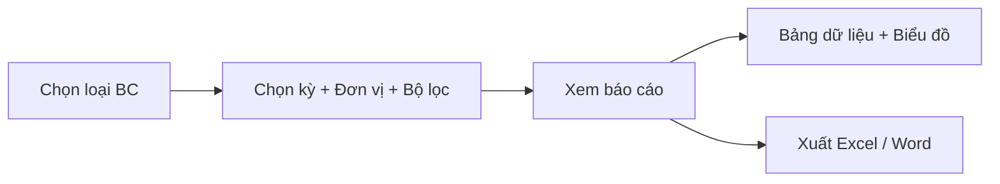

# SRS — Section 3.2.12: Báo cáo Thống kê

**Dự án:** Phần mềm hỗ trợ pháp lý doanh nghiệp
**Phiên bản SRS:** 3.0
**Nhóm:** IX — Báo cáo Thống kê
**UC range:** UC 120 – UC 142
**Số FR:** 23
**File chính:** `srs-v3.md` Section 3.2

---

## Mục lục file này

- [1. Tổng quan nhóm](#1-tổng-quan-nhóm)
- [2. Yêu cầu chức năng chi tiết](#2-yêu-cầu-chức-năng-chi-tiết)
- [3. Màn hình chức năng](#3-màn-hình-chức-năng)
- [4. Entity liên quan](#4-entity-liên-quan)
- [5. State Machine liên quan](#5-state-machine-liên-quan)
- [6. Business Rules liên quan](#6-business-rules-liên-quan)

---

## 1. Tổng quan nhóm

**Mục đích:** 23 loại báo cáo thống kê theo nhiều chiều phục vụ quản lý, điều hành hoạt động HTPLDN.

**Quy trình nghiệp vụ tổng quan:**



Tất cả 23 FR báo cáo kế thừa chung template TPL-REPORT-FULL (input, processing, output, error handling). Mỗi FR bổ sung phần đặc thù riêng (công thức, dimensions, output columns, bộ lọc riêng).

**Phân quyền xem dữ liệu:**

| Cấp | Phạm vi dữ liệu |
|-----|----------------|
| ĐP | Chỉ dữ liệu đơn vị ĐP |
| BN | Dữ liệu BN + ĐP thuộc quản lý |
| TW | Toàn quốc |

**Nguồn dữ liệu:** Đọc từ tất cả entity nghiệp vụ (HOI_DAP, VU_VIEC, KHOA_HOC, TU_VAN_VIEN, HO_SO_CHI_TRA, DOT_DANH_GIA, CHUONG_TRINH_HTPL...). CHỈ bản ghi đã duyệt.

**Tác nhân chính:** Cán bộ Nghiệp vụ (TW/BN/ĐP), Cán bộ Phê duyệt (TW/BN/ĐP)

---

## 2. Yêu cầu chức năng chi tiết

### TPL-REPORT-FULL — Template chung cho tất cả FR-IX

> Mỗi FR-IX-nn kế thừa toàn bộ template này và bổ sung phần **ĐẶC THÙ**. Khi đọc FR-IX-nn, cần đọc kết hợp với template.

**Preconditions chung:**
- User đã đăng nhập, có role CB Nghiệp vụ hoặc CB Phê duyệt (TW/BN/ĐP)
- Dữ liệu nghiệp vụ nguồn đã tồn tại (bản ghi đã duyệt)

**Input chung:**

| # | Tên field | Kiểu logic | Bắt buộc | Ràng buộc | Mặc định | Nguồn |
|---|----------|-----------|----------|-----------|----------|-------|
| 1 | ky_bao_cao | text | Y | TUAN / THANG / QUY / NAM / KHOANG | — | Chọn |
| 2 | tu_ngay | datetime | Y | <= den_ngay | — | Chọn / Auto |
| 3 | den_ngay | datetime | Y | >= tu_ngay | — | Chọn / Auto |
| 4 | don_vi_id | identifier | N | Auto phân quyền nếu không truyền | — | Chọn / Auto |
| 5 | format_xuat | text | Y | XLSX / DOCX | XLSX | Chọn |

**Processing chung:**

| Bước | Mô tả xử lý | BR áp dụng |
|------|-------------|-----------|
| 1 | Kiểm tra quyền truy cập báo cáo + phạm vi theo đơn vị | BR-AUTH-01 |
| 2 | Kiểm tra: ngày bắt đầu <= ngày kết thúc; khoảng thời gian <= 366 ngày (trừ kỳ Năm) | — |
| 3 | Áp dụng phạm vi dữ liệu: TW thấy toàn quốc, BN thấy BN + ĐP trực thuộc, ĐP chỉ thấy ĐP | BR-AUTH-08 |
| 4 | Truy vấn dữ liệu: CHỈ bản ghi đã duyệt (trạng thái đã duyệt / hoàn thành / đã thanh toán) | BR-RPT-01 |
| 5 | Tổng hợp theo dimensions đặc thù — xem phần ĐẶC THÙ từng FR | — |
| 6 | Định dạng kết quả: bảng dữ liệu + biểu đồ (nếu FR yêu cầu) | — |
| 7 | Nếu xuất Excel: tạo file .xlsx theo TT17/2025 | — |
| 8 | Nếu xuất Word: tạo file .docx theo TT17/2025 | — |
| 9 | Giới hạn tối đa 50.000 dòng xuất; nếu vượt thì cắt + cảnh báo | BR-DATA-06 |
| 10 | Ghi nhật ký thao tác (xem/xuất báo cáo) | BR-DATA-05 |

**Output chung:**

| # | Tên | Kiểu logic | Điều kiện | Format |
|---|-----|-----------|-----------|--------|
| 1 | ten_bao_cao | text | Luôn | Tên báo cáo |
| 2 | ky_bao_cao | text | Luôn | Kỳ đã chọn |
| 3 | tu_ngay / den_ngay | datetime | Luôn | Khoảng thời gian |
| 4 | don_vi_ten | text | Luôn | Tên đơn vị hoặc "Toàn quốc" |
| 5 | ngay_tao_bc | datetime | Luôn | Thời điểm tạo |
| 6 | nguoi_tao | text | Luôn | Người tạo |
| 7 | tong_ban_ghi | number | Luôn | Tổng số bản ghi |
| 8 | data[] | structured | Luôn | Mảng dữ liệu chi tiết |

**Postconditions chung:**
- Nhật ký ghi nhận hành động xem/xuất báo cáo (user, thời điểm, loại BC, bộ lọc)
- Không thay đổi dữ liệu nghiệp vụ (read-only)

**Error Handling chung:**

| # | Điều kiện lỗi | Mã lỗi | Phản hồi hệ thống | Severity |
|---|--------------|--------|-------------------|----------|
| E1 | tu_ngay > den_ngay | ERR-RPT-01 | "Ngày bắt đầu phải trước hoặc bằng ngày kết thúc" | ERROR |
| E2 | Khoảng thời gian > 366 ngày (trừ NAM) | ERR-RPT-02 | "Khoảng thời gian tối đa 1 năm. Sử dụng kỳ 'NAM' cho BC dài hơn" | ERROR |
| E3 | Không có dữ liệu | INF-RPT-01 | "Không có dữ liệu báo cáo cho kỳ và đơn vị đã chọn" | INFO |
| E4 | Export vượt 50.000 rows | WRN-RPT-01 | "Dữ liệu vượt 50.000 dòng. Hệ thống xuất 50.000 dòng đầu tiên" | WARNING |
| E5 | Timeout truy vấn > 30s | ERR-RPT-03 | "Truy vấn quá thời gian. Vui lòng thu hẹp khoảng thời gian hoặc bộ lọc" | ERROR |
| E6 | Lỗi xuất file | ERR-RPT-04 | "Không thể tạo file xuất. Vui lòng thử lại" | ERROR |
| E7 | Không có quyền | ERR-RPT-05 | "Bạn không có quyền xem báo cáo này" | ERROR |
| E8 | Format xuất không hợp lệ | ERR-RPT-06 | "Định dạng xuất chỉ hỗ trợ XLSX hoặc DOCX" | ERROR |
| E9 | Template báo cáo bị hỏng | ERR-RPT-07 | "Mẫu báo cáo không khả dụng. Vui lòng liên hệ QTHT" | ERROR |

**Acceptance Criteria chung:**
- **Given** CB đăng nhập có quyền BC **When** chọn loại BC + kỳ + đơn vị **Then** hiển thị bảng dữ liệu + biểu đồ trong phạm vi đơn vị
- **Given** CB nhấn "Xuất Excel" **When** click **Then** tải file .xlsx theo format TT17/2025
- **Given** CB nhấn "Xuất Word" **When** click **Then** tải file .docx theo format TT17/2025
- **Given** không có dữ liệu **When** tạo BC **Then** hiển thị "Không có dữ liệu"

---

### FR-IX-01: BC Số lượng hỏi đáp/vướng mắc (UC120)

**UC Reference:** UC 120
**Source:** Nhóm II
**Priority:** Essential
**Stability:** Medium
**Màn hình:** SCR-IX-01 — [Trang Báo cáo Thống kê](#scr-ix-01-trang-báo-cáo-thống-kê)

**Mô tả:**
Báo cáo tổng hợp số lượng hỏi đáp/vướng mắc PL, phân theo trạng thái, lĩnh vực, đơn vị, kỳ.

**Tác nhân:** CB Nghiệp vụ / CB Phê duyệt (TW/BN/ĐP)

**Template:** Kế thừa TPL-REPORT-FULL

**Input đặc thù (bổ sung):**

| # | Tên field | Kiểu logic | Bắt buộc | Ràng buộc | Mặc định | Nguồn |
|---|----------|-----------|----------|-----------|----------|-------|
| 1 | linh_vuc_id | identifier | N | FK → DANH_MUC | — | Chọn |
| 2 | trang_thai_hd | text | N | DA_TRA_LOI / CHO_TRA_LOI | — | Chọn |

**Công thức:** Đếm số hỏi đáp (đã trả lời / chờ trả lời) trong kỳ, theo phạm vi đơn vị

**Dimensions:** Kỳ BC, Đơn vị, Trạng thái (chờ/đã trả lời), Lĩnh vực PL

**Processing đặc thù (Bước 5):** Tổng hợp theo đơn vị, trạng thái, lĩnh vực, kỳ thời gian

**Output đặc thù:**

| # | Tên | Kiểu logic | Điều kiện | Format |
|---|-----|-----------|-----------|--------|
| 1 | tong_hoi_dap | number | Luôn | Tổng số hỏi đáp |
| 2 | da_tra_loi | number | Luôn | Số đã trả lời |
| 3 | cho_tra_loi | number | Luôn | Số chờ trả lời |
| 4 | ty_le_tra_loi | number | Luôn | % đã trả lời |
| 5 | theo_linh_vuc[] | structured | Luôn | {linh_vuc, ten, so_luong} |
| 6 | theo_don_vi[] | structured | Luôn | {don_vi, ten, so_luong} |
| 7 | theo_ky[] | structured | Luôn | {ky, so_luong} — trend |

**Error Handling đặc thù:**

| # | Điều kiện lỗi | Mã lỗi | Phản hồi hệ thống | Severity |
|---|--------------|--------|-------------------|----------|
| E1 | Lĩnh vực không tồn tại | ERR-RPT-IX01-01 | "Lĩnh vực PL không tồn tại" | ERROR |

**Acceptance Criteria (bổ sung):**
- **Given** CB chọn kỳ Quý + đơn vị **When** tạo BC **Then** hiển thị tổng HD, đã trả lời, chờ trả lời, phân theo lĩnh vực
- **Given** CB chọn lĩnh vực cụ thể **When** filter **Then** chỉ hiển thị HD thuộc lĩnh vực đó

---

### FR-IX-02: BC Vụ việc đã tiếp nhận (UC121)

**UC Reference:** UC 121
**Source:** Nhóm V.I
**Priority:** Essential
**Stability:** Medium
**Màn hình:** SCR-IX-01 — [Trang Báo cáo Thống kê](#scr-ix-01-trang-báo-cáo-thống-kê)

**Mô tả:**
Báo cáo tổng hợp vụ việc đã tiếp nhận, phân theo kênh tiếp nhận, lĩnh vực, đơn vị, kỳ.

**Tác nhân:** CB Nghiệp vụ / CB Phê duyệt (TW/BN/ĐP)

**Template:** Kế thừa TPL-REPORT-FULL

**Input đặc thù (bổ sung):**

| # | Tên field | Kiểu logic | Bắt buộc | Ràng buộc | Mặc định | Nguồn |
|---|----------|-----------|----------|-----------|----------|-------|
| 1 | kenh_tiep_nhan | text | N | DVC / HE_THONG_KHAC / TRUC_TIEP / BUU_CHINH / DIEN_THOAI | — | Chọn |
| 2 | linh_vuc_id | identifier | N | FK → DANH_MUC | — | Chọn |

**Công thức:** Đếm số vụ việc đã tiếp nhận (trừ từ chối) trong kỳ, theo phạm vi đơn vị

**Dimensions:** Kỳ, Đơn vị, Kênh tiếp nhận, Lĩnh vực PL

**Processing đặc thù (Bước 5):** Tổng hợp theo đơn vị, kênh tiếp nhận, lĩnh vực, kỳ thời gian

**Output đặc thù:**

| # | Tên | Kiểu logic | Điều kiện | Format |
|---|-----|-----------|-----------|--------|
| 1 | tong_vu_viec | number | Luôn | Tổng số VV tiếp nhận |
| 2 | theo_kenh[] | structured | Luôn | {kenh, so_luong} |
| 3 | theo_linh_vuc[] | structured | Luôn | {linh_vuc, ten, so_luong} |
| 4 | theo_don_vi[] | structured | Luôn | {don_vi, ten, so_luong} |
| 5 | theo_ky[] | structured | Luôn | {ky, so_luong} |

**Acceptance Criteria (bổ sung):**
- **Given** CB chọn kỳ Tháng **When** tạo BC **Then** hiển thị tổng VV tiếp nhận, phân theo kênh + lĩnh vực
- **Given** CB chọn kênh DVC **When** filter **Then** chỉ hiển thị VV tiếp nhận qua DVC

---

### FR-IX-03: BC Vụ việc đang hỗ trợ (UC122)

**UC Reference:** UC 122
**Source:** Nhóm V.I
**Priority:** Essential
**Stability:** Medium
**Màn hình:** SCR-IX-01 — [Trang Báo cáo Thống kê](#scr-ix-01-trang-báo-cáo-thống-kê)

**Mô tả:**
Báo cáo snapshot vụ việc đang xử lý tại thời điểm query, phân theo mức SLA, người hỗ trợ, đơn vị.

**Tác nhân:** CB Nghiệp vụ / CB Phê duyệt (TW/BN/ĐP)

**Template:** Kế thừa TPL-REPORT-FULL

**Input đặc thù (bổ sung):**

| # | Tên field | Kiểu logic | Bắt buộc | Ràng buộc | Mặc định | Nguồn |
|---|----------|-----------|----------|-----------|----------|-------|
| 1 | nht_id | identifier | N | FK → NGUOI_DUNG | — | Chọn |
| 2 | muc_sla | text | N | BINH_THUONG / SAP_HET_HAN / QUA_HAN / QUA_HAN_NGHIEM_TRONG | — | Chọn |

**Công thức:** Đếm số vụ việc đang xử lý (snapshot tại thời điểm query), theo phạm vi đơn vị

**Dimensions:** Đơn vị, NHT phân công, SLA (bình thường / sắp hết hạn / quá hạn / quá hạn nghiêm trọng)

**Processing đặc thù (Bước 5):** Tổng hợp theo đơn vị, người hỗ trợ, mức cảnh báo SLA. Tính mức SLA: tỷ lệ thời gian đã dùng so với deadline — dưới 50% bình thường, 50-100% sắp hết hạn, 100-200% quá hạn, trên 200% quá hạn nghiêm trọng (BR-SLA-02)

**Output đặc thù:**

| # | Tên | Kiểu logic | Điều kiện | Format |
|---|-----|-----------|-----------|--------|
| 1 | tong_dang_xu_ly | number | Luôn | Tổng VV đang xử lý |
| 2 | binh_thuong | number | Luôn | SLA bình thường |
| 3 | canh_bao | number | Luôn | SLA sắp hết hạn |
| 4 | qua_han | number | Luôn | SLA quá hạn |
| 5 | theo_nht[] | structured | Luôn | {nht_id, ho_ten, so_vv, qua_han} |
| 6 | theo_don_vi[] | structured | Luôn | {don_vi, ten, so_luong, qua_han} |

**Acceptance Criteria (bổ sung):**
- **Given** CB xem BC snapshot **When** tạo BC **Then** hiển thị tổng VV đang xử lý + phân theo SLA
- **Given** CB lọc "Quá hạn" **When** filter **Then** chỉ hiển thị VV quá deadline SLA

---

### FR-IX-04: BC Vụ việc đã hoàn thành (UC123)

**UC Reference:** UC 123
**Source:** Nhóm V.I
**Priority:** Essential
**Stability:** Medium
**Màn hình:** SCR-IX-01 — [Trang Báo cáo Thống kê](#scr-ix-01-trang-báo-cáo-thống-kê)

**Mô tả:**
Báo cáo vụ việc đã hoàn thành trong kỳ, phân theo lĩnh vực, kết quả (thành công/không), đơn vị.

**Tác nhân:** CB Nghiệp vụ / CB Phê duyệt (TW/BN/ĐP)

**Template:** Kế thừa TPL-REPORT-FULL

**Input đặc thù (bổ sung):**

| # | Tên field | Kiểu logic | Bắt buộc | Ràng buộc | Mặc định | Nguồn |
|---|----------|-----------|----------|-----------|----------|-------|
| 1 | linh_vuc_id | identifier | N | FK → DANH_MUC | — | Chọn |
| 2 | ket_qua | text | N | THANH_CONG / KHONG_THANH_CONG | — | Chọn |

**Công thức:** Đếm vụ việc hoàn thành trong kỳ, theo phạm vi đơn vị

**Dimensions:** Kỳ, Đơn vị, Lĩnh vực, Kết quả

**Output đặc thù:**

| # | Tên | Kiểu logic | Điều kiện | Format |
|---|-----|-----------|-----------|--------|
| 1 | tong_hoan_thanh | number | Luôn | Tổng VV hoàn thành |
| 2 | thanh_cong | number | Luôn | Số VV thành công |
| 3 | khong_thanh_cong | number | Luôn | Số VV không thành công |
| 4 | ty_le_thanh_cong | number | Luôn | % thành công |
| 5 | theo_linh_vuc[] | structured | Luôn | {linh_vuc, ten, so_luong, ty_le} |
| 6 | theo_don_vi[] | structured | Luôn | {don_vi, ten, so_luong} |
| 7 | theo_ky[] | structured | Luôn | {ky, so_luong} |

**Acceptance Criteria (bổ sung):**
- **Given** CB chọn kỳ Quý **When** tạo BC **Then** hiển thị tổng VV hoàn thành + tỷ lệ thành công
- **Given** CB chọn kết quả "Không thành công" **When** filter **Then** chỉ hiển thị VV không thành công

---

### FR-IX-05: BC Vụ việc theo thời gian (UC124)

**UC Reference:** UC 124
**Source:** Nhóm V.I
**Priority:** Essential
**Stability:** Medium
**Màn hình:** SCR-IX-01 — [Trang Báo cáo Thống kê](#scr-ix-01-trang-báo-cáo-thống-kê)

**Mô tả:**
Báo cáo trend vụ việc theo thời gian (tuần/tháng/quý/năm) dạng biểu đồ line chart + bảng chi tiết.

**Tác nhân:** CB Nghiệp vụ / CB Phê duyệt (TW/BN/ĐP)

**Template:** Kế thừa TPL-REPORT-FULL (không bổ sung input)

**Công thức:** Tổng hợp vụ việc theo kỳ thời gian — biểu đồ trend

**Dimensions:** Kỳ (tuần/tháng/quý/năm), Đơn vị

**Output đặc thù:**

| # | Tên | Kiểu logic | Điều kiện | Format |
|---|-----|-----------|-----------|--------|
| 1 | trend_data[] | structured | Luôn | {ky_label, tiep_nhan, hoan_thanh} |
| 2 | theo_don_vi[] | structured | Luôn | {don_vi, ten, trend_data[]} |
| 3 | chart_type | text | Luôn | LINE |

**Acceptance Criteria (bổ sung):**
- **Given** CB chọn kỳ Tháng, khoảng 6 tháng **When** tạo BC **Then** hiển thị biểu đồ trend 6 điểm + bảng chi tiết

---

### FR-IX-06: BC Lớp đào tạo đang diễn ra (UC125)

**UC Reference:** UC 125
**Source:** Nhóm III
**Priority:** Essential
**Stability:** Medium
**Màn hình:** SCR-IX-01 — [Trang Báo cáo Thống kê](#scr-ix-01-trang-báo-cáo-thống-kê)

**Mô tả:**
Báo cáo snapshot khóa học đang diễn ra, phân theo hình thức (trực tuyến/trực tiếp), lĩnh vực, đơn vị.

**Tác nhân:** CB Nghiệp vụ / CB Phê duyệt (TW/BN/ĐP)

**Template:** Kế thừa TPL-REPORT-FULL

**Input đặc thù (bổ sung):**

| # | Tên field | Kiểu logic | Bắt buộc | Ràng buộc | Mặc định | Nguồn |
|---|----------|-----------|----------|-----------|----------|-------|
| 1 | hinh_thuc | text | N | TRUC_TUYEN / TRUC_TIEP | — | Chọn |
| 2 | linh_vuc_id | identifier | N | FK → DANH_MUC | — | Chọn |

**Công thức:** Đếm khóa học đang diễn ra (snapshot), theo phạm vi đơn vị

**Dimensions:** Đơn vị, Hình thức, Lĩnh vực

**Output đặc thù:**

| # | Tên | Kiểu logic | Điều kiện | Format |
|---|-----|-----------|-----------|--------|
| 1 | tong_dang_dien_ra | number | Luôn | Tổng KH đang diễn ra |
| 2 | truc_tuyen | number | Luôn | Số KH trực tuyến |
| 3 | truc_tiep | number | Luôn | Số KH trực tiếp |
| 4 | theo_don_vi[] | structured | Luôn | {don_vi, ten, so_luong} |
| 5 | theo_linh_vuc[] | structured | Luôn | {linh_vuc, ten, so_luong} |
| 6 | ds_khoa_hoc[] | structured | Luôn | {ma_kh, ten_kh, hinh_thuc, ngay_bd, so_hv} |

**Acceptance Criteria (bổ sung):**
- **Given** CB tạo BC snapshot **When** hiển thị **Then** danh sách KH đang diễn ra + phân theo hình thức
- **Given** CB lọc "Trực tuyến" **When** filter **Then** chỉ hiển thị KH trực tuyến

---

### FR-IX-07: BC Lớp đào tạo đã diễn ra (UC126)

**UC Reference:** UC 126
**Source:** Nhóm III
**Priority:** Essential
**Stability:** Medium
**Màn hình:** SCR-IX-01 — [Trang Báo cáo Thống kê](#scr-ix-01-trang-báo-cáo-thống-kê)

**Mô tả:**
Báo cáo khóa học đã kết thúc trong kỳ, phân theo hình thức, đơn vị, kèm tổng số học viên.

**Tác nhân:** CB Nghiệp vụ / CB Phê duyệt (TW/BN/ĐP)

**Template:** Kế thừa TPL-REPORT-FULL

**Input đặc thù (bổ sung):**

| # | Tên field | Kiểu logic | Bắt buộc | Ràng buộc | Mặc định | Nguồn |
|---|----------|-----------|----------|-----------|----------|-------|
| 1 | hinh_thuc | text | N | TRUC_TUYEN / TRUC_TIEP | — | Chọn |

**Công thức:** Đếm khóa học đã kết thúc trong kỳ, tổng hợp số học viên

**Dimensions:** Kỳ, Đơn vị, Hình thức, Số học viên

**Output đặc thù:**

| # | Tên | Kiểu logic | Điều kiện | Format |
|---|-----|-----------|-----------|--------|
| 1 | tong_da_dien_ra | number | Luôn | Tổng KH đã diễn ra |
| 2 | tong_hoc_vien | number | Luôn | Tổng số học viên |
| 3 | theo_don_vi[] | structured | Luôn | {don_vi, ten, so_kh, so_hv} |
| 4 | theo_hinh_thuc[] | structured | Luôn | {hinh_thuc, so_kh, so_hv} |
| 5 | theo_ky[] | structured | Luôn | {ky, so_kh, so_hv} |

**Acceptance Criteria (bổ sung):**
- **Given** CB chọn kỳ Quý **When** tạo BC **Then** hiển thị tổng KH + tổng HV, phân theo đơn vị + hình thức

---

### FR-IX-08: BC Số lượng CG/TVV (UC127)

**UC Reference:** UC 127
**Source:** Nhóm IV
**Priority:** Essential
**Stability:** Medium
**Màn hình:** SCR-IX-01 — [Trang Báo cáo Thống kê](#scr-ix-01-trang-báo-cáo-thống-kê)

**Mô tả:**
Báo cáo snapshot số lượng chuyên gia/tư vấn viên/người hỗ trợ đang hoạt động, phân theo loại, lĩnh vực, địa bàn, đơn vị.

**Tác nhân:** CB Nghiệp vụ / CB Phê duyệt (TW/BN/ĐP)

**Template:** Kế thừa TPL-REPORT-FULL

**Input đặc thù (bổ sung):**

| # | Tên field | Kiểu logic | Bắt buộc | Ràng buộc | Mặc định | Nguồn |
|---|----------|-----------|----------|-----------|----------|-------|
| 1 | loai_tvv | text | N | TVV / CG / NHT | — | Chọn |
| 2 | linh_vuc_id | identifier | N | FK → DANH_MUC | — | Chọn |
| 3 | dia_ban_id | identifier | N | FK → DANH_MUC | — | Chọn |

**Công thức:** Đếm TVV/CG/NHT đang hoạt động (snapshot), theo phạm vi đơn vị

**Dimensions:** Đơn vị, Loại (TVV/CG/NHT), Lĩnh vực chuyên môn, Địa bàn

**Output đặc thù:**

| # | Tên | Kiểu logic | Điều kiện | Format |
|---|-----|-----------|-----------|--------|
| 1 | tong_tvv | number | Luôn | Tổng CG/TVV đang hoạt động |
| 2 | so_tvv | number | Luôn | Số TVV |
| 3 | so_cg | number | Luôn | Số CG |
| 4 | so_nht | number | Luôn | Số NHT |
| 5 | theo_don_vi[] | structured | Luôn | {don_vi, ten, tvv, cg, nht} |
| 6 | theo_linh_vuc[] | structured | Luôn | {linh_vuc, ten, so_luong} |
| 7 | theo_dia_ban[] | structured | Luôn | {dia_ban, ten, so_luong} |

**Acceptance Criteria (bổ sung):**
- **Given** CB tạo BC snapshot **When** hiển thị **Then** tổng TVV/CG/NHT phân theo đơn vị + lĩnh vực + địa bàn
- **Given** CB lọc loại CG **When** filter **Then** chỉ hiển thị Chuyên gia

---

### FR-IX-09: BC Đánh giá hiệu quả HTPL (UC128)

**UC Reference:** UC 128
**Source:** Nhóm VI
**Priority:** Essential
**Stability:** Medium
**Màn hình:** SCR-IX-01 — [Trang Báo cáo Thống kê](#scr-ix-01-trang-báo-cáo-thống-kê)

**Mô tả:**
Báo cáo điểm đánh giá hiệu quả HTPL trung bình có trọng số, phân theo đơn vị, đợt đánh giá, tiêu chí.

**Tác nhân:** CB Nghiệp vụ / CB Phê duyệt (TW/BN/ĐP)

**Template:** Kế thừa TPL-REPORT-FULL

**Input đặc thù (bổ sung):**

| # | Tên field | Kiểu logic | Bắt buộc | Ràng buộc | Mặc định | Nguồn |
|---|----------|-----------|----------|-----------|----------|-------|
| 1 | dot_danh_gia_id | identifier | N | FK → DOT_DANH_GIA | — | Chọn |

**Công thức:** Tính điểm đánh giá trung bình (có trọng số) theo đơn vị, đợt, trong kỳ

**Dimensions:** Kỳ, Đơn vị, Đợt đánh giá, Tiêu chí (trọng số)

**Output đặc thù:**

| # | Tên | Kiểu logic | Điều kiện | Format |
|---|-----|-----------|-----------|--------|
| 1 | diem_trung_binh | number | Luôn | Điểm TB tổng |
| 2 | so_vu_viec_danh_gia | number | Luôn | Tổng VV được đánh giá |
| 3 | theo_don_vi[] | structured | Luôn | {don_vi, ten, diem_tb, so_vv} |
| 4 | theo_tieu_chi[] | structured | Luôn | {tieu_chi, ten, trong_so, diem_tb} |
| 5 | theo_dot[] | structured | Luôn | {dot_id, ten_dot, diem_tb} |

**Acceptance Criteria (bổ sung):**
- **Given** CB chọn kỳ Năm **When** tạo BC **Then** hiển thị điểm TB, phân theo đơn vị + tiêu chí
- **Given** CB chọn đợt cụ thể **When** filter **Then** hiển thị chi tiết đợt đánh giá đó

---

### FR-IX-10: BC Chất lượng đào tạo (UC129)

**UC Reference:** UC 129
**Source:** Nhóm III
**Priority:** Essential
**Stability:** Medium
**Màn hình:** SCR-IX-01 — [Trang Báo cáo Thống kê](#scr-ix-01-trang-báo-cáo-thống-kê)

**Mô tả:**
Báo cáo chất lượng đào tạo: điểm TB kiểm tra, tỷ lệ đạt, phân theo khóa học, đơn vị.

**Tác nhân:** CB Nghiệp vụ / CB Phê duyệt (TW/BN/ĐP)

**Template:** Kế thừa TPL-REPORT-FULL

**Input đặc thù (bổ sung):**

| # | Tên field | Kiểu logic | Bắt buộc | Ràng buộc | Mặc định | Nguồn |
|---|----------|-----------|----------|-----------|----------|-------|
| 1 | khoa_hoc_id | identifier | N | FK → KHOA_HOC | — | Chọn |

**Công thức:** Tính điểm TB kiểm tra, tỷ lệ đạt (số đạt điểm chuẩn / tổng) theo khóa học, đơn vị trong kỳ

**Dimensions:** Kỳ, Đơn vị, Khóa học, Tỷ lệ đạt

**Output đặc thù:**

| # | Tên | Kiểu logic | Điều kiện | Format |
|---|-----|-----------|-----------|--------|
| 1 | diem_trung_binh | number | Luôn | Điểm TB kiểm tra |
| 2 | ty_le_dat | number | Luôn | % HV đạt |
| 3 | tong_hoc_vien | number | Luôn | Tổng HV tham gia |
| 4 | theo_khoa_hoc[] | structured | Luôn | {khoa_hoc, ten_kh, diem_tb, ty_le_dat, so_hv} |
| 5 | theo_don_vi[] | structured | Luôn | {don_vi, ten, diem_tb, ty_le_dat} |

**Acceptance Criteria (bổ sung):**
- **Given** CB chọn kỳ Quý **When** tạo BC **Then** hiển thị điểm TB + tỷ lệ đạt, phân theo KH + đơn vị
- **Given** CB chọn KH cụ thể **When** filter **Then** hiển thị chi tiết KH đó

---

### FR-IX-11: BC Vụ việc theo đơn vị quản lý (UC130)

**UC Reference:** UC 130
**Source:** Nhóm V.I
**Priority:** Essential
**Stability:** Medium
**Màn hình:** SCR-IX-01 — [Trang Báo cáo Thống kê](#scr-ix-01-trang-báo-cáo-thống-kê)

**Mô tả:**
Báo cáo cross-tab vụ việc theo đơn vị: hàng = đơn vị, cột = trạng thái (mới/tiếp nhận/đang hỗ trợ/hoàn thành).

**Tác nhân:** CB Nghiệp vụ / CB Phê duyệt (TW/BN/ĐP)

**Template:** Kế thừa TPL-REPORT-FULL (không bổ sung input)

**Công thức:** Đếm vụ việc theo đơn vị, trong kỳ, theo phạm vi. Dạng cross-tab trạng thái

**Dimensions:** Đơn vị (TW/BN/ĐP), Trạng thái

**Output đặc thù:**

| # | Tên | Kiểu logic | Điều kiện | Format |
|---|-----|-----------|-----------|--------|
| 1 | don_vi_id | identifier | Luôn | ID đơn vị |
| 2 | ten_don_vi | text | Luôn | Tên đơn vị |
| 3 | cap_don_vi | text | Luôn | TW / BN / DP |
| 4 | tong | number | Luôn | Tổng VV |
| 5 | moi | number | Luôn | Số VV mới |
| 6 | tiep_nhan | number | Luôn | Đã tiếp nhận |
| 7 | dang_ho_tro | number | Luôn | Đang hỗ trợ |
| 8 | hoan_thanh | number | Luôn | Hoàn thành |

**Acceptance Criteria (bổ sung):**
- **Given** CB TW tạo BC **When** hiển thị **Then** cross-tab: hàng = đơn vị, cột = trạng thái

---

### FR-IX-12: BC Vụ việc theo lĩnh vực (UC131)

**UC Reference:** UC 131
**Source:** Nhóm V.I
**Priority:** Essential
**Stability:** Medium
**Màn hình:** SCR-IX-01 — [Trang Báo cáo Thống kê](#scr-ix-01-trang-báo-cáo-thống-kê)

**Mô tả:**
Báo cáo cross-tab vụ việc theo lĩnh vực PL: hàng = lĩnh vực, cột = đơn vị.

**Tác nhân:** CB Nghiệp vụ / CB Phê duyệt (TW/BN/ĐP)

**Template:** Kế thừa TPL-REPORT-FULL (không bổ sung input)

**Công thức:** Đếm vụ việc theo lĩnh vực PL, trong kỳ, theo phạm vi. Dạng cross-tab đơn vị

**Dimensions:** Lĩnh vực PL, Đơn vị

**Output đặc thù:**

| # | Tên | Kiểu logic | Điều kiện | Format |
|---|-----|-----------|-----------|--------|
| 1 | linh_vuc_id | identifier | Luôn | ID lĩnh vực |
| 2 | ten_linh_vuc | text | Luôn | Tên lĩnh vực PL |
| 3 | tong | number | Luôn | Tổng VV |
| 4 | theo_don_vi[] | structured | Luôn | {don_vi, ten, so_luong} |

**Acceptance Criteria (bổ sung):**
- **Given** CB tạo BC **When** hiển thị **Then** cross-tab: hàng = lĩnh vực, cột = đơn vị

---

### FR-IX-13: BC Vụ việc theo loại hình DN (UC132)

**UC Reference:** UC 132
**Source:** Nhóm V.I
**Priority:** Essential
**Stability:** Medium
**Màn hình:** SCR-IX-01 — [Trang Báo cáo Thống kê](#scr-ix-01-trang-báo-cáo-thống-kê)

**Mô tả:**
Báo cáo cross-tab vụ việc theo loại doanh nghiệp (siêu nhỏ/nhỏ/vừa), phân theo đơn vị.

**Tác nhân:** CB Nghiệp vụ / CB Phê duyệt (TW/BN/ĐP)

**Template:** Kế thừa TPL-REPORT-FULL

**Input đặc thù (bổ sung):**

| # | Tên field | Kiểu logic | Bắt buộc | Ràng buộc | Mặc định | Nguồn |
|---|----------|-----------|----------|-----------|----------|-------|
| 1 | loai_dn | text | N | SIEU_NHO / NHO / VUA | — | Chọn |

**Công thức:** Đếm vụ việc theo loại DN, trong kỳ, theo phạm vi

**Dimensions:** Loại DN, Đơn vị

**Output đặc thù:**

| # | Tên | Kiểu logic | Điều kiện | Format |
|---|-----|-----------|-----------|--------|
| 1 | loai_dn | text | Luôn | Mã loại DN |
| 2 | ten_loai_dn | text | Luôn | Siêu nhỏ / Nhỏ / Vừa |
| 3 | tong | number | Luôn | Tổng VV |
| 4 | theo_don_vi[] | structured | Luôn | {don_vi, ten, so_luong} |

**Acceptance Criteria (bổ sung):**
- **Given** CB tạo BC **When** hiển thị **Then** cross-tab: hàng = loại DN, cột = đơn vị

---

### FR-IX-14: BC Vụ việc theo thời gian chi tiết (UC133)

**UC Reference:** UC 133
**Source:** Nhóm V.I
**Priority:** Essential
**Stability:** Medium
**Màn hình:** SCR-IX-01 — [Trang Báo cáo Thống kê](#scr-ix-01-trang-báo-cáo-thống-kê)

**Mô tả:**
Báo cáo trend vụ việc theo thời gian chi tiết, dạng stacked bar chart phân theo trạng thái.

**Tác nhân:** CB Nghiệp vụ / CB Phê duyệt (TW/BN/ĐP)

**Template:** Kế thừa TPL-REPORT-FULL (không bổ sung input)

**Công thức:** Đếm vụ việc theo kỳ thời gian + trạng thái. Biểu đồ stacked bar

**Dimensions:** Kỳ chi tiết, Trạng thái

**Output đặc thù:**

| # | Tên | Kiểu logic | Điều kiện | Format |
|---|-----|-----------|-----------|--------|
| 1 | chart_data[] | structured | Luôn | {ky_label, moi, tiep_nhan, dang_ho_tro, hoan_thanh} |
| 2 | chart_type | text | Luôn | STACKED_BAR |
| 3 | tong_theo_trang_thai | structured | Luôn | {moi, tiep_nhan, dang_ho_tro, hoan_thanh} |

**Acceptance Criteria (bổ sung):**
- **Given** CB chọn kỳ Tháng, 6 tháng **When** tạo BC **Then** hiển thị stacked bar 6 cột phân theo trạng thái

---

### FR-IX-15: BC Chi phí chi trả hỗ trợ (UC134)

**UC Reference:** UC 134
**Source:** Nhóm V.II
**Priority:** Essential
**Stability:** Medium
**Màn hình:** SCR-IX-01 — [Trang Báo cáo Thống kê](#scr-ix-01-trang-báo-cáo-thống-kê)

**Mô tả:**
Báo cáo tổng chi phí chi trả hỗ trợ đã thanh toán trong kỳ, phân theo đơn vị, kỳ.

**Tác nhân:** CB Nghiệp vụ / CB Phê duyệt (TW/BN/ĐP)

**Template:** Kế thừa TPL-REPORT-FULL (không bổ sung input)

**Công thức:** Tính tổng số tiền thực trả (hồ sơ đã thanh toán) trong kỳ, theo phạm vi đơn vị

**Dimensions:** Kỳ, Đơn vị, Tổng HS, Tổng chi phí, Trung bình/HS

**Output đặc thù:**

| # | Tên | Kiểu logic | Điều kiện | Format |
|---|-----|-----------|-----------|--------|
| 1 | tong_chi_phi | money | Luôn | Tổng chi phí (VND) |
| 2 | tong_ho_so | number | Luôn | Tổng số hồ sơ |
| 3 | trung_binh_ho_so | money | Luôn | Chi phí TB / hồ sơ |
| 4 | theo_don_vi[] | structured | Luôn | {don_vi, ten, tong_cp, so_hs} |
| 5 | theo_ky[] | structured | Luôn | {ky, tong_cp, so_hs} |

**Acceptance Criteria (bổ sung):**
- **Given** CB chọn kỳ Năm **When** tạo BC **Then** hiển thị tổng chi phí + tổng HS + TB/HS

---

### FR-IX-16: BC Chi phí theo đơn vị (UC135)

**UC Reference:** UC 135
**Source:** Nhóm V.II
**Priority:** Essential
**Stability:** Medium
**Màn hình:** SCR-IX-01 — [Trang Báo cáo Thống kê](#scr-ix-01-trang-báo-cáo-thống-kê)

**Mô tả:**
Báo cáo cross-tab chi phí theo đơn vị: hàng = đơn vị, cột = số HS + tổng CP + trung bình.

**Tác nhân:** CB Nghiệp vụ / CB Phê duyệt (TW/BN/ĐP)

**Template:** Kế thừa TPL-REPORT-FULL (không bổ sung input)

**Công thức:** Tính tổng chi phí theo đơn vị, trong kỳ

**Dimensions:** Đơn vị, Số HS, Tổng chi phí

**Output đặc thù:**

| # | Tên | Kiểu logic | Điều kiện | Format |
|---|-----|-----------|-----------|--------|
| 1 | don_vi_id | identifier | Luôn | ID đơn vị |
| 2 | ten_don_vi | text | Luôn | Tên đơn vị |
| 3 | tong_chi_phi | money | Luôn | Tổng chi phí |
| 4 | so_ho_so | number | Luôn | Số hồ sơ |
| 5 | trung_binh | money | Luôn | CP TB / HS |

**Acceptance Criteria (bổ sung):**
- **Given** CB TW tạo BC **When** hiển thị **Then** cross-tab: hàng = đơn vị, cột = số HS + tổng CP + TB

---

### FR-IX-17: BC Chi phí theo lĩnh vực (UC136)

**UC Reference:** UC 136
**Source:** Nhóm V.II
**Priority:** Essential
**Stability:** Medium
**Màn hình:** SCR-IX-01 — [Trang Báo cáo Thống kê](#scr-ix-01-trang-báo-cáo-thống-kê)

**Mô tả:**
Báo cáo chi phí theo lĩnh vực PL: hàng = lĩnh vực, cột = số HS + tổng CP.

**Tác nhân:** CB Nghiệp vụ / CB Phê duyệt (TW/BN/ĐP)

**Template:** Kế thừa TPL-REPORT-FULL

**Input đặc thù (bổ sung):**

| # | Tên field | Kiểu logic | Bắt buộc | Ràng buộc | Mặc định | Nguồn |
|---|----------|-----------|----------|-----------|----------|-------|
| 1 | linh_vuc_id | identifier | N | FK → DANH_MUC | — | Chọn |

**Công thức:** Tính tổng chi phí theo lĩnh vực PL, trong kỳ

**Dimensions:** Lĩnh vực PL, Số HS, Tổng chi phí

**Output đặc thù:**

| # | Tên | Kiểu logic | Điều kiện | Format |
|---|-----|-----------|-----------|--------|
| 1 | linh_vuc_id | identifier | Luôn | ID lĩnh vực |
| 2 | ten_linh_vuc | text | Luôn | Tên lĩnh vực PL |
| 3 | tong_chi_phi | money | Luôn | Tổng chi phí |
| 4 | so_ho_so | number | Luôn | Số hồ sơ |

**Acceptance Criteria (bổ sung):**
- **Given** CB tạo BC **When** hiển thị **Then** bảng: hàng = lĩnh vực, cột = số HS + tổng CP

---

### FR-IX-18: BC Chi phí theo loại hình DN (UC137)

**UC Reference:** UC 137
**Source:** Nhóm V.II
**Priority:** Essential
**Stability:** Medium
**Màn hình:** SCR-IX-01 — [Trang Báo cáo Thống kê](#scr-ix-01-trang-báo-cáo-thống-kê)

**Mô tả:**
Báo cáo chi phí theo loại DN (siêu nhỏ/nhỏ/vừa), kèm mức hỗ trợ và so sánh trần chi phí theo NĐ55.

**Tác nhân:** CB Nghiệp vụ / CB Phê duyệt (TW/BN/ĐP)

**Template:** Kế thừa TPL-REPORT-FULL

**Input đặc thù (bổ sung):**

| # | Tên field | Kiểu logic | Bắt buộc | Ràng buộc | Mặc định | Nguồn |
|---|----------|-----------|----------|-----------|----------|-------|
| 1 | loai_dn | text | N | SIEU_NHO / NHO / VUA | — | Chọn |

**Công thức:** Tính tổng chi phí theo loại DN + mức hỗ trợ, so sánh với trần chi phí theo NĐ55/2019

**Dimensions:** Loại DN, Mức hỗ trợ (100%/30%/10%), Số HS, Tổng chi phí, Trần so sánh

**Output đặc thù:**

| # | Tên | Kiểu logic | Điều kiện | Format |
|---|-----|-----------|-----------|--------|
| 1 | loai_dn | text | Luôn | Mã loại DN |
| 2 | ten_loai_dn | text | Luôn | Siêu nhỏ / Nhỏ / Vừa |
| 3 | muc_ho_tro | text | Luôn | 100% / 30% / 10% |
| 4 | so_ho_so | number | Luôn | Số hồ sơ |
| 5 | tong_chi_phi | money | Luôn | Tổng chi phí |
| 6 | tran_chi_phi | money | Luôn | Trần chi phí theo NĐ55 |
| 7 | chenh_lech | money | Luôn | Tổng CP - Trần |

**Acceptance Criteria (bổ sung):**
- **Given** CB tạo BC **When** hiển thị **Then** bảng phân theo loại DN + mức hỗ trợ + so sánh trần chi phí

---

### FR-IX-19: BC Chi phí theo thời gian (UC138)

**UC Reference:** UC 138
**Source:** Nhóm V.II
**Priority:** Essential
**Stability:** Medium
**Màn hình:** SCR-IX-01 — [Trang Báo cáo Thống kê](#scr-ix-01-trang-báo-cáo-thống-kê)

**Mô tả:**
Báo cáo trend chi phí theo thời gian dạng line chart.

**Tác nhân:** CB Nghiệp vụ / CB Phê duyệt (TW/BN/ĐP)

**Template:** Kế thừa TPL-REPORT-FULL (không bổ sung input)

**Công thức:** Tính tổng chi phí theo kỳ thời gian. Biểu đồ line chart

**Dimensions:** Kỳ, Trend

**Output đặc thù:**

| # | Tên | Kiểu logic | Điều kiện | Format |
|---|-----|-----------|-----------|--------|
| 1 | trend_data[] | structured | Luôn | {ky_label, tong_chi_phi, so_ho_so} |
| 2 | chart_type | text | Luôn | LINE |
| 3 | tong_chi_phi_ky | money | Luôn | Tổng CP toàn kỳ |

**Acceptance Criteria (bổ sung):**
- **Given** CB chọn 12 tháng **When** tạo BC **Then** hiển thị line chart 12 điểm trend chi phí

---

### FR-IX-20: BC Số lượng CT hỗ trợ (UC139)

**UC Reference:** UC 139
**Source:** Nhóm XI
**Priority:** Essential
**Stability:** Medium
**Màn hình:** SCR-IX-01 — [Trang Báo cáo Thống kê](#scr-ix-01-trang-báo-cáo-thống-kê)

**Mô tả:**
Báo cáo tổng số chương trình hỗ trợ, phân theo đơn vị, trạng thái (đang thực hiện/hoàn thành), kỳ.

**Tác nhân:** CB Nghiệp vụ / CB Phê duyệt (TW/BN/ĐP)

**Template:** Kế thừa TPL-REPORT-FULL

**Input đặc thù (bổ sung):**

| # | Tên field | Kiểu logic | Bắt buộc | Ràng buộc | Mặc định | Nguồn |
|---|----------|-----------|----------|-----------|----------|-------|
| 1 | trang_thai_ct | text | N | DANG_THUC_HIEN / HOAN_THANH | — | Chọn |

**Công thức:** Đếm CT HTPL đang thực hiện / hoàn thành, theo phạm vi đơn vị

**Dimensions:** Đơn vị, Trạng thái CT, Kỳ

**Output đặc thù:**

| # | Tên | Kiểu logic | Điều kiện | Format |
|---|-----|-----------|-----------|--------|
| 1 | tong_ct | number | Luôn | Tổng số CT |
| 2 | dang_thuc_hien | number | Luôn | CT đang thực hiện |
| 3 | hoan_thanh | number | Luôn | CT hoàn thành |
| 4 | theo_don_vi[] | structured | Luôn | {don_vi, ten, so_ct, dang_thuc_hien, hoan_thanh} |
| 5 | theo_ky[] | structured | Luôn | {ky, so_ct} |

**Acceptance Criteria (bổ sung):**
- **Given** CB tạo BC **When** hiển thị **Then** tổng CT phân theo đơn vị + trạng thái

---

### FR-IX-21: BC CT theo đơn vị (UC140)

**UC Reference:** UC 140
**Source:** Nhóm XI
**Priority:** Essential
**Stability:** Medium
**Màn hình:** SCR-IX-01 — [Trang Báo cáo Thống kê](#scr-ix-01-trang-báo-cáo-thống-kê)

**Mô tả:**
Báo cáo cross-tab chương trình theo đơn vị: hàng = đơn vị, cột = số CT + ngân sách.

**Tác nhân:** CB Nghiệp vụ / CB Phê duyệt (TW/BN/ĐP)

**Template:** Kế thừa TPL-REPORT-FULL (không bổ sung input)

**Công thức:** Đếm CT + tính tổng ngân sách theo đơn vị, trong kỳ

**Dimensions:** Đơn vị (TW/BN/ĐP), Số CT, Ngân sách tổng

**Output đặc thù:**

| # | Tên | Kiểu logic | Điều kiện | Format |
|---|-----|-----------|-----------|--------|
| 1 | don_vi_id | identifier | Luôn | ID đơn vị |
| 2 | ten_don_vi | text | Luôn | Tên đơn vị |
| 3 | cap_don_vi | text | Luôn | TW / BN / DP |
| 4 | so_ct | number | Luôn | Số CT |
| 5 | tong_ngan_sach | money | Luôn | Tổng ngân sách |

**Acceptance Criteria (bổ sung):**
- **Given** CB TW tạo BC **When** hiển thị **Then** cross-tab: hàng = đơn vị, cột = số CT + ngân sách

---

### FR-IX-22: BC CT theo lĩnh vực (UC141)

**UC Reference:** UC 141
**Source:** Nhóm XI
**Priority:** Essential
**Stability:** Medium
**Màn hình:** SCR-IX-01 — [Trang Báo cáo Thống kê](#scr-ix-01-trang-báo-cáo-thống-kê)

**Mô tả:**
Báo cáo chương trình theo lĩnh vực: hàng = lĩnh vực, cột = số CT + số DN tham gia.

**Tác nhân:** CB Nghiệp vụ / CB Phê duyệt (TW/BN/ĐP)

**Template:** Kế thừa TPL-REPORT-FULL

**Input đặc thù (bổ sung):**

| # | Tên field | Kiểu logic | Bắt buộc | Ràng buộc | Mặc định | Nguồn |
|---|----------|-----------|----------|-----------|----------|-------|
| 1 | linh_vuc_id | identifier | N | FK → DANH_MUC | — | Chọn |

**Công thức:** Đếm CT + đếm DN tham gia theo lĩnh vực, trong kỳ

**Dimensions:** Lĩnh vực, Số CT, Số DN tham gia

**Output đặc thù:**

| # | Tên | Kiểu logic | Điều kiện | Format |
|---|-----|-----------|-----------|--------|
| 1 | linh_vuc_id | identifier | Luôn | ID lĩnh vực |
| 2 | ten_linh_vuc | text | Luôn | Tên lĩnh vực |
| 3 | so_ct | number | Luôn | Số CT |
| 4 | so_dn_tham_gia | number | Luôn | Số DN tham gia |

**Acceptance Criteria (bổ sung):**
- **Given** CB tạo BC **When** hiển thị **Then** bảng: hàng = lĩnh vực, cột = số CT + số DN

---

### FR-IX-23: BC CT theo thời gian (UC142)

**UC Reference:** UC 142
**Source:** Nhóm XI
**Priority:** Essential
**Stability:** Medium
**Màn hình:** SCR-IX-01 — [Trang Báo cáo Thống kê](#scr-ix-01-trang-báo-cáo-thống-kê)

**Mô tả:**
Báo cáo trend chương trình theo thời gian dạng line chart.

**Tác nhân:** CB Nghiệp vụ / CB Phê duyệt (TW/BN/ĐP)

**Template:** Kế thừa TPL-REPORT-FULL (không bổ sung input)

**Công thức:** Đếm CT theo kỳ thời gian. Biểu đồ line chart

**Dimensions:** Kỳ, Trend

**Output đặc thù:**

| # | Tên | Kiểu logic | Điều kiện | Format |
|---|-----|-----------|-----------|--------|
| 1 | trend_data[] | structured | Luôn | {ky_label, so_ct, so_dn} |
| 2 | chart_type | text | Luôn | LINE |
| 3 | tong_ct | number | Luôn | Tổng CT toàn kỳ |

**Acceptance Criteria (bổ sung):**
- **Given** CB chọn 12 tháng **When** tạo BC **Then** hiển thị biểu đồ trend số CT theo thời gian

---

---

## 3. Màn hình chức năng

### SCR-IX-01: Trang Báo cáo Thống kê

**Loại màn hình:** Dashboard (Unified Report Page)
**FR sử dụng:** FR-IX-01 ~ FR-IX-23
**UX-Spec ref:** dac-ta-man-hinh-chuc-nang-v2.md — MH-11.1

#### Layout tổng quan

Một trang báo cáo thống nhất cho tất cả 23 loại BC. Dropdown chọn loại BC phía trên, bộ lọc chung + bộ lọc đặc thù ở giữa, vùng kết quả (biểu đồ + bảng dữ liệu) phía dưới.

#### Thành phần màn hình

| # | Vùng | Thành phần | Loại | Dữ liệu / Nội dung | Hành vi | Điều kiện hiển thị |
|---|------|-----------|------|--------------------| --------|-------------------|
| 1 | toolbar | Breadcrumb | breadcrumb | "Trang chủ > Báo cáo thống kê" | — | Luôn hiển thị |
| 2 | toolbar | Tiêu đề trang | label | "Báo cáo Thống kê" + Nút Làm mới | — | Luôn hiển thị |
| 3 | filter-bar | Dropdown loại BC | select (searchable, grouped) | 23 loại BC phân nhóm theo optgroup. Mỗi option: "[Mã UC] Tên BC" | change → load bộ lọc đặc thù | Luôn hiển thị |
| 4 | filter-bar | Bộ lọc kỳ BC | select + date-picker | Tuần / Tháng / Quý / Năm / Khoảng tùy chọn. Validate: tu_ngay <= den_ngay; khoảng <= 366 ngày (trừ Năm) | change → auto tính ngày | Luôn hiển thị |
| 5 | filter-bar | Dropdown đơn vị | select | Auto theo phân quyền theo đơn vị. TW: "Toàn quốc" + tất cả. BN: BN + ĐP trực thuộc. ĐP: locked | change → filter | Luôn hiển thị |
| 6 | filter-bar | Bộ lọc đặc thù | select/text-input (dynamic) | Tùy loại BC: lĩnh vực PL, trạng thái, kênh tiếp nhận, loại TVV, đợt ĐG, khóa học, loại DN... | change → filter | Khi loại BC cần lọc đặc thù |
| 7 | action-bar | Nút Xem báo cáo | button (primary) | "Xem báo cáo" → chạy query | click → load data | Luôn hiển thị |
| 8 | action-bar | Nút Xuất Excel | button | "Xuất Excel (.xlsx)" → xuất theo format TT17/2025 | click → auto-download | Sau khi đã "Xem báo cáo" |
| 9 | action-bar | Nút Xuất Word | button | "Xuất Word (.docx)" → xuất theo mẫu TT17/2025 | click → auto-download | Sau khi đã "Xem báo cáo" |
| 10 | content | Biểu đồ | chart | Tùy loại BC: Line (trend) / Bar / Stacked bar / Donut / Radar. Toggle hiện/ẩn | toggle → show/hide | Khi có dữ liệu |
| 11 | content | Bảng dữ liệu | table | Nhóm theo chiều phân tích tùy loại BC. Cột sắp xếp. Sticky header. Hàng tổng cộng (bold) | sort → reorder | Khi có dữ liệu |
| 12 | content | Skeleton loading | loading | Hiện khi đang query | — | Khi đang query |
| 13 | content | Empty state | empty | "Không có dữ liệu báo cáo cho kỳ và đơn vị đã chọn" | — | Khi không có dữ liệu |
| 14 | content | Toast xuất file | toast | "Đang tạo file..." → "Xuất thành công" + auto-download | — | Khi nhấn xuất |

#### Mapping 23 loại BC trong Dropdown

| Optgroup | UC | Tên hiển thị | Bộ lọc đặc thù | Biểu đồ |
|----------|-----|-------------|----------------|---------|
| **Hỏi đáp** | UC120 | BC Số lượng hỏi đáp/vướng mắc | Lĩnh vực PL, Trạng thái HD | Donut + Trend |
| **Vụ việc** | UC121 | BC Vụ việc đã tiếp nhận | Kênh tiếp nhận, Lĩnh vực PL | Bar + Trend |
| | UC122 | BC Vụ việc đang hỗ trợ | NHT phụ trách, Mức SLA | Bar (snapshot) |
| | UC123 | BC Vụ việc đã hoàn thành | Lĩnh vực PL, Kết quả | Bar + Donut |
| | UC124 | BC Vụ việc theo thời gian | — | Line chart trend |
| **Đào tạo** | UC125 | BC Lớp đào tạo đang diễn ra | Hình thức, Lĩnh vực | Bar (snapshot) |
| | UC126 | BC Lớp đào tạo đã diễn ra | Hình thức | Bar + Trend |
| **CG/TVV** | UC127 | BC Số lượng CG/TVV | Loại TVV, Lĩnh vực CM, Địa bàn | Donut + Bar |
| **Đánh giá** | UC128 | BC Đánh giá hiệu quả HTPL | Đợt đánh giá | Bar + Radar |
| | UC129 | BC Chất lượng đào tạo | Khóa học cụ thể | Bar + Line |
| **VV theo chiều phân tích** | UC130 | BC Vụ việc theo đơn vị quản lý | — | Stacked bar |
| | UC131 | BC Vụ việc theo lĩnh vực | — | Grouped bar |
| | UC132 | BC Vụ việc theo loại hình DN | Loại DN | Grouped bar |
| | UC133 | BC Vụ việc theo thời gian chi tiết | — | Stacked bar trend |
| **Chi phí** | UC134 | BC Chi phí chi trả hỗ trợ | — | Bar + Summary |
| | UC135 | BC Chi phí theo đơn vị | — | Bar cross-tab |
| | UC136 | BC Chi phí theo lĩnh vực | Lĩnh vực PL | Bar |
| | UC137 | BC Chi phí theo loại hình DN | Loại DN | Grouped bar |
| | UC138 | BC Chi phí theo thời gian | — | Line chart trend |
| **CT HTPLDN** | UC139 | BC Số lượng CT hỗ trợ | Trạng thái CT | Bar + Trend |
| | UC140 | BC CT theo đơn vị | — | Bar cross-tab |
| | UC141 | BC CT theo lĩnh vực | Lĩnh vực | Bar |
| | UC142 | BC CT theo thời gian | — | Line chart trend |

#### Quy tắc tương tác

- Khi user chọn loại BC, bộ lọc đặc thù tự render lại theo mapping
- Bảng cuộn ngang trên màn hình 1024-1279px
- Export XLSX/DOCX chèn tiêu đề BC + thông tin kỳ + đơn vị + ngày tạo vào header file
- Biểu đồ có nút toggle "Hiện/Ẩn" để tối ưu không gian cho bảng lớn
- Max 50.000 rows xuất; nếu vượt: cảnh báo + xuất 50.000 dòng đầu
- Timeout 30s: hiển thị thông báo quá thời gian

---

## 4. Entity liên quan

> **Source of truth:** `srs-v3.md` Section 3.4.
> Đây là bản trích entities liên quan đến Nhóm IX — Báo cáo Thống kê. Khi thay đổi entity, cập nhật ở `srs-v3.md` trước, sau đó sync sang file này.

### Tổng quan entity

| # | Entity | Vai trò | Mô tả |
|---|--------|---------|-------|
| 1 | BAO_CAO | owned | Metadata cho 23 loại báo cáo thống kê |
| 2 | HOI_DAP | referenced | Hỏi đáp/Vướng mắc PL (nguồn dữ liệu BC nhóm II) |
| 3 | VU_VIEC | referenced | Vụ việc HTPL (nguồn dữ liệu BC nhóm V.I) |
| 4 | TU_VAN_VIEN | referenced | Tư vấn viên (nguồn dữ liệu BC nhóm IV) |
| 5 | DOANH_NGHIEP | referenced | Doanh nghiệp (nguồn dữ liệu BC nhóm V.III) |
| 6 | KHOA_HOC | referenced | Khóa đào tạo (nguồn dữ liệu BC nhóm III) |
| 7 | HO_SO_CHI_TRA | referenced | Hồ sơ chi trả (nguồn dữ liệu BC nhóm V.II) |
| 8 | TAI_KHOAN | referenced | Tài khoản người dùng (created_by, nguoi_tao_id) |
| 9 | DON_VI | referenced | Cơ quan/đơn vị sở hữu (phân quyền theo đơn vị) |

### ERD nhóm (subset)

```mermaid
erDiagram
    BAO_CAO {
        identifier id PK
        text ma_bao_cao
        text loai_bao_cao
        text tieu_de
        text ky_bao_cao
        datetime tu_ngay
        datetime den_ngay
        text bo_loc
        text du_lieu_ket_qua
        text duong_dan_file
        text trang_thai
        identifier nguoi_tao_id FK
        identifier don_vi_id FK
    }
    TAI_KHOAN {
        identifier id PK
        text username
        text ho_ten
    }
    DON_VI {
        identifier id PK
        text ma_don_vi
        text ten_don_vi
        text cap
    }
    HOI_DAP {
        identifier id PK
        text ma_hoi_dap
        text trang_thai
    }
    VU_VIEC {
        identifier id PK
        text ma_vu_viec
        text trang_thai
    }
    TU_VAN_VIEN {
        identifier id PK
        text ma_tvv
        text ho_ten
    }
    DOANH_NGHIEP {
        identifier id PK
        text ten_doanh_nghiep
        text ma_so_thue
    }
    KHOA_HOC {
        identifier id PK
        text ma_khoa_hoc
        text trang_thai
    }
    HO_SO_CHI_TRA {
        identifier id PK
        text ma_ho_so
        text trang_thai
    }

    BAO_CAO }o--|| TAI_KHOAN : "tạo bởi"
    BAO_CAO }o--|| DON_VI : "thuộc đơn vị"
    BAO_CAO ..o{ HOI_DAP : "truy vấn dữ liệu"
    BAO_CAO ..o{ VU_VIEC : "truy vấn dữ liệu"
    BAO_CAO ..o{ TU_VAN_VIEN : "truy vấn dữ liệu"
    BAO_CAO ..o{ DOANH_NGHIEP : "truy vấn dữ liệu"
    BAO_CAO ..o{ KHOA_HOC : "truy vấn dữ liệu"
    BAO_CAO ..o{ HO_SO_CHI_TRA : "truy vấn dữ liệu"
```

### 3.4.3.43 BAO_CAO (owned)

**Mô tả:** Metadata cho 23 loại báo cáo thống kê (Nhóm IX). Lưu cấu hình, kỳ, bộ lọc, kết quả.
**Module:** Nhóm IX — Báo cáo thống kê

| # | Tên | Kiểu logic | Bắt buộc | Ràng buộc nghiệp vụ | Mặc định | Mô tả |
|---|-----|-----------|----------|-----------|----------|-------|
| 1 | id | identifier | Y | PK, SEQ | — | Khóa chính |
| 2 | ma_bao_cao | text | Y | UNIQUE | Auto-gen | Mã báo cáo |
| 3 | loai_bao_cao | text | Y | | — | Loại BC (BC_HOI_DAP, BC_VU_VIEC...) |
| 4 | tieu_de | text | Y | | — | Tiêu đề |
| 5 | ky_bao_cao | text | Y | CHECK IN ('TUAN','THANG','QUY','NAM','KHOANG') | — | Kỳ |
| 6 | tu_ngay | datetime | Y | | — | Từ ngày |
| 7 | den_ngay | datetime | Y | | — | Đến ngày |
| 8 | bo_loc | text (long) | N | | — | Bộ lọc (JSON) |
| 9 | du_lieu_ket_qua | text (long) | N | | — | Kết quả (JSON) |
| 10 | duong_dan_file | text | N | | — | File xuất (Excel/Word) |
| 11 | trang_thai | text | Y | CHECK IN ('DANG_TAO','HOAN_THANH','LOI') | 'DANG_TAO' | Trạng thái |
| 12 | nguoi_tao_id | identifier | Y | FK → TAI_KHOAN(id) | — | Người tạo BC |
| 13 | don_vi_id | identifier | Y | FK → DON_VI(id) | — | Đơn vị sở hữu theo đơn vị |
| 14 | created_at | datetime | Y | DEFAULT NOW() | NOW() | Ngày tạo |
| 15 | updated_at | datetime | Y | DEFAULT NOW() | NOW() | Ngày cập nhật |
| 16 | created_by | identifier | N | FK → TAI_KHOAN(id) | — | Người tạo |
| 17 | updated_by | identifier | N | FK → TAI_KHOAN(id) | — | Người cập nhật |
| 18 | is_deleted | boolean | Y | | 0 | Soft delete flag |

**Volume:** ~5,000 records/năm | **Growth:** 15%/năm

---

## 5. State Machine liên quan

> **Source of truth:** `srs-v3.md` Phụ lục C.

Nhóm này không có state machine riêng. BAO_CAO sử dụng 3 trạng thái đơn giản (DANG_TAO → HOAN_THANH | LOI) không cần state machine diagram. Báo cáo chỉ đọc dữ liệu từ các entity khác (HOI_DAP, VU_VIEC, KHOA_HOC, v.v.) mà không thay đổi trạng thái của chúng.

---

## 6. Business Rules liên quan

> **Source of truth:** `srs-v3.md` Phụ lục B.
> Đây là bản trích BR liên quan đến Nhóm IX. Khi thay đổi BR, cập nhật ở `srs-v3.md` trước, sau đó sync sang file này.

### Tổng quan BR sử dụng

| BR ID | Tên | FR áp dụng (nhóm này) |
|-------|-----|----------------------|
| BR-AUTH-01 | Xác thực trước truy cập | Toàn bộ FR-IX |
| BR-AUTH-08 | chính sách phân quyền dữ liệu | Toàn bộ FR-IX |
| BR-DATA-05 | Audit trail | Toàn bộ FR-IX |
| BR-DATA-06 | Export Excel (max 10,000 rows) | Toàn bộ FR-IX |
| BR-SLA-02 | 4 mức cảnh báo SLA | FR-IX (BC vụ việc, BC SLA) |

### BR-AUTH-01: Xác thực trước truy cập

| ID | Phát biểu quy tắc | Nguồn | Áp dụng FR (nhóm này) | Ngoại lệ | Kiểm chứng |
|----|-------------------|-------|----------------------|---------|------------|
| BR-AUTH-01 | Mọi user phải xác thực trước khi truy cập hệ thống | PRD A6, FR-VIII-20, NĐ69/2024 | Toàn bộ FR-IX | API outbound không yêu cầu session | Test đăng nhập |

### BR-AUTH-08: chính sách phân quyền dữ liệu

| ID | Phát biểu quy tắc | Nguồn | Áp dụng FR (nhóm này) | Ngoại lệ | Kiểm chứng |
|----|-------------------|-------|----------------------|---------|------------|
| BR-AUTH-08 | chính sách phân quyền áp dụng cho MỌI bảng có cột `don_vi_id`. TW thấy toàn quốc, BN thấy BN, ĐP thấy ĐP | Architecture AD-07 | Toàn bộ FR-IX | QTHT bypass | Verify phân quyền |

### BR-DATA-05: Audit trail

| ID | Phát biểu quy tắc | Nguồn | Áp dụng FR (nhóm này) | Ngoại lệ | Kiểm chứng |
|----|-------------------|-------|----------------------|---------|------------|
| BR-DATA-05 | Mọi thao tác CUD + xem/xuất báo cáo đều ghi vào AUDIT_LOG | NFR-06 | Toàn bộ FR-IX | — | Verify INSERT-only |

### BR-DATA-06: Export Excel

| ID | Phát biểu quy tắc | Nguồn | Áp dụng FR (nhóm này) | Ngoại lệ | Kiểm chứng |
|----|-------------------|-------|----------------------|---------|------------|
| BR-DATA-06 | Mọi danh sách có tính năng xuất Excel. File xuất theo bộ lọc hiện tại, không vượt quá 10,000 rows/file | Pattern IP-01 | Toàn bộ FR-IX | Báo cáo nhóm IX có xuất Word | Test export limit |

### BR-SLA-02: 4 mức cảnh báo SLA

| ID | Phát biểu quy tắc | Nguồn | Áp dụng FR (nhóm này) | Ngoại lệ | Kiểm chứng |
|----|-------------------|-------|----------------------|---------|------------|
| BR-SLA-02 | 4 mức: Bình thường (>50%), Sắp hết hạn (<50%, vàng), Quá hạn (>100%, đỏ), Quá hạn nghiêm trọng (>2x, đen) | PRD FR-VIII-10, Reference A.4 | FR-IX (BC vụ việc, BC SLA) | — | Test 4 mức trên dữ liệu mock |

---

**--- Hết file FR Group: IX — Báo cáo Thống kê ---**
