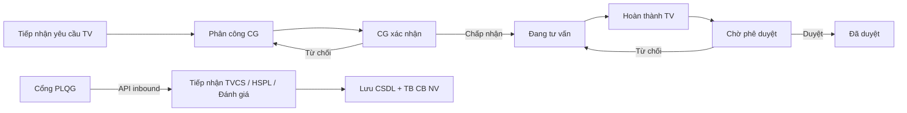
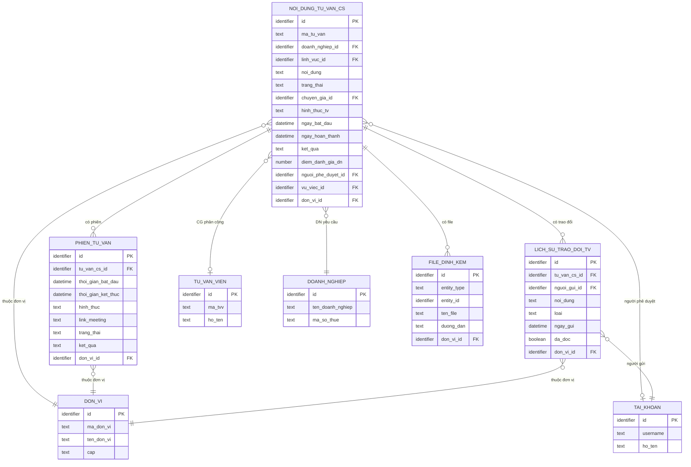
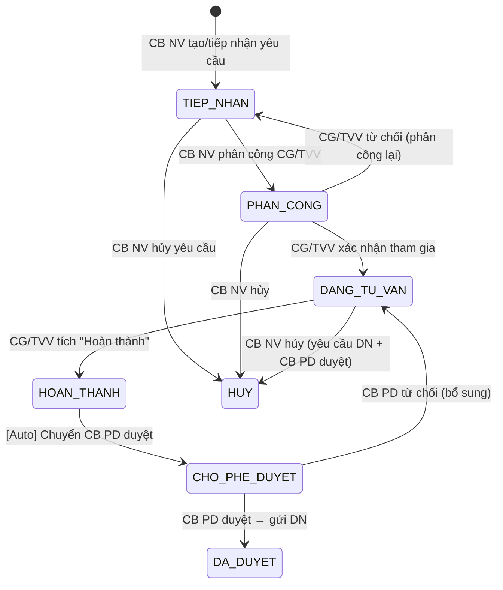

# SRS — Section 3.2.15: Quản lý Nội dung Tư vấn Chuyên sâu

**Dự án:** Phần mềm hỗ trợ pháp lý doanh nghiệp
**Phiên bản SRS:** 3.0
**Nhóm:** X.1 — Quản lý Nội dung Tư vấn Chuyên sâu
**UC range:** UC 147 – UC 153
**Số FR:** 7
**File chính:** `srs-v3.md` Section 3.2

---

## Mục lục file này

- [1. Tổng quan nhóm](#1-tổng-quan-nhóm)
- [2. Yêu cầu chức năng chi tiết](#2-yêu-cầu-chức-năng-chi-tiết)
- [3. Màn hình chức năng](#3-màn-hình-chức-năng)
- [4. Entity liên quan](#4-entity-liên-quan)
- [5. State Machine liên quan](#5-state-machine-liên-quan)
- [6. Business Rules liên quan](#6-business-rules-liên-quan)

---

## 1. Tổng quan nhóm

**Mục đích:** Quản lý nội dung tư vấn chuyên sâu: ghi nhận/tra cứu nội dung tư vấn với chuyên gia, quản lý hồ sơ pháp lý doanh nghiệp, quản lý tư liệu pháp lý của vụ việc, và tiếp nhận dữ liệu đánh giá chất lượng từ Cổng PLQG.

**Đặc thù:**
- 4 UC loại B (CMS browser) + 3 UC loại M (API inbound từ Cổng PLQG)
- UC loại M: Cổng PLQG gửi dữ liệu -> PM tiếp nhận, validate, lưu CSDL
- Phân quyền đa đơn vị áp dụng cho tất cả UC loại B (BR-AUTH-08)
- Tư liệu pháp lý là đối tượng quản lý riêng, phục vụ công khai lên Cổng

**Tác nhân chính:** Cán bộ Nghiệp vụ (TW/BN/ĐP), Người hỗ trợ, Cổng Pháp luật quốc gia (API inbound)

**UC Coverage:**

| UC | Tên | FR-ID | Priority | Loại |
|----|-----|-------|----------|------|
| UC147 | Quản lý nội dung tư vấn với chuyên gia | FR-X.1-01 | Must | B |
| UC148 | Tìm kiếm nội dung tư vấn với chuyên gia | FR-X.1-02 | Must | B |
| UC149 | Tiếp nhận nội dung tư vấn với chuyên gia | FR-X.1-03 | Must | M (API inbound) |
| UC150 | Quản lý hồ sơ pháp lý doanh nghiệp | FR-X.1-04 | Must | B |
| UC151 | Tiếp nhận hồ sơ pháp lý doanh nghiệp | FR-X.1-05 | Must | M (API inbound) |
| UC152 | Quản lý tư liệu pháp lý của vụ việc | FR-X.1-06 | Must | B |
| UC153 | Tiếp nhận đánh giá chất lượng tư vấn với chuyên gia | FR-X.1-07 | Must | M (API inbound) |

**Quy trình nghiệp vụ tổng quan:**



**Entity Relationship:**

```
NOI_DUNG_TU_VAN_CS --1:N--> TU_LIEU_PHAP_LY_VV
NOI_DUNG_TU_VAN_CS --N:1--> DOANH_NGHIEP
NOI_DUNG_TU_VAN_CS --N:1--> TU_VAN_VIEN (chuyên gia)
NOI_DUNG_TU_VAN_CS --1:N--> DANH_GIA_CHAT_LUONG_TV
HO_SO_PHAP_LY_DN --N:1--> DOANH_NGHIEP
TU_LIEU_PHAP_LY_VV --N:1--> NOI_DUNG_TU_VAN_CS
```

---

## 2. Yêu cầu chức năng chi tiết

---

### FR-X.1-01: Quản lý nội dung tư vấn với chuyên gia (UC147)

**UC Reference:** UC 147
**Source:** CĐT xác nhận
**Priority:** Essential
**Stability:** Medium
**Màn hình:** SCR-X1-01 — [Danh sách TVCS](#scr-x1-01-danh-sách-tư-vấn-chuyên-sâu), SCR-X1-02 — [Chi tiết TVCS](#scr-x1-02-thêm-mới--chi-tiết-tư-vấn-chuyên-sâu) (v2.1: gộp phân công/xác nhận/phê duyệt thành action buttons trong MH-12.2)

**Mô tả:**
Quản lý toàn bộ vòng đời nội dung tư vấn chuyên sâu: ghi nhận, xem danh sách, xem chi tiết, cập nhật, cập nhật trạng thái xử lý, và xem tổng hợp dashboard.

**Tác nhân:** Cán bộ Nghiệp vụ (TW/BN/ĐP)

**Preconditions (Điều kiện tiên quyết):**

- User đã đăng nhập (BR-AUTH-01)
- User có quyền truy cập chức năng "Quản lý nội dung tư vấn chuyên sâu" (UC115)
- User thuộc đơn vị có quyền (phân quyền theo đơn vị -- BR-AUTH-08)

**Inputs (Dữ liệu đầu vào):**

| # | Tên field | Kiểu logic | Bắt buộc | Ràng buộc | Mặc định | Nguồn |
|---|----------|-----------|----------|-----------|----------|-------|
| 1 | ma_noi_dung | text | Y (auto) | Format: TVCS-{YYYYMMDD}-{SEQ} | auto-gen | hệ thống |
| 2 | doanh_nghiep_id | identifier | Y | FK -> DOANH_NGHIEP, phải tồn tại | — | người dùng chọn |
| 3 | chuyen_gia_id | identifier | Y | FK -> TU_VAN_VIEN, phải đang hoạt động | — | người dùng chọn |
| 4 | linh_vuc_id | identifier | Y | FK -> DANH_MUC, phải tồn tại | — | người dùng chọn |
| 5 | noi_dung_tu_van | text (long) | Y | Không rỗng, max 50KB | — | người dùng nhập |
| 6 | tom_tat | text | N | Max 500 ký tự | — | người dùng nhập |
| 7 | trang_thai_xu_ly | text | Y | CHO_XU_LY / DANG_XU_LY / DA_XU_LY / DONG | CHO_XU_LY | hệ thống |
| 8 | ngay_tu_van | date | Y | — | — | người dùng chọn |
| 9 | ghi_chu | text (long) | N | Max 2000 ký tự | — | người dùng nhập |

**Processing (Xử lý):**

**Xem danh sách:**

| Bước | Mô tả xử lý | BR áp dụng |
|------|-------------|-----------|
| 1 | Kiểm tra quyền và phạm vi đơn vị | BR-AUTH-01, BR-AUTH-08 |
| 2 | Truy vấn danh sách nội dung tư vấn chuyên sâu chưa xóa, thuộc đơn vị | BR-DATA-01 |
| 3 | Phân trang (mặc định 20/trang) | BR-DATA-07 |

**Ghi nhận hoặc cập nhật nội dung:**

| Bước | Mô tả xử lý | BR áp dụng |
|------|-------------|-----------|
| 1 | Kiểm tra quyền và phạm vi đơn vị | BR-AUTH-01, BR-AUTH-08 |
| 2 | Xác nhận dữ liệu: nội dung không rỗng, chuyên gia hợp lệ, lĩnh vực hợp lệ | — |
| 3 | Sinh mã tự động TVCS-{YYYYMMDD}-{SEQ} (nếu thêm mới) | BR-DATA-04 |
| 4 | Tạo mới hoặc cập nhật bản ghi nội dung tư vấn chuyên sâu | BR-DATA-03 |
| 5 | Ghi nhật ký thao tác | BR-DATA-05 |

**Xem chi tiết:**

| Bước | Mô tả xử lý | BR áp dụng |
|------|-------------|-----------|
| 1 | Kiểm tra quyền và phạm vi đơn vị | BR-AUTH-01, BR-AUTH-08 |
| 2 | Truy vấn thông tin chi tiết nội dung TV kèm thông tin DN, chuyên gia, lĩnh vực | — |
| 3 | Truy vấn tư liệu pháp lý liên quan | — |
| 4 | Truy vấn đánh giá chất lượng liên quan | — |

**Cập nhật trạng thái xử lý:**

| Bước | Mô tả xử lý | BR áp dụng |
|------|-------------|-----------|
| 1 | Kiểm tra quyền và phạm vi đơn vị | BR-AUTH-01, BR-AUTH-08 |
| 2 | Kiểm tra chuyển trạng thái hợp lệ: CHO_XU_LY -> DANG_XU_LY -> DA_XU_LY -> DONG | — |
| 3 | Cập nhật trạng thái xử lý | — |
| 4 | Ghi nhật ký thao tác | BR-DATA-05 |

**Xem tổng hợp (dashboard):**

| Bước | Mô tả xử lý | BR áp dụng |
|------|-------------|-----------|
| 1 | Kiểm tra quyền và phạm vi đơn vị | BR-AUTH-01, BR-AUTH-08 |
| 2 | Thống kê: đếm theo trạng thái, theo lĩnh vực, theo chuyên gia | — |
| 3 | Tính tổng số, trung bình thời gian xử lý, phân bổ theo lĩnh vực | — |
| 4 | Trả về dashboard tổng hợp | — |

**Business Rules áp dụng:**
- **BR-AUTH-01**: Xác thực người dùng -> Xem Phụ lục B (file chính)
- **BR-AUTH-08**: Multi-tenant phân quyền theo đơn vị -> Xem Phụ lục B (file chính)
- **BR-DATA-01**: Soft delete -> Xem Phụ lục B (file chính)
- **BR-DATA-03**: Tạo/cập nhật bản ghi -> Xem Phụ lục B (file chính)
- **BR-DATA-04**: Sinh mã tự động -> Xem Phụ lục B (file chính)
- **BR-DATA-05**: Ghi nhật ký thao tác -> Xem Phụ lục B (file chính)
- **BR-DATA-07**: Phân trang -> Xem Phụ lục B (file chính)

**Outputs (Dữ liệu đầu ra):**

| # | Tên | Kiểu logic | Điều kiện | Format |
|---|-----|-----------|-----------|--------|
| 1 | id | identifier | luôn | — |
| 2 | ma_noi_dung | text | luôn | TVCS-{date}-{seq} |
| 3 | ten_doanh_nghiep | text | luôn | — |
| 4 | ten_chuyen_gia | text | luôn | — |
| 5 | ten_linh_vuc | text | luôn | — |
| 6 | tom_tat | text | luôn | — |
| 7 | trang_thai_xu_ly | text | luôn | — |
| 8 | ngay_tu_van | date | luôn | dd/mm/yyyy |
| 9 | ngay_tao | datetime | luôn | dd/mm/yyyy HH:mm |
| 10 | total_count | number | danh sách | — |

**Postconditions (Trạng thái sau thực hiện):**

- Nội dung tư vấn được ghi nhận/cập nhật trong CSDL
- phân quyền dữ liệu theo đơn vị (chỉ xem dữ liệu đơn vị mình)
- AUDIT_LOG ghi nhận mọi thao tác CUD

**Error Handling (Xử lý lỗi):**

| # | Điều kiện lỗi | Mã lỗi | Phản hồi hệ thống | Severity |
|---|--------------|--------|-------------------|----------|
| E1 | Nội dung tư vấn trống | ERR-TVCS-01 | "Nội dung tư vấn là bắt buộc" | ERROR |
| E2 | Chuyên gia không tồn tại hoặc không hoạt động | ERR-TVCS-02 | "Chuyên gia không hợp lệ hoặc đã ngừng hoạt động" | ERROR |
| E3 | Lĩnh vực không tồn tại | ERR-TVCS-03 | "Lĩnh vực PL không tồn tại" | ERROR |
| E4 | Chuyển trạng thái không hợp lệ | ERR-TVCS-04 | "Không thể chuyển trạng thái từ '{current}' sang '{target}'" | ERROR |
| E5 | Mã nội dung trùng | ERR-TVCS-05 | "Mã nội dung '{ma}' đã tồn tại" | ERROR |

**Acceptance Criteria:**

- **Given** CB NV truy cập "Nội dung tư vấn chuyên sâu" **When** hệ thống hiển thị **Then** danh sách nội dung tư vấn thuộc đơn vị, phân trang
- **Given** CB NV ghi nhận nội dung tư vấn **When** nhập DN, chuyên gia, lĩnh vực, nội dung + nhấn Lưu **Then** validate và lưu bản ghi mới
- **Given** CB NV cập nhật nội dung **When** sửa thông tin + nhấn Lưu **Then** cập nhật bản ghi
- **Given** CB NV cập nhật trạng thái xử lý **When** chọn trạng thái mới **Then** validate transition + cập nhật
- **Given** CB NV xem tổng hợp **When** truy cập dashboard **Then** hiển thị thống kê tổng hợp theo lĩnh vực, chuyên gia, trạng thái
- **Given** CB NV xem chi tiết **When** chọn bản ghi **Then** hiển thị toàn bộ thông tin + tư liệu + đánh giá liên quan

---

### FR-X.1-02: Tìm kiếm nội dung tư vấn với chuyên gia (UC148)

**UC Reference:** UC 148
**Source:** CĐT xác nhận
**Priority:** Essential
**Stability:** Medium
**Màn hình:** SCR-X1-01 — [Danh sách TVCS](#scr-x1-01-danh-sách-tư-vấn-chuyên-sâu)

**Mô tả:**
Tìm kiếm nội dung tư vấn chuyên sâu theo nhiều tiêu chí: từ khóa, khoảng thời gian, chuyên gia, lĩnh vực, trạng thái.

**Tác nhân:** Cán bộ Nghiệp vụ (TW/BN/ĐP), Người hỗ trợ

**Preconditions (Điều kiện tiên quyết):**

- User đã đăng nhập (BR-AUTH-01)
- User có quyền truy cập chức năng "Quản lý nội dung tư vấn chuyên sâu"

**Inputs (Dữ liệu đầu vào):**

| # | Tên field | Kiểu logic | Bắt buộc | Ràng buộc | Mặc định | Nguồn |
|---|----------|-----------|----------|-----------|----------|-------|
| 1 | tu_khoa | text | N | Tìm theo mã nội dung, tên DN, nội dung tư vấn | — | người dùng nhập |
| 2 | tu_ngay | date | N | — | — | người dùng chọn |
| 3 | den_ngay | date | N | >= tu_ngay | — | người dùng chọn |
| 4 | chuyen_gia_id | identifier | N | FK -> TU_VAN_VIEN | — | người dùng chọn |
| 5 | linh_vuc_id | identifier | N | FK -> DANH_MUC | — | người dùng chọn |
| 6 | trang_thai_xu_ly | text | N | CHO_XU_LY / DANG_XU_LY / DA_XU_LY / DONG | — | người dùng chọn |
| 7 | page | number | N | >= 1 | 1 | hệ thống |
| 8 | page_size | number | N | 1-100 | 20 | hệ thống |

**Processing (Xử lý):**

| Bước | Mô tả xử lý | BR áp dụng |
|------|-------------|-----------|
| 1 | Kiểm tra quyền và phạm vi đơn vị | BR-AUTH-01, BR-AUTH-08 |
| 2 | Lọc bản ghi chưa xóa | BR-DATA-01 |
| 3 | Nếu có từ khóa: tìm kiếm toàn văn trên nội dung tư vấn, hoặc tìm gần đúng trên mã nội dung, tên DN | BR-DATA-08 |
| 4 | Nếu có khoảng ngày: lọc theo ngày tư vấn trong khoảng | — |
| 5 | Nếu có chuyên gia: lọc theo chuyên gia | — |
| 6 | Nếu có lĩnh vực: lọc theo lĩnh vực | — |
| 7 | Nếu có trạng thái: lọc theo trạng thái xử lý | — |
| 8 | Áp dụng AND logic cho tất cả điều kiện | — |
| 9 | Phân trang và trả về kết quả | BR-DATA-07 |

**Business Rules áp dụng:**
- **BR-AUTH-08**: Multi-tenant phân quyền theo đơn vị -> Xem Phụ lục B (file chính)
- **BR-DATA-08**: Tìm kiếm toàn văn -> Xem Phụ lục B (file chính)

**Outputs (Dữ liệu đầu ra):**

| # | Tên | Kiểu logic | Điều kiện | Format |
|---|-----|-----------|-----------|--------|
| 1 | id | identifier | luôn | — |
| 2 | ma_noi_dung | text | luôn | TVCS-{date}-{seq} |
| 3 | ten_doanh_nghiep | text | luôn | — |
| 4 | ten_chuyen_gia | text | luôn | — |
| 5 | ten_linh_vuc | text | luôn | — |
| 6 | tom_tat | text | luôn | 200 ký tự đầu |
| 7 | trang_thai_xu_ly | text | luôn | — |
| 8 | ngay_tu_van | date | luôn | dd/mm/yyyy |
| 9 | total_count | number | luôn | — |

**Postconditions (Trạng thái sau thực hiện):**

- Read-only, không thay đổi dữ liệu

**Error Handling (Xử lý lỗi):**

| # | Điều kiện lỗi | Mã lỗi | Phản hồi hệ thống | Severity |
|---|--------------|--------|-------------------|----------|
| E1 | tu_ngay > den_ngay | ERR-TVCS-TK-01 | "Ngày bắt đầu phải trước ngày kết thúc" | ERROR |
| E2 | Không có kết quả | INF-TVCS-TK-01 | "Không tìm thấy nội dung tư vấn phù hợp" | INFO |

**Acceptance Criteria:**

- **Given** CB NV nhập từ khóa **When** tìm kiếm **Then** kết quả matching trong phạm vi đơn vị
- **Given** CB NV lọc theo thời gian **When** chọn khoảng ngày **Then** kết quả trong khoảng thời gian
- **Given** CB NV lọc theo chuyên gia **When** chọn chuyên gia **Then** kết quả chỉ của chuyên gia đó
- **Given** CB NV kết hợp nhiều điều kiện **When** tìm kiếm **Then** áp dụng AND logic tất cả điều kiện

---

### FR-X.1-03: Tiếp nhận nội dung tư vấn với chuyên gia (UC149)

**UC Reference:** UC 149
**Source:** CĐT xác nhận
**Priority:** Essential
**Stability:** Medium
**Màn hình:** Không có màn hình CMS (API inbound từ Cổng PLQG)

**Mô tả:**
Tiếp nhận nội dung tư vấn chuyên sâu từ Cổng Pháp luật quốc gia qua API inbound (kết nối REST trực tiếp, HTTPS TLS 1.2+). Hệ thống validate, tạo hồ sơ, và thông báo CB NV.

**Tác nhân:** Cổng Pháp luật quốc gia (API inbound)

**Preconditions (Điều kiện tiên quyết):**

- Cổng PLQG đã đăng ký API key hợp lệ (kết nối REST trực tiếp, HTTPS TLS 1.2+)
- API endpoint hoạt động, rate limit chưa vượt ngưỡng

**Inputs (Dữ liệu đầu vào):**

| # | Tên field | Kiểu logic | Bắt buộc | Ràng buộc | Mặc định | Nguồn |
|---|----------|-----------|----------|-----------|----------|-------|
| 1 | ma_noi_dung_cong | text | Y | Mã trên Cổng PLQG, dùng check trùng + đối chiếu | — | Cổng PLQG |
| 2 | noi_dung_tu_van | text (long) | Y | Max 50KB | — | Cổng PLQG |
| 3 | thong_tin_dn | structured | Y | {ten, ma_so_thue, dia_chi, nguoi_dai_dien, sdt, email}. ma_so_thue: 10-13 chữ số | — | Cổng PLQG |
| 4 | linh_vuc_id | identifier | N | FK -> DANH_MUC nếu có | — | Cổng PLQG |
| 5 | chuyen_gia_info | structured | N | {ho_ten, chuyen_mon, ma_chuyen_gia} | — | Cổng PLQG |
| 6 | tai_lieu_dinh_kem | structured | N | Mảng [{ten_file, loai_file, dung_luong, noi_dung_base64}]. Max 10 files, mỗi file max 20MB, tổng max 100MB | — | Cổng PLQG |

**Processing (Xử lý):**

**Bước 1 -- Kiểm tra định dạng, cấu trúc:**

| Bước | Mô tả xử lý | BR áp dụng |
|------|-------------|-----------|
| 1 | Xác thực request: kiểm tra API key + kết nối bảo mật | BR-AUTH-01 |
| 2 | Kiểm tra cấu trúc dữ liệu: trường bắt buộc (nội dung TV, thông tin DN, mã nội dung Cổng) | — |
| 3 | Kiểm tra format: mã số thuế (10-13 chữ số), email hợp lệ, nội dung max 50KB | — |

**Bước 2 -- Kiểm tra đầy đủ, hợp lệ:**

| Bước | Mô tả xử lý | BR áp dụng |
|------|-------------|-----------|
| 4 | Kiểm tra thông tin DN: tên và mã số thuế bắt buộc; lĩnh vực nếu có phải hợp lệ | — |
| 5 | Kiểm tra trùng: đã tồn tại nội dung với cùng mã Cổng chưa | — |
| 6 | Kiểm tra tài liệu đính kèm: max 10 files, mỗi file max 20MB, tổng max 100MB | EC-FILE-01 |

**Bước 3 -- Tạo hồ sơ tư vấn chuyên sâu:**

| Bước | Mô tả xử lý | BR áp dụng |
|------|-------------|-----------|
| 7 | Tạo hoặc liên kết doanh nghiệp theo mã số thuế (upsert) | BR-DATA-03 |
| 8 | Liên kết chuyên gia nếu có thông tin (match theo mã chuyên gia) | — |
| 9 | Sinh mã tự động TVCS-{YYYYMMDD}-{SEQ} | BR-DATA-04 |
| 10 | Tạo bản ghi nội dung tư vấn chuyên sâu, trạng thái = CHO_XU_LY, nguồn = CONG_PLQG | BR-DATA-03 |
| 11 | Lưu file đính kèm (nếu có): giải mã, quét virus, lưu trữ | EC-FILE-01 |
| 12 | Ghi nhật ký thao tác | BR-DATA-05 |

**Bước 4 -- Phản hồi kết quả:**

| Bước | Mô tả xử lý | BR áp dụng |
|------|-------------|-----------|
| 13 | Gửi thông báo CB NV phụ trách (in-app + email) | BR-NOTIF-01 |
| 14 | Trả phản hồi: kết quả (thành công/thất bại), mã nội dung, ngày tiếp nhận | — |

**Outputs (Dữ liệu đầu ra):**

| # | Tên | Kiểu logic | Điều kiện | Format |
|---|-----|-----------|-----------|--------|
| 1 | ket_qua | text | luôn | THANH_CONG / THAT_BAI |
| 2 | ma_noi_dung | text | thành công | TVCS-{date}-{seq} |
| 3 | ma_noi_dung_cong | text | luôn | echo back |
| 4 | ngay_tiep_nhan | datetime | luôn | ISO 8601 |
| 5 | chi_tiet_loi | text | thất bại | — |

**Postconditions (Trạng thái sau thực hiện):**

- Bản ghi NOI_DUNG_TU_VAN_CS mới với trạng thái CHO_XU_LY
- DOANH_NGHIEP liên kết (upsert theo mã số thuế)
- AUDIT_LOG ghi nhận
- Thông báo gửi CB NV

**Error Handling (Xử lý lỗi):**

| # | Điều kiện lỗi | Mã lỗi | Phản hồi hệ thống | Severity |
|---|--------------|--------|-------------------|----------|
| E1 | API key không hợp lệ | ERR-TVCS-API-01 | HTTP 401 "Unauthorized" | ERROR |
| E2 | Cấu trúc dữ liệu không hợp lệ | ERR-TVCS-API-02 | "Dữ liệu không hợp lệ: {chi_tiet_loi}" | ERROR |
| E3 | Nội dung trùng (mã Cổng) | ERR-TVCS-API-03 | "Nội dung '{mã}' đã tồn tại (mã: {ma_noi_dung})" | ERROR |
| E4 | File đính kèm vượt 20MB | ERR-FILE-SIZE-01 | "Tệp '{ten_file}' vượt quá 20MB" | ERROR |
| E5 | File chứa mã độc | ERR-FILE-02 | "Tệp '{ten_file}' chứa mã độc, không thể tiếp nhận" | ERROR |
| E6 | Rate limit vượt ngưỡng | ERR-TVCS-API-04 | HTTP 429 + header Retry-After | WARNING |
| E7 | Lĩnh vực PL không hợp lệ | ERR-TVCS-API-05 | "Lĩnh vực pháp lý không hợp lệ hoặc đã ngừng hoạt động" | ERROR |

**Acceptance Criteria:**

- **Given** Cổng PLQG gửi nội dung tư vấn qua API **When** dữ liệu hợp lệ **Then** HT tạo hồ sơ tư vấn + trả mã hồ sơ
- **Given** Cổng gửi kèm thông tin DN, lĩnh vực, tài liệu **When** HT kiểm tra **Then** validate đầy đủ + hợp lệ trước khi lưu
- **Given** Cổng gửi nội dung trùng (mã Cổng) **When** kiểm tra **Then** trả lỗi ERR-TVCS-API-03
- **Given** Cổng nhận phản hồi **When** xử lý hoàn tất **Then** nhận kết quả (thành công/thất bại) kèm mã hồ sơ

---

### FR-X.1-04: Quản lý hồ sơ pháp lý doanh nghiệp (UC150)

**UC Reference:** UC 150
**Source:** CĐT xác nhận
**Priority:** Essential
**Stability:** Medium
**Màn hình:** ~~SCR-X1-03~~ (DEPRECATED v2.1 — chuyển sang tab trong MH-07.2 chi tiết DN)

**Mô tả:**
CRUD hồ sơ pháp lý doanh nghiệp: xem danh sách, xem chi tiết, thêm mới, chỉnh sửa, xóa mềm, tìm kiếm.

**Tác nhân:** Cán bộ Nghiệp vụ (TW/BN/ĐP), Người hỗ trợ

**Preconditions (Điều kiện tiên quyết):**

- User đã đăng nhập (BR-AUTH-01)
- User có quyền truy cập chức năng "Quản lý hồ sơ pháp lý DN"
- User thuộc đơn vị có quyền (phân quyền theo đơn vị -- BR-AUTH-08)

**Inputs (Dữ liệu đầu vào) -- Thêm mới / Chỉnh sửa:**

| # | Tên field | Kiểu logic | Bắt buộc | Ràng buộc | Mặc định | Nguồn |
|---|----------|-----------|----------|-----------|----------|-------|
| 1 | ma_ho_so | text | Y (auto) | Format: HSPL-{YYYYMMDD}-{SEQ} | auto-gen | hệ thống |
| 2 | doanh_nghiep_id | identifier | Y | FK -> DOANH_NGHIEP | — | người dùng chọn |
| 3 | ten_ho_so | text | Y | Tối đa 500 ký tự | — | người dùng nhập |
| 4 | loai_ho_so | text | Y | GIAY_PHEP / HOP_DONG / GIAY_CN / QUYET_DINH / KHAC | — | người dùng chọn |
| 5 | linh_vuc_id | identifier | N | FK -> DANH_MUC | — | người dùng chọn |
| 6 | ngay_cap | date | N | — | — | người dùng chọn |
| 7 | ngay_het_han | date | N | — | — | người dùng chọn |
| 8 | co_quan_cap | text | N | — | — | người dùng nhập |
| 9 | mo_ta | text (long) | N | — | — | người dùng nhập |
| 10 | trang_thai | text | Y | HIEU_LUC / HET_HAN / THU_HOI | HIEU_LUC | người dùng chọn |
| 11 | file_dinh_kem | file | N | PDF/image, max 20MB | — | người dùng upload |

**Inputs -- Tìm kiếm:**

| # | Tên field | Kiểu logic | Bắt buộc | Ràng buộc | Mặc định | Nguồn |
|---|----------|-----------|----------|-----------|----------|-------|
| 1 | keyword | text | N | Tìm theo mã HS, tên DN, tên HS | — | người dùng nhập |
| 2 | loai_ho_so | text | N | GIAY_PHEP / HOP_DONG / GIAY_CN / QUYET_DINH / KHAC | — | người dùng chọn |
| 3 | doanh_nghiep_id | identifier | N | — | — | người dùng chọn |
| 4 | tu_ngay / den_ngay | date | N | tu_ngay <= den_ngay | — | người dùng chọn |
| 5 | trang_thai | text | N | HIEU_LUC / HET_HAN / THU_HOI | — | người dùng chọn |

**Processing (Xử lý):**

**Xem danh sách:**

| Bước | Mô tả xử lý | BR áp dụng |
|------|-------------|-----------|
| 1 | Kiểm tra quyền và phạm vi đơn vị | BR-AUTH-01, BR-AUTH-08 |
| 2 | Truy vấn hồ sơ pháp lý DN chưa xóa, thuộc đơn vị | BR-DATA-01 |
| 3 | Phân trang (mặc định 20/trang) | BR-DATA-07 |

**Thêm mới:**

| Bước | Mô tả xử lý | BR áp dụng |
|------|-------------|-----------|
| 1 | Kiểm tra quyền và phạm vi đơn vị | BR-AUTH-01, BR-AUTH-08 |
| 2 | Xác nhận: tên hồ sơ không rỗng, DN hợp lệ, loại hồ sơ hợp lệ | — |
| 3 | Sinh mã tự động HSPL-{YYYYMMDD}-{SEQ} | BR-DATA-04 |
| 4 | Tạo bản ghi hồ sơ pháp lý DN | BR-DATA-03 |
| 5 | Upload file nếu có (max 20MB, quét virus) | EC-FILE-01 |
| 6 | Ghi nhật ký thao tác | BR-DATA-05 |

**Chỉnh sửa:**

| Bước | Mô tả xử lý | BR áp dụng |
|------|-------------|-----------|
| 1 | Kiểm tra quyền và phạm vi đơn vị | BR-AUTH-01, BR-AUTH-08 |
| 2 | Xác nhận dữ liệu cập nhật | — |
| 3 | Cập nhật bản ghi hồ sơ | — |
| 4 | Ghi nhật ký thao tác | BR-DATA-05 |

**Xóa:**

| Bước | Mô tả xử lý | BR áp dụng |
|------|-------------|-----------|
| 1 | Kiểm tra quyền và phạm vi đơn vị | BR-AUTH-01, BR-AUTH-08 |
| 2 | Hiển thị xác nhận: "Bạn có chắc chắn muốn xóa hồ sơ '{tên}'?" | — |
| 3 | Xóa mềm bản ghi | BR-DATA-01 |
| 4 | Ghi nhật ký thao tác | BR-DATA-05 |

**Tìm kiếm:**

| Bước | Mô tả xử lý | BR áp dụng |
|------|-------------|-----------|
| 1 | Kiểm tra quyền và phạm vi đơn vị | BR-AUTH-01, BR-AUTH-08 |
| 2 | Áp dụng tất cả bộ lọc: từ khóa, loại hồ sơ, DN, khoảng ngày, trạng thái | — |
| 3 | AND logic cho tất cả điều kiện | — |
| 4 | Phân trang và trả về | BR-DATA-07 |

**Outputs (Dữ liệu đầu ra):**

| # | Tên | Kiểu logic | Điều kiện | Format |
|---|-----|-----------|-----------|--------|
| 1 | id | identifier | luôn | — |
| 2 | ma_ho_so | text | luôn | HSPL-{date}-{seq} |
| 3 | ten_ho_so | text | luôn | — |
| 4 | ten_doanh_nghiep | text | luôn | — |
| 5 | loai_ho_so | text | luôn | — |
| 6 | ngay_cap | date | luôn | dd/mm/yyyy |
| 7 | ngay_het_han | date | luôn | dd/mm/yyyy |
| 8 | trang_thai | text | luôn | HIEU_LUC / HET_HAN / THU_HOI |
| 9 | co_file | boolean | luôn | — |
| 10 | ngay_tao | datetime | luôn | dd/mm/yyyy HH:mm |
| 11 | total_count | number | danh sách | — |

**Postconditions (Trạng thái sau thực hiện):**

- Hồ sơ được tạo/cập nhật/xóa mềm trong CSDL
- phân quyền dữ liệu theo đơn vị (chỉ xem hồ sơ đơn vị mình)
- AUDIT_LOG ghi nhận mọi thao tác CUD

**Error Handling (Xử lý lỗi):**

| # | Điều kiện lỗi | Mã lỗi | Phản hồi hệ thống | Severity |
|---|--------------|--------|-------------------|----------|
| E1 | Tên hồ sơ trống | ERR-HSPL-01 | "Tên hồ sơ pháp lý là bắt buộc" | ERROR |
| E2 | DN không tồn tại | ERR-HSPL-02 | "Doanh nghiệp không tồn tại hoặc đã bị xóa" | ERROR |
| E3 | File vượt 20MB | ERR-HSPL-03 | "File đính kèm tối đa 20MB" | ERROR |
| E4 | File chứa mã độc | ERR-HSPL-04 | "File '{ten_file}' chứa mã độc, không thể tải lên" | ERROR |
| E5 | Loại hồ sơ không hợp lệ | ERR-HSPL-05 | "Loại hồ sơ '{loai}' không hợp lệ" | ERROR |
| E6 | tu_ngay > den_ngay (tìm kiếm) | ERR-HSPL-06 | "Ngày bắt đầu phải trước ngày kết thúc" | ERROR |
| E7 | Không có kết quả tìm kiếm | INF-HSPL-01 | "Không tìm thấy hồ sơ pháp lý phù hợp" | INFO |

**Acceptance Criteria:**

- **Given** CB NV truy cập "Hồ sơ pháp lý DN" **When** hệ thống hiển thị **Then** danh sách hồ sơ thuộc đơn vị, phân trang
- **Given** CB NV xem chi tiết hồ sơ **When** chọn bản ghi **Then** hiển thị đầy đủ thông tin + file đính kèm
- **Given** CB NV thêm mới hồ sơ **When** nhập thông tin + nhấn Lưu **Then** validate + lưu bản ghi mới
- **Given** CB NV chỉnh sửa hồ sơ **When** sửa thông tin + nhấn Lưu **Then** cập nhật bản ghi
- **Given** CB NV xóa hồ sơ **When** xác nhận **Then** soft delete thành công
- **Given** CB NV tìm kiếm theo từ khóa **When** nhập keyword **Then** kết quả matching trong phạm vi đơn vị
- **Given** CB NV kết hợp nhiều điều kiện **When** tìm kiếm **Then** kết quả AND logic

---

### FR-X.1-05: Tiếp nhận hồ sơ pháp lý doanh nghiệp (UC151)

**UC Reference:** UC 151
**Source:** CĐT xác nhận
**Priority:** Essential
**Stability:** Medium
**Màn hình:** Không có màn hình CMS (API inbound từ Cổng PLQG)

**Mô tả:**
Tiếp nhận hồ sơ pháp lý DN từ Cổng PLQG qua API inbound. Hệ thống validate, tạo hồ sơ, thông báo CB NV, đưa vào danh sách chờ xử lý.

**Tác nhân:** Cổng Pháp luật quốc gia (API inbound)

**Preconditions (Điều kiện tiên quyết):**

- Cổng PLQG đã đăng ký API key hợp lệ (kết nối REST trực tiếp, HTTPS TLS 1.2+)
- API endpoint hoạt động

**Inputs (Dữ liệu đầu vào):**

| # | Tên field | Kiểu logic | Bắt buộc | Ràng buộc | Mặc định | Nguồn |
|---|----------|-----------|----------|-----------|----------|-------|
| 1 | ma_ho_so_cong | text | Y | Mã hồ sơ trên Cổng PLQG, dùng check trùng | — | Cổng PLQG |
| 2 | thong_tin_dn | structured | Y | {ten, ma_so_thue, dia_chi, nguoi_dai_dien, sdt, email}. ma_so_thue: 10-13 chữ số | — | Cổng PLQG |
| 3 | ten_ho_so | text | Y | — | — | Cổng PLQG |
| 4 | loai_ho_so | text | Y | GIAY_PHEP / HOP_DONG / GIAY_CN / QUYET_DINH / KHAC | — | Cổng PLQG |
| 5 | noi_dung | text (long) | N | — | — | Cổng PLQG |
| 6 | ngay_cap | date | N | — | — | Cổng PLQG |
| 7 | file_dinh_kem | structured | N | Mảng [{ten_file, loai_file, dung_luong, noi_dung_base64}] | — | Cổng PLQG |

**Processing (Xử lý):**

**Tiếp nhận, kiểm tra cấu trúc:**

| Bước | Mô tả xử lý | BR áp dụng |
|------|-------------|-----------|
| 1 | Xác thực request: kiểm tra API key + kết nối bảo mật | BR-AUTH-01 |
| 2 | Kiểm tra cấu trúc dữ liệu: trường bắt buộc, format | — |
| 3 | Kiểm tra thông tin DN: mã số thuế (10-13 chữ số), tên không rỗng | — |
| 4 | Kiểm tra tính đầy đủ: tên hồ sơ, loại hồ sơ bắt buộc | — |

**Tạo mới hồ sơ pháp lý DN:**

| Bước | Mô tả xử lý | BR áp dụng |
|------|-------------|-----------|
| 5 | Kiểm tra trùng: đã tồn tại hồ sơ với cùng mã Cổng chưa | — |
| 6 | Tạo hoặc liên kết doanh nghiệp theo mã số thuế (upsert) | BR-DATA-03 |
| 7 | Sinh mã tự động HSPL-{YYYYMMDD}-{SEQ} | BR-DATA-04 |
| 8 | Tạo bản ghi hồ sơ pháp lý DN, nguồn = CONG_PLQG, trạng thái = HIEU_LUC | BR-DATA-03 |
| 9 | Lưu file đính kèm (nếu có): giải mã, quét virus, lưu trữ | EC-FILE-01 |
| 10 | Ghi nhật ký thao tác | BR-DATA-05 |

**Phản hồi trạng thái:**

| Bước | Mô tả xử lý | BR áp dụng |
|------|-------------|-----------|
| 11 | Gửi thông báo CB NV phụ trách (in-app + email) | BR-NOTIF-01 |
| 12 | Đưa hồ sơ vào danh sách chờ xử lý cho CB NV | — |
| 13 | Trả phản hồi: kết quả, mã hồ sơ, ngày tiếp nhận | — |

**Outputs (Dữ liệu đầu ra):**

| # | Tên | Kiểu logic | Điều kiện | Format |
|---|-----|-----------|-----------|--------|
| 1 | ket_qua | text | luôn | THANH_CONG / THAT_BAI |
| 2 | ma_ho_so | text | thành công | HSPL-{date}-{seq} |
| 3 | ma_ho_so_cong | text | luôn | echo back |
| 4 | ngay_tiep_nhan | datetime | luôn | ISO 8601 |
| 5 | chi_tiet_loi | text | thất bại | — |

**Postconditions (Trạng thái sau thực hiện):**

- HO_SO_PHAP_LY_DN mới được tạo, nguồn = CONG_PLQG
- DOANH_NGHIEP liên kết (upsert theo mã số thuế)
- Hồ sơ đưa vào danh sách chờ xử lý cho CB NV
- AUDIT_LOG ghi nhận

**Error Handling (Xử lý lỗi):**

| # | Điều kiện lỗi | Mã lỗi | Phản hồi hệ thống | Severity |
|---|--------------|--------|-------------------|----------|
| E1 | API key không hợp lệ | ERR-HSPL-API-01 | HTTP 401 "Unauthorized" | ERROR |
| E2 | Cấu trúc dữ liệu không hợp lệ | ERR-HSPL-API-02 | "Dữ liệu không hợp lệ: {chi_tiet_loi}" | ERROR |
| E3 | Hồ sơ trùng (mã Cổng) | ERR-HSPL-API-03 | "Hồ sơ '{mã}' đã tồn tại (mã: {ma_ho_so})" | ERROR |
| E4 | File đính kèm vượt 20MB | ERR-FILE-SIZE-01 | "Tệp '{ten_file}' vượt quá 20MB" | ERROR |
| E5 | File chứa mã độc | ERR-FILE-02 | "Tệp '{ten_file}' chứa mã độc" | ERROR |
| E6 | Rate limit vượt ngưỡng | ERR-HSPL-API-04 | HTTP 429 + header Retry-After | WARNING |

**Acceptance Criteria:**

- **Given** Cổng gửi hồ sơ **When** dữ liệu hợp lệ **Then** HT tiếp nhận, tạo mới hồ sơ pháp lý DN, sinh mã hồ sơ
- **Given** Cổng hoàn tất truyền hồ sơ **When** HT xử lý xong **Then** trả phản hồi trạng thái (thành công/thất bại)
- **Given** Cổng gửi hồ sơ trùng **When** kiểm tra mã Cổng **Then** trả lỗi ERR-HSPL-API-03
- **Given** HT hoàn tất xử lý **When** lưu trữ xong **Then** đưa vào danh sách chờ xử lý cho CB NV

---

### FR-X.1-06: Quản lý tư liệu pháp lý của vụ việc (UC152)

**UC Reference:** UC 152
**Source:** CĐT xác nhận
**Priority:** Essential
**Stability:** Medium
**Màn hình:** ~~SCR-X1-07~~ (DEPRECATED v2.1 — gộp thành tab "Tư liệu PL" trong SCR-X1-02 / MH-12.2)

**Mô tả:**
CRUD tư liệu pháp lý gắn với vụ việc tư vấn chuyên sâu. Hỗ trợ upload/xóa/preview file, công khai/hủy công khai tư liệu lên Cổng PLQG.

**Tác nhân:** Cán bộ Nghiệp vụ (TW/BN/ĐP)

**Preconditions (Điều kiện tiên quyết):**

- User đã đăng nhập (BR-AUTH-01)
- User có quyền truy cập chức năng "Quản lý tư liệu pháp lý"
- User thuộc đơn vị có quyền (phân quyền theo đơn vị -- BR-AUTH-08)

**Inputs (Dữ liệu đầu vào) -- Thêm mới / Chỉnh sửa:**

| # | Tên field | Kiểu logic | Bắt buộc | Ràng buộc | Mặc định | Nguồn |
|---|----------|-----------|----------|-----------|----------|-------|
| 1 | noi_dung_tv_id | identifier | Y | FK -> NOI_DUNG_TU_VAN_CS | — | người dùng chọn |
| 2 | ten_tu_lieu | text | Y | Tối đa 500 ký tự | — | người dùng nhập |
| 3 | loai_tu_lieu | text | Y | VAN_BAN_PL / TAI_LIEU / NGHIEN_CUU / TIEN_LE / KHAC | — | người dùng chọn |
| 4 | linh_vuc_id | identifier | N | FK -> DANH_MUC | — | người dùng chọn |
| 5 | mo_ta | text (long) | N | — | — | người dùng nhập |
| 6 | trang_thai | text | Y | NHAP / CONG_KHAI | NHAP | hệ thống |

**Inputs -- File tư liệu:**

| # | Tên field | Kiểu logic | Bắt buộc | Ràng buộc | Mặc định | Nguồn |
|---|----------|-----------|----------|-----------|----------|-------|
| 1 | file_data | file | Y (khi tải lên) | PDF/DOCX/XLS/image, max 20MB | — | người dùng upload |
| 2 | ten_file | text | Y | Tên file gốc | — | từ file |
| 3 | loai_file | text | Y | MIME type | — | từ file |

**Processing (Xử lý):**

**Xem danh sách:**

| Bước | Mô tả xử lý | BR áp dụng |
|------|-------------|-----------|
| 1 | Kiểm tra quyền và phạm vi đơn vị | BR-AUTH-01, BR-AUTH-08 |
| 2 | Truy vấn tư liệu pháp lý chưa xóa, thuộc đơn vị | BR-DATA-01 |
| 3 | Phân trang (mặc định 20/trang) | BR-DATA-07 |

**Thêm mới:**

| Bước | Mô tả xử lý | BR áp dụng |
|------|-------------|-----------|
| 1 | Kiểm tra quyền và phạm vi đơn vị | BR-AUTH-01, BR-AUTH-08 |
| 2 | Xác nhận: tên tư liệu không rỗng, vụ việc liên kết hợp lệ | — |
| 3 | Tạo bản ghi tư liệu pháp lý | BR-DATA-03 |
| 4 | Ghi nhật ký thao tác | BR-DATA-05 |

**Tải lên file:**

| Bước | Mô tả xử lý | BR áp dụng |
|------|-------------|-----------|
| 1 | Kiểm tra quyền và phạm vi đơn vị | BR-AUTH-01, BR-AUTH-08 |
| 2 | Kiểm tra file: max 20MB, định dạng cho phép | EC-FILE-01 |
| 3 | Quét virus | — |
| 4 | Lưu file, liên kết với tư liệu | — |
| 5 | Ghi nhật ký thao tác | BR-DATA-05 |

**Công khai lên Cổng:**

| Bước | Mô tả xử lý | BR áp dụng |
|------|-------------|-----------|
| 1 | Kiểm tra quyền và phạm vi đơn vị | BR-AUTH-01, BR-AUTH-08 |
| 2 | Kiểm tra: tư liệu phải có ít nhất 1 file đính kèm | — |
| 3 | Cập nhật trạng thái sang CONG_KHAI | — |
| 4 | Gọi API trực tiếp Cổng PLQG: push tư liệu | BR-FLOW-07 |
| 5 | Ghi nhật ký thao tác | BR-DATA-05 |

**Hủy công khai:**

| Bước | Mô tả xử lý | BR áp dụng |
|------|-------------|-----------|
| 1 | Kiểm tra quyền và phạm vi đơn vị | BR-AUTH-01, BR-AUTH-08 |
| 2 | Cập nhật trạng thái sang NHAP | — |
| 3 | Gọi API trực tiếp Cổng PLQG: gỡ tư liệu | BR-FLOW-07 |
| 4 | Ghi nhật ký thao tác | BR-DATA-05 |

**Outputs (Dữ liệu đầu ra):**

| # | Tên | Kiểu logic | Điều kiện | Format |
|---|-----|-----------|-----------|--------|
| 1 | id | identifier | luôn | — |
| 2 | ten_tu_lieu | text | luôn | — |
| 3 | loai_tu_lieu | text | luôn | — |
| 4 | ten_vu_viec | text | luôn | — |
| 5 | ten_linh_vuc | text | luôn | — |
| 6 | trang_thai | text | luôn | NHAP / CONG_KHAI |
| 7 | so_file | number | luôn | — |
| 8 | nguoi_tao | text | luôn | — |
| 9 | ngay_tao | datetime | luôn | dd/mm/yyyy HH:mm |
| 10 | total_count | number | danh sách | — |

**Postconditions (Trạng thái sau thực hiện):**

- Tư liệu được tạo/cập nhật/xóa mềm
- File được tải lên/xóa/preview
- Tư liệu có thể công khai/gỡ khỏi Cổng PLQG
- AUDIT_LOG ghi nhận mọi thao tác

**Error Handling (Xử lý lỗi):**

| # | Điều kiện lỗi | Mã lỗi | Phản hồi hệ thống | Severity |
|---|--------------|--------|-------------------|----------|
| E1 | Tên tư liệu trống | ERR-TLPL-01 | "Tên tư liệu là bắt buộc" | ERROR |
| E2 | Vụ việc không tồn tại | ERR-TLPL-02 | "Vụ việc tư vấn không tồn tại" | ERROR |
| E3 | File vượt 20MB | ERR-TLPL-03 | "File tối đa 20MB" | ERROR |
| E4 | File chứa mã độc | ERR-TLPL-04 | "File '{ten_file}' chứa mã độc" | ERROR |
| E5 | Công khai tư liệu không có file | ERR-TLPL-05 | "Tư liệu chưa có file đính kèm, không thể công khai" | ERROR |
| E6 | API Cổng PLQG lỗi | ERR-TLPL-06 | "Lỗi kết nối Cổng PLQG. Vui lòng thử lại sau" | ERROR |
| E7 | Tư liệu đã công khai | WRN-TLPL-01 | "Tư liệu đã ở trạng thái công khai" | WARNING |

**Acceptance Criteria:**

- **Given** CB NV truy cập "Tư liệu pháp lý" **When** hệ thống hiển thị **Then** danh sách tư liệu thuộc đơn vị, phân trang
- **Given** CB NV xem chi tiết **When** chọn tư liệu **Then** hiển thị thông tin + danh sách file
- **Given** CB NV thêm mới tư liệu **When** nhập thông tin + nhấn Lưu **Then** validate + lưu
- **Given** CB NV tải lên file **When** chọn file hợp lệ **Then** upload + quét virus + lưu
- **Given** CB NV xem file trực tuyến **When** chọn file **Then** hiển thị preview
- **Given** CB NV công khai tư liệu **When** nhấn "Công khai" **Then** push lên Cổng PLQG
- **Given** CB NV hủy công khai **When** xác nhận **Then** gỡ khỏi Cổng PLQG

---

### FR-X.1-07: Tiếp nhận đánh giá chất lượng tư vấn với chuyên gia (UC153)

**UC Reference:** UC 153
**Source:** CĐT xác nhận
**Priority:** Essential
**Stability:** Medium
**Màn hình:** Không có màn hình CMS (API inbound từ Cổng PLQG). Dữ liệu hiển thị read-only tại SCR-X1-02 — Accordion "Đánh giá chất lượng"

**Mô tả:**
Tiếp nhận đánh giá chất lượng tư vấn từ Cổng PLQG qua API inbound. Hỗ trợ tạo mới, cập nhật, và gửi lại (idempotency). Cập nhật điểm trung bình chuyên gia.

**Tác nhân:** Cổng Pháp luật quốc gia (API inbound)

**Preconditions (Điều kiện tiên quyết):**

- Cổng PLQG đã đăng ký API key hợp lệ (kết nối REST trực tiếp, HTTPS TLS 1.2+)
- API endpoint hoạt động

**Inputs (Dữ liệu đầu vào):**

| # | Tên field | Kiểu logic | Bắt buộc | Ràng buộc | Mặc định | Nguồn |
|---|----------|-----------|----------|-----------|----------|-------|
| 1 | ma_noi_dung_cong | text | Y | Mã nội dung TV trên Cổng (liên kết hồ sơ) | — | Cổng PLQG |
| 2 | ma_danh_gia_cong | text | Y | Mã đánh giá trên Cổng (check trùng + idempotency) | — | Cổng PLQG |
| 3 | diem_so | number | Y | 1-5 | — | Cổng PLQG |
| 4 | nhan_xet | text (long) | N | — | — | Cổng PLQG |
| 5 | ma_chuyen_gia | text | N | Mã chuyên gia được đánh giá | — | Cổng PLQG |
| 6 | ngay_danh_gia | datetime | Y | — | — | Cổng PLQG |
| 7 | hanh_dong | text | Y | TAO_MOI / CAP_NHAT / GUI_LAI | — | Cổng PLQG |

**Processing (Xử lý):**

**Tiếp nhận đánh giá:**

| Bước | Mô tả xử lý | BR áp dụng |
|------|-------------|-----------|
| 1 | Xác thực request: kiểm tra API key + kết nối bảo mật | BR-AUTH-01 |
| 2 | Kiểm tra cấu trúc dữ liệu: trường bắt buộc | — |
| 3 | Kiểm tra điểm số: phải trong khoảng 1-5 | — |
| 4 | Tìm nội dung tư vấn chuyên sâu theo mã Cổng | — |

**Xử lý theo hành động:**

| Bước | Mô tả xử lý | BR áp dụng |
|------|-------------|-----------|
| 5 | Nếu TAO_MOI: kiểm tra chưa có đánh giá cho mã Cổng -> tạo bản ghi đánh giá | BR-DATA-03 |
| 6 | Nếu CAP_NHAT: kiểm tra đánh giá tồn tại + trạng thái cho phép -> cập nhật | — |
| 7 | Nếu GUI_LAI (idempotency): kiểm tra trùng lặp. Nếu đã tồn tại -> không ghi đè, trả success. Nếu chưa -> tạo mới | — |
| 8 | Liên kết đánh giá với hồ sơ vụ việc + chuyên gia (theo mã chuyên gia) | — |
| 9 | Cập nhật điểm đánh giá trung bình cho chuyên gia (nếu có) | — |
| 10 | Ghi nhật ký thao tác | BR-DATA-05 |

**Outputs (Dữ liệu đầu ra):**

| # | Tên | Kiểu logic | Điều kiện | Format |
|---|-----|-----------|-----------|--------|
| 1 | ket_qua | text | luôn | THANH_CONG / THAT_BAI |
| 2 | ma_danh_gia | text | thành công | mã trong PM |
| 3 | ma_danh_gia_cong | text | luôn | echo back |
| 4 | ngay_tiep_nhan | datetime | luôn | ISO 8601 |
| 5 | chi_tiet_loi | text | thất bại | — |

**Postconditions (Trạng thái sau thực hiện):**

- DANH_GIA_CHAT_LUONG_TV được tạo/cập nhật
- Liên kết với NOI_DUNG_TU_VAN_CS + TU_VAN_VIEN
- Điểm đánh giá trung bình chuyên gia được cập nhật
- AUDIT_LOG ghi nhận

**Error Handling (Xử lý lỗi):**

| # | Điều kiện lỗi | Mã lỗi | Phản hồi hệ thống | Severity |
|---|--------------|--------|-------------------|----------|
| E1 | API key không hợp lệ | ERR-DG-API-01 | HTTP 401 "Unauthorized" | ERROR |
| E2 | Cấu trúc dữ liệu không hợp lệ | ERR-DG-API-02 | "Dữ liệu không hợp lệ: {chi_tiet_loi}" | ERROR |
| E3 | Điểm ngoài khoảng 1-5 | ERR-DG-API-03 | "Điểm đánh giá phải từ 1 đến 5" | ERROR |
| E4 | Nội dung tư vấn không tìm thấy | ERR-DG-API-04 | "Không tìm thấy hồ sơ tư vấn '{mã}'" | ERROR |
| E5 | Đánh giá đã tồn tại (TAO_MOI trùng) | ERR-DG-API-05 | "Đánh giá '{mã}' đã tồn tại" | ERROR |
| E6 | Cập nhật đánh giá không hợp lệ (trạng thái) | ERR-DG-API-06 | "Đánh giá không ở trạng thái cho phép cập nhật" | ERROR |
| E7 | Rate limit vượt ngưỡng | ERR-DG-API-07 | HTTP 429 + header Retry-After | WARNING |

**Acceptance Criteria:**

- **Given** Cổng gửi đánh giá **When** dữ liệu hợp lệ **Then** HT tiếp nhận (điểm số, nhận xét), ghi nhận CSDL
- **Given** Cổng gửi cập nhật/chỉnh sửa đánh giá **When** trạng thái hợp lệ **Then** HT kiểm tra + cập nhật
- **Given** Cổng gửi lại khi đồng bộ thất bại **When** HT nhận **Then** kiểm tra trùng lặp, không ghi đè sai lệch
- **Given** Cổng truyền đánh giá gắn với vụ việc **When** HT xử lý **Then** liên kết với hồ sơ vụ việc + chuyên gia

---

**-- Het file FR Group: X.1 -- Quan ly Noi dung Tu van Chuyen sau --**

## 3. Màn hình chức năng

> **Thay đổi v2.1:** MH-12.3 (Hồ sơ PL DN) chuyển thành tab trong MH-07.2 chi tiết DN. MH-12.4 (Phân công CG), MH-12.5 (Xác nhận CG), MH-12.6 (Phê duyệt TVCS) gộp thành action buttons trong MH-12.2. MH-12.7 (Tư liệu PL) gộp thành tab trong MH-12.2. Chỉ còn 2 màn hình menu chính: MH-12.1 (danh sách) + MH-12.2 (chi tiết, tabs + action buttons).

### SCR-X1-01: Danh sách Tư vấn Chuyên sâu

**Loại màn hình:** Danh sách
**FR sử dụng:** FR-X.1-01, FR-X.1-02
**UX-Spec ref:** dac-ta-man-hinh-chuc-nang-v2.md — MH-12.1

#### Layout tổng quan

Breadcrumb > Tiêu đề + nút hành động > Tab phân loại (3 tab) > Thanh lọc & tìm kiếm > Bảng dữ liệu > Thanh hành động hàng loạt > Phân trang

#### Thành phần màn hình

| # | Vùng | Thành phần | Loại | Dữ liệu / Nội dung | Hành vi | Điều kiện hiển thị |
|---|------|-----------|------|---------------------|---------|-------------------|
| 1 | toolbar | Breadcrumb | breadcrumb | "Trang chủ > Tư vấn > Tư vấn chuyên sâu" | navigate | luôn hiển thị |
| 2 | toolbar | Tiêu đề trang | label | "Quản lý Tư vấn Chuyên sâu" + [+ Thêm yêu cầu TV] [Xuất Excel] [Làm mới] | — | luôn hiển thị |
| 3 | filter-bar | Tab phân loại | tab | 3 tab với số đếm: Chờ xử lý (TIEP_NHAN + PHAN_CONG) / Đang tư vấn (DANG_TU_VAN + HOAN_THANH + CHO_PHE_DUYET) / Hoàn thành (DA_DUYET + HUY) | click -> filter theo nhóm trạng thái | luôn hiển thị |
| 4 | filter-bar | Ô tìm kiếm | search-box | Full-text (tìm kiếm toàn văn trên noi_dung_tu_van + ma_noi_dung + ten DN) | change -> filter | luôn hiển thị |
| 5 | filter-bar | Dropdown Chuyên gia | select (searchable) | Danh sách chuyên gia | change -> filter | luôn hiển thị |
| 6 | filter-bar | Dropdown DN | select (searchable) | Danh sách doanh nghiệp | change -> filter | luôn hiển thị |
| 7 | filter-bar | Dropdown Lĩnh vực | select | Từ DANH_MUC | change -> filter | luôn hiển thị |
| 8 | filter-bar | Dropdown Trạng thái | select | TIEP_NHAN / PHAN_CONG / DANG_TU_VAN / HOAN_THANH / CHO_PHE_DUYET / DA_DUYET / HUY | change -> filter | luôn hiển thị |
| 9 | filter-bar | Khoảng ngày | date-picker | Từ ngày - Đến ngày | change -> filter | luôn hiển thị |
| 10 | content | Bảng nội dung TVCS | table | Checkbox / Mã (TVCS-{YYYYMMDD}-{SEQ}) / Tên DN / Tên CG / Lĩnh vực PL / Tóm tắt (cắt 100 ký tự) / Trạng thái SM-TVCS (badge) / Ngày tư vấn / Ngày tạo / Hành động (Xem / Sửa / Phân công CG / Hủy) | click hàng -> xem chi tiết | luôn hiển thị |
| 11 | content | Trạng thái trống | empty | "Chưa có nội dung tư vấn. [+ Thêm yêu cầu TV]" | — | khi không có dữ liệu |
| 12 | action-bar | Thanh hành động hàng loạt | button-group | [Phân công CG hàng loạt] | click -> phân công nhiều bản ghi | khi >= 1 checkbox chọn, chỉ bản ghi TIEP_NHAN |
| 13 | footer | Phân trang | pagination | 20 mục/trang | click -> chuyển trang | luôn hiển thị |

#### Bảng nhãn trạng thái SM-TVCS

| Trạng thái | Nhãn hiển thị | Màu |
|-----------|--------------|------|
| TIEP_NHAN | Tiếp nhận | Xanh dương |
| PHAN_CONG | Đã phân công | Vàng nhạt |
| DANG_TU_VAN | Đang tư vấn | Vàng |
| HOAN_THANH | Hoàn thành TV | Xanh lá nhạt |
| CHO_PHE_DUYET | Chờ phê duyệt | Vàng |
| DA_DUYET | Đã duyệt | Xanh lá |
| HUY | Đã hủy | Xám |

#### Quy tắc tương tác

- Tab mặc định: "Chờ xử lý"
- Sort mặc định: ngày tạo DESC
- Filter logic: AND tất cả điều kiện

---

### SCR-X1-02: Thêm mới / Chi tiết Tư vấn Chuyên sâu

**Loại màn hình:** Form nhập liệu / Chi tiết (tabs: Thông tin, Tư liệu PL, Đánh giá CL + action buttons phân công/phê duyệt)
**FR sử dụng:** FR-X.1-01, FR-X.1-03, FR-X.1-04, FR-X.1-05, FR-X.1-06
**UX-Spec ref:** dac-ta-man-hinh-chuc-nang-v2.md — MH-12.2

> **v2.1:** Gộp MH-12.4 (Phân công CG), MH-12.5 (Xác nhận CG), MH-12.6 (Phê duyệt TVCS) thành action buttons. MH-12.7 (Tư liệu PL) thành tab trong màn hình này.

#### Layout tổng quan

Breadcrumb > Tiêu đề + nhãn trạng thái > Thanh tiến trình SM-TVCS (stepper) > Accordion sections (Thông tin cơ bản / Nội dung TV / Tư liệu PL / Đánh giá CL / Nhật ký) > Thanh hành động cố định

#### Thành phần màn hình

| # | Vùng | Thành phần | Loại | Dữ liệu / Nội dung | Hành vi | Điều kiện hiển thị |
|---|------|-----------|------|---------------------|---------|-------------------|
| 1 | toolbar | Breadcrumb | breadcrumb | "Trang chủ > Tư vấn > TV Chuyên sâu > [Thêm mới / Chi tiết {mã}]" | navigate | luôn hiển thị |
| 2 | toolbar | Tiêu đề trang | label | Thêm mới: "Thêm yêu cầu Tư vấn Chuyên sâu" / Chi tiết: "Chi tiết TVCS-20260403-001" + nhãn trạng thái (badge) | — | luôn hiển thị |
| 3 | content | Thanh tiến trình SM-TVCS | stepper | [TIEP_NHAN]--[PHAN_CONG]--[DANG_TU_VAN]--[HOAN_THANH]--[CHO_PHE_DUYET]--[DA_DUYET]. HUY hiện nhánh riêng (dấu X đỏ). | — | mode chi tiết |
| 4 | content | Accordion: Thông tin cơ bản | form | Mã nội dung (auto TVCS-{YYYYMMDD}-{SEQ}, read-only) / DN (dropdown searchable, bắt buộc — khi chọn hiện MST, địa chỉ, người đại diện) / Chuyên gia (dropdown searchable WHERE hoạt động, bắt buộc — khi chọn hiện chuyên môn, SĐT, email) / Lĩnh vực PL (dropdown, bắt buộc) / Ngày tư vấn (date, bắt buộc) / Ghi chú (textarea, max 2000) | input -> validate | luôn hiển thị |
| 5 | content | Accordion: Nội dung tư vấn | form | Nội dung TV chi tiết (Rich Text Editor, bắt buộc, max 50KB) / Tóm tắt (textarea, max 500) | input -> validate | luôn hiển thị |
| 6 | content | Accordion: Tư liệu PL liên kết (UC152) | table | Bảng tư liệu: Tên / Loại / Trạng thái / Số file / Hành động. Nút [+ Thêm tư liệu] (inline trong tab này) | click -> modal/inline | luôn hiển thị |
| 7 | content | Accordion: Đánh giá chất lượng (UC153) | table (read-only) | Bảng: Mã đánh giá / Điểm (1-5 sao) / Nhận xét DN / Ngày. Tổng hợp: Điểm TB + Số lượng. API inbound Cổng PLQG | — | mode chi tiết |
| 8 | content | Accordion: Nhật ký thao tác | timeline | Lịch sử chuyển trạng thái + CUD. "dd/mm/yyyy HH:mm -- {User} -- {Hành động}" | — | mode chi tiết |
| 9 | action-bar | Thanh hành động cố định | button-group | TIEP_NHAN: [Hủy] [Lưu] [Phân công CG ->] / PHAN_CONG: [Hủy yêu cầu] + (CG được phân công: [Chấp nhận] [Từ chối]) / DANG_TU_VAN: [Hủy] [Lưu] / HOAN_THANH: [Trình phê duyệt] / CHO_PHE_DUYET: [Phê duyệt] [Từ chối] (CB Phê duyệt cùng cấp) / DA_DUYET: Read-only | click -> action | theo trạng thái + vai trò |

#### Quy tắc tương tác

- Mode sửa chỉ khi trạng thái IN (TIEP_NHAN, DANG_TU_VAN)
- Phân công CG (gộp từ MH-12.4): modal overlay với gợi ý TOP 5 CG (lĩnh vực khớp, điểm TB DESC, workload ASC) + tìm kiếm CG thủ công + ghi chú + info SLA (2 ngày LV xác nhận)
- Xác nhận CG (gộp từ MH-12.5): khi user là CG được phân công, hiện [Chấp nhận] / [Từ chối] trên thanh hành động. Timeout 2 ngày LV -> banner cảnh báo
- Phê duyệt TVCS (gộp từ MH-12.6): khi user là CB Phê duyệt cùng cấp, hiện [Phê duyệt] (modal xác nhận + ghi chú optional, SET DA_DUYET) / [Từ chối] (modal lý do bắt buộc BR-FLOW-04, SET DANG_TU_VAN)
- Tư liệu PL (gộp từ MH-12.7): tab "Tư liệu PL" trong accordion. CRUD tư liệu inline. Nút [Công khai lên Cổng PLQG] khi NHAP + >= 1 file

---

### ~~SCR-X1-03: Hồ sơ Pháp lý DN~~ (DEPRECATED v2.1)

> **Chuyển sang:** Tab "Hồ sơ PL" trong MH-07.2 chi tiết Doanh nghiệp (srs-fr-07-doanh-nghiep.md).

---

### ~~SCR-X1-04: Phân công Chuyên gia~~ (DEPRECATED v2.1)

> **Gộp vào:** Modal overlay trong SCR-X1-02 (MH-12.2 chi tiết TVCS).

---

### ~~SCR-X1-05: Xác nhận CG tham gia~~ (DEPRECATED v2.1)

> **Gộp vào:** Action button trong SCR-X1-02 khi user là CG được phân công.

---

### ~~SCR-X1-06: Phê duyệt TVCS~~ (DEPRECATED v2.1)

> **Gộp vào:** Action buttons trong SCR-X1-02 khi user là CB Phê duyệt cùng cấp.

---

### ~~SCR-X1-07: Tư liệu Pháp lý Vụ việc~~ (DEPRECATED v2.1)

> **Gộp vào:** Tab "Tư liệu PL liên kết" trong SCR-X1-02 (MH-12.2).

---

## 4. Entity liên quan

> **Source of truth:** `srs-v3.md` Section 3.4.
> Đây là bản trích entities liên quan đến Nhóm X.1 — Quản lý Nội dung Tư vấn Chuyên sâu. Khi thay đổi entity, cập nhật ở `srs-v3.md` trước, sau đó sync sang file này.

### Tổng quan entity

| # | Entity | Vai trò | Mô tả |
|---|--------|---------|-------|
| 1 | NOI_DUNG_TU_VAN_CS | owned | Nội dung tư vấn chuyên sâu với chuyên gia (UC147-149) |
| 2 | PHIEN_TU_VAN | owned | Phiên tư vấn 1-1 (video call/điện thoại/hồ sơ) |
| 3 | LICH_SU_TRAO_DOI_TV | owned | Timeline trao đổi giữa DN và CG/TVV trong phiên TV |
| 4 | TU_VAN_VIEN | referenced | Chuyên gia/TVV được phân công tư vấn |
| 5 | DOANH_NGHIEP | referenced | Doanh nghiệp yêu cầu tư vấn |
| 6 | TAI_KHOAN | referenced | Tài khoản người dùng (created_by, nguoi_phe_duyet_id) |
| 7 | DON_VI | referenced | Cơ quan/đơn vị sở hữu (phân quyền theo đơn vị) |
| 8 | FILE_DINH_KEM | referenced | File đính kèm dùng chung (polymorphic) |

### ERD nhóm (subset)



### 3.4.3.9 NOI_DUNG_TU_VAN_CS (owned)

**Mô tả:** Nội dung tư vấn chuyên sâu với chuyên gia. Entity trung tâm Nhóm X.1 (UC147-149).
**Tham chiếu FR:** FR-X.1-01 đến FR-X.1-07

| Attribute | Kiểu logic | Bắt buộc | Ràng buộc nghiệp vụ | Mặc định | Mô tả |
|-----------|-----------|----------|------------|---------|-------|
| ma_tu_van | text | Y | UNIQUE | Auto-gen | Mã yêu cầu TV |
| doanh_nghiep_id | identifier | Y | FK → DOANH_NGHIEP(id) | | DN yêu cầu |
| linh_vuc_id | identifier | Y | FK → DANH_MUC(id) | | Lĩnh vực PL |
| noi_dung | text (long) | Y | | | Nội dung yêu cầu TV |
| trang_thai | text | Y | CHECK IN ('TIEP_NHAN','PHAN_CONG','DANG_TU_VAN','HOAN_THANH','CHO_PHE_DUYET','DA_DUYET','HUY') | 'TIEP_NHAN' | Trạng thái lifecycle |
| chuyen_gia_id | identifier | N | FK → TU_VAN_VIEN(id) | | CG/TVV được phân công |
| hinh_thuc_tv | text | N | CHECK IN ('HO_SO','VIDEO_CALL','DIEN_THOAI') | 'HO_SO' | Hình thức TV |
| ngay_bat_dau | datetime | N | | | Ngày bắt đầu TV |
| ngay_hoan_thanh | datetime | N | | | Ngày hoàn thành |
| ket_qua | text (long) | N | | | Kết quả tư vấn (VB TVPL) |
| diem_danh_gia_dn | number | N | CHECK BETWEEN 0 AND 10 | | Điểm DN đánh giá |
| nhan_xet_dn | text | N | | | Nhận xét từ DN |
| nguoi_phe_duyet_id | identifier | N | FK → TAI_KHOAN(id) | | CB PD duyệt |
| vu_viec_id | identifier | N | FK → VU_VIEC(id) | | Vụ việc liên quan (nếu có) |

**Volume:** ~2,000 records/năm | **Growth:** 15%/năm

### 3.4.3.44 PHIEN_TU_VAN (owned)

**Mô tả:** Phiên tư vấn 1-1 (video call/điện thoại/hồ sơ) thuộc yêu cầu tư vấn chuyên sâu.
**Module:** Nhóm X.1 — Tư vấn chuyên sâu

| # | Tên | Kiểu logic | Bắt buộc | Ràng buộc nghiệp vụ | Mặc định | Mô tả |
|---|-----|-----------|----------|-----------|----------|-------|
| 1 | id | identifier | Y | PK, SEQ | — | Khóa chính |
| 2 | tu_van_cs_id | identifier | Y | FK → TU_VAN_CHUYEN_SAU(id) | — | YC TV chuyên sâu |
| 3 | thoi_gian_bat_dau | datetime | Y | | — | Thời gian bắt đầu |
| 4 | thoi_gian_ket_thuc | datetime | N | | — | Thời gian kết thúc |
| 5 | hinh_thuc | text | Y | CHECK IN ('VIDEO_CALL','DIEN_THOAI','HO_SO','TRUC_TIEP') | — | Hình thức |
| 6 | link_meeting | text | N | | — | Link Zoom/meeting |
| 7 | trang_thai | text | Y | CHECK IN ('CHO_XAC_NHAN','DA_XAC_NHAN','DANG_DIEN_RA','HOAN_THANH','HUY','DOI_LICH') | 'CHO_XAC_NHAN' | Trạng thái |
| 8 | ket_qua | text (long) | N | | — | Kết quả phiên TV |
| 9 | don_vi_id | identifier | Y | FK → DON_VI(id) | — | Đơn vị sở hữu theo đơn vị |
| 10 | created_at | datetime | Y | DEFAULT NOW() | NOW() | Ngày tạo |
| 11 | updated_at | datetime | Y | DEFAULT NOW() | NOW() | Ngày cập nhật |
| 12 | created_by | identifier | N | FK → TAI_KHOAN(id) | — | Người tạo |
| 13 | updated_by | identifier | N | FK → TAI_KHOAN(id) | — | Người cập nhật |
| 14 | is_deleted | boolean | Y | | 0 | Soft delete flag |

**Volume:** ~4,000 records/năm | **Growth:** 20%/năm

### 3.4.3.45 LICH_SU_TRAO_DOI_TV (owned)

**Mô tả:** Timeline trao đổi giữa DN và CG/TVV trong phiên tư vấn chuyên sâu.
**Module:** Nhóm X.1 — Tư vấn chuyên sâu

| # | Tên | Kiểu logic | Bắt buộc | Ràng buộc nghiệp vụ | Mặc định | Mô tả |
|---|-----|-----------|----------|-----------|----------|-------|
| 1 | id | identifier | Y | PK, SEQ | — | Khóa chính |
| 2 | tu_van_cs_id | identifier | Y | FK → TU_VAN_CHUYEN_SAU(id) | — | YC TV chuyên sâu |
| 3 | nguoi_gui_id | identifier | Y | FK → TAI_KHOAN(id) | — | Người gửi |
| 4 | noi_dung | text (long) | Y | | — | Nội dung trao đổi |
| 5 | loai | text | Y | CHECK IN ('CAU_HOI','TRA_LOI','GHI_CHU','VB_TU_VAN') | — | Loại trao đổi |
| 6 | ngay_gui | datetime | Y | DEFAULT NOW() | NOW() | Thời điểm gửi |
| 7 | da_doc | boolean | N | | 0 | Đã đọc? |
| 8 | don_vi_id | identifier | Y | FK → DON_VI(id) | — | Đơn vị sở hữu theo đơn vị |
| 9 | created_at | datetime | Y | DEFAULT NOW() | NOW() | Ngày tạo |
| 10 | updated_at | datetime | Y | DEFAULT NOW() | NOW() | Ngày cập nhật |
| 11 | created_by | identifier | N | FK → TAI_KHOAN(id) | — | Người tạo |
| 12 | updated_by | identifier | N | FK → TAI_KHOAN(id) | — | Người cập nhật |
| 13 | is_deleted | boolean | Y | | 0 | Soft delete flag |

**Volume:** ~20,000 records/năm | **Growth:** 20%/năm

---

## 5. State Machine liên quan

> **Source of truth:** `srs-v3.md` Phụ lục C.
> Đây là bản trích SM liên quan đến Nhóm X.1. Khi thay đổi SM, cập nhật ở `srs-v3.md` trước, sau đó sync sang file này.

### C.8 SM-TVCS: Tư vấn Chuyên sâu

**Entity:** TU_VAN_CHUYEN_SAU
**Tham chiếu FR:** FR-X.1-01 đến FR-X.1-07



**Bảng trạng thái:**

| Trạng thái | Mã | Mô tả |
|-----------|-----|-------|
| TIEP_NHAN | received | Yêu cầu TV mới tạo/tiếp nhận từ Cổng |
| PHAN_CONG | assigned | Đã phân công CG/TVV, chờ xác nhận |
| DANG_TU_VAN | in_progress | CG/TVV đang tư vấn |
| HOAN_THANH | completed | CG/TVV hoàn thành, chờ phê duyệt |
| CHO_PHE_DUYET | pending_approval | Chờ CB PD duyệt |
| DA_DUYET | approved | Đã duyệt, gửi kết quả cho DN |
| HUY | cancelled | Hủy yêu cầu |

**Bảng chuyển trạng thái:**

| Từ | Đến | Trigger | Guard | Action | FR Ref | BR Ref |
|----|-----|---------|-------|--------|--------|--------|
| [*] | TIEP_NHAN | CB NV tạo YC TV | — | Tạo bản ghi | FR-X.1-01/03 | — |
| TIEP_NHAN | PHAN_CONG | CB NV phân công | Có CG/TVV phù hợp | TB CG/TVV | FR-X.1-01 | — |
| PHAN_CONG | DANG_TU_VAN | CG xác nhận | — | Tạo phiên TV, TB DN | FR-X.1-01 | — |
| PHAN_CONG | TIEP_NHAN | CG từ chối | Có lý do | Quay lại chọn CG khác | FR-X.1-01 | — |
| DANG_TU_VAN | HOAN_THANH | CG tích "Hoàn thành" | Có VB TVPL | — | FR-X.1-01 | — |
| HOAN_THANH | CHO_PHE_DUYET | Auto | — | TB CB PD | FR-X.1-01 | BR-FLOW-01 |
| CHO_PHE_DUYET | DA_DUYET | CB PD duyệt | Cùng cấp | Gửi KQ cho DN, TB đánh giá | FR-X.1-01 | BR-AUTH-05 |
| CHO_PHE_DUYET | DANG_TU_VAN | CB PD từ chối | Có lý do | TB CG bổ sung | FR-X.1-01 | BR-FLOW-04 |
| PHAN_CONG | HUY | CB NV hủy | CG chưa xác nhận | Ghi audit, TB CG | — | — |
| DANG_TU_VAN | HUY | CB NV hủy | DN yêu cầu hủy + CB PD duyệt | Ghi audit, TB CG + DN | — | — |

> **Lưu ý timeout phân công CG:** CG SHALL xác nhận/từ chối trong 2 ngày LV (cấu hình qua CAU_HINH_SLA). Sau timeout -> auto-reject, trả về TIEP_NHAN để phân công lại.

> **Lưu ý auto-save draft:** Khi CG soạn trả lời, auto-save mỗi 30s vào TRAO_DOI_NHAP (trang_thai=DRAFT). Nếu session hết hạn, khôi phục DRAFT khi CG đăng nhập lại.

---

## 6. Business Rules liên quan

> **Source of truth:** `srs-v3.md` Phụ lục B.
> Đây là bản trích BR liên quan đến Nhóm X.1. Khi thay đổi BR, cập nhật ở `srs-v3.md` trước, sau đó sync sang file này.

### Tổng quan BR sử dụng

| BR ID | Tên | FR áp dụng (nhóm này) |
|-------|-----|----------------------|
| BR-AUTH-01 | Xác thực trước truy cập | FR-X.1-01 đến FR-X.1-07 |
| BR-AUTH-08 | chính sách phân quyền dữ liệu | FR-X.1-01, FR-X.1-02, FR-X.1-04, FR-X.1-06 |
| BR-DATA-01 | Soft delete | FR-X.1-01, FR-X.1-04, FR-X.1-06 |
| BR-DATA-03 | Common fields | FR-X.1-01, FR-X.1-03, FR-X.1-04, FR-X.1-05, FR-X.1-06, FR-X.1-07 |
| BR-DATA-04 | Auto-gen mã | FR-X.1-01 (TVCS-), FR-X.1-04 (HSPL-) |
| BR-DATA-05 | Audit trail | FR-X.1-01 đến FR-X.1-07 |
| BR-DATA-07 | Pagination | FR-X.1-01, FR-X.1-02, FR-X.1-04, FR-X.1-06 |
| BR-DATA-08 | Tìm kiếm toàn văn | FR-X.1-02 |
| BR-FLOW-04 | Phê duyệt từ chối cần lý do | FR-X.1-01 (phê duyệt TVCS) |
| BR-FLOW-07 | Công khai không cần phê duyệt | FR-X.1-06 (tư liệu PL) |
| BR-NOTIF-01 | Thông báo tự động | FR-X.1-03, FR-X.1-05 |

### BR-AUTH-01: Xác thực trước truy cập

| ID | Phát biểu quy tắc | Nguồn | Áp dụng FR (nhóm này) | Ngoại lệ | Kiểm chứng |
|----|-------------------|-------|----------------------|---------|------------|
| BR-AUTH-01 | Mọi user phải xác thực trước khi truy cập hệ thống. Tier 1 (MVP): Username/password + TOTP 2FA qua email. Tier 2: VNPT eKYC. Tier 3: SSO VNeID OIDC | PRD A6, FR-VIII-20, NĐ69/2024 | FR-X.1-01 đến FR-X.1-07 | API outbound không yêu cầu session (dùng JWT) | Test đăng nhập Tier 1 + TOTP |

### BR-AUTH-08: chính sách phân quyền dữ liệu

| ID | Phát biểu quy tắc | Nguồn | Áp dụng FR (nhóm này) | Ngoại lệ | Kiểm chứng |
|----|-------------------|-------|----------------------|---------|------------|
| BR-AUTH-08 | Chính sách phân quyền dữ liệu áp dụng cho MỌI bảng có cột `don_vi_id`. Không có exception ngoại trừ QTHT | Architecture AD-07 | FR-X.1-01, FR-X.1-02, FR-X.1-04, FR-X.1-06 | AUDIT_LOG không có phân quyền (immutable) | Verify phân quyền |

### BR-DATA-01: Soft delete

| ID | Phát biểu quy tắc | Nguồn | Áp dụng FR (nhóm này) | Ngoại lệ | Kiểm chứng |
|----|-------------------|-------|----------------------|---------|------------|
| BR-DATA-01 | Mọi thao tác xóa đều là soft delete (set `is_deleted = 1`). Không xóa vật lý ngoại trừ purge theo policy retention | PRD FR-II-01, pattern IP-01 | FR-X.1-01, FR-X.1-04, FR-X.1-06 | AUDIT_LOG: không xóa | Verify DELETE = UPDATE is_deleted |

### BR-DATA-03: Common fields

| ID | Phát biểu quy tắc | Nguồn | Áp dụng FR (nhóm này) | Ngoại lệ | Kiểm chứng |
|----|-------------------|-------|----------------------|---------|------------|
| BR-DATA-03 | Mọi entity đều có 7 common fields (id, created_at, updated_at, created_by, updated_by, is_deleted, don_vi_id) | Section 3.4.1.1 | FR-X.1-01, FR-X.1-03, FR-X.1-04, FR-X.1-05, FR-X.1-06, FR-X.1-07 | AUDIT_LOG: chỉ có id, thoi_gian, entity fields | Verify DDL script |

### BR-DATA-04: Auto-gen mã

| ID | Phát biểu quy tắc | Nguồn | Áp dụng FR (nhóm này) | Ngoại lệ | Kiểm chứng |
|----|-------------------|-------|----------------------|---------|------------|
| BR-DATA-04 | Các entity nghiệp vụ có mã tự sinh theo format `PREFIX-YYYYMMDD-SEQ` (VD: TVCS-20260325-001, HSPL-20260325-001) | Team design | FR-X.1-01 (TVCS-), FR-X.1-04 (HSPL-) | — | Verify uniqueness + format |

### BR-DATA-05: Audit trail

| ID | Phát biểu quy tắc | Nguồn | Áp dụng FR (nhóm này) | Ngoại lệ | Kiểm chứng |
|----|-------------------|-------|----------------------|---------|------------|
| BR-DATA-05 | Mọi thao tác CUD + phê duyệt + đăng nhập/xuất đều ghi vào AUDIT_LOG. Log là immutable, không sửa/xóa | NFR-06 | FR-X.1-01 đến FR-X.1-07 | — | Verify INSERT-only trên AUDIT_LOG |

### BR-DATA-07: Pagination

| ID | Phát biểu quy tắc | Nguồn | Áp dụng FR (nhóm này) | Ngoại lệ | Kiểm chứng |
|----|-------------------|-------|----------------------|---------|------------|
| BR-DATA-07 | Mọi danh sách sử dụng phân trang. Default: 20 rows/page, max: 100 rows/page | UX-Spec | FR-X.1-01, FR-X.1-02, FR-X.1-04, FR-X.1-06 | Dashboard: không phân trang | Verify API response |

### BR-DATA-08: Tìm kiếm toàn văn

| ID | Phát biểu quy tắc | Nguồn | Áp dụng FR (nhóm này) | Ngoại lệ | Kiểm chứng |
|----|-------------------|-------|----------------------|---------|------------|
| BR-DATA-08 | Tìm kiếm toàn văn (full-text search) cho nội dung tư vấn. Hỗ trợ tiếng Việt unaccent | Architecture AD-09 | FR-X.1-02 | — | Test FTS với nội dung tiếng Việt |

### BR-FLOW-04: Phê duyệt từ chối cần lý do

| ID | Phát biểu quy tắc | Nguồn | Áp dụng FR (nhóm này) | Ngoại lệ | Kiểm chứng |
|----|-------------------|-------|----------------------|---------|------------|
| BR-FLOW-04 | Mọi hành động từ chối phê duyệt PHẢI có lý do (text, min 10 ký tự). Lý do được ghi vào AUDIT_LOG và gửi thông báo cho người yêu cầu | CĐT xác nhận | FR-X.1-01 (CB PD từ chối TVCS) | — | Test từ chối không lý do = error |

### BR-FLOW-07: Công khai không cần phê duyệt

| ID | Phát biểu quy tắc | Nguồn | Áp dụng FR (nhóm này) | Ngoại lệ | Kiểm chứng |
|----|-------------------|-------|----------------------|---------|------------|
| BR-FLOW-07 | Tư liệu pháp lý nhóm X.1: công khai trực tiếp lên Cổng PLQG, KHÔNG cần phê duyệt. CB NV tự chịu trách nhiệm nội dung | PRD, CĐT xác nhận | FR-X.1-06 | — | Test publish without approve step |

### BR-NOTIF-01: Thông báo tự động

| ID | Phát biểu quy tắc | Nguồn | Áp dụng FR (nhóm này) | Ngoại lệ | Kiểm chứng |
|----|-------------------|-------|----------------------|---------|------------|
| BR-NOTIF-01 | Hệ thống tự động gửi thông báo in-app + email khi có dữ liệu mới từ API inbound (Cổng PLQG). TB gửi cho CB NV phụ trách theo đơn vị | Architecture AD-11 | FR-X.1-03, FR-X.1-05 | — | Test notification khi API inbound |

---

**-- Het file FR Group: X.1 -- Quan ly Noi dung Tu van Chuyen sau --**
