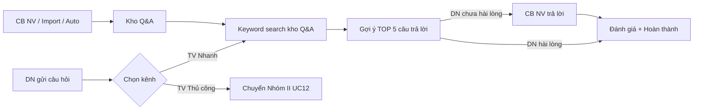
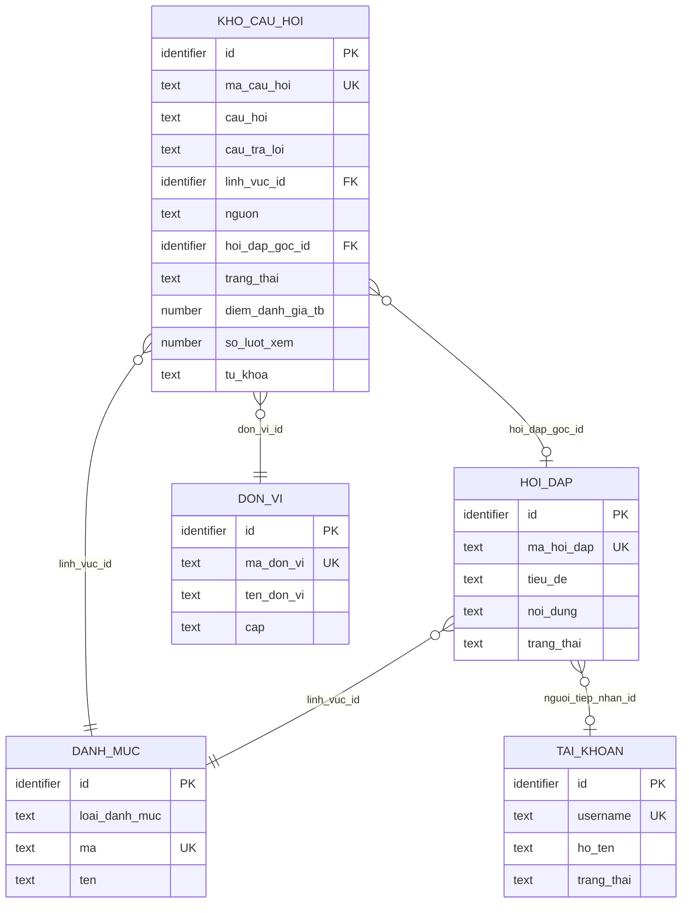
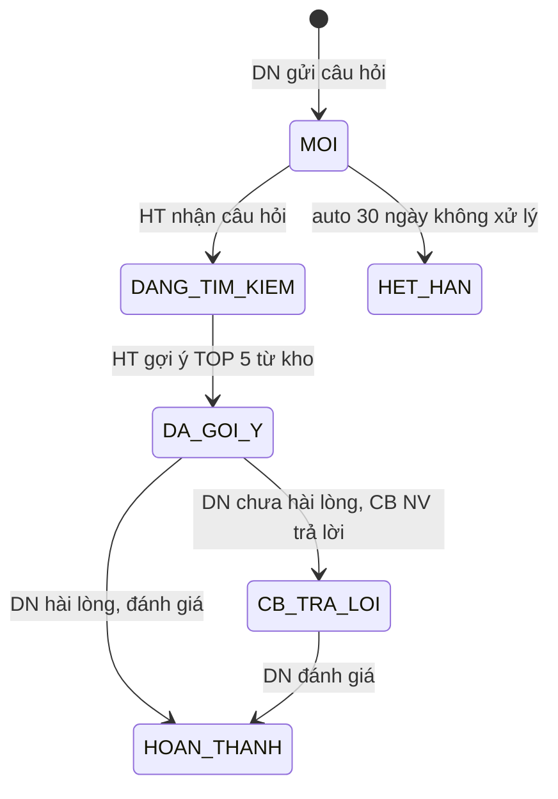

# SRS — Section 3.2.13: Tư vấn Nhanh

**Dự án:** Phần mềm hỗ trợ pháp lý doanh nghiệp
**Phiên bản SRS:** 3.0
**Nhóm:** X.2 — Tư vấn Nhanh
**UC range:** UC 158 – UC 162
**Số FR:** 5
**File chính:** `srs-v3.md` Section 3.2

---

## Mục lục file này

- [1. Tổng quan nhóm](#1-tổng-quan-nhóm)
- [2. Yêu cầu chức năng chi tiết](#2-yêu-cầu-chức-năng-chi-tiết)
- [3. Màn hình chức năng](#3-màn-hình-chức-năng)
- [4. Entity liên quan](#4-entity-liên-quan)
- [5. State Machine liên quan](#5-state-machine-liên-quan)
- [6. Business Rules liên quan](#6-business-rules-liên-quan)

---

## 1. Tổng quan nhóm

**Mục đích:** Hệ thống tra cứu câu hỏi-đáp pháp lý (keyword search, KHÔNG AI) phục vụ DN tự tra cứu trên Cổng.

**Tác nhân chính:** Cán bộ Nghiệp vụ (TW/BN/ĐP), Doanh nghiệp (qua Cổng PLQG)

**3 nguồn bổ sung kho:**
1. Câu hỏi Nhóm II đã duyệt -> tự động đưa vào kho
2. CB NV thêm thủ công -> sau duyệt
3. Import từ file -> sau duyệt

**UC Coverage:**

| UC | Tên | FR-ID | Priority |
|----|-----|-------|----------|
| UC158 | Quản lý kho câu hỏi/tư vấn | FR-X.2-01 | Essential |
| UC159 | Quản lý tư vấn nhanh | FR-X.2-02 | Essential |
| UC160 | DN gửi câu hỏi | FR-X.2-03 | Essential |
| UC161 | DN tìm kiếm phản hồi | FR-X.2-04 | Essential |
| UC162 | DN đánh giá nội dung trả lời | FR-X.2-05 | Essential |

**Quy trình nghiệp vụ tổng quan:**



**State Machine: SM-TVNHANH**

```
[MOI] --(DN gửi câu hỏi)--> [DANG_TIM_KIEM]
[DANG_TIM_KIEM] --(HT gợi ý TOP 5 từ kho)--> [DA_GOI_Y]
[DA_GOI_Y] --(DN chưa hài lòng, CB NV trả lời)--> [CB_TRA_LOI]
[DA_GOI_Y] --(DN hài lòng, đánh giá)--> [HOAN_THANH]
[CB_TRA_LOI] --(DN đánh giá)--> [HOAN_THANH]
[MOI] --(auto 30 ngày không xử lý)--> [HET_HAN]
```

---

## 2. Yêu cầu chức năng chi tiết

---

### FR-X.2-01: Quản lý kho câu hỏi/tư vấn (UC158)

**UC Reference:** UC 158
**Source:** CĐT xác nhận
**Priority:** Essential
**Stability:** High
**Màn hình:** SCR-X2-01 — [Quản lý Kho Câu hỏi](#scr-x2-01-quản-lý-kho-câu-hỏi) (phê duyệt inline trong SCR-X2-01)

**Mô tả:**
Quản lý kho câu hỏi/trả lời thường gặp phục vụ tư vấn nhanh. Hỗ trợ 3 nguồn: tự động từ hỏi đáp đã duyệt, thủ công, và import Excel. Q&A thủ công/import cần phê duyệt.

**Tác nhân:** Cán bộ Nghiệp vụ (TW/BN/ĐP)

**Preconditions (Điều kiện tiên quyết):**

- User đã đăng nhập (BR-AUTH-01)
- User có quyền "Quản lý tư vấn nhanh"

**Inputs (Dữ liệu đầu vào):**

| # | Tên field | Kiểu logic | Bắt buộc | Ràng buộc | Mặc định | Nguồn |
|---|----------|-----------|----------|-----------|----------|-------|
| 1 | ma_cau_hoi | text | Y (auto) | Format: QA-{YYYYMMDD}-{SEQ} | auto-gen | hệ thống |
| 2 | cau_hoi | text (long) | Y | Không rỗng | — | người dùng nhập |
| 3 | cau_tra_loi | text (long) | Y | Không rỗng | — | người dùng nhập |
| 4 | linh_vuc_id | identifier | Y | FK -> DANH_MUC | — | người dùng chọn |
| 5 | tu_khoa | text | N | Phân cách bằng dấu phẩy | — | người dùng nhập |
| 6 | nguon | text | Y | TU_DONG / THU_CONG / IMPORT | — | hệ thống |
| 7 | trang_thai | text | Y (auto) | NHAP / CHO_DUYET / DA_DUYET / HET_HIEU_LUC | CHO_DUYET | hệ thống |
| 8 | hieu_luc | boolean | Y | true = hiệu lực, false = hết hiệu lực | true | hệ thống |

**Processing (Xử lý):**

| Bước | Mô tả xử lý | BR áp dụng |
|------|-------------|-----------|
| 1 | Kiểm tra quyền | BR-AUTH-01 |
| 2 | Nguồn TU_DONG: Khi hỏi đáp (Nhóm II) chuyển DA_DUYET -> tự động tạo bản ghi trong kho (nguồn = TU_DONG, trạng thái = DA_DUYET) | — |
| 3 | Nguồn THU_CONG: CB NV nhập câu hỏi + trả lời -> trạng thái = CHO_DUYET -> CB PD duyệt | — |
| 4 | Nguồn IMPORT: Upload file Excel -> phân tích -> kiểm tra hợp lệ -> trạng thái = CHO_DUYET | — |
| 5 | Lập chỉ mục tìm kiếm toàn văn trên câu hỏi + câu trả lời + từ khóa | BR-DATA-08 |
| 6 | CB NV đánh dấu "Hết hiệu lực" -> cập nhật hiệu lực = false, ẩn khỏi Cổng | — |
| 7 | Ghi nhật ký thao tác | BR-DATA-05 |

**Business Rules áp dụng:**
- **BR-AUTH-01**: Xác thực người dùng -> Xem Phụ lục B (file chính)
- **BR-DATA-05**: Ghi nhật ký thao tác -> Xem Phụ lục B (file chính)
- **BR-DATA-08**: Tìm kiếm toàn văn -> Xem Phụ lục B (file chính)

**Outputs (Dữ liệu đầu ra):**

| # | Tên | Kiểu logic | Điều kiện | Format |
|---|-----|-----------|-----------|--------|
| 1 | ma_cau_hoi | text | luôn | QA-{date}-{seq} |
| 2 | cau_hoi | text | luôn | cắt 100 ký tự (danh sách) |
| 3 | cau_tra_loi | text | luôn | cắt 100 ký tự (danh sách) |
| 4 | linh_vuc | text | luôn | — |
| 5 | tu_khoa | text | luôn | tags |
| 6 | nguon | text | luôn | TU_DONG / THU_CONG / IMPORT |
| 7 | trang_thai | text | luôn | — |
| 8 | hieu_luc | boolean | luôn | toggle |
| 9 | diem_tb | number | luôn | — |

**Postconditions (Trạng thái sau thực hiện):**

- Kho Q&A được bổ sung/cập nhật
- Chỉ mục tìm kiếm toàn văn được cập nhật
- AUDIT_LOG ghi nhận

**Error Handling (Xử lý lỗi):**

| # | Điều kiện lỗi | Mã lỗi | Phản hồi hệ thống | Severity |
|---|--------------|--------|-------------------|----------|
| E1 | Câu hỏi trống | ERR-KHO-01 | "Câu hỏi là bắt buộc" | ERROR |
| E2 | Câu trả lời trống | ERR-KHO-02 | "Câu trả lời là bắt buộc" | ERROR |
| E3 | Lĩnh vực không hợp lệ | ERR-KHO-03 | "Lĩnh vực PL không hợp lệ" | ERROR |
| E4 | File Excel không đúng format | ERR-KHO-04 | "File không đúng định dạng. Tải mẫu Excel" | ERROR |

**Acceptance Criteria:**

- **Given** CB NV truy cập "Kho câu hỏi" **When** hiển thị **Then** DS Q&A, phân trang
- **Given** CB NV thêm mới **When** nhập câu hỏi + trả lời + lĩnh vực **Then** validate + lưu (CHO_DUYET)
- **Given** Q&A nhóm II đã duyệt **When** trigger **Then** tự động thêm vào kho
- **Given** Q&A hết hiệu lực **When** CB NV đánh dấu **Then** ẩn khỏi Cổng

---

### FR-X.2-02: Quản lý tư vấn nhanh (UC159)

**UC Reference:** UC 159
**Source:** CĐT xác nhận
**Priority:** Essential
**Stability:** High
**Màn hình:** SCR-X2-03 — [Quản lý Tư vấn Nhanh](#scr-x2-03-quản-lý-tư-vấn-nhanh)

**Mô tả:**
Xử lý luồng tư vấn nhanh: DN gửi câu hỏi -> hệ thống tìm kiếm keyword trong kho -> gợi ý TOP 5 -> CB NV xem và chỉnh sửa gợi ý -> gửi trả lời.

**Tác nhân:** Cán bộ Nghiệp vụ

**Preconditions (Điều kiện tiên quyết):**

- User đã đăng nhập (BR-AUTH-01)
- User có quyền "Quản lý tư vấn nhanh"
- Kho câu hỏi đã có dữ liệu

**Inputs (Dữ liệu đầu vào):**

| # | Tên field | Kiểu logic | Bắt buộc | Ràng buộc | Mặc định | Nguồn |
|---|----------|-----------|----------|-----------|----------|-------|
| 1 | cau_hoi_dn | text (long) | Y | Câu hỏi từ DN | — | DN gửi |
| 2 | noi_dung_tra_loi | text (long) | Y | Nội dung trả lời (có thể chỉnh sửa từ gợi ý) | — | CB NV nhập/chọn |

**Processing (Xử lý):**

| Bước | Mô tả xử lý | BR áp dụng |
|------|-------------|-----------|
| 1 | DN gửi câu hỏi -> hệ thống tìm kiếm keyword trong kho Q&A | — |
| 2 | Tìm kiếm toàn văn trên câu hỏi + câu trả lời + từ khóa | BR-DATA-08 |
| 3 | Gợi ý TOP 5 câu trả lời phù hợp nhất (sắp theo điểm relevance giảm dần) | — |
| 4 | CB NV xem câu hỏi chờ + gợi ý | — |
| 5 | CB NV chọn gợi ý / chỉnh sửa -> gửi trả lời | — |
| 6 | Tạo bản ghi tư vấn nhanh (liên kết hỏi đáp nếu có) | — |

**Outputs (Dữ liệu đầu ra):**

| # | Tên | Kiểu logic | Điều kiện | Format |
|---|-----|-----------|-----------|--------|
| 1 | goi_y_tra_loi | structured | luôn | TOP 5 [{ma_qa, cau_hoi, cau_tra_loi, relevance_score}] |
| 2 | tra_loi_da_gui | text | sau gửi | — |

**Postconditions (Trạng thái sau thực hiện):**

- Bản ghi TU_VAN_NHANH được tạo
- Trạng thái SM-TVNHANH chuyển sang CB_TRA_LOI

**Error Handling (Xử lý lỗi):**

| # | Điều kiện lỗi | Mã lỗi | Phản hồi hệ thống | Severity |
|---|--------------|--------|-------------------|----------|
| E1 | Kho Q&A rỗng | ERR-TVN-01 | "Chưa có dữ liệu trong kho câu hỏi" | WARNING |
| E2 | Nội dung trả lời rỗng | ERR-TVN-02 | "Nội dung trả lời là bắt buộc" | ERROR |

**Acceptance Criteria:**

- **Given** DN gửi câu hỏi **When** hệ thống nhận **Then** keyword search kho -> gợi ý trả lời
- **Given** CB NV xem câu hỏi chờ **When** chọn **Then** hiển thị gợi ý + cho phép chỉnh sửa -> gửi

---

### FR-X.2-03: DN gửi câu hỏi (UC160)

**UC Reference:** UC 160
**Source:** CĐT xác nhận (thiết kế ở chuyên trang)
**Priority:** Essential
**Stability:** High
**Màn hình:** SCR-X2-03 — [Quản lý Tư vấn Nhanh](#scr-x2-03-quản-lý-tư-vấn-nhanh) (phân luồng logic)

**Mô tả:**
DN nhập câu hỏi trên chuyên trang và chọn kênh tư vấn (nhanh hoặc thủ công). Hỗ trợ chuyển kênh giữa hai hình thức.

**Tác nhân:** Doanh nghiệp (qua Cổng PLQG)

**Preconditions (Điều kiện tiên quyết):**

- DN truy cập chuyên trang qua Cổng PLQG

**Inputs (Dữ liệu đầu vào):**

| # | Tên field | Kiểu logic | Bắt buộc | Ràng buộc | Mặc định | Nguồn |
|---|----------|-----------|----------|-----------|----------|-------|
| 1 | cau_hoi | text (long) | Y | Không rỗng | — | DN nhập |
| 2 | kenh_tu_van | text | Y | TV_NHANH / TV_THU_CONG | TV_NHANH | DN chọn |

**Processing (Xử lý):**

| Bước | Mô tả xử lý | BR áp dụng |
|------|-------------|-----------|
| 1 | DN nhập câu hỏi trên chuyên trang | — |
| 2 | DN chọn kênh: "TV nhanh" hoặc "TV thủ công" | — |
| 3 | Nếu TV nhanh -> chuyển UC159 (keyword search) | — |
| 4 | Nếu TV thủ công -> chuyển nhóm II (UC12 tiếp nhận) | — |
| 5 | DN chuyển kênh: "Chuyển sang TV thủ công" -> giữ toàn bộ lịch sử | — |
| 6 | Ghi nhận qua API inbound từ Cổng PLQG | — |

**Outputs (Dữ liệu đầu ra):**

| # | Tên | Kiểu logic | Điều kiện | Format |
|---|-----|-----------|-----------|--------|
| 1 | ma_phien | text | luôn | auto-gen |
| 2 | kenh_hien_tai | text | luôn | TV_NHANH / TV_THU_CONG |

**Postconditions (Trạng thái sau thực hiện):**

- Phiên tư vấn nhanh được tạo (nếu TV nhanh)
- Hoặc chuyển sang Nhóm II (nếu TV thủ công)

**Error Handling (Xử lý lỗi):**

| # | Điều kiện lỗi | Mã lỗi | Phản hồi hệ thống | Severity |
|---|--------------|--------|-------------------|----------|
| E1 | Câu hỏi trống | ERR-TVN-DN-01 | "Vui lòng nhập câu hỏi" | ERROR |

**Acceptance Criteria:**

- **Given** DN nhập câu hỏi **When** chọn "TV nhanh" **Then** phân luồng keyword search
- **Given** DN chọn "TV thủ công" **When** xử lý **Then** chuyển nhóm II
- **Given** DN muốn chuyển kênh **When** nhấn "Chuyển" **Then** giữ toàn bộ lịch sử

---

### FR-X.2-04: DN tìm kiếm phản hồi (UC161)

**UC Reference:** UC 161
**Source:** CĐT xác nhận
**Priority:** Essential
**Stability:** High
**Màn hình:** Cổng PLQG (chuyên trang)

**Mô tả:**
DN tự tìm kiếm câu hỏi/trả lời trong kho Q&A đã duyệt + hiệu lực qua Cổng PLQG.

**Tác nhân:** Doanh nghiệp (qua Cổng PLQG)

**Preconditions (Điều kiện tiên quyết):**

- DN truy cập chuyên trang qua Cổng PLQG

**Inputs (Dữ liệu đầu vào):**

| # | Tên field | Kiểu logic | Bắt buộc | Ràng buộc | Mặc định | Nguồn |
|---|----------|-----------|----------|-----------|----------|-------|
| 1 | tu_khoa | text | Y | Min 2 ký tự | — | DN nhập |

**Processing (Xử lý):**

| Bước | Mô tả xử lý | BR áp dụng |
|------|-------------|-----------|
| 1 | DN nhập từ khóa trên Cổng | — |
| 2 | API inbound -> truy vấn kho Q&A chỉ bản ghi DA_DUYET + hiệu lực | — |
| 3 | Tìm kiếm toàn văn -- keyword tương đối hoặc cụm từ chính xác | BR-DATA-08 |
| 4 | Trả về danh sách Q&A phù hợp, sắp theo điểm relevance giảm dần | — |

**Outputs (Dữ liệu đầu ra):**

| # | Tên | Kiểu logic | Điều kiện | Format |
|---|-----|-----------|-----------|--------|
| 1 | danh_sach_qa | structured | luôn | [{cau_hoi, cau_tra_loi, linh_vuc, relevance_score}] |

**Postconditions (Trạng thái sau thực hiện):**

- Read-only, không thay đổi dữ liệu

**Error Handling (Xử lý lỗi):**

| # | Điều kiện lỗi | Mã lỗi | Phản hồi hệ thống | Severity |
|---|--------------|--------|-------------------|----------|
| E1 | Từ khóa < 2 ký tự | ERR-TVN-TK-01 | "Từ khóa tìm kiếm phải có ít nhất 2 ký tự" | ERROR |
| E2 | Không có kết quả | INF-TVN-TK-01 | "Không tìm thấy câu hỏi phù hợp" | INFO |

**Acceptance Criteria:**

- **Given** DN nhập từ khóa **When** tìm kiếm **Then** hiển thị Q&A phù hợp (keyword search)

---

### FR-X.2-05: DN đánh giá nội dung trả lời (UC162)

**UC Reference:** UC 162
**Source:** CĐT xác nhận
**Priority:** Essential
**Stability:** High
**Màn hình:** SCR-X2-03 — [Tìm kiếm & Kết quả Tư vấn Nhanh](#scr-x2-03-tìm-kiếm--kết-quả-tư-vấn-nhanh) (đánh giá inline trong SCR-X2-03), Cổng PLQG (DN gửi đánh giá)

**Mô tả:**
DN đánh giá chất lượng câu trả lời (điểm 1-5 + nhận xét). Kết quả phục vụ cải thiện kho và báo cáo.

**Tác nhân:** Doanh nghiệp (qua Cổng PLQG)

**Preconditions (Điều kiện tiên quyết):**

- DN đã nhận câu trả lời từ phiên tư vấn nhanh

**Inputs (Dữ liệu đầu vào):**

| # | Tên field | Kiểu logic | Bắt buộc | Ràng buộc | Mặc định | Nguồn |
|---|----------|-----------|----------|-----------|----------|-------|
| 1 | tu_van_nhanh_id | identifier | Y | FK -> TU_VAN_NHANH | — | hệ thống |
| 2 | diem | number | Y | 1-5 | — | DN chọn |
| 3 | nhan_xet | text (long) | N | — | — | DN nhập |

**Processing (Xử lý):**

| Bước | Mô tả xử lý | BR áp dụng |
|------|-------------|-----------|
| 1 | Kiểm tra: điểm trong khoảng 1-5 | — |
| 2 | Tạo bản ghi đánh giá tư vấn | — |
| 3 | Cập nhật điểm trung bình của Q&A (nếu đánh giá Q&A cụ thể) | — |

**Outputs (Dữ liệu đầu ra):**

| # | Tên | Kiểu logic | Điều kiện | Format |
|---|-----|-----------|-----------|--------|
| 1 | ket_qua | text | luôn | THANH_CONG |
| 2 | diem_tb_cap_nhat | number | luôn | — |

**Postconditions (Trạng thái sau thực hiện):**

- DANH_GIA_TV được tạo
- Điểm TB cập nhật

**Error Handling (Xử lý lỗi):**

| # | Điều kiện lỗi | Mã lỗi | Phản hồi hệ thống | Severity |
|---|--------------|--------|-------------------|----------|
| E1 | Điểm ngoài khoảng 1-5 | ERR-DG-TVN-01 | "Điểm đánh giá phải từ 1 đến 5" | ERROR |
| E2 | Phiên TV không tồn tại | ERR-DG-TVN-02 | "Phiên tư vấn không tồn tại" | ERROR |

**Acceptance Criteria:**

- **Given** DN xem câu trả lời **When** đánh giá (điểm + nhận xét) **Then** lưu, phục vụ cải thiện kho + BC

---

---

## 3. Màn hình chức năng

> **Cấu trúc v2.1:** 1 trang, 2 tabs -- Tab "Kho cau hoi" (MH-13.1 + MH-13.2 gop) / Tab "Phien tu van" (MH-13.3 + MH-13.4 gop).

### SCR-X2-01: Quan ly Kho Cau hoi

**Loai man hinh:** Danh sach + Modal + Phe duyet inline
**FR su dung:** FR-X.2-01
**UX-Spec ref:** dac-ta-man-hinh-chuc-nang-v2.md -- MH-13.1

#### Thanh phan man hinh

| # | Vung | Thanh phan | Loai | Du lieu / Noi dung | Hanh vi | Dieu kien hien thi |
|---|------|-----------|------|---------------------|---------|-------------------|
| 1 | toolbar | Breadcrumb | breadcrumb | "Trang chu > Tu van > Kho cau hoi" | navigate | luon hien thi |
| 2 | toolbar | Tieu de + nut | label + button | "Kho Cau hoi Thuong gap" + [+ Them cau hoi] [Nhap Excel] [Lam moi] | click -> action | luon hien thi |
| 3 | filter-bar | Tab phan loai | tab | 3 tab: Tat ca / Da duyet (DA_DUYET + hieu_luc=1) / Cho duyet (CHO_DUYET). Badge so dem | click -> filter | luon hien thi |
| 4 | filter-bar | Thanh loc | form | Full-text GIN index (tsvector: cau_hoi + cau_tra_loi + tu_khoa). Linh vuc. Nguon: TU_DONG/THU_CONG/IMPORT. Trang thai: NHAP/CHO_DUYET/DA_DUYET/HET_HIEU_LUC | change -> filter | luon hien thi |
| 5 | content | Bang kho Q&A | table | Ma (QA-{YYYYMMDD}-{SEQ}) / Cau hoi (cat 100 ky tu) / Cau tra loi (cat 100 ky tu) / Linh vuc / Tu khoa (tags, max 3 + "+N") / Nguon (nhan mau) / Trang thai (C06) / Hieu luc (Toggle) / Diem TB / Ngay tao / Hanh dong | click -> action | luon hien thi |
| 6 | content | Nhan nguon | tag | TU_DONG (xanh duong, auto tu HOI_DAP DA_DUYET, khong can duyet them) / THU_CONG (vang, CHO_DUYET) / IMPORT (tim, CHO_DUYET) | -- | luon hien thi |
| 7 | content | Toggle hieu luc | toggle | Tat -> hieu_luc = 0, an khoi Cong. Bat -> hieu_luc = 1 | toggle -> cap nhat | luon hien thi |
| 8 | modal | Form them Q&A | modal (lon) | Cau hoi (textarea, bat buoc) / Cau tra loi (C16 Rich Text, bat buoc) / Linh vuc (dropdown, bat buoc) / Tu khoa (tag input) / [Huy] [Luu nhap] [Gui duyet] | input -> validate | khi nhan Them |
| 9 | modal | Import Excel | modal (C15) | Upload .xlsx -> validate -> preview 10 dong dau -> ket qua "N thanh cong, M loi". Tat ca -> CHO_DUYET | upload -> process | khi nhan Nhap Excel |
| 10 | content | Duyet don le (v2.1 gop tu MH-13.2) | button-group + modal | Tab "Cho duyet": [Duyet] SET DA_DUYET + hieu_luc=1 + TB CB NV. [Tu choi] modal ly do bat buoc + SET NHAP + TB CB NV | click -> action | tab Cho duyet |
| 11 | content | Duyet hang loat (v2.1 gop tu MH-13.2) | button | [Duyet hang loat] -> modal xac nhan. Khong tu choi hang loat | click -> action | khi >= 1 checkbox trong tab Cho duyet |
| 12 | footer | Phan trang | pagination | 20 muc/trang | click -> chuyen trang | luon hien thi |

#### Quy tac tuong tac

- Q&A nguon TU_DONG: auto tu HOI_DAP da duyet, khong can duyet them
- Q&A nguon THU_CONG va IMPORT: trang thai CHO_DUYET, phe duyet inline trong tab "Cho duyet" (v2.1 -- da gop MH-13.2 vao MH-13.1)
- Chi tiet Q&A: side panel/modal hien thi day du cau hoi, cau tra loi (rich text), linh vuc, tu khoa, nguon, nguoi tao

---

### ~~SCR-X2-02: Phe duyet Kho Q&A~~ (DA GOP -> action trong SCR-X2-01)

> **DEPRECATED v2.1:** Phe duyet Q&A thu cong/nhap = action button/batch trong SCR-X2-01 tab "Cho duyet". Xem #10, #11 trong SCR-X2-01.

---

### SCR-X2-03: Quan ly Tu van Nhanh

**Loai man hinh:** Danh sach + Layout 2 cot (tra loi) + Danh gia inline
**FR su dung:** FR-X.2-02, FR-X.2-03, FR-X.2-05
**UX-Spec ref:** dac-ta-man-hinh-chuc-nang-v2.md -- MH-13.3

#### Thanh phan man hinh

| # | Vung | Thanh phan | Loai | Du lieu / Noi dung | Hanh vi | Dieu kien hien thi |
|---|------|-----------|------|---------------------|---------|-------------------|
| 1 | toolbar | Breadcrumb | breadcrumb | "Trang chu > Tu van > Tu van nhanh" | navigate | luon hien thi |
| 2 | toolbar | Tieu de | label | "Quan ly Tu van Nhanh" + [Lam moi] | -- | luon hien thi |
| 3 | filter-bar | Tab phan loai | tab | 4 tab: Tat ca / Cho xu ly (MOI + DANG_TIM_KIEM) / Da goi y (DA_GOI_Y + CB_TRA_LOI) / Hoan thanh (HOAN_THANH + HET_HAN) | click -> filter | luon hien thi |
| 4 | filter-bar | Thanh loc | form | Tu khoa. Trang thai SM-TVNHANH. Khoang ngay | change -> filter | luon hien thi |
| 5 | content | Bang TV nhanh | table | Ma phien / Cau hoi DN (cat 100 ky tu) / Kenh (TV_NHANH xanh / TV_THU_CONG vang) / So goi y (badge) / Trang thai SM-TVNHANH (C06) / Ngay gui / Ngay cap nhat / Hanh dong (Xem / Tra loi) | click -> action | luon hien thi |
| 6 | footer | Phan trang | pagination | 20 muc/trang | click -> chuyen trang | luon hien thi |
| 7 | content (tra loi) | Cot trai (40%) | layout | Ma phien + Trang thai (C06/C17). Thong tin DN. Cau hoi DN (card nen nhat). Lich su trao doi (chat bubbles) | -- | mode tra loi |
| 8 | content (tra loi) | Cot phai (60%) | layout | TOP 5 goi y tu KHO_CAU_HOI (tsvector/tsquery, relevance DESC). Moi goi y: Ma Q&A / Cau hoi (bold) / Cau tra loi / Diem relevance (%) / [Chon]. Click [Chon] -> auto-fill o soan. O soan: C16 Rich Text. [Gui tra loi] -> SET CB_TRA_LOI | click [Chon] -> fill / click [Gui] -> submit | mode tra loi |
| 9 | content | Phan luong (UC160) | logic | TV Nhanh -> UC159 (keyword search). TV Thu cong -> UC12 (Nhom II). Chuyen kenh: giu lich su | -- | logic |
| 10 | content | Danh gia (v2.1 gop tu MH-13.4) | section/column | Diem (1-5 sao) / Nhan xet DN / Ngay danh gia. The tong hop: Tong danh gia (COUNT) / Diem TB (AVG) / Phan bo (bar chart mini). [Xuat Excel] | -- | hien thi trong tab Hoan thanh hoac chi tiet phien |

#### Quy tac tuong tac

- Auto het han: MOI > 30 ngay -> HET_HAN + TB CB NV (batch job)
- Bang nhan SM-TVNHANH: MOI (xanh duong, `--color-info`) / DANG_TIM_KIEM (vang nhat, `--color-warning-light`) / DA_GOI_Y (vang, `--color-warning`) / CB_TRA_LOI (xanh la nhat, `--color-success-light`) / HOAN_THANH (xanh la, `--color-success`) / HET_HAN (xam, `--color-text-disabled`)
- Danh gia TV nhanh (v2.1 -- da gop MH-13.4 vao MH-13.3): DN danh gia chat luong = section/column trong tab "Phien tu van"

---

### ~~SCR-X2-04: Danh gia Tu van Nhanh~~ (DA GOP -> section trong SCR-X2-03)

> **DEPRECATED v2.1:** DN danh gia chat luong = section/column trong tab "Phien tu van" (SCR-X2-03). Xem #10 trong SCR-X2-03.

---

## 4. Entity liên quan

> **Source of truth:** `srs-v3.md` Section 3.4.

### Tổng quan entity

| # | Entity | Vai trò | Mô tả |
|---|--------|---------|-------|
| 1 | KHO_CAU_HOI | owned | Kho Q&A tư vấn nhanh — entity trung tâm nhóm X.2 |
| 2 | HOI_DAP | referenced | Hỏi đáp/vướng mắc PL (nguồn tự động cho kho) |
| 3 | TAI_KHOAN | referenced | Tài khoản người dùng (CB NV, CB PD) |
| 4 | DON_VI | referenced | Cơ quan/đơn vị (phân quyền theo đơn vị) |
| 5 | DANH_MUC | referenced | Danh mục dùng chung (lĩnh vực PL) |

### ERD nhóm (subset)



### KHO_CAU_HOI (owned)

**Mô tả:** Kho câu hỏi-đáp cho tính năng tư vấn nhanh (keyword search). Entity trung tâm Nhóm X.2.
**Tham chiếu FR:** FR-X.2-01 đến FR-X.2-05

| Attribute | Kiểu logic | Bắt buộc | Ràng buộc nghiệp vụ | Mặc định | Mô tả |
|-----------|-----------|----------|------------|---------|-------|
| cau_hoi | text (long) | Y | | | Nội dung câu hỏi |
| cau_tra_loi | text (long) | Y | | | Nội dung câu trả lời |
| linh_vuc_id | identifier | Y | FK → DANH_MUC(id) | | Lĩnh vực PL |
| nguon | text | Y | CHECK IN ('TU_DONG','THU_CONG','IMPORT') | | Nguồn: tự động từ nhóm II / thủ công / import |
| hoi_dap_goc_id | identifier | N | FK → HOI_DAP(id) | | Liên kết hỏi đáp gốc (nếu nguồn tự động) |
| trang_thai | text | Y | CHECK IN ('CHO_DUYET','DA_DUYET','HET_HIEU_LUC') | 'CHO_DUYET' | Trạng thái |
| diem_danh_gia_tb | number | N | | | Điểm đánh giá TB từ DN |
| so_luot_xem | number | N | | 0 | Counter lượt xem |
| tu_khoa | text | N | | | Từ khóa tìm kiếm (phân cách bằng dấu phẩy) |

**Volume & Growth:** ~10,000 records/năm. Chỉ mục tìm kiếm toàn văn.

### HOI_DAP (referenced)

**Mô tả:** Lưu trữ yêu cầu hỏi đáp/vướng mắc pháp lý từ doanh nghiệp. Entity trung tâm của Nhóm II.
**Tham chiếu FR:** FR-II-01 đến FR-II-10

| Attribute | Kiểu logic | Bắt buộc | Ràng buộc nghiệp vụ | Mặc định | Mô tả |
|-----------|-----------|----------|------------|---------|-------|
| ma_hoi_dap | text | Y | UNIQUE | Auto-gen | Mã hỏi đáp (format: HD-YYYYMMDD-SEQ) |
| tieu_de | text | Y | | | Tiêu đề câu hỏi |
| noi_dung | text (long) | Y | | | Nội dung câu hỏi |
| linh_vuc_id | identifier | Y | FK → DANH_MUC(id) | | Lĩnh vực pháp lý |
| trang_thai | text | Y | CHECK IN ('MOI','TIEP_NHAN','DANG_XU_LY','DA_TRA_LOI','CHO_PHE_DUYET','DA_DUYET','CONG_KHAI','HOAN_THANH','HUY') | 'MOI' | Trạng thái lifecycle |
| la_cong_khai | boolean | Y | | 0 | Đã công khai lên Cổng PLQG? |

### TAI_KHOAN (referenced)

**Mô tả:** Tài khoản đăng nhập hệ thống CMS.

| Attribute | Kiểu logic | Bắt buộc | Ràng buộc nghiệp vụ | Mặc định | Mô tả |
|-----------|-----------|----------|------------|---------|-------|
| username | text | Y | UNIQUE | | Tên đăng nhập |
| email | text | Y | UNIQUE | | Email |
| ho_ten | text | Y | | | Họ tên đầy đủ |
| trang_thai | text | Y | CHECK IN ('CHO_KICH_HOAT','HOAT_DONG','TAM_KHOA','VO_HIEU_HOA') | 'CHO_KICH_HOAT' | Trạng thái TK |

### DON_VI (referenced)

**Mô tả:** Cơ quan/đơn vị tham gia hệ thống (cây phân cấp 3 tầng TW/BN/ĐP).

| Attribute | Kiểu logic | Bắt buộc | Ràng buộc nghiệp vụ | Mặc định | Mô tả |
|-----------|-----------|----------|------------|---------|-------|
| ma_don_vi | text | Y | UNIQUE | | Mã cơ quan |
| ten_don_vi | text | Y | | | Tên đầy đủ |
| cap | text | Y | CHECK IN ('TW','BN','DP') | | Cấp: TW / BN / ĐP |
| trang_thai | text | Y | CHECK IN ('HOAT_DONG','TAM_DUNG') | 'HOAT_DONG' | Trạng thái |

### DANH_MUC (referenced)

**Mô tả:** Bảng danh mục dùng chung (key-value) cho lĩnh vực PL, loại hình HT, loại DN, v.v.

| Attribute | Kiểu logic | Bắt buộc | Ràng buộc nghiệp vụ | Mặc định | Mô tả |
|-----------|-----------|----------|------------|---------|-------|
| loai_danh_muc | text | Y | | | Loại DM (LINH_VUC_PL, LOAI_DN...) |
| ma | text | Y | UNIQUE per loai_danh_muc | | Mã danh mục |
| ten | text | Y | | | Tên hiển thị |
| trang_thai | text | Y | CHECK IN ('KICH_HOAT','VO_HIEU_HOA') | 'KICH_HOAT' | Trạng thái |

---

## 5. State Machine liên quan

> **Source of truth:** `srs-v3.md` Phụ lục C.

### SM-TVNHANH: Tư vấn Nhanh

> **Lưu ý:** SM-TVNHANH được khai báo tại §3.2.13 (file chính), không tạo appendix riêng vì SM đơn giản.

**Entity:** Phiên tư vấn nhanh (logic entity, liên kết KHO_CAU_HOI + HOI_DAP)
**Tham chiếu FR:** FR-X.2-02, FR-X.2-03, FR-X.2-05



**Bảng trạng thái:**

| Trạng thái | Mã | Mô tả | Màu hiển thị |
|-----------|-----|-------|-------------|
| Mới | MOI | DN vừa gửi câu hỏi | Xanh dương |
| Đang tìm kiếm | DANG_TIM_KIEM | Hệ thống keyword search kho Q&A | Vàng nhạt |
| Đã gợi ý | DA_GOI_Y | HT đã gợi ý TOP 5 câu trả lời | Vàng |
| CB trả lời | CB_TRA_LOI | CB NV đang soạn trả lời | Xanh lá nhạt |
| Hoàn thành | HOAN_THANH | DN đánh giá, kết thúc phiên | Xanh lá |
| Hết hạn | HET_HAN | Quá 30 ngày không xử lý | Xám |

**Bảng chuyển trạng thái:**

| Từ | Đến | Trigger | Guard | Action | FR Ref |
|----|-----|---------|-------|--------|--------|
| [*] | MOI | DN gửi câu hỏi qua Cổng | — | Tạo phiên TV nhanh | FR-X.2-03 |
| MOI | DANG_TIM_KIEM | HT nhận câu hỏi | — | Keyword search kho | FR-X.2-02 |
| DANG_TIM_KIEM | DA_GOI_Y | Có kết quả tìm kiếm | Kho Q&A có dữ liệu | Gợi ý TOP 5 | FR-X.2-02 |
| DA_GOI_Y | CB_TRA_LOI | DN chưa hài lòng | — | CB NV soạn trả lời | FR-X.2-02 |
| DA_GOI_Y | HOAN_THANH | DN hài lòng + đánh giá | Điểm 1-5 | Lưu đánh giá | FR-X.2-05 |
| CB_TRA_LOI | HOAN_THANH | DN đánh giá | Điểm 1-5 | Lưu đánh giá | FR-X.2-05 |
| MOI | HET_HAN | Auto 30 ngày | elapsed > 30 ngày | TB CB NV, batch job | FR-X.2-02 |

---

## 6. Business Rules liên quan

> **Source of truth:** `srs-v3.md` Phụ lục B.

### Tổng quan BR

| BR ID | Tên | FR áp dụng (nhóm này) |
|-------|-----|----------------------|
| BR-AUTH-01 | Xác thực người dùng | FR-X.2-01, FR-X.2-02 |
| BR-DATA-05 | Ghi nhật ký thao tác (audit trail) | FR-X.2-01 |
| BR-DATA-08 | Tìm kiếm toàn văn (Full-text search) | FR-X.2-01, FR-X.2-02, FR-X.2-04 |
| BR-FLOW-10 | Kho câu hỏi TV nhanh: 3 nguồn bổ sung | FR-X.2-01 |

### BR-AUTH-01: Xác thực người dùng

| Thuộc tính | Giá trị |
|-----------|---------|
| **Phát biểu** | Mọi user phải xác thực trước khi truy cập hệ thống. Tier 1 (MVP): Username/password + TOTP 2FA qua email. Tier 2: VNPT eKYC xác thực CCCD. Tier 3: SSO VNeID OIDC Authorization Code flow. |
| **Nguồn** | PRD A6, FR-VIII-20, NĐ69/2024 |
| **Applied in (nhóm X.2)** | FR-X.2-01 (quản lý kho), FR-X.2-02 (quản lý TV nhanh) |
| **Ngoại lệ** | API outbound không yêu cầu session (dùng JWT) |
| **Kiểm chứng** | Test đăng nhập Tier 1 + TOTP |

### BR-DATA-05: Ghi nhật ký thao tác

| Thuộc tính | Giá trị |
|-----------|---------|
| **Phát biểu** | Mọi thao tác CUD + phê duyệt + đăng nhập/xuất đều ghi vào AUDIT_LOG. Log là immutable, không sửa/xóa |
| **Nguồn** | NFR-06 |
| **Applied in (nhóm X.2)** | FR-X.2-01 (quản lý kho) |
| **Ngoại lệ** | — |
| **Kiểm chứng** | Verify INSERT-only trên AUDIT_LOG |

### BR-DATA-08: Tìm kiếm toàn văn

| Thuộc tính | Giá trị |
|-----------|---------|
| **Phát biểu** | Hỏi đáp (noi_dung) và Kho câu hỏi (cau_hoi/cau_tra_loi) hỗ trợ tìm kiếm toàn văn toàn văn |
| **Nguồn** | FR-II-02, FR-X.1-02, FR-X.2-04 |
| **Applied in (nhóm X.2)** | FR-X.2-01 (lập chỉ mục), FR-X.2-02 (keyword search kho), FR-X.2-04 (DN tìm kiếm phản hồi) |
| **Ngoại lệ** | Các entity khác: search by LIKE/index |
| **Kiểm chứng** | Verify chỉ mục tìm kiếm toàn văn |

### BR-FLOW-10: Kho câu hỏi TV nhanh — 3 nguồn bổ sung

| Thuộc tính | Giá trị |
|-----------|---------|
| **Phát biểu** | Kho câu hỏi tư vấn nhanh: 3 nguồn bổ sung: (1) Tự động từ hỏi đáp nhóm II đã duyệt, (2) Thêm thủ công (chờ duyệt), (3) Import (chờ duyệt) |
| **Nguồn** | PRD FR-X.2-01 |
| **Applied in (nhóm X.2)** | FR-X.2-01 (quản lý kho) |
| **Ngoại lệ** | — |
| **Kiểm chứng** | Test auto-import from HOI_DAP |

---

**-- Het file FR Group: X.2 -- Tu van Nhanh --**
