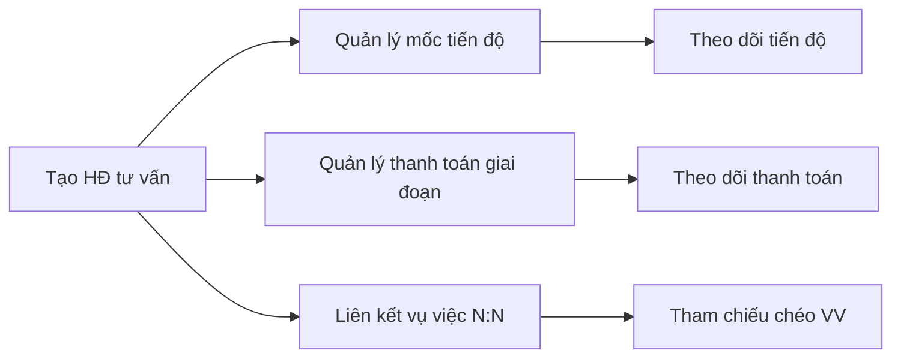
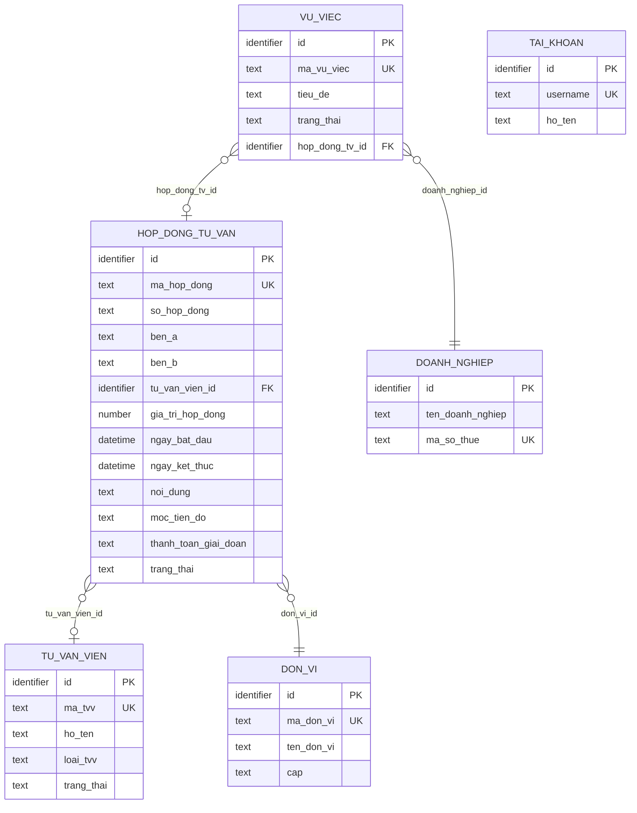

# SRS — Section 3.2.14: Quản lý Hợp đồng Tư vấn

**Dự án:** Phần mềm hỗ trợ pháp lý doanh nghiệp
**Phiên bản SRS:** 3.0
**Nhóm:** X.3 — Quản lý Hợp đồng Tư vấn
**UC range:** UC 163 – UC 163e
**Số FR:** 2
**File chính:** `srs-v3.md` Section 3.2

---

## Mục lục file này

- [1. Tổng quan nhóm](#1-tổng-quan-nhóm)
- [2. Yêu cầu chức năng chi tiết](#2-yêu-cầu-chức-năng-chi-tiết)
- [3. Màn hình chức năng](#3-màn-hình-chức-năng)
- [4. Entity liên quan](#4-entity-liên-quan)
- [5. State Machine liên quan](#5-state-machine-liên-quan)
- [6. Business Rules liên quan](#6-business-rules-liên-quan)

---

## 1. Tổng quan nhóm

**Mục đích:** CRUD hợp đồng tư vấn giữa đơn vị và TVV/tổ chức tư vấn. Chỉ CRUD, KHÔNG có phê duyệt.

**Tác nhân chính:** Cán bộ Nghiệp vụ (TW/BN/ĐP)

**Liên kết:** 1 HĐ -> nhiều vụ việc (V.I). HĐ <-> Vụ việc (V.I) <-> Chi trả (V.II).

**UC Coverage:**

| UC | Tên | FR-ID | Priority |
|----|-----|-------|----------|
| UC163 | Quản lý HĐ tư vấn | FR-X.3-01 | Essential |
| UC163e | Tìm kiếm hợp đồng tư vấn | FR-X.3-02 | Essential |

**Quy trình nghiệp vụ tổng quan:**

---

## 2. Yêu cầu chức năng chi tiết

---

### FR-X.3-01: Quản lý HĐ tư vấn (UC163)

**UC Reference:** UC 163
**Source:** CĐT xác nhận
**Priority:** Essential
**Stability:** High
**Màn hình:** SCR-X3-01 — [Quản lý Hợp đồng Tư vấn](#scr-x3-01-quản-lý-hợp-đồng-tư-vấn)

**Mô tả:**
CRUD hợp đồng tư vấn bao gồm: thông tin chung, mốc tiến độ, thanh toán giai đoạn, liên kết vụ việc. Chỉ CRUD, không có phê duyệt, không có mẫu chuẩn.

**Tác nhân:** Cán bộ Nghiệp vụ (TW/BN/ĐP)

**Preconditions (Điều kiện tiên quyết):**

- User đã đăng nhập (BR-AUTH-01)
- User có quyền "Quản lý HĐ tư vấn"
- phân quyền dữ liệu theo đơn vị

**Inputs (Dữ liệu đầu vào) -- Thêm mới/Chỉnh sửa:**

| # | Tên field | Kiểu logic | Bắt buộc | Ràng buộc | Mặc định | Nguồn |
|---|----------|-----------|----------|-----------|----------|-------|
| 1 | ma_hop_dong | text | Y (auto) | Format: HDTV-{YYYYMMDD}-{SEQ} | auto-gen | hệ thống |
| 2 | ten_hop_dong | text | Y | — | — | người dùng nhập |
| 3 | ben_a | text | Y | Bên A (đơn vị quản lý) | auto đơn vị | hệ thống |
| 4 | ben_b | text | Y | Bên B (TVV/tổ chức TV) | — | người dùng nhập |
| 5 | tvv_id | identifier | N | FK -> TU_VAN_VIEN (liên kết nếu có) | — | người dùng chọn |
| 6 | gia_tri | money | Y | Giá trị HĐ | — | người dùng nhập |
| 7 | thoi_han_bat_dau | date | Y | — | — | người dùng chọn |
| 8 | thoi_han_ket_thuc | date | Y | >= thoi_han_bat_dau | — | người dùng chọn |
| 9 | noi_dung | text (long) | N | Nội dung tóm tắt HĐ | — | người dùng nhập |
| 10 | vu_viec_ids | identifier[] | N | FK[] -> VU_VIEC (many-to-many) | — | người dùng chọn |
| 11 | ghi_chu | text (long) | N | — | — | người dùng nhập |
| 12 | file_dinh_kem | file[] | N | Upload nhiều file | — | người dùng upload |

**Inputs -- Mốc tiến độ:**

| # | Tên field | Kiểu logic | Bắt buộc | Ràng buộc | Mặc định | Nguồn |
|---|----------|-----------|----------|-----------|----------|-------|
| 1 | hop_dong_id | identifier | Y | FK -> HOP_DONG_TU_VAN | — | hệ thống |
| 2 | ten_moc | text | Y | — | — | người dùng nhập |
| 3 | ngay_du_kien | date | Y | — | — | người dùng chọn |
| 4 | ngay_thuc_te | date | N | — | — | người dùng chọn |
| 5 | trang_thai_moc | text | Y | CHUA_BAT_DAU / DANG_THUC_HIEN / HOAN_THANH | CHUA_BAT_DAU | người dùng chọn |

**Inputs -- Thanh toán giai đoạn:**

| # | Tên field | Kiểu logic | Bắt buộc | Ràng buộc | Mặc định | Nguồn |
|---|----------|-----------|----------|-----------|----------|-------|
| 1 | hop_dong_id | identifier | Y | FK -> HOP_DONG_TU_VAN | — | hệ thống |
| 2 | giai_doan | text | Y | — | — | người dùng nhập |
| 3 | so_tien | money | Y | — | — | người dùng nhập |
| 4 | ngay_thanh_toan | date | N | — | — | người dùng chọn |
| 5 | trang_thai_tt | text | Y | CHUA_THANH_TOAN / DA_THANH_TOAN | CHUA_THANH_TOAN | người dùng chọn |

**Processing (Xử lý):**

| Bước | Mô tả xử lý | BR áp dụng |
|------|-------------|-----------|
| 1 | Kiểm tra quyền và phạm vi đơn vị | BR-AUTH-01 |
| 2 | Thêm mới: sinh mã tự động HDTV-{YYYYMMDD}-{SEQ} | BR-DATA-04 |
| 3 | Kiểm tra: ngày bắt đầu <= ngày kết thúc | — |
| 4 | Kiểm tra: tổng thanh toán giai đoạn <= giá trị HĐ | — |
| 5 | Tạo hoặc cập nhật bản ghi hợp đồng + mốc tiến độ + thanh toán giai đoạn | — |
| 6 | Liên kết vụ việc: tạo liên kết many-to-many | — |
| 7 | Xóa: chỉ khi KHÔNG có vụ việc liên kết, xóa mềm | BR-DATA-01 |
| 8 | Ghi nhật ký thao tác | BR-DATA-05 |

**Business Rules áp dụng:**
- **BR-AUTH-01**: Xác thực người dùng -> Xem Phụ lục B (file chính)
- **BR-DATA-01**: Soft delete -> Xem Phụ lục B (file chính)
- **BR-DATA-04**: Sinh mã tự động -> Xem Phụ lục B (file chính)
- **BR-DATA-05**: Ghi nhật ký thao tác -> Xem Phụ lục B (file chính)

**Outputs (Dữ liệu đầu ra):**

| # | Tên | Kiểu logic | Điều kiện | Format |
|---|-----|-----------|-----------|--------|
| 1 | ma_hop_dong | text | luôn | HDTV-{date}-{seq} |
| 2 | ten_hop_dong | text | luôn | — |
| 3 | ben_a | text | luôn | — |
| 4 | ben_b | text | luôn | — |
| 5 | gia_tri | money | luôn | format tiền VND |
| 6 | thoi_han_bat_dau | date | luôn | dd/mm/yyyy |
| 7 | thoi_han_ket_thuc | date | luôn | dd/mm/yyyy |
| 8 | so_vv_lien_ket | number | luôn | badge |
| 9 | tien_do_tt | number | luôn | progress bar % |

**Postconditions (Trạng thái sau thực hiện):**

- HĐ được tạo/cập nhật/xóa mềm
- Mốc tiến độ và thanh toán giai đoạn được quản lý
- Liên kết vụ việc many-to-many
- AUDIT_LOG ghi nhận

**Error Handling (Xử lý lỗi):**

| # | Điều kiện lỗi | Mã lỗi | Phản hồi hệ thống | Severity |
|---|--------------|--------|-------------------|----------|
| E1 | Tên HĐ trống | ERR-HDTV-01 | "Tên hợp đồng là bắt buộc" | ERROR |
| E2 | Ngày bắt đầu > ngày kết thúc | ERR-HDTV-02 | "Ngày bắt đầu phải trước ngày kết thúc" | ERROR |
| E3 | Tổng thanh toán > giá trị HĐ | ERR-HDTV-03 | "Tổng thanh toán vượt giá trị hợp đồng" | ERROR |
| E4 | Xóa HĐ có VV liên kết | ERR-HDTV-04 | "Không thể xóa hợp đồng đang có vụ việc liên kết" | ERROR |
| E5 | Giá trị HĐ không hợp lệ | ERR-HDTV-05 | "Giá trị hợp đồng phải lớn hơn 0" | ERROR |

**Acceptance Criteria:**

- **Given** CB NV truy cập "HĐ tư vấn" **When** hiển thị **Then** danh sách HĐ, phân trang
- **Given** CB NV thêm mới **When** nhập đủ trường **Then** validate + lưu
- **Given** CB NV thêm mốc tiến độ **When** nhập thông tin **Then** lưu mốc + ngày dự kiến
- **Given** CB NV xóa HĐ không có VV liên kết **When** xác nhận **Then** soft delete
- **Given** CB NV xóa HĐ có VV liên kết **When** xác nhận **Then** từ chối + thông báo

---

### FR-X.3-02: Tìm kiếm hợp đồng tư vấn (UC163e)

**UC Reference:** UC 163e
**Source:** Bổ sung theo comment CĐT (C1-7)
**Priority:** Essential
**Stability:** High
**Màn hình:** SCR-X3-01 — [Quản lý Hợp đồng Tư vấn](#scr-x3-01-quản-lý-hợp-đồng-tư-vấn) (thanh lọc)

**Mô tả:**
Tìm kiếm hợp đồng tư vấn theo nhiều tiêu chí: từ khóa, TVV, khoảng thời gian.

**Tác nhân:** Cán bộ Nghiệp vụ, Cán bộ Phê duyệt (TW/BN/ĐP)

**Preconditions (Điều kiện tiên quyết):**

- User đã đăng nhập, có quyền xem HĐ tư vấn
- phân quyền dữ liệu theo đơn vị

**Inputs (Dữ liệu đầu vào):**

| # | Tên field | Kiểu logic | Bắt buộc | Ràng buộc | Mặc định | Nguồn |
|---|----------|-----------|----------|-----------|----------|-------|
| 1 | keyword | text | N | Từ khóa (tên HĐ, mã HĐ, bên B) | — | người dùng nhập |
| 2 | tvv_id | identifier | N | FK -> TU_VAN_VIEN | — | người dùng chọn |
| 3 | tu_ngay | date | N | — | — | người dùng chọn |
| 4 | den_ngay | date | N | >= tu_ngay | — | người dùng chọn |

**Processing (Xử lý):**

| Bước | Mô tả xử lý | BR áp dụng |
|------|-------------|-----------|
| 1 | Kiểm tra quyền và phạm vi đơn vị | BR-AUTH-01, BR-AUTH-08 |
| 2 | Tìm kiếm toàn văn trên tên HĐ, mã HĐ, bên B | — |
| 3 | Áp dụng bộ lọc AND logic | — |
| 4 | Phân trang và trả về | BR-DATA-07 |

**Outputs (Dữ liệu đầu ra):**

| # | Tên | Kiểu logic | Điều kiện | Format |
|---|-----|-----------|-----------|--------|
| 1 | ma_hop_dong | text | luôn | HDTV-{date}-{seq} |
| 2 | ten_hop_dong | text | luôn | — |
| 3 | ben_a | text | luôn | — |
| 4 | ben_b | text | luôn | — |
| 5 | gia_tri | money | luôn | format tiền VND |
| 6 | thoi_han_ket_thuc | date | luôn | dd/mm/yyyy |
| 7 | trang_thai | text | luôn | — |

**Postconditions (Trạng thái sau thực hiện):**

- Read-only, không thay đổi dữ liệu

**Error Handling (Xử lý lỗi):**

| # | Điều kiện lỗi | Mã lỗi | Phản hồi hệ thống | Severity |
|---|--------------|--------|-------------------|----------|
| E1 | tu_ngay > den_ngay | ERR-HDTV-TK-01 | "Ngày bắt đầu phải trước ngày kết thúc" | ERROR |
| E2 | Không có kết quả | INF-HDTV-TK-01 | "Không tìm thấy hợp đồng phù hợp" | INFO |

**Acceptance Criteria:**

- **Given** CB NV nhập từ khóa **When** tìm kiếm **Then** trả DS HĐ matching, phân trang

---

---

## 3. Màn hình chức năng

> **Thay doi v2.1:** HD Tu van (UC163) khong con la muc menu rieng. Truy cap tu: (1) Chi tiet Vu viec MH-05.3 -> tab/section "HD tu van lien ket", (2) Chi tiet TVV MH-04.3 -> tab "Lich su" -> HD. Noi dung MH-14.1 ben duoi giu lai de tham chieu element-level -- implement dang modal/drawer khi truy cap tu VV/TVV.

### SCR-X3-01: Quan ly Hop dong Tu van

**Loai man hinh:** Danh sach + Form (trang moi/modal/drawer) + Accordion
**FR su dung:** FR-X.3-01, FR-X.3-02
**UX-Spec ref:** dac-ta-man-hinh-chuc-nang-v2.md -- MH-14.1

#### Layout tổng quan

**Danh sách:** Breadcrumb > Tiêu đề + nút hành động > Thanh lọc (tìm kiếm UC163e) > Bảng hợp đồng > Phân trang.
**Form thêm/sửa:** Trang mới với Accordion: Thông tin chung / Vụ việc liên kết / Mốc tiến độ / Thanh toán giai đoạn / Nhật ký.

#### Thành phần màn hình

| # | Vùng | Thành phần | Loại | Dữ liệu / Nội dung | Hành vi | Điều kiện hiển thị |
|---|------|-----------|------|---------------------|---------|-------------------|
| 1 | toolbar | Breadcrumb | breadcrumb | "Trang chủ > Tư vấn > Hợp đồng tư vấn" | navigate | luôn hiển thị |
| 2 | toolbar | Tiêu đề + nút | label + button | "Quản lý Hợp đồng Tư vấn" + [+ Thêm hợp đồng] [Xuất Excel] [Làm mới] | click -> action | luôn hiển thị |
| 3 | filter-bar | Thanh lọc (UC163e) | form | Full-text: tên HĐ, mã HĐ, bên B. TVV (searchable). Khoảng ngày | change -> filter | luôn hiển thị |
| 4 | content | Bảng hợp đồng | table | Mã HĐ (HDTV-{YYYYMMDD}-{SEQ}) / Tên HĐ / Bên A / Bên B / Giá trị (format tiền) / Thời hạn bắt đầu / Thời hạn kết thúc (đỏ nếu <= 30 ngày) / Số VV liên kết (badge) / Tiến độ TT (progress bar %) / Hành động | click -> action | luôn hiển thị |
| 5 | footer | Phân trang | pagination | 20 mục/trang | click -> chuyển trang | luôn hiển thị |
| 6 | content (form) | Thông tin chung | form | Mã (auto) / Tên (bắt buộc) / Bên A (auto đơn vị) / Bên B (bắt buộc + TVV dropdown) / Giá trị (bắt buộc) / Thời hạn bắt đầu (bắt buộc) / Thời hạn kết thúc (bắt buộc, >= bắt đầu) / Nội dung / Ghi chú / File đính kèm | input -> validate | trang thêm/sửa |
| 7 | content (form) | Accordion: Vụ việc liên kết | table + modal | Bảng VV liên kết: Mã VV / Tên DN / Lĩnh vực / Trạng thái / [Bỏ liên kết]. Nút [+ Liên kết VV] -> modal multi-select. N:N | click -> action | trang thêm/sửa |
| 8 | content (form) | Accordion: Mốc tiến độ | editable-table | Inline-edit: Tên mốc / Ngày dự kiến / Ngày thực tế / Trạng thái mốc (CHUA_BAT_DAU / DANG_THUC_HIEN / HOAN_THANH). [+ Thêm mốc] | inline-edit | trang thêm/sửa |
| 9 | content (form) | Accordion: Thanh toán giai đoạn | editable-table | Inline-edit: Giai đoạn / Số tiền / Ngày TT / Trạng thái (CHUA_THANH_TOAN / DA_THANH_TOAN). Validate: SUM <= giá trị HĐ. Thanh tiến độ TT phía trên | inline-edit | trang thêm/sửa |
| 10 | content (form) | Accordion: Nhật ký | timeline | Lịch sử CUD, mốc, thanh toán, liên kết VV | — | trang thêm/sửa |
| 11 | action-bar | Thanh hành động | button-group | [Hủy] [Lưu] -- KHÔNG cần phê duyệt | click -> action | trang thêm/sửa |

#### Quy tắc tương tác

- Xóa HĐ: chỉ khi KHÔNG có vụ việc liên kết (soft delete)
- Thời hạn kết thúc hiển thị đỏ nếu <= 30 ngày
- Progress bar thanh toán = SUM(đã thanh toán) / giá trị HĐ * 100%
- KHÔNG cần phê duyệt -- chỉ CRUD thuần

---

## 4. Entity liên quan

> **Source of truth:** `srs-v3.md` Section 3.4.

### Tổng quan entity

| # | Entity | Vai trò | Mô tả |
|---|--------|---------|-------|
| 1 | HOP_DONG_TU_VAN | owned | Hợp đồng tư vấn giữa đơn vị và TVV/tổ chức — entity trung tâm nhóm X.3 |
| 2 | TU_VAN_VIEN | referenced | TVV/CG/NHT ký hợp đồng (bên B) |
| 3 | VU_VIEC | referenced | Vụ việc liên kết N:N với hợp đồng |
| 4 | DOANH_NGHIEP | referenced | DN liên quan đến vụ việc liên kết |
| 5 | TAI_KHOAN | referenced | Tài khoản người dùng (CB NV) |
| 6 | DON_VI | referenced | Cơ quan/đơn vị (phân quyền theo đơn vị, bên A) |

### ERD nhóm (subset)

### HOP_DONG_TU_VAN (owned)

**Mô tả:** Hợp đồng tư vấn giữa đơn vị và TVV/tổ chức tư vấn. Entity trung tâm Nhóm X.3.
**Tham chiếu FR:** FR-X.3-01

| Attribute | Kiểu logic | Bắt buộc | Ràng buộc nghiệp vụ | Mặc định | Mô tả |
|-----------|-----------|----------|------------|---------|-------|
| ma_hop_dong | text | Y | UNIQUE | Auto-gen | Mã HĐ |
| so_hop_dong | text | N | | | Số hợp đồng |
| ben_a | text | Y | | | Bên A (đơn vị) |
| ben_b | text | Y | | | Bên B (TVV/tổ chức TV) |
| tu_van_vien_id | identifier | N | FK → TU_VAN_VIEN(id) | | TVV ký HĐ |
| gia_tri_hop_dong | number | N | | | Giá trị HĐ (VNĐ) |
| ngay_ky | datetime | N | | | Ngày ký |
| ngay_bat_dau | datetime | N | | | Ngày bắt đầu hiệu lực |
| ngay_ket_thuc | datetime | N | | | Ngày kết thúc hiệu lực |
| noi_dung | text (long) | N | | | Nội dung/phạm vi HĐ |
| moc_tien_do | text (long) | N | | | Mốc tiến độ (JSON array) |
| thanh_toan_giai_doan | text (long) | N | | | Thanh toán theo giai đoạn (JSON array) |
| trang_thai | text | Y | CHECK IN ('DANG_THUC_HIEN','HOAN_THANH','HUY','TAM_DUNG') | 'DANG_THUC_HIEN' | Trạng thái |

**Volume & Growth:** ~1,000 records/năm.

**CHECK constraints bổ sung:**
- `CHECK (moc_tien_do IS JSON)`
- `CHECK (thanh_toan_giai_doan IS JSON)`

### TU_VAN_VIEN (referenced)

**Mô tả:** Thông tin TVV/CG/NHT trong mạng lưới tư vấn.

| Attribute | Kiểu logic | Bắt buộc | Ràng buộc nghiệp vụ | Mặc định | Mô tả |
|-----------|-----------|----------|------------|---------|-------|
| ma_tvv | text | Y | UNIQUE | Auto-gen | Mã TVV |
| ho_ten | text | Y | | | Họ tên đầy đủ |
| loai_tvv | text | Y | CHECK IN ('TVV','CG','NHT') | | Loại: TVV / CG / NHT |
| trang_thai | text | Y | CHECK IN ('MOI_DANG_KY','CHO_THAM_DINH','DANG_THAM_DINH','YEU_CAU_BO_SUNG','CHO_PHE_DUYET','TU_CHOI','DANG_HOAT_DONG','TAM_DUNG','VO_HIEU_HOA') | 'MOI_DANG_KY' | Trạng thái lifecycle |

### VU_VIEC (referenced)

**Mô tả:** Quản lý vụ việc HTPL cho DNNVV theo NĐ55/2019.

| Attribute | Kiểu logic | Bắt buộc | Ràng buộc nghiệp vụ | Mặc định | Mô tả |
|-----------|-----------|----------|------------|---------|-------|
| ma_vu_viec | text | Y | UNIQUE | Auto-gen | Mã vụ việc |
| tieu_de | text | Y | | | Tên/tiêu đề vụ việc |
| trang_thai | text | Y | CHECK IN ('MOI_TAO','CHO_TIEP_NHAN','DA_TIEP_NHAN',...,'DA_DANH_GIA') | 'CHO_TIEP_NHAN' | Trạng thái lifecycle |
| hop_dong_tv_id | identifier | N | FK → HOP_DONG_TU_VAN(id) | | HĐ tư vấn liên quan |

### DOANH_NGHIEP (referenced)

**Mô tả:** Hồ sơ DNNVV đã/đang được hỗ trợ pháp lý.

| Attribute | Kiểu logic | Bắt buộc | Ràng buộc nghiệp vụ | Mặc định | Mô tả |
|-----------|-----------|----------|------------|---------|-------|
| ten_doanh_nghiep | text | Y | | | Tên đầy đủ DN |
| ma_so_thue | text | Y | UNIQUE | | Mã số thuế / Mã số DN |
| loai_dn_id | identifier | Y | FK → DANH_MUC(id) | | Loại DN: siêu nhỏ/nhỏ/vừa |

### TAI_KHOAN (referenced)

**Mô tả:** Tài khoản đăng nhập hệ thống CMS.

| Attribute | Kiểu logic | Bắt buộc | Ràng buộc nghiệp vụ | Mặc định | Mô tả |
|-----------|-----------|----------|------------|---------|-------|
| username | text | Y | UNIQUE | | Tên đăng nhập |
| ho_ten | text | Y | | | Họ tên đầy đủ |
| trang_thai | text | Y | CHECK IN ('CHO_KICH_HOAT','HOAT_DONG','TAM_KHOA','VO_HIEU_HOA') | 'CHO_KICH_HOAT' | Trạng thái TK |

### DON_VI (referenced)

**Mô tả:** Cơ quan/đơn vị tham gia hệ thống (cây phân cấp 3 tầng TW/BN/ĐP).

| Attribute | Kiểu logic | Bắt buộc | Ràng buộc nghiệp vụ | Mặc định | Mô tả |
|-----------|-----------|----------|------------|---------|-------|
| ma_don_vi | text | Y | UNIQUE | | Mã cơ quan |
| ten_don_vi | text | Y | | | Tên đầy đủ |
| cap | text | Y | CHECK IN ('TW','BN','DP') | | Cấp: TW / BN / ĐP |

---

## 5. State Machine liên quan

> **Source of truth:** `srs-v3.md` Phụ lục C.

Nhóm X.3 (Hợp đồng tư vấn) không có state machine. HĐ tư vấn chỉ CRUD thuần, KHÔNG có phê duyệt.

Trạng thái HĐ (`DANG_THUC_HIEN`, `HOAN_THANH`, `HUY`, `TAM_DUNG`) chỉ là status field đơn giản, không theo vòng đời phê duyệt.

---

## 6. Business Rules liên quan

> **Source of truth:** `srs-v3.md` Phụ lục B.

### Tổng quan BR

| BR ID | Tên | FR áp dụng (nhóm này) |
|-------|-----|----------------------|
| BR-AUTH-01 | Xác thực người dùng | FR-X.3-01, FR-X.3-02 |
| BR-AUTH-08 | chính sách phân quyền dữ liệu | FR-X.3-02 |
| BR-DATA-01 | Soft delete | FR-X.3-01 |
| BR-DATA-04 | Sinh mã tự động | FR-X.3-01 |
| BR-DATA-05 | Ghi nhật ký thao tác (audit trail) | FR-X.3-01 |
| BR-DATA-07 | Pagination | FR-X.3-02 |

### BR-AUTH-01: Xác thực người dùng

| Thuộc tính | Giá trị |
|-----------|---------|
| **Phát biểu** | Mọi user phải xác thực trước khi truy cập hệ thống. Tier 1 (MVP): Username/password + TOTP 2FA qua email. |
| **Nguồn** | PRD A6, FR-VIII-20, NĐ69/2024 |
| **Applied in (nhóm X.3)** | FR-X.3-01 (CRUD HĐ), FR-X.3-02 (tìm kiếm HĐ) |
| **Ngoại lệ** | API outbound không yêu cầu session (dùng JWT) |

### BR-AUTH-08: chính sách phân quyền dữ liệu

| Thuộc tính | Giá trị |
|-----------|---------|
| **Phát biểu** | Chính sách phân quyền dữ liệu áp dụng cho MỌI bảng có cột `don_vi_id`. Không có exception ngoại trừ QTHT |
| **Nguồn** | Architecture AD-07 |
| **Applied in (nhóm X.3)** | FR-X.3-02 (tìm kiếm phạm vi đơn vị) |
| **Ngoại lệ** | AUDIT_LOG không có phân quyền (immutable) |

### BR-DATA-01: Soft delete

| Thuộc tính | Giá trị |
|-----------|---------|
| **Phát biểu** | Mọi thao tác xóa đều là soft delete (set `is_deleted = 1`). Không xóa vật lý ngoại trừ purge theo policy retention |
| **Nguồn** | PRD FR-II-01, pattern IP-01 |
| **Applied in (nhóm X.3)** | FR-X.3-01 (xóa HĐ khi không có VV liên kết) |
| **Ngoại lệ** | AUDIT_LOG: không xóa |

### BR-DATA-04: Sinh mã tự động

| Thuộc tính | Giá trị |
|-----------|---------|
| **Phát biểu** | Các entity nghiệp vụ có mã tự sinh theo format `PREFIX-YYYYMMDD-SEQ` (VD: HDTV-20260325-001) |
| **Nguồn** | Team design |
| **Applied in (nhóm X.3)** | FR-X.3-01 (sinh mã HĐ tự động) |

### BR-DATA-05: Ghi nhật ký thao tác

| Thuộc tính | Giá trị |
|-----------|---------|
| **Phát biểu** | Mọi thao tác CUD + phê duyệt + đăng nhập/xuất đều ghi vào AUDIT_LOG. Log là immutable, không sửa/xóa |
| **Nguồn** | NFR-06 |
| **Applied in (nhóm X.3)** | FR-X.3-01 (ghi nhật ký CUD hợp đồng) |

### BR-DATA-07: Pagination

| Thuộc tính | Giá trị |
|-----------|---------|
| **Phát biểu** | Mọi danh sách sử dụng phân trang. Default: 20 rows/page, max: 100 rows/page |
| **Nguồn** | UX-Spec |
| **Applied in (nhóm X.3)** | FR-X.3-02 (phân trang kết quả tìm kiếm) |

---

**-- Het file FR Group: X.3 -- Quan ly Hop dong Tu van --**
