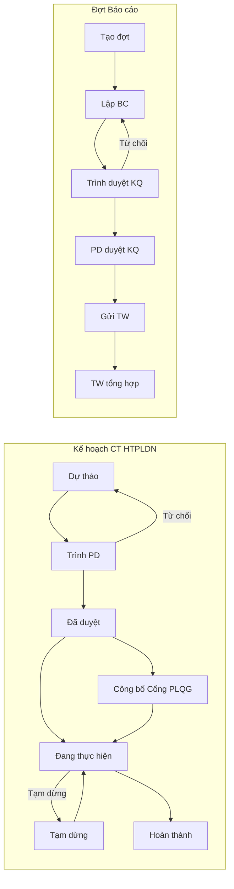
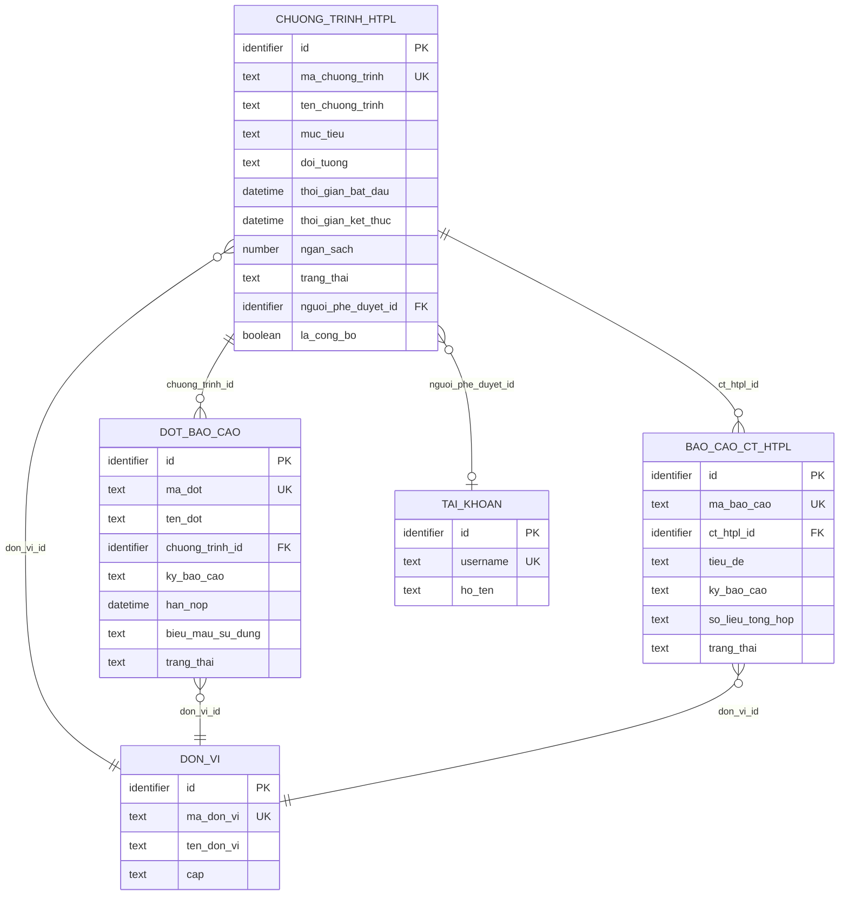
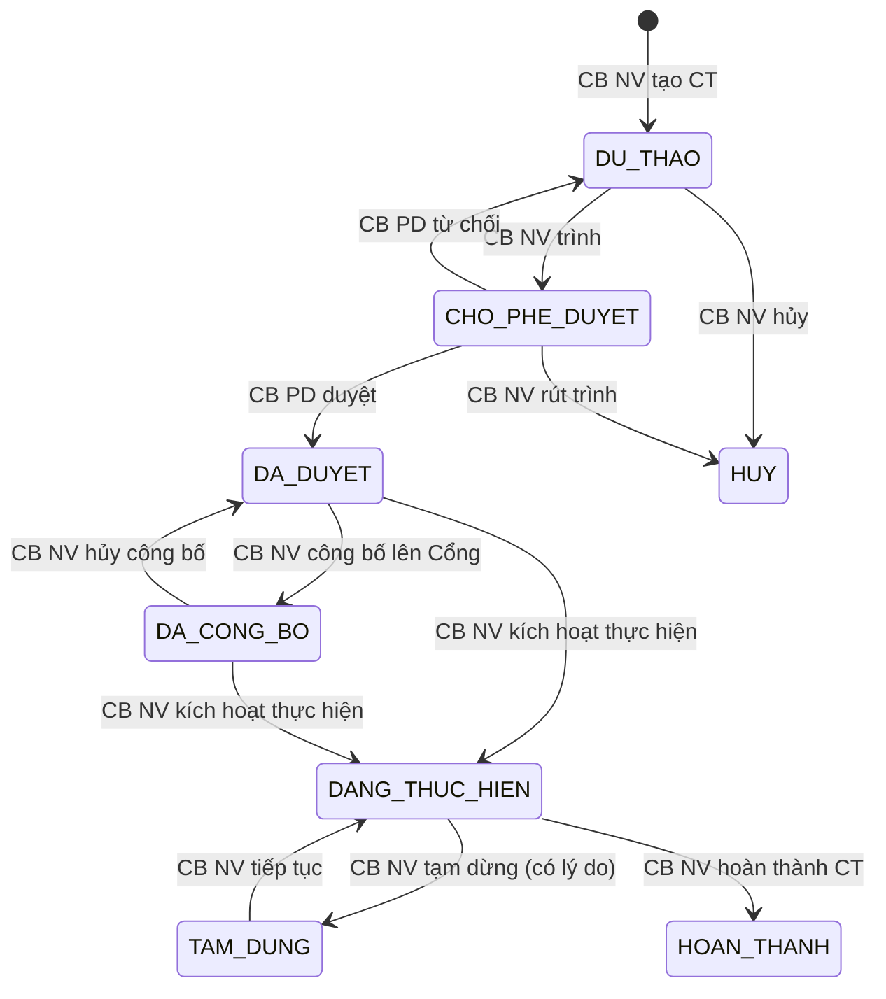
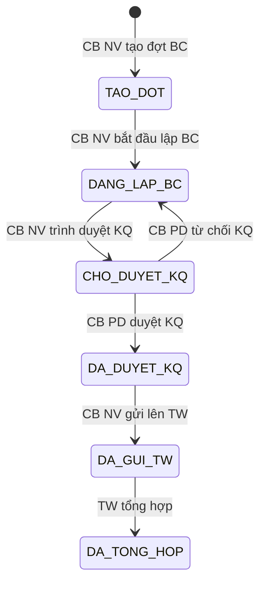

# SRS — Section 3.2.11: Chương trình HTPLDN

**Dự án:** Phần mềm hỗ trợ pháp lý doanh nghiệp
**Phiên bản SRS:** 3.0
**Nhóm:** XI — Chương trình HTPLDN
**UC range:** UC 164 – UC 172 (+ UC195, UC196)
**Số FR:** 11
**File chính:** `srs-v3.md` Section 3.2

---

## Mục lục file này

- [1. Tổng quan nhóm](#1-tổng-quan-nhóm)
- [2. Yêu cầu chức năng chi tiết](#2-yêu-cầu-chức-năng-chi-tiết)
- [3. Màn hình chức năng](#3-màn-hình-chức-năng)
- [4. Entity liên quan](#4-entity-liên-quan)
- [5. State Machine liên quan](#5-state-machine-liên-quan)
- [6. Business Rules liên quan](#6-business-rules-liên-quan)

---

## 1. Tổng quan nhóm

**Mục đích:** Quản lý kế hoạch, thực hiện, báo cáo chương trình hỗ trợ pháp lý doanh nghiệp theo cấp TW/BN/ĐP.

**Biểu mẫu BC:** TT17/2025/TT-BTP (21a, 21b). **Kỳ:** Sơ bộ 6 tháng / sơ bộ năm / tròn năm.

**Tác nhân chính:** Cán bộ Nghiệp vụ (TW/BN/ĐP), Cán bộ Phê duyệt (TW/BN/ĐP)

**Quy trình nghiệp vụ tổng quan:**

Nhóm XI quản lý 2 đối tượng riêng biệt, mỗi đối tượng có vòng đời (state machine) riêng:

1. **Kế hoạch thực hiện CT HTPLDN** — SM-KH-CTHTPL
2. **Quản lý đợt báo cáo** — SM-DOT-BC



**State Machine (a) — SM-KH-CTHTPL: Kế hoạch CT HTPLDN:**

```
[DU_THAO] →(trình duyệt)→ [CHO_PHE_DUYET]
[CHO_PHE_DUYET] →(duyệt)→ [DA_DUYET]
  →(từ chối)→ [DU_THAO]
[DA_DUYET] →(công bố)→ [DA_CONG_BO]
[DA_CONG_BO] →(hủy công bố)→ [DA_DUYET]
[DA_DUYET] →(thực hiện)→ [DANG_THUC_HIEN]
[DA_CONG_BO] →(thực hiện)→ [DANG_THUC_HIEN]
[DANG_THUC_HIEN] →(tạm dừng)→ [TAM_DUNG]
[TAM_DUNG] →(tiếp tục)→ [DANG_THUC_HIEN]
[DANG_THUC_HIEN] →(hoàn thành)→ [HOAN_THANH]
[DU_THAO] →(hủy)→ [HUY]
```

**State Machine (b) — SM-DOT-BC: Đợt báo cáo CT HTPLDN:**

```
[TAO_DOT] →(lập BC)→ [DANG_LAP_BC]
[DANG_LAP_BC] →(trình duyệt KQ)→ [CHO_DUYET_KQ]
[CHO_DUYET_KQ] →(PD duyệt KQ)→ [DA_DUYET_KQ]
  →(PD từ chối KQ)→ [DANG_LAP_BC]
[DA_DUYET_KQ] →(gửi lên TW)→ [DA_GUI_TW]
[DA_GUI_TW] →(TW tổng hợp)→ [DA_TONG_HOP]
```

**Deadline nộp BC (TT17/2025):**

| Loại BC | Cấp Sở/Ban ngành | Cấp STP |
|---------|----------------------|---------------|
| Sơ bộ 6 tháng | 10/06 | 20/06 |
| Sơ bộ năm | 10/11 | 20/11 |
| Tròn năm | 10/01 năm sau | 20/01 năm sau |

**Quy trình BC:** ĐP + BN (ngang cấp) → TW (tổng hợp)

**API:** Chỉ chia sẻ kế hoạch đã công bố (không kết quả).

---

## 2. Yêu cầu chức năng chi tiết

---

### FR-XI-01: Quản lý chương trình HTPL (UC164)

**UC Reference:** UC 164
**Source:** TT17/2025/TT-BTP — Thiết kế cơ sở
**Priority:** Essential
**Stability:** High
**Màn hình:** SCR-XI-01 — [Quản lý CT HTPL](#scr-xi-01-quản-lý-ct-htpl)

**Mô tả:**
CRUD chương trình HTPLDN: tạo mới (tự sinh mã, trạng thái DU_THAO), chỉnh sửa (chỉ khi DU_THAO), xóa mềm (chỉ khi DU_THAO), xem danh sách phân trang.

**Tác nhân:** Cán bộ Nghiệp vụ (TW/BN/ĐP)

**Preconditions (Điều kiện tiên quyết):**

- User đã đăng nhập (BR-AUTH-01)
- User có quyền "Quản lý CT HTPLDN"
- Phạm vi dữ liệu áp dụng theo đơn vị

**Inputs (Dữ liệu đầu vào):**

| # | Tên field | Kiểu logic | Bắt buộc | Ràng buộc | Mặc định | Nguồn |
|---|----------|-----------|----------|-----------|----------|-------|
| 1 | ma_chuong_trinh | text | Y (auto) | CT-{YYYYMMDD}-{SEQ} | Auto | Hệ thống |
| 2 | ten_chuong_trinh | text | Y | — | — | Nhập tay |
| 3 | muc_tieu | text (long) | Y | — | — | Nhập tay |
| 4 | thoi_gian_bat_dau | date | Y | — | — | Chọn |
| 5 | thoi_gian_ket_thuc | date | N | > thoi_gian_bat_dau (nếu có) | — | Chọn |
| 6 | ngan_sach | money | N | >= 0 | — | Nhập tay |
| 7 | doi_tuong | text (long) | Y | Đối tượng thụ hưởng | — | Nhập tay |
| 8 | don_vi_id | identifier | Y (auto) | FK → CO_QUAN_DON_VI | Đơn vị user | Hệ thống |
| 9 | ghi_chu | text (long) | N | — | — | Nhập tay |

**Processing (Xử lý):**

| Bước | Mô tả xử lý | BR áp dụng |
|------|-------------|-----------|
| 1 | Xác nhận dữ liệu đầu vào theo ràng buộc bảng Inputs | — |
| 2 | Kiểm tra quyền và phạm vi đơn vị | BR-AUTH-01 |
| 3 | Thêm mới: tự sinh mã, gán trạng thái DU_THAO | SM-KH-CTHTPL |
| 4 | Chỉnh sửa: chỉ cho phép khi trạng thái DU_THAO | BR-FLOW-03 |
| 5 | Xóa: chỉ cho phép khi trạng thái DU_THAO, xóa mềm | BR-DATA-01 |
| 6 | Hiển thị danh sách phân trang (20 mục/trang) | BR-DATA-07 |
| 7 | Ghi nhật ký thao tác | BR-DATA-05 |

**Business Rules áp dụng:**
- **SM-KH-CTHTPL**: Máy trạng thái Kế hoạch CT HTPLDN → Xem Phụ lục C (file chính)
- **BR-FLOW-03**: Chỉ sửa khi trạng thái cho phép → Xem Phụ lục B (file chính)
- **BR-DATA-01**: Xóa mềm (soft delete) → Xem Phụ lục B (file chính)

**Outputs (Dữ liệu đầu ra):**

| # | Tên | Kiểu logic | Điều kiện | Format |
|---|-----|-----------|-----------|--------|
| 1 | Chương trình mới/cập nhật | structured | Khi tạo/sửa | CHUONG_TRINH_HTPL |
| 2 | Danh sách CT | structured[] | Khi xem DS | Phân trang 20/page |

**Postconditions (Trạng thái sau thực hiện):**

- CHUONG_TRINH_HTPL record created/updated/deleted
- AUDIT_LOG ghi nhận

**Error Handling (Xử lý lỗi):**

| # | Điều kiện lỗi | Mã lỗi | Phản hồi hệ thống | Severity |
|---|--------------|--------|-------------------|----------|
| E1 | Thiếu trường bắt buộc | ERR-XI-01-01 | "Vui lòng nhập đầy đủ thông tin bắt buộc" | ERROR |
| E2 | Sửa CT không ở DU_THAO | ERR-XI-01-02 | "Chỉ chỉnh sửa CT ở trạng thái Dự thảo" | ERROR |
| E3 | Xóa CT không ở DU_THAO | ERR-XI-01-03 | "Chỉ xóa CT ở trạng thái Dự thảo" | ERROR |

**Acceptance Criteria:**

- **Given** CB NV truy cập "CT HTPL" **When** hiển thị **Then** danh sách CT thuộc đơn vị, phân trang
- **Given** CB NV thêm mới **When** nhập đủ trường **Then** validate + lưu
- **Given** CB NV sửa CT DU_THAO **When** thay đổi **Then** validate + lưu
- **Given** CB NV xóa CT DU_THAO **When** xác nhận **Then** soft delete

---

### FR-XI-02: Tìm kiếm CT HTPL (UC165)

**UC Reference:** UC 165
**Source:** TT17/2025/TT-BTP — Thiết kế cơ sở
**Priority:** Essential
**Stability:** High
**Màn hình:** SCR-XI-01 — [Quản lý CT HTPL](#scr-xi-01-quản-lý-ct-htpl)

**Mô tả:**
Tìm kiếm và lọc chương trình HTPLDN theo từ khóa, đơn vị, trạng thái, khoảng ngày. Kết quả phân trang, read-only.

**Tác nhân:** Cán bộ Nghiệp vụ / Cán bộ Phê duyệt

**Preconditions (Điều kiện tiên quyết):**

- User đã đăng nhập (BR-AUTH-01)

**Inputs (Dữ liệu đầu vào):**

| # | Tên field | Kiểu logic | Bắt buộc | Ràng buộc | Mặc định | Nguồn |
|---|----------|-----------|----------|-----------|----------|-------|
| 1 | keyword | text | N | Tên CT, mã CT | — | Nhập tay |
| 2 | don_vi_id | identifier | N | Auto phân quyền nếu không truyền | — | Chọn |
| 3 | trang_thai | text | N | Trạng thái SM-KH-CTHTPL | — | Chọn |
| 4 | tu_ngay | date | N | — | — | Chọn |
| 5 | den_ngay | date | N | — | — | Chọn |

**Processing (Xử lý):**

| Bước | Mô tả xử lý | BR áp dụng |
|------|-------------|-----------|
| 1 | Kiểm tra quyền và phạm vi đơn vị | BR-AUTH-01 |
| 2 | Áp dụng bộ lọc (AND logic) | — |
| 3 | Phân trang + trả về kết quả | BR-DATA-07 |

**Outputs (Dữ liệu đầu ra):**

| # | Tên | Kiểu logic | Điều kiện | Format |
|---|-----|-----------|-----------|--------|
| 1 | Danh sách CT phân trang | structured[] | Luôn | id, ma_ct, ten, don_vi, trang_thai, ngay_bd, ngay_kt |
| 2 | Tổng bản ghi | number | Luôn | Số nguyên |

**Postconditions (Trạng thái sau thực hiện):**

- Read-only, không thay đổi dữ liệu

**Error Handling (Xử lý lỗi):**

| # | Điều kiện lỗi | Mã lỗi | Phản hồi hệ thống | Severity |
|---|--------------|--------|-------------------|----------|
| E1 | Không có kết quả | INF-CT-TK-01 | "Không tìm thấy chương trình phù hợp" | INFO |

**Acceptance Criteria:**

- **Given** user nhập từ khóa/lọc **When** tìm kiếm **Then** hiển thị kết quả AND nhiều điều kiện, phân trang

---

### FR-XI-03: Trình phê duyệt CT (UC166)

**UC Reference:** UC 166
**Source:** TT17/2025/TT-BTP — Thiết kế cơ sở
**Priority:** Essential
**Stability:** High
**Màn hình:** SCR-XI-01 — [Quản lý CT HTPL](#scr-xi-01-quản-lý-ct-htpl)

**Mô tả:**
CB NV trình CT HTPLDN lên CB PD để phê duyệt. Hệ thống kiểm tra trạng thái, chuyển sang CHO_PHE_DUYET, gửi thông báo.

**Tác nhân:** Cán bộ Nghiệp vụ

**Preconditions (Điều kiện tiên quyết):**

- CT ở trạng thái DU_THAO (sau khi hoàn chỉnh nội dung)

**Inputs (Dữ liệu đầu vào):**

| # | Tên field | Kiểu logic | Bắt buộc | Ràng buộc | Mặc định | Nguồn |
|---|----------|-----------|----------|-----------|----------|-------|
| 1 | chuong_trinh_id | identifier | Y | FK → CHUONG_TRINH_HTPL | — | Context |

**Processing (Xử lý):**

| Bước | Mô tả xử lý | BR áp dụng |
|------|-------------|-----------|
| 1 | Kiểm tra quyền truy cập | BR-AUTH-01 |
| 2 | Kiểm tra CT ở trạng thái DU_THAO | SM-KH-CTHTPL |
| 3 | Validate dữ liệu CT đầy đủ | — |
| 4 | Chuyển trạng thái sang CHO_PHE_DUYET | SM-KH-CTHTPL |
| 5 | Gửi thông báo CB PD cùng cấp | — |
| 6 | Ghi nhật ký thao tác | BR-DATA-05 |

**Business Rules áp dụng:**
- **SM-KH-CTHTPL**: Transition DU_THAO → CHO_PHE_DUYET → Xem Phụ lục C (file chính)

**Outputs (Dữ liệu đầu ra):**

| # | Tên | Kiểu logic | Điều kiện | Format |
|---|-----|-----------|-----------|--------|
| 1 | Trạng thái mới | text | Luôn | CHO_PHE_DUYET |

**Postconditions (Trạng thái sau thực hiện):**

- CT chuyển sang CHO_PHE_DUYET
- Thông báo gửi CB PD

**Error Handling (Xử lý lỗi):**

| # | Điều kiện lỗi | Mã lỗi | Phản hồi hệ thống | Severity |
|---|--------------|--------|-------------------|----------|
| E1 | CT không ở DU_THAO | ERR-XI-03-01 | "CT không ở trạng thái cho phép trình duyệt" | ERROR |

**Acceptance Criteria:**

- **Given** CB NV chọn CT hoàn chỉnh **When** nhấn "Trình phê duyệt" **Then** CT → CHO_PHE_DUYET, gửi thông báo CB PD

---

### FR-XI-04: Phê duyệt CT (UC167)

**UC Reference:** UC 167
**Source:** TT17/2025/TT-BTP — Thiết kế cơ sở
**Priority:** Essential
**Stability:** High
**Màn hình:** SCR-XI-01 — [Quản lý CT HTPLDN (tổng hợp)](#scr-xi-01-quan-ly-ct-htpldn-tong-hop) (v2.1: action buttons trong chi tiết CT)

**Mô tả:**
CB PD xem CT chờ duyệt, quyết định phê duyệt (→ DA_DUYET) hoặc từ chối (→ DU_THAO + lý do).

**Tác nhân:** Cán bộ Phê duyệt (TW/BN/ĐP)

**Preconditions (Điều kiện tiên quyết):**

- CT ở trạng thái CHO_PHE_DUYET
- User có quyền Phê duyệt, cùng cấp (BR-AUTH-05)

**Inputs (Dữ liệu đầu vào):**

| # | Tên field | Kiểu logic | Bắt buộc | Ràng buộc | Mặc định | Nguồn |
|---|----------|-----------|----------|-----------|----------|-------|
| 1 | chuong_trinh_id | identifier | Y | FK → CHUONG_TRINH_HTPL | — | Context |
| 2 | quyet_dinh | text | Y | DUYET / TU_CHOI | — | Chọn |
| 3 | ly_do_tu_choi | text (long) | Conditional | Bắt buộc khi TU_CHOI | — | Nhập tay |
| 4 | ghi_chu_phe_duyet | text (long) | N | — | — | Nhập tay |

**Processing (Xử lý):**

| Bước | Mô tả xử lý | BR áp dụng |
|------|-------------|-----------|
| 1 | Kiểm tra quyền CB PD cùng cấp | BR-AUTH-01, BR-AUTH-05 |
| 2 | Kiểm tra CT ở trạng thái CHO_PHE_DUYET | SM-KH-CTHTPL |
| 3 | Nếu DUYỆT: chuyển trạng thái sang DA_DUYET | SM-KH-CTHTPL |
| 4 | Nếu TỪ CHỐI: chuyển trạng thái sang DU_THAO + ghi lý do | SM-KH-CTHTPL |
| 5 | Gửi thông báo CB NV (kết quả + lý do nếu từ chối) | — |
| 6 | Ghi nhật ký thao tác | BR-DATA-05 |

**Business Rules áp dụng:**
- **SM-KH-CTHTPL**: Transition CHO_PHE_DUYET → DA_DUYET (duyệt) / DU_THAO (từ chối) → Xem Phụ lục C (file chính)
- **BR-AUTH-05**: CB PD phải cùng cấp với CB NV trình → Xem Phụ lục B (file chính)

**Outputs (Dữ liệu đầu ra):**

| # | Tên | Kiểu logic | Điều kiện | Format |
|---|-----|-----------|-----------|--------|
| 1 | Kết quả phê duyệt | text | Luôn | DUYET / TU_CHOI |
| 2 | Trạng thái CT mới | text | Luôn | DA_DUYET / DU_THAO |

**Postconditions (Trạng thái sau thực hiện):**

- Nếu duyệt: CT → DA_DUYET
- Nếu từ chối: CT → DU_THAO (KHONG phai HOAN_CHINH), CB NV chỉnh sửa

**Error Handling (Xử lý lỗi):**

| # | Điều kiện lỗi | Mã lỗi | Phản hồi hệ thống | Severity |
|---|--------------|--------|-------------------|----------|
| E1 | CT không ở CHO_PHE_DUYET | ERR-XI-04-01 | "CT không ở trạng thái chờ phê duyệt" | ERROR |
| E2 | Từ chối thiếu lý do | ERR-XI-04-02 | "Vui lòng nhập lý do từ chối" | ERROR |
| E3 | CB PD khác cấp | ERR-XI-04-03 | "Bạn chỉ được phê duyệt CT cùng cấp" | ERROR |

**Acceptance Criteria:**

- **Given** CB PD xem CT chờ duyệt **When** phê duyệt/từ chối **Then** cập nhật trạng thái, ghi audit

---

### FR-XI-05: Công bố kế hoạch CT (UC168)

**UC Reference:** UC 168
**Source:** TT17/2025/TT-BTP — Thiết kế cơ sở
**Priority:** Essential
**Stability:** High
**Màn hình:** SCR-XI-01 — [Quản lý CT HTPLDN (tổng hợp)](#scr-xi-01-quan-ly-ct-htpldn-tong-hop) (v2.1: action button "Công bố" trong chi tiết CT)

**Mô tả:**
Công bố kế hoạch CT đã duyệt lên Cổng PLQG qua API. Hỗ trợ hủy công bố để gỡ khỏi Cổng.

**Tác nhân:** Cán bộ Nghiệp vụ

**Preconditions (Điều kiện tiên quyết):**

- CT ở trạng thái DA_DUYET

**Inputs (Dữ liệu đầu vào):**

| # | Tên field | Kiểu logic | Bắt buộc | Ràng buộc | Mặc định | Nguồn |
|---|----------|-----------|----------|-----------|----------|-------|
| 1 | chuong_trinh_id | identifier | Y | FK → CHUONG_TRINH_HTPL | — | Context |

**Processing (Xử lý):**

**Công bố:**

| Bước | Mô tả xử lý | BR áp dụng |
|------|-------------|-----------|
| 1 | Kiểm tra quyền truy cập | BR-AUTH-01 |
| 2 | Kiểm tra CT ở trạng thái DA_DUYET | SM-KH-CTHTPL |
| 3 | Chuyển trạng thái sang DA_CONG_BO | SM-KH-CTHTPL |
| 4 | Đẩy kế hoạch qua API → Cổng PLQG (FR-XII-15) | — |
| 5 | Ghi nhật ký thao tác | BR-DATA-05 |

**Hủy công bố:**

| Bước | Mô tả xử lý | BR áp dụng |
|------|-------------|-----------|
| 1 | CB NV nhấn "Hủy công bố" | — |
| 2 | Chuyển trạng thái sang DA_DUYET | SM-KH-CTHTPL |
| 3 | Gửi API gỡ khỏi Cổng | — |

**Business Rules áp dụng:**
- **SM-KH-CTHTPL**: Transition DA_DUYET → DA_CONG_BO / DA_CONG_BO → DA_DUYET → Xem Phụ lục C (file chính)

**Outputs (Dữ liệu đầu ra):**

| # | Tên | Kiểu logic | Điều kiện | Format |
|---|-----|-----------|-----------|--------|
| 1 | Trạng thái mới | text | Luôn | DA_CONG_BO / DA_DUYET |

**Postconditions (Trạng thái sau thực hiện):**

- Công bố: CT → DA_CONG_BO, kế hoạch hiển thị trên Cổng PLQG
- Hủy: CT → DA_DUYET, gỡ khỏi Cổng

**Error Handling (Xử lý lỗi):**

| # | Điều kiện lỗi | Mã lỗi | Phản hồi hệ thống | Severity |
|---|--------------|--------|-------------------|----------|
| E1 | CT không ở DA_DUYET | ERR-XI-05-01 | "CT chưa được phê duyệt" | ERROR |
| E2 | Lỗi API Cổng PLQG | ERR-XI-05-02 | "Không thể kết nối Cổng PLQG. Vui lòng thử lại" | ERROR |

**Acceptance Criteria:**

- **Given** CB NV chọn CT đã duyệt **When** nhấn "Công bố" **Then** đẩy API lên Cổng, trạng thái → DA_CONG_BO
- **Given** CB NV hủy công bố **When** xác nhận **Then** gỡ khỏi Cổng, trạng thái → DA_DUYET

---

### FR-XI-05a: Quản lý đợt báo cáo CT HTPLDN (UC195)

**UC Reference:** UC 195
**Source:** TT17/2025/TT-BTP — CSV v1.1 (C1-8, STT 165)
**Priority:** Essential
**Stability:** High
**Màn hình:** SCR-XI-01 — [Quản lý CT HTPLDN (tổng hợp)](#scr-xi-01-quan-ly-ct-htpldn-tong-hop) (v2.1: tab "Đợt báo cáo" trong chi tiết CT)

**Mô tả:**
CRUD đợt báo cáo cho CT HTPLDN: tạo đợt BC (tự sinh mã, gán trạng thái TAO_DOT), chỉnh sửa/xóa (chỉ khi TAO_DOT), xem danh sách phân trang.

**Tác nhân:** Cán bộ Nghiệp vụ (TW/BN/ĐP)

**Preconditions (Điều kiện tiên quyết):**

- User đã đăng nhập (BR-AUTH-01)
- User có quyền "Quản lý đợt báo cáo CT HTPLDN"
- Phạm vi dữ liệu áp dụng theo đơn vị
- CT HTPL ở trạng thái DANG_THUC_HIEN hoặc HOAN_THANH

**Inputs (Dữ liệu đầu vào):**

| # | Tên field | Kiểu logic | Bắt buộc | Ràng buộc | Mặc định | Nguồn |
|---|----------|-----------|----------|-----------|----------|-------|
| 1 | ma_dot | text | Y (auto) | DOT-{CT_ID}-{SEQ} | Auto | Hệ thống |
| 2 | ten_dot | text | Y | — | — | Nhập tay |
| 3 | chuong_trinh_id | identifier | Y | FK → CHUONG_TRINH_HTPL | — | Chọn |
| 4 | ky_bao_cao | text | Y | SO_BO_6_THANG / SO_BO_NAM / TRON_NAM | — | Chọn |
| 5 | han_nop | date | Y | Theo deadline TT17/2025 | — | Chọn |
| 6 | tu_ngay | date | Y | Kỳ từ ngày | — | Chọn |
| 7 | den_ngay | date | Y | Kỳ đến ngày | — | Chọn |
| 8 | ghi_chu | text (long) | N | — | — | Nhập tay |
| 9 | bieu_mau_su_dung | text | Y | MAU_21A / MAU_21B / CA_HAI | — | Chọn |

**Processing (Xử lý):**

| Bước | Mô tả xử lý | BR áp dụng |
|------|-------------|-----------|
| 1 | Xác nhận dữ liệu đầu vào theo ràng buộc bảng Inputs | — |
| 2 | Kiểm tra quyền và phạm vi đơn vị | BR-AUTH-01 |
| 3 | Thêm mới: tự sinh mã, gán trạng thái TAO_DOT | SM-DOT-BC |
| 4 | Kiểm tra CT phải ở DANG_THUC_HIEN hoặc HOAN_THANH | SM-KH-CTHTPL |
| 5 | Kiểm tra không trùng đợt (cùng CT + kỳ + khoảng thời gian) | — |
| 6 | Chỉnh sửa: chỉ khi trạng thái TAO_DOT | SM-DOT-BC |
| 7 | Xóa: chỉ khi trạng thái TAO_DOT, xóa mềm | BR-DATA-01 |
| 8 | Hiển thị danh sách phân trang (20 mục/trang) | BR-DATA-07 |
| 9 | Ghi nhật ký thao tác | BR-DATA-05 |

**Business Rules áp dụng:**
- **SM-DOT-BC**: Máy trạng thái Đợt báo cáo → Xem Phụ lục C (file chính)

**Outputs (Dữ liệu đầu ra):**

| # | Tên | Kiểu logic | Điều kiện | Format |
|---|-----|-----------|-----------|--------|
| 1 | Đợt BC mới/cập nhật | structured | Khi tạo/sửa | DOT_BAO_CAO |
| 2 | Danh sách đợt BC | structured[] | Khi xem DS | Phân trang 20/page |

**Postconditions (Trạng thái sau thực hiện):**

- DOT_BAO_CAO record created/updated/deleted
- AUDIT_LOG ghi nhận

**Error Handling (Xử lý lỗi):**

| # | Điều kiện lỗi | Mã lỗi | Phản hồi hệ thống | Severity |
|---|--------------|--------|-------------------|----------|
| E1 | CT không ở DANG_THUC_HIEN/HOAN_THANH | ERR-XI-05a-01 | "Chỉ tạo đợt BC cho CT đang thực hiện hoặc đã hoàn thành" | ERROR |
| E2 | Đợt BC trùng kỳ | ERR-XI-05a-02 | "Đã tồn tại đợt báo cáo cho kỳ này" | ERROR |
| E3 | Xóa đợt không ở TAO_DOT | ERR-XI-05a-03 | "Chỉ xóa đợt BC ở trạng thái Tạo đợt" | ERROR |

**Acceptance Criteria:**

- **Given** CB NV truy cập "Đợt báo cáo" **When** hiển thị **Then** DS đợt BC thuộc đơn vị, phân trang
- **Given** CB NV thêm đợt BC mới **When** chọn CT + kỳ + hạn nộp **Then** validate + tạo đợt BC, trạng thái TAO_DOT
- **Given** CB NV sửa đợt BC ở TAO_DOT **When** thay đổi **Then** validate + lưu
- **Given** CB NV xóa đợt BC ở TAO_DOT **When** xác nhận **Then** soft delete

---

### FR-XI-06: Lập BC kết quả thực hiện CT (UC169)

**UC Reference:** UC 169
**Source:** TT17/2025/TT-BTP — Thiết kế cơ sở
**Priority:** Essential
**Stability:** High
**Màn hình:** SCR-XI-01 — [Quản lý CT HTPLDN (tổng hợp)](#scr-xi-01-quan-ly-ct-htpldn-tong-hop) (v2.1: form lập BC trong tab "Đợt báo cáo")

**Mô tả:**
CB NV lập báo cáo kết quả thực hiện CT theo mẫu TT17/2025 (21a/21b). Hệ thống gợi ý số liệu từ dữ liệu hiện có.

**Tác nhân:** Cán bộ Nghiệp vụ (TW/BN/ĐP)

**Preconditions (Điều kiện tiên quyết):**

- CT đã/đang thực hiện
- Đợt BC đã tạo

**Inputs (Dữ liệu đầu vào):**

| # | Tên field | Kiểu logic | Bắt buộc | Ràng buộc | Mặc định | Nguồn |
|---|----------|-----------|----------|-----------|----------|-------|
| 1 | chuong_trinh_id | identifier | Y | FK → CHUONG_TRINH_HTPL | — | Context |
| 2 | ky_bao_cao | text | Y | SO_BO_6_THANG / SO_BO_NAM / TRON_NAM | — | Context |
| 3 | tu_ngay | date | Y | Kỳ từ ngày | — | Context |
| 4 | den_ngay | date | Y | Kỳ đến ngày | — | Context |
| 5 | so_lieu | structured | Y | Số liệu theo cột 21a/21b | Gợi ý từ HT | Nhập tay / Auto |
| 6 | nhan_xet | text (long) | N | Max 5000 ký tự | — | Nhập tay |

**Processing (Xử lý):**

| Bước | Mô tả xử lý | BR áp dụng |
|------|-------------|-----------|
| 1 | Kiểm tra quyền truy cập | BR-AUTH-01 |
| 2 | Hiển thị form BC theo mẫu TT17/2025 (21a/21b) | — |
| 3 | Gợi ý số liệu từ dữ liệu hệ thống (đếm VV, tổng chi phí...) nếu có | — |
| 4 | CB NV nhập/chỉnh sửa số liệu + nhận xét, kiến nghị | — |
| 5 | Lưu bản ghi báo cáo CT | — |
| 6 | Ghi nhật ký thao tác | BR-DATA-05 |

**Outputs (Dữ liệu đầu ra):**

| # | Tên | Kiểu logic | Điều kiện | Format |
|---|-----|-----------|-----------|--------|
| 1 | Báo cáo CT | structured | Khi lưu | BAO_CAO_CT_HTPL |

**Postconditions (Trạng thái sau thực hiện):**

- BAO_CAO_CT_HTPL record created
- AUDIT_LOG ghi nhận

**Error Handling (Xử lý lỗi):**

| # | Điều kiện lỗi | Mã lỗi | Phản hồi hệ thống | Severity |
|---|--------------|--------|-------------------|----------|
| E1 | Thiếu số liệu bắt buộc | ERR-XI-06-01 | "Vui lòng nhập đầy đủ số liệu bắt buộc" | ERROR |

**Acceptance Criteria:**

- **Given** CB NV chọn CT **When** nhấn "Lập BC" **Then** form BC theo 21a/21b
- **Given** CB NV nhập số liệu **When** lưu **Then** validate + lưu BC

---

### FR-XI-07: Trình phê duyệt BC (UC170)

**UC Reference:** UC 170
**Source:** TT17/2025/TT-BTP — Thiết kế cơ sở
**Priority:** Essential
**Stability:** High
**Màn hình:** SCR-XI-01 — [Quản lý CT HTPLDN (tổng hợp)](#scr-xi-01-quan-ly-ct-htpldn-tong-hop) (v2.1: form lập BC trong tab "Đợt báo cáo")

**Mô tả:**
CB NV trình BC kết quả lên CB PD. Hệ thống kiểm tra BC hoàn chỉnh, chuyển trạng thái đợt BC sang CHO_DUYET_KQ.

**Tác nhân:** Cán bộ Nghiệp vụ

**Preconditions (Điều kiện tiên quyết):**

- BC đã được lập và lưu
- Đợt BC ở trạng thái DANG_LAP_BC

**Inputs (Dữ liệu đầu vào):**

| # | Tên field | Kiểu logic | Bắt buộc | Ràng buộc | Mặc định | Nguồn |
|---|----------|-----------|----------|-----------|----------|-------|
| 1 | bao_cao_id | identifier | Y | FK → BAO_CAO_CT_HTPL | — | Context |

**Processing (Xử lý):**

| Bước | Mô tả xử lý | BR áp dụng |
|------|-------------|-----------|
| 1 | Kiểm tra quyền truy cập | BR-AUTH-01 |
| 2 | Kiểm tra BC hoàn chỉnh | — |
| 3 | Chuyển trạng thái BC sang CHO_PHE_DUYET, đợt BC sang CHO_DUYET_KQ | SM-DOT-BC |
| 4 | Gửi thông báo CB PD | — |
| 5 | Ghi nhật ký thao tác | BR-DATA-05 |

**Business Rules áp dụng:**
- **SM-DOT-BC**: Transition DANG_LAP_BC → CHO_DUYET_KQ → Xem Phụ lục C (file chính)

**Outputs (Dữ liệu đầu ra):**

| # | Tên | Kiểu logic | Điều kiện | Format |
|---|-----|-----------|-----------|--------|
| 1 | Trạng thái đợt BC mới | text | Luôn | CHO_DUYET_KQ |

**Postconditions (Trạng thái sau thực hiện):**

- Đợt BC chuyển sang CHO_DUYET_KQ
- Thông báo gửi CB PD

**Error Handling (Xử lý lỗi):**

| # | Điều kiện lỗi | Mã lỗi | Phản hồi hệ thống | Severity |
|---|--------------|--------|-------------------|----------|
| E1 | BC chưa hoàn chỉnh | ERR-XI-07-01 | "Vui lòng hoàn chỉnh BC trước khi trình" | ERROR |

**Acceptance Criteria:**

- **Given** CB NV chọn BC hoàn chỉnh **When** nhấn "Trình phê duyệt" **Then** BC → CHO_PHE_DUYET, đợt BC → CHO_DUYET_KQ, gửi thông báo CB PD

---

### FR-XI-07a: Phê duyệt BC kết quả thực hiện CT (UC196)

**UC Reference:** UC 196
**Source:** TT17/2025/TT-BTP — CSV v1.1 (C1-9, STT 168)
**Priority:** Essential
**Stability:** High
**Màn hình:** SCR-XI-01 — [Quản lý CT HTPLDN (tổng hợp)](#scr-xi-01-quan-ly-ct-htpldn-tong-hop) (v2.1: action phê duyệt BC trong tab "Đợt báo cáo")

**Mô tả:**
CB PD xem BC kết quả chờ duyệt, quyết định phê duyệt (→ DA_DUYET_KQ) hoặc từ chối (→ DANG_LAP_BC + lý do).

**Tác nhân:** Cán bộ Phê duyệt (TW/BN/ĐP)

**Preconditions (Điều kiện tiên quyết):**

- User đã đăng nhập (BR-AUTH-01)
- User có quyền "Phê duyệt BC kết quả CT"
- BC ở trạng thái CHO_DUYET_KQ (đợt BC đã trình)
- CB PD cùng cấp với CB NV trình (BR-AUTH-05)

**Inputs (Dữ liệu đầu vào):**

| # | Tên field | Kiểu logic | Bắt buộc | Ràng buộc | Mặc định | Nguồn |
|---|----------|-----------|----------|-----------|----------|-------|
| 1 | bao_cao_id | identifier | Y | FK → BAO_CAO_CT_HTPL | — | Context |
| 2 | quyet_dinh | text | Y | DUYET / TU_CHOI | — | Chọn |
| 3 | ly_do_tu_choi | text (long) | Conditional | Bắt buộc khi TU_CHOI | — | Nhập tay |
| 4 | ghi_chu_phe_duyet | text (long) | N | — | — | Nhập tay |

**Processing (Xử lý):**

| Bước | Mô tả xử lý | BR áp dụng |
|------|-------------|-----------|
| 1 | Kiểm tra quyền: CB PD cùng cấp | BR-AUTH-01, BR-AUTH-05 |
| 2 | Kiểm tra đợt BC ở trạng thái CHO_DUYET_KQ | SM-DOT-BC |
| 3 | Nếu DUYỆT: chuyển đợt BC → DA_DUYET_KQ, BC → DA_DUYET | SM-DOT-BC |
| 4 | Nếu TỪ CHỐI: chuyển đợt BC → DANG_LAP_BC, BC → TU_CHOI + ghi lý do | SM-DOT-BC, BR-FLOW-04 |
| 5 | Gửi thông báo CB NV (kết quả duyệt) | — |
| 6 | Ghi nhật ký thao tác | BR-DATA-05 |

**Business Rules áp dụng:**
- **SM-DOT-BC**: Transition CHO_DUYET_KQ → DA_DUYET_KQ (duyệt) / DANG_LAP_BC (từ chối) → Xem Phụ lục C (file chính)
- **BR-AUTH-05**: CB PD phải cùng cấp → Xem Phụ lục B (file chính)
- **BR-FLOW-04**: Từ chối bắt buộc lý do → Xem Phụ lục B (file chính)

**Outputs (Dữ liệu đầu ra):**

| # | Tên | Kiểu logic | Điều kiện | Format |
|---|-----|-----------|-----------|--------|
| 1 | Kết quả phê duyệt | text | Luôn | DUYET / TU_CHOI |
| 2 | Trạng thái đợt BC | text | Luôn | DA_DUYET_KQ / DANG_LAP_BC |

**Postconditions (Trạng thái sau thực hiện):**

- Nếu duyệt: Đợt BC → DA_DUYET_KQ, BC → DA_DUYET. CB NV có thể "Gửi lên TW" (UC171)
- Nếu từ chối: Đợt BC → DANG_LAP_BC, BC → TU_CHOI. CB NV chỉnh sửa + trình lại

**Error Handling (Xử lý lỗi):**

| # | Điều kiện lỗi | Mã lỗi | Phản hồi hệ thống | Severity |
|---|--------------|--------|-------------------|----------|
| E1 | BC không ở CHO_DUYET_KQ | ERR-XI-07a-01 | "BC không ở trạng thái chờ duyệt kết quả" | ERROR |
| E2 | Từ chối thiếu lý do | ERR-XI-07a-02 | "Vui lòng nhập lý do từ chối" | ERROR |
| E3 | CB PD khác cấp | ERR-XI-07a-03 | "Bạn chỉ được phê duyệt BC cùng cấp" | ERROR |

**Acceptance Criteria:**

- **Given** CB PD thấy DS BC chờ duyệt KQ **When** chọn BC + Duyệt **Then** đợt BC → DA_DUYET_KQ, gửi TB CB NV
- **Given** CB PD chọn BC + Từ chối **When** nhập lý do **Then** đợt BC → DANG_LAP_BC, gửi TB CB NV kèm lý do
- **Given** CB PD từ chối không nhập lý do **When** submit **Then** hiển thị lỗi bắt buộc lý do

---

### FR-XI-08: Gửi kết quả lên TW (UC171)

**UC Reference:** UC 171
**Source:** TT17/2025/TT-BTP — Thiết kế cơ sở
**Priority:** Essential
**Stability:** High
**Màn hình:** SCR-XI-01 — [Quản lý CT HTPLDN (tổng hợp)](#scr-xi-01-quan-ly-ct-htpldn-tong-hop) (v2.1: action gửi TW / tổng hợp trong tab "Đợt báo cáo")

**Mô tả:**
CB NV BN/ĐP gửi BC kết quả đã duyệt lên TW để tổng hợp. BC hiển thị trong danh sách "Tổng hợp" của cấp TW.

**Tác nhân:** Cán bộ Nghiệp vụ BN/ĐP

**Preconditions (Điều kiện tiên quyết):**

- User thuộc cấp BN hoặc ĐP
- BC đã được phê duyệt KQ (đợt BC ở DA_DUYET_KQ)

**Inputs (Dữ liệu đầu vào):**

| # | Tên field | Kiểu logic | Bắt buộc | Ràng buộc | Mặc định | Nguồn |
|---|----------|-----------|----------|-----------|----------|-------|
| 1 | dot_bao_cao_id | identifier | Y | FK → DOT_BAO_CAO | — | Context |

**Processing (Xử lý):**

| Bước | Mô tả xử lý | BR áp dụng |
|------|-------------|-----------|
| 1 | Kiểm tra quyền: CB NV BN/ĐP | BR-AUTH-01 |
| 2 | Kiểm tra đợt BC ở trạng thái DA_DUYET_KQ | SM-DOT-BC |
| 3 | Chuyển trạng thái đợt BC sang DA_GUI_TW, đánh dấu da_gui_tw, ghi thời điểm gửi | SM-DOT-BC |
| 4 | BC hiển thị trong danh sách "Tổng hợp" của cấp TW | — |
| 5 | Gửi thông báo CB NV TW | — |
| 6 | Ghi nhật ký thao tác | BR-DATA-05 |

**Business Rules áp dụng:**
- **SM-DOT-BC**: Transition DA_DUYET_KQ → DA_GUI_TW → Xem Phụ lục C (file chính)

**Outputs (Dữ liệu đầu ra):**

| # | Tên | Kiểu logic | Điều kiện | Format |
|---|-----|-----------|-----------|--------|
| 1 | Trạng thái đợt BC mới | text | Luôn | DA_GUI_TW |

**Postconditions (Trạng thái sau thực hiện):**

- Đợt BC → DA_GUI_TW
- BC hiển thị cho TW tổng hợp
- Thông báo gửi CB NV TW

**Error Handling (Xử lý lỗi):**

| # | Điều kiện lỗi | Mã lỗi | Phản hồi hệ thống | Severity |
|---|--------------|--------|-------------------|----------|
| E1 | Đợt BC không ở DA_DUYET_KQ | ERR-XI-08-01 | "Đợt BC chưa được phê duyệt kết quả" | ERROR |
| E2 | User không phải BN/ĐP | ERR-XI-08-02 | "Chỉ đơn vị BN/ĐP mới gửi BC lên TW" | ERROR |

**Acceptance Criteria:**

- **Given** CB NV BN/ĐP chọn BC đã duyệt KQ **When** nhấn "Gửi lên TW" **Then** đợt BC → DA_GUI_TW, BC gửi lên TW tổng hợp

---

### FR-XI-09: TW tổng hợp BC (UC172)

**UC Reference:** UC 172
**Source:** TT17/2025/TT-BTP — Thiết kế cơ sở
**Priority:** Essential
**Stability:** High
**Màn hình:** SCR-XI-01 — [Quản lý CT HTPLDN (tổng hợp)](#scr-xi-01-quan-ly-ct-htpldn-tong-hop) (v2.1: action gửi TW / tổng hợp trong tab "Đợt báo cáo")

**Mô tả:**
CB NV TW xem danh sách BC từ BN/ĐP đã gửi, chọn các BC cần tổng hợp. Hệ thống gợi ý số liệu (tổng các cột 21a/21b), CB NV chỉnh sửa/bổ sung, lưu BC tổng hợp toàn quốc, xuất file.

**Tác nhân:** Cán bộ Nghiệp vụ TW

**Preconditions (Điều kiện tiên quyết):**

- User thuộc cấp TW
- Có BC từ BN/ĐP đã gửi

**Inputs (Dữ liệu đầu vào):**

| # | Tên field | Kiểu logic | Bắt buộc | Ràng buộc | Mặc định | Nguồn |
|---|----------|-----------|----------|-----------|----------|-------|
| 1 | bao_cao_ids | identifier[] | Y | FK → BAO_CAO_CT_HTPL, da_gui_tw = true | — | Checkbox chọn |

**Processing (Xử lý):**

| Bước | Mô tả xử lý | BR áp dụng |
|------|-------------|-----------|
| 1 | Kiểm tra quyền: CB NV TW | BR-AUTH-01 |
| 2 | Hiển thị danh sách BC từ BN + ĐP đã gửi | — |
| 3 | CB NV TW chọn các BC cần tổng hợp | — |
| 4 | Hệ thống gợi ý số liệu: tính tổng các cột tương ứng 21a/21b | — |
| 5 | CB NV TW chỉnh sửa/bổ sung trên form tổng hợp | — |
| 6 | Lưu bản ghi BC tổng hợp toàn quốc (loại TONG_HOP_TW) | — |
| 7 | Chuyển các đợt BC đã chọn sang DA_TONG_HOP | SM-DOT-BC |
| 8 | Xuất file Excel/Word theo mẫu TT17 | — |
| 9 | Ghi nhật ký thao tác | BR-DATA-05 |

**Business Rules áp dụng:**
- **SM-DOT-BC**: Transition DA_GUI_TW → DA_TONG_HOP → Xem Phụ lục C (file chính)

**Outputs (Dữ liệu đầu ra):**

| # | Tên | Kiểu logic | Điều kiện | Format |
|---|-----|-----------|-----------|--------|
| 1 | BC tổng hợp TW | structured | Khi lưu | BAO_CAO_CT (loai = TONG_HOP_TW) |
| 2 | File xuất | file | Khi xuất | Excel (.xlsx) / Word (.docx) theo TT17 |

**Postconditions (Trạng thái sau thực hiện):**

- BAO_CAO_CT record created (loai = TONG_HOP_TW)
- Các đợt BC chọn → DA_TONG_HOP
- File xuất theo TT17/2025

**Error Handling (Xử lý lỗi):**

| # | Điều kiện lỗi | Mã lỗi | Phản hồi hệ thống | Severity |
|---|--------------|--------|-------------------|----------|
| E1 | Không chọn BC nào | ERR-XI-09-01 | "Vui lòng chọn ít nhất 1 BC để tổng hợp" | ERROR |
| E2 | User không phải TW | ERR-XI-09-02 | "Chỉ cấp TW mới tổng hợp BC" | ERROR |
| E3 | BC schema khác version | WRN-XI-09-01 | "BC từ {đơn vị} sử dụng mẫu cũ, cần chuyển đổi" | WARNING |

**Acceptance Criteria:**

- **Given** CB NV TW truy cập "Tổng hợp BC" **When** hiển thị **Then** DS BC từ BN+ĐP đã gửi
- **Given** CB NV TW chọn các BC **When** nhấn "Tổng hợp" **Then** gợi ý số liệu + form tổng hợp theo TT17
- **Given** CB NV TW chỉnh sửa/bổ sung **When** lưu **Then** tạo BC tổng hợp toàn quốc

---

---

## 3. Màn hình chức năng

> **Cau truc v2.1:** 2 trang -- Danh sach CT (MH-15.1) + Chi tiet CT (tabs: Thong tin, Dot bao cao + action buttons phe duyet/cong bo/kich hoat).
>
> **Da gop (v2.1):** MH-15.2 (Phe duyet CT) -> action buttons trong chi tiet CT. MH-15.3 (Cong bo) -> action button. MH-15.4 (Kich hoat) -> action button. MH-15.5 (Dot BC) -> tab "Dot bao cao" trong chi tiet CT. MH-15.6 (Lap BC KQ) -> form trong tab Dot BC. MH-15.7 (Phe duyet BC) -> action button trong tab Dot BC. MH-15.8 (Gui & Tong hop TW) -> action trong tab Dot BC.

### SCR-XI-01: Quan ly CT HTPLDN (tong hop)

**Loai man hinh:** Danh sach + Chi tiet (Tabs + Accordion) + Action buttons lifecycle
**FR su dung:** FR-XI-01, FR-XI-02, FR-XI-03, FR-XI-04, FR-XI-05, FR-XI-05a, FR-XI-06, FR-XI-07, FR-XI-07a, FR-XI-08, FR-XI-09
**UX-Spec ref:** dac-ta-man-hinh-chuc-nang-v2.md -- MH-15.1

#### Layout tong quan

**Trang danh sach:** Breadcrumb > Tieu de + nut hanh dong > Thanh loc/tim kiem > Bang chuong trinh > Phan trang.
**Trang chi tiet CT:** Tab "Thong tin" (form CT + bieu mau + action buttons lifecycle) + Tab "Dot bao cao" (bang dot BC + drill-down dot -> form lap BC + phe duyet + gui TW + tong hop).

#### Thanh phan man hinh -- Trang Danh sach

| # | Vung | Thanh phan | Loai | Du lieu / Noi dung | Hanh vi | Dieu kien hien thi |
|---|------|-----------|------|---------------------|---------|-------------------|
| 1 | toolbar | Breadcrumb | breadcrumb | "Trang chu > CT HTPLDN > Quan ly chuong trinh" | navigate | luon hien thi |
| 2 | toolbar | Tieu de trang + nut | label + button | "Quan ly Chuong trinh HTPLDN" + [+ Them CT] [Xuat Excel] [Lam moi] | click -> action | luon hien thi |
| 3 | filter-bar | Tu khoa | text-input | Tim theo ten/ma CT | change -> filter | luon hien thi |
| 4 | filter-bar | Don vi | select | Auto phân quyền theo đơn vị (BR-AUTH-05) | change -> filter | luon hien thi |
| 5 | filter-bar | Trang thai | select | Tat ca trang thai SM-KH-CTHTPL | change -> filter | luon hien thi |
| 6 | filter-bar | Khoang ngay | date-picker (range) | Tu ngay -- Den ngay | change -> filter | luon hien thi |
| 7 | table | Bang chuong trinh | table | Ma CT (CT-{YYYYMMDD}-{SEQ}) / Ten CT / Muc tieu (cat 100 ky tu) / Thoi gian (bat dau -- ket thuc, hoac "Chua xac dinh") / Ngan sach (format tien hoac "--") / Don vi / Trang thai SM-KH-CTHTPL (C06) / So dot BC / Hanh dong (conditional) | click -> chi tiet | luon hien thi |
| 8 | footer | Phan trang | pagination | 20 muc/trang | click -> change page | luon hien thi |

#### Thanh phan man hinh -- Trang Chi tiet CT: Tab "Thong tin"

| # | Vung | Thanh phan | Loai | Du lieu / Noi dung | Hanh vi | Dieu kien hien thi |
|---|------|-----------|------|---------------------|---------|-------------------|
| 9 | content | Thanh tien trinh (C17) | progress-bar | [Du thao] -- [Cho PD] -- [Da duyet] -- [Cong bo] -- [Thuc hien] -- [Hoan thanh] | -- | luon hien thi |
| 10 | form | Ma CT | text (auto) | CT-{YYYYMMDD}-{SEQ} (read-only) | -- | luon hien thi |
| 11 | form | Ten CT | text-input | Bat buoc | input -> validate | khi DU_THAO |
| 12 | form | Muc tieu | textarea | Bat buoc | input | khi DU_THAO |
| 13 | form | Thoi gian bat dau | date-picker | Bat buoc | input | khi DU_THAO |
| 14 | form | Thoi gian ket thuc | date-picker | KHONG bat buoc (RF-03) | input | khi DU_THAO |
| 15 | form | Ngan sach | number-input | KHONG bat buoc | input | khi DU_THAO |
| 16 | form | Doi tuong | textarea | Bat buoc. Doi tuong thu huong | input | khi DU_THAO |
| 17 | form | Don vi | text (auto) | Auto tu don vi user | -- | luon hien thi |
| 18 | form | Ghi chu | textarea | -- | input | khi DU_THAO |
| 19 | form | File dinh kem | file-upload (C15) | -- | upload | khi DU_THAO |
| 20 | action-bar | [DU_THAO] Thanh hanh dong | button-group (C22) | [Huy] [Luu nhap] [Gui phe duyet] -> auto AT-05: validate -> SET CHO_PHE_DUYET -> TB CB PD | click -> action | khi DU_THAO |
| 21 | action-bar | [CHO_PHE_DUYET] Phe duyet (gop tu MH-15.2) | button (primary) + modal | "Phe duyet" -> modal xac nhan + ghi chu -> SET DA_DUYET -> TB CB NV | click -> approve | khi CHO_PHE_DUYET, user la CB PD cung cap (BR-AUTH-05) |
| 22 | action-bar | [CHO_PHE_DUYET] Tu choi (gop tu MH-15.2) | button (danger) + modal | "Tu choi" -> modal ly do (bat buoc) -> SET DU_THAO (KHONG phai HOAN_CHINH) -> TB CB NV + ly do | click -> reject | khi CHO_PHE_DUYET, user la CB PD cung cap |
| 23 | action-bar | [DA_DUYET] Cong bo (gop tu MH-15.3) | button + modal | "Cong bo len Cong PLQG" -> modal xac nhan -> SET DA_CONG_BO + API push FR-XII-15. Error: Toast + rollback DA_DUYET | click -> publish | khi DA_DUYET |
| 24 | action-bar | [DA_DUYET/DA_CONG_BO] Kich hoat (gop tu MH-15.4) | button + modal | "Bat dau thuc hien" -> modal: "Chuyen sang thuc hien? Sau do co the tao dot BC." -> SET DANG_THUC_HIEN | click -> activate | khi DA_DUYET hoac DA_CONG_BO |
| 25 | action-bar | [DA_CONG_BO] Huy cong bo | button + modal | "Huy cong bo" -> SET DA_DUYET + API go khoi Cong | click -> unpublish | khi DA_CONG_BO |
| 26 | action-bar | [DANG_THUC_HIEN] Tam dung | button (warning) + modal | Modal ly do -> SET TAM_DUNG | click -> pause | khi DANG_THUC_HIEN |
| 27 | action-bar | [TAM_DUNG] Tiep tuc | button + modal | Modal xac nhan -> SET DANG_THUC_HIEN | click -> resume | khi TAM_DUNG |
| 28 | action-bar | [DANG_THUC_HIEN] Hoan thanh | button (success) + modal | Modal xac nhan -> SET HOAN_THANH | click -> complete | khi DANG_THUC_HIEN |
| 29 | action-bar | [DU_THAO] Huy CT | button (danger) + modal | Modal xac nhan -> SET HUY | click -> cancel | khi DU_THAO |

#### Thanh phan man hinh -- Trang Chi tiet CT: Tab "Dot bao cao" (gop tu MH-15.5 -> MH-15.8)

| # | Vung | Thanh phan | Loai | Du lieu / Noi dung | Hanh vi | Dieu kien hien thi |
|---|------|-----------|------|---------------------|---------|-------------------|
| 30 | toolbar | Nut Tao dot moi + Lam moi | button | [+ Tao dot moi] [Lam moi] | click -> action | khi CT o DANG_THUC_HIEN / HOAN_THANH |
| 31 | content | Deadline nhac (TT17/2025) | info-box | So bo 6T: DP/BN 10/06, TW 20/06. So bo nam: 10/11, TW 20/11. Tron nam: 10/01, TW 20/01. Do neu han < 7 ngay | -- | luon hien thi |
| 32 | table | Bang dot BC | table | Ma dot (DOT-{CT_ID}-{SEQ}) / Ten dot / Ky BC (SO_BO_6_THANG/SO_BO_NAM/TRON_NAM) / Bieu mau / Khoang thoi gian / Han nop / Trang thai SM-DOT-BC (C06) / Hanh dong | click -> drill-down | luon hien thi |
| 33 | modal | Bieu mau tao dot | modal (lon) | Ten dot (bat buoc) / Ky BC (dropdown, bat buoc) / Bieu mau (MAU_21A/MAU_21B/CA_HAI) / Han nop (DatePicker, bat buoc) / Khoang thoi gian (DatePicker khoang) / Ghi chu. Validate: khong trung dot | submit -> tao dot (TAO_DOT) | khi nhan "Tao dot moi" |
| 34 | footer | Phan trang | pagination | 20 muc/trang | click -> change page | luon hien thi |

#### Thanh phan man hinh -- Drill-down Dot BC: Lap & Phe duyet & Gui TW (gop tu MH-15.6, MH-15.7, MH-15.8)

| # | Vung | Thanh phan | Loai | Du lieu / Noi dung | Hanh vi | Dieu kien hien thi |
|---|------|-----------|------|---------------------|---------|-------------------|
| 35 | content | Thong tin dot (read-only) | card | Ma dot / Ky / Khoang TG / Han nop / Trang thai SM-DOT-BC | -- | luon hien thi |
| 36 | content | Thanh tien trinh SM-DOT-BC (C17) | progress-bar | [TAO_DOT] -- [DANG_LAP_BC] -- [CHO_DUYET_KQ] -- [DA_DUYET_KQ] -- [DA_GUI_TW] -- [DA_TONG_HOP] | -- | luon hien thi |
| 37 | form | Bieu mau 21a (TT17/2025) | form (editable table, C23) | Chi tieu / So lieu ky truoc / Ky nay / Ghi chu. Goi y so lieu tu HT (COUNT VV, SUM chi phi...) | input | khi bieu mau ap dung va dot o DANG_LAP_BC |
| 38 | form | Bieu mau 21b (TT17/2025) | form (editable table, C23) | Tuong tu 21a | input | khi bieu mau ap dung va dot o DANG_LAP_BC |
| 39 | form | Nhan xet kien nghi | textarea | Max 5000 ky tu | input | khi dot o DANG_LAP_BC |
| 40 | action-bar | [DANG_LAP_BC] Hanh dong lap BC (gop tu MH-15.6) | button-group (C22) | [Huy] [Luu nhap] [Trinh duyet KQ] -> validate -> SET CHO_DUYET_KQ + SET bc CHO_PHE_DUYET -> TB CB PD | click -> action | khi dot o DANG_LAP_BC |
| 41 | action-bar | [CHO_DUYET_KQ] Phe duyet BC (gop tu MH-15.7) | button (primary) + modal | [Phe duyet]: SET dot_bc = DA_DUYET_KQ, bc = DA_DUYET. TB CB NV: "Co the gui len TW" | click -> approve | khi dot o CHO_DUYET_KQ, user la CB PD cung cap |
| 42 | action-bar | [CHO_DUYET_KQ] Tu choi BC (gop tu MH-15.7) | button (danger) + modal | Modal ly do (bat buoc). SET dot_bc = DANG_LAP_BC, bc = TU_CHOI + ly_do. TB CB NV -> chinh sua + trinh lai | click -> reject | khi dot o CHO_DUYET_KQ, user la CB PD cung cap |
| 43 | action-bar | [DA_DUYET_KQ] Gui len TW (gop tu MH-15.8, BN/DP) | button + modal | Modal xac nhan -> SET DA_GUI_TW, da_gui_tw = 1, ngay_gui = NOW. TB CB NV TW. Toast success | click -> send | khi dot o DA_DUYET_KQ, user BN/DP |
| 44 | content | [TW] Bang BC tu BN/DP (gop tu MH-15.8, TW) | table | Filter: da_gui_tw = 1. Cot: Checkbox / Don vi / Cap / Ma dot / Ky / Ngay gui / Trang thai / Hanh dong (Xem) | -- | user TW |
| 45 | content | [TW] Tong hop (gop tu MH-15.8) | form (editable) | Chon BC (checkbox) -> [Tong hop] -> tu tinh tong hop mau 21a/21b -> form editable -> [Luu] -> tao ban ghi bao cao tong hop TW. SET dot_bc = DA_TONG_HOP. [Xuat Excel] [Xuat Word] theo TT17/2025 | click -> aggregate | user TW |

#### Bang nhan trang thai SM-KH-CTHTPL

| Trang thai | Nhan | Mau | Token |
|-----------|------|------|-------|
| DU_THAO | Du thao | Xam | `--color-text-secondary` |
| CHO_PHE_DUYET | Cho phe duyet | Vang | `--color-warning` |
| DA_DUYET | Da duyet | Xanh la nhat | `--color-success-light` |
| DA_CONG_BO | Da cong bo | Xanh duong | `--color-info` |
| DANG_THUC_HIEN | Dang thuc hien | Xanh la | `--color-success` |
| TAM_DUNG | Tam dung | Cam | `--color-warning-dark` |
| HOAN_THANH | Hoan thanh | Xanh la dam | `--color-success-dark` |
| HUY | Da huy | Xam | `--color-text-disabled` |

#### Bang nhan trang thai SM-DOT-BC

| Trang thai | Nhan | Mau | Token |
|-----------|------|------|-------|
| TAO_DOT | Tao dot | Xam | `--color-text-secondary` |
| DANG_LAP_BC | Dang lap BC | Vang | `--color-warning` |
| CHO_DUYET_KQ | Cho duyet KQ | Vang dam | `--color-warning-dark` |
| DA_DUYET_KQ | Da duyet KQ | Xanh la | `--color-success` |
| DA_GUI_TW | Da gui TW | Xanh duong | `--color-info` |
| DA_TONG_HOP | Da tong hop | Xanh la dam | `--color-success-dark` |

#### Bang hanh dong theo trang thai CT

| Trang thai hien tai | Nut hanh dong | Trang thai dich | Ghi chu |
|---------------------|--------------|----------------|---------|
| DU_THAO | [Gui phe duyet] | CHO_PHE_DUYET | Auto AT-05 |
| DU_THAO | [Huy CT] | HUY | Modal xac nhan |
| CHO_PHE_DUYET | [Phe duyet] / [Tu choi] | DA_DUYET / DU_THAO | CB PD cung cap |
| DA_DUYET | [Cong bo] | DA_CONG_BO | API push Cong PLQG |
| DA_DUYET | [Kich hoat] | DANG_THUC_HIEN | -- |
| DA_CONG_BO | [Huy cong bo] | DA_DUYET | + go Cong |
| DA_CONG_BO | [Kich hoat] | DANG_THUC_HIEN | -- |
| DANG_THUC_HIEN | [Tam dung] | TAM_DUNG | Modal ly do |
| DANG_THUC_HIEN | [Hoan thanh] | HOAN_THANH | Modal xac nhan |
| TAM_DUNG | [Tiep tuc] | DANG_THUC_HIEN | -- |

#### Quy tac tuong tac

- Sua/Xoa CT: chi khi DU_THAO. Xoa: soft delete
- Gui phe duyet: auto validate -> SET CHO_PHE_DUYET -> gui thong bao CB PD
- Rejection CT -> trang thai DU_THAO (KHONG phai HOAN_CHINH)
- Tu choi bat buoc nhap ly do
- Cong bo: day ke hoach qua API -> Cong PLQG (FR-XII-15). Error: Toast + rollback DA_DUYET
- Huy cong bo: go khoi Cong + rollback DA_DUYET
- Sua/Xoa dot BC: chi khi TAO_DOT
- Validate dot BC: khong trung dot (cung CT + ky + khoang thoi gian)
- CT phai o DANG_THUC_HIEN hoac HOAN_THANH moi tao dot BC
- Trinh duyet KQ -> validate -> SET CHO_DUYET_KQ -> TB CB PD
- Goi y so lieu tu du lieu he thong (dem VV, tong chi phi...)
- BN/DP gui TW: SET DA_GUI_TW, da_gui_tw = 1, ngay_gui = NOW
- TW tong hop: chon nhieu BC -> auto SUM -> form editable -> luu -> SET DA_TONG_HOP
- Xuat Excel/Word theo mau TT17/2025

---

## 4. Entity liên quan

> **Source of truth:** `srs-v3.md` Section 3.4.

### Tổng quan entity

| # | Entity | Vai trò | Mô tả |
|---|--------|---------|-------|
| 1 | CHUONG_TRINH_HTPL | owned | Chương trình HTPLDN theo cấp TW/BN/ĐP — entity trung tâm nhóm XI |
| 2 | DOT_BAO_CAO | owned | Đợt báo cáo kết quả thực hiện CT HTPLDN |
| 3 | BAO_CAO_CT_HTPL | owned | Báo cáo kết quả thực hiện CT (mẫu TT17) |
| 4 | TAI_KHOAN | referenced | Tài khoản người dùng (CB NV, CB PD) |
| 5 | DON_VI | referenced | Cơ quan/đơn vị (phân quyền theo đơn vị) |

### ERD nhóm (subset)



### CHUONG_TRINH_HTPL (owned)

**Mô tả:** Chương trình hỗ trợ pháp lý doanh nghiệp theo cấp (TW/BN/ĐP). Entity trung tâm Nhóm XI.
**Tham chiếu FR:** FR-XI-01 đến FR-XI-09

| Attribute | Kiểu logic | Bắt buộc | Ràng buộc nghiệp vụ | Mặc định | Mô tả |
|-----------|-----------|----------|------------|---------|-------|
| ma_chuong_trinh | text | Y | UNIQUE | Auto-gen | Mã CT |
| ten_chuong_trinh | text | Y | | | Tên chương trình |
| muc_tieu | text (long) | N | | | Mục tiêu |
| doi_tuong | text | N | | | Đối tượng hưởng lợi |
| thoi_gian_bat_dau | datetime | N | | | Thời gian bắt đầu |
| thoi_gian_ket_thuc | datetime | N | | | Thời gian kết thúc |
| ngan_sach | number | N | | | Ngân sách dự kiến (VNĐ) |
| trang_thai | text | Y | CHECK IN ('DU_THAO','CHO_PHE_DUYET','DA_DUYET','DA_CONG_BO','DANG_THUC_HIEN','TAM_DUNG','HOAN_THANH','HUY') | 'DU_THAO' | Trạng thái lifecycle (SM-KH-CTHTPL: 8 states) |
| nguoi_phe_duyet_id | identifier | N | FK → TAI_KHOAN(id) | | CB PD duyệt |
| ngay_phe_duyet | datetime | N | | | Ngày phê duyệt |
| la_cong_bo | boolean | N | | 0 | Đã công bố lên Cổng? |
| ngay_cong_bo | datetime | N | | | Ngày công bố |

**Volume & Growth:** ~200 records/năm.

### DOT_BAO_CAO (owned)

**Mô tả:** Đợt báo cáo theo kỳ (6 tháng / năm / tròn năm) của chương trình HTPLDN. Mỗi đợt có vòng đời riêng (SM-DOT-BC).
**Module:** Nhóm XI — CT HTPLDN
**Tham chiếu FR:** FR-XI-05a, FR-XI-06, FR-XI-07, FR-XI-07a, FR-XI-08, FR-XI-09

| # | Tên | Kiểu logic | Bắt buộc | Ràng buộc nghiệp vụ | Mặc định | Mô tả |
|---|-----|-----------|----------|-----------|----------|-------|
| 1 | id | identifier | Y | PK, SEQ | — | Khóa chính |
| 2 | ma_dot | text | Y | UNIQUE | Auto-gen | Mã đợt (DOT-{CT_ID}-{SEQ}) |
| 3 | ten_dot | text | Y | | — | Tên đợt báo cáo |
| 4 | chuong_trinh_id | identifier | Y | FK → CHUONG_TRINH_HTPL(id) | — | CT HTPL liên kết |
| 5 | ky_bao_cao | text | Y | CHECK IN ('SO_BO_6_THANG','SO_BO_NAM','TRON_NAM') | — | Kỳ báo cáo |
| 6 | han_nop | datetime | Y | | — | Hạn nộp BC (theo TT17) |
| 7 | tu_ngay | datetime | Y | | — | Kỳ từ ngày |
| 8 | den_ngay | datetime | Y | | — | Kỳ đến ngày |
| 9 | bieu_mau_su_dung | text | Y | CHECK IN ('MAU_21A','MAU_21B','CA_HAI') | — | Biểu mẫu sử dụng |
| 10 | trang_thai | text | Y | CHECK IN ('TAO_DOT','DANG_LAP_BC','CHO_DUYET_KQ','DA_DUYET_KQ','DA_GUI_TW','DA_TONG_HOP') | 'TAO_DOT' | Trạng thái lifecycle (SM-DOT-BC: 6 states) |
| 11 | ghi_chu | text (long) | N | | — | Ghi chú |
| 12 | don_vi_id | identifier | Y | FK → DON_VI(id) | — | Đơn vị sở hữu theo đơn vị |

**Volume:** ~400 records/năm (2 đợt/CT x ~200 CT) | **Growth:** 10%/năm

### BAO_CAO_CT_HTPL (owned)

**Mô tả:** Báo cáo kết quả thực hiện chương trình HTPLDN (theo kỳ).
**Module:** Nhóm XI — CT HTPLDN

| # | Tên | Kiểu logic | Bắt buộc | Ràng buộc nghiệp vụ | Mặc định | Mô tả |
|---|-----|-----------|----------|-----------|----------|-------|
| 1 | id | identifier | Y | PK, SEQ | — | Khóa chính |
| 2 | ct_htpl_id | identifier | Y | FK → CHUONG_TRINH_HTPL(id) | — | CT HTPL |
| 3 | ma_bao_cao | text | Y | UNIQUE | Auto-gen | Mã báo cáo |
| 4 | tieu_de | text | Y | | — | Tiêu đề |
| 5 | noi_dung | text (long) | N | | — | Nội dung |
| 6 | ky_bao_cao | text | N | CHECK IN ('THANG','QUY','NAM','TONG_KET') | — | Kỳ |
| 7 | so_lieu_tong_hop | text (long) | N | | — | Số liệu (JSON) |
| 8 | trang_thai | text | Y | CHECK IN ('DU_THAO','CHO_PHE_DUYET','DA_DUYET','TU_CHOI') | 'DU_THAO' | Trạng thái |

**Volume:** ~200 records/năm | **Growth:** 10%/năm

### TAI_KHOAN (referenced)

**Mô tả:** Tài khoản đăng nhập hệ thống CMS.

| Attribute | Kiểu logic | Bắt buộc | Ràng buộc nghiệp vụ | Mặc định | Mô tả |
|-----------|-----------|----------|------------|---------|-------|
| username | text | Y | UNIQUE | | Tên đăng nhập |
| ho_ten | text | Y | | | Họ tên đầy đủ |
| trang_thai | text | Y | CHECK IN ('CHO_KICH_HOAT','HOAT_DONG','TAM_KHOA','VO_HIEU_HOA') | 'CHO_KICH_HOAT' | Trạng thái TK |

### DON_VI (referenced)

**Mô tả:** Cơ quan/đơn vị tham gia hệ thống (cây phân cấp 3 tầng TW/BN/ĐP).

| Attribute | Kiểu logic | Bắt buộc | Ràng buộc nghiệp vụ | Mặc định | Mô tả |
|-----------|-----------|----------|------------|---------|-------|
| ma_don_vi | text | Y | UNIQUE | | Mã cơ quan |
| ten_don_vi | text | Y | | | Tên đầy đủ |
| cap | text | Y | CHECK IN ('TW','BN','DP') | | Cấp: TW / BN / ĐP |
| trang_thai | text | Y | CHECK IN ('HOAT_DONG','TAM_DUNG') | 'HOAT_DONG' | Trạng thái |

---

## 5. State Machine liên quan

> **Source of truth:** `srs-v3.md` Phụ lục C.

### SM-KH-CTHTPL: Kế hoạch CT HTPLDN (C.7)

**Entity:** CHUONG_TRINH_HTPL
**Tham chiếu FR:** FR-XI-01 đến FR-XI-05



**Bảng chuyển trạng thái:**

| Từ | Đến | Trigger | Guard | Action | FR Ref | BR Ref |
|----|-----|---------|-------|--------|--------|--------|
| [*] | DU_THAO | CB NV tạo CT | — | Tạo bản ghi | FR-XI-01 | — |
| DU_THAO | CHO_PHE_DUYET | CB NV trình | Đủ thông tin | TB CB PD | FR-XI-03 | BR-AUTH-05 |
| CHO_PHE_DUYET | DA_DUYET | CB PD duyệt | Cùng cấp | Audit | FR-XI-04 | BR-AUTH-05 |
| CHO_PHE_DUYET | DU_THAO | CB PD từ chối | Có lý do | TB CB NV | FR-XI-04 | BR-FLOW-04 |
| DA_DUYET | DA_CONG_BO | CB NV công bố | — | API trực tiếp lên Cổng PLQG | FR-XI-05 | BR-FLOW-05 |
| DA_CONG_BO | DA_DUYET | CB NV hủy công bố | — | Gỡ khỏi Cổng | FR-XI-05 | BR-FLOW-05 |
| DA_DUYET | DANG_THUC_HIEN | CB NV kích hoạt | — | — | FR-XI-01 | — |
| DA_CONG_BO | DANG_THUC_HIEN | CB NV kích hoạt | — | — | FR-XI-01 | — |
| DANG_THUC_HIEN | HOAN_THANH | CB NV hoàn thành | — | Ghi audit | FR-XI-01 | — |
| DANG_THUC_HIEN | TAM_DUNG | CB NV tạm dừng CT | Có lý do | Ghi audit | — | — |
| TAM_DUNG | DANG_THUC_HIEN | CB NV tiếp tục | — | Ghi audit | — | — |
| DU_THAO | HUY | CB NV hủy | — | Ghi audit | — | — |
| CHO_PHE_DUYET | HUY | CB NV rút trình | CB NV tạo ban đầu | Ghi audit, TB CB PD | — | — |

### SM-DOT-BC: Đợt báo cáo CT HTPLDN (C.7a)

**Entity:** DOT_BAO_CAO
**Tham chiếu FR:** FR-XI-05a, FR-XI-06, FR-XI-07, FR-XI-07a, FR-XI-08, FR-XI-09



**Bảng chuyển trạng thái:**

| Từ | Đến | Trigger | Guard | Action | FR Ref | BR Ref |
|----|-----|---------|-------|--------|--------|--------|
| [*] | TAO_DOT | CB NV tạo đợt | CT ở DANG_THUC_HIEN/HOAN_THANH | Auto-gen mã đợt | FR-XI-05a | — |
| TAO_DOT | DANG_LAP_BC | CB NV bắt đầu lập BC | Đợt đã hoàn chỉnh thông tin | Tạo BAO_CAO_CT_HTPL record | FR-XI-06 | — |
| DANG_LAP_BC | CHO_DUYET_KQ | CB NV trình duyệt KQ | BC đầy đủ số liệu | TB CB PD | FR-XI-07 | BR-AUTH-05 |
| CHO_DUYET_KQ | DA_DUYET_KQ | CB PD duyệt KQ | Cùng cấp | Audit, TB CB NV | FR-XI-07a | BR-AUTH-05 |
| CHO_DUYET_KQ | DANG_LAP_BC | CB PD từ chối KQ | Có lý do | TB CB NV kèm lý do | FR-XI-07a | BR-FLOW-04 |
| DA_DUYET_KQ | DA_GUI_TW | CB NV BN/ĐP gửi TW | Chỉ BN/ĐP | TB CB NV TW | FR-XI-08 | — |
| DA_GUI_TW | DA_TONG_HOP | TW tổng hợp | CB NV TW xác nhận | Tạo BC tổng hợp | FR-XI-09 | — |

---

## 6. Business Rules liên quan

> **Source of truth:** `srs-v3.md` Phụ lục B.

### Tổng quan BR

| BR ID | Tên | FR áp dụng (nhóm này) |
|-------|-----|----------------------|
| BR-AUTH-01 | Xác thực người dùng | FR-XI-01 ~ FR-XI-09 |
| BR-AUTH-05 | Phê duyệt cùng cấp | FR-XI-04, FR-XI-07a |
| BR-DATA-01 | Soft delete | FR-XI-01, FR-XI-05a |
| BR-DATA-05 | Ghi nhật ký thao tác | FR-XI-01 ~ FR-XI-09 |
| BR-DATA-07 | Pagination | FR-XI-01, FR-XI-02, FR-XI-05a |
| BR-FLOW-03 | Không sửa/xóa sau phê duyệt | FR-XI-01 |
| BR-FLOW-04 | Từ chối yêu cầu lý do | FR-XI-04, FR-XI-07a |
| BR-FLOW-05 | Công khai qua API trực tiếp | FR-XI-05 |
| BR-FLOW-08 | BC CT HTPLDN: ĐP+BN → TW tổng hợp | FR-XI-08, FR-XI-09 |

### BR-AUTH-01: Xác thực người dùng

| Thuộc tính | Giá trị |
|-----------|---------|
| **Phát biểu** | Mọi user phải xác thực trước khi truy cập hệ thống. Tier 1 (MVP): Username/password + TOTP 2FA qua email. |
| **Nguồn** | PRD A6, FR-VIII-20, NĐ69/2024 |
| **Applied in (nhóm XI)** | FR-XI-01 đến FR-XI-09 (toàn bộ) |
| **Ngoại lệ** | API outbound không yêu cầu session (dùng JWT) |

### BR-AUTH-05: Phê duyệt cùng cấp

| Thuộc tính | Giá trị |
|-----------|---------|
| **Phát biểu** | CB NV cấp nào tạo → CB PD cùng cấp duyệt. KHÔNG xuyên cấp phê duyệt |
| **Nguồn** | PRD A4, biên bản b3 |
| **Applied in (nhóm XI)** | FR-XI-04 (phê duyệt CT), FR-XI-07a (phê duyệt BC kết quả) |
| **Kiểm chứng** | Test CB_PD_TW không duyệt được bản ghi ĐP |

### BR-DATA-01: Soft delete

| Thuộc tính | Giá trị |
|-----------|---------|
| **Phát biểu** | Mọi thao tác xóa đều là soft delete (set `is_deleted = 1`) |
| **Applied in (nhóm XI)** | FR-XI-01 (xóa CT khi DU_THAO), FR-XI-05a (xóa đợt BC khi TAO_DOT) |

### BR-DATA-05: Ghi nhật ký thao tác

| Thuộc tính | Giá trị |
|-----------|---------|
| **Phát biểu** | Mọi thao tác CUD + phê duyệt đều ghi vào AUDIT_LOG. Log là immutable |
| **Applied in (nhóm XI)** | FR-XI-01 đến FR-XI-09 (toàn bộ) |

### BR-DATA-07: Pagination

| Thuộc tính | Giá trị |
|-----------|---------|
| **Phát biểu** | Mọi danh sách sử dụng phân trang. Default: 20 rows/page, max: 100 rows/page |
| **Applied in (nhóm XI)** | FR-XI-01 (DS CT), FR-XI-02 (tìm kiếm CT), FR-XI-05a (DS đợt BC) |

### BR-FLOW-03: Không sửa/xóa sau phê duyệt

| Thuộc tính | Giá trị |
|-----------|---------|
| **Phát biểu** | Bản ghi đã ở trạng thái "Đã duyệt" hoặc "Hoàn thành" không thể chỉnh sửa hoặc xóa |
| **Applied in (nhóm XI)** | FR-XI-01 (chỉ sửa/xóa CT khi DU_THAO) |
| **Ngoại lệ** | QTHT có thể force-edit (audit đặc biệt) |

### BR-FLOW-04: Từ chối yêu cầu lý do

| Thuộc tính | Giá trị |
|-----------|---------|
| **Phát biểu** | Mọi hành động "Từ chối" phải nhập lý do. Lý do hiển thị cho người tạo ban đầu |
| **Applied in (nhóm XI)** | FR-XI-04 (từ chối CT), FR-XI-07a (từ chối BC KQ) |

### BR-FLOW-05: Công khai qua API trực tiếp

| Thuộc tính | Giá trị |
|-----------|---------|
| **Phát biểu** | Chỉ bản ghi đã duyệt mới được công khai lên Cổng PLQG (REST trực tiếp, không qua LGSP). Hủy công khai gỡ khỏi Cổng |
| **Applied in (nhóm XI)** | FR-XI-05 (công bố kế hoạch CT lên Cổng PLQG) |

### BR-FLOW-08: BC CT HTPLDN: ĐP+BN → TW tổng hợp

| Thuộc tính | Giá trị |
|-----------|---------|
| **Phát biểu** | ĐP/BN gửi BC đã duyệt lên TW. TW xem từng đơn vị + tổng hợp trên biểu mẫu TT17 |
| **Nguồn** | PRD FR-XI-08/09 |
| **Applied in (nhóm XI)** | FR-XI-08 (gửi KQ lên TW), FR-XI-09 (TW tổng hợp BC) |

---

**--- Hết file FR Group: XI — Chương trình HTPLDN ---**
