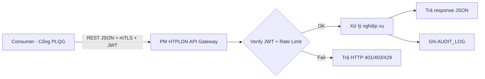
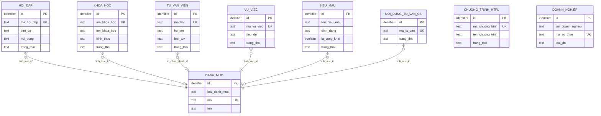

# SRS — Section 3.2.16: API Kết nối Chia sẻ Dữ liệu

**Dự án:** Phần mềm hỗ trợ pháp lý doanh nghiệp
**Phiên bản SRS:** 3.0
**Nhóm:** XII — API Kết nối Chia sẻ Dữ liệu
**UC range:** UC 171 – UC 190
**Số FR:** 18
**File chính:** `srs-v3.md` Section 3.2

---

## Mục lục file này

- [1. Tổng quan nhóm](#1-tổng-quan-nhóm)
- [2. Yêu cầu chức năng chi tiết](#2-yêu-cầu-chức-năng-chi-tiết)
- [3. Màn hình chức năng](#3-màn-hình-chức-năng)
- [4. Entity liên quan](#4-entity-liên-quan)
- [5. State Machine liên quan](#5-state-machine-liên-quan)
- [6. Business Rules liên quan](#6-business-rules-liên-quan)

---

## 1. Tổng quan nhóm

**Mục đích:** 18 API outbound cung cấp dữ liệu cho hệ thống khác (chủ yếu Cổng PLQG module HTPLDN) qua kết nối REST trực tiếp (không qua LGSP).

**Tác nhân chính:** Cổng PLQG, Hệ thống khác (consumer)

**Đặc thù:** 9 cặp API (chia sẻ + tìm kiếm), mỗi cặp phục vụ 1 loại nội dung.

**9 cặp API:**

| # | Nội dung | UC Chia sẻ | UC Tìm kiếm | FR-ID Chia sẻ | FR-ID Tìm kiếm |
|---|---------|-----------|-------------|--------------|----------------|
| 1 | Hỏi đáp/vướng mắc PL | UC171 | UC172 | FR-XII-01 | FR-XII-02 |
| 2 | Đào tạo/bồi dưỡng | UC173 | UC174 | FR-XII-03 | FR-XII-04 |
| 3 | CG/TVV | UC175 | UC176 | FR-XII-05 | FR-XII-06 |
| 4 | Vụ việc TGPL | UC177 | UC178 | FR-XII-07 | FR-XII-08 |
| 5 | Đánh giá hiệu quả | UC179 | UC180 | FR-XII-09 | FR-XII-10 |
| 6 | Thư viện biểu mẫu | UC181 | UC182 | FR-XII-11 | FR-XII-12 |
| 7 | Tư vấn chuyên sâu | UC183 | UC184 | FR-XII-13 | FR-XII-14 |
| 8 | CT HTPLDN | UC185 | UC186 | FR-XII-15 | FR-XII-16 |
| 9 | Hồ sơ pháp lý DN | UC189 | UC190 | FR-XII-17 | FR-XII-18 |

**Quy trình nghiệp vụ tổng quan:**



---

## 2a. Đặc tả chung TPL-API

> Tất cả 18 FR-XII kế thừa đặc tả chung này. Mỗi FR bổ sung phần đặc thù (endpoint, scope, request/response, processing riêng).

**Đặc tả kỹ thuật chung:**

| Thuộc tính | Giá trị |
|-----------|---------|
| Format | RESTful JSON |
| Bảo mật | mTLS + JWT Bearer token (kết nối trực tiếp với Cổng PLQG, không qua LGSP) |
| Rate limit | 100 req/min/consumer |
| Response time | < 3 giây |
| Base URL | `https://htpldn.moj.gov.vn/api/v1` |
| Versioning | URL path: `/v1/...` |
| Pagination | `?page=1&size=20` (default 20, max 100) |
| Sorting | `?sort=ngay_tao,desc` |
| Error format | `{"success": false, "error": {"code": "...", "message": "...", "details": [...]}}` |
| Dữ liệu trả về | CHỈ bản ghi đã duyệt / công khai / hoàn thành (publishable) |

**Luồng xác thực:**

1. Consumer (Cổng PLQG) gửi request trực tiếp đến PM (REST JSON)
2. PM thực hiện mTLS verification (kết nối trực tiếp, không qua LGSP)
3. Request kèm Header: Authorization: Bearer {JWT}
4. PM verify JWT (RS256, issuer = htpldn.moj.gov.vn)
5. Kiểm tra claims: consumer_id, scope, exp
6. Rate limit check: 100 req/min/consumer_id
7. Xử lý business logic
8. Trả response JSON

**Response Envelope chung:**

```json
{
  "success": true,
  "data": { ... },
  "pagination": {
    "page": 1,
    "size": 20,
    "total_elements": 150,
    "total_pages": 8
  },
  "timestamp": "2026-03-25T10:30:00+07:00"
}
```

**Preconditions chung (TPL-API-FULL):**

- Consumer đã đăng ký kết nối trực tiếp và được cấp client certificate (mTLS)
- Consumer có JWT hợp lệ với scope tương ứng
- Kết nối trực tiếp PM<->Cổng PLQG khả dụng
- Dữ liệu nguồn ở trạng thái publishable (đã duyệt / đã công khai)

**Postconditions chung (TPL-API-FULL):**

- Dữ liệu được trả về cho consumer (read-only, không thay đổi dữ liệu PM)
- AUDIT_LOG ghi nhận: consumer_id, endpoint, timestamp, response_code
- Rate limit counter cập nhật cho consumer_id

**Error Handling chung (TPL-API-FULL):**

| # | Điều kiện lỗi | Mã lỗi | Phản hồi hệ thống | Severity |
|---|--------------|--------|-------------------|----------|
| E1 | Tham số request không hợp lệ | ERR-API-400 | HTTP 400 "Tham số không hợp lệ: {chi tiết}" | ERROR |
| E2 | JWT không hợp lệ, hết hạn, hoặc thiếu | ERR-API-401 | HTTP 401 "Xác thực thất bại. JWT không hợp lệ hoặc hết hạn" | ERROR |
| E3 | JWT scope không đủ quyền | ERR-API-403 | HTTP 403 "Không có quyền truy cập API này. Yêu cầu scope: {scope}" | ERROR |
| E4 | Resource không tồn tại hoặc đã bị xóa | ERR-API-404 | HTTP 404 "Không tìm thấy tài nguyên" | ERROR |
| E5 | Vượt rate limit (100 req/min/consumer) | ERR-API-429 | HTTP 429 "Vượt giới hạn tần suất. Thử lại sau {retry_after}s" | WARNING |
| E6 | Lỗi server nội bộ | ERR-API-500 | HTTP 500 "Lỗi hệ thống nội bộ. Vui lòng thử lại sau" | ERROR |
| E7 | PM không khả dụng hoặc đang bảo trì | ERR-API-503 | HTTP 503 "Dịch vụ tạm thời không khả dụng. Thử lại sau" | ERROR |

**Acceptance Criteria chung (TPL-API-FULL):**

- **Given** dữ liệu đã duyệt **When** consumer gọi API với JWT hợp lệ **Then** trả về JSON theo format envelope, HTTP 200
- **Given** PM down **When** consumer gọi API **Then** trả HTTP 503 + message, consumer queue và retry
- **Given** JWT hết hạn **When** consumer gọi API **Then** trả HTTP 401
- **Given** vượt rate limit **When** consumer gọi API **Then** trả HTTP 429 + header Retry-After

---

## 2. Yêu cầu chức năng chi tiết

---

### FR-XII-01: API Chia sẻ hỏi đáp (UC171)

**UC Reference:** UC 171
**Source:** Team thiết kế API, CĐT review
**Priority:** Essential
**Stability:** Medium
**Endpoint:** `GET /api/v1/hoi-dap`
**Scope JWT:** `htpldn:hoi-dap:read`

**Mô tả:**
API cung cấp danh sách hỏi đáp/vướng mắc pháp lý đã duyệt cho consumer.

**Tác nhân:** Cổng PLQG (consumer)

**Preconditions:** Theo TPL-API-FULL + entity HOI_DAP có dữ liệu trạng thái DA_DUYET.

**Inputs (Request Parameters):**

| # | Tên field | Kiểu logic | Bắt buộc | Ràng buộc | Mặc định | Nguồn |
|---|----------|-----------|----------|-----------|----------|-------|
| 1 | page | number | N | >= 1 | 1 | query param |
| 2 | size | number | N | 1-100 | 20 | query param |
| 3 | linh_vuc_id | number | N | FK -> DANH_MUC | — | query param |
| 4 | tu_ngay | date | N | ISO 8601 | — | query param |
| 5 | den_ngay | date | N | ISO 8601 | — | query param |
| 6 | trang_thai | text | N | DA_DUYET (default chỉ trả dữ liệu đã duyệt) | DA_DUYET | query param |

**Processing (Xử lý):**

| Bước | Mô tả xử lý | BR áp dụng |
|------|-------------|-----------|
| 1 | Xác thực JWT + scope htpldn:hoi-dap:read | BR-AUTH-01 |
| 2 | Kiểm tra rate limit | BR-API-01 |
| 3 | Kiểm tra tham số request | — |
| 4 | Truy vấn hỏi đáp đã duyệt, chưa xóa | — |
| 5 | Áp dụng bộ lọc (lĩnh vực, khoảng ngày) | — |
| 6 | Phân trang | BR-DATA-08 |
| 7 | Ghi nhật ký thao tác | BR-DATA-05 |

**Outputs (Response Data):**

| # | Tên | Kiểu logic | Điều kiện | Format |
|---|-----|-----------|-----------|--------|
| 1 | id | number | luôn | — |
| 2 | ma_hoi_dap | text | luôn | HD-{date}-{seq} |
| 3 | cau_hoi | text | luôn | — |
| 4 | cau_tra_loi | text | luôn | — |
| 5 | linh_vuc | structured | luôn | {id, ten} |
| 6 | ngay_tra_loi | date | luôn | ISO 8601 |
| 7 | nguoi_tra_loi | text | luôn | — |

**Postconditions:** Theo TPL-API-FULL.
**Error Handling:** Theo TPL-API-FULL.

**Acceptance Criteria:** Theo TPL-API-FULL. Bổ sung:
- **Given** Cổng PLQG gọi GET /hoi-dap?linh_vuc_id=1 **When** JWT hợp lệ **Then** trả danh sách hỏi đáp đã duyệt thuộc lĩnh vực, phân trang

**Cross-ref:** Entity HOI_DAP, DANH_MUC

---

### FR-XII-02: API Tìm kiếm hỏi đáp (UC172)

**UC Reference:** UC 172
**Source:** Team thiết kế API, CĐT review
**Priority:** Conditional
**Stability:** Medium
**Endpoint:** `GET /api/v1/hoi-dap/search`
**Scope JWT:** `htpldn:hoi-dap:search`

**Mô tả:**
API tìm kiếm toàn văn hỏi đáp theo từ khóa.

**Tác nhân:** Cổng PLQG (consumer)

**Preconditions:** Theo TPL-API-FULL.

**Inputs (Request Parameters):**

| # | Tên field | Kiểu logic | Bắt buộc | Ràng buộc | Mặc định | Nguồn |
|---|----------|-----------|----------|-----------|----------|-------|
| 1 | keyword | text | Y | Min 2 ký tự | — | query param |
| 2 | page | number | N | >= 1 | 1 | query param |
| 3 | size | number | N | 1-100 | 20 | query param |
| 4 | linh_vuc_id | number | N | FK -> DANH_MUC | — | query param |

**Processing (Xử lý):**

| Bước | Mô tả xử lý | BR áp dụng |
|------|-------------|-----------|
| 1 | Xác thực JWT + scope | BR-AUTH-01 |
| 2 | Kiểm tra rate limit | BR-API-01 |
| 3 | Kiểm tra: từ khóa bắt buộc, tối thiểu 2 ký tự | — |
| 4 | Tìm kiếm toàn văn trên câu hỏi và câu trả lời | BR-DATA-08 |
| 5 | Sắp xếp theo điểm relevance giảm dần | — |
| 6 | Phân trang | BR-DATA-08 |
| 7 | Ghi nhật ký thao tác | BR-DATA-05 |

**Outputs:** Giống FR-XII-01 + trường relevance_score (number).

**Postconditions:** Theo TPL-API-FULL.

**Error Handling:** Theo TPL-API-FULL. Bổ sung:

| # | Điều kiện lỗi | Mã lỗi | Phản hồi hệ thống | Severity |
|---|--------------|--------|-------------------|----------|
| E8 | Từ khóa trống hoặc < 2 ký tự | ERR-API-SEARCH-01 | "Từ khóa tìm kiếm phải có ít nhất 2 ký tự" | ERROR |

**Acceptance Criteria:** Theo TPL-API-FULL. Bổ sung:
- **Given** consumer gửi keyword "hợp đồng" **When** search **Then** trả danh sách hỏi đáp chứa từ khóa, sắp xếp theo relevance

**Cross-ref:** Entity HOI_DAP

---

### FR-XII-03: API Chia sẻ đào tạo (UC173)

**UC Reference:** UC 173
**Source:** Team thiết kế API
**Priority:** Essential
**Stability:** Medium
**Endpoint:** `GET /api/v1/dao-tao`
**Scope JWT:** `htpldn:dao-tao:read`

**Mô tả:**
API cung cấp danh sách khóa đào tạo/bồi dưỡng cho consumer.

**Tác nhân:** Cổng PLQG (consumer)

**Preconditions:** Theo TPL-API-FULL + entity KHOA_HOC có dữ liệu publishable.

**Inputs (Request Parameters):**

| # | Tên field | Kiểu logic | Bắt buộc | Ràng buộc | Mặc định | Nguồn |
|---|----------|-----------|----------|-----------|----------|-------|
| 1 | page | number | N | >= 1 | 1 | query param |
| 2 | size | number | N | 1-100 | 20 | query param |
| 3 | hinh_thuc | text | N | TRUC_TUYEN / TRUC_TIEP | — | query param |
| 4 | tu_ngay | date | N | — | — | query param |
| 5 | den_ngay | date | N | — | — | query param |

**Processing (Xử lý):**

| Bước | Mô tả xử lý | BR áp dụng |
|------|-------------|-----------|
| 1 | Xác thực JWT + scope htpldn:dao-tao:read | BR-AUTH-01 |
| 2 | Kiểm tra rate limit | BR-API-01 |
| 3 | Truy vấn khóa học ở trạng thái publishable (đang diễn ra / kết thúc / đã duyệt) | — |
| 4 | Áp dụng bộ lọc, phân trang | BR-DATA-08 |
| 5 | Ghi nhật ký thao tác | BR-DATA-05 |

**Outputs (Response Data):**

| # | Tên | Kiểu logic | Điều kiện | Format |
|---|-----|-----------|-----------|--------|
| 1 | id | number | luôn | — |
| 2 | ma_khoa_hoc | text | luôn | KH-{date}-{seq} |
| 3 | ten_khoa_hoc | text | luôn | — |
| 4 | hinh_thuc | text | luôn | TRUC_TUYEN / TRUC_TIEP |
| 5 | ngay_bat_dau | date | luôn | ISO 8601 |
| 6 | ngay_ket_thuc | date | luôn | ISO 8601 |
| 7 | so_hoc_vien | number | luôn | — |
| 8 | trang_thai | text | luôn | — |

**Postconditions:** Theo TPL-API-FULL.
**Error Handling:** Theo TPL-API-FULL.

**Acceptance Criteria:** Theo TPL-API-FULL. Bổ sung:
- **Given** consumer gọi GET /dao-tao **When** JWT hợp lệ **Then** trả danh sách khóa học, phân trang

**Cross-ref:** Entity KHOA_HOC

---

### FR-XII-04: API Tìm kiếm đào tạo (UC174)

**UC Reference:** UC 174
**Source:** Team thiết kế API
**Priority:** Conditional
**Stability:** Medium
**Endpoint:** `GET /api/v1/dao-tao/search`
**Scope JWT:** `htpldn:dao-tao:search`

**Mô tả:**
API tìm kiếm toàn văn khóa đào tạo theo từ khóa.

**Tác nhân:** Cổng PLQG (consumer)

**Preconditions:** Theo TPL-API-FULL.

**Inputs:** keyword (text, Y, min 2 ký tự) + page + size. Tương tự pattern FR-XII-02.

**Processing:** Xác thực JWT -> rate limit -> tìm kiếm toàn văn trên tên khóa học + mô tả -> sắp xếp relevance -> phân trang -> ghi log.

**Outputs:** Giống FR-XII-03 + relevance_score.

**Error Handling:** Theo TPL-API-FULL + ERR-API-SEARCH-01.

**Acceptance Criteria:** Theo TPL-API-FULL. Bổ sung:
- **Given** consumer gửi keyword "pháp luật" **When** search **Then** trả danh sách khóa học matching, sorted by relevance

**Cross-ref:** Entity KHOA_HOC

---

### FR-XII-05: API Chia sẻ CG/TVV (UC175)

**UC Reference:** UC 175
**Source:** Team thiết kế API
**Priority:** Essential
**Stability:** Medium
**Endpoint:** `GET /api/v1/tu-van-vien`
**Scope JWT:** `htpldn:tvv:read`

**Mô tả:**
API cung cấp danh sách chuyên gia/tư vấn viên đang hoạt động. Loại trừ thông tin nhạy cảm (CMND, CCCD, địa chỉ cá nhân, SĐT).

**Tác nhân:** Cổng PLQG (consumer)

**Preconditions:** Theo TPL-API-FULL + entity TU_VAN_VIEN có dữ liệu trạng thái HOAT_DONG.

**Inputs (Request Parameters):**

| # | Tên field | Kiểu logic | Bắt buộc | Ràng buộc | Mặc định | Nguồn |
|---|----------|-----------|----------|-----------|----------|-------|
| 1 | page | number | N | >= 1 | 1 | query param |
| 2 | size | number | N | 1-100 | 20 | query param |
| 3 | linh_vuc_id | number | N | FK -> lĩnh vực chuyên môn | — | query param |
| 4 | dia_ban | text | N | Tỉnh/TP | — | query param |
| 5 | loai | text | N | TVV / CG / NHT | — | query param |

**Processing (Xử lý):**

| Bước | Mô tả xử lý | BR áp dụng |
|------|-------------|-----------|
| 1 | Xác thực JWT + scope htpldn:tvv:read | BR-AUTH-01 |
| 2 | Kiểm tra rate limit | BR-API-01 |
| 3 | Truy vấn tư vấn viên đang hoạt động | — |
| 4 | Loại trừ thông tin nhạy cảm (CMND, CCCD, địa chỉ cá nhân, SĐT) | BR-SEC-01 |
| 5 | Áp dụng bộ lọc, phân trang | BR-DATA-08 |
| 6 | Ghi nhật ký thao tác | BR-DATA-05 |

**Outputs (Response Data):**

| # | Tên | Kiểu logic | Điều kiện | Format |
|---|-----|-----------|-----------|--------|
| 1 | id | number | luôn | — |
| 2 | ho_ten | text | luôn | — |
| 3 | loai | text | luôn | TVV / CG / NHT |
| 4 | linh_vuc | structured | luôn | [{id, ten}] |
| 5 | dia_ban | text | luôn | — |
| 6 | to_chuc_hanh_nghe | text | luôn | — |
| 7 | trang_thai | text | luôn | HOAT_DONG |

**Postconditions:** Theo TPL-API-FULL.
**Error Handling:** Theo TPL-API-FULL.

**Acceptance Criteria:** Theo TPL-API-FULL. Bổ sung:
- **Given** consumer gọi GET /tu-van-vien?linh_vuc_id=1 **When** JWT hợp lệ **Then** trả DS TVV thuộc lĩnh vực, KHONG chứa CMND/SĐT

**Cross-ref:** Entity TU_VAN_VIEN, TVV_LINH_VUC

---

### FR-XII-06: API Tìm kiếm CG/TVV (UC176)

**UC Reference:** UC 176
**Source:** Team thiết kế API
**Priority:** Conditional
**Stability:** Medium
**Endpoint:** `GET /api/v1/tu-van-vien/search`
**Scope JWT:** `htpldn:tvv:search`

**Mô tả:**
API tìm kiếm CG/TVV theo từ khóa (tên, tổ chức). Loại trừ thông tin nhạy cảm.

**Tác nhân:** Cổng PLQG (consumer)

**Preconditions:** Theo TPL-API-FULL.

**Inputs:** keyword (text, Y) + linh_vuc_id + dia_ban + page + size.

**Processing:** Xác thực JWT -> rate limit -> tìm kiếm trên họ tên, tổ chức -> loại trừ thông tin nhạy cảm -> sắp xếp, phân trang -> ghi log.

**Outputs:** Giống FR-XII-05.

**Error Handling:** Theo TPL-API-FULL + ERR-API-SEARCH-01.

**Acceptance Criteria:** Theo TPL-API-FULL. Bổ sung:
- **Given** consumer gửi keyword "Luật ABC" **When** search **Then** trả DS TVV thuộc tổ chức Luật ABC

**Cross-ref:** Entity TU_VAN_VIEN, TVV_LINH_VUC

---

### FR-XII-07: API Chia sẻ vụ việc (UC177)

**UC Reference:** UC 177
**Source:** Team thiết kế API
**Priority:** Essential
**Stability:** Medium
**Endpoint:** `GET /api/v1/vu-viec`
**Scope JWT:** `htpldn:vu-viec:read`

**Mô tả:**
API cung cấp danh sách vụ việc TGPL đã hoàn thành/duyệt. Loại trừ thông tin DN nhạy cảm (MST, địa chỉ chi tiết).

**Tác nhân:** Cổng PLQG (consumer)

**Preconditions:** Theo TPL-API-FULL + entity VU_VIEC có dữ liệu publishable.

**Inputs (Request Parameters):**

| # | Tên field | Kiểu logic | Bắt buộc | Ràng buộc | Mặc định | Nguồn |
|---|----------|-----------|----------|-----------|----------|-------|
| 1 | page | number | N | >= 1 | 1 | query param |
| 2 | size | number | N | 1-100 | 20 | query param |
| 3 | linh_vuc_id | number | N | — | — | query param |
| 4 | trang_thai | text | N | HOAN_THANH / DA_DUYET | — | query param |
| 5 | tu_ngay | date | N | — | — | query param |
| 6 | den_ngay | date | N | — | — | query param |

**Processing (Xử lý):**

| Bước | Mô tả xử lý | BR áp dụng |
|------|-------------|-----------|
| 1 | Xác thực JWT + scope htpldn:vu-viec:read | BR-AUTH-01 |
| 2 | Kiểm tra rate limit | BR-API-01 |
| 3 | Truy vấn vụ việc đã hoàn thành / đã duyệt | — |
| 4 | Loại trừ thông tin DN nhạy cảm (MST, địa chỉ chi tiết) | BR-SEC-01 |
| 5 | Áp dụng bộ lọc, phân trang | BR-DATA-08 |
| 6 | Ghi nhật ký thao tác | BR-DATA-05 |

**Outputs (Response Data):**

| # | Tên | Kiểu logic | Điều kiện | Format |
|---|-----|-----------|-----------|--------|
| 1 | id | number | luôn | — |
| 2 | ma_vu_viec | text | luôn | VV-{date}-{seq} |
| 3 | linh_vuc | structured | luôn | {id, ten} |
| 4 | trang_thai | text | luôn | HOAN_THANH / DA_DUYET |
| 5 | don_vi_xu_ly | text | luôn | — |
| 6 | ngay_tiep_nhan | date | luôn | ISO 8601 |
| 7 | ngay_hoan_thanh | date | luôn | ISO 8601 |

**Postconditions:** Theo TPL-API-FULL.
**Error Handling:** Theo TPL-API-FULL.

**Acceptance Criteria:** Theo TPL-API-FULL. Bổ sung:
- **Given** consumer gọi GET /vu-viec **When** JWT hợp lệ **Then** trả DS VV đã hoàn thành, KHONG chứa MST DN

**Cross-ref:** Entity VU_VIEC, DOANH_NGHIEP

---

### FR-XII-08: API Tìm kiếm vụ việc (UC178)

**UC Reference:** UC 178
**Source:** Team thiết kế API
**Priority:** Conditional
**Stability:** Medium
**Endpoint:** `GET /api/v1/vu-viec/search`
**Scope JWT:** `htpldn:vu-viec:search`

**Mô tả:**
API tìm kiếm vụ việc theo từ khóa. Loại trừ thông tin nhạy cảm.

**Tác nhân:** Cổng PLQG (consumer)

**Preconditions:** Theo TPL-API-FULL.

**Inputs:** keyword (text, Y) + linh_vuc_id + trang_thai + page + size.

**Processing:** Xác thực JWT -> rate limit -> tìm kiếm toàn văn trên lĩnh vực, đơn vị, mã vụ việc -> loại trừ thông tin nhạy cảm -> sắp relevance, phân trang -> ghi log.

**Outputs:** Giống FR-XII-07.

**Error Handling:** Theo TPL-API-FULL + ERR-API-SEARCH-01.

**Acceptance Criteria:** Theo TPL-API-FULL. Bổ sung:
- **Given** consumer gửi keyword "hợp đồng" **When** search **Then** trả DS VV liên quan đến hợp đồng

**Cross-ref:** Entity VU_VIEC

---

### FR-XII-09: API Chia sẻ đánh giá hiệu quả (UC179)

**UC Reference:** UC 179
**Source:** Team thiết kế API
**Priority:** Essential
**Stability:** Medium
**Endpoint:** `GET /api/v1/danh-gia`
**Scope JWT:** `htpldn:danh-gia:read`

**Mô tả:**
API cung cấp kết quả đánh giá hiệu quả đã duyệt báo cáo.

**Tác nhân:** Cổng PLQG (consumer)

**Preconditions:** Theo TPL-API-FULL + entity DOT_DANH_GIA có dữ liệu trạng thái DA_DUYET_BC.

**Inputs:** page + size + ky (text: SO_BO_6_THANG / SO_BO_NAM / TRON_NAM) + don_vi_id.

**Processing:** Xác thực JWT -> rate limit -> truy vấn đợt đánh giá đã duyệt báo cáo -> áp dụng bộ lọc, phân trang -> ghi log.

**Outputs (Response Data):**

| # | Tên | Kiểu logic | Điều kiện | Format |
|---|-----|-----------|-----------|--------|
| 1 | id | number | luôn | — |
| 2 | ten_dot | text | luôn | — |
| 3 | ky | text | luôn | SO_BO_6_THANG / SO_BO_NAM / TRON_NAM |
| 4 | diem_trung_binh | number | luôn | — |
| 5 | so_vu_viec_danh_gia | number | luôn | — |
| 6 | don_vi | text | luôn | — |
| 7 | trang_thai | text | luôn | DA_DUYET_BC |

**Postconditions:** Theo TPL-API-FULL.
**Error Handling:** Theo TPL-API-FULL.

**Acceptance Criteria:** Theo TPL-API-FULL. Bổ sung:
- **Given** consumer gọi GET /danh-gia?ky=SO_BO_6_THANG **When** JWT hợp lệ **Then** trả kết quả đánh giá đã duyệt

**Cross-ref:** Entity DOT_DANH_GIA, KET_QUA_DANH_GIA

---

### FR-XII-10: API Tìm kiếm đánh giá (UC180)

**UC Reference:** UC 180
**Source:** Team thiết kế API
**Priority:** Conditional
**Stability:** Medium
**Endpoint:** `GET /api/v1/danh-gia/search`
**Scope JWT:** `htpldn:danh-gia:search`

**Mô tả:**
API tìm kiếm đợt đánh giá theo từ khóa (tên đợt, đơn vị).

**Tác nhân:** Cổng PLQG (consumer)

**Preconditions:** Theo TPL-API-FULL.

**Inputs:** keyword (text, Y) + ky + don_vi_id + page + size.

**Processing:** Xác thực JWT -> rate limit -> tìm kiếm trên tên đợt, đơn vị -> áp dụng bộ lọc, phân trang -> ghi log.

**Outputs:** Giống FR-XII-09.

**Error Handling:** Theo TPL-API-FULL + ERR-API-SEARCH-01.

**Acceptance Criteria:** Theo TPL-API-FULL. Bổ sung:
- **Given** consumer gửi keyword "Hà Nội" **When** search **Then** trả DS đánh giá liên quan đến Hà Nội

**Cross-ref:** Entity DOT_DANH_GIA

---

### FR-XII-11: API Chia sẻ biểu mẫu (UC181)

**UC Reference:** UC 181
**Source:** Team thiết kế API
**Priority:** Essential
**Stability:** Medium
**Endpoint:** `GET /api/v1/bieu-mau`
**Scope JWT:** `htpldn:bieu-mau:read`

**Mô tả:**
API cung cấp danh sách biểu mẫu đã duyệt + công khai, kèm URL tải về.

**Tác nhân:** Cổng PLQG (consumer)

**Preconditions:** Theo TPL-API-FULL + entity BIEU_MAU có dữ liệu đã duyệt + công khai.

**Inputs:** page + size + danh_muc_id + dinh_dang (text: docx/pdf/xlsx).

**Processing:** Xác thực JWT -> rate limit -> truy vấn biểu mẫu đã duyệt + công khai -> áp dụng bộ lọc, phân trang -> ghi log.

**Outputs (Response Data):**

| # | Tên | Kiểu logic | Điều kiện | Format |
|---|-----|-----------|-----------|--------|
| 1 | id | number | luôn | — |
| 2 | ten_bieu_mau | text | luôn | — |
| 3 | danh_muc | text | luôn | — |
| 4 | dinh_dang | text | luôn | docx / pdf / xlsx |
| 5 | kich_thuoc | number | luôn | bytes |
| 6 | url_tai_ve | text | luôn | /api/v1/bieu-mau/{id}/download |
| 7 | ngay_cong_khai | date | luôn | ISO 8601 |

**Postconditions:** Theo TPL-API-FULL.
**Error Handling:** Theo TPL-API-FULL.

**Acceptance Criteria:** Theo TPL-API-FULL. Bổ sung:
- **Given** consumer gọi GET /bieu-mau **When** JWT hợp lệ **Then** trả DS biểu mẫu công khai + URL download

**Cross-ref:** Entity BIEU_MAU, THU_MUC_BIEU_MAU

---

### FR-XII-12: API Tìm kiếm biểu mẫu (UC182)

**UC Reference:** UC 182
**Source:** Team thiết kế API
**Priority:** Conditional
**Stability:** Medium
**Endpoint:** `GET /api/v1/bieu-mau/search`
**Scope JWT:** `htpldn:bieu-mau:search`

**Mô tả:**
API tìm kiếm biểu mẫu theo từ khóa (tên biểu mẫu, mô tả).

**Tác nhân:** Cổng PLQG (consumer)

**Preconditions:** Theo TPL-API-FULL.

**Inputs:** keyword (text, Y) + danh_muc_id + page + size.

**Processing:** Xác thực JWT -> rate limit -> tìm kiếm toàn văn trên tên biểu mẫu + mô tả -> sắp relevance, phân trang -> ghi log.

**Outputs:** Giống FR-XII-11.

**Error Handling:** Theo TPL-API-FULL + ERR-API-SEARCH-01.

**Acceptance Criteria:** Theo TPL-API-FULL. Bổ sung:
- **Given** consumer gửi keyword "hợp đồng lao động" **When** search **Then** trả DS biểu mẫu matching

**Cross-ref:** Entity BIEU_MAU

---

### FR-XII-13: API Chia sẻ tư vấn chuyên sâu (UC183)

**UC Reference:** UC 183
**Source:** Team thiết kế API
**Priority:** Essential
**Stability:** Medium
**Endpoint:** `GET /api/v1/tu-van-chuyen-sau`
**Scope JWT:** `htpldn:tvcs:read`

**Mô tả:**
API cung cấp danh sách tư vấn chuyên sâu đã hoàn thành (metadata only, loại trừ nội dung chi tiết văn bản tư vấn).

**Tác nhân:** Cổng PLQG (consumer)

**Preconditions:** Theo TPL-API-FULL + entity NOI_DUNG_TU_VAN_CS có dữ liệu trạng thái HOAN_THANH.

**Inputs:** page + size + linh_vuc_id + tu_ngay + den_ngay.

**Processing:** Xác thực JWT -> rate limit -> truy vấn TVCS đã hoàn thành -> loại trừ nội dung chi tiết VB tư vấn (chỉ trả metadata) -> áp dụng bộ lọc, phân trang -> ghi log.

**Outputs (Response Data):**

| # | Tên | Kiểu logic | Điều kiện | Format |
|---|-----|-----------|-----------|--------|
| 1 | id | number | luôn | — |
| 2 | ma_yeu_cau | text | luôn | TVCS-{date}-{seq} |
| 3 | linh_vuc | structured | luôn | {id, ten} |
| 4 | trang_thai | text | luôn | HOAN_THANH |
| 5 | chuyen_gia | text | luôn | — |
| 6 | ngay_hoan_thanh | date | luôn | ISO 8601 |

**Postconditions:** Theo TPL-API-FULL.
**Error Handling:** Theo TPL-API-FULL.

**Acceptance Criteria:** Theo TPL-API-FULL. Bổ sung:
- **Given** consumer gọi GET /tu-van-chuyen-sau **When** JWT hợp lệ **Then** trả DS TVCS đã hoàn thành (metadata only)

**Cross-ref:** Entity NOI_DUNG_TU_VAN_CS

---

### FR-XII-14: API Tìm kiếm tư vấn chuyên sâu (UC184)

**UC Reference:** UC 184
**Source:** Team thiết kế API
**Priority:** Conditional
**Stability:** Medium
**Endpoint:** `GET /api/v1/tu-van-chuyen-sau/search`
**Scope JWT:** `htpldn:tvcs:search`

**Mô tả:**
API tìm kiếm tư vấn chuyên sâu theo từ khóa (lĩnh vực, chuyên gia).

**Tác nhân:** Cổng PLQG (consumer)

**Preconditions:** Theo TPL-API-FULL.

**Inputs:** keyword (text, Y) + linh_vuc_id + page + size.

**Processing:** Xác thực JWT -> rate limit -> tìm kiếm trên lĩnh vực, chuyên gia -> sắp xếp, phân trang -> ghi log.

**Outputs:** Giống FR-XII-13.

**Error Handling:** Theo TPL-API-FULL + ERR-API-SEARCH-01.

**Acceptance Criteria:** Theo TPL-API-FULL. Bổ sung:
- **Given** consumer gửi keyword "sở hữu trí tuệ" **When** search **Then** trả DS TVCS liên quan

**Cross-ref:** Entity NOI_DUNG_TU_VAN_CS

---

### FR-XII-15: API Chia sẻ CT HTPLDN (UC185)

**UC Reference:** UC 185
**Source:** Team thiết kế API
**Priority:** Essential
**Stability:** Medium
**Endpoint:** `GET /api/v1/chuong-trinh-htpl`
**Scope JWT:** `htpldn:ct-htpl:read`

**Mô tả:**
API cung cấp danh sách chương trình HTPLDN đã công bố (chỉ kế hoạch, KHONG kết quả thực hiện).

**Tác nhân:** Cổng PLQG (consumer)

**Preconditions:** Theo TPL-API-FULL + entity CHUONG_TRINH_HTPL có dữ liệu trạng thái DA_CONG_BO.

**Inputs:** page + size + don_vi_id + nam (number).

**Processing:** Xác thực JWT -> rate limit -> truy vấn chương trình đã công bố -> chỉ kế hoạch (không kết quả thực hiện) -> áp dụng bộ lọc, phân trang -> ghi log.

**Outputs (Response Data):**

| # | Tên | Kiểu logic | Điều kiện | Format |
|---|-----|-----------|-----------|--------|
| 1 | id | number | luôn | — |
| 2 | ma_ct | text | luôn | CT-{date}-{seq} |
| 3 | ten_ct | text | luôn | — |
| 4 | muc_tieu | text | luôn | — |
| 5 | thoi_gian_bat_dau | date | luôn | ISO 8601 |
| 6 | thoi_gian_ket_thuc | date | luôn | ISO 8601 |
| 7 | don_vi | text | luôn | — |
| 8 | trang_thai | text | luôn | DA_CONG_BO |

**Postconditions:** Theo TPL-API-FULL.
**Error Handling:** Theo TPL-API-FULL.

**Acceptance Criteria:** Theo TPL-API-FULL. Bổ sung:
- **Given** consumer gọi GET /chuong-trinh-htpl?nam=2026 **When** JWT hợp lệ **Then** trả DS CT đã công bố năm 2026

**Cross-ref:** Entity CHUONG_TRINH_HTPL

---

### FR-XII-16: API Tìm kiếm CT HTPLDN (UC186)

**UC Reference:** UC 186
**Source:** Team thiết kế API
**Priority:** Conditional
**Stability:** Medium
**Endpoint:** `GET /api/v1/chuong-trinh-htpl/search`
**Scope JWT:** `htpldn:ct-htpl:search`

**Mô tả:**
API tìm kiếm chương trình HTPLDN theo từ khóa (tên CT, mục tiêu, đơn vị).

**Tác nhân:** Cổng PLQG (consumer)

**Preconditions:** Theo TPL-API-FULL.

**Inputs:** keyword (text, Y) + don_vi_id + nam + page + size.

**Processing:** Xác thực JWT -> rate limit -> tìm kiếm toàn văn trên tên CT + mục tiêu -> sắp relevance, phân trang -> ghi log.

**Outputs:** Giống FR-XII-15.

**Error Handling:** Theo TPL-API-FULL + ERR-API-SEARCH-01.

**Acceptance Criteria:** Theo TPL-API-FULL. Bổ sung:
- **Given** consumer gửi keyword "doanh nghiệp nhỏ" **When** search **Then** trả DS CT matching

**Cross-ref:** Entity CHUONG_TRINH_HTPL

---

### FR-XII-17: API Chia sẻ hồ sơ pháp lý DN (UC189)

**UC Reference:** UC 189
**Source:** Fix trùng số UC (Đợt 0, bước 0.7)
**Priority:** Conditional
**Stability:** Medium
**Endpoint:** `GET /api/v1/ho-so-pl-dn`
**Scope JWT:** `htpldn:ho-so-pl-dn:read`

**Mô tả:**
API cung cấp danh sách hồ sơ pháp lý DN đã công khai.

**Tác nhân:** Cổng PLQG (consumer)

**Preconditions:** Theo TPL-API-FULL.

**Inputs:** don_vi_id + tu_ngay + den_ngay + page + size.

**Processing:** Xác thực JWT -> rate limit -> truy vấn DN đã công khai -> phân trang, sắp theo ngày cập nhật giảm dần -> ghi log.

**Outputs (Response Data):**

| # | Tên | Kiểu logic | Điều kiện | Format |
|---|-----|-----------|-----------|--------|
| 1 | id | number | luôn | — |
| 2 | ma_doanh_nghiep | text | luôn | — |
| 3 | ten_doanh_nghiep | text | luôn | — |
| 4 | ma_so_thue | text | luôn | — |
| 5 | loai_doanh_nghiep | text | luôn | — |
| 6 | quy_mo | text | luôn | Siêu nhỏ / Nhỏ / Vừa |
| 7 | tinh_tp | text | luôn | — |
| 8 | ngay_cap_nhat | datetime | luôn | ISO 8601 |

**Postconditions:** Theo TPL-API-FULL.
**Error Handling:** Theo TPL-API-FULL.

**Acceptance Criteria:** Theo TPL-API-FULL. Bổ sung:
- **Given** consumer gọi GET /ho-so-pl-dn **When** JWT hợp lệ **Then** trả DS DN đã công khai

**Cross-ref:** Entity DOANH_NGHIEP

---

### FR-XII-18: API Tìm kiếm hồ sơ pháp lý DN (UC190)

**UC Reference:** UC 190
**Source:** Fix trùng số UC (Đợt 0, bước 0.7)
**Priority:** Conditional
**Stability:** Medium
**Endpoint:** `GET /api/v1/ho-so-pl-dn/search`
**Scope JWT:** `htpldn:ho-so-pl-dn:search`

**Mô tả:**
API tìm kiếm hồ sơ pháp lý DN theo từ khóa (tên DN, MST, địa chỉ).

**Tác nhân:** Cổng PLQG (consumer)

**Preconditions:** Theo TPL-API-FULL.

**Inputs:** keyword (text, Y) + loai_dn + quy_mo + page + size.

**Processing:** Xác thực JWT -> rate limit -> tìm kiếm toàn văn trên tên DN + mã số thuế -> sắp relevance, phân trang -> ghi log.

**Outputs:** Giống FR-XII-17.

**Error Handling:** Theo TPL-API-FULL + ERR-API-SEARCH-01.

**Acceptance Criteria:** Theo TPL-API-FULL. Bổ sung:
- **Given** consumer gửi keyword "công ty ABC" **When** search **Then** trả DS DN matching

**Cross-ref:** Entity DOANH_NGHIEP

---

---

## 3. Màn hình chức năng

> **Nhom nay khong co man hinh CMS -- chi cung cap API outbound.**
>
> Giám sát API qua:
> - Dashboard (MH-01): thẻ KPI trạng thái API, số request/ngày, tỷ lệ lỗi
> - Công cụ giám sát bên ngoài (Grafana, Prometheus...)
> - AUDIT_LOG: ghi consumer_id, endpoint, timestamp, response_code

---

## 4. Entity liên quan

> **Source of truth:** `srs-v3.md` Section 3.4.

### Tổng quan entity

| # | Entity | Vai trò | Mô tả |
|---|--------|---------|-------|
| 1 | HOI_DAP | referenced | Hỏi đáp/vướng mắc PL (FR-XII-01/02) |
| 2 | KHOA_HOC | referenced | Khóa đào tạo/tập huấn (FR-XII-03/04) |
| 3 | TU_VAN_VIEN | referenced | TVV/CG/NHT (FR-XII-05/06) |
| 4 | VU_VIEC | referenced | Vụ việc HTPL (FR-XII-07/08) |
| 5 | KE_HOACH_DANH_GIA | referenced | Kế hoạch đánh giá hiệu quả (FR-XII-09/10) |
| 6 | KET_QUA_DANH_GIA | referenced | Kết quả đánh giá (FR-XII-09/10) |
| 7 | BIEU_MAU | referenced | Biểu mẫu/hợp đồng mẫu (FR-XII-11/12) |
| 8 | NOI_DUNG_TU_VAN_CS | referenced | Nội dung tư vấn chuyên sâu (FR-XII-13/14) |
| 9 | CHUONG_TRINH_HTPL | referenced | Chương trình HTPLDN (FR-XII-15/16) |
| 10 | DOANH_NGHIEP | referenced | Hồ sơ pháp lý DN (FR-XII-17/18) |
| 11 | DANH_MUC | referenced | Danh mục dùng chung (lĩnh vực PL, bộ lọc) |

### ERD nhóm (subset)

> Nhóm XII chỉ READ dữ liệu. ERD thể hiện các entity được expose qua 18 API outbound.



### HOI_DAP (referenced — FR-XII-01/02)

**Mô tả:** Lưu trữ yêu cầu hỏi đáp/vướng mắc pháp lý từ DN. API chỉ trả bản ghi DA_DUYET.

| Attribute | Kiểu logic | Bắt buộc | Ràng buộc nghiệp vụ | Mặc định | Mô tả |
|-----------|-----------|----------|------------|---------|-------|
| ma_hoi_dap | text | Y | UNIQUE | Auto-gen | Mã hỏi đáp |
| tieu_de | text | Y | | | Tiêu đề câu hỏi |
| noi_dung | text (long) | Y | | | Nội dung câu hỏi |
| linh_vuc_id | identifier | Y | FK → DANH_MUC(id) | | Lĩnh vực pháp lý |
| trang_thai | text | Y | CHECK IN (..., 'DA_DUYET', ...) | 'MOI' | API filter: DA_DUYET only |

### TU_VAN_VIEN (referenced — FR-XII-05/06)

**Mô tả:** Thông tin TVV/CG/NHT. API loại trừ thông tin nhạy cảm (CMND, CCCD, SĐT, địa chỉ).

| Attribute | Kiểu logic | Bắt buộc | Ràng buộc nghiệp vụ | Mặc định | Mô tả |
|-----------|-----------|----------|------------|---------|-------|
| ma_tvv | text | Y | UNIQUE | Auto-gen | Mã TVV |
| ho_ten | text | Y | | | Họ tên đầy đủ |
| loai_tvv | text | Y | CHECK IN ('TVV','CG','NHT') | | Loại |
| trang_thai | text | Y | ... | 'MOI_DANG_KY' | API filter: DANG_HOAT_DONG only |

### VU_VIEC (referenced — FR-XII-07/08)

**Mô tả:** Vụ việc HTPL. API loại trừ thông tin DN nhạy cảm (MST, địa chỉ chi tiết).

| Attribute | Kiểu logic | Bắt buộc | Ràng buộc nghiệp vụ | Mặc định | Mô tả |
|-----------|-----------|----------|------------|---------|-------|
| ma_vu_viec | text | Y | UNIQUE | Auto-gen | Mã vụ việc |
| tieu_de | text | Y | | | Tiêu đề vụ việc |
| trang_thai | text | Y | ... | 'CHO_TIEP_NHAN' | API filter: HOAN_THANH/DA_DUYET only |

### BIEU_MAU (referenced — FR-XII-11/12)

**Mô tả:** Biểu mẫu/hợp đồng mẫu (file, max 20MB). API chỉ trả biểu mẫu đã duyệt + công khai.

| Attribute | Kiểu logic | Bắt buộc | Ràng buộc nghiệp vụ | Mặc định | Mô tả |
|-----------|-----------|----------|------------|---------|-------|
| ten_bieu_mau | text | Y | | | Tên biểu mẫu |
| duong_dan_file | text | Y | | | Đường dẫn file |
| dinh_dang | text | N | CHECK IN ('DOC','DOCX','XLS','XLSX') | | Định dạng |
| la_cong_khai | boolean | N | | 0 | API filter: la_cong_khai = 1 |
| trang_thai | text | Y | CHECK IN ('NHAP','CONG_KHAI','AN') | 'NHAP' | API filter: CONG_KHAI only |

### NOI_DUNG_TU_VAN_CS (referenced — FR-XII-13/14)

**Mô tả:** Nội dung tư vấn chuyên sâu. API chỉ trả metadata (không nội dung chi tiết VB tư vấn).

| Attribute | Kiểu logic | Bắt buộc | Ràng buộc nghiệp vụ | Mặc định | Mô tả |
|-----------|-----------|----------|------------|---------|-------|
| ma_tu_van | text | Y | UNIQUE | Auto-gen | Mã yêu cầu TV |
| linh_vuc_id | identifier | Y | FK → DANH_MUC(id) | | Lĩnh vực PL |
| trang_thai | text | Y | ... | 'TIEP_NHAN' | API filter: HOAN_THANH only |

### CHUONG_TRINH_HTPL (referenced — FR-XII-15/16)

**Mô tả:** Chương trình HTPLDN. API chỉ trả kế hoạch đã công bố (không kết quả thực hiện).

| Attribute | Kiểu logic | Bắt buộc | Ràng buộc nghiệp vụ | Mặc định | Mô tả |
|-----------|-----------|----------|------------|---------|-------|
| ma_chuong_trinh | text | Y | UNIQUE | Auto-gen | Mã CT |
| ten_chuong_trinh | text | Y | | | Tên chương trình |
| trang_thai | text | Y | ... | 'DU_THAO' | API filter: DA_CONG_BO only |

### DOANH_NGHIEP (referenced — FR-XII-17/18)

**Mô tả:** Hồ sơ DNNVV. API trả thông tin công khai.

| Attribute | Kiểu logic | Bắt buộc | Ràng buộc nghiệp vụ | Mặc định | Mô tả |
|-----------|-----------|----------|------------|---------|-------|
| ten_doanh_nghiep | text | Y | | | Tên đầy đủ DN |
| ma_so_thue | text | Y | UNIQUE | | Mã số thuế |
| loai_dn_id | identifier | Y | FK → DANH_MUC(id) | | Loại DN |

### DANH_MUC (referenced)

**Mô tả:** Bảng danh mục dùng chung — dùng cho bộ lọc API (lĩnh vực, loại DN, v.v.).

| Attribute | Kiểu logic | Bắt buộc | Ràng buộc nghiệp vụ | Mặc định | Mô tả |
|-----------|-----------|----------|------------|---------|-------|
| loai_danh_muc | text | Y | | | Loại DM |
| ma | text | Y | UNIQUE per loai_danh_muc | | Mã danh mục |
| ten | text | Y | | | Tên hiển thị |

---

## 5. State Machine liên quan

> **Source of truth:** `srs-v3.md` Phụ lục C.

Nhóm XII (API Kết nối Chia sẻ Dữ liệu) không có state machine riêng. Tất cả 18 API đều là read-only outbound, không thay đổi trạng thái dữ liệu.

Các API chỉ trả dữ liệu ở trạng thái publishable (đã duyệt / đã công khai / hoàn thành) theo quy tắc BR-INTG-07.

---

## 6. Business Rules liên quan

> **Source of truth:** `srs-v3.md` Phụ lục B.

### Tổng quan BR

| BR ID | Tên | FR áp dụng (nhóm này) |
|-------|-----|----------------------|
| BR-AUTH-01 | Xác thực (JWT) | FR-XII-01 ~ FR-XII-18 |
| BR-INTG-02 | Bảo mật API: mTLS + JWT RS256 | FR-XII-01 ~ FR-XII-18 |
| BR-INTG-03 | Rate limit: 100 req/min/consumer | FR-XII-01 ~ FR-XII-18 |
| BR-INTG-04 | Response time < 3 giây | FR-XII-01 ~ FR-XII-18 |
| BR-INTG-07 | Chỉ chia sẻ dữ liệu đã duyệt/công khai | FR-XII-01 ~ FR-XII-18 |
| BR-DATA-05 | Ghi nhật ký thao tác (audit trail) | FR-XII-01 ~ FR-XII-18 |
| BR-DATA-08 | Tìm kiếm toàn văn | FR-XII-02, FR-XII-04, FR-XII-06, FR-XII-08, FR-XII-10, FR-XII-12, FR-XII-14, FR-XII-16, FR-XII-18 |

### BR-AUTH-01: Xác thực (JWT cho API)

| Thuộc tính | Giá trị |
|-----------|---------|
| **Phát biểu** | Consumer phải xác thực qua JWT Bearer token. API verify JWT (RS256, issuer = htpldn.moj.gov.vn), kiểm tra claims: consumer_id, scope, exp |
| **Nguồn** | PRD A6, FR-VIII-20, Architecture AD-05 |
| **Applied in (nhóm XII)** | FR-XII-01 đến FR-XII-18 (toàn bộ — bước 1 mọi API) |

### BR-INTG-02: Bảo mật API — mTLS + JWT

| Thuộc tính | Giá trị |
|-----------|---------|
| **Phát biểu** | Mọi API outbound phải xác thực qua 2 lớp: mTLS + JWT Bearer token RS256. Áp dụng cho kết nối trực tiếp với Cổng PLQG |
| **Nguồn** | Architecture AD-05/06 |
| **Applied in (nhóm XII)** | FR-XII-01 đến FR-XII-18 |
| **Kiểm chứng** | Test invalid JWT = 401 |

### BR-INTG-03: Rate limit

| Thuộc tính | Giá trị |
|-----------|---------|
| **Phát biểu** | 100 requests/phút/consumer |
| **Nguồn** | PRD Section 6.16 |
| **Applied in (nhóm XII)** | FR-XII-01 đến FR-XII-18 (bước 2 mọi API) |
| **Kiểm chứng** | Load test rate limit |

### BR-INTG-04: Response time

| Thuộc tính | Giá trị |
|-----------|---------|
| **Phát biểu** | Response time API < 3 giây |
| **Nguồn** | NFR-01, PRD |
| **Applied in (nhóm XII)** | FR-XII-01 đến FR-XII-18 |
| **Ngoại lệ** | Báo cáo nặng có thể > 3s (async) |

### BR-INTG-07: Chỉ chia sẻ dữ liệu đã duyệt/công khai

| Thuộc tính | Giá trị |
|-----------|---------|
| **Phát biểu** | Chỉ chia sẻ dữ liệu đã duyệt/công khai qua API. Bản ghi draft/chờ duyệt KHÔNG xuất hiện trong API response |
| **Nguồn** | Pattern IP-03/05 |
| **Applied in (nhóm XII)** | FR-XII-01 đến FR-XII-18 |
| **Kiểm chứng** | Test API filter trạng thái |

### BR-DATA-05: Ghi nhật ký thao tác

| Thuộc tính | Giá trị |
|-----------|---------|
| **Phát biểu** | Mọi API call ghi vào AUDIT_LOG: consumer_id, endpoint, timestamp, response_code |
| **Nguồn** | NFR-06 |
| **Applied in (nhóm XII)** | FR-XII-01 đến FR-XII-18 (bước cuối mọi API) |

### BR-DATA-08: Tìm kiếm toàn văn

| Thuộc tính | Giá trị |
|-----------|---------|
| **Phát biểu** | Hỗ trợ tìm kiếm toàn văn toàn văn |
| **Nguồn** | FR-II-02, FR-X.1-02, FR-X.2-04 |
| **Applied in (nhóm XII)** | FR-XII-02 (hỏi đáp), FR-XII-04 (đào tạo), FR-XII-06 (TVV), FR-XII-08 (vụ việc), FR-XII-10 (đánh giá), FR-XII-12 (biểu mẫu), FR-XII-14 (TVCS), FR-XII-16 (CT HTPL), FR-XII-18 (DN) |

---

**-- Het file FR Group: XII -- API Ket noi Chia se Du lieu --**
