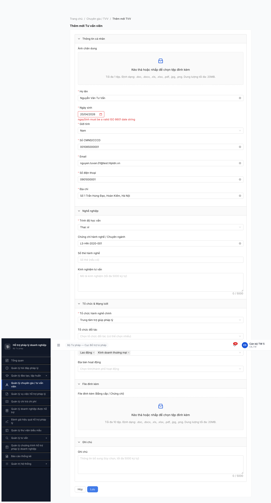
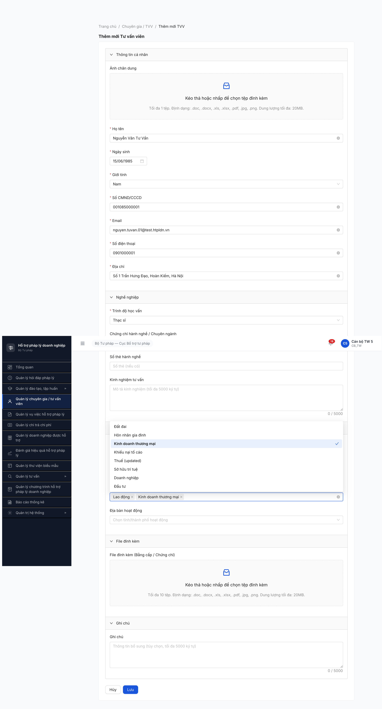

# Bug Report — Hồ sơ Tư vấn viên (SM-TVV) CRUD Round 1

| Thông tin | Giá trị |
|-----------|---------|
| **Dự án** | PM Hỗ trợ Pháp lý Doanh nghiệp (PM HTPLDN) |
| **Phiên bản** | 1.0 |
| **Môi trường** | http://103.172.236.130:3000/ |
| **Người test** | QA Automation via Claude Code (MCP Chrome DevTools) |
| **Ngày** | 11:21:00 — 2026-04-23 |
| **Loại test** | Functional — CRUD CREATE (Thêm mới TVV) |
| **Round** | Round 1 |
| **Tài liệu tham chiếu** | [input/srs-v3/srs-fr-04-chuyen-gia-tvv.md](../../../../input/srs-v3/srs-fr-04-chuyen-gia-tvv.md), [input/data/seed-fixture.yaml `tvv_variants`](../../../../input/data/seed-fixture.yaml), [input/flow-module.md §SM-TVV](../../../../input/flow-module.md) |

---

## Tổng hợp

Phát hiện **6** lỗi trong quá trình test CREATE TVV — **1 Critical blocker khiến 0/6 record fixture có thể được tạo qua UI**. Scope CREATE-only: state machine (Tiếp nhận → Thẩm định → Phê duyệt) ngoài scope round này.

### Severity breakdown

| Tổng | Critical | Major | Medium | Minor | Trivial |
|------|----------|-------|--------|-------|---------|
| 6    | 1        | 2     | 1      | 2     | 0       |

### Test result breakdown theo Type (để tổng hợp multi-module)

| Type | Mô tả | TC count | PASS | PARTIAL | FAIL | BLOCKED | **Pass Rate** |
|------|-------|----------|------|---------|------|---------|---------------|
| **Happy** | Luồng CREATE hợp lệ — seed fixture 6 TVV | 6 (TVV-CR-001..006) | 0 | 0 | 1 | 5 | **0%** |
| **Negative** | — (scope round này chỉ CREATE happy) | 0 | 0 | 0 | 0 | 0 | — |
| **Validation** | — (out-of-round) | 0 | 0 | 0 | 0 | 0 | — |
| **Workflow** | State transition SM-TVV (Tiếp nhận → Thẩm định → Phê duyệt) — ngoài scope | 0 | 0 | 0 | 0 | 0 | — |
| **Total** | | **6** | **0** | **0** | **1** | **5** | **0%** |

→ **Happy-path Pass Rate = 0/6 (0%)** — CREATE flow hoàn toàn không dùng được do BUG-TVV-001 block 100%. 5 TC BLOCKED do cùng root cause (không lặp submit khi serialization chưa fix). Cần fix BUG-TVV-001 trước khi có thể đánh giá Happy Pass Rate thực tế.

## Bug Summary Table

| Bug ID | Severity | Priority | Type | Module | TC Ref | Title | Status |
|--------|----------|----------|------|--------|--------|-------|--------|
| BUG-TVV-001 | Critical | P0 | UI/UX | SM-TVV / SCR-IV-02 | TVV-CR-001..006 | FE ProForm DatePicker luôn gửi `ngaySinh: "Invalid Date"` trong POST body — block 100% CREATE | Open |
| BUG-TVV-002 | Major | P1 | UI/UX | SM-TVV / SCR-IV-02 | TVV-CR-001..006 | BE English error `"ngaySinh must be a valid ISO 8601 date string"` leak xuống user — không Việt hoá theo ERR-TVV-XX | Open |
| BUG-TVV-003 | Major | P1 | Data | SM-TVV / SCR-IV-02 | TVV-CR-001 | Form SCR-IV-02 thiếu dấu `*` trên **Địa bàn hoạt động** — SRS FR-IV-01 #17 `dia_ban_ids` là Y (required) | Open |
| BUG-TVV-004 | Medium | P2 | Data | SM-TVV / SCR-IV-02 | TVV-CR-001 | Upload bằng cấp accept **doc/docx/xls/xlsx/pdf/jpg/png + 20MB** — SRS FR-IV-01 #18 quy định **PDF only + 10MB** | Open |
| BUG-TVV-005 | Minor | P3 | UI/UX | SM-TVV / SCR-IV-01 | — | Tab badge `"Mới đăng ký 3 1"` hiển thị sai format — expect `"Mới đăng ký (31)"` hoặc badge số | Open |
| BUG-TVV-006 | Minor | P3 | UI/UX | SM-TVV / sidebar | — | Tên module không thống nhất — sidebar ghi "Quản lý chuyên gia / tư vấn viên" vs heading SCR-IV-01 "Quản lý Tư vấn viên" (mất "chuyên gia") | Open |

> **Chú thích Type:** `UI/UX` (giao diện/tương tác) · `Data` (ràng buộc field/format) · `Permission` (phân quyền)
>
> **Chú thích Severity:** `Critical` (block nghiệp vụ chính, 0 record tạo được) · `Major` (tính năng lỗi có workaround hoặc sai spec quan trọng) · `Medium` (sai spec nhưng nghiệp vụ chạy được) · `Minor` (hiển thị/typo)
>
> **Chú thích Priority:** `P0` (fix ngay, block release) · `P1` (fix sprint hiện tại) · `P2` (2-3 sprint tới) · `P3` (khi có thời gian)

---

## BUG-TVV-001 — FE ProForm DatePicker luôn serialize `ngaySinh` thành "Invalid Date" trong POST body

| Trường | Chi tiết |
|--------|----------|
| **Bug ID** | BUG-TVV-001 |
| **Severity** | **Critical** |
| **Priority** | **P0** |
| **Type** | UI/UX (FE serialization) |
| **Status** | Open |
| **Module** | SM-TVV — Hồ sơ Tư vấn viên |
| **Thành phần** | Component ProForm (SCR-IV-02) — handler submit cho DatePicker field `ngaySinh` (Ngày sinh) |
| **URL** | http://103.172.236.130:3000/chuyen-gia-tvv/tao-moi |
| **Trình duyệt** | Chromium (MCP Chrome DevTools, headed) |
| **Tài khoản** | `canbo_tw_5` (CB_NV, cấp TW) |
| **TC Reference** | TVV-CR-001 → TVV-CR-006 (toàn bộ 6 TC CREATE) |
| **SRS Reference** | FR-IV-01 #4 `ngay_sinh` (date, Y, ≤ ngày hiện tại); Error codes ERR-TVV-XX — **không có ERR-VAL-SYS-00-01 trong SRS** (đây là BE generic validator leaks English) |
| **Assignee** | FE Team (ProForm config) |
| **Found by** | QA Automation via Claude Code |

### Mô tả

Mọi thao tác CREATE TVV trên `SCR-IV-02` đều bị reject với HTTP 422 do FE luôn gửi `"ngaySinh":"Invalid Date"` trong request body, bất kể user chọn ngày bằng cách nào: gõ tay (`fill_form` → `fill` → `type_text+Enter`), hay click trực tiếp date cell trong calendar panel. Confirmed qua 5 POST attempt liên tiếp (reqid 178/181/189/193/196) — payload `ngaySinh` luôn = string literal `"Invalid Date"`.

### Các bước tái hiện

1. Login `canbo_tw_5 / Test@1234`, OTP `666666` → dashboard.
2. Click sidebar `"Quản lý chuyên gia / tư vấn viên"` → `/chuyen-gia-tvv/danh-sach`.
3. Click `[+ Thêm TVV]` → `/chuyen-gia-tvv/tao-moi` (form ProForm).
4. Fill đầy đủ field required: Họ tên, CMND/CCCD, Email, SĐT, Địa chỉ, Giới tính, Trình độ, Tổ chức hành nghề chính, Lĩnh vực pháp luật.
5. Click DatePicker "Ngày sinh" → calendar mở ở tháng hiện tại (04/2026) → click ngày bất kỳ (ví dụ `20`).
6. Display DatePicker hiển thị `20/04/2026`. Verify React state: `RefPicker.memoizedProps.value` = `"2026-04-19T17:00:00.000Z"` (ISO đúng, UTC+7 offset).
7. Click `[Lưu]` → submit form.
8. **Quan sát:** Error message dưới field Ngày sinh: `"ngaySinh must be a valid ISO 8601 date string"`. Không có toast. URL giữ `/tao-moi`.
9. Kiểm tra Network panel — `POST /api/v1/tu-van-viens` → **422** với request body chứa `"ngaySinh":"Invalid Date"`.

### Kết quả mong đợi

- FE phải convert giá trị dayjs internal (đã verify đúng: ISO 8601) sang string ISO 8601 khi serialize body POST (vd `"ngaySinh":"1985-06-15T00:00:00.000Z"`).
- BE chấp nhận → tạo record TVV mới với `trang_thai = MOI_DANG_KY` (SM-TVV initial state, xem SRS processing step 6).
- Redirect về SCR-IV-01 hoặc hiện toast "Thêm TVV thành công" (tương tự SCR-VIII-01 DM dùng chung).

### Kết quả thực tế

- FE gửi literal string `"Invalid Date"` cho field `ngaySinh`. BE validator từ chối với HTTP 422.
- 0/6 record CREATE thành công trong 5 submit attempts.
- Tab "Đang hoạt động" vẫn hiển thị `1-2 / 2 mục` (pre-existing seeded data từ round trước), không có record mới.

### Bằng chứng

**Request body** (reqid=196, identical shape cho reqid 178/181/189/193):

```json
{
  "hoTen": "Nguyễn Văn Tư Vấn",
  "gioiTinh": "NAM",
  "cccd": "001085000001",
  "email": "nguyen.tuvan.01@test.htpldn.vn",
  "dienThoai": "0901000001",
  "diaChi": "Số 1 Trần Hưng Đạo, Hoàn Kiếm, Hà Nội",
  "trinhDo": "Thạc sĩ",
  "chuyenNganh": "LS-HN-2020-001",
  "toChucChinhId": "8e09f7ab-2804-43d7-b5fc-2aa4a9fa9da8",
  "linhVucIds": ["2f87f508-97c3-4480-882e-34c5b769233b", "355bd99f-e35a-4bdf-b5f4-0a5ae7e211a9"],
  "ngaySinh": "Invalid Date",
  "anhChanDungFileId": null,
  "loaiTvv": "TVV"
}
```

**Response body** (HTTP 422):

```json
{
  "success": false,
  "error": {
    "code": "ERR-VAL-SYS-00-01",
    "field": "ngaySinh",
    "message": "ngaySinh must be a valid ISO 8601 date string",
    "details": [{"field": "ngaySinh", "message": "ngaySinh must be a valid ISO 8601 date string"}],
    "timestamp": "2026-04-23T04:19:11.840Z",
    "requestId": "df070479-ed16-4045-b6bf-4fc827bd8a79"
  }
}
```

**React internal state verified via fiber walk on `.ant-picker input` → parent `RefPicker`:**

```js
RefPicker.memoizedProps = {
  format: "DD/MM/YYYY",
  value: "2026-04-19T17:00:00.000Z",  // ← ISO đúng, nhưng FE không dùng khi POST
  onChange: [Function]
}
```

Ảnh chụp:





### Tác động (Impact)

- **100% CB NV (TW/BN/ĐP) không thể CREATE TVV mới qua UI.** Đây là blocker P0 — toàn bộ flow đăng ký TVV (UC39, UC41) bị chặn ở bước tạo hồ sơ.
- Dependency downstream chết theo: M3 Vụ việc không có TVV "ĐANG HOẠT ĐỘNG" mới để phân công, M6 Hợp đồng tư vấn không gán được TVV, M10 TV chuyên sâu không chọn được CG.
- Luồng `/chuyen-gia-tvv/{id}/chinh-sua` (SCR-IV-02 edit) **CÓ KHẢ NĂNG gặp bug tương tự** vì dùng cùng ProForm component — cần dev verify & test.

### Nguyên nhân nghi ngờ (Root Cause)

ProForm `transform`/submit handler áp dụng cho DatePicker field đang dùng `String(dayjsInstance)` hoặc `new Date(displayText).toISOString()` thay vì `dayjsInstance.toISOString()`. Ghi nhớ: `new Date("15/06/1985")` trong Chrome trả `Invalid Date` (chuẩn JS chỉ parse ISO hoặc RFC 2822).

Hypothesis cao nhất: trong `<ProFormDatePicker name="ngaySinh" />`, submit pipeline không phát hiện được object dayjs và fallback về `String(val)`. Khi `val` là dayjs thì `String(val)` = `dayjs.toString()` = formatted text theo locale ≠ ISO → BE reject.

### Gợi ý sửa (Suggested Fix)

```diff
// Nơi config ProFormDatePicker (thường ở form tao-moi TVV)
 <ProFormDatePicker
   name="ngaySinh"
   label="Ngày sinh"
   rules={[{ required: true, message: 'Ngày sinh là bắt buộc' }]}
+  // Transform dayjs → ISO 8601 string khi submit
+  transform={(value) => ({
+    ngaySinh: value ? dayjs(value).toISOString() : undefined
+  })}
+  // Đảm bảo DatePicker output dayjs thuần, không phải string
+  fieldProps={{
+    format: 'DD/MM/YYYY',
+  }}
 />
```

Hoặc nếu dùng AntD Form trực tiếp, override trong submit handler:

```diff
 onFinish={(values) => {
+  const payload = {
+    ...values,
+    ngaySinh: values.ngaySinh ? dayjs(values.ngaySinh).toISOString() : null,
+  };
-  return request.post('/api/v1/tu-van-viens', values);
+  return request.post('/api/v1/tu-van-viens', payload);
 }}
```

**Test sau fix:** dev mở Network panel, submit form tạo TVV → verify `ngaySinh` trong request body phải là ISO 8601 (vd `"1985-06-15T00:00:00.000Z"`), BE trả 201 hoặc 200, record xuất hiện trong tab "Mới đăng ký".

---

## BUG-TVV-002 — BE English error `"ngaySinh must be a valid ISO 8601 date string"` leak xuống user UI

| Trường | Chi tiết |
|--------|----------|
| **Bug ID** | BUG-TVV-002 |
| **Severity** | Major |
| **Priority** | P1 |
| **Type** | UI/UX (error localization) |
| **Status** | Open |
| **Module** | SM-TVV / SCR-IV-02 |
| **Thành phần** | BE validator `class-validator` + FE error mapping |
| **URL** | http://103.172.236.130:3000/chuyen-gia-tvv/tao-moi |
| **Tài khoản** | `canbo_tw_5` |
| **TC Reference** | TVV-CR-001 |
| **SRS Reference** | FR-IV-01 Error Handling table — chỉ định `ERR-TVV-01` → `ERR-TVV-05` với message Việt. **KHÔNG có ERR-VAL-SYS-00-01**. Ngoài ra feedback_testplan_cross_ref.md rule: BR-DATA-04 localization. |
| **Assignee** | BE Team (thêm message.i18n) + FE Team (error handler fallback Việt) |

### Mô tả

Khi BE reject validation `ngaySinh`, message `"ngaySinh must be a valid ISO 8601 date string"` từ class-validator (generic English) được trả nguyên văn về FE và **render trực tiếp dưới field** mà không qua translation layer. Vi phạm ngôn ngữ app (Việt) và rất khó hiểu với end-user CB NV không biết English.

### Các bước tái hiện

1. Chạy bất kỳ TC nào trong TVV-CR-001..006 (theo repro BUG-TVV-001).
2. Click `[Lưu]` → submit → BE 422.
3. Dưới field "Ngày sinh" hiện message English: `"ngaySinh must be a valid ISO 8601 date string"`.

### Kết quả mong đợi

Theo SRS FR-IV-01 error handling, validation fail phải map sang `ERR-TVV-XX` Việt. Ví dụ `"Ngày sinh không hợp lệ — vui lòng chọn ngày theo định dạng DD/MM/YYYY"`.

### Kết quả thực tế

Raw English: `"ngaySinh must be a valid ISO 8601 date string"`. Tên field `ngaySinh` là key BE (camelCase kỹ thuật), không phải label Việt.

### Bằng chứng

Xem response body BUG-TVV-001 (`error.message` field). Console không có error khác. Screenshot [image/bug-001-fe-date-iso-error.png](image/bug-001-fe-date-iso-error.png).

### Tác động

- Ảnh hưởng 100% user CB NV khi nhập sai/thiếu bất kỳ field nào đi qua validator generic (không chỉ ngaySinh). Pattern này (`ERR-VAL-SYS-00-01`) có thể lặp ở toàn hệ thống vì validator là generic BE layer.
- Làm khó debug — user Việt không hiểu phải sửa gì.

### Nguyên nhân nghi ngờ (Root Cause)

BE dùng `class-validator` với default message (English). Hoặc không cấu hình `ValidationPipe` với `exceptionFactory` map sang error code + Việt message theo BR-DATA-04 localization.

### Gợi ý sửa

**BE (NestJS):**

```diff
// main.ts
 app.useGlobalPipes(new ValidationPipe({
   whitelist: true,
+  exceptionFactory: (errors) => {
+    return new UnprocessableEntityException({
+      code: 'ERR-TVV-XX',  // map theo field
+      field: errors[0].property,
+      message: viErrorMap[errors[0].property][errors[0].constraints[0]] ?? 'Dữ liệu không hợp lệ',
+    });
+  }
 }));
```

**FE fallback:** Trong axios interceptor, nếu `error.message` match regex English generic (`/must be a valid/i`), fallback Việt "Giá trị không hợp lệ" + log chi tiết vào console (không show user).

---

## BUG-TVV-003 — Form SCR-IV-02 thiếu dấu `*` trên "Địa bàn hoạt động"

| Trường | Chi tiết |
|--------|----------|
| **Bug ID** | BUG-TVV-003 |
| **Severity** | Major |
| **Priority** | P1 |
| **Type** | Data (required field missing) |
| **Status** | Open — **regression từ Round 1 UI audit 2026-04-22** (memory `qa_htpldn_cgtvv_ui_round1` đã log; lần này confirm chưa fix) |
| **Module** | SM-TVV / SCR-IV-02 |
| **URL** | http://103.172.236.130:3000/chuyen-gia-tvv/tao-moi |
| **Tài khoản** | `canbo_tw_5` |
| **TC Reference** | TVV-CR-001 |
| **SRS Reference** | FR-IV-01 field #17 `dia_ban_ids` — Bắt buộc = **Y** (required), FK → DON_VI tỉnh/TP. SRS UI SCR-IV-02 cũng gọi là required. |

### Mô tả

Trong section "Tổ chức & Mạng lưới" của form, label `"Địa bàn hoạt động"` không có marker `*` (dấu required), placeholder `"Chọn tỉnh/thành phố hoạt động"` — nhìn như optional. SRS quy định Y (required). Nếu user không chọn thì BE accept hay reject đều là inconsistent (chưa test được do BUG-TVV-001 block trước).

### Kết quả mong đợi

Label `"Địa bàn hoạt động *"` với dấu sao đỏ, validation rule `required: true`, error message Việt `"Địa bàn hoạt động là bắt buộc"`.

### Kết quả thực tế

Label không có sao. Form snapshot line: `uid=5_52 StaticText "Địa bàn hoạt động"` — không có uid StaticText "*" kế tiếp (khác với các field required khác như "Họ tên", "Ngày sinh", "Giới tính" — các field đó đều có `uid=4_12 StaticText "*"` ngay trước label).

### Tác động

Record TVV có thể được tạo **thiếu `dia_ban_ids`** → vi phạm BR-AUTH-10 lọc kép (TVV chỉ thấy VV cùng địa bàn). TVV không có địa bàn = không thể phân công đúng scope → hỏng toàn bộ workflow downstream.

### Gợi ý sửa

```diff
 <ProFormSelect
   name="diaBanIds"
   label="Địa bàn hoạt động"
+  rules={[{ required: true, message: 'Địa bàn hoạt động là bắt buộc' }]}
   mode="multiple"
   ...
 />
```

---

## BUG-TVV-004 — Upload bằng cấp accept doc/xls/20MB sai SRS (PDF + 10MB)

| Trường | Chi tiết |
|--------|----------|
| **Bug ID** | BUG-TVV-004 |
| **Severity** | Medium |
| **Priority** | P2 |
| **Type** | Data (file constraint) |
| **Status** | Open — **regression từ Round 1 UI audit 2026-04-22** (đã log; chưa fix) |
| **Module** | SM-TVV / SCR-IV-02 |
| **SRS Reference** | FR-IV-01 field #18 `file_bang_cap` — **Max 10MB/file, PDF**; FR-IV-03 UC41 — **PDF, max 10MB/file**. SCR-IV-02 accordion #4 — **PDF only, 10MB/file, tổng 50MB**, ERR-DK-02/03. |

### Mô tả

Upload dropzone "File đính kèm (Bằng cấp / Chứng chỉ)" hiển thị hướng dẫn: `"Tối đa 10 tệp. Định dạng: .doc, .docx, .xls, .xlsx, .pdf, .jpg, .png. Dung lượng tối đa: 20MB"`. Sai với SRS cả 3 tham số (format, total files limit, size limit).

### Kết quả mong đợi

`"Tối đa 10 tệp. Định dạng: .pdf. Dung lượng tối đa: 10MB/tệp, tổng 50MB"`. Validation reject .doc/.xls/.jpg/.png với `ERR-DK-03`, reject file > 10MB với `ERR-DK-02`.

### Kết quả thực tế

Accept rộng rãi doc/docx/xls/xlsx/pdf/jpg/png/20MB — vi phạm BR-SEC bằng cấp phải là PDF (non-editable) để tránh giả mạo.

### Gợi ý sửa

```diff
 <Upload
-  accept=".doc,.docx,.xls,.xlsx,.pdf,.jpg,.png"
-  beforeUpload={(f) => f.size <= 20 * 1024 * 1024}
+  accept=".pdf"
+  beforeUpload={(f) => {
+    if (f.size > 10 * 1024 * 1024) { message.error('ERR-DK-02: Tệp vượt 10MB'); return false; }
+    if (f.type !== 'application/pdf') { message.error('ERR-DK-03: Chỉ chấp nhận PDF'); return false; }
+    return true;
+  }}
 />
```

Cập nhật hint text tương ứng.

---

## BUG-TVV-005 — Tab badge "Mới đăng ký 3 1" hiển thị sai format

| Trường | Chi tiết |
|--------|----------|
| **Bug ID** | BUG-TVV-005 |
| **Severity** | Minor |
| **Priority** | P3 |
| **Type** | UI/UX |
| **Status** | Open |
| **Module** | SM-TVV / SCR-IV-01 |
| **URL** | http://103.172.236.130:3000/chuyen-gia-tvv/danh-sach |
| **Tài khoản** | `canbo_tw_5` |
| **SRS Reference** | SCR-IV-01 row 5 — "Tab Moi dang ky": `trang_thai IN ('MOI_DANG_KY','YEU_CAU_BO_SUNG')`. Badge do neu > 0. |

### Mô tả

Tab hiển thị accessible name `"Mới đăng ký 3 1"` — hai số `3` và `1` tách nhau bởi khoảng trắng. Thực tế tab nội dung có 31 records (verified qua click tab → "1-20 / 31 mục"). Badge rendering layer đang có 2 span riêng biệt cho số (có thể do split MOI_DANG_KY vs YEU_CAU_BO_SUNG) mà CSS không gộp thành 1 badge đơn.

### Kết quả mong đợi

`"Mới đăng ký (31)"` hoặc badge đỏ hiển thị `31`. Nếu muốn tách MOI_DANG_KY/YEU_CAU_BO_SUNG thì dùng 2 badge riêng rõ ràng (ví dụ dấu `/`).

### Kết quả thực tế

`"3 1"` (hai span rời, không rõ nghĩa).

### Gợi ý sửa

Kiểm tra template tab trong component `<TvvListTabs>` — gom số vào 1 `<span>` với format `{total}` hoặc `{moiDangKy}/{yeuCauBoSung}`.

---

## BUG-TVV-006 — Tên module không thống nhất giữa sidebar và heading

| Trường | Chi tiết |
|--------|----------|
| **Bug ID** | BUG-TVV-006 |
| **Severity** | Minor |
| **Priority** | P3 |
| **Type** | UI/UX (copy inconsistency) |
| **Status** | Open |
| **Module** | Nhóm IV — CG/TVV (sidebar) vs SCR-IV-01 (heading list) |
| **SRS Reference** | SRS `srs-fr-04-chuyen-gia-tvv.md` — module gọi "Chuyên gia, TVV" (Nhóm IV). Include cả CG và TVV trong cùng màn hình. |

### Mô tả

- Sidebar button: `"Quản lý chuyên gia / tư vấn viên"`.
- Heading SCR-IV-01: `"Quản lý Tư vấn viên"` (mất "chuyên gia").
- Breadcrumb: `"Chuyên gia / TVV"`.
- Form SCR-IV-02: heading `"Thêm mới Tư vấn viên"` (mất "chuyên gia").
- Tab select "Loại" trong form không có — user không thể chọn loại `CG` vs `TVV` (chỉ thấy TVV mặc định, BE nhận `loaiTvv: "TVV"`).

### Kết quả mong đợi

Thống nhất tên: `"Quản lý Chuyên gia / Tư vấn viên"` ở cả sidebar + heading + form. Form có field Loại (radio: CG / TVV / NHT) — per SRS FR-IV-02 output #4 `loai: "TVV / CG / NHT"`.

### Kết quả thực tế

Mất tiền tố "chuyên gia" ở heading. Không có UI để chọn loại CG — BE hard-code `loaiTvv="TVV"`.

### Gợi ý sửa

1. Chuẩn hoá copy theo SRS.
2. Thêm field Loại (radio/dropdown) vào SCR-IV-02, default = TVV, option có CG + NHT.

---

## Phụ lục

### A — Môi trường test

| Thành phần | Giá trị |
|------------|---------|
| URL ứng dụng | http://103.172.236.130:3000/ |
| OTP login | `666666` (bypass tạm) |
| MailHog | http://103.172.236.130:8025 (fallback) |
| API base | http://103.172.236.130:3000/api/v1 |
| Frontend | React + Vite + Ant Design + **ProForm** + dayjs |
| Backend | Node.js Express + class-validator |
| Xác thực | JWT (Bearer) + OTP, auth-store trong sessionStorage (token HttpOnly cookie) |
| Browser | Chromium via MCP Chrome DevTools (headed, UTC+7) |

### B — Tài khoản sử dụng

| Tên đăng nhập | Vai trò | Cấp | Dùng cho bug nào |
|---------------|---------|-----|------------------|
| canbo_tw_5 | CB_NV | TW | BUG-TVV-001 → BUG-TVV-006 |

### C — Danh mục ảnh chụp

| File | Mô tả | Dùng cho bug |
|------|-------|--------------|
| [image/tvv-01-form-filled.png](image/tvv-01-form-filled.png) | Form đã fill đầy đủ 7/14 field fixture + plausible values, chờ submit attempt #1 | BUG-TVV-001 |
| [image/tvv-01-after-submit.png](image/tvv-01-after-submit.png) | Form sau submit attempt #1 — error "ngaySinh must be a valid ISO 8601 date string" hiện dưới field Ngày sinh | BUG-TVV-001, BUG-TVV-002 |
| [image/bug-001-fe-date-iso-error.png](image/bug-001-fe-date-iso-error.png) | Full-page screenshot sau attempt #5 (MCP click date cell) — error vẫn persist dù internal state đã commit ISO | BUG-TVV-001, BUG-TVV-002 |
| [image/tvv-list-moi-dang-ky-after-failures.png](image/tvv-list-moi-dang-ky-after-failures.png) | Tab "Mới đăng ký" sau 5 failed attempts — count vẫn `1-20 / 31 mục` (pre-existing data từ prior runs), 0 record mới | BUG-TVV-001 (evidence of 0 records created) |

### D — Network trace (POST attempts)

| reqid | Status | Attempt context |
|-------|--------|-----------------|
| 178 | 422 | Attempt #1 — DatePicker filled via `fill_form` (dd/mm/yyyy text only) |
| 181 | 422 | Attempt #2 — `fill` + `press_key Enter` |
| 189 | 422 | Attempt #3 — `type_text Enter` after clear |
| 193 | 422 | Attempt #4 — JS `evaluate_script` dispatched mouse events on calendar cell |
| 196 | 422 | Attempt #5 — MCP native `click(uid=10_37)` on day cell (verified internal ISO commit) |

Tất cả 5 attempts đều có `ngaySinh: "Invalid Date"` trong request body → confirm bug không phụ thuộc cách nhập.

### E — Observations bổ sung (KHÔNG log bug vì thiếu SRS ref rõ ràng)

Theo memory `feedback_bug_must_have_srs_ref`, các quan sát sau chỉ note làm Observations, không đánh Bug ID:

- **OBS-1 (Data gap):** Danh mục `TO_CHUC_TU_VAN` chỉ có 3 record generic (`Trung tâm trợ giúp pháp lý`, `Chi nhánh trợ giúp pháp lý`, `Tổ chức tham gia trợ giúp pháp lý`). Fixture `tvv_variants[*].don_vi_cong_tac` (vd "Đoàn Luật sư Hà Nội", "Trường ĐH Luật Hà Nội", "Hội Luật gia Việt Nam") không map 1-1 được. **Khuyến nghị:** QTHT seed thêm danh mục tổ chức — hiện test phải fallback "Trung tâm trợ giúp pháp lý" cho mọi variant. Không phải bug app.
- **OBS-2 (Data gap):** Danh mục `LINH_VUC_PL` chỉ có 10 entry (Dân sự, Hình sự, Hành chính, Lao động, Đất đai, Hôn nhân gia đình, Kinh doanh thương mại, Khiếu nại tố cáo, Thuế (updated), Sở hữu trí tuệ). Fixture có "Hợp đồng" — không tồn tại trong danh mục. Map gần: "Kinh doanh thương mại". Không phải bug app, nhưng fixture vs danh mục cần align.
- **OBS-3 (Potential Security — Stored payload):** Tab "Mới đăng ký" hiện record `<script>window.__xss=1</script>Auto XSS 1776757861319` từ prior test run. Cần verify BE có strip tag khi input hay chỉ FE escape khi render (nếu chỉ FE escape → risk khi export Excel/PDF render unsanitized). Ngoài scope round này, escalate security audit.
- **OBS-4 (Fixture incomplete):** Fixture `tvv_variants` không cung cấp 7/14 field SRS required: `ngay_sinh`, `gioi_tinh`, `cccd`, `dia_chi`, `trinh_do`, `dia_ban_ids`. Tester phải fabricate — gợi ý bump fixture version để cover full field.

---

*Bug report generated: 2026-04-23 | QA Automation via Claude Code (MCP Chrome DevTools)*
