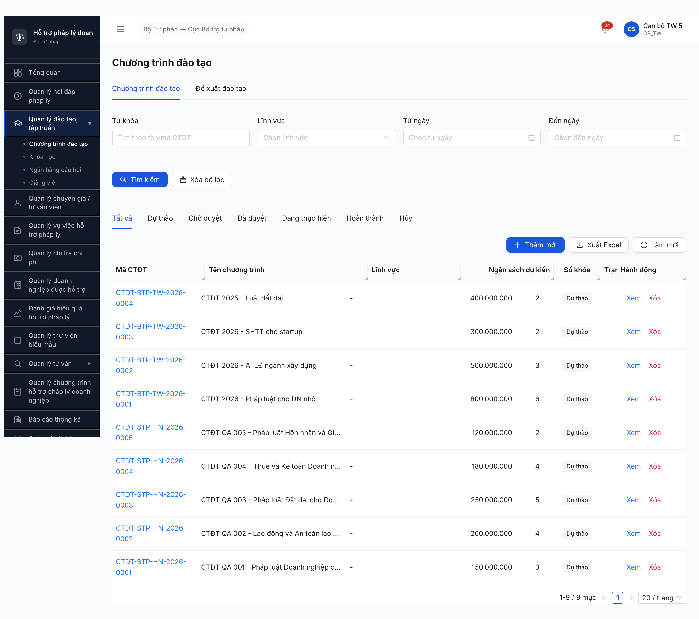
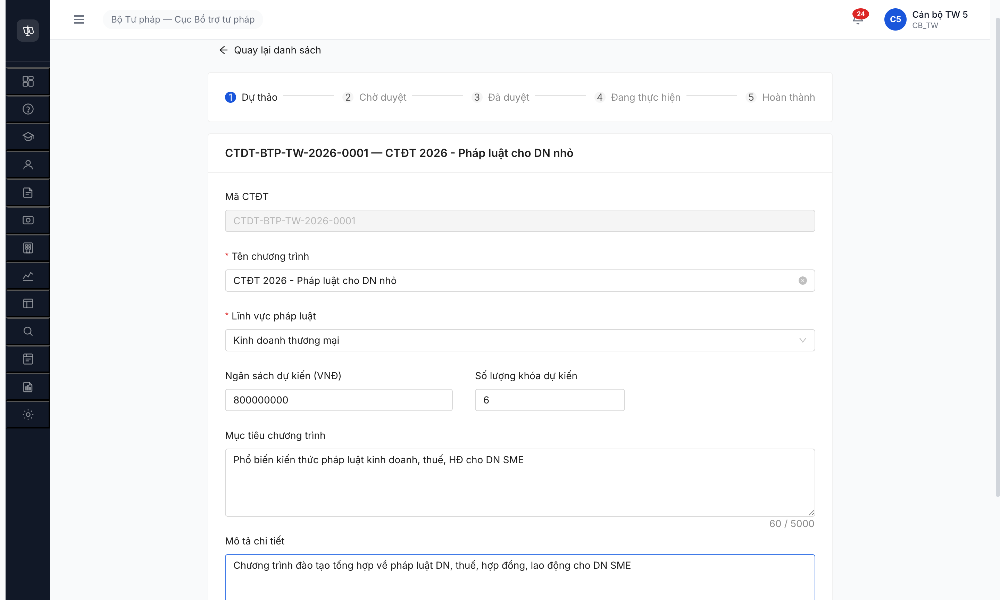

# Bug Report — Chương trình Đào tạo (M6.1-parent)

| Thông tin | Giá trị |
|-----------|---------|
| **Dự án** | PM HTPLDN |
| **Phiên bản** | 1.0 |
| **Môi trường** | http://103.172.236.130:3000/ |
| **Người test** | QA Automation via Claude Code (Chrome DevTools MCP) |
| **Ngày** | 17:20:00 [2026-04-23] |
| **Loại test** | Functional (CRUD Create) + data seeding |
| **Round** | Round 1 |
| **Tài liệu tham chiếu** | [seed-fixture.yaml M6.1-parent](../../../input/data/seed-fixture.yaml), [srs-fr-03-dao-tao.md](../../../input/srs-v3/srs-fr-03-dao-tao.md) |

---

## Tổng hợp

Phát hiện **3** lỗi có SRS reference cụ thể trong quá trình seed 4 CTDT via UI (canbo_tw_5, MCP).

> **Rule log bug:** Bug chỉ log khi có SRS reference cụ thể (`FR-X`, `§Outputs row N`, `§3.4.3.19`). Quan sát không map được clause SRS → ghi ở section `## Observations — ngoài SRS`.

### Severity breakdown

| Tổng | Critical | Major | Medium | Minor | Trivial |
|------|----------|-------|--------|-------|---------|
| 3    | 0        | 1     | 1      | 1     | 0       |

### Test result breakdown theo Type

| Type | Mô tả | TC count | PASS | PARTIAL | FAIL | BLOCKED | **Pass Rate** |
|------|-------|----------|------|---------|------|---------|---------------|
| **Happy** | CREATE 4 CTDT từ fixture | 4 | 4 | 0 | 0 | 0 | **100%** |
| **Total** | | **4** | **4** | **0** | **0** | **0** | **100%** |

→ **Happy-path Pass Rate = 4/4** — seed thành công cho downstream module M6.1 (Khóa học).

## Bug Summary Table

| Bug ID | Severity | Priority | Type | Module | TC Ref | **SRS Reference** | Title | Status |
|--------|----------|----------|------|--------|--------|-------------------|-------|--------|
| BUG-CTDT-001 | Major | P1 | UI/UX | CTDT | CTDT-001..004 | `FR-III-01 §Outputs — Danh sách row 4, 6, 7` | Danh sách CTDT thiếu 3 cột `hinh_thuc`, `ngay_bat_dau`, `ngay_ket_thuc` theo SRS | Open |
| BUG-CTDT-002 | Medium | P2 | Data | CTDT | CTDT-001..004 | `FR-III-01 §Outputs — Danh sách row 5 linh_vuc` | Cột "Lĩnh vực" trong list hiển thị "-" thay vì tên lĩnh vực đã gán | Open |
| BUG-CTDT-003 | Minor | P3 | UI/UX | CTDT | CTDT-001..004 | `§3.4.3.19 trang_thai enum (HUY)` | Progress bar detail page thiếu state `HUY` (enum 6/6) | Open |

---

## BUG-CTDT-001 — Danh sách CTDT thiếu 3 cột `hinh_thuc`, `ngay_bat_dau`, `ngay_ket_thuc` theo SRS Outputs

| Trường | Chi tiết |
|--------|----------|
| **Bug ID** | BUG-CTDT-001 |
| **Severity** | Major |
| **Priority** | P1 |
| **Type** | UI/UX |
| **Status** | Open |
| **Module** | Chương trình Đào tạo (FR-III-01, SCR-III-01) |
| **Thành phần** | Table danh sách CTDT (`/dao-tao/chuong-trinh/danh-sach`) |
| **URL** | http://103.172.236.130:3000/dao-tao/chuong-trinh/danh-sach |
| **Trình duyệt** | Chromium 146 (Chrome DevTools MCP) |
| **Tài khoản** | canbo_tw_5 (CB_NV, TW) |
| **TC Reference** | CTDT-001, CTDT-002, CTDT-003, CTDT-004 |
| **SRS Reference** | `srs-fr-03-dao-tao.md FR-III-01 §Outputs — Danh sách` (10 rows) — row 4 `hinh_thuc text`, row 6 `ngay_bat_dau date`, row 7 `ngay_ket_thuc date` |
| **Assignee** | FE Team |
| **Found by** | QA Automation |

### Mô tả

Table list CTDT UI chỉ render 7 cột (`Mã CTĐT | Tên | Lĩnh vực | Ngân sách | Số khóa | Trạng thái | Hành động`). SRS §Outputs quy định **10 field output** trong đó có `hinh_thuc`, `ngay_bat_dau`, `ngay_ket_thuc` — UI thiếu 3 cột này.

### Các bước tái hiện

1. Login canbo_tw_5 / Test@1234 / OTP `666666`
2. Sidebar → Quản lý đào tạo, tập huấn → Chương trình đào tạo
3. Quan sát bảng danh sách
4. Đối chiếu với SRS §Outputs Danh sách (10 rows)

### Kết quả mong đợi

- List render đủ 10 field theo SRS §Outputs row 1-10: `id, ma_ctdt, ten_chuong_trinh, hinh_thuc, linh_vuc, ngay_bat_dau, ngay_ket_thuc, so_khoa_hoc, trang_thai, total_count`

### Kết quả thực tế

- Chỉ 7 cột hiển thị: `Mã CTĐT | Tên chương trình | Lĩnh vực | Ngân sách dự kiến | Số khóa | Trạng thái | Hành động`
- Thiếu cột: **Hình thức** (hinh_thuc), **Ngày bắt đầu** (ngay_bat_dau), **Ngày kết thúc** (ngay_ket_thuc)
- Cột "Ngân sách dự kiến" có trong UI nhưng KHÔNG có trong §Outputs — UI thừa so với SRS

### Bằng chứng

### Tác động (Impact)

- User không thể filter/sort theo hình thức (TRUC_TUYEN/TRUC_TIEP/KET_HOP) trực tiếp từ list view
- User không biết thời gian triển khai khóa học khi scan list — phải mở từng record
- Nghi vấn: SRS §Inputs CTDT (8 fields) KHÔNG có `hinh_thuc`, `ngay_bat_dau`, `ngay_ket_thuc` → mâu thuẫn giữa Inputs và Outputs. BA cần clarify: 3 field này thuộc CTDT hay thuộc KHOA_HOC (entity con)?

### Nguyên nhân nghi ngờ (Root Cause)

1. FE chỉ render 7 cột theo mockup cũ, chưa cập nhật theo SRS v3 §Outputs.
2. HOẶC: SRS §Outputs mâu thuẫn với §Inputs — 3 field `hinh_thuc`/`ngay_bat_dau`/`ngay_ket_thuc` thực chất thuộc KHOA_HOC (entity con), không phải CTDT. Nếu vậy phải fix SRS thay vì fix code.

### Gợi ý sửa (Suggested Fix)

1. **BA:** Confirm ownership của 3 field `hinh_thuc`/`ngay_bat_dau`/`ngay_ket_thuc`:
   - Option A: Thuộc CTDT → update SRS §Inputs bổ sung 3 rows + dev thêm 3 cột list + 3 field form tao-moi
   - Option B: Chỉ thuộc KHOA_HOC → update SRS §Outputs CTDT xóa 3 rows (row 4, 6, 7)
2. Nếu chọn Option A: FE thêm 3 cột vào table + form tạo mới, BE thêm 3 field vào response GET /ctdt

---

## BUG-CTDT-002 — Cột "Lĩnh vực" trong list hiển thị "-" thay vì tên lĩnh vực đã gán

| Trường | Chi tiết |
|--------|----------|
| **Bug ID** | BUG-CTDT-002 |
| **Severity** | Medium |
| **Priority** | P2 |
| **Type** | Data |
| **Status** | Open |
| **Module** | Chương trình Đào tạo (FR-III-01, SCR-III-01) |
| **Thành phần** | Table danh sách CTDT — column "Lĩnh vực" |
| **URL** | http://103.172.236.130:3000/dao-tao/chuong-trinh/danh-sach |
| **Trình duyệt** | Chromium 146 (MCP) |
| **Tài khoản** | canbo_tw_5 |
| **TC Reference** | CTDT-001..004 + 5 records pre-existing |
| **SRS Reference** | `srs-fr-03-dao-tao.md FR-III-01 §Outputs — Danh sách row 5: linh_vuc text "Lĩnh vực"` |
| **Assignee** | Backend Team (or FE mapping) |
| **Found by** | QA Automation |

### Mô tả

100% record trong list CTDT (9/9: 4 mới tạo round này + 5 pre-existing) hiển thị cột "Lĩnh vực" là "-" (dash) thay vì tên lĩnh vực thực tế đã chọn khi tạo. SRS §Outputs row 5 quy định `linh_vuc text` → phải là tên lĩnh vực (vd "Kinh doanh thương mại", "Lao động").

### Các bước tái hiện

1. Login canbo_tw_5
2. Tạo CTDT mới với Lĩnh vực = "Kinh doanh thương mại" (CTDT-BTP-TW-2026-0001)
3. Quay lại list → quan sát cột Lĩnh vực

### Kết quả mong đợi

- Cột Lĩnh vực của CTDT-BTP-TW-2026-0001 hiển thị "Kinh doanh thương mại"
- Cột Lĩnh vực của CTDT-BTP-TW-2026-0002 hiển thị "Lao động"
- Cột Lĩnh vực của CTDT-BTP-TW-2026-0003 hiển thị "Sở hữu trí tuệ"
- Cột Lĩnh vực của CTDT-BTP-TW-2026-0004 hiển thị "Đất đai"

### Kết quả thực tế

| Mã CTĐT | Lĩnh vực đã chọn (form create) | Lĩnh vực (list) |
|---------|---------------------------------|-----------------|
| CTDT-BTP-TW-2026-0001 | Kinh doanh thương mại | **-** |
| CTDT-BTP-TW-2026-0002 | Lao động | **-** |
| CTDT-BTP-TW-2026-0003 | Sở hữu trí tuệ | **-** |
| CTDT-BTP-TW-2026-0004 | Đất đai | **-** |
| CTDT-STP-HN-2026-0001..0005 | (pre-existing) | **-** |

→ Detail page có hiển thị đúng tên lĩnh vực → bug chỉ ở list endpoint.

### Bằng chứng

### Tác động (Impact)

- User không thể scan nhanh danh mục theo lĩnh vực → phải mở từng record
- Vi phạm SRS §Outputs row 5
- Filter "Lĩnh vực" ở toolbar có thể vẫn work (backend filter), nhưng display broken

### Nguyên nhân nghi ngờ (Root Cause)

- BE response `GET /api/v1/chuong-trinh-dao-tao` có thể trả `linh_vuc_id` (UUID) nhưng KHÔNG trả `linh_vuc_ten` → FE không biết lookup → render "-"
- Hoặc BE có join DANH_MUC nhưng tên field response không match FE expect
- Cần `list_network_requests` verify response shape

### Gợi ý sửa (Suggested Fix)

1. BE: Response list CTDT phải JOIN DANH_MUC và trả thêm `linh_vuc_ten` string
2. FE: Column render đọc `row.linh_vuc_ten || row.linh_vuc?.ten || '-'` với fallback `-` thực sự chỉ khi missing

---

## BUG-CTDT-003 — Progress bar detail page thiếu state `HUY` (enum thiếu 1/6)

| Trường | Chi tiết |
|--------|----------|
| **Bug ID** | BUG-CTDT-003 |
| **Severity** | Minor |
| **Priority** | P3 |
| **Type** | UI/UX |
| **Status** | Open |
| **Module** | Chương trình Đào tạo (FR-III-01) |
| **Thành phần** | Detail page `/dao-tao/chuong-trinh/{id}` — component stepper/progress |
| **URL** | http://103.172.236.130:3000/dao-tao/chuong-trinh/e52de325-9814-4d20-8583-312da20141be |
| **Trình duyệt** | Chromium 146 (MCP) |
| **Tài khoản** | canbo_tw_5 |
| **TC Reference** | CTDT-001..004 |
| **SRS Reference** | `srs-fr-03-dao-tao.md §3.4.3.19 trang_thai CHECK IN ('DU_THAO','CHO_DUYET','DA_DUYET','DANG_THUC_HIEN','HOAN_THANH','HUY')` — enum 6 giá trị |
| **Assignee** | FE Team |
| **Found by** | QA Automation |

### Mô tả

Detail page render progress stepper 5 bước: `1 Dự thảo → 2 Chờ duyệt → 3 Đã duyệt → 4 Đang thực hiện → 5 Hoàn thành` — KHÔNG có state `HUY`. Danh sách filter tab bar CÓ tab "Hủy" → FE có nhận thức state nhưng stepper detail thiếu. Có button "Hủy chương trình" ở dưới → action tồn tại, nhưng sau khi click không biết state HUY được render ở đâu trên stepper.

### Các bước tái hiện

1. Login canbo_tw_5
2. Mở detail CTDT-BTP-TW-2026-0001
3. Quan sát progress stepper đầu trang

### Kết quả mong đợi

Stepper render 6 state theo enum `§3.4.3.19` hoặc có placeholder visual cho state `HUY` (vd branch-out từ stepper chính, hoặc badge "Đã hủy" override stepper khi state = HUY).

### Kết quả thực tế

- Stepper chỉ 5 state (thiếu HUY)
- List filter tab có "Hủy" (consistency issue — FE render thiếu nhưng logic hiểu đủ 6)

### Bằng chứng

### Tác động (Impact)

- User không biết state HUY được represent thế nào trong stepper khi transit vào
- Minor vì button "Hủy chương trình" vẫn hoạt động và filter tab vẫn đúng

### Gợi ý sửa (Suggested Fix)

Stepper component xử lý 2 variant: khi state = HUY → render badge "Đã hủy" full-width đè lên stepper, thay cho 5-step visual. Hoặc thêm bước thứ 6 với state HUY (branch).

---

## Observations — ngoài SRS (không log bug)

| Observation | Chi tiết / Evidence | SRS có nói không? | Đề xuất |
|-------------|----------------------|-------------------|---------|
| Fixture M6.1-parent có `hinh_thuc`, `thoi_gian_bat_dau`, `thoi_gian_ket_thuc`, `doi_tuong`, `file_dinh_kem` — form UI CTDT không có 5 field này | `seed-fixture.yaml` chuong_trinh_dao_tao_variants rows index 1-4. Form UI `/dao-tao/chuong-trinh/tao-moi` chỉ 6 field editable | SRS §Inputs CTDT (8 rows) không có `hinh_thuc`/`doi_tuong`/dates; `file_dinh_kem` row 8 có nhưng UI không implement. | Đối chiếu BA: 3 field `hinh_thuc`/dates liên quan BUG-CTDT-001 (mâu thuẫn Inputs↔Outputs); `doi_tuong` có khả năng thuộc KHOA_HOC (SRS KHOA_HOC row 7). Fixture nên scoped chỉ các field CTDT. |
| Fixture `linh_vuc_id: "DOANH_NGHIEP"` không có trong dropdown DANH_MUC | Dropdown options: Dân sự, Hình sự, Hành chính, Lao động, Đất đai, Hôn nhân gia đình, Kinh doanh thương mại, Khiếu nại tố cáo, Thuế (updated), Sở hữu trí tuệ | SRS `linh_vuc_id FK → DANH_MUC` — không define enum | BA confirm mapping `DOANH_NGHIEP` → "Kinh doanh thương mại"? Hoặc thêm "Doanh nghiệp" vào seed DANH_MUC. Round này QA dùng "Kinh doanh thương mại" làm closest semantic match. |
| Option dropdown "Thuế (updated)" — data leak test string | Đã log ở [memory qa_htpldn_hoidap_cr_round1](../../../../..//Users/teamai/.claude/projects/-Users-teamai-Downloads-antigravity-QA-skilkk/memory/qa_htpldn_hoidap_cr_round1.md) cho các module khác | — | KHÔNG duplicate log round này. Admin DANH_MUC cleanup test data. |
| Button "Xuất Excel" tồn tại trong toolbar — chưa test round seed | uid trong list page | SRS §Processing Xuất Excel (BR-DATA-06) — có | Round regression sau test riêng CASE Xuất Excel. |
| Tab "Đề xuất đào tạo" kế bên "Chương trình đào tạo" — chưa test round seed | Tab thứ 2 trong tab bar SCR-III-01 | SRS FR-III-13 (gộp vào SCR-III-01) | Round riêng test FR-III-13. |
| Form không validate `ngan_sach_du_kien` với giá trị âm trước round này | spinbutton default 0, arrow down disabled khi 0 — chưa test input -1 manual | SRS §Inputs row 5 `ngan_sach_du_kien money ≥ 0` | Round negative test riêng. |

---

## Phụ lục

### A — Môi trường test

| Thành phần | Giá trị |
|------------|---------|
| URL ứng dụng | http://103.172.236.130:3000/ |
| OTP login | `666666` (bypass tạm — dev enable) |
| MailHog (OTP inbox) | http://103.172.236.130:8025 |
| API base | http://103.172.236.130:3000/api/v1 |
| Frontend | React + Vite + Ant Design |
| Xác thực | JWT + OTP email (bypass `666666`) |
| Test method | Chrome DevTools MCP (primary) |

### B — Tài khoản sử dụng

| Tên đăng nhập | Vai trò | Cấp | Dùng cho bug nào |
|---------------|---------|-----|------------------|
| canbo_tw_5 | CB_NV | TW | Tất cả (BUG-CTDT-001, 002, 003) |

### C — Danh mục ảnh chụp

| File | Mô tả | Dùng cho bug |
|------|-------|--------------|
| [01-ctdt-01-form-filled.png](image/01-ctdt-01-form-filled.png) | Form CREATE record #1 đã fill | CTDT-001 |
| [02-ctdt-01-detail.png](image/02-ctdt-01-detail.png) | Detail CTDT-BTP-TW-2026-0001 (stepper thiếu HUY) | BUG-CTDT-003 |
| [03-ctdt-02-detail.png](image/03-ctdt-02-detail.png) | Detail CTDT-BTP-TW-2026-0002 | — |
| [04-ctdt-03-detail.png](image/04-ctdt-03-detail.png) | Detail CTDT-BTP-TW-2026-0003 | — |
| [05-ctdt-04-detail.png](image/05-ctdt-04-detail.png) | Detail CTDT-BTP-TW-2026-0004 | — |
| [06-ctdt-final-list.png](image/06-ctdt-final-list.png) | Full list 9 records (cột Lĩnh vực = "-", thiếu hinh_thuc/dates) | BUG-CTDT-001, 002 |

---

*Bug report generated: 2026-04-23 | QA Automation via Claude Code (Chrome DevTools MCP)*
