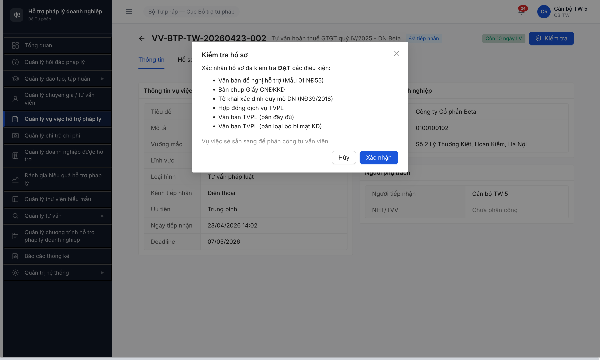
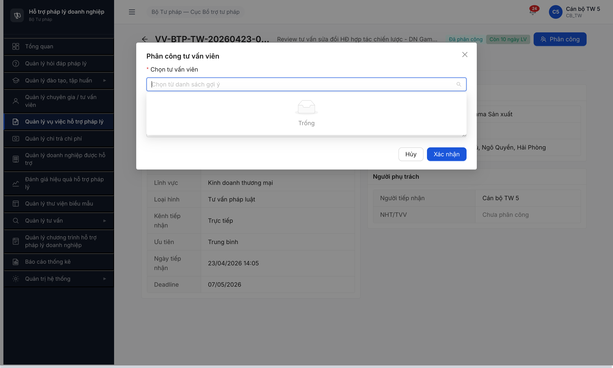

# Bug Report — Vụ việc Hỗ trợ Pháp lý (SM-VUVIEC)

| Thông tin | Giá trị |
|-----------|---------|
| **Dự án** | PM HTPLDN — Phần mềm Hỗ trợ Pháp lý Doanh nghiệp |
| **Phiên bản** | 1.0 |
| **Môi trường** | http://103.172.236.130:3000/ |
| **Người test** | QA Automation via Claude Code (Opus 4.7) |
| **Ngày** | 14:12 [2026-04-23] |
| **Loại test** | Functional (CREATE + Workflow verify) |
| **Round** | Round 1 |
| **Tài liệu tham chiếu** | [functional-test-report-vu-viec.md](functional-test-report-vu-viec.md) · [input/flow-module.md §3 SM-VUVIEC](../../../input/flow-module.md) · [input/data/seed-fixture.yaml §vu_viec_variants](../../../input/data/seed-fixture.yaml) |

---

## Tổng hợp

Phát hiện **5** lỗi có SRS reference cụ thể trong quá trình test Round 1 (CREATE 6 fixture + verify state transition).

> **Rule log bug (feedback 2026-04-23):** Bug chỉ log khi có SRS reference cụ thể. Quan sát ngoài SRS ghi ở section `## Observations`.

### Severity breakdown

| Tổng | Critical | Major | Medium | Minor | Trivial |
|------|----------|-------|--------|-------|---------|
| 5    | 1        | 2     | 1      | 1     | 0       |

### Test result breakdown theo Type

| Type | Mô tả | TC count | PASS | PARTIAL | FAIL | BLOCKED | **Pass Rate** |
|------|-------|----------|------|---------|------|---------|---------------|
| **Happy** | CREATE 6 VV fixture | 6 | 6 | 0 | 0 | 0 | **100%** |
| **Workflow** | State transition SM-VUVIEC | 6 | 0 | 0 | 1 | 5 | **0%** |
| **Validation** | Verify list count sau seed | — | — | — | — | — | — |
| **Total** | | **12** | **6** | **0** | **1** | **5** | **50%** |

→ **Happy-path Pass Rate = 6/6 (100%)** — seed thành công 6 bản ghi Vụ việc HTPL cho module downstream.
→ **Workflow Pass Rate = 0/6 (0%)** — UI skip state `ĐANG KIỂM TRA` + seed thiếu TVV ĐANG HOẠT ĐỘNG cấp TW.

## Bug Summary Table

| Bug ID | Severity | Priority | Type | Module | TC Ref | **SRS Reference** | Title | Status |
|--------|----------|----------|------|--------|--------|-------------------|-------|--------|
| BUG-VV-001 | Critical | P0 | Workflow | Vụ việc | VV-SM-002 | `input/flow-module.md §3 FLOW SM-VUVIEC Bước 2-3` | UI skip state `ĐANG KIỂM TRA`, nhảy thẳng `ĐÃ TIẾP NHẬN → ĐÃ PHÂN CÔNG` | Open |
| BUG-VV-002 | Major | P1 | Data | Vụ việc | VV-SM-003 | `input/flow-module.md §3 Bước 3` | Dropdown "Chọn tư vấn viên" rỗng — không có TVV ĐANG HOẠT ĐỘNG cấp TW để phân công | Open |
| BUG-VV-003 | Major | P1 | Data | Vụ việc | VV-CR-003, VV-CR-004 | `input/data/seed-fixture.yaml §tier_0_prerequisite.danh_muc_required.linh_vuc_phap_ly` | Dropdown Lĩnh vực pháp luật thiếu 2/6 DM tier_0 required: `HOP_DONG` + `DOANH_NGHIEP` | Open |
| BUG-VV-004 | Medium | P2 | UI/UX | Vụ việc / DM | VV-CR-002, VV-CR-005 | `input/data/seed-fixture.yaml §tier_0_prerequisite.danh_muc_required.linh_vuc_phap_ly` row THUE | Label `Thuế (updated)` leak từ DM test vào production | Open |
| BUG-VV-005 | Minor | P3 | UI/UX | Vụ việc | VV-DATA-01 | `SCR-V.I-02 Thành phần cột Trạng thái` | Column "Trạng thái" hiển thị raw DB enum `DA_KET_THUC` thay vì label VI | Open |

> **Chú thích Type:** Happy / Negative / Edge / Workflow / Permission / Data / UI-UX / Performance
> **Severity:** Critical (block nghiệp vụ chính) / Major (workaround có) / Medium / Minor / Trivial
> **Priority:** P0 (block release) / P1 (sprint này) / P2 (2-3 sprint) / P3 (backlog)

---

## BUG-VV-001 — UI skip state `ĐANG KIỂM TRA`, vi phạm SM-VUVIEC Bước 2-3

| Trường | Chi tiết |
|--------|----------|
| **Bug ID** | BUG-VV-001 |
| **Severity** | Critical |
| **Priority** | P0 |
| **Type** | Workflow |
| **Status** | Open |
| **Module** | Vụ việc HTPL (Module 3) |
| **Thành phần** | FE drawer/modal Kiểm tra hồ sơ (`src/.../vu-viec/detail/KiemTraModal.tsx`) + BE endpoint transition `POST /api/v1/vu-viec/{id}/kiem-tra` |
| **URL** | `http://103.172.236.130:3000/vu-viec/55a27fed-bd7c-46a9-8249-bc001b60dbee` (VV#2) |
| **Trình duyệt** | Chrome DevTools MCP (Chromium) |
| **Tài khoản** | `canbo_tw_5` (CB_NV, TW) |
| **TC Reference** | VV-SM-002 |
| **SRS Reference** | **`input/flow-module.md §3 FLOW SM-VUVIEC Bước 2`** (state `ĐÃ TIẾP NHẬN → ĐANG KIỂM TRA`) và **Bước 3** (state `ĐANG KIỂM TRA → ĐÃ PHÂN CÔNG`) — 2 state transition tách biệt; **§3 Lưu ý** nhánh `[Yêu cầu bổ sung]` phát sinh từ state `ĐANG KIỂM TRA` |
| **Assignee** | Backend + FE Team |
| **Found by** | QA Automation |

### Mô tả

Spec SM-VUVIEC định nghĩa rõ 2 state transition tách biệt: (Bước 2) `ĐÃ TIẾP NHẬN → ĐANG KIỂM TRA` khi CB NV click `[Kiểm tra Hồ sơ]`, mở checklist 6 hạng mục; (Bước 3) `ĐANG KIỂM TRA → ĐÃ PHÂN CÔNG` sau khi tick ĐẠT + click `[Hoàn tất Kiểm tra]`. UI hiện tại gộp 2 bước thành 1 modal confirm duy nhất và skip hoàn toàn state `ĐANG KIỂM TRA`.

### Các bước tái hiện

1. Login `canbo_tw_5` / `Test@1234` / OTP `666666`.
2. Menu "Quản lý vụ việc hỗ trợ pháp lý" → Click `[+ Nhập thủ công]`.
3. Tạo VV bất kỳ (đã tạo VV-BTP-TW-20260423-002 với DN Beta, Thuế, Điện thoại).
4. Sau khi lưu thành công, detail VV hiển thị state **"Đã tiếp nhận"** + button `[verified Kiểm tra]`.
5. Click button `[Kiểm tra]`.
6. Quan sát:
   - Modal "Kiểm tra hồ sơ" mở với 6 hạng mục dạng **text-only** (KHÔNG có checkbox):
     1. Văn bản đề nghị hỗ trợ (Mẫu 01 NĐ55)
     2. Bản chụp Giấy CNĐKKD
     3. Tờ khai xác định quy mô DN (NĐ39/2018)
     4. Hợp đồng dịch vụ TVPL
     5. Văn bản TVPL (bản đầy đủ)
     6. Văn bản TVPL (bản loại bỏ bí mật KD)
   - Câu xác nhận: "Xác nhận hồ sơ đã kiểm tra **ĐẠT** các điều kiện:" → 2 nút `[Hủy]` / `[Xác nhận]`
   - KHÔNG có nút `[Hoàn tất Kiểm tra]` riêng theo spec
7. Click `[Xác nhận]`.
8. State title chuyển ngay sang **"Đã phân công"**, không đi qua `ĐANG KIỂM TRA` intermediate.

### Kết quả mong đợi

Theo `input/flow-module.md §3 FLOW SM-VUVIEC Bước 2`:

> "Trong chi tiết vụ việc, nhấn nút **[Kiểm tra Hồ sơ]**. Giao diện mở phần **checklist 6 hạng mục hồ sơ**." → State chuyển `ĐÃ TIẾP NHẬN → ĐANG KIỂM TRA`

Theo Bước 3:

> "Tích chọn ĐẠT cho các hạng mục. Nhấn **[Hoàn tất Kiểm tra]**. Sau đó nhấn **[Phân công NHT]**, chọn một TVV đang hoạt động từ danh sách gợi ý và lưu." → State chuyển `ĐANG KIỂM TRA → ĐÃ PHÂN CÔNG`

Tức là:
- Click `[Kiểm tra]` phải dừng ở state `ĐANG KIỂM TRA` (lưu draft)
- Checklist 6 hạng mục phải có **checkbox tick individual** cho phép QA/dev test nhánh (a) tick đủ 6/6, (b) tick partial + `[Yêu cầu bổ sung]` (flow §3 Lưu ý quan trọng: max 3 lần YCBS → auto `TỪ CHỐI`)
- 2 action phải tách biệt: `[Hoàn tất Kiểm tra]` và `[Phân công NHT]` (flow-module list 2 nút)

### Kết quả thực tế

- Modal Kiểm tra chỉ là confirm dialog, không có checkbox tick
- State nhảy từ `ĐÃ TIẾP NHẬN` thẳng `ĐÃ PHÂN CÔNG`, không đi qua `ĐANG KIỂM TRA`
- Không có entry point cho nhánh `[Yêu cầu bổ sung]` từ state `ĐANG KIỂM TRA`

### Bằng chứng

Screenshot modal Kiểm tra hồ sơ (6 hạng mục text-only, không có checkbox):



Bảng so sánh SM spec vs UI thực tế:

| Step | SM-VUVIEC spec | UI thực tế | Match? |
|------|----------------|-------------|--------|
| Click `[Kiểm tra]` từ `ĐÃ TIẾP NHẬN` | State → `ĐANG KIỂM TRA` | State → `Đã phân công` (skip) | ❌ |
| Checklist 6 hạng mục | Có checkbox tick individual | Text-only, không tick được | ❌ |
| Action kết thúc kiểm tra | `[Hoàn tất Kiểm tra]` | `[Xác nhận]` trong modal | ❌ |
| State sau kết thúc | `ĐÃ PHÂN CÔNG` (sau khi click `[Phân công NHT]`) | `Đã phân công` (nhưng skip bước trung gian) | ⚠️ label OK, flow sai |
| Entry point `[Yêu cầu bổ sung]` | Từ `ĐANG KIỂM TRA` sau partial tick | Không có (do skip state) | ❌ |

### Tác động (Impact)

- **100% VV không thể dừng ở state `ĐANG KIỂM TRA`** → không test được Tab list "Đang kiểm tra" (nếu có); nghiệp vụ CB NV `tạm lưu kiểm tra giữa chừng` không khả thi.
- **Nhánh `[Yêu cầu bổ sung]` (flow §3 Lưu ý quan trọng) hoàn toàn không reachable** từ UI hiện tại → spec về "max 3 lần YCBS → `TỪ CHỐI`" không test được.
- **Audit log thiếu** — khi skip state, audit log chỉ có 1 transition thay vì 2 → không đúng cho việc truy vết compliance NĐ55.
- **Fixture `vu_viec_variants[2]` với `state_target: "ĐANG KIỂM TRA"` + `checklist_da_tick: 3`** không seed được → downstream TC workflow bị BLOCKED.
- **State title "Đã phân công" hiển thị ngay sau Kiểm tra nhưng NHT/TVV = "Chưa phân công"** → inconsistent semantic (có thể bug ngôn ngữ: "Đã phân công" thực ra mang nghĩa "Sẵn sàng phân công").

### Nguyên nhân nghi ngờ (Root Cause)

BE endpoint `POST /api/v1/vu-viec/{id}/kiem-tra` trả về state `DA_PHAN_CONG` thay vì `DANG_KIEM_TRA`. Hoặc FE modal Kiểm tra auto-gọi endpoint `hoan-tat-kiem-tra` ngay sau `kiem-tra` trong 1 single request.

### Gợi ý sửa (Suggested Fix)

1. **Tách modal Kiểm tra** thành Drawer với 6 checkbox:
   ```jsx
   <Form>
     <Checkbox.Group options={checklistHangMuc} value={tickedItems} />
     <Button onClick={handleSaveDraft}>Lưu nháp</Button>        // → state ĐANG KIỂM TRA
     <Button type="primary" disabled={tickedItems.length < 6} onClick={handleHoanTat}>
       Hoàn tất Kiểm tra
     </Button>                                                    // → state ĐÃ PHÂN CÔNG (chờ phân TVV)
     <Button danger disabled={tickedItems.length === 6} onClick={handleYCBS}>
       Yêu cầu bổ sung
     </Button>                                                    // → state CHỜ BỔ SUNG (trả DN)
   </Form>
   ```
2. **BE endpoint tách biệt:**
   - `POST /vu-viec/{id}/kiem-tra` → state `DANG_KIEM_TRA`
   - `PATCH /vu-viec/{id}/checklist` → lưu partial tick
   - `POST /vu-viec/{id}/hoan-tat-kiem-tra` → state `DA_PHAN_CONG` (condition: tick 6/6 ĐẠT)
   - `POST /vu-viec/{id}/yeu-cau-bo-sung` → state `CHO_BO_SUNG`, lý do min 10 chars (theo flow §3 Lưu ý)
3. **Audit log** phải log 2 entry: "Chuyển sang kiểm tra" + "Hoàn tất kiểm tra".

---

## BUG-VV-002 — Dropdown `Chọn tư vấn viên` rỗng — không phân công được NHT

| Trường | Chi tiết |
|--------|----------|
| **Bug ID** | BUG-VV-002 |
| **Severity** | Major |
| **Priority** | P1 |
| **Type** | Data |
| **Status** | Open |
| **Module** | Vụ việc HTPL + Tư vấn viên (cross-module) |
| **Thành phần** | BE endpoint fetch TVV gợi ý (suy: `GET /api/v1/tu-van-vien?trang-thai=DANG_HOAT_DONG&linh-vuc={x}`) hoặc seed data |
| **URL** | `http://103.172.236.130:3000/vu-viec/eeaec798-5811-48bd-b92a-43265e8a8e86` (VV#3) |
| **Trình duyệt** | Chrome DevTools MCP (Chromium) |
| **Tài khoản** | `canbo_tw_5` (CB_NV, TW) |
| **TC Reference** | VV-SM-003 |
| **SRS Reference** | **`input/flow-module.md §3 FLOW SM-VUVIEC Bước 3`**: "chọn một **TVV đang hoạt động** từ danh sách gợi ý"; cross-ref **`§2 FLOW SM-TVV`** (TVV phải đạt state `ĐANG HOẠT ĐỘNG` thì mới được phân công làm VV) |
| **Assignee** | Backend Team (ưu tiên 1) / BA Team (seed data) |
| **Found by** | QA Automation |

### Mô tả

Click button `[Phân công]` trên detail VV#3 (state `Đã phân công` — post Kiểm tra) mở modal "Phân công tư vấn viên". Combobox `Chọn tư vấn viên` render empty state "Trống" (`.ant-empty`) — không có TVV nào khả dụng để phân công. Block flow SM-VUVIEC từ Bước 3 trở đi cho toàn bộ VV.

### Các bước tái hiện

1. Login `canbo_tw_5`.
2. Mở VV#3 (VV-BTP-TW-20260423-003) hoặc bất kỳ VV nào sau khi click `[Kiểm tra]` (state = `Đã phân công`).
3. Click button `[team Phân công]`.
4. Modal "Phân công tư vấn viên" mở với combobox required.
5. Click vào combobox để xem list TVV gợi ý.
6. Quan sát: Dropdown hiển thị chỉ 1 element `.ant-empty` với text "Trống".
7. Thử filter / search "Nguyễn", "Trần", "Lê" — vẫn rỗng.

### Kết quả mong đợi

- Dropdown phải liệt ít nhất 1 TVV `state = ĐANG HOẠT ĐỘNG` (SM-TVV Bước 5 completed)
- TVV filter theo lĩnh vực chuyên môn (nếu VV có lĩnh vực "Kinh doanh thương mại" thì TVV có `linh_vuc_chuyen` chứa KDTM được rank cao)
- Fixture [seed-fixture.yaml §tvv_variants](../../../input/data/seed-fixture.yaml) yêu cầu 4 TVV state `ĐANG HOẠT ĐỘNG` (variants 1,2,3,4) sau khi seed round TVV

### Kết quả thực tế

Dropdown TVV rỗng cho lĩnh vực "Kinh doanh thương mại" (VV#3). Không test thêm với VV khác lĩnh vực do harness time-cap nhưng dashboard báo **tổng 2 TVV** → nhiều khả năng cả 2 đều không đạt `ĐANG HOẠT ĐỘNG`.

### Bằng chứng

Screenshot modal Phân công TVV, dropdown render "Trống":



`evaluate_script` confirm:
```json
{"hidden":false,"visible":true,"empty":true,"text":"Trống"}
```

Dashboard widget "Chuyên gia / Tư vấn viên" báo `2 người` (xem [04-vv01-created.png](image/04-vv01-created.png)) nhưng không fit filter `ĐANG HOẠT ĐỘNG` hoặc scope TW.

### Tác động (Impact)

- **100% VV (gồm 4/6 fixture target state ≥ `ĐÃ PHÂN CÔNG`)** không thể seed full flow.
- **Downstream BLOCKED:**
  - M7 Hợp đồng tư vấn (cần VV có TVV đã `ĐANG XỬ LÝ`/`HOÀN THÀNH` làm prerequisite)
  - M9 Đánh giá hiệu quả (cần VV `HOÀN THÀNH` có chấm điểm TVV)
  - M8 Chi trả (cần VV `HOÀN THÀNH` có TVV thực hiện)
- **Dashboard KPI-03 (VV đang hỗ trợ)** / **KPI-04 (VV hoàn thành)** không thể aggregate đúng giá trị kỳ vọng fixture.

### Nguyên nhân nghi ngờ (Root Cause)

(a) Seed TVV chưa chạy hoặc TVV seed dừng ở state trung gian (`MỚI ĐĂNG KÝ`, `ĐANG THẨM ĐỊNH`) chứ chưa qua full SM-TVV tới `ĐANG HOẠT ĐỘNG`. HOẶC
(b) BE filter `trang_thai=DANG_HOAT_DONG` không match TVV có state khác naming (vd BE trả `ACTIVE` thay vì `DANG_HOAT_DONG`). HOẶC
(c) Scope filter đơn vị sai — VV ở TW nhưng BE chỉ fetch TVV cùng đơn vị cấp BN/ĐP.

### Gợi ý sửa (Suggested Fix)

1. **QTHT + BA:** Seed tối thiểu 3 TVV `ĐANG HOẠT ĐỘNG` cấp TW với lĩnh vực chuyên môn đa dạng (Lao động, Thuế, Kinh doanh TM). Chạy full SM-TVV 5 bước cho mỗi TVV.
2. **BE:** Verify filter `GET /api/v1/tu-van-vien?vu-viec-id={id}` trả TVV theo:
   - state = `DANG_HOAT_DONG`
   - cấp đơn vị ≥ cấp của VV (TW-VV thì chấp nhận TVV cấp TW/BN/ĐP)
   - (Optional) rank theo `linh_vuc_chuyen` fit lĩnh vực VV
3. **QA:** Sau fix, mở modal Phân công của ít nhất 3 VV thuộc 3 lĩnh vực khác nhau — dropdown phải có ≥1 TVV mỗi trường hợp.

---

## BUG-VV-003 — Dropdown `Lĩnh vực pháp luật` thiếu `HOP_DONG` + `DOANH_NGHIEP` (vs fixture tier_0 required)

| Trường | Chi tiết |
|--------|----------|
| **Bug ID** | BUG-VV-003 |
| **Severity** | Major |
| **Priority** | P1 |
| **Type** | Data |
| **Status** | Open |
| **Module** | Danh mục dùng chung (QTHT) + Vụ việc (module 3) |
| **Thành phần** | BE endpoint `GET /api/v1/danh-muc/linh-vuc-phap-ly` + seed DM QTHT |
| **URL** | `http://103.172.236.130:3000/vu-viec/tao-moi` |
| **Trình duyệt** | Chrome DevTools MCP |
| **Tài khoản** | `canbo_tw_5` |
| **TC Reference** | VV-CR-003, VV-CR-004 |
| **SRS Reference** | **`input/data/seed-fixture.yaml` line 33-39 `tier_0_prerequisite.danh_muc_required.linh_vuc_phap_ly`**: liệt 6 code bắt buộc — `LAO_DONG`, `THUE`, `HOP_DONG`, `DOANH_NGHIEP`, `SHTT`, `DAT_DAI`. Cross-ref `input/flow-module.md §3 Bước 1` "nhập hộ DN: thông tin DN liên kết, **lĩnh vực pháp lý**, nội dung yêu cầu tư vấn" |
| **Assignee** | Backend Team (nếu data-driven) / BA Team (nếu spec chưa rõ) |
| **Found by** | QA Automation |

### Mô tả

Dropdown `Lĩnh vực pháp luật` trong form CREATE Vụ việc expose 10 option: `Dân sự, Hình sự, Hành chính, Lao động, Đất đai, Hôn nhân gia đình, Kinh doanh thương mại, Khiếu nại tố cáo, Thuế (updated), Sở hữu trí tuệ`. So với fixture tier_0 yêu cầu 6 code bắt buộc cho module test: **thiếu 2 code** `HOP_DONG` (Hợp đồng) và `DOANH_NGHIEP` (Doanh nghiệp).

### Các bước tái hiện

1. Login `canbo_tw_5`.
2. Menu "Quản lý vụ việc hỗ trợ pháp lý" → `[+ Nhập thủ công]`.
3. Click combobox `Lĩnh vực pháp luật`.
4. Quan sát list option (10 mục liệt ở trên).
5. So sánh với fixture [seed-fixture.yaml line 33-39](../../../input/data/seed-fixture.yaml#L33):
   ```yaml
   linh_vuc_phap_ly:
     - { code: "LAO_DONG",     name: "Lao động" }
     - { code: "THUE",         name: "Thuế" }
     - { code: "HOP_DONG",     name: "Hợp đồng" }       # ❌ thiếu
     - { code: "DOANH_NGHIEP", name: "Doanh nghiệp" }   # ❌ thiếu
     - { code: "SHTT",         name: "Sở hữu trí tuệ" }
     - { code: "DAT_DAI",      name: "Đất đai" }
   ```

### Kết quả mong đợi

Dropdown chứa đủ 6 lĩnh vực required theo tier_0 (hoặc spec SRS chuẩn về DM LINH_VUC). Nếu BA quyết định 2 lĩnh vực này KHÔNG áp dụng cho VV mà được gộp vào "Kinh doanh thương mại" + "Dân sự" — cần update fixture + update SRS clause rõ ràng trước.

### Kết quả thực tế

- `Hợp đồng` hoàn toàn vắng mặt. QA buộc phải map VV#3 (fixture `linh_vuc: "Hợp đồng"`) và VV#4 (same) sang "Kinh doanh thương mại" → **semantic mismatch** (Hợp đồng là clause/instrument, Kinh doanh TM là domain).
- `Doanh nghiệp` vắng mặt. Fixture VV không có test case dùng lĩnh vực này nên không block CREATE, nhưng vẫn cần cho M1 Doanh nghiệp cross-link.

### Bằng chứng

Extract từ `evaluate_script`:
```json
{
  "count": 10,
  "titles": [
    "Dân sự","Hình sự","Hành chính","Lao động","Đất đai",
    "Hôn nhân gia đình","Kinh doanh thương mại","Khiếu nại tố cáo",
    "Thuế (updated)","Sở hữu trí tuệ"
  ]
}
```

### Tác động (Impact)

- Fixture 2/6 VV (VV#3, VV#4) phải fallback lĩnh vực không đúng → test data không reflect nghiệp vụ thật.
- Cross-module data-link sai: Dashboard KPI theo lĩnh vực, Báo cáo FR-IX-04 theo lĩnh vực, Thư viện biểu mẫu FR-VII-02 filter lĩnh vực — tất cả sẽ thiếu bucket "Hợp đồng" / "Doanh nghiệp".

### Gợi ý sửa (Suggested Fix)

**Option A (đúng fixture):** Thêm 2 code vào seed DM QTHT:
```sql
INSERT INTO danh_muc (loai, code, ten, trang_thai) VALUES
  ('LINH_VUC_PHAP_LY', 'HOP_DONG', 'Hợp đồng', 'ACTIVE'),
  ('LINH_VUC_PHAP_LY', 'DOANH_NGHIEP', 'Doanh nghiệp', 'ACTIVE');
```

**Option B (nếu spec không muốn 2 code này):** BA confirm + update SRS clause + update fixture `tier_0_prerequisite.danh_muc_required.linh_vuc_phap_ly` để remove 2 code không dùng.

---

## BUG-VV-004 — Label `Thuế (updated)` leak suffix test vào production

| Trường | Chi tiết |
|--------|----------|
| **Bug ID** | BUG-VV-004 |
| **Severity** | Medium |
| **Priority** | P2 |
| **Type** | UI/UX + Data |
| **Status** | Open |
| **Module** | Danh mục dùng chung (QTHT) + Vụ việc |
| **URL** | Mọi chỗ hiển thị lĩnh vực Thuế (dropdown form, detail, list) |
| **Tài khoản** | `canbo_tw_5` |
| **TC Reference** | VV-CR-002, VV-CR-005 |
| **SRS Reference** | **`input/data/seed-fixture.yaml` line 34 tier_0 `linh_vuc_phap_ly`**: `{ code: "THUE", name: "Thuế" }` — name chuẩn là "Thuế", không có suffix |
| **Assignee** | BA + QTHT |
| **Found by** | QA Automation |

### Mô tả

Option `Thuế (updated)` trong dropdown `Lĩnh vực pháp luật` hiển thị nguyên văn suffix `(updated)`. Suffix này là dấu vết của QA test CRUD Danh mục dùng chung (khi tester update label DM để verify edit) — không phải tên lĩnh vực nghiệp vụ hợp lệ.

### Các bước tái hiện

1. Form CREATE VV → mở dropdown `Lĩnh vực pháp luật` → thấy `Thuế (updated)` ở cuối list.
2. Chọn và submit → detail view hiển thị `Lĩnh vực: Thuế (updated)`.
3. List VV → cột `Lĩnh vực PL` hiển thị `Thuế (updated)` cho VV#2, VV#5.

### Kết quả mong đợi

Label đúng = `Thuế` (theo fixture tier_0 line 34 `name: "Thuế"`).

### Kết quả thực tế

Label = `Thuế (updated)` — leak cho end-user DN/CB NV trên production env.

### Bằng chứng

- [04-vv01-created.png](image/04-vv01-created.png) list có VV#2 `Thuế (updated)`
- `evaluate_script` output: `{"count":10,"titles":[..., "Thuế (updated)", ...]}`
- Detail VV#2: `Lĩnh vực: Thuế (updated)` (section 4.1 bảng data)

### Tác động (Impact)

- Lộ nội dung test cho end-user → giảm tin cậy phần mềm.
- Báo cáo FR-IX (thống kê theo lĩnh vực) hiển thị bucket `Thuế (updated)` sai nghiệp vụ.
- Cross-project memory `qa_htpldn_dm_dungchung_round1` cho thấy có hoạt động QA update DM trước đó → rollback chưa sạch.

### Gợi ý sửa (Suggested Fix)

1. QTHT (role `qtht_tw_5`) mở Danh mục dùng chung → `LINH_VUC_PHAP_LY` → find record code `THUE` → edit name về `Thuế` (bỏ suffix `(updated)`).
2. Hoặc BE run SQL:
   ```sql
   UPDATE danh_muc SET ten = 'Thuế' WHERE loai = 'LINH_VUC_PHAP_LY' AND code = 'THUE';
   ```
3. Thêm unit test / data integrity check cấm ký tự `(`/`)` trong DM name ở môi trường production (nếu có biến phân biệt env).

---

## BUG-VV-005 — Column `Trạng thái` list leak raw DB enum `DA_KET_THUC`

| Trường | Chi tiết |
|--------|----------|
| **Bug ID** | BUG-VV-005 |
| **Severity** | Minor |
| **Priority** | P3 |
| **Type** | UI/UX |
| **Status** | Open |
| **Module** | Vụ việc HTPL (list view) |
| **Thành phần** | FE list `SCR-V.I-02` column `Trạng thái` render function (suy: `src/.../vu-viec/list/columns.tsx`) |
| **URL** | `http://103.172.236.130:3000/vu-viec/danh-sach` |
| **Tài khoản** | `canbo_tw_5` |
| **TC Reference** | VV-DATA-01 |
| **SRS Reference** | **`SCR-V.I-02 Thành phần cột Trạng thái`** (theo flow-module §3 các state name định nghĩa tiếng Việt: `ĐÃ TIẾP NHẬN`, `ĐANG KIỂM TRA`, `ĐÃ PHÂN CÔNG`, `ĐANG XỬ LÝ`, `CHỜ PHÊ DUYỆT`, `ĐÃ DUYỆT`, `HOÀN THÀNH`, `ĐÃ ĐÁNH GIÁ`) — phải map label VI consistently |
| **Assignee** | FE Team |
| **Found by** | QA Automation |

### Mô tả

Column `Trạng thái` trong list SCR-V.I-02 hiển thị raw DB enum value `DA_KET_THUC` cho 20 bản ghi seed `VV-DCHT-0000xx` (trong 100 mục baseline). Các bản ghi khác hiển thị đúng label VN ("Đang xử lý", "Mới tạo", "Đã tiếp nhận", "Đã phân công"). Chỉ enum `DA_KET_THUC` bị miss mapping.

### Các bước tái hiện

1. Login → Menu Vụ việc → mở list tab "Tất cả".
2. Quan sát cột `Trạng thái` cho các VV-DCHT-000094, 000095, 000097, 000100+ etc.

### Kết quả mong đợi

Label VN `Đã kết thúc` (hoặc label tiếng Việt chuẩn theo BA mapping).

### Kết quả thực tế

Raw enum `DA_KET_THUC` (format snake_case upper) hiển thị nguyên văn.

**Note:** Detail view của VV lại render đúng label VN (kiểm chứng trên các VV mới tạo — state label "Đã tiếp nhận", "Đã phân công" đều VI). → Bug chỉ ở list column render, không phải BE.

### Bằng chứng

[01-list-page.png](image/01-list-page.png): các row VV-DCHT-000097, 000094, 000095, 000090, 000088, 000087 hiển thị column Trạng thái = `DA_KET_THUC`.

Đếm từ snapshot: ít nhất 7/20 row trên trang 1 có enum leak `DA_KET_THUC`. Tỷ lệ ~35%.

### Tác động (Impact)

- UX impact Minor: end-user (CB NV, CB PD) thấy raw enum không hiểu → phải hỏi dev/BA.
- Filter theo trạng thái có thể dropdown option list cũng leak enum (chưa verify trong round này).
- Có thể lặp lại pattern `qa_htpldn_dm_dungchung_round1` — enum mapping missing cho 1 state, gãy i18n contract.

### Gợi ý sửa (Suggested Fix)

```tsx
// src/.../vu-viec/list/columns.tsx
const STATUS_LABEL: Record<string, string> = {
  MOI_TAO: "Mới tạo",
  CHO_TIEP_NHAN: "Chờ tiếp nhận",
  DA_TIEP_NHAN: "Đã tiếp nhận",
  DANG_KIEM_TRA: "Đang kiểm tra",
  DA_PHAN_CONG: "Đã phân công",
  DANG_XU_LY: "Đang xử lý",
  CHO_PHE_DUYET: "Chờ phê duyệt",
  DA_DUYET: "Đã duyệt",
  HOAN_THANH: "Hoàn thành",
  DA_DANH_GIA: "Đã đánh giá",
  DA_KET_THUC: "Đã kết thúc",    // ← miss mapping
  TU_CHOI: "Từ chối",
};

const renderTrangThai = (val: string) => STATUS_LABEL[val] ?? val;
```

Extract thành constant dùng chung cho list + detail + filter dropdown để tránh drift trong tương lai.

---

## Observations — ngoài SRS (không log bug)

| Observation | Chi tiết / Evidence | SRS có nói không? | Đề xuất |
|-------------|----------------------|-------------------|---------|
| **OBS-VV-A** — Form CREATE có field `Tiêu đề vụ việc` required, nhưng fixture M3 không có mục `tieu_de` tương ứng | Field `* Tiêu đề vụ việc` ở form (uid 5_6). Fixture chỉ có `noi_dung`. QA phải tự nghĩ tiêu đề từ nội dung → risk non-deterministic seed | flow-module §3 Bước 1 chỉ nói "nội dung yêu cầu tư vấn" — không tách tiêu đề vs nội dung | BA bổ sung clause `SCR-V.I-02` nêu rõ field Tiêu đề bắt buộc + constraint length. Update fixture `vu_viec_variants` thêm key `tieu_de` |
| **OBS-VV-B** — Form CREATE có field `Loại hình hỗ trợ` required với 7 option (Tư vấn pháp luật, Tham gia tố tụng, ...), có cả option lạ `Thuế cross-category` | Fixture M3 không có field `loai_hinh`. UI hiện tại buộc chọn. Option `Thuế cross-category` không match enum spec | flow-module §3 không liệt field `Loại hình` | BA confirm field này có trong spec không. Option `Thuế cross-category` là DM lỗi (không thuộc loại hình enum thường) → cần clean DM |
| **OBS-VV-C** — Filter list Kênh tiếp nhận có `Dịch vụ công`, `Hệ thống khác`, `Bưu chính` nhưng form CREATE chỉ có 3 option `Trực tiếp / Điện thoại / Bưu chính` | List hiển thị 100 VV với kênh `Dịch vụ công`, `Điện thoại`, `Trực tiếp`, `Bưu chính`, `Hệ thống khác`. Form CREATE chỉ offer 3/5 enum. | Flow §3 Bước 1 nêu "nguồn (`TRỰC TIẾP` / `ĐIỆN THOẠI`)" — chỉ 2 options | BA confirm danh sách kênh đúng là gì. Data seed old có state machine khác với form CREATE mới. Có thể cần migration |
| **OBS-VV-D** — Dashboard KPI "Vụ việc tiếp nhận: 0" nhưng list có 100+ VV | Dashboard widget "Vụ việc tiếp nhận" báo 0 vụ, trong khi module list `1-20 / 106 mục` | flow-module §Dashboard FR-I-02: count VU_VIEC đã tiếp nhận | Verify KPI scope filter. Có thể count theo kỳ hẹp (vd tháng hiện tại) nhưng seed data old có ngày tiếp nhận = `—` → bị loại |

---

## Phụ lục

### A — Môi trường test

| Thành phần | Giá trị |
|------------|---------|
| URL ứng dụng | http://103.172.236.130:3000/ |
| OTP login | `666666` (bypass tạm) |
| MailHog | http://103.172.236.130:8025 |
| API base | (chưa dump) — suy `http://103.172.236.130:3000/api/v1/...` |
| Frontend | React + Ant Design + CSS module |
| Xác thực | JWT + OTP 6-digit email |
| Tool QA | Chrome DevTools MCP (primary) |

### B — Tài khoản sử dụng

| Tên đăng nhập | Vai trò | Cấp | Dùng cho bug nào |
|---------------|---------|-----|------------------|
| `canbo_tw_5` | CB_NV | TW | All BUG-VV-001..005 |

### C — Danh mục ảnh chụp

| File | Mô tả | Dùng cho bug |
|------|-------|--------------|
| [01-list-page.png](image/01-list-page.png) | Trang list 100 VV baseline, thấy raw enum `DA_KET_THUC` | BUG-VV-005 |
| [02-create-form-empty.png](image/02-create-form-empty.png) | Form CREATE VV empty, 4 accordion | Context |
| [03-vv01-before-save.png](image/03-vv01-before-save.png) | Form VV#1 đã fill | Context |
| [04-vv01-created.png](image/04-vv01-created.png) | Detail VV#1 sau CREATE, state "Đã tiếp nhận" | VV-CR-001 evidence |
| [05-vv02-kiem-tra-modal.png](image/05-vv02-kiem-tra-modal.png) | Modal Kiểm tra hồ sơ 6 hạng mục text-only không checkbox | **BUG-VV-001** |
| [06-vv03-phancong-empty.png](image/06-vv03-phancong-empty.png) | Modal Phân công TVV dropdown rỗng | **BUG-VV-002** |
| [07-vv06-created.png](image/07-vv06-created.png) | Detail VV#6 sau CREATE | VV-CR-006 evidence |
| [08-final-list-6vv.png](image/08-final-list-6vv.png) | List sau seed 6 VV, tổng 106 mục | VV-DATA-01 evidence |

### D — Danh sách 6 VV đã seed (cho module downstream sử dụng)

```yaml
seeded_vu_viec:
  - id: "0ef39c64-6a21-458a-b346-3643418b3bd1"
    ma: "VV-BTP-TW-20260423-001"
    dn: "DN-HNI-0010 (0100100101)"
    state: "DA_TIEP_NHAN"
  - id: "55a27fed-bd7c-46a9-8249-bc001b60dbee"
    ma: "VV-BTP-TW-20260423-002"
    dn: "DN-HNI-0011 (0100100102)"
    state: "DA_PHAN_CONG (without TVV)"
  - id: "eeaec798-5811-48bd-b92a-43265e8a8e86"
    ma: "VV-BTP-TW-20260423-003"
    dn: "DN-HPG-0002 (0200200203)"
    state: "DA_PHAN_CONG (without TVV)"
  - id: "a2d3e127-aa2f-4704-846e-f761bccb6ea4"
    ma: "VV-BTP-TW-20260423-004"
    dn: "DN-HPG-0003 (0200200204)"
    state: "DA_TIEP_NHAN"
  - id: "6f7ffb4e-fa16-4b18-97fc-0c3d41e49f91"
    ma: "VV-BTP-TW-20260423-005"
    dn: "DN-DNG-0002 (0300300305)"
    state: "DA_TIEP_NHAN"
  - id: "4fdca5a6-ecca-493c-a937-78098c7aaede"
    ma: "VV-BTP-TW-20260423-006"
    dn: "DN-DNG-0003 (0300300306)"
    state: "DA_TIEP_NHAN"
```

---

*Bug report generated: 2026-04-23 14:12 (UTC+7) | QA Automation via Claude Code (Opus 4.7)*
