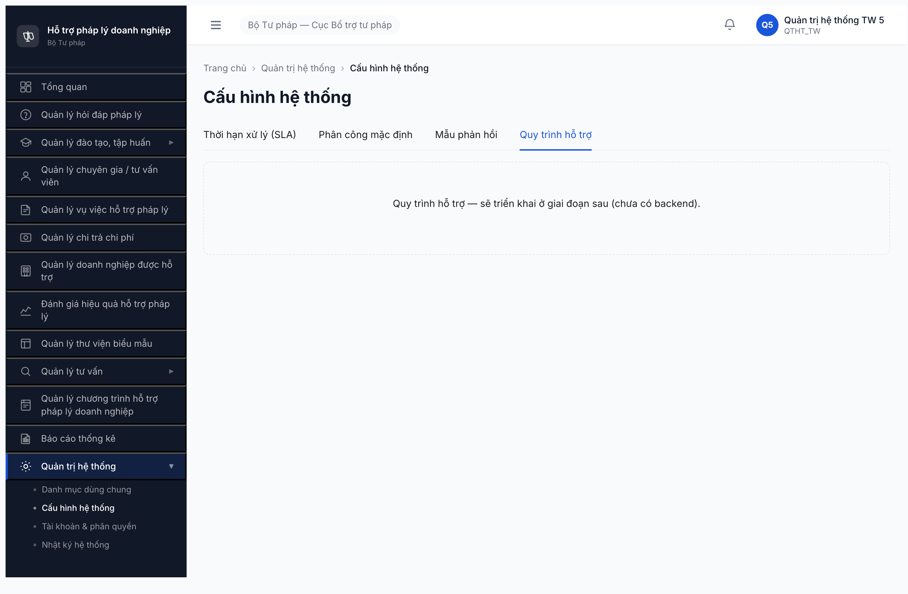
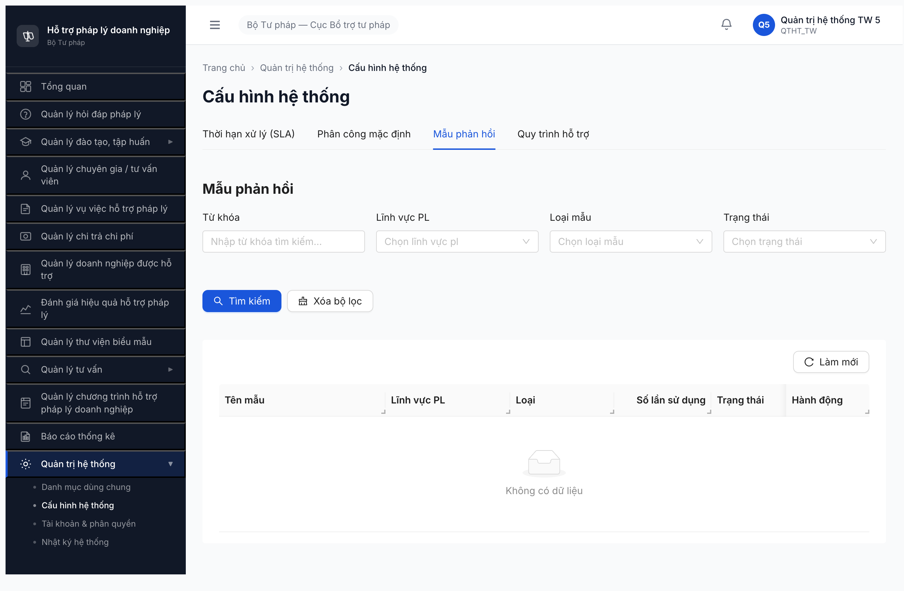
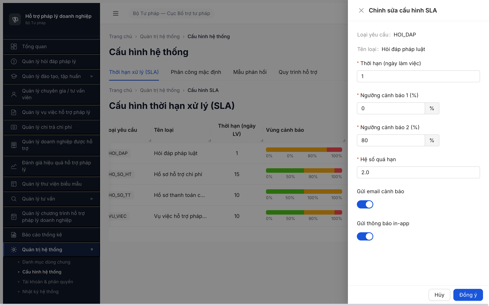
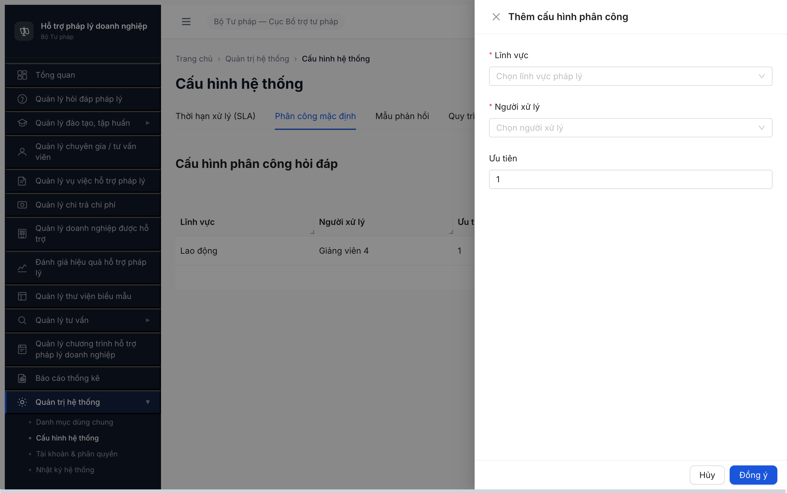
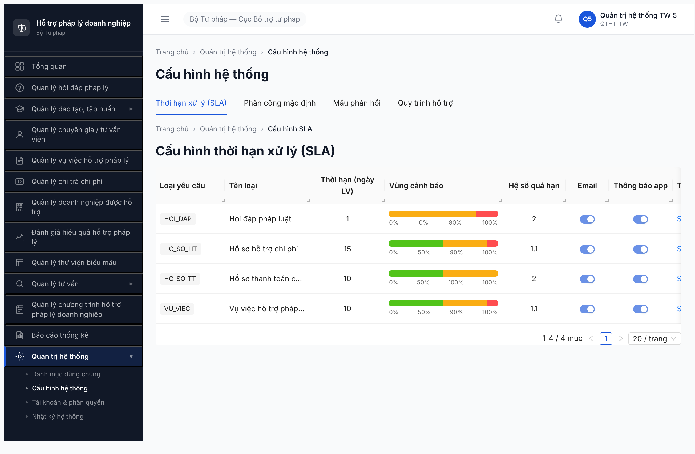
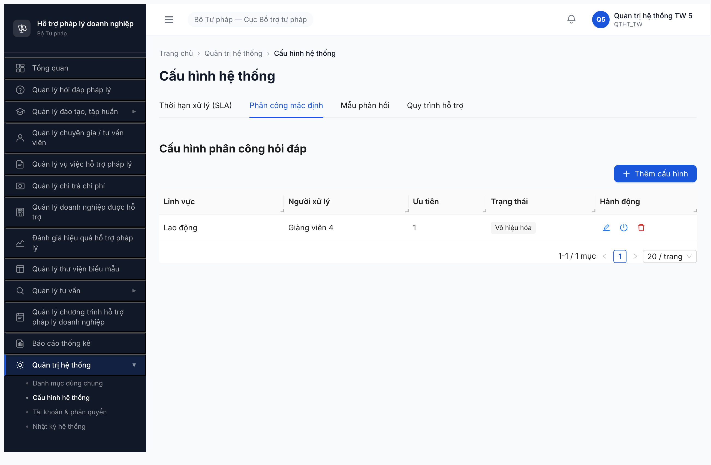

# Bug Report — QTHT / Cấu hình hệ thống (UI Review)

| Thông tin | Giá trị |
|-----------|---------|
| **Dự án** | PM HTPLDN |
| **Phiên bản** | 1.0 |
| **Môi trường** | http://103.172.236.130:3000/ |
| **Người test** | QA Automation via Claude Code (Chrome DevTools MCP) |
| **Ngày** | 00:20:00 [2026-04-22] |
| **Loại test** | UI Review (UI vs SRS compare) |
| **Round** | Round 1 |
| **Tài liệu tham chiếu** | SRS v3.0 — SCR-VIII-06 (MH-10.7 v2.1) — NotebookLM notebook `2160bfb1-2020-4199-90a6-d607b298bb42` |

---

## Tổng hợp

Phát hiện **21** lỗi trong quá trình review UI 4 tab của màn hình "Cấu hình hệ thống".

| Tổng | Critical | Major | Medium | Minor | Trivial |
|------|----------|-------|--------|-------|---------|
| 21   | 4        | 7     | 4      | 6     | 0       |

**Kết luận tổng thể:** Màn hình SCR-VIII-06 mới triển khai ~40-50% spec.
- **Tab 1 (SLA):** Có UI nhưng sai ngữ nghĩa field then chốt, thiếu validation BR-SLA-02, thiếu alert & nút save global.
- **Tab 2 (Phân công):** Bảng có render nhưng thiếu field `don_vi_id` bắt buộc → vi phạm unique constraint ERR-CH-01, default `uu_tien` sai spec.
- **Tab 3 (Mẫu phản hồi):** **KHÔNG CÓ UI thêm/sửa/xóa mẫu** — chỉ có list + filter.
- **Tab 4 (Quy trình hỗ trợ):** **100% chưa triển khai UI** — chỉ có 1 dòng text placeholder.

Verdict: **FAIL — BLOCK RELEASE.** Khuyến nghị dev hoàn thiện Tab 3 CRUD + Tab 4 đầy đủ, fix các bug Critical/Major ở Tab 1/Tab 2 trước khi retest.

## Bug Summary Table

| Bug ID | Severity | Priority | Type | Module | TC Ref | Title | Status |
|--------|----------|----------|------|--------|--------|-------|--------|
| BUG-CHHT-001 | Critical | P0 | UI/UX | Tab 4 Quy trình hỗ trợ | — | Tab 4 không triển khai UI, chỉ có placeholder "sẽ triển khai ở giai đoạn sau" | Open |
| BUG-CHHT-002 | Critical | P0 | UI/UX | Tab 3 Mẫu phản hồi | — | Thiếu nút [+ Thêm mẫu phản hồi], không thể tạo/sửa/xóa template | Open |
| BUG-CHHT-003 | Critical | P0 | Data | Tab 1 SLA | — | Field "Hệ số quá hạn" sai ngữ nghĩa (multiplier 1.1-2.0 thay vì % theo SRS default 200%) | Open |
| BUG-CHHT-004 | Critical | P0 | Data | Tab 2 Phân công | — | Modal thiếu field `don_vi_id` bắt buộc → vi phạm unique constraint ERR-CH-01 | Open |
| BUG-CHHT-005 | Major | P1 | UI/UX | Tab 1 SLA | — | Thiếu 2 Alert box (thông tin 4 mức SLA & cảnh báo snapshot) | Open |
| BUG-CHHT-006 | Major | P1 | UI/UX | Tab 1 SLA | — | Thiếu nút [Lưu cấu hình] global | Open |
| BUG-CHHT-007 | Major | P1 | Negative | Tab 1 SLA | — | Ngưỡng cảnh báo 2 max=100%, vi phạm BR-SLA-02 (CB1<CB2<100 — ERR-SLA-02) | Open |
| BUG-CHHT-008 | Major | P1 | Data | Tab 1 SLA | — | Dữ liệu seed HOI_DAP CB1=0% & HO_SO_TT CB2=100% vi phạm BR-SLA-02 | Open |
| BUG-CHHT-009 | Major | P1 | Data | Tab 2 Phân công | — | Gộp 2 cột CB/TVV phụ trách thành 1 cột "Người xử lý" | Open |
| BUG-CHHT-010 | Major | P1 | Data | Tab 2 Phân công | — | Default "Ưu tiên" = 1 thay vì 99 theo SRS | Open |
| BUG-CHHT-011 | Major | P1 | UI/UX | Tab 2 Phân công | — | Thiếu nút [Lưu cấu hình phân công] global | Open |
| BUG-CHHT-012 | Medium | P2 | UI/UX | Tab 1 SLA | — | Cột "Vùng cảnh báo" gộp 3 cột (CB1/CB2/Quá hạn%) → không chỉnh inline được | Open |
| BUG-CHHT-013 | Medium | P2 | UI/UX | Tab 1 SLA | — | Field "Tên loại" readonly trong modal, SRS cho user input | Open |
| BUG-CHHT-014 | Medium | P2 | UI/UX | Tab 2 Phân công | — | Thừa cột "Trạng thái" không có trong SRS | Open |
| BUG-CHHT-015 | Medium | P2 | UI/UX | Tab 3 Mẫu phản hồi | — | Thiếu cột "Nội dung mẫu" trong table listing | Open |
| BUG-CHHT-016 | Minor | P3 | UI/UX | Tab 1 SLA | — | Thừa cột "Tên loại" trong table (SRS chỉ có trong modal) | Open |
| BUG-CHHT-017 | Minor | P3 | UI/UX | Tab 1/Tab 2 | — | Spinbutton max=0 (bất hợp lý, max<min) cho Thời hạn / Hệ số quá hạn / Ưu tiên | Open |
| BUG-CHHT-018 | Minor | P3 | UI/UX | Tab 1/Tab 2 | — | Button submit modal dùng [Đồng ý] thay vì [Lưu] theo SRS | Open |
| BUG-CHHT-019 | Minor | P3 | UI/UX | Tab 2 Phân công | — | Heading "Cấu hình phân công hỏi đáp" sai scope (thiếu Vụ việc) | Open |
| BUG-CHHT-020 | Minor | P3 | UI/UX | Tab 2 Phân công | — | Label [+ Thêm cấu hình] thay vì [+ Thêm mapping] per SRS | Open |
| BUG-CHHT-021 | Minor | P3 | UI/UX | Tab 3 Mẫu phản hồi | — | Thừa cột "Số lần sử dụng" & "Ngày tạo" không trong SRS | Open |

> **Chú thích Type:**
> - `Happy` — luồng chính thành công (input hợp lệ, thao tác đúng)
> - `Negative` — input/thao tác sai (sai format, thiếu field, vượt giới hạn)
> - `Edge` — giá trị biên (min/max, boundary, giá trị đặc biệt)
> - `Workflow` — chuyển trạng thái (state machine transition)
> - `Permission` — phân quyền (role × action × data scope)
> - `Data` — toàn vẹn dữ liệu (soft delete, sync, duplicate)
> - `UI/UX` — giao diện, hiển thị, tương tác
> - `Performance` — thời gian phản hồi, tải trang

---

## BUG-CHHT-001 — Tab 4 "Quy trình hỗ trợ" không triển khai UI

| Trường | Chi tiết |
|--------|----------|
| **Bug ID** | BUG-CHHT-001 |
| **Severity** | Critical |
| **Priority** | P0 |
| **Type** | UI/UX |
| **Status** | Open |
| **Module** | Cấu hình hệ thống / Tab 4 Quy trình hỗ trợ |
| **Thành phần** | Tabpanel `Quy trình hỗ trợ` |
| **URL** | http://103.172.236.130:3000/quan-tri/cau-hinh?tab=quy-trinh |
| **Trình duyệt** | Chromium (Chrome DevTools MCP) |
| **Tài khoản** | qtht_tw_5 (QTHT_TW) |
| **TC Reference** | — |
| **SRS Reference** | SCR-VIII-06 Tab 4, FR-V.I-NEW-01 |
| **Assignee** | Frontend Team |
| **Found by** | QA Automation |

### Mô tả

Tab 4 "Quy trình hỗ trợ" chỉ hiển thị duy nhất 1 dòng text placeholder `"Quy trình hỗ trợ — sẽ triển khai ở giai đoạn sau (chưa có backend)."`. Toàn bộ các thành phần UI theo SRS hoàn toàn vắng mặt.

### Các bước tái hiện

1. Đăng nhập với `qtht_tw_5 / Test@1234`, OTP `666666`.
2. Vào menu: Quản trị hệ thống → Cấu hình hệ thống.
3. Click tab thứ tư "Quy trình hỗ trợ".
4. Quan sát: chỉ thấy 1 dòng text static, không có bất kỳ control nào.

### Kết quả mong đợi (theo SRS SCR-VIII-06 Tab 4 + FR-V.I-NEW-01)

- Alert snapshot: *"Khi thay đổi quy trình, hồ sơ đang xử lý giữ nguyên quy trình cũ (snapshot). Chỉ hồ sơ mới áp dụng quy trình mới"*.
- Bảng CRUD các bước quy trình với cột: Thứ tự / Tên bước / SLA per-step / Phân công tự động / Hành động.
- Nút `[+ Thêm bước]` — mở modal tạo bước.
- Nút `[Lưu cấu hình quy trình]` — lưu toàn bộ.
- Modal tạo bước với 5 field: `thu_tu` (number, Y, unique ERR-QT-01), `ten_buoc` (text, Y, ERR-QT-02), `sla_ngay_lv` (number, N), `dieu_kien_chuyen` (textarea, N), `mo_ta` (textarea, N).

### Kết quả thực tế

- 0 alert, 0 table, 0 button, 0 modal trigger.
- UI chỉ là 1 `<div>` chứa text placeholder.

### Bằng chứng



### Tác động (Impact)

- **100% QTHT không thể cấu hình quy trình VV** qua UI → không thể thực hiện FR-V.I-NEW-01.
- **Hệ thống chạy hardcoded workflow**, không đáp ứng yêu cầu versioning quy trình (CĐT yêu cầu linh hoạt khi quy trình nhà nước thay đổi mà không cần sửa code).
- BLOCK release toàn bộ module VV-hỗ-trợ nếu quy trình thay đổi.

### Nguyên nhân nghi ngờ (Root Cause)

Placeholder xác nhận: "chưa có backend" → FE chưa implement component, BE chưa có API `/cau-hinh-quy-trinh`. Toàn bộ feature chưa build.

### Gợi ý sửa (Suggested Fix)

- BE: triển khai entity `CAU_HINH_QUY_TRINH` (hoặc tương đương) với versioning snapshot field.
- FE: implement component Tab 4 theo spec: table CRUD + modal + 2 button global (Thêm bước, Lưu cấu hình).
- Versioning: mỗi lần Save sinh 1 version mới; Hồ sơ mới dùng latest version; HS cũ giữ snapshot version tại thời điểm tạo.

---

## BUG-CHHT-002 — Tab 3 Mẫu phản hồi thiếu nút "Thêm mẫu"

| Trường | Chi tiết |
|--------|----------|
| **Bug ID** | BUG-CHHT-002 |
| **Severity** | Critical |
| **Priority** | P0 |
| **Type** | UI/UX |
| **Status** | Open |
| **Module** | Cấu hình hệ thống / Tab 3 Mẫu phản hồi |
| **Thành phần** | Tabpanel `Mẫu phản hồi` — toolbar |
| **URL** | http://103.172.236.130:3000/quan-tri/cau-hinh?tab=mau-phan-hoi |
| **Tài khoản** | qtht_tw_5 |
| **SRS Reference** | SCR-VIII-06 Tab 3, MH-02.7 (CRUD Mẫu phản hồi) |
| **Assignee** | Frontend Team |

### Mô tả

Tab 3 chỉ có 3 button trên toolbar: `Tìm kiếm` / `Xóa bộ lọc` / `Làm mới`. Thiếu nút `[+ Thêm mẫu phản hồi]` theo SRS → user (dù role QTHT) không có cách tạo mẫu mới qua UI.

### Các bước tái hiện

1. Vào Cấu hình hệ thống → tab "Mẫu phản hồi".
2. Quan sát toolbar: chỉ có 3 button filter/reload.
3. Table hiển thị "Không có dữ liệu" (empty state).
4. Không thể tạo / sửa / xóa mẫu nào vì thiếu trigger + không có data sẵn.

### Kết quả mong đợi

- Toolbar có nút `[+ Thêm mẫu phản hồi]` mở modal CRUD với các field: `ten_mau` (text*), `linh_vuc_id` (select*), `loai` (select, MAU_CAU_HOI/MAU_PHAN_HOI*), `noi_dung_mau` (rich-text*), `trang_thai` (toggle).
- Row action (khi có data): `Sửa`, `Xóa` (+ optional toggle kích hoạt/vô hiệu).

### Kết quả thực tế

```json
{
  "tabpanelButtons": [
    {"label": "Tìm kiếm"},
    {"label": "Xóa bộ lọc"},
    {"label": "Làm mới"}
  ]
}
```

Không có button nào có label chứa "Thêm", "New", "Tạo", "Create" trong tabpanel.

### Bằng chứng



### Tác động

- **100% QTHT không thể quản lý kho mẫu phản hồi** → CB NV không có mẫu để chọn khi soạn phản hồi (FR-II-07) → pre-fill feature fail.

### Gợi ý sửa

Thêm button `[+ Thêm mẫu phản hồi]` cạnh toolbar filter + modal CRUD với rich-text editor (ant-design-editor hoặc react-quill).

---

## BUG-CHHT-003 — Field "Hệ số quá hạn" sai ngữ nghĩa (Tab 1 SLA)

| Trường | Chi tiết |
|--------|----------|
| **Bug ID** | BUG-CHHT-003 |
| **Severity** | Critical |
| **Priority** | P0 |
| **Type** | Data |
| **Status** | Open |
| **Module** | Cấu hình hệ thống / Tab 1 SLA |
| **Thành phần** | Modal "Chỉnh sửa cấu hình SLA" → field "Hệ số quá hạn" |
| **URL** | http://103.172.236.130:3000/quan-tri/cau-hinh |
| **Tài khoản** | qtht_tw_5 |
| **SRS Reference** | SCR-VIII-06 Tab 1, FR-VIII-10 field #6 `qua_han_nghiem_trong_phan_tram`, BR-CALC-03 |
| **Assignee** | Backend + Frontend Team |

### Mô tả

SRS quy định field **"QH nghiêm trọng (%)"** — số **%** (phần trăm), default **200%**, ý nghĩa: deadline × 2 = mốc "quá hạn nghiêm trọng" để escalate cảnh báo đỏ (VD: deadline 10 ngày → QH nghiêm trọng = 20 ngày). UI render thành **"Hệ số quá hạn"** với `min=1.1`, `value=2.0` — đơn vị **hệ số multiplier** (1.1, 1.5, 2.0…). Label, range và default đều khác SRS.

### Các bước tái hiện

1. Tab 1 SLA → click "Sửa" row HOI_DAP.
2. Quan sát field thứ 4 trong modal.
3. Inspect: `<input type="number" min="1.1" max="0" value="2" step="0.1"/>` với label "Hệ số quá hạn".
4. Giá trị hiển thị trên table: `2` / `1.1` / `2` / `1.1` (không phải 200 / 110 / 200 / 110 như %).

### Kết quả mong đợi (theo SRS SCR-VIII-06 Tab 1 & FR-VIII-10 Inputs table)

| # | Tên field | Kiểu logic | Default | Validation |
|---|-----------|-----------|---------|-----------|
| 6 | `qua_han_nghiem_trong_phan_tram` (tên hiển thị: "QH nghiêm trọng (%)") | number (%) | **200** | Số %, điển hình 200 (gấp đôi deadline) |

→ UI label phải là "QH nghiêm trọng (%)" hoặc "Ngưỡng quá hạn nghiêm trọng (%)", min=100, default=200, đơn vị hiển thị "%".

### Kết quả thực tế

- Label UI: "Hệ số quá hạn"
- Min: `1.1`, max `0` (bug kép, xem BUG-CHHT-017), default `2.0`
- Không có ký tự "%" cạnh field.
- Row data: `2`, `1.1`, `2`, `1.1` — số nhỏ, như multiplier.

### Bằng chứng



### Tác động (Impact)

- **Business logic sai**: BR-CALC-03 tính mốc quá hạn nghiêm trọng để trigger escalate email + notification. Nếu backend lưu 2.0 (multiplier) thay vì 200 (%), công thức `(thoi_han × qua_han_ng_troong / 100)` sẽ ra `1 × 2.0 / 100 = 0.02` ngày (tức vài giờ) thay vì 2 ngày → cảnh báo sai, spam user.
- Hoặc ngược lại nếu BE hiểu là multiplier, SRS phải update chính thức — hiện UI và SRS không đồng bộ.

### Nguyên nhân nghi ngờ

Dev FE hiểu sai field `qua_han_nghiem_trong_phan_tram` thành "coefficient" (nhân vào deadline) thay vì "percentage of deadline" theo SRS.

### Gợi ý sửa

- Statement rõ ràng với BA: format đơn vị là `%` hay `hệ số`?
- Nếu SRS đúng: UI đổi label thành "QH nghiêm trọng (%)", min=100, max=500, default=200, hiển thị "%".
- Update seed data: `qua_han_nghiem_trong_phan_tram = 200` cho mọi loại YC.

---

## BUG-CHHT-004 — Tab 2 thiếu field `don_vi_id` bắt buộc (vi phạm unique constraint)

| Trường | Chi tiết |
|--------|----------|
| **Bug ID** | BUG-CHHT-004 |
| **Severity** | Critical |
| **Priority** | P0 |
| **Type** | Data |
| **Status** | Open |
| **Module** | Cấu hình hệ thống / Tab 2 Phân công mặc định |
| **Thành phần** | Modal "Thêm cấu hình phân công" |
| **URL** | http://103.172.236.130:3000/quan-tri/cau-hinh?tab=phan-cong |
| **Tài khoản** | qtht_tw_5 |
| **SRS Reference** | SCR-VIII-06 Tab 2, FR-VIII-25 Inputs #3 `don_vi_id`, ERR-CH-01 |
| **Assignee** | Backend + Frontend Team |

### Mô tả

SRS (SCR-VIII-06 Tab 2, MH-02.6) yêu cầu mapping phân công phải có 3 field định danh: `linh_vuc_id` + `nguoi_xu_ly_id` + `don_vi_id` (auto-fill). Trong đó `don_vi_id` là **bắt buộc Y** và là thành phần của **unique constraint** (ERR-CH-01: nếu bộ 3 trùng → reject). Modal UI "Thêm cấu hình phân công" chỉ có 3 field: `Lĩnh vực`, `Người xử lý`, `Ưu tiên` — **KHÔNG CÓ field "Đơn vị"** (kể cả dưới dạng auto-fill hiển thị).

### Các bước tái hiện

1. Tab 2 → click `[+ Thêm cấu hình]`.
2. Quan sát modal: 3 field + 2 button (Hủy/Đồng ý).
3. Inspect: `labels = ["Lĩnh vực", "Người xử lý", "Ưu tiên"]`. Không có "Đơn vị" / "Đơn vị áp dụng" / "don_vi_id".

### Kết quả mong đợi (theo SRS FR-VIII-25 Inputs)

| # | Tên field | Kiểu | Bắt buộc | Mặc định | Nguồn |
|---|-----------|------|----------|----------|-------|
| 1 | linh_vuc_id | identifier | Y | — | user input |
| 2 | nguoi_xu_ly_id | identifier | Y | — | user input |
| 3 | **don_vi_id** | **identifier** | **Y (theo đơn vị)** | **auto-fill** | **system** |
| 4 | uu_tien | number | N | 99 | user input |

UNIQUE: `linh_vuc_id + nguoi_xu_ly_id + don_vi_id` (ERR-CH-01).

### Kết quả thực tế

Modal chỉ có 3 input visible:
```
Lĩnh vực *  [select: "Chọn lĩnh vực pháp lý"]
Người xử lý * [select: "Chọn người xử lý"]
Ưu tiên   [number: 1]
```

### Bằng chứng



### Tác động

- **Unique constraint lỏng lẻo**: Nếu 2 đơn vị (TW vs BN) cùng map `linh_vuc_id=1 + nguoi_xu_ly_id=5`, không phân biệt được → gán chéo đơn vị, vi phạm BR-AUTH-01 phạm vi data scope.
- **BE có thể auto-fill theo đơn vị của user đang login (QTHT_TW → don_vi=TW)**, nhưng UI không hiển thị cho user biết record thuộc đơn vị nào → khó audit/debug.

### Nguyên nhân nghi ngờ

FE bỏ field vì nghĩ BE sẽ tự set; BE có thể đang lưu đúng nhưng UI không hiển thị → khi user cross-unit (VD QTHT_TW tạo record cho đơn vị BN) sẽ không làm được.

### Gợi ý sửa

- Thêm field `don_vi_id` vào modal, dạng select (nếu QTHT_TW có quyền chọn bất kỳ đơn vị nào) hoặc readonly auto-fill hiển thị tên đơn vị đang login.
- Verify BE save `don_vi_id` từ JWT claim user login.
- Thêm cột "Đơn vị" vào table list để audit.

---

## BUG-CHHT-005 — Tab 1 thiếu 2 Alert box (4 mức SLA + snapshot)

| Trường | Chi tiết |
|--------|----------|
| **Bug ID** | BUG-CHHT-005 |
| **Severity** | Major |
| **Priority** | P1 |
| **Type** | UI/UX |
| **Status** | Open |
| **Module** | Cấu hình hệ thống / Tab 1 SLA |
| **SRS Reference** | SCR-VIII-06 Tab 1 rows #4 + #14, BR-SLA-02 |

### Mô tả

SRS Tab 1 yêu cầu 2 Alert box:
1. **Info box 4 mức SLA** (BR-SLA-02): "Bình thường (>50% còn lại) / Sắp hết hạn (<50%) / Quá hạn (>100%) / Quá hạn nghiêm trọng (>200%)".
2. **Cảnh báo snapshot**: "Hồ sơ MỚI áp dụng cấu hình mới. Hồ sơ đang xử lý giữ deadline cũ (snapshot SLA)".

UI hiện không render bất kỳ `.ant-alert` nào trong tab.

### Các bước tái hiện

1. Tab 1 SLA → quan sát vùng trên table.
2. Inspect: `document.querySelectorAll('.ant-alert').length === 0`.

### Kết quả mong đợi

2 alert hiển thị rõ trên đầu table, giúp QTHT hiểu ý nghĩa cảnh báo + tác động khi thay đổi SLA lên hồ sơ đang xử lý.

### Kết quả thực tế

Không có alert nào. Table render trực tiếp sau heading.

### Bằng chứng



### Tác động

- QTHT không biết định nghĩa 4 mức SLA → đặt CB1/CB2 không đúng hệ.
- QTHT không biết rằng đổi SLA có áp dụng retro cho HS đang xử lý không → rủi ro misconfig.

### Gợi ý sửa

```tsx
<Alert type="info" message="4 mức SLA theo BR-SLA-02" description="Bình thường (>50% còn lại) / Sắp hết hạn (<50%) / Quá hạn (>100%) / Quá hạn nghiêm trọng (>200%)" />
<Alert type="warning" message="Hồ sơ MỚI áp dụng cấu hình mới. Hồ sơ đang xử lý giữ deadline cũ (snapshot SLA)" />
```

---

## BUG-CHHT-006 — Tab 1 thiếu nút [Lưu cấu hình] global

| Trường | Chi tiết |
|--------|----------|
| **Bug ID** | BUG-CHHT-006 |
| **Severity** | Major |
| **Priority** | P1 |
| **Type** | UI/UX |
| **Status** | Open |
| **SRS Reference** | SCR-VIII-06 Tab 1 row #13 |

### Mô tả

SRS quy định nút `[Lưu cấu hình]` (global) ở Tab 1 để submit toàn bộ thay đổi (4 rows SLA). UI hiện chỉ cho phép sửa từng row qua modal riêng (OK khi save per-row), nhưng không có nút global cho tình huống QTHT chỉnh sửa inline nhiều field rồi lưu 1 lần — đây là luồng chính SRS quy định.

### Kết quả mong đợi

- 1 button `[Lưu cấu hình]` dưới table (hoặc toolbar trên) gom save toàn bộ table.
- Inline edit nhiều field + 1 Save toàn cục (theo design SRS).

### Kết quả thực tế

`mainButtons` trong Tab 1: chỉ có button "Sửa" inline + pagination. Không có Save global.

### Gợi ý sửa

Option 1: Thêm nút Save global + chuyển table sang inline-edit mode.
Option 2: Giữ modal per-row nhưng bổ sung nút "Lưu tất cả thay đổi chưa commit" nếu design muốn batch.

---

## BUG-CHHT-007 — Ngưỡng cảnh báo 2 cho phép max=100%, vi phạm BR-SLA-02

| Trường | Chi tiết |
|--------|----------|
| **Bug ID** | BUG-CHHT-007 |
| **Severity** | Major |
| **Priority** | P1 |
| **Type** | Negative |
| **SRS Reference** | BR-SLA-02, ERR-SLA-02 |

### Mô tả

SRS: `canh_bao_1 < canh_bao_2 < 100` (ERR-SLA-02: "Mức cảnh báo 1 phải nhỏ hơn mức cảnh báo 2"). Spinbutton "Ngưỡng cảnh báo 2 (%)" trong modal UI có `valuemax="100"` → user có thể set 100% → vi phạm ràng buộc `< 100`.

### Các bước tái hiện

1. Tab 1 → click "Sửa" row bất kỳ.
2. Inspect spinbutton "Ngưỡng cảnh báo 2 (%)": `valuemax="100"`.
3. Row HO_SO_TT hiện tại đang có CB2 = 100% (data seed vi phạm).

### Kết quả mong đợi

- Attribute HTML: `max="99"` (hoặc validate JS: `value < 100`).
- Nếu user nhập 100 → show error `ERR-SLA-02`.

### Kết quả thực tế

- `valuemax="100"` + không có validation reject giá trị 100.
- Row HO_SO_TT lưu `CB2=100%` thành công.

### Bằng chứng


### Gợi ý sửa

```tsx
<InputNumber max={99} onChange={(v) => v >= 100 && showError('ERR-SLA-02')} />
```

---

## BUG-CHHT-008 — Dữ liệu SLA hiện tại vi phạm BR-SLA-02 (HOI_DAP & HO_SO_TT)

| Trường | Chi tiết |
|--------|----------|
| **Bug ID** | BUG-CHHT-008 |
| **Severity** | Major |
| **Priority** | P1 |
| **Type** | Data |
| **SRS Reference** | BR-SLA-02 |

### Mô tả

Dữ liệu SLA trong DB hiện tại có 2 row vi phạm BR-SLA-02:

| Loại YC | Thời hạn | CB1 | CB2 | Vi phạm |
|---------|----------|-----|-----|---------|
| HOI_DAP | 1 ngày | **0%** | 80% | CB1=0 → vùng "Bình thường" là 0–0% (không tồn tại), default SRS phải là 50% |
| HO_SO_TT | 10 ngày | 50% | **100%** | CB2=100 vi phạm `CB2<100` (ERR-SLA-02) |

Bản thân UI hiển thị description rõ: `"Bình thường: 0–0%"` và `"Quá hạn: 100–100%"` — tức zero zone, không còn giá trị cảnh báo 2.

### Các bước tái hiện

1. Tab 1 SLA → quan sát 4 row.
2. HOI_DAP: description "Bình thường: 0–0% / Sắp hết hạn: 0–80% / Quá hạn: 80–100%".
3. HO_SO_TT: description "Bình thường: 0–50% / Sắp hết hạn: 50–100% / Quá hạn: 100–100%".

### Kết quả mong đợi

BE/seed data phải đảm bảo mọi row: `0 ≤ CB1 < CB2 < 100` và default SRS `CB1=50, CB2=90`.

### Bằng chứng


### Tác động

- Row HOI_DAP: không có vùng "Bình thường" → mọi hồ sơ Hỏi đáp ngay từ giây đầu đã ở state "Sắp hết hạn" → spam cảnh báo.
- Row HO_SO_TT: không có vùng "Sắp hết hạn" thật sự (CB2=100 = overdue) → mất bước cảnh báo sớm.

### Gợi ý sửa

- Migration script fix seed data: set `CB1=50, CB2=90` cho tất cả row đang vi phạm.
- BE validate strict `CB1 < CB2 < 100` khi insert/update.

---

## BUG-CHHT-009 — Tab 2 gộp 2 cột CB phụ trách + TVV phụ trách thành 1

| Trường | Chi tiết |
|--------|----------|
| **Bug ID** | BUG-CHHT-009 |
| **Severity** | Major |
| **Priority** | P1 |
| **Type** | Data |
| **SRS Reference** | SCR-VIII-06 Tab 2 row #15 (UX-spec column definition) |

### Mô tả

SRS Tab 2 column definition: `Lĩnh vực | CB phụ trách | TVV phụ trách | Mức ưu tiên | Hành động` — 2 cột riêng để phân biệt Cán bộ (internal) vs Tư vấn viên (external expert). UI gộp thành 1 cột `Người xử lý` (ghi "Giảng viên 4" cho row duy nhất) → mất distinction.

### Kết quả mong đợi

- 2 cột riêng:
  - `CB phụ trách`: link FK `can_bo.id` (role CB_NV)
  - `TVV phụ trách`: link FK `tu_van_vien.id`
- Modal: 2 select riêng (chọn CB hoặc TVV, hoặc cả 2 nếu cần rule co-owner).

### Kết quả thực tế

Table header: `Lĩnh vực | Người xử lý | Ưu tiên | Trạng thái | Hành động` (gộp).
Row: `Lao động | Giảng viên 4 | 1 | Vô hiệu hóa`.

### Bằng chứng



### Tác động

- Không filter được theo loại người (CB vs TVV).
- Không áp dụng rule riêng cho TVV (external resource có workflow khác CB internal).

### Gợi ý sửa

Tách select thành 2 field `nguoi_xu_ly_cb_id` + `nguoi_xu_ly_tvv_id` (XOR: chỉ được chọn 1). Đổi entity `CAU_HINH_PHAN_CONG` theo đó.

---

## BUG-CHHT-010 — Default "Ưu tiên" = 1, vi phạm SRS (default = 99)

| Trường | Chi tiết |
|--------|----------|
| **Bug ID** | BUG-CHHT-010 |
| **Severity** | Major |
| **Priority** | P1 |
| **Type** | Data |
| **SRS Reference** | SCR-VIII-06 Tab 2 / FR-VIII-25 Inputs #4 |

### Mô tả

SRS định nghĩa `uu_tien`: number, N, **default 99** (1 = cao nhất). Spinbutton UI trong modal khởi tạo `value="1"` → mọi record mới có ưu tiên cao nhất, phá vỡ business logic "mặc định không ưu tiên, chỉ set cao khi cần".

### Các bước tái hiện

1. Tab 2 → click `[+ Thêm cấu hình]`.
2. Quan sát field "Ưu tiên": `<input value="1" min="1" max="0" />`.

### Kết quả mong đợi

- `value="99"` default.
- Min = 1, max = 99 (hoặc tối thiểu là 1 số hợp lệ, không phải 0 — xem BUG-CHHT-017).

### Kết quả thực tế

Default = 1 → mọi mapping mới sẽ được ưu tiên cao nhất đồng loạt → conflict khi matching logic FR-II-06.

### Gợi ý sửa

```tsx
<InputNumber defaultValue={99} min={1} max={99} />
```

---

## BUG-CHHT-011 — Tab 2 thiếu nút [Lưu cấu hình phân công] global

| Trường | Chi tiết |
|--------|----------|
| **Bug ID** | BUG-CHHT-011 |
| **Severity** | Major |
| **Priority** | P1 |
| **Type** | UI/UX |
| **SRS Reference** | SCR-VIII-06 Tab 2 row #17 |

### Mô tả

SRS: nút `[Lưu cấu hình phân công]` toàn cục. UI chỉ có `[+ Thêm cấu hình]` + row action (edit/poweroff/delete). Tương tự BUG-CHHT-006 cho Tab 1.

### Gợi ý sửa

Bổ sung nút Save global nếu design cần batch; hoặc xóa requirement khỏi SRS nếu per-row save đủ.

---

## BUG-CHHT-012 — Tab 1 cột "Vùng cảnh báo" gộp 3 cột CB1/CB2/Quá hạn%

| Trường | Chi tiết |
|--------|----------|
| **Bug ID** | BUG-CHHT-012 |
| **Severity** | Medium |
| **Priority** | P2 |
| **Type** | UI/UX |
| **SRS Reference** | SCR-VIII-06 Tab 1 rows #7-9 |

### Mô tả

SRS: 3 cột riêng `CB mức 1 (%)` / `CB mức 2 (%)` / `Quá hạn (%)` → cho phép inline edit từng giá trị. UI gộp thành 1 cột "Vùng cảnh báo" hiển thị stacked `0% / 50% / 90% / 100%` → không chỉnh inline, phải mở modal.

### Gợi ý sửa

- Nếu muốn gộp (để gọn): OK nhưng phải cung cấp inline edit cho mỗi mức (click số → mở input).
- Hoặc tách lại 3 cột theo SRS.

---

## BUG-CHHT-013 — Field "Tên loại" readonly trong modal Tab 1

| Trường | Chi tiết |
|--------|----------|
| **Bug ID** | BUG-CHHT-013 |
| **Severity** | Medium |
| **Priority** | P2 |
| **Type** | UI/UX |
| **SRS Reference** | FR-VIII-10 Inputs #2 `ten_loai` (Y, user input) |

### Mô tả

SRS: `ten_loai` là field bắt buộc, **source = user input** (user được sửa tên hiển thị loại YC). Modal UI: "Tên loại" render dưới dạng StaticText readonly (chỉ `HOI_DAP` / `Hỏi đáp pháp luật` hiển thị cạnh nhau, không có input).

### Gợi ý sửa

Bổ sung `<Input defaultValue={row.ten_loai} />` (editable) thay vì StaticText.

---

## BUG-CHHT-014 — Tab 2 thừa cột "Trạng thái"

| Trường | Chi tiết |
|--------|----------|
| **Bug ID** | BUG-CHHT-014 |
| **Severity** | Medium |
| **Priority** | P2 |
| **Type** | UI/UX |
| **SRS Reference** | SCR-VIII-06 Tab 2 row #15 (columns) |

### Mô tả

UI table Tab 2 có cột "Trạng thái" (giá trị "Vô hiệu hóa") — SRS column list không có cột này. Có thể là feature hữu ích nhưng chưa được spec. Cần confirm với BA.

### Gợi ý sửa

- Option A: BA bổ sung vào SRS (nếu feature cần).
- Option B: FE ẩn cột cho đến khi spec confirm.

---

## BUG-CHHT-015 — Tab 3 table thiếu cột "Nội dung mẫu"

| Trường | Chi tiết |
|--------|----------|
| **Bug ID** | BUG-CHHT-015 |
| **Severity** | Medium |
| **Priority** | P2 |
| **Type** | UI/UX |
| **SRS Reference** | SCR-VIII-06 Tab 3 (columns), FR-VIII-26 Inputs #3 `noi_dung_mau` |

### Mô tả

SRS Tab 3 columns: `Tên mẫu | Lĩnh vực | Nội dung mẫu | Trạng thái | Hành động`. UI hiện: `Tên mẫu | Lĩnh vực PL | Loại | Số lần sử dụng | Trạng thái | Ngày tạo | Hành động` — **thiếu cột "Nội dung mẫu"** → user không thấy preview để chọn mẫu phù hợp.

### Gợi ý sửa

Thêm cột "Nội dung mẫu" (truncate 100 ký tự + tooltip hover full content). Hoặc thêm nút "Xem trước" per row mở drawer preview.

---

## BUG-CHHT-016 — Tab 1 thừa cột "Tên loại" trong table

| Trường | Chi tiết |
|--------|----------|
| **Bug ID** | BUG-CHHT-016 |
| **Severity** | Minor |
| **Priority** | P3 |
| **Type** | UI/UX |
| **SRS Reference** | SCR-VIII-06 Tab 1 (columns) |

### Mô tả

UI Tab 1 table có 8 cột gồm "Tên loại" (giá trị "Hỏi đáp pháp luật", "Hồ sơ hỗ trợ chi phí"…). SRS column list chỉ yêu cầu 8 cột: Loại YC / Thời hạn / CB1% / CB2% / Quá hạn% / QH nghiêm trọng% / Gửi email / Gửi TB app (không có "Tên loại" riêng).

### Gợi ý sửa

- Gộp "Tên loại" vào cột "Loại yêu cầu" dưới dạng 2-line cell (code + display name), hoặc ẩn cột nếu redundant.

---

## BUG-CHHT-017 — Spinbutton max=0 bất hợp lý (Tab 1 & Tab 2)

| Trường | Chi tiết |
|--------|----------|
| **Bug ID** | BUG-CHHT-017 |
| **Severity** | Minor |
| **Priority** | P3 |
| **Type** | UI/UX |
| **Thành phần** | Tab 1 — "Thời hạn (ngày làm việc)", "Hệ số quá hạn"; Tab 2 — "Ưu tiên" |

### Mô tả

3 spinbutton có `valuemax="0"` trong khi `valuemin` lần lượt là 1, 1.1, 1. Attribute `max < min` là invalid HTML → browser có thể reject nhập giá trị cao. Ở Chromium, input vẫn cho nhập nhưng accessibility tool (NVDA) báo range lỗi.

### Các bước tái hiện

Inspect DOM:
- Tab 1 modal "Thời hạn (ngày làm việc)": `min="1" max="0"`.
- Tab 1 modal "Hệ số quá hạn": `min="1.1" max="0"`.
- Tab 2 modal "Ưu tiên": `min="1" max="0"`.

### Kết quả mong đợi

Set max hợp lý:
- Thời hạn: max=365 (1 năm làm việc).
- Hệ số quá hạn: max=5 (hoặc 500% nếu là %).
- Ưu tiên: max=99.

### Gợi ý sửa

Ant Design `InputNumber` với props `max={365}` / `max={5}` / `max={99}`.

---

## BUG-CHHT-018 — Button submit modal dùng [Đồng ý] thay vì [Lưu]

| Trường | Chi tiết |
|--------|----------|
| **Bug ID** | BUG-CHHT-018 |
| **Severity** | Minor |
| **Priority** | P3 |
| **Type** | UI/UX |
| **Thành phần** | Modal Tab 1 & Tab 2 |

### Mô tả

SRS convention: button save modal là `[Lưu]`. UI dùng `[Đồng ý]` (có thể do design system default). Không critical nhưng gây confuse cho user và dev reviewer đối chiếu spec.

### Gợi ý sửa

Đổi label thống nhất thành `Lưu` hoặc cập nhật SRS chấp nhận `Đồng ý`.

---

## BUG-CHHT-019 — Heading Tab 2 sai scope ("Cấu hình phân công hỏi đáp")

| Trường | Chi tiết |
|--------|----------|
| **Bug ID** | BUG-CHHT-019 |
| **Severity** | Minor |
| **Priority** | P3 |
| **Type** | UI/UX |
| **SRS Reference** | SCR-VIII-06 Tab 2 (cho Hỏi đáp + Vụ việc), FR-VIII-25 + FR-II-06 |

### Mô tả

UI heading Tab 2: "Cấu hình phân công hỏi đáp". SRS: Tab 2 áp dụng cho cả **Hỏi đáp VÀ Vụ việc** (FR-II-06 reference). Heading "hỏi đáp" thu hẹp scope sai.

### Gợi ý sửa

Đổi heading → "Cấu hình phân công mặc định" (theo label tab).

---

## BUG-CHHT-020 — Label button Tab 2 "[+ Thêm cấu hình]" thay vì "[+ Thêm mapping]"

| Trường | Chi tiết |
|--------|----------|
| **Bug ID** | BUG-CHHT-020 |
| **Severity** | Minor |
| **Priority** | P3 |
| **Type** | UI/UX |
| **SRS Reference** | SCR-VIII-06 Tab 2 row #16 |

### Mô tả

SRS: `[+ Thêm mapping]`. UI: `[+ Thêm cấu hình]`. Ngữ nghĩa tương đương nhưng khác wording spec.

### Gợi ý sửa

Align label theo SRS hoặc update SRS.

---

## BUG-CHHT-021 — Tab 3 thừa cột "Số lần sử dụng" & "Ngày tạo"

| Trường | Chi tiết |
|--------|----------|
| **Bug ID** | BUG-CHHT-021 |
| **Severity** | Minor |
| **Priority** | P3 |
| **Type** | UI/UX |
| **SRS Reference** | SCR-VIII-06 Tab 3 (columns) |

### Mô tả

UI table Tab 3 có 7 cột, vượt 2 cột ngoài SRS: "Số lần sử dụng" & "Ngày tạo". Có thể hữu ích cho QTHT audit nhưng chưa được spec → cần BA confirm.

### Gợi ý sửa

- Confirm BA rồi update SRS thêm 2 cột; hoặc ẩn 2 cột cho đến khi spec approve.

---

## Phụ lục

### A — Môi trường test

| Thành phần | Giá trị |
|------------|---------|
| URL ứng dụng | http://103.172.236.130:3000/quan-tri/cau-hinh |
| OTP login | 666666 (dev bypass) |
| MailHog (OTP inbox fallback) | http://103.172.236.130:8025 |
| API base | http://103.172.236.130:3000/api/v1 |
| Frontend | React + Vite + Ant Design |
| Xác thực | JWT + OTP |
| Tool test | Chrome DevTools MCP (chrome-devtools-mcp@latest) |

### B — Tài khoản sử dụng

| Tên đăng nhập | Vai trò | Cấp | Dùng cho bug nào |
|---------------|---------|-----|------------------|
| qtht_tw_5 | QTHT | TW | Toàn bộ BUG-CHHT-001 → 021 |

### C — Danh mục ảnh chụp

| File | Mô tả | Dùng cho bug |
|------|-------|--------------|
| [tab1-sla-overview.png](image/tab1-sla-overview.png) | Tab 1 SLA — toàn cảnh table 4 row | BUG-CHHT-005, 008, 012, 016 |
| [tab1-sla-edit-modal.png](image/tab1-sla-edit-modal.png) | Tab 1 SLA — modal "Chỉnh sửa cấu hình SLA" | BUG-CHHT-003, 007, 013, 017, 018 |
| [tab2-phancong-overview.png](image/tab2-phancong-overview.png) | Tab 2 Phân công — toàn cảnh table | BUG-CHHT-009, 011, 014, 019, 020 |
| [tab2-phancong-add-modal.png](image/tab2-phancong-add-modal.png) | Tab 2 Phân công — modal "Thêm cấu hình phân công" | BUG-CHHT-004, 010, 017, 018 |
| [tab3-mauphanhoi-overview.png](image/tab3-mauphanhoi-overview.png) | Tab 3 Mẫu phản hồi — toolbar thiếu nút Thêm | BUG-CHHT-002, 015, 021 |
| [tab4-quytrinh-placeholder.png](image/tab4-quytrinh-placeholder.png) | Tab 4 Quy trình hỗ trợ — placeholder only | BUG-CHHT-001 |

### D — SRS Reference (trích)

Nguồn: NotebookLM query `notebook=2160bfb1-2020-4199-90a6-d607b298bb42` — SCR-VIII-06 (MH-10.7 v2.1), FR-VIII-10, FR-VIII-25, FR-VIII-26, FR-V.I-NEW-01.

**SRS Tab 1 SLA — columns (SCR-VIII-06 rows #5-#12):**
```
Loại yêu cầu (readonly, HOI_DAP/VU_VIEC/HO_SO_HT/HO_SO_TT)
Thời hạn (ngày LV) — text-input, bắt buộc, >0, ERR-SLA-01
CB mức 1 (%) — text-input, default 50
CB mức 2 (%) — text-input, default 90, ERR-SLA-02 (CB1<CB2<100)
Quá hạn (%) — readonly, luôn 100%
QH nghiêm trọng (%) — text-input, default 200
Gửi email — toggle, default 1
Gửi TB app — toggle, default 1
```

**SRS Tab 2 Phân công — Inputs (FR-VIII-25):**
```
linh_vuc_id (identifier, Y, user input)
nguoi_xu_ly_id (identifier, Y, user input)
don_vi_id (identifier, Y, auto-fill, system)
uu_tien (number, N, default 99)
UNIQUE: linh_vuc_id + nguoi_xu_ly_id + don_vi_id → ERR-CH-01
```

**SRS Tab 3 Mẫu phản hồi — Inputs (FR-VIII-26):**
```
ten_mau (text, Y)
linh_vuc_id (identifier, Y)
noi_dung_mau (text long, Y)
loai (text, Y, MAU_CAU_HOI/MAU_PHAN_HOI)
```

**SRS Tab 4 Quy trình — FR-V.I-NEW-01:**
```
Bảng CRUD bước: Thứ tự / Tên bước / SLA per-step / Phân công tự động / Hành động
Modal tạo bước: thu_tu (Y, unique ERR-QT-01) / ten_buoc (Y, ERR-QT-02) / sla_ngay_lv / dieu_kien_chuyen / mo_ta
Buttons: [+ Thêm bước] / [Lưu cấu hình quy trình]
Alert snapshot versioning
```

---

*Bug report generated: 2026-04-22 | QA Automation via Claude Code (Chrome DevTools MCP)*
