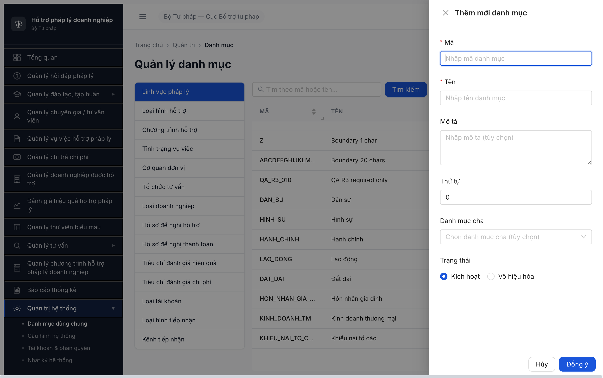
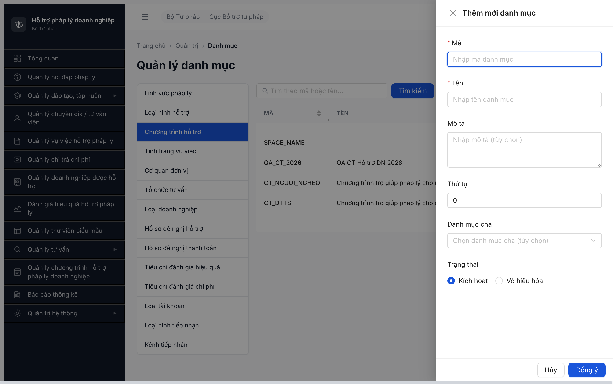
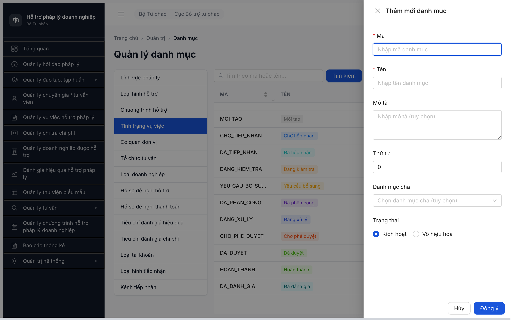
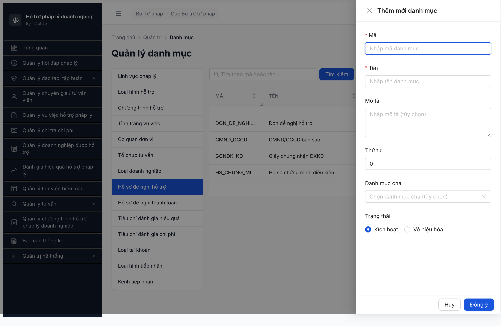
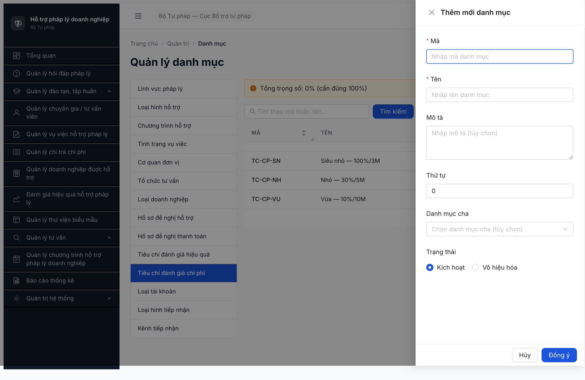
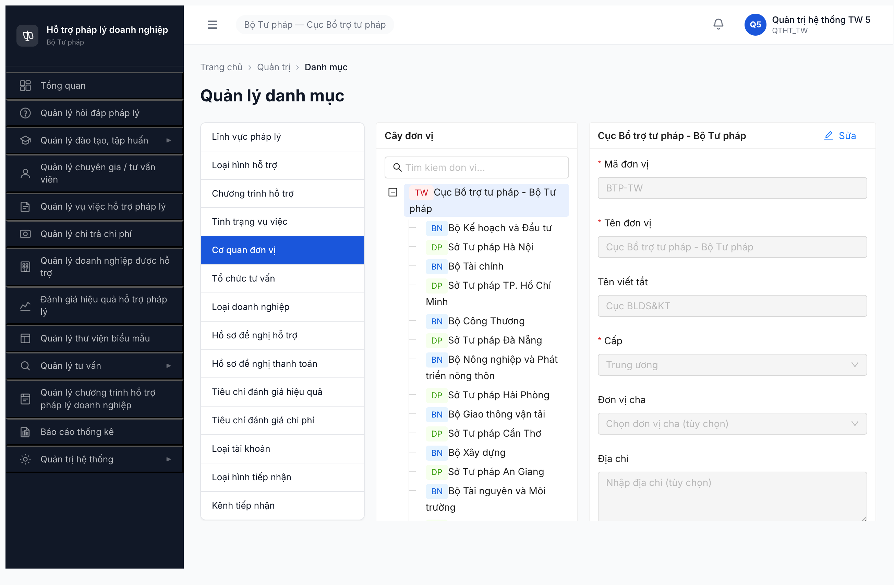
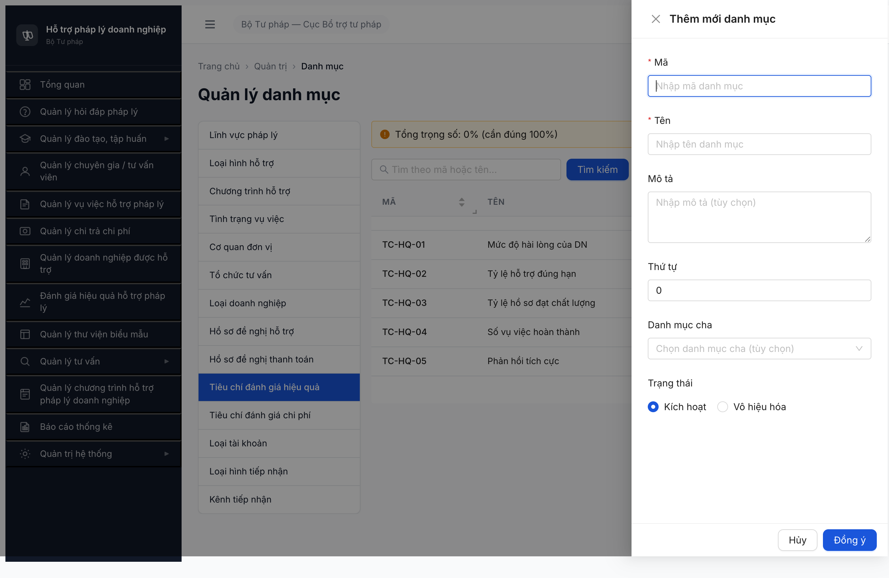
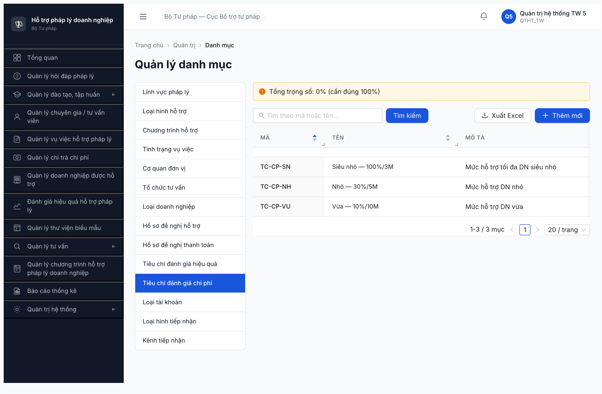
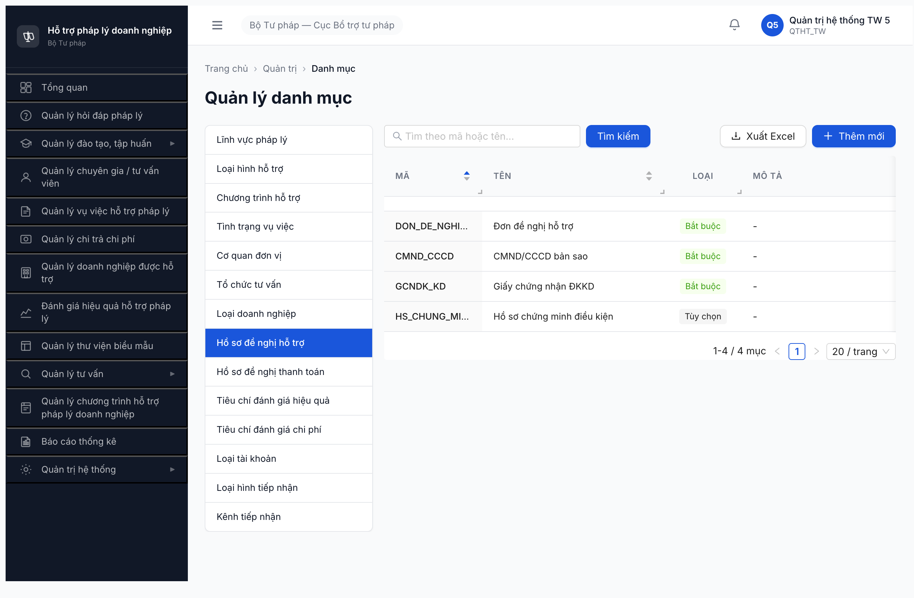

# Bug Report — Danh mục dùng chung (UI vs SRS)

| Thông tin | Giá trị |
|-----------|---------|
| **Dự án** | PM HTPLDN — Hỗ trợ Pháp lý Doanh nghiệp |
| **Phiên bản** | 1.0 |
| **Môi trường** | http://103.172.236.130:3000/ |
| **Người test** | QA Automation via Claude Code (Chrome DevTools MCP) |
| **Ngày** | 22:30:00 — 2026-04-21 |
| **Loại test** | UI Compliance vs SRS |
| **Round** | Round 1 |
| **Tài liệu tham chiếu** | SRS v3 (NotebookLM `2160bfb1-...`) — SCR-VIII-01, FR-VIII-01..19. SRS extract: `_srs-reference.md` |

> **Chú thích:** Field đánh dấu `*` là **bắt buộc (Required)** theo SRS.

---

## Tổng hợp

Phát hiện **23** lỗi trong quá trình test UI 14 màn hình **Danh mục dùng chung** (Quản trị hệ thống) so với SRS v3 — gồm:
- **17 bug đã raise (round trước):** form Thêm mới/Sửa + cấu trúc tree DON_VI + UI generic.
- **6 bug mới (round bổ sung 2026-04-21 — màn hình DANH SÁCH/LIST):** table columns thiếu/thừa, banner placement, sort không hoạt động.

| Tổng | Critical | Major | Medium | Minor | Trivial |
|------|----------|-------|--------|-------|---------|
| 23   | 2        | 12    | 6      | 3     | 0       |

**Verdict:** ❌ **FAIL** —
1. **Form Thêm mới/Sửa** (BUG-001 → 017): 13/14 form dùng chung 1 generic form thiếu toàn bộ field đặc thù theo SRS (CHUONG_TRINH_HT 3 field, TINH_TRANG_VU_VIEC 1, TO_CHUC_TU_VAN 2, LOAI_DOANH_NGHIEP 2, HO_SO_DE_NGHI_HT 2, HO_SO_DE_NGHI_TT 1, TIEU_CHI_DG_HIEU_QUA 3, TIEU_CHI_DG_CHI_PHI 3 — tổng 17 field bị bỏ sót trên 8 tab); BR-CALC-04 không khả thi.
2. **Màn hình danh sách** (BUG-018 → 023): table thiếu cột đặc thù trên TIEU_CHI_DG_HIEU_QUA + TIEU_CHI_DG_CHI_PHI (3 cột mỗi tab); thừa cột "LOẠI" trên 2 tab Hồ sơ HT/TT (SRS không quy định); banner "Tổng trọng số" sai placement; **chức năng sort table không hoạt động** dù header có sortable hint.

## Bug Summary Table

| Bug ID | Severity | Priority | Type | Module | TC Ref | Title | Status |
|--------|----------|----------|------|--------|--------|-------|--------|
| BUG-DMDC-001 | Critical | P0 | UI/UX | DMDC-13-tabs | UI-DMDC-FORM | 13 tab dùng chung 1 generic form, **không** render field đặc thù theo SRS (15 field bị bỏ) | Open |
| BUG-DMDC-002 | Critical | P0 | Data | TIEU_CHI_DG_HIEU_QUA | UI-DMDC-FORM | Form không có Trọng số/Min/Max → BR-CALC-04 (Tổng=100%) **không thể implement**; UI hiển thị "Tổng trọng số: 0%" cho 5 record có sẵn | Open |
| BUG-DMDC-003 | Major | P1 | UI/UX | CHUONG_TRINH_HT | UI-DMDC-FORM | Form thiếu 3 field đặc thù: Thời gian bắt đầu*, Thời gian kết thúc, Đơn vị chủ trì* | Open |
| BUG-DMDC-004 | Major | P1 | UI/UX | TINH_TRANG_VU_VIEC | UI-DMDC-FORM | Form thiếu field "Màu hiển thị" (HEX) — không thể cấu hình màu cho workflow | Open |
| BUG-DMDC-005 | Major | P1 | UI/UX | TO_CHUC_TU_VAN | UI-DMDC-FORM | Form thiếu 2 field: Địa chỉ, Lĩnh vực | Open |
| BUG-DMDC-006 | Major | P1 | UI/UX | LOAI_DOANH_NGHIEP | UI-DMDC-FORM | Form thiếu 2 field: Tiêu chí doanh thu, Tiêu chí lao động | Open |
| BUG-DMDC-007 | Major | P1 | UI/UX | HO_SO_DE_NGHI_HT | UI-DMDC-FORM | Form thiếu 2 field đặc thù: Thành phần bắt buộc, Thành phần tùy chọn (SRS FR-VIII-08) | Open |
| BUG-DMDC-008 | Major | P1 | UI/UX | HO_SO_DE_NGHI_TT | UI-DMDC-FORM | Form thiếu 1 field đặc thù: Thành phần hồ sơ (SRS FR-VIII-09) | Open |
| BUG-DMDC-009 | Major | P1 | UI/UX | TIEU_CHI_DG_CHI_PHI | UI-DMDC-FORM | Form thiếu 3 field: Quy mô DN*, Mức hỗ trợ %*, Trần hỗ trợ/năm* (VNĐ) | Open |
| BUG-DMDC-010 | Major | P1 | Data | DON_VI | UI-DMDC-DON_VI | Tree đơn vị flatten level=1 cho cả 88 đơn vị (TW + 31 BN + 56 ĐP) thay vì cấu trúc 3 cấp (TW → BN → ĐP) theo SRS | Open |
| BUG-DMDC-011 | Major | P1 | UI/UX | DON_VI | UI-DMDC-DON_VI | Form Cơ quan ĐV thiếu field "Tỉnh thành" (dropdown chọn từ danh mục) theo SRS | Open |
| BUG-DMDC-012 | Medium | P2 | UI/UX | DMDC-13-tabs | UI-DMDC-FORM | Form generic có thừa field "Danh mục cha" (combobox) cho 12/13 tab không phải hierarchy (LINH_VUC_PL, LOAI_HINH_HO_TRO, ...) — gây nhầm lẫn user và risk lưu sai data | Open |
| BUG-DMDC-013 | Medium | P2 | UI/UX | TIEU_CHI_DG_CHI_PHI | UI-DMDC-FORM | Tab Chi phí hiển thị label "Tổng trọng số: 0% (cần đúng 100%)" — đây là label dành cho tab Hiệu quả (BR-CALC-04), placement sai | Open |
| BUG-DMDC-014 | Medium | P2 | UI/UX | DMDC-toolbar | UI-DMDC-TOOLBAR | Toolbar có button "Xuất Excel" nhưng SRS không quy định action này tại SCR-VIII-01 — thừa hoặc thiếu spec | Open |
| BUG-DMDC-015 | Medium | P2 | UI/UX | DMDC-form | UI-DMDC-FORM | "Trạng thái"* trong form là **radio** (Kích hoạt/Vô hiệu hóa) không phải toggle theo SRS; tab DON_VI dùng label khác (Hoạt động/Tạm dừng) gây thiếu consistency | Open |
| BUG-DMDC-016 | Minor | P3 | UI/UX | DMDC-form | UI-DMDC-FORM | Spinbutton "Thứ tự" có `valuemax="0"` `valuemin="0"` nhưng button Increase enable — UX sai (max=min ⇒ không thể tăng) | Open |
| BUG-DMDC-017 | Minor | P3 | UI/UX | DMDC-form | UI-DMDC-FORM | Field input "Mã"* `maxLength="-1"` (không giới hạn) — SRS quy định max 20 ký tự — validate FE thiếu | Open |
| BUG-DMDC-018 | Major | P1 | UI/UX | TIEU_CHI_DG_HIEU_QUA | UI-DMDC-LIST | **[Màn hình list]** Table thiếu 3 cột bắt buộc theo SRS FR-VIII-11 thành phần #21: Trọng số (%), Thang điểm min, Thang điểm max | Open |
| BUG-DMDC-019 | Major | P1 | UI/UX | TIEU_CHI_DG_CHI_PHI | UI-DMDC-LIST | **[Màn hình list]** Table thiếu 3 cột bắt buộc theo SRS FR-VIII-12: Quy mô DN, Mức hỗ trợ (%), Trần hỗ trợ/năm (VNĐ) | Open |
| BUG-DMDC-020 | Medium | P2 | UI/UX | HO_SO_DE_NGHI_HT | UI-DMDC-LIST | **[Màn hình list]** Table thừa cột "LOẠI" (Bắt buộc/Tùy chọn) — SRS không quy định cột này tại SCR-VIII-01 + form Thêm mới không có field nhập "Loại" → mismatch | Open |
| BUG-DMDC-021 | Medium | P2 | UI/UX | HO_SO_DE_NGHI_TT | UI-DMDC-LIST | **[Màn hình list]** Table thừa cột "LOẠI" — tương tự BUG-020, SRS không quy định | Open |
| BUG-DMDC-022 | Minor | P3 | UI/UX | TIEU_CHI_DG_HIEU_QUA | UI-DMDC-LIST | **[Màn hình list]** Banner "Tổng trọng số: X%" hiển thị **TRÊN** toolbar/table (Y=178px) thay vì **DƯỚI** table (theo SRS FR-VIII-11 thành phần #22) | Open |
| BUG-DMDC-023 | Major | P1 | UI/UX | DMDC-13-tabs | UI-DMDC-LIST | **[Màn hình list]** Click sort header (Mã/Tên/Thứ tự) **không hoạt động** — order data không thay đổi sau 3 lần click; sortable hint hiển thị nhưng functionality broken | Open |

> **Chú thích Type:**
> - `UI/UX` — giao diện, hiển thị, tương tác
> - `Data` — toàn vẹn dữ liệu, business rule
> - `Permission` — phân quyền

> **Chú thích Severity:**
> - `Critical` — chức năng nghiệp vụ chính không vận hành / lộ dữ liệu
> - `Major` — feature lỗi nhưng có workaround
> - `Medium` — lỗi phụ, không block nghiệp vụ chính
> - `Minor` — lỗi nhỏ, cosmetic

> **Parent–Child relationship (8 bug con thuộc 1 root cause):**
> - **BUG-DMDC-001** là **parent / root cause architectural** — Form Modal generic không schema-driven theo `loai_dm`.
> - **BUG-DMDC-002 → 009** (8 bug) là **child bugs** — biểu hiện cụ thể trên từng tab (mỗi tab thiếu một set field đặc thù khác nhau).
> - Nếu dev fix BUG-001 (refactor form thành dynamic schema theo `loai_dm`) thì 8 bug con sẽ được resolve theo. Tuy nhiên **giữ riêng 8 bug con** để: (1) QA verify per-tab acceptance criteria khác nhau, (2) BE schema migration có thể chia theo từng entity, (3) tracking trạng thái fix từng tab.
> - Các bug khác — **BUG-DMDC-010, 011** (DON_VI), **012–017** (generic form khác / toolbar / a11y / validate) — **độc lập** với chuỗi parent-child này.

---

## BUG-DMDC-001 — 13 tab DMDC dùng CHUNG một generic form, bỏ qua toàn bộ field đặc thù theo SRS

| Trường | Chi tiết |
|--------|----------|
| **Bug ID** | BUG-DMDC-001 |
| **Severity** | Critical |
| **Priority** | P0 |
| **Type** | UI/UX |
| **Status** | Open |
| **Module** | DMDC — 13 tab (trừ Cơ quan đơn vị) |
| **Thành phần** | Form Modal "Thêm mới danh mục" / "Sửa danh mục" |
| **URL** | http://103.172.236.130:3000/quan-tri/danh-muc/{LOAI_DM} |
| **Trình duyệt** | Chrome (Chrome DevTools MCP) |
| **Tài khoản** | qtht_tw_5 (QTHT_TW, cấp TW) |
| **TC Reference** | UI-DMDC-FORM |
| **SRS Reference** | FR-VIII-01..19, SCR-VIII-01, TPL-DM-CRUD |
| **Assignee** | FE Team |
| **Found by** | Claude Code (Chrome DevTools MCP) |
| **Parent of** | BUG-DMDC-002, 003, 004, 005, 006, 007, 008, 009 (8 child bugs — biểu hiện cụ thể trên từng tab) |

### Mô tả

13/14 màn hình DMDC (trừ Cơ quan đơn vị dùng tree) cùng dùng **một** generic Modal "Thêm mới danh mục" với 6 field cố định (Mã*, Tên*, Mô tả, Thứ tự, Danh mục cha, Trạng thái*). **Toàn bộ field đặc thù** theo SRS bị bỏ qua: 13 field bị thiếu trên 7/13 tab.

### Các bước tái hiện

1. Login `qtht_tw_5/Test@1234` → Quản trị hệ thống → Danh mục dùng chung
2. Lần lượt click từng tab: Lĩnh vực pháp lý → Loại hình hỗ trợ → Chương trình hỗ trợ → ... → Kênh tiếp nhận
3. Mỗi tab click `[+ Thêm mới]` → quan sát form Modal
4. Quan sát: 13 tab đều render **cùng một form** với fields generic

### Kết quả mong đợi

**Phần A — Form cơ bản (TPL-DM-CRUD, áp dụng 5 tab không có field đặc thù: LINH_VUC_PL, LOAI_HINH_HO_TRO, LOAI_TAI_KHOAN, LOAI_HINH_TIEP_NHAN, KENH_TIEP_NHAN)** *(Ref: SRS v3 §3.2.1 TPL-DM-CRUD)*

Form phải có **đầy đủ 5 field**:
- **Mã*** (text, max 20, unique trong loại DM)
- **Tên*** (text)
- Mô tả (textarea)
- Thứ tự (number, default 0)
- **Trạng thái*** (toggle, default Hoạt động)

**Phần B — 8 tab có field đặc thù bổ sung** (chi tiết đầy đủ field xem từng bug riêng):

| Tab | Field đặc thù bổ sung | Reference | Bug chi tiết |
|-----|----------------------|-----------|--------------|
| CHUONG_TRINH_HT | + **Thời gian bắt đầu*** (date), Thời gian kết thúc (date), **Đơn vị chủ trì*** (text) | FR-VIII-03 / UC101 | BUG-DMDC-003 |
| TINH_TRANG_VU_VIEC | + Màu hiển thị (HEX text) | FR-VIII-04 / UC102 | BUG-DMDC-004 |
| DON_VI | **Cấu trúc khác hoàn toàn**: Tree 3 cấp + Split-pane Form 11 field | FR-VIII-05 / UC103 | BUG-DMDC-010, 011 |
| TO_CHUC_TU_VAN | + Địa chỉ, Lĩnh vực | FR-VIII-06 / UC104 | BUG-DMDC-005 |
| LOAI_DOANH_NGHIEP | + Tiêu chí doanh thu, Tiêu chí lao động | FR-VIII-07 / UC105 | BUG-DMDC-006 |
| HO_SO_DE_NGHI_HT | + Thành phần bắt buộc, Thành phần tùy chọn | FR-VIII-08 / UC106 | BUG-DMDC-007 |
| HO_SO_DE_NGHI_TT | + Thành phần hồ sơ | FR-VIII-09 / UC107 | BUG-DMDC-008 |
| TIEU_CHI_DG_HIEU_QUA | + **Trọng số*** (0-100), **Thang min***, **Thang max*** + BR-CALC-04 | FR-VIII-11 / UC109 | BUG-DMDC-002 |
| TIEU_CHI_DG_CHI_PHI | + **Quy mô DN*** (SIEU_NHO/NHO/VUA), **Mức hỗ trợ %***, **Trần hỗ trợ/năm*** (VNĐ) | FR-VIII-12 / UC110 | BUG-DMDC-009 |

### Kết quả thực tế

Mọi tab Modal có cùng 6 field: **Mã***, **Tên***, **Mô tả**, **Thứ tự** (default 0), **Danh mục cha** (combobox), **Trạng thái*** (radio Kích hoạt/Vô hiệu hóa). Footer có **[Hủy]** + **[Đồng ý]**.

Verified bằng `evaluate_script` lặp 13 tab — tất cả trả về `modalTitle: "Thêm mới danh mục"` với cùng một set field.

### Bằng chứng

- 
- 
- 
- 

### Tác động (Impact)

- **100%** các loại danh mục có field đặc thù (8/14 loại) **không thể nhập đủ thông tin** qua UI.
- Dữ liệu nghiệp vụ phụ thuộc danh mục bị thiếu thuộc tính → các module khác (Vụ việc, Hỗ trợ DN, Đánh giá hiệu quả, Chi phí) không có data đầy đủ để hoạt động đúng theo SRS.
- BR-CALC-04 (tổng trọng số tiêu chí hiệu quả = 100%) **không thể đáp ứng** vì form không nhận trọng số (xem BUG-DMDC-002).

### Nguyên nhân nghi ngờ (Root Cause)

Component form Modal được xây dựng generic dùng chung cho mọi loại DM, **không** branch theo `loai_dm` để thêm field đặc thù. Có thể FE team chỉ implement happy-path cơ bản TPL-DM-CRUD mà chưa extend cho từng FR-VIII-XX riêng.

### Gợi ý sửa (Suggested Fix)

Tách hoặc extend Modal thành dynamic form theo schema:

```ts
// Pseudo-code
const fieldsByLoai = {
  CHUONG_TRINH_HT: [...basicFields, dateRange, donViChuTri],
  TINH_TRANG_VU_VIEC: [...basicFields, mauHienThi],
  TO_CHUC_TU_VAN: [...basicFields, diaChi, linhVuc],
  LOAI_DOANH_NGHIEP: [...basicFields, tieuChiDoanhThu, tieuChiLaoDong],
  HO_SO_DE_NGHI_HT: [...basicFields, loaiHoSo, thanhPhanBatBuoc, thanhPhanTuyChon],
  HO_SO_DE_NGHI_TT: [...basicFields, loaiHoSo, thanhPhanHoSo],
  TIEU_CHI_DG_HIEU_QUA: [...basicFields, trongSo, thangMin, thangMax],
  TIEU_CHI_DG_CHI_PHI: [...basicFields, quyMoDN, mucHoTro, tranHoTro],
};
```

---

## BUG-DMDC-002 — Form Tiêu chí ĐG hiệu quả không có field "Trọng số" → BR-CALC-04 không thể đáp ứng

| Trường | Chi tiết |
|--------|----------|
| **Bug ID** | BUG-DMDC-002 |
| **Severity** | Critical |
| **Priority** | P0 |
| **Type** | Data |
| **Status** | Open |
| **Module** | TIEU_CHI_DG_HIEU_QUA (FR-VIII-11) |
| **Thành phần** | Form Modal "Thêm mới danh mục" + Table + Banner cảnh báo |
| **URL** | http://103.172.236.130:3000/quan-tri/danh-muc/TIEU_CHI_DG_HIEU_QUA |
| **TC Reference** | UI-DMDC-TIEU_CHI_HQ |
| **SRS Reference** | FR-VIII-11, BR-CALC-04 |
| **Parent bug** | BUG-DMDC-001 (root cause: generic form không schema-driven) |

### Mô tả

Form Thêm mới/Sửa Tiêu chí đánh giá hiệu quả KHÔNG có field "Trọng số (%)", "Thang điểm min", "Thang điểm max" — chỉ có 6 field generic. UI hiển thị banner cảnh báo "**Tổng trọng số: 0% (cần đúng 100%)**" cho dù table có 5 record sẵn (TC-HQ-01..05) — chứng tỏ data trọng số không tồn tại / không được lưu / form không nhận input. **BR-CALC-04 không thể đáp ứng**.

### Các bước tái hiện

1. Login `qtht_tw_5/Test@1234` → Danh mục dùng chung → tab "Tiêu chí đánh giá hiệu quả"
2. Quan sát banner màu vàng phía trên: **"Tổng trọng số: 0% (cần đúng 100%)"** dù có 5 record
3. Click `[+ Thêm mới]` → quan sát form
4. Click vào record `TC-HQ-01` → click **Sửa** → quan sát form Edit
5. Quan sát: form không có field nào để nhập Trọng số / Thang điểm min / max

### Kết quả mong đợi

Form Thêm mới/Sửa Tiêu chí đánh giá hiệu quả phải có **đầy đủ 8 field** *(Ref: FR-VIII-11 / UC109 + BR-CALC-04)*:

- **Mã*** (text, max 20, unique trong loại DM)
- **Tên*** (text)
- Mô tả (textarea)
- Thứ tự (number, default 0)
- **Trọng số*** (number 0–100, %)
- **Thang điểm min*** (number)
- **Thang điểm max*** (number, > Thang điểm min)
- **Trạng thái*** (toggle, default Hoạt động)

Bổ sung khác:
- Table list có cột Trọng số (%) / Thang min / Thang max
- Banner "Tổng trọng số" hiển thị giá trị thực = sum(trongSo) của tất cả tiêu chí kích hoạt (xanh nếu =100, đỏ nếu ≠100)
- BR-CALC-04: hệ thống chặn lưu nếu sum ≠ 100 → reject với mã `ERR-CALC-04`

### Kết quả thực tế

- Form chỉ có Mã*/Tên*/Mô tả/Thứ tự/Danh mục cha/Trạng thái* — **không có Trọng số / min / max**
- Table chỉ có 6 cột: MÃ / TÊN / MÔ TẢ / THỨ TỰ / TRẠNG THÁI / HÀNH ĐỘNG — **không có Trọng số / min / max**
- Banner luôn hiển thị "Tổng trọng số: 0%" → chứng tỏ data layer không có trongSo
- BR-CALC-04 **không khả thi**

### Bằng chứng

- 

### Tác động (Impact)

- **Module Đánh giá hiệu quả hỗ trợ pháp lý** (FR-VII) phụ thuộc vào tiêu chí + trọng số → không thể tính điểm đánh giá đúng theo công thức weighted-sum.
- BR-CALC-04 yêu cầu tổng = 100% — không thể enforce.
- Báo cáo hiệu quả hỗ trợ pháp lý sẽ tính sai.

### Gợi ý sửa (Suggested Fix)

1. Extend form (xem BUG-DMDC-001 fix) thêm 3 field number cho TIEU_CHI_DG_HIEU_QUA
2. Backend FR-VIII-11: schema `DANH_MUC` cần thêm cột `trong_so`, `thang_min`, `thang_max` cho loại này
3. Implement BR-CALC-04: validate POST/PUT khi sum ≠ 100 → reject với `ERR-CALC-04`
4. Banner UI bind trực tiếp với sum data thực

---

## BUG-DMDC-003 — Form Chương trình HT thiếu 3 field bắt buộc theo SRS

| Trường | Chi tiết |
|--------|----------|
| **Bug ID** | BUG-DMDC-003 |
| **Severity** | Major |
| **Priority** | P1 |
| **Type** | UI/UX |
| **Status** | Open |
| **Module** | CHUONG_TRINH_HT (FR-VIII-03) |
| **TC Reference** | UI-DMDC-CT_HT |
| **SRS Reference** | FR-VIII-03 / UC101 |
| **Parent bug** | BUG-DMDC-001 (root cause: generic form không schema-driven) |

### Mô tả

Form Thêm mới/Sửa "Chương trình hỗ trợ" thiếu 3 field đặc thù SRS yêu cầu:
- **Thời gian bắt đầu*** (date)
- Thời gian kết thúc (date)
- **Đơn vị chủ trì*** (text)

### Các bước tái hiện

1. Login → DMDC → tab "Chương trình hỗ trợ" → click `[+ Thêm mới]`
2. Quan sát form: chỉ có Mã*, Tên*, Mô tả, Thứ tự, Danh mục cha, Trạng thái*

### Kết quả mong đợi

Form Thêm mới/Sửa "Chương trình hỗ trợ" phải có **đầy đủ 8 field** *(Ref: FR-VIII-03 / UC101)*:

- **Mã*** (text, max 20, unique trong loại DM)
- **Tên*** (text)
- Mô tả (textarea)
- Thứ tự (number, default 0)
- **Thời gian bắt đầu*** (date-picker)
- Thời gian kết thúc (date-picker, > Thời gian bắt đầu)
- **Đơn vị chủ trì*** (text)
- **Trạng thái*** (toggle, default Hoạt động)

### Kết quả thực tế

Form generic 6 field cơ bản, không có 3 field trên.

### Bằng chứng

- 

### Tác động

- Không thể nhập thời gian hiệu lực chương trình → vụ việc không thể validate theo thời gian chương trình.
- Đã được phát hiện R1/R2/R3 trong test functional FR-VIII-03 trước đó (memory `qa_htpldn_dmdc_ct_round1.md`, `_round2.md`, `_round3.md`) — **dev chưa fix qua 3 round**.

---

## BUG-DMDC-004 — Form Tình trạng vụ việc thiếu field "Màu hiển thị"

| Trường | Chi tiết |
|--------|----------|
| **Bug ID** | BUG-DMDC-004 |
| **Severity** | Major |
| **Priority** | P1 |
| **Type** | UI/UX |
| **Status** | Open |
| **Module** | TINH_TRANG_VU_VIEC (FR-VIII-04) |
| **SRS Reference** | FR-VIII-04 / UC102 |
| **Parent bug** | BUG-DMDC-001 (root cause: generic form không schema-driven) |

### Mô tả

Form thiếu field "Màu hiển thị" (text, HEX format `#FFFFFF`, không bắt buộc) — không thể cấu hình màu cho từng trạng thái workflow vụ việc.

### Các bước tái hiện

1. DMDC → tab "Tình trạng vụ việc" → `[+ Thêm mới]`
2. Quan sát form: không có field "Màu hiển thị"

### Kết quả mong đợi

Form Thêm mới/Sửa "Tình trạng vụ việc" phải có **đầy đủ 6 field** *(Ref: FR-VIII-04 / UC102)*:

- **Mã*** (text, max 20, unique trong loại DM)
- **Tên*** (text)
- Mô tả (textarea)
- Thứ tự (number, default 0 — quy định workflow order)
- Màu hiển thị (text, HEX format `#FFFFFF`, regex `^#[0-9A-Fa-f]{6}$`)
- **Trạng thái*** (toggle, default Hoạt động)

### Bằng chứng

- 

### Tác động

- UI workflow vụ việc không có màu phân biệt → khó nhận biết trạng thái nhanh.
- Báo cáo theo trạng thái mất visual hint.

---

## BUG-DMDC-005 — Form Tổ chức tư vấn thiếu Địa chỉ + Lĩnh vực

| Trường | Chi tiết |
|--------|----------|
| **Bug ID** | BUG-DMDC-005 |
| **Severity** | Major |
| **Priority** | P1 |
| **Module** | TO_CHUC_TU_VAN (FR-VIII-06) |
| **SRS Reference** | FR-VIII-06 / UC104 |
| **Parent bug** | BUG-DMDC-001 (root cause: generic form không schema-driven) |

### Mô tả

Form thiếu 2 field (cả 2 đều không bắt buộc): Địa chỉ (text), Lĩnh vực (text). TVV không thể được liên kết với tổ chức có metadata đầy đủ.

### Kết quả mong đợi

Form Thêm mới/Sửa "Tổ chức tư vấn" phải có **đầy đủ 7 field** *(Ref: FR-VIII-06 / UC104)*:

- **Mã*** (text, max 20, unique trong loại DM)
- **Tên*** (text)
- Mô tả (textarea)
- Thứ tự (number, default 0)
- Địa chỉ (text)
- Lĩnh vực (text)
- **Trạng thái*** (toggle, default Hoạt động)

### Tác động

Module Tư vấn viên (FR-IV) liên kết với Tổ chức tư vấn nhưng metadata thiếu → khó tra cứu/báo cáo theo địa bàn/lĩnh vực.

---

## BUG-DMDC-006 — Form Loại doanh nghiệp thiếu Tiêu chí doanh thu + Tiêu chí lao động

| Trường | Chi tiết |
|--------|----------|
| **Bug ID** | BUG-DMDC-006 |
| **Severity** | Major |
| **Priority** | P1 |
| **Module** | LOAI_DOANH_NGHIEP (FR-VIII-07) |
| **SRS Reference** | FR-VIII-07 / UC105 |
| **Parent bug** | BUG-DMDC-001 (root cause: generic form không schema-driven) |

### Mô tả

Form thiếu 2 field (cả 2 đều không bắt buộc): Tiêu chí doanh thu (text), Tiêu chí lao động (text). Không thể phân loại DN theo quy mô siêu nhỏ/nhỏ/vừa với điều kiện cụ thể.

### Kết quả mong đợi

Form Thêm mới/Sửa "Loại doanh nghiệp" phải có **đầy đủ 7 field** *(Ref: FR-VIII-07 / UC105)*:

- **Mã*** (text, max 20, unique trong loại DM)
- **Tên*** (text)
- Mô tả (textarea)
- Thứ tự (number, default 0)
- Tiêu chí doanh thu (text)
- Tiêu chí lao động (text)
- **Trạng thái*** (toggle, default Hoạt động)

### Tác động

Tab Tiêu chí ĐG chi phí (BUG-DMDC-009) cũng thiếu Quy mô DN — chain lỗi: phân loại DN không có tiêu chí + tab chi phí không có quy mô → toàn bộ luồng tính toán mức hỗ trợ chi phí không có dữ liệu cấu hình hợp lệ.

---

## BUG-DMDC-007 — Form Hồ sơ đề nghị HT thiếu 2 field: Thành phần bắt buộc, Thành phần tùy chọn

| Trường | Chi tiết |
|--------|----------|
| **Bug ID** | BUG-DMDC-007 |
| **Severity** | Major |
| **Priority** | P1 |
| **Module** | HO_SO_DE_NGHI_HT (FR-VIII-08) |
| **SRS Reference** | FR-VIII-08 / UC106 |
| **Parent bug** | BUG-DMDC-001 (root cause: generic form không schema-driven) |

### Mô tả

Form Thêm mới/Sửa "Hồ sơ đề nghị hỗ trợ" thiếu 2 field đặc thù theo SRS FR-VIII-08 / UC106 (cả 2 không bắt buộc, kiểu list/tag): **Thành phần bắt buộc**, **Thành phần tùy chọn**.

> **Lưu ý scope:** Bug này chỉ tập trung field **FORM**. Vấn đề cột "LOẠI" hiển thị thừa trên **TABLE LIST** được tách riêng ở **BUG-DMDC-020** (góc nhìn TABLE — SRS không quy định cột này tại SCR-VIII-01).

### Kết quả mong đợi

Form Thêm mới/Sửa "Hồ sơ đề nghị hỗ trợ" phải có **đầy đủ 7 field** *(Ref: SRS FR-VIII-08 / UC106 — TPL-DM-CRUD basic + 2 field đặc thù)*:

- **Mã*** (text, max 20, unique trong loại DM)
- **Tên*** (text)
- Mô tả (textarea)
- Thứ tự (number, default 0)
- Thành phần bắt buộc (list/tag, mỗi phần tử là text)
- Thành phần tùy chọn (list/tag, mỗi phần tử là text)
- **Trạng thái*** (toggle, default Hoạt động)

### Bằng chứng

- 

### Tác động

- Cấu hình hồ sơ đề nghị hỗ trợ không thể đánh dấu Bắt buộc/Tùy chọn từ UI.
- Module nộp hồ sơ (FR-VI) không thể validate đầy đủ thành phần bắt buộc.

---

## BUG-DMDC-008 — Form Hồ sơ đề nghị thanh toán thiếu 1 field: Thành phần hồ sơ

| Trường | Chi tiết |
|--------|----------|
| **Bug ID** | BUG-DMDC-008 |
| **Severity** | Major |
| **Priority** | P1 |
| **Module** | HO_SO_DE_NGHI_TT (FR-VIII-09) |
| **SRS Reference** | FR-VIII-09 / UC107 |
| **Parent bug** | BUG-DMDC-001 (root cause: generic form không schema-driven) |

### Mô tả

Form Thêm mới/Sửa "Hồ sơ đề nghị thanh toán" thiếu 1 field đặc thù theo SRS FR-VIII-09 / UC107 (không bắt buộc, kiểu list/tag): **Thành phần hồ sơ**.

> **Lưu ý scope:** Bug này chỉ tập trung field **FORM**. Vấn đề cột "LOẠI" hiển thị thừa trên **TABLE LIST** được tách riêng ở **BUG-DMDC-021** (góc nhìn TABLE — SRS không quy định cột này tại SCR-VIII-01).

### Kết quả mong đợi

Form Thêm mới/Sửa "Hồ sơ đề nghị thanh toán" phải có **đầy đủ 6 field** *(Ref: SRS FR-VIII-09 / UC107 — TPL-DM-CRUD basic + 1 field đặc thù)*:

- **Mã*** (text, max 20, unique trong loại DM)
- **Tên*** (text)
- Mô tả (textarea)
- Thứ tự (number, default 0)
- Thành phần hồ sơ (list/tag, mỗi phần tử là text)
- **Trạng thái*** (toggle, default Hoạt động)

### Tác động

Module Chi trả chi phí (FR-IX) không có đủ cấu hình thành phần hồ sơ thanh toán.

---

## BUG-DMDC-009 — Form Tiêu chí ĐG chi phí thiếu Quy mô DN + Mức hỗ trợ % + Trần hỗ trợ

| Trường | Chi tiết |
|--------|----------|
| **Bug ID** | BUG-DMDC-009 |
| **Severity** | Major |
| **Priority** | P1 |
| **Module** | TIEU_CHI_DG_CHI_PHI (FR-VIII-12) |
| **SRS Reference** | FR-VIII-12 / UC110 |
| **Parent bug** | BUG-DMDC-001 (root cause: generic form không schema-driven) |

### Mô tả

Form thiếu 3 field bắt buộc đặc thù: **Quy mô DN*** (dropdown SIEU_NHO/NHO/VUA), **Mức hỗ trợ %*** (number), **Trần hỗ trợ/năm*** (money VNĐ).

Table list cũng thiếu các cột tương ứng. Đáng chú ý dù không có field input, table data hiện đã tồn tại records (TC-CP-SN/NH/VU) với mô tả `Siêu nhỏ — 100%/3M`, `Nhỏ — 30%/5M`, `Vừa — 10%/10M` — nghi ngờ data nhồi vào field "Tên" thay vì các field đúng.

### Kết quả mong đợi

Form Thêm mới/Sửa "Tiêu chí đánh giá chi phí" phải có **đầy đủ 8 field** *(Ref: FR-VIII-12 / UC110)*:

- **Mã*** (text, max 20, unique trong loại DM)
- **Tên*** (text)
- Mô tả (textarea)
- Thứ tự (number, default 0)
- **Quy mô DN*** (dropdown — enum `SIEU_NHO` / `NHO` / `VUA`)
- **Mức hỗ trợ %*** (number, 0–100)
- **Trần hỗ trợ/năm*** (money-input VNĐ, integer ≥ 0)
- **Trạng thái*** (toggle, default Hoạt động)

Table list bổ sung cột: Quy mô DN, Mức hỗ trợ (%), Trần hỗ trợ/năm (VNĐ).

### Bằng chứng

- 

### Tác động

- Module Chi trả chi phí (FR-IX) không có cấu hình mức hỗ trợ/trần — không thể tính toán/validate khoản chi tự động.
- Workaround dùng "Tên" để lưu data → vi phạm chuẩn schema, fragile.

---

## BUG-DMDC-010 — Tree Cơ quan đơn vị flatten level=1, không phải 3 cấp TW→BN→ĐP theo SRS

| Trường | Chi tiết |
|--------|----------|
| **Bug ID** | BUG-DMDC-010 |
| **Severity** | Major |
| **Priority** | P1 |
| **Type** | Data |
| **Module** | DON_VI (FR-VIII-05) |
| **URL** | http://103.172.236.130:3000/quan-tri/danh-muc/DON_VI |
| **SRS Reference** | FR-VIII-05 / UC103 |

### Mô tả

SRS yêu cầu **Tree-view 3 cấp**: TW (Trung ương) → BN (Bộ ngành) → ĐP (Địa phương). UI hiện tại render tất cả 88 đơn vị (1 TW + 31 BN + 56 ĐP) **cùng level=1** (a11y snapshot tất cả `treeitem level="1"`). Mặc dù prefix label có TW/BN/DP, hierarchy logic không có.

### Các bước tái hiện

1. DMDC → tab "Cơ quan đơn vị"
2. Quan sát: Tree có 88 nodes, tất cả ở level 1
3. Verify trong a11y snapshot: tất cả `uid=9_5..9_88 treeitem ... level="1"`

### Kết quả mong đợi

```
TW Cục Bổ trợ tư pháp - Bộ Tư pháp (level 1)
├── BN Bộ Kế hoạch và Đầu tư (level 2)
├── BN Bộ Tài chính (level 2)
│   └── (chi nhánh nếu có) (level 3)
├── DP Sở Tư pháp Hà Nội (level 2)
│   └── (Phòng Tư pháp quận) (level 3)
└── ...
```

### Kết quả thực tế

Tất cả flat ở level 1.

### Bằng chứng

- 

### Tác động

- Không thể visualize hierarchy → khó định danh đơn vị thuộc về ai.
- BR phân quyền data scope theo cấp/đơn vị cha (ERR-DV-02, ERR-DV-05) khó enforce visually.

---

## BUG-DMDC-011 — Form Cơ quan đơn vị thiếu field "Tỉnh thành"

| Trường | Chi tiết |
|--------|----------|
| **Bug ID** | BUG-DMDC-011 |
| **Severity** | Major |
| **Priority** | P1 |
| **Module** | DON_VI (FR-VIII-05) |
| **SRS Reference** | FR-VIII-05 / UC103 |

### Mô tả

Form chi tiết Cơ quan đơn vị có 10 field hiển thị: Mã ĐV*, Tên ĐV*, Tên viết tắt, Cấp*, Đơn vị cha (bắt buộc nếu Cấp=BN/DP — `ERR-DV-02`), Địa chỉ, Điện thoại, Email, Thứ tự, Trạng thái*. **Thiếu field "Tỉnh thành"** (dropdown chọn từ danh mục, không bắt buộc) theo SRS.

### Các bước tái hiện

1. DMDC → tab "Cơ quan đơn vị" → click TW → quan sát panel chi tiết
2. Verified bằng `evaluate_script`: `document.body.textContent.includes('Tỉnh thành')` → `false`

### Kết quả mong đợi

Form chi tiết "Cơ quan đơn vị" phải có **đầy đủ 11 field** *(Ref: FR-VIII-05 / UC103 — KHÔNG dùng TPL-DM-CRUD generic)*:

- **Mã đơn vị*** (text, unique)
- **Tên đơn vị*** (text)
- Tên viết tắt (text)
- **Cấp*** (dropdown — enum `TW` / `BN` / `DP`)
- Đơn vị cha (dropdown — **bắt buộc nếu Cấp = BN hoặc ĐP**, `ERR-DV-02`; tránh tạo vòng lặp `ERR-DV-05`)
- Địa chỉ (text, multiline)
- Điện thoại (text, format số ĐT)
- Email (text, format email)
- Tỉnh thành (dropdown — chọn từ danh mục)
- Thứ tự (number, default 0)
- **Trạng thái*** (toggle, default Hoạt động)

Action buttons: Sửa, Thêm đơn vị con, Xóa.

**BR áp dụng:** `ERR-DV-03` không xóa nếu có Tài khoản liên kết; `ERR-DV-04` không xóa nếu có dữ liệu nghiệp vụ; cảnh báo khi đổi cấp/đơn vị cha (ảnh hưởng phân quyền data scope).

### Bằng chứng

- 

### Tác động

- ĐP cấp tỉnh không có metadata "Tỉnh" → khó group/filter theo tỉnh; báo cáo theo địa bàn không lấy được data tỉnh.

---

## BUG-DMDC-012 — Form generic có thừa field "Danh mục cha" cho 12/13 tab không phải hierarchy

| Trường | Chi tiết |
|--------|----------|
| **Bug ID** | BUG-DMDC-012 |
| **Severity** | Medium |
| **Priority** | P2 |
| **Module** | 12 tab DMDC (trừ Cơ quan đơn vị + có thể loại trừ Lĩnh vực PL nếu cần hierarchy) |
| **SRS Reference** | FR-VIII-01..19 |

### Mô tả

Form generic có field combobox **"Danh mục cha"** (placeholder "Chọn danh mục cha (tùy chọn)"). SRS chỉ định cho LINH_VUC_PL, LOAI_HINH_HO_TRO, ... đều là flat list (không hierarchy). Field "Danh mục cha" không có ý nghĩa nghiệp vụ trên 12/13 tab và risk user gán bậy → tạo cây giả.

### Tác động

- UX confusing, đặc biệt với end-user QTHT cấp thấp.
- Risk data corruption nếu user lưu giá trị parent không hợp lệ.

### Gợi ý sửa

Schema-driven: chỉ render "Danh mục cha" khi `loai_dm` thực sự là cây (ví dụ chỉ DON_VI hoặc các loại có hierarchy phụ).

---

## BUG-DMDC-013 — Tab Tiêu chí ĐG chi phí hiển thị label "Tổng trọng số 100%" sai context

| Trường | Chi tiết |
|--------|----------|
| **Bug ID** | BUG-DMDC-013 |
| **Severity** | Medium |
| **Priority** | P2 |
| **Module** | TIEU_CHI_DG_CHI_PHI |
| **SRS Reference** | FR-VIII-12 (BR-CALC-04 chỉ áp dụng FR-VIII-11) |

### Mô tả

Trên tab "Tiêu chí đánh giá chi phí" (TIEU_CHI_DG_CHI_PHI) hiển thị banner cảnh báo "**Tổng trọng số: 0% (cần đúng 100%)**" — đây là label/BR-CALC-04 dành cho tab Tiêu chí ĐG hiệu quả (TIEU_CHI_DG_HIEU_QUA), placement sai.

### Các bước tái hiện

1. DMDC → tab "Tiêu chí đánh giá chi phí"
2. Quan sát banner phía trên toolbar

### Bằng chứng

- 

### Tác động

User nhầm tưởng tab chi phí cũng cần tổng = 100% → input data theo logic sai.

### Gợi ý sửa

Conditional render banner chỉ khi `loai_dm === 'TIEU_CHI_DG_HIEU_QUA'`.

---

## BUG-DMDC-014 — Toolbar có button "Xuất Excel" trong khi SRS không quy định

| Trường | Chi tiết |
|--------|----------|
| **Bug ID** | BUG-DMDC-014 |
| **Severity** | Medium |
| **Priority** | P2 |
| **Module** | DMDC-toolbar (14 tab) |
| **SRS Reference** | SCR-VIII-01 toolbar spec |

### Mô tả

Toolbar 14 tab có nút **"Xuất Excel"** (uid=6_25, 11_3, ...). SRS SCR-VIII-01 chỉ quy định **Tìm kiếm + Thêm mới** trong toolbar.

### Tác động

Có thể là extension hợp lệ (thêm tính năng) HOẶC FE thực hiện feature chưa được spec → nếu chưa spec, BE/permission/audit-log có thể không cover. Cần align với BA.

---

## BUG-DMDC-015 — "Trạng thái" là radio (không phải toggle), label inconsistent giữa các tab

| Trường | Chi tiết |
|--------|----------|
| **Bug ID** | BUG-DMDC-015 |
| **Severity** | Medium |
| **Priority** | P2 |
| **Module** | DMDC — toàn bộ form |
| **SRS Reference** | TPL-DM-CRUD (Trạng thái* = toggle, default Hoạt động=1) |

### Mô tả

SRS định nghĩa **Trạng thái*** = **toggle** (Default: Hoạt động/1). UI:
- 13 tab generic: **radio** "Kích hoạt / Vô hiệu hóa"
- Tab DON_VI: **radio** "Hoạt động / Tạm dừng"

Hai tab dùng label khác nhau cho cùng concept = inconsistency.

### Tác động

UX không nhất quán; documentation/test case khó viết chuẩn.

---

## BUG-DMDC-016 — Spinbutton "Thứ tự" có max=0 nhưng nút Increase enable

| Trường | Chi tiết |
|--------|----------|
| **Bug ID** | BUG-DMDC-016 |
| **Severity** | Minor |
| **Priority** | P3 |
| **Module** | DMDC — form generic |
| **SRS Reference** | TPL-DM-CRUD (Thứ tự: number, default 0, không bắt buộc) |

### Mô tả

A11y attr `valuemax="0"` `valuemin="0"` (uid=7_12, 11_61) — tức max=min=0. Nhưng button Increase không disabled. Click Increase sẽ tăng value vượt qua max → vi phạm contract spinbutton hoặc attr sai.

### Bằng chứng

- 

### Tác động

- UX confused; có thể violate a11y standard ARIA spinbutton.
- Nếu BE validate theo `max` → user click Increase sẽ tạo value bị reject.

---

## BUG-DMDC-017 — Field input "Mã" thiếu maxLength validation

| Trường | Chi tiết |
|--------|----------|
| **Bug ID** | BUG-DMDC-017 |
| **Severity** | Minor |
| **Priority** | P3 |
| **Module** | DMDC — form generic |
| **SRS Reference** | TPL-DM-CRUD (Mã*: text, max 20 ký tự, unique) |

### Mô tả

Input `id="ma"` (Mã*, bắt buộc) có `maxLength="-1"` (không giới hạn). Có thể nhập text dài quá 20 ký tự (đã thấy record `ABCDEFGHIJKLMNOPQRST` = 20 chars trong table tab Lĩnh vực PL — boundary case). Nếu user nhập 21+ chars, FE không chặn — phụ thuộc BE validate.

### Tác động

- Risk data corruption nếu BE cũng không validate.
- UX không cảnh báo trước → user submit fail rồi mới biết.

### Gợi ý sửa

Set `maxLength={20}` trên input + show counter "0/20".

---

# Bugs MÀN HÌNH DANH SÁCH/LIST (BUG-018 → 023)

> Phần này là **bugs RIÊNG** cho màn hình list (table + toolbar + sort + banner) — **không gộp** với bugs form Thêm mới/Sửa (BUG-001 → 011) hoặc bugs UI khác (BUG-012 → 017).
>
> Round bổ sung 2026-04-21: test thêm sau khi user yêu cầu kiểm tra danh sách cột + buttons + behavior trên màn hình chức năng (list view).

---

## BUG-DMDC-018 — Tab Tiêu chí ĐG hiệu quả: Table list THIẾU 3 cột bắt buộc theo SRS

| Trường | Chi tiết |
|--------|----------|
| **Bug ID** | BUG-DMDC-018 |
| **Severity** | Major |
| **Priority** | P1 |
| **Type** | UI/UX |
| **Status** | Open |
| **Module** | TIEU_CHI_DG_HIEU_QUA (FR-VIII-11) |
| **Thành phần** | Table list (`.ant-table-thead`) trên `SCR-VIII-01` |
| **URL** | http://103.172.236.130:3000/quan-tri/danh-muc/TIEU_CHI_DG_HIEU_QUA |
| **TC Reference** | UI-DMDC-LIST-TIEU_CHI_HQ |
| **SRS Reference** | FR-VIII-11 / UC109 — Thành phần đặc biệt #21 (cột bổ sung) |
| **Assignee** | FE Team |
| **Found by** | Claude Code (Chrome DevTools MCP) |

### Mô tả

SRS FR-VIII-11 (Thành phần đặc biệt #21) yêu cầu màn hình list có **3 cột bổ sung** ngoài 6 cột TPL-DM-CRUD basic: **Trọng số (%)**, **Thang điểm min**, **Thang điểm max**. UI hiện chỉ render 6 cột generic (Mã, Tên, Mô tả, Thứ tự, Trạng thái, Hành động).

### Các bước tái hiện

1. Login `qtht_tw_5/Test@1234` → DMDC → tab "Tiêu chí đánh giá hiệu quả"
2. Quan sát thead của table

### Kết quả mong đợi

Table phải có **9 cột** *(Ref: SRS FR-VIII-11 / UC109 #21)*:

| # | Cột | Kiểu | Ghi chú |
|---|-----|------|---------|
| 1 | Mã | text | TPL-DM-CRUD basic |
| 2 | Tên | text | TPL-DM-CRUD basic |
| 3 | Mô tả | text (truncate) | TPL-DM-CRUD basic |
| 4 | Thứ tự | number | TPL-DM-CRUD basic |
| 5 | **Trọng số (%)** | number | **Đặc thù — THIẾU** |
| 6 | **Thang điểm min** | number | **Đặc thù — THIẾU** |
| 7 | **Thang điểm max** | number | **Đặc thù — THIẾU** |
| 8 | Trạng thái | toggle (switch) | TPL-DM-CRUD basic |
| 9 | Hành động | button (Sửa/Xóa) | TPL-DM-CRUD basic |

### Kết quả thực tế

Table chỉ có **6 cột** generic: Mã, Tên, Mô tả, Thứ tự, Trạng thái, Hành động. Không có cột Trọng số, Thang min, Thang max.

### Bằng chứng

- 

### Tác động (Impact)

- QTHT không nhìn thấy được trọng số / thang điểm trên list → không biết tiêu chí nào nặng/nhẹ.
- Banner "Tổng trọng số" hiển thị 0% (BUG-002) — không có cột để verify từng record đã set trọng số chưa.

### Quan hệ bug khác

- **Liên quan BUG-DMDC-002** (form Thêm mới thiếu field Trọng số/min/max) — fix BUG-002 chưa đảm bảo cột list hiển thị; cần fix riêng FE table column config.
- **Liên quan BUG-DMDC-022** (banner placement sai).

### Gợi ý sửa

Thêm 3 column definitions vào table config khi `loai_dm === 'TIEU_CHI_DG_HIEU_QUA'`:

```ts
{ title: 'Trọng số (%)', dataIndex: 'trong_so', sorter: true, align: 'right' },
{ title: 'Thang min', dataIndex: 'thang_min', align: 'right' },
{ title: 'Thang max', dataIndex: 'thang_max', align: 'right' },
```

---

## BUG-DMDC-019 — Tab Tiêu chí ĐG chi phí: Table list THIẾU 3 cột bắt buộc theo SRS

| Trường | Chi tiết |
|--------|----------|
| **Bug ID** | BUG-DMDC-019 |
| **Severity** | Major |
| **Priority** | P1 |
| **Type** | UI/UX |
| **Status** | Open |
| **Module** | TIEU_CHI_DG_CHI_PHI (FR-VIII-12) |
| **URL** | http://103.172.236.130:3000/quan-tri/danh-muc/TIEU_CHI_DG_CHI_PHI |
| **TC Reference** | UI-DMDC-LIST-TIEU_CHI_CP |
| **SRS Reference** | FR-VIII-12 / UC110 — Thành phần đặc biệt (cột bổ sung) |

### Mô tả

SRS FR-VIII-12 yêu cầu table list có **3 cột bổ sung**: **Quy mô DN**, **Mức hỗ trợ (%)**, **Trần hỗ trợ/năm (VNĐ)**. UI hiện chỉ render 6 cột generic.

### Các bước tái hiện

1. DMDC → tab "Tiêu chí đánh giá chi phí"
2. Quan sát thead của table

### Kết quả mong đợi

Table phải có **9 cột** *(Ref: SRS FR-VIII-12 / UC110)*:

| # | Cột | Kiểu | Ghi chú |
|---|-----|------|---------|
| 1 | Mã | text | TPL-DM-CRUD basic |
| 2 | Tên | text | TPL-DM-CRUD basic |
| 3 | Mô tả | text (truncate) | TPL-DM-CRUD basic |
| 4 | Thứ tự | number | TPL-DM-CRUD basic |
| 5 | **Quy mô DN** | text/badge | **Đặc thù — THIẾU** (SIEU_NHO/NHO/VUA) |
| 6 | **Mức hỗ trợ (%)** | number | **Đặc thù — THIẾU** |
| 7 | **Trần hỗ trợ/năm (VNĐ)** | money | **Đặc thù — THIẾU** |
| 8 | Trạng thái | toggle | TPL-DM-CRUD basic |
| 9 | Hành động | button | TPL-DM-CRUD basic |

### Kết quả thực tế

Table chỉ có **6 cột** generic. Đặc biệt: data hiện có (TC-CP-SN/NH/VU) đang nhồi thông tin Quy mô + Mức + Trần vào field "Tên" (`Siêu nhỏ — 100%/3M`, `Nhỏ — 30%/5M`, `Vừa — 10%/10M`) → workaround vi phạm schema chuẩn.

### Bằng chứng

- 

### Tác động

- Báo cáo Chi trả chi phí (FR-IX) không có cột để filter/group theo Quy mô DN, Mức %, Trần.
- Workaround dồn vào "Tên" → fragile, search/sort không chính xác.

### Quan hệ bug khác

- **Liên quan BUG-DMDC-009** (form Thêm mới thiếu 3 field tương ứng).

---

## BUG-DMDC-020 — Tab Hồ sơ đề nghị HT: Table list THỪA cột "LOẠI" — SRS không quy định

| Trường | Chi tiết |
|--------|----------|
| **Bug ID** | BUG-DMDC-020 |
| **Severity** | Medium |
| **Priority** | P2 |
| **Type** | UI/UX |
| **Status** | Open |
| **Module** | HO_SO_DE_NGHI_HT (FR-VIII-08) |
| **URL** | http://103.172.236.130:3000/quan-tri/danh-muc/HO_SO_DE_NGHI_HT |
| **TC Reference** | UI-DMDC-LIST-HOSO_HT |
| **SRS Reference** | FR-VIII-08 / UC106 (SCR-VIII-01 thành phần list) |

### Mô tả

UI hiển thị **7 cột** trên table list: Mã, Tên, **LOẠI** (Bắt buộc/Tùy chọn), Mô tả, Thứ tự, Trạng thái, Hành động. SRS FR-VIII-08 / SCR-VIII-01 chỉ quy định **6 cột TPL-DM-CRUD basic** — KHÔNG có cột "Loại". Cột này thừa.

Đáng chú ý: form Thêm mới CŨNG không có field nhập "Loại" (BUG-DMDC-007) → cột UI hiển thị data nhưng không có nguồn input từ user → có thể là data seed cứng từ DB hoặc field ngầm.

### Các bước tái hiện

1. DMDC → tab "Hồ sơ đề nghị hỗ trợ"
2. Quan sát thead → có 7 cột với cột "LOẠI" ở vị trí thứ 3

### Kết quả mong đợi

Table có **6 cột** *(Ref: SRS FR-VIII-08 / SCR-VIII-01 thành phần #5–#10)*: Mã, Tên, Mô tả, Thứ tự, Trạng thái, Hành động.

Hoặc — nếu BA xác nhận cần cột "Loại" — phải:
- (a) Update SRS bổ sung cột "Loại" vào TPL-DM-CRUD cho HO_SO_DE_NGHI_HT/TT (cả table column + form field)
- (b) Sau khi SRS bổ sung → dev đồng bộ cả table column + form input; BUG-007 cũng phải mở rộng scope để cover field "Loại" trong form

### Kết quả thực tế

Table 7 cột với "LOẠI" hiển thị `Bắt buộc` / `Tùy chọn`. Form không có field nhập tương ứng.

### Bằng chứng

- 

### Tác động

- Mismatch UI vs SRS gây confusion khi đối chiếu requirement.
- Data integrity: cột hiển thị data từ source không rõ ràng → khó audit.

### Quan hệ bug khác

- **Tách biệt scope với BUG-DMDC-007**: BUG-007 chỉ tập trung field FORM thiếu (Thành phần bắt buộc/tùy chọn); BUG-020 (hiện tại) chỉ tập trung cột TABLE thừa. Hai bug độc lập, fix riêng.
- **Cùng pattern với BUG-DMDC-021** (HO_SO_DE_NGHI_TT): nên fix cùng lúc vì cùng schema.

### Gợi ý sửa

(a) Nếu align SRS gốc → **bỏ cột "LOẠI"** khỏi table → align với 6 cột TPL-DM-CRUD basic. FE không render column + BE không trả `loai_ho_so` trong response.
(b) Nếu thực tế cần "Loại" cho nghiệp vụ → escalate BA cập nhật SRS FR-VIII-08 để thêm field "Loại" vào cả table column **và** form input (khi đó BUG-007 cũng cần mở rộng scope lại); sau đó dev đồng bộ UI.

---

## BUG-DMDC-021 — Tab Hồ sơ đề nghị TT: Table list THỪA cột "LOẠI" — tương tự BUG-020

| Trường | Chi tiết |
|--------|----------|
| **Bug ID** | BUG-DMDC-021 |
| **Severity** | Medium |
| **Priority** | P2 |
| **Type** | UI/UX |
| **Status** | Open |
| **Module** | HO_SO_DE_NGHI_TT (FR-VIII-09) |
| **URL** | http://103.172.236.130:3000/quan-tri/danh-muc/HO_SO_DE_NGHI_TT |
| **TC Reference** | UI-DMDC-LIST-HOSO_TT |
| **SRS Reference** | FR-VIII-09 / UC107 |

### Mô tả

Tương tự BUG-DMDC-020: UI hiển thị 7 cột với cột "LOẠI" ở vị trí thứ 3. SRS FR-VIII-09 chỉ quy định 6 cột TPL-DM-CRUD basic.

### Các bước tái hiện

1. DMDC → tab "Hồ sơ đề nghị thanh toán"
2. Quan sát thead

### Kết quả mong đợi / Kết quả thực tế / Gợi ý sửa

Giống hệt BUG-DMDC-020 (xem chi tiết bug đó).

### Quan hệ bug khác

- **Tách biệt scope với BUG-DMDC-008**: BUG-008 chỉ tập trung field FORM thiếu (Thành phần hồ sơ); BUG-021 (hiện tại) chỉ tập trung cột TABLE thừa. Hai bug độc lập, fix riêng.
- **Cùng pattern với BUG-DMDC-020** (HO_SO_DE_NGHI_HT): nên fix cùng lúc vì cùng schema.
- Gợi ý sửa: xem BUG-DMDC-020 (áp dụng tương tự).

---

## BUG-DMDC-022 — Banner "Tổng trọng số" tab Tiêu chí HQ: SAI placement (TRÊN table thay vì DƯỚI)

| Trường | Chi tiết |
|--------|----------|
| **Bug ID** | BUG-DMDC-022 |
| **Severity** | Minor |
| **Priority** | P3 |
| **Type** | UI/UX |
| **Status** | Open |
| **Module** | TIEU_CHI_DG_HIEU_QUA (FR-VIII-11) |
| **Thành phần** | Banner alert "Tổng trọng số: X% (cần đúng 100%)" |
| **URL** | http://103.172.236.130:3000/quan-tri/danh-muc/TIEU_CHI_DG_HIEU_QUA |
| **TC Reference** | UI-DMDC-LIST-BANNER |
| **SRS Reference** | FR-VIII-11 / UC109 — Thành phần đặc biệt #22 |

### Mô tả

SRS FR-VIII-11 thành phần #22 quy định banner "Tổng trọng số: {X}%" placement **DƯỚI table list**. UI hiện hiển thị banner **TRÊN toolbar** (phía trên cả nút Thêm mới + table).

### Các bước tái hiện

1. DMDC → tab "Tiêu chí đánh giá hiệu quả"
2. Quan sát vị trí banner

Verify bằng `evaluate_script` đo Y position:
```
banner.getBoundingClientRect().top = 178px
table.getBoundingClientRect().top = 278px
→ banner ở TRÊN table 100px (banner.top < table.top)
```

DOM order: banner đứng TRƯỚC table trong DOM tree.

### Kết quả mong đợi

Banner phải nằm **DƯỚI table list** *(Ref: SRS FR-VIII-11 / UC109 thành phần #22)* — placement DOM order: `<table>...</table><banner>Tổng: X%</banner>`. Khi user xem hết list rồi mới đến banner kiểm tra tổng.

### Kết quả thực tế

Banner ở **TRÊN** toolbar (vị trí Y=178px), table bắt đầu ở Y=278px.

### Bằng chứng

- 

### Tác động

- UX không đúng spec — user nhìn vào banner trước khi thấy data → không có context.
- Khi data thay đổi (toggle Trạng thái), banner ở trên có thể không kết nối visually với cột Trạng thái dưới table.

### Quan hệ bug khác

- **Liên quan BUG-DMDC-013**: tab Chi phí cũng hiển thị banner "Tổng trọng số" — đó là wrong-tab placement (banner không thuộc về tab Chi phí). BUG-022 là wrong-position trong cùng tab HQ.

### Gợi ý sửa

Move banner component ra dưới `<Table>` trong JSX:

```tsx
<Toolbar>...</Toolbar>
<Table>...</Table>
<Banner>Tổng trọng số: {total}%</Banner>   {/* ← di chuyển xuống đây */}
```

---

## BUG-DMDC-023 — Click sort header table KHÔNG hoạt động (chức năng sort broken trên 13 tab)

| Trường | Chi tiết |
|--------|----------|
| **Bug ID** | BUG-DMDC-023 |
| **Severity** | Major |
| **Priority** | P1 |
| **Type** | UI/UX (functionality) |
| **Status** | Open |
| **Module** | DMDC — 13 tab có table (trừ DON_VI dùng tree) |
| **Thành phần** | Sort interaction trên `<th class="ant-table-column-has-sorters">` |
| **URL** | http://103.172.236.130:3000/quan-tri/danh-muc/{LOAI_DM} |
| **TC Reference** | UI-DMDC-LIST-SORT |
| **SRS Reference** | TPL-DM-CRUD — Quy tắc tương tác (default sort `thu_tu ASC, ten ASC`) |

### Mô tả

SRS quy định "Sắp xếp mặc định theo `thu_tu` ASC, `ten` ASC" → ngụ ý tính năng sort phải hoạt động (user có thể click cột header để đổi chiều sort). UI hiển thị sortable hint trên header (`description="sortable"` + class `ant-table-column-has-sorters`) nhưng **click 3 lần không thay đổi order data**.

### Các bước tái hiện

1. DMDC → tab "Lĩnh vực pháp lý" (15 records)
2. Quan sát default sort: `thu_tu` ASC ✅ (đúng SRS)
3. Click header "Mã" lần 1 → expect sort theo Mã ASC → quan sát: order không đổi
4. Click lần 2 → expect Mã DESC → quan sát: order không đổi
5. Click lần 3 → expect reset → order vẫn không đổi

Verify bằng `evaluate_script`:
```js
// Click trigger .ant-table-column-sorters
// 3 clicks → so sánh order trước/sau
sortStateChange: false  // ← KHÔNG có thay đổi
```

### Kết quả mong đợi

- Click 1: sort ASC theo cột (vd Mã ASC: ABCDEFGHIJKLMNOPQRST → DAN_SU → DAT_DAI → ...)
- Click 2: sort DESC
- Click 3: reset về default (`thu_tu ASC, ten ASC`)
- Sortable hint icon đổi state (▲ / ▼ / —)

### Kết quả thực tế

- Click 3 lần đều không đổi order. Default order giữ nguyên.
- Sortable hint hiển thị (visual misleading user nghĩ có sort).

Test data sample (cột Mã, tab Lĩnh vực PL):
```
Original: ["Z","ABCDEFGHIJKLMNOPQRST","QA_R3_010","DAN_SU","HINH_SU",...]
After click 1: SAME
After click 2: SAME
After click 3: SAME
```

### Tác động (Impact)

- Tính năng sort hoàn toàn không hoạt động → user phải tìm thủ công khi data nhiều.
- Misleading UX: hint sortable cho phép user click nhưng không có effect.
- Áp dụng toàn bộ 13 tab có table (mọi tab DMDC, mọi cột có sortable hint: Mã, Tên, Thứ tự).

### Gợi ý sửa

Kiểm tra:
1. Ant Design `<Table>` có truyền `sorter` function vào column config không?
2. Backend API có support `?sort=ma_asc` parameter không? Nếu sort là server-side cần BE implement.
3. Nếu sort client-side: column config thiếu `sorter: (a, b) => a.ma.localeCompare(b.ma)`.

```ts
// Pseudo-code fix
{ title: 'Mã', dataIndex: 'ma', sorter: (a, b) => a.ma.localeCompare(b.ma) },
{ title: 'Tên', dataIndex: 'ten', sorter: (a, b) => a.ten.localeCompare(b.ten) },
{ title: 'Thứ tự', dataIndex: 'thu_tu', sorter: (a, b) => a.thu_tu - b.thu_tu },
```

---

## Phụ lục

### A — Môi trường test

| Thành phần | Giá trị |
|------------|---------|
| URL ứng dụng | http://103.172.236.130:3000/ |
| OTP login | `666666` (bypass mode) |
| MailHog (OTP inbox fallback) | http://103.172.236.130:8025 |
| Frontend stack | React + Vite + Ant Design |
| Tool QA | Chrome DevTools MCP (`mcp__chrome-devtools__*`) |
| SRS source | NotebookLM notebook `2160bfb1-2020-4199-90a6-d607b298bb42` (query 2026-04-21) |
| Đường dẫn output | `/Users/teamai/Downloads/antigravity/QA/skilkk/output/execution-test/QTHT/UI/` |

### B — Tài khoản sử dụng

| Tên đăng nhập | Vai trò | Cấp | Dùng cho bug nào |
|---------------|---------|-----|------------------|
| qtht_tw_5 | QTHT_TW | TW | Tất cả 23 bug (17 round 1 + 6 round 2 màn hình list) |

### C — Danh mục ảnh chụp

| File | Mô tả | Bug |
|------|-------|-----|
| [00-dmdc-overview.png](image/00-dmdc-overview.png) | Overview tab Lĩnh vực PL — danh sách 14 tab | All |
| [01-linhvucpl-form.png](image/01-linhvucpl-form.png) | Form Lĩnh vực PL — generic 6 fields | BUG-DMDC-001, 012, 016, 017 |
| [03-chuongtrinhht-form.png](image/03-chuongtrinhht-form.png) | Form Chương trình HT thiếu date+đơn vị chủ trì | BUG-DMDC-001, 003 |
| [04-tinhtrang-vv-form.png](image/04-tinhtrang-vv-form.png) | Form Tình trạng VV thiếu Màu HEX | BUG-DMDC-001, 004 |
| [05-coquandonvi-detail.png](image/05-coquandonvi-detail.png) | Cơ quan ĐV — tree + form detail | BUG-DMDC-010, 011 |
| [08-hoso-denghi-ht-form.png](image/08-hoso-denghi-ht-form.png) | Form Hồ sơ HT — table có cột LOẠI nhưng form thiếu | BUG-DMDC-001, 007 |
| [10-tieuchi-hieuqua-form.png](image/10-tieuchi-hieuqua-form.png) | Tiêu chí HQ — banner Tổng=0% + form thiếu trọng số | BUG-DMDC-002 |
| [11-tieuchi-chiphi-form.png](image/11-tieuchi-chiphi-form.png) | Tiêu chí Chi phí — banner sai context + form thiếu Quy mô/Mức/Trần | BUG-DMDC-009, 013 |
| [L01-tieuchi-hieuqua-list-banner-vitri.png](image/L01-tieuchi-hieuqua-list-banner-vitri.png) | Màn hình LIST Tiêu chí HQ — banner placement TRÊN table (sai SRS) + table thiếu 3 cột | BUG-DMDC-018, 022 |
| [L02-hoso-ht-list-cot-loai-thua.png](image/L02-hoso-ht-list-cot-loai-thua.png) | Màn hình LIST Hồ sơ HT — table có cột "LOẠI" thừa | BUG-DMDC-020 |
| [L03-tieuchi-chiphi-list-thieu-cot.png](image/L03-tieuchi-chiphi-list-thieu-cot.png) | Màn hình LIST Tiêu chí Chi phí — table thiếu 3 cột Quy mô/Mức/Trần | BUG-DMDC-019 |
| [L04-popconfirm-xoa.png](image/L04-popconfirm-xoa.png) | Popconfirm "Xác nhận xóa danh mục này?" — match SRS | (verify behavior) |

### D — Mapping 14 tab → SRS

| # | UI Label | Mã DM | URL path | FR / UC | Có form đặc thù theo SRS? | Bug nào |
|---|----------|-------|----------|---------|-------|-------|
| 1 | Lĩnh vực pháp lý | LINH_VUC_PL | /LINH_VUC_PL | FR-VIII-01 / UC99 | Không (5 field cơ bản) | BUG-DMDC-012, 015–017, **023** |
| 2 | Loại hình hỗ trợ | LOAI_HINH_HO_TRO | /LOAI_HINH_HO_TRO | FR-VIII-02 / UC100 | Không | BUG-DMDC-012, 015, **023** |
| 3 | Chương trình hỗ trợ | CHUONG_TRINH_HT | /CHUONG_TRINH_HT | FR-VIII-03 / UC101 | **Có** — thiếu 3 field (2 bắt buộc*) | BUG-DMDC-003, **023** |
| 4 | Tình trạng vụ việc | TINH_TRANG_VU_VIEC | /TINH_TRANG_VU_VIEC | FR-VIII-04 / UC102 | **Có** — thiếu Màu HEX | BUG-DMDC-004, **023** |
| 5 | Cơ quan đơn vị | DON_VI | /DON_VI | FR-VIII-05 / UC103 | **Đặc biệt** (tree+10 field) | BUG-DMDC-010, 011 |
| 6 | Tổ chức tư vấn | TO_CHUC_TU_VAN | /TO_CHUC_TU_VAN | FR-VIII-06 / UC104 | **Có** — thiếu Địa chỉ+Lĩnh vực | BUG-DMDC-005, **023** |
| 7 | Loại doanh nghiệp | LOAI_DOANH_NGHIEP | /LOAI_DOANH_NGHIEP | FR-VIII-07 / UC105 | **Có** — thiếu 2 tiêu chí | BUG-DMDC-006, **023** |
| 8 | Hồ sơ đề nghị hỗ trợ | HO_SO_DE_NGHI_HT | /HO_SO_DE_NGHI_HT | FR-VIII-08 / UC106 | **Có** — thiếu 2 field Thành phần | BUG-DMDC-007 (form) + **020** (table cột LOẠI thừa) + **023** |
| 9 | Hồ sơ đề nghị thanh toán | HO_SO_DE_NGHI_TT | /HO_SO_DE_NGHI_TT | FR-VIII-09 / UC107 | **Có** — thiếu 1 field Thành phần | BUG-DMDC-008 (form) + **021** (table cột LOẠI thừa) + **023** |
| 10 | Tiêu chí ĐG hiệu quả | TIEU_CHI_DG_HIEU_QUA | /TIEU_CHI_DG_HIEU_QUA | FR-VIII-11 / UC109 | **Critical** — thiếu 3 field bắt buộc* | BUG-DMDC-002, **018**, **022**, **023** |
| 11 | Tiêu chí ĐG chi phí | TIEU_CHI_DG_CHI_PHI | /TIEU_CHI_DG_CHI_PHI | FR-VIII-12 / UC110 | **Có** — thiếu 3 field bắt buộc* | BUG-DMDC-009, 013, **019**, **023** |
| 12 | Loại tài khoản | LOAI_TAI_KHOAN | /LOAI_TAI_KHOAN | FR-VIII-13 / UC111 | Không | BUG-DMDC-012, **023** |
| 13 | Loại hình tiếp nhận | LOAI_HINH_TIEP_NHAN | /LOAI_HINH_TIEP_NHAN | FR-VIII-18 / UC116 | Không | BUG-DMDC-012, **023** |
| 14 | Kênh tiếp nhận | KENH_TIEP_NHAN | /KENH_TIEP_NHAN | FR-VIII-19 / UC117 | Không | BUG-DMDC-012, **023** |

---

*Bug report generated: 2026-04-21 22:45 | QA Automation via Claude Code (Chrome DevTools MCP)*
*Updated 2026-04-21 23:30: thêm 6 bug RIÊNG cho màn hình LIST/danh sách (BUG-018 → 023) — table columns thiếu/thừa, banner placement, sort không hoạt động. Tổng: 23 bug.*
*Updated 2026-04-21 23:45: clean overlap — bỏ phần "cột LOẠI" khỏi BUG-007/008 (hiện chỉ thuộc scope BUG-020/021); form HO_SO_HT giảm từ 8→7 field, HO_SO_TT giảm từ 7→6 field (loại bỏ field "Loại*" không có trong SRS).*
