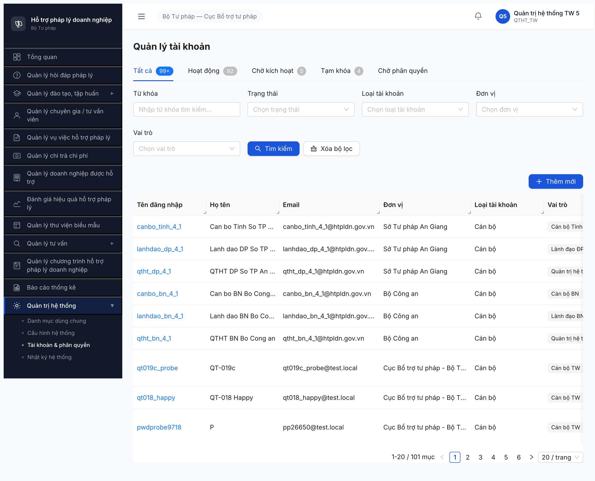
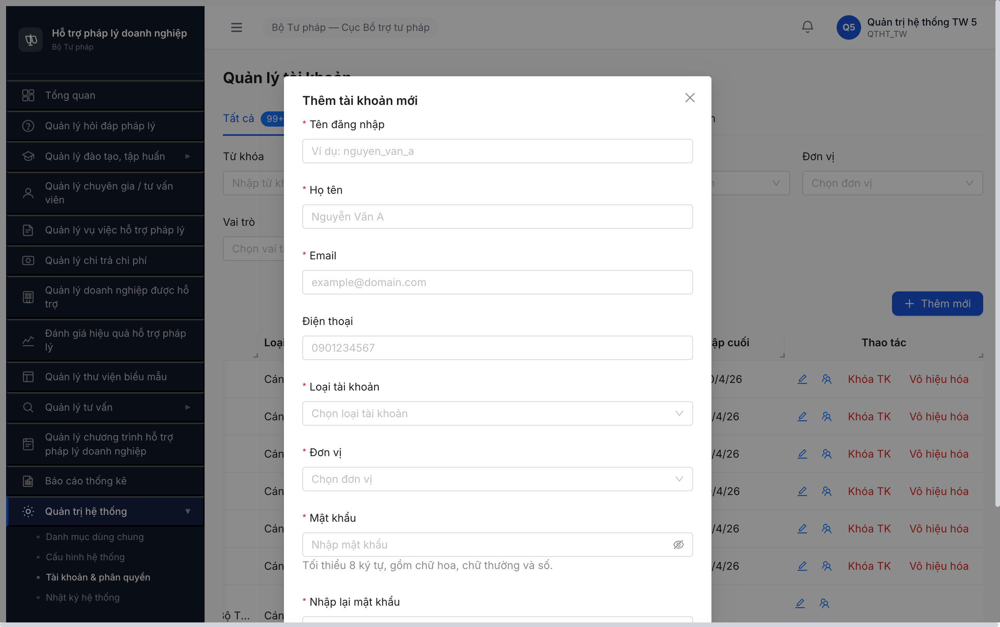

# Bug Report — Tài khoản & Phân quyền (Quản trị hệ thống)

| Thông tin | Giá trị |
|-----------|---------|
| **Dự án** | Phần mềm Hỗ trợ Pháp lý Doanh nghiệp (PM HTPLDN) |
| **Phiên bản** | 1.0 |
| **Môi trường** | http://103.172.236.130:3000/ |
| **Người test** | QA Automation via Claude Code (Chrome DevTools MCP) |
| **Ngày** | 00:45:00 2026-04-22 |
| **Loại test** | UI Comparison (UI vs SRS) |
| **Round** | Round 1 |
| **Tài liệu tham chiếu** | SRS v3 — SCR-VIII-02/03/04/05 (NotebookLM 2160bfb1-2020-4199-90a6-d607b298bb42) |

---

## Tổng hợp

Phát hiện **12** lỗi UI trong submenu **Tài khoản & phân quyền** (Quản trị hệ thống) khi đối chiếu với SRS v3.

| Tổng | Critical | Major | Medium | Minor | Trivial |
|------|----------|-------|--------|-------|---------|
| 12   | 2        | 5     | 5      | 0     | 0       |

**Phạm vi đã kiểm tra:**
- Entry point từ sidebar "Quản trị hệ thống → Tài khoản & phân quyền"
- Màn hình `/quan-tri/tai-khoan` (header, tabs, filter bar, action toolbar, table columns, row actions, pagination)
- Dialog **Thêm tài khoản mới** (9 field)
- Dialog **Quản lý vai trò — {tên user}** (gán vai trò cho user)
- Tài khoản dùng: `qtht_tw_5 / Test@1234` (QTHT_TW, cấp TW)

**Không kiểm được (do blocker từ BUG-TKPQ-001):**
- SCR-VIII-02 Quản lý Vai trò (list + modal CRUD: Mã/Tên/Mô tả/Trạng thái, cột Số TK/Số quyền)
- SCR-VIII-04 Phân quyền Chức năng (Checkbox Matrix: Xem/Thêm/Sửa/Xóa/Phê duyệt/Xuất + nút Lưu/Reset)
- SCR-VIII-05 Phân quyền Dữ liệu (Tree cây đơn vị 3 cấp TW→BN→ĐP, alert BR-AUTH-03 ngang cấp)

## Bug Summary Table

| Bug ID | Severity | Priority | Type | Module | TC Ref | Title | Status |
|--------|----------|----------|------|--------|--------|-------|--------|
| BUG-TKPQ-001 | Critical | P0 | UI/UX | SCR-VIII-02/04/05 | — | Thiếu entry-point sidebar cho 3/4 màn: Quản lý Vai trò, Phân quyền Chức năng, Phân quyền Dữ liệu | Open |
| BUG-TKPQ-002 | Critical | P0 | Data | SCR-VIII-03 | — | Error validation leak raw backend English: "trangThai must be one of the following values:" | Open |
| BUG-TKPQ-003 | Major | P1 | UI/UX | SCR-VIII-03 | — | Form Thêm tài khoản THIẾU field CCCD (SRS: optional, 12 chữ số) | Open |
| BUG-TKPQ-004 | Major | P1 | UI/UX | SCR-VIII-03 | — | Form Thêm tài khoản THỪA field "Điện thoại" — SRS không có | Open |
| BUG-TKPQ-005 | Major | P1 | UI/UX | SCR-VIII-03 | — | Table thiếu cột Checkbox chọn hàng loạt (SRS row #9) | Open |
| BUG-TKPQ-006 | Major | P1 | UI/UX | SCR-VIII-03 | — | Row action thiếu nút "Đổi MK" (đổi mật khẩu) — SRS row #16 yêu cầu | Open |
| BUG-TKPQ-007 | Major | P1 | UI/UX | SCR-VIII-03 | — | Row action không có nút "Xem" tường minh (SRS row #16 có Xem riêng) | Open |
| BUG-TKPQ-008 | Medium | P2 | UI/UX | SCR-VIII-03 | — | Tab "Hoạt động" hiện số "9 2" (có khoảng trắng giữa 2 chữ số) | Open |
| BUG-TKPQ-009 | Medium | P2 | UI/UX | SCR-VIII-03 | — | Tab "Chờ phân quyền" không hiển thị số đếm — SRS row #8 yêu cầu count trên mọi tab | Open |
| BUG-TKPQ-010 | Medium | P2 | UI/UX | SCR-VIII-03 | — | Table THỪA 2 cột "Loại tài khoản" + "Đăng nhập cuối" — SRS không list 2 cột này | Open |
| BUG-TKPQ-011 | Medium | P2 | UI/UX | SCR-VIII-03 | — | Button label "Thêm mới" ≠ SRS row #2 "+ Thêm tài khoản" | Open |
| BUG-TKPQ-012 | Medium | P2 | UI/UX | SCR-VIII-03 | — | Row action icon-only (edit/team) không có tooltip/aria-label tiếng Việt — a11y gap | Open |

> **Chú thích Type/Severity/Priority:** xem template `bug-report-template.md`.

---

## BUG-TKPQ-001 — Thiếu entry-point sidebar cho 3/4 màn Tài khoản & Phân quyền

| Trường | Chi tiết |
|--------|----------|
| **Bug ID** | BUG-TKPQ-001 |
| **Severity** | Critical |
| **Priority** | P0 |
| **Type** | UI/UX (Missing feature) |
| **Status** | Open |
| **Module** | Quản trị hệ thống → Tài khoản & phân quyền |
| **Thành phần** | Sidebar `aside.app-sidebar` + Router `/quan-tri/*` |
| **URL** | Sidebar group "Quản trị hệ thống" |
| **Trình duyệt** | Chrome 147 (via chrome-devtools-mcp) |
| **Tài khoản** | qtht_tw_5 (QTHT_TW, cấp TW) |
| **TC Reference** | — (UI audit trước khi viết test plan) |
| **SRS Reference** | SCR-VIII-02 (FR-VIII-14), SCR-VIII-04 (FR-VIII-17), SCR-VIII-05 (FR-VIII-16) |
| **Assignee** | FE Team |
| **Found by** | QA Automation |

### Mô tả

Theo SRS v3, phân hệ **"Tài khoản & Phân quyền"** phải gồm **4 màn hình chức năng độc lập**: Quản lý Vai trò (SCR-VIII-02), Quản lý Tài khoản NSD (SCR-VIII-03), Phân quyền Chức năng (SCR-VIII-04), Phân quyền Dữ liệu (SCR-VIII-05). Trên UI hiện tại, sidebar "Quản trị hệ thống" chỉ có **1 mục** "Tài khoản & phân quyền" link thẳng vào `/quan-tri/tai-khoan` (chỉ render SCR-VIII-03). Không có tab, breadcrumb, hay submenu nào dẫn đến 3 màn còn lại → **75% chức năng phân quyền không truy cập được từ UI**.

### Các bước tái hiện

1. Login `qtht_tw_5 / Test@1234` (OTP bypass `666666`).
2. Sidebar → expand group **"Quản trị hệ thống"**.
3. Quan sát 4 submenu hiện ra: Danh mục dùng chung / Cấu hình hệ thống / **Tài khoản & phân quyền** / Nhật ký hệ thống.
4. Click **"Tài khoản & phân quyền"** → URL đổi thành `/quan-tri/tai-khoan`, chỉ hiện màn "Quản lý tài khoản" (SCR-VIII-03).
5. Quan sát toàn bộ trang: không có tab secondary, không có link "Vai trò", "Phân quyền chức năng", "Phân quyền dữ liệu", không có breadcrumb navigation con.

### Kết quả mong đợi

Theo SRS v3 phân hệ Tài khoản & Phân quyền phải có **4 màn hình độc lập** truy cập được từ UI:

| Mã màn | Tên | FR | Chức năng |
|--------|-----|-----|-----------|
| SCR-VIII-02 | Quản lý Vai trò | FR-VIII-14 | CRUD role + toggle trạng thái |
| SCR-VIII-03 | Quản lý Tài khoản NSD | FR-VIII-15 | CRUD user + khóa/mở khóa/kích hoạt |
| SCR-VIII-04 | Phân quyền Chức năng | FR-VIII-17 | Checkbox matrix role × menu × (Xem/Thêm/Sửa/Xóa/Phê duyệt/Xuất) |
| SCR-VIII-05 | Phân quyền Dữ liệu | FR-VIII-16 | Tree multi-select role × đơn vị (3 cấp TW→BN→ĐP), BR-AUTH-03 ngang cấp |

→ Sidebar phải expose cả 4 mục (dạng sub-sub-menu, tab ngang, hoặc trang hub có 4 card).

### Kết quả thực tế

- Sidebar "Quản trị hệ thống" chỉ có **1 mục** "Tài khoản & phân quyền" trỏ tới `/quan-tri/tai-khoan`.
- Trang `/quan-tri/tai-khoan` chỉ hiện header "Quản lý tài khoản" (SCR-VIII-03) + tabs trạng thái + filter + table. Không có tab phụ / link / button nào dẫn sang 3 SCR còn lại.
- QTHT_TW là role có quyền cao nhất → việc không thấy cũng loại trừ lý do phân quyền.

### Bằng chứng

DOM sidebar submenu chỉ có 10 subitem cho toàn hệ thống:
```json
["Chương trình đào tạo","Khóa học","Ngân hàng câu hỏi","Giảng viên","Tư vấn chuyên sâu","Tư vấn nhanh","Danh mục dùng chung","Cấu hình hệ thống","Tài khoản & phân quyền","Nhật ký hệ thống"]
```

Ảnh chụp:



### Tác động (Impact)

- **100% QTHT (TW/BN/ĐP) không CRUD được Vai trò** → không tạo/sửa/xóa role → phụ thuộc seed DB.
- **100% QTHT không cấu hình được ma trận quyền chức năng** (Xem/Thêm/Sửa/Xóa/Phê duyệt/Xuất × menu) → không enforce được phân quyền theo role như SRS FR-VIII-17.
- **100% QTHT không cấu hình được phân quyền dữ liệu** theo đơn vị → BR-AUTH-03 (ngang cấp không thấy nhau) + BR-AUTH-04 (cấp cha thấy cấp con) không thể enforce qua UI.
- Nút **"team"** (icon chỉ có tooltip "team") trong row chỉ mở dialog "Quản lý vai trò — {user}" = gán role sẵn cho 1 user, **không thay thế** được chức năng quản lý danh sách role hay cấu hình matrix.

### Nguyên nhân nghi ngờ (Root Cause)

FE chỉ implement SCR-VIII-03 và bỏ qua / chưa đến phase SCR-VIII-02/04/05. Route có thể đã tồn tại (cần BE verify), nhưng không có entry-point UI → người dùng không truy cập được.

### Gợi ý sửa (Suggested Fix)

**Option A (nhanh):** Đổi sidebar group "Tài khoản & phân quyền" thành menu expandable với 4 subitem cấp 2:
```
Quản trị hệ thống ▶
  └── Tài khoản & phân quyền ▶
        ├── Quản lý vai trò           → /quan-tri/vai-tro
        ├── Quản lý tài khoản         → /quan-tri/tai-khoan
        ├── Phân quyền chức năng      → /quan-tri/phan-quyen-chuc-nang
        └── Phân quyền dữ liệu        → /quan-tri/phan-quyen-du-lieu
```

**Option B:** Biến `/quan-tri/tai-khoan` thành trang hub có 4 tab ngang (Vai trò / Tài khoản / Phân quyền chức năng / Phân quyền dữ liệu).

**Option C:** Thêm 3 link button bên cạnh header "Quản lý tài khoản" để sang 3 màn còn lại.

---

## BUG-TKPQ-002 — Error validation leak English raw: "trangThai must be one of the following values:"

| Trường | Chi tiết |
|--------|----------|
| **Bug ID** | BUG-TKPQ-002 |
| **Severity** | Critical |
| **Priority** | P0 |
| **Type** | Data (i18n + validation) |
| **Status** | Open |
| **Module** | Quản lý tài khoản (SCR-VIII-03) |
| **Thành phần** | Filter "Trạng thái" / backend validation `trangThai` |
| **URL** | `/quan-tri/tai-khoan` |
| **Trình duyệt** | Chrome 147 (via chrome-devtools-mcp) |
| **Tài khoản** | qtht_tw_5 |
| **SRS Reference** | SCR-VIII-03, BR-DATA-05 |
| **Assignee** | BE Team + FE Team |
| **Found by** | QA Automation |

### Mô tả

Khi vừa load trang `/quan-tri/tai-khoan`, UI hiển thị thông báo lỗi **`"trangThai must be one of the following values:"`** — đây là message tiếng Anh raw từ validation BE (thư viện validator, likely class-validator / joi / zod), leak trực tiếp ra người dùng cuối → vi phạm yêu cầu i18n (sản phẩm Vietnamese-only) và expose internal field name `trangThai`.

### Các bước tái hiện

1. Login `qtht_tw_5 / Test@1234`.
2. Navigate sidebar → Quản trị hệ thống → Tài khoản & phân quyền.
3. Trang `/quan-tri/tai-khoan` load xong.
4. Cuối page (dưới pagination) xuất hiện icon `close-circle` đỏ kèm text `"trangThai must be one of the following values:"` (danh sách giá trị có thể bị cắt sau dấu `:`).

### Kết quả mong đợi

- Không hiện bất kỳ thông báo lỗi nào khi không có thao tác sai.
- Nếu thực sự có lỗi validation (vd khi call API với `trangThai` empty string thay vì bỏ hẳn param), BE phải:
  - Dùng tiếng Việt: "Trạng thái phải là một trong các giá trị: Hoạt động / Chờ kích hoạt / Tạm khóa / Vô hiệu hóa / Chờ phân quyền"
  - Không expose tên field kỹ thuật `trangThai` (nên là "Trạng thái")
  - Không hiển thị ở UI end-user nếu lỗi đó là do FE gửi sai (cần FE fix contract, không hiển thị)

### Kết quả thực tế

```
× trangThai must be one of the following values:
```

(Snapshot uid=6_315 image "close-circle" + uid=6_316 StaticText)

### Bằng chứng


Snapshot sau khi load:
```
uid=6_315 image "close-circle"
uid=6_316 StaticText "trangThai must be one of the following values:"
```

### Tác động (Impact)

- **100% user vào trang `/quan-tri/tai-khoan` lần đầu** đều thấy error message English raw → UX xấu, người dùng nghĩ hệ thống đang lỗi.
- Lộ tên field backend (`trangThai`) → minor security leak (info disclosure).
- Vi phạm yêu cầu ngôn ngữ tiếng Việt của sản phẩm.

### Nguyên nhân nghi ngờ (Root Cause)

- FE gọi `GET /api/v1/users?trangThai=` với empty string → BE validator (class-validator `@IsIn(...)` hoặc tương tự) reject với message mặc định tiếng Anh.
- FE không catch error này để hide / i18n → đẩy raw message lên UI.

### Gợi ý sửa (Suggested Fix)

1. FE: Chỉ gửi `trangThai` khi user select filter (bỏ hẳn param khi "Tất cả").
2. BE: Custom error message tiếng Việt với thư viện validator, vd class-validator:
   ```ts
   @IsIn(['HOAT_DONG', 'CHO_KICH_HOAT', 'TAM_KHOA', 'VO_HIEU_HOA', 'CHO_PHAN_QUYEN'], {
     message: 'Trạng thái không hợp lệ'
   })
   trangThai?: string;
   ```
3. FE: Có error handler global bỏ qua / ẩn 400 validation khi chưa có thao tác user.

---

## BUG-TKPQ-003 — Form Thêm tài khoản THIẾU field CCCD

| Trường | Chi tiết |
|--------|----------|
| **Bug ID** | BUG-TKPQ-003 |
| **Severity** | Major |
| **Priority** | P1 |
| **Type** | UI/UX (Missing field) |
| **Status** | Open |
| **Module** | Quản lý tài khoản (SCR-VIII-03) — Dialog "Thêm tài khoản mới" |
| **Thành phần** | Form modal `Thêm tài khoản mới` |
| **URL** | `/quan-tri/tai-khoan` + click `[+ Thêm mới]` |
| **Tài khoản** | qtht_tw_5 |
| **SRS Reference** | SCR-VIII-03 Form tạo/sửa TK row #24 (CCCD, text-input, không bắt buộc, validate 12 chữ số) |
| **Assignee** | FE Team + BE Team |
| **Found by** | QA Automation |

### Mô tả

SRS v3 SCR-VIII-03 quy định form tạo/sửa tài khoản có **8 field** (#17 Username, #18 Email, #19 Họ tên, #20 Mật khẩu, #21 Vai trò, #22 Đơn vị, #23 Loại tài khoản, **#24 CCCD**). UI hiện tại **thiếu hẳn field CCCD**. CCCD là thông tin nhân thân cán bộ cần để tích hợp VNeID (nút "Đăng nhập bằng VNeID" đã có trên login page), và là dữ liệu chuẩn định danh công dân theo NĐ 104/2022.

### Các bước tái hiện

1. Login `qtht_tw_5 / Test@1234`.
2. Navigate `/quan-tri/tai-khoan`.
3. Click button **`+ Thêm mới`** (góc phải filter bar).
4. Dialog "Thêm tài khoản mới" mở ra.
5. Quan sát toàn bộ 9 field trong form.

### Kết quả mong đợi

Form có đủ 8 field theo SRS, bao gồm **CCCD** (text-input, không bắt buộc, validate đúng 12 chữ số — theo chuẩn số CCCD Việt Nam).

### Kết quả thực tế

Form chỉ có 9 field:
1. Tên đăng nhập * (✅ match SRS #17)
2. Họ tên * (✅ #19)
3. Email * (✅ #18)
4. **Điện thoại** (❌ không có trong SRS — xem BUG-TKPQ-004)
5. Loại tài khoản * (✅ #23)
6. Đơn vị * (✅ #22)
7. Mật khẩu * (✅ #20)
8. **Nhập lại mật khẩu *** (➕ SRS không specifiy — OK vì UX)
9. Vai trò * (✅ #21)

→ **Không có CCCD.**

### Bằng chứng



### Tác động (Impact)

- **100% tài khoản tạo qua UI không có CCCD** → không thể link tài khoản với VNeID identity sau này (chức năng VNeID đã có trên login).
- Vi phạm mapping SRS → Test case FR-VIII-15 TC kiểm tra CCCD (validate 12 digits) sẽ BLOCKED vì không có field để input.
- Dữ liệu CCCD là cần cho báo cáo nhân sự cán bộ hỗ trợ pháp lý doanh nghiệp (FR-VIII-11 Báo cáo thống kê).

### Gợi ý sửa (Suggested Fix)

Thêm field CCCD vào form:
```tsx
<Form.Item
  label="CCCD"
  name="cccd"
  rules={[
    { pattern: /^\d{12}$/, message: 'CCCD phải là 12 chữ số' }
  ]}
>
  <Input placeholder="Nhập số CCCD (12 chữ số)" maxLength={12} />
</Form.Item>
```

Vị trí: giữa "Đơn vị" và "Mật khẩu" hoặc cuối form (vì optional).

---

## BUG-TKPQ-004 — Form Thêm tài khoản THỪA field "Điện thoại"

| Trường | Chi tiết |
|--------|----------|
| **Bug ID** | BUG-TKPQ-004 |
| **Severity** | Major |
| **Priority** | P1 |
| **Type** | UI/UX (Extra field not in spec) |
| **Status** | Open |
| **Module** | Quản lý tài khoản (SCR-VIII-03) — Dialog "Thêm tài khoản mới" |
| **Thành phần** | Form modal field "Điện thoại" |
| **URL** | `/quan-tri/tai-khoan` + click `[+ Thêm mới]` |
| **SRS Reference** | SCR-VIII-03 Form tạo/sửa TK (#17-#24) — KHÔNG có field Điện thoại |
| **Assignee** | FE Team |
| **Found by** | QA Automation |

### Mô tả

Form "Thêm tài khoản mới" hiển thị field **"Điện thoại"** (optional) — không có trong SRS v3 SCR-VIII-03 (spec chỉ list 8 field: Username, Email, Họ tên, Mật khẩu, Vai trò, Đơn vị, Loại TK, CCCD). Field thừa gây nhầm lẫn cho QA khi map SRS → UI và có thể khác spec dự định.

### Các bước tái hiện

1. Login `qtht_tw_5 / Test@1234`.
2. `/quan-tri/tai-khoan` → click `[+ Thêm mới]`.
3. Dialog mở → xem field thứ 4 từ trên xuống.

### Kết quả mong đợi

Không có field "Điện thoại" (theo SRS). Nếu thực sự cần phone, phải update SRS trước khi add UI.

### Kết quả thực tế

Field "Điện thoại" hiển thị, là `textbox` optional (không dấu `*`).

### Bằng chứng


Snapshot:
```
uid=8_9  StaticText "Điện thoại"
uid=8_10 textbox "Điện thoại"
```

### Tác động (Impact)

- QA/BA test-case mismatch: viết test theo SRS sẽ không test `Điện thoại`, dữ liệu có thể bị nhập lung tung.
- Nếu BE không lưu / không validate → "write black hole".
- Nếu BE có lưu → thêm dữ liệu không được SRS định nghĩa → governance issue (PII scope).

### Gợi ý sửa (Suggested Fix)

- **Option A (prefer):** Remove field "Điện thoại" khỏi form UI.
- **Option B:** Update SRS v3 SCR-VIII-03 để thêm "Điện thoại" chính thức với validate (format +84, vd `^(\+84|0)\d{9,10}$`) + BA sign-off.

---

## BUG-TKPQ-005 — Table thiếu cột Checkbox chọn hàng loạt

| Trường | Chi tiết |
|--------|----------|
| **Bug ID** | BUG-TKPQ-005 |
| **Severity** | Major |
| **Priority** | P1 |
| **Type** | UI/UX (Missing feature) |
| **Status** | Open |
| **Module** | Quản lý tài khoản (SCR-VIII-03) |
| **Thành phần** | Table `.ant-table` + toolbar bulk action |
| **URL** | `/quan-tri/tai-khoan` |
| **SRS Reference** | SCR-VIII-03 Table row #9 "Checkbox chọn" (checkbox, Chọn hàng loạt) |
| **Assignee** | FE Team |
| **Found by** | QA Automation |

### Mô tả

SRS row #9 quy định table tài khoản có cột **Checkbox chọn** đầu tiên để chọn hàng loạt (bulk action). UI hiện tại thiếu hẳn cột này → không thể bulk khóa / vô hiệu hóa / gửi lại email cho nhiều tài khoản cùng lúc → QTHT phải click từng dòng (scale 101 item ≥ 6 pages = ~101 click nếu cần action tất cả).

### Các bước tái hiện

1. Login `qtht_tw_5 / Test@1234`.
2. `/quan-tri/tai-khoan`.
3. Quan sát header table.

### Kết quả mong đợi

Cột đầu tiên là checkbox (header check = select all current page; row check = select that row), và khi có ≥1 row selected → hiển thị action bar "Đã chọn N — [Khóa] [Vô hiệu hóa] [Gửi lại email]".

### Kết quả thực tế

Header table: `Tên đăng nhập | Họ tên | Email | Đơn vị | Loại tài khoản | Vai trò | Trạng thái | Đăng nhập cuối | Thao tác` — **không có cột checkbox**.

### Tác động (Impact)

- QTHT không bulk action được tài khoản → scale kém khi cần khóa hàng loạt (vd bulk offboarding).
- Mismatch SRS → FR-VIII-15 Acceptance Criteria "bulk action" không verify được.

### Gợi ý sửa (Suggested Fix)

Ant Design Table có sẵn `rowSelection`:
```tsx
<Table
  rowSelection={{
    selectedRowKeys,
    onChange: setSelectedRowKeys,
  }}
  ...
/>
```
+ Bulk action toolbar hiển thị khi `selectedRowKeys.length > 0`.

---

## BUG-TKPQ-006 — Row action thiếu nút "Đổi MK" (đổi mật khẩu)

| Trường | Chi tiết |
|--------|----------|
| **Bug ID** | BUG-TKPQ-006 |
| **Severity** | Major |
| **Priority** | P1 |
| **Type** | UI/UX (Missing action) |
| **Status** | Open |
| **Module** | Quản lý tài khoản (SCR-VIII-03) |
| **Thành phần** | Column "Thao tác" row action |
| **URL** | `/quan-tri/tai-khoan` |
| **SRS Reference** | SCR-VIII-03 row #16 Cột Hành động: "Xem / Sửa / Mở khóa / Khóa / Gửi lại email / **Đổi MK**" |
| **Assignee** | FE Team + BE Team |
| **Found by** | QA Automation |

### Mô tả

SRS row #16 list 6 action: `Xem / Sửa / Mở khóa / Khóa / Gửi lại email / Đổi MK`. UI hiện tại không có nút **"Đổi MK"** (đổi mật khẩu) cho bất kỳ trạng thái tài khoản nào → QTHT không thể reset mật khẩu user khi user quên / bị lộ.

### Các bước tái hiện

1. Login `qtht_tw_5 / Test@1234`.
2. `/quan-tri/tai-khoan`.
3. Xem row action của các trạng thái:
   - **Hoạt động:** `edit(icon) / team(icon) / Khóa TK / Vô hiệu hóa`
   - **Chờ kích hoạt:** `edit / team / Kích hoạt / Gửi lại email`
   - **Tạm khóa:** `edit / team / Mở khóa`

### Kết quả mong đợi

Có nút "Đổi MK" (hoặc "Reset mật khẩu") ít nhất cho trạng thái `HOAT_DONG` và `TAM_KHOA`. Khi QTHT click → BE generate mật khẩu mới random / gửi email reset link.

### Kết quả thực tế

Không có nút "Đổi MK" / "Reset mật khẩu" cho bất kỳ trạng thái nào. User chỉ có thể self-service quên mật khẩu qua `/auth/forgot-password`, nhưng QTHT không có đường can thiệp admin-side.

### Tác động (Impact)

- QTHT không xử lý được case user quên mật khẩu + không vào được email (email sai / bị khóa Mail).
- Violate SRS FR-VIII-15 row #16.

### Gợi ý sửa (Suggested Fix)

Thêm action "Đổi MK" (icon key hoặc label "Đổi MK") trong row action. UI flow:
1. Click "Đổi MK" → confirm dialog "Bạn chắc chắn muốn đặt lại mật khẩu cho {username}? Mật khẩu mới sẽ được gửi qua email."
2. Confirm → BE generate mật khẩu mới / token link + send email + toast success.

---

## BUG-TKPQ-007 — Row action thiếu nút "Xem" tường minh

| Trường | Chi tiết |
|--------|----------|
| **Bug ID** | BUG-TKPQ-007 |
| **Severity** | Major |
| **Priority** | P1 |
| **Type** | UI/UX |
| **Status** | Open |
| **Module** | Quản lý tài khoản (SCR-VIII-03) |
| **Thành phần** | Column "Thao tác" row action |
| **URL** | `/quan-tri/tai-khoan` |
| **SRS Reference** | SCR-VIII-03 row #16 "Xem / Sửa / Mở khóa / Khóa / Gửi lại email / Đổi MK" |
| **Assignee** | FE Team |
| **Found by** | QA Automation |

### Mô tả

SRS list "Xem" là action riêng. UI hiện tại thay thế bằng cách click **link username** (cột 1) → navigate `/quan-tri/tai-khoan/{uuid}` detail. Cách này vẫn work về mặt function nhưng gây 2 vấn đề:
1. Không phát hiện được "Xem" (ẩn sau link) — user mới không biết.
2. Inconsistent với action khác (Sửa / Khóa đều có button rõ ràng).

### Các bước tái hiện

1. `/quan-tri/tai-khoan`.
2. Xem cột "Thao tác" → không có icon/button "Xem" (chỉ `edit`, `team`, và action trạng thái).
3. Click username "canbo_tinh_4_1" → navigate `/quan-tri/tai-khoan/169d50d8-...` = trang detail.

### Kết quả mong đợi

Row có button/icon "Xem" (icon eye + tooltip "Xem chi tiết") → click navigate detail.

### Kết quả thực tế

- Cột "Thao tác" chỉ có: `edit(icon) / team(icon) / {action theo trạng thái}`.
- User phải click link username (cột đầu) để xem chi tiết — không có Visual affordance dạng button/icon eye.

### Tác động (Impact)

- UX discoverability kém cho user mới.
- A11y: screen reader user thấy list "edit, team, Khóa TK" nhưng không biết còn action "Xem" ẩn.

### Gợi ý sửa (Suggested Fix)

Thêm icon eye (`EyeOutlined`) đầu row action với tooltip "Xem chi tiết":
```tsx
<Tooltip title="Xem chi tiết">
  <Button icon={<EyeOutlined />} onClick={() => navigate(`/quan-tri/tai-khoan/${id}`)} />
</Tooltip>
```

---

## BUG-TKPQ-008 — Tab "Hoạt động" hiện số sai format "9 2"

| Trường | Chi tiết |
|--------|----------|
| **Bug ID** | BUG-TKPQ-008 |
| **Severity** | Medium |
| **Priority** | P2 |
| **Type** | UI/UX (Formatting) |
| **Status** | Open |
| **Module** | Quản lý tài khoản (SCR-VIII-03) |
| **Thành phần** | Tab header count badge |
| **URL** | `/quan-tri/tai-khoan` |
| **SRS Reference** | SCR-VIII-03 row #8 Tab "Tất cả / Hoạt động / Chờ kích hoạt / Tạm khóa / Chờ phân quyền (số đếm)" |
| **Assignee** | FE Team |
| **Found by** | QA Automation |

### Mô tả

Tab "Hoạt động" hiển thị số đếm là **`"9 2"`** (có khoảng trắng giữa 2 chữ số) thay vì `"92"`. Tab "Chờ kích hoạt 5" + "Tạm khóa 4" + "Tất cả 99+" OK.

### Các bước tái hiện

1. `/quan-tri/tai-khoan`.
2. Xem tab bar top của main content.

### Kết quả mong đợi

Tab hiển thị `"Hoạt động 92"` (số liền nhau, hoặc có badge `(92)`).

### Kết quả thực tế

Snapshot: `uid=6_2 tab "Hoạt động 9 2" selectable`

### Bằng chứng


### Tác động (Impact)

Minor nhưng nhìn unprofessional. Có thể do render 2 span "9" + " " + "2" hoặc số bị split; nếu là thousand separator (number-format `9,2` nhầm thành space) sẽ bug nặng với 4-digit.

### Gợi ý sửa (Suggested Fix)

Check component render tab label:
```tsx
<Tab>{label} {count.toLocaleString('vi-VN')}</Tab>
```
Tránh `count.toString().split('').join(' ')` hoặc any rendering tách digit.

---

## BUG-TKPQ-009 — Tab "Chờ phân quyền" không có số đếm

| Trường | Chi tiết |
|--------|----------|
| **Bug ID** | BUG-TKPQ-009 |
| **Severity** | Medium |
| **Priority** | P2 |
| **Type** | UI/UX (Missing data) |
| **Status** | Open |
| **Module** | Quản lý tài khoản (SCR-VIII-03) |
| **Thành phần** | Tab header |
| **URL** | `/quan-tri/tai-khoan` |
| **SRS Reference** | SCR-VIII-03 row #8 (mọi tab có số đếm) |
| **Assignee** | FE Team + BE Team |
| **Found by** | QA Automation |

### Mô tả

Tab "Chờ phân quyền" không hiển thị số count. 4 tab khác đều có: `Tất cả 99+ / Hoạt động 92 / Chờ kích hoạt 5 / Tạm khóa 4`.

### Các bước tái hiện

1. `/quan-tri/tai-khoan`.
2. Xem tab thứ 5 "Chờ phân quyền".

### Kết quả mong đợi

Hiển thị count: "Chờ phân quyền 0" (hoặc "Chờ phân quyền 3" nếu có dữ liệu). SRS yêu cầu count trên mọi tab.

### Kết quả thực tế

`uid=6_5 tab "Chờ phân quyền" selectable` — không có số.

### Tác động (Impact)

- Nếu do BE không trả count của state `CHO_PHAN_QUYEN` → user không biết có tài khoản nào chờ phân quyền không.
- Inconsistent với 4 tab khác → trải nghiệm không đồng đều.

### Gợi ý sửa (Suggested Fix)

BE: Thêm `choPhanQuyen` vào response `GET /api/v1/users/stats`. FE: Render cùng format `{label} {count}` cho mọi tab (fallback "0" khi `undefined`).

---

## BUG-TKPQ-010 — Table THỪA 2 cột không có trong SRS

| Trường | Chi tiết |
|--------|----------|
| **Bug ID** | BUG-TKPQ-010 |
| **Severity** | Medium |
| **Priority** | P2 |
| **Type** | UI/UX |
| **Status** | Open |
| **Module** | Quản lý tài khoản (SCR-VIII-03) |
| **Thành phần** | Table column definition |
| **URL** | `/quan-tri/tai-khoan` |
| **SRS Reference** | SCR-VIII-03 row #10-#16 (7 cột: Username, Họ tên, Email, Đơn vị, Vai trò, Trạng thái, Hành động) + row #9 Checkbox |
| **Assignee** | FE Team + BA |
| **Found by** | QA Automation |

### Mô tả

UI hiện 9 cột: `Tên đăng nhập | Họ tên | Email | Đơn vị | Loại tài khoản | Vai trò | Trạng thái | Đăng nhập cuối | Thao tác`. So với SRS (row #9-#16 = 8 cột bao gồm checkbox), UI:
- **Thừa cột "Loại tài khoản"** — SRS chỉ list ở filter bar (row #7), không list là table column.
- **Thừa cột "Đăng nhập cuối"** — SRS không list.
- (Thiếu cột "Checkbox" — đã log BUG-TKPQ-005.)

### Các bước tái hiện

1. `/quan-tri/tai-khoan`.
2. Đếm header cột table: 9 cột.

### Kết quả mong đợi

8 cột theo SRS: `[Checkbox] | Username | Họ tên | Email | Đơn vị | Vai trò | Trạng thái | Hành động`.

### Kết quả thực tế

9 cột: `Username | Họ tên | Email | Đơn vị | Loại TK | Vai trò | Trạng thái | Đăng nhập cuối | Thao tác`.

### Tác động (Impact)

- QA viết test cases theo SRS sẽ miss 2 cột này.
- "Đăng nhập cuối" gây tranh cãi UX vs privacy (có thể expose pattern login của user).
- "Loại tài khoản" mapping trùng với filter bar cùng tên.

### Gợi ý sửa (Suggested Fix)

- **Option A (align SRS):** Remove 2 cột "Loại tài khoản" + "Đăng nhập cuối" khỏi table. Cho phép show on demand qua column picker.
- **Option B (update SRS):** BA review + sign-off thêm 2 cột vào SRS row #10-#16 nếu thực sự cần.

---

## BUG-TKPQ-011 — Button label "Thêm mới" khác SRS "+ Thêm tài khoản"

| Trường | Chi tiết |
|--------|----------|
| **Bug ID** | BUG-TKPQ-011 |
| **Severity** | Medium |
| **Priority** | P2 |
| **Type** | UI/UX (Label deviation) |
| **Status** | Open |
| **Module** | Quản lý tài khoản (SCR-VIII-03) |
| **Thành phần** | Toolbar button "Thêm mới" |
| **URL** | `/quan-tri/tai-khoan` |
| **SRS Reference** | SCR-VIII-03 row #2 "Tiêu đề + Nút thêm: 'Quản lý Tài khoản' + [+ Thêm tài khoản]" |
| **Assignee** | FE Team |
| **Found by** | QA Automation |

### Mô tả

SRS quy định button có label cụ thể **"[+ Thêm tài khoản]"**. UI dùng **"Thêm mới"** (generic label) — mất context ngữ nghĩa ("thêm gì?"), inconsistent nếu các module khác cũng dùng "Thêm mới" generic.

### Các bước tái hiện

1. `/quan-tri/tai-khoan`.
2. Xem button góc phải filter bar → label `plus Thêm mới`.

### Kết quả mong đợi

Label: `+ Thêm tài khoản` (như SRS row #2).

### Kết quả thực tế

Label: `+ Thêm mới`.

### Gợi ý sửa (Suggested Fix)

Đổi label:
```tsx
<Button icon={<PlusOutlined />}>Thêm tài khoản</Button>
```

---

## BUG-TKPQ-012 — Row action icon-only không có tooltip rõ ràng

| Trường | Chi tiết |
|--------|----------|
| **Bug ID** | BUG-TKPQ-012 |
| **Severity** | Medium |
| **Priority** | P2 |
| **Type** | UI/UX (a11y) |
| **Status** | Open |
| **Module** | Quản lý tài khoản (SCR-VIII-03) |
| **Thành phần** | Row action buttons (edit, team icons) |
| **URL** | `/quan-tri/tai-khoan` |
| **SRS Reference** | Standard a11y — WCAG 2.1 AA (button must have accessible name) |
| **Assignee** | FE Team |
| **Found by** | QA Automation |

### Mô tả

2 button đầu tiên trong cột "Thao tác" là icon-only (`edit` + `team`) và a11y accessible name trả về từ snapshot là literal **`"edit"`** và **`"team"`** (English icon name) thay vì "Sửa" / "Quản lý vai trò". Người dùng tiếng Việt + screen reader chỉ đọc được "edit", "team" — khó hiểu.

### Các bước tái hiện

1. `/quan-tri/tai-khoan`.
2. Inspect snapshot row action:
   ```
   uid=6_48 button "edit"
   uid=6_49 button "team"
   uid=6_50 button "Khóa TK"
   uid=6_51 button "Vô hiệu hóa"
   ```

### Kết quả mong đợi

Accessible name bằng tiếng Việt:
- `"edit"` → `"Sửa tài khoản"`
- `"team"` → `"Quản lý vai trò"` (dialog này đã có title Quản lý vai trò — {user})

Kèm tooltip visible on hover.

### Kết quả thực tế

Button không có `aria-label` tiếng Việt, icon name English được dùng làm accessible text. Chưa kiểm được có tooltip hay không (nhưng snapshot không show title).

### Tác động (Impact)

- A11y fail WCAG 2.1 SC 4.1.2 (Name, Role, Value).
- Screen reader user không dùng được hiệu quả.

### Gợi ý sửa (Suggested Fix)

```tsx
<Tooltip title="Sửa tài khoản">
  <Button icon={<EditOutlined />} aria-label="Sửa tài khoản" />
</Tooltip>
<Tooltip title="Quản lý vai trò">
  <Button icon={<TeamOutlined />} aria-label="Quản lý vai trò" />
</Tooltip>
```

---

## Phụ lục

### A — Môi trường test

| Thành phần | Giá trị |
|------------|---------|
| URL ứng dụng | http://103.172.236.130:3000/ |
| URL module test | http://103.172.236.130:3000/quan-tri/tai-khoan |
| OTP login | `666666` (bypass) |
| MailHog (OTP inbox) | http://103.172.236.130:8025 |
| Frontend | React + Vite + Ant Design |
| Xác thực | JWT + OTP (qua email hoặc bypass) |
| Tool QA | Chrome DevTools MCP (primary, từ 2026-04-21) |

### B — Tài khoản sử dụng

| Tên đăng nhập | Vai trò | Cấp | Dùng cho bug nào |
|---------------|---------|-----|------------------|
| qtht_tw_5 | QTHT_TW | TW | Tất cả BUG-TKPQ-001..012 |

### C — Danh mục ảnh chụp

| File | Mô tả | Dùng cho bug |
|------|-------|--------------|
| [image/01-qltk-list.png](image/01-qltk-list.png) | Trang Quản lý tài khoản `/quan-tri/tai-khoan` — tabs + filter + table + error leak | 001, 002, 005, 007, 008, 010, 011, 012 |
| [image/02-dialog-gan-vai-tro.png](image/02-dialog-gan-vai-tro.png) | Dialog "Quản lý vai trò — {user}" khi click icon team | 001 (không thay thế được SCR-VIII-04) |
| [image/03-form-them-tk.png](image/03-form-them-tk.png) | Dialog "Thêm tài khoản mới" — 9 field | 003, 004 |

### D — Đối chiếu UI vs SRS (tóm tắt 4 SCR)

| SCR | Tên | Trạng thái UI | Mức độ mismatch |
|-----|-----|---------------|-----------------|
| SCR-VIII-02 | Quản lý Vai trò | ❌ **KHÔNG CÓ** entry-point | Critical (BUG-001) |
| SCR-VIII-03 | Quản lý Tài khoản NSD | ⚠️ Có, nhiều mismatch field/column/action | 11 bug (002-012) |
| SCR-VIII-04 | Phân quyền Chức năng | ❌ **KHÔNG CÓ** entry-point | Critical (BUG-001) |
| SCR-VIII-05 | Phân quyền Dữ liệu | ❌ **KHÔNG CÓ** entry-point | Critical (BUG-001) |

### E — Verdict

**FAIL.** 3/4 màn chính của phân hệ "Tài khoản & Phân quyền" không có entry-point UI → toàn bộ chức năng role management + permission config không truy cập được từ QTHT. SCR-VIII-03 (Quản lý Tài khoản) có implement nhưng sai 8 điểm so với SRS (thiếu CCCD, thiếu Đổi MK, thiếu Checkbox, thừa 2 cột, thừa Điện thoại, format tab, error leak English...).

**Đề xuất:** Block release phân hệ Quản trị hệ thống cho đến khi BUG-TKPQ-001 (P0) + BUG-TKPQ-002 (P0) fix xong.

---

*Bug report generated: 2026-04-22 | QA Automation via Claude Code (Chrome DevTools MCP)*
