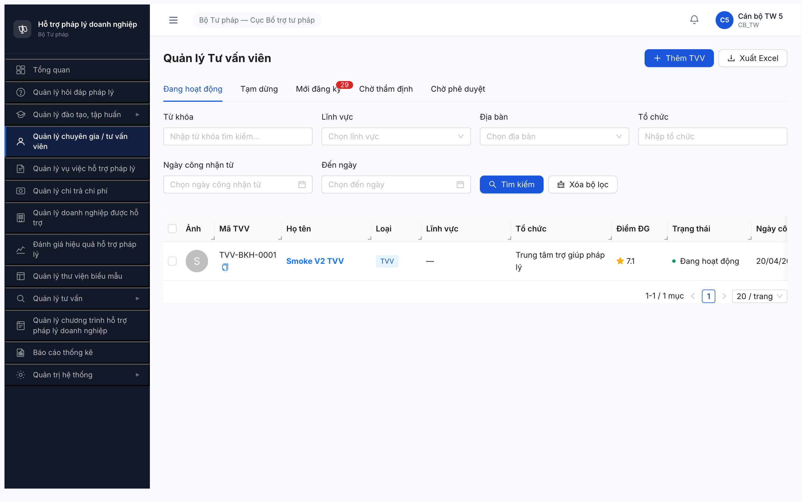
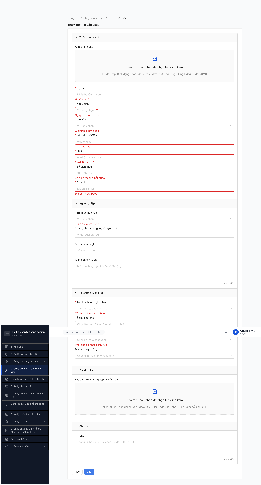
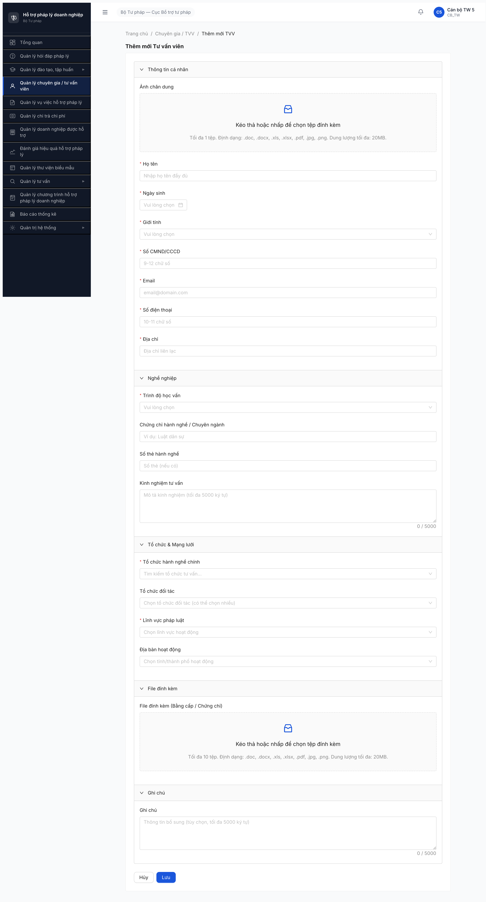
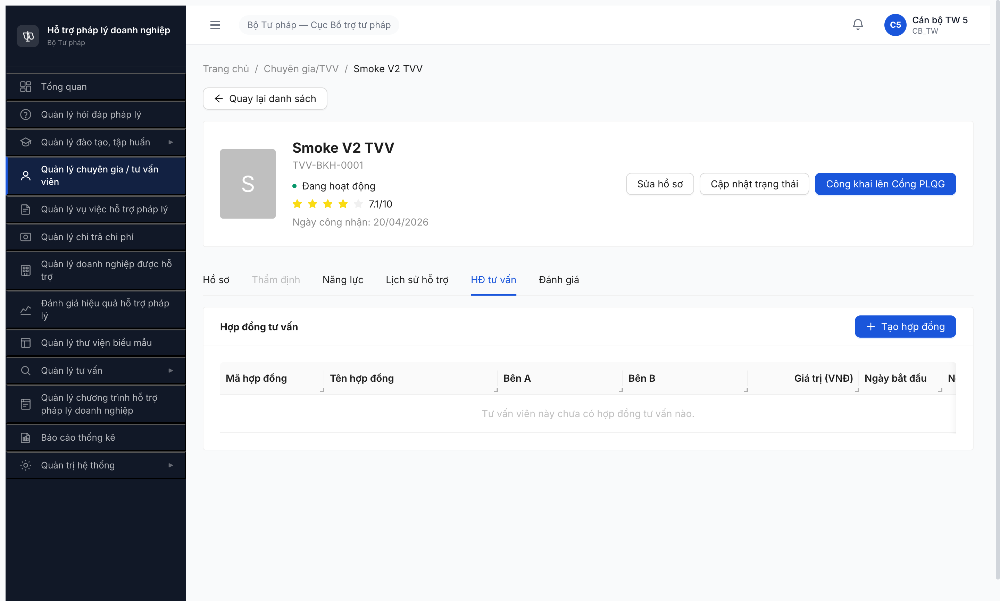
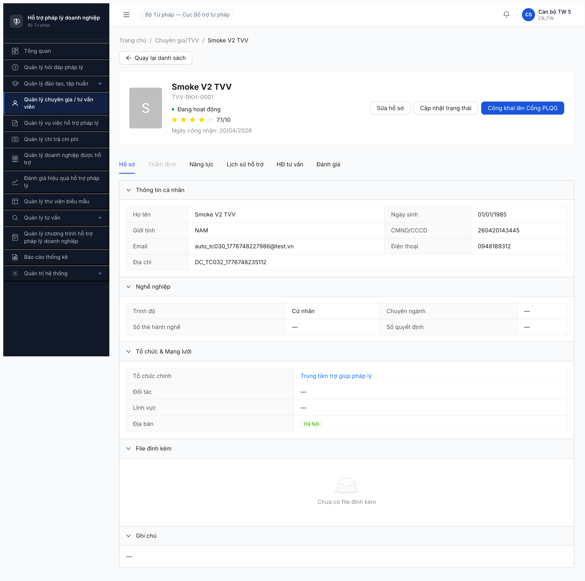

# Bug Report — Quản lý Chuyên gia / Tư vấn viên (UI)

| Thông tin | Giá trị |
|-----------|---------|
| **Dự án** | PM HTPLDN (Phần mềm Hỗ trợ Pháp lý Doanh nghiệp) |
| **Phiên bản** | 1.0 |
| **Môi trường** | http://103.172.236.130:3000/ |
| **Người test** | QA Automation (via Claude Code + Chrome DevTools MCP) |
| **Ngày** | 11:00:00 — 2026-04-22 |
| **Loại test** | UI Verification (SRS vs UI) |
| **Round** | Round 1 |
| **Tài liệu tham chiếu** | SRS v3.0 — SCR-IV-01/02/03, FR-IV-01..12 (nguồn: NotebookLM 2160bfb1-2020-4199-90a6-d607b298bb42) |

---

## Tổng hợp

Phát hiện **17** lỗi UI khi so sánh SRS vs UI thực tế của chức năng **Quản lý Chuyên gia / Tư vấn viên** (thực thể `TU_VAN_VIEN`, gồm 3 loại TVV/CG/NHT dùng chung màn hình).

| Tổng | Critical | Major | Medium | Minor |
|------|----------|-------|--------|-------|
| 17 | 0 | 6 | 9 | 2 |

Phạm vi test: List (SCR-IV-01), Form Thêm/Sửa (SCR-IV-02), Hồ sơ chi tiết (SCR-IV-03: Hồ sơ / Năng lực / Lịch sử hỗ trợ / HĐ tư vấn / Đánh giá + modal Cập nhật trạng thái). Tab Thẩm định disabled do TVV test ở trạng thái `DANG_HOAT_DONG` — chưa test sâu.

## Bug Summary Table

| Bug ID | Severity | Priority | Type | Module | SRS Ref | Title | Status |
|--------|----------|----------|------|--------|---------|-------|--------|
| BUG-CGTVV-UI-001 | Major | P1 | UI/UX | SCR-IV-01 | SCR-IV-01 #1 | Thiếu Breadcrumb trên trang danh sách TVV | Open |
| BUG-CGTVV-UI-002 | Major | P1 | UI/UX | SCR-IV-01 | SCR-IV-01 #12 | Thiếu filter "Trạng thái" trong filter-bar | Open |
| BUG-CGTVV-UI-003 | Major | P1 | UI/UX | SCR-IV-01 | SCR-IV-01 #11 | Filter "Tổ chức" sai kiểu control — text input thay vì select searchable | Open |
| BUG-CGTVV-UI-004 | Medium | P2 | UI/UX | SCR-IV-01 | SCR-IV-01 #8 | Placeholder ô "Từ khóa" không gợi ý 3 trường search theo SRS | Open |
| BUG-CGTVV-UI-005 | Medium | P2 | UI/UX | SCR-IV-01 | SCR-IV-01 table cols | Thừa cột "Công khai" trên bảng tab "Đang hoạt động" | Open |
| BUG-CGTVV-UI-006 | Medium | P2 | UI/UX | SCR-IV-01 | SCR-IV-01 #3-7 | 4/5 tab không hiển thị số đếm (count) bên cạnh tên tab | Open |
| BUG-CGTVV-UI-007 | Major | P1 | Negative | SCR-IV-02 | Inputs #17 | Field "Địa bàn hoạt động" KHÔNG bắt buộc, SRS yêu cầu required ≥1 | Open |
| BUG-CGTVV-UI-008 | Major | P1 | Data | SCR-IV-02 | Inputs #18 | File "Bằng cấp/Chứng chỉ" chấp nhận sai định dạng (DOC/XLS/JPG) + vượt size limit | Open |
| BUG-CGTVV-UI-009 | Major | P1 | Data | SCR-IV-02 | Inputs #2 | File "Ảnh chân dung" chấp nhận sai định dạng (DOC/XLS/PDF) + vượt size limit | Open |
| BUG-CGTVV-UI-010 | Medium | P2 | UI/UX | SCR-IV-02 | SCR-IV-02 #5 | Thiếu ô upload riêng "Thẻ hành nghề" (PDF, max 10MB) | Open |
| BUG-CGTVV-UI-011 | Minor | P3 | UI/UX | SCR-IV-02 | SCR-IV-02 #3 | Tên accordion "Nghề nghiệp" thay vì "Thông tin nghề nghiệp" | Open |
| BUG-CGTVV-UI-012 | Medium | P2 | UI/UX | SCR-IV-03 | SCR-IV-03 5 Tabs | Thừa tab "HĐ tư vấn" — SRS chỉ định 5 tab, UI có 6 | Open |
| BUG-CGTVV-UI-013 | Medium | P2 | UI/UX | SCR-IV-03 | SCR-IV-03 header | Thiếu badge "Loại" (TVV/CG/NHT) trong header chi tiết | Open |
| BUG-CGTVV-UI-014 | Medium | P2 | Data | SCR-IV-03 | Tab Hồ sơ #9 | Tab Hồ sơ thừa field "Số quyết định" không có trong SRS | Open |
| BUG-CGTVV-UI-015 | Medium | P2 | UI/UX | SCR-IV-03 | Inputs #13 | Tab Hồ sơ thiếu field "Kinh nghiệm tư vấn" (read-only) | Open |
| BUG-CGTVV-UI-016 | Minor | P3 | UI/UX | SCR-IV-03 | Tab Hồ sơ #9 | Tab Hồ sơ thiếu hiển thị "Ảnh chân dung" trong read-only view | Open |
| BUG-CGTVV-UI-017 | Major | P1 | Data | SCR-IV-02 | Accordion 1 #2 | Upload button "Ảnh chân dung" ghi "1 tệp" nhưng không preview ảnh — và accept=image chỉ .jpg/.png KHÔNG được enforce | Open |

> **Chú thích Type:**
> - `UI/UX` — giao diện/layout/nhãn/thiếu thành phần
> - `Data` — ràng buộc/kiểu dữ liệu/size limit/định dạng file
> - `Negative` — validation thiếu/sai khi input không hợp lệ
>
> **Chú thích Severity:**
> - `Major` — ảnh hưởng quan trọng tới chức năng/dữ liệu, có workaround
> - `Medium` — lệch spec, không block business
> - `Minor` — UI wording/placement, không ảnh hưởng nghiệp vụ

---

## BUG-CGTVV-UI-001 — Thiếu Breadcrumb trên trang Danh sách TVV

| Trường | Chi tiết |
|--------|----------|
| **Bug ID** | BUG-CGTVV-UI-001 |
| **Severity** | Major |
| **Priority** | P1 |
| **Type** | UI/UX |
| **Status** | Open |
| **Module** | Quản lý Chuyên gia / Tư vấn viên (SCR-IV-01) |
| **Thành phần** | Page `Danh sách TVV` — toolbar area |
| **URL** | http://103.172.236.130:3000/chuyen-gia-tvv/danh-sach |
| **Trình duyệt** | Chromium (Chrome DevTools MCP, headed) |
| **Tài khoản** | canbo_tw_5 (CB_NV, cấp TW) |
| **SRS Reference** | SCR-IV-01 #1 (vùng toolbar, Breadcrumb) |
| **Found by** | QA Automation |

### Mô tả

Trang `Danh sách tư vấn viên` không hiển thị breadcrumb navigation. SRS yêu cầu có breadcrumb "Trang chủ > Chuyên gia/TVV > Quản lý tư vấn viên".

### Các bước tái hiện

1. Login `canbo_tw_5` / `Test@1234`, nhập OTP bypass `666666`.
2. Click sidebar "Quản lý chuyên gia / tư vấn viên".
3. Quan sát vùng trên cùng của main panel.

### Kết quả mong đợi

Hiển thị breadcrumb: `Trang chủ > Chuyên gia/TVV > Quản lý tư vấn viên` (SRS SCR-IV-01 #1).

### Kết quả thực tế

Chỉ có heading `Quản lý Tư vấn viên` (level h4). Không có breadcrumb. (Màn chi tiết SCR-IV-03 có breadcrumb → mâu thuẫn với list.)

### Bằng chứng



### Tác động (Impact)

User mất context khi điều hướng sâu, không có shortcut quay về các cấp trên. UX không nhất quán giữa trang list (không có) và trang detail (có breadcrumb).

### Gợi ý sửa

Thêm component `<Breadcrumb>` giống `chinh-sua`/`tao-moi`/detail — với items: `Trang chủ` (link `/`) + `Chuyên gia / TVV` + `Quản lý tư vấn viên`.

---

## BUG-CGTVV-UI-002 — Thiếu filter "Trạng thái" trong filter-bar

| Trường | Chi tiết |
|--------|----------|
| **Bug ID** | BUG-CGTVV-UI-002 |
| **Severity** | Major |
| **Priority** | P1 |
| **Type** | UI/UX |
| **Status** | Open |
| **Module** | SCR-IV-01 |
| **URL** | http://103.172.236.130:3000/chuyen-gia-tvv/danh-sach |
| **SRS Reference** | SCR-IV-01 #12 (filter-bar Trạng thái — select, Tất cả giá trị SM-TVV, ẩn nếu đang ở tab cụ thể) |

### Mô tả

Filter-bar không có control "Trạng thái" (select) cho phép lọc theo các giá trị SM-TVV.

### Các bước tái hiện

1. Vào trang `/chuyen-gia-tvv/danh-sach` với tab bất kỳ.
2. Quan sát filter-bar.

### Kết quả mong đợi

Có filter "Trạng thái" — select hiển thị 9 giá trị SM-TVV (MOI_DANG_KY, CHO_THAM_DINH, DANG_THAM_DINH, YEU_CAU_BO_SUNG, CHO_PHE_DUYET, TU_CHOI, DANG_HOAT_DONG, TAM_DUNG, VO_HIEU_HOA). Có thể ẩn khi đang ở tab đã filter cố định.

### Kết quả thực tế

Filter-bar hiện có 6 control: Từ khóa / Lĩnh vực / Địa bàn / Tổ chức / Ngày công nhận từ / Đến ngày. Không có control "Trạng thái".

### Bằng chứng


### Tác động

Không thể lọc TVV theo state cụ thể ngoài 5 tab hệ thống (ví dụ lọc theo `TU_CHOI` hoặc `VO_HIEU_HOA` — không có tab riêng).

### Gợi ý sửa

Thêm `<Select>` "Trạng thái" vào row filter-bar, options = enum SM-TVV, tích hợp vào query `trang_thai=...` API `/api/v1/tu-van-vien`.

---

## BUG-CGTVV-UI-003 — Filter "Tổ chức" sai kiểu control (text input thay vì select searchable)

| Trường | Chi tiết |
|--------|----------|
| **Bug ID** | BUG-CGTVV-UI-003 |
| **Severity** | Major |
| **Priority** | P1 |
| **Type** | UI/UX |
| **Status** | Open |
| **Module** | SCR-IV-01 |
| **URL** | http://103.172.236.130:3000/chuyen-gia-tvv/danh-sach |
| **SRS Reference** | SCR-IV-01 #11 (Tổ chức — `select (searchable)` — Danh sách tổ chức tư vấn đang hoạt động) |

### Mô tả

Filter "Tổ chức" trong UI là text input (gõ tự do), SRS yêu cầu là `select (searchable)` với data từ bảng `TO_CHUC_TU_VAN`.

### Các bước tái hiện

1. Vào `/chuyen-gia-tvv/danh-sach`.
2. Click vào ô "Tổ chức" trong filter-bar.

### Kết quả mong đợi

Dropdown hiển thị danh sách tổ chức tư vấn đang hoạt động (từ `TO_CHUC_TU_VAN`), có search/filter trong dropdown. User chọn một item.

### Kết quả thực tế

Là textbox thuần, placeholder "Nhập tổ chức". User phải tự gõ ký tự và hệ thống (?)match LIKE với tên tổ chức. Không có dropdown hiển thị list.

### Bằng chứng

```json
// DOM trace
{"placeholder":"Nhập tổ chức","type":"text","disabled":false}
```


### Tác động

- User không biết tên tổ chức chính xác để gõ
- Không chuẩn hóa giá trị → filter không chính xác (typo → không ra kết quả)
- Lệch so với control "Địa bàn" (có `combobox` searchable) → UX không nhất quán

### Gợi ý sửa

Thay textbox bằng Ant Design `<Select showSearch>` load từ API `GET /to-chuc?trang_thai=DANG_HOAT_DONG` và bind `to_chuc_id` thay vì free text.

---

## BUG-CGTVV-UI-004 — Placeholder ô "Từ khóa" không gợi ý 3 trường search

| Trường | Chi tiết |
|--------|----------|
| **Bug ID** | BUG-CGTVV-UI-004 |
| **Severity** | Medium |
| **Priority** | P2 |
| **Type** | UI/UX |
| **Module** | SCR-IV-01 |
| **SRS Reference** | SCR-IV-01 #8 |

### Mô tả

Placeholder ô search là "Nhập từ khóa tìm kiếm..." — generic. SRS yêu cầu rõ: "Tìm theo tên, mã TVV hoặc CMND/CCCD".

### Kết quả mong đợi

Placeholder: `Tìm theo tên, mã TVV hoặc CMND/CCCD`

### Kết quả thực tế

Placeholder: `Nhập từ khóa tìm kiếm...`

### Gợi ý sửa

```diff
- placeholder="Nhập từ khóa tìm kiếm..."
+ placeholder="Tìm theo tên, mã TVV hoặc CMND/CCCD"
```

---

## BUG-CGTVV-UI-005 — Thừa cột "Công khai" trên bảng tab "Đang hoạt động"

| Trường | Chi tiết |
|--------|----------|
| **Bug ID** | BUG-CGTVV-UI-005 |
| **Severity** | Medium |
| **Priority** | P2 |
| **Type** | UI/UX |
| **Module** | SCR-IV-01 |
| **SRS Reference** | SCR-IV-01 bảng cột #15-26 (11 cột chuẩn) |

### Mô tả

Bảng danh sách tab "Đang hoạt động" hiển thị cột "Công khai" (giá trị "Chưa công khai") không có trong SRS. SRS chỉ có 11 cột: Checkbox, Ảnh, Mã TVV, Họ tên, Loại, Lĩnh vực, Tổ chức, Điểm ĐG, Trạng thái, Ngày công nhận, Hành động.

### Kết quả mong đợi

Trạng thái công khai nên thể hiện bằng **icon nhỏ đi kèm với cột "Trạng thái"** hoặc qua nút `[Công khai lên Cổng PLQG]` trong batch-action bar (SRS quy định công khai là action, không phải trạng thái list).

### Kết quả thực tế

Headers trên tab "Đang hoạt động": `Ảnh, Mã TVV, Họ tên, Loại, Lĩnh vực, Tổ chức, Điểm ĐG, Trạng thái, Ngày công nhận, Công khai, Hành động` (11 visible → thừa cột Công khai).

### Bằng chứng


### Gợi ý sửa

Bỏ cột "Công khai". Thể hiện qua icon/badge nhỏ bên cạnh trạng thái hoặc dòng tooltip: "Đã công khai lên Cổng PLQG" (`cong_khai=true`).

---

## BUG-CGTVV-UI-006 — 4/5 tab không hiển thị số đếm (count)

| Trường | Chi tiết |
|--------|----------|
| **Bug ID** | BUG-CGTVV-UI-006 |
| **Severity** | Medium |
| **Priority** | P2 |
| **Type** | UI/UX |
| **Module** | SCR-IV-01 |
| **SRS Reference** | SCR-IV-01 #3-7 (Tab count) |

### Mô tả

SRS quy định mỗi tab phải có "Số đếm ({count})". Thực tế chỉ tab "Mới đăng ký" hiển thị badge đỏ "29"; 4 tab còn lại (Đang hoạt động, Tạm dừng, Chờ thẩm định, Chờ phê duyệt) không có count.

### Kết quả mong đợi

Mọi tab hiển thị đếm ví dụ: `Đang hoạt động (1)`, `Tạm dừng (0)`, `Chờ thẩm định (0)`, `Chờ phê duyệt (0)`, `Mới đăng ký (29)` — Badge đỏ chỉ khi > 0 cho tab "Mới đăng ký/Chờ thẩm định/Chờ phê duyệt" (cần hành động).

### Kết quả thực tế

```
tabs: ["Đang hoạt động", "Tạm dừng", "Mới đăng ký29", "Chờ thẩm định", "Chờ phê duyệt"]
```

### Gợi ý sửa

Bind count từ API aggregate về 5 state-group, hiển thị Badge (red khi > 0 & là tab cần hành động; grey cho các tab còn lại).

---

## BUG-CGTVV-UI-007 — Field "Địa bàn hoạt động" KHÔNG bắt buộc (sai SRS required)

| Trường | Chi tiết |
|--------|----------|
| **Bug ID** | BUG-CGTVV-UI-007 |
| **Severity** | Major |
| **Priority** | P1 |
| **Type** | Negative |
| **Status** | Open |
| **Module** | SCR-IV-02 Accordion 3 |
| **URL** | `/chuyen-gia-tvv/tao-moi` và `/chuyen-gia-tvv/{id}/chinh-sua` |
| **SRS Reference** | Inputs #17 `dia_ban_ids` (Bắt buộc Y, ≥1) + SCR-IV-02 Accordion 3 "Địa bàn hoạt động * (multi-select, DON_VI tỉnh/TP)" |

### Mô tả

Trường "Địa bàn hoạt động" trong form Thêm/Sửa TVV không có dấu `*` và không validate required. SRS yêu cầu multi-select tối thiểu 1.

### Các bước tái hiện

1. Vào `/chuyen-gia-tvv/tao-moi`.
2. Quan sát label "Địa bàn hoạt động" — KHÔNG có dấu `*`.
3. Bỏ trống "Địa bàn hoạt động", điền các field còn lại.
4. Click [Lưu].
5. Quan sát: không có error cho "Địa bàn hoạt động".

### Kết quả mong đợi

- Label hiển thị dấu `*` (required).
- Submit form thiếu địa bàn → báo lỗi "Địa bàn hoạt động là bắt buộc" hoặc tương đương.
- Backend kiểm tra `dia_ban_ids.length >= 1` → trả 400 nếu rỗng.

### Kết quả thực tế

```json
// DOM labels trace
{"text":"Địa bàn hoạt động", "required": false, "for_field":"diaBanIds"}
```
Submit rỗng → 20 error messages cho 10 field khác, **KHÔNG** có error cho Địa bàn hoạt động.

### Bằng chứng



### Tác động

Vi phạm `BR-AUTH-08` (phân quyền dữ liệu theo đơn vị) + `BR-LEGAL-04` (tuân thủ NĐ77/2008 về mạng lưới tổ chức tư vấn — 1 TVV phải có địa bàn). Có thể tạo TVV "không ở đâu" → không match filter Địa bàn → TVV vô hình trong search.

### Gợi ý sửa

Thêm rule required trên Antd Form.Item `diaBanIds`:
```diff
- <Form.Item name="diaBanIds" label="Địa bàn hoạt động">
+ <Form.Item name="diaBanIds" label="Địa bàn hoạt động" rules={[
+   { required: true, message: "Địa bàn hoạt động là bắt buộc" },
+   { type: 'array', min: 1, message: "Phải chọn ít nhất 1 địa bàn" }
+ ]}>
```
Kết hợp validate server-side tại POST/PUT `/tu-van-vien`.

---

## BUG-CGTVV-UI-008 — File "Bằng cấp / Chứng chỉ" chấp nhận định dạng SAI + vượt size limit 2x

| Trường | Chi tiết |
|--------|----------|
| **Bug ID** | BUG-CGTVV-UI-008 |
| **Severity** | Major |
| **Priority** | P1 |
| **Type** | Data |
| **Status** | Open |
| **Module** | SCR-IV-02 Accordion 4 |
| **SRS Reference** | Inputs #18 + SCR-IV-02 Accordion 4: "Max 10MB/file, tổng 50MB, **PDF only**, ERR-DK-02/03" |

### Mô tả

Ô upload "File đính kèm (Bằng cấp / Chứng chỉ)" cho phép upload các định dạng SAI spec: DOC/DOCX/XLS/XLSX/JPG/PNG. SRS yêu cầu **chỉ PDF**. Size limit UI là 20MB/file, SRS yêu cầu tối đa 10MB/file.

### Các bước tái hiện

1. Vào `/chuyen-gia-tvv/tao-moi`, kéo xuống Accordion "File đính kèm".
2. Inspect upload input:
   ```
   accept=".doc,.docx,.xls,.xlsx,.pdf,.jpg,.png"
   hint: "Tối đa 10 tệp. Dung lượng tối đa: 20MB."
   ```

### Kết quả mong đợi

- `accept=".pdf"` chỉ PDF.
- Hint: "Tối đa 10 tệp. Định dạng: .pdf. Dung lượng tối đa: 10MB/file, tổng 50MB."
- Upload non-PDF → toast ERR-DK-02: "Định dạng file không hợp lệ".
- Upload >10MB → toast ERR-DK-03: "Kích thước file vượt quá 10MB".

### Kết quả thực tế

- Chấp nhận 7 định dạng (doc, docx, xls, xlsx, pdf, jpg, png)
- Hint size 20MB
- Không kiểm soát tổng size 50MB

### Bằng chứng

```html
<input type="file" accept=".doc,.docx,.xls,.xlsx,.pdf,.jpg,.png" multiple />
```


### Tác động

- Dữ liệu bằng cấp/chứng chỉ lưu trữ không đồng nhất (ảnh jpeg/doc lẫn lộn trong bộ hồ sơ pháp lý).
- Dev/BE có thể lưu file DOC không extract được content → audit compliance fail.
- Vượt size 20MB × 10 file = 200MB/TVV → áp lực storage.

### Gợi ý sửa

```diff
- accept=".doc,.docx,.xls,.xlsx,.pdf,.jpg,.png"
- maxSize: 20 * 1024 * 1024
+ accept=".pdf"
+ maxSize: 10 * 1024 * 1024
+ beforeUpload: validate type === "application/pdf" && totalSize < 50MB
```
Đồng bộ với BE validation tại `POST /files` và `POST /tu-van-vien`.

---

## BUG-CGTVV-UI-009 — File "Ảnh chân dung" chấp nhận định dạng SAI

| Trường | Chi tiết |
|--------|----------|
| **Bug ID** | BUG-CGTVV-UI-009 |
| **Severity** | Major |
| **Priority** | P1 |
| **Type** | Data |
| **Module** | SCR-IV-02 Accordion 1 (Ảnh chân dung) |
| **SRS Reference** | Inputs #2 `anh_chan_dung`: "Max 5MB, .jpg/.png" |

### Mô tả

Ô upload "Ảnh chân dung" có `accept=".doc,.docx,.xls,.xlsx,.pdf,.jpg,.png"` và max 20MB — sai với SRS yêu cầu chỉ ảnh (jpg/png) và max 5MB.

### Các bước tái hiện

1. Vào `/chuyen-gia-tvv/tao-moi`, Accordion "Thông tin cá nhân".
2. Inspect upload "Ảnh chân dung":
   ```
   "Tối đa 1 tệp. Định dạng: .doc, .docx, .xls, .xlsx, .pdf, .jpg, .png. Dung lượng tối đa: 20MB."
   ```

### Kết quả mong đợi

- `accept=".jpg,.jpeg,.png"` chỉ ảnh.
- Max 5MB.
- Hint: "Tối đa 1 tệp. Định dạng: .jpg, .png. Dung lượng tối đa: 5MB."

### Kết quả thực tế

Accept 7 formats (cho upload file DOC/XLS/PDF làm "ảnh chân dung" → ảnh hiển thị sẽ broken/placeholder).

### Bằng chứng

```json
{"accept":".doc,.docx,.xls,.xlsx,.pdf,.jpg,.png","multiple":false,"id":"","name":"file"}
```


### Tác động

User có thể upload nhầm `.pdf` làm ảnh chân dung → ảnh hiển thị trong header SCR-IV-03 (80x100) và bảng list (40x40) sẽ bị broken image / placeholder. Cùng lúc chiếm slot "ảnh" khiến user không thể upload ảnh thật.

### Gợi ý sửa

```diff
- <Upload accept=".doc,.docx,.xls,.xlsx,.pdf,.jpg,.png" maxSize={20_000_000}>
+ <Upload accept="image/jpeg,image/png,.jpg,.jpeg,.png" maxSize={5_000_000}>
```

---

## BUG-CGTVV-UI-010 — Thiếu ô upload "Thẻ hành nghề"

| Trường | Chi tiết |
|--------|----------|
| **Bug ID** | BUG-CGTVV-UI-010 |
| **Severity** | Medium |
| **Priority** | P2 |
| **Type** | UI/UX |
| **Module** | SCR-IV-02 Accordion 4 |
| **SRS Reference** | SCR-IV-02 Accordion 4: "Bằng cấp/Chứng chỉ * ... **Thẻ hành nghề (max 10MB, PDF)**" |

### Mô tả

SRS quy định Accordion "File đính kèm" có 2 ô upload riêng: (1) Bằng cấp/Chứng chỉ (bắt buộc khi đăng ký UC41), (2) Thẻ hành nghề (optional). UI chỉ có 1 ô duy nhất "File đính kèm (Bằng cấp / Chứng chỉ)".

### Các bước tái hiện

1. Vào form Thêm TVV.
2. Kéo xuống Accordion "File đính kèm".

### Kết quả mong đợi

2 vùng upload:
- `file_bang_cap` * — PDF, 10MB, multi (10 files)
- `the_hanh_nghe` optional — PDF, 10MB, 1 file

### Kết quả thực tế

Chỉ 1 vùng upload "File đính kèm (Bằng cấp / Chứng chỉ)".

### Bằng chứng


### Gợi ý sửa

Thêm Form.Item `the_hanh_nghe` dưới `file_bang_cap` với single file upload PDF.

---

## BUG-CGTVV-UI-011 — Tên accordion "Nghề nghiệp" thay vì "Thông tin nghề nghiệp"

| Trường | Chi tiết |
|--------|----------|
| **Bug ID** | BUG-CGTVV-UI-011 |
| **Severity** | Minor |
| **Priority** | P3 |
| **Type** | UI/UX |
| **Module** | SCR-IV-02 Accordion 2 |
| **SRS Reference** | SCR-IV-02 #3 "Thông tin nghề nghiệp" |

### Mô tả

Header accordion 2 hiện là "Nghề nghiệp". SRS: "Thông tin nghề nghiệp". Đồng nhất với accordion 1 ("Thông tin cá nhân") & 3 ("Tổ chức & Mạng lưới") thì nên giữ nguyên mẫu SRS.

### Gợi ý sửa

```diff
- <Collapse.Panel header="Nghề nghiệp">
+ <Collapse.Panel header="Thông tin nghề nghiệp">
```

---

## BUG-CGTVV-UI-012 — Thừa tab "HĐ tư vấn" trên SCR-IV-03 (SRS chỉ định 5 tab, UI có 6)

| Trường | Chi tiết |
|--------|----------|
| **Bug ID** | BUG-CGTVV-UI-012 |
| **Severity** | Medium |
| **Priority** | P2 |
| **Type** | UI/UX |
| **Module** | SCR-IV-03 (Hồ sơ chi tiết TVV) |
| **URL** | http://103.172.236.130:3000/chuyen-gia-tvv/{id} |
| **SRS Reference** | SCR-IV-03 "5 Tabs" #9-21 |

### Mô tả

SRS SCR-IV-03 định nghĩa 5 tab: `Hồ sơ`, `Thẩm định`, `Năng lực`, `Lịch sử hỗ trợ`, `Đánh giá`. UI hiện có 6 tab, thừa "HĐ tư vấn" (Hợp đồng tư vấn). Tab này không có trong đặc tả chức năng IV.

### Các bước tái hiện

1. Vào detail TVV: click row "Smoke V2 TVV" → `/chuyen-gia-tvv/268fa2bc-...`.
2. Quan sát hàng tab.

### Kết quả mong đợi

5 tabs: Hồ sơ, Thẩm định, Năng lực, Lịch sử hỗ trợ, Đánh giá.

### Kết quả thực tế

6 tabs: Hồ sơ, Thẩm định, Năng lực, Lịch sử hỗ trợ, **HĐ tư vấn**, Đánh giá.

Nội dung tab "HĐ tư vấn": bảng hợp đồng (Mã HĐ, Tên HĐ, Bên A, Bên B, Giá trị VNĐ, Ngày bắt đầu, Ngày kết thúc, Vụ việc, Tiến độ TT, Trạng thái) + nút "Tạo hợp đồng". Tính năng này thuộc FR nhóm khác (có lẽ chi trả / hợp đồng tư vấn) — không phải FR-IV.

### Bằng chứng



### Tác động

- Nếu tab này là feature mới chưa được ghi vào SRS v3.0 → cần update SRS trước khi ship (BR-DATA-05 audit trail).
- Nếu là leak từ module khác → cần xóa khỏi SCR-IV-03.

### Gợi ý sửa

Xác minh với PO/BA: nên giữ hay xóa. Nếu giữ → update SRS Phụ lục C + FR-IV mới; nếu xóa → remove tab khỏi `TvvDetailPage`.

---

## BUG-CGTVV-UI-013 — Thiếu badge "Loại" (TVV/CG/NHT) trong header chi tiết

| Trường | Chi tiết |
|--------|----------|
| **Bug ID** | BUG-CGTVV-UI-013 |
| **Severity** | Medium |
| **Priority** | P2 |
| **Type** | UI/UX |
| **Module** | SCR-IV-03 header |
| **SRS Reference** | SCR-IV-01 #19 "Loại (badge): TVV=xanh dương, CG=tím, NHT=xanh lá" — SCR-IV-03 header cần hiển thị nhất quán |

### Mô tả

Trong bảng danh sách (SCR-IV-01) có cột "Loại" với badge màu phân biệt TVV/CG/NHT. Trong trang chi tiết SCR-IV-03 header chỉ có: Ảnh, Tên, Mã TVV, Trạng thái badge, Điểm ĐG, Ngày công nhận — **không có badge Loại**.

### Kết quả mong đợi

Header hiển thị badge Loại bên cạnh Trạng thái, dùng cùng màu như bảng list.

### Kết quả thực tế

Header không có indicator Loại → user đang xem 1 TVV hay CG hay NHT?

### Bằng chứng



### Gợi ý sửa

Thêm `<Tag color={getLoaiColor(loai_tvv)}>{loai_tvv}</Tag>` cạnh trạng thái trong header card.

---

## BUG-CGTVV-UI-014 — Tab Hồ sơ thừa field "Số quyết định" không có trong SRS

| Trường | Chi tiết |
|--------|----------|
| **Bug ID** | BUG-CGTVV-UI-014 |
| **Severity** | Medium |
| **Priority** | P2 |
| **Type** | Data |
| **Module** | SCR-IV-03 Tab Hồ sơ > Nghề nghiệp |
| **SRS Reference** | SRS Inputs #10-13 (trinh_do, chung_chi, so_the, kinh_nghiem) |

### Mô tả

Read-only view accordion "Nghề nghiệp" hiển thị field **"Số quyết định" — —**. SRS không có field này trong data model của TVV. Accordion 2 chỉ có 4 field: Trình độ, Chứng chỉ hành nghề, Số thẻ hành nghề, Kinh nghiệm tư vấn.

### Kết quả mong đợi

4 field theo SRS: Trình độ, Chuyên ngành (chung_chi), Số thẻ hành nghề, Kinh nghiệm tư vấn.

### Kết quả thực tế

4 field: Trình độ, Chuyên ngành, Số thẻ hành nghề, **Số quyết định** (thừa).

### Bằng chứng


### Gợi ý sửa

- Nếu "Số quyết định" là field mới (BR-LEGAL-04 về QĐ công nhận TVV) → update SRS trước.
- Nếu là dead field → xóa khỏi view & model.

---

## BUG-CGTVV-UI-015 — Tab Hồ sơ thiếu field "Kinh nghiệm tư vấn" (read-only)

| Trường | Chi tiết |
|--------|----------|
| **Bug ID** | BUG-CGTVV-UI-015 |
| **Severity** | Medium |
| **Priority** | P2 |
| **Type** | UI/UX |
| **Module** | SCR-IV-03 Tab Hồ sơ > Nghề nghiệp |
| **SRS Reference** | Inputs #13 `kinh_nghiem` (text long, max 5000 ký tự) |

### Mô tả

Form Thêm/Sửa có field "Kinh nghiệm tư vấn" (textarea 5000 ký tự) nhưng view read-only trong Tab Hồ sơ > Accordion Nghề nghiệp KHÔNG hiển thị field này. Dữ liệu user đã nhập bị "ẩn".

### Kết quả mong đợi

Read-only view hiển thị đủ 4 field Nghề nghiệp + value. Đặc biệt field "Kinh nghiệm" có thể là nội dung dài → cần render ở dạng paragraph.

### Kết quả thực tế

Tab Hồ sơ > Nghề nghiệp chỉ có: Trình độ, Chuyên ngành, Số thẻ hành nghề, Số quyết định. **Không có Kinh nghiệm**.

(Lưu ý: tab "Năng lực" có field "Kinh nghiệm" nhưng đó là trường khác — trong SRS tab "Năng lực" có thể là inline edit `tom_tat_nang_luc`, không phải `kinh_nghiem` của hồ sơ.)

### Gợi ý sửa

Thêm `<Descriptions.Item label="Kinh nghiệm tư vấn">{tvv.kinh_nghiem}</Descriptions.Item>` vào accordion Nghề nghiệp tab Hồ sơ.

---

## BUG-CGTVV-UI-016 — Tab Hồ sơ thiếu hiển thị "Ảnh chân dung" trong read-only view

| Trường | Chi tiết |
|--------|----------|
| **Bug ID** | BUG-CGTVV-UI-016 |
| **Severity** | Minor |
| **Priority** | P3 |
| **Type** | UI/UX |
| **Module** | SCR-IV-03 Tab Hồ sơ > Thông tin cá nhân |
| **SRS Reference** | SCR-IV-03 Tab 1 "Hồ sơ" — "5 accordion read-only" (bao gồm personal info) |

### Mô tả

Accordion "Thông tin cá nhân" read-only hiển thị Họ tên/Ngày sinh/Giới tính/CMND/CCCD/Email/Điện thoại/Địa chỉ nhưng KHÔNG render lại ảnh chân dung (ảnh lớn). Hiện header có 1 avatar chữ "S" (placeholder) — nhưng tab Hồ sơ cũng nên có view ảnh đầy đủ 120x160.

### Kết quả mong đợi

Accordion "Thông tin cá nhân" read-only có preview ảnh chân dung 120x160 bên trên (khi đã upload) hoặc avatar placeholder (khi chưa upload).

### Kết quả thực tế

Chỉ có StaticText "S" avatar trong header card + list các field text. Không có vùng preview ảnh.

### Gợi ý sửa

Thêm `<Image src={tvv.anh_chan_dung_url} width={120} height={160} />` trên đầu accordion "Thông tin cá nhân" tab Hồ sơ.

---

## BUG-CGTVV-UI-017 — Upload "Ảnh chân dung" không preview sau upload (widget giống upload file)

| Trường | Chi tiết |
|--------|----------|
| **Bug ID** | BUG-CGTVV-UI-017 |
| **Severity** | Major |
| **Priority** | P1 |
| **Type** | Data / UI/UX |
| **Module** | SCR-IV-02 Accordion 1 |
| **SRS Reference** | SCR-IV-02 #2 "Ảnh chân dung ... max 5MB, .jpg/.png, **preview 120x160**" |

### Mô tả

Widget upload "Ảnh chân dung" hiện là Upload.Dragger giống hệt "File đính kèm (Bằng cấp/Chứng chỉ)" — dragger text "Kéo thả hoặc nhấp để chọn tệp đính kèm" + hint "Tối đa 1 tệp. Định dạng: .doc, .docx, .xls, .xlsx, .pdf, .jpg, .png. Dung lượng tối đa: 20MB.". SRS yêu cầu preview ảnh 120x160 sau upload (UX ảnh khác upload file thường).

### Kết quả mong đợi

- Widget riêng `<Upload listType="picture-card">` hoặc crop tool.
- Sau khi chọn file → preview ngay 120x160 px.
- `accept` giới hạn image.

### Kết quả thực tế

Dragger generic, không preview ảnh, accept file DOC/XLS (trùng với BUG-009).

### Bằng chứng


### Gợi ý sửa

Tách component `<AvatarUpload accept="image/*" maxSize={5_000_000} previewSize={{ width: 120, height: 160 }} />` — render preview thực bằng `URL.createObjectURL(file)`. Không dùng Dragger chung với `file_bang_cap`.

---

## Phụ lục

### A — Môi trường test

| Thành phần | Giá trị |
|------------|---------|
| URL ứng dụng | http://103.172.236.130:3000/ |
| Module | `/chuyen-gia-tvv` (list + detail + tạo mới + chỉnh sửa) |
| OTP login | `666666` (bypass) |
| MailHog (OTP inbox) | http://103.172.236.130:8025/ |
| API base | http://103.172.236.130:3000/api/v1 |
| Frontend | React + Vite + Ant Design |
| Xác thực | JWT + OTP, sessionStorage key `auth-store` |
| Primary tool | Chrome DevTools MCP (chrome-devtools-mcp@latest) |

### B — Tài khoản sử dụng

| Tên đăng nhập | Vai trò | Cấp | Dùng cho bug nào |
|---------------|---------|-----|------------------|
| canbo_tw_5 | CB_NV | TW | Toàn bộ 17 bug |

### C — Danh mục ảnh chụp

| File | Mô tả | Dùng cho bug |
|------|-------|--------------|
| [01-list-screen-full.png](image/01-list-screen-full.png) | Màn danh sách TVV tab "Đang hoạt động" | BUG-001, 002, 003, 004, 005, 006 |
| [02-form-add.png](image/02-form-add.png) | Form Thêm mới TVV 5 accordion | BUG-007, 008, 009, 010, 011, 017 |
| [03-form-validation.png](image/03-form-validation.png) | Form submit rỗng → 20 error messages (thiếu Địa bàn) | BUG-007 |
| [04-detail-header-hoso.png](image/04-detail-header-hoso.png) | SCR-IV-03 header + tab Hồ sơ | BUG-012, 013, 014, 015, 016 |
| [05-tab-danhgia.png](image/05-tab-danhgia.png) | Tab Đánh giá (đối chiếu SRS #20) | Ref only |
| [06-tab-hdtuvan.png](image/06-tab-hdtuvan.png) | Tab thừa "HĐ tư vấn" | BUG-012 |
| [07-edit-form.png](image/07-edit-form.png) | Form Chỉnh sửa — Mã TVV readonly OK | Ref BUG-007, 008, 009, 010 |
| [08-capnhat-trangthai-modal.png](image/08-capnhat-trangthai-modal.png) | Modal Cập nhật trạng thái (OK vs SRS) | Ref only |

### D — SRS mapping nhanh

| UI page | SRS screen | FR chính |
|---------|-----------|----------|
| `/chuyen-gia-tvv/danh-sach` | SCR-IV-01 | FR-IV-01, FR-IV-02, FR-IV-08, FR-IV-12 |
| `/chuyen-gia-tvv/tao-moi` | SCR-IV-02 | FR-IV-01, FR-IV-03 |
| `/chuyen-gia-tvv/{id}` | SCR-IV-03 | FR-IV-04/06/07/09/12 |
| `/chuyen-gia-tvv/{id}/chinh-sua` | SCR-IV-02 | FR-IV-01, FR-IV-04 |

### E — Ghi chú các điểm UI đã PASS

- ✅ Mã TVV format `TVV-{DON_VI_CODE}-{SEQ}` (ví dụ `TVV-BKH-0001`, `TVV-STP-HN-0029`)
- ✅ Loại badge màu xanh dương cho TVV (chưa có data CG/NHT để verify màu tím/xanh lá)
- ✅ Ngày công nhận auto-gen (field hiển thị 20/04/2026, không có form nhập — đúng SRS)
- ✅ Tab "Thẩm định" disabled khi trạng thái = DANG_HOAT_DONG (đúng SRS "chi hien khi TT in {DANG_THAM_DINH, CHO_PHE_DUYET}")
- ✅ Modal Cập nhật trạng thái có Trạng thái mới * + Lý do thay đổi * (counter 1000)
- ✅ Options trạng thái modal đúng state machine (TAM_DUNG + VO_HIEU_HOA khi đang DANG_HOAT_DONG)
- ✅ Field Mã TVV readonly khi Edit (đúng SRS)
- ✅ Form validation submit rỗng báo đầy đủ 10/11 field required (thiếu 1 là BUG-007)
- ✅ XSS input `<script>...</script>` trong Họ tên hiển thị escape đúng (không execute)
- ✅ Tab Lịch sử hỗ trợ có đầy đủ filter + cột theo SRS
- ✅ Tab Đánh giá có stars tổng hợp 7.1/10 + nút "Gửi đánh giá" + bảng 87 đánh giá paginate 10/trang
- ✅ Breadcrumb trên SCR-IV-03: `Trang chủ > Chuyên gia/TVV > Smoke V2 TVV`
- ✅ Role CB_TW (canbo_tw_5) truy cập được module đúng BR-AUTH-08

---

*Bug report generated: 2026-04-22 11:30:00 | QA Automation via Claude Code + Chrome DevTools MCP*
