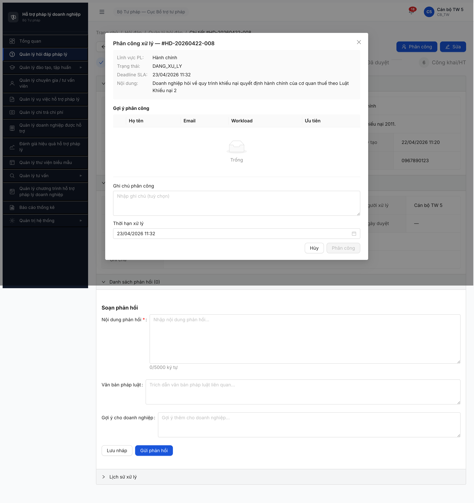
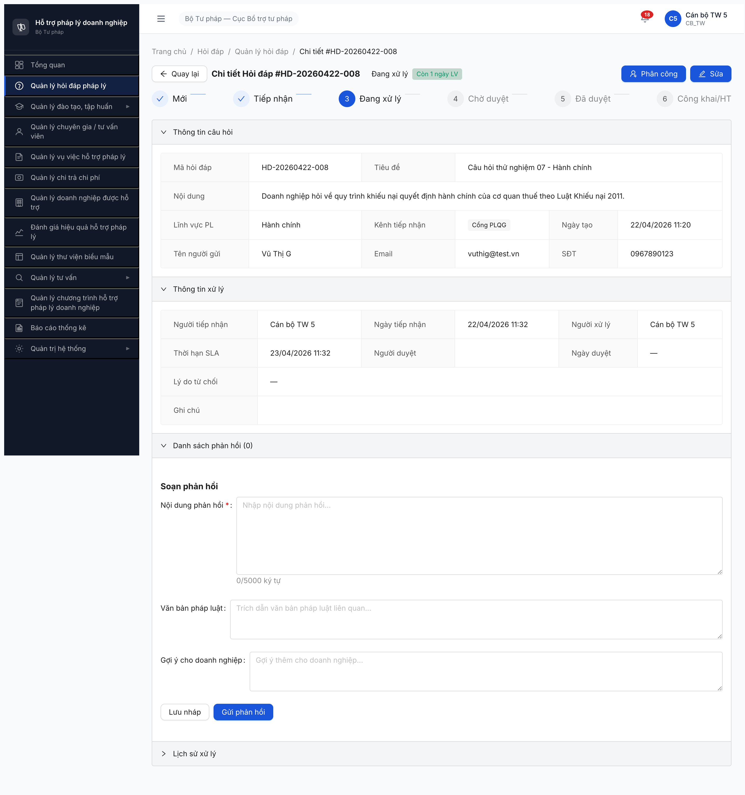
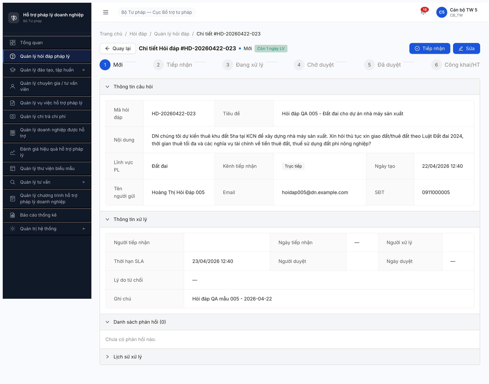
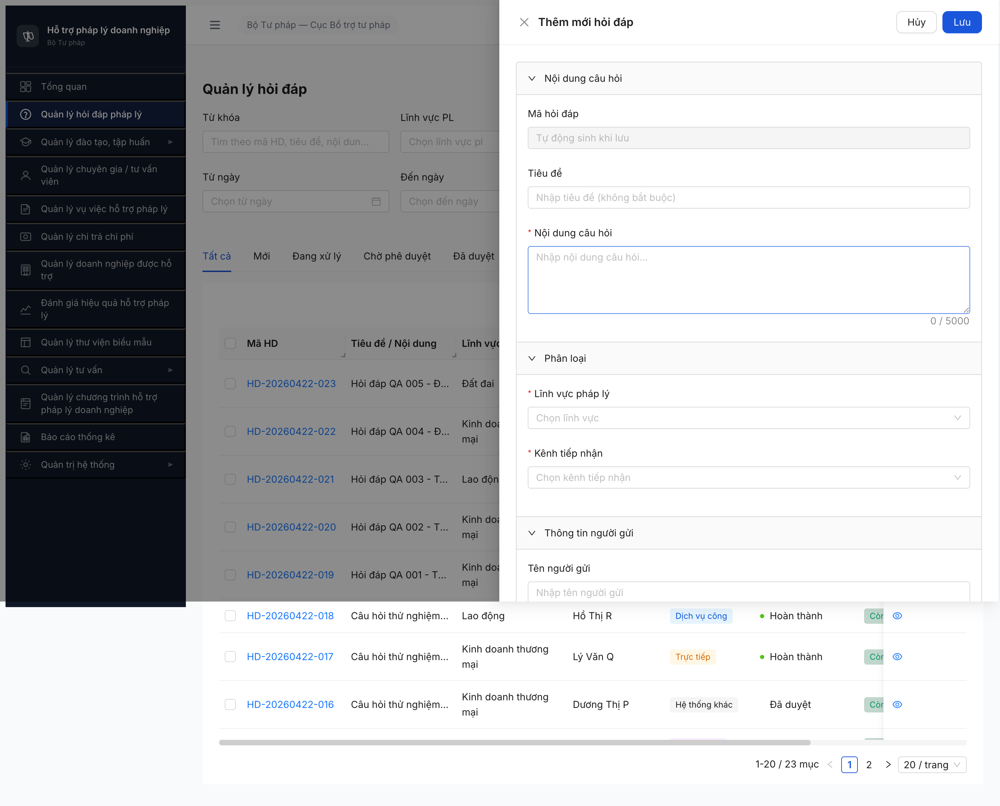
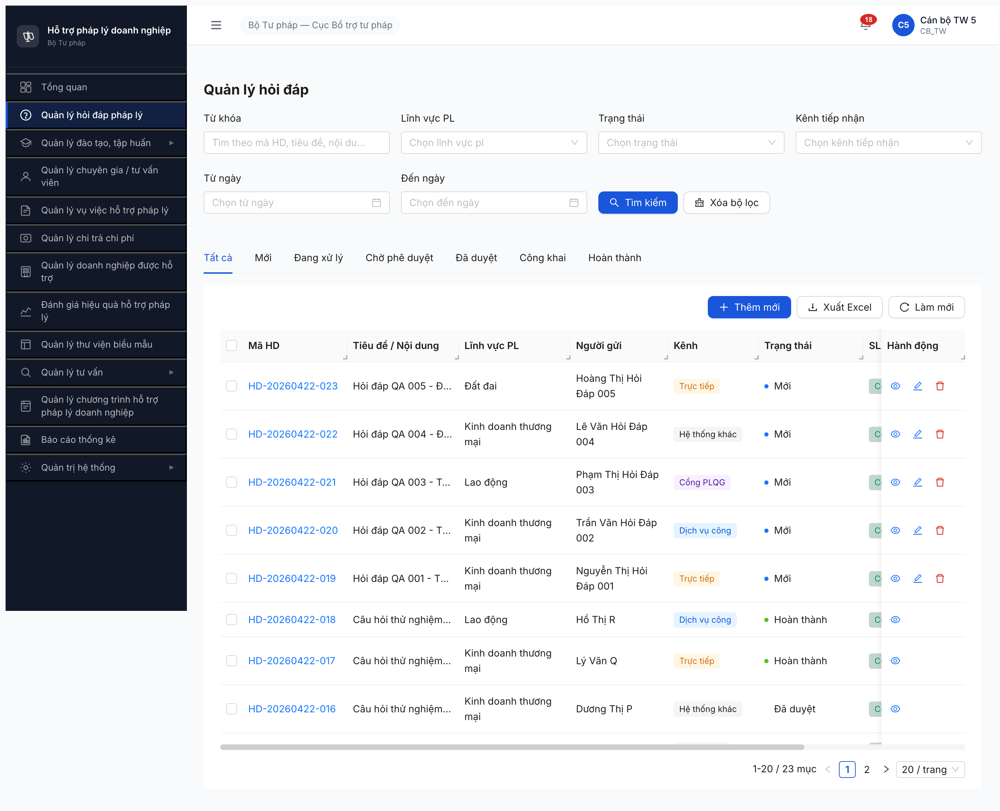

# Bug Report — Quản lý Hỏi đáp Pháp lý (UI)

| Thông tin | Giá trị |
|-----------|---------|
| **Dự án** | Phần mềm Hỗ trợ Pháp lý Doanh nghiệp (PM HTPLDN) |
| **Phiên bản** | 1.0 |
| **Môi trường** | http://103.172.236.130:3000/ |
| **Người test** | QA Automation (Claude Code + Chrome DevTools MCP) |
| **Ngày** | 14:55:00 [2026-04-22] |
| **Loại test** | UI Audit — so sánh UI vs SRS (thiếu/thừa/sai tên/sai loại/sai hành vi) |
| **Round** | Round 1 |
| **Tài liệu tham chiếu** | SRS v3.0 Nhóm II — Quản lý Hỏi đáp, Vướng mắc Pháp lý (SCR-II-01/02/03, FR-II-01..10, FR-II-NEW-01/02, FR-II-CROSS-01) |

---

## Tổng hợp

Phát hiện **15** lỗi UI trong quá trình đối chiếu 3 màn hình chính của module Hỏi đáp pháp lý (SCR-II-01 Danh sách + Form Thêm/Sửa, SCR-II-02 Chi tiết & Soạn phản hồi, SCR-II-03 Modal Phân công) với SRS v3.0 sử dụng tài khoản `canbo_tw_5` (vai trò CB_TW).

| Tổng | Critical | Major | Medium | Minor | Trivial |
|------|----------|-------|--------|-------|---------|
| 15   | 1        | 7     | 4      | 3     | 0       |

Verdict tổng: **FAIL** — Thiếu nhiều thành phần cốt lõi của workflow xử lý hỏi đáp (dropdown chèn mẫu phản hồi, file đính kèm phản hồi, checkbox "Đã trả lời", dropdown chọn người xử lý trong modal phân công, 7/10 action button chuyển trạng thái). Workflow SM-HOIDAP 9 trạng thái hiện **không thể thao tác đầy đủ** từ UI.

## Bug Summary Table

| Bug ID | Severity | Priority | Type | Module | TC Ref | Title | Status |
|--------|----------|----------|------|--------|--------|-------|--------|
| BUG-HOIDAP-UI-001 | Critical | P0 | UI/UX | SCR-II-03 Modal Phân công | — | Modal Phân công thiếu dropdown "Người xử lý *" (trường bắt buộc theo SRS) — không thể phân công khi bảng gợi ý rỗng | Open |
| BUG-HOIDAP-UI-002 | Major | P0 | UI/UX | SCR-II-02 Form Soạn phản hồi | — | Form Soạn phản hồi thiếu 3 thành phần chính: Dropdown chèn mẫu, File đính kèm phản hồi, Checkbox "Đã trả lời" (auto-transition CHO_PHE_DUYET) | Open |
| BUG-HOIDAP-UI-003 | Major | P0 | UI/UX | SCR-II-02 Action bar | — | Thiếu 7/10 action button chuyển trạng thái SM-HOIDAP: [Hủy yêu cầu], [Soạn phản hồi], [Cập nhật thời hạn], [Phê duyệt], [Từ chối], [Công khai], [Hủy công khai], [Đóng hồ sơ] | Open |
| BUG-HOIDAP-UI-004 | Major | P1 | UI/UX | SCR-II-02 Form Soạn phản hồi | — | "Nội dung phản hồi" là `textarea` thường, SRS yêu cầu `rich-text-editor` (WYSIWYG) | Open |
| BUG-HOIDAP-UI-005 | Major | P1 | UI/UX | SCR-II-03 Modal Phân công — bảng gợi ý | — | Bảng gợi ý phân công thiếu 3 cột (Radio chọn, Đơn vị, Lĩnh vực chuyên môn) + thừa cột Email — không match workflow chọn CB/TVV theo lĩnh vực | Open |
| BUG-HOIDAP-UI-006 | Major | P1 | UI/UX | SCR-II-01 Form Thêm/Sửa | — | Form có 2 field THỪA ngoài SRS: "Tiêu đề" và "Ghi chú (2000 ký tự)" | Open |
| BUG-HOIDAP-UI-007 | Major | P1 | UI/UX | SCR-II-01 Form Thêm/Sửa — File đính kèm | — | File đính kèm chấp nhận `.jpg, .png` (SRS quy định chỉ `doc/docx/xls/xlsx/pdf`) | Open |
| BUG-HOIDAP-UI-008 | Major | P1 | UI/UX | SCR-II-01 Table danh sách | — | Thiếu cột "Hạn xử lý" (dd/mm/yyyy) riêng biệt — UI gộp với badge SLA thành 1 cột "SLA / Thời hạn" | Open |
| BUG-HOIDAP-UI-009 | Medium | P2 | UI/UX | SCR-II-03 Modal Phân công | — | Trường "Trạng thái" hiển thị raw enum code `DANG_XU_LY` thay vì label tiếng Việt "Đang xử lý" | Open |
| BUG-HOIDAP-UI-010 | Medium | P2 | UI/UX | SCR-II-01 Tabs | — | Tabs "Mới" và "Chờ phê duyệt" không có badge đỏ đếm số yêu cầu mới trong 24h / số chờ duyệt | Open |
| BUG-HOIDAP-UI-011 | Medium | P2 | UI/UX | SCR-II-01 Batch action bar | — | Batch action bar không hiển thị các nút [Xóa hàng loạt] / [Phê duyệt hàng loạt] / [Công khai hàng loạt] và label "Đã chọn N bản ghi" | Open |
| BUG-HOIDAP-UI-012 | Medium | P2 | UI/UX | SCR-II-02 Accordion Thông tin xử lý | — | Thiếu trường "Người/Ngày từ chối" và "Thời gian hủy" trong Common Approval Fields | Open |
| BUG-HOIDAP-UI-013 | Minor | P3 | UI/UX | SCR-II-01 Table | — | Sai tên cột: "Tiêu đề / Nội dung" (SRS: "Nội dung"), "Kênh" (SRS: "Kênh tiếp nhận"), "SLA / Thời hạn" (SRS: "Thời hạn") | Open |
| BUG-HOIDAP-UI-014 | Minor | P3 | UI/UX | SCR-II-02 Accordion Thông tin câu hỏi | — | Thiếu hiển thị "File đính kèm" và "Doanh nghiệp" trong phần chi tiết (có trong form Thêm mới) | Open |
| BUG-HOIDAP-UI-015 | Minor | P4 | UI/UX | SCR-II-01 | — | Thiếu breadcrumb "Trang chủ > Hỏi đáp > Quản lý hỏi đáp" ở trang danh sách (SCR-II-02 có breadcrumb nhưng SCR-II-01 thì không) | Open |

> **Chú thích Type:** UI/UX — giao diện, hiển thị, tương tác (toàn bộ bug round này đều thuộc nhóm UI)

> **Chú thích Severity:**
> - `Critical` — feature không dùng được (không thể phân công — blocker workflow)
> - `Major` — tính năng quan trọng lỗi nhưng có workaround hoặc chặn partial
> - `Medium` — tính năng phụ lỗi, không block nghiệp vụ chính
> - `Minor` — lỗi nhỏ, sai tên/thiếu cosmetic

---

## BUG-HOIDAP-UI-001 — Modal Phân công thiếu dropdown "Người xử lý *" bắt buộc

| Trường | Chi tiết |
|--------|----------|
| **Bug ID** | BUG-HOIDAP-UI-001 |
| **Severity** | Critical |
| **Priority** | P0 |
| **Type** | UI/UX |
| **Status** | Open |
| **Module** | Hỏi đáp pháp lý — SCR-II-03 Modal Phân công |
| **Thành phần** | Component Modal Phân công xử lý |
| **URL** | http://103.172.236.130:3000/hoi-dap/{id} → mở Modal từ nút [Phân công] |
| **Trình duyệt** | Chromium via Chrome DevTools MCP |
| **Tài khoản** | canbo_tw_5 (CB_TW cấp TW) |
| **TC Reference** | — (UI audit) |
| **SRS Reference** | FR-II-06, FR-II-NEW-01, SCR-II-03 thành phần #7 "Dropdown Nguoi xu ly *" |
| **Assignee** | FE Team |
| **Found by** | QA Automation via Chrome DevTools MCP |

### Mô tả

Modal Phân công xử lý (mở từ SCR-II-02 trạng thái `TIEP_NHAN`/`DANG_XU_LY`) thiếu hoàn toàn dropdown `select (searchable)` cho trường bắt buộc "Người xử lý". SRS quy định đây là field bắt buộc (FK `TAI_KHOAN`, validate `trang_thai = HOAT_DONG`). Khi bảng gợi ý phân công rỗng (như test case lĩnh vực "Hành chính" không có CB/TVV match) thì **không còn cách nào chọn người xử lý** → Nút [Phân công] disabled vĩnh viễn → **không thể thực hiện phân công**.

### Các bước tái hiện

1. Đăng nhập `canbo_tw_5 / Test@1234`, OTP `666666`.
2. Sidebar → "Quản lý hỏi đáp pháp lý".
3. Click vào record `HD-20260422-008` (trạng thái "Đang xử lý", lĩnh vực "Hành chính").
4. Click nút [Phân công] (góc phải toolbar).
5. Modal mở ra.
6. Quan sát: Modal chỉ có 4 vùng — Thông tin tóm tắt / Bảng gợi ý phân công (rỗng) / Ghi chú phân công / Thời hạn xử lý.

### Kết quả mong đợi

Theo SRS SCR-II-03 thành phần #7:

> Dropdown `Nguoi xu ly *` — `select (searchable)`. Bắt buộc. nguoi_xu_ly_id FK TAI_KHOAN. Tìm theo tên. Auto-fill nếu đã chọn từ bảng gợi ý. Validation: trang_thai = HOAT_DONG.

Phải có dropdown Người xử lý riêng biệt, có thể tìm kiếm trong toàn bộ tài khoản HOAT_DONG (không chỉ những người match lĩnh vực).

### Kết quả thực tế

- Không có dropdown Người xử lý.
- Bảng gợi ý lĩnh vực "Hành chính" trả về rỗng ("Trống").
- Nút [Phân công] disabled (không thể click).
- User **không có cách nào** hoàn tất thao tác phân công cho câu hỏi lĩnh vực này.

### Bằng chứng

Snapshot modal (script query từ DOM):
```json
{
  "tableHeaders": ["", "Họ tên", "Email", "Workload", "Ưu tiên"],
  "inputs": [
    {"type":"textarea","placeholder":"Nhập ghi chú (tuỳ chọn)"},
    {"type":"text","placeholder":"Chọn thời hạn (tuỳ chọn)"}
  ],
  "buttons": ["Close","Hủy","Phân công"]
}
```

→ Chỉ có 2 input (textarea + date) — thiếu hoàn toàn dropdown Người xử lý.



### Tác động (Impact)

- **Workflow chặn hoàn toàn** đối với câu hỏi thuộc lĩnh vực mà bảng gợi ý không có data (vd: Hành chính, Hình sự).
- CB_NV không thể phân công → câu hỏi kẹt ở trạng thái `TIEP_NHAN` hoặc `DANG_XU_LY` → SLA quá hạn.
- 100% câu hỏi "mồ côi" lĩnh vực không được xử lý.

### Nguyên nhân nghi ngờ (Root Cause)

FE triển khai modal chỉ đọc từ bảng gợi ý (`GET /cau-hinh-phan-cong?linh_vuc_id=X`) và map thành table, **bỏ qua** yêu cầu dropdown độc lập. Khi dữ liệu gợi ý rỗng (không có CB_V_TVV nào match lĩnh vực), modal không có fallback.

### Gợi ý sửa (Suggested Fix)

1. Thêm dropdown `<Select showSearch>` với data source là toàn bộ `TAI_KHOAN WHERE trang_thai='HOAT_DONG'` (API `/tai-khoan?trang_thai=HOAT_DONG`).
2. Khi user click radio trong bảng gợi ý → auto-fill vào dropdown (behavior "Auto-fill nếu đã chọn từ bảng gợi ý" theo SRS).
3. Validate: nếu không có dropdown value → nút [Phân công] disabled (giữ).

---

## BUG-HOIDAP-UI-002 — Form Soạn phản hồi thiếu 3 thành phần chính

| Trường | Chi tiết |
|--------|----------|
| **Bug ID** | BUG-HOIDAP-UI-002 |
| **Severity** | Major |
| **Priority** | P0 |
| **Type** | UI/UX |
| **Status** | Open |
| **Module** | Hỏi đáp pháp lý — SCR-II-02 Chi tiết & Soạn phản hồi |
| **Thành phần** | Section "Soạn phản hồi" trên trang chi tiết |
| **URL** | http://103.172.236.130:3000/hoi-dap/{id} (record trạng thái DANG_XU_LY) |
| **Trình duyệt** | Chromium via Chrome DevTools MCP |
| **Tài khoản** | canbo_tw_5 |
| **TC Reference** | — |
| **SRS Reference** | SCR-II-02 thành phần #19 "Dropdown chen mau", #23 "File dinh kem phan hoi", #24 "Checkbox Da tra loi"; BR-FLOW-01 auto-transition DA_TRA_LOI → CHO_PHE_DUYET |
| **Assignee** | FE Team |
| **Found by** | QA Automation |

### Mô tả

Form "Soạn phản hồi" trên SCR-II-02 thiếu 3 thành phần bắt buộc theo SRS:

1. **Dropdown chèn mẫu** (`select searchable`) — chọn mẫu từ `MAU_PHAN_HOI` theo `linh_vuc_id`, prefill `noi_dung_mau` vào editor.
2. **File đính kèm phản hồi** (`file-upload`) — max 20MB/file, format doc/docx/xls/xlsx/pdf.
3. **Checkbox "Đã trả lời"** — tick → auto-transition `DA_TRA_LOI → CHO_PHE_DUYET` (BR-FLOW-01). Có cảnh báo trước khi tick.

### Các bước tái hiện

1. Login `canbo_tw_5`, OTP.
2. Vào danh sách Hỏi đáp → click record `HD-20260422-008` (Đang xử lý).
3. Scroll xuống section "Soạn phản hồi".
4. Quan sát.

### Kết quả mong đợi

Section phải có đủ 7 thành phần:
1. Dropdown chèn mẫu phản hồi (searchable)
2. Nội dung phản hồi * (rich-text-editor)
3. Văn bản pháp luật (textarea)
4. Gợi ý cho DN (textarea)
5. File đính kèm phản hồi (upload)
6. Checkbox "Đã trả lời"
7. Nút [Lưu nháp] / [Gửi phản hồi]

### Kết quả thực tế

UI chỉ có 5 thành phần:
1. ~~Dropdown chèn mẫu~~ ❌ THIẾU
2. Nội dung phản hồi * (là textarea thường, không phải rich-text — xem BUG-HOIDAP-UI-004)
3. Văn bản pháp luật ✓
4. Gợi ý cho doanh nghiệp ✓
5. ~~File đính kèm phản hồi~~ ❌ THIẾU
6. ~~Checkbox "Đã trả lời"~~ ❌ THIẾU
7. [Lưu nháp] / [Gửi phản hồi] ✓

### Bằng chứng



### Tác động (Impact)

- **Dropdown chèn mẫu:** CB_NV phải soạn từ đầu mỗi phản hồi → tăng thời gian xử lý, giảm tính nhất quán. Module "Mẫu phản hồi" (MAU_PHAN_HOI) trở nên vô dụng.
- **File đính kèm:** Không thể đính kèm văn bản pháp luật/tài liệu hỗ trợ → chất lượng phản hồi giảm.
- **Checkbox "Đã trả lời":** Không có cơ chế auto-transition → CB_NV không thể tự kết thúc pha soạn, bắt buộc dùng nút [Gửi phản hồi] gộp (logic BR-FLOW-01 không có UI trigger).

### Nguyên nhân nghi ngờ (Root Cause)

FE triển khai form simplified version, bỏ qua 3 thành phần phức tạp hơn (dropdown dynamic data, upload ClamAV scan, auto-transition checkbox).

### Gợi ý sửa (Suggested Fix)

Thêm 3 thành phần theo spec SCR-II-02 #19, #23, #24. Tham khảo UI "File đính kèm" đã làm ở form Thêm mới (SCR-II-01) — reuse component.

---

## BUG-HOIDAP-UI-003 — Thiếu 7/10 action button chuyển trạng thái SM-HOIDAP

| Trường | Chi tiết |
|--------|----------|
| **Bug ID** | BUG-HOIDAP-UI-003 |
| **Severity** | Major |
| **Priority** | P0 |
| **Type** | UI/UX |
| **Status** | Open |
| **Module** | Hỏi đáp pháp lý — SCR-II-02 Action bar |
| **Thành phần** | Thanh hành động cố định trên trang chi tiết |
| **URL** | http://103.172.236.130:3000/hoi-dap/{id} |
| **Trình duyệt** | Chromium via Chrome DevTools MCP |
| **Tài khoản** | canbo_tw_5 |
| **TC Reference** | — |
| **SRS Reference** | SCR-II-02 thành phần #9..#18 (10 action buttons); SM-HOIDAP 9 trạng thái |
| **Assignee** | FE Team |
| **Found by** | QA Automation |

### Mô tả

SRS SCR-II-02 quy định 10 action button hiển thị theo context của `trang_thai`. UI hiện chỉ implement 3 button: `[Tiếp nhận]`, `[Phân công]`, `[Sửa]`. Thiếu 7 button quan trọng của workflow.

### So sánh

| SRS thành phần | SRS trigger trạng thái | UI có? | Ghi chú |
|---|---|---|---|
| #9 `[Tiếp nhận]` | MOI | ✅ | OK |
| #10 `[Phân công]` | TIEP_NHAN, DANG_XU_LY | ✅ | OK |
| #11 `[Soạn phản hồi]` (scroll to form) | DANG_XU_LY | ❌ | THIẾU — user phải tự scroll |
| #12 `[Hủy yêu cầu]` (danger) | MOI (chưa có PHAN_HOI con) | ❌ | THIẾU — không thể hủy yêu cầu rác |
| #13 `[Cập nhật thời hạn]` | TIEP_NHAN, DANG_XU_LY | ❌ | THIẾU — không thể gia hạn SLA |
| #14 `[Phê duyệt]` (success) | CHO_PHE_DUYET + quyền CB PD | ❌ | THIẾU — CB PD không duyệt được |
| #15 `[Từ chối]` (danger, lý do ≥10 ký tự) | CHO_PHE_DUYET + CB PD | ❌ | THIẾU — không thể từ chối |
| #16 `[Công khai]` (primary, gọi API Cổng PLQG) | DA_DUYET | ❌ | THIẾU — không đẩy được lên Cổng |
| #17 `[Hủy công khai]` (warning) | CONG_KHAI | ❌ | THIẾU |
| #18 `[Đóng hồ sơ]` | DA_DUYET, CONG_KHAI | ❌ | THIẾU |
| (non-SRS) `[Sửa]` | MOI, DANG_XU_LY | ⚠️ THỪA | Không có trong SRS (đã có từ list) |

### Các bước tái hiện

1. Login `canbo_tw_5`. Vào danh sách Hỏi đáp.
2. Click record trạng thái `MOI` (vd `HD-20260422-023`) → Action bar chỉ có `[Tiếp nhận]` + `[Sửa]`. Không có `[Hủy yêu cầu]`.
3. Click record trạng thái `DANG_XU_LY` (vd `HD-20260422-008`) → Action bar chỉ có `[Phân công]` + `[Sửa]`. Không có `[Soạn phản hồi]`, `[Cập nhật thời hạn]`.
4. Click record trạng thái `Chờ phê duyệt` (vd `HD-20260422-011`) → action bar không có `[Phê duyệt]`, `[Từ chối]`.
5. Click record trạng thái `Đã duyệt` (vd `HD-20260422-016`) → không có `[Công khai]`, `[Đóng hồ sơ]`.

### Kết quả mong đợi

Mỗi trạng thái hiển thị đúng tập action button theo bảng SRS SCR-II-02.

### Kết quả thực tế

Chỉ 2/10 state-transition button tồn tại. 7 workflow step (hủy, gia hạn SLA, duyệt, từ chối, công khai, hủy CK, đóng HS) không có UI entry point.

### Bằng chứng

- Screenshot chi tiết trạng thái "Mới": `image/03-scr-ii-02-detail-moi.png` — chỉ có [Tiếp nhận] + [Sửa].
- Screenshot chi tiết trạng thái "Đang xử lý": `image/04-scr-ii-02-detail-dangxuly.png` — chỉ có [Phân công] + [Sửa].



### Tác động (Impact)

- CB_PD **không thể phê duyệt / từ chối** phản hồi → toàn bộ tab "Chờ phê duyệt" kẹt cứng.
- CB_NV **không thể hủy** yêu cầu rác → spam tích lũy.
- CB_NV **không thể công khai** phản hồi lên Cổng PLQG → FR-II-08 broken.
- Module **không thể hoàn thành workflow end-to-end** dù đã có màn danh sách + chi tiết.

### Nguyên nhân nghi ngờ (Root Cause)

FE triển khai pha 1 (MOI/DANG_XU_LY) nhưng chưa phát triển pha phê duyệt/công khai. Có thể do thiếu backend API hoặc thiếu phân quyền CB_PD/QTHT cho endpoints tương ứng.

### Gợi ý sửa (Suggested Fix)

Triển khai đủ 10 button theo spec + ẩn/hiện theo `(trang_thai, user_role)`:
```ts
const visibleActions = useMemo(() => {
  const actions = [];
  if (trangThai === 'MOI') actions.push('tiep_nhan', 'huy_yeu_cau');
  if (['TIEP_NHAN','DANG_XU_LY'].includes(trangThai)) actions.push('phan_cong', 'cap_nhat_thoi_han');
  if (trangThai === 'DANG_XU_LY') actions.push('soan_phan_hoi');
  if (trangThai === 'CHO_PHE_DUYET' && userRole.includes('CB_PD')) actions.push('phe_duyet','tu_choi');
  if (trangThai === 'DA_DUYET') actions.push('cong_khai','dong_ho_so');
  if (trangThai === 'CONG_KHAI') actions.push('huy_cong_khai','dong_ho_so');
  return actions;
}, [trangThai, userRole]);
```

---

## BUG-HOIDAP-UI-004 — "Nội dung phản hồi" sai loại input (textarea thay vì rich-text-editor)

| Trường | Chi tiết |
|--------|----------|
| **Bug ID** | BUG-HOIDAP-UI-004 |
| **Severity** | Major |
| **Priority** | P1 |
| **Type** | UI/UX |
| **Status** | Open |
| **Module** | SCR-II-02 Form Soạn phản hồi |
| **URL** | http://103.172.236.130:3000/hoi-dap/{id} (DANG_XU_LY) |
| **TC Reference** | — |
| **SRS Reference** | SCR-II-02 thành phần #20 "Noi dung phan hoi *" — `rich-text-editor` |
| **Assignee** | FE Team |

### Mô tả

SRS quy định "Nội dung phản hồi *" là `rich-text-editor` (WYSIWYG, max 5000 ký tự). UI hiện triển khai là `<textarea>` thường, không hỗ trợ định dạng đậm/nghiêng/link/list/trích dẫn — ảnh hưởng chất lượng phản hồi gửi cho doanh nghiệp.

### Các bước tái hiện

1. Login `canbo_tw_5`.
2. Vào record DANG_XU_LY → scroll tới "Soạn phản hồi".
3. Quan sát input "Nội dung phản hồi".

### Kết quả mong đợi

Rich text editor (vd: `@ant-design/pro-editor`, `react-quill`, `tiptap`) với toolbar: Bold / Italic / Underline / H1-H3 / OL/UL / Link / Quote / Code.

### Kết quả thực tế

Textarea đơn thuần, placeholder "Nhập nội dung phản hồi...", counter "0/5000 ký tự".

### Bằng chứng

DOM inspect: `<textarea placeholder="Nhập nội dung phản hồi..." maxlength="5000">` — không có toolbar, không có `contenteditable`.


### Tác động (Impact)

- Phản hồi gửi cho DN là plain text → khó đọc với văn bản pháp lý (thường có trích dẫn điều luật, đoạn highlight).
- Export sang email/PDF mất định dạng.

### Gợi ý sửa (Suggested Fix)

Thay `<textarea>` bằng rich text editor component (giữ `maxLength=5000` tính theo raw text, không đếm HTML tags).

---

## BUG-HOIDAP-UI-005 — Modal Phân công: bảng gợi ý thiếu cột chính + thừa cột Email

| Trường | Chi tiết |
|--------|----------|
| **Bug ID** | BUG-HOIDAP-UI-005 |
| **Severity** | Major |
| **Priority** | P1 |
| **Type** | UI/UX |
| **Status** | Open |
| **Module** | SCR-II-03 Modal Phân công |
| **URL** | http://103.172.236.130:3000/hoi-dap/{id} → [Phân công] |
| **TC Reference** | — |
| **SRS Reference** | SCR-II-03 thành phần #4 "Bang goi y phan cong" |
| **Assignee** | FE Team |

### Mô tả

Bảng gợi ý phân công trong modal hiển thị cột không đúng SRS.

### So sánh cột

| SRS | UI | Ghi chú |
|---|---|---|
| Radio chọn | ❌ không có | Thiếu — không có cách click chọn row |
| Họ tên | ✅ | OK |
| Đơn vị | ❌ không có | Thiếu — CB_TW cần biết người thuộc đơn vị nào |
| Lĩnh vực chuyên môn | ❌ không có | Thiếu — bảng lọc theo lĩnh vực nhưng không hiển thị cột để verify |
| Workload | ✅ | OK |
| Mức ưu tiên | ✅ ("Ưu tiên") | OK |
| — | ⚠️ Email (thừa) | SRS không có |

### Các bước tái hiện

1. Login `canbo_tw_5` → vào record DANG_XU_LY → click [Phân công].
2. Quan sát header bảng gợi ý.

### Bằng chứng

DOM query:
```json
"tableHeaders": ["", "Họ tên", "Email", "Workload", "Ưu tiên"]
```


### Tác động (Impact)

- CB_TW cấp trên không biết CB/TVV thuộc đơn vị/cấp nào → khó chọn đúng người theo quy tắc phân công.
- Thiếu radio chọn → phải click đâu đó để trigger auto-fill dropdown (hiện dropdown cũng không có — xem UI-001).
- Thừa cột Email chiếm không gian nhưng ít giá trị nghiệp vụ.

### Gợi ý sửa (Suggested Fix)

- Thêm cột Radio đầu tiên (`<Radio>` trong table row).
- Thêm cột "Đơn vị" (hiển thị `DON_VI.ten_don_vi`).
- Thêm cột "Lĩnh vực chuyên môn" (list các lĩnh vực của CB/TVV).
- Xóa cột Email (hoặc move xuống tooltip khi hover tên).

---

## BUG-HOIDAP-UI-006 — Form Thêm/Sửa có 2 field THỪA ngoài SRS

| Trường | Chi tiết |
|--------|----------|
| **Bug ID** | BUG-HOIDAP-UI-006 |
| **Severity** | Major |
| **Priority** | P1 |
| **Type** | UI/UX |
| **Status** | Open |
| **Module** | SCR-II-01 Form Thêm mới / Sửa (Drawer) |
| **URL** | http://103.172.236.130:3000/hoi-dap → [+ Thêm mới] |
| **TC Reference** | — |
| **SRS Reference** | SCR-II-01 thành phần #37..#47 (11 field) |
| **Assignee** | BE Team + FE Team |

### Mô tả

Form Thêm mới hỏi đáp có 2 field **KHÔNG có trong SRS**:

1. **Tiêu đề** (text input, optional, không required) — SRS form chỉ quy định "Nội dung câu hỏi *" (textarea), không tách rời "Tiêu đề". Field này cũng hiển thị ở accordion "Thông tin câu hỏi" trong SCR-II-02 và ở cột "Tiêu đề / Nội dung" trong bảng danh sách.
2. **Ghi chú** (textarea, max 2000 ký tự) — SRS form và SCR-II-02 không có field này, nhưng có trong "Thông tin xử lý" chi tiết.

### Các bước tái hiện

1. Vào danh sách Hỏi đáp → click [+ Thêm mới].
2. Quan sát drawer.

### Kết quả mong đợi

Form có đúng 11 thành phần theo SRS SCR-II-01:

| # | Field | Type | Required |
|---|-------|------|----------|
| 37 | Mã hỏi đáp | text readonly | — |
| 38 | Nội dung câu hỏi | textarea, max 5000 | * |
| 39 | Lĩnh vực PL | select searchable | * |
| 40 | Tên người gửi | text | — |
| 41 | Email người gửi | text email | — |
| 42 | SĐT người gửi | text 10-11 số | — |
| 43 | Doanh nghiệp | select searchable | — |
| 44 | Kênh tiếp nhận | select | * |
| 45 | File đính kèm | file upload | — |
| 46 | [Hủy] | button | — |
| 47 | [Lưu] | button | — |

### Kết quả thực tế

UI form có 13 field, bao gồm **Tiêu đề** và **Ghi chú** thêm ngoài SRS:

```json
"labels": ["Mã hỏi đáp","Tiêu đề","Nội dung câu hỏi","Lĩnh vực pháp lý","Kênh tiếp nhận","Tên người gửi","Email người gửi","Số điện thoại người gửi","File đính kèm","Ghi chú"],
"required": ["Nội dung câu hỏi","Lĩnh vực pháp lý","Kênh tiếp nhận"]
```

### Bằng chứng



### Tác động (Impact)

- Nếu BE không có cột `tieu_de` / `ghi_chu` trong table `HOI_DAP` → INSERT fail hoặc data mất.
- Nếu BE có nhưng SRS chưa update → spec drift, reviewer không confirm được đúng/sai.
- Người gửi qua DVC/Cổng PLQG không có "Tiêu đề" → UI sẽ hiển thị thế nào? (Hiện tại UI table dùng fallback hiển thị "Tiêu đề / Nội dung".)

### Gợi ý sửa (Suggested Fix)

Option A (theo SRS): Xóa 2 field "Tiêu đề" và "Ghi chú" khỏi form.
Option B (update SRS): Nếu BE thật sự cần 2 field này → request PO update SRS thêm 2 thành phần; giữ UI nhưng thêm `maxlength` hợp lý + cập nhật SCR-II-02 accordion để hiển thị.

---

## BUG-HOIDAP-UI-007 — File đính kèm sai format (chấp nhận .jpg .png)

| Trường | Chi tiết |
|--------|----------|
| **Bug ID** | BUG-HOIDAP-UI-007 |
| **Severity** | Major |
| **Priority** | P1 |
| **Type** | UI/UX |
| **Status** | Open |
| **Module** | SCR-II-01 Form Thêm mới — File đính kèm |
| **URL** | http://103.172.236.130:3000/hoi-dap → [+ Thêm mới] |
| **TC Reference** | — |
| **SRS Reference** | SCR-II-01 thành phần #45 "File dinh kem — Max 20MB/file. doc/docx/xls/xlsx/pdf" |
| **Assignee** | FE Team |

### Mô tả

SRS giới hạn file đính kèm chỉ chấp nhận `doc, docx, xls, xlsx, pdf`. UI hiện mở rộng thêm `.jpg, .png`.

### Các bước tái hiện

1. [+ Thêm mới] → quan sát label "File đính kèm".
2. Click vào vùng upload hoặc inspect `<input type="file">`.

### Kết quả mong đợi

```html
<input type="file" accept=".doc,.docx,.xls,.xlsx,.pdf" multiple>
```

### Kết quả thực tế

DOM query:
```json
"uploadAccept": [{ "accept": ".doc,.docx,.xls,.xlsx,.pdf,.jpg,.png", "multiple": true }]
```

UI text: "Tối đa 10 tệp. Định dạng: .doc, .docx, .xls, .xlsx, .pdf, **.jpg, .png**."

### Bằng chứng


### Tác động (Impact)

- Người dùng upload ảnh chụp màn hình → BE có thể reject hoặc lưu → inconsistency spec.
- Security: nếu BE cho phép ảnh, cần đảm bảo ClamAV scan cả ảnh (metadata có thể chứa malware).
- SRS drift — tester/reviewer không biết rule nào đúng.

### Gợi ý sửa (Suggested Fix)

Option A (theo SRS): Sửa `accept` chỉ còn `.doc,.docx,.xls,.xlsx,.pdf`. Cập nhật label.
Option B (update SRS): Request PO thêm jpg/png vào spec nếu nghiệp vụ yêu cầu.

Ngoài ra SRS không quy định limit 10 tệp — cần làm rõ với PO.

---

## BUG-HOIDAP-UI-008 — Table danh sách thiếu cột "Hạn xử lý"

| Trường | Chi tiết |
|--------|----------|
| **Bug ID** | BUG-HOIDAP-UI-008 |
| **Severity** | Major |
| **Priority** | P1 |
| **Type** | UI/UX |
| **Status** | Open |
| **Module** | SCR-II-01 Table danh sách |
| **URL** | http://103.172.236.130:3000/hoi-dap |
| **TC Reference** | — |
| **SRS Reference** | SCR-II-01 thành phần #26 "Thoi han" (badge SLA) + #28 "Han xu ly" (dd/mm/yyyy) — **2 cột riêng** |
| **Assignee** | FE Team |

### Mô tả

SRS tách riêng 2 cột:
- #26 **"Thời hạn"** — badge 4 mức SLA (BINH_THUONG / SAP_HET_HAN / QUA_HAN / QUA_HAN_NGHIEM_TRONG).
- #28 **"Hạn xử lý"** — giá trị datetime `dd/mm/yyyy`, hiển thị "—" nếu NULL.

UI gộp thành 1 cột "SLA / Thời hạn" chỉ hiển thị text "Còn N ngày LV" — **mất thông tin datetime cụ thể** và không có 4 mức badge màu riêng biệt.

### Các bước tái hiện

1. Vào danh sách Hỏi đáp.
2. Quan sát header bảng và dữ liệu cột SLA.

### Kết quả mong đợi

Bảng có cả 2 cột: "Thời hạn" (badge) + "Hạn xử lý" (dd/mm/yyyy).

### Kết quả thực tế

```
"columns": ["","Mã HD","Tiêu đề / Nội dung","Lĩnh vực PL","Người gửi","Kênh","Trạng thái","SLA / Thời hạn","Ngày tạo","Hành động"]
```

Chỉ 1 cột "SLA / Thời hạn" hiển thị "Còn 1 ngày LV" (cho 23 record đều giống nhau — verify được badge chưa?).

### Bằng chứng



### Tác động (Impact)

- QA/manager không nhìn được đúng datetime hạn → khó ước lượng SLA tuyệt đối (chỉ relative "còn N ngày").
- Không phân biệt được 4 mức cảnh báo (SRS quy định màu khác nhau cho SAP_HET_HAN / QUA_HAN / QUA_HAN_NGHIEM_TRONG).

### Gợi ý sửa (Suggested Fix)

Tách thành 2 column:
- "Thời hạn": `<Badge>` với màu (xanh = bình thường, vàng = sắp hết hạn <2 ngày, cam = quá hạn, đỏ = quá hạn nghiêm trọng).
- "Hạn xử lý": `format(han_xu_ly, 'dd/MM/yyyy')` hoặc "—" nếu NULL.

---

## BUG-HOIDAP-UI-009 — Modal Phân công hiển thị raw enum `DANG_XU_LY`

| Trường | Chi tiết |
|--------|----------|
| **Bug ID** | BUG-HOIDAP-UI-009 |
| **Severity** | Medium |
| **Priority** | P2 |
| **Type** | UI/UX |
| **Status** | Open |
| **Module** | SCR-II-03 Modal Phân công |
| **URL** | http://103.172.236.130:3000/hoi-dap/{id} → [Phân công] |
| **TC Reference** | — |
| **SRS Reference** | SM-HOIDAP bảng trạng thái (tên tiếng Việt) |
| **Assignee** | FE Team |

### Mô tả

Khối "Thông tin tóm tắt" trong modal phân công hiển thị trường `Trạng thái: DANG_XU_LY` — đây là **raw enum code** của backend thay vì label tiếng Việt "Đang xử lý".

### Các bước tái hiện

1. Record DANG_XU_LY → [Phân công] → quan sát khối summary trên đầu modal.

### Kết quả mong đợi

`Trạng thái: Đang xử lý` (có thể kèm badge màu vàng theo SM-HOIDAP).

### Kết quả thực tế

`Trạng thái: DANG_XU_LY`

### Bằng chứng

Snapshot text: `"StaticText 'Trạng thái'", "StaticText ':'", "StaticText 'DANG_XU_LY'"`.


### Tác động (Impact)

- Confusing cho người dùng cuối không biết tiếng Anh/kỹ thuật.
- Inconsistency: cùng trạng thái, nơi khác hiển thị "Đang xử lý" nhưng ở modal phân công hiển thị code.

### Gợi ý sửa (Suggested Fix)

Dùng helper `mapStatusLabel(code)` hoặc i18n key `status.hoidap.DANG_XU_LY` → "Đang xử lý". Áp dụng `<StatusBadge status={record.trang_thai}/>` component dùng chung.

---

## BUG-HOIDAP-UI-010 — Tabs không có badge đỏ cho "Mới" (24h) và "Chờ phê duyệt"

| Trường | Chi tiết |
|--------|----------|
| **Bug ID** | BUG-HOIDAP-UI-010 |
| **Severity** | Medium |
| **Priority** | P2 |
| **Type** | UI/UX |
| **Status** | Open |
| **Module** | SCR-II-01 Tabs trạng thái |
| **URL** | http://103.172.236.130:3000/hoi-dap |
| **TC Reference** | — |
| **SRS Reference** | SCR-II-01 #6 "Tab Moi — Badge do neu co yeu cau moi trong 24h", #8 "Tab Cho phe duyet — Badge do = so cho duyet" |
| **Assignee** | FE Team |

### Mô tả

SRS quy định 2 tab "Mới" và "Chờ phê duyệt" có badge đỏ dynamic count. UI hiện không có badge nào trên tab — CB_NV/CB_PD không biết nhìn vào đâu để xử lý ưu tiên.

### Các bước tái hiện

1. Vào Quản lý hỏi đáp.
2. Quan sát 7 tab.

### Kết quả mong đợi

```
Tất cả  [Mới 5]  Đang xử lý  [Chờ phê duyệt 3]  Đã duyệt  Công khai  Hoàn thành
```

Trong đó `[Mới 5]`, `[Chờ phê duyệt 3]` là `<Badge dot={false} count={N} color="red">`.

### Kết quả thực tế

Không có badge count trên tab nào (tested với tool DOM query `.ant-badge` — kết quả `hasBadge: false` toàn bộ 7 tab).

### Bằng chứng

Script query:
```json
"tabs": [
  {"text":"Tất cả","hasBadge":false},
  {"text":"Mới","hasBadge":false},
  {"text":"Đang xử lý","hasBadge":false},
  {"text":"Chờ phê duyệt","hasBadge":false},
  ...
]
```


### Tác động (Impact)

- CB_NV không biết có yêu cầu mới trong 24h → response time chậm → vi phạm BR-SLA-01.
- CB_PD không biết tồn có bao nhiêu phản hồi chờ duyệt → backlog tích lũy.

### Gợi ý sửa (Suggested Fix)

API có sẵn `GET /hoi-dap/counts?group_by=trang_thai`. Dùng trong `<Tabs>`:
```tsx
<Tabs.TabPane tab={<Badge count={counts.MOI_24H} offset={[10,0]}>Mới</Badge>} key="moi" />
```

---

## BUG-HOIDAP-UI-011 — Batch action bar không hiển thị các nút bulk action

| Trường | Chi tiết |
|--------|----------|
| **Bug ID** | BUG-HOIDAP-UI-011 |
| **Severity** | Medium |
| **Priority** | P2 |
| **Type** | UI/UX |
| **Status** | Open |
| **Module** | SCR-II-01 Batch action bar |
| **URL** | http://103.172.236.130:3000/hoi-dap |
| **TC Reference** | — |
| **SRS Reference** | SCR-II-01 thành phần #31..#35 (checkbox Chọn tất cả, label "Đã chọn N", Xóa HL, Phê duyệt HL, Công khai HL) |
| **Assignee** | FE Team |

### Mô tả

SRS quy định khi user chọn ≥1 row → thanh batch action bar hiển thị với:
- Label "Đã chọn {N} bản ghi"
- Nút `[Xóa hàng loạt]` (tab Tất cả / Mới / Đang xử lý) — soft delete bản ghi NOT IN (DA_DUYET, CONG_KHAI, HOAN_THANH).
- Nút `[Phê duyệt hàng loạt]` (tab Chờ phê duyệt) — quyền CB_PD, max 100/batch.
- Nút `[Công khai hàng loạt]` (tab Đã duyệt).

UI có checkbox row và `<checkbox "Select all">` header nhưng **không có action bar** xuất hiện khi chọn.

### Các bước tái hiện

1. Vào danh sách Hỏi đáp tab "Tất cả".
2. Tick 2-3 checkbox row.
3. Quan sát: không có action bar nổi xuất hiện.

### Kết quả mong đợi

Floating action bar hoặc sticky footer hiện:
```
[☑] Đã chọn 3 bản ghi    [Xóa hàng loạt]   [Bỏ chọn]
```

### Kết quả thực tế

Không có UI thay đổi khi chọn row. Checkbox dường như là decorative.

### Bằng chứng

A11y snapshot không thấy element batch action bar khi đang ở tab "Tất cả" (chụp lúc tab đang select state).


### Tác động (Impact)

- CB_NV không thể xóa hàng loạt yêu cầu rác.
- CB_PD phải click từng record để duyệt → thao tác duyệt 100 bản ghi mất rất nhiều thời gian → FR-II-08 ineffective.
- CB_NV không thể công khai hàng loạt sau khi duyệt → backlog.

### Gợi ý sửa (Suggested Fix)

Triển khai component `<BatchActionBar>` với slot action phụ thuộc `(tab, userRole)`:
```tsx
{selectedRows.length > 0 && (
  <StickyFooter>
    <span>Đã chọn {selectedRows.length} bản ghi</span>
    {tab === 'cho_pd' && hasRole('CB_PD') && (
      <Button type="primary" onClick={handleBatchApprove}>Phê duyệt hàng loạt</Button>
    )}
    ...
  </StickyFooter>
)}
```

---

## BUG-HOIDAP-UI-012 — Accordion "Thông tin xử lý" thiếu "Người/Ngày từ chối" và "Thời gian hủy"

| Trường | Chi tiết |
|--------|----------|
| **Bug ID** | BUG-HOIDAP-UI-012 |
| **Severity** | Medium |
| **Priority** | P2 |
| **Type** | UI/UX |
| **Status** | Open |
| **Module** | SCR-II-02 Accordion Common Approval Fields |
| **URL** | http://103.172.236.130:3000/hoi-dap/{id} |
| **TC Reference** | — |
| **SRS Reference** | SCR-II-02 thành phần #8 "Khoi Common Approval Fields" |
| **Assignee** | FE Team |

### Mô tả

SRS quy định "Common Approval Fields" gồm: Ngày/người tiếp nhận, Người phân công, Deadline SLA, Người/ngày duyệt, **Người/ngày từ chối**, Lý do từ chối (highlight đỏ), **Thời gian hủy**.

UI hiện có: Người tiếp nhận, Ngày tiếp nhận, Người xử lý, Thời hạn SLA, Người duyệt, Ngày duyệt, Lý do từ chối (không highlight đỏ), Ghi chú (thừa). **Thiếu "Người/Ngày từ chối" và "Thời gian hủy"**.

### Các bước tái hiện

1. Vào chi tiết một record bất kỳ.
2. Mở accordion "Thông tin xử lý".

### Kết quả mong đợi

Các trường: Người tiếp nhận, Ngày tiếp nhận, Người xử lý, Thời hạn SLA, Người duyệt, Ngày duyệt, **Người từ chối**, **Ngày từ chối**, Lý do từ chối (text đỏ nếu có value), **Thời gian hủy**.

### Kết quả thực tế

UI có các trường:
```
Người tiếp nhận: Cán bộ TW 5
Ngày tiếp nhận: 22/04/2026 11:32
Người xử lý: Cán bộ TW 5
Thời hạn SLA: 23/04/2026 11:32
Người duyệt: (trống)
Ngày duyệt: —
Lý do từ chối: —
Ghi chú: (trống)
```

Thiếu 3 field: Người từ chối, Ngày từ chối, Thời gian hủy.

### Bằng chứng


### Tác động (Impact)

- Sau khi CB_PD từ chối → không trace được ai từ chối và khi nào (audit gap).
- Sau khi hủy yêu cầu → không có timestamp hủy hiển thị.
- Lý do từ chối không highlight đỏ → dễ bỏ sót khi review hồ sơ trả về.

### Gợi ý sửa (Suggested Fix)

Bổ sung 3 field. Nếu value NULL → hiển thị "—". "Lý do từ chối" dùng `<Typography.Text type="danger">` khi có value.

---

## BUG-HOIDAP-UI-013 — Table sai tên cột so với SRS

| Trường | Chi tiết |
|--------|----------|
| **Bug ID** | BUG-HOIDAP-UI-013 |
| **Severity** | Minor |
| **Priority** | P3 |
| **Type** | UI/UX |
| **Status** | Open |
| **Module** | SCR-II-01 Table header |
| **URL** | http://103.172.236.130:3000/hoi-dap |
| **TC Reference** | — |
| **SRS Reference** | SCR-II-01 #21, #24, #26 |
| **Assignee** | FE Team |

### Mô tả

3 cột của bảng danh sách đặt tên khác SRS.

### So sánh

| SRS | UI | Sai lệch |
|---|---|---|
| "Nội dung" | "Tiêu đề / Nội dung" | Thêm "Tiêu đề /" — phản ánh field extra (BUG-HOIDAP-UI-006) |
| "Kênh tiếp nhận" | "Kênh" | Rút gọn |
| "Thời hạn" | "SLA / Thời hạn" | Thêm "SLA /" — liên quan gộp cột (BUG-HOIDAP-UI-008) |

### Kết quả mong đợi

Đúng tên theo SRS: "Nội dung", "Kênh tiếp nhận", "Thời hạn".

### Kết quả thực tế

```json
"columns": ["","Mã HD","Tiêu đề / Nội dung","Lĩnh vực PL","Người gửi","Kênh","Trạng thái","SLA / Thời hạn","Ngày tạo","Hành động"]
```

### Bằng chứng


### Tác động (Impact)

- Inconsistency với spec → QA và tester khó match khi viết TC.
- User habit (đã quen với cột theo spec) → nhầm lẫn khi UI rename.

### Gợi ý sửa (Suggested Fix)

Rename: "Tiêu đề / Nội dung" → "Nội dung", "Kênh" → "Kênh tiếp nhận", "SLA / Thời hạn" → "Thời hạn" (hoặc tách 2 cột theo BUG-HOIDAP-UI-008).

---

## BUG-HOIDAP-UI-014 — Accordion "Thông tin câu hỏi" không hiển thị "File đính kèm" và "Doanh nghiệp"

| Trường | Chi tiết |
|--------|----------|
| **Bug ID** | BUG-HOIDAP-UI-014 |
| **Severity** | Minor |
| **Priority** | P3 |
| **Type** | UI/UX |
| **Status** | Open |
| **Module** | SCR-II-02 Accordion Thông tin câu hỏi |
| **URL** | http://103.172.236.130:3000/hoi-dap/{id} |
| **TC Reference** | — |
| **SRS Reference** | SCR-II-02 thành phần #7 "Khoi thong tin cau hoi — Ma HD, noi dung day du, linh vuc, nguoi gui, DN, kenh, ngay tao, file dinh kem" |
| **Assignee** | FE Team |

### Mô tả

Accordion "Thông tin câu hỏi" của SCR-II-02 thiếu 2 trường bắt buộc theo SRS: "Doanh nghiệp" (FK `DOANH_NGHIEP`) và "File đính kèm" (danh sách file uploaded trong form tạo).

### Các bước tái hiện

1. Vào chi tiết một record có Doanh nghiệp / File đính kèm (có thể test với record có data).
2. Mở accordion "Thông tin câu hỏi".

### Kết quả mong đợi

Hiển thị: Mã HD / Tiêu đề / Nội dung / Lĩnh vực / **Doanh nghiệp** / Kênh tiếp nhận / Ngày tạo / Người gửi (tên/email/sđt) / **File đính kèm** (list download links).

### Kết quả thực tế

Accordion có: Mã HD / Tiêu đề / Nội dung / Lĩnh vực PL / Kênh tiếp nhận / Ngày tạo / Tên người gửi / Email / SĐT.

Thiếu: Doanh nghiệp, File đính kèm.

### Bằng chứng


### Tác động (Impact)

- CB_NV không thấy file người gửi đã gửi → phải tìm trong audit log / gọi người gửi gửi lại.
- Không biết câu hỏi liên quan đến DN nào → khó trace lịch sử hỗ trợ DN.

### Gợi ý sửa (Suggested Fix)

Bổ sung 2 block trong accordion:
```tsx
<FormItem label="Doanh nghiệp">
  <Link to={`/doanh-nghiep/${record.doanh_nghiep_id}`}>{record.doanh_nghiep_ten}</Link>
</FormItem>
<FormItem label="File đính kèm">
  <FileList files={record.files} />
</FormItem>
```

---

## BUG-HOIDAP-UI-015 — SCR-II-01 thiếu breadcrumb

| Trường | Chi tiết |
|--------|----------|
| **Bug ID** | BUG-HOIDAP-UI-015 |
| **Severity** | Minor |
| **Priority** | P4 |
| **Type** | UI/UX |
| **Status** | Open |
| **Module** | SCR-II-01 Toolbar |
| **URL** | http://103.172.236.130:3000/hoi-dap |
| **TC Reference** | — |
| **SRS Reference** | SCR-II-01 thành phần #1 "Breadcrumb — Trang chu > Hoi dap > Quan ly hoi dap" |
| **Assignee** | FE Team |

### Mô tả

SRS yêu cầu breadcrumb "Trang chủ > Hỏi đáp > Quản lý hỏi đáp" ở toolbar SCR-II-01. UI hiện **không có breadcrumb** ở trang danh sách (SCR-II-02 có breadcrumb đầy đủ).

### Các bước tái hiện

1. Vào Quản lý hỏi đáp.
2. Quan sát phần đầu trang.

### Kết quả mong đợi

```
Trang chủ > Hỏi đáp > Quản lý hỏi đáp
```

### Kết quả thực tế

Chỉ có heading "Quản lý hỏi đáp" (level 4), không có breadcrumb.

### Bằng chứng

DOM query `document.querySelector('.ant-breadcrumb')` → `null`.


### Tác động (Impact)

- Không consistent với SCR-II-02 (có breadcrumb).
- UX: user không biết vị trí hiện tại trong cấu trúc IA.

### Gợi ý sửa (Suggested Fix)

Thêm `<Breadcrumb items={[{title:'Trang chủ', href:'/'},{title:'Hỏi đáp'},{title:'Quản lý hỏi đáp'}]}/>` trên heading.

---

## Phụ lục

### A — Môi trường test

| Thành phần | Giá trị |
|------------|---------|
| URL ứng dụng | http://103.172.236.130:3000/ |
| OTP login | `666666` (bypass) |
| MailHog (OTP inbox) | http://103.172.236.130:8025 |
| API base | (inferred) `/api/v1/hoi-dap` |
| Frontend | React + Vite + Ant Design |
| Xác thực | JWT + OTP (bypass `666666` bật) |
| Tool test | Chrome DevTools MCP (`npx chrome-devtools-mcp@latest`) |

### B — Tài khoản sử dụng

| Tên đăng nhập | Vai trò | Cấp | Dùng cho bug nào |
|---------------|---------|-----|------------------|
| canbo_tw_5 | CB_TW | TW | Tất cả BUG-HOIDAP-UI-001..015 |

### C — Danh mục ảnh chụp

| File | Mô tả | Dùng cho bug |
|------|-------|--------------|
| [01-scr-ii-01-list.png](image/01-scr-ii-01-list.png) | SCR-II-01 Danh sách hỏi đáp — tabs, filter, toolbar, table | UI-008, UI-010, UI-011, UI-013, UI-015 |
| [02-scr-ii-01-drawer-form.png](image/02-scr-ii-01-drawer-form.png) | SCR-II-01 Drawer "Thêm mới hỏi đáp" — accordion 5 section, 13 field | UI-006, UI-007 |
| [03-scr-ii-02-detail-moi.png](image/03-scr-ii-02-detail-moi.png) | SCR-II-02 Chi tiết record trạng thái "Mới" | UI-003, UI-014 |
| [04-scr-ii-02-detail-dangxuly.png](image/04-scr-ii-02-detail-dangxuly.png) | SCR-II-02 Chi tiết record "Đang xử lý" + Form Soạn phản hồi | UI-002, UI-003, UI-004, UI-012 |
| [05-scr-ii-03-modal-phancong.png](image/05-scr-ii-03-modal-phancong.png) | SCR-II-03 Modal Phân công — bảng gợi ý rỗng | UI-001, UI-005, UI-009 |

### D — Tóm tắt verdict

- **Tổng 15 bugs:** 1 Critical / 7 Major / 4 Medium / 3 Minor.
- **Workflow status:** Module vẫn dùng được ở pha tiếp nhận + phân công (1 phần), nhưng **KHÔNG thể hoàn thành end-to-end** do thiếu 7 action buttons chuyển trạng thái + form soạn phản hồi thiếu 3 thành phần chính.
- **Khuyến nghị:** Dev cần rework trước round 2 trọng tâm vào UI-001/002/003 (3 bug core workflow), UI-006/007 (data integrity), sau đó hoàn thiện visual/labels (UI-008 đến UI-015).

---

*Bug report generated: 2026-04-22 | QA Automation via Claude Code + Chrome DevTools MCP*
