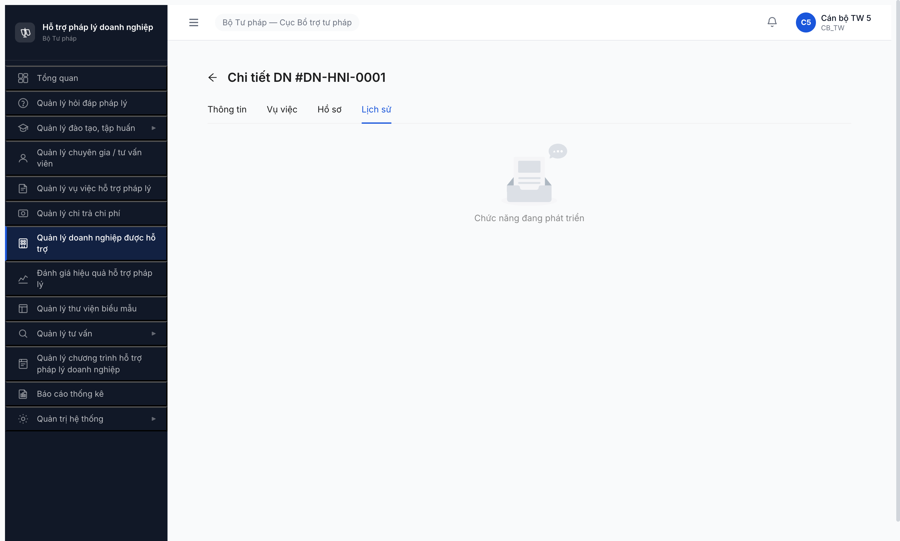
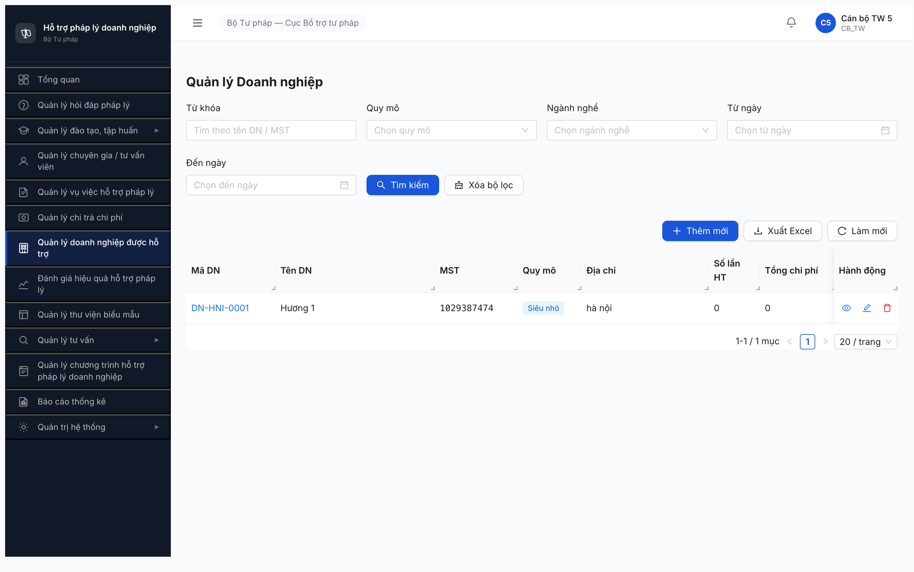

# Bug Report — Quản lý Doanh nghiệp được hỗ trợ (UI vs SRS)

| Thông tin | Giá trị |
|-----------|---------|
| **Dự án** | PM HTPLDN (Phần mềm Hỗ trợ Pháp lý Doanh nghiệp) |
| **Phiên bản** | 1.0 |
| **Môi trường** | http://103.172.236.130:3000/ |
| **Người test** | QA Automation (Claude Code + Chrome DevTools MCP) |
| **Ngày** | 10:46:00 [2026-04-22] |
| **Loại test** | UI Compliance (so sánh UI vs SRS) |
| **Round** | Round 1 |
| **Tài liệu tham chiếu** | SRS v3 — FR Group Quản lý DN được Hỗ trợ (V.III), FR-V.III-01/02/NEW-01, SCR-V.III-01/02/03 |

---

## Tổng hợp

Phát hiện **16** lỗi UI compliance khi so sánh 3 màn hình (Danh sách / Thêm-Chi tiết / Import Excel) với SRS v3 phụ lục B + tab-spec.

| Tổng | Critical | Major | Medium | Minor | Trivial |
|------|----------|-------|--------|-------|---------|
| 16   | 1        | 6     | 3      | 6     | 0       |

## Bug Summary Table

| Bug ID | Severity | Priority | Type | Module | SCR Ref | Title | Status |
|--------|----------|----------|------|--------|---------|-------|--------|
| BUG-QLDN-UI-001 | Critical | P0 | UI/UX | QLDN | SCR-V.III-02 | 3/4 tabs chi tiết DN (Vụ việc/Hồ sơ/Lịch sử) đều placeholder "Chức năng đang phát triển" | Open |
| BUG-QLDN-UI-002 | Major | P1 | UI/UX | QLDN | SCR-V.III-01 | Thiếu nút [Import Excel] trong toolbar (feature orphan — trang /import tồn tại nhưng không reachable) | Open |
| BUG-QLDN-UI-003 | Major | P1 | UI/UX | QLDN | SCR-V.III-01 | Thiếu filter "Tỉnh thành" trong filter-bar | Open |
| BUG-QLDN-UI-004 | Major | P1 | UI/UX | QLDN | SCR-V.III-02 | Thiếu field "Ngày cấp ĐKKD" (date-picker) trong form | Open |
| BUG-QLDN-UI-005 | Major | P1 | UI/UX | QLDN | SCR-V.III-02 | Thiếu field "File đính kèm" (file-upload multi) trong form | Open |
| BUG-QLDN-UI-006 | Major | P1 | UI/UX | QLDN | SCR-V.III-03 | Thiếu nút [Tải mẫu Excel] ở Bước 1 Wizard Import | Open |
| BUG-QLDN-UI-007 | Major | P1 | UI/UX | QLDN | SCR-V.III-02 | Tên tab không khớp SRS; thiếu tab "Hồ sơ Chi trả"; tab "Vụ việc" không có trong spec | Open |
| BUG-QLDN-UI-008 | Medium | P2 | UI/UX | QLDN | SCR-V.III-01 | Filter "Ngành nghề" sai ngữ nghĩa — SRS yêu cầu "Lĩnh vực KD" | Open |
| BUG-QLDN-UI-009 | Medium | P2 | UI/UX | QLDN | SCR-V.III-02 | Thiếu field "Fax" trong form | Open |
| BUG-QLDN-UI-010 | Medium | P2 | UI/UX | QLDN | SCR-V.III-02 | Thừa field "Tên viết tắt" không có trong SRS | Open |
| BUG-QLDN-UI-011 | Minor | P3 | UI/UX | QLDN | SCR-V.III-01 | Thiếu cột checkbox chọn dòng trong bảng danh sách | Open |
| BUG-QLDN-UI-012 | Minor | P3 | UI/UX | QLDN | SCR-V.III-01 | Thiếu breadcrumb "Trang chủ > Doanh nghiệp > Danh sách" | Open |
| BUG-QLDN-UI-013 | Minor | P3 | UI/UX | QLDN | SCR-V.III-02 | Field "Phụ nữ làm chủ" dùng Switch thay vì Checkbox (theo SRS) | Open |
| BUG-QLDN-UI-014 | Minor | P3 | UI/UX | QLDN | SCR-V.III-02 | Field "Lĩnh vực kinh doanh" là text-input thay vì textarea | Open |
| BUG-QLDN-UI-015 | Minor | P3 | UI/UX | QLDN | SCR-V.III-01 | Cột "Quy mô" hiển thị text thay vì badge | Open |
| BUG-QLDN-UI-016 | Minor | P3 | UI/UX | QLDN | SCR-V.III-02 | Label "Doanh thu (VNĐ)" không khớp SRS "Doanh thu năm" | Open |

---

## BUG-QLDN-UI-001 — 3/4 tab trong chi tiết DN chưa build (placeholder "Chức năng đang phát triển")

| Trường | Chi tiết |
|--------|----------|
| **Bug ID** | BUG-QLDN-UI-001 |
| **Severity** | Critical |
| **Priority** | P0 |
| **Type** | UI/UX |
| **Status** | Open |
| **Module** | Quản lý Doanh nghiệp được hỗ trợ |
| **Thành phần** | `/doanh-nghiep/:id?tab=vu-viec`, `?tab=ho-so`, `?tab=lich-su` |
| **URL** | http://103.172.236.130:3000/doanh-nghiep/32954c67-49fc-4333-9819-3149fa6ca20f |
| **Trình duyệt** | Chrome (Chrome DevTools MCP) |
| **Tài khoản** | canbo_tw_5 (CB_TW) |
| **SRS Reference** | SCR-V.III-02 tab-spec (Hồ sơ PL doanh nghiệp / Lịch sử Hỗ trợ / Hồ sơ Chi trả) |
| **Assignee** | FE Team |
| **Found by** | QA Automation |

### Mô tả

Màn hình chi tiết DN (SCR-V.III-02) có 4 tab nhưng chỉ Tab 1 (Thông tin) có form đầy đủ; 3 tab còn lại đều render placeholder "Chức năng đang phát triển", không có bất kỳ nội dung nào.

### Các bước tái hiện

1. Đăng nhập `canbo_tw_5` / `Test@1234`, OTP `666666`
2. Vào `Quản lý doanh nghiệp được hỗ trợ` → danh sách DN
3. Click mã DN `DN-HNI-0001` → mở chi tiết DN
4. Click lần lượt các tab: `Vụ việc`, `Hồ sơ`, `Lịch sử`
5. Quan sát: 3 tab này chỉ hiển thị ảnh rỗng + chữ "Chức năng đang phát triển"

### Kết quả mong đợi

Theo SRS SCR-V.III-02 tab-spec:
- **Tab Hồ sơ PL DN** (v2.1): CRUD hồ sơ pháp lý DN, phân loại `GIAY_PHEP/HOP_DONG/GIAY_CN/QUYET_DINH/KHAC`, trạng thái `HIEU_LUC/HET_HAN/THU_HOI`
- **Tab Lịch sử Hỗ trợ**: Danh sách vụ việc liên kết + 3 KPI (Tổng VV / VV hoàn thành / Tổng chi phí)
- **Tab Hồ sơ Chi trả**: Danh sách hồ sơ chi trả phí TVPL liên kết

### Kết quả thực tế

Cả 3 tab này chỉ hiển thị placeholder "Chức năng đang phát triển" → toàn bộ nghiệp vụ xem lịch sử hỗ trợ, quản lý hồ sơ pháp lý DN, xem hồ sơ chi trả **không sử dụng được**.

### Bằng chứng



### Tác động (Impact)

3/4 (75%) chức năng chi tiết DN chưa triển khai. Không thể:
- Xem/quản lý hồ sơ pháp lý của DN (Giấy phép, Hợp đồng...)
- Xem lịch sử vụ việc đã hỗ trợ DN + KPI tổng hợp
- Xem hồ sơ chi trả liên kết

Làm mất giá trị nghiệp vụ chính của màn hình chi tiết DN.

### Nguyên nhân nghi ngờ (Root Cause)

FE đã tạo routing `?tab=...` và tab label nhưng chưa implement tab panel content. BE API cho các tab này có thể cũng chưa sẵn sàng (cần xác nhận).

### Gợi ý sửa (Suggested Fix)

1. Build tab "Hồ sơ PL DN" theo spec v2.1: CRUD list + form thêm hồ sơ (loại + số + ngày cấp + ngày hết hạn + trạng thái + file)
2. Build tab "Lịch sử Hỗ trợ": bảng vụ việc + 3 KPI card
3. Build tab "Hồ sơ Chi trả": bảng hồ sơ chi trả
4. Đổi tên tab cho đúng SRS (xem BUG-QLDN-UI-007)

---

## BUG-QLDN-UI-002 — Thiếu nút [Import Excel] trong toolbar (feature orphan)

| Trường | Chi tiết |
|--------|----------|
| **Bug ID** | BUG-QLDN-UI-002 |
| **Severity** | Major |
| **Priority** | P1 |
| **Type** | UI/UX |
| **Status** | Open |
| **Module** | Quản lý Doanh nghiệp được hỗ trợ |
| **Thành phần** | Toolbar trên SCR-V.III-01 |
| **URL** | http://103.172.236.130:3000/doanh-nghiep/danh-sach |
| **Trình duyệt** | Chrome (MCP) |
| **Tài khoản** | canbo_tw_5 (CB_TW — có quyền CRUD) |
| **SRS Reference** | SCR-V.III-01 row #4 (toolbar — Nút Import Excel, FR-V.III-NEW-01) |
| **Assignee** | FE Team |
| **Found by** | QA Automation |

### Mô tả

SRS SCR-V.III-01 toolbar quy định **4 nút**: `[+ Thêm mới]`, `[Import Excel]`, `[Xuất Excel]`, `[Làm mới]`. UI hiện chỉ có 3 nút, thiếu `[Import Excel]`. Trang Import (`/doanh-nghiep/import`) đã tồn tại nhưng user không có cách nào để đi tới từ UI thông thường → feature orphan.

### Các bước tái hiện

1. Đăng nhập `canbo_tw_5` (CB_TW, có quyền CRUD theo FR-V.III-01)
2. Vào `Quản lý doanh nghiệp được hỗ trợ` → danh sách
3. Quan sát toolbar: `[+ Thêm mới]`, `[Xuất Excel]`, `[Làm mới]`
4. Verify bằng JS: `document.body.textContent.includes('Import Excel')` → `false`
5. Navigate thủ công bằng URL `/doanh-nghiep/import` → trang wizard xuất hiện

### Kết quả mong đợi

Toolbar có đủ 4 nút: `[+ Thêm mới]`, `[Import Excel]`, `[Xuất Excel]`, `[Làm mới]`. Click `[Import Excel]` → điều hướng sang SCR-V.III-03 (wizard).

### Kết quả thực tế

Toolbar chỉ có 3 nút (thiếu `[Import Excel]`). Trang import tồn tại (status 200) nhưng không reachable qua UI.

### Bằng chứng



JS verify:
```js
document.body.textContent.includes('Import Excel')  // false
fetch('http://103.172.236.130:3000/doanh-nghiep/import') // 200
```

### Tác động (Impact)

Chức năng Import DN hàng loạt (FR-V.III-NEW-01) đã build nhưng **user không thể sử dụng** nếu không biết URL trực tiếp. Ảnh hưởng 100% user có quyền CRUD (CB_TW/CB_BN/CB_DP + QTHT).

### Gợi ý sửa (Suggested Fix)

Thêm nút `[Import Excel]` vào toolbar giữa `[+ Thêm mới]` và `[Xuất Excel]`, điều kiện hiển thị `User có quyền CRUD`, onClick → navigate `/doanh-nghiep/import`.

---

## BUG-QLDN-UI-003 — Thiếu filter "Tỉnh thành"

| Trường | Chi tiết |
|--------|----------|
| **Bug ID** | BUG-QLDN-UI-003 |
| **Severity** | Major |
| **Priority** | P1 |
| **Type** | UI/UX |
| **Status** | Open |
| **Module** | Quản lý Doanh nghiệp được hỗ trợ |
| **Thành phần** | Filter-bar SCR-V.III-01 |
| **URL** | http://103.172.236.130:3000/doanh-nghiep/danh-sach |
| **Tài khoản** | canbo_tw_5 (CB_TW) |
| **SRS Reference** | SCR-V.III-01 row #9 (filter-bar — Tỉnh thành, select từ DON_VI) |
| **Assignee** | FE Team |
| **Found by** | QA Automation |

### Mô tả

SRS quy định filter-bar có 6 điều kiện lọc: Từ khóa, Quy mô, **Tỉnh thành**, **Lĩnh vực KD**, Từ ngày, Đến ngày. UI chỉ có 5 filter và **thiếu Tỉnh thành** (+ 1 filter bị thay thế — xem BUG-QLDN-UI-008).

### Các bước tái hiện

1. Vào danh sách DN
2. Quan sát filter-bar: `Từ khóa`, `Quy mô`, `Ngành nghề`, `Từ ngày`, `Đến ngày`
3. JS verify: `document.body.textContent.includes('Tỉnh thành')` → `false`

### Kết quả mong đợi

Filter-bar có combobox "Tỉnh thành" select từ danh mục `DON_VI`. User CB_TW lọc DN theo tỉnh để phân tích số liệu quản lý DN theo địa bàn.

### Kết quả thực tế

Không có filter Tỉnh thành. User TW không thể lọc DN theo tỉnh khi nghiệp vụ quản lý tổng quan cần.

### Tác động (Impact)

- User CB_TW mất khả năng lọc DN theo địa bàn (tính năng core của vai trò TW quản lý toàn quốc).
- Vi phạm SRS filter-bar spec.

### Gợi ý sửa (Suggested Fix)

Thêm Select "Tỉnh/Thành phố" vào filter-bar, data source: `GET /api/v1/don-vi?cap=TINH`.

---

## BUG-QLDN-UI-004 — Thiếu field "Ngày cấp ĐKKD"

| Trường | Chi tiết |
|--------|----------|
| **Bug ID** | BUG-QLDN-UI-004 |
| **Severity** | Major |
| **Priority** | P1 |
| **Type** | UI/UX |
| **Status** | Open |
| **Module** | Quản lý Doanh nghiệp được hỗ trợ |
| **Thành phần** | Form Thêm/Chi tiết DN, nhóm "Thông tin chung" |
| **URL** | `/doanh-nghiep/tao-moi`, `/doanh-nghiep/:id` |
| **Tài khoản** | canbo_tw_5 |
| **SRS Reference** | SCR-V.III-02 field #9 `ngay_cap_dkkd` (date-picker, không bắt buộc) |
| **Assignee** | FE + BE Team |
| **Found by** | QA Automation |

### Mô tả

SRS quy định form "Thông tin cơ bản" có 24 field, trong đó có `ngay_cap_dkkd` (date-picker) đi kèm `giay_cndk` (text). UI chỉ có `Giấy CN ĐKKD` (text), **thiếu `Ngày cấp ĐKKD`**.

### Các bước tái hiện

1. Vào danh sách DN → click `[+ Thêm mới]` → mở form
2. Quét toàn bộ label trong form (JS):
   ```js
   Array.from(document.querySelectorAll('label')).map(l => l.textContent.trim())
   ```
3. Không có label "Ngày cấp ĐKKD" / "Ngày cấp" / date-picker liền kề `Giấy CN ĐKKD`.

### Kết quả mong đợi

Sau field `Giấy CN ĐKKD` phải có date-picker `Ngày cấp ĐKKD` (không bắt buộc, lưu vào cột `ngay_cap_dkkd` trong DOANH_NGHIEP).

### Kết quả thực tế

Form chỉ có `Giấy CN ĐKKD` (text input). User không thể nhập ngày cấp giấy chứng nhận ĐKKD → thiếu dữ liệu pháp lý quan trọng.

### Tác động (Impact)

Hồ sơ DN thiếu thông tin ngày cấp ĐKKD — không phục vụ được yêu cầu truy xuất thời hạn giấy phép khi cần (liên quan đến Tab Hồ sơ PL DN với trạng thái `HET_HAN`).

### Gợi ý sửa (Suggested Fix)

Thêm `ant-date-picker` sau field "Giấy CN ĐKKD", field key `ngay_cap_dkkd`, format `DD/MM/YYYY`, không bắt buộc.

---

## BUG-QLDN-UI-005 — Thiếu field "File đính kèm"

| Trường | Chi tiết |
|--------|----------|
| **Bug ID** | BUG-QLDN-UI-005 |
| **Severity** | Major |
| **Priority** | P1 |
| **Type** | UI/UX |
| **Status** | Open |
| **Module** | Quản lý Doanh nghiệp được hỗ trợ |
| **Thành phần** | Form Thêm/Chi tiết DN |
| **URL** | `/doanh-nghiep/tao-moi`, `/doanh-nghiep/:id` |
| **Tài khoản** | canbo_tw_5 |
| **SRS Reference** | SCR-V.III-02 field #28 `file_dinh_kem` (file-upload, multi-file) |
| **Assignee** | FE + BE Team |
| **Found by** | QA Automation |

### Mô tả

SRS quy định form có vùng `file-upload` multi-file cho hồ sơ DN. UI **không có vùng upload** nào.

### Các bước tái hiện

1. Vào form Thêm mới DN
2. JS verify: `document.querySelectorAll('.ant-upload, input[type="file"]').length` → `0`
3. Quét toàn form — không có component upload.

### Kết quả mong đợi

Trong nhóm "Thông tin khác" (hoặc tương đương), phải có vùng `Drag & Drop` kéo thả file đính kèm (`file-upload` multi, có thể upload nhiều file).

### Kết quả thực tế

Không có component upload trong form. User không thể đính kèm giấy phép, hợp đồng, giấy chứng nhận đã scan.

### Tác động (Impact)

Không thể lưu hồ sơ scan của DN. Tab "Hồ sơ PL DN" (v2.1) cũng chưa build (BUG-QLDN-UI-001), nên hiện tại **hoàn toàn không có cách nào** để đính file pháp lý vào hồ sơ DN.

### Gợi ý sửa (Suggested Fix)

Thêm `ant-upload Dragger multiple` ở cuối form "Thông tin khác", field `file_dinh_kem`, limit size/type theo config hệ thống.

---

## BUG-QLDN-UI-006 — Thiếu nút [Tải mẫu Excel] ở Bước 1 Wizard Import

| Trường | Chi tiết |
|--------|----------|
| **Bug ID** | BUG-QLDN-UI-006 |
| **Severity** | Major |
| **Priority** | P1 |
| **Type** | UI/UX |
| **Status** | Open |
| **Module** | Quản lý Doanh nghiệp được hỗ trợ |
| **Thành phần** | SCR-V.III-03 Wizard Bước 1 (Upload File) |
| **URL** | http://103.172.236.130:3000/doanh-nghiep/import |
| **Tài khoản** | canbo_tw_5 |
| **SRS Reference** | SCR-V.III-03 row #3 "Nút Tải mẫu Excel" — click → download file template |
| **Assignee** | FE Team |
| **Found by** | QA Automation |

### Mô tả

SRS quy định Bước 1 Wizard Import có **2 thành phần**: (a) vùng kéo thả file `.xlsx`, (b) **nút [Tải mẫu Excel]** để user download template chuẩn. UI chỉ có vùng kéo thả, **thiếu nút Tải mẫu**.

### Các bước tái hiện

1. Navigate `/doanh-nghiep/import`
2. Quan sát Bước 1: chỉ có vùng "Kéo thả hoặc nhấp để chọn file .xlsx" + 2 nút footer `[Hủy]` `[Tiếp tục]`.
3. JS verify: `document.body.textContent.includes('Tải mẫu')` → `false`.

### Kết quả mong đợi

Cạnh hoặc bên dưới vùng upload có nút `[Tải mẫu Excel]` → click tải file template `.xlsx` có sẵn header + 1 dòng ví dụ.

### Kết quả thực tế

Không có nút tải mẫu. User phải tự chế file `.xlsx` hoặc hỏi hệ thống → dễ sai format → import fail.

### Tác động (Impact)

Import không sử dụng được trên thực tế nếu user chưa có file mẫu. Làm giảm giá trị của chức năng bulk import.

### Gợi ý sửa (Suggested Fix)

Thêm `Button [Tải mẫu Excel]` ở Step 1, onClick download file template từ `GET /api/v1/doanh-nghiep/import/template`.

---

## BUG-QLDN-UI-007 — Tên tab detail không khớp SRS; thiếu tab "Hồ sơ Chi trả"

| Trường | Chi tiết |
|--------|----------|
| **Bug ID** | BUG-QLDN-UI-007 |
| **Severity** | Major |
| **Priority** | P1 |
| **Type** | UI/UX |
| **Status** | Open |
| **Module** | Quản lý Doanh nghiệp được hỗ trợ |
| **Thành phần** | SCR-V.III-02 tab-nav |
| **URL** | http://103.172.236.130:3000/doanh-nghiep/:id |
| **Tài khoản** | canbo_tw_5 |
| **SRS Reference** | SCR-V.III-02 rows #1-4 (4 tabs) |
| **Assignee** | FE Team |
| **Found by** | QA Automation |

### Mô tả

SRS quy định 4 tab cho detail DN: **Thông tin cơ bản / Hồ sơ PL doanh nghiệp / Lịch sử Hỗ trợ / Hồ sơ Chi trả**. UI render 4 tab nhưng sai tên:

### So sánh

| SRS (đúng) | UI (thực tế) | Nhận xét |
|------------|--------------|----------|
| Thông tin cơ bản | "Thông tin" | Rút gọn — acceptable |
| Hồ sơ PL doanh nghiệp | "Hồ sơ" | Mất ngữ nghĩa "Pháp lý" — dễ nhầm với chi trả |
| Lịch sử Hỗ trợ | "Lịch sử" | Rút gọn, mất ngữ nghĩa "Hỗ trợ" |
| Hồ sơ Chi trả | ❌ **KHÔNG CÓ** | Bị thay bằng tab "Vụ việc" |
| ❌ (không có trong SRS) | "Vụ việc" | **Tab lạ** — SRS không quy định, và tab "Lịch sử Hỗ trợ" đã bao gồm danh sách VV rồi |

### Kết quả mong đợi

4 tab: **Thông tin cơ bản** / **Hồ sơ PL doanh nghiệp** / **Lịch sử Hỗ trợ** / **Hồ sơ Chi trả** — đặt tên đầy đủ theo SRS.

### Kết quả thực tế

4 tab: Thông tin / Vụ việc / Hồ sơ / Lịch sử — thiếu tab "Hồ sơ Chi trả", thừa tab "Vụ việc" (trùng ngữ nghĩa với Lịch sử Hỗ trợ).

### Tác động (Impact)

- Mất chức năng xem Hồ sơ Chi trả của DN.
- Tên tab không khớp spec gây khó khi training/tài liệu người dùng.
- Trùng ngữ nghĩa giữa "Vụ việc" và "Lịch sử" (nếu implement đúng SRS).

### Gợi ý sửa (Suggested Fix)

1. Rename tabs: `Thông tin cơ bản` / `Hồ sơ PL doanh nghiệp` / `Lịch sử Hỗ trợ` / `Hồ sơ Chi trả`
2. Loại bỏ tab "Vụ việc" (content gộp vào "Lịch sử Hỗ trợ" đúng SRS).
3. Kết hợp BUG-QLDN-UI-001 để build đủ nội dung 3 tab còn lại.

---

## BUG-QLDN-UI-008 — Filter "Ngành nghề" sai ngữ nghĩa, SRS quy định "Lĩnh vực KD"

| Trường | Chi tiết |
|--------|----------|
| **Bug ID** | BUG-QLDN-UI-008 |
| **Severity** | Medium |
| **Priority** | P2 |
| **Type** | UI/UX |
| **Status** | Open |
| **Module** | Quản lý Doanh nghiệp được hỗ trợ |
| **Thành phần** | Filter-bar SCR-V.III-01 |
| **URL** | http://103.172.236.130:3000/doanh-nghiep/danh-sach |
| **Tài khoản** | canbo_tw_5 |
| **SRS Reference** | SCR-V.III-01 row #10 (filter-bar — Lĩnh vực KD, select từ lĩnh vực kinh doanh) |
| **Assignee** | FE + BA Team |
| **Found by** | QA Automation |

### Mô tả

SRS quy định filter "Lĩnh vực KD" (Lĩnh vực kinh doanh), nguồn dữ liệu là "Lĩnh vực kinh doanh" (free text trong form, field #22). UI đổi thành filter "Ngành nghề" (NONG_LAM/CONG_NGHIEP/THUONG_MAI — là field #10 khác trong form).

Điều này gây nhầm lẫn vì:
- **Ngành nghề** (field #10) = enum 3 giá trị hard-coded → không cần filter nếu user có thể nhớ
- **Lĩnh vực KD** (field #22) = free text → hiếm khi filter chính xác

Nhưng vấn đề chính là UI filter label sai → khi user muốn lọc theo "lĩnh vực kinh doanh" thực sự thì không có.

### Các bước tái hiện

1. Vào danh sách DN
2. JS verify label: `Array.from(document.querySelectorAll('label')).map(l=>l.textContent.trim())` → thấy `"Ngành nghề"`
3. JS verify: `document.body.textContent.includes('Lĩnh vực KD')` → `false`

### Kết quả mong đợi

Filter tên là "Lĩnh vực KD", source là danh mục lĩnh vực kinh doanh. Nếu BA confirm ngành nghề + lĩnh vực KD cần lọc cả 2 thì UI phải có cả 2 filter.

### Kết quả thực tế

Chỉ có filter "Ngành nghề", thiếu filter "Lĩnh vực KD".

### Gợi ý sửa (Suggested Fix)

- **Option A**: Rename filter → "Lĩnh vực KD" + lấy data từ DANH_MUC tương ứng.
- **Option B**: BA làm rõ, nếu cần cả 2 thì giữ "Ngành nghề" và thêm filter "Lĩnh vực KD".

---

## BUG-QLDN-UI-009 — Thiếu field "Fax"

| Trường | Chi tiết |
|--------|----------|
| **Bug ID** | BUG-QLDN-UI-009 |
| **Severity** | Medium |
| **Priority** | P2 |
| **Type** | UI/UX |
| **Status** | Open |
| **Module** | Quản lý Doanh nghiệp được hỗ trợ |
| **Thành phần** | Form field "Thông tin liên hệ" |
| **URL** | `/doanh-nghiep/tao-moi` |
| **Tài khoản** | canbo_tw_5 |
| **SRS Reference** | SCR-V.III-02 field #22 `fax` (text, không bắt buộc) |
| **Assignee** | FE + BE Team |
| **Found by** | QA Automation |

### Mô tả

SRS quy định form có field "Fax" (text, không bắt buộc). UI trong nhóm "Thông tin liên hệ" chỉ có Địa chỉ / Tỉnh thành / Điện thoại / Email, **thiếu Fax**.

### Các bước tái hiện

1. Vào form Thêm mới DN
2. JS verify: `document.body.textContent.match(/Fax/i)` → `null`

### Kết quả mong đợi

Sau field `Email` trong nhóm "Thông tin liên hệ" phải có field `Fax` (text).

### Gợi ý sửa (Suggested Fix)

Thêm `ant-input` label `Fax`, key `fax`, không bắt buộc.

---

## BUG-QLDN-UI-010 — Thừa field "Tên viết tắt" không có trong SRS

| Trường | Chi tiết |
|--------|----------|
| **Bug ID** | BUG-QLDN-UI-010 |
| **Severity** | Medium |
| **Priority** | P2 |
| **Type** | UI/UX |
| **Status** | Open |
| **Module** | Quản lý Doanh nghiệp được hỗ trợ |
| **Thành phần** | Form field "Thông tin chung" |
| **URL** | `/doanh-nghiep/tao-moi` |
| **Tài khoản** | canbo_tw_5 |
| **SRS Reference** | SCR-V.III-02 field list (24 fields, không có "Tên viết tắt") |
| **Assignee** | FE + BA Team |
| **Found by** | QA Automation |

### Mô tả

SRS liệt kê 24 field cho form, không có field `Tên viết tắt`. UI có thêm field này sau `Tên doanh nghiệp`. Hoặc BA đã bổ sung nhưng spec chưa update, hoặc FE tự thêm → cần BA confirm.

### Các bước tái hiện

1. Vào form Thêm mới DN
2. Quan sát "Thông tin chung" — có 2 field đầu: `Tên doanh nghiệp` + `Tên viết tắt`.
3. Đối chiếu SRS (24 field) — không có "Tên viết tắt".

### Kết quả mong đợi

Hoặc loại bỏ field nếu không có nghiệp vụ; hoặc cập nhật SRS + schema DB thêm cột `ten_viet_tat` nếu thực sự cần.

### Kết quả thực tế

Field hiển thị trên UI nhưng không có trong spec → data có thể không lưu vào DB, hoặc lưu sai cấu trúc.

### Gợi ý sửa (Suggested Fix)

BA + PM confirm: bỏ field, hoặc add vào SRS v3.1 + migration schema.

---

## BUG-QLDN-UI-011 — Thiếu cột checkbox chọn dòng trong bảng danh sách

| Trường | Chi tiết |
|--------|----------|
| **Bug ID** | BUG-QLDN-UI-011 |
| **Severity** | Minor |
| **Priority** | P3 |
| **Type** | UI/UX |
| **Status** | Open |
| **Module** | Quản lý Doanh nghiệp được hỗ trợ |
| **Thành phần** | Bảng SCR-V.III-01 |
| **URL** | http://103.172.236.130:3000/doanh-nghiep/danh-sach |
| **SRS Reference** | SCR-V.III-01 row #15 (table — Checkbox chọn dòng) |
| **Assignee** | FE Team |

### Mô tả

SRS quy định cột đầu của bảng là checkbox để chọn dòng (hỗ trợ bulk action). UI không có cột này.

### Các bước tái hiện

1. Vào danh sách DN
2. JS verify: `document.querySelectorAll('.ant-table-tbody .ant-checkbox-input').length` → `0`

### Gợi ý sửa (Suggested Fix)

Thêm `rowSelection` vào `ant-table`. Với tương lai, gắn các bulk action (xóa nhiều, xuất Excel theo selection).

---

## BUG-QLDN-UI-012 — Thiếu breadcrumb "Trang chủ > Doanh nghiệp > Danh sách"

| Trường | Chi tiết |
|--------|----------|
| **Bug ID** | BUG-QLDN-UI-012 |
| **Severity** | Minor |
| **Priority** | P3 |
| **Type** | UI/UX |
| **Status** | Open |
| **Module** | Quản lý Doanh nghiệp được hỗ trợ |
| **Thành phần** | Layout top của SCR-V.III-01 |
| **SRS Reference** | SCR-V.III-01 row #1 (breadcrumb) |
| **Assignee** | FE Team |

### Mô tả

SRS quy định màn hình có breadcrumb "Trang chủ > Doanh nghiệp > Danh sách". UI không có breadcrumb (chỉ có heading "Quản lý Doanh nghiệp").

### Các bước tái hiện

1. Vào danh sách DN
2. JS verify: `document.querySelector('.ant-breadcrumb')` → `null`

### Gợi ý sửa (Suggested Fix)

Thêm `<Breadcrumb items={[{title:'Trang chủ'},{title:'Doanh nghiệp'},{title:'Danh sách'}]}/>` ở đầu trang.

---

## BUG-QLDN-UI-013 — Field "Nữ làm chủ" dùng Switch thay vì Checkbox

| Trường | Chi tiết |
|--------|----------|
| **Bug ID** | BUG-QLDN-UI-013 |
| **Severity** | Minor |
| **Priority** | P3 |
| **Type** | UI/UX |
| **Status** | Open |
| **Module** | Quản lý Doanh nghiệp được hỗ trợ |
| **Thành phần** | Form Thêm/Chi tiết DN, field "Nữ làm chủ" |
| **SRS Reference** | SCR-V.III-02 field #23 `la_nu_lam_chu` (checkbox) |
| **Assignee** | FE Team |

### Mô tả

SRS quy định field là `checkbox`. UI dùng `Switch` (ant-switch). Giao diện khác spec + khác các form khác trong hệ thống → không đồng bộ UI pattern.

### Các bước tái hiện

1. Mở form Thêm mới DN
2. Verify: `document.querySelector('.ant-switch[role="switch"]')` → found, label "Nữ làm chủ"

### Gợi ý sửa (Suggested Fix)

Đổi Switch → Checkbox: `<Checkbox>Phụ nữ làm chủ</Checkbox>` (đồng nhất tên label "Phụ nữ làm chủ" theo SRS — hiện UI đặt "Nữ làm chủ" hơi tối nghĩa).

---

## BUG-QLDN-UI-014 — Field "Lĩnh vực kinh doanh" là text-input, SRS yêu cầu textarea

| Trường | Chi tiết |
|--------|----------|
| **Bug ID** | BUG-QLDN-UI-014 |
| **Severity** | Minor |
| **Priority** | P3 |
| **Type** | UI/UX |
| **Status** | Open |
| **SRS Reference** | SCR-V.III-02 field #26 `linh_vuc_kinh_doanh` (textarea) |
| **Assignee** | FE Team |

### Mô tả

SRS quy định field `Lĩnh vực kinh doanh` là `textarea` (nội dung dài). UI dùng `text-input` 1 dòng.

### Các bước tái hiện

1. Mở form Thêm mới DN
2. JS verify: `document.querySelector('.ant-form-item:has(label:contains("Lĩnh vực kinh doanh")) textarea')` → không tồn tại.

### Gợi ý sửa (Suggested Fix)

Đổi `ant-input` → `ant-input.TextArea rows=3` cho field `linh_vuc_kinh_doanh`.

---

## BUG-QLDN-UI-015 — Cột "Quy mô" hiển thị text thay vì badge

| Trường | Chi tiết |
|--------|----------|
| **Bug ID** | BUG-QLDN-UI-015 |
| **Severity** | Minor |
| **Priority** | P3 |
| **Type** | UI/UX |
| **Status** | Open |
| **Module** | Quản lý Doanh nghiệp được hỗ trợ |
| **Thành phần** | Cột #4 bảng danh sách |
| **SRS Reference** | SCR-V.III-01 row #19 (Quy mô — `badge`) |
| **Assignee** | FE Team |

### Mô tả

SRS quy định cột "Quy mô" hiển thị dạng `badge` (nhãn màu theo SIEU_NHO/NHO/VUA). UI hiển thị text "Siêu nhỏ" thuần.

### Các bước tái hiện

1. Vào danh sách DN → quan sát cột "Quy mô" = text "Siêu nhỏ"
2. Không có `.ant-tag` / `.ant-badge` trong cột này

### Gợi ý sửa (Suggested Fix)

Wrap giá trị Quy mô bằng `<Tag color={map[quy_mo]}>` với color scheme: `SIEU_NHO=blue, NHO=gold, VUA=green` (hoặc theo design system).

---

## BUG-QLDN-UI-016 — Label "Doanh thu (VNĐ)" không khớp SRS "Doanh thu năm"

| Trường | Chi tiết |
|--------|----------|
| **Bug ID** | BUG-QLDN-UI-016 |
| **Severity** | Minor |
| **Priority** | P3 |
| **Type** | UI/UX |
| **Status** | Open |
| **SRS Reference** | SCR-V.III-02 field #12 `doanh_thu_nam` (Doanh thu năm, VND) |
| **Assignee** | FE Team |

### Mô tả

SRS quy định label field là `"Doanh thu năm"` (doanh thu 1 năm tài chính gần nhất). UI hiển thị `"Doanh thu (VNĐ)"` → mất ngữ nghĩa "năm", user có thể nhầm với doanh thu tổng cộng, doanh thu tháng, doanh thu lũy kế.

### Gợi ý sửa (Suggested Fix)

Đổi label: `Doanh thu năm (VNĐ)` → khớp SRS + vẫn giữ thông tin đơn vị tiền tệ.

---

## Phụ lục

### A — Môi trường test

| Thành phần | Giá trị |
|------------|---------|
| URL ứng dụng | http://103.172.236.130:3000/ |
| OTP login | `666666` (bypass bật) |
| MailHog | http://103.172.236.130:8025 |
| API base | http://103.172.236.130:3000/api/v1 |
| Frontend | React + Vite + Ant Design (detected) |
| Xác thực | JWT + OTP (bypass) |
| Test tool | Chrome DevTools MCP (primary 2026-04-21) |

### B — Tài khoản sử dụng

| Tên đăng nhập | Vai trò | Cấp | Dùng cho bug nào |
|---------------|---------|-----|------------------|
| canbo_tw_5 | CB_TW | TW | BUG-QLDN-UI-001 → -016 |

### C — Danh mục ảnh chụp

| File | Mô tả | Dùng cho bug |
|------|-------|--------------|
| [01-list-screen.png](image/01-list-screen.png) | SCR-V.III-01 Danh sách DN (toolbar, filter, table) | 002, 003, 008, 011, 012, 015 |
| [02-form-create.png](image/02-form-create.png) | SCR-V.III-02 Form Thêm mới DN | 004, 005, 009, 010, 013, 014, 016 |
| [03-detail-tabs.png](image/03-detail-tabs.png) | SCR-V.III-02 Chi tiết DN (tab nav 4 tabs) | 007 |
| [03-detail-tab-lichsu-empty.png](image/03-detail-tab-lichsu-empty.png) | Tab "Lịch sử" placeholder "Chức năng đang phát triển" | 001 |
| [04-import-wizard-step1.png](image/04-import-wizard-step1.png) | SCR-V.III-03 Wizard Import Bước 1 | 006 |

### D — Verdict & khuyến nghị

**Verdict:** ❌ **FAIL** — UI không đạt compliance theo SRS v3.

- 1 bug Critical (3/4 tab detail DN chưa build) → block luồng quản lý Hồ sơ PL DN, Lịch sử Hỗ trợ, Hồ sơ Chi trả.
- 6 bug Major (Import Excel orphan, thiếu filter Tỉnh thành, thiếu 3 field form Ngày cấp/Fax/File đính kèm, thiếu [Tải mẫu Excel], tab name sai + thiếu tab).
- 3 Medium + 6 Minor — gộp vào sprint fix cùng bundle.

**Khuyến nghị:**
1. FE + BA sync lại bảng field + tab SRS-v3.md (SCR-V.III-02) trước khi release.
2. BE bổ sung API cho tab Hồ sơ PL DN, Lịch sử HT, Hồ sơ Chi trả.
3. QA re-test Round 2 sau khi dev fix ≥ 75% bug Major + 100% bug Critical.

---

*Bug report generated: 2026-04-22 | QA Automation via Claude Code (Chrome DevTools MCP)*
