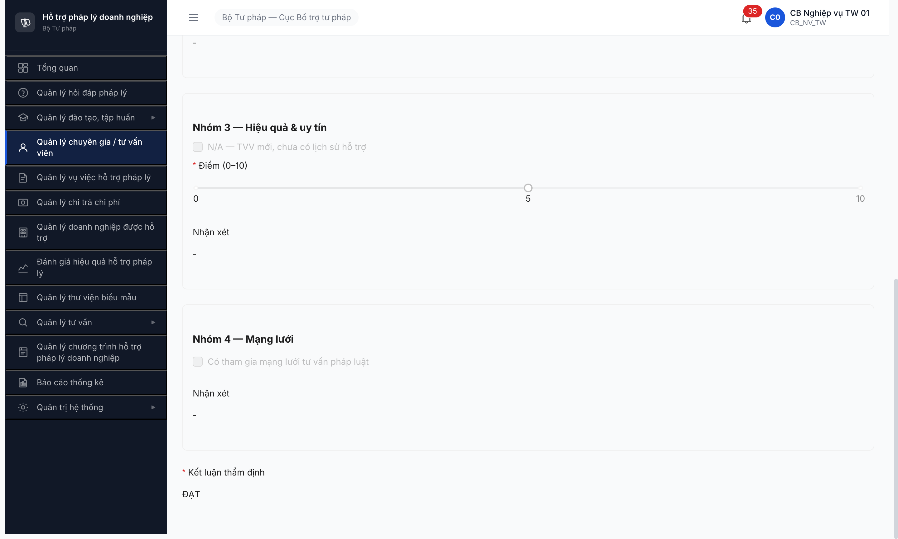
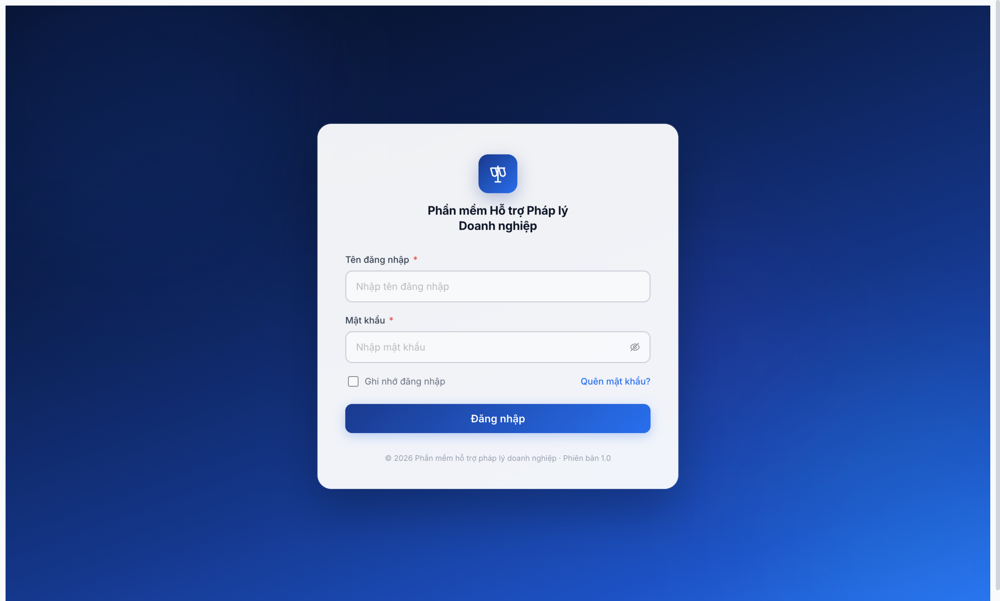
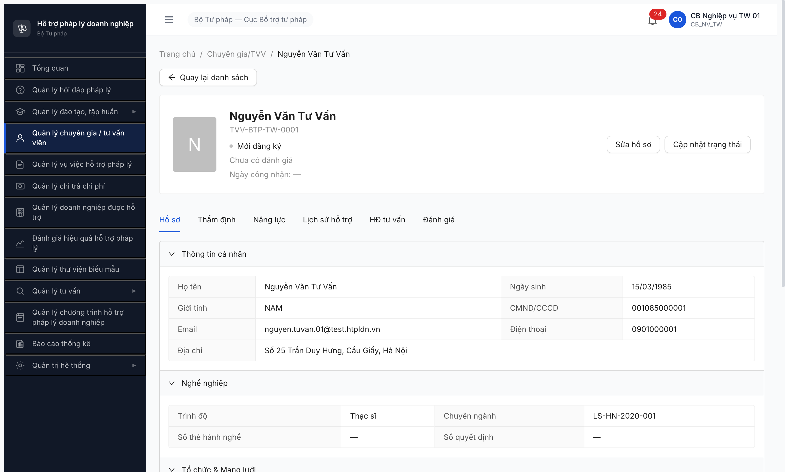
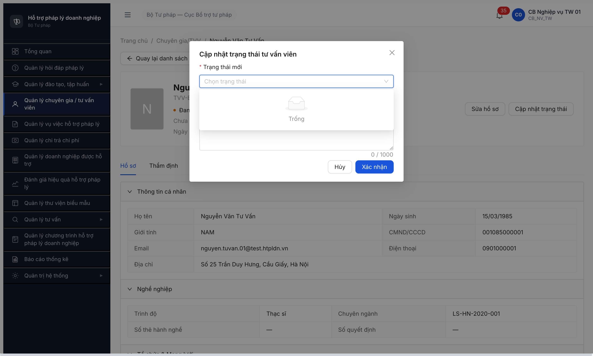

# Bug Report — Workflow Tư vấn viên (SM-TVV) Round 4

| Thông tin | Giá trị |
|-----------|---------|
| **Dự án** | PM HTPLDN |
| **Môi trường** | http://103.172.236.130:3000/ |
| **Người test** | QA AI via Claude Code + Chrome DevTools MCP |
| **Ngày** | 2026-04-25 |
| **Loại test** | Workflow (P3 SM-TVV) |
| **Round** | Round 4 |
| **Tài liệu tham chiếu** | [`tasks/todo.md` §T3.1](../../../tasks/todo.md), [`input/flow-module.md §2`](../../../input/flow-module.md), [`workflow-test-report-TVV.md`](workflow-test-report-TVV.md) |

---

## Tổng hợp

Phát hiện **5** lỗi có SRS reference cụ thể trong quá trình test workflow SM-TVV happy + 3 nhánh phụ (YCBS / CB PD reject / Soft-delete) — kèm 3 observation ngoài SRS.

### Severity breakdown

| Tổng | Critical | Major | Medium | Minor | Trivial |
|------|----------|-------|--------|-------|---------|
| 5    | 0        | 4     | 1      | 0     | 0       |

## Bug Summary Table

| Bug ID | Severity | Priority | Type | TC Ref | **SRS Reference** | Title | Status |
|--------|----------|----------|------|--------|-------------------|-------|--------|
| BUG-FLOW-TVV-001 | Major | P1 | Negative | T3.1 happy Bước 4 | `flow-module.md §2 Bước 4` ketLuan ∈ {ĐẠT, KHÔNG ĐẠT, YÊU CẦU BỔ SUNG} | API `/tham-dinh` accept `ketLuan` arbitrary string (không validate enum) | Open |
| BUG-FLOW-TVV-002 | Major | P1 | Data | T3.1 happy Bước 4-5 | `flow-module.md §2 Bước 4 + Bước 5` | `nguoiDuyetId / ngayDuyet / nguoiGuiDuyetId / ngayGuiDuyet` không được set sau /phe-duyet và /tham-dinh trinhDuyet=true | Open |
| BUG-FLOW-TVV-003 | Major | P1 | Data | T3.1 reject branch | `flow-module.md line 120` "Bắt buộc phải nhập Lý do (≥10 ký tự)" | `ghiChuPheDuyet` không lưu `lyDo` sau /tu-choi → mất audit lý do từ chối | Open |
| BUG-FLOW-TVV-004 | Major | P1 | Workflow | T3.1 happy Bước 2-3 + YCBS | `flow-module.md §2 Bước 2 + 3 + (Phụ) Bước 3` | State machine không enforce thứ tự — `/tham-dinh` từ MOI_DANG_KY auto-jump bất kỳ state nào (skip CHO_THAM_DINH + DANG_THAM_DINH) | Open |
| BUG-FLOW-TVV-005 | Major | P1 | UI/UX | T3.1 happy Bước 2 | `flow-module.md §2 Bước 2 "nhấn nút [Tiếp nhận] hồ sơ"` | List page lẫn detail page TVV state MOI_DANG_KY thiếu nút **[Tiếp nhận]** — không có entrypoint UI cho Bước 2 SRS | Open |

> **Chú thích Severity:** `Critical` block release / `Major` lỗi nghiệp vụ chính có workaround / `Medium` lỗi phụ / `Minor` lỗi nhỏ / `Trivial` typo.
> **Chú thích Type:** `Happy / Negative / Edge / Workflow / Permission / Data / UI/UX / Performance`.

---

## BUG-FLOW-TVV-001 — API `/tham-dinh` accept `ketLuan` arbitrary string không validate enum

> **Endpoint:** `POST /api/v1/tu-van-viens/{id}/tham-dinh` • **Tài khoản:** `cb_nv_tw_01` (CB Nghiệp vụ TW 01)

### Mô tả

API `/tham-dinh` không validate enum `ketLuan` — chấp nhận giá trị bất kỳ (vd `"INVALID_PROBE"`) và lưu vào DB. Vi phạm BR validation enum, gây data inconsistency: `thamDinhMoiNhat.ketLuan` có thể chứa value ngoài 3 giá trị nghiệp vụ chuẩn.

### Các bước tái hiện

1. Login `cb_nv_tw_01` qua API: POST `/api/v1/auth/login` + `/auth/verify-otp` → access token.
2. Pick TVV state MOI_DANG_KY (vd `TVV-BTP-TW-0001`).
3. POST `/api/v1/tu-van-viens/{id}/tham-dinh` với body:
```json
{
  "nhom1KetQua": true, "nhom1Diem": 90,
  "nhom2KetQua": true, "nhom2Diem": 85,
  "nhom3KetQua": true, "nhom3Diem": 80,
  "nhom4KetQua": true, "nhom4Diem": 88, "nhom4ThamGia": true,
  "ketLuan": "INVALID_PROBE",
  "lyDo": "Probe ketLuan enum value INVALID_PROBE",
  "version": 3
}
```
4. Quan sát response + GET lại để check DB.

### Kết quả mong đợi

- HTTP **422 Unprocessable Entity** với `field: ketLuan, message: "ketLuan must be one of [DAT, KHONG_DAT, YEU_CAU_BO_SUNG]"`.
- Record không được tạo trong bảng `THAM_DINH`.

### Kết quả thực tế

- HTTP **200 OK**, response `success: true`.
- DB lưu `thamDinhMoiNhat.ketLuan = "INVALID_PROBE"` (verified qua GET sau đó).

### Bằng chứng

**1. Ảnh chụp** — Form tab Thẩm định trên UI chỉ cho phép radio ĐẠT/KHÔNG ĐẠT/YÊU CẦU BỔ SUNG, trái ngược với BE accept arbitrary string:


**2. API request / response:**

```
POST /api/v1/tu-van-viens/fd76f004-46f0-4067-8ad5-d3bcb19f3344/tham-dinh
Body: { "ketLuan": "INVALID_PROBE", ..., "version": 3 }
Status: 200 OK (BUG: should be 422)

GET /api/v1/tu-van-viens/fd76f004-... (verify)
{ "thamDinhMoiNhat": { "ketLuan": "INVALID_PROBE", ... } }
```

---

## BUG-FLOW-TVV-002 — Audit trail fields không được set sau workflow Bước 4-5

> **Endpoint:** `POST /api/v1/tu-van-viens/{id}/tham-dinh` (trinhDuyet=true) + `POST /api/v1/tu-van-viens/{id}/phe-duyet` • **Tài khoản:** `cb_nv_tw_01` (Bước 4) → `cb_pd_tw_01` (Bước 5)

### Mô tả

Sau khi hoàn tất workflow happy path:
- Bước 4 `/tham-dinh` (trinhDuyet=true) bởi CB NV → state đúng (DANG_THAM_DINH → CHO_PHE_DUYET) **nhưng `nguoiGuiDuyetId` và `ngayGuiDuyet` vẫn null**.
- Bước 5 `/phe-duyet` bởi CB PD → state đúng (CHO_PHE_DUYET → DANG_HOAT_DONG), `ngayCongNhan` được set, **nhưng `nguoiDuyetId`, `ngayDuyet`, `ghiChuPheDuyet` vẫn null**.

Mất audit trail người trình duyệt, người phê duyệt, ngày phê duyệt → không tra cứu được "ai đã duyệt TVV này, vào lúc nào".

### Các bước tái hiện

1. Hoàn tất happy path TVV-BTP-TW-0001:
   - CB NV thẩm định Bước 2-4 → CHO_PHE_DUYET (`/tham-dinh` body `trinhDuyet=true`)
   - CB PD POST `/phe-duyet` body `{ghiChu: "Phê duyệt happy path...", version: 4}` → 200 OK, state DANG_HOAT_DONG
2. GET `/api/v1/tu-van-viens/fd76f004-46f0-4067-8ad5-d3bcb19f3344` để verify.

### Kết quả mong đợi

```json
{
  "trangThai": "DANG_HOAT_DONG",
  "ngayCongNhan": "2026-04-25",
  "nguoiGuiDuyetId": "357f12bf-...",  // CB NV
  "ngayGuiDuyet": "2026-04-25T09:05:00.000Z",
  "nguoiDuyetId": "8de824dd-...",     // CB PD
  "ngayDuyet": "2026-04-25T09:05:27.131Z",
  "ghiChuPheDuyet": "Phê duyệt TVV happy path - đủ điều kiện gia nhập mạng lưới"
}
```

### Kết quả thực tế

```json
{
  "trangThai": "DANG_HOAT_DONG",
  "ngayCongNhan": "2026-04-25",
  "nguoiGuiDuyetId": null,    // ❌ should be CB NV ID (Bước 4)
  "ngayGuiDuyet": null,        // ❌
  "nguoiDuyetId": null,        // ❌ should be CB PD ID (Bước 5)
  "ngayDuyet": null,           // ❌
  "ghiChuPheDuyet": null       // ❌ should be ghiChu from /phe-duyet body
}
```

### Bằng chứng

**1. Ảnh chụp** — Detail TVV-0001 sau Bước 4 Trình duyệt thành công, state CHO_PHE_DUYET (chuẩn bị cho CB PD duyệt — NHƯNG `nguoiGuiDuyetId` vẫn null):


**2. API call sequence:**
- `POST /tu-van-viens/{id}/phe-duyet` 200 → response data có 4 audit fields = null
- `GET /tu-van-viens/{id}` 200 → cùng 4 audit fields = null persisted in DB (xem JSON ở mục Kết quả thực tế)

---

## BUG-FLOW-TVV-003 — `ghiChuPheDuyet` không lưu `lyDo` sau /tu-choi → mất audit lý do từ chối

> **Endpoint:** `POST /api/v1/tu-van-viens/{id}/tu-choi` • **Tài khoản:** `cb_pd_tw_01` (CB Phê duyệt TW 01)

### Mô tả

API `/tu-choi` validate `lyDo` >= 10 ký tự + bắt buộc, NHƯNG sau khi gọi thành công, field `ghiChuPheDuyet` của TVV vẫn null. Lý do từ chối không được lưu DB → mất audit trail nghiệp vụ quan trọng (không biết VÌ SAO TVV bị từ chối).

### Các bước tái hiện

1. Advance TVV-BTP-TW-0003 → CHO_PHE_DUYET (qua /tham-dinh DAT + trinhDuyet=true).
2. Login `cb_pd_tw_01`. POST `/api/v1/tu-van-viens/09ef865d-3729-4989-8369-03f052b2010f/tu-choi`:
```json
{
  "lyDo": "Hồ sơ chưa đầy đủ chứng minh năng lực thực tế của TVV - cần bổ sung",
  "version": 3
}
```
3. GET `/api/v1/tu-van-viens/09ef865d-...` để verify.

### Kết quả mong đợi

```json
{
  "trangThai": "TU_CHOI",
  "ghiChuPheDuyet": "Hồ sơ chưa đầy đủ chứng minh năng lực thực tế của TVV - cần bổ sung",
  "nguoiDuyetId": "8de824dd-...",
  "ngayDuyet": "2026-04-25T09:07:26.315Z"
}
```

### Kết quả thực tế

```json
{
  "trangThai": "TU_CHOI",            // ✅ state đúng
  "ghiChuPheDuyet": null,             // ❌ lyDo bị mất
  "nguoiDuyetId": null,               // ❌ same as BUG-002
  "ngayDuyet": null                   // ❌
}
```

### Bằng chứng

**1. Ảnh chụp** — Final list state distribution: TVV-0003 đã chuyển TU_CHOI nhưng không truy được lý do:



**2. API call:**

```
POST /api/v1/tu-van-viens/09ef865d-.../tu-choi
Status: 200 OK
Body: { "lyDo": "Hồ sơ chưa đầy đủ chứng minh năng lực thực tế của TVV - cần bổ sung", "version": 3 }

GET /api/v1/tu-van-viens/09ef865d-... (verify right after)
→ ghiChuPheDuyet: null (lyDo lost)
```

---

## BUG-FLOW-TVV-004 — State machine không enforce thứ tự, cho phép skip CHO_THAM_DINH + DANG_THAM_DINH

> **Endpoint:** `POST /api/v1/tu-van-viens/{id}/tham-dinh` (gọi từ MOI_DANG_KY) • **Tài khoản:** `cb_nv_tw_01`

### Mô tả

SRS định nghĩa SM-TVV bắt buộc đi qua 2 state intermediate giữa MOI_DANG_KY và mọi nhánh kết luận:
- **Bước 2:** MOI_DANG_KY → CHO_THAM_DINH (CB NV nhấn [Tiếp nhận])
- **Bước 3:** CHO_THAM_DINH → DANG_THAM_DINH (mở tab Thẩm định)
- **Bước 3 (phụ):** DANG_THAM_DINH → YEU_CAU_BO_SUNG (chỉ khi đã thẩm định + phát hiện thiếu giấy tờ)
- **Bước 4:** DANG_THAM_DINH → CHO_PHE_DUYET (chỉ khi 4 nhóm tiêu chí ĐẠT)

Implementation thực tế: API `/tham-dinh` gọi từ `MOI_DANG_KY` cho phép **2 đường tắt sai SRS**:
- ketLuan=DAT → state nhảy thẳng `MOI_DANG_KY → DANG_THAM_DINH` (skip CHO_THAM_DINH)
- ketLuan=YEU_CAU_BO_SUNG → state nhảy thẳng `MOI_DANG_KY → YEU_CAU_BO_SUNG` (skip cả CHO_THAM_DINH lẫn DANG_THAM_DINH)

Phá vỡ semantic state machine: YCBS lẽ ra chỉ trigger **sau khi đã thẩm định**, không phải từ "vừa nhận hồ sơ".

### Các bước tái hiện

**Repro 1 — Skip CHO_THAM_DINH (path happy):**
1. Pick TVV state MOI_DANG_KY (vd `TVV-BTP-TW-0001`).
2. POST `/tham-dinh` body `ketLuan=DAT, ...nhomXKetQua=true`.
3. GET → quan sát `trangThai = DANG_THAM_DINH` (skip CHO_THAM_DINH).

**Repro 2 — Skip CẢ CHO_THAM_DINH + DANG_THAM_DINH (path YCBS):**
1. Pick TVV state MOI_DANG_KY (vd `TVV-BTP-TW-0002`).
2. POST `/tham-dinh` body `ketLuan=YEU_CAU_BO_SUNG, lyDo=...`.
3. GET → quan sát `trangThai = YEU_CAU_BO_SUNG` (skip 2 state intermediate).

**Verify đường đi đúng SRS (TVV-BTP-TW-0005):**
1. POST `/tham-dinh` ketLuan=DAT → DANG_THAM_DINH (skip CHO_THAM_DINH per Repro 1).
2. POST `/tham-dinh` lần 2 ketLuan=YEU_CAU_BO_SUNG → YEU_CAU_BO_SUNG. **Đây mới là đường đi đúng SRS Bước 3 phụ.**

4. GET list `?trangThai=CHO_THAM_DINH&page=1&pageSize=10` → quan sát count = 0 (state này không bao giờ entered).

### Bằng chứng

**1. Ảnh chụp** — List page với 5 tab state, tab "Chờ thẩm định" hiển thị nhưng count luôn = 0:



Detail TVV-0001 sau /tham-dinh từ MOI_DANG_KY → nhảy thẳng "Đang thẩm định":


**2. API repro:**

```
# Repro 1 — skip CHO_THAM_DINH
POST /api/v1/tu-van-viens/{id}/tham-dinh body{ ketLuan:"DAT", ... }
→ 200, state MOI_DANG_KY → DANG_THAM_DINH (nhảy 1 state)

# Repro 2 — skip CẢ CHO_THAM_DINH lẫn DANG_THAM_DINH
POST /api/v1/tu-van-viens/{id}/tham-dinh body{ ketLuan:"YEU_CAU_BO_SUNG", ... }
→ 200, state MOI_DANG_KY → YEU_CAU_BO_SUNG (nhảy 2 state)

# Verify endpoint /tiep-nhan chưa có
POST /api/v1/tu-van-viens/{id}/tiep-nhan → 404 Not Found

# Verify tab dead
GET /api/v1/tu-van-viens?trangThai=CHO_THAM_DINH&page=1&pageSize=10 → meta.total = 0
```

### Kết quả mong đợi

- Có endpoint `[Tiếp nhận]` riêng (vd POST `/tu-van-viens/{id}/tiep-nhan`) chỉ chuyển state `MOI_DANG_KY → CHO_THAM_DINH` (không cần body Thẩm định).
- Endpoint `/tham-dinh` chỉ accept state `CHO_THAM_DINH` (lần đầu để vào DANG_THAM_DINH) hoặc `DANG_THAM_DINH` (để update record + chuyển kết luận).
- API reject 422 khi gọi `/tham-dinh` với body ketLuan=YEU_CAU_BO_SUNG nhưng state hiện tại = MOI_DANG_KY → trả về `ERR-STATE-IV-TT-01: Không thể chuyển từ MOI_DANG_KY sang YEU_CAU_BO_SUNG`.
- Tab "Chờ thẩm định" reflect đúng số TVV đang chờ CB NV mở Tab Thẩm định.

### Kết quả thực tế

- Không có endpoint `/tu-van-viens/{id}/tiep-nhan` (404).
- POST `/tham-dinh` từ MOI_DANG_KY với ketLuan=DAT → state nhảy DANG_THAM_DINH (skip CHO_THAM_DINH).
- POST `/tham-dinh` từ MOI_DANG_KY với ketLuan=YEU_CAU_BO_SUNG → state nhảy thẳng YEU_CAU_BO_SUNG (skip cả 2 state).
- Tab "Chờ thẩm định" trên list UI luôn count 0 → tab dead.

---

## BUG-FLOW-TVV-005 — UI thiếu nút **[Tiếp nhận]** trên CẢ list page lẫn detail page (state MOI_DANG_KY)

> **URL:** `/chuyen-gia-tvv/danh-sach` (tab "Mới đăng ký") + `/chuyen-gia-tvv/{id}` (state MOI_DANG_KY) • **Tài khoản:** `cb_nv_tw_01`

### Mô tả

SRS flow-module.md §2 Bước 2 quy định rõ: **"CB NV vào danh sách TVV ... nhấn nút [Tiếp nhận] hồ sơ"** để chuyển MOI_DANG_KY → CHO_THAM_DINH. Implementation thực tế thiếu nút này ở **CẢ 2 entrypoint UI**:

**(a) List page** (`/chuyen-gia-tvv/danh-sach` tab "Mới đăng ký"):
- Action column trên mỗi row TVV state MOI_DANG_KY chỉ có 3 link: `Xem | Sửa | Xóa`.
- Header bulk action: chỉ có button [Thêm TVV], [Xuất Excel] — không có [Tiếp nhận hàng loạt] hay [Tiếp nhận].

**(b) Detail page** (`/chuyen-gia-tvv/{id}` state MOI_DANG_KY):
- Header action chỉ có 2 button: **[Sửa hồ sơ]** + **[Cập nhật trạng thái]**.
- Modal "Cập nhật trạng thái" mở ra: dropdown "Trạng thái mới" hiển thị **"Trống"** (rỗng). API trả empty list valid transitions.

**Workaround user phải dùng** (không phải spec):
- Click tab "Thẩm định" → Fill form đầy đủ (Pháp lý radio + Kết luận thẩm định radio + slider điểm) → Click "Gửi KQ" hoặc "Trình duyệt".
- Workflow này tương đương Bước 4 SRS (chấm điểm + Trình duyệt), không phải Bước 2 (Tiếp nhận đơn giản).
- ⇒ User skip thẳng Bước 2 + Bước 3 mà không nhận biết — phá flow nghiệp vụ.

### Các bước tái hiện

**Repro List page:**
1. Login `cb_nv_tw_01`. Sidebar "Quản lý chuyên gia / tư vấn viên".
2. Click tab "Mới đăng ký" → list TVV state MOI_DANG_KY.
3. Quan sát action column row + header bulk actions.
4. Kết quả: chỉ có Xem/Sửa/Xóa per row; header chỉ [Thêm TVV] + [Xuất Excel]. Không có [Tiếp nhận].

**Repro Detail page:**
1. Tiếp tục từ trên, click "Xem" trên row bất kỳ TVV state MOI_DANG_KY.
2. Quan sát action buttons trên header detail page.
3. Click "Cập nhật trạng thái" → modal mở.
4. Click dropdown "Trạng thái mới".
5. Kết quả: header chỉ [Sửa hồ sơ] + [Cập nhật trạng thái]; modal dropdown hiển thị "Trống".

### Kết quả mong đợi

Detail page state MOI_DANG_KY hiển thị buttons:
- **[Tiếp nhận]** (primary CTA) — chuyển trạng thái CHO_THAM_DINH (xem BUG-FLOW-TVV-004 cho state machine consistency).
- [Sửa hồ sơ]
- [Xóa] (chỉ khi state MOI_DANG_KY)

List page tab "Mới đăng ký" — action column row có thêm link [Tiếp nhận] hoặc header có button [Tiếp nhận hàng loạt].

### Kết quả thực tế

Detail page state MOI_DANG_KY chỉ có:
- [Sửa hồ sơ]
- [Cập nhật trạng thái] (modal generic — dropdown empty)

List page action column chỉ có Xem/Sửa/Xóa, header chỉ [Thêm TVV] + [Xuất Excel].

→ Không có [Tiếp nhận]. User phải đi qua tab Thẩm định form để advance — workflow trái spec.

### Bằng chứng

**1. Ảnh chụp** — 3 ảnh chứng minh thiếu nút [Tiếp nhận] ở 3 entrypoint khác nhau:

*(a) List page tab "Mới đăng ký" — action column từng row chỉ có Xem/Sửa/Xóa, header bulk chỉ có [Thêm TVV] + [Xuất Excel]:*

![BUG-FLOW-TVV-005a — List page MOI_DANG_KY thiếu nút [Tiếp nhận]](image/07-list-MOI_DANG_KY-thieu-nut-tiepnhan.png)

*(b) Detail page state MOI_DANG_KY — header chỉ có [Sửa hồ sơ] + [Cập nhật trạng thái]:*



*(c) Modal "Cập nhật trạng thái" — dropdown "Trống" (empty):*



---

## Observations — ngoài SRS (không log bug)

| Observation | Chi tiết / Evidence | SRS có nói không? | Đề xuất |
|-------------|----------------------|-------------------|---------|
| **A. UI session sometimes kicks back to /login** | Sau login OK, click vài nav (3-5 actions) → app redirect về /login. Network: `POST /api/v1/auth/refresh [401]` xảy ra trước kick. Intermittent — không reproduce 100%. JWT theo response `expiresIn:900` (15 min) nhưng kick xảy ra sau ~1 min idle. | SRS không có clause về session timeout cụ thể. | BA + dev confirm session config (cookie SameSite, CSRF, refresh rotation). Khi reproducible 100% sẽ log bug. |
| **B. UI Row action "Xóa" hiển thị as StaticText (không clickable) trên list** | TVV state MOI_DANG_KY: action column có `<a>Xem</a>`, `<a>Sửa</a>`, `<text>Xóa</text>`. API DELETE vẫn execute được. | SRS không nói rõ tag dùng cho action. | Đã log ở CG/TVV UI Round 1 — không re-log. |
| **C. Tab "Chờ thẩm định" trên list page count luôn = 0** | Vì BUG-FLOW-TVV-004 — state CHO_THAM_DINH không bao giờ entered. | Liên quan BUG-FLOW-TVV-004. | Track theo BUG-FLOW-TVV-004 fix. |

---

## Phụ lục — Môi trường test

| Thành phần | Giá trị |
|------------|---------|
| URL ứng dụng | http://103.172.236.130:3000/ |
| OTP login | `666666` bypass (dev đã enable cho QA) |
| MailHog | http://103.172.236.130:8025 (fallback OTP) |
| API base | http://103.172.236.130:3000/api/v1 |
| Frontend | React + Vite + Ant Design + Zustand auth-store sessionStorage |
| Xác thực | JWT Bearer (RS256, expiresIn=900s) + HttpOnly refresh cookie |
| Tool test | Chrome DevTools MCP (npx chrome-devtools-mcp@latest) |

---

*Bug report generated: 2026-04-25 | QA AI via Claude Code + Chrome DevTools MCP*
