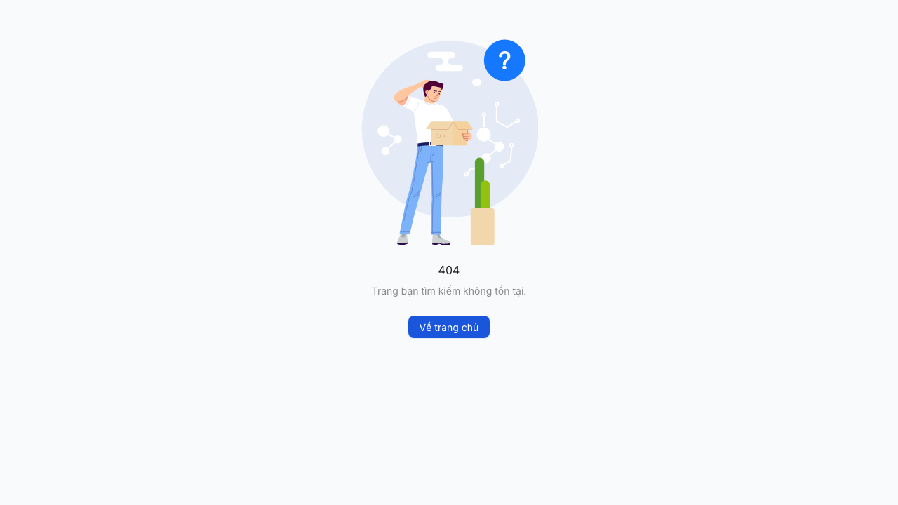
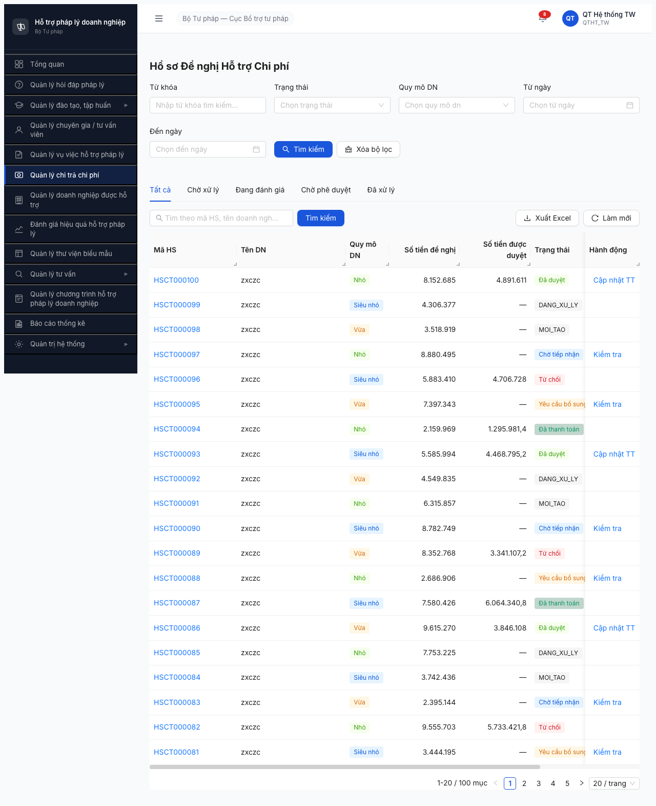

# Bug Report — Module Chi trả Chi phí

| Thông tin | Giá trị |
|-----------|---------|
| **Dự án** | PM HTPLDN — Phần mềm Hỗ trợ Pháp lý Doanh nghiệp |
| **Phiên bản** | SRS v3.1 (2026-04-03) |
| **Môi trường** | http://103.172.236.130:3000/chi-tra/danh-sach |
| **Người test** | QA Automation (via Claude Code + gstack browse, headless Chromium) |
| **Ngày** | 11:30 2026-04-18 |
| **Loại test** | Functional (UI only, KHÔNG test API) |
| **Round** | Round 2 (2026-04-16) |
| **Tài liệu tham chiếu** | [functional-test-report.md](functional-test-report.md), [funtion/7.6-chi-tra-chi-phi.md](../../../funtion/7.6-chi-tra-chi-phi.md), [permission-matrix.md](../../../permission-matrix.md) |

---

## Tổng hợp

Phát hiện **6** lỗi trong quá trình test module Chi trả Chi phí.

| Tổng | Blocker | Critical | Major | Medium | Minor |
|------|---------|----------|-------|--------|-------|
| 6    | 1       | 1        | 2     | 1      | 1     |

## Bug Summary Table

| Bug ID | Severity | Priority | Type | Module | TC Ref | Title | Status |
|--------|----------|----------|------|--------|--------|-------|--------|
| BUG-CT-001 | Blocker | P0 | Workflow | Chi trả CP | CT-003, CT-004, CT-015, +9 | Trang chi tiết hồ sơ chi trả trả 404 cho mọi HS | Open |
| BUG-CT-002 | Critical | P0 | Permission | Chi trả CP | CT-023, CT-027 | QTHT và DN thấy menu + nút thao tác Chi trả | Open |
| BUG-CT-003 | Major | P1 | UI/UX | Chi trả CP | CT-001 | Cột Trạng thái hiển thị raw enum: DANG_XU_LY, MOI_TAO | Open |
| BUG-CT-004 | Major | P1 | Happy | Chi trả CP | CT-002 | Chức năng Tìm kiếm không filter danh sách | Open |
| BUG-CT-005 | Medium | P1 | Data | Chi trả CP | CT-001 | Cột Tên DN rỗng toàn bộ 100 hồ sơ | Open |
| BUG-CT-006 | Minor | P2 | UI/UX | Chi trả CP | CT-001 | Deprecation warning antd Spin `tip` | Open |

---

## BUG-CT-001 — [BLOCKER] Trang chi tiết hồ sơ chi trả trả 404 cho mọi HS

| Trường | Chi tiết |
|--------|----------|
| **Bug ID** | BUG-CT-001 |
| **Severity** | Blocker |
| **Priority** | P0 |
| **Type** | Workflow |
| **Status** | Open (carry-over từ Round 1 — cùng bug) |
| **Module** | Quản lý Chi trả Chi phí |
| **Thành phần** | FE Router — `src/routes/router.tsx`, FE Page — `src/pages/chi-tra/<detail>.tsx` (có thể chưa tồn tại) |
| **URL** | `/chi-tra/<uuid>` và `/chi-tra/<uuid>?action=kiem-tra` |
| **Trình duyệt** | Chromium 146 headless (via Playwright) |
| **Tài khoản** | canbo_tw (CB_NV, TW) |
| **TC Reference** | CT-003, CT-004, CT-005, CT-006, CT-007, CT-008, CT-009, CT-010, CT-011, CT-012, CT-013, CT-014, CT-015, CT-016, CT-017, CT-020, CT-024, CT-029, CT-030, CT-031 |
| **SRS Reference** | UC68-UC75, BR-CALC-01, BR-EC-15, BR-EC-22, BR-FLOW-03 |
| **Assignee** | FE Team |
| **Found by** | QA Automation (round 2) |

### Mô tả

Click vào bất kỳ mã hồ sơ nào (VD: HSCT000100) hoặc nhấn nút hành động ("Kiểm tra", "Cập nhật TT") trong bảng danh sách chi trả → trang 404 "Trang bạn tìm kiếm không tồn tại". URL có dạng `/chi-tra/f0000000-0000-4000-8000-000000000100` hoặc có query `?action=kiem-tra`. FE router không có route handler cho pattern này, hoặc component chi tiết chưa được implement.

### Các bước tái hiện

1. Đăng nhập canbo_tw / Test@1234 + OTP từ MailHog
2. Click "Quản lý chi trả chi phí" trong sidebar → `/chi-tra/danh-sach`
3. **Trường hợp 1 (CT-003):** Click vào mã HS "HSCT000100" trong cột đầu tiên
   - URL: `http://103.172.236.130:3000/chi-tra/f0000000-0000-4000-8000-000000000100`
   - Kết quả: Hiển thị trang 404 với hình người dùng đang bối rối, text "404 / Trang bạn tìm kiếm không tồn tại / Về trang chủ"
4. **Trường hợp 2 (CT-004):** Click nút "Kiểm tra" ở hàng HSCT000097 (Chờ tiếp nhận)
   - URL: `http://103.172.236.130:3000/chi-tra/f0000000-0000-4000-8000-000000000097?action=kiem-tra`
   - Kết quả: Cùng trang 404
5. **Trường hợp 3 (CT-015):** Click nút "Cập nhật TT" ở hàng HSCT000100 (Đã duyệt)
   - Cùng pattern URL `/chi-tra/<uuid>?action=...`
   - Kết quả: 404

### Kết quả mong đợi

Theo SRS (UC68-UC75):
- `/chi-tra/<id>` phải render màn hình chi tiết hồ sơ gồm các tab: Thông tin cơ bản, Hồ sơ DN, Tệp đính kèm, Lịch sử thay đổi, Đánh giá mức hỗ trợ
- `?action=kiem-tra` phải focus vào form kiểm tra (SM-CHITRA: CHO_TIEP_NHAN → DANG_KIEM_TRA)
- `?action=cap-nhat-tt` (hoặc tương tự) phải focus vào form ghi nhận thanh toán

### Kết quả thực tế

Tất cả navigation tới detail → 404 page. Component/route chưa implement.

### Bằng chứng




### Tác động (Impact)

- **100% workflow Chi trả bị chặn**: không kiểm tra, đánh giá, thẩm định, trình PD, phê duyệt, thanh toán được
- Chặn 20/31 test case trong Round 2
- Toàn bộ business logic của module (BR-CALC-01, BR-EC-15, BR-EC-22, BR-FLOW-03) không verify được
- Impact: **Module không release được**

### Nguyên nhân nghi ngờ (Root Cause)

- FE Router (`src/routes/router.tsx`) thiếu route `/chi-tra/:id` hoặc wildcard cho query param
- Component `HoSoChiTraDetail` (hoặc tên tương tự) có thể:
  - Chưa implement (skeleton không có)
  - Implement nhưng chưa register trong router
  - Implement nhưng import path sai

### Gợi ý sửa (Suggested Fix)

1. Thêm route vào `src/routes/router.tsx`:
   ```tsx
   {
     path: '/chi-tra/:id',
     element: <HoSoChiTraDetail />
   }
   ```
2. Implement component `HoSoChiTraDetail` đọc `useParams()` lấy `id`, gọi GET `/api/v1/ho-so-chi-tras/{id}`, render theo `useSearchParams().get('action')`:
   - `action=kiem-tra` → tab "Kiểm tra"
   - `action=danh-gia` → tab "Đánh giá mức hỗ trợ"
   - `action=cap-nhat-tt` → tab "Ghi nhận thanh toán"
3. Thêm PermissionRoute guard theo role (CB_NV đủ quyền, QTHT read-only)

---

## BUG-CT-002 — [CRITICAL] Phân quyền sai: QTHT và DN thấy menu + nút thao tác Chi trả

| Trường | Chi tiết |
|--------|----------|
| **Bug ID** | BUG-CT-002 |
| **Severity** | Critical |
| **Priority** | P0 |
| **Type** | Permission |
| **Status** | Open |
| **Module** | Chi trả Chi phí + AppShell Sidebar |
| **Thành phần** | FE — `src/components/AppShell/nav-structure.ts`, `src/utils/auth-rules.ts` (CASL), `src/components/PermissionRoute/*`; BE — guard trên `/api/v1/ho-so-chi-tras` |
| **URL** | `/chi-tra/danh-sach` (list) |
| **Trình duyệt** | Chromium 146 headless |
| **Tài khoản** | qtht_tw (QTHT, TW), dn_user (DN Portal) |
| **TC Reference** | CT-023 (QTHT), CT-027 (DN) |
| **SRS Reference** | permission-matrix.md §HO_SO_CHI_TRA |
| **Assignee** | BE Team + FE Team |

### Mô tả

Cả hai role không được phép quản lý Chi trả đều thấy menu "Quản lý chi trả chi phí" trong sidebar:

**QTHT_TW** (Quản trị hệ thống):
- Theo permission-matrix: QTHT = 👁️ R only (chỉ đọc) trên HO_SO_CHI_TRA
- Thực tế: Thấy menu, vào được `/chi-tra/danh-sach` hiển thị 100 HS, **vẫn thấy nút "Kiểm tra", "Xuất Excel"** ở các hàng → có thể click để thao tác

**DN_USER** (Công ty TNHH Test, role DOANH_NGHIEP Portal):
- Theo permission-matrix: DN = 🔌 chỉ API (nộp HS), không vào CMS
- Thực tế: Login xong landing /403 nhưng **sidebar vẫn hiển thị "Quản lý chi trả chi phí"** (có thể click)

### Các bước tái hiện

**QTHT_TW (CT-023):**
1. Đăng xuất canbo_tw (nếu có)
2. Đăng nhập qtht_tw / Test@1234 + OTP
3. Quan sát sidebar → thấy mục "Quản lý chi trả chi phí"
4. Click menu → URL `/chi-tra/danh-sach` → hiển thị bảng 100 HS (200 OK, không redirect 403)
5. Đếm nút ở cột "Hành động" → thấy "Kiểm tra" (x6 trên các HS "Chờ tiếp nhận"), nút "Xuất Excel" top-right

**DN_USER (CT-027):**
1. Đăng nhập dn_user / Test@1234 + OTP (email: `dn@example.com`)
2. Sau OTP, redirect tới `/403` "Bạn không có quyền truy cập trang này"
3. Quan sát sidebar → **vẫn thấy "Quản lý chi trả chi phí"** (và nhiều menu CMS khác)
4. DN không được phép truy cập backend CMS, nhưng menu vẫn render

### Kết quả mong đợi

Theo permission-matrix.md:
- **QTHT**: Chỉ R (read-only) trên HO_SO_CHI_TRA → nếu cho thấy menu thì chỉ cho xem danh sách **không** có nút action. Hoặc ẩn luôn menu để giảm confusion.
- **DN**: Sidebar CMS phải ẩn hoàn toàn hoặc redirect về portal DN. Không cho click vào `/chi-tra/danh-sach`.

### Kết quả thực tế

- QTHT: Thấy menu + nút action → có thể thao tác nghiệp vụ (nếu BE không double-check authz).
- DN: Thấy menu CMS dù landing ở /403.

### Bằng chứng




### Tác động (Impact)

- **Dữ liệu nghiệp vụ**: nếu BE không có guard cấm QTHT gọi `/kiem-tra`, `/danh-gia`, `/phe-duyet`..., QTHT có thể làm hỏng workflow (chuyển state sai).
- **Compliance**: DN (doanh nghiệp external) thấy menu CMS là thông tin nội bộ rò rỉ. Nếu bypass được /403 thì xem được dữ liệu DN khác.
- **UX confusion**: QTHT click Kiểm tra có thể expect form nhưng 404 (theo BUG-CT-001), tạo trải nghiệm tệ.

### So sánh (Comparison)

| Role | Thấy menu Chi trả | Vào list (/chi-tra/danh-sach) | Thấy nút Kiểm tra | Thấy nút Xuất Excel |
|------|-------------------|-------------------------------|-------------------|---------------------|
| CB_NV (canbo_tw) | ✅ (đúng) | ✅ (đúng) | ✅ (đúng) | ✅ (đúng) |
| QTHT (qtht_tw) | ❌ nên ẩn / chỉ R | ✅ read-only OK, vào được (OK nếu R-only) | **❌ BUG** (nên ẩn) | **❌ BUG** nếu QTHT được xuất thì OK, nhưng permission-matrix chỉ cho R thuần |
| DN (dn_user) | **❌ BUG** (phải ẩn) | ❌ phải block | N/A | N/A |

### Nguyên nhân nghi ngờ (Root Cause)

1. **Menu filter thiếu role guard**: `src/components/AppShell/nav-structure.ts` định nghĩa các menu và `requires` (permissions). Có thể item "Quản lý chi trả chi phí" không có `requires` hoặc guard sai.
2. **CASL ability rules thiếu**: `src/utils/auth-rules.ts` cần có rule:
   ```ts
   if (role === 'DN') cannot('read', 'HoSoChiTra');
   if (role === 'QTHT') can('read', 'HoSoChiTra'); // nhưng cannot('manage')
   ```
3. **PermissionRoute** không chặn khi user không có ability `read`.

### Gợi ý sửa (Suggested Fix)

1. Update `nav-structure.ts`: thêm `requires: ['read_ho_so_chi_tra']` cho item Chi trả, và CB_PD, CB_NV có permission đó còn QTHT/DN không.
2. Update CASL rules: QTHT chỉ có `read`, không có `update`/`approve`. DN không có gì.
3. Update FE table: ẩn cột "Hành động" cho QTHT hoặc hiển thị nhưng disable nút.
4. BE: guard mọi endpoint POST/PATCH trên `/api/v1/ho-so-chi-tras/*` với `require_permission('manage_ho_so_chi_tra')`, và role QTHT không có permission này.

---

## BUG-CT-003 — [MAJOR] Cột Trạng thái hiển thị raw enum: DANG_XU_LY, MOI_TAO

| Trường | Chi tiết |
|--------|----------|
| **Bug ID** | BUG-CT-003 |
| **Severity** | Major |
| **Priority** | P1 |
| **Type** | UI/UX |
| **Status** | Open |
| **Module** | Chi trả Chi phí — list page |
| **Thành phần** | FE — state label map (VD `src/utils/state-labels.ts` hoặc inline trong `src/pages/chi-tra/list.tsx`) |
| **URL** | `/chi-tra/danh-sach` |
| **Tài khoản** | canbo_tw |
| **TC Reference** | CT-001 |
| **Assignee** | FE Team |

### Mô tả

Trong bảng danh sách chi trả, cột "Trạng thái" render enum raw cho 2 state:
- HSCT000099 → `DANG_XU_LY` (nên là "Đang xử lý")
- HSCT000098 → `MOI_TAO` (nên là "Mới tạo")

Các state khác hiển thị đúng tiếng Việt: "Đã duyệt", "Chờ tiếp nhận", "Từ chối", "Yêu cầu bổ sung", "Đã thanh toán".

### Các bước tái hiện

1. canbo_tw login → vào `/chi-tra/danh-sach`
2. Quan sát cột "Trạng thái" của HSCT000099 và HSCT000098
3. Thấy giá trị dạng `DANG_XU_LY`, `MOI_TAO` (uppercase + underscore)

### Kết quả mong đợi

Mọi state enum được map sang label tiếng Việt. Theo SM-CHITRA, các state là: CHO_TIEP_NHAN, DANG_KIEM_TRA, YEU_CAU_BO_SUNG, DANG_DANH_GIA, DANG_THAM_DINH, CHO_PHE_DUYET, DA_DUYET, DA_THANH_TOAN, TU_CHOI, HUY. State `DANG_XU_LY` và `MOI_TAO` có thể là alias hoặc legacy state.

### Bằng chứng

Trong screenshot CT-001-list-default.png, hàng HSCT000099 và HSCT000098 hiển thị enum raw.

### Tác động

- UX tệ: người dùng không hiểu nghĩa enum tiếng Anh
- Lộ chi tiết nội bộ hệ thống
- Không đồng nhất với các state khác

### Nguyên nhân nghi ngờ

FE state label map (VD:
```ts
const STATE_LABELS = {
  CHO_TIEP_NHAN: 'Chờ tiếp nhận',
  DANG_KIEM_TRA: 'Đang kiểm tra',
  // ...
};
```
thiếu key `DANG_XU_LY` và `MOI_TAO`, hoặc BE trả 2 state này ngoài scope FE biết.

### Gợi ý sửa

1. Tìm map state labels trong FE, bổ sung:
   ```ts
   DANG_XU_LY: 'Đang xử lý',
   MOI_TAO: 'Mới tạo',
   ```
2. Hoặc BE chuẩn hóa về các state trong SM-CHITRA (clarify với BE: `DANG_XU_LY`, `MOI_TAO` có phải là state thực của SM-CHITRA hay data seed sai?)

---

## BUG-CT-004 — [MAJOR] Chức năng Tìm kiếm không filter danh sách

| Trường | Chi tiết |
|--------|----------|
| **Bug ID** | BUG-CT-004 |
| **Severity** | Major |
| **Priority** | P1 |
| **Type** | Happy |
| **Status** | Open |
| **Module** | Chi trả Chi phí — list page search |
| **Thành phần** | FE — `src/pages/chi-tra/list.tsx` hoặc component table search handler |
| **URL** | `/chi-tra/danh-sach` |
| **Tài khoản** | canbo_tw |
| **TC Reference** | CT-002 |
| **Assignee** | FE Team |

### Mô tả

Nhập từ khóa "HSCT000100" vào ô "Tìm theo mã HS, tên doanh nghi..." (phía dưới tabs) → click nút "Tìm kiếm" (cạnh ô) → bảng KHÔNG filter, vẫn hiển thị 100 HS, pagination "1-20 / 100 mục".

### Các bước tái hiện

1. canbo_tw login → `/chi-tra/danh-sach`
2. Focus ô search "Tìm theo mã HS, tên doanh nghi..."
3. Nhập "HSCT000100"
4. Click nút "Tìm kiếm" ngay cạnh
5. Quan sát bảng → vẫn 100 HS

### Kết quả mong đợi

Bảng filter xuống chỉ còn HSCT000100 (1 hàng), pagination "1-1 / 1 mục".

### Bằng chứng


### Tác động

Người dùng không thể tìm hồ sơ cụ thể trong 100+ hồ sơ. Phải scroll qua 5 trang để tìm. UX tệ cho use case tra cứu.

### Nguyên nhân nghi ngờ

1. Handler `onSearch` không gọi API filter, hoặc gọi nhưng param `keyword` (hoặc `q`, `maHS`) không đúng tên BE expect
2. Nút "Tìm kiếm" gần ô không bound với state search, hoặc form submit handler reset trước khi fire

### Gợi ý sửa

1. Inspect network tab khi click "Tìm kiếm": check request có gửi query param `keyword=HSCT000100`?
2. Check BE endpoint `GET /api/v1/ho-so-chi-tras` có support filter `keyword` hoặc `search` không
3. Đồng bộ param name giữa FE và BE

---

## BUG-CT-005 — [MEDIUM] Cột Tên DN rỗng toàn bộ 100 hồ sơ

| Trường | Chi tiết |
|--------|----------|
| **Bug ID** | BUG-CT-005 |
| **Severity** | Medium |
| **Priority** | P1 |
| **Type** | Data |
| **Status** | Open (carry-over từ Round 1) |
| **Module** | Chi trả Chi phí — list page |
| **Thành phần** | Seed data hoặc FE field mapping / BE include relation |
| **URL** | `/chi-tra/danh-sach` |
| **Tài khoản** | canbo_tw |
| **TC Reference** | CT-001 |
| **Assignee** | BE Team (seed) hoặc FE Team |

### Mô tả

Cột "Tên DN" hiển thị "—" (dash) cho 100% hồ sơ chi trả trong bảng danh sách.

### Các bước tái hiện

1. canbo_tw login → `/chi-tra/danh-sach`
2. Quan sát cột "Tên DN" trên tất cả 20 rows/page
3. Tất cả đều hiển thị "—"

### Kết quả mong đợi

Mỗi HS chi trả link với 1 doanh nghiệp (field `doanhNghiepId`). Cột "Tên DN" phải hiển thị tên đầy đủ, VD: "Công ty TNHH ABC", "CTCP XYZ".

### Tác động

- User không phân biệt được hồ sơ thuộc DN nào → phải click vào chi tiết (nhưng detail 404!)
- Giảm tính nghiệp vụ: CB_NV phải tra cứu thủ công
- Ảnh hưởng test CT-008/009/010 (verify calculation theo quy mô DN)

### Nguyên nhân nghi ngờ

1. Seed data: field `doanhNghiepId` null trong bảng `ho_so_chi_tra`
2. Hoặc BE `GET /ho-so-chi-tras` không include relation `doanhNghiep`
3. Hoặc FE render field sai key (VD expect `doanhNghiep.tenDN` nhưng BE trả `tenDoanhNghiep`)

### Gợi ý sửa

1. Check payload trả từ BE: có field `doanhNghiep` hay `tenDN` không
2. Nếu null → fix seed data: liên kết 100 HS với DN có sẵn
3. Nếu BE trả nhưng FE không render → sửa column definition trong table

---

## BUG-CT-006 — [MINOR] Deprecation warning antd Spin `tip`

| Trường | Chi tiết |
|--------|----------|
| **Bug ID** | BUG-CT-006 |
| **Severity** | Minor |
| **Priority** | P2 |
| **Type** | UI/UX |
| **Status** | Open |
| **Module** | Global (Login page + có thể nhiều component) |
| **Thành phần** | Bất kỳ component dùng `<Spin tip="...">` |
| **Tài khoản** | Bất kỳ |
| **TC Reference** | CT-001 (observed in console) |
| **Assignee** | FE Team |

### Mô tả

Console hiển thị warning: `Warning: [antd: Spin] 'tip' is deprecated. Please use 'description' instead.`

### Bằng chứng

```
[2026-04-18T04:36:15.056Z] [error] Warning: [antd: Spin] `tip` is deprecated. Please use `description` instead.
```

### Tác động

Không ảnh hưởng chức năng. Khi nâng cấp antd major version tới, prop `tip` sẽ bị remove → code vỡ.

### Gợi ý sửa

Tìm tất cả `<Spin tip=...>` trong FE codebase, đổi sang `<Spin description=...>`:
```diff
- <Spin tip="Đang tải..." />
+ <Spin description="Đang tải..." />
```

---

## Phụ lục

### A — Môi trường test

| Thành phần | Giá trị |
|------------|---------|
| URL ứng dụng | http://103.172.236.130:3000/ |
| MailHog (OTP) | http://103.172.236.130:8025 |
| API base | http://103.172.236.130:3000/api/v1 |
| Frontend | React + Vite + Ant Design + CASL + Zustand + React Router |
| Backend | NestJS + PostgreSQL + JWT |
| Xác thực | JWT access token + HttpOnly refresh_token cookie + OTP qua email |

### B — Tài khoản sử dụng

| Tên đăng nhập | Email | Vai trò | Cấp | Dùng cho bug nào |
|---------------|-------|---------|-----|------------------|
| canbo_tw | canbo_tw@htpldn.gov.vn | CB_NV | TW | BUG-CT-001, 003, 004, 005, 006 |
| qtht_tw | qtht_tw@htpldn.gov.vn | QTHT | TW | BUG-CT-002 |
| dn_user | dn@example.com | DN | Portal | BUG-CT-002 |

### C — Danh mục ảnh chụp

| File | Mô tả | Dùng cho bug |
|------|-------|--------------|
| [CT-001-list-default.png](screenshots/CT-001-list-default.png) | Danh sách default có 100 HS (Tên DN rỗng, 2 state raw enum) | BUG-CT-003, BUG-CT-005 |
| [CT-001-tab-cho-xu-ly.png](screenshots/CT-001-tab-cho-xu-ly.png) | Tab Chờ xử lý | — |
| [CT-001-tab-dang-dg.png](screenshots/CT-001-tab-dang-dg.png) | Tab Đang đánh giá (RỖNG) | — |
| [CT-001-tab-cho-pd.png](screenshots/CT-001-tab-cho-pd.png) | Tab Chờ phê duyệt (RỖNG) | — |
| [CT-001-tab-da-xl.png](screenshots/CT-001-tab-da-xl.png) | Tab Đã xử lý (28 items) | — |
| [CT-002-search-HSCT000100.png](screenshots/CT-002-search-HSCT000100.png) | Search input có giá trị nhưng list không filter | BUG-CT-004 |
| [CT-003-click-ma-hs.png](screenshots/CT-003-click-ma-hs.png) | 404 khi click mã HS → `/chi-tra/<uuid>` | BUG-CT-001 |
| [CT-003-detail-kiem-tra.png](screenshots/CT-003-detail-kiem-tra.png) | 404 khi click Kiểm tra → `/chi-tra/<uuid>?action=kiem-tra` | BUG-CT-001 |
| [CT-023-qtht-landing.png](screenshots/CT-023-qtht-landing.png) | QTHT landing page | BUG-CT-002 |
| [CT-023-qtht-chitra.png](screenshots/CT-023-qtht-chitra.png) | QTHT vào `/chi-tra/danh-sach` thấy nút "Kiểm tra", "Xuất Excel" | BUG-CT-002 |
| [CT-027-dn-landing.png](screenshots/CT-027-dn-landing.png) | DN login landing `/403` nhưng sidebar có menu Chi trả | BUG-CT-002 |

---

*Bug report generated: 2026-04-18 | QA Automation via Claude Code (gstack browse headless)*
