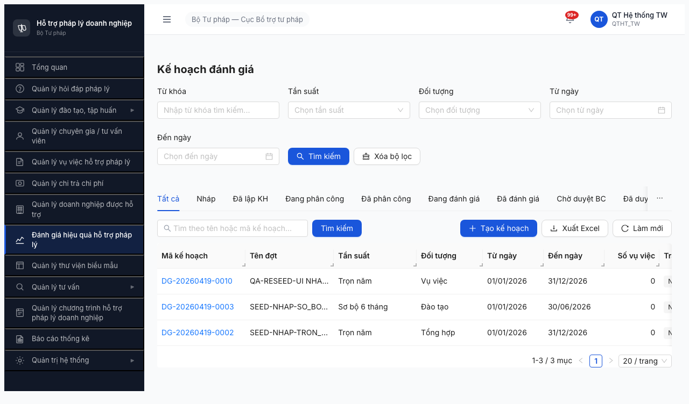
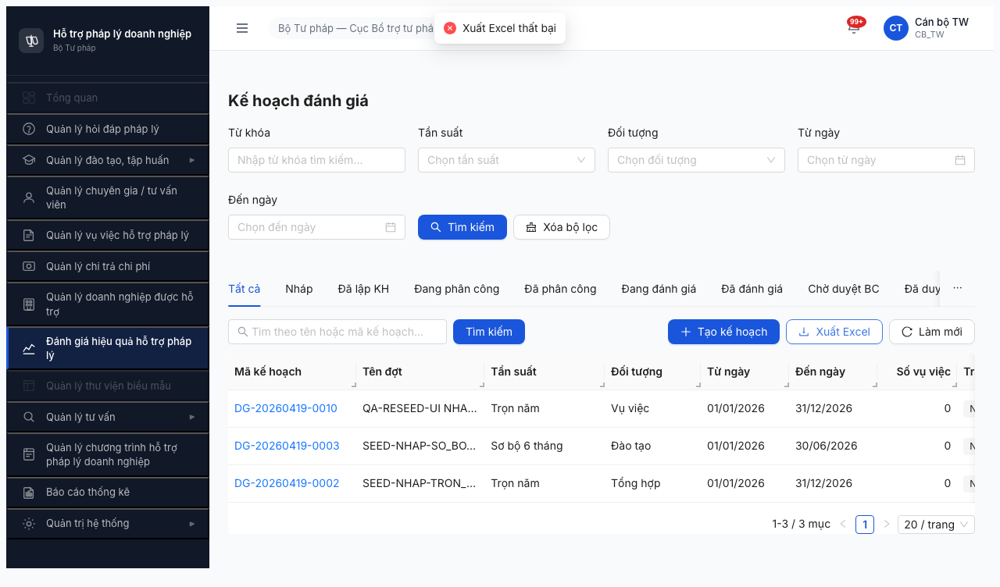

# Bug Report — Module Đánh giá Hiệu quả Hỗ trợ (Round 2)

| Thông tin | Giá trị |
|-----------|---------|
| **Dự án** | PM HTPLDN |
| **Phiên bản** | Round 2 (2026-04-16) |
| **Môi trường** | http://103.172.236.130:3000/ |
| **Người test** | Claude + `/qa-only` (API probe + `/browse` chain) |
| **Ngày** | 14:50 [2026-04-19] (UTC+7) |
| **Loại test** | Functional + Authorization (Hybrid API + UI — pass 2 đã có UI evidence cho các bug critical) |
| **Round** | Round 2 |
| **Tài liệu tham chiếu** | [7.8-danh-gia.md](../../../funtion/7.8-danh-gia.md), [data-readiness-report.md](data-readiness-report.md) |

---

## Tổng hợp

Phát hiện **5** lỗi trong quá trình test functional module Đánh giá.

| Tổng | Critical | Major | Medium | Minor | Trivial |
|------|----------|-------|--------|-------|---------|
| 5    | 3        | 1     | 1      | 0     | 0       |

**Verdict:** **FAIL** — 3 bug Critical về phân quyền / data scope làm vỡ toàn bộ BR-AUTH-05 (phê duyệt cùng cấp) và row-level ownership của `KE_HOACH_DANH_GIA`. Không thể release module Đánh giá đến khi fix BUG-DG-001, BUG-DG-002, BUG-DG-003.

## Bug Summary Table

| Bug ID | Severity | Priority | Type | Module | TC Ref | Title | Status |
|--------|----------|----------|------|--------|--------|-------|--------|
| BUG-DG-001 | Critical | P0 | Permission | Đánh giá | DG-034 | Cross-tier row-level scope leak — CB_NV_BN/DP thấy toàn bộ đợt TW+BN+DP (list/detail + UPDATE/DELETE thành công) | Open |
| BUG-DG-002 | Critical | P0 | Permission | Đánh giá | DG-030 | QTHT (qtht_tw, admin) TẠO được KE_HOACH_DANH_GIA — vi phạm spec "QTHT chỉ Read" | Open |
| BUG-DG-003 | Critical | P0 | Permission | Đánh giá | DG-033 | BN user PATCH/DELETE thành công đợt do TW tạo (0 phân quyền cross-level trên mutation endpoints) | Open |
| BUG-DG-004 | Major | P1 | Data | Đánh giá | — | PATCH `/ke-hoach-danh-gias/:id` silently drop field `trangThai` → trả `success:true` dù state không đổi | Open |
| BUG-DG-005 | Medium | P2 | API | Đánh giá | DG-010 | GET `/ke-hoach-danh-gias/export` không tồn tại (route xung đột với `/:id`) → 400 uuid; POST trả 403 | Open |

> **Chú thích Type:** Permission = phân quyền, Data = toàn vẹn dữ liệu, API = thiếu/sai endpoint.

---

## BUG-DG-001 — Cross-tier data-scope leak: BN/DP thấy toàn bộ đợt của TW + đơn vị khác

| Trường | Chi tiết |
|--------|----------|
| **Bug ID** | BUG-DG-001 |
| **Severity** | Critical |
| **Priority** | P0 |
| **Type** | Permission |
| **Status** | Open |
| **Module** | Đánh giá Hiệu quả HTPLDN |
| **Thành phần** | BE — `GET /api/v1/ke-hoach-danh-gias` (data-scope middleware / query filter) |
| **URL** | http://103.172.236.130:3000/api/v1/ke-hoach-danh-gias |
| **Trình duyệt** | Chromium 146 (headless via `$B`) + curl API probe |
| **Tài khoản** | `canbo_tw`, `canbo_bn`, `canbo_tinh`, `lanhdao_bn` |
| **TC Reference** | DG-034 |
| **SRS Reference** | test-strategy §7.8 "Data scope: CB_NV_BN/DP chỉ thấy đợt thuộc đơn vị mình (row-level), TW thấy tất cả" |
| **Assignee** | Backend Team |
| **Found by** | Claude QA / 2026-04-19 |

### Mô tả

API `GET /ke-hoach-danh-gias` (list + detail) KHÔNG filter theo `donViId` của người gọi. Một `canbo_bn` (Bộ KH&ĐT, donViId `...8001...`) xem list thấy cả record TW (donViId `...8000...`) lẫn DP (donViId `...8002...`) — vi phạm nguyên tắc row-level ownership.

### Các bước tái hiện

1. Login 3 tài khoản khác cấp (TW/BN/DP) qua API, lấy accessToken:
   ```bash
   curl -sX POST http://103.172.236.130:3000/api/v1/auth/login -d '{"username":"canbo_tw","password":"Test@1234"}' | jq .data.otpToken
   curl -sX POST http://103.172.236.130:3000/api/v1/auth/verify-otp -d '{"otpToken":"...","otpCode":"666666"}' | jq .data.accessToken
   # repeat với canbo_bn / canbo_tinh
   ```
2. Mỗi tài khoản tạo 1 đợt đánh giá (hệ BR-DATA-04 auto gán donViId theo user).
3. Gọi `GET /ke-hoach-danh-gias?page=1&pageSize=20` cho từng token.
4. **Quan sát:** cả 3 user thấy cùng 1 tập N record, có đủ donViId `...8000/8001/8002...`.

### Kết quả mong đợi

- `canbo_tw` (donVi `...8000...`) thấy **chỉ** record TW + (nếu scope TW = all) cả BN/DP.
- `canbo_bn` (donVi `...8001...`) thấy **chỉ** record có `donViId = ...8001...` (đơn vị mình).
- `canbo_tinh` (donVi `...8002...`) thấy **chỉ** record có `donViId = ...8002...`.

### Kết quả thực tế

- `canbo_tw` total=9 (toàn bộ)
- `canbo_bn` total=9 (bao gồm cả TW+DP)
- `canbo_tinh` total=9 (bao gồm cả TW+BN)
- `lanhdao_bn` total=9 (bao gồm cả TW+DP)

### Bằng chứng

**API log** (cùng thời điểm, 3 user khác cấp cùng query):

```text
canbo_bn GET /ke-hoach-danh-gias?pageSize=20 → 200 total=9
  DG-20260419-0007 donViId=00000000-0000-4000-8002-000000000001  (DP-owned)
  DG-20260419-0006 donViId=00000000-0000-4000-8001-000000000001  (BN-owned — đúng scope)
  DG-20260419-0005 donViId=00000000-0000-4000-8000-000000000001  (TW-owned — LEAK)
  DG-20260419-0003 donViId=00000000-0000-4000-8000-000000000001  (TW-owned — LEAK)
  DG-20260419-0002 donViId=00000000-0000-4000-8000-000000000001  (TW-owned — LEAK)
  DG-20260419-0001 donViId=00000000-0000-4000-8000-000000000001  (TW-owned — LEAK)
  ...
```

**UI evidence (pass 2):** `canbo_bn` đăng nhập UI → vào module Đánh giá → list hiển thị 3 records đều thuộc donVi TW (`DG-20260419-0010/0003/0002`) — pagination ghi "1-3 / 3 mục". User là "Cán bộ BN" / "CB_BN" nhưng thấy dữ liệu của Cục BTTP (TW).


### Tác động (Impact)

- **100% CB_NV cấp BN/DP có thể đọc dữ liệu đánh giá của Cục BTTP và các Bộ/Sở khác.**
- Khi kết hợp với BUG-DG-003 (mutation endpoints cũng không có scope), BN/DP có thể **xóa, sửa, thay đổi tiêu chí, và truyền đánh giá của TW**.
- Rủi ro lộ thông tin nhạy cảm (điểm đánh giá chưa công bố), rủi ro mất toàn vẹn dữ liệu giữa các cấp.

### So sánh (Comparison)

| Role | List total | See TW records | See BN records | See DP records |
|------|-----------:|:--------------:|:--------------:|:--------------:|
| canbo_tw (TW) | 9 | ✅ (own) | ✅ (allowed per TW scope) | ✅ |
| canbo_bn (BN) | **9** (BUG!) | ❌ — nên hidden | ✅ (own) | ❌ — nên hidden |
| canbo_tinh (DP) | **9** (BUG!) | ❌ — nên hidden | ❌ — nên hidden | ✅ (own) |
| lanhdao_bn (BN) | **9** (BUG!) | ❌ — nên hidden | ✅ (own, scope approve) | ❌ — nên hidden |

### Nguyên nhân nghi ngờ (Root Cause)

Controller/service `ke-hoach-danh-gias` thiếu CASL ability filter hoặc Prisma `where.donViId` theo `req.user.donViId` cho cấp BN/DP. Nghi ngờ controller dùng `findMany({})` unfiltered cho mọi role đã có `permission.can('read','KeHoachDanhGia')`. Cần áp dụng pattern giống module Vụ việc (nơi `canbo_bn` chỉ thấy VV đơn vị mình).

### Gợi ý sửa (Suggested Fix)

1. Áp dụng `@Scope` decorator hoặc Prisma middleware theo đơn vị cho GET list + detail:
   ```ts
   const where = ability.can('read-all', 'KeHoachDanhGia')
     ? {}
     : { donViId: user.donViId };
   ```
2. Trên detail endpoint trả 403 (không phải 404) khi user không thuộc scope của record → tránh enumeration attack.
3. Thêm integration test: `expect(canboBnSees).not.toContain(twRecord.id)`.

---

## BUG-DG-002 — QTHT và admin TẠO được KE_HOACH_DANH_GIA (vi phạm "QTHT chỉ Read")

| Trường | Chi tiết |
|--------|----------|
| **Bug ID** | BUG-DG-002 |
| **Severity** | Critical |
| **Priority** | P0 |
| **Type** | Permission |
| **Status** | Open |
| **Module** | Đánh giá Hiệu quả HTPLDN |
| **Thành phần** | BE — `POST /api/v1/ke-hoach-danh-gias` (role guard / CASL) |
| **URL** | http://103.172.236.130:3000/api/v1/ke-hoach-danh-gias |
| **Tài khoản** | `qtht_tw` (QTHT_TW), `admin` |
| **TC Reference** | DG-030 |
| **SRS Reference** | funtion/7.8-danh-gia.md DG-030: "QTHT xem danh sách đợt (👁️ R) — KHÔNG có nút Tạo/Sửa/Xóa KE_HOACH_DANH_GIA" + permission-matrix.md §8.2 |
| **Assignee** | Backend Team |
| **Found by** | Claude QA / 2026-04-19 |

### Mô tả

Spec quy định QTHT chỉ có quyền Read (👁️ R) trên entity `KE_HOACH_DANH_GIA` — CRUD toàn phần chỉ thuộc về CB_NV. Thực tế `qtht_tw` và `admin` đều tạo thành công record.

### Các bước tái hiện

1. Login `qtht_tw` / `Test@1234`, OTP `666666` → lấy accessToken.
2. `POST /api/v1/ke-hoach-danh-gias` body:
   ```json
   {"tenDot":"AUTHZ-probe","tanSuat":"SO_BO_6_THANG","doiTuong":"VU_VIEC","thoiGianBatDau":"2026-07-01","thoiGianKetThuc":"2026-12-31"}
   ```
3. **Quan sát:** HTTP 201, response `success:true`, record `DG-20260419-0008` được tạo với `trangThai:"NHAP"`.
4. Lặp lại với `admin` → HTTP 201, `DG-20260419-0009` tạo thành công.

### Kết quả mong đợi

- HTTP 403 `ERR-PERM-SYS-00-01` — QTHT và admin không được phép tạo KE_HOACH_DANH_GIA theo matrix phân quyền §8.2.

### Kết quả thực tế

- HTTP 201, record tạo thành công (cả qtht_tw và admin).

### Bằng chứng

**API log:**

```
POST /api/v1/ke-hoach-danh-gias  (Bearer qtht_tw token)
→ 201 { success:true, data:{ id:"ca402c10-6594-439b-a807-10f49d810d3b",
        maKeHoach:"DG-20260419-0008", trangThai:"NHAP", ... } }

POST /api/v1/ke-hoach-danh-gias  (Bearer admin token)
→ 201 { success:true, data:{ id:"27b45643-e780-4949-8f01-86eba74ffc67",
        maKeHoach:"DG-20260419-0009", trangThai:"NHAP", ... } }
```

(So sánh: `lanhdao_tw` — role CB_PD — bị BE chặn 403 đúng như spec.)

**UI evidence (pass 2):** `qtht_tw` ("QT Hệ thống TW" / "QTHT_TW") đăng nhập UI → vào module Đánh giá → toolbar hiển thị đầy đủ nút **`+ Tạo kế hoạch`** (màu xanh, **enabled**) + `Xuất Excel` + `Làm mới`. FE KHÔNG ẩn action cho QTHT → user QTHT chắc chắn sẽ click tạo được → vi phạm spec "QTHT chỉ 👁️ R".



**Kết luận:** lỗi ở cả 2 tầng FE (không ẩn nút theo role) + BE (không chặn API theo role). Cần fix cả 2 để defence-in-depth.

### Tác động (Impact)

- QTHT/admin vượt quyền tạo/xóa data nghiệp vụ — làm mờ boundary QTHT (chỉ vận hành hệ thống + danh mục) vs CB_NV (data thực).
- Audit trail bị sai attribution: record do QTHT tạo nhưng nghiệp vụ cần trace về CB_NV.
- Có thể che giấu hành vi: admin tạo đợt giả + BE không log role alert.

### So sánh (Comparison) — role × action

| Role | LIST | CREATE | DETAIL | Expected CREATE |
|------|:----:|:------:|:------:|:---------------:|
| canbo_tw (CB_NV) | ✅ | ✅ | ✅ | ✅ |
| lanhdao_tw (CB_PD) | ✅ | ❌ 403 | ✅ | ❌ 403 (đúng spec) |
| qtht_tw (QTHT) | ✅ | ✅ **BUG** | ✅ | ❌ 403 |
| admin (QTHT) | ✅ | ✅ **BUG** | ✅ | ❌ 403 |

### Nguyên nhân nghi ngờ (Root Cause)

- Middleware/guard trên `POST /ke-hoach-danh-gias` chưa exclude role QTHT/admin.
- Có thể CASL ability rule dùng `can('manage','all')` hoặc `@Roles('ADMIN')` bao luôn cả QTHT → dùng chung với CB_NV.

### Gợi ý sửa (Suggested Fix)

```ts
// controller
@UseGuards(JwtAuthGuard, AbilityGuard)
@CheckAbility({ action: 'create', subject: 'KeHoachDanhGia' })
create(@User() user, @Body() dto) { ... }

// ability.factory.ts — phải GIỚI HẠN create cho role CB_NV cấp TW/BN/DP, KHÔNG cho QTHT
if (user.vaiTro === 'CB_NV') {
  can('create', 'KeHoachDanhGia');
} else if (user.vaiTro === 'QTHT') {
  can('read', 'KeHoachDanhGia'); // chỉ read
  cannot('create', 'KeHoachDanhGia');
  cannot('update', 'KeHoachDanhGia');
  cannot('delete', 'KeHoachDanhGia');
}
```

---

## BUG-DG-003 — BN user PATCH/DELETE được record do TW tạo (cross-level mutation, 0 ownership guard)

| Trường | Chi tiết |
|--------|----------|
| **Bug ID** | BUG-DG-003 |
| **Severity** | Critical |
| **Priority** | P0 |
| **Type** | Permission |
| **Status** | Open |
| **Module** | Đánh giá Hiệu quả HTPLDN |
| **Thành phần** | BE — `PATCH /api/v1/ke-hoach-danh-gias/:id` + `DELETE /api/v1/ke-hoach-danh-gias/:id` |
| **Tài khoản** | `canbo_bn` tamper record do `canbo_tw` tạo |
| **TC Reference** | DG-033 (BR-AUTH-05) + DG-034 extension |
| **SRS Reference** | BR-AUTH-05: "Phê duyệt cùng cấp — CB NV cấp nào tạo → CB PD cùng cấp duyệt" (suy rộng: mutation cùng cấp + cùng đơn vị) |
| **Assignee** | Backend Team |
| **Found by** | Claude QA / 2026-04-19 |

### Mô tả

Ngoài việc LIST/DETAIL rò rỉ (BUG-DG-001), các endpoint mutation (`PATCH`, `DELETE`) cũng không kiểm tra ownership theo `donViId`. `canbo_bn` sửa được `tenDot` và xóa được record của TW → mất toàn vẹn dữ liệu cấp chéo.

### Các bước tái hiện

1. `canbo_tw` tạo đợt `DG-20260419-0001` (donVi TW, id `57a707aa-ac54-405a-85b1-983cd88f0223`).
2. Login `canbo_bn` (donVi BN khác), lấy accessToken.
3. PATCH record TW với body `{"tenDot":"BN-TAMPERED","version":1}`:
   ```bash
   curl -X PATCH -H "Authorization: Bearer $CB_BN" \
     -H "Content-Type: application/json" \
     -d '{"tenDot":"BN-TAMPERED","version":1}' \
     "http://103.172.236.130:3000/api/v1/ke-hoach-danh-gias/57a707aa-..."
   ```
   → 200 `success:true`, `tenDot` thành `BN-TAMPERED`, `nguoiCapNhatId` đổi thành id của BN user.
4. DELETE record TW:
   ```bash
   curl -X DELETE -H "Authorization: Bearer $CB_BN" \
     "http://103.172.236.130:3000/api/v1/ke-hoach-danh-gias/57a707aa-..."
   ```
   → 204 No Content.
5. GET detail cùng id → 404 `ERR-SYS-00-04-01 "Kế hoạch đánh giá không tồn tại"`.
6. List `canbo_tw` → record `DG-20260419-0001` biến mất.

### Kết quả mong đợi

- PATCH cross-unit → **403 `ERR-PERM-SYS-00-01`** (không cùng đơn vị/cùng cấp).
- DELETE cross-unit → **403**.
- Dữ liệu `tenDot` không bị thay đổi; record vẫn tồn tại cho TW.

### Kết quả thực tế

- PATCH → 200, data mutated.
- DELETE → 204, record mất khỏi hệ thống.
- **Permanent data loss khả thi từ BN account cho bất kỳ record TW nào.**

### Bằng chứng

```
PATCH /ke-hoach-danh-gias/57a707aa-... (Bearer canbo_bn token)
body: {"tenDot":"BN-TAMPERED","version":1}
→ 200 { success:true,
        data:{ id:"57a707aa-...", tenDot:"BN-TAMPERED", version:2,
               nguoiCapNhatId:"11111111-0001-4000-8000-000000000006",  ← BN user
               donViId:"00000000-0000-4000-8000-000000000001",          ← TW don vi (vẫn giữ)
               trangThai:"NHAP", ... } }

DELETE /ke-hoach-danh-gias/57a707aa-... (Bearer canbo_bn token)
→ 204 No Content

GET /ke-hoach-danh-gias/57a707aa-... (Bearer canbo_tw token sau đó)
→ 404 { success:false, error:{ code:"ERR-SYS-00-04-01",
        message:"Kế hoạch đánh giá không tồn tại" } }

GET /ke-hoach-danh-gias?page=1&pageSize=20 (Bearer canbo_tw)
→ 200 total=7 (trước đó 9) — DG-20260419-0001 biến mất.
```

### Tác động (Impact)

- **Toàn bộ dữ liệu KE_HOACH_DANH_GIA có thể bị tamper/xóa từ bất kỳ account CB_NV cấp nào.** Không có lớp guard nào chặn cross-unit mutation.
- Ảnh hưởng toàn bộ workflow đánh giá hiệu quả theo TT17/2025 — báo cáo cuối kỳ có thể bị giả mạo.
- Vi phạm BR-DATA-05 (audit trail) — `nguoiCapNhatId` chỉ log người tamper chứ không chặn hành vi.
- Có thể bắc cầu sang các endpoint nested (`/{id}/tieu-chis`, `/{id}/bao-cao/*`) — chưa audit, nhưng khả năng cao cũng chia sẻ pattern.

### Nguyên nhân nghi ngờ (Root Cause)

Controller `update` / `remove` gọi thẳng service `prisma.keHoachDanhGia.update({ where: { id } })` mà không verify `record.donViId === user.donViId` (hoặc `user.role === 'TW' && canManageAllUnits`).

### Gợi ý sửa (Suggested Fix)

1. Thêm ownership check trong service:
   ```ts
   async update(id, user, dto) {
     const r = await this.prisma.keHoachDanhGia.findUniqueOrThrow({ where: { id } });
     if (user.capHanhChinh !== 'TW' && r.donViId !== user.donViId) {
       throw new ForbiddenException('ERR-PERM-SYS-00-01');
     }
     // ... continue
   }
   ```
2. Tương tự cho `remove` và mọi endpoint nested.
3. Integration test mandatory: 3×3 matrix (TW/BN/DP creator × TW/BN/DP editor) — chỉ đường chéo + (TW editor edit tất cả) được PASS.
4. Rà soát các module khác (Vụ việc, Chi trả, Tiêu chí) xem có cùng lỗ hổng — khả năng cao là pattern lặp lại.

---

## BUG-DG-004 — PATCH silently drops `trangThai` field (trả success nhưng state không đổi)

| Trường | Chi tiết |
|--------|----------|
| **Bug ID** | BUG-DG-004 |
| **Severity** | Major |
| **Priority** | P1 |
| **Type** | Data |
| **Status** | Open |
| **Module** | Đánh giá Hiệu quả HTPLDN |
| **Thành phần** | BE — `PATCH /api/v1/ke-hoach-danh-gias/:id` (DTO whitelist) |
| **Tài khoản** | `canbo_tw` |
| **TC Reference** | DG-002 + data-readiness §1A.3 |
| **SRS Reference** | funtion/7.8-danh-gia.md state machine SM-DANHGIA — chuyển trạng thái phải đi qua transition endpoint chuyên biệt, KHÔNG qua PATCH chung. |
| **Assignee** | Backend Team |
| **Found by** | Claude QA / 2026-04-19 (đã note trong data-readiness §1A.3) |

### Mô tả

`PATCH /ke-hoach-danh-gias/:id` với body chứa `{"trangThai":"DA_DUYET_BC","version":1}` trả `200 success:true` nhưng BE silently drop field → `trangThai` vẫn giữ nguyên, `version` KHÔNG tăng. Hành vi này hiện an toàn (không bypass state machine) nhưng gây hiểu nhầm nguy hiểm.

### Các bước tái hiện

1. `canbo_tw` tạo đợt mới (NHAP).
2. PATCH với `{"trangThai":"DA_LAP_KH","version":1}` hoặc state bất kỳ khác.
3. Response: `200 success:true`, data trả về `trangThai` nguyên NHAP, `version` vẫn 1.

### Kết quả mong đợi

- HTTP 400 `ERR-VAL-SYS-00-01` với message `property trangThai should not exist` (cấu hình `whitelist:true, forbidNonWhitelisted:true` trong class-validator).
- Developer/tester được cảnh báo ngay rằng PATCH không hợp lệ để đổi state.

### Kết quả thực tế

- HTTP 200, `success:true`, nhưng state không đổi. "Silent drop".

### Tác động

- Developer/tester code integration test dựa trên `response.success === true` → nhầm state đã đổi → bug ẩn.
- Automation script có thể đi nhầm path (PATCH thay vì dedicated transition endpoint).
- Log audit bị nhiễu (success record PATCH không thay đổi gì).

### Nguyên nhân nghi ngờ

DTO `UpdateKeHoachDanhGiaDto` khai báo `whitelist:true, forbidNonWhitelisted:false` (default NestJS) → extra fields bị strip silent. Cần bật `forbidNonWhitelisted:true`.

### Gợi ý sửa

```ts
// main.ts
app.useGlobalPipes(new ValidationPipe({
  whitelist: true,
  forbidNonWhitelisted: true,  // ← bật để reject extra fields
  transform: true,
}));
```

Hoặc dùng decorator `@Forbidden()` cho `trangThai` trong UpdateDto.

---

## BUG-DG-005 — Endpoint xuất Excel danh sách đợt không tồn tại / route xung đột

| Trường | Chi tiết |
|--------|----------|
| **Bug ID** | BUG-DG-005 |
| **Severity** | Medium |
| **Priority** | P2 |
| **Type** | API |
| **Status** | Open |
| **Module** | Đánh giá Hiệu quả HTPLDN |
| **Thành phần** | BE — `GET /api/v1/ke-hoach-danh-gias/export` (route định nghĩa sai thứ tự?) |
| **Tài khoản** | `canbo_tw` |
| **TC Reference** | DG-010 |
| **SRS Reference** | DG-010: "Xuất Excel danh sách đợt đánh giá (toolbar)" |
| **Assignee** | Backend Team |
| **Found by** | Claude QA / 2026-04-19 |

### Mô tả

Spec yêu cầu nút "Xuất Excel" trên toolbar module Đánh giá. FE (`data-readiness §7.4`) tham chiếu method `export` trong service. API thực tế:

- `GET /ke-hoach-danh-gias/export` → **400 `Validation failed (uuid is expected)`** (route conflict với `/:id` handler).
- `GET /ke-hoach-danh-gias/export?all=1` → cùng 400.
- `POST /ke-hoach-danh-gias/export` → **403 Forbidden** (role guard), không rõ path có đúng không.

### Các bước tái hiện

**API:**
1. Login `canbo_tw`.
2. `curl -H "Authorization: Bearer $TOKEN" http://103.172.236.130:3000/api/v1/ke-hoach-danh-gias/export -o out.bin`
3. Response: `HTTP/1.1 400`, body `{"success":false,"error":{"code":"ERR-VAL-SYS-00-00","message":"Validation failed (uuid is expected)"}}`.

**UI (pass 2):**
1. Login `canbo_tw` qua UI → vào module Đánh giá.
2. Click nút **"Xuất Excel"** trên toolbar.
3. Quan sát: toast đỏ **"Xuất Excel thất bại"** hiện góc trên-phải; file KHÔNG được tải.
4. Network tab (qua `$B network`): `POST /api/v1/ke-hoach-danh-gias/export?page=1&pageSize=20 → 403 (19ms)`.



→ FE dùng path **POST** `/export?page=...` (khác với API probe GET); BE vẫn trả **403 cho chính role CB_NV (canbo_tw — đúng chủ dữ liệu)** → thêm 1 dimension bug: ngay role có quyền đọc list cũng không export được.

### Kết quả mong đợi

- `POST /api/v1/ke-hoach-danh-gias/export?page=1&pageSize=20` trả `200` + `Content-Type: application/vnd.openxmlformats-officedocument.spreadsheetml.sheet` + file `.xlsx`.
- CB_NV (canbo_tw) có quyền xuất danh sách chính mình đọc được.

### Kết quả thực tế

- `GET /export` bị bắt bởi handler `/:id` → xin UUID trong path param → 400 (path conflict, phụ).
- `POST /export` (path FE thực tế dùng) → **403 cho chính role CB_NV TW** (chủ dữ liệu). Toast UI "Xuất Excel thất bại" hiện.
- BE thiếu `@CheckAbility('export', 'KeHoachDanhGia')` hoặc permission `export_ke_hoach_danh_gia` chưa được grant cho role CB_NV (trong khi các permission khác như `create`/`read`/`update` đã grant).

### Tác động

- DG-010 functional test BLOCKED — UI nút "Xuất Excel" vẫn hiển thị (xem screenshot data-readiness `danh-gia-nhap-3-rows.png`), user click sẽ nhận lỗi.
- UX broken trên action chính toolbar.

### Nguyên nhân nghi ngờ

1. Controller chưa declare route `/export` TRƯỚC route `/:id` → NestJS Express route order coi `/export` là `:id="export"`.
2. Hoặc method `@Post('/export')` khai báo nhưng missing role guard → 403.

### Gợi ý sửa

```ts
// controller — bắt buộc đặt trước `@Get(':id')`
@Get('export')
@Header('Content-Type', 'application/vnd.openxmlformats-officedocument.spreadsheetml.sheet')
async export(@Query() filters, @User() user) {
  return this.service.exportExcel(filters, user);
}
```

Hoặc đổi sang POST với body filter → cần public kèm role CB_NV+ có thể xuất.

---

## Phụ lục

### A — Môi trường test

| Thành phần | Giá trị |
|------------|---------|
| URL ứng dụng | http://103.172.236.130:3000/ |
| OTP login | `666666` (bypass tạm — apply mọi account test) |
| MailHog (fallback) | http://103.172.236.130:8025 |
| API base | http://103.172.236.130:3000/api/v1/ |
| Frontend | React + Vite + Ant Design + CASL |
| Backend | NestJS + PostgreSQL (+ Prisma) |
| Xác thực | JWT + OTP 2-step (login → otpToken → verify-otp → accessToken) |

### B — Tài khoản sử dụng

| Username | Vai trò | Cấp | Dùng cho bug nào |
|----------|---------|-----|------------------|
| canbo_tw | CB_NV | TW | BUG-DG-004, baseline so sánh trong BUG-DG-001/002/003 |
| canbo_bn | CB_NV | BN | BUG-DG-001, BUG-DG-003 |
| canbo_tinh | CB_NV | DP | BUG-DG-001 |
| lanhdao_bn | CB_PD | BN | BUG-DG-001 (list leak) |
| lanhdao_tw | CB_PD | TW | Baseline — xác nhận 403 đúng spec |
| qtht_tw | QTHT | TW | BUG-DG-002 |
| admin | QTHT | TW | BUG-DG-002 |
| nht_user, dn_user, tvv_user, chuyengia_user | Portal | — | Baseline — xác nhận 403 đúng spec |

### C — Danh mục ảnh chụp

| File | Mô tả | Dùng cho bug |
|------|-------|--------------|
| [danh-gia-list-empty.png](danh-gia-list-empty.png) | Tab "Tất cả" empty state (pre-seed, 2026-04-19 13:58) | Context — trước seed |
| [danh-gia-nhap-3-rows.png](danh-gia-nhap-3-rows.png) | UI list sau seed — 3 rows NHAP, 9 tabs state, toolbar "Tạo kế hoạch / Xuất Excel" | Chứng cứ DG-001 (UI layout) + context BUG-DG-005 (nút Xuất Excel hiển thị) |
| [screenshots/ui-cbtw-landing-403.png](screenshots/ui-cbtw-landing-403.png) | Sau login canbo_tw, landing /403 (sidebar đầy đủ — CB_NV không có dashboard default, PASS) | Context authz test |
| [screenshots/ui-cbtw-list.png](screenshots/ui-cbtw-list.png) | **Pass 2** canbo_tw list Đánh giá — 3 rows, 9 tabs state, toolbar đủ | DG-001 context |
| [screenshots/ui-cbtw-create-drawer.png](screenshots/ui-cbtw-create-drawer.png) | **Pass 2** drawer "Tạo kế hoạch đánh giá" 7 field | DG-002 context |
| [screenshots/ui-cbtw-export-click.png](screenshots/ui-cbtw-export-click.png) | **Pass 2** toast đỏ "Xuất Excel thất bại" sau click | **BUG-DG-005** |
| [screenshots/ui-qtht-list.png](screenshots/ui-qtht-list.png) | **Pass 2** qtht_tw list — nút "+ Tạo kế hoạch" VẪN hiện + enabled | **BUG-DG-002** |
| [screenshots/ui-cbbn-list.png](screenshots/ui-cbbn-list.png) | **Pass 2** canbo_bn list — 3 records TW-owned hiển thị | **BUG-DG-001** |
| [screenshots/ui-nht-landing.png](screenshots/ui-nht-landing.png) | **Pass 2** nht_user landing /403, menu Đánh giá grayed-out | DG-035 context |

---

*Bug report generated: 2026-04-19 | Claude QA Automation via Claude Code (/qa-only skill)*
