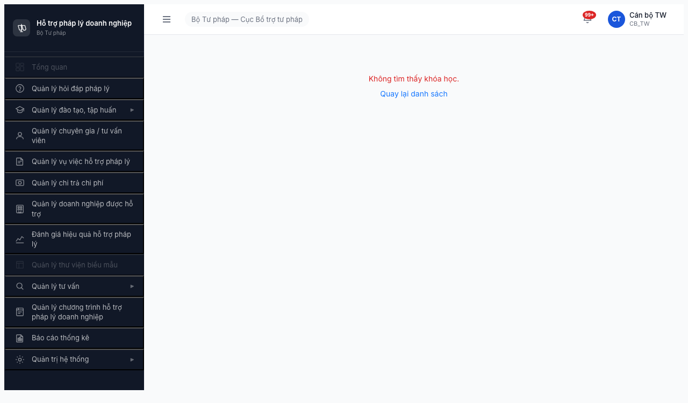

# Bug Report — Quản lý Đào tạo, Tập huấn

| Thông tin | Giá trị |
|-----------|---------|
| **Dự án** | PM Hỗ trợ Pháp lý Doanh nghiệp (HTPLDN) |
| **Phiên bản** | v1.0 (test env) |
| **Môi trường** | http://103.172.236.130:3000/ |
| **Người test** | QA Automation (Claude Code) |
| **Ngày** | 16:30–17:10 · 2026-04-19 |
| **Loại test** | Functional + UI-diff Prototype |
| **Round** | Round 2 |
| **Tài liệu tham chiếu** | [funtion/7.3-dao-tao-tap-huan.md](../../../funtion/7.3-dao-tao-tap-huan.md), [data-readiness-dao-tao.md](data-readiness-dao-tao.md), [Prototype](https://prototype-dusky-alpha.vercel.app/dao-tao/danh-sach.html) |

---

## Tổng hợp

Phát hiện **7** lỗi trong quá trình test Lệnh 4 module Quản lý Đào tạo, Tập huấn.

| Tổng | Critical | Major | Medium | Minor | Trivial |
|------|----------|-------|--------|-------|---------|
| 7    | 2        | 1     | 1      | 3     | 0       |

> **Lưu ý:** BUG-DT-01 / BUG-DT-02 / BUG-DT-03 đã phát hiện ở Lệnh 3 (data-readiness) — re-verified ở Lệnh 4 + viết đầy đủ với đủ template field.

## Bug Summary Table

| Bug ID | Severity | Priority | Type | Module | TC Ref | Title | Status |
|--------|----------|----------|------|--------|--------|-------|--------|
| BUG-DT-01 | Critical | P0 | UI/UX | Khóa học | DT-004 | Click "Thêm mới" trên KH list → URL `/dao-tao/khoa-hoc/tao-moi` hiển thị "Không tìm thấy khóa học" (routing conflict) | Open |
| BUG-DT-02 | Critical | P0 | Performance/FE | CTDT | DT-020→DT-029 | Mở trang chi tiết CTDT (click "Xem") → Chromium tab crash (`Target page, context or browser has been closed`) | Open |
| BUG-DT-03 | Major | P0 | Permission | NHCH | DT-008 | Sidebar "Ngân hàng câu hỏi" disabled (xám) cho CB_NV TW → click → `/403` — khác SRS v3 | Open |
| BUG-DT-04 | Medium | P1 | Data/UI | CTDT | DT-002 | Bộ lọc "Từ khóa" trên CTDT list không filter (kết quả giống nhau cho từ khóa khớp / không khớp) | Open |
| BUG-DT-05 | Minor | P2 | UI/UX | CTDT | DT-012 | CTDT list thiếu nút **"Xuất Excel"** ở đầu trang (Prototype có) → block thao tác xuất Excel khi không có entry | Open |
| BUG-DT-06 | Minor | P2 | UI/UX | CTDT | DT-001 | CTDT list thiếu **tab cấp cao** "Chương trình đào tạo / Đề xuất đào tạo" (Prototype có) → không vào được màn Đề xuất qua sidebar | Open |
| BUG-DT-07 | Minor | P2 | UI/UX | CTDT/KH | DT-001 | Có **2 ô Tìm kiếm** chồng nhau (top SearchPanel + ProTable built-in search) — bố cục khác Prototype, gây nhầm lẫn | Open |

> **Chú thích type:** Critical = block core feature / data integrity, Major = key feature wrong but workaround, Medium = UX broken / minor logic, Minor = UI polish. Priority P0 (fix trước release) → P3 (backlog).

---

## BUG-DT-01 — Click "Thêm mới" trên KH list → trang `/dao-tao/khoa-hoc/tao-moi` hiển thị "Không tìm thấy khóa học"

| Trường | Chi tiết |
|--------|----------|
| **Bug ID** | BUG-DT-01 |
| **Severity** | Critical |
| **Priority** | P0 |
| **Type** | UI/UX (FE routing) |
| **Status** | Open |
| **Module** | Quản lý Đào tạo / Khóa học |
| **Thành phần** | `src/routes/router.tsx` (route `/dao-tao/khoa-hoc/:id` nhận `tao-moi` làm `id`) |
| **URL** | http://103.172.236.130:3000/dao-tao/khoa-hoc/tao-moi |
| **Trình duyệt** | Chromium headless 1208 (Playwright) |
| **Tài khoản** | canbo_tw / Test@1234 (CB_NV TW, Cục BTTP) |
| **TC Reference** | DT-004 (Tạo khóa học con → auto-gen `KH-{YYYYMMDD}-{SEQ}`) |
| **SRS Reference** | FR-III-KH-Create (UC20), BR-DATA-04 |
| **Assignee** | FE Team |
| **Found by** | QA Automation (Lệnh 3 + re-verify Lệnh 4) |

### Mô tả

Trên trang danh sách Khóa học, click nút **"+ Thêm mới"** không mở form tạo khóa học mà chuyển URL `/dao-tao/khoa-hoc/tao-moi` rồi hiển thị thông báo đỏ **"Không tìm thấy khóa học."** + link **"Quay lại danh sách"**. Router đang parse `tao-moi` như `:id` parameter và thực thi query detail → không match DB → 404 logic.

### Các bước tái hiện

1. Mở http://103.172.236.130:3000/login → đăng nhập `canbo_tw` / `Test@1234` + OTP `666666`.
2. Sidebar → **Quản lý đào tạo, tập huấn** → **Khóa học** → URL `/dao-tao/khoa-hoc/danh-sach`.
3. Click nút **"+ Thêm mới"** ở đầu panel bảng (phía trên-phải).
4. **Quan sát:** URL chuyển sang `/dao-tao/khoa-hoc/tao-moi`, trang chỉ hiển thị dòng đỏ "Không tìm thấy khóa học." + link "Quay lại danh sách".

### Kết quả mong đợi

- Mở form/modal tạo khóa học mới (hoặc trang `/dao-tao/khoa-hoc/tao-moi` dạng create).
- Form yêu cầu chọn **CTDT cha** (FK `chuong_trinh_id`), nhập tên, hình thức (Trực tuyến/Trực tiếp), ngày bắt đầu/kết thúc, giảng viên.
- Sau submit → auto-gen mã `KH-{YYYYMMDD}-{SEQ}` (theo **BR-DATA-04**), redirect về list.

### Kết quả thực tế

- URL đổi sang `/dao-tao/khoa-hoc/tao-moi` nhưng trang render view **chi tiết khóa học trong trạng thái 404**.
- Không có form tạo. Route không tồn tại.
- Console: không quan sát được lỗi JS cụ thể (không fail call API).

### Bằng chứng



_Trang hiển thị "Không tìm thấy khóa học." + link "Quay lại danh sách" — sidebar "Quản lý đào tạo, tập huấn" vẫn mở_

(Re-verify bug đã có từ Lệnh 3: xem `images/dt3-kh-tao-moi-404.png`)

### Tác động (Impact)

- **Block 100% flow tạo khóa học qua UI** → không QA được DT-004 → DT-007, DT-011, DT-017 → DT-031, DT-038 (~ **22/40 TC** pre-blocked).
- Ảnh hưởng **tất cả CB_NV** (TW/BN/DP). Không có workaround UI — phải seed data qua SQL/API.

### Nguyên nhân nghi ngờ (Root Cause)

- Thứ tự route trong React Router sai:
  ```
  /dao-tao/khoa-hoc/:id        ← route detail khóa học, bắt mọi segment sau /khoa-hoc/
  /dao-tao/khoa-hoc/tao-moi    ← route tạo mới (nếu có, đang bị che bởi :id)
  ```
  Do `:id` khớp trước, segment `tao-moi` bị truyền vào controller detail → query `KhoaHoc.findById('tao-moi')` không match → view "Không tìm thấy".
- **Hoặc** page create chưa được FE implement (component create chưa tồn tại, BE đã sẵn sàng).

### Gợi ý sửa (Suggested Fix)

```diff
// src/routes/router.tsx (pseudo)
<Route path="/dao-tao/khoa-hoc" element={<KhoaHocList />} />
+ <Route path="/dao-tao/khoa-hoc/tao-moi" element={<KhoaHocCreate />} />
  <Route path="/dao-tao/khoa-hoc/:id" element={<KhoaHocDetail />} />
  <Route path="/dao-tao/khoa-hoc/:id/chinh-sua" element={<KhoaHocEdit />} />
```

1. Route `/tao-moi` phải khai báo **trước** `/:id` hoặc dùng `exact` / path group rõ ràng.
2. Bổ sung component `<KhoaHocCreate />` với form đúng spec (CTDT cha, hình thức, ngày, GV), auto-gen mã theo BR-DATA-04.
3. Sau khi sửa, verify thêm: `/dao-tao/ctdt/:id/khoa-hoc/tao-moi` (path alternative — tạo KH từ trang detail CTDT cha) nếu có.

---

## BUG-DT-02 — Trang chi tiết CTDT (click "Xem") làm Chromium tab crash

| Trường | Chi tiết |
|--------|----------|
| **Bug ID** | BUG-DT-02 |
| **Severity** | Critical |
| **Priority** | P0 |
| **Type** | Performance / FE (page crash — possible memory/infinite loop) |
| **Status** | Open |
| **Module** | Quản lý Đào tạo / Chương trình đào tạo — Detail |
| **Thành phần** | `src/pages/dao-tao/chuong-trinh/detail/*.tsx` (suspected) |
| **URL** | http://103.172.236.130:3000/dao-tao/chuong-trinh/{id} (sample: `CTDT-BTP-TW-2026-0001`) |
| **Trình duyệt** | Chromium headless 1208 (Playwright) — crash tab sau 2-4s. Cần dev verify trên Chrome/Edge real. |
| **Tài khoản** | canbo_tw + lanhdao_tw (reproducible cả 2 role) |
| **TC Reference** | DT-020 → DT-029 (mọi TC workflow CTDT/KH đều block) |
| **SRS Reference** | UC20 (xem/sửa CTDT), UC33 (gửi phê duyệt), UC34 (duyệt CTDT) |
| **Assignee** | FE Team |
| **Found by** | QA Automation — Lệnh 3 & Lệnh 4 |

### Mô tả

Khi click nút **"Xem"** trên row CTDT ở danh sách, trang chuyển sang detail và Playwright Chromium tab crash (`Target page, context or browser has been closed`). URL về `about:blank`. Không thể snapshot / interact. Tái hiện liên tục mọi session (≥5 lần Lệnh 3 + Lệnh 4).

### Các bước tái hiện

1. Login `canbo_tw` hoặc `lanhdao_tw`.
2. Sidebar → **Quản lý đào tạo, tập huấn** → **Chương trình đào tạo**.
3. Tab **Tất cả** / **Chờ duyệt** → row `CTDT-BTP-TW-2026-0001` → cột **Hành động** → click **"Xem"**.
4. **Quan sát:** Sau ~2-4s page context đóng. Playwright báo crash. URL về `about:blank`.

### Kết quả mong đợi

- Mở trang chi tiết CTDT với tabs: **Thông tin chung**, **Khóa học con**, **Lịch sử**, **Đính kèm**.
- Nút action tùy role: CB_NV → "Sửa" / "Gửi phê duyệt" / "Xóa"; CB_PD → "Duyệt" / "Từ chối" + lý do.
- Load dưới 2s, không crash.

### Kết quả thực tế

- Chromium context crash trong 2-4s sau khi bấm "Xem".
- Không có console error trước crash (tab chết trước khi console log được).
- Không có API response cụ thể để trace (tab crash trước response).

### Bằng chứng

- Ghi nhận trong Lệnh 3 data-readiness: [data-readiness-dao-tao.md §Lệnh 3 — BUG-DT-02](data-readiness-dao-tao.md#-bug-dt-02--ctdt-detail-page-crash-browse-high-renderperf)
- Playwright log (trích):
  ```
  [click] ERROR: click: Target page, context or browser has been closed
  Call log: waiting for locator('<detail tab selector>')
  ```

### Tác động (Impact)

- **Block mọi TC xem/sửa/phê duyệt/quản lý khóa học con của CTDT** → ảnh hưởng **workflow core** của module (SM-KHOAHOC).
- Nếu crash xảy ra trên Chrome real (chưa verify) → user không dùng được module. Urgent.

### Phân loại Rule 9

- Ambiguous giữa **REAL CRASH Playwright** (target closed) và **APP/FE BUG** (JS-heavy render crash page context).
- **Khuyến nghị QA next round:** dev test thử trên Chrome/Edge thật để phân biệt, và QA fetch `/dao-tao/chuong-trinh/{id}` qua HTTP để kiểm tra response code + HTML structure.

### Nguyên nhân nghi ngờ (Root Cause)

- Có thể **infinite loop** hoặc **unbounded re-render** trong component detail (React `useEffect` thiếu deps / memoization).
- Có thể component **query tất cả khóa học con** (N-N) mà không paginate → out-of-memory với CTDT có nhiều KH.
- Có thể **chart/visualization** (recharts/chartjs) render nặng mà không lazy.

### Gợi ý sửa (Suggested Fix)

1. Dev reproduce trên Chrome DevTools local → mở Performance tab, check CPU / memory khi mở detail.
2. Kiểm tra `useEffect` / `useMemo` / `useCallback` dep arrays.
3. Thêm **error boundary** quanh detail component + **skeleton loading**.
4. Nếu detail query nhiều khóa học con → paginate sub-list thay vì load all.
5. Chạy E2E test với 1 CTDT đơn giản (không KH con) — nếu không crash → confirm cause là KH con render.

---

## BUG-DT-03 — Sidebar "Ngân hàng câu hỏi" disabled cho CB_NV TW, click ra `/403`

| Trường | Chi tiết |
|--------|----------|
| **Bug ID** | BUG-DT-03 |
| **Severity** | Major |
| **Priority** | P0 |
| **Type** | Permission (RBAC config khác SRS) |
| **Status** | Open |
| **Module** | Quản lý Đào tạo / Ngân hàng câu hỏi |
| **Thành phần** | `src/utils/auth-rules.ts` + `src/components/AppShell/nav-structure.ts` (suspected) |
| **URL** | http://103.172.236.130:3000/dao-tao/ngan-hang-cau-hoi |
| **Trình duyệt** | Chromium headless 1208 (Playwright) |
| **Tài khoản** | canbo_tw (CB_NV TW, Cục BTTP) |
| **TC Reference** | DT-008 (CRUD NHCH 3 loại), DT-009, DT-018 (ERR-NHCH-02), DT-039 (WRN-NHCH-01) |
| **SRS Reference** | UC28 (CRUD câu hỏi), permission-matrix §8.1 "CB_NV → CAU_HOI: C R U D*" |
| **Assignee** | BE Team (CASL/ability rules) + FE Team (nav-structure disable flag) |
| **Found by** | QA Automation — Lệnh 3 |

### Mô tả

Sidebar item **"Ngân hàng câu hỏi"** cho user CB_NV TW (`canbo_tw`) hiển thị màu **xám (disabled)**. Click vẫn navigate về URL đúng nhưng trang hiển thị **"Bạn không có quyền truy cập trang này"** (`/403`). Theo [permission-matrix §8.1](../../../permission-matrix.md), CB_NV **phải có** quyền CRUD* trên entity `CAU_HOI` và `DE_KIEM_TRA`. Đây là khác biệt giữa RBAC config runtime và SRS v3.

### Các bước tái hiện

1. Login `canbo_tw` / `Test@1234` + OTP `666666`.
2. Sidebar → **Quản lý đào tạo, tập huấn** → mở submenu.
3. **Quan sát:** "Chương trình đào tạo", "Khóa học", "Giảng viên" enabled (trắng), "Ngân hàng câu hỏi" **xám / disabled**.
4. Click **"Ngân hàng câu hỏi"**.
5. **Quan sát:** URL chuyển `/dao-tao/ngan-hang-cau-hoi`, trang hiển thị `/403` page "Bạn không có quyền truy cập trang này".

### Kết quả mong đợi

- CB_NV TW **có quyền** CRUD câu hỏi trong ngân hàng — sidebar enabled.
- Click vào → mở list câu hỏi (248 câu) với 4 thẻ thống kê (Tổng / Trắc nghiệm / Tự luận / Lĩnh vực) + bảng 3 loại (TN1, TN-nhiều, Tự luận).
- Nút **"+ Thêm mới"** + **"Import Excel"** (theo Prototype `/dao-tao/ngan-hang-cau-hoi.html`).

### Kết quả thực tế

- Sidebar disabled (xám, không clickable visually but clickable navigate).
- Click → `/403` "Bạn không có quyền".
- Không thể truy cập CRUD NHCH → block **DT-008, DT-009, DT-018, DT-039** (4 TC).

### Bằng chứng

- Screenshot Lệnh 3: [images/dt-nhch.png](images/dt-nhch.png) — trang 403 + sidebar disabled
- Prototype expected: [images/proto-nhch.png](images/proto-nhch.png) — full NHCH page 248 câu + filters

### Tác động (Impact)

- **Block 4 TC NHCH (DT-008 P0, DT-009 P1, DT-018 P1, DT-039 P1)**.
- Ảnh hưởng **tất cả CB_NV** (cấp TW/BN/DP) — toàn bộ cán bộ nghiệp vụ KHÔNG tạo được câu hỏi → KHÔNG tạo được đề kiểm tra → KHÔNG chấm điểm được → workflow kiểm tra hoàn toàn đứt.
- Theo permission-matrix §8.1, config hiện tại vi phạm SRS → cần sửa RBAC.

### Comparison — Role × Action matrix

| Role | Sidebar "NHCH" enabled | Page `/dao-tao/ngan-hang-cau-hoi` accessible |
|------|-----------------------|---------------------------------------------|
| QTHT | — (cần verify) | — |
| CB_NV (TW/BN/DP) | ❌ disabled (BUG!) | ❌ `/403` (BUG!) — kỳ vọng ✅ |
| CB_PD (TW/BN/DP) | — (cần verify) | — |
| LĐ_DP | — (cần verify) | — |

### Nguyên nhân nghi ngờ (Root Cause)

- `auth-rules.ts` thiếu `ability.can('manage', 'CAU_HOI')` cho role `CB_NV`.
- Hoặc backend middleware `Guard` chặn `CB_NV` → BE trả 403.
- Nav structure có flag `disabled: ability.cannot('read', 'CAU_HOI')` kích hoạt khi role CB_NV.

### Gợi ý sửa (Suggested Fix)

```diff
// src/utils/auth-rules.ts (pseudo)
if (role === 'CB_NV') {
  can('manage', 'ChuongTrinhDaoTao');
  can('manage', 'KhoaHoc');
  can('manage', 'GiangVien');
+ can('manage', 'CauHoi');
+ can('manage', 'DeKiemTra');
}
```

1. Thêm rule CASL cho CB_NV trên `CauHoi` và `DeKiemTra`.
2. BE controller `/api/v1/cau-hois` remove `@Roles('CB_PD', 'QTHT')` restriction hoặc thêm `'CB_NV'`.
3. Sau sửa: verify cả sidebar (không còn xám) + page load (248 câu) + `POST /cau-hois` (tạo câu 201).

---

## BUG-DT-04 — Bộ lọc "Từ khóa" trên CTDT list có vẻ không filter

| Trường | Chi tiết |
|--------|----------|
| **Bug ID** | BUG-DT-04 |
| **Severity** | Medium |
| **Priority** | P1 |
| **Type** | Data/UI (filter logic) |
| **Status** | Open — **CẦN VERIFY** (có thể là selector ambiguity của automation) |
| **Module** | Quản lý Đào tạo / CTDT list |
| **Thành phần** | `src/pages/dao-tao/chuong-trinh/list/*.tsx` + `use-ctdt-filters.ts` |
| **URL** | http://103.172.236.130:3000/dao-tao/chuong-trinh |
| **Trình duyệt** | Chromium headless 1208 (Playwright) |
| **Tài khoản** | canbo_tw |
| **TC Reference** | DT-002 (Tìm kiếm CTDT theo từ khóa + lĩnh vực + khoảng ngày) |
| **SRS Reference** | UC21 (Tìm kiếm CTDT), BR-SEARCH-01 (AND between filters) |
| **Assignee** | FE Team (verify logic filter) |
| **Found by** | QA Automation — Lệnh 4 |

### Mô tả

Trên trang CTDT list, nhập **"zzzz_nonexistent"** vào ô "Từ khóa" top panel + click **"Tìm kiếm"** → vẫn hiển thị row `CTDT-BTP-TW-2026-0001 · sdsadf`. Khi nhập **"sdsadf"** → hiển thị cùng 1 row. Không có sự khác biệt về kết quả giữa từ khóa đúng và từ khóa sai.

Tuy nhiên, page có **2 ô search** (top SearchPanel "Nhập từ khóa tìm kiếm..." + ProTable built-in "Tìm theo tên hoặc mã CTĐT..."). Automation click `button:has-text("Tìm kiếm"):visible` có thể đã trigger ô thứ 2 (empty) → trả tất cả row. **Cần QA manual verify bằng trình duyệt thật**.

### Các bước tái hiện (observed)

1. Login `canbo_tw` → Sidebar → Chương trình đào tạo.
2. Gõ `sdsadf` vào ô **"Từ khóa"** (top panel, icon search).
3. Click nút **"Tìm kiếm"** (blue, ngay dưới filters).
4. **Quan sát:** Hiển thị 1 row `CTDT-BTP-TW-2026-0001 · sdsadf`.
5. Xóa, gõ `zzzz_nonexistent` + click **"Tìm kiếm"**.
6. **Quan sát:** Vẫn hiển thị 1 row `CTDT-BTP-TW-2026-0001 · sdsadf` — kỳ vọng 0 row.

### Kết quả mong đợi

- Search term không match → hiển thị empty state **"Không có chương trình đào tạo nào phù hợp."** (giống tab Dự thảo / Đã duyệt — [dt-001-tab-duthao.png](images/dt-001-tab-duthao.png)).
- BR-SEARCH-01: Kết hợp AND các filter (từ khóa + lĩnh vực + khoảng ngày).

### Kết quả thực tế

- Cùng 1 row hiển thị cho mọi từ khóa thử. Chưa phân biệt có lọc không.

### Bằng chứng

- [dt-002-search-match.png](images/dt-002-search-match.png) — gõ `sdsadf` → 1 row
- [dt-002-search-nomatch.png](images/dt-002-search-nomatch.png) — gõ `zzzz_nonexistent` → vẫn 1 row

### Tác động (Impact)

- Nếu là bug thực sự: CB_NV không tìm được CTDT theo tên → khi dữ liệu lên 100+ row sẽ phải scroll tay. Major UX issue.
- Nếu là selector ambiguity: báo giả — downgrade sau verify manual.

### Nguyên nhân nghi ngờ (Root Cause)

Khả năng 1 (likely): Top `SearchPanel` và `ProTableWrapper` dùng 2 state filter **độc lập**, nút "Tìm kiếm" top chỉ đẩy filter của top panel; ProTable phía dưới query bằng state riêng không bị ảnh hưởng.

Khả năng 2: Selector `button:has-text("Tìm kiếm"):visible` trong automation match nhầm nút "Tìm kiếm" thứ hai.

### Gợi ý sửa (Suggested Fix)

1. **QA step đầu tiên:** dev mở Chrome DevTools, gõ `sdsadf` vs `zzzz_nonexistent` vào ô TOP "Từ khóa" → click TOP "Tìm kiếm" → quan sát network `GET /api/v1/chuong-trinh-dao-taos?q=...&page=1`. Nếu query string không thay đổi → confirm bug.
2. Nếu bug: đồng bộ state giữa `SearchPanel` và `ProTableWrapper` (truyền `filters` prop thay vì 2 state).
3. Hoặc **gom 1 ô search duy nhất** (xóa ProTable built-in search) — khớp Prototype.

---

## BUG-DT-05 — CTDT list thiếu nút "Xuất Excel" ở đầu trang

| Trường | Chi tiết |
|--------|----------|
| **Bug ID** | BUG-DT-05 |
| **Severity** | Minor |
| **Priority** | P2 |
| **Type** | UI/UX (missing feature) |
| **Status** | Open |
| **Module** | Quản lý Đào tạo / CTDT list |
| **TC Reference** | DT-012 (Xuất Excel danh sách CTDT — max 10K rows / BR-DATA-06) |
| **Assignee** | FE Team |

### Mô tả

Prototype [proto-ctdt-list.png](images/proto-ctdt-list.png) có 3 nút header **"Làm mới | Xuất Excel | + Thêm mới"**. App thực tế ([app-ctdt-list-canbotw.png](images/app-ctdt-list-canbotw.png)) chỉ có **"+ Thêm mới | Làm mới"** — **thiếu "Xuất Excel"**.

### Bằng chứng

| Prototype | App thực tế |
|-----------|-------------|
| [proto-ctdt-list.png](images/proto-ctdt-list.png) (có "Xuất Excel") | [app-ctdt-list-canbotw.png](images/app-ctdt-list-canbotw.png) (không có) |

### Tác động

- TC **DT-012** FAIL vì thao tác xuất Excel không có entry point trên UI.
- BR-DATA-06 (Export max 10K rows) không test được cho CTDT.

### Gợi ý sửa

Thêm button "Xuất Excel" trong action area (cùng hàng "Thêm mới", "Làm mới"). Khi click → tải file `ctdt-list-YYYY-MM-DD.xlsx` với cấu trúc cột đầy đủ (Mã CTDT, Tên, Lĩnh vực, Ngân sách, Trạng thái, Số khóa học, Ngày tạo).

---

## BUG-DT-06 — CTDT list thiếu tab cấp cao "Chương trình đào tạo / Đề xuất đào tạo"

| Trường | Chi tiết |
|--------|----------|
| **Bug ID** | BUG-DT-06 |
| **Severity** | Minor |
| **Priority** | P2 |
| **Type** | UI/UX (missing navigation) |
| **Status** | Open |
| **Module** | CTDT / Đề xuất ĐT |
| **TC Reference** | DT-001, DT-040 (Đề xuất ĐT từ DN/NHT) |
| **Assignee** | FE Team |

### Mô tả

Prototype có **2 tab cấp cao** ngay dưới tiêu đề "Chương trình đào tạo" với count: **"Chương trình đào tạo (4) | Đề xuất đào tạo (3)"**. App thực tế **không có** 2 tab này — thay vào đó có 7 tab cấp thấp theo state CTDT (Tất cả | Dự thảo | Chờ duyệt | Đã duyệt | Đang thực hiện | Hoàn thành | Hủy).

Hậu quả: **không có entry point** để truy cập list "Đề xuất đào tạo" trong CMS (dù UC32/DT-040 yêu cầu CB NV tiếp nhận đề xuất).

### Bằng chứng

| Prototype | App thực tế |
|-----------|-------------|
| [proto-ctdt-list.png](images/proto-ctdt-list.png) (có tab "Chương trình đào tạo (4) / Đề xuất đào tạo (3)") | [app-ctdt-list-canbotw.png](images/app-ctdt-list-canbotw.png) (không có) |

### Tác động

- **Block DT-040** (tiếp nhận đề xuất → tạo CTDT/KH) — không có entry UI, chỉ có thể truy cập qua API (nếu BE implement).
- CB_NV không xem được đề xuất nào cần xử lý.

### Gợi ý sửa

Bổ sung 2 tab top-level matching Prototype + trang list "Đề xuất đào tạo" với cột (Mã, Tên, DN/NHT đề xuất, Lĩnh vực, Trạng thái, Hành động: **Tiếp nhận** / **Từ chối**).

---

## BUG-DT-07 — Có 2 ô Tìm kiếm chồng nhau trên CTDT/KH list, gây nhầm lẫn

| Trường | Chi tiết |
|--------|----------|
| **Bug ID** | BUG-DT-07 |
| **Severity** | Minor |
| **Priority** | P2 |
| **Type** | UI/UX (layout / redundancy) |
| **Status** | Open |
| **Module** | CTDT list, KH list, NHCH list (pattern chung ProTableWrapper) |
| **TC Reference** | DT-001, DT-002, DT-007 |
| **Assignee** | FE Team |

### Mô tả

Trên CTDT list và KH list có **2 ô tìm kiếm**:
1. **Top SearchPanel:** "Nhập từ khóa tìm kiếm..." + filters (Lĩnh vực, Từ ngày, Đến ngày) + nút **"Tìm kiếm"** + **"Xóa bộ lọc"**.
2. **ProTable built-in:** "Tìm theo tên hoặc mã CTĐT..." với nút **"Tìm kiếm"** riêng, đặt sát hàng tabs.

Prototype chỉ có **1 ô** (top). Việc 2 ô cùng tên "Tìm kiếm" hiển thị chồng nhau gây nhầm lẫn — user không biết bấm ô nào. Có thể là nguyên nhân gốc của **BUG-DT-04** (nếu chúng dùng 2 state filter độc lập).

### Bằng chứng

- [app-ctdt-list-canbotw.png](images/app-ctdt-list-canbotw.png) — 2 ô Tìm kiếm (top + trên tab)
- [proto-ctdt-list.png](images/proto-ctdt-list.png) — 1 ô duy nhất

### Gợi ý sửa

- **Option A:** Xóa ProTable built-in search (truyền prop `search={false}`) → chỉ giữ top SearchPanel.
- **Option B:** Xóa top SearchPanel → chỉ giữ ProTable built-in + mở rộng thêm filter Lĩnh vực / date range.
- Khuyến nghị **Option A** — khớp Prototype + có nhiều filter hơn.

---

## Phụ lục

### A — Môi trường test

| Thành phần | Giá trị |
|------------|---------|
| URL ứng dụng | http://103.172.236.130:3000/ |
| OTP login | `666666` (bypass tạm) |
| MailHog | http://103.172.236.130:8025 |
| Frontend | React 19 + Vite 6 + Ant Design + CASL |
| Backend | (qua axios `/api/v1/*`, nội suy từ code path vite dev) |
| Xác thực | JWT (HttpOnly refresh_token cookie) + OTP 6 digit |
| Prototype reference | https://prototype-dusky-alpha.vercel.app/dao-tao/ |

### B — Tài khoản sử dụng

| Tên đăng nhập | Vai trò | Cấp | Dùng cho bug nào |
|---------------|---------|-----|------------------|
| canbo_tw | CB_NV | TW | BUG-DT-01, BUG-DT-02 (repro cả 2 role), BUG-DT-03, BUG-DT-04, BUG-DT-05..07 |
| lanhdao_tw | CB_PD | TW | BUG-DT-02 (repro attempt Lệnh 3) |

### C — Danh mục ảnh chụp

| File | Mô tả | Dùng cho bug |
|------|-------|--------------|
| [app-ctdt-list-canbotw.png](images/app-ctdt-list-canbotw.png) | CTDT list page canbo_tw | BUG-DT-05, 06, 07 |
| [dt-002-search-match.png](images/dt-002-search-match.png) | Search "sdsadf" → 1 row | BUG-DT-04 |
| [dt-002-search-nomatch.png](images/dt-002-search-nomatch.png) | Search "zzzz_nonexistent" → 1 row (unexpected) | BUG-DT-04 |
| [dt-001-tab-duthao.png](images/dt-001-tab-duthao.png) | Tab Dự thảo empty state (tab filter PASS) | — evidence of healthy empty state |
| [dt-001-tab-daduyet.png](images/dt-001-tab-daduyet.png) | Tab Đã duyệt empty state | — evidence |
| [dt-kh-list.png](images/dt-kh-list.png) | Khóa học list — 9 tabs state | — evidence |
| [dt-bug01-kh-taomoi-404.png](images/dt-bug01-kh-taomoi-404.png) | KH "Thêm mới" → 404 (re-verify Lệnh 4) | BUG-DT-01 |
| [dt3-kh-tao-moi-404.png](images/dt3-kh-tao-moi-404.png) | KH "Thêm mới" → 404 (original Lệnh 3) | BUG-DT-01 |
| [dt-nhch.png](images/dt-nhch.png) | NHCH sidebar disabled + page 403 | BUG-DT-03 |
| [dt-gv.png](images/dt-gv.png) | GV list 1 row (Nguyễn Thành Công) — evidence | DT-010 partial |
| [dt-ctdt-list.png](images/dt-ctdt-list.png) | CTDT list (Lệnh 2 snapshot) | — evidence |
| [proto-ctdt-list.png](images/proto-ctdt-list.png) | Prototype CTDT list — UI baseline | BUG-DT-05, 06, 07 |
| [proto-kh-list.png](images/proto-kh-list.png) | Prototype KH list | — reference |
| [proto-nhch.png](images/proto-nhch.png) | Prototype NHCH 248 câu | BUG-DT-03 comparison |
| [proto-gv.png](images/proto-gv.png) | Prototype GV grid card layout | — reference |

---

*Bug report generated: 2026-04-19 · QA Automation (Claude Code) — Lệnh 4 /qa-only*
