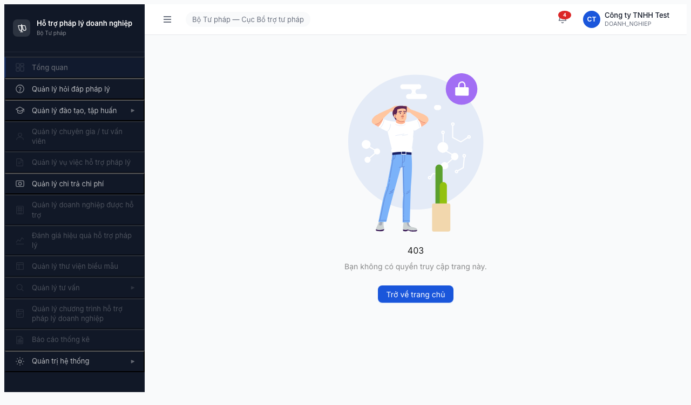
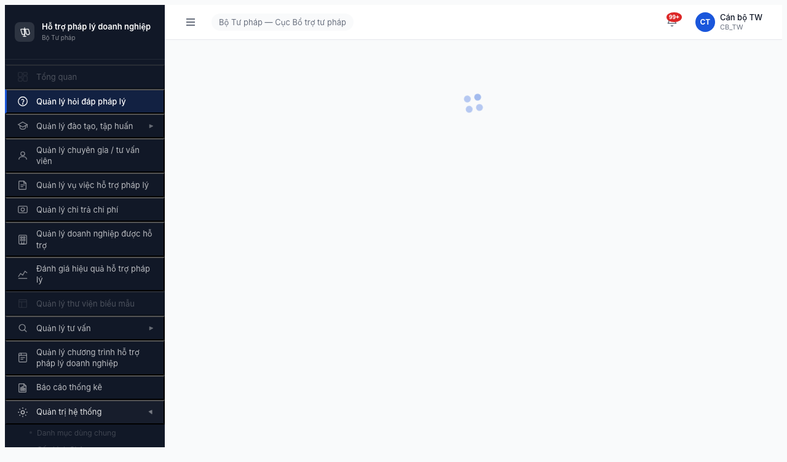
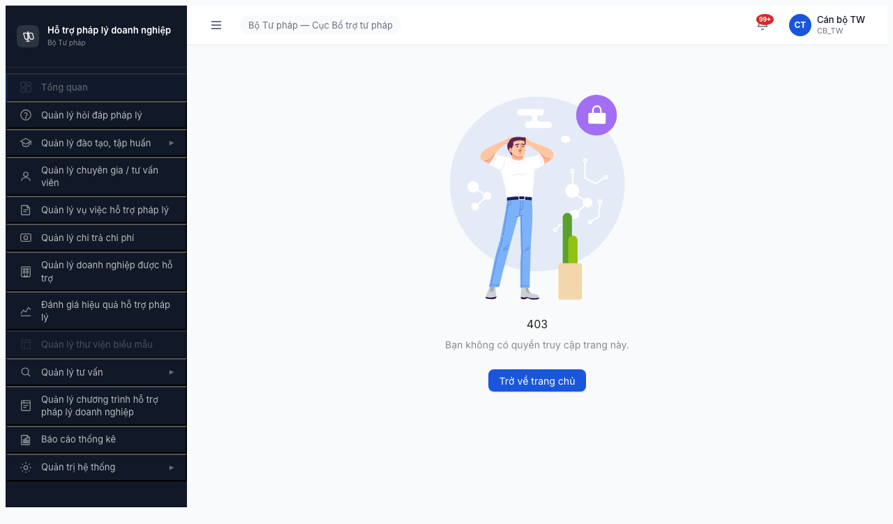
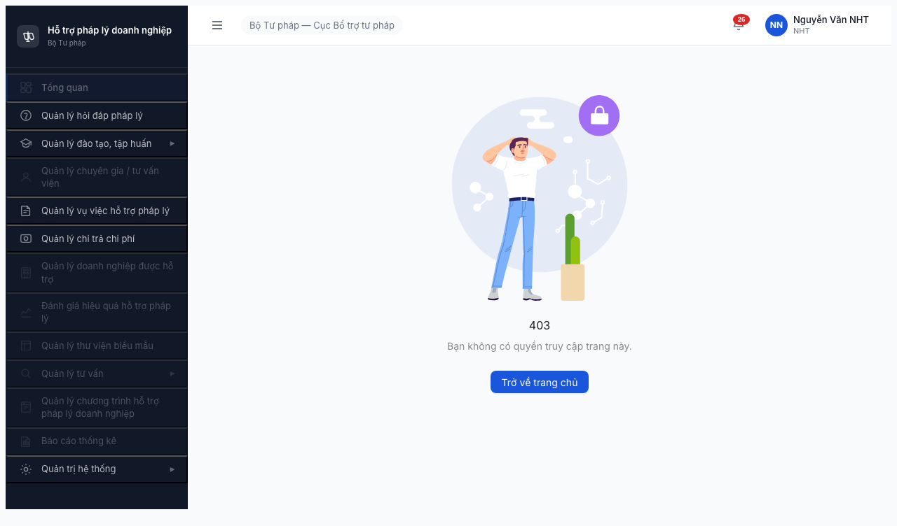
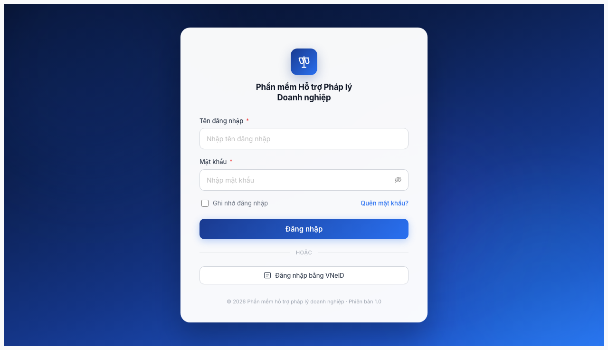

# Bug Report — Phân quyền Mục 1 (Nhóm Quản trị Hệ thống)

| Thông tin | Giá trị |
|-----------|---------|
| **Dự án** | PM HTPLDN — Phần mềm Hỗ trợ Pháp lý Doanh nghiệp |
| **Phiên bản** | 1.0 |
| **Môi trường** | http://103.172.236.130:3000/ |
| **Người test** | QA Automation via Claude Code |
| **Ngày** | 23:30 — 2026-04-17 |
| **Loại test** | Permission / Authorization |
| **Round** | Round 3 |
| **Tham chiếu** | [permission-matrix.md §1](../../../permission-matrix.md) · [test-strategy.md §5, §9.1](../../../test-strategy.md) · [functional-test-report-section-1.md](functional-test-report-section-1.md) |

---

## Tổng hợp

Phát hiện **5** bug phân quyền trong phạm vi Module 1 (Quản trị Hệ thống).

| Tổng | Critical | Major | Medium | Minor | Trivial |
|------|----------|-------|--------|-------|---------|
| 5    | 1        | 3     | 1      | 0     | 0       |

## Bug Summary Table

| Bug ID | Severity | Priority | Type | Role × Entity | TC Ref | Title | Status |
|--------|----------|----------|------|---------------|--------|-------|--------|
| BUG-PERM-M1-001 | **Critical** | P0 | Permission | DN × CMS | DI-09 | DN đăng nhập được CMS UI — vi phạm DI-09 (chỉ API) | Open |
| BUG-PERM-M1-002 | Major | P0 | Permission | CB_NV/CB_PD × Section 1 entities | 1-2, 1-3, 6-2, 9-2 | Menu QTHT submenu greyed out → không truy cập được page read-only theo spec | Open |
| BUG-PERM-M1-003 | Major | P1 | Permission | All non-QTHT × /dashboard | — | Non-admin roles login → landing /403 thay vì /dashboard | Open |
| BUG-PERM-M1-004 | Major | P0 | Permission | NHT × Menu QTHT | DI-06 | Menu "Quản trị hệ thống" hiển thị cho NHT — ngoài spec | Open |
| BUG-PERM-M1-005 | Medium | P2 | Permission | CB_NV × direct URL | — | Truy cập /quan-tri/… trực tiếp → session drop về /login | Open |

> **Chú thích Type/Severity/Priority:** xem [bug-report-template.md](../../../template/bug-report-template.md)

---

## BUG-PERM-M1-001 — DN đăng nhập được CMS UI (vi phạm Data Isolation DI-09)

| Trường | Chi tiết |
|--------|----------|
| **Bug ID** | BUG-PERM-M1-001 |
| **Severity** | Critical |
| **Priority** | P0 |
| **Type** | Permission |
| **Status** | Open |
| **Module** | Quản trị Hệ thống / Auth |
| **Thành phần** | Auth middleware / login route guard |
| **URL** | http://103.172.236.130:3000/login → /403 |
| **Trình duyệt** | Chromium headless (Playwright, viewport 1280×720) |
| **Tài khoản** | dn_user / dn@example.com (DN Portal) |
| **TC Reference** | DI-09 trong [test-strategy.md §5.2](../../../test-strategy.md) |
| **SRS Reference** | BR-AUTH-11 · permission-matrix.md §1 entity DN column |
| **Assignee** | Backend Auth Team |
| **Found by** | QA Automation |

### Mô tả

Tài khoản `dn_user` (role DN / Doanh nghiệp) đăng nhập được vào CMS thông qua form login chuẩn. Sau khi nhập OTP đúng, session được tạo, user được gán role DOANH_NGHIEP, và giao diện CMS (sidebar + header + avatar) hiển thị đầy đủ mặc dù landing URL là /403.

Theo [test-strategy.md §5.2 DI-09](../../../test-strategy.md):
> **DI-09** | DN không truy cập CMS UI | dn_user | Truy cập CMS URL → bị chặn. DN chỉ tương tác qua API (🔌 C†)

Theo [permission-matrix.md §1](../../../permission-matrix.md) toàn bộ 9 entity Mục 1 đều có cột DN = ❌ (trừ THONG_BAO 👁️R*). Kết luận là DN KHÔNG được phép vào CMS.

### Các bước tái hiện

1. Mở http://103.172.236.130:3000/login trên Chromium.
2. Nhập:
   - Username: `dn_user`
   - Password: `Test@1234`
3. Nhấn "Đăng nhập".
4. Lấy mã OTP từ MailHog http://103.172.236.130:8025 (email `dn@example.com`).
5. Nhập 6 chữ số OTP → nút "Xác nhận" tự submit.
6. Quan sát:
   - URL chuyển đến http://103.172.236.130:3000/403
   - Sidebar CMS hiển thị đầy đủ (menu "Quản trị hệ thống", "Quản lý đào tạo", "Quản lý chi trả" active; các mục khác greyed out)
   - Avatar góc phải hiển thị "Công ty TNHH Test — DOANH_NGHIEP"
   - Icon chuông notification hiển thị "4"

### Kết quả mong đợi

Theo DI-09 + permission-matrix.md §1 (cột DN toàn ❌):
- DN **không đăng nhập được CMS UI** — hoặc:
  - Server trả về error "Tài khoản không có quyền truy cập CMS" ngay tại step 3 (login)
  - Hoặc login thành công nhưng redirect đến trang khác (portal riêng cho DN), **không hiển thị sidebar CMS**
- Menu sidebar CMS tuyệt đối không hiển thị cho role DN

### Kết quả thực tế

- DN login thành công vào CMS
- Landing /403 nhưng sidebar hiển thị đầy đủ menu CMS (bao gồm "Quản trị hệ thống")
- Session cookie được tạo với role DOANH_NGHIEP
- Tạo vector tấn công potential: DN có thể enumerate các route CMS qua menu, gửi API request từ browser session với cookie hợp lệ

### Bằng chứng



URL sau login: `http://103.172.236.130:3000/403`
User hiển thị trên header: `Công ty TNHH Test / DOANH_NGHIEP`

### Tác động (Impact)

**Security gap nghiêm trọng:**
- Vi phạm nguyên tắc **"DN chỉ truy cập qua API inbound từ Cổng PLQG"** (SI-04, Nhóm XII).
- DN có CMS session → có thể thử các REST endpoint với role DOANH_NGHIEP để enumerate dữ liệu.
- Info disclosure: menu "Quản trị hệ thống" hiển thị → DN thấy được cấu trúc hệ thống admin (menu items list).
- Ảnh hưởng **100% DN users** đang tích hợp qua Cổng PLQG.

### Nguyên nhân nghi ngờ (Root Cause)

Auth middleware không phân biệt giữa **CMS users (QTHT/CB_NV/CB_PD/NHT/TVV/CG)** và **external DN users** (chỉ API). Login form `/login` chấp nhận mọi user trong DB bao gồm DN.

### Gợi ý sửa (Suggested Fix)

1. **Backend:** Thêm guard trong login controller để reject role `DOANH_NGHIEP`:
   ```
   if user.role == 'DOANH_NGHIEP': return 403 "Vui lòng sử dụng API inbound"
   ```
2. **Frontend:** Layout CMS (sidebar) kiểm tra role, nếu là DN/Portal external → redirect về trang portal riêng hoặc logout.
3. **Test case bổ sung:** DI-09 trong §5.2 phải là MANDATORY trong regression suite.

---

## BUG-PERM-M1-002 — Menu QTHT submenu greyed out cho CB_NV/CB_PD (thiếu view-only access)

| Trường | Chi tiết |
|--------|----------|
| **Bug ID** | BUG-PERM-M1-002 |
| **Severity** | Major |
| **Priority** | P0 |
| **Type** | Permission |
| **Status** | Open |
| **Module** | Quản trị Hệ thống / Sidebar navigation |
| **Thành phần** | Sidebar component · route guard middleware |
| **URL** | Sidebar → "Quản trị hệ thống" → "Danh mục dùng chung" |
| **Tài khoản** | canbo_tw (CB_NV TW) · lanhdao_tw (CB_PD TW) — và các đồng cấp BN/DP |
| **TC Reference** | Cells 1-2, 1-3, 5-2, 6-2, 9-2 của ma trận Mục 1 |
| **SRS Reference** | permission-matrix.md §1 · BR-AUTH (Read scope rules) |
| **Assignee** | FE Team |
| **Found by** | QA Automation |

### Mô tả

CB_NV TW và CB_PD TW đăng nhập vào hệ thống thấy menu "Quản trị hệ thống" có icon ▶ (expandable) và click expand được. Tuy nhiên, submenu items ("Danh mục dùng chung", "Cấu hình SLA", "Cấu hình phân công", "Tài khoản & phân quyền", …) đều ở trạng thái **greyed out** (opacity thấp, màu chữ nhạt), click vào không trigger navigation.

Theo [permission-matrix.md §1](../../../permission-matrix.md), CB_NV_TW và CB_PD_TW có quyền **👁️ R** trên:
- DANH_MUC (→ "Danh mục dùng chung")
- VAI_TRO (→ tab trong "Tài khoản & phân quyền")
- QUYEN_HAN (→ tab trong "Tài khoản & phân quyền")
- DON_VI (→ hiện chưa có menu riêng)
- CAU_HINH_SLA (→ "Cấu hình SLA")

CB_NV còn có **✅ CRU\*** trên CAU_HINH_PHAN_CONG (→ "Cấu hình phân công") — phải thấy được Create/Read/Update.

### Các bước tái hiện

1. Login `canbo_tw` / `Test@1234` (+ OTP từ MailHog).
2. Landing /403. Sidebar hiển thị toàn bộ menu business + "Quản trị hệ thống" với icon ▶.
3. Click vào mục "Quản lý hỏi đáp pháp lý" để chuyển sang /hoi-dap (test rằng session hoạt động).
4. Click "Quản trị hệ thống" → submenu expand hiện ra: "Danh mục dùng chung", "Cấu hình SLA", …
5. Click "Danh mục dùng chung" → **URL không thay đổi** (vẫn ở /hoi-dap).
6. Lặp lại với lanhdao_tw — kết quả tương tự.

### Kết quả mong đợi

1. CB_NV_TW và CB_PD_TW click vào "Danh mục dùng chung" → navigate đến `/quan-tri/danh-muc/<code>` hiển thị danh sách danh mục **read-only** (chỉ các cột + phân trang, không có nút "Thêm mới" / "Xuất Excel" / "Edit" / "Delete").
2. CB_NV_TW click "Cấu hình phân công" → navigate đến `/quan-tri/cau-hinh-phan-cong` với đầy đủ nút Create/Edit (per CRU\*) nhưng không có Delete, và scope giới hạn theo đơn vị (cấu hình phân công của đơn vị mình).
3. Cấu hình SLA với CB_NV_TW: hiển thị read-only.

### Kết quả thực tế

Tất cả submenu QTHT đều greyed out; click không có hiệu ứng. CB_NV không thể thực hiện được bất kỳ TC positive R nào trên DANH_MUC/CAU_HINH_SLA/VAI_TRO/QUYEN_HAN/DON_VI qua UI.

CRU* trên CAU_HINH_PHAN_CONG (cell 9-2, spec ✅) **không kiểm thử được** — UI chặn cứng.

### Bằng chứng




### So sánh

| Role | Menu "Quản trị hệ thống" | "Danh mục dùng chung" (R) | "Cấu hình SLA" (R) | "Cấu hình phân công" (CRU*) | Result |
|------|--------------------------|---------------------------|--------------------|------------------------------|--------|
| QTHT (admin) | Visible + expandable | ✅ Click → /quan-tri/danh-muc/LINH_VUC_PL + Thêm mới | ✅ Click → /quan-tri/cau-hinh-sla | ✅ Click → /quan-tri/cau-hinh-phan-cong + Thêm cấu hình | PASS |
| CB_NV_TW | Visible + expandable | ❌ greyed, no nav | ❌ greyed | ❌ greyed (BUG — spec CRU*) | **FAIL** |
| CB_PD_TW | Visible + expandable | ❌ greyed | ❌ greyed | ❌ greyed | **FAIL** |

### Tác động (Impact)

- Spec BR-AUTH cho phép CB_NV/CB_PD **xem** cấu hình hệ thống (danh mục, vai trò, quyền hạn, đơn vị, SLA) để hiểu ngữ cảnh xử lý nghiệp vụ → bị mất tính năng trọng yếu.
- CB_NV mất luôn khả năng **tạo/sửa cấu hình phân công** — vi phạm §9 "CAU_HINH_PHAN_CONG" row trong matrix (✅ CRU*).
- Ảnh hưởng 6 role × 5+ entity = ít nhất 30 cells trong ma trận phân quyền.

### Nguyên nhân nghi ngờ (Root Cause)

Frontend sidebar có hard-coded rule "chỉ QTHT được click submenu QTHT". Route guard backend có thể cũng trả 403 cho CB_NV/CB_PD khi GET /api/quan-tri/danh-muc (cần xác nhận qua network panel).

### Gợi ý sửa (Suggested Fix)

1. **FE sidebar:** áp dụng CASL/ability-based visibility cho từng submenu item, đọc từ quyền R của user:
   ```
   ability.can('read', 'DanhMuc') → show "Danh mục dùng chung" enabled
   ability.can('create', 'CauHinhPhanCong') → show "Cấu hình phân công" enabled + Create button
   ```
2. **BE route guard:** bỏ whitelist QTHT-only cho GET routes của DANH_MUC/VAI_TRO/QUYEN_HAN/DON_VI/CAU_HINH_SLA.
3. **Trang read-only:** template DANH_MUC phải render conditional Create/Edit/Delete buttons theo ability.

---

## BUG-PERM-M1-003 — Non-QTHT roles login → landing /403 (dashboard blocked)

| Trường | Chi tiết |
|--------|----------|
| **Bug ID** | BUG-PERM-M1-003 |
| **Severity** | Major |
| **Priority** | P1 |
| **Type** | Permission |
| **Status** | Open |
| **Module** | Auth / Dashboard route guard |
| **Thành phần** | App shell · dashboard route · landing redirect logic |
| **URL** | http://103.172.236.130:3000/dashboard |
| **Tài khoản** | canbo_tw, canbo_bn, lanhdao_tw, nht_user, dn_user |
| **TC Reference** | Appendix A Smoke Test line 2 "Đăng nhập admin → OTP → Dashboard hiện" |
| **SRS Reference** | Implicit UC (Tổng quan) |

### Mô tả

Sau khi nhập OTP đúng, **tất cả roles trừ admin/QTHT** đều redirect đến `/403` ("Bạn không có quyền truy cập trang này") thay vì `/dashboard`.

### Các bước tái hiện

1. Mỗi role trong danh sách test, thực hiện login thông thường (username + password + OTP).
2. Sau OTP xác nhận, quan sát URL cuối cùng.

| Role (account) | Landing URL |
|----------------|-------------|
| admin (QTHT TW) | /dashboard ✅ |
| canbo_tw (CB_NV TW) | /403 ❌ |
| canbo_bn (CB_NV BN) | /403 ❌ |
| lanhdao_tw (CB_PD TW) | /403 ❌ |
| nht_user (NHT) | /403 ❌ |
| dn_user (DN) | /403 ❌ |

### Kết quả mong đợi

Một trong hai:
- **Option A (theo SRS):** Mọi role CMS login vào đều đến `/dashboard` với widget tương ứng quyền (QTHT thấy tất cả số liệu, CB_NV thấy data scope, Portal users có portal dashboard riêng).
- **Option B:** Redirect theo role-specific landing (VD: CB_NV → /hoi-dap; NHT → /vu-viec; DN → portal).

Trong mọi trường hợp, **không được landing /403** trực tiếp — user đăng nhập thành công không thể nhìn "Bạn không có quyền".

### Kết quả thực tế

5 trên 6 role test bị /403 ngay sau login. Tính năng "Tổng quan" trong sidebar bị greyed out cho non-QTHT.

### Bằng chứng






### Tác động (Impact)

- Bad onboarding UX cho 5/6 roles (~83% user base).
- Làm khó lọt bug khác: tester có thể nhầm rằng account CB_NV không hoạt động, dừng test sớm.
- Mọi workflow đều đòi hỏi click menu thủ công từ /403 thay vì có entry dashboard.

### Nguyên nhân nghi ngờ (Root Cause)

Post-login redirect có thể hard-coded `/dashboard` nhưng `/dashboard` route lại chỉ cho phép QTHT. Hệ quả: hàm redirectAfterLogin không aware của role.

### Gợi ý sửa (Suggested Fix)

1. Thêm role-aware redirect:
   ```
   after login: switch (role) {
     QTHT → /dashboard
     CB_NV | CB_PD → /dashboard (nếu dashboard hỗ trợ scoped view) hoặc /hoi-dap
     NHT | TVV | CG → /portal/<role-specific>
     DN → block CMS (xem BUG-PERM-M1-001)
   }
   ```
2. Hoặc: bật quyền read-only dashboard cho tất cả role CMS (chỉ hiển thị widget được phép).

---

## BUG-PERM-M1-004 — Menu "Quản trị hệ thống" hiển thị cho NHT (Portal user)

| Trường | Chi tiết |
|--------|----------|
| **Bug ID** | BUG-PERM-M1-004 |
| **Severity** | Major |
| **Priority** | P0 |
| **Type** | Permission |
| **Status** | Open |
| **Module** | Sidebar / menu visibility |
| **Tài khoản** | nht_user (NHT Portal) |
| **TC Reference** | DI-06 (NHT chỉ thấy VV được phân công) / permission-matrix.md §1 cột NHT |

### Mô tả

NHT đăng nhập vào CMS thấy **menu "Quản trị hệ thống"** trong sidebar với icon ▶ (expandable). Theo permission-matrix.md §1, NHT có **❌** trên 7/9 entity Module 1, chỉ có **👁️ R\*** trên AUDIT_LOG và THONG_BAO (và R\* chỉ qua icon chuông, không cần menu QTHT).

Thêm vào đó, NHT thấy các menu:
- "Quản lý chi trả chi phí" (Active) — nhưng per matrix Module 5, NHT có ❌ trên HO_SO_CHI_TRA và DANH_GIA_HO_SO_CHI_TRA. NHT chỉ có ✅ CRU* trên KET_QUA_VU_VIEC (Module 4), không phải Module 5.

### Các bước tái hiện

1. Login `nht_user` / `Test@1234` + OTP.
2. Landing /403, sidebar hiển thị:
   - Tổng quan (greyed)
   - Quản lý hỏi đáp (active)
   - Quản lý đào tạo, tập huấn ▶ (active)
   - Quản lý chuyên gia / tư vấn viên (greyed)
   - **Quản lý vụ việc hỗ trợ pháp lý** (active) — đúng theo spec (NHT có 📝RU* trên VU_VIEC)
   - **Quản lý chi trả chi phí** (active) — SAI per matrix (NHT = ❌)
   - Quản lý doanh nghiệp (greyed)
   - Đánh giá hiệu quả (greyed)
   - Quản lý thư viện biểu mẫu (greyed)
   - Quản lý tư vấn ▶ (greyed)
   - Quản lý chương trình (greyed)
   - Báo cáo thống kê (greyed)
   - **Quản trị hệ thống ▶** (active/expandable) — SAI per matrix

### Kết quả mong đợi

- Portal users (NHT, TVV, CG, DN) **KHÔNG thấy** menu "Quản trị hệ thống" trong sidebar.
- NHT chỉ thấy menu business mà mình có quyền CRU(D) / RU: Vụ việc (📝RU* trên VU_VIEC + ✅CRU* trên HO_SO_VU_VIEC, KET_QUA_VU_VIEC), Đào tạo (có phân quyền đặc biệt), THONG_BAO (qua icon chuông).

### Kết quả thực tế

Menu QTHT và Quản lý chi trả hiển thị cho NHT.

### Bằng chứng


### Tác động (Impact)

- Info disclosure: NHT (người hưởng thụ, portal user, potentially khách từ bên ngoài) thấy được cấu trúc menu admin.
- Không tuân thủ nguyên tắc least-privilege UI.

### Gợi ý sửa (Suggested Fix)

- Filter sidebar items theo role list thay vì chỉ disabled:
  ```
  const isPortalUser = ['NHT', 'TVV', 'CG', 'DN'].includes(role);
  if (isPortalUser) hide('Quản trị hệ thống');
  ```

---

## BUG-PERM-M1-005 — CB_NV truy cập direct URL admin → session drop về /login

| Trường | Chi tiết |
|--------|----------|
| **Bug ID** | BUG-PERM-M1-005 |
| **Severity** | Medium |
| **Priority** | P2 |
| **Type** | Permission / Session |
| **Status** | Open |
| **Module** | Auth session · route guard |
| **Tài khoản** | canbo_tw |
| **URL** | http://103.172.236.130:3000/quan-tri/danh-muc/LINH_VUC_PL |

### Mô tả

Sau khi canbo_tw login thành công (session valid, có thể vào /hoi-dap), khi gõ trực tiếp URL admin `/quan-tri/danh-muc/LINH_VUC_PL` lên browser, hệ thống redirect về `/login` (không phải `/403`), session bị mất.

### Các bước tái hiện

1. Login canbo_tw → vào /hoi-dap (session valid).
2. Gõ URL http://103.172.236.130:3000/quan-tri/danh-muc/LINH_VUC_PL → Enter.
3. Quan sát URL cuối: `/login` — form login trống.

### Kết quả mong đợi

- Vì canbo_tw đã login, session cookie valid. Khi truy cập admin URL mà không có quyền, app phải trả **/403** và **giữ nguyên session**.
- User click "Trở về trang chủ" hoặc menu khác phải tiếp tục hoạt động bình thường.

### Kết quả thực tế

Session bị logout, user bị đẩy về /login → phải login lại.

### Bằng chứng



### Tác động (Impact)

- UX kém: user lỡ gõ/paste URL admin không được phép → bị logout, mất unsaved work trên các tab khác.
- Không bảo vệ thêm được gì về mặt security so với /403 (session đã valid).

### Gợi ý sửa (Suggested Fix)

Route guard `/quan-tri/**` cho role CB_NV/CB_PD không có quyền → render `/403` component (client-side redirect), giữ nguyên session.

---

## Phụ lục

### A — Môi trường test

| Thành phần | Giá trị |
|------------|---------|
| URL ứng dụng | http://103.172.236.130:3000/ |
| MailHog (OTP) | http://103.172.236.130:8025 |
| Frontend | React + Ant Design (suy ra từ `Thêm mới`, switch, ant-layout-sider) |
| Xác thực | Username/password + email OTP 6 số |
| Browser | Chromium headless (Playwright) viewport 1280×720 |

### B — Tài khoản sử dụng

| Tên đăng nhập | Vai trò | Cấp | Dùng cho bug nào |
|---------------|---------|-----|------------------|
| admin | QTHT | TW | Baseline positive |
| canbo_tw | CB_NV | TW | BUG-M1-002, -003, -005 |
| canbo_bn | CB_NV | BN | BUG-M1-003 |
| lanhdao_tw | CB_PD | TW | BUG-M1-002, -003 |
| nht_user | NHT | Portal | BUG-M1-003, -004 |
| dn_user | DN | Portal | BUG-M1-001, -003 |

### C — Danh mục ảnh chụp

| File | Mô tả | Dùng cho bug |
|------|-------|--------------|
| [01-login-page.png](screenshots/01-login-page.png) | Trang login | Baseline |
| [qtht-admin-01-danh-muc.png](screenshots/qtht-admin-01-danh-muc.png) | QTHT DANH_MUC (Thêm mới + Xuất Excel) | Positive baseline |
| [qtht-admin-03-phan-cong.png](screenshots/qtht-admin-03-phan-cong.png) | QTHT CAU_HINH_SLA (lệch filename) | Positive baseline |
| [qtht-admin-04-tai-khoan.png](screenshots/qtht-admin-04-tai-khoan.png) | QTHT CAU_HINH_PHAN_CONG (Edit/Toggle/Delete icons + Thêm cấu hình, lệch filename) | Positive baseline |
| [canbo-tw-01-dashboard.png](screenshots/canbo-tw-01-dashboard.png) | canbo_tw landing /403 | BUG-003 |
| [canbo-tw-02-qtht-menu.png](screenshots/canbo-tw-02-qtht-menu.png) | canbo_tw menu QTHT greyed | BUG-002 |
| [canbo-tw-07-hoi-dap.png](screenshots/canbo-tw-07-hoi-dap.png) | canbo_tw vào /hoi-dap OK | BUG-003 reference |
| [canbo-tw-09-danh-muc-attempt.png](screenshots/canbo-tw-09-danh-muc-attempt.png) | canbo_tw click Danh mục không trigger | BUG-002 |
| [canbo-tw-10-direct-danh-muc.png](screenshots/canbo-tw-10-direct-danh-muc.png) | canbo_tw direct URL → /login | BUG-005 |
| [lanhdao-tw-01-dashboard.png](screenshots/lanhdao-tw-01-dashboard.png) | lanhdao_tw landing /403 | BUG-003 |
| [lanhdao-tw-02-qtht-menu.png](screenshots/lanhdao-tw-02-qtht-menu.png) | lanhdao_tw menu QTHT greyed | BUG-002 |
| [nht-01-dashboard.png](screenshots/nht-01-dashboard.png) | nht landing /403 + QTHT visible | BUG-003, BUG-004 |
| [dn-01-dashboard.png](screenshots/dn-01-dashboard.png) | dn truy cập CMS + QTHT visible | BUG-001, BUG-003 |
| [canbo-bn-01-dashboard.png](screenshots/canbo-bn-01-dashboard.png) | canbo_bn landing /403 | BUG-003 |

---

*Bug report generated: 2026-04-17 23:30 | QA Automation via Claude Code*
