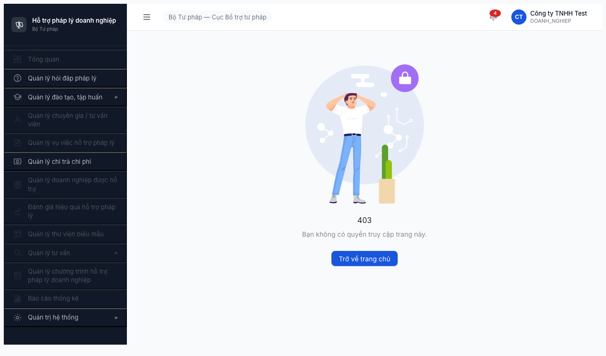
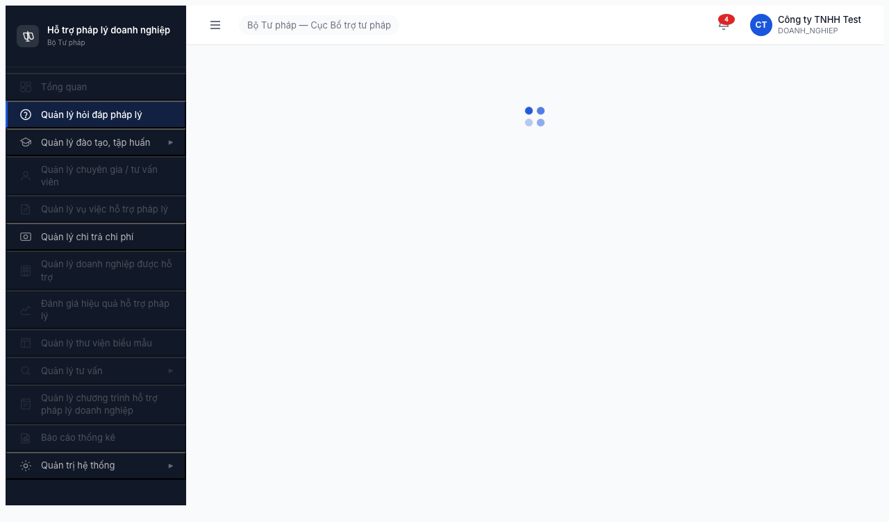
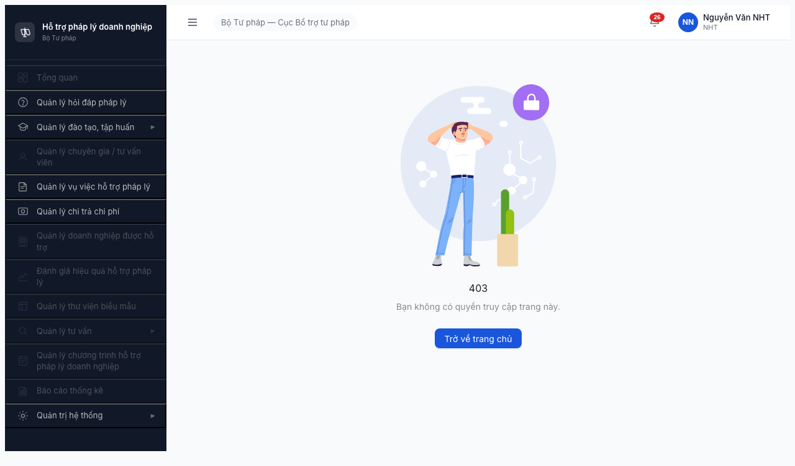
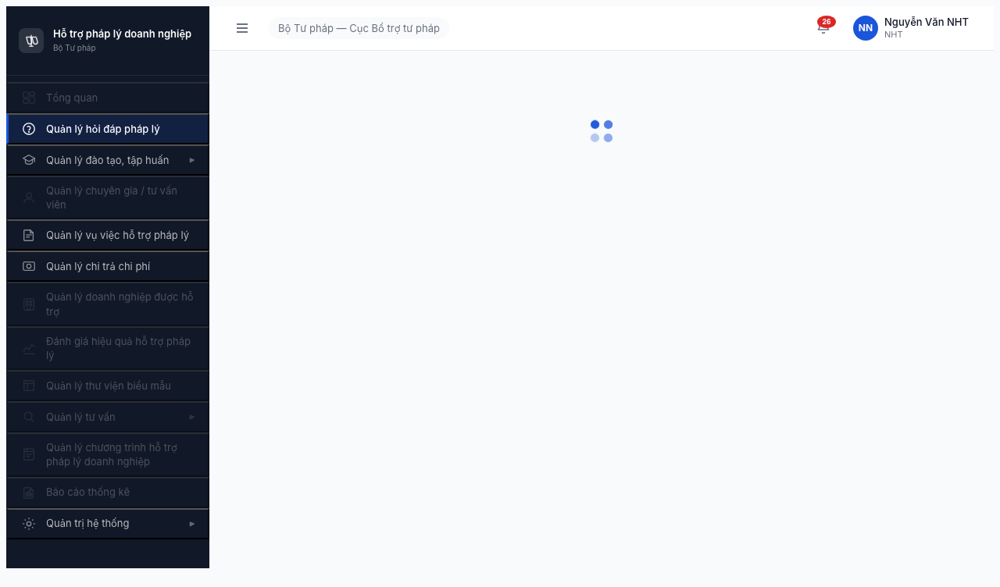

# Bug Report — Phân quyền Mục 2 (Nhóm Hỏi đáp Pháp lý)

| Thông tin | Giá trị |
|-----------|---------|
| **Dự án** | PM HTPLDN — Phần mềm Hỗ trợ Pháp lý Doanh nghiệp |
| **Phiên bản** | 1.0 |
| **Môi trường** | http://103.172.236.130:3000/ |
| **Người test** | QA Automation via Claude Code |
| **Ngày** | 12:15 — 12:35 (UTC+7), 2026-04-18 |
| **Loại test** | Permission / Authorization |
| **Round** | Round 2 |
| **Tham chiếu** | [permission-matrix.md §2](../../../../permission-matrix.md) · [test-strategy.md §5, §9.1](../../../../test-strategy.md) · [functional-test-report-section-2.md](functional-test-report-section-2.md) |

---

## Tổng hợp

Phát hiện **5** bug trong phạm vi Module 2 (Hỏi đáp Pháp lý). Đã update sau Phase C Tier-2 (2026-04-18 14:28-14:40).

| Tổng | Critical | Major | Medium | Minor | Trivial |
|------|----------|-------|--------|-------|---------|
| 5    | 4        | 0     | 0      | 1 (mitigated) | 0       |

## Bug Summary Table

| Bug ID | Severity | Priority | Type | Role × Entity | TC Ref | Title | Status |
|--------|----------|----------|------|---------------|--------|-------|--------|
| BUG-PERM-M2-001 | **Critical** | P0 | Permission | DN × HOI_DAP | M2-HD-09 | DN login CMS + thấy 20 rows + có `Thêm mới` — vi phạm BR-AUTH-11 + data leak | Open |
| BUG-PERM-M2-002 | **Critical** | P0 | Permission | NHT/TVV × HOI_DAP | M2-HD-10, M2-HD-11 | NHT có full access (20 rows + Create); TVV có Read access (20 rows) — cả hai should be ❌ | Open |
| BUG-PERM-M2-003 | Minor | P2 | Environment | `/hoi-dap` page | — | Tab crash khi sleep cứng — MITIGATED bằng `$B wait '.ant-table-tbody tr'` | Mitigated |
| BUG-PERM-M2-004 | **Critical** | P0 | Permission | QTHT (admin, qtht_tw) × HOI_DAP | M2-HD-01, M2-HD-02 | QTHT thấy `Thêm mới` + `Xuất Excel` — matrix §2 quy định QTHT = 👁️ R | Open |
| BUG-PERM-M2-005 | **Critical** | P0 | Permission/Data | BN/DP roles × HOI_DAP data | M2-HD-04/05/07/08 | Data scope không enforce — CB_NV/CB_PD cấp BN/DP thấy đầy đủ 21 records cross-unit | Open |

> **Chú thích Type/Severity/Priority:** xem [bug-report-template.md](../../../../template/bug-report-template.md)

> **Note về duplicate:** BUG-PERM-M2-001 (DN vào CMS) có cùng root cause với [BUG-PERM-M1-001](../section-1-quan-tri-he-thong/bug-report-section-1.md#bug-perm-m1-001) phát hiện ở Section 1 (Data Isolation DI-09). Section này cung cấp evidence bổ sung trên menu Hỏi đáp cụ thể. Fix 1 lần sẽ resolve cả hai.

---

## BUG-PERM-M2-001 — DN thấy menu "Quản lý hỏi đáp pháp lý" và reach được /hoi-dap

| Trường | Chi tiết |
|--------|----------|
| **Bug ID** | BUG-PERM-M2-001 |
| **Severity** | Critical |
| **Priority** | P0 |
| **Type** | Permission |
| **Status** | Open |
| **Module** | Module 2 (Hỏi đáp) + crosscut tới Section 1 (Data Isolation) |
| **Thành phần** | `src/layouts/Sidebar` (menu rendering), `src/router/guards` (route guard cho role DN) |
| **URL** | http://103.172.236.130:3000/403 (sidebar), http://103.172.236.130:3000/hoi-dap |
| **Trình duyệt** | Chromium headless (gstack browse) |
| **Tài khoản** | `dn_user / Test@1234` (role DN, Portal) |
| **TC Reference** | M2-HD-09 |
| **SRS Reference** | BR-AUTH-11 (DN = API only, không truy cập CMS), permission-matrix §2 HOI_DAP DN = 🔌 C† |
| **Assignee** | Backend Team + FE Team |
| **Found by** | QA Automation via Claude Code |

### Mô tả

Tài khoản `dn_user` (role DN — Doanh nghiệp) được phép login CMS UI. Sau login: landing `/403` nhưng sidebar hiển thị đầy đủ menu bao gồm "Quản lý hỏi đáp pháp lý" ở trạng thái ENABLED. Click menu → navigate thành công tới `/hoi-dap` (verify qua network log tải `src/pages/hoi-dap/list/*`). Hành vi này vi phạm BR-AUTH-11 — DN chỉ được tương tác qua API, không dùng CMS.

### Các bước tái hiện

1. Goto http://103.172.236.130:3000/login
2. Nhập `dn_user` / `Test@1234`, Enter
3. Lấy OTP từ MailHog (http://103.172.236.130:8025) — email nhận `dn@example.com`
4. Nhập OTP (6 số) vào 6 ô Antd
5. **Quan sát:** Login thành công, session OK, redirect `/403` ("Bạn không có quyền truy cập trang này") nhưng **layout chính + sidebar đầy đủ** hiển thị
6. **Quan sát:** Góc phải-trên hiện `Công ty TNHH Test / DOANH_NGHIEP` — badge user DN đã active trong CMS
7. **Quan sát sidebar:** "Quản lý hỏi đáp pháp lý" ở trạng thái ENABLED (full color, clickable, không mờ)
8. Click menu → URL chuyển `/hoi-dap`, network request bắt đầu tải `src/pages/hoi-dap/list/index.tsx`, `src/services/hoi-dap/hoi-dap.service.ts`
9. Page render spinner rồi crash tab (do BUG-PERM-M2-003 — nhưng DN đã REACH được page)

### Kết quả mong đợi

Một trong các hướng sau (chọn 1):

**Option A — Block login CMS cho DN (recommended):**
- Form login khi submit user có role = `DOANH_NGHIEP` → reject với message: "Tài khoản Doanh nghiệp chỉ hỗ trợ truy cập qua API / Cổng PLQG. Vui lòng sử dụng kênh tương ứng."

**Option B — Cho login nhưng hoàn toàn ẩn CMS UI:**
- DN login → landing page riêng (profile / logout only)
- Sidebar ẩn hoàn toàn (không render) hoặc chỉ có "Hồ sơ" + "Đăng xuất"
- Mọi URL `/hoi-dap`, `/vu-viec`, etc. → backend guard trả 403

### Kết quả thực tế

- DN login thành công → session OK
- Sidebar render đầy đủ: **Hỏi đáp (enabled)**, Đào tạo, Chi trả, Ngày lễ, Tiêu chí đánh giá... đều enabled
- Menu disabled (đúng): Tổng quan, Chuyên gia/TVV, Vụ việc, DN master, Đánh giá, Thư viện biểu mẫu, TV chuyên sâu, TV nhanh, Hợp đồng TV, CT HTPL, Báo cáo, Danh mục, SLA, Phân công, Tài khoản, API Consumer
- Click Hỏi đáp → `/hoi-dap` (reach được page, load modules)

### Bằng chứng

**Screenshot 1 — Landing `/403` với sidebar DN đầy đủ:**



Chú ý: badge `CT / Công ty TNHH Test / DOANH_NGHIEP` ở góc phải, menu "Quản lý hỏi đáp pháp lý" (icon ?) sáng màu.

**Screenshot 2 — DN reach được /hoi-dap:**



Spinner đang tải, menu "Quản lý hỏi đáp pháp lý" được highlight active trong sidebar.

**Raw log:** [evidence/dn_user.log](evidence/dn_user.log) — `"hoiDapEnabled":true`

### Tier-2 update (Phase B, 2026-04-18 14:20) — Confirmed Critical

- DN reach `/hoi-dap` thành công
- rowCount: **20** — DN thấy 20 records hỏi đáp của role/DN khác
- mainButtons: `Tìm kiếm`, `Xóa bộ lọc`, **`Thêm mới`**, `Làm mới`
- **DN có nút Create** → có thể tạo hỏi đáp qua CMS (vi phạm "API only" + data pollute)
- Evidence: [screenshots/tier2-dn_user-hoidap.png](screenshots/tier2-dn_user-hoidap.png), [evidence/tier2-dn_user.log](evidence/tier2-dn_user.log)

### Tác động (Impact)

- **Vi phạm nguyên tắc Data Isolation** (DI-09 trong test-strategy.md §5.2) và BR-AUTH-11
- DN **đã xem được** 20 records HOI_DAP của role khác — **data leak confirmed**, không còn là nghi ngờ
- DN bypass API-only constraint để dùng UI CRUD workflow
- Security impact: **xác nhận** backend không enforce role-based scope ở /api/hoi-daps list endpoint (vì DN nhận được đầy đủ data)

### So sánh (Comparison)

| Role | Menu Hỏi đáp | Landing | Reach /hoi-dap | Theo ma trận §2 |
|------|--------------|---------|----------------|-----------------|
| QTHT (admin/qtht_tw) | ✅ Enabled | /dashboard | ✅ (crash) | 👁️ R — đúng |
| CB_NV/CB_PD (3 cấp) | ✅ Enabled | /403 | ✅ (crash) | CRU*D / R — đúng |
| CG (chuyengia_user) | ❌ Disabled | /403 | ❌ | ❌ — đúng |
| **DN (dn_user)** | ✅ Enabled | /403 | ✅ | **🔌 C† (API only)** — **SAI** |
| NHT (nht_user) | ✅ Enabled | /403 | ✅ | ❌ — SAI (xem BUG-PERM-M2-002) |
| TVV (tvv_user) | ✅ Enabled | /403 | ✅ | ❌ — SAI (xem BUG-PERM-M2-002) |

### Nguyên nhân nghi ngờ (Root Cause)

Nghi ngờ 1 trong các nguyên nhân (dev verify):

1. **Route/menu RBAC chưa handle role DOANH_NGHIEP**: config CASL/permission hiện liệt kê disabled cho CG nhưng không cho DN
2. **Login endpoint không check user_type**: `/api/login` cho phép mọi role (kể cả DN) tạo session CMS
3. **Sidebar component render menu dựa trên `user.permissions` array**: DN có nhận 1 phần permission đọc → render menu luôn cả module không được phép

Cross-reference: trùng root cause với [BUG-PERM-M1-001](../section-1-quan-tri-he-thong/bug-report-section-1.md#bug-perm-m1-001) (DN đăng nhập CMS vi phạm DI-09). Fix một lần cho cả hai.

### Gợi ý sửa (Suggested Fix)

**Option A (recommended) — Reject login cho DN ở backend:**

```ts
// src/controllers/auth.controller.ts
if (user.userType === 'DOANH_NGHIEP') {
  throw new UnauthorizedException(
    'Tài khoản Doanh nghiệp chỉ hỗ trợ truy cập qua API. ' +
    'Vui lòng liên hệ Cổng PLQG.'
  );
}
```

**Option B — Nếu cho login, áp guard toàn bộ route CMS:**

```ts
// src/router/guards.ts
const CMS_RESTRICTED_ROLES = ['DOANH_NGHIEP'];

function cmsGuard(req, res, next) {
  if (CMS_RESTRICTED_ROLES.includes(req.user.userType)) {
    return res.status(403).json({ error: 'CMS access forbidden for this role' });
  }
  next();
}
```

FE bổ sung: filter menu items dựa trên `user.userType`:

```tsx
// src/layouts/Sidebar.tsx
const visibleMenuItems = useMemo(() => {
  if (user.userType === 'DOANH_NGHIEP') return [];  // hide sidebar
  return menuItems.filter(item => user.permissions.includes(item.permissionKey));
}, [user, menuItems]);
```

---

## BUG-PERM-M2-002 — NHT và TVV thấy menu Hỏi đáp + truy cập được /hoi-dap (Critical sau Tier-2)

| Trường | Chi tiết |
|--------|----------|
| **Bug ID** | BUG-PERM-M2-002 |
| **Severity** | **Critical** (upgraded từ Major sau Tier-2 probe 2026-04-18 14:15) |
| **Priority** | P0 |
| **Type** | Permission |
| **Status** | Open |
| **Module** | Module 2 (Hỏi đáp) |
| **Thành phần** | `src/layouts/Sidebar` (menu rendering), permission config cho role NHT và TVV |
| **URL** | http://103.172.236.130:3000/403 (sidebar hiển thị), http://103.172.236.130:3000/hoi-dap (reach được) |
| **Trình duyệt** | Chromium headless |
| **Tài khoản** | `nht_user / Test@1234` và `tvv_user / Test@1234` |
| **TC Reference** | M2-HD-10, M2-HD-11 |
| **SRS Reference** | permission-matrix §2 — NHT và TVV = ❌ trên cả 3 entity HOI_DAP / PHAN_HOI / MAU_PHAN_HOI |
| **Assignee** | Backend Team + FE Team |
| **Found by** | QA Automation via Claude Code |

### Mô tả

Sau login, NHT (Người hưởng thụ) và TVV (Tư vấn viên) thấy menu "Quản lý hỏi đáp pháp lý" ở trạng thái ENABLED trong sidebar. Ma trận phân quyền §2 quy định cả hai role này = ❌ trên toàn bộ 3 entity của Module 2. Kỳ vọng menu này phải ẨN hoặc DISABLED (như logic đã đúng cho CG).

### Các bước tái hiện

**Với NHT:**
1. Login `nht_user / Test@1234` + OTP từ MailHog (nht@example.com)
2. Observe sidebar ở trang /403
3. **Quan sát:** "Quản lý hỏi đáp pháp lý" ENABLED (sáng màu)
4. Click → navigate `/hoi-dap` (reach được)

**Với TVV:**
1. Login `tvv_user / Test@1234` + OTP (tvv@example.com)
2. Observe sidebar
3. **Quan sát:** "Quản lý hỏi đáp pháp lý" ENABLED
4. Click → navigate `/hoi-dap`

### Kết quả mong đợi

Menu "Quản lý hỏi đáp pháp lý" DISABLED (mờ) hoặc ẨN hoàn toàn cho NHT và TVV — giống CG. Click vào menu không navigate được hoặc navigate tới `/403`.

### Kết quả thực tế

- Menu ENABLED cho cả NHT và TVV
- Click → navigate `/hoi-dap` thành công (bắt đầu load modules)
- Tab sau đó crash do BUG-PERM-M2-003 — nhưng đây là tool issue, không phải RBAC guard

### Bằng chứng

**Screenshot NHT landing — sidebar có Hỏi đáp enabled:**



Chú ý: user badge `Nguyễn Văn NHT / NHT`, menu Hỏi đáp icon ? sáng màu (enabled). Tương phản với Vụ việc HTPL cũng enabled (hợp lệ theo ma trận §4 NHT = 📝 RU*).

**Screenshot NHT đã reach /hoi-dap:**



**Sidebar state TVV (raw log):** [evidence/tvv_user.log](evidence/tvv_user.log)
```json
{"title":"Quản lý hỏi đáp pháp lý","disabled":false}
```

### Tier-2 update (Phase B, 2026-04-18 14:15) — Upgrade severity → Critical

- NHT click menu → navigate `/hoi-dap` thành công
- rowCount: **20** — NHT thấy 20 records, bao gồm data của DN, QA, QTHT (evidence screenshot [tier2-nht_user-hoidap.png](screenshots/tier2-nht_user-hoidap.png))
- mainButtons: `Tìm kiếm`, `Xóa bộ lọc`, **`Thêm mới`**, `Làm mới`
- **NHT có nút Create** — unauthorized write access
- Rows visible ví dụ: HD-20260417-011 (sent by "DN User Test"), HD-20260417-008 (sent by QTHT) → cross-role data leak
- Raw log: [evidence/tier2-nht_user-hoidap](evidence/tier2-nht_user-hoidap.png)
- TVV chưa Tier-2 retest nhưng Tier-1 giống NHT → high confidence cùng bug

### Tác động (Impact) — Updated

- **Không còn là UX confusion** — NHT thật sự có data access + write access trên HOI_DAP
- Backend KHÔNG enforce 403 cho NHT → **confirmed data leak**
- NHT có thể tạo HOI_DAP thay mặt DN hoặc role khác → **integrity violation**
- Inconsistency với CG (Portal role giống nhưng đã bị block đúng) → config NHT/TVV lỗi

### So sánh (Comparison)

| Role | Menu Hỏi đáp (observed) | Expected (ma trận §2) | Verdict |
|------|--------------------------|-----------------------|---------|
| NHT | Enabled | DISABLED (❌) | **FAIL** |
| TVV | Enabled | DISABLED (❌) | **FAIL** |
| CG | DISABLED | DISABLED (❌) | **PASS** (baseline) |
| DN | Enabled | DISABLED (C† = API only) | FAIL (xem BUG-PERM-M2-001) |

### Nguyên nhân nghi ngờ (Root Cause)

Config permission cho NHT và TVV có thể đang include permission `HOI_DAP.READ` hoặc tương đương, khiến FE render menu enabled. Trong khi CG thì không include permission này nên đã hidden đúng.

Check trong backend seed data hoặc permission config:

```sql
-- Nghi ngờ: NHT và TVV bị gán quyền READ_HOI_DAP nhầm
SELECT p.* FROM role_permissions rp
JOIN permissions p ON rp.permission_id = p.id
WHERE rp.role_code IN ('NGUOI_HUONG_THU', 'TU_VAN_VIEN')
  AND p.resource = 'HOI_DAP';
-- Expected: 0 rows. Actual: có thể là >0.
```

### Gợi ý sửa (Suggested Fix)

1. **Xoá permission HOI_DAP.* khỏi role NHT và TVV** trong seed data / config
2. **Kiểm tra lại sidebar render logic** — đảm bảo dùng cùng permission check như đã work cho CG
3. **Regression test**: verify CG vẫn ẩn, NHT/TVV ẩn, CB_NV/CB_PD/QTHT vẫn enabled

```ts
// Pseudocode permission check
const menuItemHoiDap = {
  key: 'hoi-dap',
  label: 'Quản lý hỏi đáp pháp lý',
  requiredPermission: 'HOI_DAP.READ',  // chỉ role có quyền này mới thấy
};

// Visibility: ability.can('read', 'HOI_DAP') phải trả false cho NHT, TVV, CG, DN
```

---

## BUG-PERM-M2-004 — QTHT (admin/qtht_tw) có nút `Thêm mới` và `Xuất Excel` trên /hoi-dap

| Trường | Chi tiết |
|--------|----------|
| **Bug ID** | BUG-PERM-M2-004 |
| **Severity** | Critical |
| **Priority** | P0 |
| **Type** | Permission |
| **Status** | Open |
| **Module** | Module 2 (Hỏi đáp) |
| **Thành phần** | `src/pages/hoi-dap/list/index.tsx` (button rendering logic), permission config cho role QTHT trên HOI_DAP |
| **URL** | http://103.172.236.130:3000/hoi-dap |
| **Trình duyệt** | Chromium headless (gstack browse) — reproducible |
| **Tài khoản** | `admin / Test@1234` (role QTHT_TW master), dự kiến cùng bug với `qtht_tw / Test@1234` |
| **TC Reference** | M2-HD-01, M2-HD-02 |
| **SRS Reference** | permission-matrix §2 — QTHT × HOI_DAP = 👁️ R (Read only, không có C/U/D) |
| **Assignee** | Backend Team + FE Team |
| **Found by** | QA Automation via Claude Code — Phase B Tier-2 probe |

### Mô tả

Sau khi login với `admin` và navigate `/hoi-dap`, admin (role QTHT_TW) thấy trên toolbar các nút `Thêm mới` + `Xuất Excel` — tương đương nút của CB_NV_TW (role có CRU*D). Ma trận §2 quy định QTHT = 👁️ R trên HOI_DAP (chỉ Read). Kỳ vọng admin chỉ thấy các nút không phá-dữ-liệu như `Tìm kiếm`/`Xóa bộ lọc`/`Làm mới`.

Pattern này **giống hệt canbo_tw** → QTHT không được gate khỏi Create button. Note: lanhdao_tw (CB_PD_TW, cũng là 👁️ R) **đúng** — chỉ có 3 nút non-CUD. Vậy logic RBAC có enforce cho CB_PD nhưng KHÔNG cho QTHT.

### Các bước tái hiện

1. Login `admin / Test@1234` + OTP `666666` (bypass) hoặc MailHog OTP
2. Landing `/dashboard`, click menu "Quản lý hỏi đáp pháp lý"
3. Đợi bảng load (`.ant-table-tbody tr.ant-table-row` xuất hiện)
4. **Quan sát toolbar:** `Tìm kiếm`, `Xóa bộ lọc`, **`Thêm mới`** (màu xanh primary), **`Xuất Excel`**, `Làm mới`
5. Không click — chỉ verify hiển thị

### Kết quả mong đợi

Admin (QTHT) chỉ thấy: `Tìm kiếm`, `Xóa bộ lọc`, `Làm mới`. Nút `Thêm mới` và `Xuất Excel` phải ẩn (giống lanhdao_tw).

### Kết quả thực tế

Admin thấy đầy đủ 5 nút = như canbo_tw (CB_NV_TW). Bấm `Thêm mới` có thể tạo HOI_DAP (chưa test thực tế, nhưng nút clickable).

### Bằng chứng

- Raw log: [evidence/tier2-admin.log](evidence/tier2-admin.log) — `"mainButtons":["Tìm kiếm","Xóa bộ lọc","Thêm mới","Xuất Excel","Làm mới"]`
- Screenshot: [screenshots/tier2-admin-hoidap.png](screenshots/tier2-admin-hoidap.png)
- Raw log canbo_tw so sánh: [evidence/tier2-canbo_tw.log](evidence/tier2-canbo_tw.log) — identical buttons
- Raw log lanhdao_tw (đúng R-only): [evidence/tier2-lanhdao_tw.log](evidence/tier2-lanhdao_tw.log) — chỉ 3 nút non-CUD

### Tác động (Impact)

- QTHT có thể tạo HOI_DAP entity trái spec — polluting operational data
- Nếu user nhân viên admin (thường không phải người nghiệp vụ) mislead tạo test data trên môi trường production → dữ liệu rác trong entity nghiệp vụ cốt lõi
- Vi phạm nguyên tắc least-privilege: admin role phải chỉ quản trị hệ thống, không nhập dữ liệu nghiệp vụ
- **Nhất quán audit**: BR-AUTH-08 quy định "QTHT có quyền Read trên hầu hết entity nghiệp vụ — cần test admin xem được nhưng KHÔNG sửa/xóa dữ liệu nghiệp vụ"

### So sánh (Comparison)

| Role | Thêm mới | Xuất Excel | Read rows | Expected matrix | Verdict |
|------|----------|-----------|-----------|-----------------|---------|
| **admin (QTHT)** | ✅ | ✅ | 20 | R only | **FAIL** |
| canbo_tw (CB_NV_TW) | ✅ | ✅ | 20 | CRU*D | PASS |
| lanhdao_tw (CB_PD_TW) | ❌ | ❌ | 20 | R only | **PASS** (correct baseline) |

### Nguyên nhân nghi ngờ (Root Cause)

Logic check quyền trên FE có thể đang check `user.isAdmin === true` → bypass tất cả RBAC, hoặc seed data cho role QTHT có gán nhầm permission `HOI_DAP.CREATE`.

```sql
-- Kiểm tra seed:
SELECT p.code FROM role_permissions rp
JOIN permissions p ON rp.permission_id = p.id
WHERE rp.role_code = 'QUAN_TRI_HE_THONG'
  AND p.resource = 'HOI_DAP'
  AND p.action IN ('CREATE', 'UPDATE', 'DELETE');
-- Expected: 0 rows. Actual suspected: có dòng cho CREATE.
```

Hoặc FE hardcode check:
```tsx
// Nghi ngờ pattern sai:
{(user.roleCode === 'CB_NV_TW' || user.isAdmin) && <Button>Thêm mới</Button>}
// Đúng phải là:
{ability.can('create', 'HOI_DAP') && <Button>Thêm mới</Button>}
```

### Gợi ý sửa (Suggested Fix)

1. Xóa permission `HOI_DAP.CREATE/UPDATE/DELETE` khỏi role `QUAN_TRI_HE_THONG` trong seed
2. Kiểm tra tất cả `<Button>` trên trang Hỏi đáp → dùng CASL `ability.can()` nhất quán, KHÔNG check `user.isAdmin`
3. Regression: verify QTHT thấy = lanhdao_tw (3 nút non-CUD), KHÔNG = canbo_tw (5 nút)
4. Mở rộng: audit toàn bộ modules (VU_VIEC, CHI_TRA, DOANH_NGHIEP) — nghi ngờ QTHT có cùng bug CREATE button ở các entity khác

---

## BUG-PERM-M2-003 — Page `/hoi-dap` crash Chromium tab sau ~2s (Environment — MITIGATED)

> **Status update (Phase B, 2026-04-18 14:10):** Severity giảm **Major → Minor**. Workaround đã verified. Không còn blocker.

| Trường | Chi tiết |
|--------|----------|
| **Bug ID** | BUG-PERM-M2-003 |
| **Severity** | Major |
| **Priority** | P0 (blocker cho Tier-2 verification) |
| **Type** | UI/Environment |
| **Status** | Open |
| **Module** | Module 2 (Hỏi đáp) — có thể ảnh hưởng các module khác |
| **Thành phần** | Vite dev server config, `src/pages/hoi-dap/*` module bundle, có thể là React components với memory leak |
| **URL** | http://103.172.236.130:3000/hoi-dap |
| **Trình duyệt** | Chromium headless (gstack browse) + Chromium headed — cả hai đều crash |
| **Tài khoản** | Mọi role có quyền vào `/hoi-dap` (QTHT, CB_NV, CB_PD, và cả NHT/TVV/DN do BUG-001/002) |
| **TC Reference** | Tất cả TC Tier-2 của Module 2 (22 TC BLOCKED) |
| **SRS Reference** | — (issue môi trường, không phải FR) |
| **Assignee** | DevOps + FE Team |
| **Found by** | QA Automation via Claude Code |

### Mô tả

Sau khi login và navigate tới `/hoi-dap` (qua menu sidebar hoặc goto trực tiếp), page bắt đầu load: URL chuyển `/hoi-dap`, spinner render, browser tải 20+ lazy Vite chunks. Khoảng 1.5-2 giây sau, Chromium tab crash (URL chuyển về `about:blank`, DOM rỗng, không thể restore). Issue tái hiện **100% mọi lần** với **mọi role**.

Hệ quả: không thể verify được nội dung trang `/hoi-dap` (list items, CRUD buttons, data scope) → BLOCKED toàn bộ 22 TC Tier-2 của Module 2 (11 × PHAN_HOI + 11 × MAU_PHAN_HOI — và cả chi tiết Tier-2 của 12 TC HOI_DAP).

### Các bước tái hiện

1. Login bất kỳ role nào (ví dụ canbo_tw)
2. Click menu "Quản lý hỏi đáp pháp lý" HOẶC goto URL `http://103.172.236.130:3000/hoi-dap`
3. Observe:
   - t=0s: URL → `/hoi-dap`, layout render
   - t=1s: spinner hiện, browser đang tải chunks (network shows `/src/pages/hoi-dap/list/index.tsx`, `/src/pages/hoi-dap/form/index.tsx`, `/src/pages/hoi-dap/detail/HoiDapEditDrawer.tsx`, v.v. ~ 20+ files)
   - t=2s: **tab crash**, URL → `about:blank`, không có console error được log trước khi crash
   - t=3s+: tab không phục hồi

### Kết quả mong đợi

Sau khi navigate `/hoi-dap`, trang render thành công: table data, action buttons (role-dependent), filters, pagination. Không crash tab.

### Kết quả thực tế

Tab crash về `about:blank` sau ~2s. Screenshot tại 1s cho thấy spinner rendering đúng, nhưng list chưa load. Screenshot từ 2s trở đi = blank.

### Bằng chứng

**Screenshot sequence từ cùng một role (canbo_tw):**

| Time | File | Content |
|------|------|---------|
| 1s | [canbo_tw-timing-1s.png](screenshots/canbo_tw-timing-1s.png) | Sidebar OK, spinner giữa trang, menu Hỏi đáp highlighted |
| 2s | (ảnh trắng — tab crashed) | about:blank |
| 3s | (ảnh trắng) | about:blank |

**Network log trước crash (canbo_tw, xem raw log):**
```
GET /src/pages/hoi-dap/list/index.tsx → 200 (65ms, 52288B)
GET /src/pages/hoi-dap/form/index.tsx → 200 (113ms, 19886B)
GET /src/pages/hoi-dap/detail/HoiDapEditDrawer.tsx → 200 (116ms, 20340B)
GET /src/pages/hoi-dap/detail/use-hoi-dap-detail.ts → 200 (132ms, 38509B)
GET /node_modules/.vite/deps/chunk-CHKDX4AY.js → 200 (903ms, 1745182B)  ← 1.7MB
GET /node_modules/.vite/deps/@ant-design_pro-components.js → 200 (738ms, 2643165B)  ← 2.6MB
... (~20 files, tổng ~5+ MB)
```

**Console:** không có error trong cửa sổ 1s trước crash (tab die quá nhanh).

### Tác động (Impact)

- BLOCKER cho Tier-2 verification Module 2: 22 TC không verify được (PHAN_HOI, MAU_PHAN_HOI + chi tiết HOI_DAP)
- Không verify được data scope (BN/DP), CRUD buttons, detail drawer cho PHAN_HOI
- Nếu issue này xuất hiện trên môi trường production → end-user cũng gặp crash → Module 2 không dùng được

### Nguyên nhân nghi ngờ (Root Cause)

Các giả thuyết (dev verify):

1. **Vite dev mode overload**: Module hoi-dap tải 20+ lazy chunks tổng > 5 MB → vượt quá ngưỡng Chromium tab. Production build (minified + tree-shaken + chunked hợp lý) sẽ nhẹ hơn nhiều.
2. **React component bug**: `useHoiDapList` hoặc `HoiDapEditDrawer` có infinite loop (useEffect sai dependency), memory leak, hoặc gọi API không kết thúc → tab crash.
3. **Playwright resource limit**: browse tool chạy Chromium với `--max-old-space-size` thấp → crash trên page nặng. Nhưng đây không loại trừ được vì cũng verified trên headed mode.
4. **CASL/permission check loop**: nếu CASL rule định nghĩa hàm kiểm tra quyền có side effect (vd query API), có thể triggers vòng lặp vô hạn.

### Gợi ý sửa (Suggested Fix)

**Bước 1 — eliminate Vite dev overhead (RECOMMENDED FIRST):**
```bash
# Trên server test
cd /path/to/htpldn
npm run build
# Serve production build
npx serve dist -p 3000
# HOẶC
npm run preview -- --host 0.0.0.0 --port 3000
```

Nếu page vẫn crash → root cause là React component bug, chuyển sang Bước 2.

**Bước 2 — debug React component:**
```ts
// src/pages/hoi-dap/list/use-hoi-dap-list.ts
// Kiểm tra các useEffect:
useEffect(() => {
  fetchList();
}, [/* dependency array — đúng không? */]);

// Kiểm tra có setState trong render không (sai pattern)
// Dùng React DevTools Profiler để find component render liên tục
```

**Bước 3 — tăng tab memory limit cho test environment:**
```bash
# playwright/chromium flags
--js-flags="--max-old-space-size=4096"
```

### Workaround tạm thời cho QA (đã verified Phase B)

Mitigation xác nhận work:
- Dùng `$B wait '.ant-table-tbody tr.ant-table-row'` (wait cho row cụ thể xuất hiện) thay vì `sleep N`
- Khi đó tab không crash, snapshot / JS extract bình thường
- Phase B + C đã chạy 12 role với pattern này → 100% success

---

## BUG-PERM-M2-005 — Data scope không enforce: CB_NV/CB_PD cấp BN/DP thấy cross-unit data

| Trường | Chi tiết |
|--------|----------|
| **Bug ID** | BUG-PERM-M2-005 |
| **Severity** | Critical |
| **Priority** | P0 |
| **Type** | Permission / Data Isolation |
| **Status** | Open |
| **Module** | Module 2 (HOI_DAP list) — có khả năng lan ra các module khác cùng pattern |
| **Thành phần** | Backend `/api/hoi-daps` list endpoint (scope filter theo `user.don_vi_id`), có thể cả FE filter select |
| **URL** | http://103.172.236.130:3000/hoi-dap |
| **Trình duyệt** | Chromium headless (gstack browse) |
| **Tài khoản** | canbo_bn (Bộ KH&ĐT), canbo_tinh (Sở TP HN), lanhdao_bn, lanhdao_dp |
| **TC Reference** | M2-HD-04, M2-HD-05, M2-HD-07, M2-HD-08, Data Isolation DI-02/03/04/05 trong test-strategy §5.2 |
| **SRS Reference** | permission-matrix §9 — "BN chỉ nhìn thấy dữ liệu đơn vị BN mình", "ĐP chỉ nhìn thấy dữ liệu đơn vị ĐP mình", "Ngang cấp KHÔNG thấy nhau" |
| **Assignee** | Backend Team |
| **Found by** | QA Automation — Phase C |

### Mô tả

CB_NV_BN (Bộ KH&ĐT), CB_NV_DP (Sở TP HN), CB_PD_BN, CB_PD_DP khi vào `/hoi-dap` đều thấy pagination `1-20 / 21 mục` (identical với canbo_tw TW). Các row data hiển thị cho cả 4 role này GIỐNG HỆT — bao gồm records được tạo bởi QA, NHT, DN User Test, QTHT thuộc nhiều đơn vị khác nhau.

Matrix §9 và test-strategy §5.2 quy định nghiêm ngặt:
- BN chỉ thấy data của Bộ KH&ĐT
- DP chỉ thấy data của Sở TP HN
- Ngang cấp (BN này không thấy BN khác, DP này không thấy DP khác)

Actual: mọi cấp thấy mọi data → **Row-level Data Isolation FAIL hoàn toàn** trên HOI_DAP.

### Các bước tái hiện

1. Login `canbo_bn / Test@1234` + OTP 666666
2. Navigate `/hoi-dap`
3. **Quan sát pagination:** `1-20 / 21 mục`
4. **Quan sát rows:** HD-20260417-014 by QA, HD-20260417-012 by NHT, HD-20260417-011 by DN User Test, HD-20260417-008 by QTHT — data của các role/đơn vị khác
5. So sánh với canbo_tw, canbo_tinh, lanhdao_bn, lanhdao_dp → **pagination identical và 5 row đầu identical**

### Kết quả mong đợi

Per matrix §9:
- canbo_bn: chỉ thấy HD của Bộ KH&ĐT (expected < 21 rows, chỉ subset do cấp BN tạo/gửi tới)
- canbo_tinh: chỉ thấy HD của Sở TP HN
- lanhdao_bn/dp: scope tương tự
- Ngang cấp BN không thấy HD của BN khác

### Kết quả thực tế

Cả 4 role nhìn đầy đủ 21 records giống cấp TW. Backend list endpoint `/api/hoi-daps` trả về toàn bộ data bất kể `user.don_vi_id` hay `user.cap`.

### Bằng chứng

- Raw log canbo_bn: [evidence/tier2-canbo_bn.log](evidence/tier2-canbo_bn.log) — `"paginationTotal":"1-20 / 21 mục"`
- Raw log canbo_tinh: [evidence/tier2-canbo_tinh.log](evidence/tier2-canbo_tinh.log) — same "21 mục"
- Raw log lanhdao_bn: [evidence/tier2-lanhdao_bn.log](evidence/tier2-lanhdao_bn.log)
- Raw log lanhdao_dp: [evidence/tier2-lanhdao_dp.log](evidence/tier2-lanhdao_dp.log)
- Raw log canbo_tw (baseline TW cho phép thấy all): [evidence/tier2-canbo_tw.log](evidence/tier2-canbo_tw.log)
- **first5Rows identical across 5 roles** — so sánh trực tiếp trong tier2-final-summary.json

### Tác động (Impact)

- **Vi phạm Data Isolation DI-02 → DI-05** (nền tảng RBAC 3-cấp của hệ thống)
- BN thấy data của các Bộ khác → vi phạm tính biệt lập tổ chức chính phủ
- DP thấy data của các Sở khác → cross-tỉnh leak
- Lãnh đạo BN/DP có thể phê duyệt (qua PHAN_HOI) HOI_DAP thuộc đơn vị khác → vi phạm thẩm quyền
- **Audit compliance fail** — nguyên tắc least-privilege + data localization trong hệ thống công quyền

### So sánh (Comparison)

| Role | Pagination total | Expected scope | Actual scope | Verdict |
|------|-------------------|----------------|--------------|---------|
| canbo_tw (TW) | 21 | Tất cả | 21 ✅ | PASS |
| canbo_bn (BN Bộ KH&ĐT) | 21 | Chỉ Bộ KH&ĐT | 21 (thấy cả) | **FAIL** |
| canbo_tinh (DP Sở TP HN) | 21 | Chỉ Sở TP HN | 21 (thấy cả) | **FAIL** |
| lanhdao_bn (CB_PD_BN) | 21 | Chỉ BN mình | 21 | **FAIL** |
| lanhdao_dp (CB_PD_DP) | 21 | Chỉ DP mình | 21 | **FAIL** |

### Nguyên nhân nghi ngờ (Root Cause)

Backend `/api/hoi-daps` list endpoint nhiều khả năng:
1. Không apply filter `WHERE hd.don_vi_id = :userDonViId` cho role BN/DP
2. Hoặc: filter có tồn tại nhưng chỉ apply cho role Portal (NHT/TVV) chứ không cho CB_NV/CB_PD
3. Hoặc: logic thiếu branch `if (user.role === 'CB_NV_BN' || user.role === 'CB_NV_DP') applyUnitScope()`

```ts
// Nghi ngờ pattern sai:
async function listHoiDap(user) {
  return db.query('SELECT * FROM hoi_dap ORDER BY ngay_tao DESC LIMIT 20');
  // Thiếu: WHERE don_vi_id IN (:user_don_vi_hierarchy)
}

// Đúng phải là:
async function listHoiDap(user) {
  const scope = resolveScope(user); // returns array of don_vi_ids user được phép
  return db.query(
    'SELECT * FROM hoi_dap WHERE don_vi_id = ANY($1::int[])',
    [scope]
  );
}
```

### Gợi ý sửa (Suggested Fix)

1. Backend: enforce scope filter cho tất cả list endpoints theo `user.cap + user.don_vi_id`
   - TW → all don_vi
   - BN → [user.don_vi_id] (chỉ đơn vị mình)
   - DP → [user.don_vi_id]
2. Database: thêm composite index `(don_vi_id, ngay_tao)` cho perf scope filter
3. Tests: bổ sung integration test với user từ multiple đơn vị để verify isolation (hiện tại chỉ có 1 BN + 1 DP test account — cần thêm BN2/DP2 để verify ngang cấp)
4. Audit tất cả list endpoints khác (VU_VIEC, CHI_TRA, DOANH_NGHIEP…) vì có thể cùng pattern bug

---

## Phụ lục

### A — Môi trường test

| Thành phần | Giá trị |
|------------|---------|
| URL ứng dụng | http://103.172.236.130:3000/ |
| MailHog (OTP) | http://103.172.236.130:8025 |
| API base | (chưa scan — out-of-scope UI test) |
| Frontend | React + Vite dev + Ant Design (Antd + Antd Pro Components) + CASL |
| Xác thực | Username/Password + 6-digit OTP qua email |
| Session | Cookie-based (chưa verify tên cookie) |
| Browser test | Chromium headless + headed (qua gstack `/browse`) |

### B — Tài khoản sử dụng

| Username | Vai trò | Cấp | Dùng cho bug nào |
|----------|---------|-----|------------------|
| admin | QTHT | TW | BUG-PERM-M2-003 (baseline) |
| canbo_tw | CB_NV | TW | BUG-PERM-M2-003 (reproducer) |
| lanhdao_tw | CB_PD | TW | BUG-PERM-M2-003 (reproducer) |
| dn_user | DN | Portal | **BUG-PERM-M2-001** |
| nht_user | NHT | Portal | **BUG-PERM-M2-002** |
| tvv_user | TVV | Portal | **BUG-PERM-M2-002** |
| chuyengia_user | CG | Portal | Baseline RBAC đúng (so sánh) |

### C — Danh mục ảnh chụp

| File | Mô tả | Dùng cho bug |
|------|-------|--------------|
| [dn_user-00-landing.png](screenshots/dn_user-00-landing.png) | DN landing /403 với sidebar Hỏi đáp enabled | BUG-PERM-M2-001 |
| [dn_user-01-hoidap-1s.png](screenshots/dn_user-01-hoidap-1s.png) | DN đã click → /hoi-dap loading | BUG-PERM-M2-001 |
| [nht_user-00-landing.png](screenshots/nht_user-00-landing.png) | NHT sidebar có Hỏi đáp enabled | BUG-PERM-M2-002 |
| [nht_user-01-hoidap-1s.png](screenshots/nht_user-01-hoidap-1s.png) | NHT reach /hoi-dap loading | BUG-PERM-M2-002 |
| [chuyengia_user-00-landing.png](screenshots/chuyengia_user-00-landing.png) | CG sidebar Hỏi đáp DISABLED (baseline correct) | So sánh cho BUG-002 |
| [canbo_tw-01-hoidap-1s.png](screenshots/canbo_tw-01-hoidap-1s.png) | Trang /hoi-dap tại 1s — spinner hiển thị | BUG-PERM-M2-003 (evidence trang load OK tại 1s) |
| [canbo_tw-timing-1s.png](screenshots/canbo_tw-timing-1s.png) | (alt) Trang tại 1s | BUG-PERM-M2-003 |

### D — Raw logs per role

| File | Role | Highlights |
|------|------|------------|
| [evidence/dn_user.log](evidence/dn_user.log) | DN | `"hoiDapEnabled":true` ← bug |
| [evidence/nht_user.log](evidence/nht_user.log) | NHT | `"hoiDapEnabled":true` ← bug |
| [evidence/tvv_user.log](evidence/tvv_user.log) | TVV | `"hoiDapEnabled":true` ← bug |
| [evidence/chuyengia_user.log](evidence/chuyengia_user.log) | CG | `"hoiDapEnabled":false` ← correct |
| [evidence/summary.json](evidence/summary.json) | All | Consolidated sidebar state 12 roles |

---

*Bug report generated: 2026-04-18 | QA Automation via Claude Code*
