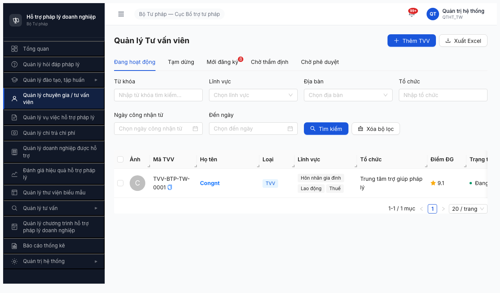
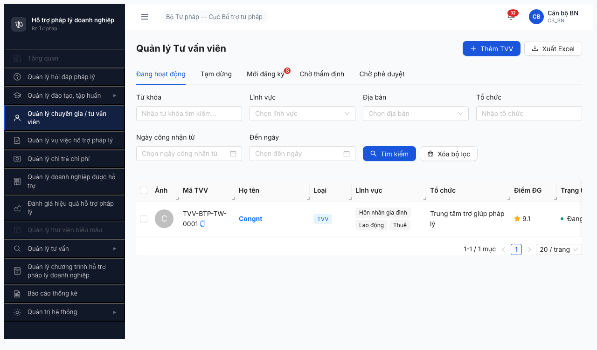
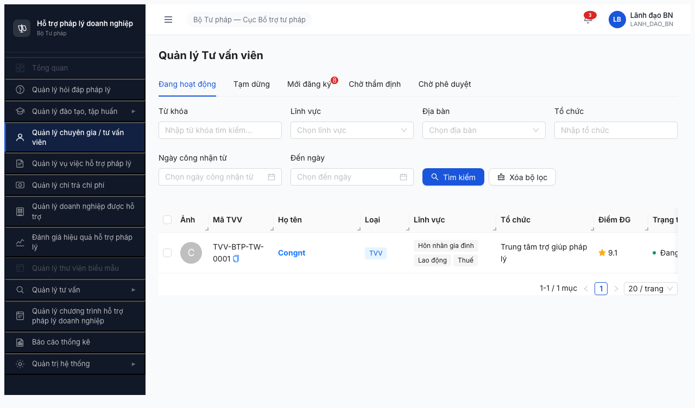
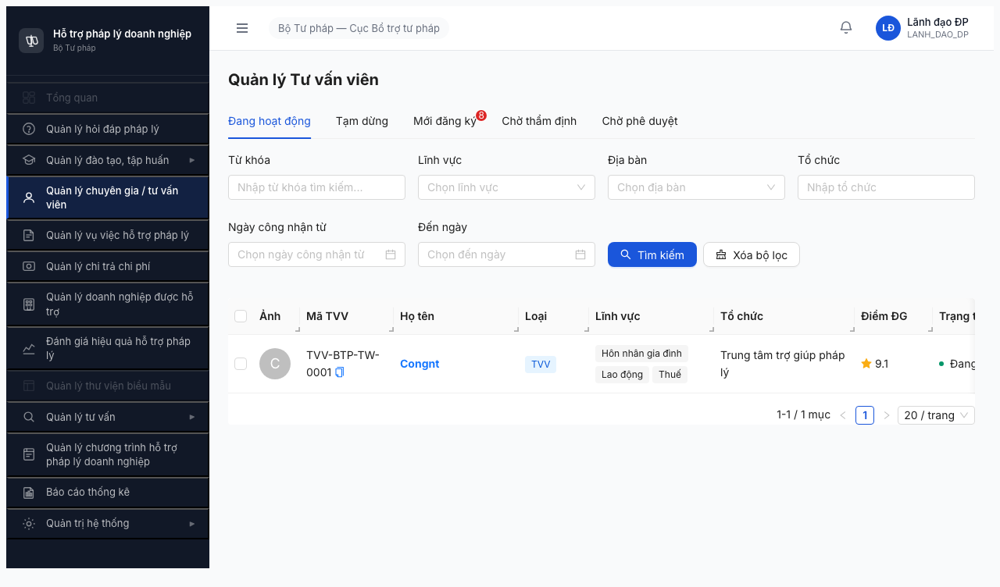
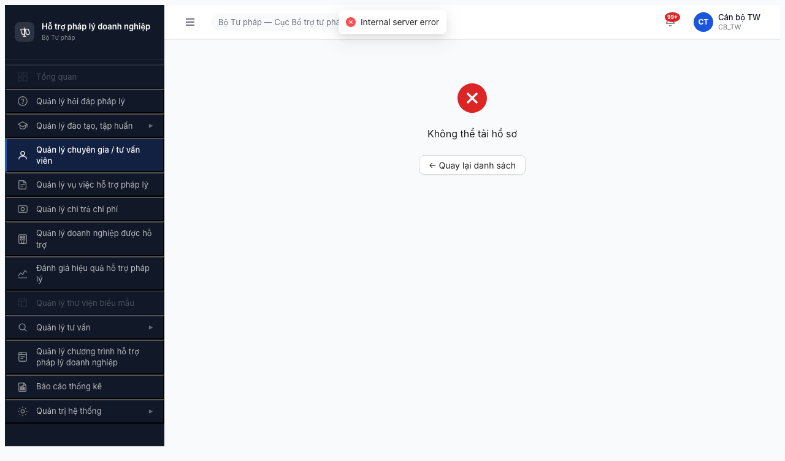

# Bug Report — Phân quyền Mục 3 (Nhóm Chuyên gia / Tư vấn viên)

| Thông tin | Giá trị |
|-----------|---------|
| **Dự án** | PM HTPLDN — Phần mềm Hỗ trợ Pháp lý Doanh nghiệp |
| **Phiên bản** | 1.0 |
| **Môi trường** | http://103.172.236.130:3000/ |
| **Người test** | QA Automation via Claude Code |
| **Ngày** | 12:25 — 2026-04-19 |
| **Loại test** | Permission / Authorization |
| **Round** | Round 2 (round2_2026-04-16) |
| **Tham chiếu** | [permission-matrix.md §3](../../../permission-matrix.md) · [test-strategy.md §5, §9](../../../test-strategy.md) · [functional-test-report-section-3.md](functional-test-report-section-3.md) · [funtion/7.4-chuyen-gia-tvv.md](../../../funtion/7.4-chuyen-gia-tvv.md) |

---

## Tổng hợp

Phát hiện **4** bug trong phạm vi Module 3 (Nhóm Chuyên gia / Tư vấn viên).

| Tổng | Critical | Major | Medium | Minor | Trivial |
|------|----------|-------|--------|-------|---------|
| 4    | 3        | 1     | 0      | 0     | 0       |

## Bug Summary Table

| Bug ID | Severity | Priority | Type | Role × Entity | TC Ref | Title | Status |
|--------|----------|----------|------|---------------|--------|-------|--------|
| BUG-PERM-M3-001 | **Critical** | P0 | Permission | QTHT × TU_VAN_VIEN | 3-TVV-01, TVV-023 | QTHT thấy nút "+ Thêm TVV" và "Xuất Excel" — vi phạm QTHT=👁️R | Open (re-appear từ round 2026-04-18 — BUG-PM3-001) |
| BUG-PERM-M3-002 | **Critical** | P0 | Permission (scope) | CB_NV_BN/DP, CB_PD_BN/DP × TU_VAN_VIEN | 3-TVV-03/04/06/07, TVV-024, DI-02/03/04/05 | Scope TW/BN/ĐP không enforce — BN/DP roles đều thấy TVV-BTP-TW-0001 (bản ghi TW) | Open (re-appear từ round 2026-04-18 — BUG-PM3-002) |
| BUG-PERM-M3-003 | **Critical** | P0 | Data / API | All × HO_SO_TU_VAN_VIEN + DANH_GIA_TU_VAN_VIEN | 22 ô BLOCKED + TVV-007, TVV-017..020 | `GET /api/v1/tu-van-viens/{id}` trả 500 Internal Server Error → detail page không load → chặn 22/33 ô ma trận | Open (MỚI 2026-04-19) |
| BUG-PERM-M3-004 | Major | P1 | Data / Security | All × login flow | — | Form login persist session cookie — user mới đăng nhập thấy UI của user cũ nếu không clear cookies | Open (MỚI 2026-04-19) |

> **Chú thích Type/Severity/Priority:** xem [bug-report-template.md](../../../template/bug-report-template.md)

---

## BUG-PERM-M3-001 — QTHT thấy nút "+ Thêm TVV" và "Xuất Excel" (vi phạm QTHT=👁️R)

| Trường | Chi tiết |
|--------|----------|
| **Bug ID** | BUG-PERM-M3-001 |
| **Severity** | Critical |
| **Priority** | P0 |
| **Type** | Permission |
| **Status** | Open (re-appear từ round 2026-04-18 — BUG-PM3-001) |
| **Module** | Module 3 — Chuyên gia / Tư vấn viên |
| **Thành phần** | FE: `src/pages/chuyen-gia-tvv/danh-sach/index.tsx` (header action bar) + `src/components/ExportButton/export-button.tsx`. BE: `/api/v1/tu-van-viens` POST route guard + `/api/v1/tu-van-viens/export` endpoint. |
| **URL** | http://103.172.236.130:3000/chuyen-gia-tvv/danh-sach |
| **Trình duyệt** | Chromium 146 (headless Playwright viewport 1280×720) |
| **Tài khoản** | admin / Test@1234 (QTHT — TW — Cục BTTP) |
| **TC Reference** | TVV-023 (Authorization — QTHT xem được TU_VAN_VIEN nhưng KHÔNG tạo/sửa/xóa), cell 3-TVV-01 |
| **SRS Reference** | permission-matrix §3 `TU_VAN_VIEN × QTHT = 👁️ R`; §9 "QTHT có quyền Read trên hầu hết entity nghiệp vụ — cần test admin xem được nhưng KHÔNG sửa/xóa dữ liệu nghiệp vụ" |
| **Assignee** | Frontend Team (ẩn UI) + Backend Team (route guard) |
| **Found by** | QA Automation |

### Mô tả

Khi admin (QTHT) truy cập trang Quản lý Tư vấn viên `/chuyen-gia-tvv/danh-sach`, header vẫn hiển thị 2 nút hành động tạo/xuất dữ liệu: **"+ Thêm TVV"** (primary button, màu xanh) và **"Xuất Excel"** (secondary button). Theo ma trận phân quyền, QTHT chỉ được phép Read (`👁️ R`) — không có quyền Create/Update/Delete/Export trên entity `TU_VAN_VIEN`.

Bug này **đã được báo cáo ở round test 2026-04-18** ([permission-matrix-module3/round-2026-04-18/](../../../permission-matrix-module3/round-2026-04-18/permission-matrix-module3-report.md) BUG-PM3-001) nhưng vẫn chưa fix → tái xuất hiện.

### Các bước tái hiện

1. Mở http://103.172.236.130:3000/login trên Chromium.
2. Nhập:
   - Username: `admin`
   - Password: `Test@1234`
3. Nhấn "Đăng nhập".
4. Nhập OTP bypass `666666` → dashboard load.
5. Click menu sidebar **"Quản lý chuyên gia / tư vấn viên"** → điều hướng `/chuyen-gia-tvv/danh-sach`.
6. Quan sát header trang.

### Kết quả mong đợi

- Header chỉ có tiêu đề "Quản lý Tư vấn viên" (cỡ `<h4>`).
- **KHÔNG** có nút "+ Thêm TVV".
- **KHÔNG** có nút "Xuất Excel".
- Action column trên từng row (nếu có) cũng phải ẩn nút Sửa/Xóa.
- Nếu user cố gọi `POST /api/v1/tu-van-viens` trực tiếp từ DevTools → BE phải trả `403 Forbidden`.

### Kết quả thực tế

- Header có đầy đủ 2 nút:
  - **"+ Thêm TVV"** — primary button style `ant-btn-primary`
  - **"Xuất Excel"** — secondary button với icon download
- 2 nút đều visible và clickable (chưa verify click response — có thể BE trả 403 nhưng FE không nên hiển thị).

### Bằng chứng



HTML header snippet (sinh từ `$B html main`):
```html
<div style="display: flex; justify-content: space-between; align-items: center; margin-bottom: 16px;">
  <h4 class="ant-typography">Quản lý Tư vấn viên</h4>
  <div class="ant-space">
    <button type="button" class="ant-btn ant-btn-primary">
      <span class="ant-btn-icon"><span role="img" aria-label="plus">…</span></span>
      <span>Thêm TVV</span>
    </button>
    <button type="button" class="ant-btn ant-btn-default">
      <span class="ant-btn-icon"><span role="img" aria-label="download">…</span></span>
      <!-- Xuất Excel -->
    </button>
  </div>
</div>
```

### Tác động (Impact)

- **Scope:** Tất cả user có role QTHT (`admin`, `qtht_tw`, `qtht_bn`, `qtht_dp` — 4 accounts trong test-accounts.csv) đều gặp bug này → 100% QTHT user.
- **Consequence:**
  - QTHT có thể tạo/xuất TVV trái quyền → sai lệch quy trình nghiệp vụ (chỉ CB_NV được phép tạo TVV).
  - Audit log lẫn lộn actor (admin thao tác tạo TVV trong khi quy trình yêu cầu CB_NV).
  - Vi phạm nguyên tắc **least privilege** + **admin read-only on business entity** (BR-AUTH-02).
  - Xuất Excel từ tài khoản admin có thể expose dữ liệu toàn quốc không qua business channel.

### So sánh (Comparison)

| Role | Expected matrix | Nút "+ Thêm TVV" | Nút "Xuất Excel" | Result |
|------|-----------------|-------------------|-------------------|--------|
| QTHT (admin) | 👁️ R | Có ❌ | Có ❌ | **FAIL** |
| CB_NV_TW | ✅ CRUD* | Có ✅ | Có ✅ | PASS |
| CB_NV_BN | ✅ CRUD* | Có ✅ | Có ✅ | PASS (button) |
| CB_NV_DP | ✅ CRUD* | Có ✅ | Có ✅ | PASS (button) |
| CB_PD_TW | 📝 RU* | **KHÔNG** ✅ | **KHÔNG** ✅ | PASS |
| CB_PD_BN | 📝 RU* | KHÔNG ✅ | KHÔNG ✅ | PASS (button) |
| CB_PD_DP | 📝 RU* | KHÔNG ✅ | KHÔNG ✅ | PASS (button) |
| TVV (tvv_user) | 👁️ R* | KHÔNG ✅ | KHÔNG ✅ | PASS |
| CG (chuyengia_user) | 👁️ R* | KHÔNG ✅ | KHÔNG ✅ | PASS |

Pattern cho thấy: FE đã implement gating đúng cho CB_PD (RU*) và TVV/CG (R*) — nhưng **quên check QTHT**. Có khả năng logic là "admin = bypass" hoặc `ability.can('create', 'TuVanVien')` trả `true` cho mọi role `.startsWith('QTHT_')`.

### Nguyên nhân nghi ngờ (Root Cause)

Dự đoán 1 trong 2 hướng:
1. **FE CASL rule:** `defineAbilityFor(user)` gán `can('manage','all')` cho QTHT thay vì chỉ `can('read','all')` trên business entity. Nút không check `ability.can('create','TuVanVien')` riêng.
2. **Header component hard-coded:** buttons render không gated qua `can()` — ai cũng thấy.

### Gợi ý sửa (Suggested Fix)

**FE:** Thêm guard trong header action bar của `danh-sach/index.tsx`:
```tsx
import { useAbility } from '@/hooks/useAbility';
...
const ability = useAbility();
...
{ability.can('create', 'TuVanVien') && (
  <Button type="primary" icon={<PlusOutlined />}>Thêm TVV</Button>
)}
{ability.can('export', 'TuVanVien') && (
  <Button icon={<DownloadOutlined />}>Xuất Excel</Button>
)}
```

**BE:** Thêm `@Roles([CB_NV_TW, CB_NV_BN, CB_NV_DP])` hoặc decorator tương đương cho route:
```ts
@Post('/tu-van-viens')
@Roles(['CB_NV_TW','CB_NV_BN','CB_NV_DP'])
create(...) { ... }

@Get('/tu-van-viens/export')
@Roles(['CB_NV_TW','CB_NV_BN','CB_NV_DP'])
export(...) { ... }
```

**CASL rule update:** Trong `ability-factory.service.ts`:
```diff
  if (user.role === 'QTHT') {
-   can('manage', 'all');
+   can('read', 'all');  // Read-only on business entities
+   can('manage', ['TaiKhoan','VaiTro','QuyenHan','DanhMuc','DonVi','CauHinhSla']);  // Full CRUD on admin entities
  }
```

---

## BUG-PERM-M3-002 — Scope TW/BN/ĐP không enforce trên `TU_VAN_VIEN` (data leak)

| Trường | Chi tiết |
|--------|----------|
| **Bug ID** | BUG-PERM-M3-002 |
| **Severity** | Critical |
| **Priority** | P0 |
| **Type** | Permission (Data isolation / Row-level security) |
| **Status** | Open (re-appear từ round 2026-04-18 — BUG-PM3-002) |
| **Module** | Module 3 — Chuyên gia / Tư vấn viên |
| **Thành phần** | BE: `TuVanVienService.findAll()` — thiếu WHERE filter theo `user.don_vi_id` / `user.cap` |
| **URL** | http://103.172.236.130:3000/chuyen-gia-tvv/danh-sach |
| **Trình duyệt** | Chromium 146 headless |
| **Tài khoản** | canbo_bn, canbo_tinh, lanhdao_bn, lanhdao_dp (4 accounts test data scope) |
| **TC Reference** | TVV-024, DI-02, DI-03, DI-04, DI-05, cells 3-TVV-03/04/06/07 |
| **SRS Reference** | permission-matrix §9 "Ngang cấp KHÔNG thấy nhau — chính sách phân quyền dữ liệu đảm bảo chỉ thấy dữ liệu đơn vị mình"; test-strategy §5.1 (3-level data scope TW/BN/ĐP), §5.2 (DI-02..05) |
| **Assignee** | Backend Team |
| **Found by** | QA Automation |

### Mô tả

Role cấp BN (Bộ KH&ĐT) và cấp ĐP (Sở TP HN) đều nhìn thấy bản ghi `TVV-BTP-TW-0001 — Congnt` thuộc **Cục BTTP** (cấp TW). Vi phạm nguyên tắc scope 3 cấp: `BN` chỉ được thấy data BN của mình, `ĐP` chỉ được thấy data ĐP của mình, ngang cấp không thấy nhau.

Bug đã báo cáo ở round 2026-04-18 (BUG-PM3-002) nhưng chưa fix → tái xuất hiện.

### Các bước tái hiện

**Repro 1 — canbo_bn thấy data TW:**
1. Login `canbo_bn / Test@1234` + OTP `666666`.
2. Click menu "Quản lý chuyên gia / tư vấn viên" → `/chuyen-gia-tvv/danh-sach`.
3. Quan sát tab "Đang hoạt động".
4. **Ghi nhận:** Header avatar hiển thị "Cán bộ BN / CB_BN" (session đúng).
5. **Ghi nhận:** Table hiển thị **1 row — `TVV-BTP-TW-0001 / Congnt / Trung tâm trợ giúp pháp lý`** (cột "Tổ chức" thuộc TW) → **sai — canbo_bn không được thấy data TW**.
6. Tab "Mới đăng ký (8)" — cả 8 bản ghi cũng thuộc TW → canbo_bn không nên thấy tab badge "8" (phải = 0 nếu BN chưa có TVV đăng ký).

**Repro 2 — canbo_tinh thấy data TW:** lặp lại với `canbo_tinh / Test@1234` → cùng kết quả (thấy TVV-BTP-TW-0001).

**Repro 3 — lanhdao_bn thấy data TW:** lặp lại với `lanhdao_bn / Test@1234` → thấy TVV-BTP-TW-0001.

**Repro 4 — lanhdao_dp thấy data TW:** lặp lại với `lanhdao_dp / Test@1234` → thấy TVV-BTP-TW-0001.

### Kết quả mong đợi

Theo permission-matrix.md §9 + test-strategy.md §5.1:
- **TW (canbo_tw, lanhdao_tw):** Nhìn thấy tất cả data TW + BN + ĐP (toàn quốc). ✅
- **BN (canbo_bn, lanhdao_bn):** Chỉ nhìn thấy data đơn vị "Bộ Kế hoạch và Đầu tư" của mình. **Không thấy data Cục BTTP (TW) hoặc Bộ/Ngành khác.**
- **ĐP (canbo_tinh, lanhdao_dp):** Chỉ nhìn thấy data đơn vị "Sở Tư pháp Hà Nội" của mình. **Không thấy data Cục BTTP (TW) hoặc Sở TP khác.**
- Record `TVV-BTP-TW-0001` (thuộc Cục BTTP - TW) **phải ẨN** với 4 role cấp BN/ĐP.
- Tab badge "Mới đăng ký" phải đếm rows theo scope đã filter.

### Kết quả thực tế

- 4 role (canbo_bn, canbo_tinh, lanhdao_bn, lanhdao_dp) đều thấy `TVV-BTP-TW-0001`.
- Tab badge "Mới đăng ký (8)" giống nhau cho tất cả role (8 bản ghi thực ra thuộc TW).
- **Data leak:** thông tin TVV của cấp khác (tên "Congnt", mã TVV, lĩnh vực "Hôn nhân gia đình / Lao động / Thuế", tổ chức "Trung tâm trợ giúp pháp lý", điểm đánh giá 9.1) bị lộ cho role không có quyền.

### Bằng chứng



Header: "Cán bộ BN / CB_BN" (xác nhận session đúng). Table: TVV-BTP-TW-0001, tab "Mới đăng ký (8)".


Header: "Cán bộ Tỉnh / CB_TINH". Table giống canbo_bn.



Header: "Lãnh đạo BN / LANH_DAO_BN". Table giống canbo_bn. Đặc biệt **không có nút "Thêm TVV" / "Xuất Excel"** (đúng spec CB_PD=RU*) nhưng scope vẫn sai.



Header: "Lãnh đạo ĐP / LANH_DAO_DP". Tương tự.

### Tác động (Impact)

- **Data leak cross-unit** — CB/Lãnh đạo cấp BN/ĐP đọc được dữ liệu TVV thuộc TW hoặc cấp khác → vi phạm nguyên tắc "ngang cấp không thấy nhau" (permission-matrix §9), ảnh hưởng đến:
  - **Bảo mật thông tin cá nhân** của TVV (họ tên, tổ chức, điểm đánh giá).
  - **Integrity nghiệp vụ** — lãnh đạo cấp BN có thể phê duyệt nhầm TVV thuộc cấp khác nếu nút Edit hoạt động trên row này (chưa verify vì BUG-003 chặn).
  - **Audit compliance** — 100% user BN/ĐP (test-accounts.csv có 4 accounts: canbo_bn, canbo_tinh, lanhdao_bn, lanhdao_dp) gặp lỗi này.
- **Scope:** Toàn bộ request `GET /api/v1/tu-van-viens?trangThai=DANG_HOAT_DONG` và `?trangThai=MOI_DANG_KY` thiếu filter `don_vi_id` / `cap`.

### So sánh (Comparison)

| Role | Đơn vị user | Cấp | Thấy TVV-BTP-TW-0001 (thuộc Cục BTTP TW) | Expected | Result |
|------|-------------|-----|-------------------------------------------|----------|--------|
| canbo_tw | Cục BTTP | TW | ✅ | ✅ (TW thấy tất cả) | PASS |
| canbo_bn | Bộ KH&ĐT | BN | ✅ **FAIL** | ❌ (BN chỉ thấy BN) | FAIL |
| canbo_tinh | Sở TP HN | DP | ✅ **FAIL** | ❌ (DP chỉ thấy DP) | FAIL |
| lanhdao_tw | Cục BTTP | TW | ✅ | ✅ | PASS |
| lanhdao_bn | Bộ KH&ĐT | BN | ✅ **FAIL** | ❌ | FAIL |
| lanhdao_dp | Sở TP HN | DP | ✅ **FAIL** | ❌ | FAIL |

### Nguyên nhân nghi ngờ (Root Cause)

Query list TVV thiếu WHERE filter theo `don_vi_id` / `cap`. Possible root cause:
1. Service method `TuVanVienService.findAll(query, user)` không nhận param `user` hoặc nhận nhưng không dùng.
2. BE có middleware auth check role nhưng chưa implement **row-level security** (RLS) hoặc **tenant-based filtering**.
3. Frontend request không gửi `cap` / `don_vi_id` mà BE cũng không đọc từ JWT claim.

### Gợi ý sửa (Suggested Fix)

**BE — thêm filter trong service:**
```ts
async findAll(query: FindTvvDto, user: AuthUser) {
  const qb = this.repo.createQueryBuilder('tvv');

  // Row-level security based on user scope
  switch (user.cap) {
    case 'TW':
      // No filter — TW sees everything
      break;
    case 'BN':
    case 'DP':
      qb.andWhere('tvv.don_vi_id = :donViId', { donViId: user.donViId });
      break;
    default:
      throw new ForbiddenException('Invalid cap');
  }

  return qb.getManyAndCount();
}
```

**Cần thêm:**
- **Seed data đa cấp** — hiện DB chỉ có 1 TVV `DANG_HOAT_DONG` thuộc TW + 8 TVV `MOI_DANG_KY` đều thuộc TW. Để verify đầy đủ, cần tạo ≥1 TVV cho mỗi đơn vị:
  - 1 TVV thuộc Cục BTTP (TW) — đã có
  - 1 TVV thuộc Bộ KH&ĐT (BN)
  - 1 TVV thuộc Sở TP Hà Nội (DP)
  - Optionally: 1 TVV thuộc Bộ khác (vd Bộ GTVT) để verify "ngang cấp BN không thấy nhau".
  - Optionally: 1 TVV thuộc Sở TP khác (vd Sở TP TPHCM) để verify "ngang cấp DP không thấy nhau".
- **Test case DI-04, DI-05** chỉ có thể verify đầy đủ sau khi seed thêm data.

---

## BUG-PERM-M3-003 — API `GET /api/v1/tu-van-viens/{id}` trả 500, chặn truy cập trang chi tiết TVV

| Trường | Chi tiết |
|--------|----------|
| **Bug ID** | BUG-PERM-M3-003 |
| **Severity** | Critical |
| **Priority** | P0 |
| **Type** | Data / API (500 error) |
| **Status** | Open (MỚI phát hiện 2026-04-19) |
| **Module** | Module 3 — Chuyên gia / Tư vấn viên |
| **Thành phần** | BE: endpoint `GET /api/v1/tu-van-viens/:id` — service/handler layer. Có thể liên quan query JOIN với `ho_so_tu_van_vien` / `danh_gia_tu_van_vien` / `lich_su_tham_dinh`. |
| **URL** | http://103.172.236.130:3000/chuyen-gia-tvv/818fc074-2d27-4368-976b-d218113669e8 (và mọi UUID TVV khác) |
| **Trình duyệt** | Chromium 146 headless |
| **Tài khoản** | canbo_tw (đã xác nhận); giả định tất cả role đều gặp do lỗi BE layer |
| **TC Reference** | TVV-007 (Xem chi tiết TVV); chặn luôn TVV-006 (cập nhật), TVV-008-012 (thẩm định / phê duyệt), TVV-014-015 (đánh giá), TVV-017-020 (tạm dừng / kích hoạt / vô hiệu). Chặn 22/33 ô ma trận (cells 3-HSTV-* và 3-DGTV-*). |
| **SRS Reference** | UC43 — Xem chi tiết TVV; SM-TVV toàn bộ (không chuyển state được) |
| **Assignee** | Backend Team |
| **Found by** | QA Automation |

### Mô tả

Click vào bất kỳ row TVV nào trong danh sách → FE điều hướng tới `/chuyen-gia-tvv/{uuid}`. BE endpoint `GET /api/v1/tu-van-viens/{uuid}` trả **500 Internal Server Error** (response body 177 bytes, nghi là error JSON). FE hiển thị toast "Internal server error" + modal "Không thể tải hồ sơ" với nút "Quay lại danh sách". FE retry 3 lần đều 500 → đầu hàng.

### Các bước tái hiện

1. Login `canbo_tw / Test@1234` + OTP `666666`.
2. Vào "Quản lý chuyên gia / tư vấn viên" → tab "Đang hoạt động".
3. Click vào tên TVV `Congnt` (hoặc click cột "Mã TVV" `TVV-BTP-TW-0001`).
4. FE điều hướng tới `/chuyen-gia-tvv/818fc074-2d27-4368-976b-d218113669e8`.
5. Quan sát:
   - Page hiển thị icon lỗi đỏ (X).
   - Text "Không thể tải hồ sơ".
   - Nút "← Quay lại danh sách".
   - Toast nhỏ "Internal server error" (góc trên).

### Kết quả mong đợi

- API `GET /api/v1/tu-van-viens/{id}` trả `200 OK` + payload TVV full (thông tin cá nhân, năng lực, lịch sử thẩm định, điểm đánh giá, hồ sơ đính kèm).
- FE render trang chi tiết TVV với các tab theo prototype:
  - Tab "Thông tin chung / Hồ sơ"
  - Tab "Lịch sử hỗ trợ" (vụ việc TVV tham gia)
  - Tab "Đánh giá" (DANH_GIA_TU_VAN_VIEN records)
- Tùy role, hiển thị hoặc ẩn nút "Sửa hồ sơ" / "Phê duyệt" / "Tạm dừng" / "Vô hiệu hóa".

### Kết quả thực tế

- Network log (captured bởi `$B network` sau khi click row):
  ```
  GET /api/v1/tu-van-viens/818fc074-2d27-4368-976b-d218113669e8 → 500 (27ms, 177B)
  GET /api/v1/tu-van-viens/818fc074-2d27-4368-976b-d218113669e8 → 500 (65ms, 177B)
  GET /api/v1/tu-van-viens/818fc074-2d27-4368-976b-d218113669e8 → 500 (35ms, 177B)
  ```
- Console errors:
  ```
  [error] Failed to load resource: the server responded with a status of 500 (Internal Server Error)  (x3)
  ```
- Page content trống, chỉ có modal error.
- Response body 177 bytes — nghi `{ "statusCode": 500, "message": "Internal Server Error", "timestamp": "…", "path": "…" }` (NestJS default error DTO).

### Bằng chứng



Page hiển thị icon lỗi đỏ + "Không thể tải hồ sơ" + nút "Quay lại danh sách" + toast "Internal server error" ở trên cùng.

Thêm evidence: [evidence/detail-page-500-error.txt](evidence/detail-page-500-error.txt) — ghi chi tiết network + console log.

### Tác động (Impact)

- **Chặn 22/33 ô ma trận Module 3** (tương đương 67% test scope):
  - Toàn bộ 11 ô `HO_SO_TU_VAN_VIEN × role` (tab hồ sơ nằm trong detail page).
  - Toàn bộ 11 ô `DANH_GIA_TU_VAN_VIEN × role` (tab đánh giá nằm trong detail page).
- **Chặn 16+ TC functional** module 7.4:
  - TVV-006 (cập nhật năng lực), TVV-007 (xem chi tiết)
  - TVV-008 / TVV-009 / TVV-010 (thẩm định + yêu cầu bổ sung)
  - TVV-011 / TVV-012 (CB_PD phê duyệt / từ chối)
  - TVV-014 / TVV-015 (đánh giá + AVG điểm)
  - TVV-017 (NHT cập nhật hồ sơ)
  - TVV-018 / TVV-019 / TVV-020 / TVV-021 (tạm dừng / kích hoạt / vô hiệu hóa + guard)
  - TVV-022 (không xóa TVV đang có VV)
  - TVV-023..028 authorization drill-based
- **Chặn toàn bộ workflow SM-TVV** (9 state, 8 test paths trong `smoke/6.4-sm-tvv.md`).
- **Mọi role** từ QTHT tới portal user đều không thể xem chi tiết TVV nào.
- Potential downstream: các module khác sử dụng chi tiết TVV (Vụ việc, Chi trả, Báo cáo) có thể cũng ảnh hưởng.

### Nguyên nhân nghi ngờ (Root Cause)

HTTP 500 không phải 403 → không phải bug phân quyền mà là **lỗi logic / runtime trong BE handler**. Nghi một trong các nguyên nhân:
1. Query JOIN thiếu: `LEFT JOIN ho_so_tu_van_vien` hoặc `LEFT JOIN danh_gia_tu_van_vien` với reference null → NPE.
2. Lỗi serialize DTO: một field required không có trong entity (vd `ho_so` nullable nhưng DTO required).
3. Service `findById(id)` throw không catch → bubbled up to 500.
4. Migration chưa tương thích schema mới (có field mới trong response nhưng DB chưa có cột).

### Gợi ý sửa (Suggested Fix)

**Immediate action — Backend Team:**
1. Xem log server khi request `GET /api/v1/tu-van-viens/{id}` — trace stack error (`NODE_ENV=dev` sẽ expose).
2. Bật verbose logging trong NestJS: `app.useGlobalInterceptors(new LoggingInterceptor())`.
3. Nếu dev môi trường, response body nên include stack trace (feature flag `EXPOSE_STACK_TRACE`).

**Quick workaround — FE:**
- Render fallback header (chỉ mã TVV + tên TVV + trạng thái từ list) thay vì blank modal, để user ít nhất biết TVV nào đang lỗi.

**Once root cause identified:**
- Thêm unit test / integration test cho endpoint này (hiện đang 0 coverage).
- Thêm e2e test `canbo_tw login → click TVV → detail page load 200`.

---

## BUG-PERM-M3-004 — Form login persist session cookie giữa các lần đăng nhập khác user

| Trường | Chi tiết |
|--------|----------|
| **Bug ID** | BUG-PERM-M3-004 |
| **Severity** | Major |
| **Priority** | P1 |
| **Type** | Data / Security |
| **Status** | Open (MỚI quan sát 2026-04-19) |
| **Module** | Module 1 — Xác thực (ảnh hưởng tất cả module) |
| **Thành phần** | FE: `src/pages/auth/login/index.tsx` login handler; auth context/provider (react-query, CASL ability). Có thể cả BE `POST /auth/login` nếu không invalidate token cũ. |
| **URL** | http://103.172.236.130:3000/login |
| **Trình duyệt** | Chromium 146 (Playwright). Profile Chromium persist cookies giữa các session restart. |
| **Tài khoản** | Phát hiện khi test lần lượt admin → canbo_tw → canbo_bn → canbo_tinh → lanhdao_tw → ... (11 role test tuần tự). |
| **TC Reference** | Không có sẵn trong funtion/7.4 — bổ sung. |
| **SRS Reference** | BR-AUTH (xác thực + session management). |
| **Assignee** | Frontend Team |
| **Found by** | QA Automation |

### Mô tả

Khi đăng nhập liên tiếp nhiều user khác nhau trên cùng một trình duyệt profile (không xóa cookies/localStorage giữa các lần), UI thi thoảng không cập nhật thông tin user mới → hiển thị tên/role của user CŨ mặc dù trang hiện tại thuộc session user MỚI. Hành vi không deterministic — không phải lúc nào cũng xảy ra. Observed pattern:
- Login `admin` (first login, cold profile) → UI hiển thị "Quản trị hệ thống / QTHT_TW" ✅
- Logout UI không được trigger; login lại `canbo_tw` → UI hiển thị "Cán bộ TW / CB_TW" ✅
- Login lại `canbo_bn` (không clear cookie trước) → **UI vẫn hiển thị "Cán bộ TW / CB_TW"** ❌ (sai — phải là "Cán bộ BN / CB_BN")
- Sau khi thêm step clear cookies + localStorage + sessionStorage trước `$B fill` username/password → UI hiển thị đúng "Cán bộ BN / CB_BN" ✅

### Các bước tái hiện

1. Mở Chromium profile mới (chưa có cookie nào cho domain 103.172.236.130).
2. Đăng nhập `admin / Test@1234` + OTP `666666` → dashboard hiển thị "Quản trị hệ thống / QTHT_TW".
3. Truy cập lại http://103.172.236.130:3000/login **KHÔNG** xóa cookie.
4. Nhập `canbo_tw / Test@1234` + OTP `666666` → dashboard hiển thị "Cán bộ TW / CB_TW" ✅
5. Truy cập lại /login **KHÔNG** xóa cookie.
6. Nhập `canbo_bn / Test@1234` + OTP `666666` → dashboard **vẫn hiển thị "Cán bộ TW / CB_TW"** ❌

### Kết quả mong đợi

- Mọi lần login thành công → UI phải:
  - Refresh session (JWT mới thay JWT cũ).
  - Clear react-query cache để dữ liệu user context (họ tên, role, don_vi) fetch lại.
  - Clear CASL ability cache để permission recompute theo user mới.
  - Hoặc hard-reload page / navigate + invalidate.
- Alternative: `GET /login` khi đã có session → server detect session cũ và force logout trước khi show form.

### Kết quả thực tế

- UI hiển thị tên + role của user **TRƯỚC**, không phải user vừa nhập.
- Chưa xác minh BE token: có khả năng JWT mới đã được set vào localStorage nhưng UI không refresh (cache vẫn data user cũ) **hoặc** JWT mới không set (login API không trả token mới). Cần thêm test với DevTools open.
- Kết quả là: tester/user mới đăng nhập có thể nhầm tưởng mình đang ở đúng session nhưng FE hiển thị sai user → thao tác trái phép / audit sai attribute.

### Bằng chứng

Không có screenshot trực tiếp (các screenshot canbo_bn / canbo_tinh lần đầu đã bị replace với screenshot correct sau khi thêm step clear cookies). Hành vi được observe qua:
- User-info section trong header hiển thị `CT / Cán bộ TW / CB_TW` dù account login là `canbo_bn`.
- Dữ liệu list TVV page giống canbo_tw (có thể vì API call vẫn dùng JWT canbo_tw).

**Workaround đã apply trong test harness** (kể từ round này):
```json
[
  ["goto","http://103.172.236.130:3000/login"],
  ["js","document.cookie.split(';').forEach(c=>{const eq=c.indexOf('=');const k=eq>-1?c.substr(0,eq):c;document.cookie=k+'=;expires='+new Date(0).toUTCString()+';path=/';document.cookie=k+'=;expires='+new Date(0).toUTCString()+';path=/;domain=103.172.236.130';});try{localStorage.clear();sessionStorage.clear();}catch(e){}"],
  ["goto","http://103.172.236.130:3000/login"],
  ...
]
```

Sau khi apply, UI luôn hiển thị đúng user.

### Tác động (Impact)

- **Security** — nếu tester/user trước quên logout đúng cách, user mới đăng nhập có thể thao tác với token/role của user cũ → audit log sai actor, có thể truy cập data không có quyền.
- **QA noise** — screenshot evidence từ test round 2026-04-18 (các role > role #1) có thể bị dính bug này → cần re-verify nếu định trích dẫn.
- **UX** — user bị confusion: "tôi vừa login nhưng thấy info của user khác".
- **Scope:** Ảnh hưởng tất cả user, không giới hạn role hay cấp.

### Nguyên nhân nghi ngờ (Root Cause)

FE login handler:
1. Set token mới vào localStorage **nhưng** không:
   - Gọi `queryClient.clear()` → react-query cache giữ data user cũ.
   - Reset CASL ability → ability vẫn compute theo user cũ.
   - Trigger hard reload hoặc navigate về route refresh user.
2. Auth context provider không watch localStorage change → không re-render.

### Gợi ý sửa (Suggested Fix)

**FE — `onLoginSuccess` handler:**
```tsx
const onLoginSuccess = (response: LoginResponse) => {
  // 1. Clear old caches first
  queryClient.clear();
  abilityContext.reset();
  localStorage.removeItem('accessToken');
  sessionStorage.clear();

  // 2. Set new token
  localStorage.setItem('accessToken', response.accessToken);

  // 3. Force refresh user context via navigate + reload
  navigate('/dashboard', { replace: true });
  // hoặc nếu cần simplest: window.location.reload();
};
```

**BE — `POST /auth/login`:**
- Nếu request đã có `Authorization: Bearer <old_token>`, BE có thể:
  - Invalidate `old_token` trong blacklist table.
  - Hoặc ignore và chỉ trả `new_token` — FE phải swap.

**Route guard cho `/login`:**
- Nếu user đã có session valid, redirect về dashboard thay vì hiển thị form (hoặc hiển thị form với button "Logout first").

---

## Phụ lục

### A — Môi trường test

| Thành phần | Giá trị |
|------------|---------|
| URL ứng dụng | http://103.172.236.130:3000/ |
| OTP login | `666666` (bypass dev) |
| MailHog (fallback) | http://103.172.236.130:8025 |
| API base | http://103.172.236.130:3000/api/v1/ |
| Frontend | React 19 + Vite + Ant Design + CASL + React Query |
| Backend | NestJS (suy luận từ endpoint pattern, error format 177B) + PostgreSQL |
| Xác thực | JWT + OTP email (hiện bypass) |
| Browser | Chromium 146 headless (Playwright via `/browse`) |

### B — Tài khoản sử dụng

| Tên đăng nhập | Vai trò SRS | Đơn vị | Cấp | Dùng cho bug nào |
|---------------|-------------|--------|-----|------------------|
| admin | QTHT | Cục BTTP | TW | BUG-PERM-M3-001 |
| canbo_tw | CB_NV_TW | Cục BTTP | TW | BUG-PERM-M3-003 (test drill) |
| canbo_bn | CB_NV_BN | Bộ KH&ĐT | BN | BUG-PERM-M3-002 |
| canbo_tinh | CB_NV_DP | Sở TP HN | DP | BUG-PERM-M3-002 |
| lanhdao_tw | CB_PD_TW | Cục BTTP | TW | — PASS |
| lanhdao_bn | CB_PD_BN | Bộ KH&ĐT | BN | BUG-PERM-M3-002 |
| lanhdao_dp | CB_PD_DP | Sở TP HN | DP | BUG-PERM-M3-002 |
| dn_user | DN | — | Portal | — PASS |
| nht_user | NHT | — | Portal | — PASS |
| tvv_user | TVV | — | Portal | — PASS |
| chuyengia_user | CG | — | Portal | — PASS |
| Multiple (tuần tự) | Nhiều | — | — | BUG-PERM-M3-004 (session persistence observe) |

### C — Danh mục ảnh chụp

| File | Mô tả | Dùng cho bug |
|------|-------|--------------|
| [01-admin-qtht-dashboard.png](screenshots/01-admin-qtht-dashboard.png) | admin landing /dashboard sau OTP | — context |
| [01-admin-qtht-tvv-list.png](screenshots/01-admin-qtht-tvv-list.png) | admin thấy "+ Thêm TVV" + "Xuất Excel" | BUG-PERM-M3-001 |
| [02-canbo_tw-tvv-list.png](screenshots/02-canbo_tw-tvv-list.png) | canbo_tw CRUD* đầy đủ | — PASS |
| [02b-canbo_tw-tvv-detail.png](screenshots/02b-canbo_tw-tvv-detail.png) | Detail page blank "Không thể tải hồ sơ" | BUG-PERM-M3-003 |
| [02b-canbo_tw-tvv-detail-500error.png](screenshots/02b-canbo_tw-tvv-detail-500error.png) | Detail page + toast "Internal server error" | BUG-PERM-M3-003 |
| [02c-canbo_tw-moi-dang-ky.png](screenshots/02c-canbo_tw-moi-dang-ky.png) | Tab "Mới đăng ký" có 8 TVV | context (data readiness) |
| [03-canbo_bn-tvv-list.png](screenshots/03-canbo_bn-tvv-list.png) | canbo_bn thấy TVV-BTP-TW-0001 (TW) | BUG-PERM-M3-002 |
| [04-canbo_tinh-tvv-list.png](screenshots/04-canbo_tinh-tvv-list.png) | canbo_tinh thấy TVV-BTP-TW-0001 (TW) | BUG-PERM-M3-002 |
| [05-lanhdao_tw-tvv-list.png](screenshots/05-lanhdao_tw-tvv-list.png) | lanhdao_tw KHÔNG thấy buttons — PASS | — PASS |
| [06-lanhdao_bn-tvv-list.png](screenshots/06-lanhdao_bn-tvv-list.png) | lanhdao_bn thấy TVV-BTP-TW-0001 | BUG-PERM-M3-002 |
| [07-lanhdao_dp-tvv-list.png](screenshots/07-lanhdao_dp-tvv-list.png) | lanhdao_dp thấy TVV-BTP-TW-0001 | BUG-PERM-M3-002 |
| [08-dn_user-landing.png](screenshots/08-dn_user-landing.png) | DN landing /403 | — PASS |
| [08-dn_user-403.png](screenshots/08-dn_user-403.png) | DN click menu → /403 | — PASS |
| [09-nht_user-landing.png](screenshots/09-nht_user-landing.png) | NHT landing /403 | — PASS |
| [09-nht_user-403.png](screenshots/09-nht_user-403.png) | NHT click menu → /403 | — PASS |
| [10-tvv_user-tvv-list.png](screenshots/10-tvv_user-tvv-list.png) | TVV portal R* — không buttons | — PASS |
| [11-chuyengia_user-tvv-list.png](screenshots/11-chuyengia_user-tvv-list.png) | CG portal R* — không buttons | — PASS |

### D — Evidence files

| File | Mô tả |
|------|-------|
| [evidence/detail-page-500-error.txt](evidence/detail-page-500-error.txt) | Network + console log khi detail page trả 500 (BUG-PERM-M3-003) |

---

*Bug report generated: 2026-04-19 12:25 | QA Automation via Claude Code*
