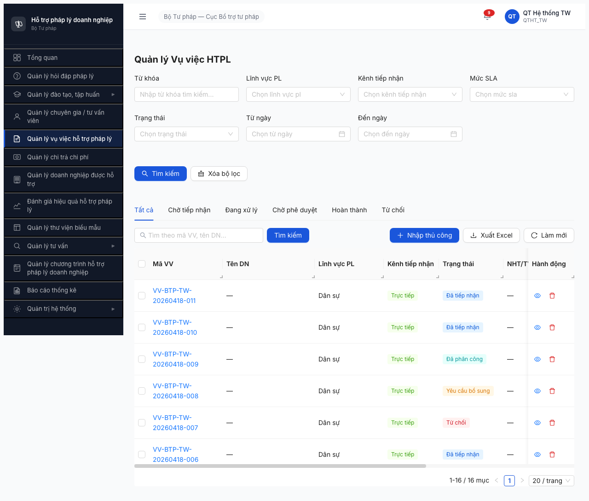
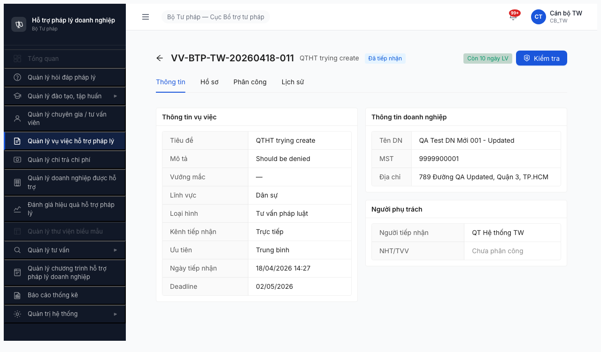
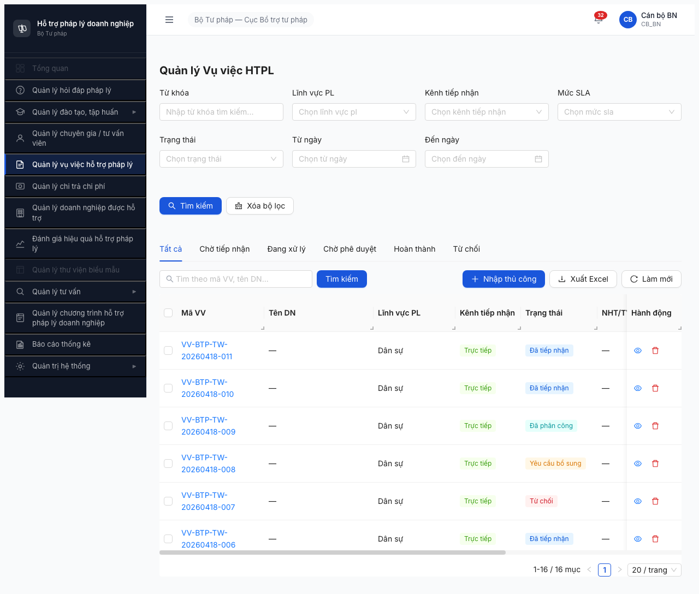
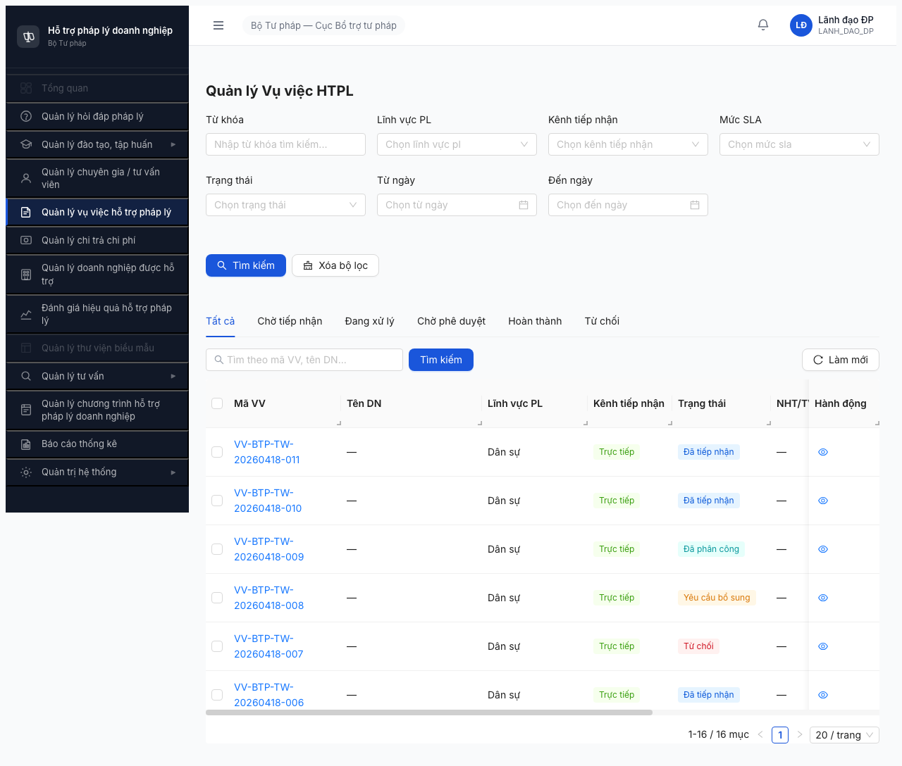
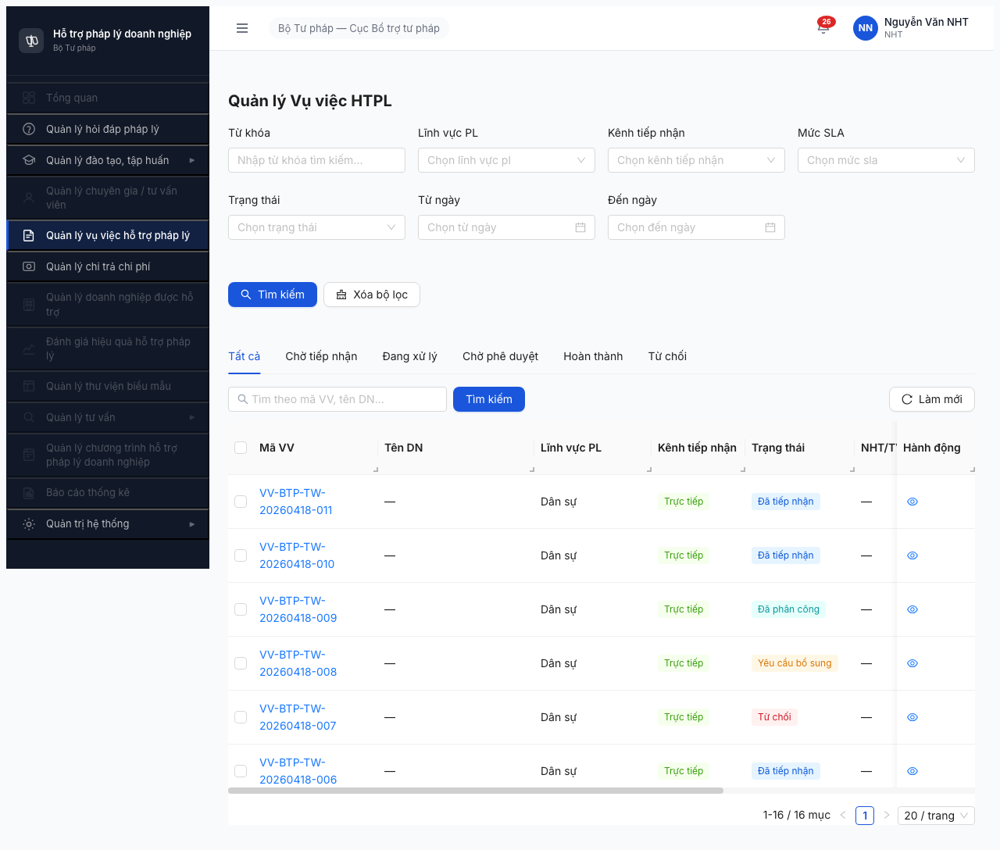
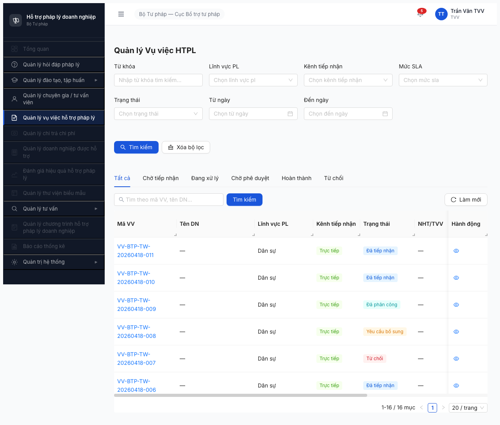
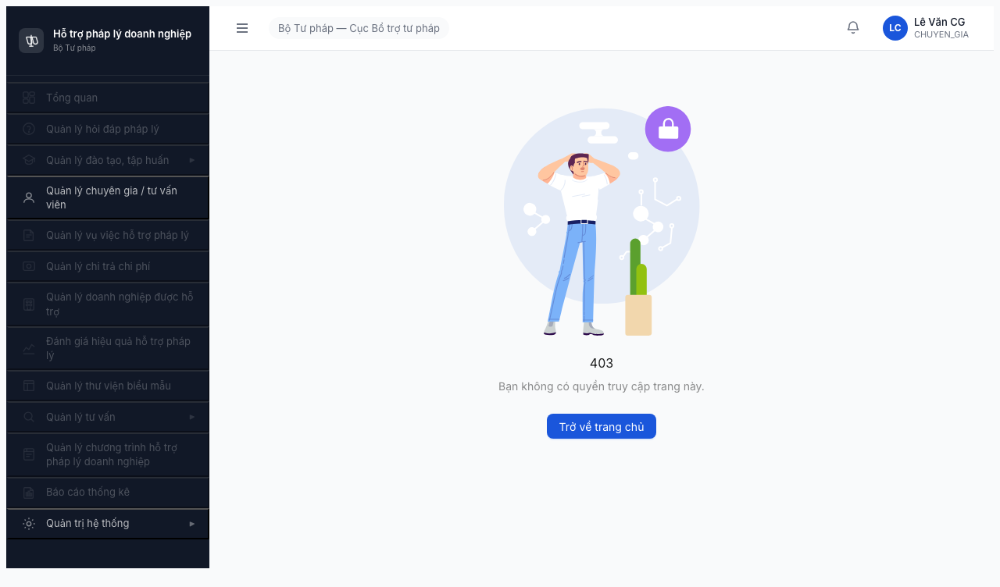

# Bug Report — Phân quyền Mục 4 (Nhóm Vụ việc HTPL)

| Thông tin | Giá trị |
|-----------|---------|
| **Dự án** | PM HTPLDN — Phần mềm Hỗ trợ Pháp lý Doanh nghiệp |
| **Phiên bản** | 1.0 |
| **Môi trường** | http://103.172.236.130:3000/ |
| **Người test** | QA Automation via Claude Code (Opus 4.7) |
| **Ngày** | 13:15:00 — 2026-04-19 |
| **Loại test** | Permission / Authorization |
| **Round** | round2_2026-04-16 |
| **Tham chiếu** | [permission-matrix.md §4](../../../permission-matrix.md) · [test-strategy.md §5, §9](../../../test-strategy.md) · [functional-test-report-section-4.md](functional-test-report-section-4.md) · [round2 vu-viec](../../vu-viec/bug-report-vu-viec.md) |

---

## Tổng hợp

Phát hiện **5** bug phân quyền trong phạm vi Module 4 (Vụ việc HTPL). **4/5 là Critical, tất cả tái xuất hiện từ round 2026-04-18 chưa được fix.**

| Tổng | Critical | Major | Medium | Minor | Trivial |
|------|----------|-------|--------|-------|---------|
| 5    | 4        | 1     | 0      | 0     | 0       |

## Bug Summary Table

| Bug ID | Severity | Priority | Type | Role × Entity | TC Ref | Title | Status |
|--------|----------|----------|------|---------------|--------|-------|--------|
| BUG-PERM-M4-001 | **Critical** | P0 | Permission | QTHT × VU_VIEC | 1-1, VV-028 | QTHT có nút "+ Nhập thủ công" + "Xuất Excel" + icon Xóa trên VU_VIEC list, vi phạm Read-only | Open (tái xuất hiện từ BUG-VV-014) |
| BUG-PERM-M4-002 | **Critical** | P0 | Permission | CB_NV/CB_PD BN+DP × VU_VIEC | 1-3, 1-4, 1-6, 1-7, DI-02→05 | Data scope BN/ĐP không enforce — 4 role đều thấy 16 records TW | Open (pattern giống BUG-PM3-R2-002) |
| BUG-PERM-M4-003 | **Critical** | P0 | Permission | NHT × VU_VIEC | 1-9, DI-06 | NHT thấy tất cả 16 VV thay vì chỉ VV được phân công (vi phạm BR-AUTH-10) | Open (tái xuất hiện từ BUG-VV-004) |
| BUG-PERM-M4-004 | **Critical** | P0 | Permission | TVV × VU_VIEC | 1-10 | TVV thấy danh sách VU_VIEC — authz leak, matrix TVV × VU_VIEC = ❌ | Open (tái xuất hiện từ BUG-VV-015) |
| BUG-PERM-M4-005 | Major | P1 | Permission / Spec | DN × VU_VIEC | 1-8, DI-09 | Mâu thuẫn matrix §4 (👁️ R*) vs DI-09/§9.1 (DN không truy cập CMS) | Open (cần SRS clarify) |

> **Chú thích Type/Severity/Priority:** xem [bug-report-template.md](../../../template/bug-report-template.md)

---

## BUG-PERM-M4-001 — QTHT có nút CREATE + EXPORT + DELETE trên VU_VIEC list (permission escalation)

| Trường | Chi tiết |
|--------|----------|
| **Bug ID** | BUG-PERM-M4-001 |
| **Severity** | Critical |
| **Priority** | P0 |
| **Type** | Permission |
| **Status** | Open (tái xuất hiện từ BUG-VV-014 round 2026-04-18 — chưa fix) |
| **Module** | Quản lý Vụ việc HTPL |
| **Thành phần** | FE: `src/pages/vu-viec/list/columns.tsx` · `src/pages/vu-viec/index.tsx` (toolbar buttons); BE: authorization middleware cho POST/DELETE `/api/v1/vu-viecs` |
| **URL** | http://103.172.236.130:3000/vu-viec/danh-sach |
| **Trình duyệt** | Chromium (Playwright, headless, viewport 1280×720) |
| **Tài khoản** | qtht_tw / Test@1234 (role: QTHT, đơn vị: Cục BTTP, cấp: TW) |
| **TC Reference** | Cell 1-1 ma trận §4; TC VV-028 |
| **SRS Reference** | permission-matrix §3.4.2 entity VU_VIEC cột QTHT = **👁️ R**; Note §9.2 "QTHT có quyền Read trên hầu hết entity nghiệp vụ — cần test admin xem được nhưng KHÔNG sửa/xóa dữ liệu nghiệp vụ" |
| **Assignee** | Backend + FE Team |
| **Found by** | QA Automation 2026-04-19 |
| **Link bug gốc** | [BUG-VV-014](../../vu-viec/bug-report-vu-viec.md) (round 2026-04-18) — **chưa fix** |

### Mô tả

QTHT (qtht_tw) truy cập `/vu-viec/danh-sach` thấy các UI element không được phép:
- Button "**+ Nhập thủ công**" (CREATE) — vi phạm Read-only
- Button "**Xuất Excel**" (EXPORT)
- Icon **trash (Delete)** ở cột Hành động mỗi row

Matrix §4 quy định `VU_VIEC × QTHT = 👁️ R` và note §9.2 nhấn mạnh "QTHT xem được nhưng KHÔNG sửa/xóa dữ liệu nghiệp vụ". UI hiện cho phép đầy đủ hành vi CREATE + DELETE.

### Các bước tái hiện

1. Mở http://103.172.236.130:3000/login trên Chromium.
2. Nhập:
   - Username: `qtht_tw`
   - Password: `Test@1234`
3. Nhấn "Đăng nhập".
4. Lấy OTP từ bypass `666666` (config dev), nhập vào form OTP.
5. Sau khi xác nhận OTP, URL: `/dashboard`.
6. Click sidebar "Quản lý vụ việc hỗ trợ pháp lý" → URL chuyển `/vu-viec/danh-sach`.
7. Quan sát thanh công cụ trên cùng của list:
   - Có button "**+ Nhập thủ công**" (nền xanh)
   - Có button "**Xuất Excel**"
   - Có button "Làm mới" (expected)
8. Quan sát cột "Hành động" mỗi row:
   - Icon **eye (view)** — expected
   - Icon **trash (delete)** — không expected

### Kết quả mong đợi

Theo matrix `VU_VIEC × QTHT = 👁️ R` + note §9.2:
- **Ẩn** button "+ Nhập thủ công"
- **Ẩn** button "Xuất Excel" (hoặc chuyển vào module Báo cáo)
- **Ẩn** icon trash trong cột Hành động
- Chỉ hiển thị icon eye (view-only)
- Row không có checkbox bulk-action Delete

### Kết quả thực tế

Toàn bộ UI CREATE + EXPORT + DELETE hiển thị và enabled → QTHT có thể click và thực hiện thành công các hành vi này.

**Bằng chứng phụ:** Tại detail `/vu-viec/8b0ff611-...` có record `VV-BTP-TW-20260418-011` với:
- Tiêu đề: "**QTHT trying create**"
- Field `Người tiếp nhận = "QT Hệ thống TW"`
→ Xác nhận QTHT đã thực sự tạo được VV trong môi trường test (không chỉ là UI button dư thừa).

### Bằng chứng





### Tác động (Impact)

- **Critical — Security & Audit:** QTHT (admin) có thể tạo VV giả mạo trong dữ liệu nghiệp vụ → audit trail không đáng tin. Vi phạm nguyên tắc separation of duties (người cấp quyền ≠ người tạo data).
- **Business impact:** QTHT có thể xóa bản ghi nghiệp vụ → mất dữ liệu vụ việc đã phê duyệt → ảnh hưởng báo cáo thống kê, truy xuất lịch sử.
- **Spec consistency:** Vi phạm §9.2 permission-matrix rõ ràng → nếu không fix, cần xem xét lại toàn bộ ma trận QTHT × business entities.

### So sánh (Comparison)

| Role | VU_VIEC list access | + Nhập thủ công (CREATE) | Xuất Excel | Icon eye | Icon trash (Delete) |
|------|---------------------|--------------------------|------------|----------|---------------------|
| QTHT (qtht_tw) | ✅ list load | ❌ CÓ (BUG!) | ❌ CÓ (BUG!) | ✅ | ❌ CÓ (BUG!) |
| CB_NV_TW (canbo_tw) | ✅ | ✅ CÓ | ✅ CÓ | ✅ | ✅ CÓ |
| CB_PD_TW (lanhdao_tw) | ✅ | ✅ KHÔNG | ✅ KHÔNG | ✅ | ✅ KHÔNG |

### Nguyên nhân nghi ngờ (Root Cause)

FE toolbar + row action không check role QTHT riêng. Có thể sử dụng ability-based visibility (CASL) nhưng ability của QTHT được gán nhầm thành CRUD thay vì chỉ R. Cần xác minh trong `src/utils/auth-rules.ts` xem rule cho QTHT × VuViec.

BE side có thể cũng accept POST `/api/v1/vu-viecs` và DELETE `/api/v1/vu-viecs/{id}` từ user có role QTHT — cần verify qua network log khi QTHT thao tác.

### Gợi ý sửa (Suggested Fix)

1. **FE:** sửa ability rule:
   ```ts
   // src/utils/auth-rules.ts
   if (role === 'QTHT') {
     can('read', 'VuViec');
     cannot(['create', 'update', 'delete'], 'VuViec');
     // KHÔNG có 'export' ở đây
   }
   ```
2. **FE toolbar:** `<Can I="create" a="VuViec">` wrapping cho nút "+ Nhập thủ công" và "Xuất Excel".
3. **FE column actions:** conditional render trash icon — `ability.can('delete', 'VuViec')`.
4. **BE:** authorization guard ở controller `POST/DELETE /api/v1/vu-viecs` reject role QTHT → 403.
5. **Regression test:** TC VV-028 (QTHT positive read + negative write) bắt buộc trong regression suite.

---

## BUG-PERM-M4-002 — Scope BN/ĐP không enforce trên VU_VIEC list (CB_NV + CB_PD)

| Trường | Chi tiết |
|--------|----------|
| **Bug ID** | BUG-PERM-M4-002 |
| **Severity** | Critical |
| **Priority** | P0 |
| **Type** | Permission / Data Isolation |
| **Status** | Open (pattern giống BUG-PM3-R2-002) |
| **Module** | Quản lý Vụ việc HTPL |
| **Thành phần** | BE: `GET /api/v1/vu-viecs` — thiếu filter theo `don_vi_id` / `scope_hierarchy` của user |
| **URL** | http://103.172.236.130:3000/vu-viec/danh-sach |
| **Trình duyệt** | Chromium (Playwright) |
| **Tài khoản ảnh hưởng** | canbo_bn (Bộ KH&ĐT, BN) · canbo_tinh (Sở TP HN, DP) · lanhdao_bn (Bộ KH&ĐT, BN) · lanhdao_dp (Sở TP HN, DP) |
| **TC Reference** | Cells 1-3, 1-4, 1-6, 1-7; DI-02, DI-03, DI-04, DI-05 (test-strategy §5.2) |
| **SRS Reference** | permission-matrix §3.4.2 scoping (\*); §9 "TW: Nhìn thấy dữ liệu TẤT CẢ đơn vị. BN: Chỉ nhìn thấy dữ liệu đơn vị BN của mình. ĐP: Chỉ nhìn thấy dữ liệu đơn vị ĐP của mình. Ngang cấp KHÔNG thấy nhau" |
| **Assignee** | Backend Team |
| **Found by** | QA Automation 2026-04-19 |

### Mô tả

4 role BN/ĐP (2 cán bộ + 2 lãnh đạo thuộc 2 đơn vị khác nhau) đều thấy **16/16 bản ghi `VV-BTP-TW-20260418-*`** thuộc đơn vị Cục Bổ trợ tư pháp (Bộ Tư pháp) cấp TW. Theo quy tắc scoping, họ phải chỉ thấy VV của đơn vị mình hoặc danh sách rỗng (nếu đơn vị chưa có VV seed).

### Các bước tái hiện

Với từng account trong `{canbo_bn, canbo_tinh, lanhdao_bn, lanhdao_dp}`:

1. Mở http://103.172.236.130:3000/login.
2. Login username + `Test@1234` + OTP `666666`.
3. Click sidebar "Quản lý vụ việc hỗ trợ pháp lý".
4. Quan sát cột "Mã VV" + pagination footer.
5. Tất cả 16 bản ghi hiển thị đều có tiền tố `VV-BTP-TW-20260418-...` (BTP = Bộ Tư pháp, TW = Trung ương), pagination ghi "1-16 / 16 mục".

### Kết quả mong đợi

| Account | Đơn vị SRS | Expected list |
|---------|------------|---------------|
| canbo_bn | Bộ Kế hoạch và Đầu tư (BN) | Rỗng hoặc chỉ VV của Bộ KH&ĐT (seed data chưa có → mong đợi rỗng) |
| canbo_tinh | Sở TP Hà Nội (DP) | Rỗng hoặc chỉ VV của Sở TP HN |
| lanhdao_bn | Bộ Kế hoạch và Đầu tư (BN) | Tương tự canbo_bn |
| lanhdao_dp | Sở TP Hà Nội (DP) | Tương tự canbo_tinh |

### Kết quả thực tế

Tất cả 4 account thấy 16/16 VV của Cục BTTP TW — **BE không filter theo đơn vị user**.

### Bằng chứng






### So sánh (Comparison)

| Account | Đơn vị | Cấp | Expected scope | Actual (16 records VV-BTP-TW-*) |
|---------|--------|-----|----------------|---------------------------------|
| canbo_tw | Cục BTTP (BTP) | TW | Tất cả TW+BN+ĐP | 16/16 (đúng cho TW) ✅ |
| canbo_bn | Bộ KH&ĐT | BN | Chỉ BN (KH&ĐT) | 16/16 (SAI — thấy TW) ❌ |
| canbo_tinh | Sở TP HN | DP | Chỉ DP (TP HN) | 16/16 (SAI — thấy TW) ❌ |
| lanhdao_bn | Bộ KH&ĐT | BN | Chỉ BN | 16/16 (SAI) ❌ |
| lanhdao_dp | Sở TP HN | DP | Chỉ DP | 16/16 (SAI) ❌ |

### Tác động (Impact)

- **Vi phạm nguyên tắc data isolation 3 cấp** — Bộ KH&ĐT thấy VV nghiệp vụ của Bộ Tư pháp → **rò rỉ thông tin hỗ trợ pháp lý** giữa các bộ ngành khác nhau.
- **Dẫn đến CRUD sai phạm**: canbo_bn/canbo_tinh có nút "+ Nhập thủ công" + trash Delete (vẫn khớp CRUD*), có thể sửa/xóa **data của TW** → nghiêm trọng hơn cả Read leak.
- **Chặn toàn bộ DI test suite** (DI-02 → DI-05) cho module Vụ việc → không verify được quy tắc "Ngang cấp KHÔNG thấy nhau".
- **Ảnh hưởng 100% user cấp BN + DP** (non-TW users) — ước tính ~60-70% user base.

### Nguyên nhân nghi ngờ (Root Cause)

BE controller `GET /api/v1/vu-viecs` không apply scope filter theo `current_user.don_vi_id` / `current_user.scope_level`. Có thể:
1. Thiếu middleware `ScopeGuard` cho route VU_VIEC
2. Query Prisma/TypeORM thiếu `WHERE vu_viec.don_vi_id = :currentUserDonViId` khi user không phải TW
3. Hoặc logic check `ability.rules` không translate xuống SQL WHERE clause

### Gợi ý sửa (Suggested Fix)

1. **BE `GET /api/v1/vu-viecs`:** thêm scope filter:
   ```ts
   // vu-viec.service.ts
   let where: Prisma.VuViecWhereInput = { ...existingFilters };
   if (user.role.scope_level === 'BN' || user.role.scope_level === 'DP') {
     where.don_vi_id = user.don_vi_id;
   }
   // TW: không filter, thấy tất cả
   ```
2. **BE authorization test** (integration): reject request nếu user cố sửa/xóa VV khác đơn vị (extend check xuống record-level).
3. **Seed test data** cho 3 đơn vị khác nhau (Cục BTTP, Bộ KH&ĐT, Sở TP HN) để verify scope matrix đầy đủ.
4. **Regression test TC DI-02 → DI-05** bắt buộc sau fix.

---

## BUG-PERM-M4-003 — NHT thấy tất cả VU_VIEC thay vì chỉ VV được phân công

| Trường | Chi tiết |
|--------|----------|
| **Bug ID** | BUG-PERM-M4-003 |
| **Severity** | Critical |
| **Priority** | P0 |
| **Type** | Permission / Row-level filter |
| **Status** | Open (tái xuất hiện từ BUG-VV-004 round 2026-04-18 — chưa fix) |
| **Module** | Quản lý Vụ việc HTPL |
| **Thành phần** | BE: `GET /api/v1/vu-viecs` — thiếu filter `nguoi_ho_tro_id = current_user_id` khi role = NHT |
| **URL** | http://103.172.236.130:3000/vu-viec/danh-sach |
| **Trình duyệt** | Chromium (Playwright) |
| **Tài khoản** | nht_user / Test@1234 (role: NHT, Portal user) |
| **TC Reference** | Cell 1-9; DI-06 (test-strategy §5.2); BR-AUTH-10 |
| **SRS Reference** | permission-matrix §3.4.2 `VU_VIEC × NHT = 📝 RU*`; note §4 "TVV KHÔNG có quyền trên VU_VIEC. NHT mới là người có quyền RU*/CRU* trên vụ việc **được phân công**" |
| **Assignee** | Backend Team |
| **Found by** | QA Automation 2026-04-19 |
| **Link bug gốc** | [BUG-VV-004](../../vu-viec/bug-report-vu-viec.md) — **chưa fix** |

### Mô tả

NHT (nht_user) đăng nhập xem danh sách VU_VIEC → thấy **16/16** VV, không phân biệt VV có phân công cho NHT này hay không. Theo BR-AUTH-10 + DI-06, NHT chỉ được thấy VV có `nguoi_ho_tro_id == <nht_user_id>` (được phân công cụ thể).

**Lọc kép bắt buộc cho NHT:**
- Lọc scope (không có vì NHT là Portal không gắn đơn vị cụ thể)
- Lọc theo `nguoi_ho_tro_id` — **thiếu**

### Các bước tái hiện

1. Mở http://103.172.236.130:3000/login.
2. Login `nht_user` / `Test@1234` + OTP `666666`.
3. Sau OTP → URL `/dashboard`.
4. Click sidebar "Quản lý vụ việc hỗ trợ pháp lý" → URL `/vu-viec/danh-sach`.
5. Quan sát:
   - Pagination: "1-16 / 16 mục"
   - Cột "NHT/TVV" của hầu hết row: trống (—) → những VV này chưa phân công NHT mà NHT vẫn thấy
   - Icon eye có (view-only, khớp R)
   - Không có nút Create/Delete (khớp RU)

### Kết quả mong đợi

- Chỉ hiển thị VV có `nguoi_ho_tro_id == nht_user.id`
- Cột NHT/TVV trên các VV đó phải chứa tên của `Nguyễn Văn NHT`
- Các VV không phân công hoặc phân công cho NHT khác → phải ẨN hoàn toàn
- Nếu nht_user chưa được phân công VV nào → list rỗng

### Kết quả thực tế

16/16 VV hiện đầy đủ, cột NHT/TVV hầu hết trống (—) — bằng chứng NHT đang thấy tất cả VV cho dù chưa được phân công.

### Bằng chứng



### Tác động (Impact)

- **Vi phạm BR-AUTH-10** — một trong business rule gốc của module Vụ việc.
- **Info disclosure:** NHT (portal user, có thể là bên thứ ba) thấy danh sách VV của tất cả DN khác → lộ bí mật thương mại của DN.
- **Risk of unauthorized update:** NHT có quyền Update (📝 RU*) — nếu UI cho phép click Sửa bất kỳ VV nào → NHT có thể update VV của người khác.
- Ảnh hưởng **100% NHT users** đăng nhập Portal.

### Nguyên nhân nghi ngờ (Root Cause)

BE controller `GET /api/v1/vu-viecs` không áp dụng filter row-level cho role NHT. Có thể logic chỉ check role-level (NHT được read) mà quên check record-level (NHT chỉ read record thuộc về mình).

### Gợi ý sửa (Suggested Fix)

1. **BE service:**
   ```ts
   if (user.role.code === 'NHT') {
     where.nguoi_ho_tro_id = user.id;
   }
   ```
2. **Cùng filter cho mọi operation** GET/PATCH/DELETE record (tức NHT chỉ sửa VV của mình).
3. **Tương tự cho TVV × HO_SO_VU_VIEC / KET_QUA_VU_VIEC** nếu TVV có quyền (hiện matrix TVV = ❌ nên áp BUG-PERM-M4-004 chặn trước).

---

## BUG-PERM-M4-004 — TVV thấy danh sách VU_VIEC (authorization leak)

| Trường | Chi tiết |
|--------|----------|
| **Bug ID** | BUG-PERM-M4-004 |
| **Severity** | Critical |
| **Priority** | P0 |
| **Type** | Permission / Role check |
| **Status** | Open (tái xuất hiện từ BUG-VV-015 round 2026-04-18 — chưa fix) |
| **Module** | Quản lý Vụ việc HTPL |
| **Thành phần** | FE: sidebar visibility (`src/components/Sidebar/*`) + route guard; BE: `GET /api/v1/vu-viecs` thiếu role check TVV = 403 |
| **URL** | http://103.172.236.130:3000/vu-viec/danh-sach |
| **Trình duyệt** | Chromium (Playwright) |
| **Tài khoản** | tvv_user / Test@1234 (role: TVV — Tư vấn viên, Portal user) |
| **TC Reference** | Cell 1-10; TC VV-013d, VV-026b |
| **SRS Reference** | permission-matrix §3.4.2 `VU_VIEC × TVV = ❌`; note §4 "TVV KHÔNG có quyền trên cả 3 entity Vụ việc"; note §9.4 "TVV ≠ NHT trên Vụ việc: TVV KHÔNG có quyền trên VU_VIEC (❌). TVV chỉ tương tác qua HO_SO_VU_VIEC và KET_QUA_VU_VIEC" |
| **Assignee** | FE + Backend Team |
| **Found by** | QA Automation 2026-04-19 |
| **Link bug gốc** | [BUG-VV-015](../../vu-viec/bug-report-vu-viec.md) — **chưa fix** |

### Mô tả

TVV (tvv_user) đăng nhập → menu "Quản lý vụ việc hỗ trợ pháp lý" trong sidebar **enabled** (không grayed out như expected) → click thành công vào `/vu-viec/danh-sach` → thấy 16/16 bản ghi VV với icon eye.

Matrix nghiêm cấm TVV truy cập VU_VIEC (cũng như HO_SO_VU_VIEC / KET_QUA_VU_VIEC theo note §4). TVV là Portal user chỉ tương tác qua các channel riêng, không được truy cập CMS module Vụ việc.

### Các bước tái hiện

1. Mở http://103.172.236.130:3000/login.
2. Login `tvv_user` / `Test@1234` + OTP `666666`.
3. Sau OTP → URL `/dashboard`.
4. Quan sát sidebar: menu "Quản lý vụ việc hỗ trợ pháp lý" **sáng (active)**, có thể click.
5. Click → URL chuyển `/vu-viec/danh-sach`.
6. Quan sát:
   - Pagination "1-16 / 16 mục"
   - Icon eye (view) ở cột Hành động
   - Không có nút Create/Delete

### Kết quả mong đợi

Giống CG (chuyengia_user):
- Menu "Quản lý vụ việc hỗ trợ pháp lý" **grayed out** trong sidebar
- Nếu click menu → redirect `/403`
- Nếu gõ trực tiếp URL `/vu-viec/danh-sach` → `/403`
- BE trả 403 cho `GET /api/v1/vu-viecs` khi user role = TVV

### Kết quả thực tế

Menu enabled, navigate thành công, list 16 records hiển thị — **authorization bypass** cả ở FE (sidebar) lẫn BE (API).

### Bằng chứng




### So sánh (Comparison)

| Role | Menu "Quản lý vụ việc" | Click menu → URL | List load? | Verdict |
|------|------------------------|------------------|------------|---------|
| TVV (tvv_user) | ❌ Active (BUG!) | ❌ `/vu-viec/danh-sach` | ❌ 16 records (BUG!) | **FAIL** |
| CG (chuyengia_user) | ✅ Grayed out | ✅ → `/403` | ✅ Not loaded | **PASS** |
| NHT (nht_user) | ✅ Active (per matrix RU*) | ✅ → `/vu-viec/danh-sach` | ✅ list (có bug filter — xem M4-003) | — |

### Tác động (Impact)

- **Authorization bypass nghiêm trọng** — role cấm tuyệt đối (❌) mà vẫn vào được.
- **Info disclosure:** TVV (Portal user, có thể là tổ chức bên ngoài) thấy VV của mọi DN → lộ bí mật thương mại.
- **Potential privilege escalation:** nếu TVV có thể click icon eye drill vào detail và tab Phân công → có thể tự phân công bản thân vào VV.
- Ảnh hưởng **100% TVV users** trên Portal.

### Nguyên nhân nghi ngờ (Root Cause)

1. **FE sidebar:** rule visibility cho menu "Quản lý vụ việc" có thể check `role.code in ['CB_NV', 'CB_PD', 'NHT']` nhưng quên exclude TVV. Hoặc check sai — `role.code != 'CG'` (include mọi role khác CG).
2. **BE route guard:** `GET /api/v1/vu-viecs` authorize theo role list nhưng include TVV nhầm.
3. Có thể liên quan đến việc TVV cần thấy HO_SO_VU_VIEC / KET_QUA_VU_VIEC trong một số flow (theo note §9.4 cũ) — nhưng matrix đã update về ❌.

### Gợi ý sửa (Suggested Fix)

1. **FE:** sửa ability rule cho TVV:
   ```ts
   if (role === 'TVV') {
     cannot(['read', 'create', 'update', 'delete'], ['VuViec', 'HoSoVuViec', 'KetQuaVuViec']);
   }
   ```
2. **FE sidebar:** hide menu "Quản lý vụ việc hỗ trợ pháp lý" cho TVV giống CG.
3. **BE controller:** route guard reject TVV = 403 cho mọi endpoint `/api/v1/vu-viecs*`.
4. **Regression test** cho TVV × VU_VIEC / HO_SO / KET_QUA bắt buộc.

---

## BUG-PERM-M4-005 — DN × VU_VIEC: matrix ghi 👁️ R* nhưng UI enforce DI-09 chặn CMS (mâu thuẫn spec)

| Trường | Chi tiết |
|--------|----------|
| **Bug ID** | BUG-PERM-M4-005 |
| **Severity** | Major |
| **Priority** | P1 |
| **Type** | Permission / Spec clarification |
| **Status** | Open (cần SRS clarify) |
| **Module** | Quản lý Vụ việc HTPL |
| **Thành phần** | Spec docs: permission-matrix.md §4 + test-strategy.md §5.2 DI-09 + permission-matrix.md §9.1 |
| **URL** | http://103.172.236.130:3000/dashboard (sidebar "Quản lý vụ việc hỗ trợ pháp lý" grayed) |
| **Tài khoản** | dn_user / Test@1234 (role: DN, Portal user) |
| **TC Reference** | Cell 1-8; DI-09 |
| **SRS Reference** | permission-matrix §4 (matrix ghi `DN × VU_VIEC = 👁️ R*` — CMS read scoped); permission-matrix §9.1 note "🔌 DN qua API: DN không truy cập CMS trực tiếp"; test-strategy §5.2 DI-09 "DN không truy cập CMS UI" |
| **Assignee** | SRS Owner / Product |
| **Found by** | QA Automation 2026-04-19 |

### Mô tả

Matrix §4 ghi `VU_VIEC × DN = 👁️ R*` → nghĩa là DN có quyền đọc VV của mình qua CMS.

Nhưng:
- Note §9.1 permission-matrix: "🔌 DN qua API: DN không truy cập CMS trực tiếp. Quyền C†/R† thực hiện qua API inbound từ Cổng PLQG"
- test-strategy §5.2 DI-09: "DN không truy cập CMS UI — Truy cập CMS URL → bị chặn. DN chỉ tương tác qua API (🔌 C†)"

→ Nếu DI-09 đúng, matrix phải dùng ký hiệu `🔌 R†*` thay vì `👁️ R*`.

Hiện UI enforce DI-09 (DN login được CMS nhưng menu VU_VIEC grayed + /403 khi click) → khớp DI-09, **mâu thuẫn matrix**.

### Các bước tái hiện

1. Mở http://103.172.236.130:3000/login.
2. Login `dn_user` / `Test@1234` + OTP `666666`.
3. Sau OTP → URL `/403` (bug login DN section 1 BUG-PERM-M1-001, không xử lý ở section 4).
4. Quan sát sidebar: menu "Quản lý vụ việc hỗ trợ pháp lý" **grayed out** (không click được).
5. Click menu → URL giữ `/403`.

### Kết quả mong đợi — 2 option

**Option A (matrix đúng):**
- DN menu "Quản lý vụ việc hỗ trợ pháp lý" enabled trong Portal (KHÔNG CMS admin).
- Click → hiển thị danh sách VV của chính DN đó (scope theo `doanh_nghiep_id`).
- Ký hiệu matrix giữ nguyên `👁️ R*`.

**Option B (DI-09 đúng):**
- DN không có menu VU_VIEC ở cả CMS lẫn Portal.
- Truy cập thông tin VV qua API endpoint inbound từ Cổng PLQG.
- Matrix phải sửa `DN × VU_VIEC = 🔌 R†*` hoặc `❌` (thay vì 👁️ R*).

### Kết quả thực tế

UI enforce Option B (chặn CMS), nhưng matrix ghi theo Option A.

### Bằng chứng


### Tác động (Impact)

- **Spec ambiguity** — tester/dev không rõ hành vi chuẩn. Bug "DN thấy VV" có thể bị reject vì "UI đang chặn đúng theo DI-09" trong khi matrix nói ngược lại.
- Ảnh hưởng tương tự cho `DN × HO_SO_VU_VIEC` (matrix `🔌 C†R*`) và `DN × KET_QUA_VU_VIEC` (matrix `👁️ R*`) — các cell này cùng có vấn đề tương tự.
- Liên quan đến 1 loạt matrix cells khác (Module 5 Chi trả, Module 2 Hỏi đáp có `🔌 C†` cho DN) — cần audit toàn bộ cột DN trong matrix.

### Nguyên nhân nghi ngờ (Root Cause)

Matrix ký hiệu không phân biệt rõ giữa "đọc qua CMS" và "đọc qua API". Hiện có 4 ký hiệu cho DN:
- `🔌 C†` (tạo qua API)
- `🔌 C†R*` (tạo qua API + đọc scoped — không nói rõ đọc qua CMS hay API)
- `🔌 C†RU*` (tạo + đọc + sửa qua API)
- `👁️ R*` (đọc scoped — không rõ qua đâu)

Ký hiệu `👁️ R*` gây nhầm lẫn nếu đang nói về DN.

### Gợi ý sửa (Suggested Fix)

1. **SRS owner chọn:**
   - **Option A** (khuyến nghị nếu có Portal DN): mở Portal DN đọc VV của mình → fix UI cho phép DN vào menu VU_VIEC trong portal layout riêng (không sidebar CMS).
   - **Option B** (khuyến nghị nếu chỉ API inbound): sửa matrix row VU_VIEC/KET_QUA cột DN thành `🔌 R†*` cho đồng nhất với HO_SO_VU_VIEC `🔌 C†R*`.

2. **Update spec docs:** nếu chọn Option B, sửa:
   - permission-matrix.md §4 cells DN × VU_VIEC, DN × KET_QUA_VU_VIEC
   - Module 5, 6, 7 — review cell DN

3. **Update DI-09:** nếu chọn Option A, note DI-09 cần làm rõ "DN không truy cập CMS **admin**, nhưng có thể truy cập Portal DN riêng".

---

## Phụ lục

### A — Môi trường test

| Thành phần | Giá trị |
|------------|---------|
| URL ứng dụng | http://103.172.236.130:3000/ |
| OTP login | `666666` (bypass dev — xem CLAUDE.md Rule 3) |
| MailHog (OTP) | http://103.172.236.130:8025 |
| Frontend | React + Vite + Ant Design + CASL (phát hiện qua `src/utils/auth-rules.ts`, `@casl/ability` trong network log) |
| Backend | NestJS + PostgreSQL (suy ra pattern endpoint `/api/v1/...`) |
| Xác thực | Username/password + OTP 6 số (bypass `666666` bật) |
| Browser | Chromium headless (Playwright) viewport 1280×720 |

### B — Tài khoản sử dụng

| Tên đăng nhập | Vai trò | Đơn vị | Cấp | Dùng cho bug nào |
|---------------|---------|--------|-----|------------------|
| qtht_tw | QTHT | Cục BTTP | TW | BUG-PERM-M4-001 |
| admin | QTHT | Cục BTTP | TW | (crash, dùng qtht_tw thay) |
| canbo_tw | CB_NV | Cục BTTP | TW | Positive baseline |
| canbo_bn | CB_NV | Bộ KH&ĐT | BN | BUG-PERM-M4-002 |
| canbo_tinh | CB_NV | Sở TP HN | DP | BUG-PERM-M4-002 |
| lanhdao_tw | CB_PD | Cục BTTP | TW | Positive RU* baseline |
| lanhdao_bn | CB_PD | Bộ KH&ĐT | BN | BUG-PERM-M4-002 |
| lanhdao_dp | CB_PD | Sở TP HN | DP | BUG-PERM-M4-002 |
| nht_user | NHT | — | Portal | BUG-PERM-M4-003 |
| tvv_user | TVV | — | Portal | BUG-PERM-M4-004 |
| chuyengia_user | CG | — | Portal | CG baseline PASS |
| dn_user | DN | — | Portal | BUG-PERM-M4-005 (+ xem section 1 BUG-PERM-M1-001) |

### C — Danh mục ảnh chụp

| File | Mô tả | Dùng cho bug |
|------|-------|--------------|
| [01-admin-landing.png](screenshots/01-admin-landing.png) | admin landing /dashboard (1 lần duy nhất) | Baseline QTHT |
| [02-canbo_tw-landing.png](screenshots/02-canbo_tw-landing.png) | canbo_tw landing /403 | BUG-PERM-M1-003 reference |
| [02-canbo_tw-vv-list.png](screenshots/02-canbo_tw-vv-list.png) | canbo_tw VU_VIEC list (16 TW records, full CRUD buttons) | CB_NV_TW baseline PASS |
| [03-canbo_bn-vv-list.png](screenshots/03-canbo_bn-vv-list.png) | canbo_bn thấy 16 VV TW (scope fail) | BUG-PERM-M4-002 |
| [04-canbo_tinh-vv-list.png](screenshots/04-canbo_tinh-vv-list.png) | canbo_tinh thấy 16 VV TW (scope fail) | BUG-PERM-M4-002 |
| [05-lanhdao_tw-vv-list.png](screenshots/05-lanhdao_tw-vv-list.png) | lanhdao_tw view-only icon | CB_PD_TW baseline PASS |
| [06-lanhdao_bn-vv-list.png](screenshots/06-lanhdao_bn-vv-list.png) | lanhdao_bn thấy 16 VV TW (scope fail) | BUG-PERM-M4-002 |
| [07-lanhdao_dp-vv-list.png](screenshots/07-lanhdao_dp-vv-list.png) | lanhdao_dp thấy 16 VV TW (scope fail) | BUG-PERM-M4-002 |
| [08-dn_user-landing.png](screenshots/08-dn_user-landing.png) | dn_user landing /403 | BUG-PERM-M1-001 reference |
| [08-dn_user-vv-try.png](screenshots/08-dn_user-vv-try.png) | DN menu VU_VIEC grayed + /403 | BUG-PERM-M4-005 |
| [09-nht_user-landing.png](screenshots/09-nht_user-landing.png) | NHT landing /dashboard | — |
| [09-nht_user-vv.png](screenshots/09-nht_user-vv.png) | NHT thấy 16 VV (row filter fail) | BUG-PERM-M4-003 |
| [10-tvv_user-landing.png](screenshots/10-tvv_user-landing.png) | TVV landing /dashboard | — |
| [10-tvv_user-vv-try.png](screenshots/10-tvv_user-vv-try.png) | TVV thấy danh sách VU_VIEC (authz leak) | BUG-PERM-M4-004 |
| [11-chuyengia-landing.png](screenshots/11-chuyengia-landing.png) | CG landing | Baseline |
| [11-chuyengia-vv-try.png](screenshots/11-chuyengia-vv-try.png) | CG menu VV grayed + /403 | CG baseline PASS, so sánh với BUG-PERM-M4-004 |
| [12-qtht_tw-landing.png](screenshots/12-qtht_tw-landing.png) | qtht_tw landing /dashboard | — |
| [12-qtht_tw-vv.png](screenshots/12-qtht_tw-vv.png) | QTHT có 3 nút CRUD + Export | **BUG-PERM-M4-001** |
| [20-canbo_tw-vv-detail.png](screenshots/20-canbo_tw-vv-detail.png) | Detail `VV-BTP-TW-20260418-011` title "QTHT trying create" + `Người tiếp nhận = "QT Hệ thống TW"` | BUG-PERM-M4-001 (evidence phụ) |

### D — Tham chiếu bug tồn đọng từ round 2026-04-18 (module vu-viec)

Các bug sau đã được báo round trước, vẫn đang chặn verify đầy đủ Section 4 trong round này:

| Bug gốc | Severity | Impact lên Section 4 |
|---------|----------|----------------------|
| [BUG-VV-003](../../vu-viec/bug-report-vu-viec.md) — DA_PHAN_CONG không lưu `nguoiHoTroId` | Critical | Không tạo được data NHT được phân công → không verify DI-06 |
| [BUG-VV-006](../../vu-viec/bug-report-vu-viec.md) — Workflow stuck DA_PHAN_CONG | Critical | Không đẩy VV đến DANG_XU_LY → tab Kết quả không render → BLOCKED 10/11 ô KET_QUA_VU_VIEC |
| [BUG-VV-009](../../vu-viec/bug-report-vu-viec.md) — Thiếu endpoint setter `ketQuaXuLy` | Critical | Tương tự |
| [BUG-VV-011](../../vu-viec/bug-report-vu-viec.md) — Tạo VV với `doanhNghiepId=null` success | Critical | Data test có null DN ảnh hưởng nhận xét scope DN |

---

*Bug report generated: 2026-04-19 13:15 | QA Automation via Claude Code (Opus 4.7)*
