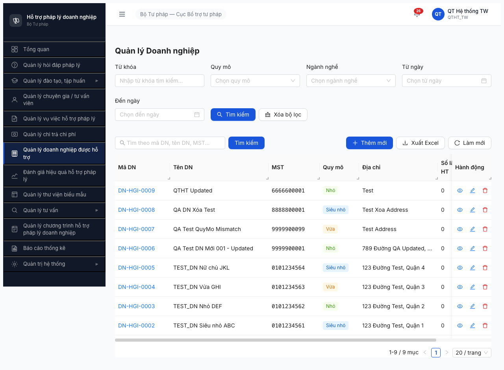
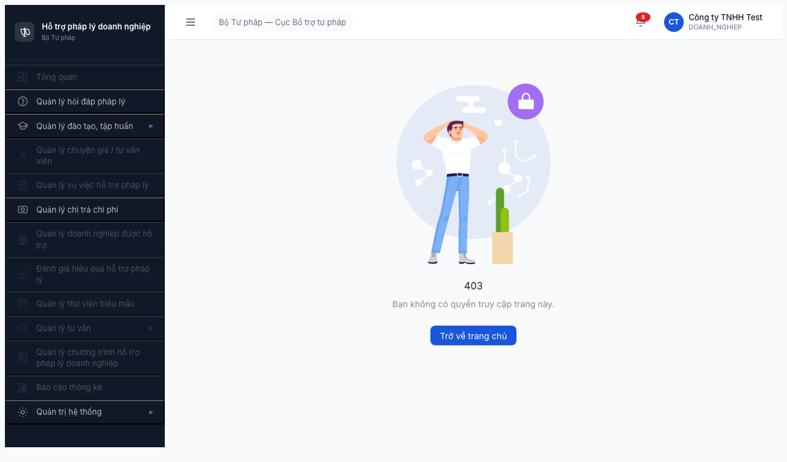

# Bug Report — Ma trận phân quyền Mục 6 (Nhóm Doanh nghiệp)

| Thông tin | Giá trị |
|-----------|---------|
| **Module** | Quản lý Doanh nghiệp (FR-07) |
| **Section** | 6 — Permission Matrix |
| **Environment** | http://103.172.236.130:3000 |
| **Build date** | 2026-04-16 (round 2) |
| **Test date** | 2026-04-19 14:30 |
| **Tester** | QA Automation via Claude Code (Opus 4.7) |
| **Related** | [functional-test-report-section-6.md](functional-test-report-section-6.md) |

---

## BUG-PERM-M6-001 — QTHT có nút Thêm mới/Sửa/Xóa trên DOANH_NGHIEP

| | |
|--|--|
| **ID** | BUG-PERM-M6-001 |
| **Severity** | **Major** |
| **Type** | Authorization — over-permission |
| **Module** | Quản lý Doanh nghiệp |
| **Entity** | DOANH_NGHIEP |
| **Role** | QTHT (qtht_tw) |
| **Expected permission (matrix §6)** | 👁️ **R** — Read-only, không CUD |
| **Actual** | R + **C (Thêm mới)** + **U (Sửa)** + **D (Xóa)** — đầy đủ CRUD UI hiển thị |
| **Ghi chú §9.2 vi phạm** | "QTHT có quyền Read trên hầu hết entity nghiệp vụ — cần test admin xem được nhưng KHÔNG sửa/xóa dữ liệu nghiệp vụ" |

### Steps to reproduce

1. Login `qtht_tw / Test@1234`, OTP `666666`
2. Landing `/dashboard`
3. Click menu sidebar "Quản lý doanh nghiệp được hỗ trợ"
4. URL chuyển `/doanh-nghiep/danh-sach`, list 9 records hiện ra

### Expected

- Header chỉ có: Tìm kiếm, Xóa bộ lọc, **Xuất Excel** (debatable), Làm mới
- Per-row action: CHỈ icon Xem (👁️)
- KHÔNG có nút Thêm mới
- KHÔNG có icon Sửa, Xóa per row

### Actual

- Header có nút **"+ Thêm mới"** (primary button xanh)
- Per-row action có **icon Xem (👁️ blue) + Sửa (✏️ green) + Xóa (🗑️ red)**
- QTHT có thể click → tạo/sửa/xóa master data DN của các đơn vị khác

### Evidence



Screenshot: [screenshots/01-qtht_tw-dn-list.png](screenshots/01-qtht_tw-dn-list.png)

### Impact

- QTHT (admin hệ thống) can modify master data DN của các đơn vị nghiệp vụ → vi phạm separation of duties.
- Rủi ro: admin hệ thống có thể thao túng dữ liệu DN mà không đi qua CB_NV/CB_PD workflow → ảnh hưởng audit trail, compliance.

### Recurrence

Pattern trùng với **BUG-PERM-M5-001** (Section 5 Chi trả — QTHT có nút "Cập nhật TT", "Kiểm tra" trên entity workflow). → Root cause chung: BE/FE không phân biệt **QTHT admin Read-only view** vs **CB_NV/CB_PD write action** ở middleware layer.

### Recommended fix

1. **FE:** Conditional render CRUD buttons dựa vào `role === 'QTHT'` → hide.
2. **BE:** Middleware reject `POST/PUT/DELETE /api/v1/doanh-nghiep/*` khi `user.role === 'QTHT'` (return 403 kèm message `QTHT không có quyền thao tác CRUD trên entity nghiệp vụ`).

---

## BUG-PERM-M6-002 — Data isolation fail: CB_NV_BN/DP + CB_PD_BN/DP thấy data ngoài đơn vị

| | |
|--|--|
| **ID** | BUG-PERM-M6-002 |
| **Severity** | **Critical** |
| **Type** | Authorization — data scope leak (cross-unit) |
| **Module** | Quản lý Doanh nghiệp |
| **Entity** | DOANH_NGHIEP |
| **Roles affected** | canbo_bn, canbo_tinh, lanhdao_bn, lanhdao_dp (4 roles) |
| **BR vi phạm** | BR-AUTH-08 (phân quyền dữ liệu 3 cấp TW/BN/ĐP); DI-04 (BN không thấy BN khác); DI-05 (ĐP không thấy ĐP khác) |

### Steps to reproduce (per role)

**canbo_bn:**
1. Login `canbo_bn / Test@1234`, OTP `666666`
2. Click menu "Quản lý doanh nghiệp được hỗ trợ"
3. Observe: 9 records `DN-HGI-0002..0009` (prefix HGI = Hà Giang, KHÔNG phải Bộ KH&ĐT)

**canbo_tinh:**
1. Login `canbo_tinh / Test@1234`, OTP `666666`
2. Click menu "Quản lý doanh nghiệp được hỗ trợ"
3. Observe: 9 records giống hệt canbo_bn và canbo_tw

**lanhdao_bn / lanhdao_dp:** Tương tự (cùng 9 records).

### Expected (per matrix §6 + §9 ghi chú scoping)

- **canbo_bn** (Bộ KH&ĐT, BN) → CHỈ thấy DN thuộc `don_vi_quan_ly_id = "Bộ KH&ĐT"`
- **canbo_tinh** (Sở TP HN, DP) → CHỈ thấy DN thuộc `don_vi_quan_ly_id = "Sở TP HN"`
- **lanhdao_bn / lanhdao_dp** → Tương tự scope BN / DP
- **canbo_tw / qtht_tw / lanhdao_tw** → Thấy tất cả — OK

**Data isolation FAIL ở mọi kịch bản seed** (phân tích độc lập với `don_vi` thực của 9 records):

| Kịch bản seed | canbo_tw expect | canbo_bn expect | canbo_tinh expect | Actual (all 3) | Verdict |
|---------------|-----------------|-----------------|-------------------|----------------|---------|
| A. 9 DN thuộc TW | 9 | 0 | 0 | 9 / 9 / 9 | ❌ BUG |
| B. 3 DN TW + 3 BN + 3 DP | 9 | 3 | 3 | 9 / 9 / 9 | ❌ BUG |
| C. 9 DN thuộc Bộ KH&ĐT | 9 | 9 | 0 | 9 / 9 / 9 | ❌ BUG (canbo_tinh) |
| D. 9 DN thuộc Sở TP HN | 9 | 0 | 9 | 9 / 9 / 9 | ❌ BUG (canbo_bn) |

→ Không có seed scenario nào khiến 3 role cấp khác nhau (TW/BN/DP) đều thấy cùng 9 records trừ khi BE query **không enforce** `WHERE don_vi_quan_ly_id = user.don_vi_id`.

### Actual

- Tất cả 4 role BN/DP đều thấy **9/9 records** (giống hệt TW) → data scope filtering KHÔNG được enforce ở BE query.

### Evidence

| Role | Screenshot | Records count |
|------|-----------|---------------|
| canbo_tw (baseline TW) | [02-canbo_tw-dn-list.png](screenshots/02-canbo_tw-dn-list.png) | 9 |
| canbo_bn | [03-canbo_bn-dn-list.png](screenshots/03-canbo_bn-dn-list.png) | **9 (leak)** |
| canbo_tinh | [04-canbo_tinh-dn-list.png](screenshots/04-canbo_tinh-dn-list.png) | **9 (leak)** |
| lanhdao_tw (baseline TW) | [05-lanhdao_tw-dn-list.png](screenshots/05-lanhdao_tw-dn-list.png) | 9 |
| lanhdao_bn | [06-lanhdao_bn-dn-list.png](screenshots/06-lanhdao_bn-dn-list.png) | **9 (leak)** |
| lanhdao_dp | [07-lanhdao_dp-dn-list.png](screenshots/07-lanhdao_dp-dn-list.png) | **9 (leak)** |

### Impact

- **Data confidentiality breach:** BN/DP có thể xem thông tin DN của đơn vị khác (tên DN, MST, quy mô, địa chỉ) → vi phạm NĐ55/2019 về bảo mật thông tin DN.
- BN/DP có thể export Excel (nút Xuất Excel vẫn có sẵn) → exfiltrate data.
- Pattern lặp lại 4 Section (3, 4, 5, 6) → BE-level design flaw, cần fix centralized.

### Recurrence

- **BUG-PERM-M3-002** (Section 3 — Chuyên gia/TVV): BN/DP thấy TVV của đơn vị khác.
- **BUG-PERM-M4-002** (Section 4 — Vụ việc HTPL): BN/DP thấy vụ việc của đơn vị khác.
- **BUG-PERM-M5-002** (Section 5 — Chi trả Chi phí): BN/DP thấy hồ sơ chi trả của đơn vị khác.
- **BUG-PERM-M6-002** (Section 6 — Doanh nghiệp): **BN/DP thấy DN của đơn vị khác** ← current bug.

→ Root cause chung: BE không add `WHERE don_vi_id IN (...)` khi role = CB_NV_BN/DP hoặc CB_PD_BN/DP.

### Recommended fix

1. **BE:** Middleware `ScopedByDonVi` áp dụng trước mọi SELECT list API:
   ```
   if (user.role === 'CB_NV_TW' || user.role === 'CB_PD_TW' || user.role === 'QTHT') {
     // no filter
   } else if (user.role.endsWith('_BN') || user.role.endsWith('_DP')) {
     query.where('don_vi_id', '=', user.don_vi_id);
   } else {
     // Portal roles → 403
   }
   ```
2. **Unit test:** Thêm test cases cho mỗi entity × (BN, DP) role verify `don_vi_id` trong response JSON chỉ match của user đó.
3. **QA seed data:** Tạo 3 sets test DN theo 3 đơn vị (HGI/DP, KH&ĐT/BN, BTTP/TW) để verify isolation dễ dàng.

---

## BUG-PERM-M6-003 — UI sidebar hiển thị full CMS menu cho role Portal (DN, NHT)

| | |
|--|--|
| **ID** | BUG-PERM-M6-003 |
| **Severity** | **Minor** (cosmetic UX, không data leak) |
| **Type** | UI — over-exposure of navigation |
| **Module** | Global (ảnh hưởng Layout sidebar) |
| **Roles affected** | dn_user, nht_user (có thể cả tvv_user, chuyengia_user) |

### Steps to reproduce

1. Login `dn_user / Test@1234`, OTP `666666` → landing `/403`
2. Observe sidebar bên trái

### Expected

Role Portal (DN, NHT, TVV, CG) KHÔNG có quyền CMS → sidebar nên:
- Ẩn toàn bộ menu CMS, HOẶC
- Hiển thị sidebar tối thiểu (chỉ notification, user profile, logout)

### Actual

Sidebar hiển thị **ĐẦY ĐỦ** menu CMS cho dn_user và nht_user:
- Tổng quan (disabled/grayed)
- Quản lý hỏi đáp pháp lý
- Quản lý đào tạo, tập huấn ▶
- Quản lý chuyên gia / tư vấn viên (disabled)
- Quản lý vụ việc hỗ trợ pháp lý
- **Quản lý doanh nghiệp được hỗ trợ**
- Quản lý chi trả chi phí
- Đánh giá hiệu quả hỗ trợ pháp lý
- Quản lý thư viện biểu mẫu
- Quản lý tư vấn ▶
- Quản lý chương trình hỗ trợ pháp lý doanh nghiệp
- Báo cáo thống kê
- Quản trị hệ thống ▶

Một số menu hiển thị màu grayed (disabled), nhưng vẫn clickable và dẫn đến `/403`.

### Evidence




### Impact

- Không data leak, nhưng Portal users biết được cấu trúc nội bộ hệ thống CMS — vi phạm principle of least privilege (information exposure).
- UX xấu: DN/NHT thấy menu nhưng click vào bị `/403` → confusing.

### Recommended fix

FE-only: Sidebar component check `role.type === 'PORTAL'` → render minimal sidebar (hoặc redirect portal user sang URL portal riêng ngay khi login).

---

## Tổng kết

| Bug ID | Severity | Cells affected | Priority fix |
|--------|----------|----------------|--------------|
| BUG-PERM-M6-001 | Major | 1 (QTHT) | P1 — Fix trước retest |
| BUG-PERM-M6-002 | Critical | 4 (CB_NV_BN/DP + CB_PD_BN/DP) | **P0** — Fix cùng với BUG-PERM-M3/M4/M5-002 (recurring) |
| BUG-PERM-M6-003 | Minor | 2 (DN, NHT) | P3 — Fix sau, không chặn retest |

**Verdict section 6:** ❌ **FAIL** (5/11 ô FAIL, 2 critical+major bugs).
