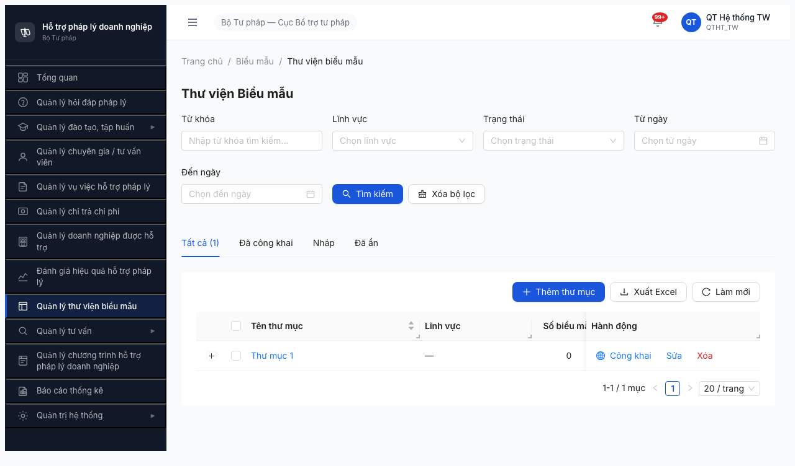
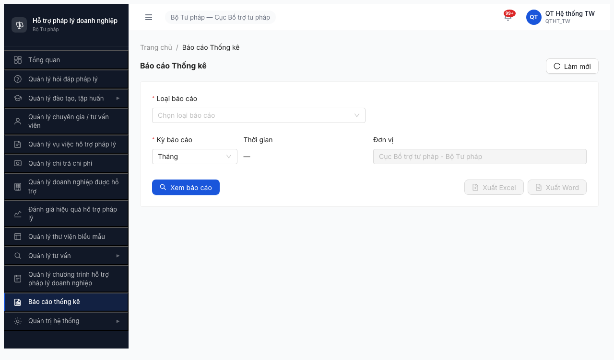
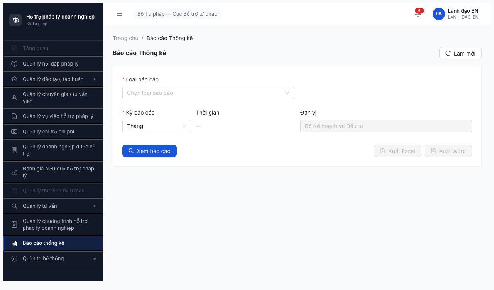
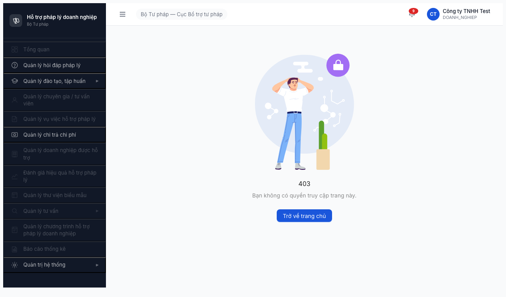
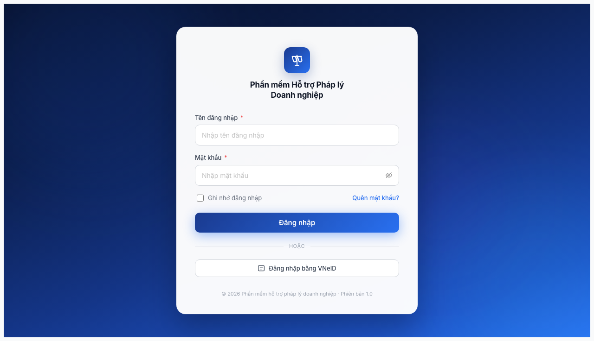
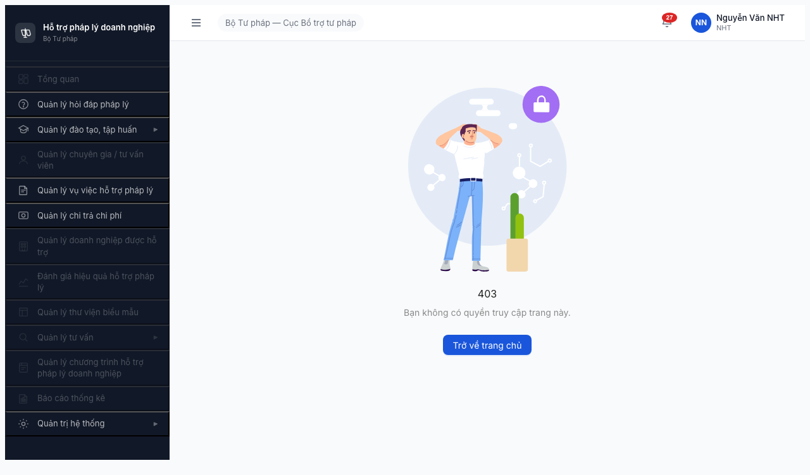
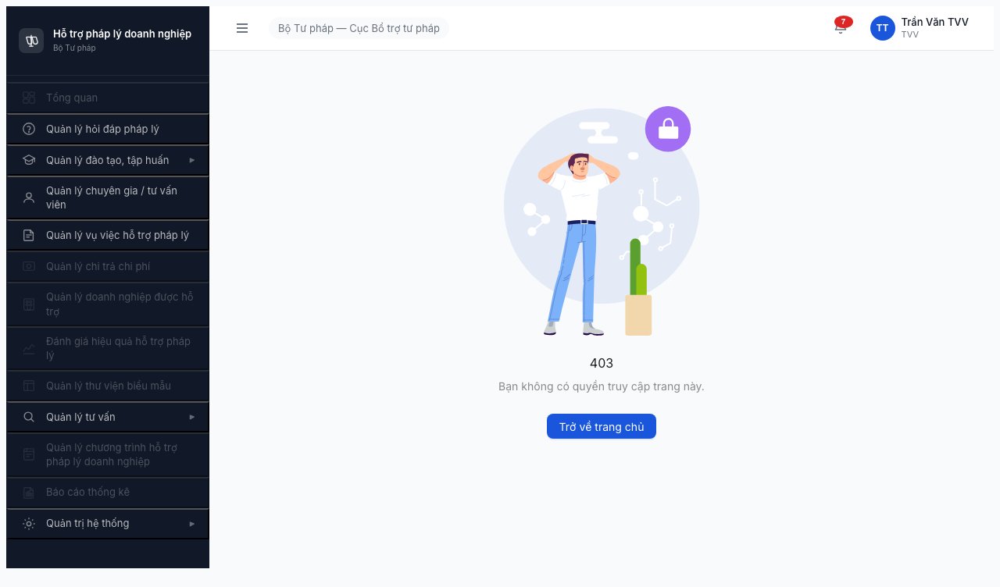

# Bug Report — Ma trận phân quyền Mục 7 (Nhóm Báo cáo & Biểu mẫu)

| Thông tin | Giá trị |
|-----------|---------|
| **Dự án** | PM HTPLDN — Phần mềm Hỗ trợ Pháp lý Doanh nghiệp |
| **Phiên bản** | 1.0 |
| **Môi trường** | http://103.172.236.130:3000/ |
| **Người test** | QA Automation via Claude Code (Opus 4.7) |
| **Ngày** | 14:30 — 16:15 (UTC+7) 2026-04-19 |
| **Loại test** | Permission Matrix (Authorization) — Section 7 |
| **Round** | Round 2 (deploy 2026-04-16) — Đợt 3 chạy 2026-04-19 |
| **Tài liệu tham chiếu** | [functional-test-report-section-7.md](functional-test-report-section-7.md) · [permission-matrix.md §7](../../../permission-matrix.md) · [test-strategy.md](../../../test-strategy.md) · [smoke-test/bieu-mau/bug-report-smoke-test.md](../../smoke-test/bieu-mau/bug-report-smoke-test.md) |

---

## Tổng hợp

Phát hiện **6** lỗi trong quá trình test permission matrix Section 7 (BAO_CAO + BIEU_MAU + THU_MUC_BIEU_MAU).

| Tổng | Critical | Major | Medium | Minor | Trivial |
|------|----------|-------|--------|-------|---------|
| 6    | 3        | 1 (+1 Blocker dup) | 0 | 1 | 0 |

**Lưu ý Blocker:** BUG-PERM-M7-002 là **duplicate** của Blocker đã báo trong smoke-test module Biểu mẫu (đã gửi dev 2026-04-19). Ghi nhận lại trong bối cảnh permission matrix để tracking context, không tính là bug mới.

## Bug Summary Table

| Bug ID | Severity | Priority | Type | Module | TC Ref | Title | Status |
|--------|----------|----------|------|--------|--------|-------|--------|
| BUG-PERM-M7-001 | Major | P1 | Permission | Biểu mẫu (FR-09) | PM7-BM-001, PM7-TM-001 | QTHT có Thêm thư mục / Công khai / Sửa / Xóa trên BIEU_MAU + THU_MUC_BIEU_MAU — vi phạm 👁️ R | Open |
| BUG-PERM-M7-002 | Blocker (dup) | P0 | Permission | Biểu mẫu (FR-09) | PM7-BM-002 → 004, PM7-TM-002 → 004 | BIEU_MAU menu sidebar disabled cho CB_NV_TW/BN/DP — mất quyền CRUD* | Open (dup smoke) |
| BUG-PERM-M7-003 | Critical | P0 | Permission | Biểu mẫu (FR-09) | PM7-BM-005 → 007, PM7-TM-005 → 007 | BIEU_MAU menu sidebar disabled cho CB_PD_TW/BN/DP — mất quyền 👁️ R* | Open |
| BUG-PERM-M7-004 | Critical | P0 | Permission | Biểu mẫu (FR-09) | PM7-BM-008, PM7-TM-008 | BIEU_MAU menu disabled cho DN — mất quyền 👁️ R (hoặc matrix cần chỉnh 🔌 R†) | Open |
| BUG-PERM-M7-005 | Critical | P0 | Permission | Biểu mẫu (FR-09) | PM7-BM-009, PM7-TM-009 | BIEU_MAU menu disabled cho NHT, click → /403 — mất quyền 👁️ R | Open |
| BUG-PERM-M7-006 | Minor | P2 | UI/UX | Global Layout (AppShell) | — (observational) | Portal roles (DN, NHT) thấy full CMS sidebar với menu grayed — info disclosure nhẹ | Open |

> **Chú thích Type:**
> - `Permission` — phân quyền (role × action × data scope)
> - `UI/UX` — giao diện, hiển thị, tương tác

> **Chú thích Severity:**
> - `Blocker (dup)` — Blocker đã được báo trong smoke, re-surface trong permission test
> - `Critical` — hệ thống/tính năng chính không dùng được, sai nghiệp vụ nghiêm trọng (mất quyền Read của 5 role)
> - `Major` — tính năng quan trọng lỗi (QTHT over-permission)
> - `Minor` — lỗi nhỏ, không ảnh hưởng nghiệp vụ (sidebar full menu grayed)

> **Chú thích Priority:**
> - `P0` — phải fix ngay (block release) — áp dụng cho tất cả bug under-permission (Blocker + 3 Critical)
> - `P1` — fix trong sprint hiện tại (Major QTHT over-permission)
> - `P2` — fix trong 2-3 sprint tới (Minor UX)

---

## BUG-PERM-M7-001 — QTHT có đầy đủ Thêm thư mục / Công khai / Sửa / Xóa trên BIEU_MAU + THU_MUC_BIEU_MAU

| Trường | Chi tiết |
|--------|----------|
| **Bug ID** | BUG-PERM-M7-001 |
| **Severity** | Major |
| **Priority** | P1 |
| **Type** | Permission — over-permission |
| **Status** | Open |
| **Module** | Thư viện Biểu mẫu (FR-09) |
| **Thành phần** | `src/pages/bieu-mau/thu-muc/index.tsx` (suspected FE table + header buttons) + `src/components/*/FormActions.tsx` |
| **URL** | http://103.172.236.130:3000/bieu-mau/thu-muc |
| **Trình duyệt** | Chromium 146 (headless, Playwright), 1280×720 |
| **Tài khoản** | qtht_tw (QTHT, TW) |
| **TC Reference** | PM7-BM-001, PM7-TM-001 |
| **SRS Reference** | §3.4.2 matrix §7 row BIEU_MAU + THU_MUC_BIEU_MAU × QTHT = 👁️ R; BR-AUTH-09; §9.2 "QTHT Read-only trên entity nghiệp vụ" |
| **Assignee** | FE Team (ẩn UI) + BE Team (middleware reject CUD) |
| **Found by** | QA Automation via Claude Code |

### Mô tả

QTHT (role Read-only trên entity nghiệp vụ theo §9.2) login vào `/bieu-mau/thu-muc` thấy đầy đủ UI thao tác CRUD + workflow: nút `+ Thêm thư mục` (primary) ở header, và cột "Hành động" per-row có link `Công khai` + `Sửa` + `Xóa`. QTHT có thể thao tác tạo/sửa/xóa/công khai thư mục biểu mẫu của các đơn vị nghiệp vụ khác.

### Các bước tái hiện

1. Truy cập `http://103.172.236.130:3000/login`
2. Đăng nhập `qtht_tw` / `Test@1234`, nhập OTP `666666`
3. Landing `/dashboard`
4. Click menu sidebar "Quản lý thư viện biểu mẫu"
5. URL chuyển `/bieu-mau` → redirect `/bieu-mau/thu-muc`, hiển thị 1 row `Thư mục 1`
6. Quan sát: header có nút `+ Thêm thư mục`; per-row có link `Công khai` + `Sửa` + `Xóa`

### Kết quả mong đợi

- Header chỉ có: Tìm kiếm, Xóa bộ lọc, Làm mới (Xuất Excel debatable cho R-role)
- Per-row action cột "Hành động": CHỈ icon Xem (👁️) read-only
- KHÔNG có button `+ Thêm thư mục`
- KHÔNG có link/icon `Công khai`, `Sửa`, `Xóa`
- Nếu QTHT cố gọi API `POST /api/v1/thu-muc-bieu-mau` → BE trả 403 "QTHT không có quyền thao tác CRUD trên entity nghiệp vụ"

### Kết quả thực tế

- Header có button **`+ Thêm thư mục`** (primary button xanh)
- Per-row action có **link `Công khai` + `Sửa` + `Xóa`** đầy đủ
- QTHT có thể click → thực thi workflow `Công khai` publish biểu mẫu lên Cổng PLQG mà không đi qua workflow CB_NV → CB_PD

### Bằng chứng

- Ảnh chụp QTHT thấy full CUD UI:



- So sánh với BAO_CAO (nơi QTHT chỉ có Read/Xuất):



### Tác động (Impact)

- **Scope:** 1 role (QTHT) × 2 entity (BIEU_MAU + THU_MUC_BIEU_MAU) → 2 ô quyền FAIL.
- **Nghiêm trọng:** QTHT (admin hệ thống) có thể thao tác master data biểu mẫu + **publish biểu mẫu lên Cổng PLQG** — vi phạm separation of duties BR-AUTH-09, sai workflow BR-FLOW-07 (workflow Công khai biểu mẫu cần đi qua CB_NV đệ trình).
- **Compliance risk:** Biểu mẫu công khai lên Cổng PLQG có audit trail — QTHT tự publish không đi qua CB_NV workflow sẽ break audit chain, ảnh hưởng compliance NĐ55/2019.

### So sánh (Comparison) — permission matrix §7 vs actual

| Role | Matrix BIEU_MAU | Actual UI trên /bieu-mau/thu-muc | Match? |
|------|-----------------|----------------------------------|--------|
| QTHT (qtht_tw) | 👁️ R | R + Thêm thư mục + Công khai + Sửa + Xóa | ❌ (BUG!) |
| CB_NV_TW (canbo_tw) | ✅ CRUD* | Menu disabled, không truy cập được | ❌ BUG-M7-002 |
| CB_PD_TW (lanhdao_tw) | 👁️ R* | Menu disabled | ❌ BUG-M7-003 |

### Nguyên nhân nghi ngờ (Root Cause)

FE table component `pages/bieu-mau/thu-muc/index.tsx` render header + action column không check `user.role === 'QTHT'` để ẩn CUD buttons. Có thể CASL ability hoặc custom hook `useCan('create', 'ThuMucBieuMau')` thiếu rule loại trừ QTHT. BE controller `/thu-muc-bieu-mau` + `/bieu-mau` có thể không reject request từ QTHT ở middleware → FE dựa vào BE mà BE không gate.

Pattern lặp với:
- **BUG-PERM-M5-001** (Chi trả): QTHT có "Cập nhật TT" / "Kiểm tra" trên HO_SO_CHI_TRA
- **BUG-PERM-M6-001** (Doanh nghiệp): QTHT có Thêm mới / Sửa / Xóa trên DOANH_NGHIEP

→ Root cause chung 3 bug: **FE+BE thiếu middleware phân biệt QTHT admin Read-only vs CB_NV/CB_PD write action** ở ability layer.

### Gợi ý sửa (Suggested Fix)

**FE:**

```diff
- const canCreateFolder = true;
- const canEditFolder = true;
- const canPublishFolder = true;
+ const canCreateFolder = ability.can('create', 'ThuMucBieuMau');
+ const canEditFolder = ability.can('update', 'ThuMucBieuMau');
+ const canPublishFolder = ability.can('publish', 'ThuMucBieuMau');
```

Trong `abilities.ts`:
```ts
if (user.role !== 'QTHT') {
  can('create', 'ThuMucBieuMau');
  can('update', 'ThuMucBieuMau', { don_vi_id: user.don_vi_id });
  can('delete', 'ThuMucBieuMau', { don_vi_id: user.don_vi_id });
  can('publish', 'ThuMucBieuMau', { don_vi_id: user.don_vi_id });
}
```

**BE (NestJS):**

1. Thêm role guard `@Roles(...NON_QTHT_ROLES)` trên controller POST/PUT/DELETE.
2. Hoặc middleware reject:
   ```ts
   if (req.user.role === 'QTHT' && ['POST', 'PUT', 'PATCH', 'DELETE'].includes(req.method)) {
     throw new ForbiddenException('QTHT không có quyền thao tác CRUD/Công khai trên entity nghiệp vụ');
   }
   ```

**Apply tương tự cho** `BIEU_MAU` (tạo biểu mẫu con trong thư mục) + action `Công khai`.

---

## BUG-PERM-M7-002 — BIEU_MAU menu sidebar disabled cho CB_NV_TW/BN/DP (DUPLICATE smoke)

| Trường | Chi tiết |
|--------|----------|
| **Bug ID** | BUG-PERM-M7-002 |
| **Severity** | Blocker (duplicate smoke bug đã gửi 2026-04-19) |
| **Priority** | P0 |
| **Type** | Permission — under-permission (mất quyền CRUD* hoàn toàn) |
| **Status** | Open (dup — chờ FE fix chung) |
| **Module** | Thư viện Biểu mẫu (FR-09) |
| **Thành phần** | Suspected: `src/components/AppShell/nav-structure.ts` + `src/utils/auth-rules.ts` (xem smoke bug-report) |
| **URL** | http://103.172.236.130:3000/403 (stuck landing) |
| **Trình duyệt** | Chromium 146 (headless) |
| **Tài khoản** | canbo_tw (CB_NV, TW), canbo_bn (CB_NV, BN), canbo_tinh (CB_NV, DP) |
| **TC Reference** | PM7-BM-002, PM7-BM-003, PM7-BM-004, PM7-TM-002, PM7-TM-003, PM7-TM-004 |
| **SRS Reference** | §3.4.2 matrix §7 row BIEU_MAU × CB_NV_TW/BN/DP = ✅ CRUD*; BR-AUTH-08 |
| **Assignee** | FE Team |
| **Found by** | QA Automation (re-confirm smoke bug trong context permission matrix) |
| **Duplicate of** | [BUG-FE-M9-002 / smoke-test/bieu-mau/bug-report-smoke-test.md](../../smoke-test/bieu-mau/bug-report-smoke-test.md) |

### Mô tả

3 role CB_NV_TW/BN/DP (matrix cấp ✅ CRUD* scoped đơn vị) đăng nhập thấy menu sidebar `Quản lý thư viện biểu mẫu` bị disable (class `nav-item active disabled`). Click menu không fire navigation, URL không đổi, không có API request `/api/v1/bieu-mau*` nào được gửi đi.

### Các bước tái hiện

1. Login `canbo_tw` / `Test@1234`, OTP `666666` (lặp tương tự với `canbo_bn`, `canbo_tinh`)
2. Landing `/403` (expected — CB_NV không có dashboard default, pattern known)
3. Sidebar render menu `Quản lý thư viện biểu mẫu` với CSS class `nav-item active disabled`
4. Click menu → quan sát URL → không đổi
5. `$B network` → không có request mới tới `/api/v1/bieu-mau*`

### Kết quả mong đợi

- Menu enabled → click → nav `/bieu-mau/thu-muc`
- Page list biểu mẫu + thư mục scoped theo đơn vị: CB_NV_TW thấy toàn quốc; CB_NV_BN chỉ đơn vị BN; CB_NV_DP chỉ đơn vị DP (BR-AUTH-08)
- Có đủ button CRUD cho thư mục + biểu mẫu (+ Thêm, Sửa, Xóa, Công khai)

### Kết quả thực tế

- Menu disabled toàn bộ 3 role CB_NV_*
- Không truy cập được trang Biểu mẫu bằng bất kỳ cách nào (click sidebar + direct URL goto đều bị gate)
- Bug lặp lại y hệt smoke test 2026-04-19

### Bằng chứng

- canbo_tw click menu BIEU_MAU → URL vẫn `/bao-cao` (từ step trước):


- canbo_bn:


- canbo_tinh:


### Tác động (Impact)

- **Scope:** 3 role CB_NV_* × 2 entity = 6 ô quyền FAIL.
- **Block toàn bộ functional test module Biểu mẫu** cho 3 role chính sẽ sử dụng (CB_NV là creator của biểu mẫu theo SRS FR-09).
- **Business impact:** Module Biểu mẫu không thể sử dụng trong thực tế cho đến khi fix.

### So sánh (Comparison)

| Role | Menu state | Click result | Expected |
|------|-----------|--------------|----------|
| QTHT_TW | enabled | nav OK | OK |
| CB_NV_TW (canbo_tw) | disabled | URL không đổi | Should enable |
| CB_NV_BN (canbo_bn) | disabled | URL không đổi | Should enable |
| CB_NV_DP (canbo_tinh) | disabled | URL không đổi | Should enable |

### Nguyên nhân nghi ngờ (Root Cause)

Từ smoke retest 2026-04-19, 3 suspect layer:
1. `src/utils/auth-rules.ts` — rule definition cho module BIEU_MAU chỉ whitelist `QTHT`, bỏ sót `CB_NV_TW/BN/DP`.
2. `src/components/AppShell/nav-structure.ts` — field `requiredCap`/`requiredRole` menu Biểu mẫu chỉ chấp nhận `QTHT`.
3. BE `POST /api/v1/auth/verify-otp` response không gán cap `BIEU_MAU.read/write` cho role CB_NV_*.

### Gợi ý sửa (Suggested Fix)

Xem smoke bug-report. Fix chung 1 file whitelist:

```diff
// auth-rules.ts hoặc abilities.ts
- if (user.role === 'QTHT') can('read', 'BieuMau');
+ if (['QTHT', 'CB_NV_TW', 'CB_NV_BN', 'CB_NV_DP'].includes(user.role)) {
+   can('read', 'BieuMau');
+ }
+ if (['CB_NV_TW', 'CB_NV_BN', 'CB_NV_DP'].includes(user.role)) {
+   can(['create', 'update', 'delete', 'publish'], 'BieuMau', { don_vi_id: user.don_vi_id });
+ }
```

---

## BUG-PERM-M7-003 — BIEU_MAU menu sidebar disabled cho CB_PD_TW/BN/DP

| Trường | Chi tiết |
|--------|----------|
| **Bug ID** | BUG-PERM-M7-003 |
| **Severity** | Critical |
| **Priority** | P0 |
| **Type** | Permission — under-permission (mất quyền Read) |
| **Status** | Open |
| **Module** | Thư viện Biểu mẫu (FR-09) |
| **Thành phần** | Same as M7-002 (FE ability-rule / nav-structure) |
| **URL** | http://103.172.236.130:3000/403 |
| **Trình duyệt** | Chromium 146 (headless) |
| **Tài khoản** | lanhdao_tw, lanhdao_bn, lanhdao_dp (CB_PD 3 cấp) |
| **TC Reference** | PM7-BM-005, PM7-BM-006, PM7-BM-007, PM7-TM-005, PM7-TM-006, PM7-TM-007 |
| **SRS Reference** | §3.4.2 matrix §7 row BIEU_MAU × CB_PD_* = 👁️ R*; §9.3 "CB_PD Update = Phê duyệt" |
| **Assignee** | FE Team |
| **Found by** | QA Automation |

### Mô tả

3 role CB_PD_TW/BN/DP (matrix cấp 👁️ R* scoped đơn vị) đăng nhập thấy menu `Quản lý thư viện biểu mẫu` disabled giống CB_NV_* → mất hoàn toàn quyền Read biểu mẫu, không thẩm định được workflow `Công khai` do CB_NV đệ trình.

### Các bước tái hiện

1. Login `lanhdao_tw` / `Test@1234`, OTP `666666` (lặp với `lanhdao_bn`, `lanhdao_dp`)
2. Landing `/403`
3. Sidebar "Quản lý thư viện biểu mẫu" bị class `disabled`
4. Click menu → URL không đổi

### Kết quả mong đợi

- Menu enabled → click → nav `/bieu-mau/thu-muc` **read-only mode**
- List biểu mẫu scoped theo đơn vị của role (TW thấy toàn quốc, BN/DP chỉ thấy đơn vị mình)
- **KHÔNG có button CRUD/Công khai** (R-level only)
- CB_PD vẫn có thể duyệt workflow `Công khai` qua notification/workflow center nếu có (§9.3)

### Kết quả thực tế

- Menu disabled, giống CB_NV_* → mất quyền Read hoàn toàn
- CB_PD không thể xem biểu mẫu có sẵn để đánh giá/thẩm định

### Bằng chứng

- lanhdao_tw:


- lanhdao_bn:



- lanhdao_dp:


### Tác động (Impact)

- **Scope:** 3 role CB_PD × 2 entity = 6 ô quyền FAIL.
- CB_PD là role **phê duyệt** biểu mẫu (nếu workflow có approval step) hoặc giám sát biểu mẫu do CB_NV tạo. Mất quyền Read = không thực hiện được vai trò phê duyệt.

### So sánh (Comparison)

| Role | Matrix | Actual | Match? |
|------|--------|--------|--------|
| CB_PD_TW | 👁️ R* | menu disabled | ❌ |
| CB_PD_BN | 👁️ R* | menu disabled | ❌ |
| CB_PD_DP | 👁️ R* | menu disabled | ❌ |

### Nguyên nhân nghi ngờ (Root Cause)

Cùng root cause với BUG-PERM-M7-002: FE ability-rule whitelist thiếu CB_PD_*.

### Gợi ý sửa (Suggested Fix)

Mở rộng whitelist trong abilities.ts:

```diff
- if (['QTHT', 'CB_NV_TW', 'CB_NV_BN', 'CB_NV_DP'].includes(user.role)) {
+ if (['QTHT', 'CB_NV_TW', 'CB_NV_BN', 'CB_NV_DP', 'CB_PD_TW', 'CB_PD_BN', 'CB_PD_DP'].includes(user.role)) {
    can('read', 'BieuMau');
  }
```

Ẩn button CUD cho R-level roles ở FE dựa vào cap check.

---

## BUG-PERM-M7-004 — BIEU_MAU menu disabled cho DN

| Trường | Chi tiết |
|--------|----------|
| **Bug ID** | BUG-PERM-M7-004 |
| **Severity** | Critical (hoặc Spec Clarification) |
| **Priority** | P0 |
| **Type** | Permission — under-permission (mất quyền Read) |
| **Status** | Open — OR Spec Needs Review |
| **Module** | Thư viện Biểu mẫu (FR-09) |
| **Thành phần** | FE ability-rule + Product/Spec review cần thiết |
| **URL** | http://103.172.236.130:3000/403 landing; direct goto `/bieu-mau/thu-muc` redirect `/login` (session drop) |
| **Trình duyệt** | Chromium 146 (headless) |
| **Tài khoản** | dn_user (DN, Portal) — Công ty TNHH Test |
| **TC Reference** | PM7-BM-008, PM7-TM-008 |
| **SRS Reference** | §3.4.2 matrix §7 row BIEU_MAU × DN = 👁️ R; DI-09 "DN không truy cập CMS UI" (test-strategy §5.2) |
| **Assignee** | FE Team + Product (spec clarification) |
| **Found by** | QA Automation |

### Mô tả

DN role (matrix cấp 👁️ R toàn bộ) đăng nhập thấy menu `Quản lý thư viện biểu mẫu` grayed/disabled, direct goto `/bieu-mau/thu-muc` → redirect `/login` (auth cookie drop). Không truy cập được biểu mẫu qua CMS.

**Có thể là spec issue:** DI-09 nói "DN không truy cập CMS UI" (DN chỉ qua API), nhưng matrix §7 vẫn ghi "👁️ R" cho DN thay vì "🔌 R†". Hai điều kiện mâu thuẫn.

### Các bước tái hiện

1. Login `dn_user` / `Test@1234`, OTP `666666`
2. Landing `/403`
3. Sidebar render "Quản lý thư viện biểu mẫu" với class disabled/grayed
4. (Test direct) `$B goto /bieu-mau/thu-muc` → redirect `/login` (session dropped, chain navigate issue)

### Kết quả mong đợi

**Option A (FE enable cho DN):**
- Menu enabled → DN xem được list biểu mẫu công khai
- Hoặc separate DN portal page cho biểu mẫu

**Option B (Spec update):**
- Matrix §7 sửa "👁️ R" → "🔌 R†" cho DN (đồng nhất với DN × HOI_DAP = 🔌 C†)
- Bug này trở thành spec correction, không phải code bug

### Kết quả thực tế

- Menu CMS disabled cho DN → nếu user yêu cầu test CMS (không qua API) thì DN mất quyền Read hoàn toàn

### Bằng chứng




### Tác động (Impact)

- **Scope:** 1 role DN × 2 entity = 2 ô quyền FAIL.
- Nếu intent spec là DN xem biểu mẫu trên CMS → DN không tra cứu được biểu mẫu, ảnh hưởng self-service.
- Nếu intent là qua API → matrix cần update để tránh confuse QA/dev.

### So sánh (Comparison)

| DN truy cập | Matrix | Actual | Match? |
|-------------|--------|--------|--------|
| BIEU_MAU qua CMS | 👁️ R | disabled | ❌ |
| BIEU_MAU qua API | Không ghi | Chưa test | — |

### Nguyên nhân nghi ngờ (Root Cause)

Option A: FE whitelist thiếu DN.
Option B: Matrix §7 sai — nên ghi 🔌 R† thay vì 👁️ R.

### Gợi ý sửa (Suggested Fix)

1. **Product review** matrix §7 dòng BIEU_MAU + THU_MUC_BIEU_MAU × DN — xác định intent.
2. **Nếu Option A:** FE whitelist DN cho cap `BIEU_MAU.read` read-only (chỉ biểu mẫu `la_cong_khai=1`).
3. **Nếu Option B:** Cập nhật file `permission-matrix.md` §7 — sửa "👁️ R" thành "🔌 R†" cho DN, + ghi chú giải thích trong §9 "DN qua API".

---

## BUG-PERM-M7-005 — BIEU_MAU menu disabled cho NHT

| Trường | Chi tiết |
|--------|----------|
| **Bug ID** | BUG-PERM-M7-005 |
| **Severity** | Critical |
| **Priority** | P0 |
| **Type** | Permission — under-permission (mất quyền Read) |
| **Status** | Open |
| **Module** | Thư viện Biểu mẫu (FR-09) |
| **Thành phần** | FE ability-rule (same as M7-002/003) |
| **URL** | http://103.172.236.130:3000/403 |
| **Trình duyệt** | Chromium 146 (headless) |
| **Tài khoản** | nht_user (NHT, Portal) — Nguyễn Văn NHT |
| **TC Reference** | PM7-BM-009, PM7-TM-009 |
| **SRS Reference** | §3.4.2 matrix §7 row BIEU_MAU × NHT = 👁️ R; BR-AUTH-10 (Filter NHT) |
| **Assignee** | FE Team |
| **Found by** | QA Automation |

### Mô tả

NHT role (matrix: 👁️ R) đăng nhập thấy menu grayed, click menu → navigate `/403`. NHT là người hỗ trợ DN/TVV cần xem biểu mẫu để định hướng — nhưng mất quyền Read hoàn toàn.

### Các bước tái hiện

1. Login `nht_user` / `Test@1234`, OTP `666666`
2. Landing `/403`
3. Sidebar "Quản lý thư viện biểu mẫu" grayed
4. Click menu → URL chuyển `/403`

### Kết quả mong đợi

- Menu enabled → click → nav `/bieu-mau/thu-muc` read-only mode
- NHT xem được toàn bộ biểu mẫu đã công khai để hỗ trợ DN/TVV

### Kết quả thực tế

- Menu disabled, route `/bieu-mau/thu-muc` trả `/403` → mất quyền Read hoàn toàn

### Bằng chứng




### Tác động (Impact)

- **Scope:** 1 role NHT × 2 entity = 2 ô quyền FAIL.
- NHT không có thông tin biểu mẫu → không thực hiện đầy đủ vai trò hỗ trợ pháp lý theo SRS BR-AUTH-10.

### So sánh (Comparison)

| Role Portal | Matrix BIEU_MAU | Actual | Match? |
|-------------|-----------------|--------|--------|
| DN | 👁️ R | menu disabled | ❌ (M7-004) |
| NHT | 👁️ R | menu disabled, /403 | ❌ (M7-005) |
| TVV | ❌ | /403 | ✅ |
| CG | ❌ | /403 | ✅ |

### Nguyên nhân nghi ngờ (Root Cause)

Cùng root cause với BUG-PERM-M7-002/003: FE ability-rule whitelist thiếu NHT cho cap `BIEU_MAU.read`.

### Gợi ý sửa (Suggested Fix)

```diff
if (['QTHT', 'CB_NV_TW', 'CB_NV_BN', 'CB_NV_DP',
-    'CB_PD_TW', 'CB_PD_BN', 'CB_PD_DP']
+    'CB_PD_TW', 'CB_PD_BN', 'CB_PD_DP',
+    'NHT']
  .includes(user.role)) {
  can('read', 'BieuMau');
}
```

---

## BUG-PERM-M7-006 — Portal sidebar render full CMS menu grayed cho DN + NHT

| Trường | Chi tiết |
|--------|----------|
| **Bug ID** | BUG-PERM-M7-006 |
| **Severity** | Minor |
| **Priority** | P2 |
| **Type** | UI/UX — information disclosure nhẹ |
| **Status** | Open |
| **Module** | Global Layout (AppShell) |
| **Thành phần** | `src/components/AppShell/nav-structure.ts` + `src/components/AppShell/Sidebar.tsx` |
| **URL** | http://103.172.236.130:3000/403 (mọi trang Portal) |
| **Trình duyệt** | Chromium 146 (headless) |
| **Tài khoản** | dn_user, nht_user (+ pattern tương tự trên tvv_user + chuyengia_user nhưng ít menu hơn) |
| **TC Reference** | — (observational, global layout) |
| **SRS Reference** | DI-09 + UX best-practice |
| **Assignee** | FE Team (+ Design) |
| **Found by** | QA Automation |
| **Duplicate pattern** | BUG-PERM-M6-003 (Section 6 — DN có sidebar full CMS) |

### Mô tả

DN, NHT login thấy full 12 menu CMS trong sidebar (Tổng quan, Hỏi đáp PL, Đào tạo, Chuyên gia/TVV, Vụ việc, Chi trả, DN, Đánh giá, Biểu mẫu, Tư vấn, CT HTPLDN, Báo cáo thống kê, Quản trị hệ thống). Các menu không có quyền → class `disabled` (grayed) thay vì ẩn hoàn toàn.

### Các bước tái hiện

1. Login `dn_user` hoặc `nht_user`
2. Landing `/403` với sidebar đầy đủ menu CMS
3. Quan sát: ~10/12 menu grayed, 2-3 menu enabled

### Kết quả mong đợi

- Portal role (DN, NHT, TVV, CG) chỉ thấy các menu họ có quyền truy cập
- Menu không có quyền → **ẨN khỏi sidebar** thay vì render grayed
- Tách AppShell Portal vs AppShell CMS (design consideration)

### Kết quả thực tế

- Sidebar render đầy đủ 12 menu CMS cho DN/NHT
- 10/12 menu grayed, 2-3 menu enabled

### Bằng chứng




### Tác động (Impact)

- **UX confuse:** user thấy 12 menu grayed → không rõ có quyền hay không, click thử → bối rối, tăng support ticket.
- **Information disclosure nhẹ:** Portal user biết hệ thống có module admin "Quản trị hệ thống", "Chi trả", "Doanh nghiệp" — gợi ý potential phishing/social engineering (risk thấp).
- **Brand consistency:** Portal user xứng đáng có UX dedicated, không share sidebar CMS.

### So sánh (Comparison)

| Role | Số menu visible | Số menu enabled | UX score |
|------|-----------------|-----------------|----------|
| QTHT_TW | 12 | ~12 | Tốt |
| CB_NV_TW | 12 | ~10 (Biểu mẫu disabled là bug M7-002) | Trung bình |
| DN | 12 | 2-3 | Kém — BUG-M7-006 |
| NHT | 12 | 2-3 | Kém — BUG-M7-006 |
| TVV | 12 | 3-4 | Kém |
| CG | 12 | 2-3 | Kém |

### Nguyên nhân nghi ngờ (Root Cause)

`src/components/AppShell/nav-structure.ts` render all items + apply class `disabled` dựa vào capability check, thay vì filter items trước khi render:

```ts
// Current (suspected):
return allMenuItems.map(item => (
  <MenuItem
    {...item}
    className={cn({ 'disabled': !userCaps.includes(item.requiredCap) })}
  />
));

// Should be:
const visibleItems = allMenuItems.filter(item =>
  userCaps.includes(item.requiredCap)
);
return visibleItems.map(item => <MenuItem {...item} />);
```

### Gợi ý sửa (Suggested Fix)

1. **FE nav-structure.ts:** Filter items theo capability trước khi render.
2. **Alternative (nhẹ nhàng hơn):** CSS `display: none` cho items không có quyền của role Portal.
3. **Design consideration:** Tách AppShell CMS vs AppShell Portal — Portal có layout riêng không share sidebar admin.

---

## Phụ lục

### A — Môi trường test

| Thành phần | Giá trị |
|------------|---------|
| URL ứng dụng | http://103.172.236.130:3000/ |
| OTP login | `666666` (bypass tạm thời) |
| MailHog (OTP inbox) | http://103.172.236.130:8025 — giữ lại fallback |
| API base (observed, not tested) | http://103.172.236.130:3000/api/v1/* |
| Frontend | React + Vite + Ant Design + CASL (suspected) + custom CSS module |
| Xác thực | JWT + OTP email (2-step) |
| Backend (suspected) | NestJS + PostgreSQL |
| Browser | Chromium 146 headless shell (Playwright) 1280×720 |
| Build date | 2026-04-16 (round 2) |
| Đường dẫn source | (không có access — test hộp đen UI) |

### B — Tài khoản sử dụng

| Tên đăng nhập | Vai trò | Đơn vị | Cấp | Dùng cho bug nào |
|---------------|---------|--------|-----|------------------|
| qtht_tw | QTHT | Cục BTTP | TW | BUG-PERM-M7-001 |
| canbo_tw | CB_NV | Cục BTTP | TW | BUG-PERM-M7-002 |
| canbo_bn | CB_NV | Bộ KH&ĐT | BN | BUG-PERM-M7-002 |
| canbo_tinh | CB_NV | Sở TP HN | DP | BUG-PERM-M7-002 |
| lanhdao_tw | CB_PD | Cục BTTP | TW | BUG-PERM-M7-003 |
| lanhdao_bn | CB_PD | Bộ KH&ĐT | BN | BUG-PERM-M7-003 |
| lanhdao_dp | CB_PD | Sở TP HN | DP | BUG-PERM-M7-003 |
| dn_user | DN | Công ty TNHH Test | Portal | BUG-PERM-M7-004, BUG-PERM-M7-006 |
| nht_user | NHT | — | Portal | BUG-PERM-M7-005, BUG-PERM-M7-006 |
| tvv_user | TVV | — | Portal | (PASS — ref comparison cho M7-003/004/005) |
| chuyengia_user | CG | — | Portal | (PASS — ref comparison) |

### C — Danh mục ảnh chụp

| File | Mô tả | Dùng cho bug |
|------|-------|--------------|
| [00-login-page.png](screenshots/00-login-page.png) | Trang login trước khi nhập | Session pre-check |
| [01-qtht_tw-dashboard.png](screenshots/01-qtht_tw-dashboard.png) | qtht_tw landing /dashboard | M7-001 step 1 |
| [02-qtht_tw-baocao.png](screenshots/02-qtht_tw-baocao.png) | QTHT xem BAO_CAO (read-only — expected) | M7-001 comparison |
| [03-qtht_tw-bieumau.png](screenshots/03-qtht_tw-bieumau.png) | **QTHT xem BIEU_MAU với full CUD UI** | **M7-001 evidence chính** |
| [10-canbo_tw-landing.png](screenshots/10-canbo_tw-landing.png) | canbo_tw landing /403 | M7-002 |
| [11-canbo_tw-baocao.png](screenshots/11-canbo_tw-baocao.png) | canbo_tw BAO_CAO (UI giống QTHT — CRU* chưa testable) | (PARTIAL note) |
| [12-canbo_tw-bieumau.png](screenshots/12-canbo_tw-bieumau.png) | canbo_tw click BIEU_MAU → URL không đổi | **M7-002 evidence** |
| [13-canbo_bn-landing.png](screenshots/13-canbo_bn-landing.png) | canbo_bn landing | M7-002 |
| [14-canbo_bn-baocao.png](screenshots/14-canbo_bn-baocao.png) | canbo_bn BAO_CAO — Đơn vị scope Bộ KH&ĐT (PASS) | Data scope evidence |
| [15-canbo_bn-bieumau.png](screenshots/15-canbo_bn-bieumau.png) | canbo_bn click BIEU_MAU disabled | **M7-002 evidence** |
| [16-canbo_tinh-landing.png](screenshots/16-canbo_tinh-landing.png) | canbo_tinh landing | M7-002 |
| [17-canbo_tinh-baocao.png](screenshots/17-canbo_tinh-baocao.png) | canbo_tinh BAO_CAO — Đơn vị Sở TP HN (PASS) | Data scope evidence |
| [18-canbo_tinh-bieumau.png](screenshots/18-canbo_tinh-bieumau.png) | canbo_tinh click BIEU_MAU disabled | **M7-002 evidence** |
| [20-lanhdao_tw-landing.png](screenshots/20-lanhdao_tw-landing.png) | lanhdao_tw landing | M7-003 |
| [21-lanhdao_tw-baocao.png](screenshots/21-lanhdao_tw-baocao.png) | lanhdao_tw BAO_CAO — Cục BTTP (PASS) | Scope OK |
| [22-lanhdao_tw-bieumau.png](screenshots/22-lanhdao_tw-bieumau.png) | lanhdao_tw BIEU_MAU disabled | **M7-003 evidence** |
| [23-lanhdao_bn-landing.png](screenshots/23-lanhdao_bn-landing.png) | lanhdao_bn landing | M7-003 |
| [24-lanhdao_bn-baocao.png](screenshots/24-lanhdao_bn-baocao.png) | lanhdao_bn BAO_CAO — Bộ KH&ĐT (PASS) | Scope OK |
| [25-lanhdao_bn-bieumau.png](screenshots/25-lanhdao_bn-bieumau.png) | lanhdao_bn BIEU_MAU disabled | **M7-003 evidence** |
| [26-lanhdao_dp-landing.png](screenshots/26-lanhdao_dp-landing.png) | lanhdao_dp landing | M7-003 |
| [27-lanhdao_dp-baocao.png](screenshots/27-lanhdao_dp-baocao.png) | lanhdao_dp BAO_CAO — Sở TP HN (PASS) | Scope OK |
| [28-lanhdao_dp-bieumau.png](screenshots/28-lanhdao_dp-bieumau.png) | lanhdao_dp BIEU_MAU disabled | **M7-003 evidence** |
| [30-dn_user-landing.png](screenshots/30-dn_user-landing.png) | **dn_user /403 + full sidebar grayed** | **M7-004 + M7-006 evidence** |
| [31-dn_user-baocao-direct.png](screenshots/31-dn_user-baocao-direct.png) | dn_user direct goto /bao-cao → login redirect | Session drop evidence |
| [32-dn_user-bieumau-direct.png](screenshots/32-dn_user-bieumau-direct.png) | dn_user direct goto /bieu-mau → login | **M7-004 evidence** |
| [33-nht_user-landing.png](screenshots/33-nht_user-landing.png) | **nht_user /403 + full sidebar grayed** | **M7-005 + M7-006 evidence** |
| [34-nht_user-baocao.png](screenshots/34-nht_user-baocao.png) | nht_user click BAO_CAO → /403 (PASS ❌ matrix) | BC-009 |
| [35-nht_user-bieumau.png](screenshots/35-nht_user-bieumau.png) | nht_user click BIEU_MAU → /403 | **M7-005 evidence** |
| [36-tvv_user-landing.png](screenshots/36-tvv_user-landing.png) | tvv_user landing | M7-006 pattern |
| [37-tvv_user-baocao.png](screenshots/37-tvv_user-baocao.png) | tvv_user click BAO_CAO → /403 (PASS) | BC-010 |
| [38-tvv_user-bieumau.png](screenshots/38-tvv_user-bieumau.png) | tvv_user click BIEU_MAU → /403 (PASS) | BM-010 |
| [39-cg_user-landing.png](screenshots/39-cg_user-landing.png) | cg_user landing | M7-006 pattern |
| [40-cg_user-baocao.png](screenshots/40-cg_user-baocao.png) | cg_user click BAO_CAO → /403 (PASS) | BC-011 |
| [41-cg_user-bieumau.png](screenshots/41-cg_user-bieumau.png) | cg_user click BIEU_MAU → /403 (PASS) | BM-011 |

---

*Bug report generated: 2026-04-19 | QA Automation via Claude Code (Opus 4.7)*
