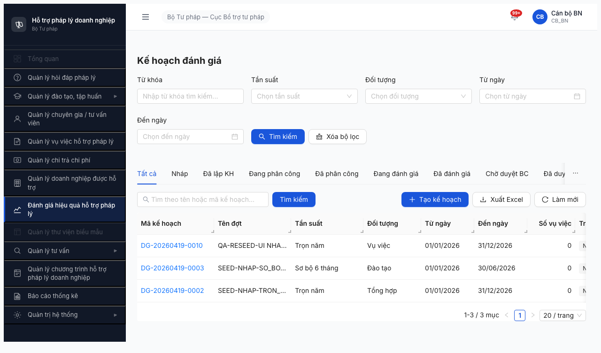
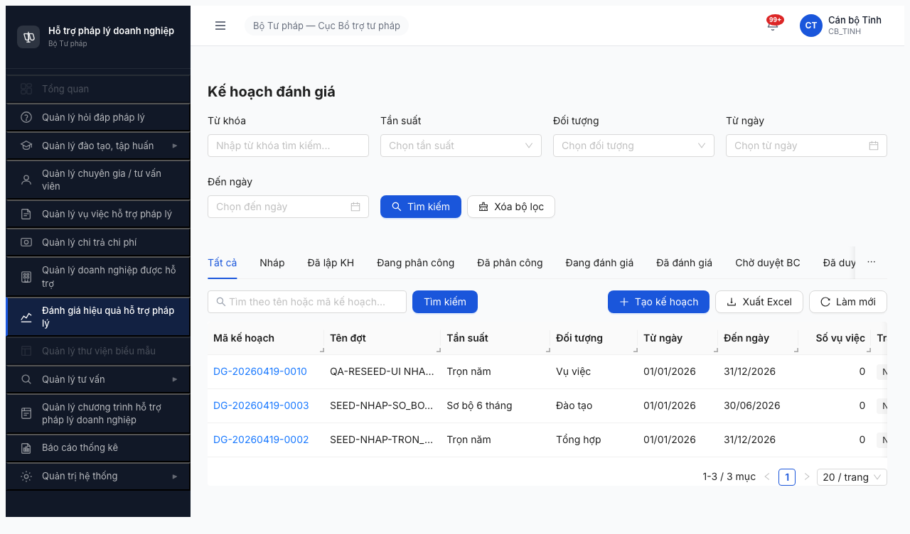
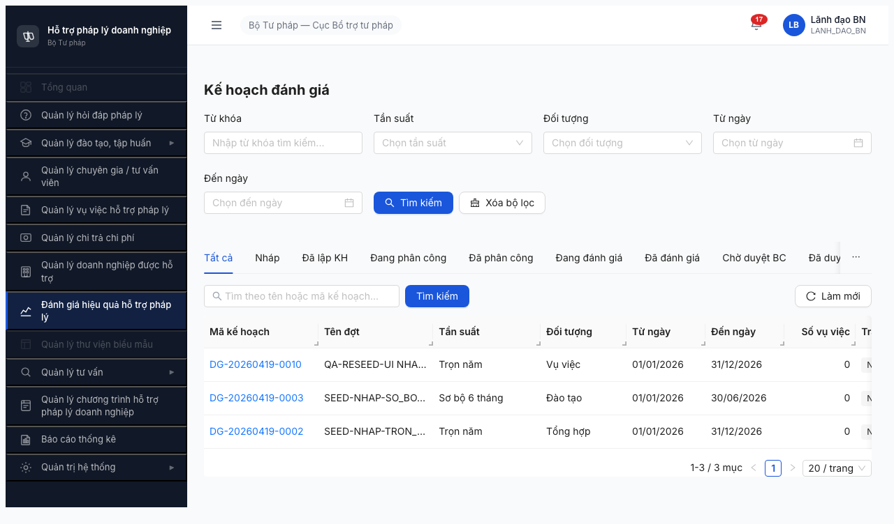
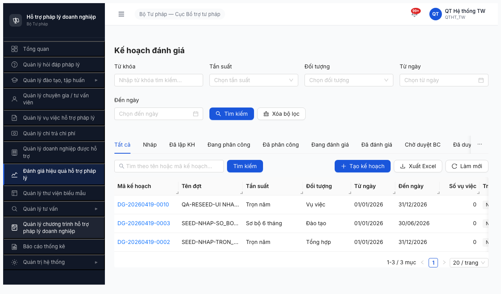
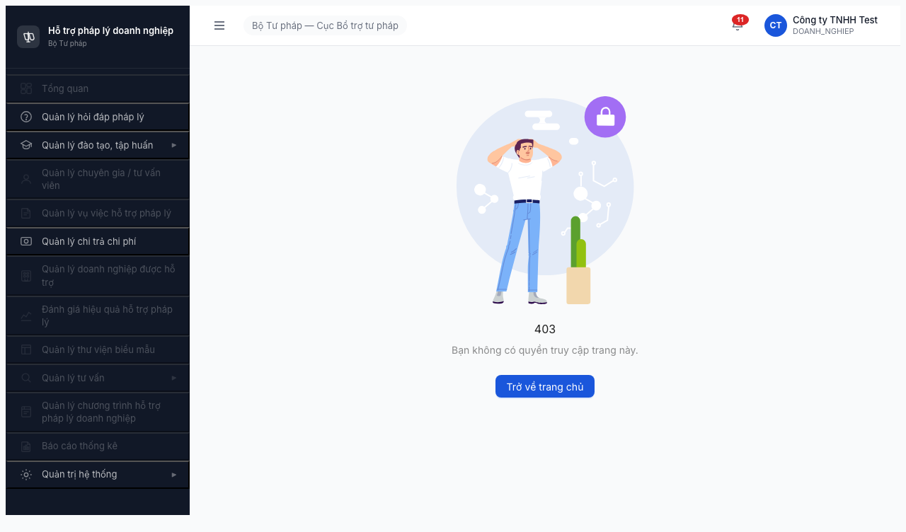
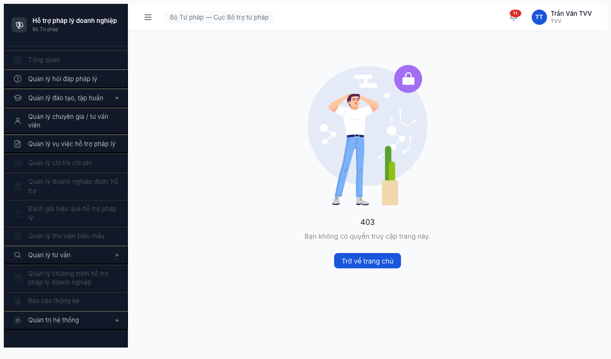

# Bug Report — FR-08 Đánh giá Hiệu quả Hỗ trợ (Permission + BE endpoints)

| Thông tin | Giá trị |
|-----------|---------|
| **Dự án** | PM HTPLDN — Phần mềm Hỗ trợ Pháp lý Doanh nghiệp |
| **Phiên bản** | 1.0 |
| **Môi trường** | http://103.172.236.130:3000/ |
| **Người test** | QA Automation (Claude Code + `/browse` + curl API probe) |
| **Ngày** | 15:30:00 [2026-04-19] |
| **Loại test** | Permission Matrix L1/L3 + Data Readiness BE endpoint probe |
| **Round** | Round 2 (2026-04-16) |
| **Tài liệu tham chiếu** | [permission-matrix.md §8](../../../../permission-matrix.md#8-fr-08--đánh-giá-hiệu-quả-hỗ-trợ) \| [test-strategy.md §5.1](../../../../test-strategy.md#51-ma-trận-phân-quyền-crud--entity--role) \| [functional-test-report-section-8.2-danh-gia.md](functional-test-report-section-8.2-danh-gia.md) \| [data-readiness-report.md](../../danh-gia/data-readiness-report.md) |

---

## Tổng hợp

Phát hiện **6 lỗi** trong quá trình test permission matrix Section 8.2 FR-08 + data readiness audit — gồm **3 bug permission FE** (M8.2-001..003) + **3 bug BE endpoints** (BE-M8-001..003).

| Tổng | Critical | Major | Medium | Minor | Trivial |
|------|----------|-------|--------|-------|---------|
| 6    | 3        | 1     | 0      | 2     | 0       |

**Bối cảnh:**
- **3 bug permission** phát hiện khi retest L3 với technique `history.pushState + popstate` (workaround browse goto auth loss). Tất cả đều là duplicate pattern từ các Section khác — fix consolidated sẽ clear 5-6 module đồng thời.
- **3 bug BE endpoints** phát hiện qua curl API probe (data-readiness §1A.2). BE chỉ mới build nửa sau pipeline (chọn VV → chấm điểm → BC) — thiếu toàn bộ nửa đầu (hoàn tất lập KH, trình PC, duyệt PC) + thiếu module `tieu-chi-danh-gia`. 100% đợt đánh giá stuck ở NHAP.

## Bug Summary Table

| Bug ID | Severity | Priority | Type | Module | TC Ref | Title | Status |
|--------|----------|----------|------|--------|--------|-------|--------|
| BUG-PERM-M8.2-003 | **Critical** | P0 | Permission / Data Scope | FR-08 / KE_HOACH_DANH_GIA | DG-PERM-012c/d/f/g + DG-PERM-016 | Scope isolation leak — CB_NV_BN/DP + CB_PD_BN/DP thấy data TW (4 role × leak) | Open (dup M5-002 / M6-002 / M8.1-002) |
| BUG-BE-M8-001 | **Critical** | P0 | Data / API Missing | FR-08 / TIEU_CHI_DANH_GIA | DG-PERM-014 + DG-004, DG-031, DG-039 | BE chưa build endpoint `/api/v1/tieu-chi-danh-gias` (UC84/UC109) — 404 Cannot GET | Open |
| BUG-BE-M8-002 | **Critical** | P0 | Workflow / State Machine | FR-08 / KE_HOACH_DANH_GIA | DG-PERM-013/015/017 + DG-019..023 | BE thiếu 4 transition endpoints (NHAP → DA_LAP_KH → DANG_PHAN_CONG → DA_PHAN_CONG) — workflow stuck ở NHAP | Open |
| BUG-PERM-M8.2-002 | Major | P1 | Permission | FR-08 / KE_HOACH_DANH_GIA | DG-PERM-012a | QTHT thấy "+ Tạo kế hoạch" trên list KE_HOACH_DANH_GIA trái spec 👁️R | Open (dup M5-001 / M6-001 / M8.1-001 / M8.3-001) |
| BUG-PERM-M8.2-001 | Minor | P2 | Permission | Cross-module (FR-05/06/07/10) | DG-PERM-018 | Portal sidebar leak — DN/NHT/TVV/CG thấy menu module khác enabled trái ma trận | Open (dup M5-003 / M6-003 / M7-006) |
| BUG-BE-M8-003 | Minor | P2 | Data / API Validation | FR-08 / KE_HOACH_DANH_GIA | — | `PATCH /api/v1/ke-hoach-danh-gias/{id}` silently drop field `trangThai` → trả `200 success` thay vì `400 ERR-VAL` | Open |

> **Chú thích Type:**
> - `Permission` — phân quyền (role × action × data scope)
> - `Data / API Missing` — endpoint chưa tồn tại
> - `Workflow / State Machine` — thiếu transition handler
> - `Data / API Validation` — DTO/validator config sai
>
> **Chú thích Severity:** Critical (block release) / Major (UI guide sai role) / Minor (UX confusion, không data exposure)
> **Chú thích Priority:** P0 / P1 / P2

### Fix order recommend

1. **BUG-BE-M8-001** (1-2d) → unblock TIEU_CHI + nền tảng cho M8-002
2. **BUG-BE-M8-002** (2-3d) → unblock toàn bộ workflow + scope test
3. **BUG-PERM-M8.2-003** (1d consolidated) → fix scope isolation cho cả FR-05/06/07/08/12
4. **BUG-PERM-M8.2-002** (2-3h consolidated) → fix QTHT write UI cho cả FR-05/06/07/08/12
5. **BUG-PERM-M8.2-001** (consolidated với M5-003/M6-003/M7-006)
6. **BUG-BE-M8-003** (30min) → làm cùng sprint

---

## BUG-PERM-M8.2-003 — Scope isolation leak: CB_NV_BN/DP + CB_PD_BN/DP thấy data TW trên KE_HOACH_DANH_GIA

| Trường | Chi tiết |
|--------|----------|
| **Bug ID** | BUG-PERM-M8.2-003 |
| **Severity** | **Critical** |
| **Priority** | **P0** |
| **Type** | Permission / Data Scope |
| **Status** | Open (duplicate pattern với BUG-PERM-M5-002 / M6-002 / M8.1-002) |
| **Module** | FR-08 Đánh giá Hiệu quả — KE_HOACH_DANH_GIA entity |
| **Thành phần** | BE API `GET /api/v1/ke-hoach-danh-gias` — filter `donViId` theo role. Hoặc FE không gửi filter `donVi=<mine>`. |
| **URL** | http://103.172.236.130:3000/danh-gia/ke-hoach/danh-sach |
| **Trình duyệt** | Chromium headless |
| **Tài khoản** | `canbo_bn` (CB_NV_BN), `canbo_tinh` (CB_NV_DP), `lanhdao_bn` (CB_PD_BN), `lanhdao_dp` (CB_PD_DP) |
| **TC Reference** | DG-PERM-016 (Data scope isolation) |
| **SRS Reference** | [permission-matrix.md §Quy tắc scoping](../../../../permission-matrix.md#quy-tắc-scoping--ghi-chú) \| BR-AUTH-08 (Phân quyền dữ liệu 3 cấp TW/BN/ĐP) |
| **Assignee** | **BE Team (ưu tiên)** + FE Team (nếu filter sent missing) |
| **Found by** | QA Automation (Claude Code) |

### Mô tả

4 role cấp BN/DP (cả CB_NV và CB_PD) khi truy cập list KE_HOACH_DANH_GIA nhìn thấy **cả 3 bản ghi do canbo_tw (cấp TW, Cục BTTP) tạo**. Theo ma trận phân quyền §Quy tắc scoping: **BN chỉ thấy data đơn vị BN mình, DP chỉ thấy DP mình, ngang cấp KHÔNG thấy nhau** — đây là vi phạm nghiêm trọng data scope.

Pattern này đã báo 3 lần (M5-002, M6-002, M8.1-002) → BE có thể chưa implement `WHERE don_vi_id = <role_donvi_id>` hoặc FE không gửi filter `donVi` trong query.

### Các bước tái hiện

1. Login `canbo_bn` / `Test@1234` → OTP `666666`
2. Navigate `/danh-gia/ke-hoach/danh-sach`
3. Quan sát bảng list → thấy 3 rows:
   - `DG-20260419-0010` (QA-RESEED-UI NHA... — do canbo_tw tạo, đơn vị TW)
   - `DG-20260419-0003` (SEED-NHAP-SO_BO... DAO_TAO — do canbo_tw tạo, đơn vị TW)
   - `DG-20260419-0002` (SEED-NHAP-TRON_... TONG_HOP — do canbo_tw tạo, đơn vị TW)
4. Lặp lại với `canbo_tinh`, `lanhdao_bn`, `lanhdao_dp` — thấy cùng 3 rows TW
5. **Expected:** BN chỉ thấy data đơn vị Bộ KH&ĐT. DP chỉ thấy data Sở TP Hà Nội. Ngang cấp KHÔNG thấy nhau.

### Kết quả mong đợi

Theo ma trận §Quy tắc scoping:
- **TW** (canbo_tw, lanhdao_tw): Thấy TẤT CẢ data (TW + BN + ĐP toàn quốc)
- **BN** (canbo_bn, lanhdao_bn): Chỉ thấy data đơn vị `Bộ KH&ĐT` → 0 rows (vì 3 rows hiện tại đều thuộc Cục BTTP / TW)
- **ĐP** (canbo_tinh, lanhdao_dp): Chỉ thấy data đơn vị `Sở TP Hà Nội` → 0 rows

### Kết quả thực tế

4 role BN/DP thấy đủ 3 rows TW → **cross-tenant data exposure**.

### Bằng chứng






### Tác động (Impact)

- **Cross-tenant data exposure:** Vi phạm BR-AUTH-08 nghiêm trọng nhất của hệ thống 3 cấp. Bộ/Ngành thấy kế hoạch đánh giá của Cục BTTP — có thể thấy thêm tên đợt, tên VV, điểm đánh giá (nếu vào detail).
- **Affected roles:** 4 role × toàn bộ user cấp BN/DP trên production.
- **Data scope fundamental:** Đây là phân quyền tầng base. Nếu sai ở KE_HOACH_DANH_GIA → khả năng cao cũng sai ở KET_QUA_DANH_GIA + BAO_CAO_DANH_GIA (đang blocked do data thiếu).
- **Pattern dup:** 3 module khác cũng bug tương tự → BE có thể có common issue ở query layer (thiếu WHERE clause scoping).
- **Legal/compliance risk:** PM HTPLDN quản lý data công (NĐ55/2019). Cross-tenant exposure có thể vi phạm quy định bảo mật data liên ngành.

### So sánh (Comparison)

| Role | Expected visible rows | Actual visible rows | Delta | Verdict |
|------|-----------------------|---------------------|-------|---------|
| canbo_tw (TW) | 3 (all) | 3 | 0 | PASS |
| canbo_bn (BN) | 0 (no BN data) | 3 (leak TW) | **+3 leak** | **FAIL** |
| canbo_tinh (DP) | 0 (no DP data) | 3 (leak TW) | **+3 leak** | **FAIL** |
| lanhdao_tw (TW) | 3 (all) | 3 | 0 | PASS |
| lanhdao_bn (BN) | 0 | 3 (leak TW) | **+3 leak** | **FAIL** |
| lanhdao_dp (DP) | 0 | 3 (leak TW) | **+3 leak** | **FAIL** |

### Nguyên nhân nghi ngờ (Root Cause)

**Hypothesis 1 — BE missing WHERE clause:**

```sql
-- Expected (cho BN):
SELECT * FROM ke_hoach_danh_gias
WHERE (deleted_at IS NULL)
  AND don_vi_id IN (<list đơn vị thuộc Bộ KH&ĐT>)  -- ← MISSING?

-- Actual (có thể):
SELECT * FROM ke_hoach_danh_gias WHERE deleted_at IS NULL;
```

**Hypothesis 2 — FE không gửi filter:**

FE list query có thể không truyền param `donVi=<current_user_don_vi>`.

### Gợi ý sửa (Suggested Fix)

**BE fix (recommended):**

```typescript
// ke-hoach-danh-gia.controller.ts
@Get()
async list(@Req() req, @Query() query: ListQuery) {
  const user = req.user;
  const scopeDonViIds = await this.donViService.getScopeForUser(user);
  // CB_NV_TW → all don_vi; CB_NV_BN → don_vi thuộc Bộ KH&ĐT; CB_NV_DP → don_vi thuộc Sở TP HN
  return this.service.list({ ...query, donViIds: scopeDonViIds });
}
```

**Consolidated fix:** Nếu BE có interceptor/middleware `ScopeInterceptor` áp chung cho tất cả list endpoint theo role → fix 1 lần sẽ clear M5-002 / M6-002 / M8.1-002 / M8.2-003 đồng loạt.

---

## BUG-BE-M8-001 — BE chưa build endpoint `/api/v1/tieu-chi-danh-gias` (UC84/UC109)

| Trường | Chi tiết |
|--------|----------|
| **Bug ID** | BUG-BE-M8-001 |
| **Severity** | **Critical** |
| **Priority** | **P0** |
| **Type** | Data / API Missing |
| **Status** | Open |
| **Module** | FR-08 Đánh giá Hiệu quả — TIEU_CHI_DANH_GIA entity |
| **Thành phần** | BE NestJS module `tieu-chi-danh-gia` — chưa tồn tại controller/service/entity |
| **URL** | `GET/POST /api/v1/tieu-chi-danh-gias` |
| **Trình duyệt** | N/A (API probe với curl) |
| **Tài khoản** | `canbo_tw` (JWT accessToken 5188 chars) |
| **TC Reference** | DG-PERM-014 + DG-004, DG-031, DG-039 |
| **SRS Reference** | [srs-fr-08-danh-gia.md UC84](../../../../input/srs-v3/srs-fr-08-danh-gia.md) | [UC109](../../../../input/srs-v3/srs-fr-10-quan-tri.md) | BR-CALC-04 (SUM trọng số = 100%) |
| **Assignee** | **BE Team** |
| **Found by** | QA Automation — data-readiness audit §2.4 |

### Mô tả

Endpoint `/api/v1/tieu-chi-danh-gias` không tồn tại ở BE. Gọi `GET` trả `404 ERR-SYS-00-04-01 Cannot GET`. Endpoint nested `POST /api/v1/ke-hoach-danh-gias/{id}/tieu-chis` cũng 404 (chỉ có `GET` trả list rỗng).

FE service file `/src/services/ke-hoach-danh-gia.api.ts` có method `listTieuChi` (GET only — chưa có CRUD). FE hook `use-ke-hoach-danh-gia.ts` cũng không dùng endpoint nào khác → confirm FE chưa được BE expose.

Entity TIEU_CHI_DANH_GIA là **danh mục hệ thống** (UC109) do QTHT quản lý, và được reference khi CB_NV thiết lập tiêu chí cho đợt đánh giá (DG-004 cần `SUM(trongSo) = 100%` — BR-CALC-04). Thiếu endpoint này → **không thể chuyển state `NHAP → DA_LAP_KH`** (cần tiêu chí SUM=100% để hoàn tất lập KH).

### Các bước tái hiện

```bash
# Bước 1: Login lấy accessToken
TOKEN=$(curl -s -X POST http://103.172.236.130:3000/api/v1/auth/login \
  -H "Content-Type: application/json" \
  -d '{"username":"canbo_tw","password":"Test@1234"}' \
  | jq -r '.data.otpToken')

OTP_RES=$(curl -s -X POST http://103.172.236.130:3000/api/v1/auth/verify-otp \
  -H "Content-Type: application/json" \
  -d "{\"otpToken\":\"$TOKEN\",\"otpCode\":\"666666\"}")

ACCESS=$(echo "$OTP_RES" | jq -r '.data.accessToken')

# Bước 2: Thử GET endpoint tiêu chí
curl -s -H "Authorization: Bearer $ACCESS" \
  http://103.172.236.130:3000/api/v1/tieu-chi-danh-gias
# → Response:
# {"success":false,"error":{"code":"ERR-SYS-00-04-01","message":"Cannot GET /api/v1/tieu-chi-danh-gias"}}

# Bước 3: Thử các biến thể path — đều 404
curl -s "...api/v1/tieu-chi"          # → 404
curl -s "...api/v1/tieu-chi-danh-gia"  # → 404 (singular)

# Bước 4: Thử nested
curl -s -H "Authorization: Bearer $ACCESS" \
  "http://103.172.236.130:3000/api/v1/ke-hoach-danh-gias/$ID/tieu-chis"
# → 200 {"success":true,"data":[]} — GET only, không có POST/PATCH/DELETE

curl -s -X POST -H "Authorization: Bearer $ACCESS" \
  -H "Content-Type: application/json" \
  -d '{"ten":"Test","trongSo":50}' \
  "http://103.172.236.130:3000/api/v1/ke-hoach-danh-gias/$ID/tieu-chis"
# → 404 Cannot POST
```

### Kết quả mong đợi

**Endpoint root (UC109 — QTHT quản lý danh mục hệ thống):**
- `GET /api/v1/tieu-chi-danh-gias` — List (filter `nhom`, pagination) — 👁️ Read all roles
- `GET /api/v1/tieu-chi-danh-gias/{id}` — Detail
- `POST /api/v1/tieu-chi-danh-gias` — QTHT Create (BR-DATA-05 audit)
- `PATCH /api/v1/tieu-chi-danh-gias/{id}` — QTHT Update
- `DELETE /api/v1/tieu-chi-danh-gias/{id}` — QTHT Soft delete

**Endpoint nested (UC84 — CB_NV chọn tiêu chí cho đợt):**
- `POST /api/v1/ke-hoach-danh-gias/{id}/tieu-chis` — Thêm tiêu chí cho đợt, validate SUM ≤ 100%, khi SUM=100 → auto-transition `NHAP → DA_LAP_KH`
- `DELETE /api/v1/ke-hoach-danh-gias/{id}/tieu-chis/{tieuChiDotId}` — Xóa tiêu chí khỏi đợt

### Kết quả thực tế

- Tất cả path variant trả `404 ERR-SYS-00-04-01 Cannot GET/POST`
- FE service file không có `createTieuChi`, `updateTieuChi`, `deleteTieuChi` method
- 0 nodes trong danh mục tree `loaiDanhMuc=TIEU_CHI_DANH_GIA`

→ **Entity TIEU_CHI_DANH_GIA chưa được BE implement**.

### Bằng chứng

API log raw (từ [data-readiness-report.md §2.4, §7.2](../../danh-gia/data-readiness-report.md)):

```
GET /api/v1/tieu-chi-danh-gias
→ 404 ERR-SYS-00-04-01 Cannot GET

GET /api/v1/ke-hoach-danh-gias/{id}/tieu-chis
→ 200 {"success":true,"data":[]}  (GET tồn tại nhưng luôn trả rỗng)

POST /api/v1/ke-hoach-danh-gias/{id}/tieu-chis  (body: {ten,trongSo})
→ 404 ERR-SYS-00-04-01 Cannot POST

GET /api/v1/danh-muc/tree?loaiDanhMuc=TIEU_CHI_DANH_GIA
→ 200 [] (0 nodes)
```

### Tác động (Impact)

- **Block 7/44 ô ma trận phân quyền FR-08** (TIEU_CHI_DANH_GIA × 7 CMS role — QTHT ✅CRUD + 6 role 👁️R)
- **Block toàn bộ workflow FR-08:** state `NHAP → DA_LAP_KH` đòi hỏi tiêu chí SUM=100% → đứng tại NHAP → toàn bộ downstream state + bug report sau không test được
- **Block DG-004, DG-031, DG-039** (3 test case functional)
- **Module Đánh giá không vận hành được** cho production nếu chưa có endpoint này

### Nguyên nhân nghi ngờ (Root Cause)

BE chưa scaffold module NestJS `tieu-chi-danh-gia`. Cần tạo:
- Entity `TieuChiDanhGia` (table `tieu_chi_danh_gias`)
- Entity bảng liên kết `TieuChiDotDanhGia` (table `tieu_chi_dot_danh_gias` — nested theo đợt)
- Controller + Service + DTO
- Migration SQL cho 2 table

### Gợi ý sửa (Suggested Fix)

**Step 1 — Scaffold module:**

```bash
cd apps/backend
nest g module tieu-chi-danh-gia
nest g controller tieu-chi-danh-gia
nest g service tieu-chi-danh-gia
```

**Step 2 — Entity (TypeORM giả định):**

```typescript
// src/modules/tieu-chi-danh-gia/entities/tieu-chi-danh-gia.entity.ts
@Entity('tieu_chi_danh_gias')
export class TieuChiDanhGia {
  @PrimaryGeneratedColumn('uuid') id: string;
  @Column() ten: string;
  @Column({ nullable: true }) moTa: string;
  @Column() nhom: string;  // vd: HIEU_QUA_HTPL, CHAT_LUONG_TU_VAN
  @Column('decimal', { precision: 5, scale: 2 }) trongSoMacDinh: number;
  @Column({ default: true }) hoatDong: boolean;
  @DeleteDateColumn() deletedAt: Date;
  @CreateDateColumn() createdAt: Date;
  @UpdateDateColumn() updatedAt: Date;
}

// src/modules/ke-hoach-danh-gia/entities/tieu-chi-dot-danh-gia.entity.ts
@Entity('tieu_chi_dot_danh_gias')
export class TieuChiDotDanhGia {
  @PrimaryGeneratedColumn('uuid') id: string;
  @ManyToOne(() => KeHoachDanhGia) keHoach: KeHoachDanhGia;
  @ManyToOne(() => TieuChiDanhGia) tieuChi: TieuChiDanhGia;
  @Column('decimal', { precision: 5, scale: 2 }) trongSo: number;  // phải <=100
  @Column() thuTu: number;
}
```

**Step 3 — Controller endpoints:**

```typescript
// Root (UC109 — QTHT CRUD):
@Controller('tieu-chi-danh-gias')
@UseGuards(JwtAuthGuard)
export class TieuChiDanhGiaController {
  @Get()            @CanRead('TieuChiDanhGia')    list() { /* ... */ }
  @Post()           @CanCreate('TieuChiDanhGia')  create(@Body() dto: CreateDto) { /* ... */ }
  @Patch(':id')     @CanUpdate('TieuChiDanhGia')  update(/* ... */) { /* ... */ }
  @Delete(':id')    @CanDelete('TieuChiDanhGia')  remove(/* ... */) { /* ... */ }
}

// Nested (UC84 — CB_NV thiết lập tiêu chí cho đợt):
@Controller('ke-hoach-danh-gias/:keHoachId/tieu-chis')
export class KeHoachTieuChiController {
  @Post()
  async addTieuChi(@Param('keHoachId') id, @Body() dto) {
    // validate SUM(trongSo các tieu chi trong đợt) ≤ 100
    // khi SUM=100, transition NHAP → DA_LAP_KH (BR-CALC-04)
  }
}
```

**Step 4 — Seed data:** ≥2 tiêu chí nhóm `HIEU_QUA_HTPL` cho testing.

**Estimated effort:** 1-2 ngày.

---

## BUG-BE-M8-002 — BE thiếu 4 transition endpoints workflow đánh giá (NHAP → DA_LAP_KH → DANG_PHAN_CONG → DA_PHAN_CONG)

| Trường | Chi tiết |
|--------|----------|
| **Bug ID** | BUG-BE-M8-002 |
| **Severity** | **Critical** |
| **Priority** | **P0** |
| **Type** | Workflow / State Machine |
| **Status** | Open |
| **Module** | FR-08 Đánh giá Hiệu quả — KE_HOACH_DANH_GIA workflow |
| **Thành phần** | BE module `ke-hoach-danh-gia` — controller/service thiếu 4 action handlers; FE service `ke-hoach-danh-gia.api.ts` thiếu 5 methods |
| **URL** | `POST /api/v1/ke-hoach-danh-gias/{id}/trinh-phan-cong`, `/phe-duyet-phan-cong`, `/hoan-tat-lap-kh`, `/huy` |
| **Trình duyệt** | N/A (API probe với curl) |
| **Tài khoản** | `canbo_tw` + `lanhdao_tw` (cần 2 role để walk workflow BR-AUTH-05) |
| **TC Reference** | DG-PERM-013/015/017 + DG-019, DG-020, DG-021, DG-022, DG-023 |
| **SRS Reference** | [srs-fr-08-danh-gia.md UC83-UC87](../../../../input/srs-v3/srs-fr-08-danh-gia.md) \| BR-AUTH-05 (duyệt cùng cấp), BR-FLOW-04 (từ chối cần lý do ≥10 ký tự) |
| **Assignee** | **BE Team** |
| **Found by** | QA Automation — data-readiness audit §1A.2 |

### Mô tả

State machine FR-08 yêu cầu đợt đánh giá đi qua 9 state. BE hiện tại chỉ build **nửa sau pipeline** (chọn VV từ `DA_PHAN_CONG` + chấm điểm + lập BC + duyệt BC) nhưng **thiếu toàn bộ 4 transition đầu**:

| # | Transition | Endpoint cần | Actor | Status |
|---|-----------|--------------|-------|--------|
| 1 | `NHAP → DA_LAP_KH` | `POST /{id}/hoan-tat-lap-kh` (hoặc auto khi SUM tiêu chí = 100%) | CB_NV | ❌ Missing |
| 2 | `DA_LAP_KH → DANG_PHAN_CONG` | `POST /{id}/trinh-phan-cong` | CB_NV | ❌ Missing |
| 3 | `DANG_PHAN_CONG → DA_PHAN_CONG` | `POST /{id}/phe-duyet-phan-cong` | CB_PD (cùng cấp) | ❌ Missing |
| 4 | `DANG_PHAN_CONG → NHAP` (reject) | `POST /{id}/tu-choi-phan-cong` (body: `{lyDo}`) | CB_PD | ❌ Missing |
| 5 | `* → HUY` | `POST /{id}/huy` | CB_NV | ❌ Missing |

Do thiếu các transition này, **100% đợt đánh giá bị stuck ở state `NHAP`** (3 bản ghi seed đã verified). Đã probe toàn bộ biến thể naming → tất cả 404.

### Các bước tái hiện

```bash
ID="57a707aa-ac54-405a-85b1-983cd88f0223"  # DG-20260419-0001 NHAP

# 1. Transition endpoints với naming theo spec
for path in trinh-phan-cong phe-duyet-phan-cong tu-choi-phan-cong hoan-tat-lap-kh huy; do
  echo "POST /{id}/$path:"
  curl -s -X POST -H "Authorization: Bearer $ACCESS" \
    -H "Content-Type: application/json" -d '{}' \
    "http://103.172.236.130:3000/api/v1/ke-hoach-danh-gias/$ID/$path"
done
# → Tất cả: 404 ERR-SYS-00-04-01 Cannot POST

# 2. Alternative naming (submit/approve/reject/cancel) — tất cả 404
# 3. Generic state transition /chuyen-trang-thai — 404
# 4. Workaround PATCH → silently drop trangThai (xem BUG-BE-M8-003)

# 5. Verify endpoints nửa sau CÓ tồn tại
curl -s -H "Authorization: Bearer $ACCESS" \
  "http://103.172.236.130:3000/api/v1/ke-hoach-danh-gias/$ID/vu-viec-eligible"
# → 400 ERR-STATE-SYS-00-01: "Ke hoach phai o trang thai DA_PHAN_CONG, hien tai la 'NHAP'"
# → Confirm BE CÓ nửa sau, thiếu nửa đầu
```

### Kết quả mong đợi

Theo spec 7.8 + SRS UC85-UC87 + BR-AUTH-05 + BR-FLOW-04:

```
POST /api/v1/ke-hoach-danh-gias/{id}/hoan-tat-lap-kh
  Role: CB_NV_*
  Gate: trangThai = NHAP + có ≥1 tiêu chí với SUM trọng số = 100% (BR-CALC-04)
  Transition: NHAP → DA_LAP_KH

POST /api/v1/ke-hoach-danh-gias/{id}/trinh-phan-cong
  Body: {phanCongs: [{canBoId, loai: "TRUONG_NHOM"|"THANH_VIEN"}]}
  Role: CB_NV_*
  Gate: trangThai = DA_LAP_KH + ≥1 phân công + ≥1 TRUONG_NHOM
  Transition: DA_LAP_KH → DANG_PHAN_CONG
  Notification: BR-NOTIF-01 gửi CB_PD cùng cấp

POST /api/v1/ke-hoach-danh-gias/{id}/phe-duyet-phan-cong
  Role: CB_PD_* cùng cấp đơn vị (BR-AUTH-05)
  Gate: trangThai = DANG_PHAN_CONG
  Transition: DANG_PHAN_CONG → DA_PHAN_CONG

POST /api/v1/ke-hoach-danh-gias/{id}/tu-choi-phan-cong
  Body: {lyDo: string}  // ≥10 ký tự BR-FLOW-04
  Transition: DANG_PHAN_CONG → NHAP (rollback để CB_NV sửa)

POST /api/v1/ke-hoach-danh-gias/{id}/huy
  Gate: trangThai != DA_DUYET_BC
  Transition: * → HUY
```

### Kết quả thực tế

BE service file `/src/services/ke-hoach-danh-gia.api.ts` có 21 methods nhưng **thiếu:** `hoanTatLapKh`, `trinhPhanCong`, `pheDuyetPhanCong`, `tuChoiPhanCong`, `huy`.

### Bằng chứng

API log raw (từ [data-readiness-report.md §1A.2](../../danh-gia/data-readiness-report.md)):

```
POST /{id}/tieu-chis                    → 404
POST /{id}/hoan-tat-lap-kh              → 404
POST /{id}/trinh-phan-cong              → 404
POST /{id}/phe-duyet-phan-cong          → 404
POST /{id}/trinh-duyet                  → 404
POST /{id}/phe-duyet                    → 404
POST /{id}/huy, /cancel, /submit, /approve → 404
POST /{id}/chuyen-trang-thai, /state-transition, /transition → 404
POST /{id}/gui-duyet, /duyet, /tu-choi, /phan-cong, /danh-gia, /lap-bao-cao → 404

GET /{id}/vu-viec-eligible
→ 400 ERR-STATE-SYS-00-01 "Ke hoach phai o trang thai DA_PHAN_CONG, hien tai la 'NHAP'"
# ↑ Confirm endpoint nửa sau CÓ, thiếu nửa đầu
```

Final count state machine:
```
NHAP=3, DA_LAP_KH=0, DANG_PHAN_CONG=0, DA_PHAN_CONG=0,
DANG_DANH_GIA=0, DA_DANH_GIA=0, CHO_DUYET_BC=0, DA_DUYET_BC=0, HUY=0
```

### Tác động (Impact)

- **Block 14/44 ô ma trận phân quyền FR-08** (KET_QUA_DANH_GIA × 7 CMS + BAO_CAO_DANH_GIA × 7 CMS — cần state DA_PHAN_CONG + DA_DANH_GIA)
- **Block scope isolation test:** Cần walk workflow với đợt BN + DP riêng biệt để test isolation. Không có BN data → không verify đủ scope (hiện chỉ phát hiện M8.2-003 nhờ 3 đợt TW)
- **Block functional test:** DG-019..023 + 10+ downstream TC
- **Module Đánh giá không vận hành được** end-to-end cho production
- **Compliance risk:** SRS §FR-V.VIII + TT17/2025 yêu cầu đợt đánh giá công bố/nộp TW

### Nguyên nhân nghi ngờ (Root Cause)

BE team implement theo thứ tự backwards (nửa sau trước → chấm điểm + BC) để FE phát triển parallel. Nửa đầu (lập KH + PC) chưa trong sprint hiện tại. Hoặc BE phụ thuộc BUG-BE-M8-001 (cần endpoint TIEU_CHI trước) nên block luôn `hoan-tat-lap-kh`.

### Gợi ý sửa (Suggested Fix)

**Phase 1 — Transition `NHAP → DA_LAP_KH` (phụ thuộc BUG-BE-M8-001 fix):**

```typescript
@Post(':id/hoan-tat-lap-kh')
@CanUpdate('KeHoachDanhGia')
async hoanTatLapKh(@Param('id') id: string, @Req() req) {
  return this.service.transitionState(id, 'NHAP', 'DA_LAP_KH', req.user, {
    guard: async (entity) => {
      const sum = await this.tieuChiService.sumTrongSoForDot(id);
      if (sum !== 100) throw new BadRequestException('ERR-CALC-04: SUM tiêu chí != 100%');
    }
  });
}
```

**Phase 2 — Transition `DA_LAP_KH → DANG_PHAN_CONG` + nested phân công:**

```typescript
@Post(':id/trinh-phan-cong')
@CanUpdate('KeHoachDanhGia')
async trinhPhanCong(@Param('id') id, @Body() dto: TrinhPCDto, @Req() req) {
  return this.service.transitionState(id, 'DA_LAP_KH', 'DANG_PHAN_CONG', req.user, {
    validate: () => {
      if (dto.phanCongs.length < 1) throw new BadRequestException('Cần ≥1 phân công');
      if (!dto.phanCongs.some(p => p.loai === 'TRUONG_NHOM'))
        throw new BadRequestException('Cần ≥1 Trưởng nhóm');
    },
    sideEffect: async () => {
      await this.phanCongService.createBatch(id, dto.phanCongs);
      await this.notifService.sendToRole('CB_PD', /* same don_vi */);
    }
  });
}
```

**Phase 3 — Duyệt/Từ chối PC (BR-AUTH-05 cùng cấp):**

```typescript
@Post(':id/phe-duyet-phan-cong')
@CanApprove('KeHoachDanhGia')
async pheDuyetPhanCong(@Param('id') id, @Req() req) {
  return this.service.transitionState(id, 'DANG_PHAN_CONG', 'DA_PHAN_CONG', req.user, {
    guard: async (entity) => {
      if (entity.creator.donViId !== req.user.donViId) {
        throw new ForbiddenException('BR-AUTH-05: Chỉ duyệt cùng cấp');
      }
    }
  });
}

@Post(':id/tu-choi-phan-cong')
async tuChoiPhanCong(@Param('id') id, @Body() dto: {lyDo: string}) {
  if (!dto.lyDo || dto.lyDo.length < 10)
    throw new BadRequestException('BR-FLOW-04: Lý do ≥10 ký tự');
  return this.service.transitionState(id, 'DANG_PHAN_CONG', 'NHAP', /* saveNote */);
}
```

**Phase 4 — Hủy đợt:**

```typescript
@Post(':id/huy')
async huy(@Param('id') id, @Body() dto: {lyDo?: string}) {
  return this.service.transitionState(id, '*', 'HUY', req.user, {
    guard: (entity) => entity.trangThai !== 'DA_DUYET_BC'
  });
}
```

**Estimated effort:** 2-3 ngày. **Dependencies:** BUG-BE-M8-001 phải fix trước.

---

## BUG-PERM-M8.2-002 — QTHT thấy "+ Tạo kế hoạch" trên list KE_HOACH_DANH_GIA trái spec 👁️R

| Trường | Chi tiết |
|--------|----------|
| **Bug ID** | BUG-PERM-M8.2-002 |
| **Severity** | Major |
| **Priority** | P1 |
| **Type** | Permission |
| **Status** | Open (duplicate pattern với BUG-PERM-M5-001 / M6-001 / M8.1-001 / M8.3-001) |
| **Module** | FR-08 Đánh giá Hiệu quả — KE_HOACH_DANH_GIA entity |
| **Thành phần** | FE list page `/danh-gia/ke-hoach/danh-sach` — toolbar button render condition |
| **URL** | http://103.172.236.130:3000/danh-gia/ke-hoach/danh-sach |
| **Trình duyệt** | Chromium headless |
| **Tài khoản** | `qtht_tw` (QTHT / QTHT_TW) |
| **TC Reference** | DG-PERM-012a |
| **SRS Reference** | [permission-matrix.md §8](../../../../permission-matrix.md#8-fr-08--đánh-giá-hiệu-quả-hỗ-trợ) — QTHT × KE_HOACH_DANH_GIA = 👁️R \| BR-AUTH-01 |
| **Assignee** | FE Team |
| **Found by** | QA Automation |

### Mô tả

QTHT theo ma trận chỉ có 👁️R (Read-only) trên KE_HOACH_DANH_GIA, nhưng UI list page vẫn hiển thị button **"+ Tạo kế hoạch"** (màu xanh primary) cho QTHT. Pattern lặp lại với M5-001 / M6-001 / M8.1-001 / M8.3-001.

### Các bước tái hiện

1. Login `qtht_tw` / `Test@1234` → OTP `666666` → /dashboard
2. Navigate `/danh-gia/ke-hoach/danh-sach`
3. Quan sát toolbar bên phải: `+ Tạo kế hoạch` (primary blue), `Xuất Excel`, `Làm mới`
4. **QTHT theo spec 👁️R chỉ có quyền xem → button "+ Tạo kế hoạch" KHÔNG ĐƯỢC hiển thị**

### Kết quả mong đợi

Theo ma trận §8 + BR-AUTH-01:
- QTHT có 👁️R trên KE_HOACH_DANH_GIA, KET_QUA_DANH_GIA, BAO_CAO_DANH_GIA (3/4 entity)
- QTHT có ✅CRUD chỉ trên TIEU_CHI_DANH_GIA (1 entity — danh mục hệ thống)
- List page `/danh-gia/ke-hoach/danh-sach` (entity KE_HOACH_DANH_GIA): chỉ hiển thị `Xuất Excel` + `Làm mới` + readonly table. **KHÔNG có** `+ Tạo kế hoạch`

### Kết quả thực tế

Button `+ Tạo kế hoạch` hiển thị như role CB_NV (✅CRUD*).

### Bằng chứng



Toolbar QTHT quan sát:
```
[ + Tạo kế hoạch ] [ Xuất Excel ] [ Làm mới ]
```

So sánh với `lanhdao_tw` (📝RU*) ở [lanhdao-tw-kehoach-list.png](screenshots/lanhdao-tw-kehoach-list.png):
```
                   [ Làm mới ]
```

→ `lanhdao_tw` đúng (không thấy Tạo), `qtht_tw` sai (thấy Tạo).

### Tác động (Impact)

- **UI guide sai role:** Admin QTHT có thể nhầm rằng mình có quyền tạo → click vào, BE chặn 403 → phàn nàn "tại sao nút có mà click không được".
- **Violate BR-AUTH-01:** QTHT phải Read-only trên nghiệp vụ — UI phản ánh sai.
- **Defense-in-depth violation:** Chỉ BE chặn, UI không gate.
- **Pattern dup:** 5 module đã có cùng bug này → pattern gốc.

### So sánh (Comparison)

| Role | Button "+ Tạo kế hoạch" visible? | Expected (ma trận §8) | Verdict |
|------|-----------------------------------|------------------------|---------|
| qtht_tw (QTHT) | ✅ (thấy) | ❌ KHÔNG (👁️R) | **FAIL — bug** |
| canbo_tw (CB_NV_TW) | ✅ (thấy) | ✅ CÓ (CRUD*) | PASS |
| canbo_bn (CB_NV_BN) | ✅ (thấy) | ✅ CÓ (CRUD* scoped BN) | PASS |
| canbo_tinh (CB_NV_DP) | ✅ (thấy) | ✅ CÓ (CRUD* scoped DP) | PASS |
| lanhdao_tw (CB_PD_TW) | ❌ (không thấy) | ❌ KHÔNG (RU*) | PASS |
| lanhdao_bn (CB_PD_BN) | ❌ (không thấy) | ❌ KHÔNG (RU* scoped BN) | PASS |
| lanhdao_dp (CB_PD_DP) | ❌ (không thấy) | ❌ KHÔNG (RU* scoped DP) | PASS |

### Nguyên nhân nghi ngờ (Root Cause)

FE toolbar button render condition có thể đang dùng logic `role !== 'CB_PD'` để show "+ Tạo" — logic này đúng cho CB_NV vs CB_PD nhưng không loại được QTHT.

### Gợi ý sửa (Suggested Fix)

**Option 1 — Dùng ability check (recommended):**

```tsx
import { useAbility } from '@/ability';

function KeHoachToolbar() {
  const ability = useAbility();
  return (
    <Space>
      {ability.can('create', 'KeHoachDanhGia') && (
        <Button type="primary" onClick={openCreateDrawer}>+ Tạo kế hoạch</Button>
      )}
      <Button onClick={exportExcel}>Xuất Excel</Button>
      <Button onClick={reload}>Làm mới</Button>
    </Space>
  );
}
```

**Consolidated fix:** Fix 1 lần có thể clear cả M5-001 / M6-001 / M8.1-001 / M8.2-002 / M8.3-001.

---

## BUG-PERM-M8.2-001 — Portal sidebar leak: 4 role Portal thấy menu module khác enabled trái ma trận

| Trường | Chi tiết |
|--------|----------|
| **Bug ID** | BUG-PERM-M8.2-001 |
| **Severity** | Minor |
| **Priority** | P2 |
| **Type** | Permission |
| **Status** | Open (duplicate pattern với BUG-PERM-M5-003 / M6-003 / M7-006) |
| **Module** | Cross-module — sidebar Portal (ảnh hưởng menu FR-05 Vụ việc, FR-06 Chi trả, FR-10 QTHT, FR-14 HĐ tư vấn, ...) |
| **Thành phần** | FE sidebar config / CASL ability rule cho role Portal |
| **URL** | http://103.172.236.130:3000/403 |
| **Trình duyệt** | Chromium headless |
| **Tài khoản** | `dn_user`, `nht_user`, `tvv_user`, `chuyengia_user` |
| **TC Reference** | DG-PERM-018 |
| **SRS Reference** | BR-AUTH-10 (TVV/CG/NHT), BR-AUTH-11 (DN API-only) |
| **Assignee** | FE Team |

### Mô tả

4 role Portal thấy một số menu sidebar module khác enabled trong khi ma trận ghi ❌. AuthGuard route-level vẫn chặn đúng (`/403`), nhưng UI leak → UX confusion + vi phạm defense-in-depth.

**Menu FR-08 "Đánh giá hiệu quả":** 4 Portal role đúng GREYED ✅ → **không bug trong FR-08**. Bug này là cross-module pattern.

### Các bước tái hiện

1. Login `dn_user`, `nht_user`, `tvv_user`, `chuyengia_user` (OTP `666666`)
2. Quan sát sidebar tại `/403`:
   - **DN:** "Quản lý chi trả chi phí" + "Quản trị hệ thống" ENABLED (trái ma trận §6, §10)
   - **NHT:** "Quản lý chi trả chi phí" + "Quản trị hệ thống" ENABLED
   - **TVV:** "Quản lý vụ việc" + "Quản trị hệ thống" ENABLED (TVV=❌ trên VU_VIEC — BR-AUTH-10)
   - **CG:** "Quản trị hệ thống" ENABLED

### Bằng chứng





### Tác động (Impact)

- UX confusion + defense-in-depth violation. Không data exposure vì AuthGuard chặn.
- Affected: 4 role Portal × toàn bộ Portal users.

### Nguyên nhân + Fix

FE sidebar không lọc theo `ability.can(...)`. **Consolidated fix** với M5-003/M6-003/M7-006.

---

## BUG-BE-M8-003 — `PATCH /api/v1/ke-hoach-danh-gias/{id}` silently drop field `trangThai` thay vì trả 400 ERR-VAL

| Trường | Chi tiết |
|--------|----------|
| **Bug ID** | BUG-BE-M8-003 |
| **Severity** | Minor |
| **Priority** | P2 |
| **Type** | Data / API Validation |
| **Status** | Open |
| **Module** | FR-08 / KE_HOACH_DANH_GIA |
| **Thành phần** | BE `ke-hoach-danh-gia.controller.ts` PATCH endpoint — DTO whitelist không reject unknown fields |
| **URL** | `PATCH /api/v1/ke-hoach-danh-gias/{id}` |
| **Tài khoản** | `canbo_tw` |
| **TC Reference** | — (phát hiện phụ trợ khi probe BUG-BE-M8-002) |
| **Assignee** | BE Team |

### Mô tả

Khi gửi `PATCH` với body chứa field `trangThai` (không thuộc whitelist update):
- **Expected:** BE trả `400 ERR-VAL "trangThai is not allowed"`
- **Actual:** BE trả `200 success` nhưng silently drop `trangThai`. Response body cho thấy record không thay đổi state, `version` không tăng.

An toàn (không bypass state machine) nhưng gây UX confusion cho developer/tester.

### Các bước tái hiện

```bash
# PATCH với trangThai fake
curl -s -X PATCH -H "Authorization: Bearer $ACCESS" \
  -H "Content-Type: application/json" \
  -d '{"trangThai":"DA_DUYET_BC","version":1}' \
  http://103.172.236.130:3000/api/v1/ke-hoach-danh-gias/$ID
# → 200 {success:true, data:{..., trangThai:"NHAP", version:1}}
# ↑ BUG: trả success nhưng trangThai vẫn NHAP, version không tăng
# Expected: 400 {error:{code:"ERR-VAL", message:"trangThai is not allowed"}}
```

### Bằng chứng

Từ [data-readiness-report.md §1A.3](../../danh-gia/data-readiness-report.md):

> `PATCH /ke-hoach-danh-gias/{id}` **trả về `success:true`** khi body chứa `{trangThai: "DA_DUYET_BC"}` (fake), nhưng thực tế **BE silently drop field `trangThai`** trong whitelist → record không thay đổi.

### Tác động (Impact)

- Dev/tester confusion: Thấy `success:true` → fake confidence state đã đổi
- QA automation: Script chỉ check HTTP 200 → pass fake
- An toàn về nghiệp vụ: Không bypass SM

### Nguyên nhân + Fix

BE dùng DTO với `whitelist: true, forbidNonWhitelisted: false` — strip unknown fields silently.

**Option A — Set `forbidNonWhitelisted: true` global (recommended):**

```typescript
// main.ts
app.useGlobalPipes(new ValidationPipe({
  whitelist: true,
  forbidNonWhitelisted: true,  // ← thêm dòng này
  transform: true,
}));
```

**Estimated effort:** 30 phút + regression test.

---

## Phụ lục

### A — Môi trường test

| Thành phần | Giá trị |
|------------|---------|
| URL ứng dụng | http://103.172.236.130:3000/ |
| OTP login | `666666` (bypass tạm) |
| MailHog (OTP inbox) | http://103.172.236.130:8025 |
| API base | http://103.172.236.130:3000/api/v1 |
| Frontend | React + Vite + Ant Design + CASL (suy đoán) |
| Backend | NestJS + PostgreSQL (suy đoán) |
| Xác thực | JWT RS256 + OTP |
| Technique retest permission | `history.pushState(..., "/danh-gia/ke-hoach/danh-sach")` + `dispatchEvent(PopStateEvent)` để React Router navigate giữ auth state |
| Công cụ probe BE | curl + jq |

### B — Tài khoản sử dụng

| Tên đăng nhập | Vai trò | Cấp | Dùng cho bug |
|---------------|---------|-----|--------------|
| dn_user | DN | Portal | BUG-PERM-M8.2-001 |
| nht_user | NHT | Portal | BUG-PERM-M8.2-001 |
| tvv_user | TVV | Portal | BUG-PERM-M8.2-001 |
| chuyengia_user | CG | Portal | BUG-PERM-M8.2-001 |
| qtht_tw | QTHT | TW | BUG-PERM-M8.2-002 |
| canbo_bn | CB_NV | BN | BUG-PERM-M8.2-003 |
| canbo_tinh | CB_NV | DP | BUG-PERM-M8.2-003 |
| lanhdao_bn | CB_PD | BN | BUG-PERM-M8.2-003 |
| lanhdao_dp | CB_PD | DP | BUG-PERM-M8.2-003 |
| canbo_tw | CB_NV | TW | BUG-BE-M8-001, M8-002, M8-003 |
| lanhdao_tw | CB_PD | TW | BUG-BE-M8-002 (probe approve endpoint) |

### C — Danh mục ảnh chụp

| File | Mô tả | Dùng cho bug |
|------|-------|--------------|
| [dn-user-dashboard.png](screenshots/dn-user-dashboard.png) | DN `/403` + sidebar leak | M8.2-001 |
| [nht-user-dashboard.png](screenshots/nht-user-dashboard.png) | NHT `/403` + sidebar leak | M8.2-001 |
| [tvv-user-dashboard.png](screenshots/tvv-user-dashboard.png) | TVV `/403` + sidebar leak | M8.2-001 |
| [chuyengia-user-dashboard.png](screenshots/chuyengia-user-dashboard.png) | CG `/403` + sidebar leak | M8.2-001 |
| [qtht-tw-kehoach-pushState.png](screenshots/qtht-tw-kehoach-pushState.png) | QTHT KE_HOACH list + `+ Tạo kế hoạch` SAI | M8.2-002 |
| [canbo-tw-kehoach-list-v2.png](screenshots/canbo-tw-kehoach-list-v2.png) | CB_TW KE_HOACH list positive control | (control) |
| [canbo-bn-kehoach-list.png](screenshots/canbo-bn-kehoach-list.png) | CB_BN thấy 3 rows TW (leak) | M8.2-003 |
| [canbo-tinh-kehoach-list.png](screenshots/canbo-tinh-kehoach-list.png) | CB_TINH thấy 3 rows TW (leak) | M8.2-003 |
| [lanhdao-tw-kehoach-list.png](screenshots/lanhdao-tw-kehoach-list.png) | CB_PD_TW KE_HOACH list positive control | (control) |
| [lanhdao-bn-kehoach-list.png](screenshots/lanhdao-bn-kehoach-list.png) | CB_PD_BN thấy 3 rows TW (leak) | M8.2-003 |
| [lanhdao-dp-kehoach-list.png](screenshots/lanhdao-dp-kehoach-list.png) | CB_PD_DP thấy 3 rows TW (leak) | M8.2-003 |

Bug BE (M8-001/002/003) không có screenshot UI — evidence là API curl log trong [data-readiness-report.md §1A.2, §1A.3, §2.4](../../danh-gia/data-readiness-report.md).

### D — Impact matrix (tổng hợp 6 bug)

| Bug | Severity | Entity/Scope block | Ô ma trận block | Workflow state block | Test case block |
|-----|----------|---------------------|------------------|----------------------|------------------|
| BUG-PERM-M8.2-003 | Critical | Scope BN/DP × KE_HOACH_DANH_GIA | 4 ô (verified) + 10+ ô downstream | — | DG-PERM-012c/d/f/g, DG-PERM-016 |
| BUG-PERM-M8.2-002 | Major | QTHT × KE_HOACH_DANH_GIA UI | 1 ô | — | DG-PERM-012a |
| BUG-PERM-M8.2-001 | Minor | Cross-module Portal sidebar | 0 ô FR-08 | — | DG-PERM-018 |
| BUG-BE-M8-001 | Critical | TIEU_CHI_DANH_GIA | 7 ô | NHAP → DA_LAP_KH | DG-004, DG-031, DG-039 |
| BUG-BE-M8-002 | Critical | KET_QUA + BAO_CAO | 14 ô | DA_LAP_KH → DA_PHAN_CONG → ... | DG-019..023 + 10+ downstream |
| BUG-BE-M8-003 | Minor | (UX only) | 0 ô | — | — |

**Tổng block:** 21/44 ô phân quyền FR-08 + toàn bộ workflow end-to-end.

### E — Tham chiếu chéo

| Tài liệu | Nội dung liên quan |
|----------|--------------------|
| [data-readiness-report.md](../../danh-gia/data-readiness-report.md) §1A.2 | Log endpoint probe 15+ path variants — tất cả 404 |
| [data-readiness-report.md](../../danh-gia/data-readiness-report.md) §1A.3 | PATCH silent drop trangThai evidence |
| [data-readiness-report.md](../../danh-gia/data-readiness-report.md) §2.4 | Endpoint `/tieu-chi-danh-gias` 404 |
| [data-readiness-report.md](../../danh-gia/data-readiness-report.md) §6.1 | Escalate BE recommendation gốc |
| [funtion/7.8-danh-gia.md](../../../../funtion/7.8-danh-gia.md) §State Machine | 9 state spec đầy đủ |
| [permission-matrix.md §8](../../../../permission-matrix.md) | Ma trận 4 entity × 11 role FR-08 |
| [functional-test-report-section-8.2-danh-gia.md](functional-test-report-section-8.2-danh-gia.md) | Report test permission Section 8.2 với 18 TC + traceability |

---

*Bug report generated: 2026-04-19 15:30 | QA Automation via Claude Code + `/browse` (history.pushState) + curl API probe | Nguồn evidence: UI screenshots + data-readiness-report.md*
