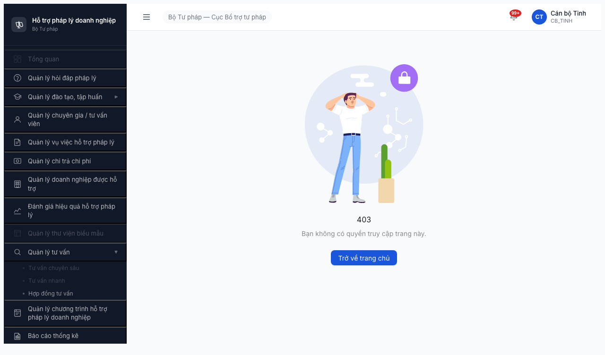
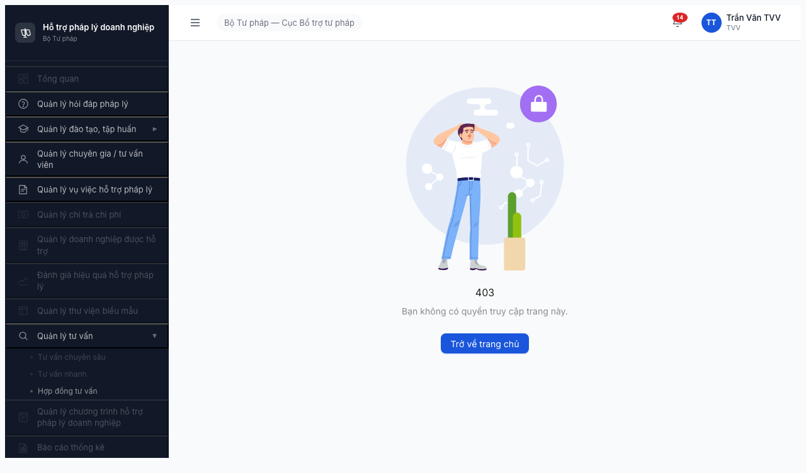
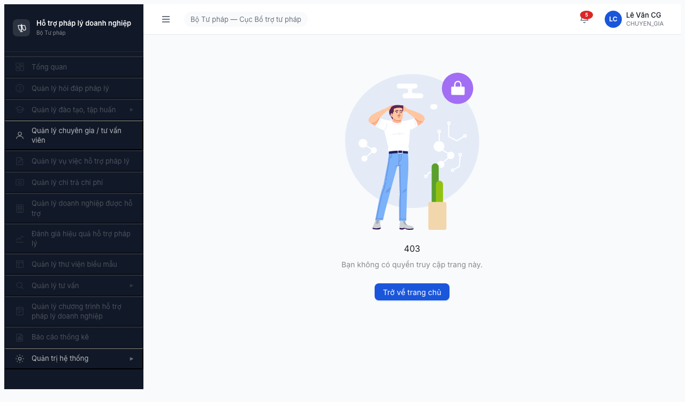

# Bug Report — FR-12 Tư vấn Chuyên sâu (Section 8.3 Permission Matrix)

| Thông tin | Giá trị |
|-----------|---------|
| **Dự án** | PM HTPLDN — Phần mềm Hỗ trợ Pháp lý Doanh nghiệp |
| **Phiên bản** | 1.0 |
| **Môi trường** | http://103.172.236.130:3000/ (OTP bypass `666666`, MailHog `/8025`) |
| **Người test** | QA Automation via Claude Code (Opus 4.7 · 1M context) |
| **Ngày** | 22:30 — 2026-04-19 |
| **Loại test** | Permission Matrix (Authorization) |
| **Round** | round2_2026-04-16 |
| **Tài liệu tham chiếu** | [permission-matrix.md §12](../../../permission-matrix.md) · [test-strategy.md §1.2, §5, §9](../../../test-strategy.md) · [funtion/7.12-tu-van-chuyen-sau.md](../../../funtion/7.12-tu-van-chuyen-sau.md) · [Functional report](functional-test-report-section-8.3.md) |

---

## Tổng hợp

Phát hiện **2** lỗi trong quá trình test permission matrix FR-12 Tư vấn Chuyên sâu (11 role × 4 entity, 2/11 ô PASS = 18%).

| Tổng | Critical | Major | Medium | Minor | Trivial |
|------|----------|-------|--------|-------|---------|
| 2    | 1        | 1     | 0      | 0     | 0       |

## Bug Summary Table

| Bug ID | Severity | Priority | Type | Module | TC Ref | Title | Status |
|--------|----------|----------|------|--------|--------|-------|--------|
| BUG-PERM-M8.3-001 | Major | P1 | Permission | FR-12 Tư vấn Chuyên sâu | PM-M8.3-QTHT-TVCS | QTHT thấy nút `+ Tạo mới` trên list TVCS (vi phạm 👁️ R spec) | Open |
| BUG-PERM-M8.3-002 | Critical | P0 | Permission | FR-12 Tư vấn Chuyên sâu | PM-M8.3-8ROLES-TVCS | Menu "Tư vấn chuyên sâu" bị disable UI cho 8 role (block CG primary user) — module không vận hành | Open |

> **Chú thích Type:**
> - `Happy` — luồng chính thành công (input hợp lệ, thao tác đúng)
> - `Negative` — input/thao tác sai (sai format, thiếu field, vượt giới hạn)
> - `Edge` — giá trị biên (min/max, boundary, giá trị đặc biệt)
> - `Workflow` — chuyển trạng thái (state machine transition)
> - `Permission` — phân quyền (role × action × data scope)
> - `Data` — toàn vẹn dữ liệu (soft delete, sync, duplicate)
> - `UI/UX` — giao diện, hiển thị, tương tác
> - `Performance` — thời gian phản hồi, tải trang

> **Chú thích Severity:**
> - `Critical` — hệ thống/tính năng chính không dùng được, lộ dữ liệu, sai nghiệp vụ nghiêm trọng
> - `Major` — tính năng quan trọng lỗi nhưng có workaround
> - `Medium` — tính năng phụ lỗi, không block nghiệp vụ chính
> - `Minor` — lỗi nhỏ, không ảnh hưởng nghiệp vụ
> - `Trivial` — lỗi hiển thị, typo, cảnh báo deprecated

> **Chú thích Priority:**
> - `P0` — phải fix ngay (block release)
> - `P1` — fix trong sprint hiện tại
> - `P2` — fix trong 2-3 sprint tới
> - `P3` — fix khi có thời gian
> - `P4` — backlog

---

## BUG-PERM-M8.3-001 — QTHT thấy nút `+ Tạo mới` trên list Tư vấn Chuyên sâu (vi phạm 👁️ R spec)

| Trường | Chi tiết |
|--------|----------|
| **Bug ID** | BUG-PERM-M8.3-001 |
| **Severity** | Major |
| **Priority** | P1 |
| **Type** | Permission |
| **Status** | Open |
| **Module** | FR-12 Tư vấn Chuyên sâu |
| **Thành phần** | FE ability-rule cho role QTHT trên entity `TU_VAN_CHUYEN_SAU` (nghi: `src/config/permissions/*` hoặc CASL ability builder) |
| **URL** | http://103.172.236.130:3000/tv-chuyen-sau/danh-sach |
| **Trình duyệt** | Chromium 1208 (Playwright headless 1280×720) |
| **Tài khoản** | `qtht_tw` (QTHT, Cục BTTP, TW) |
| **TC Reference** | PM-M8.3-QTHT-TVCS |
| **SRS Reference** | `permission-matrix.md §12` (QTHT × TU_VAN_CHUYEN_SAU = 👁️ R) · `§9.2 Ghi chú` · BR-AUTH-09 |
| **Assignee** | FE Team |
| **Found by** | QA Automation |

### Mô tả

QTHT (role quản trị) login vào app, mở list Tư vấn Chuyên sâu → toolbar hiển thị nút `+ Tạo mới` (primary blue) — vi phạm spec matrix §12 (QTHT = **👁️ R** read-only trên entity nghiệp vụ). Risk: admin có thể tạo bản ghi TVCS giả → workflow contamination.

### Các bước tái hiện

1. Truy cập http://103.172.236.130:3000/login
2. Login `qtht_tw` / `Test@1234` + OTP `666666`
3. Sau OTP → landing `/dashboard`
4. Click sidebar "Quản lý tư vấn" → click "Tư vấn chuyên sâu"
5. Chờ list load (`/tv-chuyen-sau/danh-sach`)
6. Quan sát toolbar bên dưới tabs (Tất cả / Mới tiếp nhận / Đang xử lý / Hoàn tất)

### Kết quả mong đợi

Toolbar chỉ có action read-only (theo spec 👁️ R + BR-AUTH-09 "QTHT Read-only trên entity nghiệp vụ"):

- Tìm kiếm
- Xóa bộ lọc
- Xuất Excel
- Làm mới

**KHÔNG có** `+ Tạo mới`, `Sửa`, `Xóa`.

### Kết quả thực tế

Toolbar hiển thị:

- Tìm kiếm ✅
- Xóa bộ lọc ✅
- **`+ Tạo mới` (primary blue button)** ❌ — sai spec
- Xuất Excel ✅
- Làm mới ✅

List empty (0 bản ghi) → không kiểm được icon Sửa/Xóa per row, nhưng với pattern lặp ở M5/M6/M7 thì khả năng cao các icon CUD cũng bị leak.

### Bằng chứng


Screenshot khác: [02-qtht_tw-tvcs-list.png](screenshots/02-qtht_tw-tvcs-list.png)

**JSON captured state:**
```json
{
  "avatar": "QTHT_TW",
  "buttons": ["Tìm kiếm", "Xóa bộ lọc", "Tìm kiếm", "Tạo mới", "Xuất Excel", "Làm mới"],
  "hasCreate": true,
  "hasExport": true,
  "tableRows": 0
}
```

### Tác động (Impact)

- 100% QTHT account thấy nút Tạo mới → có thể tạo TVCS giả nếu cố tình.
- Vi phạm **BR-AUTH-09** (QTHT Read-only trên entity nghiệp vụ).
- Lặp pattern với 4 bug đã báo: M5-001 (Chi trả), M6-001 (DN), M7-001 (BIEU_MAU/BAO_CAO), M8.1-001 (Đào tạo) → **cross-module tech debt**.

### So sánh (Comparison)

| Role | List TVCS | + Tạo mới | Xuất Excel |
|------|-----------|-----------|------------|
| QTHT (expected 👁️ R) | ✅ | ❌ **BUG — có nút** | ✅ |
| CB_NV_TW (expected ✅ CRUD*) | ❌ menu disabled | n/a | n/a |
| CG (expected ✅ CRU*) | ❌ menu disabled | n/a | n/a |

### Nguyên nhân nghi ngờ (Root Cause)

FE ability-rule cho role QTHT trên các entity nghiệp vụ chưa disable action `create`. Pattern lặp giống 4 bug cross-module → nghi 1 nơi config chung QTHT thiếu rule `cannot('create', ...)` cho tất cả entity nghiệp vụ, chỉ áp dụng cho entity master (DANH_MUC, TAI_KHOAN, VAI_TRO, ...).

### Gợi ý sửa (Suggested Fix)

Thêm rule CASL cho QTHT role:

```js
// ability/qtht.ts (hoặc tương đương)
// QTHT chỉ được Read trên entity nghiệp vụ
['TU_VAN_CHUYEN_SAU', 'PHIEN_TU_VAN', 'LICH_SU_TRAO_DOI_TV', 'KHO_CAU_HOI',
 'HO_SO_CHI_TRA', 'DOANH_NGHIEP', 'BIEU_MAU', 'KHOA_HOC', /* ... */].forEach(entity => {
-  can(['read', 'create', 'update', 'delete'], entity);
+  can('read', entity);
+  cannot(['create', 'update', 'delete'], entity);
});
```

Hoặc fix 1 chỗ logic ability builder tổng:
1. Kiểm tra `role.code === 'QTHT'` 
2. Với list entity nghiệp vụ (9 entity thuộc §2-§8.3 permission-matrix) → chỉ allow `read`

Fix 1 chỗ → unblock 5 module cross-section (M5/M6/M7/M8.1/M8.3).

---

## BUG-PERM-M8.3-002 — Menu "Tư vấn chuyên sâu" bị disable UI cho 8/11 role (block CG primary user, module không vận hành)

| Trường | Chi tiết |
|--------|----------|
| **Bug ID** | BUG-PERM-M8.3-002 |
| **Severity** | Critical |
| **Priority** | P0 |
| **Type** | Permission |
| **Status** | Open |
| **Module** | FR-12 Tư vấn Chuyên sâu |
| **Thành phần** | FE sidebar menu config "Tư vấn chuyên sâu" (nghi: `src/config/sidebar/*` menu role filter) + BE route guard `/tv-chuyen-sau/*` (nghi: middleware permission check) |
| **URL** | http://103.172.236.130:3000/tv-chuyen-sau/danh-sach (click sidebar "Tư vấn chuyên sâu") |
| **Trình duyệt** | Chromium 1208 (Playwright headless 1280×720) |
| **Tài khoản** | 8 accounts (CB_NV × 3 + CB_PD × 3 + TVV + CG) — xem Phụ lục B |
| **TC Reference** | PM-M8.3-8ROLES-TVCS |
| **SRS Reference** | `permission-matrix.md §12` · `funtion/7.12-tu-van-chuyen-sau.md` (CG là primary actor) · BR-AUTH-01~11 |
| **Assignee** | FE Team + BE Team (ability rule FE + permission check BE) |
| **Found by** | QA Automation |

### Mô tả

8 role có quyền ≠ ❌ trên entity TU_VAN_CHUYEN_SAU (theo matrix §12) đều thấy sub-menu "Tư vấn chuyên sâu" bị **GRAYED OUT** ở sidebar — không click được. CG (Chuyên gia — **primary actor** của module theo SRS §7.12) thì cả parent menu "Quản lý tư vấn ▶" cũng disabled. Click thẳng URL `/tv-chuyen-sau/danh-sach` → BE redirect `/403`. **Module Tư vấn Chuyên sâu effectively không vận hành được** — chỉ QTHT vào list xem (và vẫn có bug M8.3-001).

### Các bước tái hiện

Áp dụng cho mỗi role (ví dụ đại diện: `canbo_tw`):

1. Cleanup browse: `$B stop` + kill playwright/chromium + `rm -rf ~/.gstack/chromium-profile`
2. Truy cập http://103.172.236.130:3000/login
3. Login `canbo_tw` / `Test@1234` + OTP `666666`
4. Sau OTP → landing `/403` (expected cho CB_* per CLAUDE.md Rule 5)
5. Click sidebar "Quản lý tư vấn" → menu expand, sub-menu hiển thị
6. Quan sát sub-menu "Tư vấn chuyên sâu" + click thử
7. Lặp lại bước 1-6 với 7 account còn lại (canbo_bn, canbo_tinh, lanhdao_tw/bn/dp, tvv_user, chuyengia_user)

### Kết quả mong đợi

Sub-menu "Tư vấn chuyên sâu" **enabled** (clickable, font đen, cursor pointer) cho 8 role có quyền ≠ ❌:

| Role | Spec quyền TVCS (matrix §12) | UI mong đợi |
|------|------------------------------|-------------|
| CB_NV_TW | ✅ CRUD* toàn quốc | Menu enabled, list full CRUD |
| CB_NV_BN | ✅ CRUD* scope BN | Menu enabled, list scoped BN |
| CB_NV_DP | ✅ CRUD* scope DP | Menu enabled, list scoped DP |
| CB_PD_TW | 📝 RU* | Menu enabled, list RU (không Create/Delete) |
| CB_PD_BN | 📝 RU* scope BN | Menu enabled, list scoped BN, RU |
| CB_PD_DP | 📝 RU* scope DP | Menu enabled, list scoped DP, RU |
| TVV | 👁️ R* | Menu enabled, list read-only scoped |
| **CG** (primary) | **✅ CRU*** | Menu enabled, list CRU (Tạo + Sửa, không Xóa) |

### Kết quả thực tế

- **CB_NV × 3, CB_PD × 3, TVV:** Sub-menu "Tư vấn chuyên sâu" **GRAYED OUT** (CSS `cursor: not-allowed`, font gray, click timeout 5000ms). Click thẳng URL `/tv-chuyen-sau/danh-sach` → redirect `/403`.
- **CG:** **Cả parent menu "Quản lý tư vấn ▶" cũng grayed out** → CG không biết module tồn tại. Click timeout + `/403`.

### Bằng chứng

| Role | Screenshot |
|------|-----------|
| canbo_tw (CB_NV_TW) |  |
| canbo_bn (CB_NV_BN) |  |
| canbo_tinh (CB_NV_DP) |  |
| lanhdao_tw (CB_PD_TW) |  |
| lanhdao_bn (CB_PD_BN) |  |
| lanhdao_dp (CB_PD_DP) |  |
| tvv_user (TVV) |  |
| **chuyengia_user (CG)** |  |

**JSON captured state (đại diện canbo_tw):**
```json
{
  "avatar": "CB_TW",
  "buttons": ["Trở về trang chủ"],
  "hasCreate": false,
  "tableRows": 0,
  "url": "http://103.172.236.130:3000/403"
}
```

### Tác động (Impact)

- **CG (Chuyên gia) là primary actor** module Tư vấn Chuyên sâu theo SRS §7.12 (CG tạo/cập nhật nội dung tư vấn, nhận phân công, trao đổi với DN). CG không vào được → **module Tư vấn Chuyên sâu KHÔNG VẬN HÀNH được end-to-end**.
- CB_NV × 3 cấp không tạo được TVCS → **workflow đứng ngay từ khâu tiếp nhận (state MOI/TIEP_NHAN)**.
- CB_PD × 3 cấp không phê duyệt được → **SM-TVCS kẹt ở state CHO_PHE_DUYET** (BR-FLOW-04 không thực hiện được).
- TVV không xem được TVCS đã phân công → vi phạm BR-AUTH-10.
- **32/44 ô ma trận (73%) không verify được** do UI gating.
- Nghiệp vụ tư vấn chuyên sâu trên Cổng PLQG không thực hiện được (UC149 Tiếp nhận TVCS từ API, UC150 Phân công CG, UC151 Gửi câu hỏi CG, UC152 CG trả lời).

### So sánh (Comparison)

| Role | Sub-menu "Tư vấn chuyên sâu" | URL `/tv-chuyen-sau/danh-sach` | Kết luận |
|------|------------------------------|--------------------------------|----------|
| QTHT | ✅ Enabled | ✅ 200 + list | ⚠️ PASS access (có bug M8.3-001) |
| CB_NV_TW | ❌ Grayed out | ❌ /403 | ❌ FAIL |
| CB_NV_BN | ❌ Grayed out | ❌ /403 | ❌ FAIL |
| CB_NV_DP | ❌ Grayed out | ❌ /403 | ❌ FAIL |
| CB_PD_TW | ❌ Grayed out | ❌ /403 | ❌ FAIL |
| CB_PD_BN | ❌ Grayed out | ❌ /403 | ❌ FAIL |
| CB_PD_DP | ❌ Grayed out | ❌ /403 | ❌ FAIL |
| DN | ⚠️ Parent menu disabled | ❌ /403 | ✅ PASS (DI-09 API only) |
| NHT | ⚠️ Parent menu disabled | ❌ /403 | ✅ PASS (spec ❌) |
| TVV | ❌ Grayed out | ❌ /403 | ❌ FAIL |
| **CG (primary)** | ❌ **Parent menu cũng disabled** | ❌ /403 | ❌ **FAIL Critical** |

### Severity justification (Critical)

Theo `test-strategy.md §10.2`:
- **Critical** = "Chức năng chính không hoạt động, workflow bị stuck"
- Bug này khiến **workflow TVCS end-to-end không chạy được** (CG không trả lời, CB_NV không tiếp nhận, CB_PD không duyệt).
- CG là primary user → **module effectively không dùng được**.
- Đủ điều kiện Critical + P0.

### Nguyên nhân nghi ngờ (Root Cause)

FE sidebar menu config `Tư vấn chuyên sâu` đang hardcode chỉ enable cho role `QTHT`. Các role khác fail ở 2 layer:
1. **FE UI layer** — ability rule menu chặn → grayed out
2. **BE route guard layer** — permission check `/tv-chuyen-sau/*` chặn → redirect `/403` khi URL direct

(Cả 2 layer cùng fail nên không phải chỉ FE — BE cũng thiếu permission seed cho 8 role trên resource `TU_VAN_CHUYEN_SAU`.)

Pattern lặp với **BUG-PERM-M7-002/003/004/005** (BIEU_MAU menu disabled 8 role). Fix cùng hướng.

### Gợi ý sửa (Suggested Fix)

**FE:**
```js
// src/config/sidebar/menu-tu-van.ts (hoặc tương đương)
{
  key: 'tu-van-chuyen-sau',
  label: 'Tư vấn chuyên sâu',
- permission: ['QTHT'],
+ permission: ['QTHT', 'CB_NV_TW', 'CB_NV_BN', 'CB_NV_DP',
+               'CB_PD_TW', 'CB_PD_BN', 'CB_PD_DP', 'TVV', 'CG'],
  route: '/tv-chuyen-sau/danh-sach'
}
```

**BE:**
```sql
-- Migration seed permissions cho TU_VAN_CHUYEN_SAU
INSERT INTO role_permissions (role_code, resource, action) VALUES
  ('CB_NV_TW', 'TU_VAN_CHUYEN_SAU', 'create,read,update,delete'),
  ('CB_NV_BN', 'TU_VAN_CHUYEN_SAU', 'create,read,update,delete'),  -- + scope BN
  ('CB_NV_DP', 'TU_VAN_CHUYEN_SAU', 'create,read,update,delete'),  -- + scope DP
  ('CB_PD_TW', 'TU_VAN_CHUYEN_SAU', 'read,update'),
  ('CB_PD_BN', 'TU_VAN_CHUYEN_SAU', 'read,update'),  -- + scope BN
  ('CB_PD_DP', 'TU_VAN_CHUYEN_SAU', 'read,update'),  -- + scope DP
  ('TVV', 'TU_VAN_CHUYEN_SAU', 'read'),  -- scoped theo phân công
  ('CG', 'TU_VAN_CHUYEN_SAU', 'create,read,update');  -- scoped theo phân công
-- Tương tự cho PHIEN_TU_VAN, LICH_SU_TRAO_DOI_TV, KHO_CAU_HOI
```

**ETA:** 1-2 giờ dev (FE 1 dòng config + BE 1 migration 4 entity × 8 role).

Sau fix → re-test 44 ô ma trận để verify CRUD + scoping.

---

## Phụ lục

### A — Môi trường test

| Thành phần | Giá trị |
|------------|---------|
| URL ứng dụng | http://103.172.236.130:3000/ |
| OTP login | `666666` (bypass cố định — config tạm thời) |
| MailHog (OTP inbox) | http://103.172.236.130:8025 (fallback khi bypass tắt) |
| API base | http://103.172.236.130:3000/api/v1/ |
| Frontend | React + Vite + Ant Design (chế độ SSR chậm) |
| Xác thực | JWT + OTP (email) |
| Trình duyệt | Chromium headless (gstack browse, Playwright) 1280×720 |
| OS tester | macOS Darwin 24.5.0 |

### B — Tài khoản sử dụng

| Tên đăng nhập | Vai trò | Cấp | Đơn vị | Dùng cho bug nào |
|---------------|---------|-----|--------|------------------|
| qtht_tw | QTHT | TW | Cục BTTP | BUG-PERM-M8.3-001 |
| canbo_tw | CB_NV | TW | Cục BTTP | BUG-PERM-M8.3-002 |
| canbo_bn | CB_NV | BN | Bộ KH&ĐT | BUG-PERM-M8.3-002 |
| canbo_tinh | CB_NV | DP | Sở TP HN | BUG-PERM-M8.3-002 |
| lanhdao_tw | CB_PD | TW | Cục BTTP | BUG-PERM-M8.3-002 |
| lanhdao_bn | CB_PD | BN | Bộ KH&ĐT | BUG-PERM-M8.3-002 |
| lanhdao_dp | CB_PD | DP | Sở TP HN | BUG-PERM-M8.3-002 |
| tvv_user | TVV | Portal | — | BUG-PERM-M8.3-002 |
| chuyengia_user | CG | Portal | — | BUG-PERM-M8.3-002 (primary user) |

(Mật khẩu chung `Test@1234` trừ `admin` có `Test@1234` — không dùng trong đợt này.)

### C — Danh mục ảnh chụp

| File | Mô tả | Dùng cho bug |
|------|-------|--------------|
| [R-01-qtht_tw.png](screenshots/R-01-qtht_tw.png) | QTHT truy cập list TVCS, toolbar có `+ Tạo mới` | BUG-PERM-M8.3-001 |
| [02-qtht_tw-tvcs-list.png](screenshots/02-qtht_tw-tvcs-list.png) | QTHT baseline (chain đầu tiên xác nhận reproducibility) | BUG-PERM-M8.3-001 |
| [R-02-canbo_tw.png](screenshots/R-02-canbo_tw.png) | canbo_tw sub-menu TVCS grayed out, /403 | BUG-PERM-M8.3-002 |
| [R-03-canbo_bn.png](screenshots/R-03-canbo_bn.png) | canbo_bn sub-menu TVCS grayed out, /403 | BUG-PERM-M8.3-002 |
| [R-04-canbo_tinh.png](screenshots/R-04-canbo_tinh.png) | canbo_tinh sub-menu TVCS grayed out, /403 | BUG-PERM-M8.3-002 |
| [R-05-lanhdao_tw.png](screenshots/R-05-lanhdao_tw.png) | lanhdao_tw sub-menu TVCS grayed out, /403 | BUG-PERM-M8.3-002 |
| [R-06-lanhdao_bn.png](screenshots/R-06-lanhdao_bn.png) | lanhdao_bn sub-menu TVCS grayed out, /403 | BUG-PERM-M8.3-002 |
| [R-07-lanhdao_dp.png](screenshots/R-07-lanhdao_dp.png) | lanhdao_dp sub-menu TVCS grayed out, /403 | BUG-PERM-M8.3-002 |
| [R-08-dn_user.png](screenshots/R-08-dn_user.png) | DN parent menu disabled, /403 (expected DI-09) | Reference (PASS case) |
| [R-09-nht_user.png](screenshots/R-09-nht_user.png) | NHT parent menu disabled, /403 (expected ❌) | Reference (PASS case) |
| [R-10-tvv_user.png](screenshots/R-10-tvv_user.png) | TVV sub-menu TVCS grayed out, /403 | BUG-PERM-M8.3-002 |
| [R-11-chuyengia_user.png](screenshots/R-11-chuyengia_user.png) | **CG parent menu Quản lý tư vấn disabled**, /403 | BUG-PERM-M8.3-002 (primary) |
| [01-qtht_tw-tuvan-menu.png](screenshots/01-qtht_tw-tuvan-menu.png) | Map sidebar "Quản lý tư vấn" expand (QTHT only) | Reference |

---

## Ưu tiên fix

1. **BUG-PERM-M8.3-002 (Critical, P0)** — fix FE sidebar menu permission + BE seed role_permissions cho 4 entity × 8 role. Unblock 32/44 ô ma trận. Cho phép CG thực thi nghiệp vụ chính. **ETA: 1-2 giờ dev.**
2. Sau khi fix M8.3-002 + dev seed ≥2 TVCS/state (7 state × 2 = 14 bản ghi) → **re-run permission test** để verify 44 ô ma trận đầy đủ (bao gồm CRUD scope, icon Sửa/Xóa per row, PHIEN_TU_VAN + LICH_SU_TRAO_DOI_TV qua detail).
3. **BUG-PERM-M8.3-001 (Major, P1)** — fix chung batch QTHT write UI cross-module (M5-001/M6-001/M7-001/M8.1-001/M8.3-001). 1 rule CASL cho QTHT role → unblock 5 module. **ETA: 30 phút dev.**

---

*Bug report generated: 2026-04-19 | QA Automation via Claude Code (Opus 4.7 · 1M context)*
