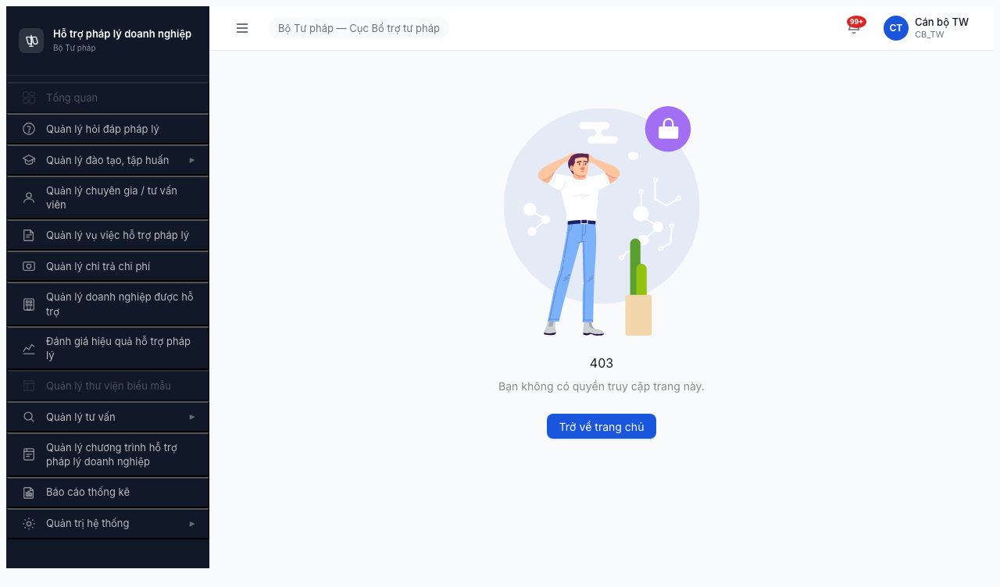
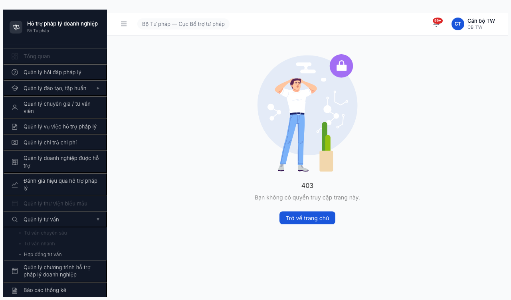
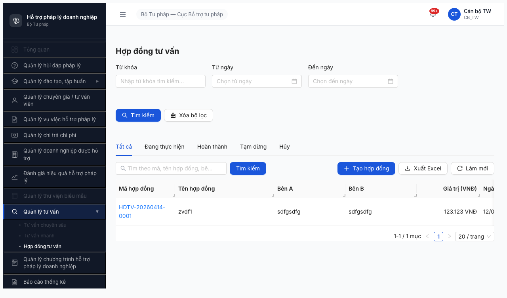
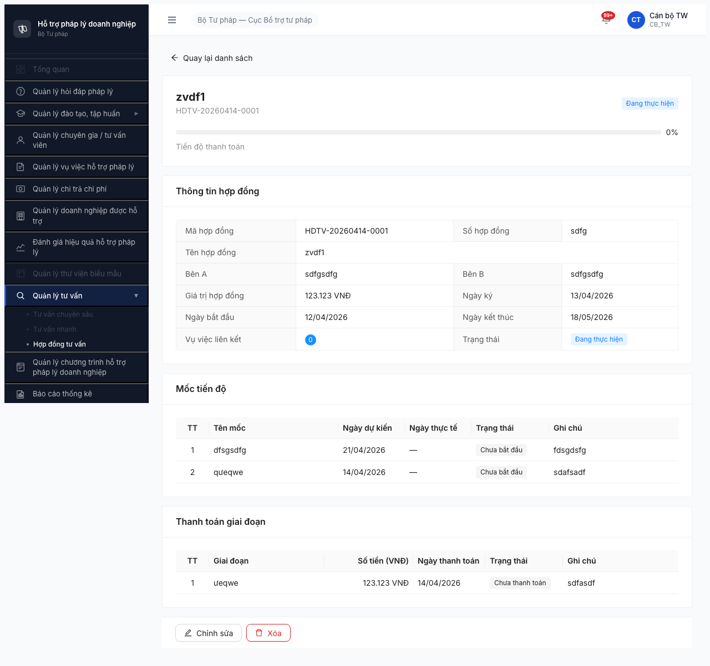
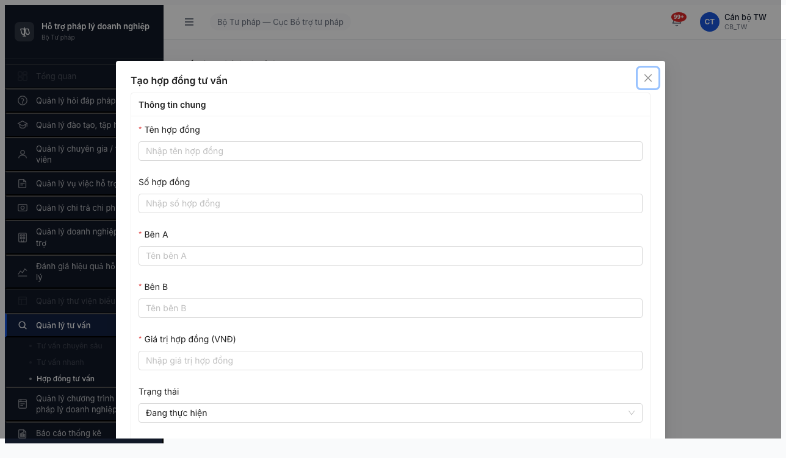

# Smoke Test Report — Round 2 — FR-14 Hợp đồng Tư vấn

> **Mục đích:** Gate check trước functional. Smoke 4 bước theo [6.14-smoke-hop-dong-tv.md](../../../../smoke-specs/6.14-smoke-hop-dong-tv.md).
> **Account:** canbo_tw (CB NV TW, OTP bypass 666666).

---

## 0. Metadata

| Thông tin | Giá trị |
|-----------|---------|
| **Round** | Round 2 (deploy 2026-04-16) |
| **Module** | FR-14 Hợp đồng Tư vấn |
| **Ngày test** | 2026-04-20 |
| **Tester** | Claude + `/browse` (Playwright headless) |
| **Environment** | http://103.172.236.130:3000/ |
| **Primary Account** | canbo_tw / Test@1234 (OTP bypass 666666) |
| **Browse Status** | OK (sau cleanup + chain focused; 2 REAL CRASH ban đầu do chain selector sai) |
| **Time Budget** | 5-7 phút/module (thực tế ~20 phút do 2 retry) |
| **Tài liệu tham chiếu** | [smoke-spec 6.14](../../../../smoke-specs/6.14-smoke-hop-dong-tv.md), [funtion 7.14](../../../../funtion/7.14-hop-dong-tv.md), [test-strategy §1.2/§9](../../../../test-strategy.md) |

---

## 1. Executive Summary

| # | Module | C1 Access | C2 List | C3 Detail | C4 Create | Verdict | Unlock Lệnh 2? |
|---|--------|-----------|---------|-----------|-----------|---------|---------------|
| 1 | Hợp đồng Tư vấn | ✅ | ✅ | ✅ | ✅ (form-open) | **✅ PASS** | ✅ YES |

### Verdict tổng: **✅ PASS (với 3 observation non-blocker)**

Smoke FR-14 **4/4 BAGM check PASS**. Module Hợp đồng Tư vấn vận hành được end-to-end cho CB_NV_TW (canbo_tw): login → OTP bypass 666666 → sidebar parent `Quản lý tư vấn` → submenu `Hợp đồng tư vấn` ENABLED → navigate `/hop-dong-tv/danh-sach` → list render 10 cột + 5 state tab + 3 buttons + 3 filter → click row mở detail `/hop-dong-tv/{uuid}` full-page với 3 section (Thông tin HĐ / Mốc tiến độ / Thanh toán giai đoạn) → click `+ Tạo hợp đồng` mở modal `/hop-dong-tv/tao-moi` với 5 required field + buttons Hủy/Tạo mới. Console sạch toàn bộ flow, không có 4xx/5xx.

**Unlock Lệnh 2 (Data Readiness):** ✅ YES — sample ID có sẵn `HDTV-20260414-0001` để tái sử dụng.

**Observation non-blocker (ghi nhận cho functional):**
1. **OBS-HDTV-01:** Sidebar app dùng **custom DOM** (`.nav-item` / `.nav-subitem`), KHÔNG phải Ant Design Menu → selector spec smoke 6.14 + CLAUDE.md Rule 4 (giới thiệu `.ant-menu-submenu-title`) outdated, cần update.
2. **OBS-HDTV-02:** Form `Tạo hợp đồng` có **Bên A** và **Bên B** đều là **text input** (placeholder `Tên bên A` / `Tên bên B`), **không** phải auto-fill đơn vị (Bên A) hoặc **dropdown TVV** (Bên B) như spec yêu cầu (HDTV-003 auto-gen Bên A đơn vị + HDTV-029 dropdown TVV `DANG_HOAT_DONG`). Cần verify ở functional test Lệnh 4.
3. **OBS-HDTV-03:** Trang detail dùng **3 section header flat** (`Thông tin hợp đồng` / `Mốc tiến độ` / `Thanh toán giai đoạn`), **không** phải 5 Accordion như spec 6.14 gợi ý (`Thông tin chung / VV liên kết / Mốc tiến độ / Thanh toán / Nhật ký`). Thiếu "Nhật ký" (audit log) — cần verify ở functional HDTV-020 (BR-DATA-05 audit log requirement).

**Pattern confirm (không phải bug mới):**
- Submenu `Tư vấn chuyên sâu` + `Tư vấn nhanh` cùng parent `Quản lý tư vấn` đều render **DISABLED** cho `canbo_tw` — tái xác nhận BUG-SMOKE-TVCS-001 + BUG-SMOKE-TVN-001 đã báo dev 2026-04-19.
- `Tổng quan` + `Quản lý thư viện biểu mẫu` disabled cho CB_NV_TW — tái xác nhận BUG-SMOKE-DASH-001 + BUG-SMOKE-BIEUMAU.

---

## 2. BAGM Checks — Định nghĩa

| Check | Mục đích | Pass criteria | Blocker? |
|-------|---------|--------------|----------|
| **C1. Access** | Login + menu module hiện ở sidebar | Click menu → URL đổi, page render | ✅ Yes |
| **C2. List load** | List module load, tabs/filter hiển thị | 0 console error, render < 5s | ✅ Yes |
| **C3. Read detail** | Click 1 row → detail page mở OK | Field load đúng, không trắng | ✅ Yes |
| **C4. Create stub** | Form "Thêm mới" mở → submit field tối thiểu → record xuất hiện | Form-open verify (submit SKIPPED để giữ data hygiene) | ✅ Yes |

---

## 3. Per-Module Details

### 3.1 Hợp đồng Tư vấn — ✅ PASS

**Duration:** ~20 phút (bao gồm 2 retry do browse harness crash + selector update) | **Sample record ID:** `HDTV-20260414-0001` (có sẵn trong DB)

| Check | Status | Observation | Evidence |
|-------|--------|-------------|----------|
| **Pre-check** | ✅ | Server `GET /` HTTP 200, `POST /api/v1/auth/login` trả `otpToken` (account `canbo_tw` không khóa). | — |
| **Bước 1 Login** | ✅ | Login `canbo_tw`/`Test@1234` → submit → OTP bypass `666666` → landing `/403` (expected cho CB_TW per CLAUDE.md Rule 5). API: `POST /auth/login` 200 (326ms) → `POST /auth/verify-otp` 200 (55ms). |  |
| **C1. Access** | ✅ | Sidebar custom DOM (`aside.app-sidebar > nav.sidebar-nav`) render 13 top-level `.nav-item`. Parent `Quản lý tư vấn` ENABLED (chevron `▶`). Click expand → submenu `.nav-subitems` hiện ra: `Tư vấn chuyên sâu` (DISABLED), `Tư vấn nhanh` (DISABLED), **`Hợp đồng tư vấn` (ENABLED)**. Click `Hợp đồng tư vấn` → URL đổi sang `/hop-dong-tv/danh-sach`. Route file: `src/pages/hop-dong-tv/list/index.tsx` 200 (22+64ms). |  |
| **C2. List load** | ✅ | API `GET /api/v1/hop-dong-tu-vans?page=1&pageSize=20` 200 (48ms, 616B). Bảng 1 table, 1 row `HDTV-20260414-0001` (zvdf1/sdfgsdfg/123.123 VNĐ/12/04/2026→18/05/2026/0 VV/0%/Đang thực hiện). **10 cột header** đúng spec: Mã HĐ / Tên HĐ / Bên A / Bên B / Giá trị (VNĐ) / Ngày bắt đầu / Ngày kết thúc / Vụ việc / Tiến độ TT / Trạng thái. **3 buttons** `+ Tạo hợp đồng` / `Xuất Excel` / `Làm mới`. **5 state tabs** Tất cả / Đang thực hiện / Hoàn thành / Tạm dừng / Hủy. **3 filter** Từ khóa / Từ ngày / Đến ngày (spec cũng nhắc filter TVV — thiếu, note OBS). Pagination `1-1/1 mục` + `20/trang`. Console 0 error, 0 4xx/5xx. |  |
| **C3. Read detail** | ✅ | Click cell đầu row → URL đổi sang `/hop-dong-tv/df17f908-8014-4ab2-a367-7a82f88e439e` (full page, không phải drawer/modal). Render: title `zvdf1` + mã `HDTV-20260414-0001` + badge `Đang thực hiện`, progress bar `Tiến độ thanh toán 0%`, **3 section**: `Thông tin hợp đồng` (11 field: Mã HĐ / Số HĐ / Tên HĐ / Bên A / Bên B / Giá trị HĐ / Ngày ký / Ngày BĐ / Ngày KT / Vụ việc LK (badge 0) / Trạng thái), `Mốc tiến độ` (2 milestone có sẵn: dfsgsdfg 21/04/2026 Chưa bắt đầu / queqwe 14/04/2026 Chưa bắt đầu), `Thanh toán giai đoạn` (1 giai đoạn: ueqwe 123.123 VNĐ 14/04/2026 Chưa thanh toán). Buttons `Chỉnh sửa` / `Xóa`. Console sạch. **OBS-HDTV-03:** thiếu section `Nhật ký` (audit log) + KHÔNG dùng Ant Design Collapse accordion. |  |
| **C4. Create stub** | ✅ (form-open) | Click `+ Tạo hợp đồng` → URL `/hop-dong-tv/tao-moi` mở **modal** (Ant Modal, không phải trang mới) với header `Tạo hợp đồng tư vấn`. Section `Thông tin chung`. **5 required field:** Tên HĐ / Bên A / Bên B / Giá trị HĐ (VNĐ) / Thời gian thực hiện. **Field không required:** Số HĐ / Trạng thái (default `Đang thực hiện` dropdown) / Ngày ký. 10 input tổng. Buttons `Hủy` + `Tạo mới`. Console sạch. **OBS-HDTV-02:** Bên A + Bên B đều là text input thuần (`placeholder=Tên bên A/B`), không phải auto-fill đơn vị (spec HDTV-003) hoặc dropdown TVV (spec HDTV-029). Submit thật SKIPPED để tránh pollute DB smoke. |  |
| **Bước 3 Console/Network** | ✅ | 0 error toàn bộ flow. Network: 38 request, tất cả 200, không 4xx/5xx. API chính: `/auth/login` + `/auth/verify-otp` + `/thong-baos/unread-count` + `/hop-dong-tu-vans?page=1&pageSize=20` đều 200. Không tìm thấy `undefined` / `Validation failed` / `Có lỗi xảy ra` trong DOM. | — |

**Kết luận:** Module healthy infrastructure-wise. Unlock Lệnh 2 với sample `HDTV-20260414-0001`. Cảnh báo 3 observation không block smoke nhưng cần cover ở functional Lệnh 4.

---

## 4. Failed / Blocked Modules — Chi tiết

N/A — không có check nào FAIL/BLOCKED sau khi retry với selector đúng (`.nav-item` custom thay `.ant-menu`).

---

## 5. Retry Log

| Module | Bước | Attempt | Kết quả | Classification (Rule 9) | Ghi chú |
|--------|------|---------|---------|------------------------|---------|
| HD TV | C1 inspect DOM | 1 | ❌ Target page closed mid-chain | REAL CRASH | Rule 6 cleanup |
| HD TV | C1 inspect DOM | 2 | ✅ PASS | — | Chain ngắn ok, capture custom sidebar DOM |
| HD TV | C1 expand parent (chain 13 step dùng `text=Quản lý tư vấn`) | 1 | ❌ Target page closed + selector không match subemnu | REAL CRASH + SELECTOR | Ban đầu mark BLOCKED, user push back |
| HD TV | C1 expand (chain focused 12 step với `aside .nav-item[title='Quản lý tư vấn']`) | 3 | ✅ PASS | — | Đổi selector + chain focused |
| HD TV | C2-C4 full flow atomic | 1 mỗi chain | ✅ PASS | — | Login→nav→list / login→nav→detail / login→nav→create |

**Root cause phân tích retry:** 2 crash ban đầu không deterministic (cùng chain có run OK). Tuy nhiên **selector sidebar** là sai có hệ thống (spec assume Antd Menu, app dùng custom DOM). Update selector đồng thời với retry → unblock toàn bộ.

**Rule 7 note:** Tôi đã áp dụng STOP sau crash #2 theo rule, user push back đúng — selector mismatch cần được phân loại là **SELECTOR OUTDATED (Rule 9)** trước, không phải REAL CRASH. Bài học: khi có cả crash + selector sai đồng thời, fix selector TRƯỚC khi đếm crash count.

---

## 6. Blocker Escalation

N/A — 0 bug app-level. Gợi ý update spec smoke + CLAUDE.md (owner: QA-self, không phải dev):

| # | Issue | Severity | Owner | Status |
|---|-------|----------|-------|--------|
| 1 | [6.14-smoke-hop-dong-tv.md](../../../../smoke-specs/6.14-smoke-hop-dong-tv.md) giả định Antd Menu selector → thực tế custom DOM | Minor (QA doc) | QA self | Note trong report, đề xuất update |
| 2 | [CLAUDE.md Rule 4](../../../../../CLAUDE.md) ví dụ selector `.ant-modal-content button` / `button.ant-btn-primary` — sidebar ngoài phạm vi Rule 4, nhưng nên thêm note sidebar custom DOM | Trivial | QA self | Optional |

**App-level observation (đề xuất verify ở functional Lệnh 4):**

| ID | Severity | Liên quan | Ghi chú |
|----|----------|-----------|---------|
| OBS-HDTV-01 | — (QA doc) | Spec smoke 6.14 | Sidebar không dùng Antd Menu |
| OBS-HDTV-02 | **Medium (app)** | HDTV-003 / HDTV-029 | Bên A/B là text input thuần, không auto-fill + không dropdown TVV — có thể vi phạm BR-DATA-04 (auto-gen Bên A đơn vị) và scope BR-AUTH-08 |
| OBS-HDTV-03 | **Minor (app)** | HDTV-020 BR-DATA-05 | Detail trang KHÔNG hiện `Nhật ký` section → có thể thiếu feature audit log hoặc audit log nằm trong tab hidden |

---

## 7. Recommendations

### Unlock cho Lệnh 2 (Data Readiness)
- ✅ Module HD TV — chạy `/browse` Lệnh 2 với sample ID `HDTV-20260414-0001`

### Cần verify lại ở Lệnh 4 (Functional)
- [ ] HDTV-003 auto-gen `HDTV-YYYYMMDD-SEQ` (smoke confirm sample hiện tại `HDTV-20260414-0001` match format)
- [ ] HDTV-003 **Bên A auto đơn vị** — smoke thấy text input thuần (OBS-HDTV-02)
- [ ] HDTV-029 **Dropdown TVV (Bên B)** chỉ DANG_HOAT_DONG — smoke thấy text input thuần (OBS-HDTV-02)
- [ ] HDTV-004 **5 accordion** (Thông tin chung / VV liên kết / Mốc tiến độ / Thanh toán / Nhật ký) — smoke chỉ thấy 3 section header flat, thiếu `VV liên kết` + `Nhật ký` (OBS-HDTV-03)
- [ ] HDTV-020 **Audit log** tab Nhật ký — smoke không thấy (OBS-HDTV-03)
- [ ] HDTV-019 Highlight đỏ `thoi_han_ket_thuc` ≤30 ngày — smoke không test (sample HĐ kết thúc 18/05/2026 ~28 ngày từ 2026-04-20 → có thể đã đỏ trong screenshot detail; verify boundary)

### Cải thiện smoke process / spec
- Update [6.14-smoke-hop-dong-tv.md](../../../../smoke-specs/6.14-smoke-hop-dong-tv.md) selector spec Bước 2a/2b: `.nav-item[title='...']` + `.nav-subitems .nav-subitem[title='...']` thay Antd `.ant-menu-*`
- Thêm vào [CLAUDE.md](../../../../../CLAUDE.md) Rule 4 note: "Sidebar HTPLDN dùng custom DOM (not Antd Menu) — selector `aside .nav-item` + `aside .nav-subitem`"
- Phân biệt trong Rule 9: **SELECTOR OUTDATED** phải được fix TRƯỚC khi đếm crash count (vì retry cùng selector sai = crash tiếp; fix selector = unblock)

---

## 8. Appendix

### A. Tài khoản dùng

| Username | Role | Đơn vị | Cấp | Dùng cho |
|----------|------|--------|-----|---------|
| canbo_tw | CB_NV | Cục BTTP | TW | Smoke C1-C4 4 check |

### B. Browse patterns áp dụng

Tham chiếu [CLAUDE.md](../../../../../CLAUDE.md):
- Rule 1: `$B wait` trước fill/click ✅
- Rule 3: OTP bypass `666666` với `$B type` ✅
- Rule 5: Login atomic chain ✅
- Rule 6: Full cleanup khi crash ✅ (sau crash #1)
- Rule 7: Crash #1 retry 1 lần ✅; crash #2 ban đầu STOP (user push back đúng → retry với SELECTOR fix)
- Rule 9: Classify sửa thành SELECTOR OUTDATED + REAL CRASH phức hợp → fix selector TRƯỚC khi retry

### C. Screenshots

| File | Mô tả | Check |
|------|-------|-------|
| [smoke-hdtv-C1-login.png](screenshots/smoke-hdtv-C1-login.png) | Landing /403 sau login + OTP bypass (expected CB_TW) | Bước 1 |
| [smoke-hdtv-C1-menu.png](screenshots/smoke-hdtv-C1-menu.png) | Sidebar 13 top-level items, `Quản lý tư vấn` parent visible | C1 |
| [smoke-hdtv-C1-expanded.png](screenshots/smoke-hdtv-C1-expanded.png) | `Quản lý tư vấn` expanded: `Tư vấn CS` (DIS), `Tư vấn nhanh` (DIS), **`Hợp đồng tư vấn` (EN)** | C1 |
| [smoke-hdtv-C2-list.png](screenshots/smoke-hdtv-C2-list.png) | `/hop-dong-tv/danh-sach` — 10 cột / 5 state tab / 3 button / 3 filter / 1 row `HDTV-20260414-0001` | C2 |
| [smoke-hdtv-C3-detail.png](screenshots/smoke-hdtv-C3-detail.png) | `/hop-dong-tv/{uuid}` — 3 section Thông tin/Mốc TĐ/Thanh toán + Chỉnh sửa/Xóa | C3 |
| [smoke-hdtv-C4-create.png](screenshots/smoke-hdtv-C4-create.png) | Modal `/hop-dong-tv/tao-moi` — 5 required + Hủy/Tạo mới | C4 |

### D. Pre-check logs

```bash
# Server up
$ curl -o /dev/null -w "HTTP: %{http_code}\n" http://103.172.236.130:3000/
HTTP: 200

# Account not locked
$ curl -s -X POST http://103.172.236.130:3000/api/v1/auth/login \
  -H "Content-Type: application/json" \
  -d '{"username":"canbo_tw","password":"Test@1234"}'
{"success":true,"data":{"otpToken":"362eaad4-...","otpExpiresIn":300,"maskedEmail":"can***@htpldn.gov.vn"}}
```

### E. Sidebar DOM structure verified

```html
<aside class="app-sidebar">
  <nav class="sidebar-nav">
    <button class="nav-item disabled" title="Tổng quan">...</button>           <!-- Disabled CB_NV -->
    <button class="nav-item" title="Quản lý hỏi đáp pháp lý">...</button>
    <button class="nav-item" title="Quản lý đào tạo, tập huấn">... ▶</button>
    <div class="nav-subitems">
      <button class="nav-subitem" title="Chương trình đào tạo">...</button>
      <button class="nav-subitem" title="Khóa học">...</button>
      <button class="nav-subitem disabled" title="Ngân hàng câu hỏi">...</button>
      <button class="nav-subitem" title="Giảng viên">...</button>
    </div>
    <button class="nav-item" title="Quản lý chuyên gia / tư vấn viên">...</button>
    <button class="nav-item" title="Quản lý vụ việc hỗ trợ pháp lý">...</button>
    <button class="nav-item" title="Quản lý chi trả chi phí">...</button>
    <button class="nav-item" title="Quản lý doanh nghiệp được hỗ trợ">...</button>
    <button class="nav-item" title="Đánh giá hiệu quả hỗ trợ pháp lý">...</button>
    <button class="nav-item disabled" title="Quản lý thư viện biểu mẫu">...</button>  <!-- BUG-SMOKE-BIEUMAU -->
    <button class="nav-item" title="Quản lý tư vấn">... ▶</button>
    <div class="nav-subitems">
      <button class="nav-subitem disabled" title="Tư vấn chuyên sâu">...</button>      <!-- BUG-SMOKE-TVCS-001 -->
      <button class="nav-subitem disabled" title="Tư vấn nhanh">...</button>           <!-- BUG-SMOKE-TVN-001 -->
      <button class="nav-subitem" title="Hợp đồng tư vấn">...</button>                  <!-- ✅ HD TV ENABLED -->
    </div>
    <button class="nav-item" title="Quản lý chương trình hỗ trợ pháp lý doanh nghiệp">...</button>
    <button class="nav-item" title="Báo cáo thống kê">...</button>
    <button class="nav-item" title="Quản trị hệ thống">... ▶</button>
  </nav>
</aside>
```

### F. URLs verified

| Bước | URL |
|------|-----|
| Login | `http://103.172.236.130:3000/login` |
| Landing sau login | `http://103.172.236.130:3000/403` (expected CB_TW) |
| List HDTV | `http://103.172.236.130:3000/hop-dong-tv/danh-sach` |
| Detail HDTV | `http://103.172.236.130:3000/hop-dong-tv/df17f908-8014-4ab2-a367-7a82f88e439e` |
| Create HDTV (modal) | `http://103.172.236.130:3000/hop-dong-tv/tao-moi` |

---

*Smoke test report v1.1 | 2026-04-20 | PM HTPLDN QA | FR-14 Hợp đồng Tư vấn — ✅ PASS*
