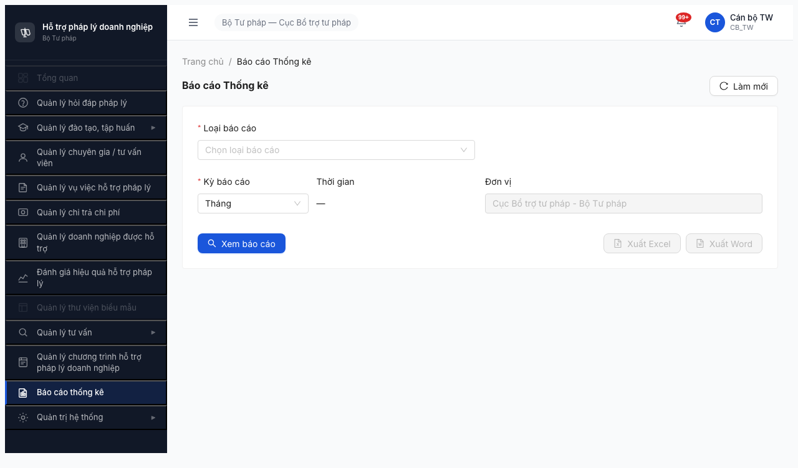

# Smoke Test Report — Module Báo cáo Thống kê (Round 2)

> **Verdict:** ❌ **FAIL** — Bước 2b FAIL do dropdown `Loại báo cáo` render 0 option (spec yêu cầu 23). Root cause: BE API response double-wrap + FE không unwrap. Không thể tiếp tục Bước 3 dynamic filter / Bước 4 (mọi action của module đều block bởi dropdown rỗng).

---

## 0. Metadata

| Thông tin | Giá trị |
|-----------|---------|
| **Round** | Round 2 (2026-04-16) |
| **Module** | FR-11 — Báo cáo Thống kê (Nhóm IX — UC120 → UC142, 23 FR) |
| **Ngày test** | 2026-04-19 |
| **Tester** | Claude Code + `/browse` (Playwright headless) |
| **Environment** | http://103.172.236.130:3000/ |
| **Primary Account** | `canbo_tw` / `Test@1234` (OTP bypass `666666`) — role CB_TW (CB_NV_TW) |
| **Test Method** | `$B chain` atomic (theo CLAUDE.md Rule 5) |
| **Browse Status** | OK (sau 1 lần REAL CRASH ở attempt 2, cleanup + retry 1 lần → PASS) |
| **Spec tham chiếu** | [output/smoke-specs/6.11-smoke-baocao-thongke.md](../../../../smoke-specs/6.11-smoke-baocao-thongke.md) |
| **SRS tham chiếu** | [input/srs-v3/srs-fr-11-bao-cao.md](../../../../../input/srs-v3/srs-fr-11-bao-cao.md) |
| **Test duration** | ~15 phút (gồm diagnostic + API verify) |

---

## 1. Executive Summary

| # | Bước | Kết quả | Ghi chú |
|---|------|---------|---------|
| 1 | Login | ✅ PASS | OTP bypass `666666` OK, landing `/403` (expected cho role CB_TW, sidebar đầy đủ) |
| 2a | Menu sidebar `Báo cáo thống kê` | ✅ PASS | Menu visible, click được |
| 2b | Navigate + filter-bar + **23 loại BC** + dynamic filter | ❌ **FAIL** | Page render OK, URL `/bao-cao` OK, filter-bar có đủ (Loại BC, Kỳ BC, Đơn vị, Xem BC, Xuất Excel/Word). **Dropdown `Loại báo cáo` render 0 option (hiển thị "Trống")** — chặn toàn bộ flow còn lại |
| 3 | Console / Network / Toast | ⚠️ WARN | 0 console error, 0 4xx/5xx. Nhưng `/api/v1/bao-cao/loai` trả về **response double-wrap** (bug gốc của BE) |
| 4 | Dynamic filter UC122 vs UC134 | 🔒 BLOCKED | Không thể test vì dropdown rỗng |

### Verdict tổng: **❌ FAIL**

Module Báo cáo Thống kê **không chạy được**: dropdown `Loại báo cáo` — input bắt buộc đầu tiên và là trigger cho toàn bộ UI động (filter đặc thù, bảng, biểu đồ, xuất Excel/Word) — hiện trả 0 option. User không thể chọn bất kỳ loại BC nào → không xem được, không xuất được.

Smoke verdict: **FAIL Bước 2b**, không unlock Functional/Regression. Cần fix **BUG-R2-BC-001** (BE wrap sai + FE không unwrap) trước khi retest.

Phụ: BE trả về **22/23 loại BC** (thiếu UC124). Đã tách thành **BUG-R2-BC-002**.

---

## 2. Pre-check kết quả

| Check | Kết quả |
|-------|---------|
| Server up (`curl http://103.172.236.130:3000/`) | ✅ HTTP 200 |
| Auth endpoint alive (`POST /api/v1/auth/login`) | ✅ 200, trả `otpToken` |
| Account lock | ✅ Không lock |

---

## 3. Per-step Details

### Bước 1 — LOGIN: ✅ PASS

**Method:** atomic `$B chain` — JSON file với 16 step (goto /login → fill u/p → submit → sleep 3.5s → type `666666` → sleep 8s → screenshot → click menu → sleep 6s → url → screenshot → snapshot).

**Network log:**
- `POST /api/v1/auth/login` → 200 (481ms, 192B) ✅ (trả `otpToken`)
- `POST /api/v1/auth/verify-otp` → 200 (46ms, 5279B) ✅ (trả `accessToken`)
- `GET /api/v1/thong-baos/unread-count` → 200 (42ms, 50B) ✅

**Kết quả:**
- URL sau OTP: `http://103.172.236.130:3000/403` — trang default role CB_TW (role không có dashboard riêng). Sidebar đầy đủ menu, topbar `Cán bộ TW / CB_TW` chính xác. **Không phải blocker.**
- Menu `Báo cáo thống kê` visible ở sidebar (dòng 11 trong snapshot @e13).

**Evidence:** 

### Bước 2a — Menu sidebar: ✅ PASS

- Menu `Báo cáo thống kê` visible ở sidebar (không có expand arrow ▶, nghĩa là click trực tiếp ra page — khớp spec metadata "menu click trực tiếp ra unified report page SCR-IX-01").
- Click menu → URL đổi `/403 → /bao-cao`, breadcrumb `Trang chủ / Báo cáo Thống kê` render đúng.

### Bước 2b — Navigate + filter-bar + dropdown 23 loại BC + dynamic filter: ❌ FAIL

#### 2b.1 — Navigate + filter-bar layout: ✅ PASS

**URL:** `http://103.172.236.130:3000/bao-cao` (khớp spec "có thể chứa /bao-cao") ✅
**Breadcrumb:** `Trang chủ / Báo cáo Thống kê` ✅

**Filter-bar render (snapshot -i):**
- `@e18 [combobox] "* Loại báo cáo"` ✅ (required asterisk)
- `@e19 [combobox] "* Kỳ báo cáo"` (default `Tháng`) ✅
- `Thời gian: —` (hiển thị dash khi kỳ là "Tháng" — auto-calculated range, không show date-picker)
- `@e20 [textbox] [disabled]: "Cục Bổ trợ tư pháp - Bộ Tư pháp"` ✅ (dropdown đơn vị auto lock theo phân quyền CB_TW)
- `@e17 [button] "reload Làm mới"` ✅

**Action-bar:**
- `@e21 [button] "search Xem báo cáo"` — **ENABLE** ✅
- `@e22 [button] "file-excel Xuất Excel" [disabled]` ✅ (đúng spec — disable trước khi có dữ liệu)
- `@e23 [button] "file-word Xuất Word" [disabled]` ✅

**Evidence:**  — filter-bar + action-bar render OK.

**⚠️ Lưu ý spec vs actual:**
- Spec: `Từ ngày` + `Đến ngày` (2 date-picker riêng).
- Actual: 1 ô `Thời gian: —` (dash) — có vẻ là dynamic: khi `Kỳ báo cáo = Khoảng` sẽ xuất hiện 2 date-picker. Chưa verify được vì dropdown `Loại báo cáo` rỗng → không thể click "Xem báo cáo" để test flow cuối. **Không tính FAIL** ở mức smoke, cần functional test confirm sau.

#### 2b.2 — Click mở dropdown `Loại báo cáo` và đếm option: ❌ **FAIL**

**Method:**
- Click combobox `@e18` → dropdown mở.
- Screenshot + dump HTML dropdown container.

**Kết quả:**
- Dropdown mở đúng vị trí, nhưng **DOM rỗng**: `<div role="listbox" id="loaiBaoCao_list" class="ant-select-item-empty">` + empty state `"Trống"`.
- **0 option** hiển thị cho user.

**Evidence:**
- 
- HTML dump (rút gọn):
  ```html
  <div role="listbox" id="loaiBaoCao_list" class="ant-select-item-empty">
    <div class="ant-empty ant-empty-normal ant-empty-small">
      <div class="ant-empty-description">Trống</div>
    </div>
  </div>
  ```

**Verdict dropdown:** ❌ **FAIL** theo spec:
> "❌ Dropdown thiếu option (≠23) → FAIL — note danh sách option có / thiếu"

**Root cause analysis (đã điều tra):**

1. **API `/api/v1/bao-cao/loai` trả 200 + 6076B** — nghĩa là BE có dữ liệu, không phải BE down.
2. Curl trực tiếp với `accessToken` từ OTP flow → response:
   ```json
   {
     "success": true,
     "data": {                          ← OUTER envelope
       "success": true,                 ← DUPLICATE INNER envelope (BUG)
       "data": [ {...}, {...}, ... ]   ← mảng 22 phần tử nằm sâu 2 tầng
     }
   }
   ```
3. **Double-wrap**: BE wrap response 2 lần. FE hook `use-report-types.ts` đọc `response.data` → nhận object `{success, data}` thay vì array → dropdown không render được.
4. **Kết hợp bug thứ 2:** ngay cả khi FE unwrap đúng, mảng chỉ có **22 phần tử** (thiếu UC124 — dãy UC120..UC142 là 23 UC). Tức là vẫn FAIL spec.

→ Tách thành 2 bug riêng:
- **BUG-R2-BC-001 (Critical):** BE `/api/v1/bao-cao/loai` trả về response double-wrap, FE hook đọc sai → dropdown 0 option.
- **BUG-R2-BC-002 (Major):** BE chỉ trả 22/23 loại báo cáo (thiếu UC124).

#### 2b.3 — Test dynamic filter (UC122 vs UC134): 🔒 BLOCKED

- Spec yêu cầu chọn `BC Vụ việc đang hỗ trợ` (UC122) để verify filter đặc thù `NHT phụ trách` + `Mức SLA` xuất hiện; rồi đổi sang `BC Chi phí chi trả` (UC134) để verify filter đặc thù mất.
- **Không thể test:** dropdown rỗng → không chọn được option → không trigger dynamic filter.
- **BLOCKED bởi BUG-R2-BC-001.**

### Bước 3 — Kiểm tra lỗi ngầm: ⚠️ WARN

| Check | Kết quả |
|-------|---------|
| `$B console --errors` | `(no console errors)` ✅ |
| `$B network` — 4xx/5xx | Không 4xx/5xx. Tất cả `/api/v1/*` đều 200. ✅ |
| Snapshot grep `Lỗi` / `Validation failed` / `Không thành công` / `undefined` / `NaN` | Không match ✅ |
| Date-picker mặc định hiện `Invalid date`/`NaN` | Không hiện (hiện `—` placeholder) ✅ |
| Empty-state dropdown `Loại báo cáo` hiện `"Trống"` | ⚠️ WARN — đúng theo spec Antd là "empty state của Select khi fetcher trả array rỗng", nhưng root cause là **API wrap sai** (xem BUG-BC-001), không phải "empty data hợp lệ" |

**Console/Network sạch, nhưng business-level output SAI** → WARN, không PASS. Lỗi không nằm ở UI runtime mà ở data binding layer.

### Bước 4 — Sample "Xem báo cáo" cho empty-state check: 🔒 BLOCKED

- Không thể test vì chưa chọn được `Loại báo cáo`.
- Nút `Xem báo cáo` ENABLE trước khi chọn loại — **chưa verify** behavior: nếu click sẽ show validation "Vui lòng chọn loại báo cáo" hay show empty state hay 500? Cần functional test confirm sau khi dev fix BUG-BC-001.

---

## 4. Failed / Blocked Modules — Chi tiết

### 4.1 Module Báo cáo Thống kê — FAIL at Bước 2b.2 (dropdown loại BC rỗng)

**Triệu chứng:**
- Click mở dropdown `Loại báo cáo` → hiển thị "Trống" thay vì 23 option theo spec.

**Reproduction:**
```
1. Login canbo_tw / Test@1234 / OTP 666666
2. Click menu "Báo cáo thống kê" ở sidebar
3. Đợi page load (< 5s), verify URL /bao-cao + breadcrumb OK
4. Click dropdown "Loại báo cáo"
5. Quan sát: dropdown mở nhưng hiển thị empty state "Trống"
6. Curl API trực tiếp:
   curl -H "Authorization: Bearer <token>" \
        http://103.172.236.130:3000/api/v1/bao-cao/loai
   → response.data không phải array, mà là object {success, data:[...]}
```

**Console:** Sạch, không error.

**Network:** `GET /api/v1/bao-cao/loai` → 200 (103ms, 6076B) — **API có data, nhưng FE không render**.

**Screenshots:**
- 
- 

**Root cause (chi tiết bug report):** xem `bug-report-smoke-test.md` — **BUG-R2-BC-001** + **BUG-R2-BC-002**.

**Assignee:** Backend team (primary — wrapper logic) + Frontend team (secondary — defensive unwrap).
**Priority:** P0 (Blocker — toàn bộ module không dùng được).
**Next action:** Ping dev, chờ fix BE wrapper + seed UC124, retest sau fix.

---

## 5. Retry Log

| Bước | Attempt | Kết quả | Ghi chú |
|------|---------|---------|---------|
| Bước 1+2 — atomic chain login+navigate | 1 | ✅ PASS | Chain 16 step, URL `/bao-cao`, 0 console error |
| Bước 2b.2 — snapshot+dropdown trong chain mới | 1 | ❌ FAIL (REAL CRASH) | Error: `Target page, context or browser has been closed`. Root cause: session browser reset giữa 2 bash invocation (Rule 8) hoặc real crash sau inactivity. Classified REAL CRASH theo Rule 9 (vì error `closed`). |
| Bước 2b.2 — retry sau cleanup | 2 | ✅ PASS | Sau full cleanup theo Rule 6 (stop + pkill playwright-go + pkill chromium) → re-run chain → thành công, dropdown mở OK. |

**Kết luận:** 1 retry đúng theo Rule 7 (crash lần 1 → cleanup + retry 1 lần → PASS lần 2). Không có retry vượt giới hạn.

---

## 6. Blocker Escalation

| # | Bug ID | Module | Issue | Severity | Priority | Assignee | Status |
|---|--------|--------|-------|----------|----------|----------|--------|
| 1 | BUG-R2-BC-001 | Báo cáo Thống kê | API `/api/v1/bao-cao/loai` response **double-wrap** + FE không unwrap → dropdown 0 option | Critical | P0 | BE primary + FE secondary | Open (mới phát hiện 2026-04-19) |
| 2 | BUG-R2-BC-002 | Báo cáo Thống kê | API chỉ trả **22/23** loại BC — thiếu UC124 | Major | P1 | BE team | Open (mới phát hiện 2026-04-19) |

**Impact:** Toàn bộ module Báo cáo Thống kê không dùng được cho mọi user (không chỉ CB_TW). Mọi tính năng downstream (chọn kỳ, filter đặc thù, xem BC, xuất Excel/Word, charts) đều chặn.

**Báo cáo:** xem [bug-report-smoke-test.md](../bug-report-smoke-test.md) — đã append 2 bug mới.

---

## 7. Recommendations

### KHÔNG Unlock Functional/Regression

- [ ] ❌ Module Báo cáo Thống kê — **KHÔNG** chạy Functional [output/funtion/7.11-bao-cao-thong-ke.md](../../../../funtion/7.11-bao-cao-thong-ke.md) cho đến khi BUG-R2-BC-001 fix.
- [ ] Khi dev fix xong, retest Bước 2b + 3 + 4 theo spec.

### Cần verify lần sau (sau khi fix BE):

- [ ] Đếm lại số option: phải đủ **23** (UC120-UC142). Thiếu bất kỳ UC nào → FAIL.
- [ ] Verify phân nhóm optgroup: `Hỏi đáp (1) / Vụ việc (3+1=4 nếu thêm UC124) / Đào tạo (3) / CG-TVV (1) / Đánh giá (1) / VV phân tích (4) / Chi phí (5) / CT HTPLDN (4)` = 8 nhóm.
- [ ] Verify dynamic filter cho UC122 (VV đang hỗ trợ) và UC134 (Chi phí chi trả): filter đặc thù phải thay đổi theo loại BC.
- [ ] Verify date-picker behavior khi đổi `Kỳ báo cáo` sang `Khoảng` — phải hiện 2 date-picker `Từ ngày` / `Đến ngày`.
- [ ] Verify snapshot-type reports (UC122/UC125/UC127) — spec nói date-picker phải tự ẩn/disabled khi chọn các loại này.

### Cải thiện process:

- Spec 6.11 cần ghi rõ: "UC124 là UC nào?" — hiện chỉ nói "UC120 → UC142" (23 FR) nhưng không liệt kê đầy đủ. Nên thêm bảng map UC ↔ tenHienThi để QA dễ diff với API response.

---

## 8. Appendix

### 8.A. API response structure (captured via curl)

**Endpoint:** `GET /api/v1/bao-cao/loai` với Bearer token từ OTP flow.

```json
{
  "success": true,
  "data": {                              // ← BUG: wrap 2 lần
    "success": true,
    "data": [
      {
        "slug": "hoi-dap",
        "ucCode": "UC120",
        "tenHienThi": "BC Số lượng hỏi đáp/vướng mắc",
        "nhom": "Hỏi đáp",
        "loaiBaoCao": "BC_HOI_DAP",
        "filterDacThu": [
          {"key": "linhVucId", "label": "Lĩnh vực PL", "type": "select", "optionsEndpoint": "/danh-mucs?loai=LINH_VUC_PL"},
          {"key": "trangThaiHd", "label": "Trạng thái HĐ", "type": "select"}
        ],
        "chartTypes": ["DONUT", "LINE"]
      },
      // ... 21 items nữa (tổng 22, thiếu UC124)
    ]
  }
}
```

**Kỳ vọng:** `response.data` là array thẳng 23 phần tử.

### 8.B. Danh sách 22 loại BC API trả về (thiếu UC124)

| # | UC Code | Nhóm | Tên hiển thị |
|---|---------|------|--------------|
| 1 | UC120 | Hỏi đáp | BC Số lượng hỏi đáp/vướng mắc |
| 2 | UC121 | Vụ việc | BC Vụ việc đã tiếp nhận |
| 3 | UC122 | Vụ việc | BC Vụ việc đang hỗ trợ |
| 4 | UC123 | Vụ việc | BC Vụ việc đã hoàn thành |
| **—** | **UC124** | **(VV?)** | **❌ THIẾU** |
| 5 | UC125 | Đào tạo | BC Lớp đào tạo đang diễn ra |
| 6 | UC126 | Đào tạo | BC Lớp đào tạo đã diễn ra |
| 7 | UC129 | Đào tạo | BC Chất lượng đào tạo |
| 8 | UC127 | CG/TVV | BC Số lượng CG/TVV |
| 9 | UC128 | Đánh giá | BC Đánh giá hiệu quả HTPL |
| 10 | UC130 | VV phân tích | BC Vụ việc theo đơn vị quản lý |
| 11 | UC131 | VV phân tích | BC Vụ việc theo lĩnh vực |
| 12 | UC132 | VV phân tích | BC Vụ việc theo loại hình DN |
| 13 | UC133 | VV phân tích | BC Vụ việc theo thời gian chi tiết |
| 14 | UC134 | Chi phí | BC Chi phí chi trả hỗ trợ |
| 15 | UC135 | Chi phí | BC Chi phí theo đơn vị |
| 16 | UC136 | Chi phí | BC Chi phí theo lĩnh vực |
| 17 | UC137 | Chi phí | BC Chi phí theo loại hình DN |
| 18 | UC138 | Chi phí | BC Chi phí theo thời gian |
| 19 | UC139 | CT HTPLDN | BC Số lượng CT hỗ trợ |
| 20 | UC140 | CT HTPLDN | BC CT theo đơn vị |
| 21 | UC141 | CT HTPLDN | BC CT theo lĩnh vực |
| 22 | UC142 | CT HTPLDN | BC CT theo thời gian |

**Tổng:** 22/23 — thiếu **UC124**. Theo thứ tự UC, UC124 nằm trong nhóm `Vụ việc` (giữa UC123 `đã hoàn thành` và UC125 `Đào tạo`). Cần dev/BA confirm UC124 là loại BC gì theo SRS.

### 8.C. Browse patterns áp dụng

Theo CLAUDE.md:
- **Rule 1 (wait trước fill/click):** áp dụng ✅
- **Rule 3 (OTP bypass 666666):** áp dụng ✅ via `$B type "666666"` trong chain
- **Rule 5 (atomic chain bằng JSON file):** áp dụng ✅ — file `/tmp/baocao-*.json`
- **Rule 6 (full cleanup khi crash):** áp dụng 1 lần ✅ (stop + pkill playwright-go + pkill chromium)
- **Rule 7 (retry max 1 lần khi REAL CRASH):** áp dụng ✅ — crash attempt 2, retry → PASS
- **Rule 8 (session reset != crash):** áp dụng ✅ — đã gộp mọi step vào 1 chain atomic, không chia bash riêng
- **Rule 9 (phân loại trước khi react):** áp dụng ✅ — classify REAL CRASH khi thấy `Target page...closed` thay vì mark BLOCKED bừa

### 8.D. Screenshots

| File | Mô tả |
|------|-------|
| `screenshots/baocao-login-dashboard.png` | Sau login: landing `/403` + sidebar đầy đủ, menu `Báo cáo thống kê` visible |
| `screenshots/baocao-page.png` | Page `/bao-cao` render OK với filter-bar (Loại BC chưa mở) |
| `screenshots/baocao-dropdown-open.png` | Dropdown `Loại báo cáo` mở → hiện "Trống" (0 option) — **bằng chứng chính cho FAIL verdict** |
| `screenshots/baocao-dropdown-debug.png` | Dropdown debug sau 2.5s wait — vẫn trống |

---

## 9. Verdict tổng cuối cùng

| Điều kiện | Trạng thái |
|-----------|------------|
| Bước 1 PASS | ✅ |
| Bước 2a PASS | ✅ |
| Bước 2b (filter-bar + dropdown 23 option + dynamic filter) | ❌ FAIL (dropdown 0 option) |
| Bước 3 (console/network sạch) | ⚠️ Sạch ở runtime, nhưng data binding bug |
| Bước 4 (sample "Xem báo cáo" empty-state) | 🔒 BLOCKED bởi 2b |

**Verdict cuối: ❌ FAIL** — KHÔNG unlock functional.

Lần retest tiếp theo: sau khi dev fix BUG-R2-BC-001 (BE wrapper) + BUG-R2-BC-002 (thiếu UC124) + FE defensive unwrap (nếu áp dụng).

---

*Report v1.0 | 2026-04-19 | PM HTPLDN QA — Smoke Test Round 2 Báo cáo Thống kê*
