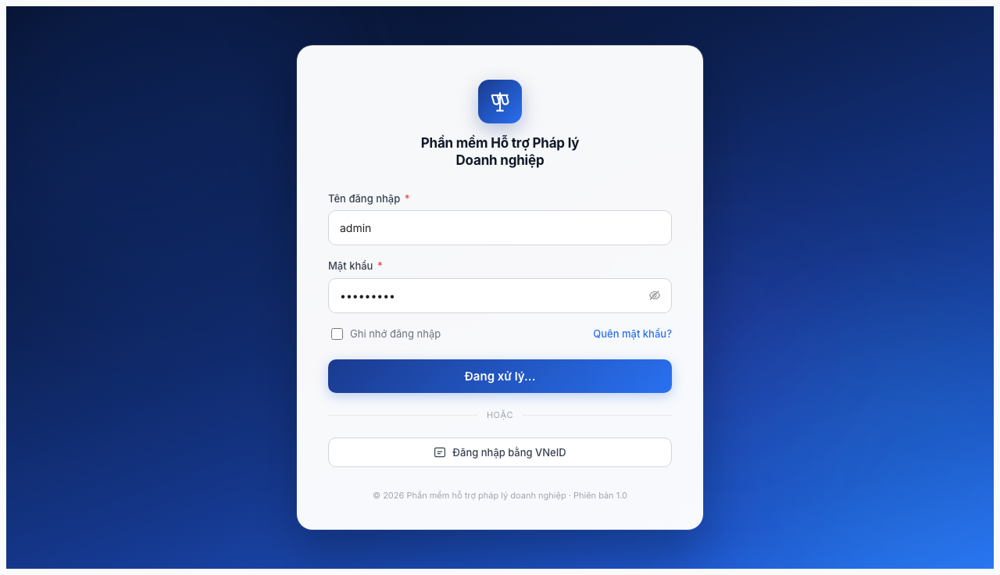
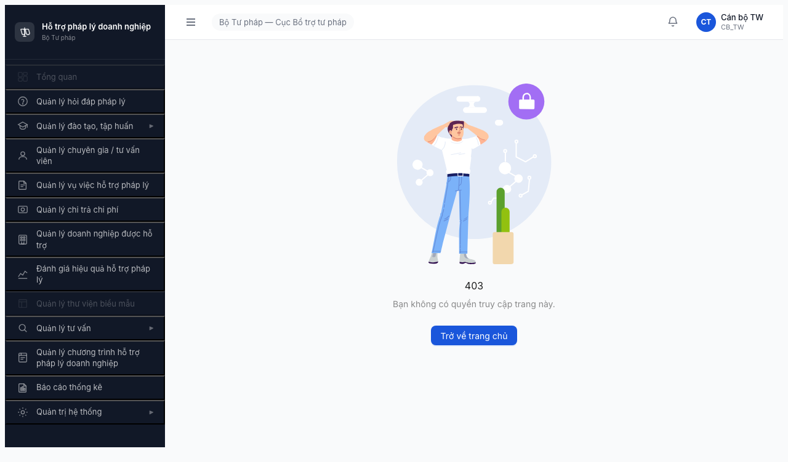

# Báo cáo Lỗi — Smoke Test Round 2

| Thông tin | Giá trị |
|-----------|---------|
| **Dự án** | PM HTPLDN — Phần mềm Hỗ trợ Pháp lý Doanh nghiệp |
| **Phiên bản** | 1.0 |
| **Môi trường** | Test — http://103.172.236.130:3000/ |
| **Người test** | QA Automation (Claude Code + headless Chromium) |
| **Ngày** | 2026-04-16 |
| **Loại test** | Smoke Test — Round 2 |
| **Tài liệu tham chiếu** | [smoke-test-report.md](smoke-test-report.md) |

---

## Tổng hợp

Phát hiện 6 lỗi trong quá trình smoke test (6 module cũ + Báo cáo Thống kê 2026-04-19).

| Tổng | Blocker | Critical | Major | Minor | Trivial |
|------|---------|----------|-------|-------|---------|
| 6    | 0       | 1        | 2     | 2     | 1       |

## Bug Summary Table

| Bug ID | Severity | Priority | Type | Module | TC Ref | Title | Status |
|--------|----------|----------|------|--------|--------|-------|--------|
| BUG-R2-001 | Minor | P2 | Negative | Đăng nhập | N/A (smoke) | Nút "Đăng nhập" bị kẹt ở "Đang xử lý..." khi sai mật khẩu | Open |
| BUG-R2-002 | Trivial | P4 | Happy | Đăng nhập | N/A (smoke) | Component Spin dùng prop `tip` đã bị khuyến cáo bỏ | Open |
| BUG-R2-003 | Major | P1 | Happy | Dashboard | N/A (smoke) | Trang chủ `/` trả về 403 cho vai trò CB_TW | Open |
| BUG-R2-004 | Minor | P3 | Happy | Chi trả | N/A (smoke) | Phát hiện phần tử lỗi trên trang danh sách chi trả | Open |
| BUG-R2-BC-001 | Critical | P0 | Data | Báo cáo Thống kê | 6.11 / 2b | API `/api/v1/bao-cao/loai` response **double-wrap** + FE không unwrap → dropdown `Loại báo cáo` 0 option | Open |
| BUG-R2-BC-002 | Major | P1 | Data | Báo cáo Thống kê | 6.11 / 2b | API `/api/v1/bao-cao/loai` chỉ trả 22/23 loại BC — thiếu UC124 | Open |

> **Chú thích Type:** `Happy` = luồng chính thành công | `Negative` = input/thao tác sai | `Edge` = giá trị biên | `Workflow` = chuyển state | `Permission` = phân quyền | `Data` = toàn vẹn dữ liệu | `UI/UX` = giao diện | `Performance` = thời gian phản hồi

> **Chú thích Severity:** `Critical` = block release/lộ dữ liệu | `Major` = tính năng quan trọng lỗi | `Medium` = tính năng phụ lỗi | `Minor` = lỗi nhỏ | `Trivial` = typo/deprecated warning

> **Chú thích Priority:** `P0` = fix ngay (block release) | `P1` = fix sprint này | `P2` = fix 2-3 sprint tới | `P3` = fix khi có thời gian | `P4` = backlog

---

## BUG-R2-001 — Nút đăng nhập bị kẹt ở "Đang xử lý..." khi sai mật khẩu

| Trường | Chi tiết |
|--------|----------|
| **Bug ID** | BUG-R2-001 |
| **Severity** | Minor |
| **Priority** | P2 |
| **Type** | Negative |
| **Status** | Open |
| **Module** | Xác thực / Đăng nhập |
| **Thành phần** | `src/pages/auth/login/index.tsx` |
| **URL** | http://103.172.236.130:3000/login |
| **Trình duyệt** | Chromium 146 (headless) |
| **Tài khoản** | admin (QTHT, TW) |
| **TC Reference** | N/A (smoke test) |
| **SRS Reference** | UC118 — Đăng nhập |
| **Assignee** | Frontend Team |
| **Found by** | QA Automation (Claude Code) |

### Mô tả

Khi người dùng gửi form đăng nhập với mật khẩu sai, nút submit chuyển sang trạng thái "Đang xử lý..." và **không bao giờ quay lại** trạng thái "Đăng nhập" ban đầu. Không có thông báo lỗi nào hiển thị cho người dùng.

### Các bước tái hiện

1. Truy cập http://103.172.236.130:3000/login
2. Nhập tên đăng nhập: `admin`
3. Nhập mật khẩu: `MatKhauSai123` (bất kỳ mật khẩu sai nào)
4. Bấm nút "Đăng nhập"

### Kết quả mong đợi

- Nút quay lại trạng thái "Đăng nhập" sau khi API phản hồi
- Hiện thông báo lỗi: "Sai tên đăng nhập hoặc mật khẩu" (hoặc tương tự)
- Người dùng có thể thử lại ngay

### Kết quả thực tế

- Nút giữ trạng thái "Đang xử lý..." vĩnh viễn
- Không hiện thông báo lỗi
- Người dùng không thể thử lại nếu không tải lại trang

### Bằng chứng

- Phản hồi API (kiểm tra bằng curl):
  ```json
  {
    "success": false,
    "error": {
      "code": "ERR-AUTH-SYS-00-01",
      "message": "Invalid credentials"
    }
  }
  ```
- API phản hồi nhanh (~1 giây), xác nhận lỗi nằm ở phía frontend
- Ảnh chụp:



### Tác động (Impact)

- 100% user gặp lỗi này khi nhập sai mật khẩu (tình huống xảy ra thường xuyên)
- User buộc phải reload trang → mất UX, có thể tưởng hệ thống treo
- Ảnh hưởng trực tiếp trang đăng nhập — điểm chạm đầu tiên với sản phẩm

### Nguyên nhân nghi ngờ (Root Cause)

Form đăng nhập không xử lý đúng phản hồi lỗi từ API. Trạng thái loading (`isSubmitting` hoặc tương đương) được bật lên `true` khi submit nhưng không bao giờ được đặt lại `false` trong nhánh `.catch()` hoặc xử lý lỗi.

### Gợi ý sửa (Suggested Fix)

Trong handler `handleLogin()` của `src/pages/auth/login/index.tsx`:

```diff
  const handleLogin = async (values) => {
    setIsSubmitting(true);
    try {
      await login(values);
    } catch (error) {
+     message.error(error.message || "Sai tên đăng nhập hoặc mật khẩu");
+   } finally {
+     setIsSubmitting(false);
    }
-   setIsSubmitting(false);  // chỉ chạy khi success
  };
```

Hoặc dùng `.finally()` để đảm bảo state reset trong cả 2 nhánh success/error.

---

## BUG-R2-002 — Component Spin dùng prop `tip` đã bị khuyến cáo bỏ

| Trường | Chi tiết |
|--------|----------|
| **Bug ID** | BUG-R2-002 |
| **Severity** | Trivial |
| **Priority** | P4 |
| **Type** | Happy |
| **Status** | Open |
| **Module** | Xác thực / Đăng nhập |
| **Thành phần** | Spin wrapper trên trang đăng nhập |
| **URL** | http://103.172.236.130:3000/login |
| **Trình duyệt** | Chromium 146 (headless) |
| **Tài khoản** | N/A (public page) |
| **TC Reference** | N/A (smoke test) |
| **SRS Reference** | N/A |
| **Assignee** | Frontend Team |
| **Found by** | QA Automation (Claude Code) |

### Mô tả

Console trình duyệt hiện cảnh báo deprecated từ Ant Design:

```
[antd: Spin] `tip` is deprecated. Please use `description` instead.
```

### Các bước tái hiện

1. Truy cập http://103.172.236.130:3000/login
2. Mở DevTools trình duyệt > tab Console

### Kết quả mong đợi

Không có cảnh báo deprecated trong console.

### Kết quả thực tế

Cảnh báo ghi lại mỗi khi tải trang. Sẽ trở thành lỗi trong phiên bản Antd lớn tiếp theo.

### Bằng chứng

Console output:
```
[antd: Spin] `tip` is deprecated. Please use `description` instead.
    at SpinComponent (node_modules/antd/...)
    at LoginPage (src/pages/auth/login/index.tsx)
```

### Tác động (Impact)

- Ảnh hưởng: thấp, chỉ là warning không ảnh hưởng chức năng
- Rủi ro: khi nâng cấp Ant Design lên phiên bản major tiếp theo → warning sẽ thành error → `tip` không còn render → UX hỏng
- Nợ kỹ thuật: cần xử lý trước khi upgrade Antd

### Nguyên nhân nghi ngờ (Root Cause)

Code dùng prop `tip` của component `<Spin>` — prop này đã bị deprecated từ antd v5.x, thay bằng `description`.

### Gợi ý sửa (Suggested Fix)

```diff
- <Spin tip="Đang tải...">
+ <Spin description="Đang tải...">
```

Grep toàn bộ codebase để tìm tất cả usage `Spin tip=`:
```bash
grep -rn "Spin tip=" src/
```

---

## BUG-R2-003 — Trang Tổng quan trả về 403 cho vai trò CB_TW

| Trường | Chi tiết |
|--------|----------|
| **Bug ID** | BUG-R2-003 |
| **Severity** | Major |
| **Priority** | P1 |
| **Type** | Happy |
| **Status** | Open |
| **Module** | Dashboard / Tổng quan |
| **Thành phần** | Route guard / PermissionRoute / CASL rules |
| **URL** | http://103.172.236.130:3000/ |
| **Trình duyệt** | Chromium 146 (headless) |
| **Tài khoản** | canbo_tw (CB_NV_TW, cấp Trung ương) |
| **TC Reference** | N/A (smoke test) |
| **SRS Reference** | Permission Matrix — Dashboard |
| **Assignee** | Frontend Team + Backend Team |
| **Found by** | QA Automation (Claude Code) |

### Mô tả

Sau khi đăng nhập thành công với tài khoản `canbo_tw`, truy cập vào trang chủ `/` (Dashboard / Tổng quan) thì hiện trang **403 Forbidden**. Trong khi đó, thanh menu bên trái vẫn hiện mục "Tổng quan" bình thường và có thể bấm vào.

### Các bước tái hiện

1. Đăng nhập bằng tài khoản `canbo_tw` / `Test@1234`
2. Hoàn tất xác thực OTP qua MailHog
3. Truy cập http://103.172.236.130:3000/
4. Quan sát trang 403

### Kết quả mong đợi

- Trang Tổng quan hiển thị dữ liệu tổng hợp phù hợp với vai trò CB_TW
- Hoặc: nếu Tổng quan bị giới hạn quyền, hệ thống nên **tự động chuyển hướng** đến module đầu tiên mà người dùng có quyền (ví dụ: /hoi-dap), thay vì hiện 403

### Kết quả thực tế

- Trang 403 Forbidden hiển thị
- Thanh menu vẫn hiện mục "Tổng quan" có thể bấm (gây nhầm lẫn)
- Người dùng phải tự tay chuyển sang module khác

### Bằng chứng



- Thông tin người dùng trên sidebar: "Cán bộ TW / CB_TW"
- Tất cả 6 module khác đều truy cập bình thường với cùng tài khoản

### Tác động (Impact)

- Mọi người dùng CB_TW (cấp Trung ương) đều thấy lỗi 403 ngay sau khi đăng nhập
- Trải nghiệm xấu, gây hoang mang cho người dùng không chuyên kỹ thuật
- Mâu thuẫn UX: menu hiện "Tổng quan" nhưng không truy cập được

### Nguyên nhân nghi ngờ (Root Cause)

Cấu hình quyền của route `/` (Dashboard) trong `PermissionRoute` / CASL rules không bao gồm role `CB_NV_TW`. Tuy nhiên, menu sidebar vẫn hiện item "Tổng quan" cho role này → không đồng bộ giữa route guard và menu config.

### Gợi ý sửa (Suggested Fix)

1. **Backend/CASL:** Kiểm tra và bổ sung quyền truy cập Dashboard cho role `CB_NV_TW`
2. **Frontend menu:** Ẩn mục "Tổng quan" khỏi sidebar nếu user không có quyền (dùng `Can` component của CASL)
3. **Routing default:** Thay đổi trang mặc định sau đăng nhập → module đầu tiên mà user có quyền (ví dụ `/hoi-dap` thay vì `/`)

```tsx
// Thay vì redirect mặc định về /
<Redirect to={getFirstAllowedModule(user.roles)} />
```

---

## BUG-R2-004 — Phát hiện phần tử lỗi trên trang danh sách Chi trả

| Trường | Chi tiết |
|--------|----------|
| **Bug ID** | BUG-R2-004 |
| **Severity** | Minor |
| **Priority** | P3 |
| **Type** | Happy |
| **Status** | Open (cần điều tra thêm) |
| **Module** | Quản lý Chi trả Chi phí |
| **Thành phần** | Trang danh sách hồ sơ chi trả |
| **URL** | http://103.172.236.130:3000/chi-tra/danh-sach |
| **Trình duyệt** | Chromium 146 (headless) |
| **Tài khoản** | canbo_tw (CB_NV_TW, cấp Trung ương) |
| **TC Reference** | N/A (smoke test) |
| **SRS Reference** | N/A (cần xác định sau khi điều tra) |
| **Assignee** | TBD (cần điều tra để xác định team) |
| **Found by** | QA Automation (Claude Code) |

### Mô tả

Trong quá trình smoke test tự động, phát hiện một phần tử DOM liên quan đến lỗi trên trang danh sách module Chi trả. Trang vẫn tải được với bảng và tabs hiển thị (không bị trắng), nhưng có phần tử khớp với selector `[class*="error"]` trong DOM.

### Các bước tái hiện

1. Đăng nhập bằng tài khoản `canbo_tw`
2. Truy cập http://103.172.236.130:3000/chi-tra/danh-sach

### Kết quả mong đợi

Trang tải sạch sẽ, không có chỉ báo lỗi nào.

### Kết quả thực tế

Trang tải có nội dung (bảng + tabs), nhưng tồn tại phần tử có class lỗi trong DOM. Có thể là:
- Thông báo lỗi API (ví dụ: gọi dữ liệu thất bại)
- Thông báo trạng thái rỗng
- Phần tử validation còn sót lại

### Bằng chứng

- Selector khớp: `[class*="error"]` (từ smoke test automation)
- Chưa có screenshot cụ thể — cần điều tra thủ công
- Trang load được, tabs hiển thị → không phải crash

### Tác động (Impact)

- Chưa xác định được mức độ ảnh hưởng — cần điều tra thêm
- Nếu là lỗi API gọi dữ liệu thất bại → user không xem được dữ liệu chi trả
- Nếu là empty state → không ảnh hưởng (nhưng cần đổi class name)

### Nguyên nhân nghi ngờ (Root Cause)

Chưa xác định. Có thể:
1. API backend trả lỗi khi lấy danh sách chi trả → FE render error state nhưng UX vẫn thấy bảng/tabs
2. Component empty state dùng class có chứa "error" gây nhầm lẫn
3. Validation form còn sót phần tử lỗi chưa clear

### Gợi ý sửa (Suggested Fix)

**Bước 1 — Điều tra thủ công:**
1. Mở DevTools trên `/chi-tra/danh-sach`
2. Inspect phần tử có `class*="error"` → đọc nội dung text
3. Check Network tab: API `/api/v1/chi-tra/*` có trả lỗi không

**Bước 2 — Xử lý theo kết quả:**
- Nếu là API error → FE Team + BE Team điều tra API
- Nếu là empty state → đổi class name để không chứa "error"
- Nếu là validation sót → clear form state khi unmount component

---

## Phụ lục

### A — Môi trường test

| Thành phần | Giá trị |
|------------|---------|
| URL ứng dụng | http://103.172.236.130:3000/ |
| MailHog (OTP) | http://103.172.236.130:8025 |
| API base | http://103.172.236.130:3000/api/v1/ |
| Frontend | React + Vite (dev mode) + Ant Design + React Router + Zustand + CASL |
| Xác thực | JWT (chỉ lưu trong memory, không persist) + OTP qua email |
| Đường dẫn source | /home/ubuntu/dopai/pm-htpldn/source_code/ |

### B — Tài khoản sử dụng

| Tên đăng nhập | Vai trò | Cấp | Kết quả |
|---------------|---------|-----|---------|
| admin | QTHT | TW | API đăng nhập OK, OTP đã gửi |
| canbo_tw | CB_NV_TW | TW | Đăng nhập đầy đủ + test truy cập 6 module |

### C — Danh mục ảnh chụp

| File | Mô tả | Dùng cho bug |
|------|-------|--------------|
| [00-login-page.png](image/00-login-page.png) | Trang đăng nhập trước khi nhập | (Ảnh nền tảng) |
| [01-after-login.png](image/01-after-login.png) | Nút kẹt ở "Đang xử lý..." | BUG-R2-001 |
| [02-otp-or-result.png](image/02-otp-or-result.png) | Trang đăng nhập vẫn ở trạng thái loading | BUG-R2-001 |
| [03-page403-sidebar.png](image/03-page403-sidebar.png) | Trang 403 với sidebar đầy đủ | BUG-R2-003 |
| [06-quantri-ht.png](image/06-quantri-ht.png) | Module Quản trị Hệ thống (PASS) | (Ảnh PASS) |

---

---

## BUG-R2-BC-001 — API `/api/v1/bao-cao/loai` response double-wrap → dropdown `Loại báo cáo` rỗng

| Trường | Chi tiết |
|--------|----------|
| **Bug ID** | BUG-R2-BC-001 |
| **Severity** | Critical |
| **Priority** | P0 (Blocker) |
| **Type** | Data |
| **Status** | Open |
| **Module** | FR-11 — Báo cáo Thống kê |
| **Spec tham chiếu** | [6.11-smoke-baocao-thongke.md](../../smoke-specs/6.11-smoke-baocao-thongke.md) — Bước 2b.2 |
| **Thành phần nghi ngờ** | BE: controller `/api/v1/bao-cao/loai` — trả `{success, data:{success, data:[...]}}` (wrap 2 lần).<br>FE: `src/pages/bao-cao/hooks/use-report-types.ts` — đọc `response.data` như array thẳng. |
| **Ngày phát hiện** | 2026-04-19 |
| **Tester** | Claude Code + `/browse` + curl |
| **Tài khoản** | canbo_tw (role CB_TW) — nhưng lỗi không phân biệt role (reproducible với mọi user có access module BC). |

### Tiền điều kiện
- Đã login canbo_tw / Test@1234 / OTP 666666 thành công.
- accessToken còn hạn.

### Các bước tái hiện
1. Click sidebar `Báo cáo thống kê` → URL `/bao-cao`.
2. Breadcrumb `Trang chủ / Báo cáo Thống kê` render OK, filter-bar hiển thị OK.
3. Click combobox `Loại báo cáo` (ô bắt buộc đầu tiên).
4. Quan sát dropdown.

### Kết quả mong đợi
- Dropdown hiển thị **23 option** (UC120 → UC142), phân nhóm theo optgroup 8 nhóm (Hỏi đáp / Vụ việc / Đào tạo / CG-TVV / Đánh giá / VV phân tích / Chi phí / CT HTPLDN).
- User có thể chọn 1 loại → filter đặc thù render động → có thể click `Xem báo cáo`.

### Kết quả thực tế
- Dropdown mở nhưng **0 option**, hiển thị empty state `"Trống"`.
- DOM:
  ```html
  <div role="listbox" id="loaiBaoCao_list" class="ant-select-item-empty">
    <div class="ant-empty-description">Trống</div>
  </div>
  ```
- User **không thể** chọn bất kỳ loại BC nào → toàn bộ module không dùng được.
- Console 0 error, Network 0 4xx/5xx → lỗi không lộ ra runtime layer.

### Root cause (đã xác nhận)

1. **API trả 200 + 6076 bytes** — BE có data, không down.
2. Curl trực tiếp `/api/v1/bao-cao/loai` với Bearer token:
   ```json
   {
     "success": true,
     "data": {                    // ← BUG: envelope wrap LẦN 1
       "success": true,           // ← envelope wrap LẦN 2 (duplicate)
       "data": [ ... 22 items ... ]
     }
   }
   ```
3. FE hook (`use-report-types.ts`) dự kiến đọc `response.data` là `Array<LoaiBaoCao>`, nhưng nhận được object `{success, data}` → `.map()` fail hoặc render empty → Antd Select fallback về `"Trống"`.
4. **Tính chất bug:** Backend trả chuẩn response envelope 2 lần, có thể do `ResponseInterceptor` wrap thêm 1 lớp trên controller đã tự wrap sẵn. Các endpoint khác như `/api/v1/auth/login` trả đúng `{success, data:{otpToken}}` (wrap 1 lần) — so sánh để thấy `/bao-cao/loai` lỗi đặc biệt.

### Ảnh hưởng
- **Module Báo cáo Thống kê 100% không dùng được** — mọi user, mọi role có access.
- Block toàn bộ downstream: chọn kỳ, filter đặc thù, xem BC, xuất Excel/Word, biểu đồ, bảng.
- Block Functional/Regression round 2 cho FR-11.

### Khuyến nghị fix
- **BE (primary):** Kiểm tra controller `bao-cao.controller.ts` hoặc `report-type.service.ts` — gỡ 1 lớp wrap. Response đúng phải là:
  ```json
  {"success": true, "data": [ ...array... ]}
  ```
- **FE (secondary, defensive):** `use-report-types.ts` nên kiểm tra: nếu `response.data` không phải array, thử `response.data.data`. Tránh lỗi tương tự với các endpoint khác.
- **Unit test backend:** viết test snapshot response structure của mọi endpoint `/bao-cao/*` để ngăn regression.

### Screenshots / Evidence
- Dropdown empty state: [bao-cao-thong-ke/screenshots/baocao-dropdown-open.png](bao-cao-thong-ke/screenshots/baocao-dropdown-open.png)
- HTML dump dropdown: xem [bao-cao-thong-ke/smoke-test-report.md §2b.2](bao-cao-thong-ke/smoke-test-report.md)
- Network log: `GET /api/v1/bao-cao/loai → 200 (103ms, 6076B)` — API có data nhưng FE render empty.

---

## BUG-R2-BC-002 — API `/api/v1/bao-cao/loai` thiếu UC124 (chỉ trả 22/23 loại BC)

| Trường | Chi tiết |
|--------|----------|
| **Bug ID** | BUG-R2-BC-002 |
| **Severity** | Major |
| **Priority** | P1 |
| **Type** | Data |
| **Status** | Open |
| **Module** | FR-11 — Báo cáo Thống kê |
| **Spec tham chiếu** | [6.11-smoke-baocao-thongke.md](../../smoke-specs/6.11-smoke-baocao-thongke.md) + [srs-fr-11-bao-cao.md](../../../input/srs-v3/srs-fr-11-bao-cao.md) — "Nhóm IX — UC120 → UC142, 23 FR" |
| **Thành phần nghi ngờ** | BE: seed data / service `getAllLoaiBaoCao` — thiếu entry UC124. |
| **Ngày phát hiện** | 2026-04-19 |
| **Tester** | Claude Code + curl |

### Tiền điều kiện
- Tách biệt với BUG-R2-BC-001 (ngay cả khi FE unwrap đúng response, vẫn chỉ nhận 22 item).

### Các bước tái hiện
```bash
# 1. Lấy accessToken qua OTP flow
# 2. Curl endpoint:
curl -s "http://103.172.236.130:3000/api/v1/bao-cao/loai" \
  -H "Authorization: Bearer <TOKEN>" \
  | python3 -c "import sys,json; d=json.loads(sys.stdin.read()); \
    arr=d['data']['data']; print('total:',len(arr)); \
    for x in arr: print(x['ucCode'])"
```

### Kết quả mong đợi
- 23 loại BC trả về, UC code liên tục từ UC120 → UC142.

### Kết quả thực tế
- **Tổng: 22 loại BC.**
- UC codes trả về: UC120, UC121, UC122, UC123, **(thiếu UC124)**, UC125, UC126, UC127, UC128, UC129, UC130, UC131, UC132, UC133, UC134, UC135, UC136, UC137, UC138, UC139, UC140, UC141, UC142.
- Theo thứ tự, UC124 nằm sau UC123 (`BC Vụ việc đã hoàn thành`) — nghi là thuộc nhóm `Vụ việc` hoặc `Đào tạo`.

### Ảnh hưởng
- Thiếu 1 loại báo cáo theo SRS — không đáp ứng yêu cầu chức năng.
- Dropdown sau khi fix BC-001 vẫn sẽ FAIL smoke spec 6.11 (quote: "Dropdown thiếu option (≠23) → FAIL").

### Khuyến nghị fix
- **BA/PM:** confirm UC124 là báo cáo gì theo SRS đầy đủ (file `srs-fr-11-bao-cao.md` chỉ nói "23 FR" nhưng không liệt kê UC124 chi tiết).
- **BE:** thêm seed entry UC124 vào bảng `loai_bao_cao` + implement report query tương ứng.
- **QA artifact:** spec 6.11 nên thêm bảng map đủ 23 UC để QA dễ diff.

### Screenshots / Evidence
- Xem bảng liệt kê 22 UC trong [bao-cao-thong-ke/smoke-test-report.md §8.B](bao-cao-thong-ke/smoke-test-report.md).

---

*Bug report generated: 2026-04-16 (v1) | Updated 2026-04-19: thêm BUG-R2-BC-001, BUG-R2-BC-002 | QA Automation via Claude Code*
