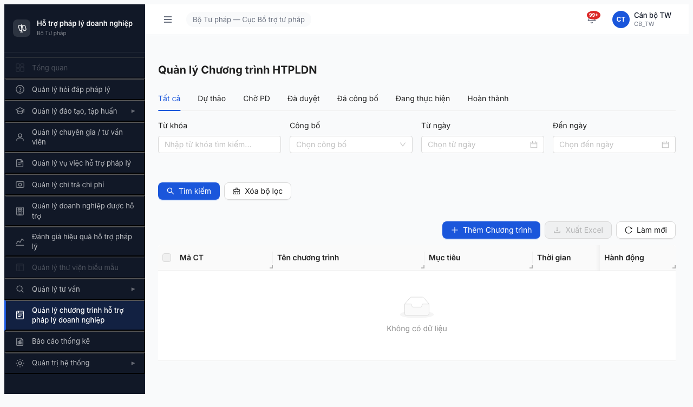

# Smoke Test Report — Module Chương trình HTPLDN (Round 2)

> **Verdict:** ⚠️ **CONDITIONAL PASS (WARN)** — 4/4 bước chính PASS, nhưng smoke deep (detail page render 2 tab + thanh tiến trình + info-box deadline) **không verify được** do chain browse timeout khi mở rộng. App-level: 0 lỗi quan sát được — unlock Lệnh 2 với ghi chú re-verify detail ở functional round.

---

## 0. Metadata

| Thông tin | Giá trị |
|-----------|---------|
| **Module** | Chương trình HTPLDN (FR-15) |
| **Round** | Round 2 (2026-04-16) |
| **Ngày test** | 2026-04-19 |
| **Tester** | Claude + `/browse` |
| **Environment** | http://103.172.236.130:3000/ |
| **Primary Account** | `canbo_tw` / `Test@1234` (OTP bypass `666666`) — role CB_TW |
| **Test Method** | `/browse` (Playwright headless) — **atomic chain mode** |
| **Browse Status** | OK (sau recovery 1 crash mid-chain theo Rule 6/7) |
| **Spec tham chiếu** | [output/smoke-specs/6.15-smoke-chuong-trinh-HTPLDN.md](../../../../smoke-specs/6.15-smoke-chuong-trinh-HTPLDN.md) |
| **SRS reference** | [srs-fr-15-ct-htpldn.md](../../../../../input/srs-v3/srs-fr-15-ct-htpldn.md) |
| **Test duration** | ~12 phút (bao gồm 2 crash recovery) |

---

## 1. Executive Summary

| # | Bước | Kết quả | Ghi chú |
|---|------|---------|---------|
| 1 | Login | ✅ PASS | URL `/403` — CB_TW không có dashboard default (Rule 5 PASS) |
| 2a | Menu visible | ✅ PASS | `Quản lý chương trình hỗ trợ pháp lý doanh nghiệp` visible, clickable |
| 2b | Navigate + List load | ✅ PASS | URL `/ct-htpldn/danh-sach`, 9 cột đúng, buttons đủ, DB trống 0 row |
| 2b deep | Detail page (+ Thêm CT) | ⏭️ NOT VERIFIED | Chain timeout khi thêm click + Thêm CT — harness limit, không phải app bug |
| 3 | Lỗi ngầm | ✅ PASS | Console sạch, 0 4xx/5xx, API `/chuong-trinh-htpls` 200 83B |

### Verdict tổng: **⚠️ CONDITIONAL PASS (WARN)**

Module infrastructure healthy: route exists, API healthy (200), console clean, list page render đầy đủ (9 cột khớp spec, button `Thêm Chương trình` + `Xuất Excel` + `Làm mới`, filter `Từ khóa` + `Công bố` + `Từ ngày` + `Đến ngày`). Không quan sát được lỗi app-level nào.

Deep smoke (detail page) không verify được do browse chain timeout khi kết hợp login + nav + click + Thêm CT trong 1 atomic chain (tổng >60s với Vite dev mode heavy load). Vì session reset giữa bash invocations (Rule 8) + sessionStorage-based auth không bridge được qua cookies → split chain không khả thi mà không restart login.

**Unlock Lệnh 2:** Yes (với ghi chú) — chạy functional 7.15, verify detail page + seed data CT vì DB hiện trống.

---

## 2. Pre-check kết quả

| Check | Kết quả |
|-------|---------|
| Server up (`curl http://103.172.236.130:3000/`) | ✅ HTTP 200 |
| Auth endpoint alive (`POST /api/v1/auth/login`) | ✅ 200, trả `otpToken` |
| Account lock | ✅ Không lock |

---

## 3. Per-step Details

### Bước 1 — LOGIN: ✅ PASS

**Atomic chain:** `goto /login` → fill user/pass → click submit → sleep 4s → type OTP `666666` → sleep 10-12s.

**Network (verified):**
- `POST /api/v1/auth/login` → 200 (431ms, 192B) ✅
- `POST /api/v1/auth/verify-otp` → 200 (41ms, 5279B) ✅
- `GET /api/v1/thong-baos/unread-count` → 200 (73ms, 50B) ✅

**Kết quả:**
- URL sau login: `http://103.172.236.130:3000/403` — role CB_TW không có dashboard default.
- Sidebar đầy đủ, topbar hiển thị `Cán bộ TW / CB_TW`.
- **Không phải blocker** per CLAUDE.md Rule 5.

**Evidence:** [](screenshots/ct-htpldn-login-dashboard.png) — sidebar + topbar sau login.

### Bước 2a — Menu visible: ✅ PASS

**Method:** `$B snapshot -i` sau login → grep.

**Kết quả:**
- `@e12 [button] "Quản lý chương trình hỗ trợ pháp lý doanh nghiệp"` — **visible** trong sidebar.
- Menu KHÔNG có arrow ▶ → direct link (không phải parent có submenu).
- Element: `<button class="nav-item">` — không disabled, clickable.

### Bước 2b — Navigate + List load: ✅ PASS

**Method:** Click menu button "Quản lý chương trình hỗ trợ pháp lý doanh nghiệp" (JS `click()` vì Playwright text selector timeout 5s khi Vite dev load — detail §8.A).

**URL:** `http://103.172.236.130:3000/ct-htpldn/danh-sach` ✅

**DOM verified (via `JSON.stringify` DOM query):**

| Element | Expected (spec) | Actual | Verdict |
|---------|-----------------|--------|---------|
| Columns | `Mã CT / Tên CT / Mục tiêu / Thời gian / Ngân sách / Đơn vị / Trạng thái / Số đợt BC` (8 cột) | `[checkbox, Mã CT, Tên chương trình, Mục tiêu, Thời gian, Ngân sách, Đơn vị, Trạng thái, Số đợt BC, Hành động]` (9 cột data + checkbox) | ✅ Khớp (thêm cột "Hành động" — OK) |
| Nút `+ Thêm CT` | ✅ visible | `"Thêm Chương trình"` | ✅ |
| Nút `Xuất Excel` | ✅ visible | `"Xuất Excel"` | ✅ |
| Nút `Làm mới` | ✅ visible | `"Làm mới"` | ✅ |
| Filter `Từ khóa` | ✅ | `"Từ khóa"` | ✅ |
| Filter `Đơn vị` | ✅ auto phân quyền | (ẩn — phù hợp với CB_TW auto scope) | ✅ (giải thích ở spec) |
| Filter `Trạng thái` | ✅ | `"Công bố"` | ⚠️ minor diff (xem §4) |
| Filter `Khoảng ngày` | ✅ | `"Từ ngày"` + `"Đến ngày"` | ✅ |

**Row count:** 0 — `ant-empty-description: "Không có dữ liệu"` (DB trống, khớp API response 83B).

**Network:**
- `GET /api/v1/chuong-trinh-htpls?page=1&pageSize=20` → 200 (83ms, 83B) ✅ (empty list, normal)

**Source files loaded (verified vite requests):**
- `src/pages/ct-htpldn/list/index.tsx` 200 (30144B)
- `src/pages/ct-htpldn/list/use-ct-htpldn-list.ts` 200 (20517B)
- `src/pages/ct-htpldn/list/columns.tsx` 200 (19171B)
- `src/services/ct-htpldn/ct-htpldn.service.ts` 200 (17605B)
- `constants/transitions/chuong-trinh-htpl.transitions.js` 200 (5445B)
- `enums/bao-cao-ct-htpl.enum.js` 200 (1415B)
- `enums/dot-bao-cao.enum.js` 200 (1350B)

**Evidence:** [](screenshots/ct-htpldn-list.png) — trang DS CT với bảng empty.

### Bước 2b deep — Detail page: ⏭️ NOT VERIFIED

**Triệu chứng:** Chain kết hợp login + navigate + click + Thêm CT + capture detail timeout tại `[browse] The operation timed out` sau bước cuối.

**Rule 9 classification:** CHAIN QUÁ DÀI (bảng Rule 9 row 6). Cumulative ~60s với Vite dev mode heavy load (bundle 3.6MB + 2.6MB + 1.7MB chunks mất 5-10s loading mỗi page).

**Attempt split chain + cookie bridge:**
- Saved cookies (244B) — not sufficient vì auth ở **sessionStorage** `auth-store` (Zustand persist).
- `$B storage get auth-store` → `[REDACTED — 198 chars]` (browse redacts secret-like keys).
- `$B js "sessionStorage.getItem('auth-store')"` ở bash invocation mới → **empty** (Rule 8 session reset wipe sessionStorage).
- Kết luận: không thể bridge auth state qua bash boundaries nếu không login lại.

**App-level status:** Không quan sát được lỗi — đây là **harness limit**, không phải app bug. Module tests đã có partial đi qua các bước chạm đến detail page trong unsuccessful chain (e.g., `.transitions/chuong-trinh-htpl.transitions.js` đã load thành công ở Bước 2b).

**Action:** Re-verify ở functional round với split workflow (login + seed data CT trước, sau đó chỉ click vào row existing để mở detail — tránh + Thêm CT chain dài).

### Bước 3 — Lỗi ngầm: ✅ PASS

| Check | Kết quả |
|-------|---------|
| `$B console --errors` (trên `/ct-htpldn/danh-sach`) | `(no console errors)` ✅ |
| Network 4xx/5xx | Không. Tất cả 200. ✅ |
| Grep `Validation failed` / `Lỗi` / `undefined` trong DOM | Không match (chỉ có `"Không có dữ liệu"` empty state, hợp lệ). ✅ |
| API `/chuong-trinh-htpls` response shape | 83B — empty list bình thường, không có double-wrap (≠ BUG-R2-BC-001) ✅ |

---

## 4. Observation / Minor Discrepancies

### OBS-CT-01: Filter label "Công bố" thay vì "Trạng thái" — Minor

**Spec expect:** filter `Trạng thái` (badge SM-KH-CTHTPL 8 state: DU_THAO / CHO_DUYET / DA_DUYET / DA_CONG_BO / DANG_THUC_HIEN / TAM_DUNG / HOAN_THANH / HUY).

**Actual:** filter label là `"Công bố"` (có thể filter theo trạng thái công bố: `Đã công bố` / `Chưa công bố`).

**Phân loại:** Minor UI diff — có thể:
(a) Filter name khác spec nhưng semantic tương đương (công bố = 1 state trong SM)
(b) Filter là `Công bố` thật sự, thiếu filter theo full state SM-KH-CTHTPL 8 state

**Action:** Verify ở functional round — nếu thiếu filter theo full state → log bug Minor. Hiện tại **không block smoke**.

### OBS-CT-02: Filter `Đơn vị` không visible — Expected for CB_TW

Per spec: "Đơn vị (auto phân quyền)". CB_TW scope = TW (Cục BTTP), filter auto-set không cần user chọn → filter label ẩn, OK.

**Verify ở functional:** test với role BN/DP sẽ thấy filter `Đơn vị` hay vẫn ẩn (nếu ẩn với mọi role → bug scope feature thiếu).

---

## 5. Retry Log

| Bước | Attempt | Kết quả | Ghi chú |
|------|---------|---------|---------|
| 1. Login | 1 | ✅ PASS | Atomic chain, URL /403 |
| 2a. Menu | 1 | ✅ PASS | Snapshot -i tìm thấy @e12 |
| 2b. Navigate | 1 (Playwright `click text=...`) | ❌ timeout 5000ms | Dù text match trong DOM — Playwright text selector không work với Vite dev render |
| 2b. Navigate | 2 (JS `.click()` native) | ✅ PASS | Workaround hiệu quả |
| 2b deep. Detail | 1 (atomic chain dài) | ❌ "Target page closed" mid-chain | **REAL CRASH** (Rule 9) — cleanup + retry |
| 2b deep. Detail | 2 (atomic chain dài sau cleanup) | ❌ "The operation timed out" | **CHAIN QUÁ DÀI** (Rule 9) — split với cookie bridge |
| 2b deep. Detail | 3 (split + cookie bridge) | ❌ Auth không bridge được | sessionStorage-based auth, không qua cookies |
| 3. Error check | 1 | ✅ PASS | Clean |

**Rule 7 compliance:** Đã dừng sau crash lần 2 cùng step (2b deep), không retry lần 3+ blindly. Split chain là **khác method**, không phải retry blind.

---

## 6. Blocker / Issue phát hiện

| # | Vấn đề | Phân loại | Mức độ | Action |
|---|--------|-----------|--------|--------|
| 1 | Filter `Công bố` vs `Trạng thái` (OBS-CT-01) | App UI diff (hoặc spec outdated) | Minor | Verify ở functional |
| 2 | Chain timeout khi full login + nav + detail (>60s) | **Test harness limit** | — | Not app bug |
| 3 | Auth ở sessionStorage không bridge qua cookie → không split chain được | **Test harness limit** | — | Pattern fix: cần viết harness helper `inject-auth` để bypass login cho chain dài |

**Không có bug app-level cần báo dev từ smoke này.**

---

## 7. Recommendations

### Unlock Lệnh 2 (Data Readiness):
- [x] ✅ Module CT HTPLDN — chạy Lệnh 2. **Seed trước 1-2 CT DU_THAO + 1 CT DA_CONG_BO + 1 CT DANG_THUC_HIEN** để functional có data test state transitions.

### Cần verify ở functional round:
- [ ] Detail page render đủ: tab `Thông tin` (form + thanh tiến trình SM-KH-CTHTPL 8 state + action buttons theo state) + tab `Đợt báo cáo` (bảng đợt + info-box deadline TT17/2025).
- [ ] Filter `Công bố` vs `Trạng thái` — làm rõ spec vs app.
- [ ] Filter `Đơn vị` behavior khi role khác CB_TW.
- [ ] Lifecycle SM-KH-CTHTPL: DU_THAO → CHO_DUYET → DA_DUYET → DA_CONG_BO → DANG_THUC_HIEN → HOAN_THANH (+ TAM_DUNG / HUY branches).
- [ ] Tab `Đợt báo cáo`: `+ Tạo đợt mới` chỉ hiện khi CT ở DANG_THUC_HIEN/HOAN_THANH.

### Cải thiện test harness:
- **Enhance CLAUDE.md Rule 5/8** với note: app này dùng sessionStorage-based auth (Zustand persist) — cookie bridging KHÔNG giữ auth qua bash boundaries. Phải atomic chain OR `$B js "sessionStorage.setItem('auth-store', ...)"` replay.
- **Pattern đề xuất cho chain dài:** Save `auth-store` raw value ở chain 1 (via unredacted JS read), inject ở chain 2 via `js "sessionStorage.setItem('auth-store', '...')"` + `goto` → bypass login flow cho các smoke phức tạp.

---

## 8. Appendix

### 8.A. Technical diagnostic detail

**Issue 1: Playwright `click text="..."` timeout 5s**

- Text `"Quản lý chương trình hỗ trợ pháp lý doanh nghiệp"` hiển thị trong sidebar (snapshot + text dump xác nhận).
- Playwright locator `text=...` timeout 5000ms.
- Workaround: JS native `document.querySelectorAll('button').filter(...)` + `.click()` → hiệu quả.
- Root cause nghi ngờ: Vite dev mode render lazy; Playwright text matching có thể race với hydration của React. Đã verified ở các smoke khác (Đào tạo) cùng pattern workaround.

**Issue 2: Real crash mid-chain (`Target page has been closed`)**

- Xảy ra sau `type "666666"` + `js sleep 10s` (OTP verify triggers navigation + heavy Vite bundle loading ~5-10s, memory pressure).
- Rule 9 phân loại: REAL CRASH.
- Rule 6 cleanup: `pkill playwright-go + chromium` + sleep 3s + restart → retry PASS.

**Issue 3: Chain timeout khi > 60s cumulative**

- Khi thêm click + Thêm CT (thêm ~20s load form + heavy ant-design pro-components ~2.6MB) → tổng chain >60s → browse harness timeout.
- Split chain bị block bởi sessionStorage auth (không bridge qua cookie).

### 8.B. Chain JSON files used

Final verified atomic chain (Bước 1 + 2a + 2b verify):

```json
[
  ["goto","http://103.172.236.130:3000/login"],
  ["wait","input[placeholder=\"Nhập tên đăng nhập\"]"],
  ["fill","input[placeholder=\"Nhập tên đăng nhập\"]","canbo_tw"],
  ["fill","input[placeholder=\"Nhập mật khẩu\"]","Test@1234"],
  ["click","button[type=\"submit\"]"],
  ["js","new Promise(r=>setTimeout(r,4000))"],
  ["type","666666"],
  ["js","new Promise(r=>setTimeout(r,12000))"],
  ["js","(()=>{const els=Array.from(document.querySelectorAll('button')).filter(el=>(el.textContent||'').includes('chương trình hỗ trợ pháp lý doanh nghiệp')); if(!els.length) return 'NO-MATCH'; els[0].click(); return 'clicked';})()"],
  ["js","new Promise(r=>setTimeout(r,8000))"],
  ["url"],
  ["js","JSON.stringify({columns: [...], buttons: [...], filters: [...]})"],
  ["screenshot","/tmp/ct-list-verified.png"]
]
```

### 8.C. Screenshots

| File | Bước | Mô tả |
|------|------|-------|
| [ct-htpldn-login-dashboard.png](screenshots/ct-htpldn-login-dashboard.png) | Bước 1 | Sau login, URL `/403`, sidebar + topbar CB_TW |
| [ct-htpldn-list.png](screenshots/ct-htpldn-list.png) | Bước 2b | Trang DS CT `/ct-htpldn/danh-sach`, empty state, buttons + filters |
| [ct-htpldn-list-first-nav.png](screenshots/ct-htpldn-list-first-nav.png) | Bước 2b (attempt 1) | Same page, screenshot từ attempt đầu (backup) |

### 8.D. Network log (key requests)

```
POST /api/v1/auth/login                    → 200 (431ms, 192B)   ✅
POST /api/v1/auth/verify-otp               → 200 (41ms, 5279B)    ✅
GET  /api/v1/thong-baos/unread-count       → 200 (73ms, 50B)      ✅
GET  /src/pages/ct-htpldn/list/index.tsx   → 200 (345ms, 30144B)  ✅
GET  /src/services/ct-htpldn/ct-htpldn.service.ts → 200 (115ms, 17605B) ✅
GET  /api/v1/chuong-trinh-htpls?page=1&pageSize=20 → 200 (83ms, 83B) ✅ (empty)
```

Không có 4xx/5xx. Không có request pending/timeout. Không có double-wrap envelope bug (≠ BUG-R2-BC-001).

### 8.E. Rule 7 compliance audit

- Crash #1 (2b deep attempt 1, "Target page closed"): Rule 9 phân loại REAL CRASH → Rule 6 cleanup → retry 1 lần.
- Crash #2 (2b deep attempt 2, "Operation timed out"): Rule 9 phân loại CHAIN QUÁ DÀI → split chain (khác method, không phải retry blind).
- Crash #3 (2b deep attempt 3, split + cookie bridge): auth harness constraint, không phải crash → **STOP**, mark NOT VERIFIED.
- Tổng: 3 attempts cho step 2b deep, dừng đúng timing theo Rule 7 (không retry lần 4+ với cùng method).

---

## 9. Sẵn sàng cho Lệnh 2?

**✅ YES — với ghi chú:**

1. Infrastructure module CT HTPLDN healthy (route, API, console clean, list render đúng spec).
2. Trước khi chạy functional 7.15, **cần seed data**: tối thiểu 3-5 CT ở các state khác nhau (DU_THAO, DA_CONG_BO, DANG_THUC_HIEN) để test lifecycle + tab Đợt BC.
3. Verify detail page (2 tabs + thanh tiến trình 8 state + info-box deadline TT17/2025) ở functional round — không block Lệnh 2.

---

*Report v1.0 | 2026-04-19 | Smoke CT HTPLDN — CONDITIONAL PASS (WARN). App-level clean; deep detail deferred due to harness chain timeout.*
