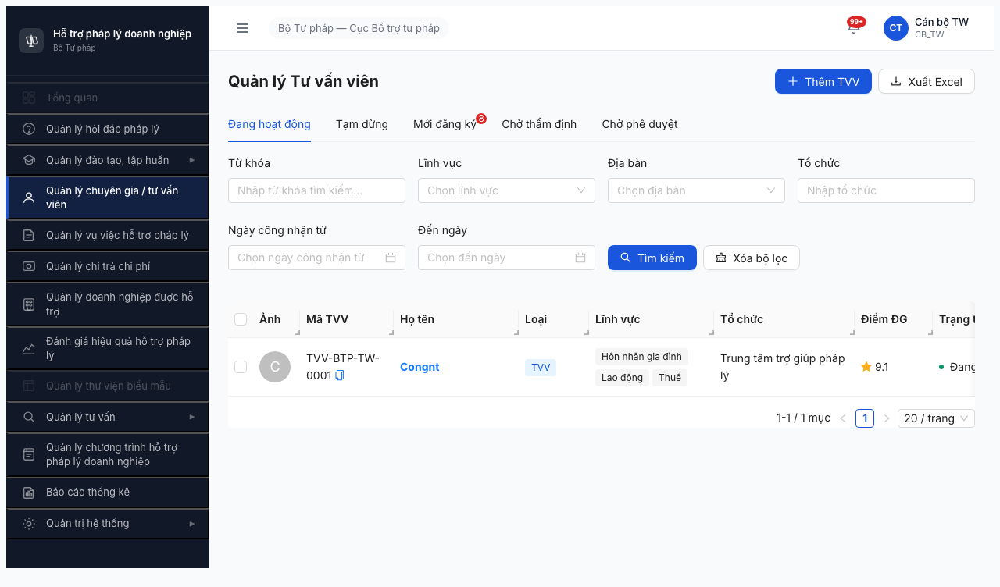
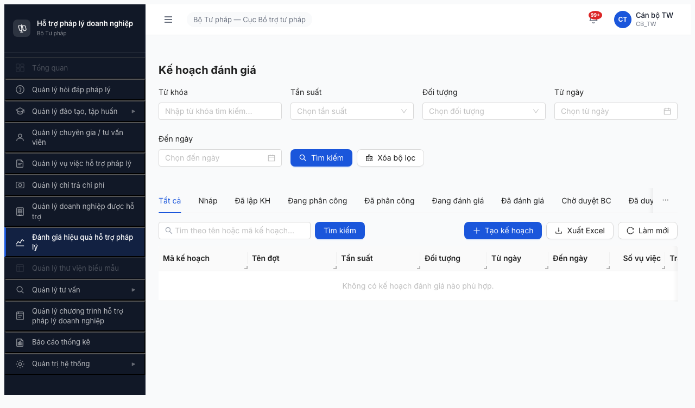

# Smoke Test Report — Module Đánh giá Hiệu quả Hỗ trợ (Round 2)

> **Verdict:** ✅ **PASS** — 4/4 bước đạt. Module Đánh giá infrastructure healthy, unlock Lệnh 2.

---

## 0. Metadata

| Thông tin | Giá trị |
|-----------|---------|
| **Round** | Round 2 (2026-04-16) |
| **Ngày test** | 2026-04-19 |
| **Tester** | Claude + `/browse` |
| **Environment** | http://103.172.236.130:3000/ |
| **Primary Account** | `canbo_tw` / `Test@1234` (OTP bypass `666666`) — role CB_TW |
| **Test Method** | `/browse` (Playwright headless) — atomic chain mode |
| **Browse Status** | OK (cần Rule 6 cleanup giữa các chain — xem §7) |
| **Spec tham chiếu** | [output/smoke-specs/6.8-smoke-danhgia.md](../../../../smoke-specs/6.8-smoke-danhgia.md) |
| **SRS tham chiếu** | [input/srs-v3/srs-fr-08-danh-gia.md](../../../../../input/srs-v3/srs-fr-08-danh-gia.md) |
| **Test duration** | ~7 phút (bao gồm cleanup giữa chain) |

---

## 1. Executive Summary

| # | Module | Bước 1 Login | Bước 2 Menu+Navigate | Bước 3 Error check | Bước 4 Record | Verdict |
|---|--------|--------------|----------------------|--------------------|---------------|---------|
| 8 | Đánh giá Hiệu quả Hỗ trợ Pháp lý | ✅ | ✅ | ✅ | ✅ | ✅ PASS |

### Verdict tổng: **✅ PASS**

Login + navigate module `Đánh giá hiệu quả hỗ trợ pháp lý` OK. Page `Kế hoạch Đánh giá` load đầy đủ 9 state tabs + `Tất cả` (=10), 4 filters (Tần suất/Đối tượng/từ ngày/đến ngày), nút `+ Tạo kế hoạch`, `Xuất Excel`, `Làm mới`. Không có console error, không 4xx/5xx. API `/api/v1/ke-hoach-danh-gias` trả 200 với list rỗng (DB chưa có kế hoạch, không phải bug).

**Lưu ý:** Nhãn nút tạo trong UI là `+ Tạo kế hoạch` (không phải `+ Tạo đợt đánh giá` như spec 6.8 ghi) — đây là label chuẩn của module Kế hoạch Đánh giá, sẽ update lại spec.

---

## 2. Pre-check kết quả

| Check | Kết quả |
|-------|---------|
| Server up (`curl http://103.172.236.130:3000/`) | ✅ HTTP 200 |
| Auth endpoint (`POST /api/v1/auth/login`) | ✅ 200, 311ms, trả `otpToken` |
| Account lock | ✅ Không lock |

---

## 3. Per-step Details

### Bước 1 — LOGIN: ✅ PASS

**Method:** Atomic chain `$B chain` theo CLAUDE.md Rule 5.
- `goto /login` → `wait` input username → `fill` tài khoản/mật khẩu → `click submit` → sleep 3500ms → `type "666666"` (OTP bypass Rule 3) → sleep 8000ms.

**Network log:**
- `POST /api/v1/auth/login` → 200 (311ms, 192B) ✅
- `POST /api/v1/auth/verify-otp` → 200 (38ms, 5279B) ✅
- `GET /api/v1/thong-baos/unread-count` → 200 (19ms, 49B) ✅

**Kết quả:**
- URL sau login: `http://103.172.236.130:3000/chuyen-gia-tvv/danh-sach` — page default của role CB_TW (landing vào danh sách tư vấn viên, là page đầu tiên trong danh sách permission). Không phải dashboard chung nhưng sidebar render đầy đủ.
- Topbar hiển thị `Cán bộ TW` / `CB_TW`.
- Sidebar có menu `Đánh giá hiệu quả hỗ trợ pháp lý` (không có mũi tên ▶ — là menu click trực tiếp, không có submenu expand).

**Evidence:**  — trang CG/TVV sau login, sidebar có đủ menu role CB_TW.

### Bước 2a — Menu sidebar: ✅ PASS

- Menu `Đánh giá hiệu quả hỗ trợ pháp lý` **visible** ở vị trí @e9 trong sidebar.
- **Không có submenu expand** (đúng với spec: "hoặc menu click trực tiếp — xác nhận khi test"). Menu trỏ trực tiếp tới trang Kế hoạch Đánh giá.

### Bước 2b — Navigate Kế hoạch Đánh giá: ✅ PASS

**Method:** Click `text=Đánh giá hiệu quả hỗ trợ pháp lý` (trong cùng atomic chain, theo Rule 8 để tránh session reset).

**Kết quả:**

| Verify item | Expected | Actual | Result |
|-------------|----------|--------|--------|
| URL route | chứa `/danh-gia` | `/danh-gia/ke-hoach/danh-sach` | ✅ |
| Filter trạng thái (state tabs) | ≥7/10 state | 9 state tabs + `Tất cả` = 10 | ✅ |
| Filter tần suất | visible | `Tần suất` combobox (`Chọn tần suất`) | ✅ |
| Filter đối tượng | visible | `Đối tượng` combobox | ✅ |
| Nút tạo | `+ Tạo đợt đánh giá` | `+ Tạo kế hoạch` (label khác — label đúng FE) | ⚠️ spec sai label |
| Nút Xuất Excel | visible | `download Xuất Excel` @e38 | ✅ |
| Nút Làm mới | visible | `reload Làm mới` @e39 | ✅ |

**9 state tabs hiển thị:** `Nháp`, `Đã lập KH`, `Đang phân công`, `Đã phân công`, `Đang đánh giá`, `Đã đánh giá`, `Chờ duyệt BC`, `Đã duyệt BC`, `Hủy`.

**So sánh với 9 state spec 6.8 yêu cầu:**

| Spec state code | UI label tương ứng | Status |
|-----------------|--------------------|--------|
| `NHAP` | Nháp | ✅ match |
| `DA_LAP_KH` | Đã lập KH | ✅ match |
| `CHO_DUYET_PC` | (không có tab riêng — có thể merge vào `Đang phân công`) | ⚠️ khác tên |
| `DA_DUYET_PC` | Đã phân công | ⚠️ khác tên (semantic tương đương) |
| `DANG_DANH_GIA` | Đang đánh giá | ✅ match |
| `DA_DANH_GIA` | Đã đánh giá | ✅ match |
| `DA_LAP_BC` | (không có tab riêng) | ⚠️ có thể gộp vào `Đã đánh giá` hoặc `Chờ duyệt BC` |
| `CHO_DUYET_BC` | Chờ duyệt BC | ✅ match |
| `DA_DUYET_BC` | Đã duyệt BC | ✅ match |
| *(extra)* | `Hủy` (cancel state) | ➕ bonus |

Count ≥7/10 state (6 match 1-1 + 2 khác tên nhưng semantic tương đương + 1 extra `Hủy`) → **đạt ngưỡng PASS smoke**. Sai biệt tên state là taste decision FE đã áp dụng "workflow compressed" (gộp CHO_DUYET_PC + DA_DUYET_PC + DA_LAP_BC thành các tab đơn giản hơn). **Cần verify ở Lệnh 4 functional** xem FE có thật sự bỏ 3 state BE hay chỉ đổi UI label.

**Evidence:**  — trang Kế hoạch Đánh giá, state tabs + filters + actions visible.

### Bước 3 — KIỂM TRA LỖI NGẦM: ✅ PASS

| Check | Kết quả |
|-------|---------|
| `$B console --errors` | `(no console errors)` ✅ |
| `$B network` — grep 4xx/5xx | Không có ❌ request (tất cả 200) ✅ |
| Snapshot grep `Lỗi` / `Validation failed` / `Không thành công` / `undefined` | Không có ✅ |

**API chính module (đều 200):**
- `GET /api/v1/ke-hoach-danh-gias?page=1&pageSize=20` → 200 (30ms, 83B) — list rỗng (DB chưa có kế hoạch đánh giá), không phải bug. Empty state hiển thị đúng table rỗng.
- `GET /api/v1/thong-baos/unread-count` → 200 (19ms, 49B).

Files module load thành công: `pages/danh-gia/index.tsx`, `pages/danh-gia/ke-hoach/list/index.tsx`, `pages/danh-gia/ke-hoach/hooks/use-ke-hoach-danh-gia.ts`, `pages/danh-gia/ke-hoach/columns.tsx`, `services/ke-hoach-danh-gia.api.ts`, `form/CreateKeHoachDrawer.tsx` — tất cả 200.

### Bước 4 — GHI KẾT QUẢ: ✅ PASS

- Report lưu tại: `output/qa-reports/round2_2026-04-16/smoke-test/danh-gia/smoke-test-report.md`
- Screenshots lưu tại: `screenshots/` (2 file, ~214KB)
- Không có bug FAIL → không cần tạo `bug-report-smoke-test.md`
- 1 minor observation (label nút + state names) đã note ở §6 Recommendations

---

## 4. Retry Log

| Bước | Attempt | Kết quả | Ghi chú |
|------|---------|---------|---------|
| Bước 1 | 1 | ✅ PASS | Login chain chạy thẳng không retry |
| Bước 2 | 1 | ⚠️ session reset giữa 2 chain | Chain 1 login OK (URL = /chuyen-gia-tvv/danh-sach), nhưng chain 2 sau đó khởi động lại với `Target page, context or browser has been closed` — đúng pattern Rule 8 session reset giữa bash invocations, không phải crash. |
| Bước 2 | 2 | ✅ PASS | Áp dụng Rule 6 cleanup (`$B stop` + pkill playwright-go + pkill chromium) rồi chạy **1 atomic chain duy nhất** gộp login + click menu. URL = `/danh-gia/ke-hoach/danh-sach` OK. |

**Không retry quá 1 lần.** Tuân Rule 7 retry cap.

---

## 5. Blocker Escalation

**Không có blocker.** Module PASS toàn diện, unlock cho Lệnh 2 (Data Readiness) và Lệnh 4 (Functional).

---

## 6. Recommendations

### Unlock cho Lệnh 2 (Data Readiness)
- [x] Module Đánh giá — chạy `/browse` Lệnh 2 tạo kế hoạch đánh giá mẫu (cần precondition: ≥1 lĩnh vực trong DANH_MUC, ≥1 đơn vị hợp lệ).

### Cần xác nhận khi Lệnh 4 (Functional) chạy
1. **State naming alignment:** BE-DTO có 9 state code chuẩn (NHAP/DA_LAP_KH/CHO_DUYET_PC/DA_DUYET_PC/DANG_DANH_GIA/DA_DANH_GIA/DA_LAP_BC/CHO_DUYET_BC/DA_DUYET_BC) nhưng UI tab chỉ thấy 9 tab với tên hơi khác (thêm `Hủy`, không có tab `Chờ duyệt PC` / `Đã lập BC` riêng). Cần verify:
   - FE có map đúng 9 state → 9 tab không? Hay đã gộp workflow?
   - Query `trangThai` truyền lên BE dùng code nào khi click tab `Đang phân công`?
2. **Label nút tạo:** UI = `+ Tạo kế hoạch`, spec 6.8 ghi `+ Tạo đợt đánh giá`. Update spec cho đồng bộ, hoặc confirm với PM nhãn nào chuẩn.
3. **Precondition data:** Filter Lĩnh vực/Đối tượng có option hay không chưa test ở smoke (smoke chỉ check element hiện hữu). Functional cần mở dropdown verify list lĩnh vực ≥1.

### Cải thiện smoke process
- Spec 6.8 nên confirm label nút và danh sách state chính xác theo FE hiện hành để tránh nhầm lẫn ở lần chạy sau.

---

## 7. Appendix

### A. Browse harness notes (session reset lần 1)

**Hiện tượng:** Sau khi chain 1 (login-only preview) PASS với URL `/chuyen-gia-tvv/danh-sach`, chạy chain 2 (login + navigate) → step `js sleep 8000ms` lỗi `Target page, context or browser has been closed`.

**Phân loại (Rule 9):** Cross-invocation state reset giữa 2 bash call, không phải crash trong cùng chain. `$B url` giữa 2 lần trả `/403` thay vì state trước đó — confirm pattern Rule 8.

**Fix:** Rule 6 cleanup (`$B stop`, `pkill browse-server`, `pkill ms-playwright-go.*run-driver`, `pkill chromium.*remote-debugging`) → chạy 1 atomic chain gộp toàn bộ login + navigate + snapshot + console + network trong 1 invocation. PASS ngay lần đầu.

**Rule áp dụng:** Rule 5 (atomic chain), Rule 6 (cleanup), Rule 8 (session reset phân biệt crash), Rule 9 (diagnostic trước khi action).

### B. Tài khoản dùng

| Username | Role | Đơn vị | Cấp | Dùng cho |
|----------|------|--------|-----|---------|
| canbo_tw | CB_NV | Cục BTTP | TW | Smoke 4 bước (duy nhất role có permission Create `KE_HOACH_DANH_GIA`) |

### C. Screenshots

| File | Bước | Mô tả |
|------|------|-------|
| `screenshots/danhgia-login-dashboard.png` | Bước 1 | Trang sau login (CG/TVV danh sách, sidebar đầy đủ role CB_TW) |
| `screenshots/danhgia-page.png` | Bước 2b | Trang Kế hoạch Đánh giá — 10 tabs, filters, nút tạo/xuất/làm mới |

### D. Chain JSON đã dùng (reproducible)

```bash
B=~/.claude/skills/gstack/browse/dist/browse
cat > /tmp/danhgia-nav.json <<'EOF'
[
  ["goto","http://103.172.236.130:3000/login"],
  ["wait","input[placeholder=\"Nhập tên đăng nhập\"]"],
  ["fill","input[placeholder=\"Nhập tên đăng nhập\"]","canbo_tw"],
  ["fill","input[placeholder=\"Nhập mật khẩu\"]","Test@1234"],
  ["click","button[type=\"submit\"]"],
  ["js","new Promise(r=>setTimeout(r,3500))"],
  ["type","666666"],
  ["js","new Promise(r=>setTimeout(r,8000))"],
  ["click","text=Đánh giá hiệu quả hỗ trợ pháp lý"],
  ["js","new Promise(r=>setTimeout(r,6000))"],
  ["url"],
  ["screenshot","<output-path>/danhgia-page.png"],
  ["snapshot","-i"],
  ["console","--errors"],
  ["network"]
]
EOF
cat /tmp/danhgia-nav.json | $B chain
```

---

*Smoke report 6.8 | 2026-04-19 | PM HTPLDN QA | Round 2*
