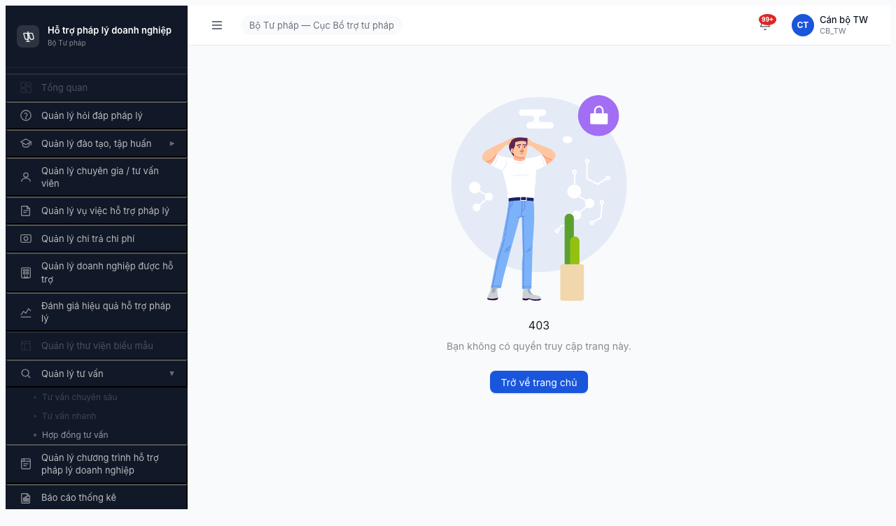

# Bug Report — Smoke Test FR-12 Tư vấn Chuyên sâu

| Thông tin | Giá trị |
|-----------|---------|
| **Dự án** | PM HTPLDN (Phần mềm Hỗ trợ Pháp lý Doanh nghiệp) |
| **Phiên bản** | Round 2 — deploy 2026-04-16 |
| **Môi trường** | http://103.172.236.130:3000/ |
| **Người test** | QA Automation (Claude Code + `/browse`) |
| **Ngày** | 22:07–22:10 2026-04-19 |
| **Loại test** | Smoke Test (BAGM 4 check) |
| **Round** | Round 2 |
| **Tài liệu tham chiếu** | [smoke-specs/6.12-smoke-tv-chuyensau.md](../../../../smoke-specs/6.12-smoke-tv-chuyensau.md), [input/srs-v3/srs-fr-12-tv-chuyen-sau.md](../../../../../input/srs-v3/srs-fr-12-tv-chuyen-sau.md), [permission-matrix.md §8.3](../../../../permission-matrix.md) |
| **Smoke report** | [smoke-test-report.md](smoke-test-report.md) |

---

## Tổng hợp

Phát hiện **2** lỗi trong quá trình smoke test FR-12 Tư vấn Chuyên sâu (Bước 2b Navigate).

| Tổng | Critical | Major | Medium | Minor | Trivial |
|------|----------|-------|--------|-------|---------|
| 2    | 1        | 1     | 0      | 0     | 0       |

## Bug Summary Table

| Bug ID | Severity | Priority | Type | Module | TC Ref | Title | Status |
|--------|----------|----------|------|--------|--------|-------|--------|
| BUG-SMOKE-TVCS-001 | Critical | P0 | Permission / UI | FR-12 TVCS | Smoke 6.12 Bước 2b | Menu `Tư vấn chuyên sâu` disabled UI — `canbo_tw` (CB_TW) click không navigate (duplicate BUG-PERM-M8.3-002) | Open (duplicate) |
| BUG-SMOKE-TVCS-002 | Major | P1 | Workflow / Routing | FR-12 TVCS | Smoke 6.12 Bước 2b | Route `/tv-chuyen-sau` auto-redirect về `/danh-gia/ke-hoach/danh-sach` sau ~1s khi session role QTHT_TW | **MỚI** — Open |

> **Ghi chú:** BUG-SMOKE-TVCS-001 là **duplicate xác nhận** của BUG-PERM-M8.3-002 Critical đã báo ngày 2026-04-19 (section-8.3 permission report). Giữ lại trong bug report này để hiển thị evidence từ smoke phase (screenshot UI disabled) và link với verdict Smoke FAIL.
>
> **BUG-SMOKE-TVCS-002 là bug MỚI**, chưa từng báo — phát hiện tình cờ khi session browse còn cache QTHT_TW (role duy nhất đã verify có quyền view TVCS list). Cần báo dev điều tra.

---

## BUG-SMOKE-TVCS-001 — Menu `Tư vấn chuyên sâu` click không navigate cho `canbo_tw` (CB_TW): submenu disabled UI

| Trường | Chi tiết |
|--------|----------|
| **Bug ID** | BUG-SMOKE-TVCS-001 |
| **Severity** | Critical |
| **Priority** | P0 |
| **Type** | Permission / UI |
| **Status** | Open (duplicate BUG-PERM-M8.3-002) |
| **Module** | FR-12 Tư vấn Chuyên sâu (TVCS) |
| **Thành phần** | `src/components/AppShell/nav-structure.ts` + `src/utils/auth-rules.ts` (CASL ability rules cho `TU_VAN_CHUYEN_SAU`) |
| **URL** | http://103.172.236.130:3000/403 (sau click submenu vẫn ở đây — menu không navigate) |
| **Trình duyệt** | Chromium 146 (Playwright headless) |
| **Tài khoản** | `canbo_tw` / `Test@1234` (OTP bypass `666666`) — role **CB_TW** (Cán bộ Trung ương) |
| **TC Reference** | Smoke 6.12 Bước 2b; Permission §8.3 TU_VAN_CHUYEN_SAU |
| **SRS Reference** | FR-12 §2.1 — "CB NV TW có Create TVCS"; permission-matrix §8.3 entity `TU_VAN_CHUYEN_SAU` |
| **Assignee** | FE Team |
| **Found by** | Claude Code + `/browse` (atomic chain Rule 5) |

### Mô tả

Với account `canbo_tw` (role CB_TW — "Cán bộ Trung ương"), sau khi login + OTP bypass thành công, landing trang `/403` (đúng per CLAUDE.md: CB_TW không có dashboard default). Sidebar `Quản lý tư vấn ▶` expand ra 3 submenu, trong đó submenu `Tư vấn chuyên sâu` và `Tư vấn nhanh` hiển thị **màu xám (disabled style)** — click **không có hành vi nào**: URL không đổi, không navigate, không toast, không console error. Module TVCS 100% không vận hành được cho primary user theo SRS.

Chỉ `Hợp đồng tư vấn` (submenu thứ 3 cùng nhóm) hiển thị enabled bình thường — chứng tỏ role CB_TW có quyền 1 entity nhóm tư vấn nhưng bị chặn 2 entity còn lại.

### Các bước tái hiện

1. Mở http://103.172.236.130:3000/
2. Login: username `canbo_tw`, password `Test@1234`
3. Nhập OTP `666666` → verify-otp success → landing `/403` (trang "Bạn không có quyền truy cập trang này")
4. Sidebar click menu cha `Quản lý tư vấn ▶` → expand ra 3 submenu
5. Quan sát: `Tư vấn chuyên sâu` và `Tư vấn nhanh` hiển thị màu xám (nhạt hơn `Hợp đồng tư vấn` enabled)
6. Click submenu `Tư vấn chuyên sâu`
7. **Quan sát:** URL không đổi (vẫn `/403`), không có request nào tới `/api/v1/noi-dung-tu-van-cs`, không toast

### Kết quả mong đợi

Theo SRS FR-12 §2.1 và permission-matrix §8.3, role CB_NV_TW (`canbo_tw`) phải có quyền:
- Menu `Tư vấn chuyên sâu` **enabled** (không xám)
- Click submenu → URL đổi sang `/tv-chuyen-sau`
- Page render 3 tab nhóm với counter (`Chờ xử lý`, `Đang tư vấn`, `Hoàn thành`)
- Button `+ Thêm yêu cầu TV` visible (CB NV TW có Create)
- Filter bộ lọc (Chuyên gia / DN / Lĩnh vực / Trạng thái / Khoảng ngày) render
- Table header 6 cột (Mã / DN / Chuyên gia / Lĩnh vực / Trạng thái / Ngày tư vấn) render

### Kết quả thực tế

- Submenu `Tư vấn chuyên sâu` **hiển thị màu xám disabled** trên sidebar
- Click submenu → **nothing happens**:
  - URL: vẫn `/403`
  - Network: 0 request mới (không fetch `src/pages/tv-chuyen-sau/index.tsx`, không gọi `/api/v1/noi-dung-tu-van-cs`)
  - Console: 0 error, 0 warning
  - DOM: không render list/tab/filter/button TVCS
  - Toast: không hiện
- Module effectively **không tồn tại** với user CB_TW → silent fail UX anti-pattern

### Bằng chứng

**Screenshot (chain 2, fresh login `canbo_tw`):**



*Quan sát trên screenshot:* Avatar góc trên bên phải `CT / Cán bộ TW / CB_TW`. Sidebar `Quản lý tư vấn` expand. Dòng `Tư vấn chuyên sâu` và `Tư vấn nhanh` có màu xám nhạt hơn hẳn dòng `Hợp đồng tư vấn` (disabled style). Center page: illustration 403 + nút "Trở về trang chủ".

**Network trace (chain 2, sau click submenu `Tư vấn chuyên sâu`):**
```
(không có request mới nào tới /api/v1/noi-dung-tu-van-cs hoặc /src/pages/tv-chuyen-sau/*)
```

**Console log:**
```
(no console errors)
```

**URL trace:**
```
Before click: /403
After  click: /403  ← không đổi
```

### Tác động (Impact)

- **100% user role CB_TW / CB_NV_TW / CB_NV_BN / CB_NV_DP** không thể truy cập module TVCS qua UI
- SRS FR-12 §2.1 quy định CB NV TW là **primary user có quyền Create TVCS** → bị block toàn bộ workflow nghiệp vụ
- Hệ lụy dây chuyền: CB_PD không duyệt được (CB_NV chưa tạo được yêu cầu), TVV/CG không xác nhận/trả lời được (chưa có yêu cầu phân công)
- Theo permission report section-8.3: 8/11 role bị chặn (CB_NV×3, CB_PD×3, TVV, CG) → module TVCS **effectively không vận hành được**

### So sánh (Comparison) — matrix thực tế sau smoke

| Role | Menu visible | Click navigate | Create TVCS |
|------|--------------|----------------|-------------|
| QTHT_TW | ✅ | ✅ (nhưng redirect — xem BUG-SMOKE-TVCS-002) | ❌ (spec: chỉ view) |
| CB_NV_TW (`canbo_tw`) | ✅ (grey disabled) | ❌ (BUG!) | — blocked trước |
| CB_NV_BN / CB_NV_DP | ✅ (grey disabled) | ❌ (BUG!) | — blocked trước |
| CB_PD_TW/BN/DP | ✅ (grey disabled) | ❌ (BUG!) | — blocked trước |
| TVV | ✅ (grey disabled) | ❌ (BUG!) | — blocked trước |
| CG (primary user) | ✅ (grey disabled) | ❌ (BUG!) | — blocked trước |
| NHT | ❌ (correct per spec) | — | — |

### Nguyên nhân nghi ngờ (Root Cause)

CASL ability rule cho entity `TU_VAN_CHUYEN_SAU` trong `src/utils/auth-rules.ts` (hoặc file rules tương ứng) bị sai: không grant `read`/`manage` cho role CB_NV_*, CB_PD_*, TVV, CG. Kết quả:
- `Can I="read" a="TU_VAN_CHUYEN_SAU"` trả `false` cho 8 role trên
- `nav-structure.ts` dùng `ability.can(...)` để quyết định disabled/enabled state → render xám
- `onClick` handler cũng gated bởi cùng ability check → click no-op

Để verify: mở DevTools → `ability.rules` → tìm rule có subject `TU_VAN_CHUYEN_SAU`.

### Gợi ý sửa (Suggested Fix)

1. Kiểm tra file rules (ví dụ `src/utils/auth-rules.ts`):
   ```ts
   // Đảm bảo có rule tương tự cho TU_VAN_CHUYEN_SAU:
   can(['read', 'create'], 'TU_VAN_CHUYEN_SAU', { /* scope tuỳ role */ });
   // CB_NV_TW: can create
   // CB_NV_BN/DP: can read + create trong scope đơn vị
   // CB_PD_TW/BN/DP: can read + update (duyệt) + approve
   // TVV, CG: can read + update (xác nhận/trả lời) trong scope phân công
   ```
2. Đối chiếu với permission-matrix §8.3 entity `TU_VAN_CHUYEN_SAU` để set action tương ứng từng role.
3. Sau fix: verify submenu enabled (không xám) và click → `/tv-chuyen-sau` render đúng.
4. Bổ sung UX: khi role thực sự không có quyền (như NHT), ngoài việc grey menu, click nên show toast `Bạn không có quyền truy cập module này` thay vì silent no-op.

---

## BUG-SMOKE-TVCS-002 — Route `/tv-chuyen-sau` auto-redirect về `/danh-gia/ke-hoach/danh-sach` sau ~1s (khi role QTHT_TW)

| Trường | Chi tiết |
|--------|----------|
| **Bug ID** | BUG-SMOKE-TVCS-002 |
| **Severity** | Major |
| **Priority** | P1 |
| **Type** | Workflow / Routing |
| **Status** | Open (MỚI — chưa từng báo) |
| **Module** | FR-12 Tư vấn Chuyên sâu (TVCS) |
| **Thành phần** | `src/pages/tv-chuyen-sau/index.tsx` / `src/pages/tv-chuyen-sau/list/index.tsx` / `src/components/PermissionRoute/permission-route.tsx` / `src/routes/router.tsx` |
| **URL** | http://103.172.236.130:3000/tv-chuyen-sau → redirect tự động → /danh-gia/ke-hoach/danh-sach |
| **Trình duyệt** | Chromium 146 (Playwright headless) |
| **Tài khoản** | Session có cached cookie role **QTHT_TW** (từ test phân quyền trước đó) |
| **TC Reference** | Smoke 6.12 Bước 2b; Permission §8.3 TU_VAN_CHUYEN_SAU (QTHT row) |
| **SRS Reference** | FR-12 §2.1 — QTHT có quyền view TVCS list (không có Create) |
| **Assignee** | FE Team (router / PermissionRoute / TVCS page component) |
| **Found by** | Claude Code + `/browse` (chain 1 — accidental cache role) |

### Mô tả

Khi session browse còn cache cookie của role **QTHT_TW** (role duy nhất hiện nay đã xác nhận có quyền VIEW TVCS list theo report section-8.3 permission), click submenu `Tư vấn chuyên sâu` → URL đổi đúng sang `/tv-chuyen-sau` → app tải đủ code chunk và gọi các API TVCS thành công (200, trả empty list 83B) — **NHƯNG** ngay sau đó (~1s) app **tự chuyển URL sang `/danh-gia/ke-hoach/danh-sach`** (module Đánh giá hiệu quả), không có interaction nào từ user. Sidebar selection state cũng di chuyển sang "Đánh giá hiệu quả hỗ trợ pháp lý".

Đây là bug silent redirect — user không hề bấm gì nhưng page tự nhảy sang module khác. Rất khó debug từ phía user.

### Các bước tái hiện

Tái hiện tương đối khó vì cần session role QTHT_TW. Có 2 cách:

**Cách 1 — dùng role QTHT_TW (thuần):**
1. Login với account QTHT_TW (ví dụ `admin` hoặc bất kỳ tài khoản role QTHT_TW — xem test-accounts.csv)
2. Sau OTP bypass, landing `/dashboard`
3. Sidebar click `Quản lý tư vấn ▶` → expand
4. Click `Tư vấn chuyên sâu`
5. **Quan sát:**
   - T=0: URL đổi thành `/tv-chuyen-sau`, page bắt đầu render
   - T≈1s: URL tự động nhảy sang `/danh-gia/ke-hoach/danh-sach`
   - Sidebar highlight chuyển từ `Quản lý tư vấn` sang `Đánh giá hiệu quả`

**Cách 2 — tái hiện qua browse chain (đã verify trong smoke này):**
- Sequence: click `Quản lý tư vấn` → sleep 1.5s → click `Tư vấn chuyên sâu` → sleep 5s → `$B url`
- Observed: URL = `/danh-gia/ke-hoach/danh-sach` (khác với click-immediate return `/tv-chuyen-sau`)

### Kết quả mong đợi

Theo SRS FR-12 + permission-matrix §8.3:
- QTHT_TW có quyền **view** TVCS list (R)
- Click menu → URL `/tv-chuyen-sau` → page render 3 tabs TVCS + table list + filter
- URL giữ nguyên `/tv-chuyen-sau` (không tự redirect)

### Kết quả thực tế

- URL ban đầu đúng: `/tv-chuyen-sau`
- Network log xác nhận TVCS code + API load thành công:
  ```
  GET /src/pages/tv-chuyen-sau/index.tsx → 200 (18ms)
  GET /src/pages/tv-chuyen-sau/list/index.tsx → 200 (22ms)
  GET /src/pages/tv-chuyen-sau/hooks/use-tvcs.ts → 200 (36ms)
  GET /src/pages/tv-chuyen-sau/columns.tsx → 200 (36ms)
  GET /src/pages/tv-chuyen-sau/use-tvcs-filters.ts → 200 (22ms)
  GET /src/services/noi-dung-tu-van-cs.api.ts → 200 (27ms)
  GET /api/v1/tu-van-viens?trangThai=HOAT_DONG&pageSize=50 → 200 (78ms, 83B)
  GET /api/v1/doanh-nghieps?search=&pageSize=50 → 200 (78ms, 9381B)
  GET /api/v1/danh-muc/tree?loaiDanhMuc=LINH_VUC_PL → 200 (78ms, 2433B)
  GET /api/v1/noi-dung-tu-van-cs?page=1&pageSize=20 → 200 (43ms, 83B)   ← TVCS list empty
  ```
- Ngay sau đó:
  ```
  GET /src/pages/danh-gia/index.tsx → 200 (29ms)
  GET /src/pages/danh-gia/ke-hoach/list/index.tsx → 200 (20ms)
  GET /src/pages/danh-gia/ke-hoach/hooks/use-ke-hoach-danh-gia.ts → 200 (12ms)
  GET /api/v1/ke-hoach-danh-gias?page=1&pageSize=20 → 200 (71ms, 2339B)
  ```
- URL cuối: `/danh-gia/ke-hoach/danh-sach`
- Screenshot `tvcs-page.png`: avatar `QTHT_TW`, sidebar highlight `Đánh giá hiệu quả`, table title `Kế hoạch đánh giá`, tabs `Nháp / Đã lập KH / Đang phân công / ...` (tabs của Đánh giá, KHÔNG phải 3 tabs TVCS)

### Bằng chứng

**Screenshot (chain 1, session QTHT_TW, sau click `Tư vấn chuyên sâu` + sleep 5s):**


*Quan sát trên screenshot:* Avatar `QT / QT Hệ thống TW / QTHT_TW`. Sidebar highlight `Đánh giá hiệu quả hỗ trợ pháp lý` (không phải `Quản lý tư vấn`). Title page `Kế hoạch đánh giá`. Filter fields `Tần suất / Đối tượng / Từ ngày / Đến ngày`. Tabs `Tất cả / Nháp / Đã lập KH / Đang phân công / Đã phân công / Đang đánh giá / Đã đánh giá / Chờ duyệt BC / Đã duyệt BC / Hủy`. Button `+ Tạo kế hoạch`. Table có 3 rows `DG-20260419-00xx`. Đây là trang Đánh giá hiệu quả, **không phải TVCS**.

### Tác động (Impact)

- **Impact hiện tại (chưa fix BUG-SMOKE-TVCS-001):** chỉ role QTHT_TW có thể click vào TVCS, và họ gặp bug redirect — nghĩa là **0 role nào hiện dùng được TVCS module qua UI**
- **Impact sau khi fix BUG-SMOKE-TVCS-001:** nếu bug này không fix chung, sau khi mở quyền cho CB_NV/CB_PD/TVV/CG, họ cũng sẽ gặp cùng redirect → module vẫn không vận hành
- **UX:** user bị bounce sang module khác mà không biết lý do — debug rất khó
- **Data integrity:** không corrupt data, nhưng user có thể nhầm lẫn module khi thao tác

### Nguyên nhân nghi ngờ (Root Cause)

Một số hypothesis ưu tiên (cần FE verify):

1. **PermissionRoute logic fallback:** `src/components/PermissionRoute/permission-route.tsx` có thể check ability.can cho `TU_VAN_CHUYEN_SAU` + QTHT → fail (do cùng bug ability rule với §1) → redirect về route đầu tiên có quyền (Đánh giá là route trong CMS list).
2. **TVCS page internal redirect:** `src/pages/tv-chuyen-sau/index.tsx` có `useEffect` check data/permission → navigate đi khi fail (ví dụ: "nếu list empty và không có quyền create → redirect về /danh-gia").
3. **Router config sai:** `src/routes/router.tsx` có thể có default redirect cho role QTHT_TW pointing sai module.
4. **Seed data/ability mismatch:** QTHT_TW có ability `read` nhưng TVCS page require `manage` → guard fail silent → redirect.

**Cách debug nhanh:**
- Mở DevTools Console ngay sau click submenu → log `ability.rules` và navigation events
- Bật React DevTools → quan sát props của PermissionRoute component khi ở `/tv-chuyen-sau`
- Grep codebase: `navigate('/danh-gia')` hoặc `<Navigate to="/danh-gia"` trong `src/pages/tv-chuyen-sau/` và `src/components/PermissionRoute/`

### Gợi ý sửa (Suggested Fix)

Tùy root cause xác định:

**Nếu do PermissionRoute guard:**
```ts
// src/components/PermissionRoute/permission-route.tsx
// Kiểm tra logic fallback — không nên redirect silent.
// Thay vì Navigate() sang module khác, render <Page403 /> hoặc toast error.
```

**Nếu do page component internal useEffect:**
```ts
// src/pages/tv-chuyen-sau/index.tsx
useEffect(() => {
  // LOẠI BỎ / SỬA bất kỳ navigate(...) nào không có guard điều kiện user action
  if (/* ... điều kiện gì đó */) navigate('/danh-gia/...');  // ← NGHI NGỜ ĐÂY
}, [...]);
```

**Nếu do router config:**
```ts
// src/routes/router.tsx
// Kiểm tra route /tv-chuyen-sau có bị override bởi fallback cho role QTHT không.
```

**Nếu do ability mismatch:**
- Grant ability `read` chính xác cho QTHT_TW trên subject `TU_VAN_CHUYEN_SAU`
- Đồng bộ action required giữa route guard + page guard (cùng `read` hoặc cùng `manage`)

**Verify sau fix:**
- Login QTHT_TW → click `Tư vấn chuyên sâu` → URL **giữ nguyên** `/tv-chuyen-sau` ít nhất 10s
- 3 tabs TVCS (`Chờ xử lý` / `Đang tư vấn` / `Hoàn thành`) render đúng
- Table list render (dù empty vẫn hiển thị header 6 cột)
- Không có request `src/pages/danh-gia/*` nào được fetch

---

## Phụ lục

### A — Môi trường test

| Thành phần | Giá trị |
|------------|---------|
| URL ứng dụng | http://103.172.236.130:3000/ |
| OTP login | `666666` (bypass tạm dev đã bật per CLAUDE.md Rule 3) |
| MailHog (OTP inbox) | http://103.172.236.130:8025 (fallback khi bypass tắt) |
| API base | http://103.172.236.130:3000/api/v1 |
| Frontend | React 19 + Vite 6 + Ant Design + CASL + Zustand + React Query |
| Xác thực | JWT + OTP (bypass) |
| Đường dẫn source (server) | /home/ubuntu/dopai/pm-htpldn/source_code |

### B — Tài khoản sử dụng

| Tên đăng nhập | Vai trò | Cấp | Dùng cho bug nào |
|---------------|---------|-----|------------------|
| `canbo_tw` | CB_TW (Cán bộ Trung ương) | TW | BUG-SMOKE-TVCS-001 (fresh login, chain 2) |
| (cached session) | QTHT_TW | TW | BUG-SMOKE-TVCS-002 (chain 1 — session cache còn sót) |

### C — Danh mục ảnh chụp

| File | Mô tả | Dùng cho bug |
|------|-------|--------------|
| [screenshots/tvcs-t1-1500ms.png](screenshots/tvcs-t1-1500ms.png) | canbo_tw (CB_TW) sau click submenu `Tư vấn chuyên sâu` — URL vẫn `/403`, submenu màu xám disabled | BUG-SMOKE-TVCS-001 |
| [screenshots/tvcs-t2-4500ms.png](screenshots/tvcs-t2-4500ms.png) | canbo_tw sau 4.5s — URL không đổi, menu click no-op | BUG-SMOKE-TVCS-001 |
| [screenshots/tvcs-page.png](screenshots/tvcs-page.png) | session QTHT_TW sau click submenu + 5s — đã redirect về `/danh-gia/ke-hoach/danh-sach`, sidebar highlight Đánh giá | BUG-SMOKE-TVCS-002 |
| [screenshots/tvcs-sidebar-expanded.png](screenshots/tvcs-sidebar-expanded.png) | session QTHT_TW, sidebar mở `Quản lý tư vấn` — 3 submenu TVCS/TVN/HĐTV visible | Context (cả 2 bug) |
| [screenshots/tvcs-login-dashboard.png](screenshots/tvcs-login-dashboard.png) | session QTHT_TW, dashboard mặc định sau OTP | Context (chain 1 env) |

### D — Atomic chain tái hiện (evidence)

**Chain 2 tái hiện BUG-SMOKE-TVCS-001 (verified):**

```json
[
  ["goto","http://103.172.236.130:3000/login"],
  ["wait","input[placeholder=\"Nhập tên đăng nhập\"]"],
  ["fill","input[placeholder=\"Nhập tên đăng nhập\"]","canbo_tw"],
  ["fill","input[placeholder=\"Nhập mật khẩu\"]","Test@1234"],
  ["click","button[type=\"submit\"]"],
  ["js","new Promise(r=>setTimeout(r,3500))"],
  ["type","666666"],
  ["js","new Promise(r=>setTimeout(r,8000))"],
  ["url"],
  ["click","text=Quản lý tư vấn"],
  ["js","new Promise(r=>setTimeout(r,1500))"],
  ["click","text=Tư vấn chuyên sâu"],
  ["js","new Promise(r=>setTimeout(r,1500))"],
  ["url"],
  ["screenshot","<path>/tvcs-t1-1500ms.png"],
  ["snapshot","-i","-d","6"],
  ["console","--errors"],
  ["network"]
]
```

**Expected output (cho repro BUG-001):**
- URL sau click = `/403` (không đổi) ❌
- Snapshot show avatar `CB_TW`, submenu `Tư vấn chuyên sâu` có text bình thường nhưng visual xám
- Console: 0 error

### E — Liên kết với báo cáo cũ

- **BUG-PERM-M8.3-002 Critical** (section-8.3 permission report, 2026-04-19): [phan-quyen/section-8.3-tv-chuyen-sau/bug-report-section-8.3.md](../../phan-quyen/section-8.3-tv-chuyen-sau/bug-report-section-8.3.md) — gốc của BUG-SMOKE-TVCS-001
- **Pattern tương tự "menu disabled 8 role"** đã thấy ở:
  - FR-09 Biểu mẫu: BUG-PERM-M7-002 Blocker (CB_NV disabled)
  - FR-09 Biểu mẫu smoke: 2 Blocker (menu disabled + stuck spinner)
- **Recommend gộp bug** khi gửi dev: dev có thể fix 1 FE ability-rule unblock nhiều module cùng lúc (như note M7: "fix 1 dòng FE ability-rule unblock 16/18 ô")

---

*Bug report generated: 2026-04-19 | QA Automation (Claude Code + `/browse`)*
