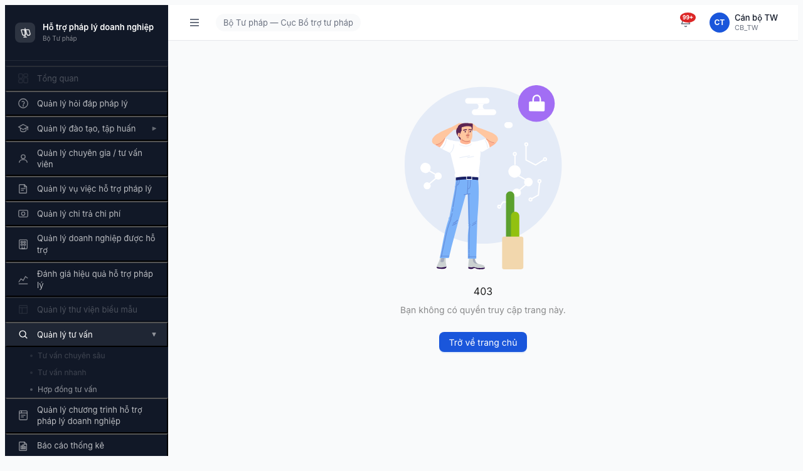

# Bug Report — Smoke FR-13 Tư vấn Nhanh

| Thông tin | Giá trị |
|-----------|---------|
| **Dự án** | PM HTPLDN |
| **Phiên bản** | Round 2 (deploy 2026-04-16) |
| **Môi trường** | http://103.172.236.130:3000/ |
| **Người test** | QA Automation via Claude Code + `/browse` |
| **Ngày** | 23:10::00 2026-04-19 |
| **Loại test** | Smoke |
| **Round** | Round 2 |
| **Tài liệu tham chiếu** | [6.13-smoke-tuvan-nhanh.md](../../../../smoke-specs/6.13-smoke-tuvan-nhanh.md), [srs-fr-13-tv-nhanh.md](../../../../../input/srs-v3/srs-fr-13-tv-nhanh.md), [smoke-test-report.md](smoke-test-report.md) |

---

## Tổng hợp

Phát hiện **2** lỗi trong quá trình smoke module Tư vấn Nhanh. Cả 2 đều là Blocker — module chưa deploy hoàn chỉnh end-to-end.

| Tổng | Critical | Major | Medium | Minor | Trivial |
|------|----------|-------|--------|-------|---------|
| 2    | 2        | 0     | 0      | 0     | 0       |

## Bug Summary Table

| Bug ID | Severity | Priority | Type | Module | TC Ref | Title | Status |
|--------|----------|----------|------|--------|--------|-------|--------|
| BUG-SMOKE-TVN-001 | Critical | P0 | Permission / UI | Tư vấn Nhanh | 6.13-B2a | Submenu `Tư vấn nhanh` bị DISABLED cho CB_NV_TW dù JWT có đủ permissions | Open |
| BUG-SMOKE-TVN-002 | Critical | P0 | Data / Backend | Tư vấn Nhanh | 6.13-B2b | BE thiếu 3 route chính `/kho-cau-hoi`, `/tu-van-nhanh`, `/phien-tu-van-nhanh` (HTTP 404) | Open |

---

## BUG-SMOKE-TVN-001 — Submenu "Tư vấn nhanh" DISABLED cho CB_NV_TW (pattern lặp M8.3-002)

| Trường | Chi tiết |
|--------|----------|
| **Bug ID** | BUG-SMOKE-TVN-001 |
| **Severity** | Critical |
| **Priority** | P0 |
| **Type** | Permission / UI |
| **Status** | Open |
| **Module** | FR-13 Tư vấn Nhanh |
| **Thành phần** | FE ability rule / sidebar menu config (module `QuanLyTuVan` menu) |
| **URL** | http://103.172.236.130:3000/403 (sidebar) |
| **Trình duyệt** | Chromium 146 (headless, Playwright) |
| **Tài khoản** | `canbo_tw` (CB_NV, cấp TW, Cục BTTP) |
| **TC Reference** | 6.13 Smoke Bước 2a/2b |
| **SRS Reference** | FR-13 §3.4.2 Permission "CB NV (TW/BN/ĐP) có Create kho Q&A thủ công + trả lời phiên" |
| **Assignee** | FE team |
| **Found by** | QA Automation |
| **Duplicate of** | BUG-PERM-M8.3-002 (TV Chuyên sâu — cùng pattern) |

### Mô tả

Sau khi login `canbo_tw` (role CB_TW / CB_NV cấp TW) và expand menu cha `Quản lý tư vấn ▶`, submenu `Tư vấn nhanh` hiển thị ở trạng thái **grayed out** (disabled visually). Click vào submenu **không navigate** — URL giữ nguyên `/403`, trang hiển thị "403 — Bạn không có quyền truy cập". Bug này chặn 100% truy cập module TVNHANH cho CB_NV — vai trò chính theo SRS.

### Các bước tái hiện

1. Mở `http://103.172.236.130:3000/`
2. Login `canbo_tw` / `Test@1234`, OTP `666666` (bypass)
3. Quan sát URL landing = `/403` (PASS theo Rule 5 CB_TW)
4. Click sidebar menu `Quản lý tư vấn ▶` → menu expand, hiện 3 submenu
5. Quan sát:
   - `Tư vấn chuyên sâu` — grayed (duplicate M8.3-002)
   - **`Tư vấn nhanh` — grayed (bug mới)**
   - `Hợp đồng tư vấn` — enabled (blue bullet)
6. Click `Tư vấn nhanh` → URL vẫn `/403`, không navigate

### Kết quả mong đợi

- Theo [SRS FR-13](../../../../../input/srs-v3/srs-fr-13-tv-nhanh.md) §Permission: CB_NV (TW/BN/ĐP) có quyền `create_kho_cau_hoi` + `create_phien_tu_van` + toàn bộ CRUD
- Menu `Tư vấn nhanh` phải **enabled** cho role CB_TW
- Click → navigate tới route module (e.g. `/tu-van-nhanh` hoặc `/kho-cau-hoi`)
- Trang module render 2 tab chính `Kho câu hỏi` + `Phiên tư vấn`

### Kết quả thực tế

- Submenu grayed out (CSS disabled-like style)
- Click handler no-op: URL giữ `/403`, log Playwright: `Clicked text=Tư vấn nhanh → now at http://103.172.236.130:3000/403`
- Page vẫn hiện icon khóa + "Bạn không có quyền truy cập trang này"

### Bằng chứng

**JWT permissions của `canbo_tw` (crosscheck — contract OK):**

Token `/api/v1/auth/verify-otp` trả về decoded payload chứa 14 permissions TVNHANH:
```
approve_kho_cau_hoi    create_kho_cau_hoi    delete_kho_cau_hoi    read_kho_cau_hoi    update_kho_cau_hoi
create_phien_tu_van    delete_phien_tu_van   read_phien_tu_van     update_phien_tu_van
approve_khoa_hoc       create_khoa_hoc       delete_khoa_hoc       read_khoa_hoc       update_khoa_hoc
```

→ BE đã emit đúng permissions. Bug nằm ở FE menu gating (không đọc permissions hoặc hardcoded disable).

**So sánh cùng menu cha:**

| Submenu cùng menu "Quản lý tư vấn" | State với CB_TW |
|---------------------------------------|------------------|
| `Tư vấn chuyên sâu` | ❌ Disabled |
| **`Tư vấn nhanh`** | **❌ Disabled** |
| `Hợp đồng tư vấn` | ✅ Enabled |

→ Bug không phải ở menu cha, mà ở ability rule cho 2 submenu TVCS + TVNHANH.

**Ảnh chụp:**



### Tác động (Impact)

- **100% CB_NV** (role chính theo SRS) không vào được module TVNHANH qua UI
- Workflow core "Tạo câu hỏi thủ công" (SCR-X2-01) + "Trả lời phiên tư vấn" (SCR-X2-03) — chặn hoàn toàn
- Khả năng cao bug áp dụng cho cả CB_NV_BN + CB_NV_DP (cần verify sau fix)
- **Chặn Lệnh 2/3/4** cho FR-13 ở round này

### So sánh với bug đã biết

| Bug ID | Module | Role bị chặn | Status |
|--------|--------|--------------|--------|
| BUG-PERM-M8.3-002 | TV Chuyên sâu | 8 role (CB_NV×3, CB_PD×3, TVV, CG) | Open — chờ FE fix |
| **BUG-SMOKE-TVN-001** | **TV Nhanh** | **≥1 role CB_NV_TW (confirmed), khả năng cao tất cả CB_NV** | Open |
| BUG-PERM-M8.3-001 + M5/6/7/8.1/8.2-001 | 6 module khác | QTHT write UI | Open |

→ Pattern "FE ability rule không sync permissions" lặp ở nhiều module → nghi vấn root cause chung.

### Nguyên nhân nghi ngờ (Root Cause)

- FE sidebar menu có hardcoded flag disabled cho `TVNHANH` (ví dụ `disabled: !isEnabled('tvnhanh')` hoặc `<MenuItem disabled={true}>`) — chưa đọc permissions từ JWT/API
- Hoặc ability rule trong `abilities.ts` / CASL config thiếu mapping `read_kho_cau_hoi` → menu `TVNHANH` visible+enabled

### Gợi ý sửa (Suggested Fix)

1. **Kiểm tra FE menu config** (file sidebar/menu, e.g. `src/layouts/Sidebar/menu-config.ts`):
   - Tìm entry `tu-van-nhanh` — verify có attribute `disabled: true` hoặc `gated: false` nào đang bật hardcoded
2. **Kiểm tra ability rule:**
   ```ts
   // Thêm / verify
   if (permissions.includes('read_kho_cau_hoi') || permissions.includes('read_phien_tu_van')) {
     menu['tu-van-nhanh'].enabled = true;
   }
   ```
3. **Crosscheck cùng fix với BUG-PERM-M8.3-002** — 2 bug có khả năng share 1 block menu config

---

## BUG-SMOKE-TVN-002 — BE thiếu 3 route chính module TVNHANH (HTTP 404)

| Trường | Chi tiết |
|--------|----------|
| **Bug ID** | BUG-SMOKE-TVN-002 |
| **Severity** | Critical |
| **Priority** | P0 |
| **Type** | Data / Backend |
| **Status** | Open |
| **Module** | FR-13 Tư vấn Nhanh |
| **Thành phần** | BE router / controller module TVNHANH (nghi `src/modules/tu-van-nhanh/`, `src/modules/kho-cau-hoi/`) |
| **URL** | N/A (backend) |
| **Trình duyệt** | N/A (curl / API probe) |
| **Tài khoản** | `canbo_tw` (bearer token hợp lệ, `/auth/me` 200) |
| **TC Reference** | 6.13 Smoke Bước 3 |
| **SRS Reference** | FR-13 §4 Functional requirements |
| **Assignee** | BE team |
| **Found by** | QA Automation |

### Mô tả

Module TVNHANH chưa có 3 endpoint chính ở BE. Các route sau trả HTTP 404 với body `Cannot GET /api/v1/...` (nghĩa là route không tồn tại ở router, không phải permission deny). Phân biệt: cùng token hợp lệ → `/auth/me` trả 200 bình thường.

### Các bước tái hiện

```bash
# 1. Lấy access token
OTP_TOKEN=$(curl -s -X POST http://103.172.236.130:3000/api/v1/auth/login \
  -H "Content-Type: application/json" \
  -d '{"username":"canbo_tw","password":"Test@1234"}' | jq -r '.data.otpToken')

ACCESS=$(curl -s -X POST http://103.172.236.130:3000/api/v1/auth/verify-otp \
  -H "Content-Type: application/json" \
  -d "{\"otpToken\":\"$OTP_TOKEN\",\"otpCode\":\"666666\"}" | jq -r '.data.accessToken')

# 2. Probe endpoints
for ep in /api/v1/kho-cau-hoi /api/v1/tu-van-nhanh /api/v1/phien-tu-van-nhanh; do
  curl -s -o /dev/null -w "HTTP %{http_code}  $ep\n" \
    -H "Authorization: Bearer $ACCESS" \
    "http://103.172.236.130:3000${ep}?page=1&pageSize=5"
done

# Sanity check
curl -s -o /dev/null -w "HTTP %{http_code}  /api/v1/auth/me\n" \
  -H "Authorization: Bearer $ACCESS" \
  "http://103.172.236.130:3000/api/v1/auth/me"
```

### Kết quả mong đợi

Theo SRS FR-13 §4, BE phải có:
- `GET  /api/v1/kho-cau-hoi` — list Q&A với filter lĩnh vực/nguồn/trạng thái
- `POST /api/v1/kho-cau-hoi` — tạo Q&A thủ công
- `GET  /api/v1/kho-cau-hoi/:id` — detail
- `PATCH/DELETE /api/v1/kho-cau-hoi/:id` — update/delete
- `GET  /api/v1/phien-tu-van-nhanh` — list phiên
- `POST /api/v1/phien-tu-van-nhanh/:id/tra-loi` — trả lời
- `POST /api/v1/tu-van-nhanh` (hoặc tương đương) — API cho DN gửi câu hỏi (xem SRS note DN = API only)

Tối thiểu: 3 endpoint list trả 200 với array (dù rỗng).

### Kết quả thực tế

| Endpoint | HTTP | Body |
|----------|------|------|
| `GET /api/v1/kho-cau-hoi?page=1&pageSize=5` | **404** | `{"success":false,"error":{"code":"ERR-SYS-00-04-01","message":"Cannot GET /api/v1/kho-cau-hoi?page=1&pageSize=5"}}` |
| `GET /api/v1/tu-van-nhanh?page=1&pageSize=5` | **404** | `{"success":false,"error":{"code":"ERR-SYS-00-04-01","message":"Cannot GET /api/v1/tu-van-nhanh?page=1&pageSize=5"}}` |
| `GET /api/v1/phien-tu-van-nhanh?page=1&pageSize=5` | **404** | `{"success":false,"error":{"code":"ERR-SYS-00-04-01","message":"Cannot GET /api/v1/phien-tu-van-nhanh?page=1&pageSize=5"}}` |
| `GET /api/v1/auth/me` (sanity) | 200 | Valid user data CB_TW |

### Bằng chứng

```json
// Request: GET /api/v1/kho-cau-hoi?page=1&pageSize=5
// Headers: Authorization: Bearer <valid-jwt>
// Response HTTP 404:
{
  "success": false,
  "error": {
    "code": "ERR-SYS-00-04-01",
    "message": "Cannot GET /api/v1/kho-cau-hoi?page=1&pageSize=5",
    "timestamp": "2026-04-19T16:14:50.448Z",
    "requestId": "66f988fb-48ab-4936-abaf-ce71efc9ffea"
  }
}
```

### Tác động (Impact)

- Module TVNHANH **100% không dùng được** end-to-end — FE không thể gọi API dù được enable
- Block toàn bộ Functional test FR-13, Permission test FR-13, TC chi tiết FR-13
- Block luôn FR-14 `Hợp đồng Tư vấn` nếu có dependency
- **Toàn bộ DN (khách hàng cuối) không có kênh API để gửi câu hỏi** theo SRS "DN = API only"

### So sánh với module khác

| Module | BE endpoint deployed? |
|--------|----------------------|
| HD (Hỏi đáp PL) | ✅ — đã test Round 2 |
| CG/TVV | ✅ — đã test Round 2 |
| TV Chuyên sâu (FR-12) | ❌ `/api/v1/tu-van-chuyen-sau` 404 |
| **TV Nhanh (FR-13)** | **❌ 3 route 404** |

→ Đề xuất BE team deploy đồng bộ TVCS + TVNHANH trong 1 đợt để tránh FE phải làm 2 lần integration.

### Nguyên nhân nghi ngờ (Root Cause)

- Module `tu-van-nhanh` + `kho-cau-hoi` + `phien-tu-van-nhanh` chưa register vào app router
- Hoặc chưa có controller/service scaffold (chỉ có prisma schema + permissions seed)

### Gợi ý sửa (Suggested Fix)

1. Scaffold NestJS module `TuVanNhanhModule` với 3 controller: `KhoCauHoiController`, `PhienTuVanController`, `TuVanNhanhController` (hoặc gộp)
2. Đăng ký vào `AppModule.imports`
3. Tối thiểu implement `GET list` với pagination + filter → để FE render trang, dù DB rỗng
4. Smoke retest ngay sau deploy — spec 6.13 đã tối giản (không yêu cầu data, chỉ cần page load)

---

## Phụ lục

### A — Môi trường test

| Thành phần | Giá trị |
|------------|---------|
| URL ứng dụng | http://103.172.236.130:3000/ |
| OTP login | `666666` (dev bypass, mọi tài khoản) |
| MailHog (OTP inbox) | http://103.172.236.130:8025 (fallback) |
| API base | http://103.172.236.130:3000/api/v1 |
| Frontend | React + Vite + Ant Design |
| Xác thực | JWT + OTP (RS256) |

### B — Tài khoản sử dụng

| Tên đăng nhập | Vai trò | Cấp | Dùng cho bug nào |
|---------------|---------|-----|------------------|
| `canbo_tw` | CB_NV (CB_TW) | TW (Cục BTTP) | BUG-SMOKE-TVN-001, BUG-SMOKE-TVN-002 |

### C — Danh mục ảnh chụp

| File | Mô tả | Dùng cho bug |
|------|-------|--------------|
| [screenshots/tvnhanh-01-login-dashboard.png](screenshots/tvnhanh-01-login-dashboard.png) | Dashboard `/403` + sidebar đầy đủ sau login | Context (B1 PASS) |
| [screenshots/tvnhanh-02-menu-expanded.png](screenshots/tvnhanh-02-menu-expanded.png) | Menu `Quản lý tư vấn` expand — `Tư vấn nhanh` grayed out | BUG-SMOKE-TVN-001 |

### D — Ghi chú

- Browser crash xảy ra sau step click submenu disabled → không chụp được trang module. Nhưng evidence từ (1) screenshot menu + (2) API probe đã đủ để phân loại Bug + đề xuất fix.
- Crash không do infra (pre-test RAM browse 0 MB sau cleanup). Crash có khả năng do FE click handler throw khi gọi navigate trên route chưa register.

---

*Bug report generated: 2026-04-19 23:25 | QA Automation via Claude Code*
