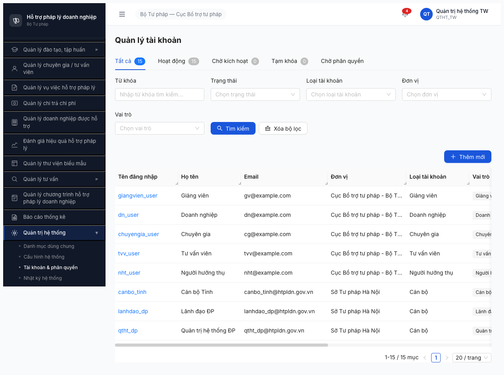

# Bug Report — Smoke Test QTHT / Module Tài khoản (FR-10)

| Thông tin | Giá trị |
|-----------|---------|
| **Dự án** | PM HTPLDN (Hỗ trợ Pháp lý Doanh nghiệp) |
| **Phiên bản** | Deploy 2026-04-20 |
| **Môi trường** | http://103.172.236.130:3000/ |
| **Người test** | Claude + `/browse` (Playwright headless) |
| **Ngày** | 14:30-14:40 / 2026-04-20 |
| **Loại test** | Smoke (pre-gate cho Lệnh 2) |
| **Round** | Round 3 |
| **Tài liệu tham chiếu** | [smoke-spec](../../../smoke-specs/6.10-smoke-taikhoan.md), [SRS FR-10](../../../../input/srs-v3/srs-fr-10-quan-tri.md) |

---

## Tổng hợp

Phát hiện **4 bug + 1 observation** trong smoke module Tài khoản. Không có Critical/Blocker — module render được list 15 user, nhưng có 1 Major BE validation bug lặp 2x/lần load + 3 Minor spec vs app discrepancy + 1 Observation label mismatch.

| Tổng | Critical | Major | Medium | Minor | Trivial |
|------|----------|-------|--------|-------|---------|
| 4    | 0        | 1     | 0      | 3     | 0       |

## Bug Summary Table

| Bug ID | Severity | Priority | Type | Module | TC Ref | Title | Status |
|--------|----------|----------|------|--------|--------|-------|--------|
| BUG-SMOKE-TK-001 | Major | P1 | Data/API | QTHT-Tài khoản | Smoke 6.10 B3 | FE gửi `trangThai=CHO_PHAN_QUYEN` → BE trả 422 Validation failed (lặp 2x/load) | Open |
| BUG-SMOKE-TK-002 | Minor | P2 | UI/UX | QTHT-Tài khoản | Smoke 6.10 B2b | Thiếu tab `Vô hiệu hóa` (VO_HIEU_HOA) vs spec (spec yêu cầu ≥3/4 state) | Open |
| BUG-SMOKE-TK-003 | Minor | P2 | UI/UX | QTHT-Tài khoản | Smoke 6.10 B2b | Thiếu cột `Ngày tạo`, `Ngày kích hoạt` | Open |
| BUG-SMOKE-TK-004 | Minor | P2 | UI/UX | QTHT-Tài khoản | Smoke 6.10 B2b | Thiếu filter `Cấp` + thiếu button toolbar `Xuất Excel`, `Làm mới` | Open |
| **OBS-TK-001** | — | — | Note | QTHT-Tài khoản | — | Label button `+ Thêm mới` thay vì `+ Tạo tài khoản` (spec) — không block | Observation |

> **Type chú thích:** `Data/API` — FE/BE contract (enum, payload) | `UI/UX` — hiển thị / label / layout | `Note` — observation non-blocking.

---

## BUG-SMOKE-TK-001 — FE gửi `trangThai=CHO_PHAN_QUYEN` → BE trả 422 Validation failed (lặp 2x/lần load)

| Trường | Chi tiết |
|--------|----------|
| **Bug ID** | BUG-SMOKE-TK-001 |
| **Severity** | Major |
| **Priority** | P1 |
| **Type** | Data/API (FE/BE enum mismatch) |
| **Status** | Open |
| **Module** | Quản trị Hệ thống / Tài khoản |
| **Thành phần** | `src/pages/quan-tri/tai-khoan/index.tsx` (FE — tab state enum), `/api/v1/tai-khoan?trangThai=` (BE — validation schema) |
| **URL** | http://103.172.236.130:3000/quan-tri/tai-khoan |
| **Trình duyệt** | Chromium 146 headless (Playwright) |
| **Tài khoản** | qtht_tw (QTHT, TW) |
| **TC Reference** | Smoke 6.10-smoke-taikhoan.md Bước 3 |
| **SRS Reference** | FR-10 (state machine Tài khoản) |
| **Assignee** | FE + BE team |
| **Found by** | Claude + /browse |

### Mô tả

FE render tab **"Chờ phân quyền"** ở danh sách tài khoản (QTHT). Mỗi lần page load, FE auto-gọi API count cho tab này với param `trangThai=CHO_PHAN_QUYEN`. BE **không recognize** enum này → trả `422 Validation failed`. Request lặp **2 lần** mỗi lần vào page (1 lần count tab, 1 lần reload state sau fetch chính).

### Các bước tái hiện

1. Login `qtht_tw` / `Test@1234` / OTP `666666`
2. Sidebar → `Quản trị hệ thống` → click `Tài khoản & phân quyền`
3. Đợi page render
4. Mở DevTools Network (hoặc trong smoke: `$B network`)
5. Grep `4xx`

### Kết quả mong đợi

FE chỉ request state enum mà BE accept. Nếu state `CHO_PHAN_QUYEN` không có trong BE enum → FE không render tab này.
Hoặc BE mở rộng enum để chấp nhận `CHO_PHAN_QUYEN` theo spec FE.

### Kết quả thực tế

FE gọi:
```
GET /api/v1/tai-khoan?trangThai=CHO_PHAN_QUYEN&page=1&pageSize=1
```

BE trả:
```
HTTP 422 (318 bytes)
```

Request lặp 2 lần ngay khi page mount.

### Bằng chứng

**Network log trích xuất (smoke B3):**
```
GET /api/v1/tai-khoan?trangThai=HOAT_DONG       → 200 (484B) ✅
GET /api/v1/tai-khoan?trangThai=CHO_KICH_HOAT    → 200 (82B)  ✅
GET /api/v1/tai-khoan?trangThai=TAM_KHOA         → 200 (82B)  ✅
GET /api/v1/tai-khoan?trangThai=CHO_PHAN_QUYEN   → 422 (318B) ❌
GET /api/v1/tai-khoan?trangThai=CHO_PHAN_QUYEN   → 422 (318B) ❌ (lặp)
```

**Tab visible trên UI (JS assert):**
```json
"tabs": ["Tất cả\n15", "Hoạt động\n15", "Chờ kích hoạt\n0", "Tạm khóa\n0", "Chờ phân quyền"]
```

Screenshot:


### Tác động (Impact)

- **100% user QTHT** gặp 2 request thừa 422 mỗi lần vào trang — load thêm ~500ms không cần thiết
- **UX:** tab `Chờ phân quyền` không bao giờ load data (luôn 422) → user click vào tab này sẽ không thấy gì (hoặc thấy error state)
- **Logs BE:** spam entry 422 ở mọi session → khó monitor lỗi thực
- **Contract mismatch:** báo hiệu FE/BE đang lệch state machine — rủi ro regression khi implement phase workflow

### Nguyên nhân nghi ngờ (Root Cause)

**Hypothesis 1 (FE):** Code FE hardcode 5 tab bao gồm `CHO_PHAN_QUYEN` nhưng BE enum mới nhất không có state này. Cần check:
```ts
// src/pages/quan-tri/tai-khoan/index.tsx (khả năng)
const TABS = [
  'Tất cả', 'HOAT_DONG', 'CHO_KICH_HOAT', 'TAM_KHOA', 'CHO_PHAN_QUYEN' // <- bỏ?
];
```

**Hypothesis 2 (BE):** BE enum cũ còn `VO_HIEU_HOA` (theo spec 6.10 + SRS FR-10), FE update theo design mới dùng `CHO_PHAN_QUYEN` nhưng BE chưa deploy enum mới. Cần check entity:
```
src/modules/tai-khoan/tai-khoan.entity.ts (TrangThaiTaiKhoan enum)
```

### Gợi ý sửa (Suggested Fix)

1. **PM làm rõ state machine chuẩn:** có `CHO_PHAN_QUYEN`? có `VO_HIEU_HOA`? → update SRS + spec 6.10
2. **Đồng bộ enum FE/BE** theo state machine chuẩn
3. Nếu loại bỏ `CHO_PHAN_QUYEN`: xóa tab FE, xóa count call
4. Nếu giữ: bổ sung BE enum + validation pipe accept, implement query

---

## BUG-SMOKE-TK-002 — Thiếu tab `Vô hiệu hóa` (VO_HIEU_HOA) vs spec

| Trường | Chi tiết |
|--------|----------|
| **Bug ID** | BUG-SMOKE-TK-002 |
| **Severity** | Minor |
| **Priority** | P2 |
| **Type** | UI/UX |
| **Status** | Open |
| **Module** | Quản trị Hệ thống / Tài khoản |
| **Thành phần** | `src/pages/quan-tri/tai-khoan/index.tsx` |
| **URL** | /quan-tri/tai-khoan |
| **Tài khoản** | qtht_tw |
| **TC Reference** | Smoke 6.10 Bước 2b |
| **SRS Reference** | FR-10 state machine Tài khoản |
| **Assignee** | FE team |

### Mô tả

Spec 6.10 ghi "Expected tabs ≥3/4 state: CHO_KICH_HOAT, HOAT_DONG, TAM_KHOA, **VO_HIEU_HOA**". App hiện thiếu tab `Vô hiệu hóa` — chỉ có 4 state thực: `Tất cả, Hoạt động, Chờ kích hoạt, Tạm khóa, Chờ phân quyền`.

Row action `Vô hiệu hóa` có sẵn trên mỗi row → state VO_HIEU_HOA vẫn tồn tại trong business logic, nhưng không có tab filter tương ứng để xem list user ở state này.

### Các bước tái hiện

1. Login qtht_tw, navigate `/quan-tri/tai-khoan`
2. Quan sát thanh tab dưới tiêu đề `Quản lý tài khoản`

### Kết quả mong đợi

Theo spec 6.10 + SRS FR-10:
- Tab `Vô hiệu hóa` visible
- Click → filter API `trangThai=VO_HIEU_HOA`

### Kết quả thực tế

5 tabs visible: `Tất cả(15), Hoạt động(15), Chờ kích hoạt(0), Tạm khóa(0), Chờ phân quyền`
**Không có** tab `Vô hiệu hóa`.

### Bằng chứng

JS assert:
```json
"tabs": ["Tất cả\n15", "Hoạt động\n15", "Chờ kích hoạt\n0", "Tạm khóa\n0", "Chờ phân quyền"]
```

Screenshot: 

### Tác động (Impact)

QTHT không view được list user đã bị vô hiệu hóa → khó audit / reactivate. Workaround: dùng filter Trạng thái dropdown (chưa verify có option `VO_HIEU_HOA` không).

### Gợi ý sửa

1. Thêm tab `Vô hiệu hóa` trỏ tới `trangThai=VO_HIEU_HOA`
2. Hoặc, nếu decision sản phẩm đã bỏ state này → update spec 6.10 + SRS FR-10 + permission matrix

---

## BUG-SMOKE-TK-003 — Thiếu cột `Ngày tạo`, `Ngày kích hoạt`

| Trường | Chi tiết |
|--------|----------|
| **Bug ID** | BUG-SMOKE-TK-003 |
| **Severity** | Minor |
| **Priority** | P2 |
| **Type** | UI/UX |
| **Status** | Open |
| **Module** | Quản trị Hệ thống / Tài khoản |
| **Thành phần** | `src/pages/quan-tri/tai-khoan/columns.tsx` |
| **URL** | /quan-tri/tai-khoan |
| **Assignee** | FE team |

### Mô tả

Spec 6.10 ghi header cột expect: `Username, Email, Vai trò, Đơn vị, Trạng thái, **Ngày tạo**, **Ngày kích hoạt**`.

App có: `Tên đăng nhập, Họ tên, Email, Đơn vị, Loại tài khoản, Vai trò, Trạng thái, Đăng nhập cuối, Thao tác`.

Cột `Ngày tạo` và `Ngày kích hoạt` bị thay bằng `Đăng nhập cuối`.

### Kết quả mong đợi

Table có 2 cột `Ngày tạo` + `Ngày kích hoạt` (theo spec — audit cơ bản).

### Kết quả thực tế

Không có `Ngày tạo` / `Ngày kích hoạt`. Có thêm `Họ tên`, `Loại tài khoản`, `Đăng nhập cuối`, `Thao tác` (extra hợp lý).

### Bằng chứng

```json
"columns": ["Tên đăng nhập","Họ tên","Email","Đơn vị","Loại tài khoản","Vai trò","Trạng thái","Đăng nhập cuối","Thao tác"]
```

### Tác động (Impact)

QTHT không thể audit ngày tài khoản được tạo / ngày user đầu tiên login để kích hoạt — ảnh hưởng việc cleanup account lâu không active. Workaround: vào detail từng tài khoản (nếu modal có hiển thị).

### Gợi ý sửa

1. Thêm 2 cột `Ngày tạo` (`createdAt`), `Ngày kích hoạt` (`activatedAt`) — hide by default, toggle qua cột setting
2. Hoặc update spec 6.10 nếu cột đã chủ đích thay bằng `Đăng nhập cuối`

---

## BUG-SMOKE-TK-004 — Thiếu filter `Cấp` + button `Xuất Excel`, `Làm mới`

| Trường | Chi tiết |
|--------|----------|
| **Bug ID** | BUG-SMOKE-TK-004 |
| **Severity** | Minor |
| **Priority** | P2 |
| **Type** | UI/UX |
| **Status** | Open |
| **Module** | Quản trị Hệ thống / Tài khoản |
| **Thành phần** | `src/pages/quan-tri/tai-khoan/index.tsx` (toolbar + filter panel) |
| **URL** | /quan-tri/tai-khoan |
| **Assignee** | FE team |

### Mô tả

**Filter panel thiếu** `Cấp` (TW/BN/DP/Portal) — quan trọng vì QTHT_TW cần lọc user theo cấp để tra cứu.

**Toolbar thiếu** 2 button:
- `Xuất Excel` — export danh sách
- `Làm mới` — refresh list không full reload

### Kết quả mong đợi (spec 6.10)

- Filters: `Vai trò (Role) / Đơn vị / Cấp / Trạng thái`
- Buttons toolbar: `+ Tạo tài khoản`, `Xuất Excel`, `Làm mới`

### Kết quả thực tế

- Filters: `Từ khóa, Trạng thái, Loại tài khoản, Đơn vị, Vai trò` (có extra `Từ khóa` + `Loại tài khoản`; **thiếu `Cấp`**)
- Buttons toolbar: `Tìm kiếm, Xóa bộ lọc, + Thêm mới` (**thiếu `Xuất Excel`, `Làm mới`**)

### Bằng chứng

```json
"labels": ["Từ khóa","Trạng thái","Loại tài khoản","Đơn vị","Vai trò"],
"buttonsToolbar": ["Tìm kiếm","Xóa bộ lọc","Thêm mới"]
```

Screenshot: 

### Tác động

- QTHT_TW khó lọc nhanh user theo cấp
- Không có export Excel → báo cáo thống kê tài khoản bất tiện
- Không có button refresh → user phải F5 cả page (mất state tab/filter)

### Gợi ý sửa

1. Thêm filter dropdown `Cấp` (options: TW / BN / DP / Portal)
2. Thêm button `Xuất Excel` (gọi endpoint `/api/v1/tai-khoan/export` hoặc client-side)
3. Thêm button `Làm mới` (refetch query không reload page)

---

## OBS-TK-001 — Label button `+ Thêm mới` thay `+ Tạo tài khoản`

**Type:** Observation (không block smoke)
**Severity:** —
**Module:** QTHT / Tài khoản

Spec ghi button là `+ Tạo tài khoản`. App hiện dùng `+ Thêm mới`. Không block — nhưng thiếu context module (button đứng lẻ ngoài context page có thể confusing). Gợi ý đổi label hoặc update spec.

---

## Phụ lục

### A — Môi trường test

| Thành phần | Giá trị |
|------------|---------|
| URL ứng dụng | http://103.172.236.130:3000/ |
| OTP login | `666666` (bypass tạm) |
| MailHog (OTP inbox) | http://103.172.236.130:8025 (fallback khi bypass tắt) |
| API base | http://103.172.236.130:3000/api/v1 |
| Frontend | React + Vite + Ant Design + Zustand + CASL |
| Xác thực | JWT + OTP |
| Đường dẫn source (từ Vite map) | `/home/ubuntu/dopai/pm-htpldn/source_code/` |

### B — Tài khoản sử dụng

| Tên đăng nhập | Vai trò | Cấp | Dùng cho bug nào |
|---------------|---------|-----|------------------|
| qtht_tw | QTHT | TW | Tất cả bug trong report này |

### C — Danh mục ảnh chụp

| File | Mô tả | Dùng cho bug |
|------|-------|--------------|
| [screenshots/taikhoan-01-login-dashboard.png](screenshots/taikhoan-01-login-dashboard.png) | Dashboard sau login QTHT_TW | (contexts) |
| [screenshots/taikhoan-02-menu-expanded.png](screenshots/taikhoan-02-menu-expanded.png) | Sidebar QTHT expand | (contexts) |
| [screenshots/taikhoan-03-page.png](screenshots/taikhoan-03-page.png) | Page `/quan-tri/tai-khoan` | BUG-SMOKE-TK-001/002/003/004, OBS-TK-001 |

---

*Bug report generated 2026-04-20 14:40 | QA Automation via Claude Code + /browse*
