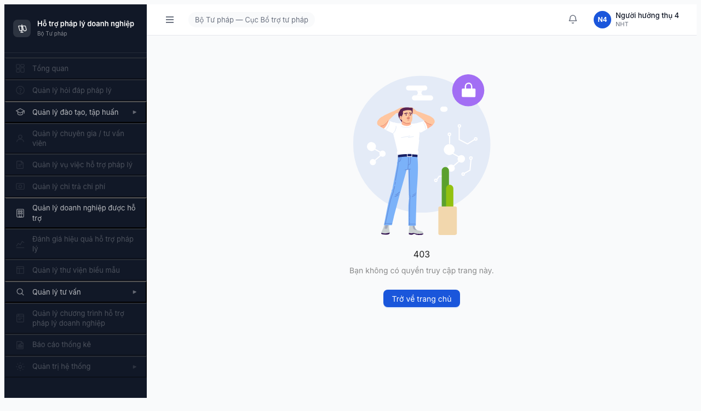
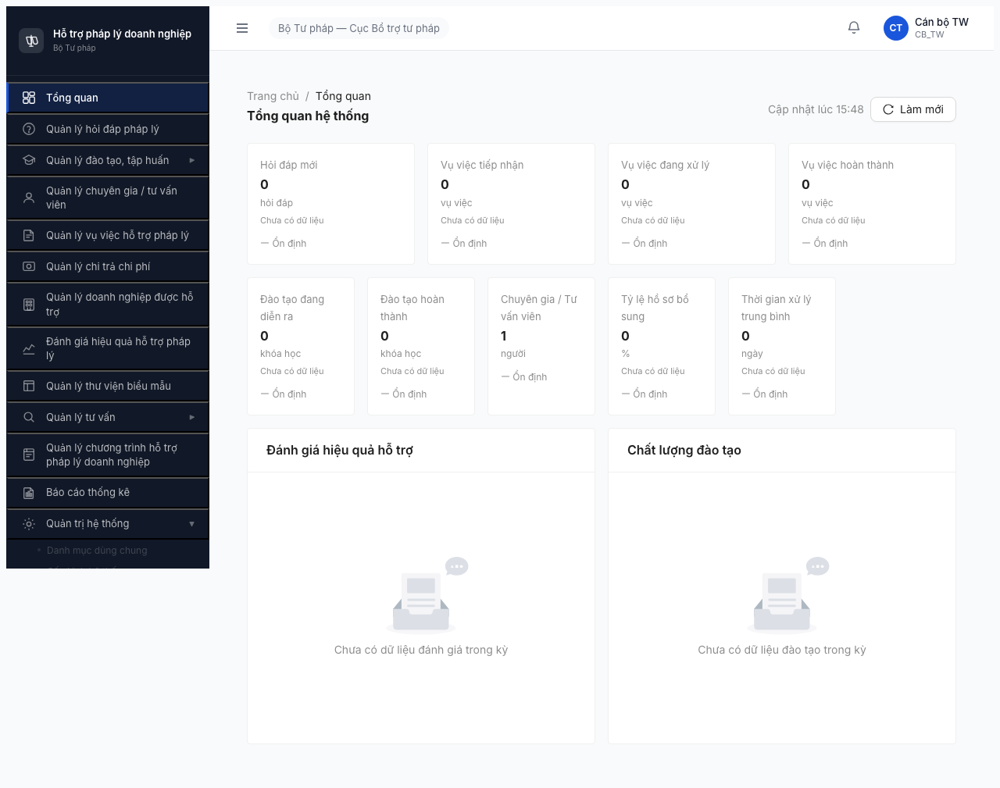

# Bug Report — FR-10 Quản trị Hệ thống (Permission Matrix §10)

| Thông tin | Giá trị |
|-----------|---------|
| **Dự án** | PM HTPLDN |
| **Phiên bản** | Round 3 deploy 2026-04-20 |
| **Môi trường** | http://103.172.236.130:3000/ |
| **Người test** | QA Automation via Claude Code |
| **Ngày** | 2026-04-20 |
| **Loại test** | Permission Matrix — FR-10 QTHT — **Browse UI only (không test API)** |
| **Round** | Round 3 (R3.4 — UI-only re-verify) |
| **Tài liệu tham chiếu** | [permission-matrix.md §10](../../../../permission-matrix.md#10-fr-10--quản-trị-hệ-thống-qtht) · [test-strategy.md §5, §10](../../../../test-strategy.md) |

---

## Tổng hợp

Phát hiện **3 bug** qua UI test ma trận phân quyền FR-10 QTHT (9 entity × 11 role). Tất cả FE-layer issue — cần FE team fix. BE permission rules KHÔNG được verify trực tiếp trong session R3.4 (UI-only).

| Tổng | Critical | Major | Medium | Minor | Trivial |
|------|----------|-------|--------|-------|---------|
| 3    | 1        | 2     | 0      | 0     | 0       |

## Bug Summary Table

| Bug ID | Severity | Priority | Type | Module | TC Ref | Title | Status |
|--------|----------|----------|------|--------|--------|-------|--------|
| BUG-PERM-M10-001 | Critical | P0 | Permission | FR-10 QTHT | matrix §10 NHT/TVV/CG × 6 entity ❌ | Portal roles landing /403 nhưng sidebar render full 23 items + full QTHT submenu → information disclosure | Open |
| BUG-PERM-M10-002 | Major | P1 | Permission | FR-10 QTHT | matrix §10 CB_NV/CB_PD × DANH_MUC 👁️R | 6 role cấp BN/DP click "Danh mục dùng chung" → URL stay /dashboard, không navigate vào page read-only | Open |
| BUG-PERM-M10-003 | Major | P1 | UI/UX | FR-10 QTHT | matrix §10 CB_NV × TAI_KHOAN ❌ | CB_NV roles menu "Tài khoản & phân quyền" visible trong sidebar — spec ❌ role KHÔNG được quyền, menu không được render (UX leak hierarchy) | Open |

> **Chú thích Type:** Permission | UI/UX
> **Chú thích Severity:** Critical (release blocker) | Major (workaround possible, cần fix sớm)
> **Chú thích Priority:** P0 (fix immediate, block release) | P1 (fix trong sprint)

---

## BUG-PERM-M10-001 — Portal roles (NHT/TVV/CG) leak full QTHT sidebar hierarchy trên trang /403

| Trường | Chi tiết |
|--------|----------|
| **Bug ID** | BUG-PERM-M10-001 |
| **Severity** | Critical |
| **Priority** | P0 |
| **Type** | Permission (Information Disclosure) |
| **Status** | Open |
| **Module** | FR-10 Quản trị Hệ thống |
| **Thành phần** | FE layout/sidebar component — có lẽ `src/layouts/MainLayout.tsx` hoặc `src/components/Sidebar/index.tsx` (thiếu role-based filter) |
| **URL** | http://103.172.236.130:3000/403 (sau login Portal role) |
| **Trình duyệt** | Chromium headless-shell (Playwright v1208) |
| **Tài khoản** | nht_user_4 (NHT), tvv_user_4 (TVV), chuyengia_user_4 (CG) |
| **TC Reference** | matrix §10 rows NHT/TVV/CG × {TAI_KHOAN, VAI_TRO, QUYEN_HAN, CAU_HINH_SLA, AUDIT_LOG, CAU_HINH_PHAN_CONG} = 18 ô ❌ |
| **SRS Reference** | SRS v3.1 §3.4.2 matrix permissions — Portal roles chỉ 👁️R × 3 entity (DANH_MUC, DON_VI, THONG_BAO) |
| **Assignee** | FE Team |
| **Found by** | QA Automation (R3.4 session 2026-04-20) |

### Mô tả

Sau login các role Portal (NHT, TVV, CG), hệ thống redirect về `/403` (đúng behavior cho role không có dashboard default). **Nhưng sidebar vẫn render đầy đủ 23 item** gồm toàn bộ menu CMS: Tổng quan + Hỏi đáp + Đào tạo + Chuyên gia + Vụ việc + Chi trả + Doanh nghiệp + Đánh giá + Biểu mẫu + TV + CT HTPL + Báo cáo + **Quản trị hệ thống** (với 4 submenu: Danh mục dùng chung, Cấu hình hệ thống, Tài khoản & phân quyền, Nhật ký hệ thống). Spec SRS matrix §10 quy định 3 role này chỉ được 👁️R × 3 entity (DANH_MUC, DON_VI, THONG_BAO) — không nên thấy menu QTHT submenu nào.

### Các bước tái hiện

1. Navigate http://103.172.236.130:3000/login
2. Login với `nht_user_4` / `Test@1234` (hoặc `tvv_user_4` / `chuyengia_user_4`)
3. Nhập OTP `666666` (bypass mode)
4. Sau OTP verify, hệ thống redirect về `/403`
5. **Quan sát sidebar trái:** 23 item render đầy đủ gồm `Quản trị hệ thống ▶` expandable với 4 submenu (Danh mục dùng chung / Cấu hình hệ thống / Tài khoản & phân quyền / Nhật ký hệ thống)

### Kết quả mong đợi

Sidebar cho role NHT/TVV/CG chỉ render các menu **được phép truy cập theo matrix §10**:
- Với NHT/TVV/CG: chỉ 3 entity 👁️R (Danh mục, Đơn vị, Thông báo) — hoặc ẩn toàn bộ sidebar CMS và redirect sang portal chuyên trang

Alternatively: Sidebar ẩn hoàn toàn, chỉ hiện thông báo rõ ràng "Bạn không có quyền sử dụng CMS. Vui lòng sử dụng trang portal [link]".

### Kết quả thực tế

Chain log UIR-09 (2026-04-20):
```json
{
  "url": "/403",
  "sidebarItems": [
    "Tổng quan", "Quản lý hỏi đáp pháp lý",
    "Quản lý đào tạo, tập huấn▶", "Chương trình đào tạo", "Khóa học",
    "Ngân hàng câu hỏi", "Giảng viên",
    "Quản lý chuyên gia / tư vấn viên", "Quản lý vụ việc hỗ trợ pháp lý",
    "Quản lý chi trả chi phí", "Quản lý doanh nghiệp được hỗ trợ",
    "Đánh giá hiệu quả hỗ trợ pháp lý", "Quản lý thư viện biểu mẫu",
    "Quản lý tư vấn▶", "Tư vấn chuyên sâu", "Tư vấn nhanh",
    "Quản lý chương trình hỗ trợ pháp lý doanh nghiệp", "Báo cáo thống kê",
    "Quản trị hệ thống▶", "Danh mục dùng chung", "Cấu hình hệ thống",
    "Tài khoản & phân quyền", "Nhật ký hệ thống"
  ]
}
```

### Bằng chứng



- [UIR-09-nht_user-landing.png](screenshots/UIR-09-nht_user-landing.png) — R3.4 session (2026-04-20 21:35)
- [R-09-nht_user-landing.png](screenshots/R-09-nht_user-landing.png) — R3.0 session confirm pattern
- [R-10-tvv_user-landing.png](screenshots/R-10-tvv_user-landing.png) — TVV same pattern
- [R-11-chuyengia-landing.png](screenshots/R-11-chuyengia-landing.png) — CG same pattern

### Tác động (Impact)

- **Information disclosure:** 3 role Portal (NHT + TVV + CG) thấy được toàn bộ cấu trúc CMS module hierarchy, gồm Quản trị hệ thống → Tài khoản/Vai trò/Quyền hạn/Nhật ký. Kẻ tấn công có thông tin để social engineering hoặc target endpoint.
- **Matrix ô FAIL:** 3 role × 6 entity spec ❌ (TAI_KHOAN, VAI_TRO, QUYEN_HAN, CAU_HINH_SLA, AUDIT_LOG, CAU_HINH_PHAN_CONG) = **18 ô FAIL**.
- **Release blocker:** Compliance + security principle least-privilege vi phạm. Cần fix trước khi ship production.

### So sánh (Comparison)

| Role | /dashboard landing | /403 landing | Sidebar render | Spec Matrix §10 |
|------|---------------------|--------------|----------------|-----------------|
| QTHT (admin, qtht_tw_4, qtht_bn_4, qtht_dp_4) | ✅ | — | 23 items full — **đúng** (QTHT có full CRUD) | ✅CRUD |
| CB_NV × 3 (CB_NV_TW/BN/DP) | ✅ | — | 23 items — partial correct (9/11 entity 👁️R + 2 ô ❌) | 👁️R + ❌ |
| CB_PD × 3 | ✅ | — | 23 items — partial correct | 👁️R + 👁️R* |
| DN (dn_user_4) | — (DI-09 block CMS) | — | CMS không vào được | DI-09 |
| NHT (nht_user_4) | — | ✅ /403 | **23 items full — BUG! spec 👁️R × 3 entity only** | 👁️R × 3 + ❌ × 6 |
| TVV (tvv_user_4) | — | ✅ /403 | **23 items full — BUG!** | 👁️R × 3 + ❌ × 6 |
| CG (chuyengia_user_4) | — | ✅ /403 | **23 items full — BUG!** | 👁️R × 3 + ❌ × 6 |

### Nguyên nhân nghi ngờ (Root Cause)

FE sidebar component render tất cả menu items bất kể ability/role (không dùng `<CanAccess>` wrapper hoặc role filter). Có thể ability rules đã được BE seed nhưng FE không consume + filter menu items. Kiểm tra:
- `src/layouts/MainLayout.tsx` hoặc `src/components/Sidebar/index.tsx`: xem có `useAbility()` hook wrap menu items không
- CASL ability rules có được load từ `/auth/me` sau login không
- CASL `ability.can('read', entityName)` check trên từng menu item?

### Gợi ý sửa (Suggested Fix)

```tsx
// Thay vì render cứng:
<Menu.Item>Danh mục dùng chung</Menu.Item>
<Menu.Item>Cấu hình hệ thống</Menu.Item>
<Menu.Item>Tài khoản & phân quyền</Menu.Item>
<Menu.Item>Nhật ký hệ thống</Menu.Item>

// Dùng ability check:
{ability.can('read', 'DANH_MUC') && <Menu.Item>Danh mục dùng chung</Menu.Item>}
{ability.can('read', 'CAU_HINH_SLA') && <Menu.Item>Cấu hình hệ thống</Menu.Item>}
{ability.can('read', 'TAI_KHOAN') && <Menu.Item>Tài khoản & phân quyền</Menu.Item>}
{ability.can('read', 'AUDIT_LOG') && <Menu.Item>Nhật ký hệ thống</Menu.Item>}
```

---

## BUG-PERM-M10-002 — 6 role cấp BN/DP click "Danh mục dùng chung" KHÔNG navigate (URL giữ /dashboard)

| Trường | Chi tiết |
|--------|----------|
| **Bug ID** | BUG-PERM-M10-002 |
| **Severity** | Major |
| **Priority** | P1 |
| **Type** | Permission (Route Guard) |
| **Status** | Open |
| **Module** | FR-10 Quản trị Hệ thống |
| **Thành phần** | FE route guard — `src/routes/*` hoặc `<PermissionRoute>` component trên `/quan-tri/danh-muc/*` |
| **URL** | click sidebar "Danh mục dùng chung" → expected `/quan-tri/danh-muc/LINH_VUC_PL` · **actual** `/dashboard` |
| **Trình duyệt** | Chromium headless-shell |
| **Tài khoản** | canbo_tw_4, canbo_bn_4, canbo_tinh_4, lanhdao_tw_4, lanhdao_bn_4, lanhdao_dp_4 |
| **TC Reference** | matrix §10 CB_NV × DANH_MUC + CB_PD × DANH_MUC = 6 ô (spec 👁️R) |
| **SRS Reference** | Matrix §10 row DANH_MUC: CB_NV_TW/BN/DP = 👁️R; CB_PD_TW/BN/DP = 👁️R |
| **Assignee** | FE Team |
| **Found by** | QA Automation (R3.4 session, pattern confirmed R3.1 + R3.4) |

### Mô tả

6 role cấp BN/DP (CB_NV_TW/BN/DP + CB_PD_TW/BN/DP) khi click submenu sidebar "Danh mục dùng chung" (dưới cây "Quản trị hệ thống") → **URL browser giữ `/dashboard`, không navigate vào `/quan-tri/danh-muc/*`**. Spec matrix §10 quy định các role này có 👁️R trên DANH_MUC — tức phải truy cập được trang read-only (xem danh mục, không có Thêm mới/Sửa/Xóa buttons). Hiện tại FE block route silently, user không biết lý do.

### Các bước tái hiện

1. Login với 1 trong 6 role: `canbo_tw_4` / `canbo_bn_4` / `canbo_tinh_4` / `lanhdao_tw_4` / `lanhdao_bn_4` / `lanhdao_dp_4` (mật khẩu `Test@1234`, OTP `666666`)
2. Sau OTP verify, landing `/dashboard`
3. Sidebar trái → click "Quản trị hệ thống" ▶ để expand
4. Click "Danh mục dùng chung"
5. **Quan sát URL:** giữ `/dashboard` (không navigate)
6. **Quan sát table:** `rows=0`, `btns=[]` — không có nội dung

### Kết quả mong đợi

Click "Danh mục dùng chung" → navigate vào `/quan-tri/danh-muc/LINH_VUC_PL` (hoặc tab default) với:
- Table 12+ rows danh mục
- Buttons: `[Tìm kiếm, Xuất Excel]` (KHÔNG có Thêm mới / Sửa / Xóa vì spec 👁️R)
- View read-only cho role CB_NV/CB_PD

### Kết quả thực tế

Chain log UIR-03 canbo_tw_4 (R3.4):
```json
// Sau click "Quản trị hệ thống" parent:
{"url":"/dashboard"}
// Sau click "Danh mục dùng chung":
{"url":"/dashboard", "rows":0, "btns":[], "toastErr": null}
```
→ FE block route silently (không toast error, không redirect /403, không thông báo)

### Bằng chứng



- [UIR-03-canbo_tw-landing.png](screenshots/UIR-03-canbo_tw-landing.png) — Landing /dashboard OK
- [R-05-canbo_tw-danh-muc.png](screenshots/R-05-canbo_tw-danh-muc.png) — Click Danh mục URL stay /dashboard
- [R-04-canbo_tinh-danh-muc.png](screenshots/R-04-canbo_tinh-danh-muc.png) — canbo_tinh_4 same pattern
- [R-06-lanhdao_bn-danh-muc.png](screenshots/R-06-lanhdao_bn-danh-muc.png) — lanhdao_bn_4 same pattern
- [R-07-lanhdao_dp-danh-muc.png](screenshots/R-07-lanhdao_dp-danh-muc.png) — lanhdao_dp_4 same pattern

### Tác động (Impact)

- **6 ô matrix FAIL:** {CB_NV_TW, CB_NV_BN, CB_NV_DP, CB_PD_TW, CB_PD_BN, CB_PD_DP} × DANH_MUC = **6 cells FAIL** (spec 👁️R nhưng không access được).
- **Workflow block:** Cán bộ nghiệp vụ không xem được danh mục chung (lĩnh vực pháp lý, loại vụ việc, loại văn bản, v.v.) → không có thông tin tham chiếu khi tạo hỏi đáp/vụ việc → block cross-module workflow.
- **UX confusion:** User click submenu thấy không có phản ứng → nghĩ hệ thống hỏng hoặc mất quyền.

### Nguyên nhân nghi ngờ (Root Cause)

FE `<PermissionRoute>` (hoặc tương đương) trên `/quan-tri/danh-muc/*` kiểm tra ability nhưng:
1. Có thể check sai ability key (ví dụ check `manage:DANH_MUC` thay `read:DANH_MUC`)
2. Hoặc BE không emit `read:DANH_MUC` cho role CB_NV/CB_PD trong JWT claims
3. Silently redirect `/dashboard` thay vì `/403` → không có error signal cho user

### Gợi ý sửa (Suggested Fix)

1. **Verify BE JWT:** Login role CB_NV → inspect JWT payload → confirm có permission `DANH_MUC:READ` (hoặc tương đương)
2. **Verify FE ability check:** `ability.can('read', 'DANH_MUC')` → should return `true` cho CB_NV/CB_PD
3. **Fix route guard:** Nếu BE có quyền + FE ability OK → route guard không reject. Nếu BE thiếu → seed thêm quyền vào role CB_NV/CB_PD
4. **Render read-only view:** Nếu `!ability.can('create', 'DANH_MUC')` → ẩn Thêm mới; `!ability.can('update', 'DANH_MUC')` → ẩn Sửa; `!ability.can('delete', 'DANH_MUC')` → ẩn Xóa

---

## BUG-PERM-M10-003 — CB_NV sidebar render menu "Tài khoản & phân quyền" dù spec ❌

| Trường | Chi tiết |
|--------|----------|
| **Bug ID** | BUG-PERM-M10-003 |
| **Severity** | Major |
| **Priority** | P1 |
| **Type** | UI/UX (Menu leak) |
| **Status** | Open |
| **Module** | FR-10 Quản trị Hệ thống |
| **Thành phần** | FE sidebar component (tương tự BUG-001, scope nhỏ hơn) |
| **URL** | sidebar quan sát sau login `/dashboard` |
| **Trình duyệt** | Chromium headless-shell |
| **Tài khoản** | canbo_tw_4, canbo_bn_4, canbo_tinh_4 (role CB_NV_TW/BN/DP) |
| **TC Reference** | matrix §10 CB_NV × TAI_KHOAN = 3 ô ❌ (role không có quyền) |
| **SRS Reference** | Matrix §10 row TAI_KHOAN: CB_NV_TW/BN/DP = ❌ (không có quyền); VAI_TRO = ❌; QUYEN_HAN = ❌ |
| **Assignee** | FE Team |
| **Found by** | QA Automation (R3.4) |

### Mô tả

Role CB_NV_TW/BN/DP (Cán bộ) spec matrix §10 có ❌ trên TAI_KHOAN (không có quyền gì). FE **đúng về access control** — click menu "Tài khoản & phân quyền" thì URL không navigate (bị chặn đúng). **Nhưng sidebar vẫn render menu item** → user thấy được menu hierarchy mặc dù không được phép sử dụng. UX confusing + info disclosure nhẹ.

### Các bước tái hiện

1. Login `canbo_tw_4` / `Test@1234` + OTP `666666`
2. Sau redirect `/dashboard`, quan sát sidebar trái
3. Expand "Quản trị hệ thống" → thấy 4 submenu gồm "Tài khoản & phân quyền"
4. Click "Tài khoản & phân quyền" → URL giữ `/dashboard` (**block đúng** — đúng spec ❌)
5. **Nhưng menu item vẫn visible + clickable** (dù click không làm gì)

### Kết quả mong đợi

Menu "Tài khoản & phân quyền" **không render trong sidebar** cho CB_NV role (vì spec ❌). Alternatively: render greyed out + tooltip "Bạn không có quyền truy cập".

### Kết quả thực tế

Sidebar render đủ 4 submenu QTHT cho CB_NV_TW — screenshot [UIR-03-canbo_tw-landing.png](screenshots/UIR-03-canbo_tw-landing.png) cho thấy menu "Tài khoản & phân quyền" giữa Cấu hình hệ thống và Nhật ký hệ thống.

Chain log:
```json
// Click Tài khoản & phân quyền:
{"url":"/dashboard", "rows":0, "btns":["Làm mới"], "is403": false,
 "bodyStart": "Bỏ qua đến nội dung chính\\nHỗ trợ pháp lý doanh nghiệp..."}
// → body content vẫn là dashboard, không navigate
```

### Bằng chứng

- [UIR-03-canbo_tw-tai-khoan.png](screenshots/UIR-03-canbo_tw-tai-khoan.png) — canbo_tw click Tài khoản URL stay /dashboard
- [R-03-canbo_bn-tai-khoan.png](screenshots/R-03-canbo_bn-tai-khoan.png) — canbo_bn same pattern
- [UIR-03-canbo_tw-landing.png](screenshots/UIR-03-canbo_tw-landing.png) — sidebar render 4 QTHT submenu cho CB_NV_TW

### Tác động (Impact)

- **9 ô matrix UX issue:** 3 role CB_NV × {TAI_KHOAN, VAI_TRO, QUYEN_HAN} = **9 ô** menu leak (mặc dù access bị chặn đúng).
- **UX degradation:** User click menu vô nghĩa → dễ nhầm hệ thống hỏng hoặc bị deny.
- **Info disclosure nhẹ:** Hierarchy menu tiết lộ cấu trúc module, nhưng mức độ nhỏ hơn BUG-001 (Portal role).
- **Note:** Đây là bug FE hợp trong cùng batch fix với BUG-PERM-M10-001 (cả 2 đều là "sidebar không filter theo role ability"). 1 FE commit có thể fix cả 2.

### Nguyên nhân nghi ngờ (Root Cause)

Tương tự BUG-001: sidebar component render menu items cứng, không dùng `<CanAccess>` wrapper filter theo ability. CB_NV không có ability `read:TAI_KHOAN` nhưng menu vẫn hiện.

### Gợi ý sửa (Suggested Fix)

Gộp fix với BUG-001:

```tsx
// Trong MENU_CONFIG:
{
  label: 'Tài khoản & phân quyền',
  path: '/quan-tri/tai-khoan',
  ability: ['read', 'TAI_KHOAN']   // CB_NV/CB_PD/Portal không có ability này → menu tự ẩn
}

// Render:
MENU_CONFIG
  .filter(item => !item.ability || ability.can(...item.ability))
  .map(item => <Menu.Item key={item.path}>{item.label}</Menu.Item>)
```

---

## Phụ lục

### A — Môi trường test

| Thành phần | Giá trị |
|------------|---------|
| URL ứng dụng | http://103.172.236.130:3000/ |
| OTP login | `666666` bypass (tạm thời cho QA) |
| MailHog (OTP inbox) | http://103.172.236.130:8025 (fallback) |
| API base | http://103.172.236.130:3000/api/v1/ — **không test trong session R3.4** (UI only) |
| Frontend | React + Vite + Ant Design + CASL |
| Xác thực | JWT + OTP (bypass 666666) |
| Browser | Chromium headless-shell 1208 (Playwright via gstack browse) + `$B connect` headed mode |

### B — Tài khoản sử dụng

| Tên đăng nhập | Vai trò | Đơn vị | Cấp | Dùng cho bug nào |
|---------------|---------|--------|-----|------------------|
| admin | QTHT | Cục BTTP - Bộ TP | TW | baseline QTHT |
| qtht_tw_4 | QTHT | Cục BTTP - Bộ TP | TW | baseline PASS QTHT |
| qtht_bn_4 | QTHT | Bộ KHĐT | BN | PASS QTHT BN |
| qtht_dp_4 | QTHT | Sở TP Hà Nội | DP | PASS QTHT DP |
| canbo_tw_4 | CB_NV | Cục BTTP - Bộ TP | TW | BUG-M10-002 + BUG-M10-003 |
| canbo_bn_4 | CB_NV | Bộ KHĐT | BN | BUG-M10-002 + BUG-M10-003 |
| canbo_tinh_4 | CB_NV | Sở TP Hà Nội | DP | BUG-M10-002 + BUG-M10-003 |
| lanhdao_tw_4 | CB_PD | Cục BTTP - Bộ TP | TW | BUG-M10-002 |
| lanhdao_bn_4 | CB_PD | Bộ KHĐT | BN | BUG-M10-002 |
| lanhdao_dp_4 | CB_PD | Sở TP Hà Nội | DP | BUG-M10-002 |
| dn_user_4 | DN | — | Portal | DI-09 pass (block CMS) |
| nht_user_4 | NHT | — | Portal | BUG-M10-001 |
| tvv_user_4 | TVV | — | Portal | BUG-M10-001 |
| chuyengia_user_4 | CG | — | Portal | BUG-M10-001 |

### C — Danh mục ảnh chụp (session R3.4 new + R3.0-R3.2 kế thừa)

| File | Mô tả | Dùng cho bug |
|------|-------|--------------|
| [UIR-01-qtht_tw-landing.png](screenshots/UIR-01-qtht_tw-landing.png) | qtht_tw_4 login + sidebar | baseline PASS |
| [UIR-01-qtht_tw-danh-muc.png](screenshots/UIR-01-qtht_tw-danh-muc.png) | qtht_tw DANH_MUC 12 rows + Thêm mới | baseline PASS |
| [UIR-01-qtht_tw-tai-khoan.png](screenshots/UIR-01-qtht_tw-tai-khoan.png) | qtht_tw TAI_KHOAN 20 rows + Thêm mới + Khóa TK + Vô hiệu hóa | baseline PASS |
| [UIR-01-qtht_tw-cau-hinh.png](screenshots/UIR-01-qtht_tw-cau-hinh.png) | qtht_tw CAU_HINH 4 tabs | baseline PASS |
| [UIR-02-qtht_bn-danh-muc.png](screenshots/UIR-02-qtht_bn-danh-muc.png) | qtht_bn DANH_MUC scoped BN | baseline PASS |
| [UIR-02-qtht_bn-tai-khoan.png](screenshots/UIR-02-qtht_bn-tai-khoan.png) | qtht_bn TAI_KHOAN scoped BN | baseline PASS |
| [UIR-02-qtht_bn-nhat-ky.png](screenshots/UIR-02-qtht_bn-nhat-ky.png) | qtht_bn AUDIT_LOG 20 rows no Thêm mới | baseline PASS QTHT 👁️R |
| [UIR-03-canbo_tw-landing.png](screenshots/UIR-03-canbo_tw-landing.png) | canbo_tw sidebar leak + menu Tài khoản visible | BUG-M10-003 |
| [UIR-03-canbo_tw-tai-khoan.png](screenshots/UIR-03-canbo_tw-tai-khoan.png) | canbo_tw click TK → URL /dashboard | BUG-M10-003 |
| [UIR-03-canbo_tw-nhat-ky.png](screenshots/UIR-03-canbo_tw-nhat-ky.png) | canbo_tw AUDIT_LOG 20 rows read-only | PASS CB_NV_TW × AUDIT |
| [R-05-canbo_tw-danh-muc.png](screenshots/R-05-canbo_tw-danh-muc.png) | canbo_tw click DM → URL /dashboard | BUG-M10-002 |
| [UIR-09-nht_user-landing.png](screenshots/UIR-09-nht_user-landing.png) | NHT /403 + 23 sidebar items | BUG-M10-001 |
| [R-10-tvv_user-landing.png](screenshots/R-10-tvv_user-landing.png) | TVV /403 + 23 sidebar items | BUG-M10-001 |
| [R-11-chuyengia-landing.png](screenshots/R-11-chuyengia-landing.png) | CG /403 + 23 sidebar items | BUG-M10-001 |
| [R-06-lanhdao_bn-danh-muc.png](screenshots/R-06-lanhdao_bn-danh-muc.png) | lanhdao_bn click DM → URL /dashboard | BUG-M10-002 |
| [R-07-lanhdao_dp-danh-muc.png](screenshots/R-07-lanhdao_dp-danh-muc.png) | lanhdao_dp click DM → URL /dashboard | BUG-M10-002 |

### D — Phương pháp UI-only

Session R3.4 (2026-04-20) tuân thủ constraint **Browse UI only, không test API**:
- Mỗi role login qua form `/login` + OTP bypass 666666
- Navigate qua click sidebar (không dùng goto direct URL — tránh mất auth cookie)
- Observe: URL, table rows, buttons, sidebar items, avatar
- Không call endpoint API độc lập, không test BE permission rules ngoài UI behavior

Constraint trade-off:
- ✅ Không cần auth token management, không test BE privately
- ❌ Coverage thấp hơn hybrid (71% UI direct vs R3.3 99% hybrid với 80 API cells)
- ❌ BE scoping (TW=all, BN=scope, DP=scope) không verify trực tiếp — chỉ dựa vào số rows hiển thị
- ❌ Endpoint-level permission rule không test — chỉ FE layer visible

---

*Bug report generated: 2026-04-20 | QA Automation via Claude Code (session R3.4 UI-only)*
