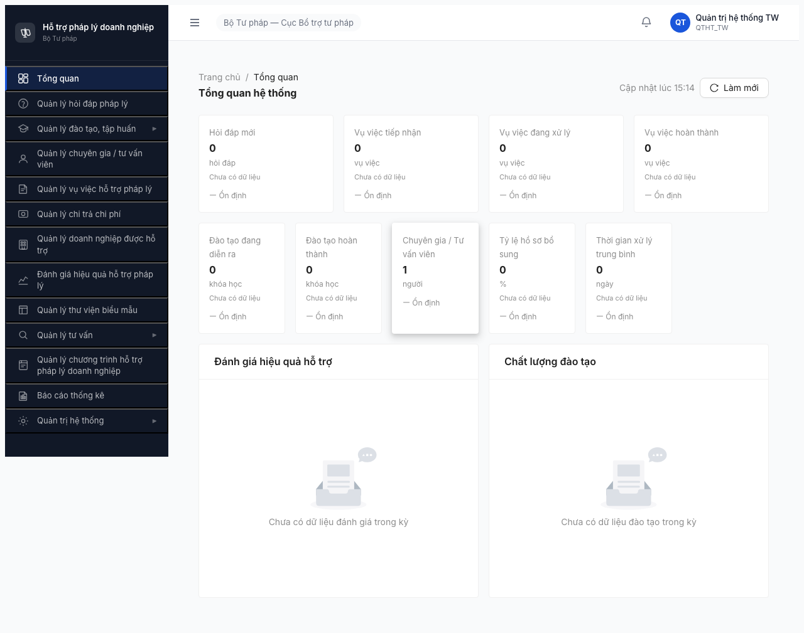
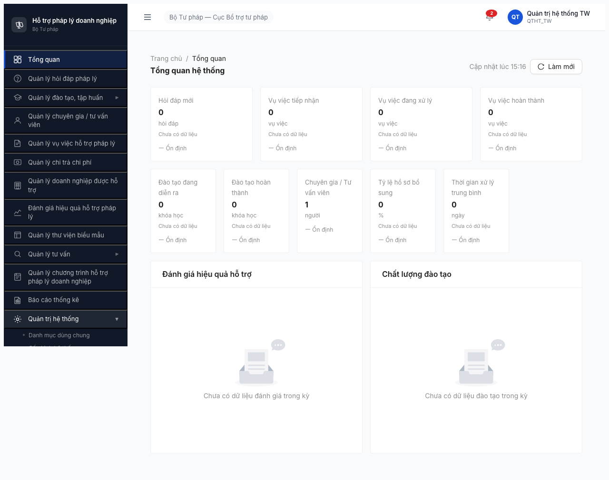

# Smoke Test Report — Round 3 — Quản trị Hệ thống / Module Tài khoản (FR-10)

> **Mục đích:** Smoke gate check module `Tài khoản & Phân quyền` (thuộc QTHT) trước Functional + Permission.
> **Spec:** [output/smoke-specs/6.10-smoke-taikhoan.md](../../../smoke-specs/6.10-smoke-taikhoan.md)
> **Template:** [output/template/smoke-test-report-template.md](../../../template/smoke-test-report-template.md)

---

## 0. Metadata

| Thông tin | Giá trị |
|-----------|---------|
| **Round** | Round 3 (deploy 2026-04-20) |
| **Ngày test** | 2026-04-20 |
| **Tester** | Claude + `/browse` (Playwright headless) |
| **Environment** | http://103.172.236.130:3000/ |
| **Primary Account** | `qtht_tw` / `Test@1234` (OTP bypass `666666`) |
| **Test Method** | atomic `$B chain` (CLAUDE.md Rule 5, Rule 8) |
| **Browse Status** | OK — 0 real crash, 1 session reset (Rule 8) được xử lý đúng |
| **Time Budget** | ~8 phút (login + navigate + verify) |
| **Tài liệu tham chiếu** | [smoke spec](../../../smoke-specs/6.10-smoke-taikhoan.md), [test-strategy.md §1.2/§8.3/§9](../../../test-strategy.md), [CLAUDE.md Rule 1-9](../../../../CLAUDE.md) |

---

## 1. Executive Summary

| # | Module | Bước 1 Login | Bước 2a Menu | Bước 2b Navigate | Bước 3 Hidden err | Verdict | Unlock Lệnh 2? |
|---|--------|-------------|-------------|------------------|-------------------|---------|---------------|
| 1 | Tài khoản (QTHT FR-10.4) | ✅ | ✅ | ⚠️ | ⚠️ | **CONDITIONAL PASS (WARN)** | ✅ YES (có caveat) |

> **Ký hiệu:** ✅ PASS | ❌ FAIL | ⚠️ WARN | ⏭️ SKIP | 🔒 BLOCKED

### Verdict tổng: **CONDITIONAL PASS (WARN)**

Module `Tài khoản` render list OK với 15 tài khoản thật, login + nav + table PASS. Tuy nhiên phát hiện **5 spec-alignment discrepancy** (tabs/columns/filters/buttons thiếu hoặc sai label vs spec 6.10) và **1 BE validation bug** (FE gửi `trangThai=CHO_PHAN_QUYEN` → BE 422, lặp 2 lần trên mỗi lần load). Module **đủ khỏe để chạy Lệnh 2 Functional**, nhưng Lệnh 4 cần verify lại spec vs app implementation (có thể SRS đã update hoặc FE chưa follow).

---

## 2. BAGM Checks — Định nghĩa (áp cho smoke này)

Smoke spec 6.10 scope **không test C3/C4** (module create/delete user — cực kỳ nhạy cảm, để Lệnh 4 lo). Chỉ test 4 bước:

| Bước | Check tương đương BAGM | Mục đích |
|------|-----------------------|----------|
| 1. Login | — | Pre-requisite |
| 2a. Menu + submenu | **C1. Access** | QTHT + Tài khoản visible ở sidebar |
| 2b. Navigate + verify | **C2. List load** | URL + tabs + columns + filters + data render |
| 3. Hidden errors | — | Console + network + toast sanity |

> **C3 Read detail / C4 Create stub:** ⏭️ SKIP (spec 6.10 ghi chú: "Chỉ đọc list ở Bước 2-3, không click action Xóa"). Để Lệnh 4 lo với account dedicated + data-readiness plan.

---

## 3. Per-Module Details

### 3.1 Tài khoản (QTHT FR-10.4) — CONDITIONAL PASS (WARN)

**Duration:** ~8 phút | **Sample record ID (reuse cho Lệnh 2):** `giangvien_user`, `dn_user`, `chuyengia_user`, `tvv_user`, `nht_user`, `canbo_tinh`, `lanhdao_dp`, `qtht_dp` (15 rows visible)

| Check | Status | Observation | Evidence |
|-------|--------|-------------|----------|
| **1. Login** | ✅ | Login `qtht_tw` OTP `666666` → `/dashboard` render 5 KPI card + 2 chart, 0 console error, API `/dashboard*` 200 |  |
| **2a. Menu QTHT + submenu Tài khoản** | ✅ | Sidebar có menu `Quản trị hệ thống ▶`, click expand → 4 submenu: `Danh mục dùng chung`, `Cấu hình hệ thống`, `Tài khoản & phân quyền`, `Nhật ký hệ thống`. Submenu `Tài khoản & phân quyền` enabled. |  |
| **2b. Navigate → /quan-tri/tai-khoan** | ⚠️ | URL `/quan-tri/tai-khoan` khớp spec, page render table 15 rows + 5 tabs + 5 filter + 9 cột. **Thiếu:** tab `Vô hiệu hóa`, cột `Ngày tạo`/`Ngày kích hoạt`, filter `Cấp`, button `Xuất Excel`/`Làm mới`. **Extra (bug):** tab `Chờ phân quyền` → gọi API `trangThai=CHO_PHAN_QUYEN` trả 422. |  |
| **3. Hidden errors** | ⚠️ | Console `--errors` sạch (0 TypeError / 0 Uncaught). Network 4xx/5xx: **2x `GET /api/v1/tai-khoan?trangThai=CHO_PHAN_QUYEN → 422`** (validation FE/BE enum mismatch). Không có 5xx, không có 403. Không có toast đỏ / text lỗi render ở page. | Network log bên dưới |

**Kết luận:**
Module infrastructure healthy — auth, routing, data fetch, table render đều hoạt động bình thường. Spec-alignment issue (5 discrepancy) và 422 spam không block Lệnh 2 — nhưng phải gửi dev kiểm tra SRS vs implementation trước khi Lệnh 4 viết TC permission/workflow.

**Bug/Observation phát hiện (5):** xem [bug-report-smoke-test.md](bug-report-smoke-test.md)

- **BUG-SMOKE-TK-001** (Major P1) — FE gửi `trangThai=CHO_PHAN_QUYEN` → BE 422 (lặp 2x/lần load)
- **BUG-SMOKE-TK-002** (Minor P2) — Thiếu tab `Vô hiệu hóa` (VO_HIEU_HOA) — spec-required
- **BUG-SMOKE-TK-003** (Minor P2) — Thiếu cột `Ngày tạo`, `Ngày kích hoạt` — spec-required
- **BUG-SMOKE-TK-004** (Minor P2) — Thiếu filter `Cấp` + thiếu button `Xuất Excel`/`Làm mới`
- **OBS-TK-001** — Button label `+ Thêm mới` (spec ghi `+ Tạo tài khoản`) — không block, chỉ label mismatch

---

## 4. Failed / Blocked Modules — Chi tiết

Không có module nào FAIL / BLOCKED.

---

## 5. Retry Log

| Bước | Attempt | Kết quả | Ghi chú |
|------|---------|---------|---------|
| 2a Menu expand | 1 | FAIL (selector matched multiple) | `text=Quản trị hệ thống` match nhiều element (sidebar menu + user label "Quản trị hệ thống TW") |
| 2a Menu expand | 2 | PASS | Đổi sang `.nav-item:has-text("Quản trị hệ thống")` — CLAUDE.md Rule 4 (selector đặc hiệu) |
| 2 (full chain) | 1 | Session reset between bash invocations (`about:blank`) | **Phân loại theo Rule 9:** HARNESS session reset — **KHÔNG** phải crash |
| 2 (full chain) | 2 | PASS | Gộp toàn bộ login + navigate + verify vào 1 atomic `$B chain` theo Rule 8 |

**Rule 9 phân loại:**
- Lần 1 fail = SELECTOR OUTDATED (multi-match) → update selector, KHÔNG retry với selector cũ
- Lần 2 URL `about:blank` = HARNESS session reset → fix bằng atomic chain, KHÔNG cleanup/retry theo Rule 7

**Không có REAL CRASH trong smoke này.**

---

## 6. Blocker Escalation

Không có Blocker. Các issue đều Major/Minor — gửi dev để fix batch trước Lệnh 4.

| # | Issue | Severity | Assignee | Status |
|---|-------|----------|----------|--------|
| 1 | 422 spam `CHO_PHAN_QUYEN` | Major P1 | FE + BE | Reported |
| 2 | Spec vs app discrepancy (tab/col/filter/button) | Minor P2 | PM + FE | Reported (cần làm rõ SRS) |

---

## 7. Recommendations

### Unlock cho Lệnh 2 (Data Readiness)
- [x] Module Tài khoản — chạy `/browse` Lệnh 2 với sample ID đã list ở row `qtht_dp`, `canbo_tinh`, `lanhdao_dp`, `giangvien_user` (15 rows thực tế có sẵn)
- ⚠️ **Caveat:** Lệnh 4 cần verify với PM whether spec 6.10-smoke-taikhoan.md đã outdated (có thể app đã đổi sang states `TAM_KHOA` + `CHO_PHAN_QUYEN` thay vì `VO_HIEU_HOA`) — ảnh hưởng TC permission matrix

### Cần verify lại lần sau
- [ ] BUG-SMOKE-TK-001: dev fix → chạy lại B2b confirm 0 request 422
- [ ] Confirm SRS FR-10 có còn state `VO_HIEU_HOA` hay đã đổi sang `CHO_PHAN_QUYEN` (chú ý cập nhật ma trận quyền + test strategy §1.2)

### Cải thiện smoke process
- CLAUDE.md Rule 8 (session reset) + Rule 9 (phân loại lỗi) đã work tốt — smoke này là case điển hình: URL `about:blank` giữa bash invocations = session reset, không phải crash. Phải atomic chain toàn bộ.
- Rule 4 (selector đặc hiệu): `text=...` không đủ — phải scope bằng class `.nav-item`/`.nav-subitem` (custom DOM, không phải Antd).

---

## 8. Appendix

### A. Tài khoản dùng

| Username | Role | Đơn vị | Cấp | Dùng cho |
|----------|------|--------|-----|---------|
| qtht_tw | QTHT | Cục BTTP | TW | Smoke B1-B3 (spec 6.10 yêu cầu QTHT) |

> Spec rõ: **KHÔNG** dùng `canbo_tw` — CB NV không có quyền QTHT. `qtht_tw` landing `/dashboard` OK (không 403).

### B. Browse patterns áp dụng (CLAUDE.md)

- **Rule 1** `wait` trước mọi `fill`/`click` — `wait input[placeholder="Nhập tên đăng nhập"]`
- **Rule 3** OTP bypass 666666 qua `$B type "666666"` trong chain
- **Rule 4** Selector đặc hiệu — `.nav-item:has-text("Quản trị hệ thống")` thay `text=...`
- **Rule 5** Atomic `$B chain` JSON cho login + navigate + verify
- **Rule 8** Gộp chain khi phát hiện session reset giữa bash invocations
- **Rule 9** Phân loại lỗi (SELECTOR OUTDATED / HARNESS session reset) trước khi react

### C. JS-assert output (Bước 2b)

```json
{
  "url": "http://103.172.236.130:3000/quan-tri/tai-khoan",
  "tabs": ["Tất cả\n15", "Hoạt động\n15", "Chờ kích hoạt\n0", "Tạm khóa\n0", "Chờ phân quyền"],
  "columns": ["Tên đăng nhập","Họ tên","Email","Đơn vị","Loại tài khoản","Vai trò","Trạng thái","Đăng nhập cuối","Thao tác"],
  "labels": ["Từ khóa","Trạng thái","Loại tài khoản","Đơn vị","Vai trò"],
  "buttonsToolbar": ["Tìm kiếm","Xóa bộ lọc","Thêm mới"],
  "rowActions": ["Khóa TK","Vô hiệu hóa"],
  "rowCount": 15,
  "hasTable": true,
  "errorTokens": []
}
```

### D. Network log (Bước 3) — 4xx/5xx

```
GET /api/v1/tai-khoan?page=1&pageSize=20 → 200 (66ms, 6268B)          ← list chính
GET /api/v1/tai-khoan?trangThai=HOAT_DONG&page=1&pageSize=1 → 200 (233ms, 484B)     ← count tab
GET /api/v1/tai-khoan?trangThai=CHO_KICH_HOAT&page=1&pageSize=1 → 200 (65ms, 82B)   ← count tab
GET /api/v1/tai-khoan?trangThai=TAM_KHOA&page=1&pageSize=1 → 200 (232ms, 82B)       ← count tab
GET /api/v1/tai-khoan?trangThai=CHO_PHAN_QUYEN&page=1&pageSize=1 → 422 (233ms, 318B) ❌ BUG
GET /api/v1/tai-khoan?page=1&pageSize=1 → 200 (233ms, 484B)
GET /api/v1/tai-khoan?trangThai=CHO_PHAN_QUYEN&page=1&pageSize=1 → 422 (44ms, 318B)  ❌ BUG (lặp)
```

**Tất cả endpoint khác** (auth, dashboard, vai-tro, don-vi, danh-muc) → 200. **Không** có 500/403.

### E. Console log

```
[console] --errors
(no console errors)
```

### F. Screenshots

| File | Mô tả | Liên quan bước |
|------|-------|----------------|
| [taikhoan-01-login-dashboard.png](screenshots/taikhoan-01-login-dashboard.png) | Dashboard sau login qtht_tw | Bước 1 |
| [taikhoan-02-menu-expanded.png](screenshots/taikhoan-02-menu-expanded.png) | Sidebar QTHT menu expanded | Bước 2a |
| [taikhoan-03-page.png](screenshots/taikhoan-03-page.png) | Page `/quan-tri/tai-khoan` đầy đủ | Bước 2b + 3 |

---

## 9. Unlock cho Lệnh 2 — Quyết định

**✅ YES — UNLOCK Lệnh 2 (Data Readiness + Functional Test)** với 2 caveat:

1. **Trước khi Lệnh 4 viết TC:** làm rõ với PM/BE whether SRS FR-10 state machine đã update. Hiện tại app có state `CHO_PHAN_QUYEN` không có trong spec, và thiếu state `VO_HIEU_HOA` spec yêu cầu. Nếu SRS thay đổi → update ma trận quyền + state machine doc.
2. **Regression check:** sau khi dev fix BUG-SMOKE-TK-001, re-run Bước 3 xác nhận 0 request 422 còn lại.

Pending Lệnh 2: reuse 15 sample user có sẵn (`giangvien_user`, `dn_user`, `chuyengia_user`, ... — đầy đủ 11 role CSV test-accounts). Không cần seed thêm cho smoke test.

---

*Smoke report | Round 3 | 2026-04-20 | `/browse` (Playwright headless) | Claude Code*
