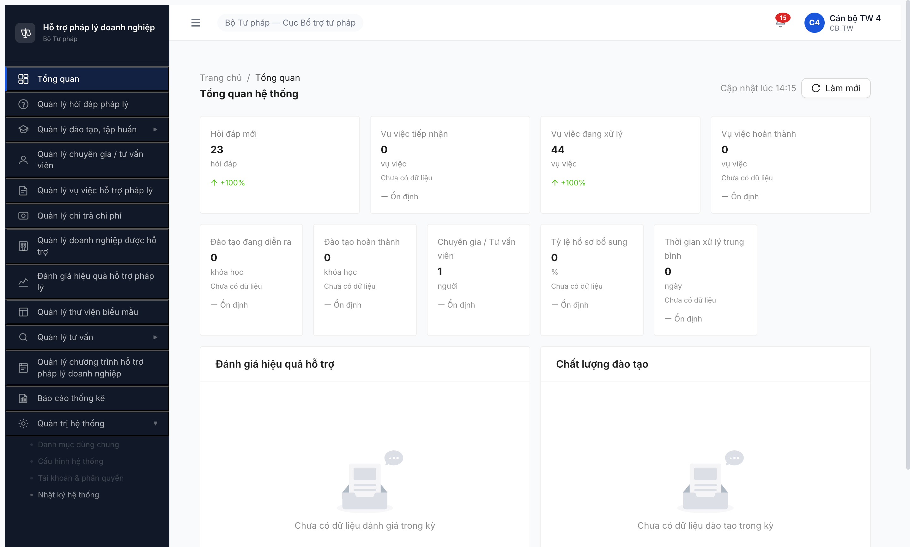

# Bug Report — CB_NV_TW × FR-01 Dashboard + FR-02 Hỏi đáp Pháp lý

| Thông tin | Giá trị |
|-----------|---------|
| **Dự án** | PM HTPLDN |
| **Phiên bản** | 1.0 |
| **Môi trường** | http://103.172.236.130:3000/ |
| **Người test** | QA Automation (Claude Code + Chrome DevTools MCP) |
| **Ngày** | 14:00:00 — 14:20:00 [2026-04-22] |
| **Loại test** | Permission Matrix |
| **Round** | Round 3 (2026-04-20) |
| **Tài liệu tham chiếu** | [permission-matrix-by-role.md §2 CB_NV_TW](../../../../permission-matrix-by-role.md) · [permission-matrix-test-report.md](permission-matrix-test-report.md) |

---

## Tổng hợp

Phát hiện **2** lỗi trong quá trình test permission matrix CB_NV_TW × FR-01..FR-02.

| Tổng | Critical | Major | Medium | Minor | Trivial |
|------|----------|-------|--------|-------|---------|
| 2    | 0        | 1     | 1      | 0     | 0       |

## Bug Summary Table

| Bug ID | Severity | Priority | Type | Module | TC Ref | Title | Status |
|--------|----------|----------|------|--------|--------|-------|--------|
| BUG-PERM-CBNV-TW-FR02-001 | Major | P1 | Permission | FR-02 (CAU_HINH_PHAN_CONG) | FR-II-NEW-01 | CB_NV_TW thấy sidebar "Cấu hình hệ thống" nhưng button disabled → không vào UI dù matrix cho CRU* | Open |
| BUG-PERM-CBNV-TW-FR02-002 | Medium | P2 | UI/UX | FR-02 (MAU_PHAN_HOI) | FR-II-NEW-02 | Không tìm thấy UI cho "Quản lý mẫu câu hỏi/phản hồi" — gap spec↔impl | Open |

> **Chú thích Type:**
> - `Permission` — phân quyền (role × action × data scope)
> - `UI/UX` — giao diện, hiển thị, tương tác

> **Chú thích Severity:**
> - `Major` — tính năng quan trọng lỗi nhưng có workaround
> - `Medium` — tính năng phụ lỗi, không block nghiệp vụ chính

> **Chú thích Priority:**
> - `P1` — fix trong sprint hiện tại
> - `P2` — fix trong 2-3 sprint tới

---

## BUG-PERM-CBNV-TW-FR02-001 — CB_NV_TW không reach được CAU_HINH_PHAN_CONG dù matrix cấp CRU*

| Trường | Chi tiết |
|--------|----------|
| **Bug ID** | BUG-PERM-CBNV-TW-FR02-001 |
| **Severity** | Major |
| **Priority** | P1 |
| **Type** | Permission |
| **Status** | Open |
| **Module** | FR-02 Hỏi đáp Pháp lý (FR-II-NEW-01) |
| **Thành phần** | Sidebar component (nav-subitem) + route guard cho `/quan-tri/cau-hinh` |
| **URL** | http://103.172.236.130:3000/ (sidebar) ↔ http://103.172.236.130:3000/quan-tri/cau-hinh (route target) |
| **Trình duyệt** | Chromium headed (Chrome DevTools MCP) |
| **Tài khoản** | canbo_tw_4 (Cán bộ TW, role `CB_NV_TW`, cấp TW, đơn vị Cục Bổ trợ tư pháp) |
| **TC Reference** | FR-II-NEW-01 × CAU_HINH_PHAN_CONG × CRU* |
| **SRS Reference** | permission-matrix-by-role.md §2 CB_NV_TW → FR-02 → FR-II-NEW-01 CAU_HINH_PHAN_CONG = `CRU*` (✅ icon) |
| **Assignee** | FE Team (sidebar permission + route guard) — BA confirm matrix |
| **Found by** | QA Automation |

### Mô tả

Role `CB_NV_TW` (Cán bộ Nghiệp vụ Trung ương) theo `permission-matrix-by-role.md §2` có quyền **CRU* (Create/Read/Update, không Delete)** trên entity `CAU_HINH_PHAN_CONG` (Cấu hình lĩnh vực ↔ phân công xử lý). Thực tế: sidebar "Quản trị hệ thống > Cấu hình hệ thống" **có render** cho CB_NV_TW nhưng mang class `nav-subitem disabled` → click không fire navigation → CB_NV_TW **không có entry point UI** để thao tác CAU_HINH_PHAN_CONG. Kết quả: role có quyền BE nhưng không access được FE → dead-end permission.

### Các bước tái hiện

1. Mở `http://103.172.236.130:3000/login`
2. Đăng nhập bằng `canbo_tw_4 / Test@1234`, OTP `666666`
3. Quan sát landing: URL `/dashboard`, avatar "Cán bộ TW 4 / CB_TW / Bộ Tư pháp — Cục Bổ trợ tư pháp" → confirm role `CB_NV_TW`
4. Trên sidebar, click button "Quản trị hệ thống ▶" để expand submenu
5. Quan sát: xuất hiện 4 submenu con: "Danh mục dùng chung", "Cấu hình hệ thống", "Tài khoản & phân quyền", "Nhật ký hệ thống"
6. Click "Cấu hình hệ thống"
7. Quan sát URL: **vẫn là `/dashboard`**, không có network request gửi đến `/quan-tri/cau-hinh`, main content không thay đổi
8. Inspect DOM button "Cấu hình hệ thống" qua `evaluate_script`:
   ```js
   document.querySelectorAll('aside button')
   // 3 trong 4 submenu QTHT có className="nav-subitem disabled"
   ```

### Kết quả mong đợi

Theo `permission-matrix-by-role.md §2 CB_NV_TW → FR-II-NEW-01`:
- Entity `CAU_HINH_PHAN_CONG`, quyền `CRU*` (Create/Read/Update scoped, no Delete)
- Icon ✅ (có quyền)

Khi click "Cấu hình hệ thống" → phải navigate đến UI có tab/section CAU_HINH_PHAN_CONG → CB_NV_TW thực hiện được Create/Read/Update (không Delete).

Hoặc nếu design intent là CB_NV_TW KHÔNG được vào submenu QTHT thì:
- Matrix phải bỏ quyền CRU* CAU_HINH_PHAN_CONG cho CB_NV_TW
- Hoặc expose entry point khác (ví dụ submenu "Cấu hình phân công" trong "Quản lý hỏi đáp pháp lý")

### Kết quả thực tế

- Sidebar button "Cấu hình hệ thống" render với class **`nav-subitem disabled`** — UI visually grayed out
- HTML `disabled` attribute KHÔNG set → button vẫn "clickable" về mặt DOM events
- Click button: không fire network request đến route `/quan-tri/cau-hinh`, URL không đổi → route handler không được wire cho role này
- Role có quyền theo spec nhưng **không có UI path** để thực hiện quyền → **dead-end permission**
- Cùng pattern cho 2 submenu khác: "Danh mục dùng chung" + "Tài khoản & phân quyền" cũng `nav-subitem disabled` (ngoài scope FR-02 nhưng note)

### Bằng chứng

**DOM inspection (`evaluate_script` result):**
```json
[
  {"label":"Danh mục dùng chung","disabled":false,"ariaDisabled":null,"className":"nav-subitem disabled","outerStart":"<button type=\"button\" class=\"nav-subitem disabled\" title=\"Danh mục dùng chung\">Danh mục dùng chung</button>"},
  {"label":"Cấu hình hệ thống","disabled":false,"ariaDisabled":null,"className":"nav-subitem disabled","outerStart":"<button type=\"button\" class=\"nav-subitem disabled\" title=\"Cấu hình hệ thống\">Cấu hình hệ thống</button>"},
  {"label":"Tài khoản & phân quyền","disabled":false,"ariaDisabled":null,"className":"nav-subitem disabled","outerStart":"<button type=\"button\" class=\"nav-subitem disabled\" title=\"Tài khoản &amp; phân quyền\">Tài khoản &amp; phân quyền</button>"},
  {"label":"Nhật ký hệ thống","disabled":false,"ariaDisabled":null,"className":"nav-subitem","outerStart":"<button type=\"button\" class=\"nav-subitem\" title=\"Nhật ký hệ thống\">Nhật ký hệ thống</button>"}
]
```

**Network requests sau click "Cấu hình hệ thống":**
- 0 requests đến `/api/v1/cau-hinh*` hoặc `/quan-tri/cau-hinh`
- Page navigation chart vẫn ở URL `/dashboard`

Ảnh chụp:



### Tác động (Impact)

- **Ai bị ảnh hưởng:** 100% user role `CB_NV_TW` (Cán bộ Nghiệp vụ Trung ương / Cục Bổ trợ tư pháp) — theo SRS đây là role chủ chốt điều phối xử lý hỏi đáp toàn quốc.
- **Nghiệp vụ:** CB_NV_TW không thể cấu hình mapping **lĩnh vực pháp lý → người xử lý** → mọi hỏi đáp mới phải phân công thủ công từng lần → **tăng thời gian xử lý + rủi ro sai nghiệp vụ** khi phân sai chuyên môn.
- **Scope ảnh hưởng:** Potentially cũng ảnh hưởng `CB_NV_BN`, `CB_NV_DP` (nếu matrix cấp quyền tương tự ở cấp BN/ĐP — cần cross-role verify).

### So sánh (Comparison)

| Role | FR-II-NEW-01 matrix | Sidebar "Cấu hình hệ thống" | Kết quả |
|------|---------------------|----------------------------|---------|
| QTHT (admin) | ✅ F (full CRUD) | Enabled (verified trong memory `qa_htpldn_chs_phancong_round1.md`) | ✅ Match |
| CB_NV_TW (canbo_tw_4) | ✅ CRU* | **Disabled (`nav-subitem disabled`)** | ❌ FAIL (BUG) |
| CB_NV_BN / CB_NV_DP | Chưa verify | Chưa verify | Gap — cần test |

### Nguyên nhân nghi ngờ (Root Cause)

Phán đoán từ DOM inspection:
1. **Sidebar component có logic: render submenu QTHT cho mọi role, nhưng check `user.roles` để apply class `disabled` cho role không thuộc whitelist.** Whitelist hiện nhiều khả năng chỉ có `QTHT` (admin root), bỏ sót `CB_NV_TW`.
2. **Route `/quan-tri/cau-hinh` có guard chỉ cho QTHT** → ngay cả khi unblock sidebar, user CB_NV_TW truy cập URL vẫn bị redirect. Cần fix cả 2 tầng.
3. **Matrix spec có thể outdated** — thực tế design intent có thể không cho CB_NV_TW vào QTHT, dù matrix ghi CRU*. Trường hợp này cần sửa matrix thay vì sửa code.

### Gợi ý sửa (Suggested Fix)

**Option A — Nếu matrix đúng (CB_NV_TW cần CRU* CAU_HINH_PHAN_CONG):**

1. **Sidebar (FE):** sửa logic gắn `disabled` class — thêm `CB_NV_TW` vào whitelist cho "Cấu hình hệ thống" submenu:
   ```diff
   - const QTHT_SUBMENU_ROLES = ['QTHT'];
   + const QTHT_SUBMENU_ROLES = ['QTHT', 'CB_NV_TW', 'CB_NV_BN', 'CB_NV_DP'];
   ```
2. **Route guard (FE/BE):** cho phép `CB_NV_TW` access route `/quan-tri/cau-hinh` (tab Phân công) với scoped CRU*.
3. **Tab-level permission:** trong trang "Cấu hình hệ thống", ẩn các tab không thuộc quyền CB_NV_TW (giữ lại Tab 2 "Phân công" — CAU_HINH_PHAN_CONG). Các Tab SLA / Tài khoản / Audit chỉ hiện cho QTHT.

**Option B — Nếu design intent là CB_NV_TW không vào QTHT (matrix sai):**

1. **Update spec:** `permission-matrix-by-role.md §2 CB_NV_TW` → bỏ quyền CRU* `CAU_HINH_PHAN_CONG` (đổi sang `R` hoặc `—` no access).
2. **Hoặc tạo entry point riêng ngoài QTHT:** thêm submenu "Cấu hình phân công" trong "Quản lý hỏi đáp pháp lý" để CB_NV_TW truy cập entity CAU_HINH_PHAN_CONG mà không qua QTHT.

**Decision needed:** BA/PM confirm Option A hay Option B. Nếu A → dev sửa code + re-test. Nếu B → QA update spec + không test lại.

---

## BUG-PERM-CBNV-TW-FR02-002 — UI module "Quản lý mẫu câu hỏi/phản hồi" chưa build (MAU_PHAN_HOI gap)

| Trường | Chi tiết |
|--------|----------|
| **Bug ID** | BUG-PERM-CBNV-TW-FR02-002 |
| **Severity** | Medium |
| **Priority** | P2 |
| **Type** | UI/UX |
| **Status** | Open |
| **Module** | FR-02 Hỏi đáp Pháp lý (FR-II-NEW-02) |
| **Thành phần** | Sidebar + module page cho MAU_PHAN_HOI entity |
| **URL** | N/A (UI chưa tồn tại) |
| **Trình duyệt** | Chromium headed (Chrome DevTools MCP) |
| **Tài khoản** | canbo_tw_4 (CB_NV_TW, TW) |
| **TC Reference** | FR-II-NEW-02 × MAU_PHAN_HOI × CRUD* |
| **SRS Reference** | permission-matrix-by-role.md §2 CB_NV_TW → FR-II-NEW-02 MAU_PHAN_HOI = `CRUD*`, Submenu = "—" |
| **Assignee** | FE + BE Team (build module mới) — BA confirm ETA |
| **Found by** | QA Automation |

### Mô tả

Matrix chỉ định CB_NV_TW có quyền **CRUD\* (full CRUD scoped theo TW)** trên entity `MAU_PHAN_HOI` (Quản lý mẫu câu hỏi/phản hồi) để dùng khi soạn phản hồi hỏi đáp. Thực tế trong FE không tồn tại bất cứ entry point UI nào:
- Sidebar không có menu "Mẫu phản hồi" / "Thư viện mẫu phản hồi"
- Trong `Quản lý hỏi đáp pháp lý` không có tab phụ hoặc nút cấu hình template
- Trong detail HD, section "Danh sách phản hồi" không có nút "Chèn từ mẫu" / "Chọn mẫu phản hồi"

Chú thích cột "Submenu / Màn hình" trong matrix là **"—"** (chưa xác định) → xác nhận đây là gap spec↔impl: spec đã định nghĩa entity + quyền, nhưng UI chưa build.

### Các bước tái hiện

1. Đăng nhập `canbo_tw_4 / Test@1234 / 666666`
2. Quét toàn bộ sidebar 13 main menu + 4 submenu QTHT → không có entry "Mẫu" / "Template" / "Phản hồi mẫu"
3. Vào "Quản lý hỏi đáp pháp lý" → quét 7 tabs + 3 action button top → không có "Mẫu phản hồi"
4. Click detail HD (row HD-20260422-023, trạng thái Mới) → quét 3 section + timeline + 2 action button → không có "Chọn mẫu phản hồi"
5. Thử đoán URL `/hoi-dap/mau-phan-hoi`, `/mau-phan-hoi` — không verify được (navigate_page sẽ kick auth, test skip để không mutate session)

### Kết quả mong đợi

Có 1 trong các phương án UI:
- **A.** Sidebar menu riêng "Quản lý mẫu phản hồi" (hoặc nested trong "Quản lý hỏi đáp pháp lý" → tab phụ)
- **B.** Nút cấu hình ⚙️ trên header page "Quản lý hỏi đáp" → modal/drawer CRUD mẫu
- **C.** Trong detail HD section "Soạn phản hồi" → dropdown "Chọn từ mẫu" + link "Quản lý mẫu"

CB_NV_TW thao tác Create/Read/Update/Delete trên MAU_PHAN_HOI scoped TW.

### Kết quả thực tế

0 entry point UI cho MAU_PHAN_HOI. Role có quyền CRUD* nhưng không có màn hình → **gap spec↔impl** (tương tự BUG-001 nhưng đây là thiếu hoàn toàn UI thay vì disabled).

### Bằng chứng

**Sidebar full inventory (`evaluate_script`):**
```json
{"sidebarCount":23,"sidebar":["Tổng quan","Quản lý hỏi đáp pháp lý","Quản lý đào tạo, tập huấn▶","Chương trình đào tạo","Khóa học","Ngân hàng câu hỏi","Giảng viên","Quản lý chuyên gia / tư vấn viên","Quản lý vụ việc hỗ trợ pháp lý","Quản lý chi trả chi phí","Quản lý doanh nghiệp được hỗ trợ","Đánh giá hiệu quả hỗ trợ pháp lý","Quản lý thư viện biểu mẫu","Quản lý tư vấn▶","Tư vấn chuyên sâu","Tư vấn nhanh","Quản lý chương trình hỗ trợ pháp lý doanh nghiệp","Báo cáo thống kê","Quản trị hệ thống▶","Danh mục dùng chung","Cấu hình hệ thống","Tài khoản & phân quyền","Nhật ký hệ thống"]}
```
→ Không có item nào liên quan "Mẫu phản hồi" / "MAU_PHAN_HOI" / "Template".

**Detail HD section cấu trúc:** Thông tin câu hỏi / Thông tin xử lý / **Danh sách phản hồi (0) → "Chưa có phản hồi nào"** (plain empty state, không có "Chèn mẫu" button) / Lịch sử xử lý.

### Tác động (Impact)

- **Ai bị ảnh hưởng:** CB_NV_TW + CB_NV_BN + CB_NV_DP (matrix có thể cấp tương tự ở cấp BN/ĐP).
- **Nghiệp vụ:** CB soạn phản hồi từng lần bằng cách gõ/copy-paste — tăng risk inconsistency câu trả lời cho các loại hỏi đáp tương tự (đặc biệt các câu hỏi lặp lại: thủ tục thành lập DN, đất đai, thuế). Mất cơ hội chuẩn hóa nội dung.
- **Không block nghiệp vụ chính** (HD workflow vẫn đi qua được) nhưng giảm productivity + chất lượng.

### Nguyên nhân nghi ngờ (Root Cause)

Matrix chú thích **"Submenu / Màn hình = —"** → team spec chưa chốt UI placement. BE có thể đã có schema entity `MAU_PHAN_HOI` nhưng FE chưa consume. Hoặc cả BE + FE đều chưa build, chỉ tồn tại trong yêu cầu chức năng SRS.

### Gợi ý sửa (Suggested Fix)

1. **Spec:** BA chốt vị trí UI cho MAU_PHAN_HOI. Đề xuất:
   - **Option A (recommended):** Tab phụ "Mẫu phản hồi" trong `/hoi-dap` (sibling với các tab state-machine) — gần context nghiệp vụ, CB đang làm hỏi đáp có thể quick access template.
   - **Option B:** Submenu riêng "Mẫu phản hồi" dưới "Quản lý hỏi đáp pháp lý ▶" (cần thêm `▶` vào sidebar item hiện đang flat).
2. **BE schema:** verify entity `MAU_PHAN_HOI` đã có table + API `/api/v1/mau-phan-hois` (CRUD). Nếu chưa → scaffold.
3. **FE CRUD page:** list table + modal Thêm/Sửa + xóa soft.
4. **Integration với detail HD:** dropdown "Chọn từ mẫu" trong editor phản hồi, insert nội dung mẫu vào textarea.

---

## Phụ lục

### A — Môi trường test

| Thành phần | Giá trị |
|------------|---------|
| URL ứng dụng | http://103.172.236.130:3000/ |
| OTP login | `666666` (bypass tạm) |
| MailHog (OTP inbox) | http://103.172.236.130:8025 (không dùng trong session này) |
| API base | http://103.172.236.130:3000/api/v1/ |
| Frontend | React + Vite + Ant Design (antd) |
| Xác thực | JWT + OTP, session storage key `auth-store` |
| Tool | Chrome DevTools MCP (`chrome-devtools-mcp@latest`) |

### B — Tài khoản sử dụng

| Tên đăng nhập | Vai trò | Cấp | Dùng cho bug nào |
|---------------|---------|-----|------------------|
| canbo_tw_4 | Cán bộ TW (CB_NV_TW) | TW | BUG-001, BUG-002 |

### C — Danh mục ảnh chụp

| File | Mô tả | Dùng cho bug |
|------|-------|--------------|
| [R-01-dashboard-FR-I.png](screenshots/R-01-dashboard-FR-I.png) | FR-01 Dashboard 9 widget (baseline PASS) | — |
| [R-02-hoidap-list.png](screenshots/R-02-hoidap-list.png) | FR-02 list 23 HD với tabs + filter + 3 action top + row actions state-aware (baseline PASS) | — |
| [R-03-hoidap-detail.png](screenshots/R-03-hoidap-detail.png) | Detail HD-20260422-023 timeline 6-stage + section (baseline PASS) | — |
| [R-04-sidebar-qtht-disabled.png](screenshots/R-04-sidebar-qtht-disabled.png) | Sidebar "Quản trị hệ thống" expand — 3/4 submenu bị class `disabled` | BUG-PERM-CBNV-TW-FR02-001 |
| [R-05-audit-log-accessible.png](screenshots/R-05-audit-log-accessible.png) | Audit log load thành công (6803 entries) — note: ngoài scope FR-01/FR-02 nhưng contradict matrix FR-10 | Reference (bug future FR-10 round) |

### D — Related memory references

- [qa_htpldn_chs_phancong_round1.md](../../../../../.claude/projects/-Users-teamai-Downloads-antigravity-QA-skilkk/memory/qa_htpldn_chs_phancong_round1.md) — 2026-04-21 test CAU_HINH_PHAN_CONG với `qtht_tw_4` (admin) — entry qua "Cấu hình hệ thống" Tab 2
- [qa_htpldn_qtht_fr06_09_round3.md](../../../../../.claude/projects/-Users-teamai-Downloads-antigravity-QA-skilkk/memory/qa_htpldn_qtht_fr06_09_round3.md) — Round 3 QTHT test reference (related matrix structure)

---

*Bug report generated: 2026-04-22 | QA Automation via Claude Code + Chrome DevTools MCP*
