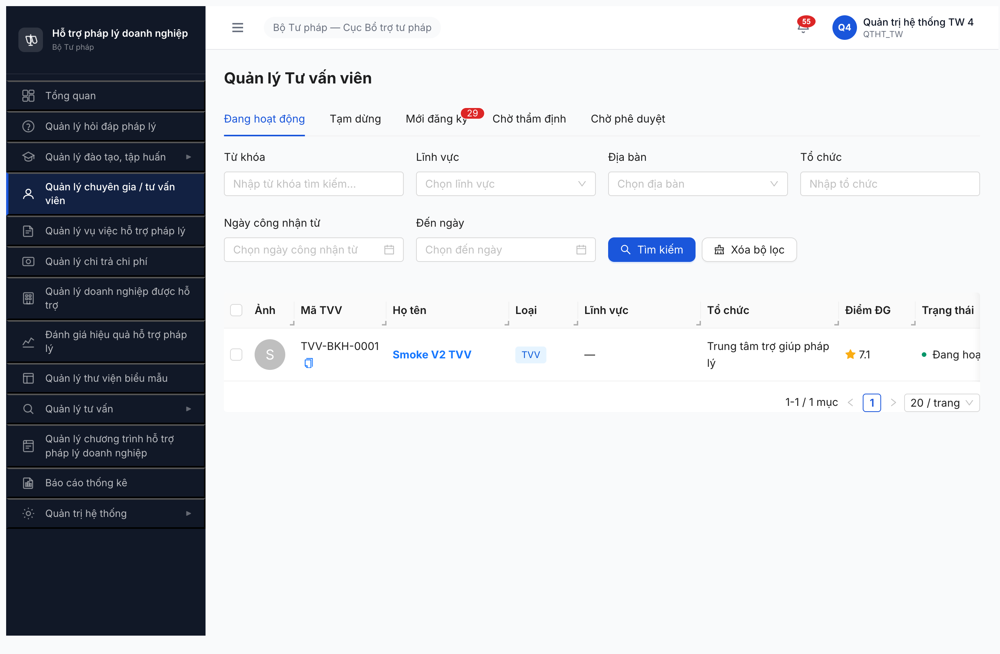
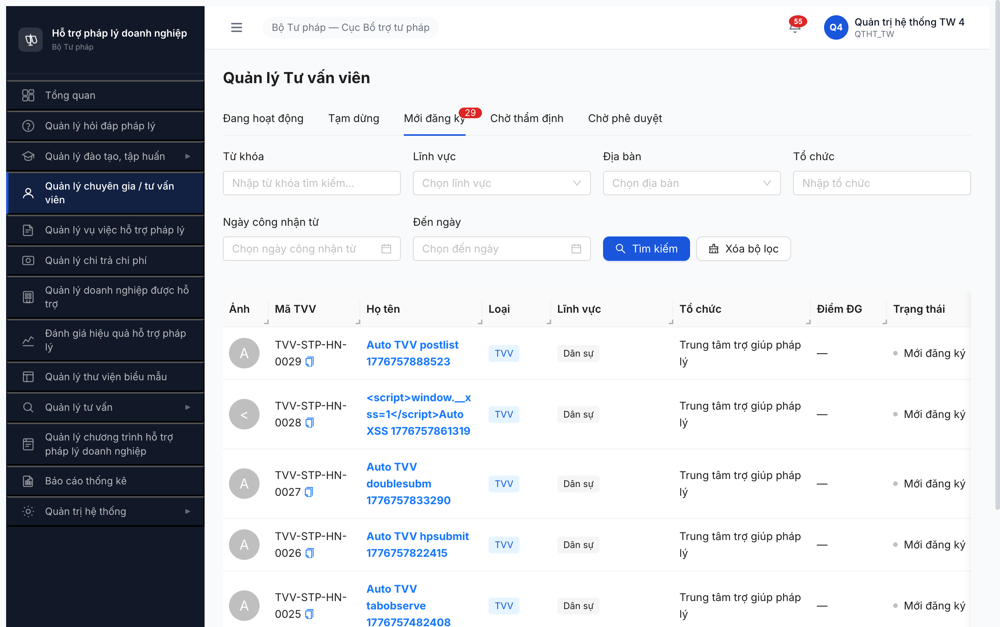
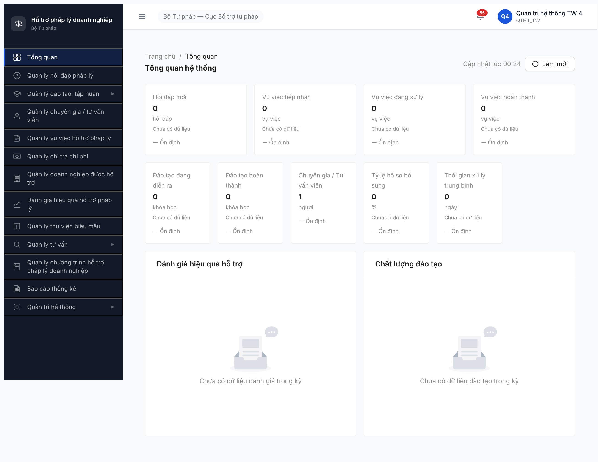
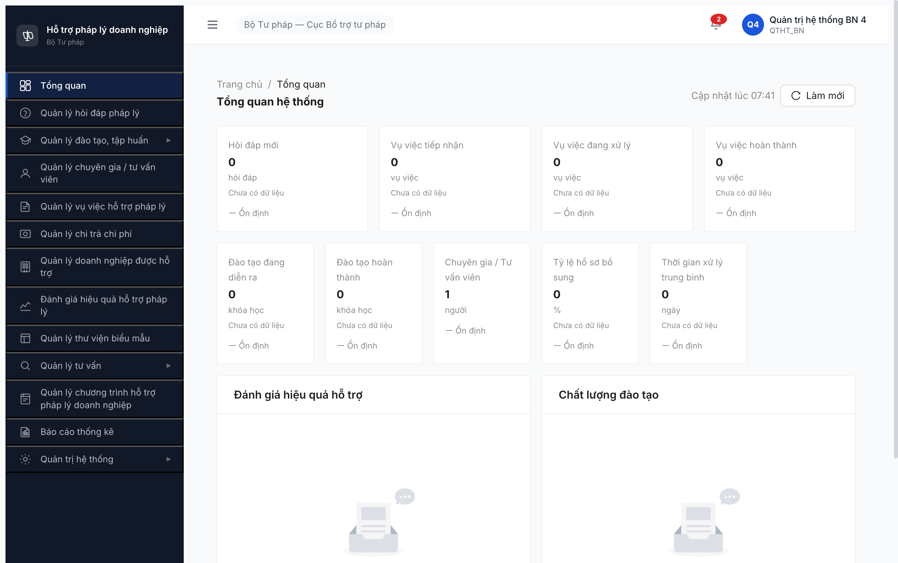
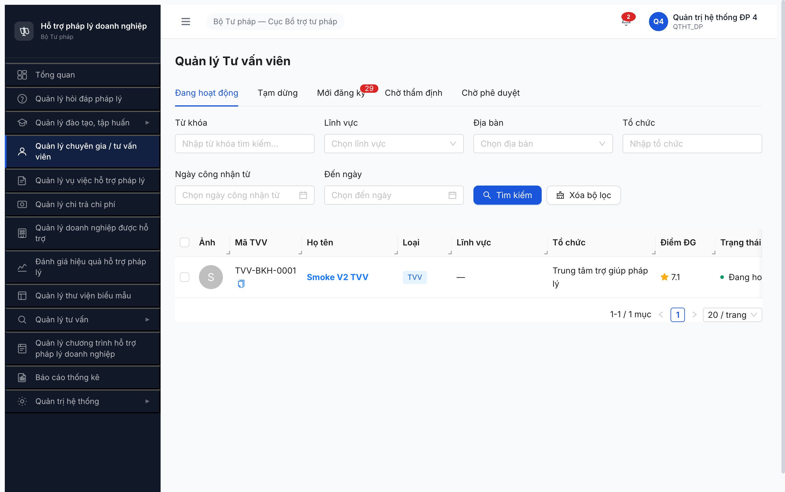
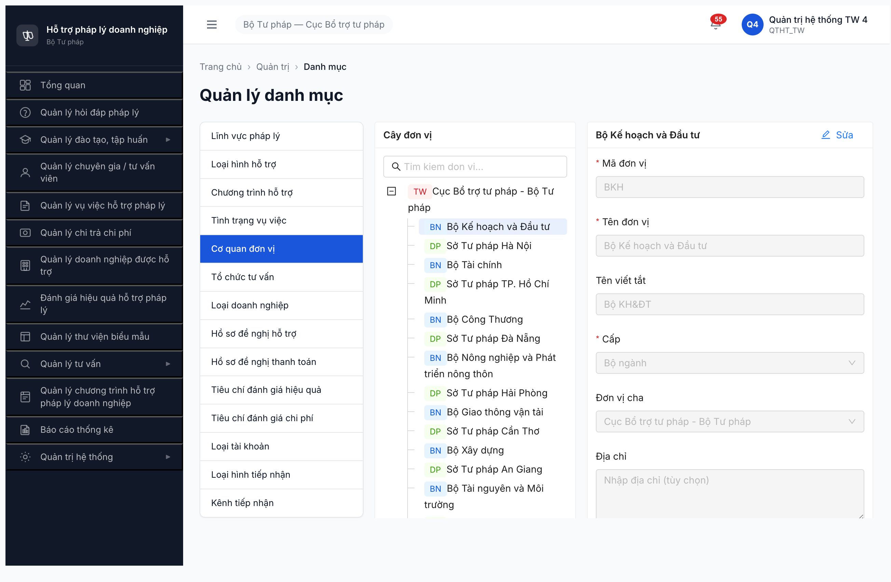
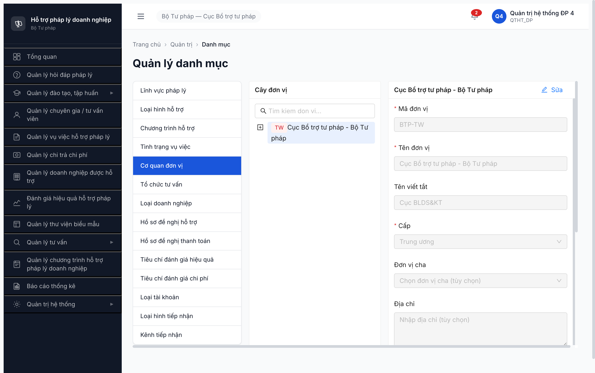

# Bug Report — Permission Matrix QTHT Round 3 (FR-01 → FR-16)

| Thông tin | Giá trị |
|-----------|---------|
| **Dự án** | PM Hỗ trợ Pháp lý Doanh nghiệp (HTPLDN) |
| **Phiên bản** | 1.0 |
| **Môi trường** | http://103.172.236.130:3000/ |
| **Người test** | QA Automation (Claude Code + Chrome DevTools MCP) |
| **Ngày** | 2026-04-22 |
| **Loại test** | Permission Matrix — role × entity × action |
| **Round** | Round 3 — Phân quyền QTHT FR-01..FR-16 (198 function × 3 cấp TW/BN/ĐP) |
| **Tài liệu tham chiếu** | [permission-matrix-by-role.md §1 QTHT](../../../permission-matrix-by-role.md) · SRS v3.1 §3.4.2 · BR-AUTH-08 |

---

## Tổng hợp

Phát hiện **4 bug phân quyền** qua 4 sub-batch test cho role QTHT (3 cấp TW/BN/ĐP) × 198 function × 16 FR.

| Tổng | Critical | **Major** | **Medium** | Minor | Trivial |
|------|----------|-----------|------------|-------|---------|
| **4**    | 0        | **2**     | **2**      | 0     | 0       |

**Coverage test tổng:** 171/198 PASS (86%) · 4 bug · 14+ PARTIAL (gap matrix/UI — không phải bug perm).

## Bug Summary Table

| Bug ID | Severity | Priority | Type | Module | FR/TC Ref | Title | Status | Found round |
|--------|----------|----------|------|--------|-----------|-------|--------|-------------|
| **BUG-PERM-QTHT-FR04-001** | **Major** | P1 | Permission | FR-04 Chuyên gia/TVV | FR-IV-01 | Row action [Xóa] render cho QTHT trên toàn bộ 29+ TVV × mọi tab × 3 cấp — vi phạm spec R-only | Open | FR-01..05 |
| **BUG-PERM-QTHT-FR04-002** | Medium | P2 | Data/Permission (scope) | FR-01 Dashboard × FR-04 | FR-I-07 + BR-AUTH-08 | Dashboard widget TVV count = 0 cho QTHT_DP (qtht_tw/bn = 1) — vi phạm BR-AUTH-08 QTHT vượt scope | Open | FR-01..05 (regression sub-batch 2 + 3) |
| **BUG-PERM-QTHT-FR10-001** | **Major** | P1 | Permission | FR-10 DMDC tab Cơ quan đơn vị | FR-VIII-05 | DON_VI tree — `[Thêm đơn vị con]` + `[Xóa]` luôn disabled mọi node + thiếu `[+ Thêm đơn vị mới]` root. QTHT không Create/Delete được | Open | FR-10 |
| **BUG-PERM-QTHT-FR10-002** | Medium | P2 | Permission (scope) | FR-10 DMDC DON_VI tree | FR-VIII-05 + BR-AUTH-08 | DON_VI tree scope-filter sai — qtht_dp_4 chỉ thấy 1 node TW (vs 84+ cho qtht_tw). Vi phạm BR-AUTH-08 | Open | FR-10 |

> **Chú thích Type:**
> - `Permission` — phân quyền (role × action × data scope)
> - `Data/Permission (scope)` — scope filter sai cho role có permission bypass

> **Chú thích Severity:**
> - `Major` — tính năng quan trọng lỗi nhưng có workaround
> - `Medium` — tính năng phụ lỗi, không block nghiệp vụ chính

**Pattern chung:** 2/4 bug là **scope filter fail cho QTHT_DP** (BR-AUTH-08 vi phạm) → BE có endpoint scope-filter theo `user.donVi` mà thiếu exception `if role === 'QTHT' bypass`. Fix cùng pattern cho cả 2 bug BUG-PERM-QTHT-FR04-002 + BUG-PERM-QTHT-FR10-002 có thể giải quyết bằng 1 middleware audit.

---

## BUG-PERM-QTHT-FR04-001 — Row action [Xóa] hiển thị cho QTHT trên toàn bộ TVV list

| Trường | Chi tiết |
|--------|----------|
| **Bug ID** | BUG-PERM-QTHT-FR04-001 |
| **Severity** | **Major** |
| **Priority** | P1 |
| **Type** | Permission |
| **Status** | Open |
| **Module** | FR-04 Chuyên gia / Tư vấn viên (list view) |
| **Thành phần** | `src/pages/chuyen-gia-tvv/danh-sach/columns.tsx` (hoặc tương đương — component render column `Hành động`) |
| **URL** | http://103.172.236.130:3000/chuyen-gia-tvv/danh-sach |
| **Trình duyệt** | Chrome DevTools MCP (Chrome 147) |
| **Tài khoản** | `qtht_tw_4` (primary), cross-scope `qtht_bn_4` + `qtht_dp_4` — cùng bug |
| **TC Reference** | FR-IV-01 (Ma trận QTHT × TU_VAN_VIEN = 👁️ R) |
| **SRS Reference** | SRS v3.1 §3.4.2 — TU_VAN_VIEN × QTHT = R (không có D) |
| **Assignee** | Frontend Team |
| **Found by** | QA Automation — Round 3 phân quyền FR-04 |

### Mô tả

Trên trang danh sách Tư vấn viên (`/chuyen-gia-tvv/danh-sach`), QTHT (3 cấp TW/BN/ĐP) thấy link **[Xóa]** (màu đỏ `#ff4d4f`, có `onclick`, `cursor:pointer`) trên **MỌI row** ở **MỌI tab** (Đang hoạt động 1 row / Mới đăng ký 29 rows / Chờ phê duyệt 2 rows / Tạm dừng + Chờ thẩm định empty).

Theo SRS §3.4.2 ma trận phân quyền, QTHT chỉ có quyền `R` (Read) với entity `TU_VAN_VIEN` — KHÔNG có D (Delete). Link [Xóa] không được phép render.

### Các bước tái hiện

1. Login `qtht_tw_4` / `Test@1234` → nhập OTP `666666` → đăng nhập thành công.
2. Click sidebar menu **Quản lý chuyên gia / tư vấn viên** → load trang `/chuyen-gia-tvv/danh-sach` (tab `Đang hoạt động` mặc định).
3. Quan sát column cuối `Hành động` trên row "TVV-BKH-0001 / Smoke V2 TVV": có **2 link** hiển thị: `Xem` (màu xanh, có href) và `Xóa` (màu đỏ, onclick).
4. Click tab `Mới đăng ký (29)` → 29 rows hiển thị, **mỗi row đều có [Xóa]**.
5. Click tab `Chờ phê duyệt` → 2 rows hiển thị, cùng bug.
6. Logout, login `qtht_bn_4` → cùng bug.
7. Logout, login `qtht_dp_4` → cùng bug.

### Kết quả mong đợi

Column `Hành động` chỉ hiển thị link `[Xem]` (điều hướng `/chuyen-gia-tvv/{id}`). **KHÔNG** có `[Xóa]`, `[Sửa]`, `[Tạm dừng]`, `[Phê duyệt]` cho role QTHT.

### Kết quả thực tế

Row TVV hiển thị CẢ `[Xem]` + `[Xóa]`. `[Xóa]` là `<a>` tag có `onclick` + `cursor:pointer` + `color:rgb(255, 77, 79)` (Antd danger red) — **clickable** (chưa click test để tránh delete data thật). Bug xuất hiện trên **11+ function FR-IV-01..12** (mọi function liên quan TU_VAN_VIEN).

### Bằng chứng

**DOM snapshot (qtht_tw_4, tab Đang hoạt động):**
```json
{
  "rowCount": 1,
  "lastCellHTML": "<div style=\"display: flex; ...\"><a href=\"/chuyen-gia-tvv/268fa2bc-...\" data-discover=\"true\">Xem</a><a style=\"color: rgb(255, 77, 79);\">Xóa</a></div>",
  "links": [
    {"text": "Xem", "href": "/chuyen-gia-tvv/268fa2bc-..."},
    {"text": "Xóa", "href": null}
  ],
  "actionElements": [
    {"tag": "A", "text": "Xóa", "onclick": true, "cursor": "pointer"}
  ]
}
```

**Screenshots:**
- 
- 
- 
- 

### Tác động (Impact)

- **100% user QTHT** (3 cấp TW/BN/ĐP) thấy [Xóa] trên toàn bộ TVV list (≥32 TVV total).
- Nếu user click nhầm [Xóa] và BE không chặn → xóa thật data TVV (chưa verify BE guard). Nếu BE chặn → toast lỗi nhưng UX gây confusion.
- **Nguy cơ data loss** nếu BE chỉ check role ở FE mà không enforce ở BE (defense in depth failure).
- Bug extensive: lặp lại **29+ lần per page** → không thể workaround bằng "nhớ không click".

### So sánh

| Role | [Xem] row | [Xóa] row | Expected spec |
|------|-----------|-----------|---------------|
| QTHT_TW | ✅ | ❌ BUG | Chỉ [Xem] |
| QTHT_BN | ✅ | ❌ BUG | Chỉ [Xem] |
| QTHT_DP | ✅ | ❌ BUG | Chỉ [Xem] |

### Nguyên nhân nghi ngờ (Root Cause)

Component render column `Hành động` không kiểm tra CASL `ability.can('delete', 'TuVanVien')`. Pattern:
```tsx
// Hiện tại (sai):
render: (_, record) => (
  <>
    <Link to={`/chuyen-gia-tvv/${record.id}`}>Xem</Link>
    <a onClick={() => handleDelete(record)}>Xóa</a>   {/* ← luôn render */}
  </>
)

// Đúng:
render: (_, record) => (
  <>
    {ability.can('read', 'TuVanVien') && <Link ...>Xem</Link>}
    {ability.can('delete', 'TuVanVien') && <a onClick={...}>Xóa</a>}
  </>
)
```

### Gợi ý sửa (Suggested Fix)

**FE fix:**
1. Identify file render column `Hành động` trên trang `/chuyen-gia-tvv/danh-sach`.
2. Wrap `[Xóa]` bằng CASL ability guard.
3. Kiểm tra CASL config cho QTHT: `cannot('delete', 'TuVanVien')`.

**BE verify:**
- Endpoint `DELETE /api/v1/tu-van-vien/{id}` phải return **403** cho role QTHT.

**Re-test:**
- [ ] 3 role QTHT navigate TVV list → chỉ có `[Xem]`.
- [ ] Login role có quyền Delete → `[Xóa]` vẫn render đúng.
- [ ] `curl -X DELETE` với token QTHT → expect 403.

---

## BUG-PERM-QTHT-FR04-002 — Dashboard widget "Chuyên gia/TVV" count = 0 cho QTHT_DP (vi phạm BR-AUTH-08)

| Trường | Chi tiết |
|--------|----------|
| **Bug ID** | BUG-PERM-QTHT-FR04-002 |
| **Severity** | Medium |
| **Priority** | P2 |
| **Type** | Data / Permission (scope filter) |
| **Status** | Open (**regression** — confirmed 3 lần qua 3 sub-batch) |
| **Module** | FR-01 Dashboard widget FR-I-07 (liên quan FR-04 TU_VAN_VIEN) |
| **Thành phần** | BE endpoint dashboard summary (đoán `/api/v1/dashboard/summary` hoặc `/api/v1/tu-van-vien/count`) — scope filter logic |
| **URL** | http://103.172.236.130:3000/dashboard |
| **Tài khoản** | `qtht_dp_4` (QTHT_DP — Sở Tư pháp Hà Nội) |
| **TC Reference** | FR-I-07 + BR-AUTH-08 |
| **SRS Reference** | BR-AUTH-08 — "QTHT vượt scope thấy TẤT CẢ đơn vị" |
| **Assignee** | Backend Team |
| **Found by** | QA Automation Round 3 FR-01..05, re-confirmed FR-06..09 + FR-10 |

### Mô tả

Dashboard widget "Chuyên gia / Tư vấn viên" (FR-I-07) hiển thị count = **0** cho user `qtht_dp_4`, trong khi cùng account login vào trang `/chuyen-gia-tvv/danh-sach` thấy **1 row Đang hoạt động** (TVV-BKH-0001) + **29 rows Mới đăng ký**. Cùng TVV này, `qtht_tw_4` và `qtht_bn_4` thấy Dashboard count = **1**.

Theo BR-AUTH-08 "QTHT vượt scope thấy TẤT CẢ đơn vị" → Dashboard count của QTHT_DP phải = số TVV Đang hoạt động TOÀN HỆ THỐNG (= 1), không filter theo đơn vị Sở TP Hà Nội.

### Các bước tái hiện

1. Login `qtht_tw_4` → Dashboard → widget "Chuyên gia / Tư vấn viên" = **1 người** ✅.
2. Logout, login `qtht_bn_4` → Dashboard → widget = **1 người** ✅.
3. Logout, login `qtht_dp_4` (Sở Tư pháp Hà Nội) → Dashboard → widget = **0 người** ❌.
4. Vẫn account `qtht_dp_4`, click sidebar "Quản lý chuyên gia / tư vấn viên" → tab "Đang hoạt động" thấy **1 row** TVV-BKH-0001 (data từ Bộ KH&ĐT) + tab "Mới đăng ký" thấy **29 rows**.
5. **Mâu thuẫn:** Dashboard = 0 nhưng list = 30+ rows.

### Kết quả mong đợi

Per BR-AUTH-08: `qtht_dp_4` Dashboard FR-I-07 TVV count = số TVV Đang hoạt động toàn hệ = **1 người** (same as qtht_tw_4 / qtht_bn_4).

### Kết quả thực tế

- `qtht_dp_4` Dashboard FR-I-07 = **0 người** + subtitle "Chưa có dữ liệu".
- List page vẫn thấy 30+ rows (không filter).

### Bằng chứng

| Account | Dashboard count | List "Đang hoạt động" | List "Mới đăng ký" | Verify lần |
|---------|-----------------|------------------------|--------------------|-----|
| qtht_tw_4 | 1 | 1 | 29 | 3/3 lần (FR-01..05, FR-06..09, FR-10) |
| qtht_bn_4 | 1 | 1 | 29 | 3/3 lần |
| **qtht_dp_4** | **0** ❌ | **1** | **29** | 3/3 lần (regression CHƯA FIX) |

**Screenshots:**
- 
- 
- 
- 
- 

### Tác động (Impact)

- QTHT cấp ĐP nhìn Dashboard cho số liệu SAI → ra quyết định sai.
- Vi phạm BR-AUTH-08 → Dashboard và list không consistent.
- Không block CRUD nhưng gây hiểu lầm report/thống kê.
- **Status sau 3 round:** **CHƯA FIX** — đã báo round 1 (FR-01..05), re-confirmed round 2 (FR-06..09), re-confirmed round 3 (FR-10).

### Nguyên nhân nghi ngờ

BE endpoint dashboard summary apply scope filter theo `user.donVi` mà KHÔNG check exception QTHT.

```ts
// Current (sai):
const count = await TuVanVienRepo.count({
  where: { donViId: user.donViId, trangThai: 'DANG_HOAT_DONG' }
});

// Đúng:
const filter = { trangThai: 'DANG_HOAT_DONG' };
if (user.role !== 'QTHT') filter.donViId = user.donViId;
const count = await TuVanVienRepo.count({ where: filter });
```

### Gợi ý sửa

**BE fix:**
1. Capture network trace khi qtht_dp_4 login + mở Dashboard → xác định endpoint trả về `tu_van_vien_count`.
2. Thêm role guard: `if (user.role !== 'QTHT') query.donViId = user.donViId`.
3. Hoặc reuse scope filter util đang dùng ở list page (đã đúng).

**Re-test:**
- [ ] qtht_dp_4 Dashboard TVV count = 1 (match list).
- [ ] qtht_dp_4 widget "Vụ việc" / "Đào tạo" cũng verify (cùng pattern endpoint — có thể cùng bug).

---

## BUG-PERM-QTHT-FR10-001 — QTHT không Create/Delete được DON_VI

| Trường | Chi tiết |
|--------|----------|
| **Bug ID** | BUG-PERM-QTHT-FR10-001 |
| **Severity** | **Major** |
| **Priority** | P1 |
| **Type** | Permission |
| **Status** | Open |
| **Module** | FR-10 Quản trị Hệ thống > Danh mục dùng chung > Tab "Cơ quan đơn vị" (DON_VI) |
| **Thành phần** | `src/pages/quan-tri/danh-muc/don-vi/**` (tree panel + detail panel components) |
| **URL** | http://103.172.236.130:3000/quan-tri/danh-muc/DON_VI |
| **Tài khoản** | `qtht_tw_4` (primary), confirmed 3 cấp QTHT |
| **TC Reference** | FR-VIII-05 (Ma trận: QTHT × DON_VI = ✅ F CRUD) |
| **SRS Reference** | SRS v3.1 §3.4.2 — DON_VI × QTHT = CRUD full |
| **Assignee** | Frontend Team (primary) + Backend Team (verify) |
| **Found by** | QA Automation Round 3 FR-10 |

### Mô tả

Tab "Cơ quan đơn vị" dùng component **tree view** (khác 13 tab DM khác dùng table). Trong component:
- `[Sửa]` (Update): enabled, hoạt động OK.
- `[+ Thêm đơn vị con]` (Create child): **DISABLED** trên mọi node (TW/BN/DP).
- `[Xóa]` (Delete): **DISABLED** trên mọi node.
- **Toolbar bên trái tree KHÔNG có button `[+ Thêm đơn vị mới]`** cấp root.

→ QTHT **chỉ Update được** DON_VI, KHÔNG thể Create/Delete. Vi phạm spec CRUD.

### Các bước tái hiện

1. Login `qtht_tw_4` / `Test@1234` → OTP `666666`.
2. Click sidebar **Quản trị hệ thống ▶ > Danh mục dùng chung**.
3. Click tab **"Cơ quan đơn vị"** → URL `/quan-tri/danh-muc/DON_VI`.
4. Quan sát toolbar tree: chỉ có "Cây đơn vị" label + search box. **KHÔNG có button [+ Thêm]**.
5. Click node root "TW Cục BTTP" → detail panel disabled form. Buttons: `[Sửa]` enabled · `[+ Thêm đơn vị con]` **disabled** · `[Xóa]` **disabled**.
6. Click node "BN Bộ KH&ĐT" → cùng pattern.
7. Click node "DP Sở TP Hà Nội" → `[Sửa]` enabled · `[Xóa]` disabled (không render [Thêm con] — leaf).
8. Click `[Sửa]` → form editable + `[Cập nhật]`/`[Hủy]` appear (Update works ✅).

### Kết quả mong đợi

Per SRS §3.4.2 `DON_VI × QTHT = CRUD`:
- Tree panel toolbar có `[+ Thêm đơn vị mới]` cho root.
- Detail panel: `[+ Thêm đơn vị con]` + `[Xóa]` ENABLED cho non-leaf nodes, có xác nhận popconfirm.

### Kết quả thực tế

- Chỉ thực hiện được `[Sửa]` (U).
- C và D KHÔNG khả dụng qua UI.
- Button disabled **KHÔNG có tooltip** giải thích → UX confusion.

### Bằng chứng

**DOM inspect (qtht_tw_4, node BN selected):**
```json
{
  "selected": "BNBộ Kế hoạch và Đầu tư",
  "actionBtns": [
    {"text": "Sửa", "disabled": false},
    {"text": "Thêm đơn vị con", "disabled": true, "title": null},
    {"text": "Xóa", "disabled": true, "title": null}
  ]
}
```

**DOM inspect toolbar tree:**
```json
// 13 tab DM khác: ["Tìm kiếm","Xuất Excel","Thêm mới"]
// Tab DON_VI toolbar: []  ← EMPTY, thiếu [+ Thêm]
```

**Screenshots:**
- 
- 

### Tác động

- **QTHT không thể tạo/xóa đơn vị** → không onboard BN/DP mới khi thực tế thành lập mới.
- Không thể soft-delete đơn vị đã giải thể.
- Workaround DB direct write → vi phạm quy trình + không audit log.
- **100% QTHT** 3 cấp bị ảnh hưởng.

### So sánh (13 tab khác vs DON_VI)

| Tab DM | Toolbar [+ Thêm] | Row/Node [Sửa] | Row/Node [Xóa] | Match CRUD? |
|--------|------------------|----------------|----------------|-------------|
| 13 tab table (Lĩnh vực PL, Loại hình HT, ...) | ✅ | ✅ | ✅ | ✅ |
| **Cơ quan đơn vị (DON_VI)** | ❌ thiếu | ✅ | ❌ disabled | ❌ **BUG** |

### Nguyên nhân nghi ngờ

Component tree detail panel hard-code `disabled={true}` cho buttons `[Thêm con]` + `[Xóa]` — có thể placeholder chưa gắn logic. Toolbar tree thiếu button `[+ Thêm]` — chưa implement.

Hoặc CASL ability config cho DON_VI không cho QTHT.

### Gợi ý sửa

**FE:**
1. Tree toolbar: add button `[+ Thêm đơn vị mới]`:
   ```tsx
   {ability.can('create', 'DonVi') && (
     <Button icon={<PlusOutlined />} type="primary" onClick={handleAddRoot}>
       Thêm đơn vị mới
     </Button>
   )}
   ```
2. Detail panel: bỏ hard-code disabled:
   ```tsx
   <Button icon="plus" disabled={!ability.can('create', 'DonVi')} onClick={handleAddChild}>
     Thêm đơn vị con
   </Button>
   <Button icon="delete" danger disabled={!ability.can('delete', 'DonVi')} onClick={handleDelete}>
     Xóa
   </Button>
   ```
3. Add tooltip cho disabled state.

**BE:**
- Verify `POST /api/v1/don-vi` + `DELETE /api/v1/don-vi/{id}` accept QTHT role.
- Soft-delete logic (không cho xóa đơn vị còn user active / parent của đơn vị khác).

**Re-test:**
- [ ] 3 role QTHT click `[+ Thêm đơn vị mới]` → drawer mở.
- [ ] Click non-leaf node → `[+ Thêm đơn vị con]` enabled → drawer pre-fill `Đơn vị cha`.
- [ ] Click node → `[Xóa]` enabled → popconfirm → delete success.
- [ ] BE accept DELETE/POST với QTHT token → 200.

---

## BUG-PERM-QTHT-FR10-002 — DON_VI tree scope-filter sai cho QTHT_DP

| Trường | Chi tiết |
|--------|----------|
| **Bug ID** | BUG-PERM-QTHT-FR10-002 |
| **Severity** | Medium |
| **Priority** | P2 |
| **Type** | Permission (scope) |
| **Status** | Open |
| **Module** | FR-10 Quản trị > Danh mục > Tab DON_VI tree data |
| **Thành phần** | BE endpoint tree DON_VI (đoán `/api/v1/don-vi/tree` hoặc `/api/v1/danh-muc/don-vi`) |
| **URL** | http://103.172.236.130:3000/quan-tri/danh-muc/DON_VI |
| **Tài khoản** | `qtht_dp_4` (QTHT_DP — Sở TP Hà Nội) |
| **TC Reference** | FR-VIII-05 + BR-AUTH-08 |
| **SRS Reference** | BR-AUTH-08 — "QTHT vượt scope thấy TẤT CẢ đơn vị" |
| **Assignee** | Backend Team |
| **Found by** | QA Automation Round 3 FR-10 cross-scope |

### Mô tả

Tab DON_VI tree chỉ hiển thị **1 node (TW root)** khi đăng nhập `qtht_dp_4`. Cùng page cho `qtht_tw_4` thấy 84+ nodes (1 TW + 16 BN + 67 DP). Vi phạm BR-AUTH-08.

### Các bước tái hiện

1. Login `qtht_tw_4` → Click QTHT > DMDC > Cơ quan đơn vị → tree 84+ nodes.
2. Logout, login `qtht_dp_4` → cùng page → tree **1 node TW root only**.
3. Click expand node root → không children load.
4. Search "Bộ" → không tìm thấy BN nào.

### Bằng chứng

**DOM inspect qtht_dp_4:**
```json
{
  "treeCount": 1,
  "sampleNodes": ["TWCục Bổ trợ tư pháp - Bộ Tư pháp"],
  "actionBtns": [
    {"text": "Sửa", "disabled": false},
    {"text": "Thêm đơn vị con", "disabled": true},
    {"text": "Xóa", "disabled": true}
  ]
}
```

**Screenshot:** 

### Tác động

- QTHT_DP không thấy đủ đơn vị → không quản trị toàn hệ.
- Không chuyển user giữa đơn vị (dropdown "Đơn vị cha" empty).
- Consistent với pattern BUG-PERM-QTHT-FR04-002 (Dashboard scope).

### Gợi ý sửa

**BE:**
```ts
// Current (sai):
const nodes = await DonViRepo.find({ 
  where: [{ id: user.donViId }, { parentId: user.donViId }] 
});

// Đúng:
if (user.role === 'QTHT') return DonViRepo.find();  // bypass scope per BR-AUTH-08
const nodes = await DonViRepo.find({ 
  where: [{ id: user.donViId }, { parentId: user.donViId }] 
});
```

**Re-test:**
- [ ] qtht_dp_4 tree render 84+ nodes.
- [ ] qtht_bn_4 tree render đầy đủ.
- [ ] Audit tất cả endpoint có scope filter — apply cùng pattern fix (xem bảng bên dưới).

---

## Pattern chung 2 bug scope (BUG-PERM-QTHT-FR04-002 + FR10-002)

Cả 2 bug Medium đều do **BE endpoint apply scope filter theo `user.donVi` mà thiếu exception cho role QTHT**.

**Đề xuất audit toàn hệ:** check tất cả endpoint trả list/count data. Với mỗi endpoint:
1. Có filter theo `user.donVi`?
2. Có exception `if (user.role === 'QTHT') bypass`?

**Endpoint nghi ngờ cùng pattern (cần verify):**
- `/api/v1/dashboard/summary` (BUG-FR04-002)
- `/api/v1/don-vi/tree` (BUG-FR10-002)
- `/api/v1/tai-khoan?donViId=...` (TK list scope)
- `/api/v1/vu-viec?donViId=...` (VV scope)
- `/api/v1/hoi-dap?donViId=...` (HĐ scope)
- Và các entity khác có scope filter.

**Fix 1 lần bằng middleware:**
```ts
// scope-filter.middleware.ts
const scopeFilterMiddleware = (req, res, next) => {
  if (req.user.role === 'QTHT') {
    req.bypassScope = true;  // flag để service skip scope filter
  }
  next();
};

// In repository:
async find(query, context) {
  if (!context.bypassScope) {
    query.donViId = context.user.donViId;
  }
  return this.repo.find(query);
}
```

---

## Tổng kết và trạng thái

### 4 bug mở (0 đã fix)

| Bug | Severity | Round phát hiện | Round re-confirmed | Status hiện tại |
|-----|----------|-----------------|--------------------|-----------------| 
| BUG-PERM-QTHT-FR04-001 | Major | FR-01..05 | (chưa re-test) | **Open** |
| BUG-PERM-QTHT-FR04-002 | Medium | FR-01..05 | FR-06..09 + FR-10 (3 lần) | **Open regression** |
| BUG-PERM-QTHT-FR10-001 | Major | FR-10 | (chưa re-test) | **Open** |
| BUG-PERM-QTHT-FR10-002 | Medium | FR-10 | (chưa re-test) | **Open** |

### Coverage test

| Phase | Func tested | PASS | FAIL (bug) | GAP (matrix/UI) |
|-------|-------------|------|-----------|-----------------|
| FR-01..05 | 74 | 62 (84%) | 2 (BUG-04-001, -002) | 3 |
| FR-06..09 | 33 | 29 (88%) | 0 | 4 |
| FR-10 | 25 | 20 (80%) | 2 (BUG-10-001, -002) | 4 |
| FR-11..16 | 66 | 60 (91%) | 0 | 6 |
| **TỔNG** | **198** | **171 (86%)** | **4 bug** | **17+ GAP** |

### Next steps ưu tiên

**Ưu tiên 1 — Fix 2 bug Major (P1):**
- BUG-PERM-QTHT-FR04-001 — wrap [Xóa] bằng CASL guard (FE, 1-2 giờ + re-test).
- BUG-PERM-QTHT-FR10-001 — enable tree CRUD DON_VI (FE 2-3 giờ + BE verify).

**Ưu tiên 2 — Fix 2 bug Medium (P2) với cùng pattern:**
- Audit BE scope filter middleware; add `if role === 'QTHT' bypass` cho cả 2 bug Dashboard + DON_VI tree.

**Ưu tiên 3 — Re-test sau fix:**
- Full regression 4 cấp cấp (admin + qtht_tw + qtht_bn + qtht_dp) qua tất cả bug scenarios.
- Verify BE 403 guard cho non-QTHT gọi TVV/DON_VI DELETE API.

---

## Phụ lục

### A — Môi trường test
| Thành phần | Giá trị |
|------------|---------|
| URL | http://103.172.236.130:3000/ |
| OTP | `666666` bypass |
| Tool | Chrome DevTools MCP (primary từ 2026-04-21) |
| Stack | React + Vite + Ant Design + JWT + OTP |

### B — Tài khoản sử dụng
| Username | Role | Cấp | Đơn vị | Bug verify |
|----------|------|-----|--------|------------|
| qtht_tw_4 | QTHT | TW | Cục BTTP - Bộ Tư pháp | BUG-04-001, BUG-10-001 primary |
| qtht_bn_4 | QTHT | BN | Bộ Kế hoạch và Đầu tư | BUG-04-001 cross-scope |
| qtht_dp_4 | QTHT | DP | Sở Tư pháp Hà Nội | BUG-04-001 + BUG-04-002 + BUG-10-002 + BUG-10-001 |

### C — Danh mục ảnh chụp bug-relevant

| File | Mô tả | Bug |
|------|-------|-----|
| [R-01-qtht_tw-dashboard.png](screenshots/R-01-qtht_tw-dashboard.png) | Dashboard qtht_tw_4 count=1 (baseline) | BUG-04-002 (comparison) |
| [R-07-qtht_tw-fr04-tvv-xoa-bug.png](screenshots/R-07-qtht_tw-fr04-tvv-xoa-bug.png) | TVV Đang hoạt động 1 row có [Xóa] | **BUG-04-001** |
| [R-08-qtht_tw-fr04-tvv-moidangky.png](screenshots/R-08-qtht_tw-fr04-tvv-moidangky.png) | TVV Mới đăng ký 29 rows có [Xóa] | **BUG-04-001** |
| [R-20-qtht_bn-dashboard.png](screenshots/R-20-qtht_bn-dashboard.png) | Dashboard qtht_bn_4 count=1 | BUG-04-002 (comparison) |
| [R-21-qtht_bn-tvv-list.png](screenshots/R-21-qtht_bn-tvv-list.png) | qtht_bn_4 TVV list có [Xóa] | **BUG-04-001** cross-scope |
| [R-30-qtht_dp-dashboard.png](screenshots/R-30-qtht_dp-dashboard.png) | Dashboard qtht_dp_4 count=**0** | **BUG-04-002** evidence |
| [R-31-qtht_dp-tvv-danghoatdong.png](screenshots/R-31-qtht_dp-tvv-danghoatdong.png) | qtht_dp_4 TVV list 1 row | BUG-04-002 (list != dashboard) |
| [R-32-qtht_dp-tvv-moidangky.png](screenshots/R-32-qtht_dp-tvv-moidangky.png) | qtht_dp_4 Mới đăng ký 29 rows có [Xóa] | BUG-04-001 + 002 |
| [R-61-qtht_tw-fr10-donvi-tree-disabled.png](screenshots/R-61-qtht_tw-fr10-donvi-tree-disabled.png) | DON_VI tree qtht_tw + buttons disabled | **BUG-10-001** |
| [R-64-qtht_dp-fr10-donvi-scope-filtered.png](screenshots/R-64-qtht_dp-fr10-donvi-scope-filtered.png) | qtht_dp_4 DON_VI tree chỉ 1 node | **BUG-10-002** |

---

*Bug report generated: 2026-04-22 | QA Automation via Claude Code + Chrome DevTools MCP*

*File này thay thế bug-report.md + bug-report-fr10.md (2 file cũ — có thể xóa).*
