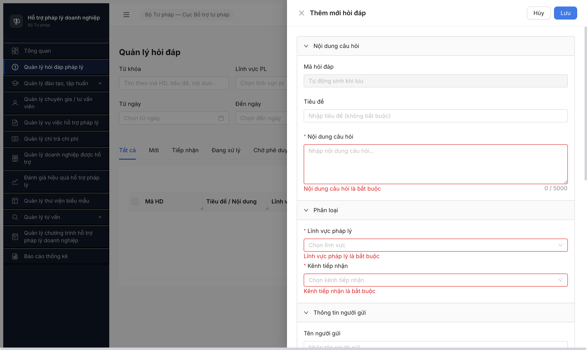

# Bug Report — Hỏi đáp Pháp lý (FR-II / SRS-FR-02)

| Thông tin | Giá trị |
|-----------|---------|
| **Dự án** | PM HTPLDN — Hỗ trợ Pháp lý Doanh nghiệp |
| **Môi trường** | http://103.172.236.130:3000/ |
| **Người test** | QA Automation via Claude Code |
| **Ngày** | 2026-05-04 |
| **Loại test** | Functional CRUD — file 01 pilot (`01-TC-quan-ly-hoi-dap.md`) |
| **Round** | Round 1 |
| **Tài liệu tham chiếu** | [test-plan-overview](../../test-cases/hoi-dap/00-test-plan-overview.md) · [test-case-execution-report](test-case-execution-report.md) |

---

## Tổng hợp

Phát hiện **6** lỗi có SRS reference cụ thể trong quá trình test file 01 (FR-II-01, UC10 — Quản lý Hỏi đáp). Round 1 + Round 2 unblock attempts.

### Severity breakdown

| Tổng | Critical | Major | Medium | Minor | Trivial |
|------|----------|-------|--------|-------|---------|
| 6    | 1        | 3     | 1      | 1     | 0       |

## Bug Summary Table

| Bug ID | Severity | Priority | Type | TC Ref | **SRS Reference** | Title | Status |
|--------|----------|----------|------|--------|-------------------|-------|--------|
| BUG-HD-001 | Major | P1 | UI/UX | TC-HD-024 | `FR-II-01 / DG-06` (sort cột Ngày tạo) + `SCR-II-01 row "Bảng kết quả"` | Sort header "Ngày tạo" toggle ASC/DESC chỉ đổi `aria-sort`, KHÔNG đảo data row order | Open |
| BUG-HD-002 | Medium | P2 | Negative | TC-HD-022 | `FR-II-01 §3.4 Trường file_dinh_kem` (whitelist 5 ext: `doc/docx/xls/xlsx/pdf`) | UI/BE whitelist file upload thêm `.jpg, .png` không có trong SRS whitelist | Open |
| BUG-HD-003 | Minor | P3 | UI/UX | TC-HD-015 | `BR-DATA-01` (Soft Delete: is_deleted=1, không xóa vật lý) | Dialog confirm xóa hiển thị "Hành động này không thể hoàn tác" — mâu thuẫn cơ chế soft delete | Open |
| BUG-HD-004 | **Critical** | P0 | Data | TC-HD-005, TC-HD-009 | `FR-II-01 §3.4 file_dinh_kem` + `Phụ lục B BR-DATA` (HOI_DAP entity hỗ trợ file upload) | API `/api/v1/files/upload` thiếu `HoiDap` trong whitelist `entityType` → upload file đính kèm cho Hỏi đáp KHÔNG hoạt động | Open |
| BUG-HD-005 | Major | P0 | Data | TC-HD-013/016/021/027 + cascade file 05/06/07 | `FR-II-NEW-01 (Cấu hình lĩnh vực ↔ phân công xử lý)` + `FR-II-06 §Processing Bước 2` | Workflow `phan-cong` chặn vì DB chưa seed `CauHinhPhanCong` cho user-lĩnh-vực-đơn-vị → chặn toàn bộ luồng tiếp nhận → phân công → phản hồi → phê duyệt → công khai | Open |
| BUG-HD-006 | Major | P1 | Edge | TC-HD-023 | `BR-DATA-04 (Auto-gen mã HD-YYYYMMDD-SEQ unique)` + `SRS Gap G6 (Atomic Counter mechanism)` | Race condition: 10 parallel POST → 4/10 success unique sequential ✅ + 6/10 fail với `500 ERR-SYS-00-00-01` (BE crash dưới load thay vì serialize) | Open |

---

## BUG-HD-001 — Sort cột "Ngày tạo": aria-sort đổi nhưng data row order không đảo

### Mô tả

Tester `cb_nv_bn_01` ở danh sách `/hoi-dap` click 3 lần liên tiếp lên header cột "Ngày tạo" (cột duy nhất sortable theo SRS DG-06). Thuộc tính `aria-sort` của header chuyển đúng cycle (none → "ascending" → "descending") nhưng **thứ tự row trong tbody KHÔNG đảo** — luôn giữ DESC (mới nhất trên cùng) bất kể trạng thái sort UI. Tester nhìn UI tưởng đã ASC nhưng thực tế vẫn DESC.

### Các bước tái hiện

1. Login `cb_nv_bn_01` / `Secret@123` (OTP `666666`).
2. Vào "Quản lý hỏi đáp pháp lý" → seed sẵn 4 records HD-20260504-001..004 ở MOI (cùng ngày, mỗi record cách nhau 1-2 phút).
3. Quan sát default sort: HD-004 (17:31) → HD-003 (17:29) → HD-002 (17:28) → HD-001 (17:26) — DESC theo "Ngày tạo".
4. Click 1 lần lên header "Ngày tạo".
5. Click lần 2.
6. Click lần 3.
7. Sau mỗi click, đọc `aria-sort` của header + đọc thứ tự row.

### Kết quả mong đợi

- Theo SRS DG-06 + TC-HD-024: cột "Ngày tạo" sortable. Click toggle phải đảo thứ tự row:
  - Click 1 (default DESC → toggle): ASC, row order HD-001 (17:26) → HD-002 → HD-003 → HD-004
  - Click 2: DESC trở lại
  - `aria-sort` phải đồng bộ với data order

### Kết quả thực tế

- Click 1: `aria-sort` không capture được (intermediate state), row order GIỮ DESC: HD-004 → HD-003 → HD-002 → HD-001
- Click 2: `aria-sort = "ascending"`, row order **VẪN DESC**: HD-004 → HD-003 → HD-002 → HD-001 ❌
- Click 3: `aria-sort = "descending"`, row order DESC (đúng nhưng đã đúng từ default)

→ Sort UI state cycle đúng nhưng **data fetch không re-order theo direction**. FE có thể không truyền `sort=createdAt:asc` lên BE, hoặc BE bỏ qua param sort.

### Bằng chứng


**Network observation:** Sau 3 click sort, request `GET /api/v1/hoi-daps?tab=TAT_CA&page=1&pageSize=20` (reqid 233) trả 304 (cache) — KHÔNG thấy `sort=` param trong query string. → FE không gửi sort direction lên BE.

```
Request: GET /api/v1/hoi-daps?tab=TAT_CA&page=1&pageSize=20  → 304
Expected: GET /api/v1/hoi-daps?tab=TAT_CA&page=1&pageSize=20&sort=createdAt:asc → 200
```

---

## BUG-HD-002 — File upload whitelist UI gồm `.jpg, .png` thừa so SRS

### Mô tả

Form Thêm/Sửa Hỏi đáp có ô upload file đính kèm. UI hiển thị placeholder "Tối đa 10 tệp. Định dạng: .doc, .docx, .xls, .xlsx, .pdf, .jpg, .png. Dung lượng tối đa: 20MB." Inspect DOM: `<input type="file" accept=".doc,.docx,.xls,.xlsx,.pdf,.jpg,.png" multiple>`. SRS quy định trường `file_dinh_kem` chỉ chấp nhận **5 định dạng**: `doc/docx/xls/xlsx/pdf` (KHÔNG có image). TC-HD-022 expected: jpg/png/zip/exe đều bị chặn — actual chỉ zip/exe bị chặn, jpg/png được cho phép.

### Các bước tái hiện

1. Login `cb_nv_bn_01`, vào `/hoi-dap`, click [+ Thêm mới].
2. Trong modal Thêm mới hỏi đáp, scroll xuống section "File đính kèm".
3. Đọc placeholder ô upload + inspect DOM input[type=file] accept attribute.

### Kết quả mong đợi

- Theo `FR-II-01 §3.4 file_dinh_kem` + TC-HD-022: chỉ chấp nhận 5 định dạng `doc, docx, xls, xlsx, pdf`.
- Placeholder + accept attribute phải khớp 5 ext này.
- Upload file `.jpg`/`.png` phải bị từ chối ở client-side (filter accept) + server-side.

### Kết quả thực tế

- Placeholder UI: `"Tối đa 10 tệp. Định dạng: .doc, .docx, .xls, .xlsx, .pdf, .jpg, .png. Dung lượng tối đa: 20MB."` — **7 định dạng**.
- DOM input: `accept=".doc,.docx,.xls,.xlsx,.pdf,.jpg,.png"` — confirm 7 ext.
- jpg/png được client-side filter chấp nhận → upload pass UI gate (chưa test server-side phản ứng thực tế).

### Bằng chứng

DOM evaluate_script result:
```json
[{"accept":".doc,.docx,.xls,.xlsx,.pdf,.jpg,.png","multiple":true,"name":"file"}]
```



> Ảnh trên cũng có placeholder "Tối đa 10 tệp. Định dạng: .doc, .docx, .xls, .xlsx, .pdf, .jpg, .png" ở section "File đính kèm" gần cuối modal.

---

## BUG-HD-003 — Dialog confirm xóa wording mâu thuẫn cơ chế soft delete

### Mô tả

Khi tester click [Xóa] trên 1 hỏi đáp ở MOI, dialog confirm hiện ra với text "Bạn có chắc muốn xóa hỏi đáp HD-20260504-004 không? **Hành động này không thể hoàn tác.**" — câu sau ngụ ý hard delete. Theo `BR-DATA-01` cơ chế xóa của hệ thống là **soft delete** (set `is_deleted=1`, dữ liệu vật lý vẫn tồn tại trong DB, có thể restore bởi QTHT). Wording dialog gây hiểu nhầm cho user về tính chất xóa.

### Các bước tái hiện

1. Login `cb_nv_bn_01`, vào `/hoi-dap`.
2. Tìm 1 hỏi đáp ở trạng thái MOI (vd `HD-20260504-004`).
3. Click button [Xóa] (icon thùng rác) ở cột Hành động.
4. Đọc nội dung dialog confirm.

### Kết quả mong đợi

- Theo BR-DATA-01: xóa = soft delete, có thể khôi phục.
- Wording dialog phải nói rõ: bản ghi sẽ bị ẩn khỏi danh sách nhưng vẫn lưu trong DB và có thể được khôi phục bởi quản trị viên.
- Suggest wording: `"Hỏi đáp HD-{ma} sẽ bị xóa khỏi danh sách. Bạn có chắc muốn tiếp tục?"` (hoặc tương tự — bỏ "không thể hoàn tác").

### Kết quả thực tế

- Dialog text actual: `"Xóa hỏi đáp? Bạn có chắc muốn xóa hỏi đáp HD-20260504-004 không? Hành động này không thể hoàn tác."`
- Câu "Hành động này không thể hoàn tác" → ngụ ý hard delete → mâu thuẫn BR-DATA-01.
- Network: `DELETE /api/v1/hoi-daps/{id}` → 204 No Content — chưa verify server thực sự soft hay hard delete (cần query DB hoặc API GET sau xóa để xem record còn `is_deleted=true` không). **Nếu BE thực sự hard delete → đây là BUG-HD-001 trầm trọng hơn (Major) vì vi phạm BR-DATA-01**. Khuyến nghị Dev verify.

### Bằng chứng

Snapshot a11y tree khi dialog confirm hiển thị (TC-HD-015):
```
uid=18_0 dialog "Xóa hỏi đáp?" modal
  uid=18_1 image "exclamation-circle"
  uid=18_2 StaticText "Xóa hỏi đáp?"
  uid=18_3 StaticText "Bạn có chắc muốn xóa hỏi đáp HD-20260504-004 không? Hành động này không thể hoàn tác."
  uid=18_4 button "Hủy"
  uid=18_5 button "Xóa" focusable focused
```

(Screenshot dedicated chưa capture vì dialog chỉ hiện thoáng qua trước khi click Xóa — sẽ bổ sung ở Round 2.)

---

---

## BUG-HD-004 — Upload API `/files/upload` thiếu entityType `HoiDap` → file đính kèm cho Hỏi đáp không hoạt động

### Mô tả

Tester gửi POST multipart `/api/v1/files/upload` với 5 thử nghiệm khác nhau (file .pdf 5MB / .jpg / EICAR virus / file 25MB / file .zip) và 4 cách truyền entityType (`HoiDap` / `HOI_DAP` / không truyền / qua query string). Tất cả request đều bị BE từ chối với cùng lỗi validation `entityType must be one of the following values: VuViec, HoSoVuViec, KetQuaVuViec, HoSoChiTra, HoSoTuVanVien, DanhGiaVuViec`. Whitelist 6 entity types này KHÔNG có `HoiDap` → upload file đính kèm cho HOI_DAP module bị chặn ở BE level.

### Các bước tái hiện

1. Login `cb_nv_bn_01` qua API: `POST /auth/login` + `POST /auth/verify-otp` (OTP `666666`) → lấy JWT.
2. Gửi POST multipart:
   ```bash
   curl -X POST "http://103.172.236.130:3000/api/v1/files/upload" \
     -H "Authorization: Bearer $JWT" \
     -F "file=@test.pdf" \
     -F "entityType=HoiDap" \
     -F "entityId=0305187b-29bb-4333-8412-d1c04dca55e7"
   ```
3. Lặp lại với entityType `HOI_DAP`, `HoiDap` (camelCase), không truyền entityType, hoặc qua query string.
4. Quan sát response status + body.

### Kết quả mong đợi

- Theo SRS `FR-II-01 §3.4` trường `file_dinh_kem` của HOI_DAP entity được khai báo `binary[]` với constraint `doc/docx/xls/xlsx/pdf, max 20MB/file, quét ClamAV khi upload, max 10 files/request`.
- API upload phải accept `entityType=HoiDap` (hoặc tương đương) → trả 201 + `data.fileId` để client gắn vào `fileDinhKem` field khi POST/PATCH `/hoi-daps`.

### Kết quả thực tế

- Mọi cách gọi đều trả `422 Unprocessable Entity` + code `ERR-VAL-SYS-00-01` + message: `"entityType must be one of the following values: VuViec, HoSoVuViec, KetQuaVuViec, HoSoChiTra, HoSoTuVanVien, DanhGiaVuViec"`.
- Endpoint thay thế `/api/v1/hoi-daps/files/upload` → 404.
- Endpoint thay thế `/api/v1/hoi-daps/{id}/files` → 404.
- → Không có endpoint nào hoạt động được cho upload file đính kèm vào HoiDap.

### Bằng chứng

```
POST /api/v1/files/upload  (FormData: file=test.pdf 5MB, entityType=HoiDap, entityId=...)
→ 422
{"success":false,"error":{"code":"ERR-VAL-SYS-00-01","message":"entityType must be one of the following values: VuViec, HoSoVuViec, KetQuaVuViec, HoSoChiTra, HoSoTuVanVien, DanhGiaVuViec"}}

POST /api/v1/hoi-daps/files/upload
→ 404 ERR-SYS-00-04-01 "Cannot POST /api/v1/hoi-daps/files/upload"
```

UI Form Thêm/Sửa Hỏi đáp có ô upload (`<input type="file" accept=".doc,.docx,.xls,.xlsx,.pdf,.jpg,.png">`) cho phép chọn file nhưng FE chưa trigger upload khi chỉ chọn file qua input (có thể chờ click [Lưu] mới upload — nhưng dù trigger thì BE sẽ trả 422).

→ **Cascade impact:** TC-HD-005 (upload pdf 5MB happy), TC-HD-009 (upload eicar → ClamAV chặn), TC-HD-022 (upload jpg/png) đều BLOCKED hoặc không thể verify FE-BE end-to-end flow.

---

## BUG-HD-005 — Workflow phan-cong chặn vì thiếu CauHinhPhanCong (FR-II-NEW-01)

### Mô tả

Tester `cb_nv_bn_01` (CB_NV_BN, đơn vị BKH) đã `tiep-nhan` thành công HD-20260504-001 (MOI → TIEP_NHAN, 201 OK). Khi gọi tiếp `POST /hoi-daps/{id}/phan-cong` với `nguoiXuLyId` = chính mình, BE trả `422 ERR-HD-PHANCONG-CFG-01 "(cccccccc-..., bbbbbbbb-...000016) is not in CauHinhPhanCong for đơn vị 00000000-...000001"`. Tức là DB chưa seed bản ghi cấu hình `CauHinhPhanCong` ánh xạ user × lĩnh vực × đơn vị → toàn bộ workflow phân công xử lý + các state sau (DANG_XU_LY → CHO_PHE_DUYET → DA_DUYET → CONG_KHAI) đều bị chặn ở cấp BN.

### Các bước tái hiện

1. Login `cb_nv_bn_01`, lấy JWT.
2. Tạo HD: `POST /hoi-daps` body `{tieuDe, noiDung, linhVucId: bbbbbbbb-...000016 (KDTM), kenhTiepNhan: TRUC_TIEP, ...}` → 201, state MOI.
3. Tiếp nhận: `POST /hoi-daps/{id}/tiep-nhan` body `{version: 0}` → 201, state TIEP_NHAN ✅.
4. Phân công: `POST /hoi-daps/{id}/phan-cong` body `{nguoiXuLyId: "cccccccc-...0001" (chính mình), version: 1}` → 422.

### Kết quả mong đợi

- Theo `FR-II-06 (UC15) Phân công xử lý`: CB NV chọn người xử lý từ "Bảng gợi ý CB/TVV khớp lĩnh vực + workload" (SCR-II-03) → phân công thành công, state chuyển TIEP_NHAN → DANG_XU_LY.
- BE phải có cấu hình mặc định seed sẵn (vd mọi CB_NV trong đơn vị tự động xử lý mọi lĩnh vực thuộc đơn vị đó) HOẶC phải có UI/API seed `CauHinhPhanCong` (FR-II-NEW-01).

### Kết quả thực tế

- BE trả `422 ERR-HD-PHANCONG-CFG-01 "(cccccccc-0000-4000-8000-000000000001, bbbbbbbb-0000-4000-8000-000000000016) is not in CauHinhPhanCong for đơn vị 00000000-0000-4000-8001-000000000001"`.
- Endpoint quản trị `/api/v1/cau-hinh-phan-cong*` (probe 8 variants với `qtht_01` + `cb_nv_bn_01`) → toàn bộ 404.
- Có thể FE QTHT dùng đường dẫn ẩn — chưa kịp trace network từ UI Cấu hình hệ thống module.

→ **Cascade impact:** TC-HD-013 (Update DA_DUYET block), TC-HD-016 (Delete CONG_KHAI block), TC-HD-021 (Batch mixed states), TC-HD-027 (Sửa CHO_PHE_DUYET) — toàn bộ phụ thuộc workflow advance state → BLOCKED.
→ Cascade impact tới file 03 (Tiếp nhận), file 05 (Phân công), file 06 (Phản hồi), file 07 (Phê duyệt + Công khai) — toàn bộ flow workflow chính của HOI_DAP module.

### Bằng chứng

```
POST /api/v1/hoi-daps/0305187b-29bb-4333-8412-d1c04dca55e7/phan-cong
Body: {"nguoiXuLyId":"cccccccc-0000-4000-8000-000000000001","version":3,"deadline":"2026-05-15"}

→ 422
{"success":false,"error":{"code":"ERR-HD-PHANCONG-CFG-01","message":"(cccccccc-0000-4000-8000-000000000001, bbbbbbbb-0000-4000-8000-000000000016) is not in CauHinhPhanCong for đơn vị 00000000-0000-4000-8001-000000000001"}}
```

---

## BUG-HD-006 — Race condition: parallel POST /hoi-daps trả 500 thay vì serialize hoặc retry-friendly error

### Mô tả

Tester gọi `Promise.all` với 10 request POST `/hoi-daps` đồng thời (cùng millisecond) để test SRS Gap G6 (atomic counter cho mã `HD-YYYYMMDD-SEQ`). Kết quả: 4/10 request thành công với mã sequential unique (HD-060/061/062/063 — UNIQUE constraint hoạt động ✅), nhưng 6/10 request bị crash với `500 Internal Server Error` + code `ERR-SYS-00-00-01` (generic system error). BE không serialize requests và không trả friendly retry error.

### Các bước tái hiện

1. Login `cb_nv_bn_01` qua API → lấy JWT.
2. Gọi `Promise.all` 10 request POST `/api/v1/hoi-daps` đồng thời, cùng body shape (chỉ khác `tieuDe` index `0..9`).
3. Quan sát response status + body của từng request.

### Kết quả mong đợi

- Theo `BR-DATA-04` mã `HD-YYYYMMDD-SEQ` UNIQUE.
- Theo `BR-DATA-05` audit log immutable cho mọi CREATE.
- Race condition phải được handle bằng (1) DB sequence atomic / advisory lock → tất cả 10 requests success với mã sequential, hoặc (2) Optimistic retry → trả `409` hoặc `429` với message client-friendly "Hệ thống đang bận, vui lòng thử lại".
- KHÔNG được trả `500 Internal Server Error` (sai semantics — 500 là lỗi BE chứ không phải lỗi user).

### Kết quả thực tế

- 4/10 request → 201 Created với mã unique sequential (HD-20260504-060, -061, -062, -063 — không duplicate).
- 6/10 request → 500 Internal Server Error + code `ERR-SYS-00-00-01` + body chỉ có generic message (không có `error.message` cụ thể, không có `requestId` retry hint).
- Response statuses array: `[201, 500, 500, 201, 500, 201, 500, 201, 500, 500]` — pattern có vẻ ngẫu nhiên (race lock contention).
- KHÔNG có duplicate mã giữa 4 success → UNIQUE constraint OK.

### Bằng chứng

```javascript
const promises = [];
for (let i = 0; i < 10; i++) {
  promises.push(fetch('/api/v1/hoi-daps', {
    method: 'POST', headers: {...},
    body: JSON.stringify({tieuDe: `[Race] HD parallel ${i}`, noiDung: `Race ${i}`, linhVucId: 'bbbbbbbb-...000016', kenhTiepNhan: 'TRUC_TIEP', tenNguoiGui: `Race ${i}`})
  }));
}
const results = await Promise.all(promises);
// statuses: [201,500,500,201,500,201,500,201,500,500]
// success codes: ["HD-20260504-060","HD-20260504-061","HD-20260504-062","HD-20260504-063"] — UNIQUE ✅
// error codes: 6 × "ERR-SYS-00-00-01" (500 Internal Server Error)
```

→ Suggest dev: (1) Wrap CREATE trong transaction với `SELECT ... FOR UPDATE` trên sequence row, hoặc (2) Catch DB unique violation + auto-retry up to N times trả friendly response, hoặc (3) Trả `429 Too Many Requests` với `Retry-After` header thay vì 500.

---

## Phụ lục — Môi trường test

| Thành phần | Giá trị |
|------------|---------|
| URL ứng dụng | http://103.172.236.130:3000/ |
| OTP login | `666666` (bypass tạm) |
| MailHog (OTP inbox) | http://103.172.236.130:8025 |
| API base | http://103.172.236.130:3000/api/v1/ |
| Frontend | React + Vite + Ant Design |
| Xác thực | JWT + OTP 6 chữ số |
| Tool test | Chrome DevTools MCP (`mcp__chrome-devtools__*`) |
| Account chính | `cb_nv_bn_01` (CB_NV_BN, đơn vị BKH) |

---

*Bug report generated: 2026-05-04 17:38 (UTC+7) | QA Automation via Claude Code*
