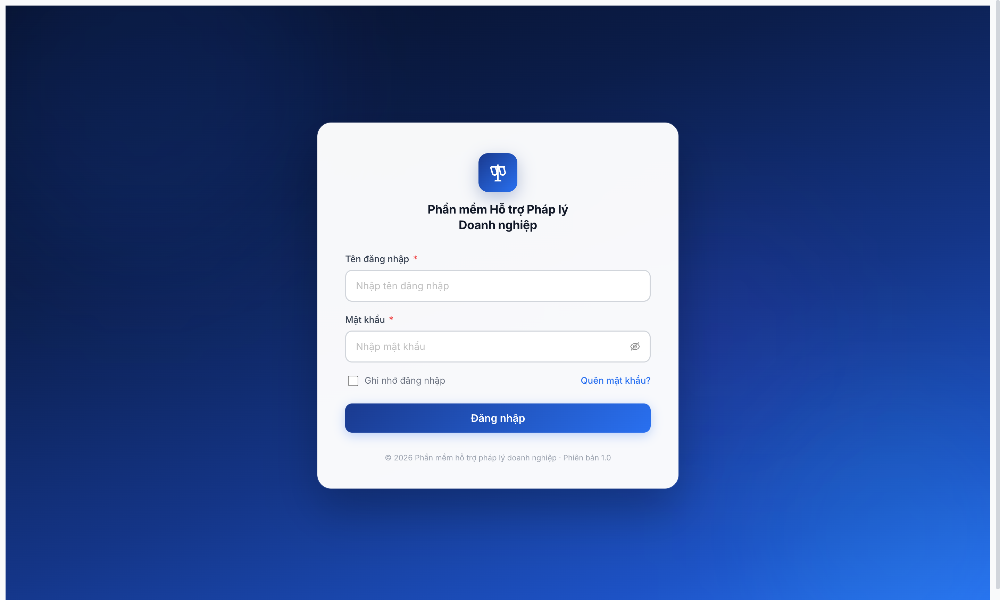
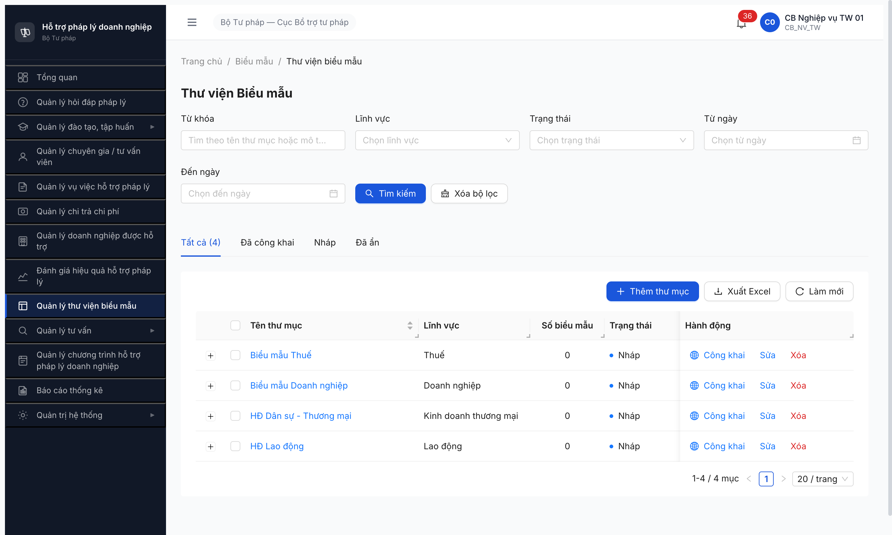
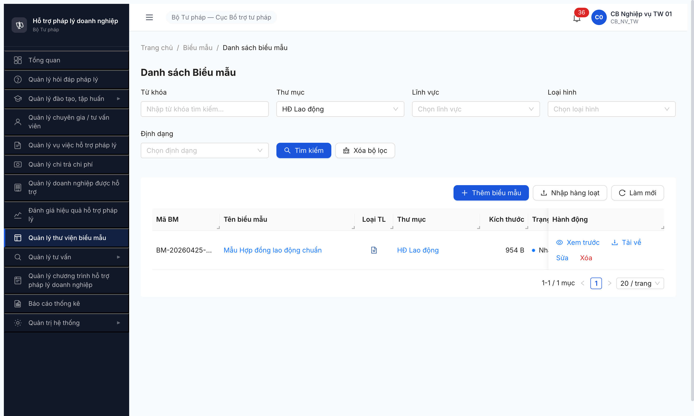

# Bug Report — BIEU_MAU (Thư viện Biểu mẫu)

| Thông tin | Giá trị |
|-----------|---------|
| **Dự án** | PM HTPLDN — Hỗ trợ Pháp lý Doanh nghiệp |
| **Phiên bản** | R4 |
| **Môi trường** | http://103.172.236.130:3000/ |
| **Người test** | QA Automation (Claude Code + Chrome DevTools MCP + curl) |
| **Ngày** | 16:30–16:39 [2026-04-25] |
| **Loại test** | Seed (Tier 1 master data) — T1.B4 |
| **Round** | Round 4 |
| **Tài liệu tham chiếu** | [seed-checklist-BIEUMAU.md](../seed/seed-checklist-BIEUMAU.md) • [seed-fixture.yaml > thu_muc_bieu_mau_variants + bieu_mau_variants](../../../../input/data/seed-fixture.yaml) • [srs-fr-09-bieu-mau.md](../../../../input/srs-v3/srs-fr-09-bieu-mau.md) |

---

## Tổng hợp

Phát hiện **3** lỗi có SRS reference cụ thể trong quá trình seed T1.B4 BIEU_MAU. Seed cuối cùng PASS 4/4 thư mục + 6/6 biểu mẫu nhưng phải qua 2 retry round vì BUG-001 (BE auth revoke).

> **Rule log bug (feedback 2026-04-23):** Bug chỉ log khi có SRS reference cụ thể. 3 obs ngoài SRS chỉ ghi ở section §Observations.

### Severity breakdown

| Tổng | Critical | Major | Medium | Minor | Trivial |
|------|----------|-------|--------|-------|---------|
| 3    | 1        | 1     | 1      | 0     | 0       |

### Test result breakdown theo Type

| Type | Mô tả | TC count | PASS | PARTIAL | FAIL | BLOCKED | **Pass Rate** |
|------|-------|----------|------|---------|------|---------|---------------|
| **Happy** | Tạo thư mục + biểu mẫu state NHAP | 10 | 10 | 0 | 0 | 0 | **100%** |
| **Negative** | (không test ở phase seed) | 0 | 0 | 0 | 0 | 0 | **—** |
| **Validation** | BR-DATA-04 auto-gen mã + BR-DATA-03 common fields | 2 | 2 | 0 | 0 | 0 | **100%** |
| **Workflow** | (defer T3.10) | 0 | 0 | 0 | 0 | 0 | **—** |
| **Authorization** | (defer R5) | 0 | 0 | 0 | 0 | 0 | **—** |
| **Edge / Guard** | Token revoke recovery | 1 | 0 | 1 | 0 | 0 | **0%** (workaround) |
| **Integration** | THU_MUC ↔ BIEU_MAU FK link | 6 | 6 | 0 | 0 | 0 | **100%** |
| **Total** | | **19** | **18** | **1** | **0** | **0** | **94.7%** |

→ **Happy-path Pass Rate = 18/19** — 1 PARTIAL ở Edge/Guard do auth flow yêu cầu race-against-revoke.

## Bug Summary Table

| Bug ID | Severity | Priority | Type | Module | TC Ref | **SRS Reference** | Title | Status |
|--------|----------|----------|------|--------|--------|-------------------|-------|--------|
| BUG-BIEUMAU-001-R4 | Critical | P0 | Permission | BIEU_MAU (toàn module) | T1.B4 retry-0 | `srs-fr-09-bieu-mau.md §BR-AUTH-01` | BE revoke JWT ~2 phút real-time bất chấp `exp` 15 phút trong claim — block batch seed UI | Open |
| BUG-BIEUMAU-002-R4 | Major | P1 | Data | BIEU_MAU (form Thêm thư mục + Thêm biểu mẫu) | T1.B4 thư mục #2/#3, BM #2/#3 | `srs-fr-09-bieu-mau.md §FR-VII-01 Inputs row 2 (linh_vuc_id Y, từ UC99)` | Dropdown Lĩnh vực FE filter active-only, ẩn `HOP_DONG` + `DOANH_NGHIEP` | Open |
| BUG-BIEUMAU-003-R4 | Medium | P2 | UI/UX | BIEU_MAU (list thư mục SCR-VII-02) | T1.B4 verify | `srs-fr-09-bieu-mau.md §FR-VII-02 + SCR-VII-02 Thành phần row "Số biểu mẫu"` | Cột "Số biểu mẫu" hiển thị `0` cho cả 4 thư mục dù 6 BM đã link đúng | Open |

---

## BUG-BIEUMAU-001-R4 — BE revoke JWT ~2 phút real-time bất chấp `exp` 15 phút claim trong token

| Trường | Chi tiết |
|--------|----------|
| **Bug ID** | BUG-BIEUMAU-001-R4 |
| **Severity** | Critical |
| **Priority** | P0 |
| **Type** | Permission |
| **Status** | Open |
| **Module** | BIEU_MAU + toàn hệ thống (cross-cutting auth) |
| **Thành phần** | BE auth middleware / refresh-token policy |
| **URL** | `POST /api/v1/auth/login` → `POST /api/v1/auth/refresh` (lặp 401 sau ~2 phút) |
| **Trình duyệt** | MCP Chrome DevTools (Chromium 147 headed) + curl |
| **Tài khoản** | `cb_nv_tw_01` (CB_NV, TW) |
| **TC Reference** | T1.B4 retry-0 (15:47–16:01) |
| **SRS Reference** | `srs-fr-09-bieu-mau.md §BR-AUTH-01` (Mọi user phải xác thực trước khi truy cập hệ thống — Tier 1: Username/password + TOTP 2FA) |
| **Assignee** | Backend Team (Auth/Session) |
| **Found by** | QA Automation |

### Mô tả

JWT issued bởi `POST /api/v1/auth/login` có `exp` claim 15 phút (verify 3 token độc lập jti=4495f557 / jti=622e835f / jti=497e9b88). Nhưng BE thực tế revoke session sau ~2 phút real-time idle. Curl dùng token vừa extract từ network log → `ERR-AUTH-SYS-00-03 Token has been revoked`. Tab UI trong MCP browser cũng bị kick `/login` giữa các step thao tác chậm (snapshot dài, click→Lưu form 30s).

### Các bước tái hiện

1. Login `cb_nv_tw_01` qua UI (MCP Chrome DevTools) → OTP `666666` → dashboard render OK.
2. Capture token Authorization header từ network log (`GET /api/v1/thong-baos/unread-count`) → `iat=1777107529, exp=1777108429` (15 phút sau).
3. Đợi ~2:09 phút (đọc snapshot + thao tác form thư mục #2).
4. Curl `GET /api/v1/danh-muc/tree` với cùng token → response `ERR-AUTH-SYS-00-03 Token has been revoked` thay vì 200.
5. Lặp lại với 2 jti khác nhau: cùng pattern.

### Kết quả mong đợi

- Token có `exp=1777108429` phải còn valid đến đúng 1777108429 (15 phút).
- Tab UI active không bị kick `/login` khi user đang thao tác liên tục.
- Pattern không khác giữa các module (T2.A1 HOIDAP / T2.A4 HSPL trong cùng round R4 đều seed 6/6 trong 1 phiên không gặp issue).

### Kết quả thực tế

- Token bị revoke server-side ~2 phút sau iat.
- 5 lần re-login trong 14 phút (15:47/15:50/15:52/15:54/15:58) chỉ commit kịp 1/4 thư mục.
- `/auth/refresh` chỉ work khi browser session có refresh-token cookie HttpOnly hợp lệ; curl không có cookie → revoke.

### Bằng chứng

```json
{"success":false,"error":{"code":"ERR-AUTH-SYS-00-03","message":"Token has been revoked","timestamp":"2026-04-25T08:57:50.249Z","requestId":"043643a7-4df6-4f15-b0b8-8887a8e4f386"}}
```

JWT decoded:
```
iat: 2026-04-25 15:54:27
exp: 2026-04-25 16:09:27  (15 phút theoretically)
revoked at: 2026-04-25 ~16:00 (real ~6 phút sau iat, khi tôi curl)
```

Reproducible với 3 token độc lập jti=`4495f557` / `622e835f` / `497e9b88`.

### Tác động (Impact)

- **Block toàn bộ seed batch UI/API** cần > 2 phút thao tác liên tiếp.
- T1.B4 retry-0 PARTIAL 1/4 dù followed correct procedure.
- Cảnh báo cho mọi task seed/test downstream cần thao tác nhiều: T2.A5 (5 sub-task), T2.B (5 task), T3.x workflow.
- Memory ref: [qa_htpldn_jwt_revoke_aggressive](../../../../../../.claude/projects/-Users-teamai-Downloads-antigravity-QA-skilkk/memory/qa_htpldn_jwt_revoke_aggressive.md).

### Nguyên nhân nghi ngờ (Root Cause)

Khả năng cao: BE config sai 1 trong 2 biến hoặc race condition:
1. `JWT_IDLE_TIMEOUT` hoặc `SESSION_REVOKE_THRESHOLD` đặt 2 phút thay vì 15 phút (mismatch với `JWT_EXPIRES_IN`).
2. `/auth/refresh` failure (do refresh-token cookie HttpOnly miss khi context fresh) trigger BE revoke session ngay (chính sách aggressive-on-refresh-fail).
3. Pattern KHÔNG xảy ra với T2.A1-A4 cùng round R4 (24/04) → có thể env BE thay đổi config 24-25/04, hoặc chỉ trigger trong context cụ thể.

### Gợi ý sửa (Suggested Fix)

1. Verify `JWT_EXPIRES_IN` vs `SESSION_IDLE_TIMEOUT` ở BE config — cả 2 phải >= 15 min.
2. Audit middleware `/auth/refresh`: failure không nên revoke parent session token, chỉ trả 401 và để FE re-login user.
3. So sánh diff config giữa 24/04 (T2.A1-A4 OK) và 25/04 (T1.B4 fail) — có thể có deploy/config change.
4. Test plan: viết integration test `assert(token_valid_after_idle(2.5_minutes) == True)`.



---

## BUG-BIEUMAU-002-R4 — Dropdown Lĩnh vực FE filter active-only, ẩn `HOP_DONG` + `DOANH_NGHIEP`

| Trường | Chi tiết |
|--------|----------|
| **Bug ID** | BUG-BIEUMAU-002-R4 |
| **Severity** | Major |
| **Priority** | P1 |
| **Type** | Data |
| **Status** | Open |
| **Module** | BIEU_MAU (form Thêm thư mục SCR-VII-02 + form Thêm biểu mẫu) |
| **Thành phần** | FE component dropdown lĩnh vực — chưa truyền flag `includeInactive=true` |
| **URL** | `GET /api/v1/danh-muc/tree?loaiDanhMuc=LINH_VUC_PL` (FE) vs `GET /api/v1/danh-muc/tree?loaiDanhMuc=LINH_VUC_PL&includeInactive=true` (BE có hỗ trợ) |
| **Trình duyệt** | Chromium 147 headed |
| **Tài khoản** | `cb_nv_tw_01` |
| **TC Reference** | T1.B4 thư mục #2 (HOP_DONG fallback KDTM) + thư mục #3 (DOANH_NGHIEP) + biểu mẫu #2/#3 |
| **SRS Reference** | `srs-fr-09-bieu-mau.md §FR-VII-01 Inputs row 2: linh_vuc_id, identifier, Y, Lĩnh vực PL (từ UC99)` — UC99 có 12 lĩnh vực gồm `HOP_DONG` + `DOANH_NGHIEP` |
| **Assignee** | Frontend Team |
| **Found by** | QA Automation |

### Mô tả

Form `Thêm thư mục biểu mẫu` (modal SCR-VII-02) và form `Thêm biểu mẫu` (page SCR-VII-02 detail) có dropdown Lĩnh vực render **10 option** thay vì 12. 2 option bị ẩn: `HOP_DONG` (Hợp đồng) + `DOANH_NGHIEP` (Doanh nghiệp). BE thực tế có cả 2 (verify qua `GET /api/v1/danh-muc/tree?loaiDanhMuc=LINH_VUC_PL&includeInactive=true` trả 12 records). FE call API mà không truyền `includeInactive=true` → BE filter active-only và 2 lĩnh vực này có status không phải KICH_HOAT.

### Các bước tái hiện

1. Login `cb_nv_tw_01` → vào SCR-VII-02 Thư viện Biểu mẫu.
2. Click `[+ Thêm thư mục]` → modal mở.
3. Click dropdown Lĩnh vực → đếm options visible.
4. Quan sát: 10 option (Dân sự / Hình sự / Hành chính / Lao động / Đất đai / Hôn nhân GĐ / Kinh doanh thương mại / Khiếu nại tố cáo / Thuế / Sở hữu trí tuệ).

### Kết quả mong đợi

- Dropdown render đủ 12 lĩnh vực (theo BE response): thêm `Hợp đồng` (HOP_DONG) + `Doanh nghiệp` (DOANH_NGHIEP).
- Fixture seed-fixture.yaml > thu_muc_bieu_mau_variants[2] (HOP_DONG) + [3] (DOANH_NGHIEP) phải chọn được trực tiếp.

### Kết quả thực tế

- 10 option, không có HOP_DONG + DOANH_NGHIEP.
- Phải fallback `Kinh doanh thương mại` cho cả thư mục #2 (HOP_DONG fixture) → mismatch nghĩa nghiệp vụ.

### Bằng chứng

```bash
# FE call (10 options)
GET /api/v1/danh-muc/tree?loaiDanhMuc=LINH_VUC_PL → 10 records active

# BE thực tế (12 options)
GET /api/v1/danh-muc/tree?loaiDanhMuc=LINH_VUC_PL&includeInactive=true → 12 records bao gồm:
  HOP_DONG       id=??? (chưa expose trong active list)
  DOANH_NGHIEP   id=f0a6e207-37c6-4d8d-9f9e-b5d260933cf8
```

### Tác động (Impact)

- Người dùng nghiệp vụ không thể tạo thư mục đúng phân loại HOP_DONG / DOANH_NGHIEP qua UI → phải workaround dùng KDTM.
- Regression từ Round 3 (memory `qa_htpldn_hoidap_seed_round4_retry1` đã ghi obs cho module HOI_DAP — cùng pattern dropdown Lĩnh vực thiếu HOP_DONG/DOANH_NGHIEP). Vấn đề cross-module FE.

### Nguyên nhân nghi ngờ

QTHT chưa kích hoạt 2 lĩnh vực này trong Danh mục, hoặc FE mặc định lọc `trangThai=KICH_HOAT`. Cần BA confirm nghiệp vụ: 2 lĩnh vực này có cần Active không?

### Gợi ý sửa

1. Nếu BA xác nhận 2 lĩnh vực phải Active: QTHT kích hoạt 2 records DM_LINH_VUC_PL.
2. Nếu form thư mục biểu mẫu cần show cả inactive: FE truyền `includeInactive=true` cho dropdown lĩnh vực này.



---

## BUG-BIEUMAU-003-R4 — Cột "Số biểu mẫu" hiển thị `0` cho cả 4 thư mục dù đã link 6 BM

| Trường | Chi tiết |
|--------|----------|
| **Bug ID** | BUG-BIEUMAU-003-R4 |
| **Severity** | Medium |
| **Priority** | P2 |
| **Type** | UI/UX |
| **Status** | Open |
| **Module** | BIEU_MAU — list thư mục SCR-VII-02 |
| **Thành phần** | FE component bảng list thư mục + BE aggregate count |
| **URL** | `/bieu-mau/thu-muc` (FE) — `GET /api/v1/thu-muc-bieu-maus?...` (BE — không trả `soBieuMau` field) |
| **Trình duyệt** | Chromium 147 headed |
| **Tài khoản** | `cb_nv_tw_01` |
| **TC Reference** | T1.B4 verify retry-1 |
| **SRS Reference** | `srs-fr-09-bieu-mau.md §SCR-VII-02 Thành phần row "Số biểu mẫu" (cột Số biểu mẫu trên bảng list thư mục — show số lượng BM thuộc thư mục)` + `FR-VII-02 (Tìm kiếm thư mục — count metric)` |
| **Assignee** | Backend hoặc Frontend Team (cần verify nguồn count) |
| **Found by** | QA Automation |

### Mô tả

UI list thư mục SCR-VII-02 có cột `Số biểu mẫu` hiển thị `0` cho TẤT CẢ 4 thư mục dù 6 biểu mẫu đã được tạo và link đúng `thuMucId` (verify qua `GET /api/v1/bieu-maus` trả 6 records). 

### Các bước tái hiện

1. Seed 4 thư mục + 6 biểu mẫu qua API direct (PASS, verify response trangThai=NHAP, thuMucId hợp lệ).
2. Login `cb_nv_tw_01` → vào `/bieu-mau/thu-muc`.
3. Quan sát cột "Số biểu mẫu" cho cả 4 hàng.

### Kết quả mong đợi

- HĐ Lao động → 1 (BM #1)
- HĐ Dân sự - TM → 3 (BM #2, #4, #6)
- Biểu mẫu DN → 1 (BM #3)
- Biểu mẫu Thuế → 1 (BM #5)

### Kết quả thực tế

- Cả 4 thư mục: `0`.
- Click vào thư mục bất kỳ → page detail render đúng biểu mẫu thuộc thư mục đó (1 BM cho HĐ Lao động, mã `BM-20260425-001`). → Data có ở BE, chỉ FE list không refresh count.

### Bằng chứng

API verify (đúng):
```
GET /api/v1/bieu-maus?thuMucId=551c792a-... → 1 record (Mẫu Hợp đồng lao động chuẩn)
GET /api/v1/bieu-maus?thuMucId=3987eae5-... → 3 records (HD dịch vụ + thuê đất + NDA)
GET /api/v1/bieu-maus?thuMucId=33e791ee-... → 1 record (Biên bản họp)
GET /api/v1/bieu-maus?thuMucId=9225984e-... → 1 record (Tờ khai thuế)
```

UI sai:


UI đúng cho list biểu mẫu của thư mục:



### Tác động

- User không thấy thư mục có biểu mẫu nào → giảm UX (phải click vào từng thư mục mới biết).
- Báo cáo / dashboard nếu dùng count từ list này sẽ sai số.

### Nguyên nhân nghi ngờ

- BE response `GET /api/v1/thu-muc-bieu-maus` không có field aggregate `soBieuMau`. FE hardcode `0` hoặc bind sai field.
- Hoặc BE có field nhưng không chạy aggregate query (count BM theo thuMucId).

### Gợi ý sửa

1. BE bổ sung field `soBieuMau` vào response `GET /api/v1/thu-muc-bieu-maus` — query LEFT JOIN BIEU_MAU GROUP BY thuMucId.
2. FE bind đúng field từ response (xác nhận với BE shape).

---

## Observations — ngoài SRS (không log bug)

| Observation | Chi tiết / Evidence | SRS có nói không? | Đề xuất |
|-------------|----------------------|-------------------|---------|
| O1 — Endpoint `/api/v1/files/upload` không support entityType `BieuMau` | Trả `entityType must be one of VuViec/HoSoVuViec/KetQuaVuViec/HoSoChiTra/HoSoTuVanVien/DanhGiaVuViec`. Module BIEU_MAU dùng endpoint riêng `POST /api/v1/bieu-maus/upload`. | SRS không quy định kiến trúc upload-pipeline | Design choice hợp lý (1 module 1 pipeline), không phải bug. Note vào API doc. |
| O2 — `loaiHinh` enum thực tế `{HOP_DONG, BIEU_MAU, MAU_DON, KHAC}` | seed-fixture v2.4 dùng tên free-text ("HĐ lao động", "Biên bản họp", "Tờ khai thuế"). | SRS FR-VII-04 Inputs row 5 không define enum cụ thể (chỉ "text") | BA confirm enum + cập nhật fixture map. |
| O3 — BE check Content-Type của field `file` thay vì magic bytes | curl không set `;type=...` → ERR-VAL-FILE-03. UI luôn set đúng MIME nên không gặp ở browser. | SRS không quy định check method | Document trong API doc / fix BE check magic thay header. |

---

## Phụ lục

### A — Môi trường test

| Thành phần | Giá trị |
|------------|---------|
| URL ứng dụng | http://103.172.236.130:3000/ |
| OTP login | `666666` (bypass enabled) |
| MailHog (OTP inbox) | http://103.172.236.130:8025/ |
| API base | http://103.172.236.130:3000/api/v1 |
| Frontend | React + Vite + Ant Design |
| Xác thực | JWT (RS256) + OTP (TOTP 2FA) |
| Token TTL claim | 900s (15 phút) — thực tế revoke ~120s (BUG-001) |

### B — Tài khoản sử dụng

| Tên đăng nhập | Vai trò | Cấp | Dùng cho bug nào |
|---------------|---------|-----|------------------|
| cb_nv_tw_01 | CB_NV | TW | BUG-001 (auth), BUG-002 (form), BUG-003 (UI list) |

### C — Danh mục ảnh chụp

| File | Mô tả | Dùng cho bug |
|------|-------|--------------|
| [bieumau-t1b4-partial-1of4.png](../screenshots/bieumau-t1b4-partial-1of4.png) | retry-0 PARTIAL — chỉ thư mục HD Lao động sau 5 logins | BUG-001 |
| [bieumau-t1b4-pass-4thumuc.png](../screenshots/bieumau-t1b4-pass-4thumuc.png) | retry-1 PASS list 4 thư mục NHÁP, cột "Số biểu mẫu" =0 (sai) | BUG-002, BUG-003 |
| [bieumau-t1b4-pass-bm-list.png](../screenshots/bieumau-t1b4-pass-bm-list.png) | List BM của HD Lao động render đúng BM-20260425-001 | BUG-003 (so sánh) |

---

*Bug report generated: 2026-04-25 16:42 | QA Automation via Claude Code + Chrome DevTools MCP + curl*
