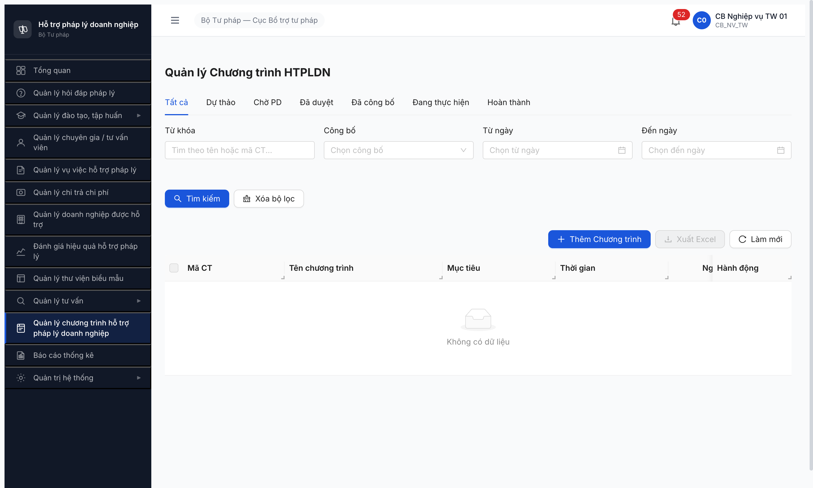
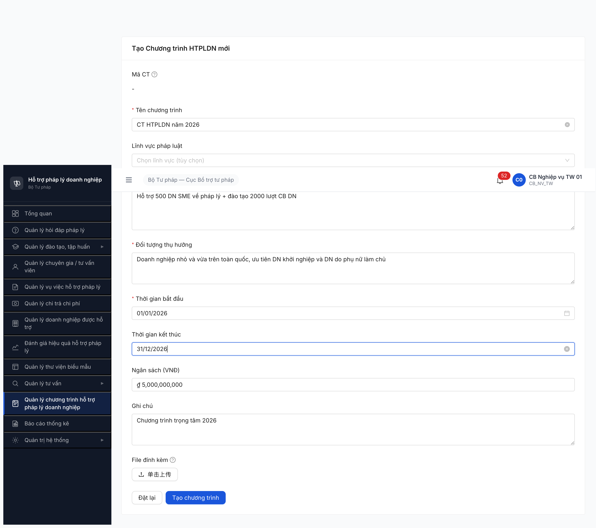
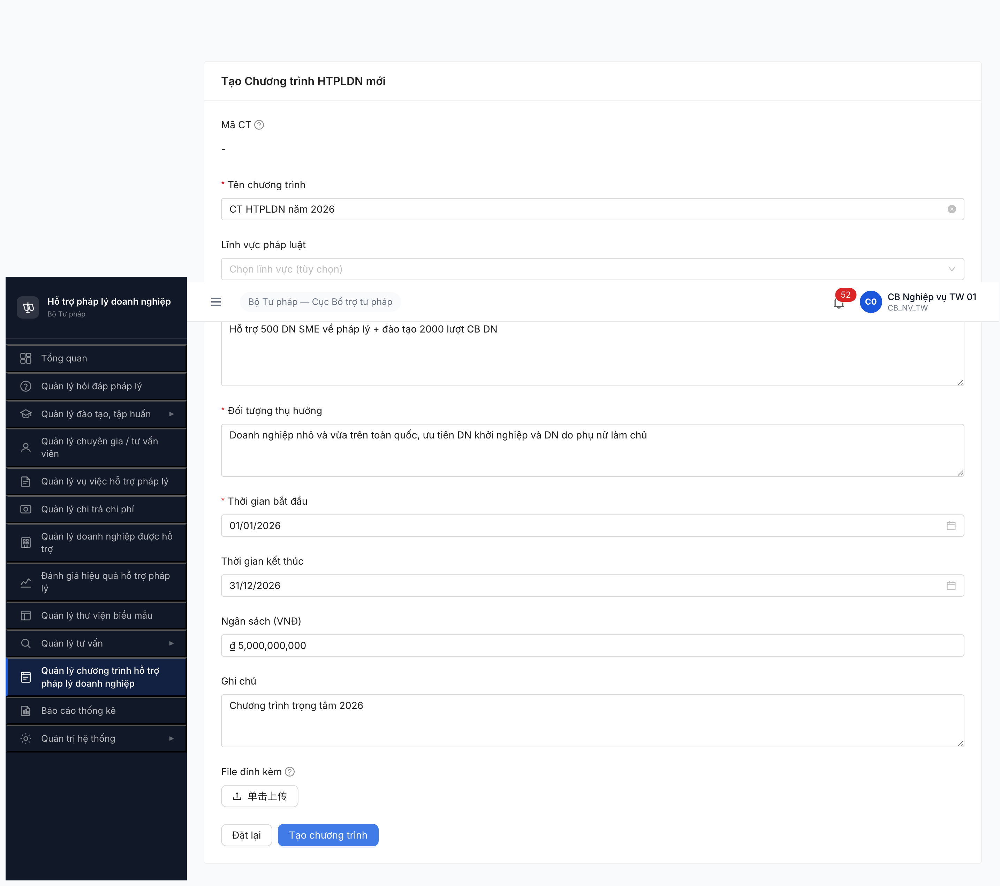
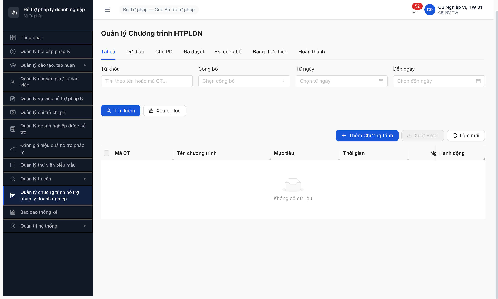

# Bug Report — Chương trình HTPLDN

| Thông tin | Giá trị |
|-----------|---------|
| **Dự án** | PM HTPLDN — Phần mềm Hỗ trợ Pháp lý Doanh nghiệp |
| **Môi trường** | http://103.172.236.130:3000 |
| **Người test** | QA Automation via Claude Code |
| **Ngày** | 2026-04-25 |
| **Loại test** | Seed (P2 Block C — T2.C1) |
| **Round** | Round 4 |
| **Tài liệu tham chiếu** | [todo.md §P2 T2.C1](../../../../tasks/todo.md) · [seed-checklist-CTHTPLDN.md](../seed/seed-checklist-CTHTPLDN.md) · [flow-module §4 BƯỚC 2](../../../../input/flow-module.md) |

---

## Tổng hợp

Phát hiện **1** lỗi có SRS reference cụ thể khi seed Chương trình HTPLDN giai đoạn 1 (Kế hoạch).

### Severity breakdown

| Tổng | Critical | Major | Medium | Minor | Trivial |
|------|----------|-------|--------|-------|---------|
| 1    | 1        | 0     | 0      | 0     | 0       |

## Bug Summary Table

| Bug ID | Severity | Priority | Type | TC Ref | **SRS Reference** | Title | Status |
|--------|----------|----------|------|--------|-------------------|-------|--------|
| BUG-CTHTPLDN-001 | Critical | P0 | Happy | T2.C1 | `FR-XI-01 UC164 §Acceptance Criteria #2` + `§Inputs row 1-9` + `SCR-XI-01` | Bấm nút **Tạo chương trình** không lưu được bản ghi nào, danh sách vẫn rỗng | Open |

---

## BUG-CTHTPLDN-001 — Bấm nút **Tạo chương trình** không lưu được bản ghi, danh sách vẫn rỗng

### Mô tả

CB Nghiệp vụ TW vào màn **SCR-XI-01 — Quản lý Chương trình HTPL**, bấm **+ Thêm Chương trình**, điền đủ 7 trường rồi bấm **Tạo chương trình**. Hệ thống không lưu bản ghi, không hiện thông báo, danh sách vẫn rỗng. Thử bấm 4 lần đều như nhau.

### Các bước tái hiện

1. Đăng nhập `cb_nv_tw_01` / `Secret@123`, OTP `666666`.
2. Mở menu trái **Quản lý chương trình hỗ trợ pháp lý doanh nghiệp** → vào danh sách `/ct-htpldn/danh-sach` (rỗng).
3. Bấm **+ Thêm Chương trình** → mở form `/ct-htpldn/tao-moi`.
4. Điền:
   - Tên chương trình: `CT HTPLDN năm 2026`
   - Mục tiêu: `Hỗ trợ 500 DN SME về pháp lý + đào tạo 2000 lượt CB DN`
   - Đối tượng thụ hưởng: `Doanh nghiệp nhỏ và vừa trên toàn quốc, ưu tiên DN khởi nghiệp và DN do phụ nữ làm chủ`
   - Thời gian bắt đầu: `01/01/2026` (chọn từ lịch)
   - Thời gian kết thúc: `31/12/2026` (chọn từ lịch)
   - Ngân sách: `5.000.000.000`
   - Ghi chú: `Chương trình trọng tâm 2026`
5. Bấm nút **Tạo chương trình**.
6. Quan sát: form không nhảy trang, không có thông báo lỗi/thành công, không có toast.
7. Quay lại danh sách `/ct-htpldn/danh-sach` → vẫn hiện **"Không có dữ liệu"**.

### Kết quả mong đợi

Theo **SRS FR-XI-01 UC164** (màn SCR-XI-01 — Quản lý Chương trình HTPL):
- Mục **Acceptance Criteria #2**: "CB NV thêm mới → nhập đủ trường → validate + lưu thành công".
- Mục **Processing bước 3**: "Thêm mới: tự sinh mã (`CT-{YYYYMMDD}-{SEQ}`), gán trạng thái `DU_THAO`".
- Mục **Outputs row 1**: "Chương trình mới lưu vào CSDL".
- Sau khi bấm **Tạo chương trình**: hệ thống lưu bản ghi mới, hiện thông báo thành công, quay về danh sách thấy 1 dòng trạng thái **Dự thảo**.

### Kết quả thực tế

- Hệ thống không gọi API lưu (`POST /api/v1/chuong-trinh-htpls`) trong cả 4 lần bấm.
- Form đứng yên ở trang `/ct-htpldn/tao-moi`, không có thông báo gì cho người dùng.
- Console log lỗi `RangeError: Invalid time value` mỗi lần bấm.
- Danh sách `/ct-htpldn/danh-sach` vẫn rỗng — 0 bản ghi được tạo.

### Bằng chứng

**1. Ảnh chụp:**









**2. Console log:**

```
[log] RangeError: Invalid time value (1 args)
[log] RangeError: Invalid time value (1 args)
[log] RangeError: Invalid time value (1 args)
[log] RangeError: Invalid time value (1 args)
[log] RangeError: Invalid time value (1 args)
[log] RangeError: Invalid time value (1 args)
```

(6 entry sau 4 lần bấm Tạo — handler báo lỗi tại đúng thời điểm bấm.)

**3. Network — không có API lưu nào được gọi:**

Sau 4 lần bấm Tạo, danh sách request chỉ có:
- `GET /api/v1/dashboard?...` — load đầu phiên
- `GET /api/v1/chuong-trinh-htpls?page=1&pageSize=20` — load danh sách
- `GET /api/v1/danh-muc/tree?loaiDanhMuc=LINH_VUC_PL` — load dropdown Lĩnh vực
- `GET /api/v1/thong-baos/unread-count` — polling thông báo

**Không có** `POST /api/v1/chuong-trinh-htpls` nào.

---

## Observations — ngoài SRS (không log bug)

| Observation | Chi tiết | SRS có nói không? | Đề xuất |
|-------------|----------|-------------------|---------|
| Form thêm trường **Lĩnh vực pháp luật** (combobox optional) | Không có trong **SRS FR-XI-01 §Inputs row 1-9** | Không | BA confirm: bổ sung vào SRS hoặc bỏ khỏi form |
| Form thêm trường **File đính kèm** (upload optional) | Không có trong **SRS FR-XI-01 §Inputs row 1-9** | Không | BA confirm: bổ sung vào SRS hoặc bỏ khỏi form |
| Form không có trường **Đơn vị chủ trì** mặc dù SRS yêu cầu (`Inputs row 8: don_vi_id` Y auto) | Theo SRS phải tự gán đơn vị của user (BTP-TW) — không có UI hiển thị xác nhận | Có — `Inputs row 8` | Dev verify đang auto-bind đúng; có thể là nguyên nhân lỗi `RangeError` |
| Nhãn nút theo SRS là **[Lưu]** nhưng UI thực tế là **[Tạo chương trình]** | flow-module §4 dùng "[+ Tạo Kế hoạch]" cho nút trên danh sách | Không định nghĩa nhãn nút cụ thể | Cosmetic, không ảnh hưởng nghiệp vụ |

---

## Phụ lục — Môi trường test

| Thành phần | Giá trị |
|------------|---------|
| URL ứng dụng | http://103.172.236.130:3000 |
| OTP login | `666666` (bypass tạm cho test) |
| MailHog (OTP inbox) | http://103.172.236.130:8025 |
| API base | http://103.172.236.130:3000/api/v1 |
| Frontend | React + Vite + Ant Design |
| Xác thực | JWT (HttpOnly cookie) + OTP |
| Tool test | Chrome DevTools MCP |

---

*Bug report generated: 2026-04-25 | QA Automation via Claude Code*
