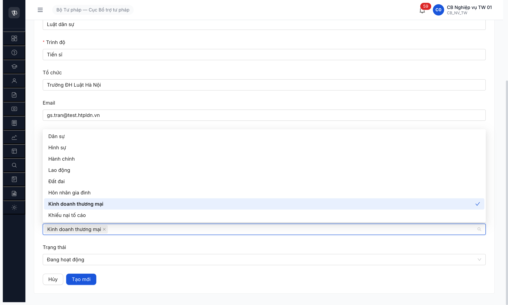
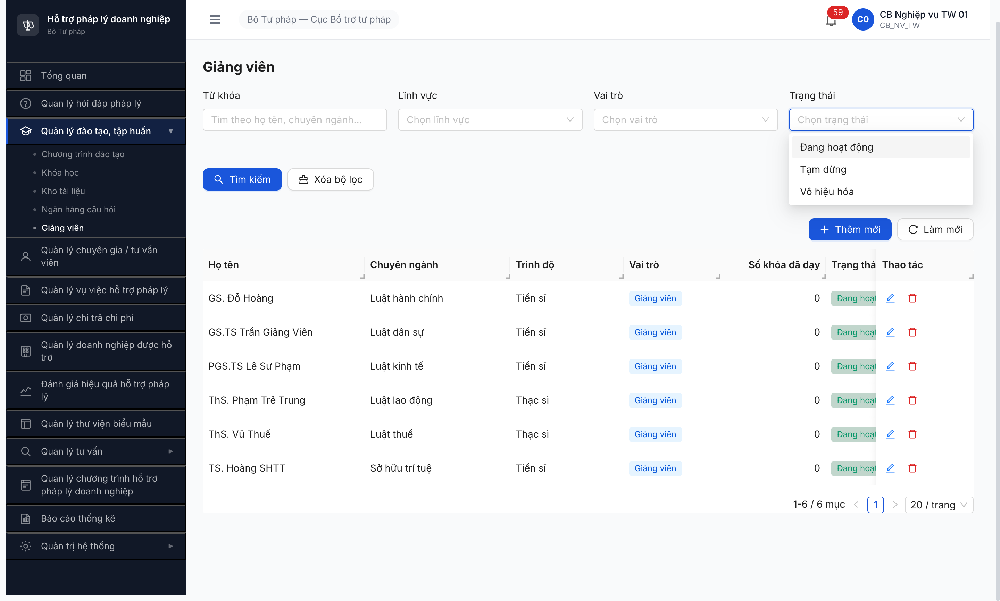
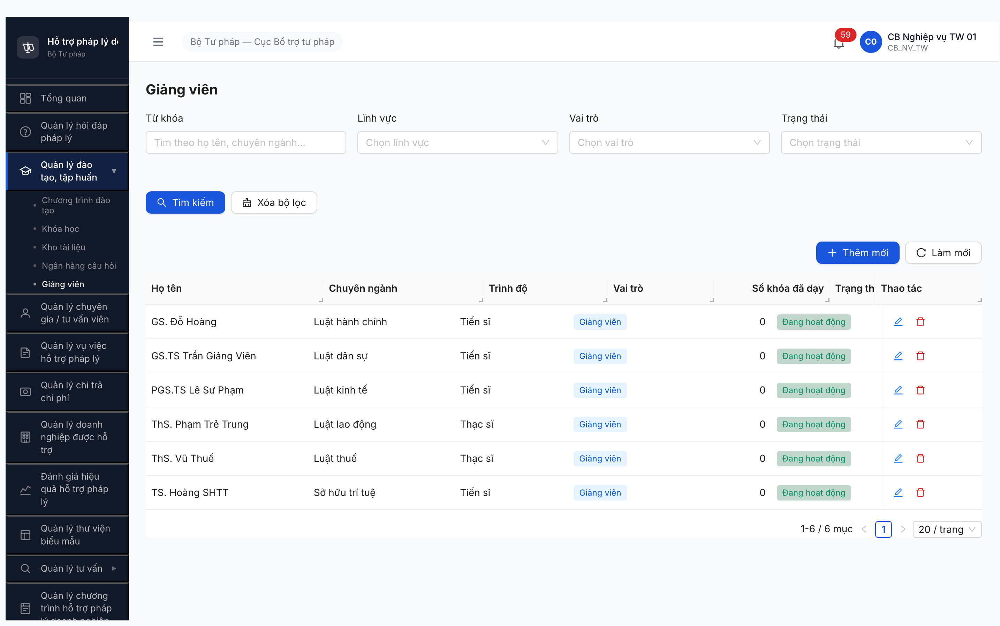

# Bug Report — Giảng viên (T2.A5e Seed)

| Thông tin | Giá trị |
|-----------|---------|
| **Dự án** | PM HTPLDN |
| **Môi trường** | http://103.172.236.130:3000/ |
| **Người test** | QA Automation |
| **Ngày** | 2026-04-25 |
| **Loại test** | Seed (Tier 2 Đào tạo) |
| **Round** | Round 4 |
| **Tài liệu tham chiếu** | [tasks/todo.md T2.A5e](../../../../tasks/todo.md) • [seed-checklist-GIANGVIEN.md](../seed/seed-checklist-GIANGVIEN.md) • [SRS FR-III-11](../../../../input/srs-v3/srs-fr-03-dao-tao.md) |

---

## Tổng hợp

Phát hiện **3** lỗi có SRS reference cụ thể trong quá trình seed Giảng viên (T2.A5e). 6/6 record vẫn tạo được nhờ workaround chấp nhận state UI default, không có blocker.

> **Rule log bug (feedback 2026-04-23):** Bug chỉ log khi có SRS reference cụ thể (`FR-X`, `BR-X`, `SCR-X row Y`, `§Error Handling EN`, `Inputs row N`). Các quan sát khác (regression dropdown lĩnh vực, radio default, …) ghi ở Observations trong [seed-checklist-GIANGVIEN.md](../seed/seed-checklist-GIANGVIEN.md).

### Severity breakdown

| Tổng | Critical | Major | Medium | Minor | Trivial |
|------|----------|-------|--------|-------|---------|
| 3    | 0        | 1     | 2      | 0     | 0       |

## Bug Summary Table

| Bug ID | Severity | Priority | Type | TC Ref | **SRS Reference** | Title | Status |
|--------|----------|----------|------|--------|-------------------|-------|--------|
| BUG-GV-001-R4 | Major | P1 | UI/UX | T2.A5e | `FR-III-11 §Inputs row 10` | Form Tạo giảng viên thiếu field `file_dinh_kem` | Open |
| BUG-GV-002-R4 | Medium | P2 | Data | T2.A5e | `FR-III-11 §Inputs row 9` | Enum `trang_thai` BE = `DANG_HOAT_DONG` ≠ SRS `DANG_GIANG_DAY/TAM_DUNG`, UI thêm enum thứ 3 | Open |
| BUG-GV-003-R4 | Medium | P2 | UI/UX | T2.A5e | `FR-III-11 §Outputs row 6` | List Giảng viên thiếu cột `Lĩnh vực` | Open |

---

## BUG-GV-001-R4 — Form Tạo giảng viên thiếu field `file_dinh_kem`

### Mô tả

Form `Thêm giảng viên mới` (`/dao-tao/giang-vien/tao-moi`) thiếu input upload file đính kèm (CV, bằng cấp, …). SRS FR-III-11 §Inputs row 10 quy định `file_dinh_kem (structured, N)` — không bắt buộc nhưng phải có UI cho user upload khi cần.

### Các bước tái hiện

1. Login `cb_nv_tw_01` → Đào tạo, tập huấn → Giảng viên.
2. Click **[+ Thêm mới]** → mở form `Thêm giảng viên mới`.
3. Quan sát toàn bộ field render trong main panel.
4. Kết quả: 10 field hiện diện (Họ tên, Loại, Chuyên ngành, Trình độ, Tổ chức, Email, Điện thoại, Mô tả năng lực, Lĩnh vực, Trạng thái) — KHÔNG có upload `file_dinh_kem`.

### Kết quả mong đợi

Form phải có 1 field upload (Antd `Upload` hoặc tương đương) cho `file_dinh_kem` theo SRS FR-III-11 §Inputs row 10.

### Kết quả thực tế

Field thiếu hoàn toàn. User không thể đính kèm hồ sơ giảng viên (CV, bằng cấp, quyết định …).

### Bằng chứng



---

## BUG-GV-002-R4 — Enum `trang_thai` BE/UI ≠ SRS

### Mô tả

SRS FR-III-11 §Inputs row 9 viết: `trang_thai (text, Y: DANG_GIANG_DAY / TAM_DUNG)` — 2 enum. Implementation thực tế:
- BE response field `trangThai: "DANG_HOAT_DONG"` (verified GET `/api/v1/giang-viens` reqid=150).
- UI filter dropdown render 3 option: `Đang hoạt động`, `Tạm dừng`, `Vô hiệu hóa`.

→ **Mismatch 2 chiều:** label `DANG_HOAT_DONG` ≠ `DANG_GIANG_DAY` (SRS) + thêm 1 enum mới `Vô hiệu hóa` không có trong SRS.

### Các bước tái hiện

1. Login `cb_nv_tw_01` → Giảng viên → seed 1 record bằng form (chấp nhận default Trạng thái).
2. Click filter Trạng thái → quan sát 3 option dropdown.
3. Mở DevTools Network → response GET `/api/v1/giang-viens` → `trangThai` field.

### Kết quả mong đợi

Theo SRS: BE persist `DANG_GIANG_DAY` (default khi create) hoặc `TAM_DUNG`, UI filter chỉ 2 option.

### Kết quả thực tế

- BE persist `DANG_HOAT_DONG`.
- UI filter 3 option (`Đang hoạt động` / `Tạm dừng` / `Vô hiệu hóa`).

### Bằng chứng



**API response (trích reqid=150):**
```json
{"maGiangVien":"GV-BTP-TW-0001","hoTen":"GS.TS Trần Giảng Viên","trangThai":"DANG_HOAT_DONG","soKhoaDaDay":0}
```

---

## BUG-GV-003-R4 — List Giảng viên thiếu cột `Lĩnh vực`

### Mô tả

SRS FR-III-11 §Outputs row 6 viết: `Outputs: id, ho_ten, chuyen_nganh, vai_tro, so_khoa_da_day, linh_vuc.` — 6 cột bắt buộc. Implementation thực tế list render 7 cột: `Họ tên / Chuyên ngành / Trình độ / Vai trò / Số khóa đã dạy / Trạng thái / Thao tác` — **thiếu `Lĩnh vực`** (thừa `Trình độ` + `Trạng thái`, hai cột thừa không phải bug — chỉ là enrichment).

### Các bước tái hiện

1. Login `cb_nv_tw_01` → Giảng viên → seed ≥1 record.
2. Quan sát danh sách (table header).

### Kết quả mong đợi

Cột `Lĩnh vực` hiển thị (badge / text) cho mỗi GV, dữ liệu lấy từ `linh_vuc_ids` đã chọn khi tạo.

### Kết quả thực tế

Không có cột `Lĩnh vực`. User phải mở chi tiết từng GV mới biết lĩnh vực — UX tốn click.

### Bằng chứng



---

## Phụ lục — Môi trường test

| Thành phần | Giá trị |
|------------|---------|
| URL ứng dụng | http://103.172.236.130:3000/ |
| OTP login | `666666` bypass |
| MailHog (OTP inbox) | http://103.172.236.130:8025 |
| API base | http://103.172.236.130:3000/api/v1 |
| Frontend | React + Vite + Ant Design |
| Xác thực | JWT (HttpOnly cookie) + OTP |
| Tool test | Chrome DevTools MCP |

---

*Bug report generated: 2026-04-25 22:32 | QA Automation via Claude Code*
