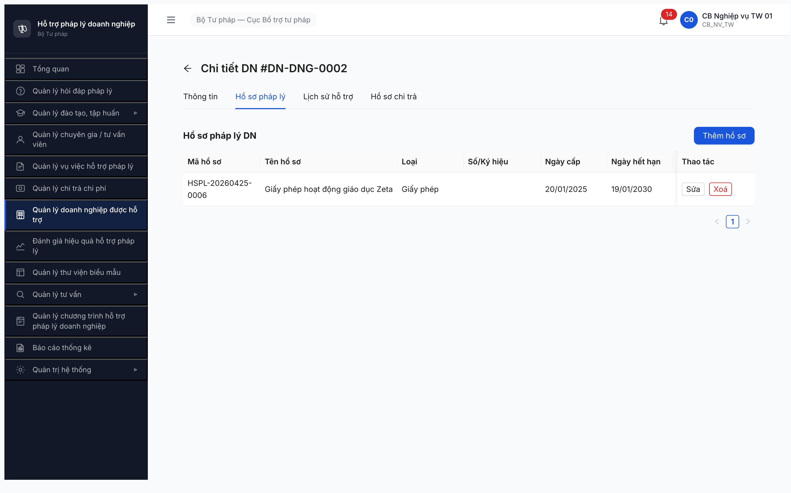

# Seed Checklist — HO_SO_PHAP_LY_DN Tier 2 (T2.A4)

**Phase:** P2 Block A Ngày 2 • **Plan ref:** [plan.md](../../../../tasks/plan.md) §P2 T2.A4 • **Date:** 2026-04-25 14:50-15:15 (PASS retry sau dev fix overnight)
**Account:** `cb_nv_tw_01` (CB Nghiệp vụ TW 01)
**Method:** MCP Chrome DevTools — `SCR-V.III-02` tab "Hồ sơ pháp lý" (entity map E07, UC150 FR-X.1-04)
**Entry state:** `HIEU_LUC` (default per SRS FR-X.1-04 Inputs #10)
**Input:** [seed-fixture.yaml](../../../../input/data/seed-fixture.yaml) lines 656-732 — `ho_so_phap_ly_dn_variants` v2.3.1 (6 variants)

---

## Verdict: ✅ **PASS 6/6** — Bug `BUG-HSPL-TAB-R4` closed-verified

**Lịch sử block + fix:**
- 2026-04-24 17:04: T2.A4 initial run BLOCKED 0/6, log bug Critical `BUG-HSPL-TAB-R4` (FE tab placeholder + BE endpoint 404, full-stack missing).
- 2026-04-25 07:37: re-verify BE — vẫn 404 (`ERR-SYS-00-04-01 "Cannot GET"`).
- 2026-04-25 14:47: user push back yêu cầu re-verify trên web → MCP login + click Tab "Hồ sơ pháp lý" → **dev đã fix overnight**: FE tab render đầy đủ heading + table 8 cột + button "Thêm hồ sơ" + modal form 8 fields.
- 2026-04-25 14:50-15:15: QA seed PASS 6/6 end-to-end.

**Sample IDs (mã auto-gen đúng BR-DATA-04 `HSPL-{YYYYMMDD}-{SEQ}`):**

| # | Mã hồ sơ | DN link | loai_ho_so | Số/Ký hiệu | Ngày cấp | Ngày hết hạn | Trạng thái |
|---|----------|---------|------------|-----------|----------|--------------|------------|
| 1 | HSPL-20260425-0001 | DN-HNI-0001 Alpha | Giấy chứng nhận | 0100100101-HN-01 | 15/03/2020 | (null) | Hiệu lực |
| 2 | HSPL-20260425-0002 | DN-HNI-0002 Beta | Quyết định | (null) | 20/06/2021 | (null) | Hiệu lực |
| 3 | HSPL-20260425-0003 | DN-HPG-0001 Gamma | Hợp đồng | (null) | 15/01/2024 | 14/01/2029 | Hiệu lực |
| 4 | HSPL-20260425-0004 | DN-HPG-0002 Delta | Quyết định | (null) | 10/01/2023 | (null) | Hiệu lực |
| 5 | HSPL-20260425-0005 | DN-DNG-0001 Epsilon | Giấy phép | (null) | 15/07/2024 | 14/07/2029 | Hiệu lực |
| 6 | HSPL-20260425-0006 | DN-DNG-0002 Zeta | Giấy phép | (null) | 20/01/2025 | 19/01/2030 | Hiệu lực |

**Cascade UNBLOCK:**
- T4.4 Functional DN Tab #2 (18 TC) — sẵn sàng
- T5.4 Cross-module DN/VV/HSPL — sẵn sàng
- Preset P1 flow-module Tab #2 verify KPI "Tab #2 hiện ≥1 hồ sơ PL" — sẵn sàng

---

## SRS compliance check (FR-X.1-04 UC150)

| SRS Inputs # | Field | SRS Required | Form FE | Verify |
|---|---|---|---|---|
| 1 | ma_ho_so | Y (auto) | Auto-gen `HSPL-{YYYYMMDD}-{SEQ}` | ✅ PASS — đúng format BR-DATA-04 |
| 2 | doanh_nghiep_id | Y (FK) | Auto-bind từ context tab DN detail | ✅ PASS — không cần user chọn |
| 3 | ten_ho_so | Y, ≤500 ký tự | Required field "Tên hồ sơ" | ✅ PASS |
| 4 | loai_ho_so | Y, enum 5 value | Combobox 5 enum đúng SRS (Giấy phép/Hợp đồng/Giấy chứng nhận/Quyết định/Khác) | ✅ PASS |
| 5 | linh_vuc_id | N (FK DM) | **THIẾU** | ⚠️ Obs O1 — SRS optional N nên không log bug |
| 6 | ngay_cap | N (date) | Datepicker "Ngày cấp" | ✅ PASS |
| 7 | ngay_het_han | N (date) | Datepicker "Ngày hết hạn" | ✅ PASS |
| 8 | co_quan_cap | N (text) | Field "Cơ quan cấp" | ✅ PASS |
| 9 | mo_ta | N (text long) | Multiline "Ghi chú" (label khác SRS `mo_ta` nhưng map đúng) | ✅ PASS |
| 10 | trang_thai | Y, default HIEU_LUC | Combobox "Trạng thái" default "Hiệu lực" | ✅ PASS |
| 11 | file_dinh_kem | N (PDF/image ≤20MB) | **THIẾU** upload control | ⚠️ Obs O2 — SRS optional N nên không log bug |

**SRS compliance:** 9/11 fields render đúng. 2 missing fields đều SRS optional N → không vi phạm spec, ghi observation cho dev sprint kế.

---

## Observations (ngoài SRS / quan sát thêm — không log bug)

| # | Observation | Chi tiết | SRS ref |
|---|-------------|----------|---------|
| O1 | Form FE thiếu field `linh_vuc_id` (FK DANH_MUC) | Form modal "Thêm hồ sơ pháp lý" không hiện dropdown Lĩnh vực. SRS đánh dấu N (không bắt buộc) nên không vi phạm spec. Nhưng search filter SRS có dùng `linh_vuc_id` → để dev cân nhắc add cho phép phân loại | FR-X.1-04 Inputs #5 |
| O2 | Form FE thiếu upload `file_dinh_kem` | Modal không có file upload control. SRS đánh dấu N (không bắt buộc) max 20MB. AC SRS: "Given CB NV xem chi tiết hồ sơ When chọn bản ghi Then hiển thị đầy đủ thông tin + file đính kèm" → sẽ test ở T4.4 functional, nếu detail view có hiện file thì stage 1 OK, nếu không hiện thì là bug functional | FR-X.1-04 Inputs #11 + AC #2 |

---

## Evidence

Fixture #6 Zeta — table render với 6 cột data + tag "Hiệu lực" + toast "Thêm hồ sơ thành công":

---

## T2.A4 Gate Decision

**Status:** ✅ **PASS 6/6 — Block A Ngày 2 đóng**

**Todo status:** `[x]` xong.

**Cascade impact (now UN-BLOCKED):**
- ✅ **P5 Cross-module DN/VV/HSPL** (`plan.md §P5 T5.4`) — đủ data để test
- ✅ **Preset P1 flow-module** (DN detail Tab #2 verify KPI "Tab #2 hiện 1 hồ sơ PL")
- ✅ **T4.4 Functional DN** Tab #2 18 TC — không còn skip case "Tab Hồ sơ PL liên kết"

---

## Lessons learned (QA process)

**Sai sót lần đầu (2026-04-24 17:04):** Initial seed run cho seed-checklist HSPL ghi "fixture v2.2 thiếu section ho_so_phap_ly_variants" — SAI, fixture v2.3.1 lines 656-732 đã có 6 variants đầy đủ. QA bỏ qua bước đọc fixture trước khi log bug → log obs sai.

**Sai sót lần hai (2026-04-25 07:37 → 14:47):** Re-verify BE 404 sáng → conclude vẫn block, recommend skip T2.A4. KHÔNG re-verify UI tab. User push back → re-verify mới phát hiện dev đã fix UI + BE giữa 07:37 và 14:50.

**Quy tắc cải tiến (apply Round 4+):**
1. Trước khi log bug HSPL/seed → BẮT BUỘC đọc fixture YAML + SRS UC tương ứng (không tin obs file QA tự ghi).
2. Re-verify BLOCKED bug → BẮT BUỘC verify cả UI lẫn BE (BE 404 sáng có thể fix chiều, đặc biệt overnight). Không stop sớm dựa trên 1 layer evidence.
3. NotebookLM query khi spec ambiguous — verified hôm nay HSPL có manual entry (UC150 Type B), không chỉ API inbound (UC151).

---

*Seed retry: 2026-04-25 14:50-15:15 (6/6 — PASS sau dev fix overnight) | QA AI via Claude Code + Chrome DevTools MCP | Phase P2 Block A Tier 2*
*Bug `BUG-HSPL-TAB-R4` closed-verified 2026-04-25 15:15. Cascade E07 UN-BLOCKED. Next: T2.A5 Đào tạo (CTĐT/Khóa học/Bài giảng/NHCH/Giảng viên).*
