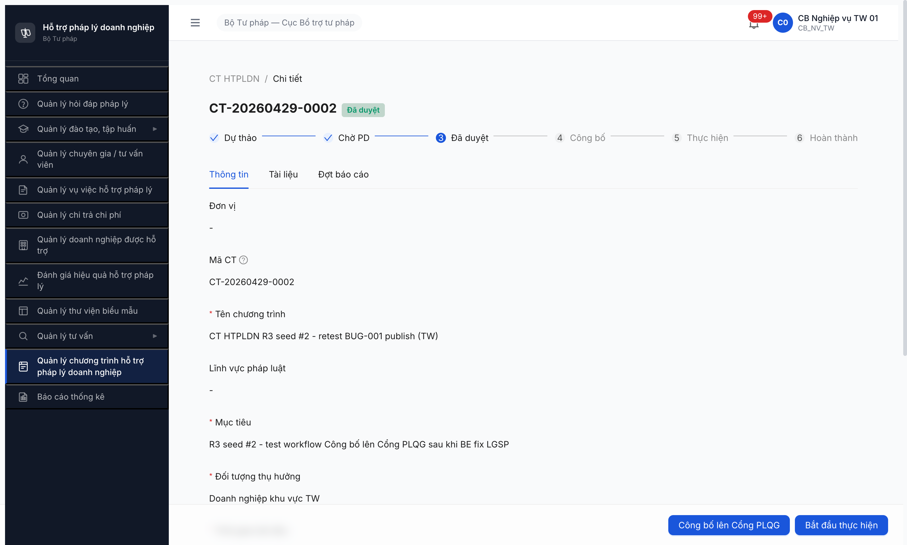
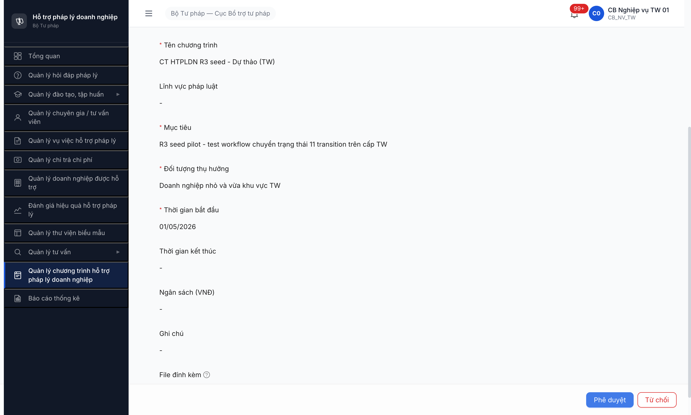
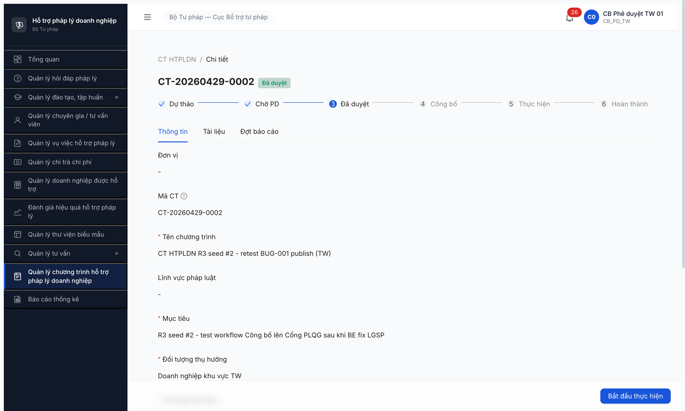

# Bug Report — Workflow CT HTPLDN GĐ1

> 🔄 **POST-RESET 2026-05-01:** Dev reset toàn DB. Bug đã closed pre-reset (R1-R10) cần re-verify R11/R12 sau khi seed lại theo [post-reset-seed-plan.md](../../../../tasks/post-reset-seed-plan.md). Bug Open hiện tại có thể không còn repro sau reset (data + state khác). Severity + SRS reference giữ nguyên làm hồ sơ.

---

| Thông tin | Giá trị |
|-----------|---------|
| Dự án | PM HTPLDN |
| Môi trường | http://103.172.236.130:3000/ |
| Người test | QA Automation via Chrome DevTools MCP |
| Ngày | 2026-04-28 (R1) · 2026-04-28 22:55 (R2) · 2026-04-29 08:30 (R3) · **2026-04-29 16:55 (R4)** |
| Loại test | Workflow |
| Round | R5 P3.3 pilot TW + R2 retest + R3 retest sau seed thêm 2 CT + R4 kiểm tra bug closed |
| Tài liệu tham chiếu | [02-thu-tu-module.md §⑤](../../../../input/quy-trinh-nghiep-vu/02-thu-tu-module.md#L328-L342) · [srs-fr-15-ct-htpldn.md](../../../../input/srs-v3/srs-fr-15-ct-htpldn.md) |

---

## Tổng hợp R4 (2026-04-29 16:55)

**1 FIXED** (FIND-004), **3 Open** còn lại (1 Critical + 2 Minor). Workflow chưa thể chạy lại do BUG-001 vẫn block.

### Severity

| Tổng | Critical | Major | Medium | Minor | Trivial | Closed |
|------|----------|-------|--------|-------|---------|--------|
| 4 | 1 | 0 | 0 | 2 | 0 | 1 |

## Bug Summary Table

| Bug ID | Severity | Priority | Type | TC Ref | SRS Reference | Title | Status R3 | **Status R4** |
|--------|----------|----------|------|--------|---------------|-------|----------|----------|
| **BUG-FLOW-CTHTPLDN-001** | **Critical** | **P0** | Workflow | P3.3 #5, #6, #7b | `srs-fr-15-ct-htpldn.md` FR-XI-05 §Error Handling row E2 (line 432) `ERR-XI-05-02` + SCR-XI-01 row 23 (line 902) "Error: Toast + rollback DA_DUYET" | LGSP/Cổng PLQG 502 — KHÔNG hiển thị toast "Không thể kết nối Cổng PLQG. Vui lòng thử lại" theo spec | ⚠️ VẪN CÒN (lần 3) | ⚠️ **VẪN CÒN — RECONFIRMED lần 4** — CT-002 publish → 502 |
| FIND-CTHTPLDN-002 | Minor | P3 | UI | P3.3 #3 | `srs-fr-15-ct-htpldn.md` SCR-XI-01 rows 21-22 (line 900-901) "khi CHO_PHE_DUYET, **user là CB PD cùng cấp (BR-AUTH-05)**" | UI hiển thị nút [Phê duyệt]/[Từ chối] cho CB NV (người tạo) — sai điều kiện hiển thị spec | ⚠️ VẪN CÒN | ⚠️ **VẪN CÒN** — CT-003 (CHO_PHE_DUYET): NV thấy [Phê duyệt]+[Từ chối] |
| FIND-CTHTPLDN-004 | Minor | P3 | UI | P3.3 detail | `srs-fr-15-ct-htpldn.md` Inputs row 8 `don_vi_id Y (auto)` (line 136) + SCR-XI-01 row 17 "Đon vị — text (auto) — Auto từ đơn vị user — luôn hiển thị" (line 894) | Field "Đơn vị" hiển thị `-` trên detail page (sai vs spec "luôn hiển thị") | ⚠️ VẪN CÒN | ✅ **CLOSED R4** — CT-002/003 detail hiển thị "Cục Bổ trợ tư pháp - Bộ Tư pháp" đúng |
| FIND-CTHTPLDN-005 | Minor | P3 | UI | P3.3 #7a | `srs-fr-15-ct-htpldn.md` SM-KH-CTHTPL row "DA_DUYET → DANG_THUC_HIEN" Trigger = **CB NV kích hoạt** + FR Ref FR-XI-01 + `02-thu-tu-module.md §⑤ line 338` (Actor `cb_nv_<cap>_01`) | UI hiển thị nút [Bắt đầu thực hiện] cho CB PD trên CT state `Đã duyệt` (sai vs SM-KH-CTHTPL trigger) | ⚠️ NEW R3 | ⚠️ **VẪN CÒN** — CT-002 (DA_DUYET): PD context thấy [Bắt đầu thực hiện] |

---

## BUG-FLOW-CTHTPLDN-001 — LGSP/Cổng PLQG 502, không công bố được CT

### Mô tả

Khi click [Công bố lên Cổng PLQG] trên CT state `Đã duyệt` → modal xác nhận → [Đồng ý] → BE call `POST /api/v1/chuong-trinh-htpls/{id}/publish` → trả **HTTP 502 Bad Gateway**. State không chuyển. Block 3 transition (#5 Công bố, #6 Hủy công bố, #7b Bắt đầu thực hiện main path). **Reconfirmed 3 round liên tiếp (R1, R2, R3) — chưa fix.**

### Các bước tái hiện (R3)

1. Login `cb_nv_tw_01` → module CT HTPLDN.
2. Tạo CT mới `CT-20260429-0002` qua [+ Thêm Chương trình] → state `Dự thảo`.
3. Click [Gửi phê duyệt] → state `Chờ phê duyệt`.
4. Switch isolated context login `cb_pd_tw_01` → navigate detail CT-002 → click [Phê duyệt] → modal [Đồng ý] → state `Đã duyệt`.
5. Switch về context CB NV TW → click [Công bố lên Cổng PLQG] → modal "Công bố lên Cổng PLQG?" → [Đồng ý].
6. **Quan sát:** Modal đóng, state header KHÔNG đổi (vẫn "Đã duyệt"). Network log `POST /publish` HTTP 502. Console error `Failed to load resource: the server responded with a status of 502 (Bad Gateway)`. Không có toast lỗi rõ ràng cho user.

### Kết quả mong đợi

- `POST /publish` trả 200.
- State chuyển `DA_DUYET → DA_CONG_BO`.
- Stepper bước 4 "Công bố" tick ✓.

### Kết quả thực tế R3

- `POST /api/v1/chuong-trinh-htpls/85a493e5-2c15-403c-9f2f-019b4a43a67d/publish` → **HTTP 502 Bad Gateway**.
- State giữ `Đã duyệt`.
- Không có toast lỗi rõ ràng cho user.
- Console error chỉ generic 502 message — không có context "Cổng PLQG đang bảo trì" hay tương tự.

### Bằng chứng

**1. Ảnh chụp R3:**



**2. Network log R3** (chrome-devtools list_network_requests):

```
reqid=692 POST http://103.172.236.130:3000/api/v1/chuong-trinh-htpls/85a493e5-2c15-403c-9f2f-019b4a43a67d/publish [502]
```

**3. Console message R3:**

```
[error] Failed to load resource: the server responded with a status of 502 (Bad Gateway)
```

### Pattern liên quan

Cùng pattern với **BUG-FLOW-BIEUMAU-001** (R5 trụ C1 — sync Biểu mẫu lên Cổng PLQG cũng fail). LGSP/Cổng PLQG external API có thể chưa stable hoặc credentials chưa cấu hình.

---

## FIND-CTHTPLDN-002 — UI hiển thị nút [Phê duyệt]/[Từ chối] cho CB NV người tạo

### Mô tả

Trên trang detail CT state `CHO_PHE_DUYET`, role CB NV (người tạo) cũng thấy 2 nút [Phê duyệt] + [Từ chối]. Theo SRS BR-AUTH-05 chỉ CB PD cùng cấp được duyệt. **R3 verified BE đã chặn 403 đúng — chỉ là UI mis-disclosure ở FE.**

### Các bước tái hiện (R3)

1. Login `cb_nv_tw_01` → tạo CT-20260429-0001 → click [Gửi phê duyệt] → state `Chờ phê duyệt`.
2. Vẫn ở context NV (người tạo), nhìn detail page → thấy 2 nút [Phê duyệt] (uid=12_9) + [Từ chối] (uid=12_10).
3. Click [Phê duyệt] → modal "Phê duyệt chương trình?" hiện → click [Đồng ý].
4. **Quan sát:** Modal đóng, state vẫn `Chờ phê duyệt`. Network log `POST /approve` **HTTP 403 Forbidden**. BE chặn đúng theo BR-AUTH-05.

### Kết quả mong đợi

FE ẩn 2 nút [Phê duyệt]+[Từ chối] khi user role ≠ CB PD cùng cấp.

### Kết quả thực tế R3

FE hiển thị nút cho mọi role. BE đã chặn 403 đúng — không phá nghiệp vụ.

### Bằng chứng

**1. Ảnh chụp R3 — CB NV TW thấy 2 nút PD/Reject trên CT state `Chờ phê duyệt`:**



**2. Network log R3:**

```
reqid=366 POST http://103.172.236.130:3000/api/v1/chuong-trinh-htpls/c55daccb-9769-4ade-a398-3ef095aacd78/approve [403]
```

---

## FIND-CTHTPLDN-005 — UI hiển thị nút [Bắt đầu thực hiện] cho CB PD (NEW R3)

### Mô tả

Trên trang detail CT state `Đã duyệt`, role CB PD cũng thấy nút [Bắt đầu thực hiện]. Theo SRS line 338 chỉ `cb_nv_<cap>_01` được trigger transition `DA_DUYET / DA_CONG_BO → DANG_THUC_HIEN`. Cùng pattern với FIND-002.

### Các bước tái hiện (R3)

1. Login `cb_nv_tw_01` → tạo CT-20260429-0002 → submit → switch PD context → click [Phê duyệt] → state `Đã duyệt`.
2. Vẫn ở context CB PD TW, nhìn detail page CT-002 → thấy nút [Bắt đầu thực hiện] (uid=31_1).
3. PD click [Bắt đầu thực hiện] → modal "Bắt đầu thực hiện?" hiện với note "Sau đó có thể tạo đợt báo cáo." → click [Đồng ý].
4. **Quan sát:** Modal đóng, state vẫn `Đã duyệt`. Network log `POST /activate` **HTTP 403 Forbidden**. BE chặn đúng theo SRS line 338.

### Kết quả mong đợi

FE ẩn nút [Bắt đầu thực hiện] khi user role ≠ CB NV.

### Kết quả thực tế R3

FE hiển thị nút cho mọi role có thể view detail. BE đã chặn 403 đúng — không phá nghiệp vụ.

### Bằng chứng

**1. Ảnh chụp R3 — CB PD TW thấy nút [Bắt đầu thực hiện]:**



**2. Network log R3:**

```
reqid=464 POST http://103.172.236.130:3000/api/v1/chuong-trinh-htpls/85a493e5-2c15-403c-9f2f-019b4a43a67d/activate [403]
```

---

## ~~FIND-CTHTPLDN-004~~ [CLOSED] — Field "Đơn vị" hiển thị `-` trên detail page

> **Re-test:** 2026-04-29 R4 — ✅ PASS (Closed-verified). Detail CT-002 (DA_DUYET) + CT-003 (CHO_PHE_DUYET) đều render "Cục Bổ trợ tư pháp - Bộ Tư pháp" đúng SRS SCR-XI-01 row 17.

### Mô tả (lúc phát hiện R3)

Trên trang detail CT HTPLDN, field "Đơn vị" hiển thị `-` thay vì tên đơn vị chủ trì (vd "Cục Bổ trợ tư pháp - Bộ Tư pháp"). Trang list cùng record hiển thị đúng tên đơn vị. Bug FE binding hoặc API response detail chưa join `don_vi_name`. SCR-XI-01 row 17 spec field "Đơn vị — text (auto) — Auto từ đơn vị user — luôn hiển thị" → app vi phạm spec "luôn hiển thị" giá trị thật.

### Các bước tái hiện (R3)

1. Login `cb_nv_tw_01` (user thuộc đơn vị "Cục Bổ trợ tư pháp - Bộ Tư pháp") → module CT HTPLDN.
2. Mở list page `/ct-htpldn/danh-sach` → quan sát cột "Đơn vị" mỗi row hiển thị đúng tên đơn vị: `Cục Bổ trợ tư pháp - Bộ Tư pháp`.
3. Click vào CT bất kỳ → mở detail page.
4. Tab "Thông tin" → quan sát field "Đơn vị" → giá trị hiển thị `-`.
5. Lặp lại bước 3-4 với CT-20260428-0001 (HOAN_THANH) + CT-20260429-0001 (HUY) → cả 3 CT detail page đều hiển thị `Đơn vị: -`.
6. **Quan sát:** Bug nhất quán trên 3 CT khác state. Cùng 1 record nhưng list vs detail trả 2 giá trị khác nhau.

### Kết quả mong đợi

Theo SRS (`srs-fr-15-ct-htpldn.md` SCR-XI-01 row 17 line 894): "Đơn vị — text (auto) — Auto từ đơn vị user — **luôn hiển thị**".

### Bằng chứng R3 (lúc phát hiện)

```
reqid=900 GET /api/v1/chuong-trinh-htpls/{id} [304]   (detail — Đơn vị: -)
reqid=913 GET /api/v1/chuong-trinh-htpls?page=1&pageSize=20 [200]   (list — Đơn vị OK)
```

---

## Phụ lục — Môi trường test

| Thành phần | Giá trị |
|------------|---------|
| URL ứng dụng | http://103.172.236.130:3000/ |
| OTP login | `666666` (bypass dev mode) |
| API base | `/api/v1` |
| Frontend | React + Vite + Ant Design |
| Tool test | Chrome DevTools MCP |
| Sample tested R3 | CT-20260428-0001 (HOAN_THANH từ R2) + CT-20260429-0001 (HUY) + CT-20260429-0002 (DA_DUYET, publish-blocked) |

---

*Bug report generated: 2026-04-28 | QA Automation via Chrome DevTools MCP*
