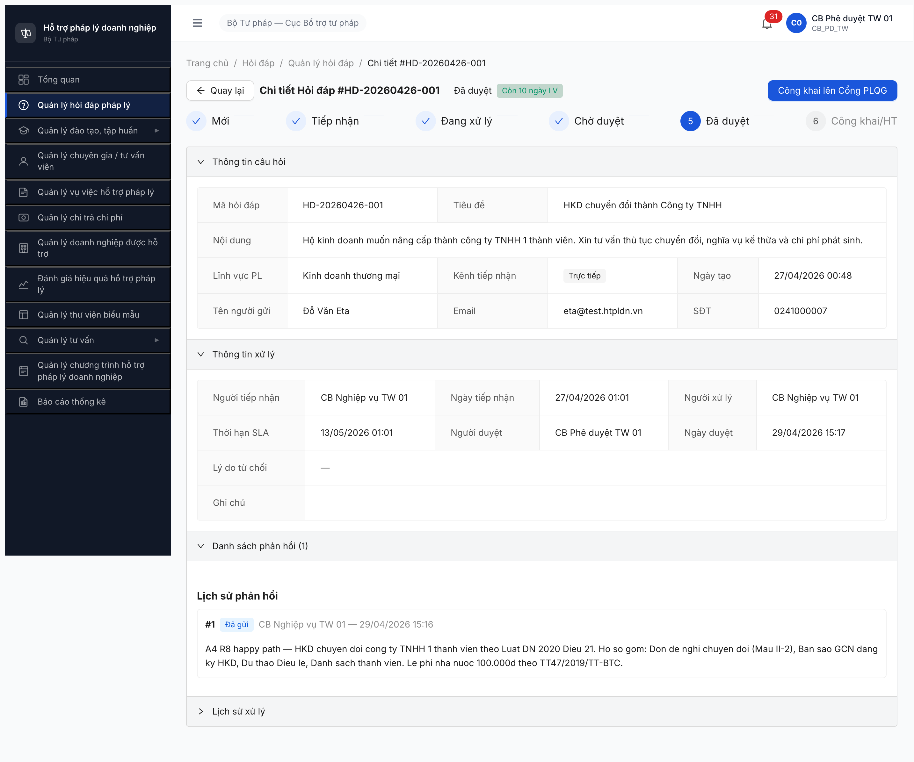
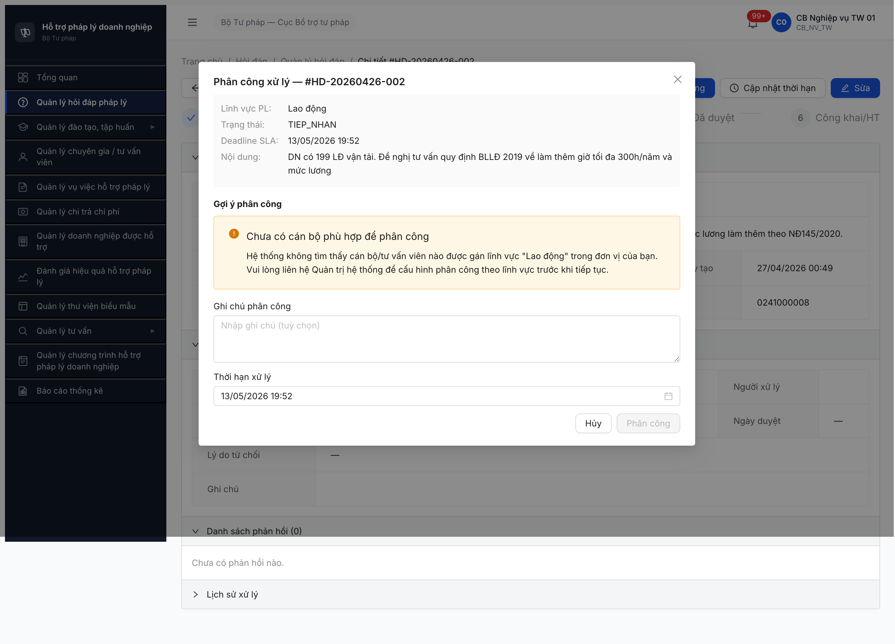
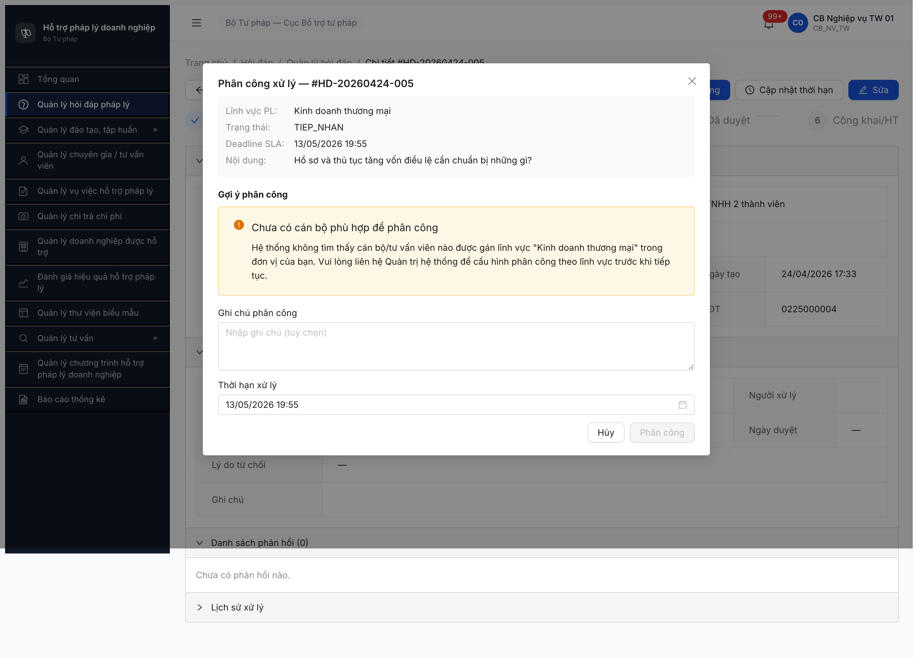
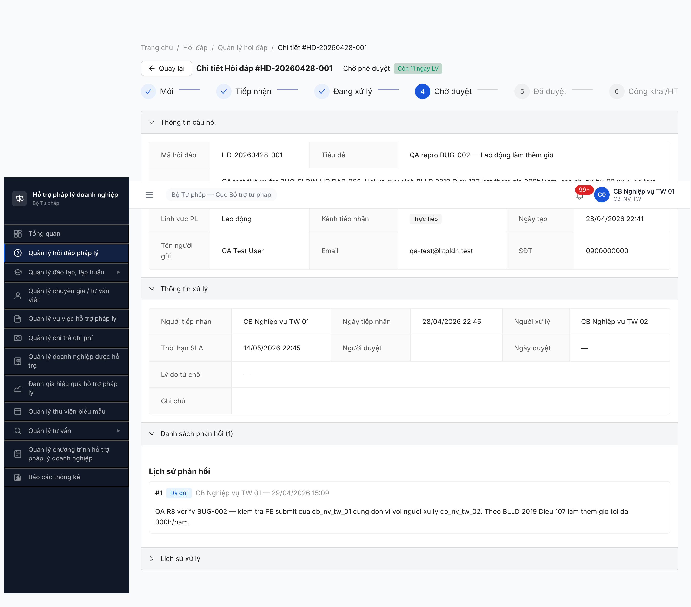
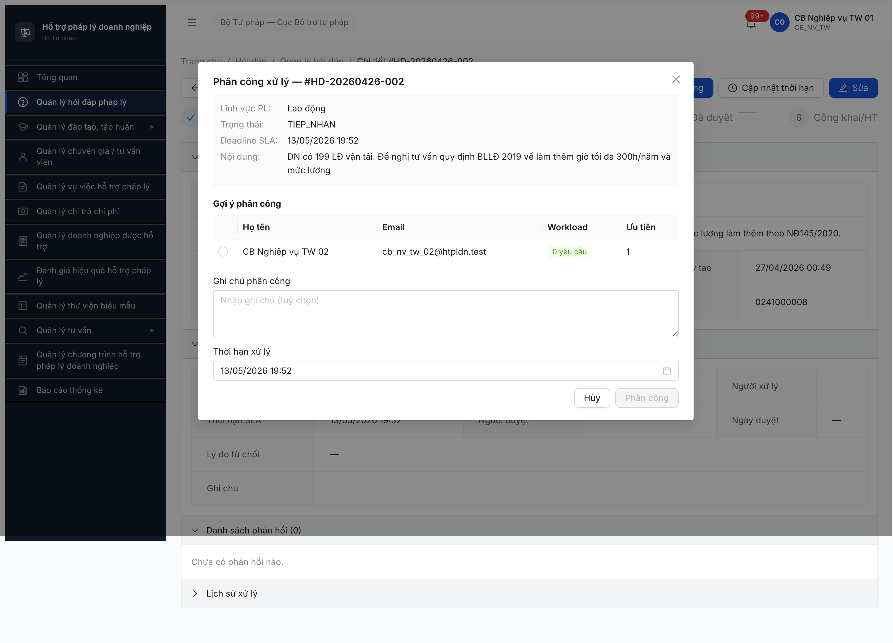
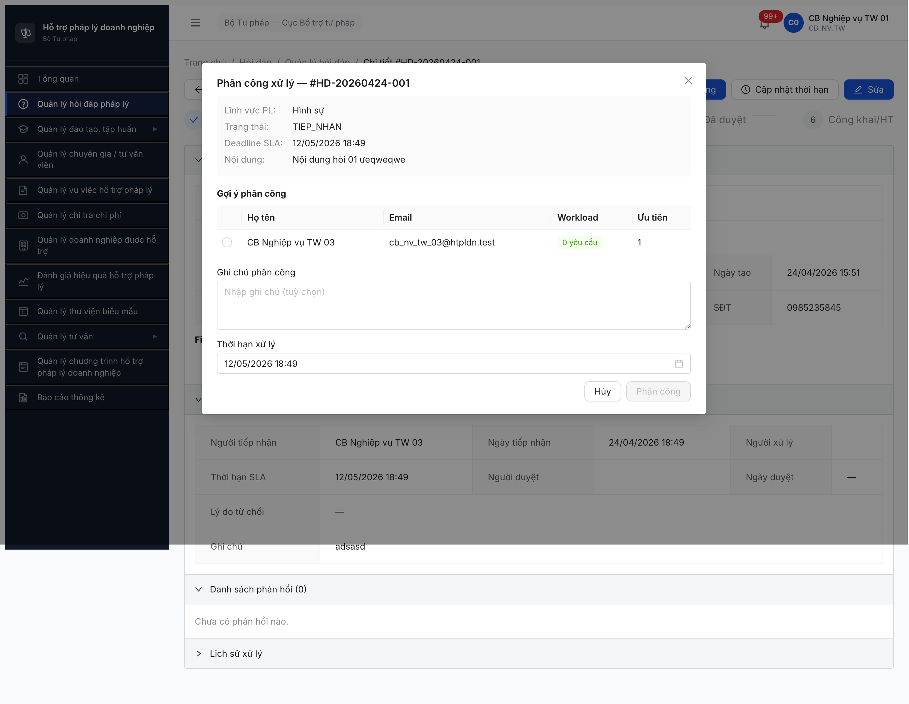

# Bug Report — Hỏi đáp Workflow (A4)

> 🔄 **POST-RESET 2026-05-01:** Dev reset toàn DB. Bug đã closed pre-reset (R1-R10) cần re-verify R11/R12 sau khi seed lại theo [post-reset-seed-plan.md](../../../../tasks/post-reset-seed-plan.md). Bug Open hiện tại có thể không còn repro sau reset (data + state khác). Severity + SRS reference giữ nguyên làm hồ sơ.

---

| Thông tin | Giá trị |
|-----------|---------|
| **Dự án** | PM HTPLDN |
| **Môi trường** | http://103.172.236.130:3000/ |
| **Người test** | QA Automation (Claude Code + Chrome DevTools MCP) |
| **Ngày** | 2026-05-01 (R9 re-verify sau dev fix BE Cổng PLQG) |
| **Loại test** | Workflow — SM-HOIDAP 9 trạng thái |
| **Round** | Round 5 (P2 Trụ A — A4) |
| **Tài liệu tham chiếu** | [`02-thu-tu-module.md §⑦`](../../../../input/quy-trinh-nghiep-vu/02-thu-tu-module.md#L420-L483) · [`workflow-test-report-HOIDAP.md`](../workflow/workflow-test-report-HOIDAP.md) |

---

## Tổng hợp

R10 test **2026-05-01 13:50** Bước 11 + 12: Bước 11 [Hủy công khai] PASS. Bước 12 [Đóng từ CONG_KHAI] FAIL — phát hiện **BUG-FLOW-HOIDAP-005 Major** (FE thiếu nút [Đóng] khi state CONG_KHAI + BE 403 Forbidden cho cả CB NV và CB PD). Vi phạm SRS line 480.

### Severity breakdown

| Tổng | Critical | Major | Medium | Minor | Trivial |
|------|----------|-------|--------|-------|---------|
| 1 active | 0 | 1 | 0 | 0 | 0 |

> **Note R10 2026-05-01 13:50:** Bước 11 [Hủy công khai] CB PD ✅ PASS — POST `/huy-cong-khai` 200, state `Công khai → Đã duyệt`. Bước 12 [Đóng từ CONG_KHAI] ❌ FAIL — UI 0 nút action cho cả CB NV và CB PD ở state CONG_KHAI; direct API POST `/dong-ho-so` trả 403 Forbidden cho cả 2 role (JWT permissions thiếu `complete_hoi_dap`). Vi phạm SRS line 480.

## Bug Summary Table

| Bug ID | Severity | Priority | Type | TC Ref | **SRS Reference** | Title | Status | Closed-verified |
|--------|----------|----------|------|--------|-------------------|-------|--------|:---------------:|
| BUG-FLOW-HOIDAP-005 | Major | P1 | Workflow + Permission | A4 Bước 12 | `srs-fr-02-hoi-dap.md FR-II-08 UC17 line 535` (Màn hình SCR-II-02 nút "Đóng hồ sơ") + `SCR-II-02 row 18 line 958` (button secondary, hiện khi `DA_DUYET/CONG_KHAI`, → C12 confirm → SET HOAN_THANH) + `Postconditions line 606` (Hủy công khai: trạng thái → DA_DUYET) + Error code mới phát hiện: `ERR-PERM-SYS-00-01` | FE thiếu nút "Đóng hồ sơ" ở state `CONG_KHAI` cho CB PD (Tác nhân theo FR-II-08 line 539); BE POST `/dong-ho-so` trả 403 `ERR-PERM-SYS-00-01` Forbidden — JWT permissions của CB PD thiếu `complete_hoi_dap` (chỉ có `approve_hoi_dap`/`read_hoi_dap`/`export_hoi_dap`). Block transition `CONG_KHAI → HOAN_THANH` (SM-HOIDAP line 1274) | Open | — |
| BUG-FLOW-HOIDAP-001 | Critical | P0 | Workflow + Permission | A4 Bước 3 | `02-thu-tu-module.md §⑦ line 473` (UC15) | Modal Phân công — gợi ý API trả option BE rejects (cross-cấp 403 + self 422) | ✅ **Closed** | 2026-04-28 R3 |
| BUG-FLOW-HOIDAP-002 | Major | P1 | Workflow + Permission | A4 Bước 4 | **FR-II-07 Preconditions** + **Error Handling row E3 WRN-PH-01** (verified NotebookLM HTPLDN) | BE strict reject CB NV cùng đơn vị submit `/phan-hois` (403) thay vì cho phép theo Preconditions; FE thiếu WRN-PH-01 cảnh báo trước submit | ✅ **Closed** | 2026-04-29 R8 |
| BUG-FLOW-HOIDAP-003 | Medium | P2 | Workflow + Permission | A4 Bước 3 | **FR-II-06 Preconditions** + **BR-AUTH-08** (verified NotebookLM HTPLDN) | Modal Phân công HD-001 (Hình sự, đơn vị Cục BTTP TW) trả alert "Chưa có cán bộ phù hợp" cho cb_nv_tw_01 dù `CAU_HINH_PHAN_CONG` có row Hình sự ưu tiên 1 = cb_nv_tw_03 (cùng đơn vị) — nghi BE filter `goi-y-phan-cong` thêm điều kiện ngoài SRS | ✅ **Closed** | 2026-04-29 R8 |
| BUG-FLOW-HOIDAP-004 | Major | P1 | Workflow + Integration | A4 Bước 6 | `02-thu-tu-module.md §⑦ line 480` (Bước 6 Công khai lên Cổng PLQG) | POST `/cong-khai` BE trả 502 `ERR-CONG-PLQG-PUBLISH "Đẩy lên Cổng PLQG thất bại: Invalid URL"` — BE config endpoint Cổng PLQG sai/thiếu, block A4 Bước 6 advance từ `Đã duyệt` → `Công khai` | ✅ **Closed** | 2026-05-01 R9 |

---

## BUG-FLOW-HOIDAP-005 — Thiếu nút [Đóng] ở state CONG_KHAI + BE 403 cho cả CB NV và CB PD

> **Meta:** Severity, Priority, Type, Status, TC Ref, SRS Reference đã có ở **Bug Summary Table** trên.

### Mô tả

A4 Bước 12 [Đóng] không thực hiện được khi HD đang ở state `CONG_KHAI`. UI Detail HD hiển thị 0 nút workflow để chuyển trạng thái sang `HOAN_THANH` cho cả 2 role (CB NV + CB PD). Direct API POST `/dong-ho-so` trả 403 Forbidden cho cả 2 role do JWT permissions thiếu `complete_hoi_dap` / `dong_hoi_dap`. Block transition cuối cùng `CONG_KHAI → HOAN_THANH`.

### Các bước tái hiện

1. Login `cb_nv_tw_01 / Secret@123` (OTP `666666`) — HD-20260426-001 đang ở state `CONG_KHAI` (sau Bước 9 Công khai PLQG R9 hoặc re-public R10).
2. Navigate `/hoi-dap/5850cd89-4689-45ec-b3bd-1bac372d3bff` → detail page render.
3. Quan sát header: chỉ có `[Quay lại]` + sidebar nav. **Không có nút `[Đóng]` / `[Hoàn thành]`**. State machine progress bar dừng ở step 5 `Đã duyệt`, step 6 `Công khai` đang highlight nhưng không có button để advance step 7 `Hoàn thành`.
4. Cross-check: login `cb_pd_tw_01` cùng HD → chỉ có `[Hủy công khai]`, **không có** `[Đóng]`.
5. Direct API verify (cả 2 role):

```text
POST /api/v1/hoi-daps/5850cd89-.../dong-ho-so  body {version: 11}
→ 403 ERR-PERM-SYS-00-01 "Forbidden"  (cb_nv_tw_01)
→ 403 ERR-PERM-SYS-00-01 "Forbidden"  (cb_pd_tw_01)

POST /api/v1/hoi-daps/{id}/dong              → 404 (route không tồn tại)
POST /api/v1/hoi-daps/{id}/hoan-thanh        → 404 (route không tồn tại)
POST /api/v1/hoi-daps/{id}/cap-nhat-trang-thai → 404 (route không tồn tại)
```

JWT decode permissions của cb_pd_tw_01 (HD-related): `approve_hoi_dap`, `complete_chuong_trinh_htpl`, `export_hoi_dap`, `read_hoi_dap`. **Thiếu `complete_hoi_dap` / `dong_hoi_dap`**.

### Kết quả mong đợi

Theo SRS `srs-fr-02-hoi-dap.md`:
- **FR-II-08 UC17 line 535** (Màn hình): "SCR-II-02 (nút Phê duyệt/Từ chối/Công khai/Hủy CK/**Đóng hồ sơ**)".
- **FR-II-08 UC17 line 539** (Tác nhân): "Cán bộ Phê duyệt (TW/BN/ĐP)".
- **SCR-II-02 row 18 line 958**: "Nut 'Dong ho so' | button (secondary) | → C12 'Dong ho so? Ho so se khong the chinh sua.' → SET HOAN_THANH | click → xac nhan | **khi DA_DUYET/CONG_KHAI**".
- **Section §SM-HOIDAP line 1274**: `CONG_KHAI --> HOAN_THANH : Đóng hồ sơ`.
- **Postconditions line 606**: trạng thái sau Đóng → HOAN_THANH.

→ FE Detail HD ở state `CONG_KHAI` phải render button "Đóng hồ sơ" cho CB PD. BE phải gán permission `complete_hoi_dap` (hoặc tên tương đương) cho role `CB_PD_<cấp>`. POST `/dong-ho-so` phải trả 200 → state advance `CONG_KHAI → HOAN_THANH`.

### Kết quả thực tế

- FE: 0 button workflow cho cả CB NV và CB PD ở state `CONG_KHAI`.
- BE: route `/dong-ho-so` tồn tại nhưng trả 403 cho cả 2 role.
- HD-001 stuck ở `CONG_KHAI`, không thể advance đến `HOAN_THANH`.

### Bằng chứng


```text
2026-05-01 13:50 — login cb_pd_tw_01:
GET /api/v1/hoi-daps/5850cd89-...                → 200 trangThai=CONG_KHAI version=11
POST /api/v1/hoi-daps/5850cd89-.../dong-ho-so    → 403 ERR-PERM-SYS-00-01 "Forbidden"

JWT permissions liên quan HD: approve_hoi_dap, complete_chuong_trinh_htpl, export_hoi_dap, read_hoi_dap
→ Thiếu complete_hoi_dap / dong_hoi_dap
```

### Tác động

- Block A4 Bước 12 path từ `CONG_KHAI → HOAN_THANH`.
- HD đã `Công khai` lên Cổng PLQG không thể đóng để hoàn tất workflow.
- D3 Kho QA auto-feed (cần HD `Hoàn thành`) bị block một phần.

---

## ~~BUG-FLOW-HOIDAP-004~~ [CLOSED] — POST /cong-khai 502 BE config Cổng PLQG `Invalid URL`

> **Re-test:** 2026-05-01 12:53-12:55 R9 — ✅ PASS (Closed-verified). Dev đã fix BE config endpoint Cổng PLQG. POST `/cong-khai` 200, response `{trangThai: "CONG_KHAI", version: 8, laCongKhai: true, ngayCongKhai: "2026-05-01T05:54:42.944Z", trangThaiDongBo: "SUCCESS", ngayDongBo: "2026-05-01T05:54:42.944Z", loiDongBo: null, soLanThuLai: 0}`. Bằng chứng: .

> **Meta:** Severity, Priority, Type, Status, TC Ref, SRS Reference đã có ở **Bug Summary Table** trên.

### Mô tả

A4 Bước 6 [Công khai lên Cổng PLQG] click button → BE trả 502 `ERR-CONG-PLQG-PUBLISH "Đẩy lên Cổng PLQG thất bại: Invalid URL"`. BE config endpoint external Cổng PLQG sai hoặc thiếu — block toàn bộ A4 advance từ `Đã duyệt` → `Công khai`.

### Các bước tái hiện

1. Login `cb_nv_tw_01 / Secret@123` → HD-20260426-001 (KDTM).
2. Bước 2 Phân công cb_nv_tw_01 (self) → state advance `Tiếp nhận → Đang xử lý` ✓.
3. Bước 3-4 Soạn phản hồi 244 ký tự + Văn bản pháp luật + Gợi ý DN → click [Gửi phản hồi] → confirm → POST `/phan-hois` 201 → state `Chờ phê duyệt` ✓.
4. Logout → login `cb_pd_tw_01` → HD-20260426-001.
5. Bước 5 click [Phê duyệt] → confirm "Xác nhận phê duyệt?" → click [Phê duyệt] → POST `/phe-duyet` 200 → state `Đã duyệt` ✓.
6. Bước 6 Detail page hiện button **[Công khai lên Cổng PLQG]**. Click button.
7. Dialog confirm "Công khai lên Cổng PLQG?" → click [Công khai].
8. POST `/api/v1/hoi-daps/{id}/cong-khai` → **502 Bad Gateway**.

### Kết quả mong đợi

Theo SRS `02-thu-tu-module.md §⑦` Bước 6 Public PLQG:
- BE gọi external Cổng PLQG API với URL config đúng (env `CONG_PLQG_API_URL`).
- BE trả 200 + state advance `Đã duyệt → Công khai` + flag `da_dang_cong_plqg=true`.

### Kết quả thực tế

```text
POST /api/v1/hoi-daps/5850cd89-4689-45ec-b3bd-1bac372d3bff/cong-khai
Body: {"version":5}
Status: 502 Bad Gateway
Response: {
  "success": false,
  "error": {
    "code": "ERR-CONG-PLQG-PUBLISH",
    "message": "Đẩy lên Cổng PLQG thất bại: Invalid URL",
    "timestamp": "2026-04-29T08:17:34.552Z",
    "requestId": "d2ea28b9-97f7-4bf7-81a6-00181b7bcc49"
  }
}
```

→ BE error message rõ ràng: URL gọi external Cổng PLQG `Invalid URL`. State giữ nguyên `Đã duyệt`.

### Bằng chứng



### Tác động

- Block toàn bộ A4 từ Bước 6 → 7 → 8 (Cập nhật KQ + Hoàn thành).
- Block Trụ E E4 (Phiên TV nhanh) đẩy record qua Cổng PLQG.
- Block T4.1 functional Hỏi đáp test Bước 6+7+8.

---

## BUG-FLOW-HOIDAP-001 — Closed-verified 2026-04-28

> **Re-test:** 2026-04-28 R3 — ✅ PASS (Closed-verified). Modal Phân công gọi `goi-y-phan-cong` filter chặt theo lĩnh vực + đơn vị; pool rỗng → alert + button disabled, không spurious 403/422.

### Hiện tượng cũ (R2 27/4)

`POST /api/v1/hoi-daps/{id}/phan-cong` luôn fail:
- Option self (cùng cấp TW) → HTTP 422.
- Option cross-cấp TW→ĐP (vd `tvv_02 BG`) → HTTP 403.

Cross-3-LV (Lao động/Hình sự/KDTM) đều fail → 0 HD đến `Đã duyệt`.

### Behavior R3 (sau dev fix) — verified

Modal Phân công xử lý giờ:
- Gọi `goi-y-phan-cong` API và **filter chặt** theo lĩnh vực + đơn vị của user đang login (đúng SRS BR-AUTH + `CAU_HINH_PHAN_CONG` FR-II-NEW-01).
- Khi pool rỗng → hiển thị **alert ant-alert-warning**: "Chưa có cán bộ phù hợp để phân công — Hệ thống không tìm thấy cán bộ/tư vấn viên nào được gán lĩnh vực '{Lao động|Hình sự|Kinh doanh thương mại}' trong đơn vị của bạn. Vui lòng liên hệ Quản trị hệ thống để cấu hình phân công theo lĩnh vực trước khi tiếp tục."
- Button `[Phân công]` **disabled** → ngăn user gửi request fail.
- Tested 3 LV / 3 record:

| HD | Lĩnh vực | Modal alert | Button [Phân công] |
|----|----------|-------------|:------------------:|
| HD-20260426-002 | Lao động | ✅ Hiển thị alert đúng SRS | disabled ✓ |
| HD-20260424-001 | Hình sự | ✅ Hiển thị alert đúng SRS | disabled ✓ |
| HD-20260424-005 | KDTM | ✅ Hiển thị alert đúng SRS | disabled ✓ |

→ Behavior R3 **đúng SRS** + không còn HTTP 403/422 spurious. Bug closed.

### Bằng chứng R3





### Lưu ý ghi cho Trụ D / P3 / T4

Bước 3 [Phân công] vẫn block để advance workflow do **thiếu seed `CAU_HINH_PHAN_CONG` ở QTHT** cho cấp TW × 3 lĩnh vực test (Lao động/Hình sự/KDTM). Đây là **data gap**, không phải bug app. Cần seed config phân công trước khi tiếp tục test Bước 4-7.

### Bằng chứng cũ (R2 27/4) — kept for trace


```
Cũ R2 (27/4):
HD-20260426-002 (LD):  POST /hoi-daps/.../phan-cong [403]  (tvv_02 BG)
HD-20260426-002 (LD):  POST /hoi-daps/.../phan-cong [422]  (cb_nv_tw_01 self)
HD-20260424-001 (HS):  POST /hoi-daps/.../phan-cong [403]  (cb_nv_tw_03 TW)
HD-20260424-005 (KDTM):POST /hoi-daps/.../phan-cong [403]  (cg_02 BG)

Mới R3 (28/4):
3/3 modal alert + button disabled — không gửi request fail.
```

---

## BUG-FLOW-HOIDAP-002 — BE reject 403 cho CB NV cùng đơn vị submit `/phan-hois`

> **Re-test:**
> - 2026-04-29 01:25 R6 — ❌ STILL OPEN. Dev fix sai SRS — FE block strict (không textarea) thay vì WRN-PH-01 dialog WARNING theo `srs-fr-02-hoi-dap.md line 503`.
> - 2026-04-29 15:09 R8 — ✅ PASS (Closed-verified). FE giữ textarea + click [Gửi phản hồi] hiện dialog WRN-PH-01 "Bạn không phải người được phân công. Vẫn muốn phản hồi?", BE accept POST 201, state advance `Đang xử lý → Chờ phê duyệt`. Bằng chứng: .

### Mô tả

> **Meta:** Severity, Priority, Type, Status, TC Ref, SRS Reference đã có ở **Bug Summary Table** trên.

### Mô tả

CB NV cùng đơn vị (`cb_nv_tw_01`) submit nội dung phản hồi cho HD do user khác (`cb_nv_tw_02`) được phân công xử lý → API `POST /api/v1/hoi-daps/{id}/phan-hois` trả 403. FE cũng không hiện cảnh báo WRN-PH-01 trước submit.

### Các bước tái hiện

1. Login `cb_nv_tw_01 / Secret@123` (OTP `666666`).
2. Navigate `/hoi-dap/35386f24-1641-4657-b84f-df19aa4c3fc8` (HD-20260426-002 Lao động, đơn vị Cục BTTP TW).
3. Click `[Phân công]` → modal 2 gợi ý → chọn radio `cb_nv_tw_02` → submit. State `Đang xử lý`, người xử lý = CB Nghiệp vụ TW 02.
4. Fill textarea `Nội dung phản hồi` 286 ký tự nội dung BLLĐ 2019 Đ107.
5. Click `[Gửi phản hồi]` → modal "Xác nhận gửi phản hồi" → click confirm.
6. Quan sát: state vẫn `Đang xử lý`, không toast lỗi, Network 403.

### Kết quả mong đợi

Theo SRS FR-II-07 Preconditions (verified NotebookLM HTPLDN 2026-04-28 21:50 + grep `srs-v3.md`):
- Preconditions: "User đã đăng nhập, là người được phân công **hoặc CB NV cùng đơn vị**".
- Error Handling row E3: "Không phải người được phân công | WRN-PH-01 | `Bạn không phải người được phân công. Vẫn muốn phản hồi?` | **WARNING**".
- SCR-II-02 row 11: nút "Soan phan hoi" — "WRN-PH-01 neu khong phai nguoi phan cong".

→ FE phải hiện dialog cảnh báo WRN-PH-01 trước submit. BE phải accept request từ CB NV cùng đơn vị → 200 → state auto sang `Chờ phê duyệt`.

### Kết quả thực tế

- FE: skip WRN-PH-01, submit thẳng không cảnh báo.
- BE: POST `/phan-hois` → 403 Forbidden (Network reqid=318).
- UI: modal xác nhận đóng, không toast/notification, state giữ `Đang xử lý`, textarea giữ text 286 ký tự.
- Tái hiện trên HD-20260424-002 cùng pattern.

### Bằng chứng



```text
HD-20260426-002 (Lao động, đơn vị Cục BTTP TW):
  Người xử lý: cb_nv_tw_02
  Login: cb_nv_tw_01 (cùng đơn vị Cục BTTP TW)
  POST /api/v1/hoi-daps/35386f24-1641-4657-b84f-df19aa4c3fc8/phan-hois → 403

HD-20260424-002 (Lao động, cùng đơn vị):
  Người xử lý: cb_nv_tw_03
  Login: cb_nv_tw_01
  POST /api/v1/hoi-daps/0b051db1-a119-4c52-9303-d61986010360/phan-hois → 403
```

---

## BUG-FLOW-HOIDAP-003 — Modal Phân công trả empty cho HD có người tiếp nhận khác user login

> **Re-test:**
> - 2026-04-29 01:25 R6 — ❌ STILL OPEN, identical R4. Modal vẫn alert empty + button disabled.
> - 2026-04-29 15:09 R8 — ✅ PASS (Closed-verified). Modal Phân công HD-001 Hình sự hiện cb_nv_tw_03 (cùng đơn vị) đúng SRS FR-II-06 + BR-AUTH-08. Bằng chứng: .

> **Meta:** Severity, Priority, Type, Status, TC Ref, SRS Reference đã có ở **Bug Summary Table** trên.

### Mô tả

User `cb_nv_tw_01` (đơn vị Cục BTTP TW) mở modal Phân công cho HD-20260424-001 (Hình sự, đơn vị Cục BTTP TW, người tiếp nhận = cb_nv_tw_03) → modal trả alert "Chưa có cán bộ phù hợp" + button `[Phân công]` disabled, mặc dù QTHT đã seed row `CAU_HINH_PHAN_CONG`: Hình sự + cb_nv_tw_03 + đơn vị Cục BTTP TW + ưu tiên 1 + Kích hoạt.

### Các bước tái hiện

1. Login `qtht_01` → SCR-VIII-06 Tab Phân công → verify row "Hình sự + CB Nghiệp vụ TW 03 + Ưu tiên 1 + Kích hoạt" (đơn vị Cục BTTP TW) tồn tại.
2. Login `cb_nv_tw_01 / Secret@123` (OTP `666666`).
3. Navigate `/hoi-dap/8dca6151-5860-41d1-844d-944bb415e416` (HD-20260424-001 Hình sự, người tiếp nhận = cb_nv_tw_03, cùng đơn vị Cục BTTP TW).
4. Click `[Phân công]` → modal "Phân công xử lý — #HD-20260424-001" mở.
5. Quan sát "Gợi ý phân công": alert "Chưa có cán bộ phù hợp" + button disabled.
6. Cross-check: cùng user `cb_nv_tw_01` mở modal HD-20260426-002 (Lao động, người tiếp nhận = chính cb_nv_tw_01) → modal trả 2 gợi ý OK. Khác biệt duy nhất giữa 2 record: người tiếp nhận.

### Kết quả mong đợi

Theo SRS FR-II-06 Preconditions + BR-AUTH-08 (verified NotebookLM HTPLDN 2026-04-28 22:05 + grep `srs-v3.md`):
- FR-II-06 Preconditions: "User đã đăng nhập, có quyền `Phân công` · HOI_DAP.trang_thai IN (TIEP_NHAN, DA_PHAN_CONG) · Cấu hình lĩnh vực ↔ CB đã thiết lập" — KHÔNG yêu cầu user phải là người tiếp nhận.
- FR-II-06 Processing Bước 3: "Tải danh sách gợi ý phân công: lấy CB/TVV đã cấu hình khớp lĩnh vực câu hỏi".
- BR-AUTH-08: "Mọi truy vấn dữ liệu đều được lọc dữ liệu theo đơn vị (`don_vi_id`) của người dùng đang đăng nhập".

→ Modal phải hiện ≥1 gợi ý matching `linh_vuc_id=Hình sự` + `don_vi_id=Cục BTTP TW` → CB NV TW 03.

### Kết quả thực tế

- Pool gợi ý empty.
- Hypothesis: BE filter `goi-y-phan-cong` thêm điều kiện `nguoi_tiep_nhan_id = login user` ngoài SRS.

### Bằng chứng


```text
HD-20260424-001 (Hình sự, đơn vị Cục BTTP TW, người tiếp nhận cb_nv_tw_03):
  Login cb_nv_tw_01 (cùng đơn vị Cục BTTP TW)
  QTHT PC config: "Hình sự + cb_nv_tw_03 + Cục BTTP TW + ưu tiên 1" — verified
  Modal Phân công: alert empty + button disabled

Cross-check: HD-20260426-002 (Lao động, người tiếp nhận = cb_nv_tw_01 self):
  Modal Phân công: 2 gợi ý OK (cb_nv_tw_01 + cb_nv_tw_02)
```

---

## Phụ lục — Môi trường test

| Thành phần | Giá trị |
|------------|---------|
| URL ứng dụng | http://103.172.236.130:3000/ |
| OTP login | `666666` (bypass) |
| API base | http://103.172.236.130:3000/api/v1 |
| Frontend | React + Vite + Ant Design |
| Tool test | Chrome DevTools MCP |

---

*R2 bug logged 2026-04-27 20:00 | R3 closed-verified 2026-04-28 18:24 | R4 BUG-002 + BUG-003 logged 2026-04-28 22:05 | R6 re-verify after dev claim "fix all Trụ A": 2026-04-29 01:25 | R8 BUG-002 + BUG-003 closed + BUG-004 logged: 2026-04-29 15:09 | R9 BUG-004 closed-verified: 2026-05-01 12:55 | R10 Bước 11 PASS + BUG-005 logged: 2026-05-01 13:50 | QA Automation via Claude Code*
