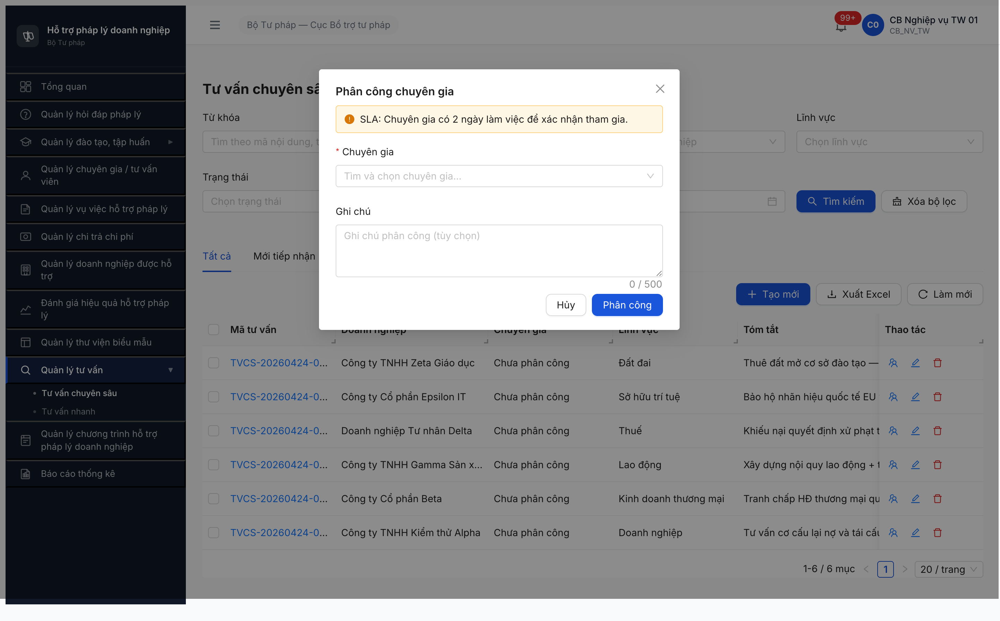
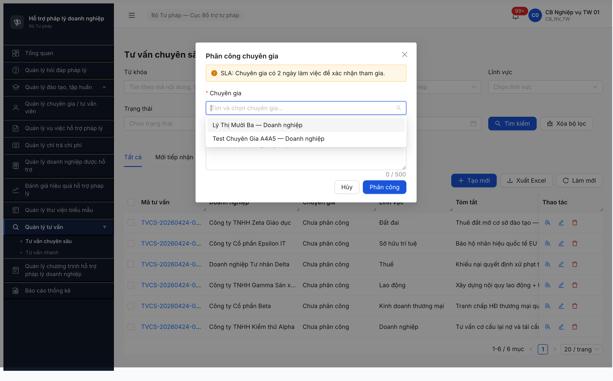
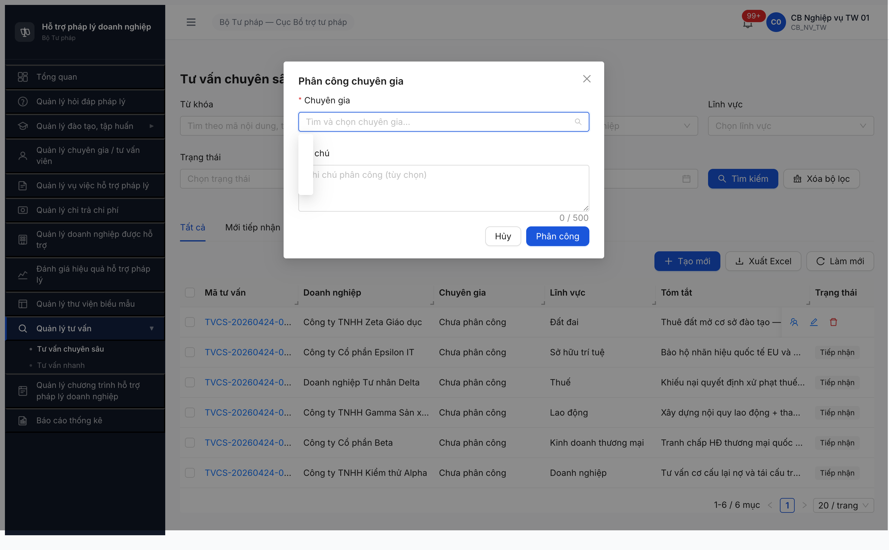
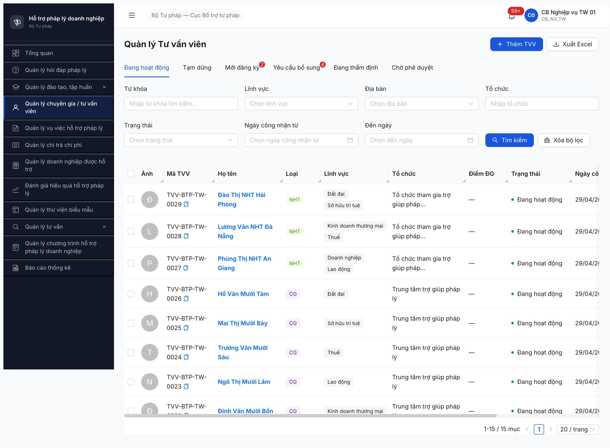

# Bug Report — TV Chuyên sâu Workflow (A5)

> 🔄 **POST-RESET 2026-05-01:** Dev reset toàn DB. Bug đã closed pre-reset (R1-R10) cần re-verify R11/R12 sau khi seed lại theo [post-reset-seed-plan.md](../../../../tasks/post-reset-seed-plan.md). Bug Open hiện tại có thể không còn repro sau reset (data + state khác). Severity + SRS reference giữ nguyên làm hồ sơ.

---

| Thông tin | Giá trị |
|-----------|---------|
| **Dự án** | PM HTPLDN |
| **Môi trường** | http://103.172.236.130:3000/ |
| **Người test** | QA Automation (Claude Code + Chrome DevTools MCP) |
| **Ngày** | 2026-04-27 → 2026-05-01 |
| **Loại test** | Workflow — SM-TVCS |
| **Round** | Round 5 (A5) |
| **Tài liệu tham chiếu** | [`02-thu-tu-module.md §⑧`](../../../../input/quy-trinh-nghiep-vu/02-thu-tu-module.md#L487-L546) · [`workflow-test-report-TVCS.md`](../workflow/workflow-test-report-TVCS.md) |

---

## Tổng hợp

Phát hiện **4** lỗi có SRS reference — toàn bộ 4 đã closed sau R9 (1/5).

### Severity breakdown (active)

| Tổng active | Critical | Major | Medium | Minor | Trivial |
|-------------|----------|-------|--------|-------|---------|
| 0 | 0 | 0 | 0 | 0 | 0 |

## Bug Summary Table

| Bug ID | Severity | Priority | Type | TC Ref | SRS Reference | Title | Status |
|--------|----------|----------|------|--------|---------------|-------|--------|
| BUG-FLOW-TVCS-001 | Critical | P0 | UI/UX + Workflow | A5 Bước 2-5 | `02-thu-tu-module §⑧ line 509-541` | UI Detail TVCS thiếu nút workflow | ✅ Closed |
| BUG-FLOW-TVCS-002 | Minor | P3 | UI/UX | A5 list | `FR-X.1-01 §Outputs SCR-X1-02` | Cột "Ngày bắt đầu" hiển thị `Invalid Date` | ✅ Closed |
| BUG-FLOW-TVCS-003 | Critical | P0 | Data + Workflow | A5 Bước 2 | `srs-fr-12 line 105+938` · `02-thu-tu-module §⑧ line 533` | Modal Phân công CG truyền sai enum `trangThai=HOAT_DONG` → dropdown rỗng | ✅ Closed |
| BUG-FLOW-TVCS-004 | Critical | P0 | Data + Workflow | A5 Bước 2 | `srs-fr-12 line 938` + `02-thu-tu-module §⑧ line 510-533` | POST `/noi-dung-tu-van-cs/{id}/phan-cong` BE trả 404 `ERR-VAL-X-01-03 "Chuyen gia khong ton tai hoac chua duoc duyet"` cho cả 2 CG mà GET `/tu-van-viens` đã trả ra. BE filter inconsistent giữa GET dropdown vs POST phân công | ✅ Closed |

---

## ~~BUG-FLOW-TVCS-004~~ [CLOSED] — BE reject CG `Chuyen gia khong ton tai hoac chua duoc duyet` dù GET dropdown trả ra

> **Re-test:** 2026-05-01 12:55-12:56 R9 — ✅ PASS (Closed-verified). Dev đã fix BE filter POST `/phan-cong` consistent với GET `/tu-van-viens`. POST `/noi-dung-tu-van-cs/0b1391b1-.../phan-cong` body `{chuyenGiaId: "af8dba5d-...", version: 1}` → 200, response `{trangThai: "PHAN_CONG", version: 2, chuyenGiaId: "af8dba5d-..."}`. UI auto-refresh: row TVCS-0001 cột Chuyên gia=`Lý Thị Mười Ba`, Trạng thái=`Phân công`. Bằng chứng: .

> **Meta:** Severity, Priority, Type, Status, TC Ref, SRS Reference đã có ở **Bug Summary Table** trên.

### Mô tả

Sau khi BUG-003 close (FE giờ truyền enum đúng), modal Phân công CG TVCS-0001 hiện 2 CG dropdown OK (TVV-0021 + TVV-0019). Nhưng khi click [Phân công] với một trong 2 CG → BE trả 404 `ERR-VAL-X-01-03 "Chuyen gia khong ton tai hoac chua duoc duyet"`. BE filter đường POST inconsistent với GET đường dropdown — block A5 advance.

### Các bước tái hiện

1. Login `cb_nv_tw_01 / Secret@123` → `/tv-chuyen-sau/danh-sach`.
2. Click icon `team` row TVCS-20260424-0001 (Doanh nghiệp).
3. Modal "Phân công chuyên gia" mở → click dropdown.
4. GET `/api/v1/tu-van-viens?pageSize=100&trangThai=DANG_HOAT_DONG&loaiTvv=CG&linhVucIds={tvcs.linh_vuc_id}` → 200 trả 2 CG:
   - TVV-BTP-TW-0021: Lý Thị Mười Ba (`af8dba5d-5d50-4e69-8483-638510a946ca`, CG, DANG_HOAT_DONG, Công khai)
   - TVV-BTP-TW-0019: Test Chuyên Gia A4A5 (`8e865f50-73d3-4d04-b8a9-c4db2835a126`, CG, DANG_HOAT_DONG, Công khai)
5. Chọn radio `Lý Thị Mười Ba` + click [Phân công].
6. POST `/api/v1/noi-dung-tu-van-cs/0b1391b1-e363-4c1b-984d-64f60171e07a/phan-cong` với body `{chuyenGiaId: "af8dba5d-...", version: 1}` → **404 ERR-VAL-X-01-03 "Chuyen gia khong ton tai hoac chua duoc duyet"**.
7. Retry với CG khác `Test Chuyên Gia A4A5` (`8e865f50-...`) → cùng error 404.

### Kết quả mong đợi

Theo SRS `srs-fr-12 line 938` + `02-thu-tu-module §⑧ line 510-533`:
- BE accept POST nếu `chuyenGiaId` matching CG `loai_tvv=CG AND trang_thai=DANG_HOAT_DONG AND la_cong_khai=true`.
- Cả 2 CG seed đều thỏa mãn condition (verified qua GET endpoint cùng session).
- BE phải trả 200 + state advance `Tiếp nhận → Đang xử lý` + `chuyen_gia_id={CG_id}`.

### Kết quả thực tế

```text
GET /api/v1/tu-van-viens?pageSize=100&trangThai=DANG_HOAT_DONG&loaiTvv=CG&linhVucIds=f0a6e207-37c6-4d8d-9f9e-b5d260933cf8
→ 200 {"data":[
    {"id":"af8dba5d-...","maTvv":"TVV-BTP-TW-0021","loaiTvv":"CG","trangThai":"DANG_HOAT_DONG","laCongKhai":true,"linhVucText":"Doanh nghiệp"},
    {"id":"8e865f50-...","maTvv":"TVV-BTP-TW-0019","loaiTvv":"CG","trangThai":"DANG_HOAT_DONG","laCongKhai":true,"linhVucText":"Doanh nghiệp"}
],"meta":{"total":2}}

POST /api/v1/noi-dung-tu-van-cs/0b1391b1-.../phan-cong
Body: {"chuyenGiaId":"af8dba5d-...","version":1}
→ 404 {"error":{"code":"ERR-VAL-X-01-03","message":"Chuyen gia khong ton tai hoac chua duoc duyet"}}

POST /api/v1/noi-dung-tu-van-cs/0b1391b1-.../phan-cong
Body: {"chuyenGiaId":"8e865f50-...","version":1}
→ 404 {"error":{"code":"ERR-VAL-X-01-03","message":"Chuyen gia khong ton tai hoac chua duoc duyet"}}
```

→ BE filter POST stricter than GET — có thêm condition ngoài `DANG_HOAT_DONG + CG + Công khai` (có thể `nguoi_duyet_id IS NOT NULL` hoặc audit trail riêng cho TVCS module).

### Bằng chứng



### Tác động

- Block toàn bộ A5 từ Bước 2 (Phân công CG) → 3-11 (CG Chấp nhận → Cập nhật KQ → Trình duyệt → Phê duyệt → Đóng).
- Block T4.5 functional TVCS test workflow toàn bộ.
- Block D2 Đánh giá HQ phụ thuộc TVCS Hoàn thành.

---

## BUG-FLOW-TVCS-001 — UI Detail TVCS thiếu nút workflow

> **Re-test:** 2026-04-28 R3 — ✅ PASS (Closed-verified). Detail TVCS render `[Phân công]` + `[Hủy]` đúng SRS line 510. List có icon `team` shortcut.

### Mô tả

Trang chi tiết TVCS-0001 không render button workflow nào. 0/4 Bước ([Phân công CG]/[Chấp nhận]/[Hoàn thành]/[Phê duyệt]) advance được.

### Các bước tái hiện

1. Login `cb_nv_tw_01` → `/tv-chuyen-sau/TVCS-20260424-0001`.
2. Quan sát detail page — không có button workflow nào.

### Kết quả mong đợi

Detail TVCS state `TIEP_NHAN` render button `[Phân công]` + `[Hủy]` (SRS `02-thu-tu-module §⑧ line 510`).

### Kết quả thực tế

0 button workflow trên detail. List page row chỉ có edit + delete.

### Bằng chứng


---

## BUG-FLOW-TVCS-002 — Cột "Ngày bắt đầu" hiển thị `Invalid Date`

> **Re-test:** 2026-04-28 R3 — ✅ PASS (Closed-verified). 6/6 row hiển thị `—` đúng SRS (chỉ render `dd/mm/yyyy` khi đã Phân công).

### Mô tả

Cột "Ngày bắt đầu" trên list `/tv-chuyen-sau/danh-sach` hiển thị `Invalid Date` cho 6/6 record state `TIEP_NHAN`.

### Các bước tái hiện

1. Login `cb_nv_tw_01` → `/tv-chuyen-sau/danh-sach`.
2. Quan sát cột "Ngày bắt đầu" cho 6 row state `Tiếp nhận`.

### Kết quả mong đợi

Cột render `—` khi chưa Phân công, render `dd/mm/yyyy` sau khi Phân công (SRS `FR-X.1-01 §Outputs SCR-X1-02`).

### Kết quả thực tế

6/6 row render `Invalid Date` text.

### Bằng chứng


---

## BUG-FLOW-TVCS-003 — Modal Phân công CG truyền sai enum `trangThai=HOAT_DONG`

> **Re-test:**
> - 2026-04-29 01:35 R6 — ❌ FAIL (sau dev claim fix lần 1). Modal vẫn render `Trống`, FE vẫn truyền `HOAT_DONG`.
> - 2026-04-29 09:36 R7 — ❌ FAIL (sau dev claim fix lần 2). Identical R6. Pool đã có 8 CG `DANG_HOAT_DONG` cover 6 LV (Doanh nghiệp 2 CG, mỗi LV còn lại 1 CG) nhưng FE vẫn chưa fix enum.
> - 2026-04-29 15:12 R8 — ✅ **Closed-verified** (sau dev claim fix lần 3). FE giờ truyền `?pageSize=100&trangThai=DANG_HOAT_DONG&loaiTvv=CG&linhVucIds={tvcs.linh_vuc_id}` đúng SRS. Dropdown render 2 CG cho TVCS-0001 Doanh nghiệp (TVV-0021 Lý Thị Mười Ba + TVV-0019 Test Chuyên Gia A4A5). Bằng chứng: .

### Mô tả

Modal "Phân công chuyên gia" gọi BE với `trangThai=HOAT_DONG` — sai entity enum. `HOAT_DONG` thuộc CHECK constraint của `TAI_KHOAN.trang_thai`, KHÔNG phải `TU_VAN_VIEN.trang_thai` (đúng phải là `DANG_HOAT_DONG`). BE trả `total=0` → dropdown rỗng → block A5 Bước 2-8.

### Các bước tái hiện

1. Login `cb_nv_tw_01` → `/tv-chuyen-sau/danh-sach`.
2. Click icon `team` row TVCS-20260424-0001 (Doanh nghiệp).
3. Modal "Phân công chuyên gia" mở → click dropdown "Chuyên gia".
4. Quan sát: dropdown render `Trống`.
5. DevTools Network: `GET /api/v1/tu-van-viens?pageSize=100&trangThai=HOAT_DONG → 200, data=[]`.

### Kết quả mong đợi

- FE gọi `GET /api/v1/tu-van-viens?trangThai=DANG_HOAT_DONG&loaiTvv=CG&linhVucId={tvcs.linh_vuc_id}` (theo `srs-fr-12 line 938` + `02-thu-tu-module §⑧ line 533`).
- Dropdown TVCS-0001 (Doanh nghiệp) hiện 2 option CG: Lý Thị Mười Ba (TVV-0021) + Test Chuyên Gia A4A5 (TVV-0019).

### Kết quả thực tế

- FE gọi `?trangThai=HOAT_DONG` (entity mismatch — `HOAT_DONG` ∈ TAI_KHOAN, không phải TU_VAN_VIEN).
- BE trả `total=0`. Dropdown empty.
- Verify pool cùng session: `?trangThai=DANG_HOAT_DONG → total=15` (8 CG + 3 NHT + 4 TVV). CG khớp Doanh nghiệp = 2.

### Bằng chứng





```text
# FE modal (SAI):
GET /api/v1/tu-van-viens?pageSize=100&trangThai=HOAT_DONG → 200
{"success":true,"data":[],"meta":{"total":0}}

# Module CG/TVV (ĐÚNG):
GET /api/v1/tu-van-viens?trangThai=DANG_HOAT_DONG → 200
{"success":true,"data":[15 record],"meta":{"total":15}}
```

---

## Phụ lục — Môi trường test

| Thành phần | Giá trị |
|------------|---------|
| URL ứng dụng | http://103.172.236.130:3000/ |
| OTP login | `666666` (bypass) |
| API base | http://103.172.236.130:3000/api/v1 |
| Frontend | React + Vite + Ant Design |
| Tool test | Chrome DevTools MCP |
| Token user | `cb_nv_tw_01` (CB_NV_TW, TW) |

---

*Bug report generated: 2026-04-27 → 2026-05-01 | R8 closed BUG-003 + logged BUG-004: 2026-04-29 15:12 | R9 closed BUG-004: 2026-05-01 12:56 | QA Automation via Claude Code*
