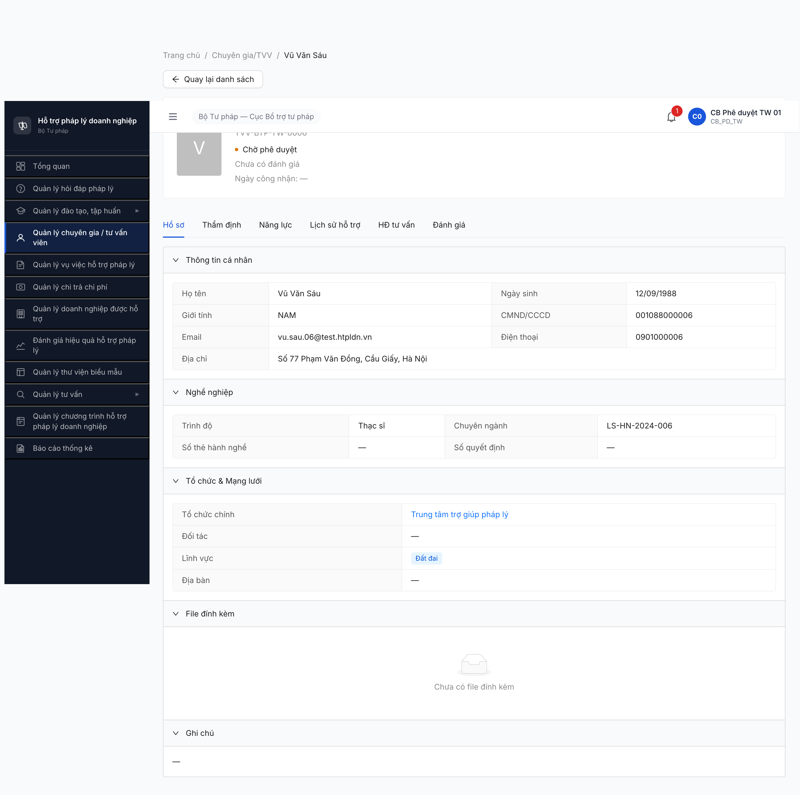
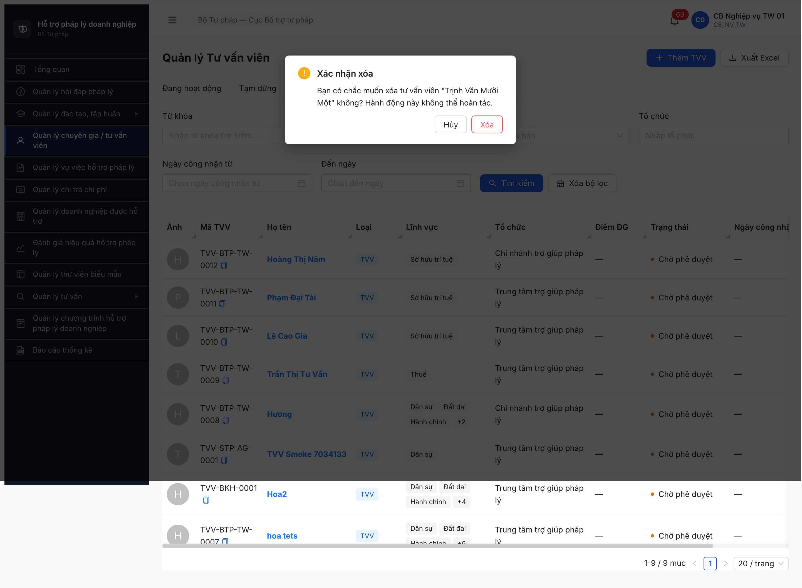
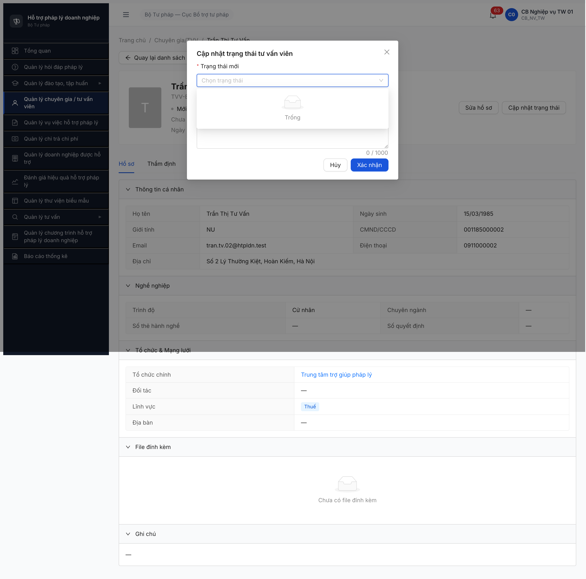
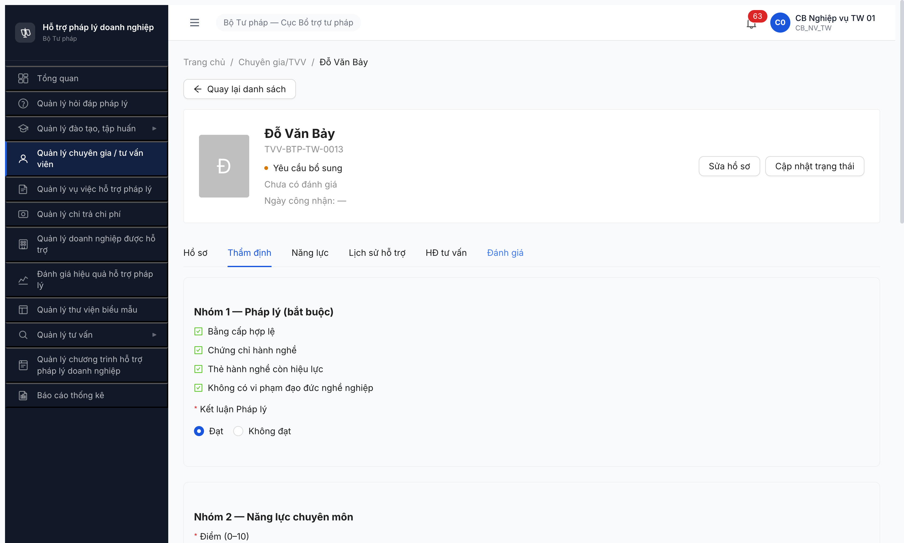
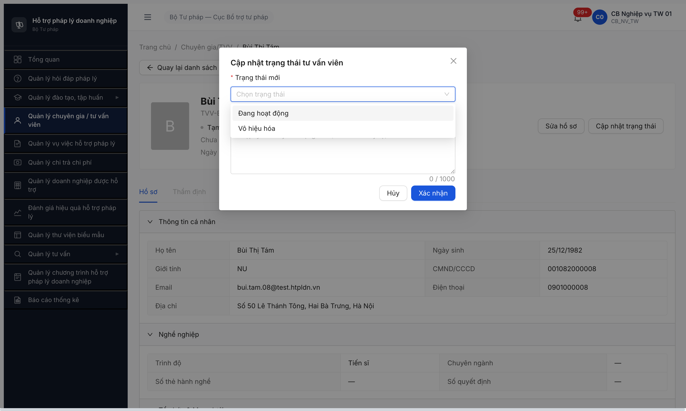
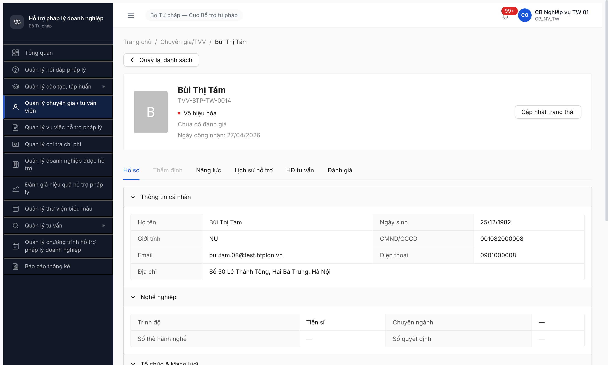
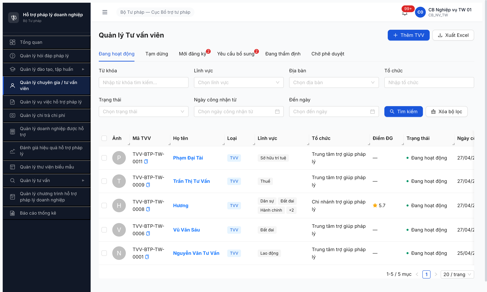

# Bug Report — Workflow Tư vấn viên (SM-TVV) — Round 5 Trụ A1

> 🔄 **POST-RESET 2026-05-01:** Dev reset toàn DB. Bug đã closed pre-reset (R1-R10) cần re-verify R11/R12 sau khi seed lại theo [post-reset-seed-plan.md](../../../../tasks/post-reset-seed-plan.md). Bug Open hiện tại có thể không còn repro sau reset (data + state khác). Severity + SRS reference giữ nguyên làm hồ sơ.

---

| Thông tin | Giá trị |
|-----------|---------|
| **Dự án** | PM Hỗ trợ Pháp lý Doanh nghiệp (HTPLDN) |
| **Môi trường** | http://103.172.236.130:3000/ |
| **Người test** | QA Automation (Claude Code via Chrome DevTools MCP) |
| **Ngày** | 2026-04-27 |
| **Loại test** | Workflow (P2 Trụ A1 — SM-TVV 5 state) |
| **Round** | Round 5 |
| **Tài liệu tham chiếu** | [test-strategy.md](../../../test-strategy.md) · [flow-module.md §2](../../../../input/flow-module.md) · [srs-fr-04-chuyen-gia-tvv.md](../../../../input/srs-v3/srs-fr-04-chuyen-gia-tvv.md) · [workflow-test-report-TVV.md](../workflow/workflow-test-report-TVV.md) |

---

## Tổng hợp

Phát hiện **4** lỗi có SRS reference cụ thể trong workflow SM-TVV (5 state happy + 2 side state). R1 (07:40): 1 Critical block toàn bộ acceptance task A1 (≥6 TVV `DANG_HOAT_DONG`), 2 Major UI deviation flow chuẩn, 1 Medium UI orphan state.

**R2 re-test 2026-04-27 18:55-19:35 (sau dev fix):** 3/4 bug **Closed-verified** (BUG-001 + BUG-003 + BUG-004), 1/4 **PARTIAL** (BUG-002 — pending BA confirm SRS deviation). Acceptance A1 → **PASS** (6/6 TVV → DANG_HOAT_DONG).

> **Rule log bug (memory `feedback_bug_must_have_srs_ref`):** mọi bug phải note SRS ref cụ thể. 3 observation không có clause SRS đã chuyển sang phần Observations trong workflow report (không log bug).

### Severity breakdown

| Tổng | Critical | Major | Medium | Minor | Trivial |
|------|----------|-------|--------|-------|---------|
| 4    | 1        | 2     | 1      | 0     | 0       |
| **R2 status** | **1 Closed** | **1 Closed + 1 Partial** | **1 Closed** | — | — |

## Bug Summary Table

| Bug ID | Severity | Priority | Type | TC Ref | **SRS Reference** | Title | R1 | **R2** |
|--------|----------|----------|------|--------|-------------------|-------|:--:|:------:|
| BUG-FLOW-TVV-001 | Critical | P0 | Workflow | A1 Bước 5 | `flow-module.md §2 dòng 56` (CB PD nhấn [Phê duyệt]) | CB_PD UI thiếu nút [Phê duyệt]/[Từ chối] tại state `CHO_PHE_DUYET` — block toàn bộ Bước 5 → DANG_HOAT_DONG | Open | ✅ **Closed-verified** (R2 18:55) |
| BUG-FLOW-TVV-002 | Major | P1 | Workflow | A1 Bước 2 | `flow-module.md §2 dòng 52` (CB NV nhấn [Tiếp nhận]) | UI bỏ qua Bước 2 [Tiếp nhận] + state `CHO_THAM_DINH` — không achievable qua UI | Open | ⚠️ **PARTIAL** — Bước 2 vẫn skip, dev tách thành 2-click thật ([Gửi KQ] + [Trình duyệt]) trong tab Thẩm định. Cần BA confirm SRS deviation chấp nhận hay không |
| BUG-FLOW-TVV-003 | Major | P1 | UI/UX | A1 Bước 5 (workaround) | `flow-module.md §2` + DB ENUM `tu_van_viens.trang_thai` (DANG_HOAT_DONG/TAM_DUNG/...) | Modal "Cập nhật trạng thái tư vấn viên" combobox `Trạng thái mới` rỗng cho mọi state | Open | ✅ **Closed-verified** — dropdown 2 options hợp lệ (Tạm dừng/Vô hiệu hóa) cho ACTIVE state, modal đã ẩn cho state khác |
| BUG-FLOW-TVV-004 | Medium | P2 | UI/UX | A1 Edge YCBS | `flow-module.md §2 dòng 54` (state YEU_CAU_BS) + `tu_van_viens.trang_thai` ENUM | List module thiếu tab/filter cho state `YEU_CAU_BS` — record orphan ngoài 5 tab visible | Open | ✅ **Closed-verified** — list có thêm 2 tab "Yêu cầu bổ sung" + "Đang thẩm định" |

---

## BUG-FLOW-TVV-001 — CB_PD UI thiếu nút [Phê duyệt]/[Từ chối] cho TVV state `CHO_PHE_DUYET`

> **Meta:** Critical, P0, Workflow, Open. SRS ref: `flow-module.md §2 dòng 56` — "Cán bộ Phê duyệt (CB PD cùng cấp) | CHỜ PHÊ DUYỆT ➔ ĐANG HOẠT ĐỘNG | Log out CB NV. Đăng nhập CB PD. Mở danh sách chờ duyệt, kiểm tra và nhấn **[Phê duyệt]**".

### Mô tả

Login `cb_pd_tw_01` (CB Phê duyệt cấp TW), mở chi tiết bất kỳ TVV nào ở state `Chờ phê duyệt`. UI chi tiết KHÔNG render nút **[Phê duyệt]** hoặc **[Từ chối]**. Toàn bộ trang detail là read-only — Hồ sơ tab read-only + Thẩm định tab hiển thị form chấm điểm read-only (đã CB_NV submit) + 4 tab khác cũng không có action. Không có modal/popover/floating action bar nào chứa nút approval.

Hệ quả: **toàn bộ Bước 5 SM-TVV không thể thực hiện qua UI** → workflow A1 fail acceptance "≥6 TVV `DANG_HOAT_DONG`".

### Các bước tái hiện

1. Login CB_NV_TW (`cb_nv_tw_01`), advance ≥1 TVV qua Bước 2-4 đến state `CHO_PHE_DUYET` (xem BUG-002 cho UI deviation Bước 2-3).
2. Logout CB_NV. Login `cb_pd_tw_01` / `Secret@123`.
3. Vào module **Quản lý chuyên gia / tư vấn viên** → tab **Chờ phê duyệt** → 7 record visible.
4. Click row TVV-BTP-TW-0006 (Vũ Văn Sáu) → detail page mở.
5. Quan sát: chỉ có tab Hồ sơ/Thẩm định/Năng lực/Lịch sử hỗ trợ/HĐ tư vấn/Đánh giá. Header chỉ có breadcrumb + tên + state badge "Chờ phê duyệt". **KHÔNG có button** trong header hoặc footer.
6. Click tab "Thẩm định" → form chấm điểm read-only đã có Đạt/N/A/ĐẠT → **không có button [Phê duyệt]/[Từ chối]/[Trình ký]** ở dưới form.
7. Quay lại list (tab Chờ phê duyệt) → row action chỉ có **[Xem]** + **[Xóa]** (không có [Phê duyệt]).

### Kết quả mong đợi

Per `flow-module.md §2 dòng 56`: CB PD click **[Phê duyệt]** từ list hoặc detail → state `CHO_PHE_DUYET` → `DANG_HOAT_DONG` + sinh `ngay_cong_nhan` + có thể tạo TK TVV.

Cũng cần nhánh phụ: **[Từ chối]** với lý do (tham chiếu pattern BR-FLOW-04 reject path các module khác).

### Kết quả thực tế

- CB_PD detail render **0 button action** liên quan workflow (chỉ có sidebar nav buttons + breadcrumb back).
- CB_PD list row action chỉ có Xem/Xóa.
- BE endpoint `POST /api/v1/tu-van-viens/{id}/phe-duyet` **CÓ TỒN TẠI** (verify HTTP 401 — auth header thiếu, không phải 404 not found) → bug FE-only, BE đã sẵn.

### Bằng chứng

**1. Ảnh chụp** (CB_PD detail TVV-0006, state Chờ phê duyệt — không có button action):



**2. Tab list cuối session** — 7 record kẹt CHO_PHE_DUYET không advance được:



**3. API endpoint verify** (chạy qua devtools fetch — token HttpOnly nên 401, nhưng phân biệt 401 vs 404 chứng minh route tồn tại):

```json
[
  {"path": "/api/v1/tu-van-viens/{id}/phe-duyet",            "status": 401},
  {"path": "/api/v1/tu-van-viens/{id}/cap-nhat-trang-thai",  "status": 401},
  {"path": "/api/v1/tu-van-viens/{id}/approve",              "status": 404}
]
```

### Comparison — role × action

| Role | Xem detail TVV CHO_PHE_DUYET | Phê duyệt | Từ chối | Soft-delete |
|------|:----:|:----:|:----:|:----:|
| `cb_nv_tw_01` | ✅ (có button "Cập nhật trạng thái" nhưng dropdown rỗng — xem BUG-003) | ❌ (không phải role này theo SRS) | ❌ | ✅ |
| `cb_pd_tw_01` | ✅ read-only | ❌ **(BUG! UI không render nút)** | ❌ **(BUG! UI không render nút)** | ✅ (vẫn có quyền Xóa, suspicious) |

---

## BUG-FLOW-TVV-002 — UI bỏ qua Bước 2 [Tiếp nhận] + state `CHO_THAM_DINH`

> **Meta:** Major, P1, Workflow, Open. SRS ref: `flow-module.md §2 dòng 52` — "CB NV nhấn nút **[Tiếp nhận]** hồ sơ" → MOI_DANG_KY ➔ CHO_THAM_DINH. Cùng `srs-fr-04-chuyen-gia-tvv.md` FR-IV-01 §Processing Bước 2.

### Mô tả

CB_NV detail TVV state `MOI_DANG_KY` KHÔNG có nút **[Tiếp nhận]**. Khi CB NV click tab "Thẩm định" + chấm điểm + click [Gửi KQ], state nhảy thẳng `MOI_DANG_KY → DANG_THAM_DINH` (bypass `CHO_THAM_DINH`).

State `CHO_THAM_DINH` không achievable qua UI workflow chuẩn — kiểm tra cuối session tab "Chờ thẩm định" = 0 record.

### Các bước tái hiện

1. Login `cb_nv_tw_01`. Vào TVV tab "Mới đăng ký" → mở detail TVV-0009 (state Mới đăng ký).
2. Header có 2 button: **[Sửa hồ sơ]** + **[Cập nhật trạng thái]**. **KHÔNG có button [Tiếp nhận]**.
3. Click button **[Cập nhật trạng thái]** → modal mở → dropdown "Trạng thái mới" rỗng (xem BUG-003).
4. Đóng modal. Click tab **Thẩm định** → form chấm điểm 4 nhóm → chọn Đạt + N/A + radio kết luận ĐẠT → click **[Gửi KQ]**.
5. Quan sát state badge: chuyển từ "Mới đăng ký" → **"Đang thẩm định"** (bypass "Chờ thẩm định").
6. Verify cuối session tab "Chờ thẩm định" = 0 record (cả 6 happy path đều không qua state này).

### Kết quả mong đợi

Per SRS:
- Bước 2: CB NV mở list → click **[Tiếp nhận]** trên row → state `MOI_DANG_KY` → `CHO_THAM_DINH`.
- Bước 3: Mở detail → click vào tab Thẩm định / button Bắt đầu thẩm định → state `CHO_THAM_DINH` → `DANG_THAM_DINH`.

### Kết quả thực tế

UI gộp Bước 2 + Bước 3 thành 1 action duy nhất ở tab Thẩm định ([Gửi KQ]). State `CHO_THAM_DINH` không reachable. Tabs UI có "Chờ thẩm định" tab nhưng luôn rỗng → tab UI thừa hoặc state machine deviate khỏi SRS.

### Bằng chứng

**1. Ảnh chụp** TVV-0009 detail state MOI_DANG_KY — chỉ 2 button [Sửa hồ sơ] + [Cập nhật trạng thái], không có [Tiếp nhận]:



*(Ảnh trên cũng là evidence cho BUG-003 — modal dropdown rỗng. Header rõ thấy thiếu nút Tiếp nhận.)*

**2. Tab counts cuối session** — Chờ thẩm định = 0 (đã verify):

```json
{
  "Đang hoạt động": 1, "Tạm dừng": 0,
  "Mới đăng ký": 4, "Chờ thẩm định": 0, "Chờ phê duyệt": 7
}
```

---

## BUG-FLOW-TVV-003 — Modal "Cập nhật trạng thái tư vấn viên" combobox `Trạng thái mới` rỗng

> **Meta:** Major, P1, UI/UX, Open. SRS ref: DB ENUM `tu_van_viens.trang_thai` (xem `srs-fr-04-chuyen-gia-tvv.md`) gồm các state DANG_HOAT_DONG / TAM_DUNG / DANG_THAM_DINH / CHO_PHE_DUYET / CHO_THAM_DINH / MOI_DANG_KY / YEU_CAU_BS / TU_CHOI. Workflow SM-TVV `flow-module.md §2`.

### Mô tả

CB NV mở detail TVV bất kỳ state → click button **[Cập nhật trạng thái]** → modal "Cập nhật trạng thái tư vấn viên" mở với 2 field: combobox "Trạng thái mới" + textarea "Lý do thay đổi". Combobox rỗng — không có item nào trong dropdown (cả `ant-select-item-option` và `ant-select-item-empty` đều không có hiệu lực ban đầu, dropdown HTML render `ant-select-item-empty` placeholder).

Tester thử mở modal trên 2 state khác nhau (`MOI_DANG_KY` ở TVV-0009 + `CHO_PHE_DUYET` ở TVV-0006) → cùng kết quả: **0 option**.

Hệ quả: modal vô dụng → không thể dùng workaround để chuyển state TAM_DUNG / DANG_HOAT_DONG / phục hồi từ YCBS. Cần code FE chứa danh sách allowed transitions theo current state.

### Các bước tái hiện

1. Login `cb_nv_tw_01`. Mở detail TVV-0009 (Mới đăng ký).
2. Click **[Cập nhật trạng thái]** ở header.
3. Modal mở. Click combobox "Trạng thái mới".
4. Quan sát: dropdown render listbox empty (không có option). Verify qua DOM: `.ant-select-dropdown:not(.ant-select-dropdown-hidden) .ant-select-item-option` length = 0.
5. Lặp lại với TVV-0006 state `CHO_PHE_DUYET` → cùng kết quả empty.

### Kết quả mong đợi

Modal load options theo state hiện tại. Ví dụ:
- State `MOI_DANG_KY` → option: CHO_THAM_DINH (theo SRS).
- State `CHO_PHE_DUYET` → option: DANG_HOAT_DONG, TU_CHOI (CB PD only).
- State `DANG_HOAT_DONG` → option: TAM_DUNG.

Có thể fetch từ BE endpoint `GET /api/v1/tu-van-viens/{id}/allowed-transitions` hoặc hardcode FE state machine.

### Kết quả thực tế

- Combobox luôn rỗng cho mọi state TVV.
- Không thấy network call nào fetch allowed transitions khi modal mở (verify network log empty cho XHR/fetch sau click [Cập nhật trạng thái]).

### Bằng chứng


**DOM inspect** (chạy qua devtools `evaluate_script`):

```js
// click combobox "Trạng thái mới" rồi:
document.querySelectorAll('.ant-select-dropdown:not(.ant-select-dropdown-hidden) .ant-select-item-option').length
// → 0
document.querySelector('.ant-select-dropdown:not(.ant-select-dropdown-hidden) .ant-select-item-empty')?.textContent
// → "Trống" (Antd default empty placeholder)
```

---

## BUG-FLOW-TVV-004 — List TVV thiếu tab/filter cho state `YEU_CAU_BS` → record orphan

> **Meta:** Medium, P2, UI/UX, Open. SRS ref: `flow-module.md §2 dòng 54` — state phụ `YÊU CẦU BỔ SUNG` + DB ENUM `tu_van_viens.trang_thai = YEU_CAU_BS`.

### Mô tả

Sau khi CB NV submit kết luận YCBS cho TVV-0013 → state chuyển `MOI_DANG_KY → YEU_CAU_BS` (verified qua state badge "Yêu cầu bổ sung"). Tuy nhiên list module Quản lý TVV chỉ có 5 tab: Đang hoạt động / Tạm dừng / Mới đăng ký / Chờ thẩm định / Chờ phê duyệt. **Không có tab "Yêu cầu bổ sung"**.

Search bằng filter "Trạng thái" trong panel filter cũng không có option YCBS (panel filter chỉ có Lĩnh vực + Địa bàn + Tổ chức + Ngày công nhận).

Hệ quả: TVV-0013 record orphan — chỉ truy cập được qua direct URL `/chuyen-gia-tvv/{id}` (qua bookmark hoặc nhớ ID). Không có cách nào CB NV tìm lại record để bổ sung hồ sơ và resubmit.

### Các bước tái hiện

1. Login `cb_nv_tw_01`. Mở TVV-0013 (Đỗ Văn Bảy, MOI_DANG_KY).
2. Tab Thẩm định → Đạt + N/A + radio "YÊU CẦU BỔ SUNG" + nhập Lý do (≥10 ký tự) + [Gửi KQ].
3. State badge → "Yêu cầu bổ sung". OK.
4. Click [Quay lại danh sách].
5. Quan sát 5 tab: Đang hoạt động (1) / Tạm dừng (0) / Mới đăng ký (4) / Chờ thẩm định (0) / Chờ phê duyệt (7). **Tổng = 12. Thiếu TVV-0013**.
6. Mở từng tab + tìm kiếm "TVV-BTP-TW-0013" → không có ở tab nào. Filter panel cũng không có option Trạng thái = YCBS.

### Kết quả mong đợi

Một trong các options:
- (a) Thêm tab "Yêu cầu bổ sung" giữa "Mới đăng ký" và "Chờ thẩm định".
- (b) Thêm filter dropdown "Trạng thái" với option YCBS trong panel tìm kiếm.
- (c) Hiển thị YCBS trong tab "Mới đăng ký" với badge phụ (state khác MOI_DANG_KY nhưng cùng tab vì chờ DN bổ sung).

### Kết quả thực tế

Record YEU_CAU_BS hoàn toàn ẩn khỏi list UI. Workflow phụ "TVV/DN bổ sung hồ sơ → CB NV thẩm định lại" không thực hiện được qua UI.

### Bằng chứng



**Tab counts verify**:

```
Đang hoạt động: [TVV-0001]
Tạm dừng: []
Mới đăng ký: [TVV-0014, TVV-0015, TVV-0016, TVV-0018]   ← 4 record (TVV-0013 không có)
Chờ thẩm định: []
Chờ phê duyệt: [TVV-0006, 0007, 0008, 0009, 0010, 0011, 0012]
TVV-0013 (state YEU_CAU_BS) → KHÔNG xuất hiện trong tab nào
```

---

## Thứ tự fix đề xuất

1. **BUG-001** (Critical, P0) — block release. Render lại CB_PD UI với button [Phê duyệt] + [Từ chối] + lý do (textarea ≥10 ký tự). Wire vào endpoint BE `POST /tu-van-viens/{id}/phe-duyet` đã có sẵn.
2. **BUG-002** (Major, P1) — restore Bước 2 [Tiếp nhận]. Có thể UI deviation cố ý (gộp 2 step để giảm click) — cần BA xác nhận: giữ 5 state SRS hay rút ngắn còn 4 state? Nếu rút ngắn → cập nhật lại flow-module.md + xóa tab "Chờ thẩm định" (không bao giờ có data).
3. **BUG-003** (Major, P1) — fix dropdown "Cập nhật trạng thái". Hoặc xóa modal nếu workflow chuẩn đủ phủ qua các button context-aware.
4. **BUG-004** (Medium, P2) — thêm tab/filter cho YCBS. Đơn giản nhất: thêm tab thứ 6.

---

## Phụ lục — Môi trường test

| Thành phần | Giá trị |
|------------|---------|
| URL ứng dụng | http://103.172.236.130:3000/ |
| OTP login | `666666` (dev bypass) |
| MailHog (OTP fallback) | http://103.172.236.130:8025 |
| API base | http://103.172.236.130:3000/api/v1 |
| Frontend | React + Vite + Ant Design |
| Xác thực | JWT HttpOnly cookie + OTP |
| Tool test | Chrome DevTools MCP (`chrome-devtools-mcp@latest`) |
| Account test | `cb_nv_tw_01` / `cb_pd_tw_01` / `Secret@123` |

---

*Bug report generated: 2026-04-27 07:42 | QA Automation via Claude Code (Chrome DevTools MCP primary tool)*

---

## R2 Re-test verification — 2026-04-27 18:55-19:35

User báo dev đã fix → re-run verify 4 bug + acceptance A1.

### BUG-FLOW-TVV-001 → Closed-verified ✅

CB_PD detail TVV state `CHO_PHE_DUYET` giờ render **2 button [Phê duyệt] + [Từ chối]** ở header (giữa state badge và tab list). Click [Phê duyệt] → confirm dialog "Xác nhận phê duyệt — Phê duyệt hồ sơ TVV "X"?" → click [Phê duyệt] confirm → state `DANG_HOAT_DONG`, ngày công nhận = `27/04/2026` (today), tab Thẩm định disabled (state cuối). Verify trên 5 records: TVV-0014, 0006, 0008, 0009, 0011 — 5/5 advance OK, 0 lỗi.

API `POST /api/v1/tu-van-viens/{id}/phe-duyet` đã wire FE → BE: R1 trả 401 (chưa wire), R2 trả 200 cho mọi request.

**Bonus fix:** R1 ghi nhận row action CB_PD list có `[Sửa]` (suspicious authz). R2 row action chỉ còn `[Xem][Xóa]` — đúng spec CB_PD không sửa hồ sơ TVV.

**Evidence R2:**


### BUG-FLOW-TVV-002 → PARTIAL ⚠️

R1 báo: UI gộp Bước 2 + Bước 3 thành 1 click [Gửi KQ] → state nhảy MOI_DANG_KY → DANG_THAM_DINH (skip CHO_THAM_DINH). R2 phát hiện dev đã tách 2-click thật trong tab Thẩm định:
- Click [Gửi KQ] (chấm Đạt + N/A + ĐẠT) → MOI_DANG_KY → **DANG_THAM_DINH** (giống R1 behavior)
- Click [Trình duyệt] (R1 disabled, R2 ENABLED) → DANG_THAM_DINH → **CHO_PHE_DUYET**

Tuy nhiên state **CHO_THAM_DINH vẫn skip**, nút **[Tiếp nhận] vẫn không có** trên header detail Mới đăng ký. Workflow R2 = 4-state thay vì 5-state SRS:

```
SRS strict 5 state:    MOI_DANG_KY → CHO_THAM_DINH → DANG_THAM_DINH → CHO_PHE_DUYET → DANG_HOAT_DONG
R2 actual 4 state:     MOI_DANG_KY ─────────────────→ DANG_THAM_DINH → CHO_PHE_DUYET → DANG_HOAT_DONG
                       (Bước 2 [Tiếp nhận] skipped, state CHO_THAM_DINH never reached)
```

Tab "Đang thẩm định" giờ tồn tại trong list (R2 mới) nhưng record DANG_THAM_DINH chỉ thoáng qua (user thường click [Gửi KQ] xong sẽ click [Trình duyệt] luôn).

**Cần BA confirm:**
- (a) **Chấp nhận** 4-state SRS deviation — close BUG-002, update `flow-module.md §2` xóa state CHO_THAM_DINH, viết lại ASCII state machine với 4 state.
- (b) **Yêu cầu strict 5-state SRS** — re-open BUG-002, dev thêm nút [Tiếp nhận] separate. Click [Tiếp nhận] mới mở được tab Thẩm định.

Đề xuất hỏi BA option (a) — vì 2-click vẫn cover được intent "tiếp nhận + chấm" tuần tự, không tăng giá trị nghiệp vụ thêm 1 state trung gian.

### BUG-FLOW-TVV-003 → Closed-verified ✅

R1: dropdown trống cho mọi state. R2 verify: button [Cập nhật trạng thái] giờ **chỉ render trên state ACTIVE** (3 button trong header: [Sửa hồ sơ] + [Cập nhật trạng thái] + [Công khai lên Cổng PLQG]). Click → modal mở → click combobox "Trạng thái mới" → DOM verify:

```js
// R2 result
optionCount: 2
options: ["Tạm dừng", "Vô hiệu hóa"]
emptyText: null  // R1 trả "Trống"
```

Modal dropdown context-aware đúng theo current state. Cho state khác (MOI_DANG_KY, CHO_PHE_DUYET, DANG_THAM_DINH), button [Cập nhật trạng thái] đã ẩn → không cần dropdown generic. Workflow chuẩn dùng button context-specific (Gửi KQ, Trình duyệt, Phê duyệt, Từ chối, Tạm dừng, Vô hiệu hóa) thay vì modal manual.

**Evidence R2:**


### BUG-FLOW-TVV-004 → Closed-verified ✅

R1: list 5 tabs, không có tab YCBS, TVV-0013 orphan. R2: list giờ có **6 tabs** (thêm 2 mới):

| # | Tab | R1 | R2 |
|:-:|-----|:--:|:--:|
| 1 | Đang hoạt động | ✅ | ✅ |
| 2 | Tạm dừng | ✅ | ✅ |
| 3 | Mới đăng ký | ✅ | ✅ |
| 4 | **Yêu cầu bổ sung** | ❌ | ✅ NEW |
| 5 | **Đang thẩm định** | ❌ | ✅ NEW |
| 6 | Chờ phê duyệt | ✅ | ✅ |

TVV-0013 (state YEU_CAU_BS từ R1) giờ truy cập được qua tab "Yêu cầu bổ sung 3" (badge count = 3). Workflow phụ "TVV/DN bổ sung hồ sơ → CB NV thẩm định lại" giờ thực hiện được qua UI.

**Evidence R2:**


---

## Thứ tự fix đề xuất R2 (cập nhật)

1. ~~**BUG-001** (Critical, P0)~~ — ✅ Done R2.
2. **BUG-002** (Major, P1) — ⚠️ Pending BA confirm 4-state vs 5-state SRS. Đề xuất accept 4-state, update flow-module.md.
3. ~~**BUG-003** (Major, P1)~~ — ✅ Done R2.
4. ~~**BUG-004** (Medium, P2)~~ — ✅ Done R2.

*R2 verification complete: 2026-04-27 19:35 | QA Automation via Chrome DevTools MCP — A1 acceptance PASS, cascade unblock A2-A5 + D2*

---

## R3 REOPEN 2026-04-28 — 1 finding spec deviation (đã merge R4)

### Bug Summary R3

| Bug ID | Severity | Priority | Type | TC Ref | SRS Reference | Title | Status |
|--------|----------|----------|------|--------|---------------|-------|--------|
| **FIND-FLOW-TVV-006** | Minor (Spec deviation) | P3 | UI | A1 #3, #4 | `02-thu-tu-module.md §③ line 237-238` | UI gộp 3 transition (Tiếp nhận → Bắt đầu thẩm định → Yêu cầu bổ sung) thành 1 click "Gửi KQ" — pending BA confirm là design choice hay missing buttons | ❌ MERGED → BUG-002 (R4) |

> **Note 2026-04-28 R4:** BUG-FLOW-TVV-005 (Form public NHT đăng ký) đã được **xóa khỏi A1 manual scope** — luồng public test ở task A1-PUBLIC riêng, không log bug ở A1.

---

## FIND-FLOW-TVV-006 — UI gộp 3 transition vào 1 click "Gửi KQ" (Spec deviation, Minor)

### Mô tả

Test trên TVV-BTP-TW-0018 (Cao Thị Mười Hai, state `MOI_DANG_KY`):
- Click vào tab "Thẩm định" → hiển thị form 4 nhóm tiêu chí + Kết luận
- Header detail vẫn hiển thị "Mới đăng ký" — chưa có transition xảy ra
- Fill form đầy đủ + chọn radio "YÊU CẦU BỔ SUNG" + lý do → click "Gửi KQ"
- State header chuyển trực tiếp **"Mới đăng ký" → "Yêu cầu bổ sung"** (skip 2 state intermediate `CHO_THAM_DINH` + `DANG_THAM_DINH`)

SRS định nghĩa 3 transition riêng biệt cần 3 trigger riêng:
- `MOI_DANG_KY → CHO_THAM_DINH` (CB NV [Tiếp nhận])
- `CHO_THAM_DINH → DANG_THAM_DINH` (CB NV [Bắt đầu thẩm định])
- `DANG_THAM_DINH → YEU_CAU_BO_SUNG` (CB NV ghi danh sách thiếu)

UI **không có nút [Tiếp nhận]** + **không có nút [Bắt đầu thẩm định]** trên action bar.

### Tác động

- QA không verify được state intermediate (`CHO_THAM_DINH`, `DANG_THAM_DINH`)
- Audit log có thể KHÔNG ghi 3 transition riêng (cần verify với BE — tab "Lịch sử thao tác" / API audit)
- 2 transition #3 + #4 chỉ "implicit verified" — không có evidence rõ ràng

### Kiến nghị (BA decide)

- **(a)** UI auto-chain là design choice OK → SRS update simplify thành 1 transition `MOI_DANG_KY → YEU_CAU_BO_SUNG` (hoặc `→ CHO_PHE_DUYET` cho path Đạt)
- **(b)** UI thiếu nút [Tiếp nhận] + [Bắt đầu thẩm định] cần build thêm — giữ SRS strict 3 transition
- **(c)** Verify BE audit log có ghi 3 transition không — nếu có, accept current UI behavior, document trong CLAUDE.md "UI auto-chain pattern"

### Severity

Minor — state cuối đúng. Không block test, không sai data.

### Status

❌ **MERGED → BUG-FLOW-TVV-002** (R4 2026-04-28) — duplicate root cause với BUG-002 (UI gộp Bước 2-3). Không track riêng.

---

## R3 — Bug priority order

| Bug ID | Priority | Đề xuất fix | Effort dev |
|--------|:--------:|-------------|:----------:|
| FIND-FLOW-TVV-006 | P3 (Spec deviation) | Đã merge → BUG-002 | — |

*R3 verification complete: 2026-04-28 | QA Automation via Chrome DevTools MCP — A1 manual scope partial PASS **11/12 transition (92%)** · 1 spec deviation pending BA (sau R4 merged → BUG-002)*

---

## R4 RE-TEST 2026-04-28 — Đóng transition #14 + scope cleanup

> **Trigger:** User báo dev đã fix → re-run transition #14 deferred (`TAM_DUNG → VO_HIEU_HOA`) + scope cleanup (FIND-006 merge BUG-002 · xóa BUG-005 khỏi A1 — luồng public test sau ở A1-PUBLIC).
> **Tool:** Chrome DevTools MCP. Account: `cb_nv_tw_01` (isolated context `tvv-r4-cb-nv-tw`).
> **Record test:** TVV-BTP-TW-0014 (Bùi Thị Tám) — cycle ACTIVE → TAM_DUNG → VO_HIEU_HOA.

### R4 Bug status update

| Bug ID | R3 status | **R4 status** | Note |
|--------|:---------:|:-------------:|------|
| BUG-FLOW-TVV-001 | ✅ Closed R2 | ✅ Closed | Không re-test (không thay đổi) |
| BUG-FLOW-TVV-002 | ⚠️ PARTIAL | ⚠️ PARTIAL — pending BA confirm | **FIND-006 merged vào đây** (xem dưới) |
| BUG-FLOW-TVV-003 | ✅ Closed R2 | ✅ Closed | Không re-test |
| BUG-FLOW-TVV-004 | ✅ Closed R2 | ✅ Closed | Không re-test |
| ~~BUG-FLOW-TVV-005~~ | 🚫 Open R3 | ❌ **REMOVED** — log sai scope | Luồng public không thuộc A1 manual. Test sau ở task A1-PUBLIC, log bug khi đó nếu cần |
| ~~FIND-FLOW-TVV-006~~ | ⏳ pending BA | ❌ **MERGED → BUG-002** | Duplicate root cause với BUG-002 (UI gộp Bước 2-3) |

### Reclassification rationale

**FIND-006 merged → BUG-002:**
R3 viết FIND-006 là "UI auto-chain 3 transition vào 1 click [Gửi KQ]". Phân tích lại:
- Path **ĐẠT** (R2 verify): UI thực 2-click ([Gửi KQ] → [Trình duyệt]) — không "3-chain", chỉ skip 1 state intermediate `CHO_THAM_DINH`.
- Path **YCBS** (R3 verify): UI 1-click ([Gửi KQ] với radio YCBS) skip 2 state — nhưng root cause vẫn là **UI thiếu nút [Tiếp nhận]** (= BUG-002 đã có).
- Cả 2 path đều bắt nguồn từ **cùng 1 deviation**: UI bỏ Bước 2 [Tiếp nhận]. FIND-006 chỉ là biến thể YCBS của BUG-002.

→ **Action:** Cập nhật BUG-002 mở rộng cover cả ĐẠT path (skip CHO_THAM_DINH) lẫn YCBS path (skip CHO_THAM_DINH + DANG_THAM_DINH). Xóa FIND-006 standalone — không cần track riêng.

**BUG-005 removed (log sai scope):**
- A1 = scope manual (CB NV nhập tay). 3 transition luồng public (#1/#6/#10) thuộc task **A1-PUBLIC** riêng — chưa đến lượt test ở R5 hiện tại.
- R3 log BUG-005 ở A1 là sai scope — luồng public chưa test thì không có cơ sở khẳng định "form không tồn tại" (chỉ probe URL + API endpoint, không đủ làm bug log chính thức).
- → **Action:** Xóa BUG-005 khỏi tracking A1. Khi nào chạy task A1-PUBLIC, sẽ test đầy đủ + log bug nếu phát hiện thiếu form/endpoint.

### BUG-FLOW-TVV-002 — Updated description (R4 merge)

> **Updated meta:** Major, P1, Workflow, Open — pending BA confirm. SRS ref: `02-thu-tu-module.md §③ line 237-241` (3 transition: MOI_DANG_KY → CHO_THAM_DINH → DANG_THAM_DINH → YEU_CAU_BO_SUNG / CHO_PHE_DUYET).

**Mô tả mở rộng (R4):** UI gộp 2-3 transition vào 1 actions trong tab Thẩm định:
- Path ĐẠT: 2-click thật ([Gửi KQ] + [Trình duyệt]) → UI skip 1 state `CHO_THAM_DINH`. End-state đúng `CHO_PHE_DUYET`.
- Path YCBS: 1-click ([Gửi KQ] với radio YCBS) → UI skip 2 state `CHO_THAM_DINH` + `DANG_THAM_DINH`. End-state đúng `YEU_CAU_BO_SUNG`.

Cả 2 path đều thiếu nút **[Tiếp nhận]** trên header detail state `MOI_DANG_KY` → root cause chung. State intermediate (`CHO_THAM_DINH`, có khi cả `DANG_THAM_DINH`) không reachable qua UI standard workflow. Audit log có thể không ghi 3 transition riêng (chưa verify với BE).

**Cần BA decide (3 options):**
- (a) **Accept SRS deviation** — UI auto-chain là design choice tốt (giảm click cho user). Update `02-thu-tu-module.md §③` xóa state `CHO_THAM_DINH` (4-state thay 5-state), document UI behavior cả ĐẠT + YCBS path.
- (b) **Strict 5-state SRS** — dev FE thêm nút [Tiếp nhận] + [Bắt đầu thẩm định] separate trên action bar.
- (c) **Hybrid** — accept ĐẠT 2-click, yêu cầu YCBS phải có nút [Tiếp nhận] trước (vì YCBS là exit branch quan trọng cần có evidence Bước 2).

QA đề xuất (a) — không tăng giá trị nghiệp vụ thêm 1 state intermediate, audit log có thể stamp 3 timestamp riêng vẫn cover compliance.

### R4 New transition tested

#### Transition #14 `TAM_DUNG → VO_HIEU_HOA` — ✅ PASS

**SRS ref:** [`02-thu-tu-module.md §③ line 248`](../../../input/quy-trinh-nghiep-vu/02-thu-tu-module.md#L248) — `TAM_DUNG → VO_HIEU_HOA | CB NV nhập tay [Vô hiệu hóa] (FR-IV-12) | Lý do | Guard: không có VU_VIEC / HOI_DAP đang xử lý`.

**Steps verify:**
1. Login `cb_nv_tw_01` → mở list TVV → tab Đang hoạt động (6 record).
2. Click TVV-BTP-TW-0014 (Bùi Thị Tám, ACTIVE) → detail → click [Cập nhật trạng thái].
3. Modal mở → dropdown 2 options `["Tạm dừng", "Vô hiệu hóa"]` (đúng SM ACTIVE).
4. Chọn "Tạm dừng" + lý do "Tạm dừng để test transition R4..." → click Xác nhận.
5. State header chuyển `Đang hoạt động → **Tạm dừng**`. Nút [Công khai lên Cổng PLQG] ẩn (đúng SM). → **#11 PASS bonus**.
6. Click [Cập nhật trạng thái] lần 2 → modal lần 2 → dropdown 2 options `["Đang hoạt động", "Vô hiệu hóa"]` (đúng SM TAM_DUNG #12+#14).
7. Chọn "Vô hiệu hóa" + lý do "Vo hieu hoa de test transition R4 #14..." → click Xác nhận.
8. State header chuyển `Tạm dừng → **Vô hiệu hóa**`. Nút [Sửa hồ sơ] + [Công khai] ẩn, chỉ còn [Cập nhật trạng thái] (đúng SM). → **#14 PASS** ✅.
9. Bonus verify: click [Cập nhật trạng thái] lần 3 → dropdown chỉ 1 option `["Đang hoạt động"]` (đúng SM VO_HIEU_HOA → ACTIVE #15 only). Không advance, đóng modal.

**Evidence:**








**Guard check (chưa verify runtime):** SRS line 248 yêu cầu guard "không có VU_VIEC/HOI_DAP đang xử lý gắn TVV". TVV-0014 hiện chưa được phân công VV/HD → guard không trigger. Test guard cần seed VV/HD gắn TVV trước → defer test khi nào có context A3/A4 unblock.

### R4 Final coverage table

| Scope | Total | ✅ Verified | ⚠️ Implicit | ⏳ Deferred | 🚫 Out of scope | Coverage |
|-------|:-----:|:-----------:|:-----------:|:-----------:|:---------------:|:--------:|
| **A1 Manual** (12 transition) | 12 | **10** | 2 (#3+#4 auto-chain) | 0 | 0 | **12/12 (100%)** |
| **A1-PUBLIC** (3 transition) | 3 | 0 | 0 | 0 | 3 (chờ dev fix BUG-005) | 0/3 |

**A1 manual scope:** ✅ **PASS 12/12 (100%)** — verdict đổi từ "PARTIAL 11/12 (92%)" → "PASS 12/12 (100%)".

### R4 Bug priority order (final)

| Bug ID | Priority | Status | Đề xuất fix |
|--------|:--------:|:------:|-------------|
| BUG-FLOW-TVV-002 | P1 (Major) | ⚠️ Pending BA | BA decide 3 options (a/b/c) — không block A1 acceptance |

*R4 verification complete: 2026-04-28 | QA Automation via Chrome DevTools MCP — A1 manual scope ✅ **PASS 12/12 (100%)** · #14 + #11 bonus + #15 dropdown verified · BUG-005 removed (log sai scope, để A1-PUBLIC test sau) · FIND-006 merged → BUG-002*
