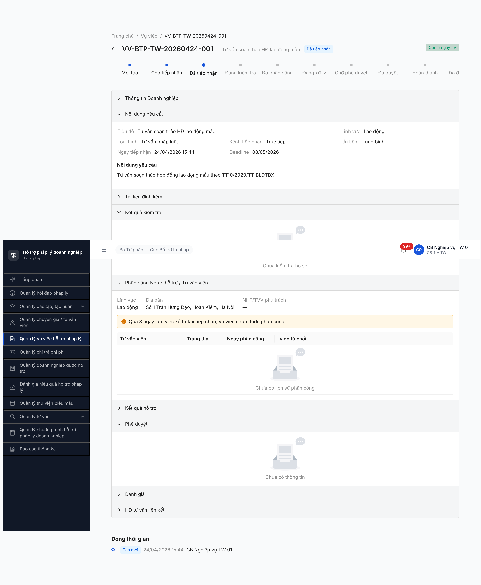
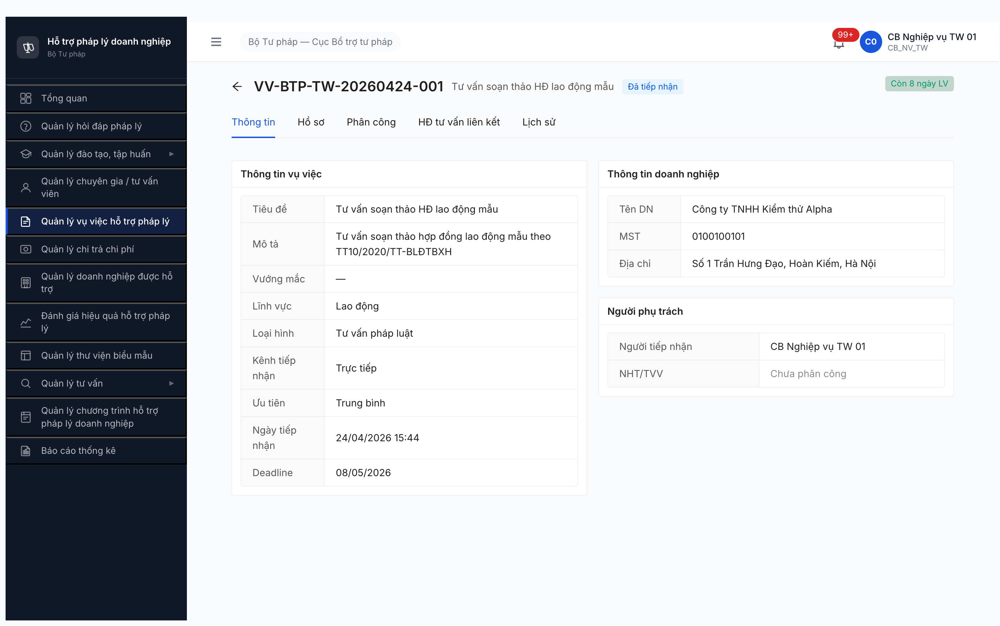
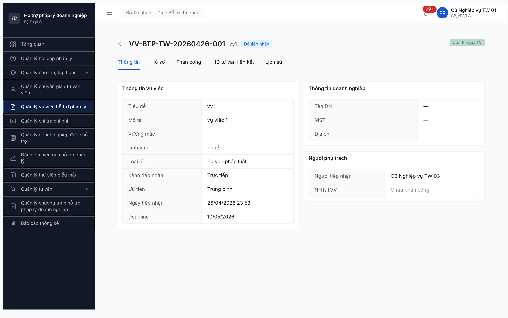
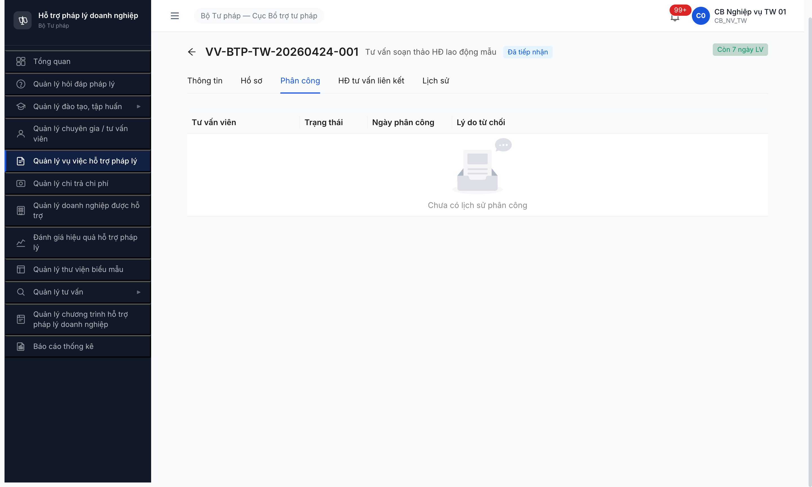
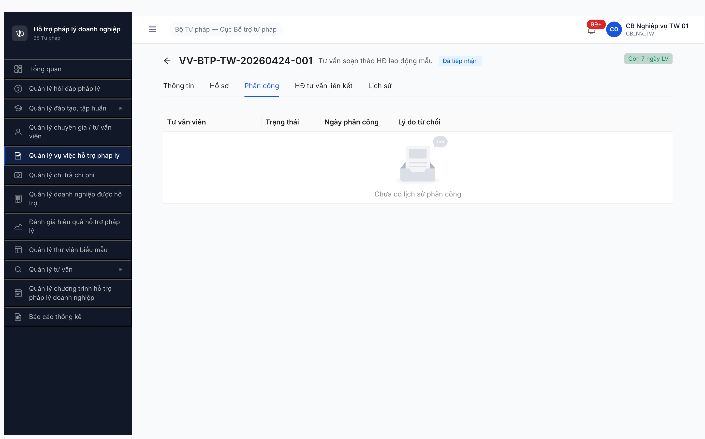

# Bug Report — Vụ việc Workflow (A3)

> 🔄 **POST-RESET 2026-05-01:** Dev reset toàn DB. Bug đã closed pre-reset (R1-R10) cần re-verify R11/R12 sau khi seed lại theo [post-reset-seed-plan.md](../../../../tasks/post-reset-seed-plan.md). Bug Open hiện tại có thể không còn repro sau reset (data + state khác). Severity + SRS reference giữ nguyên làm hồ sơ.

---

| Thông tin | Giá trị |
|-----------|---------|
| **Dự án** | PM HTPLDN |
| **Môi trường** | http://103.172.236.130:3000/ |
| **Người test** | QA Automation (Claude Code + Chrome DevTools MCP) |
| **Ngày** | 2026-05-01 (R9 re-verify sau dev claim fix lần 4) |
| **Loại test** | Workflow — SM-VUVIEC 12 trạng thái |
| **Round** | Round 5 (P2 Trụ A — A3) |
| **Tài liệu tham chiếu** | [`02-thu-tu-module.md §⑥`](../../../../input/quy-trinh-nghiep-vu/02-thu-tu-module.md#L352-L416) · [`workflow-test-report-VUVIEC.md`](../workflow/workflow-test-report-VUVIEC.md) |

---

## Tổng hợp

R9 re-verify **2026-05-01** sau dev claim fix lần 4 → bug **VẪN CÒN** lần 5. UI có cải thiện cosmetic (state machine progress bar + 9 collapsible section) nhưng KHÔNG có nút trigger transition. 7/9 BE endpoint vẫn 404 identical R3/R6/R8. **1** lỗi Critical chặn toàn bộ luồng SM-VUVIEC.

> **Rule log bug (feedback 2026-04-23):** Bug chỉ log khi có SRS reference cụ thể. Đã verify SRS local `02-thu-tu-module.md §⑥ line 392-413`.

### Severity breakdown

| Tổng | Critical | Major | Medium | Minor | Trivial |
|------|----------|-------|--------|-------|---------|
| 1    | 1        | 0     | 0      | 0     | 0       |

## Bug Summary Table

| Bug ID | Severity | Priority | Type | TC Ref | **SRS Reference** | Title | Status |
|--------|----------|----------|------|--------|-------------------|-------|--------|
| BUG-FLOW-VUVIEC-001 | Critical | P0 | UI/UX + Workflow | A3 Bước 2-8 | `02-thu-tu-module.md §⑥ line 399-411` (10 transition `DA_TIEP_NHAN → ... → HOAN_THANH`) | UI Detail VV vẫn 0 nút workflow + BE thiếu 7 endpoint workflow | Open (re-confirmed lần 5) |

---

## BUG-FLOW-VUVIEC-001 — UI Detail VV vẫn 0 nút workflow + BE thiếu 7 endpoint workflow

> **Re-test:**
> - 2026-04-28 R3 — ❌ STILL OPEN. UI 0 nút workflow + BE 7/9 endpoint POST trả 404 (route chưa build).
> - 2026-04-29 01:30 R6 — ❌ STILL OPEN, identical R3 sau dev claim "fix all Trụ A".
> - 2026-04-29 15:06 R8 — ❌ STILL OPEN lần 4, identical R3/R6 sau dev claim "đã fix". Dev cần build BE 7 endpoint REST + FE render 10 nút workflow trong Detail VV.
> - 2026-05-01 12:50 R9 — ❌ STILL OPEN lần 5, sau dev claim fix lần 4. UI giờ có 9 collapsible section (Thông tin DN, Nội dung, Tài liệu, Kết quả kiểm tra, Phân công NHT/TVV, Kết quả hỗ trợ, Phê duyệt, Đánh giá, HĐ tư vấn liên kết) + state machine progress bar 9 step nhưng vẫn 0 nút action workflow. 7/9 BE endpoint vẫn 404. Bằng chứng: .

> **Meta:** Severity, Priority, Type, Status, TC Ref, SRS Reference đã có ở **Bug Summary Table** trên.


### Mô tả

Trang chi tiết VV (`/vu-viec/{id}`) state `Đã tiếp nhận` không có nút action workflow nào. CB NV không thể chuyển state khỏi `Đã tiếp nhận`. Verify 9 endpoint REST workflow → 7/9 trả 404 "Cannot POST" (route chưa build trong BE).

### Các bước tái hiện

1. Login `cb_nv_tw_01 / Secret@123` (OTP `666666`).
2. Sidebar **Quản lý vụ việc hỗ trợ pháp lý** → list `/vu-viec/danh-sach` show 8 row state `Đã tiếp nhận`.
3. Click row VV-BTP-TW-20260424-001 (Alpha · Lao động) → URL `/vu-viec/3eac5c09-2b7f-407c-b0f3-40fa385b16ce`.
4. Quét DOM toàn page bằng `evaluate_script` với keyword `Bắt đầu kiểm tra | Kiểm tra Hồ sơ | Phân công NHT | Phân công | Trình duyệt | Phê duyệt | Cập nhật KQ | Đóng hồ sơ | Hoàn thành | Yêu cầu bổ sung | Từ chối` → ALL "NOT_FOUND" (21 button toàn page chỉ là sidebar/tab/back/notification).
5. Cross-record VV-BTP-TW-20260426-001 (Thuế) — same pattern: 1 button = chỉ "back".
6. Tab Hồ sơ + tab Phân công không có nút workflow (chỉ table empty + "Chưa có dữ liệu").
7. Verify 9 endpoint REST bằng `fetch('/api/v1/vu-viecs/{id}/...')` → 7/9 trả 404 "Cannot POST" (`ERR-SYS-00-04-01`), 2/9 trả 401 (route tồn tại).

### Kết quả mong đợi

Theo `02-thu-tu-module.md §⑥ line 399-411` (SM-VUVIEC):
- Bước 2 (line 400): `[Bắt đầu kiểm tra]` — `DA_TIEP_NHAN → DANG_KIEM_TRA`.
- Bước 3 (line 401): `[Phân công NHT/TVV]` mở modal chọn TVV.
- Bước 6 (line 408): `[Trình duyệt]` — `DANG_XU_LY → CHO_PHE_DUYET`.
- Bước 7 (line 409): CB PD `[Duyệt]` — `CHO_PHE_DUYET → DA_DUYET`.
- Bước 8 (line 411): `[Đóng hồ sơ]` — `DA_DUYET → HOAN_THANH`.
- Side (line 402-403): `[Yêu cầu bổ sung]` ≤ 3 lần + `[Từ chối]`.

10 transition CB NV nhập tay phải có nút UI + endpoint BE tương ứng.

### Kết quả thực tế

- UI Detail VV: 0/10 nút workflow render.
- BE: 7/9 endpoint REST trả 404 "Cannot POST".
- 2/9 endpoint có route nhưng không trigger được do thiếu UI.

### Bằng chứng





```text
API verification 2026-04-28 11:17 UTC:
POST /api/v1/vu-viecs/{id}/kiem-tra-ho-so       → 404 ERR-SYS-00-04-01 "Cannot POST..."
POST /api/v1/vu-viecs/{id}/bat-dau-kiem-tra     → 404 ERR-SYS-00-04-01
POST /api/v1/vu-viecs/{id}/yeu-cau-bo-sung      → 404 ERR-SYS-00-04-01
POST /api/v1/vu-viecs/{id}/tu-choi              → 404 ERR-SYS-00-04-01
POST /api/v1/vu-viecs/{id}/trinh-duyet          → 404 ERR-SYS-00-04-01
POST /api/v1/vu-viecs/{id}/dong-ho-so           → 404 ERR-SYS-00-04-01
POST /api/v1/vu-viecs/{id}/cap-nhat-kq          → 404 ERR-SYS-00-04-01
POST /api/v1/vu-viecs/{id}/phan-cong            → 401 (route exists)
POST /api/v1/vu-viecs/{id}/phe-duyet            → 401 (route exists)
```

---

## Phụ lục — Môi trường test

| Thành phần | Giá trị |
|------------|---------|
| URL ứng dụng | http://103.172.236.130:3000/ |
| OTP login | `666666` (bypass hiện bật) |
| API base | http://103.172.236.130:3000/api/v1 |
| Frontend | React + Vite + Ant Design |
| Xác thực | JWT (Bearer cookie httpOnly) + OTP |
| Tool test | Chrome DevTools MCP |

---

*R2 bug logged: 2026-04-27 19:55 | R3 re-verify after dev fix claim: 2026-04-28 18:17 | R6 re-verify after dev claim "fix all Trụ A": 2026-04-29 01:30 | R8 re-verify after dev claim "đã fix": 2026-04-29 15:06 | R9 re-verify after dev claim fix lần 4: 2026-05-01 12:50 | QA Automation via Claude Code*

---

## R6 re-verify 2026-04-29 — STILL OPEN

**Yêu cầu user 29/4:** "Dev đã fix tất cả bug Trụ A, hãy verify từng module".

**Kết quả:**
- VV-BTP-TW-20260424-001 (Alpha · Lao động · `Đã tiếp nhận`) detail render 0 nút workflow trên header (chỉ có nút back + 5 tab Thông tin/Hồ sơ/Phân công/HĐ tư vấn liên kết/Lịch sử).
- Tab Phân công vẫn rỗng "Chưa có lịch sử phân công" + KHÔNG có button [Phân công NHT/TVV] mở modal.
- API verify (cùng pattern R3 28/4):

```text
2026-04-29 01:30 UTC — login cb_nv_tw_01:
POST /api/v1/vu-viecs/3eac5c09-2b7f-407c-b0f3-40fa385b16ce/kiem-tra-ho-so       → 404
POST /api/v1/vu-viecs/{id}/bat-dau-kiem-tra     → 404
POST /api/v1/vu-viecs/{id}/yeu-cau-bo-sung      → 404
POST /api/v1/vu-viecs/{id}/tu-choi              → 404
POST /api/v1/vu-viecs/{id}/trinh-duyet          → 404
POST /api/v1/vu-viecs/{id}/dong-ho-so           → 404
POST /api/v1/vu-viecs/{id}/cap-nhat-kq          → 404
POST /api/v1/vu-viecs/{id}/phan-cong            → 401 (route exists)
POST /api/v1/vu-viecs/{id}/phe-duyet            → 401 (route exists)
```

→ **7/9 endpoint vẫn 404 (route chưa build) + UI vẫn 0 nút workflow** — identical R3 28/4. Dev claim "fix all Trụ A" KHÔNG đúng cho A3.

**Bằng chứng R6:**



---

## R9 re-verify 2026-05-01 12:50 — STILL OPEN (lần 5)

**Context:** User 1/5 yêu cầu verify lại 3 bug Open Trụ A sau dev claim "đã fix".

**Kết quả:**
- VV-BTP-TW-20260424-001 detail page: UI đã thêm state machine progress bar 9 step + 9 collapsible section (Thông tin DN, Nội dung Yêu cầu, Tài liệu đính kèm, Kết quả kiểm tra, Phân công NHT/TVV, Kết quả hỗ trợ, Phê duyệt, Đánh giá, HĐ tư vấn liên kết).
- Expand 4 section workflow-related (Phân công, Kết quả kiểm tra, Phê duyệt) → mỗi section chỉ hiển thị info table empty + alert SLA, KHÔNG có button trigger workflow transition.
- DOM scan toàn page: `totalButtons: 20`, `workflowActionsFound: []` (0 nút match keyword `Bắt đầu kiểm tra`/`Phân công`/`Trình duyệt`/`Phê duyệt`/`Cập nhật KQ`/`Đóng hồ sơ`/`Yêu cầu bổ sung`/`Từ chối`).
- API verify (cùng pattern R3/R6/R8):

```text
2026-05-01 05:50:56 UTC — login cb_nv_tw_01:
POST /api/v1/vu-viecs/3eac5c09-2b7f-407c-b0f3-40fa385b16ce/kiem-tra-ho-so       → 404 ERR-SYS-00-04-01
POST /api/v1/vu-viecs/{id}/bat-dau-kiem-tra     → 404 ERR-SYS-00-04-01
POST /api/v1/vu-viecs/{id}/yeu-cau-bo-sung      → 404 ERR-SYS-00-04-01
POST /api/v1/vu-viecs/{id}/tu-choi              → 404 ERR-SYS-00-04-01
POST /api/v1/vu-viecs/{id}/trinh-duyet          → 404 ERR-SYS-00-04-01
POST /api/v1/vu-viecs/{id}/dong-ho-so           → 404 ERR-SYS-00-04-01
POST /api/v1/vu-viecs/{id}/cap-nhat-kq          → 404 ERR-SYS-00-04-01
POST /api/v1/vu-viecs/{id}/phan-cong            → 401 (route exists)
POST /api/v1/vu-viecs/{id}/phe-duyet            → 401 (route exists)
```

→ **7/9 endpoint vẫn 404 + UI có section nhưng 0 nút action** — identical R3 + R6 + R8 ở phần bug. Dev claim "đã fix" KHÔNG đúng cho A3 lần 5.

**Bằng chứng R9:**


**Status:** Open lần 5. A3 vẫn block toàn bộ — dev cần build BE 7 endpoint REST + FE render 10 nút workflow trong Detail VV.

---

## R8 re-verify 2026-04-29 15:06 — STILL OPEN (lần 4)

**Context:** User 29/4 chiều yêu cầu verify lại sau dev claim "đã fix bug Trụ A".

**Kết quả:**
- VV-BTP-TW-20260424-001 detail header: 0 button workflow (chỉ 5 tab Thông tin/Hồ sơ/Phân công/HĐ tư vấn liên kết/Lịch sử + back button).
- DOM scan toàn page: 20 button = 100% sidebar nav, 0 nút match keyword (`Bắt đầu kiểm tra`/`Phân công`/`Trình duyệt`/`Phê duyệt`/`Cập nhật KQ`/`Đóng hồ sơ`/`Yêu cầu bổ sung`/`Từ chối`).
- API verify (cùng pattern R3 28/4 + R6 29/4):

```text
2026-04-29 15:06 UTC — login cb_nv_tw_01:
POST /api/v1/vu-viecs/3eac5c09-2b7f-407c-b0f3-40fa385b16ce/kiem-tra-ho-so       → 404
POST /api/v1/vu-viecs/{id}/bat-dau-kiem-tra     → 404
POST /api/v1/vu-viecs/{id}/yeu-cau-bo-sung      → 404
POST /api/v1/vu-viecs/{id}/tu-choi              → 404
POST /api/v1/vu-viecs/{id}/trinh-duyet          → 404
POST /api/v1/vu-viecs/{id}/dong-ho-so           → 404
POST /api/v1/vu-viecs/{id}/cap-nhat-kq          → 404
POST /api/v1/vu-viecs/{id}/phan-cong            → 401 (route exists)
POST /api/v1/vu-viecs/{id}/phe-duyet            → 401 (route exists)
```

→ **7/9 endpoint vẫn 404 + UI vẫn 0 nút workflow** — identical R3 + R6. Dev claim "đã fix" KHÔNG đúng cho A3 lần 4.

**Bằng chứng R8:**



**Status:** Open lần 4. A3 vẫn block toàn bộ — dev cần build BE 7 endpoint REST + FE render 10 nút workflow trong Detail VV.
