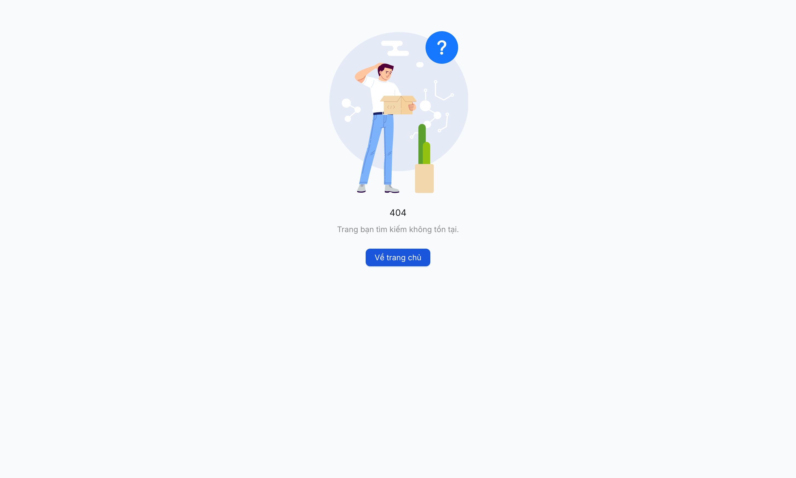

# Bug Report — Hỏi đáp Pháp lý (Functional T4.1)

| Thông tin | Giá trị |
|-----------|---------|
| **Dự án** | PM HTPLDN — Round 5 (Tuần 4) |
| **Môi trường** | http://103.172.236.130:3000/ |
| **Người test** | QA Automation (Claude Code MCP) |
| **Ngày** | 2026-04-29 |
| **Loại test** | Functional — T4.1 |
| **Round** | R5 — T4 Functional Day 1 |
| **Tài liệu tham chiếu** | [7.2-hoi-dap-phap-ly.md](../../../funtion/7.2-hoi-dap-phap-ly.md) · [srs-fr-02-hoi-dap.md](../../../../input/srs-v3/srs-fr-02-hoi-dap.md) |

---

## Tổng hợp

Phát hiện **1** lỗi có SRS reference cụ thể trong T4.1 Functional Hỏi đáp.

### Severity breakdown

| Tổng | Critical | Major | Medium | Minor | Trivial |
|------|----------|-------|--------|-------|---------|
| 1    | 1        | 0     | 0      | 0     | 0       |

## Bug Summary Table

| Bug ID | Severity | Priority | Type | TC Ref | **SRS Reference** | Title | Status |
|--------|----------|----------|------|--------|-------------------|-------|--------|
| BUG-FUNC-HOIDAP-001 | Critical | P0 | UI/UX | HD-034 | `SCR-II-02 row 19 (line 959)` `FR-II-NEW-02` | Chọn Mẫu phản hồi crash `<PhanHoiForm>` → 404 | Open |

> **Note:** Cross-reference R8 Open bug — BUG-FLOW-HOIDAP-004 (B6 Công khai 502, BE config Cổng PLQG `Invalid URL`) tiếp tục Open. T4.1 reproduce lại tại HD-015 (POST `/cong-khai` 502). Không log lại — xem [bug-report-flow-HOIDAP.md](bug-report-flow-HOIDAP.md).

---

## BUG-FUNC-HOIDAP-001 — Chọn Mẫu phản hồi crash form `<PhanHoiForm>` → 404 fallback

### Mô tả

CB NV xử lý ở state `DANG_XU_LY` mở form Soạn phản hồi và chọn 1 mẫu phản hồi từ dropdown "Chọn mẫu phản hồi" → component React `<PhanHoiForm>` throw `TypeError: Cannot read properties of undefined (reading 'length')` → React Router error boundary kick → trang chuyển sang 404 fallback dù URL không đổi (`/hoi-dap/<uuid>`).

API GET `/api/v1/mau-phan-hois/by-linh-vuc/<linh-vuc-uuid>` trả 200 — backend không lỗi. Crash xảy ra ở client khi prefill `noi_dung_mau` vào editor.

### Các bước tái hiện

1. Đăng nhập `cb_nv_tw_01` / `Secret@123` / OTP `666666`.
2. Tạo HD mới (lĩnh vực Lao động) → state `Mới` → click [Tiếp nhận] → state `Tiếp nhận` → click [Phân công] → chọn 1 CB → state `Đang xử lý`. Form Soạn phản hồi xuất hiện.
3. Click dropdown "Chọn mẫu phản hồi" → dropdown render `Mẫu phản hồi HD - Lao động` (1 option).
4. Click option → Quan sát: trang chuyển sang **404 "Trang bạn tìm kiếm không tồn tại."**

### Kết quả mong đợi

Theo `srs-fr-02-hoi-dap.md` SCR-II-02 row 19 (line 959):
> "Dropdown chen mau ... MAU_PHAN_HOI theo linh_vuc_id + don_vi_id theo đơn vị. Chon → **prefill noi_dung_mau vao editor** | change → prefill | khi soan phan hoi, DANG_XU_LY"

Khi chọn mẫu, trường `Nội dung phản hồi` phải được prefill với `noi_dung_mau` của template; form vẫn giữ nguyên, không crash, không navigate.

### Kết quả thực tế

- UI chuyển hoàn toàn sang 404 page (icon "No Found" + heading "404" + nút "Về trang chủ").
- URL giữ `/hoi-dap/<uuid>` nhưng React Router render ErrorBoundary fallback.
- 4 console error liên quan (sau warning về deprecated antd props):
  - `TypeError: Cannot read properties of undefined (reading 'length')`
  - `The above error occurred in the <PhanHoiForm> component. React will try to recreate this component tree from scratch using the error boundary you provided, RenderErrorBoundary.`
  - `React Router caught the following error during render TypeError: Cannot read properties of undefined (reading 'length')`
- BE response cho `GET /api/v1/mau-phan-hois/by-linh-vuc/6e673931-a2ca-4615-bafd-60c356d26775` trả 200 → bug ở FE component, không phải BE.
- User cần reload trang để tiếp tục soạn (mất state nếu chưa save).

### Bằng chứng

> **BẮT BUỘC khi gửi dev:** ảnh dưới là link tương đối — convert sang base64 inline trước khi gửi 1 file `.md` cho dev (memory rule `feedback_bug_report_embed_screenshot`). File gốc tại `image/bug-functional-HOIDAP-001-PhanHoiForm-crash.png`.



**Console errors (mcp__chrome-devtools__list_console_messages):**

```
[error] TypeError: Cannot read properties of undefined (reading 'length')
        The above error occurred in the <PhanHoiForm> component.
        React will try to recreate this component tree from scratch using the
        error boundary you provided, RenderErrorBoundary.
[error] React Router caught the following error during render
        TypeError: Cannot read properties of undefined (reading 'length')
```

**Network (BE OK, FE crash):**

```
reqid=222 GET http://103.172.236.130:3000/api/v1/mau-phan-hois/by-linh-vuc/6e673931-a2ca-4615-bafd-60c356d26775 [200]
```

### So sánh

Không áp dụng (không phải bug phân quyền).

---

## Phụ lục — Môi trường test

| Thành phần | Giá trị |
|------------|---------|
| URL ứng dụng | http://103.172.236.130:3000/ |
| OTP login | `666666` (bypass tạm) |
| MailHog (OTP inbox) | http://103.172.236.130:8025 |
| API base | http://103.172.236.130:3000/api/v1 |
| Frontend | React + Vite + Ant Design |
| Xác thực | JWT httpOnly cookie + OTP email |
| Tool test | Chrome DevTools MCP (primary từ 2026-04-21) |

---

*Bug report generated: 2026-04-29 18:00 (UTC+7) | QA Automation via Claude Code*
